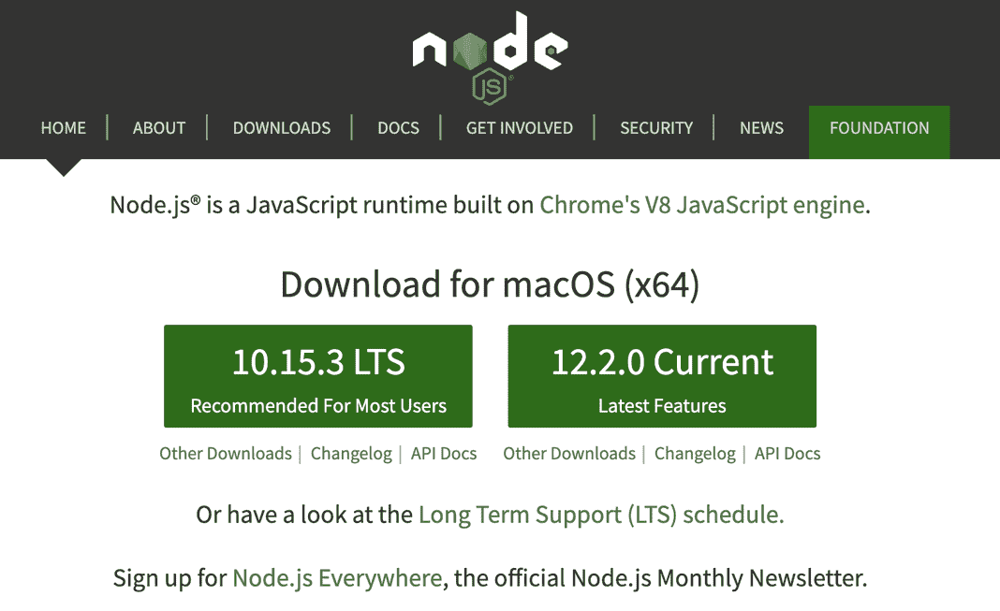
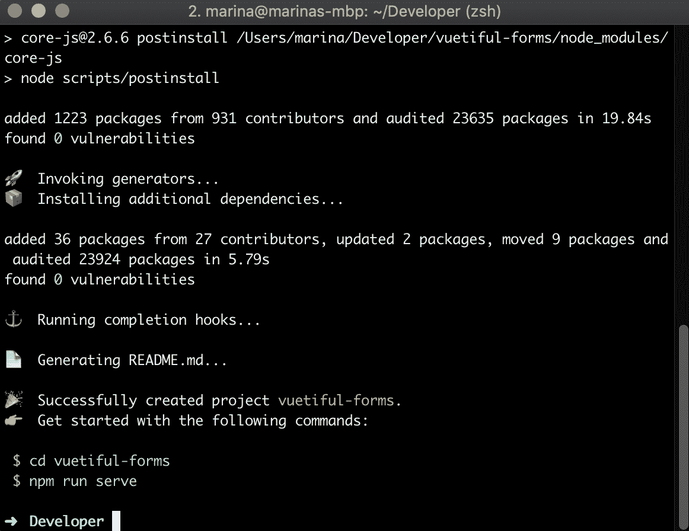
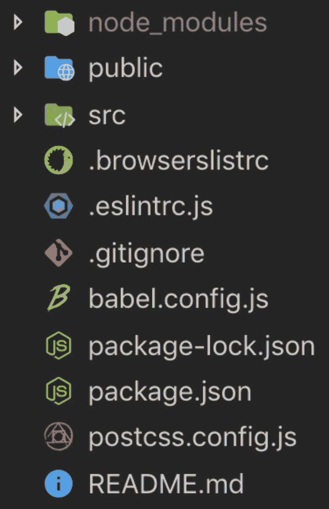

# 一、设置演示项目

每一个伟大的应用程序都是从一行代码开始的，前面还有很长的路要走，正如他们所说，我们应该从一开始就开始

在本书中，我们将使用 Vue CLI 3 来设置项目结构。Vue CLI 是一个快速构建 Vue 应用程序的神奇工具。Vue CLI 天生就是脚手架应用程序的入门工具。尽管还有其他令人惊叹的解决方案，如 Nuxt，但了解 Vue CLI 的基础知识将使您能够处理大多数项目。如果您以前没有使用过它，不要担心：我们将一起一步一步地深入安装

在本章中，我们将介绍以下主题：

*   在我们的计算机上安装 Vue CLI
*   创建我们的新项目
*   快速查看项目结构

# 技术要求

本章的要求如下：

*   您将需要一台能够访问终端程序（如苹果的终端或 Windows 的命令提示符）的计算机。
*   节点版本 8.9 或更高版本和**节点包管理器****npm**：本章将提供安装说明。
*   您将需要您喜欢的**集成开发环境**（**IDE**）。在[可以找到一个很棒的免费版本 https://code.visualstudio.com/](https://code.visualstudio.com/)

本章的代码文件可在以下 GitHub 存储库中找到：

[https://github.com/PacktPublishing/Building-Forms-with-Vue.js/tree/master/Chapter01](https://github.com/PacktPublishing/Building-Forms-with-Vue.js/tree/master/Chapter01) 。

请查看以下视频以查看代码的运行情况：

[http://bit.ly/2OXLxpg](http://bit.ly/2OXLxpg)

# 在我们的计算机上安装 Vue CLI

在撰写本文时，Vue CLI 具有节点版本 8.9 或更高版本的要求（建议使用 8.11.0+），因此我们需要确保您首先在开发计算机上设置了该版本。

要检查是否已安装，请执行以下步骤：

1.  打开终端（也称为命令行！）
2.  执行`node -v`命令

如果您得到一个带有版本标签的输出，那么您已经安装了它，并且您可以向前跳。

如果您还没有节点，请转到浏览器中的以下链接：[nodejs.org](https://nodejs.org/en/)*。*

您将看到一个主屏幕和两个大的绿色下载按钮。我们将使用标记为 Current 的，如以下屏幕截图所示：



因此，请继续单击按钮并按照您自己的操作系统的安装说明进行操作。

安装完成后，请确认一切正常工作：

1.  打开你的终端
2.  执行`node -v`命令

您应该获得类似于 v12.2.0 的输出，以验证节点是否已正确安装到您的系统中。

然而，要将 Vue CLI 安装到我们的系统中，我们仍然需要使用软件包管理器

现在，当您安装 Node 时，您实际上在您的系统上免费安装了一份`npm`。您可以通过在终端中键入`npm -v`来验证这一点，与之前一样，您将获得一个版本号作为输出

请注意，在撰写本文时，Vue CLI 需要节点版本 8.9 或更高版本（建议使用 8.11.0+版本），但请确保在阅读本书时查看以下链接以获取确切的版本号：[vuejs.org/guide/installation.html](https://vuejs.org/v2/guide/installation.html)。

最后，是时候实际启动并运行了。再次启动终端，然后运行以下命令：

```js
> npm install --global @vue/cli
```

终端将继续将所有必需的文件下载到您的计算机上，并将它们设置在全局可访问的路径中，以便您可以在计算机上的任何位置使用此 CLI 工具。整洁，对吗？

注意这个命令上的`--global`标志。这意味着您正在计算机上全局安装此软件包。简而言之，这意味着您将能够从文件系统中的任何位置使用这些命令，而无需导航到特定的文件夹。

为便于将来参考，您也可以使用`--global`的简写形式，即简单的`-g`。

再次，让我们通过在终端上运行`vue --version`来检查所有设备是否安装正确。您应该返回 Vue CLI 的版本号。

现在我们已经设置了 CLI，可以开始创建新项目了。在下一节中，我们将深入探讨如何做到这一点。

# 创建我们的新项目

导航到您选择的将保存项目文件的文件夹。别担心，我们不需要设置服务器、虚拟主机或诸如此类的东西。Vue CLI 实际上会在每次运行项目脚本时为我们设置一个开发服务器，因此您可以在任何地方创建它。

您现在要运行的命令是`vue create <name>`，其中`<name>`是您的项目名称和将要创建的文件夹。

我们将通过运行以下程序创建新项目：

```js
> vue create vuetiful-forms
```

命令的`vuetiful-forms`部分将命名项目文件夹。当然，您可以随意选择您认为最合适的名称。

运行此命令后，Vue CLI 将显示一个向导，可用于配置项目的设置方式：


我们将继续选择手动选择功能，因为我们想玩，看看我们可以切换和关闭哪些选项。请注意，我们在此作出的决定并非最终决定。以后可以添加或删除任何内容，所以不要担心！

第一个屏幕向我们展示了我们可以选择的不同功能和软件包：

1.  选择 Babel 和 Lint/Formatter，这是默认的两个选项。在本书的后面，我们将手动将 Vuex 添加到我们的项目中。
2.  点击空格键选择任何选项，然后按*回车*键进入下一屏幕。
3.  在 linter/formatter 配置屏幕中，使用仅具有错误预防功能的 ESLint 配置。
4.  在下一个屏幕上，我们将在保存时拾取皮棉。（如果您不喜欢自动起毛，请随意选择其他选项。）
5.  对于我们的配置，选择将其存储在专用配置文件中，以使我们的`package.json`文件尽可能整洁。
6.  最后，如果愿意，可以将其保存为将来项目的预设。

作为旁注，请注意，根据您所做的选择，您可能会看到与我在这里解释的配置不同的配置。

终端将再次开始工作，并在幕后为您的新项目创建项目结构：



使用这个易于操作的向导，您可以轻松地构建所有项目，但如果在此阶段未选择特定选项，则无需担心；Vue CLI 使以后添加和删除插件变得超级容易！让我们现在来看看我们的项目。

# 快速查看项目结构

继续，在您喜爱的代码编辑器中打开新的[T0]文件夹。如果您还没有用于开发的 IDE，您可以从[code.visualstudio.com](https://code.visualstudio.com/)*免费获得一个非常好的 IDE。*

您的项目结构将如以下屏幕截图所示：



以下是您可以在结构内部找到的内容的简要说明：

*   node_modules：它保存您的依赖项，即您可以使用`npm`安装或删除的代码包。
*   公共：此文件夹将保存`index.html`，当您导航到应用程序的 URL 时，您的 web 服务器将加载该文件夹。它需要的所有文件都将由 Vue 自动注入，因此您不必担心这里会发生什么。
*   src：您将在这里放置所有代码、组件、资产等。

在项目根目录上，您将看到一个配置文件，如用于 ESLint 配置的`.eslintrc.js`、用于 Git 的`.gitignore`、用于包管理的`package.json`和`package-lock.json`或`yarn.lock`文件，以及其他取决于您之前选择的文件。

这些文件用于更改每个服务的首选项，如果您没有调整它们的经验，则可以安全地忽略这些文件。

# 总结

至此，您已经了解了构建 Vue CLI 驱动的应用程序的所有基础知识，并初步了解了项目结构。

在下一章中，我们将启动并运行我们的项目，我们将开始使用实际的表单！