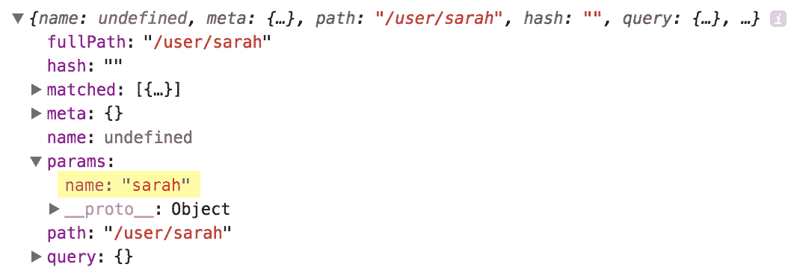

# 八、介绍 Vue 路由并加载基于 URL 的组件

在接下来的几章中，我们将创建一个商店界面。这家商店将结合我们到目前为止学到的一切，同时介绍更多的技术、插件和功能。我们将从 CSV 文件中检索产品列表，显示产品及其变体，并按制造商或标签过滤产品。我们还将考虑创建一个产品细节视图，并允许用户在其在线购物篮中添加和删除产品和产品变体，如尺寸或颜色。

所有这些都将使用 Vue、Vuex 和新的 Vue 插件 Vue 路由来实现。Vue 路由用于构建**单页应用**（**SPA**），并允许您将组件映射到 URL，或以`VueRouter`术语、路由和路径进行映射。这是一个非常强大的插件，可以处理 URL 处理所需的许多复杂细节。

本章将涵盖：

*   初始化 Vue 路由及其选项
*   使用 Vue 路由创建链接
*   基于 URL 创建动态路由以更新视图
*   使用带有 URL 的道具
*   嵌套和命名路由
*   如何使用 Vue router 以编程方式导航

# 安装和初始化 Vue 路由

与我们在应用中添加 Vue 和 Vuex 的方式类似，您可以直接从 unpkg 包含库，也可以转到以下 URL 并自行下载本地副本：[https://unpkg.com/Vue-router](https://unpkg.com/vue-router) 。将 JavaScript 与 Vue 以及应用的 JavaScript 一起添加到新的 HTML 文档中。创建应用容器元素和视图。在下面的示例中，我将 Vue 路由 JavaScript 文件保存为`router.js`：

```js
<!DOCTYPE html>
<html>
<head>
  <title></title>
</head>
<body>
  <div id="app"></div>

  <script type="text/javascript" src="js/vue.js"></script>
  <script type="text/javascript" src="js/router.js"></script>
  <script type="text/javascript" src="js/app.js"></script>
</body>
</html>
```

在应用 JavaScript 中初始化新的 Vue 实例：

```js
new Vue({
  el: '#app'
});
```

我们现在准备添加`VueRouter`并利用其力量。然而，在我们这样做之前，我们需要创建一些非常简单的组件，我们可以根据 URL 加载和显示这些组件。当我们将要用路由加载组件时，我们不需要向`Vue.component`注册它们，而是创建与 Vue 组件具有相同属性的 JavaScript 对象。

对于第一个练习，我们将创建两个主页和关于主页的页面。在大多数网站上都可以找到，这些可以帮助你了解什么东西在哪里、什么时候加载。在您的 HTML 页面中创建两个模板供我们使用：

```js
<script type="text/x-template" id="homepage">
  <div>
    <h1>Hello &amp; Welcome</h1>
    <p>Welcome to my website. Feel free to browse around.</p>
  </div>
</script>

<script type="text/x-template" id="about">
  <div>
    <h1>About Me</h1>
    <p>Lorem ipsum dolor sit amet, consectetur adipiscing elit. Vivamus sed metus magna. Vivamus eget est nisi. Phasellus vitae nisi sagittis, ornare dui quis, pharetra leo. Nullam eget tellus velit. Sed tempor lorem augue, vitae luctus urna ultricies nec. Curabitur luctus sapien elit, non pretium ante sagittis blandit. Nulla egestas nunc sit amet tellus rhoncus, a ultrices nisl varius. Nam scelerisque lacus id justo congue maximus. Etiam rhoncus, libero at facilisis gravida, nibh nisi venenatis ante, sit amet viverra justo urna vel neque.</p>
    <p>Curabitur et arcu fermentum, viverra lorem ut, pulvinar arcu. Fusce ex massa, vehicula id eros vel, feugiat commodo leo. Etiam in sem rutrum, porttitor velit in, sollicitudin tortor. Interdum et malesuada fames ac ante ipsum primis in faucibus. Donec ac sapien efficitur, pretium massa at, vehicula ligula. Vestibulum turpis quam, feugiat sed orci id, eleifend pretium urna. Nullam faucibus arcu eget odio venenatis ornare.</p>
  </div>
</script>
```

Don't forget to encapsulate all your content in one "root" element (represented here by the wrapping `<div>` tags). You also need to ensure you declare the templates *before* your application JavaScript is loaded.

我们创建了一个主页模板，其中的`id`为`homepage`，还有一个关于页面，其中包含*lorem ipsum*中的一些占位符文本，其中的`id`为`about`。在 JavaScript 中创建两个引用这两个模板的组件：

```js
const Home = {
  template: '#homepage'
};

const About = {
  template: '#about'
};
```

下一步是给路由一个占位符，以便在视图中呈现组件。这是通过使用自定义的`<router-view>`HTML 元素来完成的。使用此元素可以控制内容的渲染位置。并且允许我们在应用中使用正确的页眉或页脚来处理组件。

在应用中添加一个`header`、`main`和`footer`元素。在页眉给自己一个徽标，在页脚给自己一个学分；在`main`HTML 元素中，放置`router-view`占位符：

```js
<div id="app">
  <header>
    <div>LOGO</div>
  </header>

  <main>
    <router-view></router-view>
  </main>

  <footer>
    <small>© Myself</small>
  </footer>
</div>
```

应用视图中的所有内容都是可选的，除了`router-view`，但它让您了解如何将 router HTML 元素实现到站点结构中。

下一步是初始化 Vue 路由并指示 Vue 使用它。创建一个新的`VueRouter`实例，并将其添加到`Vue`实例中，类似于我们在上一节中添加`Vuex`的方式：

```js
const router = new VueRouter();

new Vue({
  el: '#app',

  router
});
```

我们现在需要告诉路由我们的路由（或路径），以及当它遇到每一条路由时应该加载什么组件。在 Vue 路由实例内创建一个对象，键为`routes`，值为数组。此阵列需要为每个路由包含一个对象：

```js
const router = new VueRouter({
  routes: [
    {
 path: '/',
 component: Home
 },
 {
```

```js
 path: '/about',
 component: About
 }
  ]
});
```

每个路由对象包含一个`path`和`component`键。`path`是您要加载`component`的 URL 字符串。Vue 路由根据先到先得的原则提供组件。例如，如果有多条路由具有相同的路径，则使用遇到的第一条路由。确保每个路由都有开始斜杠，这会告诉路由它是根页而不是子页，我们将在本章后面介绍子页。

按 save 并在浏览器中查看您的应用。应该向您展示`Home`模板组件的内容。如果您观察 URL，您会注意到在页面加载时，路径后面会附加一个哈希和正斜杠（`#/`。这是路由创建浏览组件和利用地址栏的方法。如果您将其更改为第二条路线的路径`#/about`，您将看到`About`组件的内容。

Vue 路由还能够使用 JavaScript 历史 API 创建更漂亮的 URL。例如，`yourdomain.com/index.html#about`将变成`yourdomain.com/about`。通过将`mode: 'history'`添加到您的`VueRouter`实例中激活：

```js
const router = new VueRouter({
  mode: 'history',

  routes: [
    {
      path: '/',
      component: Home
    },
    {
      path: '/about',
      component: About
    }
  ]
});
```

但是，它还需要一些服务器配置来捕获所有请求并将它们重定向到您的`index.html`页面，这超出了本书的范围，但在 Vue 路由文档中有详细介绍。

# 更改 Vue 路由的文件夹

在某些情况下，您可能希望在网站的子文件夹中托管 Vue 应用。在本例中，您需要声明项目的基本文件夹，以便 Vue router 可以构造并侦听正确的 URL

例如，如果你的应用基于一个`/shop/`文件夹，你可以在 Vue 路由实例上使用`base`参数声明它：

```js
const router = new VueRouter({
  base: '/shop/',

  routes: [
    {
      path: '/',
      component: Home
    },
    {
      path: '/about',
      component: About
    }
  ]
});
```

该值的开头和结尾都需要斜杠。

除了`base`之外，Vue 路由还有其他几种配置选项，值得您熟悉，因为它们可能会解决您以后遇到的问题。

# 连接到不同的路线

随着路由按预期工作，我们现在可以继续向应用添加链接，允许用户在网站上导航。链接可以通过两种方式实现：我们可以使用传统的`<a href="#/about">`标记，或者我们可以使用`<router-link to="/about">`路由提供的新 HTML 元素。当使用 router link 元素时，它的工作原理与`<a>`标记相同，事实上在浏览器中运行时会转换为一个标记，但允许更多的定制和与路由的集成。

强烈建议尽可能使用`router-link`元素，因为它比标准链接具有以下几个优点：

*   **模式变化**：第一个优势是与路由的`mode`相关。使用路由链接可以更改路由的模式，比如从哈希到历史，而不必更改应用中的每个链接。
*   **CSS 类**：使用路由链接的另一个优势是 CSS 类可以应用于“树”中活动的链接和当前正在查看的页面。树中的链接是父页面，也包括根页面（例如，指向“`/`”的任何链接将始终具有活动类）。这是使用路由的最大好处之一，因为手动添加和删除这些类需要复杂的编码。这些类可以定制，我们将在稍后进行。
*   **URL 参数和命名路由**：使用 router 元素的另一个优点是它比使用命名路由和传递 URL 参数更强大。这还允许您为页面的 URL 提供一个真实来源，并使用名称和快捷方式引用路由。有关这方面的更多信息将在本章后面介绍。

将链接添加到视图中的页面，以便在页面之间导航。在网站的`<header>`中，创建一个包含无序列表的新`<nav>`元素。对于每个页面，添加一个新的列表项，其中包含一个`router-link`元素。向链接路径添加一个`to`属性：

```js
<nav>
  <ul>
    <li>
      <router-link to="/">Home</router-link>
    </li>
    <li>
      <router-link to="/about">About</router-link>
    </li>
  </ul>
</nav>
```

在浏览器中查看应用时，应显示两个链接，允许您在两个内容页之间切换。您还会注意到，通过单击链接，URL 也会更新。

如果使用浏览器的 HTML 检查器检查链接，您将注意到 CSS 类中的更改。主页链接将始终有一个`router-link-active—`类，这是因为它本身是活动的，或者它有一个活动的子级，例如 About 页面。在两个页面之间导航时，会添加和删除另一个 CSS 类-`router-link-exact-active`。此*仅*应用于当前活动页面上的链接。

让我们自定义应用于视图的类。转到 JavaScript 中路由的初始化，并向对象添加两个新键-`linkActiveClass`和`linkExactActiveClass`：

```js
const router = new VueRouter({
  routes: [
    {
      path: '/',
      component: Home
    },
    {
      path: '/about',
      component: About
    }
  ],

  linkActiveClass: 'active',
 linkExactActiveClass: 'current'
});
```

这些键应该是不言自明的，但是`linkExactActiveClass`应用于当前页面，即正在查看的页面，而`linkActiveClass`是当页面或其子页面之一处于活动状态时应用的类。

# 连接到子路线

有时您可能希望有指向子页面的链接。例如`/about/meet-the-team`。幸运的是，不需要太多的工作就可以让它正常工作。在`routes`数组中创建一个新对象，用模板指向一个新组件：

```js
const router = new VueRouter({
  routes: [
    {
      path: '/',
      component: Home
    },
    {
      path: '/about',
      component: About
    },
    {
 path: '/about/meet-the-team',
 component: MeetTheTeam
 }
  ],

  linkActiveClass: 'active',
  linkExactActiveClass: 'current'
});  
```

导航到此页面时，您会注意到主页和关于链接都有`active`类，我们创建的`current`类也没有。如果您要在导航中创建指向此页面的链接，则`current`类将应用于该链接。

# 带参数的动态路由

Vue 路由可以轻松地让您拥有动态 URL。动态 URL 允许您在使用同一模板时使用同一组件显示不同的数据。这方面的一个例子是一个商店，其中所有类别页面看起来都一样，但根据 URL 显示不同的数据。另一个例子是一个产品详细信息页面，您不想为每个产品创建一个组件，因此，您可以使用一个带有 URL 参数的组件。

URL 参数可以出现在路径中的任何位置，可以有一个或多个。每个参数都分配了一个键，因此可以一致地创建和访问它。我们将在[第 9 章](08.html)*中详细介绍动态路由和参数，使用 Vue 路由动态路由加载数据*。现在，我们将构建一个基本示例。

在我们开始创建组件之前，让我们检查一个新的变量-`this.$route`。与使用 Vuex 访问全局存储的方式类似，此变量允许我们访问有关路由、URL 和参数的大量信息。

在 Vue 实例中，作为测试，添加一个`mounted()`函数。在`console.log`内插入`this.$route`参数：

```js
new Vue({
  el: '#app',

  router,
  mounted() {
 console.log(this.$route);
 }
});
```

如果打开浏览器并查看开发人员工具，您应该会看到正在输出的对象。查看此对象将显示多个信息位，例如路径和与当前路径匹配的组件。指向`/about`URL 的标题将显示有关对象的不同信息：


让我们创建一个使用此对象参数的组件。在路由数组中创建新对象：

```js
const router = new VueRouter({
  routes: [
    {
      path: '/',
      component: Home
    },
    {
      path: '/about',
      component: About
    },
    {
 path: '/user/:name',
 component: User
 }
  ],

  linkActiveClass: 'active',
  linkExactActiveClass: 'current'
}); 
```

你会注意到与此路径不同的是路径中`name`前面的冒号。这会告诉 Vue router URL 的这部分是动态的，但该部分的变量名为`name`。

现在创建一个名为`User`的新组件，并为其创建一个模板。对于本例，我们的模板将是内联的，我们将使用 ES2015 模板语法。这将使用反标记，并允许将变量和新行直接传递到模板中，而无需转义：

```js
const User = {
  template: `<h1>Hello {{ $route.params.name }}</h1>`
};
```

模板中输出的变量来自全局路由实例，是 parameters 对象中的`name`变量。变量`name`引用`routes`数组中路由路径中冒号前面的变量。在组件模板中，我们还可以从`$route`中省略`this`变量。

返回浏览器，在 URL 末尾输入`#/user/sarah`。你应该在网页的主体部分看到 Hello sarah。查看 JavaScript 浏览器控制台，您应该看到`params`对象中有一个`name: sarah`键/值对：



我们也可以在组件本身中使用此变量。例如，如果我们想大写用户名的第一个字母，我们可以制作一个计算变量，该变量接受 route 参数并对其进行转换：

```js
const User = {
  template: `<h1>Hello {{ name }}</h1>`,

  computed: {
 name() {
 let name = this.$route.params.name;
 return name.charAt(0).toUpperCase() + name.slice(1);
 }
 }
};
```

如果您不熟悉前面的代码所做的工作，那么它将使用字符串的第一个字符并将其变为大写。然后在第一个字符（即单词的其余部分）后拆分字符串，并将其附加到大写字母上。

添加此`computed`功能并刷新应用将生成 Hello sarah

如上所述，路由可以接受任意多个参数，并且可以由静态或动态变量分隔

将路径更改为以下内容（同时保持组件名称不变）：

```js
/:name/user/:emotion
```

这意味着您需要转到`/sarah/user/happy`以查看用户组件。但是，您可以访问名为`emotion`的新参数，这意味着您可以使用以下模板呈现 sarah is happy！：

```js
const User = {
  template: `<h1>{{ name }} is {{ $route.params.emotion }}</h1>`,

  computed: {
    name() {
      let name = this.$route.params.name;
      return name.charAt(0).toUpperCase() + name.slice(1);
    }
  }
};

const router = new VueRouter({
  routes: [
    {
      path: '/',
      component: Home
    },
    {
      path: '/about',
      component: About
    },
    {
 path: '/:name/user/:emotion',
      component: User
    }
  ],

  linkActiveClass: 'active',
  linkExactActiveClass: 'current'
});
```

当我们在接下来的几章中建立我们的店铺时，动态路线将派上用场，因为我们将在产品和类别中使用它。

# 获取参数

除了动态路由，Vue 路由以一种非常简单的方式处理 GET 参数。GET 参数是可以传递到显示为键/值对的网页的额外 URL 参数。对于 GET 参数，第一个参数前面有一个`?`——这告诉浏览器需要参数。任何其他参数都由一个符号和分隔。例如：

```js
example.com/?name=sarah&amp;emotion=happy
```

此 URL 将产生`sarah`作为`name`的值，`happy`作为`emotion`的值。它们通常用于过滤或搜索下次你在谷歌上搜索时，看看 URL，你会注意到地址栏中的`?q=Your+search+query`。

Vue router 在`this.$route`变量的`query`对象中为开发人员提供这些参数。尝试将`?name=sarah`添加到 URL 的末尾，并打开 JavaScript 开发工具。检查查询对象将显示一个以`name`为键、`sarah`为值的对象：


当我们在商店类别中构建过滤时，我们将使用查询对象。

# 使用道具

虽然直接在组件内使用路由参数可以很好地工作，但这不是一种好的做法，因为它将组件直接绑定到路由。相反，`props`应该以相同的方式使用，我们在本书前面的 HTML 组件中使用了它们。启用并声明后，通过 URL 传入的参数就可以使用，就好像它是通过 HTML 属性传入的一样。

为路线组件使用道具是将选项和参数传递到路线中的更好方法，因为它有很多好处。首先，它将组件与特定的 URL 结构分离，正如您将看到的，我们可以将道具直接传递给组件本身。它也有助于使您的路线组件更清晰；传入的参数在组件本身中清楚地布局，代码在整个组件中更清晰

道具仅适用于动态路线，而 GET 参数仍然可以通过前面的技术访问。

使用前面的示例，为`name`和`emotion`参数声明`props`。使用基于 URL 的变量时，您需要使用`String`数据类型：

```js
const User = {
  template: `<h1>{{ name }} is {{ $route.params.emotion }}</h1>`,
  props: {
 name: String,
 emotion: String
 },
  computed: {
    name() {
      let name = this.$route.params.name;
      return name.charAt(0).toUpperCase() + name.slice(1);
    }
  }
};
```

我们现在通过`props`和计算值两次获得`this.name`。但是，由于我们通过`props`有`this.name`和`this.emotion`，我们可以更新组件以使用这些变量，而不是`$route`参数。

为避免与道具冲突，更新要调用的计算函数`formattedName()`。我们还可以从函数中删除变量声明，因为新变量更具可读性：

```js
const User = {
  template: `<h1>{{ formattedName }} is {{ this.emotion }}</h1>`,
  props: {
    name: String,
    emotion: String
  },
  computed: {
    formattedName() {
      return this.name.charAt(0).toUpperCase() + this.name.slice(1);
    }
  }
};
```

在`props`工作之前，需要告知 Vue 路由将其用于特定的路由。这是在`routes`阵列内逐个路由启用的，最初设置为`props: true`值：

```js
const router = new VueRouter({
  routes: [
    {
      path: '/',
      component: Home
    },
    {
      path: '/about',
      component: About
    },
    {
      path: '/:name/user/:emotion',
      component: User,
      props: true
    }
  ],

  linkActiveClass: 'active',
  linkExactActiveClass: 'current'
});
```

# 设置道具默认值

由于路由参数现在可用为`props`，这为我们提供了轻松创建默认值的灵活性。如果我们想让一个参数成为可选的，我们需要添加几个`if()`语句来检查变量的存在

然而，使用道具，我们可以像前面那样声明默认值。为情感变量添加默认值：

```js
const User = {
  template: `<h1>{{ formattedName }} is {{ this.emotion }}</h1>`,
  props: {
    name: String,
    emotion: {
 type: String,
 default: 'happy'
 }
  },
  computed: {
    formattedName() {
      return this.name.charAt(0).toUpperCase() + this.name.slice(1);
    }
  }
};
```

我们现在可以在路由中创建一个新路由，它使用相同的组件，而不使用最终变量。别忘了为新路线启用`props`：

```js
const router = new VueRouter({
  routes: [
    {
      path: '/',
      component: Home
    },
    {
      path: '/about',
      component: About
    },
    {
 path: '/:name/user',
 component: User,
 props: true
 }, 
    {
      path: '/:name/user/:emotion',
      component: User,
      props: true
    }
  ],

  linkActiveClass: 'active',
  linkExactActiveClass: 'current'
});
```

现在，通过访问`/sarah/user`，我们应该看到一段文字，表明 sarah 很高兴。

# 使用静态道具

除了布尔值外，管线中的 props 参数还可以接受包含要传递的 props 列表的对象。这允许您利用相同的组件并基于 URL 更改其状态，而无需通过路径传递变量（例如，如果您想要激活或停用模板的一部分）。

When passing the props object in via the URL, it overwrites the whole props object, meaning you either have to declare none or all of them. The props variables will also take priority over the dynamic, URL-based variables.

更新新的`/:name/user`路径，将`props`包含在路由中-从路径中删除`:name`变量，使其成为`/user`：

```js
const router = new VueRouter({
  routes: [
    {
      path: '/',
      component: Home
    },
    {
      path: '/about',
      component: About
    },
    {
      path: '/user',
      component: User,
      props: {
 name: 'Sarah',
 emotion: 'happy'
 }
    }, 
    {
      path: '/:name/user/:emotion',
      component: User,
      props: true
    }
  ],

  linkActiveClass: 'active',
  linkExactActiveClass: 'current'
});
```

导航到`/user`应该会显示与之前相同的句子。在某些情况下，传递`props`“幕后”（不使用 URL）非常理想，因为您可能不希望用户共享特定 URL 或根据容易更改的参数更改应用的状态。

# 嵌套路由

嵌套路由与子路由不同，因为它们存在于组件中，该组件已经匹配路由的开始部分。这允许您在现有视图中显示不同的内容。

Twitter 就是一个很好的例子。如果您访问 Twitter 用户的个人资料页面，您可以查看他们在跟踪谁、跟踪谁以及他们创建了哪些列表。如果在浏览页面时观察 URL，您会注意到一个重复出现的模式：用户名后跟不同的页面。嵌套路由和子路由之间的区别在于，嵌套路由允许您在不同的子页面（例如，标题和边栏）中保持组件相同。

这样做的好处是，用户可以将链接添加到书签中并共享，这使得页面更容易访问，并且有利于 SEO。使用简单的切换或选项卡框在视图中显示不同的内容，这些优点都不容易实现。

要将 Twitter 模式复制到 Vue 路由中，如下所示：

```js
https://twitter.com/:user/:page
```

如果我们要用前面的 route 方法创建它，我们必须为每个页面构建组件，这些组件在模板的侧栏中包含标题和用户信息，如果您需要更新代码，这将是一件痛苦的事情！

让我们为 About 页面创建一些嵌套路由。我们不会在商店应用中使用嵌套路由，但了解 Vue 路由的功能非常重要。

创建两个新组件-`AboutContact`，它将显示联系人信息，以及`AboutFood`，一个将详细说明您喜欢吃的食物的组件！虽然不是必需的，但最好在组件名称中保留对父组件的引用（在本例中为 About），这样可以在以后查看组件时将它们联系在一起！为每个组件提供一个包含一些固定内容的模板：

```js
const AboutContact = {
  template: `<div>
    <h2>This is some contact information about me</h2>
    <p>Find me online, in person or on the phone</p>
  </div>`
};

const AboutFood = {
  template: `<div>
    <h2>Food</h2>
    <p>I really like chocolate, sweets and apples.</p>
  </div>`
};
```

下一步是在`#about`模板中为要渲染的嵌套管线创建占位符。该元素与我们在`<router-view>`元素之前看到的元素完全相同。若要演示可以将其放置在任何位置，请将其添加到模板中的两个段落之间：

```js
<script type="text/x-template" id="about">
  <div>
    <h1>About Me</h1>
    <p>Lorem ipsum dolor sit amet, consectetur adipiscing elit. Vivamus sed metus magna. Vivamus eget est nisi. Phasellus vitae nisi sagittis, ornare dui quis, pharetra leo. Nullam eget tellus velit. Sed tempor lorem augue, vitae luctus urna ultricies nec. Curabitur luctus sapien elit, non pretium ante sagittis blandit. Nulla egestas nunc sit amet tellus rhoncus, a ultrices nisl varius. Nam scelerisque lacus id justo congue maximus. Etiam rhoncus, libero at facilisis gravida, nibh nisi venenatis ante, sit amet viverra justo urna vel neque.</p>

    <router-view></router-view>

    <p>Curabitur et arcu fermentum, viverra lorem ut, pulvinar arcu. Fusce ex massa, vehicula id eros vel, feugiat commodo leo. Etiam in sem rutrum, porttitor velit in, sollicitudin tortor. Interdum et malesuada fames ac ante ipsum primis in faucibus. Donec ac sapien efficitur, pretium massa at, vehicula ligula. Vestibulum turpis quam, feugiat sed orci id, eleifend pretium urna. Nullam faucibus arcu eget odio venenatis ornare.</p>
  </div>
</script>
```

在浏览器中查看“关于”页面不会呈现任何内容，也不会破坏应用。下一步是将这些组件的嵌套路由添加到路由。我们没有将它们添加到顶层`routes`数组中，而是在`/about`路由中创建一个键为`children`的数组。此数组的语法是主数组（即路由对象数组）的精确副本。

为每个包含`path`和`component`键的`routes`添加一个对象。要注意的是，如果希望将路径添加到父路径的末尾，则路径不应以`/`开头。

例如，如果您希望 URL 为`/about/contact`来呈现`AboutContact`组件，您可以将 route 组件设置为如下所示：

```js
const router = new VueRouter({
  routes: [
    {
      path: '/',
      component: Home
    },
    {
      path: '/about',
      component: About,
      children: [
 {
 path: 'contact', 
 component: AboutContact
 }, 
 {
 path: 'food', 
 component: AboutFood
 }
 ]
    }
  ],

  linkActiveClass: 'active',
  linkExactActiveClass: 'current'
});
```

但是，如果您希望 URL 只是`/contact`，但仍然呈现`About`组件中的`AboutContact`组件，则可以添加前面的斜杠。尝试在不使用斜杠的情况下查看应用，然后添加斜杠，以查看其区别。如果您希望在加载父应用时显示子路由，而不显示 URL 的第二部分，则可以使用空路径-`path: ''`。

现在，不使用斜杠，添加前面的`children`数组。转到浏览器并导航到“关于”页面。将`/contact`或`/food`添加到 URL 的末尾，注意新内容将取代您先前添加到模板中的`<router-link>`元素

可以从任何地方创建指向这些组件的链接，其方式与链接主页和“关于”页面的方式相同。您可以将它们添加到`about`模板中，使其仅在导航到该页面时显示，也可以将它们添加到应用视图中的主导航中。

# 创建 404 页面

在构建应用或网站时，尽管有良好的意图，但问题、问题和错误确实会发生。因此，将错误页面设置到位是一个好主意。最常见的页面是 404 页面——链接不正确或页面移动时显示的消息。404 是未找到页面的官方 HTTP 代码。

如前所述，Vue 路由将根据先到先得原则匹配路由。我们可以通过使用通配符（`*`字符）作为最后一条路由来利用这一点。由于通配符匹配*每个*路由，因此只有未匹配前一个路由的 URL 才会被此路由捕获。

使用简单模板创建一个名为`PageNotFound`的新组件，并添加一个使用通配符作为路径的新路由：

```js
const PageNotFound = {
 template: `<h1>404: Page Not Found</h1>`
};

const router = new VueRouter({
  routes: [
    {
      path: '/',
      component: Home
    },
    {
      path: '/about',
      component: About,
      children: [
        {
          path: 'contact', 
          component: AboutContact
        }, 
        {
          path: 'food', 
          component: AboutFood
        }
      ]
    },
 {
 path: '*', 
 component: PageNotFound
 }
  ],

  linkActiveClass: 'active',
  linkExactActiveClass: 'current'
});
```

在浏览器中打开应用，在 URL 末尾键入任何内容（除了`about`），然后按*输入*-您应该会看到 404 标题。

Although this is simulating a page not found request, it is not actually sending the correct HTTP code to the browser. If you are using a Vue web app in production it is a good idea to set up server-side error checking, so in the instance of an incorrect URL the browser can be correctly notified.

# 命名构件、管线和视图

在使用`Vue-router`时，不需要为路线和组件添加名称，但这是一种很好的做法，也是一种很好的习惯。

# 命名组件

具有名称的组件允许您更轻松地调试错误。在 Vue 中，当组件抛出 JavaScript 错误时，它将为您提供该组件的名称，而不是将`Anonymous`列为组件。

例如，如果您试图在食品成分 1 中输出一个不可用的变量`{{ test }}`。默认情况下，JavaScript 控制台错误如下所示：


注意堆栈中的两个`<Anonymous>`组件。

通过向组件添加名称，我们可以轻松确定问题所在。在以下示例中，`About`和`AboutFood`组件都添加了名称：


您可以很容易地看到错误在`<AboutFood>`组件中。

向组件添加名称就像向对象添加名称键一样简单，将名称作为值。这些名称遵循与我们创建 HTML 元素组件时相同的规则：不允许使用空格，但允许使用连字符和字母。为了快速识别代码，我选择将组件命名为定义它的变量：

```js
const About = {
  name: 'About',
  template: '#about'
};

const AboutFood = {
  name: 'AboutFood',
  template: `<div>
    <h2>Food</h2>
    <p>I really like chocolate, sweets and apples.</p>
  </div>`
}
```

# 命名路线

使用`VueRouter`时，您可以命名的另一个对象是路由本身。这使您能够简化路由的位置并更新路径，而无需查找和替换应用中的所有实例。

将`name`键添加到您的`routes`，如下例所示：

```js
const router = new VueRouter({
  routes: [
    {
      path: '/',
      component: Home
    },
    {
      path: '/about',
      component: About,
      children: [
        {
          name: 'contact',
          path: 'contact', 
          component: AboutContact
        }, 
        {
          name: 'food',
          path: 'food', 
          component: AboutFood
        }
      ]
    },
    {
      path: '*', 
      component: PageNotFound
    }
  ],

  linkActiveClass: 'active',
  linkExactActiveClass: 'current'
});
```

您现在可以在创建`router-link`组件时使用该名称，如下所示：

```js
<router-link :to="{name: 'food'}">Food</router-link>
```

注意，`to`属性前面的冒号。这确保了内容被解析为对象，而不是文本字符串。使用命名路由的另一个优点是能够将特定属性传递给我们的动态路径。使用本章前面的示例，我们可以以编程方式构建 URL，将数据从路径构造中抽象出来。这就是名为`routes`真正属于他们自己的地方。假设我们有以下路径：

```js
{ name: 'user', path: '/:name/user/:emotion', component: User }
```

我们需要将 name 和 emotion 变量传递到 URL，以便组件呈现。我们可以像以前一样直接传递到 URL，或者使用带有命名路由的`to`对象表示法：

```js
<router-link :to="{name: 'user', params: { name: 'sarah', emotion: 'happy' }}">
  Sarah is Happy
</router-link>
```

在浏览器中查看此项将显示锚定链接已正确生成：

```js
/sarah/user/happy
```

这使我们能够灵活地使用变量重新排列 URL，而无需更新应用的其余部分。如果您想在 URL 的末尾传递参数（例如，`?name=sarah`，可以将`params`键更改为`query`，因为它的格式相同：

```js
<router-link :to="{name: 'user', query: { name: 'sarah', emotion: 'happy' }}">
  Sarah is Happy
</router-link>
```

将路径重新配置为不接受参数后，将生成以下链接：

```js
/user?name=sarah&amp;emotion=happy
```

Be careful when interchanging `params` and `query` - as they can affect whether you use `path` or `name`. When using `path`, the `params` object will be ignored, whereas the `query` one will not. To use the `params` object, you need to use a named route. Alternatively, pass the parameters into the `path` with the `$` variable.

# 命名视图

Vue router 还允许您命名视图，让您将不同的组件传递到应用的不同部分。这方面的一个例子可能是一个商店，其中有一个侧边栏和主要内容区域。不同的页面可能以不同的方式使用这些区域。

About 页面可以使用主内容显示 About 内容，同时使用侧边栏显示联系人详细信息。然而，商店页面将使用主要内容列出产品，并使用边栏显示过滤器。

为此，创建第二个`router-view`元素作为原始元素的同级元素。保留原来的一个，但为第二个添加一个`name`属性，并带有适当的标题：

```js
<main>
  <router-view></router-view>
</main>

<aside>
    <router-view name="sidebar"></router-view>
</aside>
```

在路由实例中声明路由时，我们现在将使用一个新密钥`components`，并删除以前的单数`component`密钥。这将接受具有视图名称和组件名称的键值对的对象。

It's advisable to leave your main route unnamed, so you don't need to update every route. If you decide to name your main route, you would be required to do this next step for every route in your app.

更新`About`路由以使用此新密钥并将其变成对象。下一步是告诉代码每个组件将去哪里。

使用默认值作为键，将`About`组件设置为值。这会将 About 组件中的内容放在未命名的`router-view`中，这是主组件。这也是使用单数`component`键的缩写：

```js
const router = new VueRouter({
  routes: [
    {
      path: '/',
      component: Home
    },
    {
      path: '/about',
      components: {
 default: About
 }
    },
    {
      path: '*', 
      component: PageNotFound
    }
  ],

  linkActiveClass: 'active',
  linkExactActiveClass: 'current'
});
```

接下来，添加第二个键值，指定第二个路由视图的名称`sidebar`。在导航到`/about`URL 时，命名要填充此区域的组件。为此，我们将使用`AboutContact`组件：

```js
const router = new VueRouter({
  routes: [
    {
      path: '/',
      component: Home
    },
    {
      path: '/about',
      components: {
        default: About,
        sidebar: AboutContact
      }
    },
    {
      path: '*', 
      component: PageNotFound
    }
  ],

  linkActiveClass: 'active',
  linkExactActiveClass: 'current'
});
```

在浏览器中运行应用将呈现两个组件，联系人组件的内容将显示在侧栏中。

# 以编程方式导航、重定向和添加别名

在构建应用时，可能存在需要一些不同导航技术的情况。这些可能是以编程方式导航的，例如在组件或主 Vue 实例中导航，在用户点击特定 URL 时重定向用户，或者使用各种 URL 加载同一组件。

# 以编程方式导航

您可能希望通过代码、组件或操作更改路径、URL 或用户流。这方面的一个例子可能是在用户添加项目后将其发送到购物篮。

为此，在路由实例上使用一个`push()`函数。push 的值可以是直接 URL 的字符串，也可以接受对象以传递命名路由或路由参数。`push`函数允许的内容与`router-link`元素上的`to=""`属性完全相同。例如：

```js
const About = {
  name: 'About',
  template: '#about',
  methods: {
    someAction() {
      /* Some code here */

      // direct user to contact page
      this.$router.push('/contact');
    }
  }
};
```

或者，您可以使用以下参数指向命名管线：

```js
this.$router.push({name: 'user', params: { name: 'sarah', emotion: 'happy' }});
```

# 重定向

使用`VueRouter`重定向相当简单。重定向的一个例子可能是将`/about`页面移动到`/about-us`URL。你需要将第一个 URL 重定向到第二个 URL，以防有人共享或为你的链接添加书签，或者搜索引擎缓存了该 URL。

您可能会尝试创建一个基本组件，该组件在创建时使用`router.push()`函数将用户发送到新的 URL。

相反，您可以添加路由并在其中指定重定向：

```js
const router = new VueRouter({
  routes: [
    {
      path: '/',
      component: Home
    },
    {
 path: '/about',
 redirect: '/about-us'
 },
    {
      path: '/about-us',
      component: About
    },
    {
      path: '*', 
      component: PageNotFound
    }
  ],

  linkActiveClass: 'active',
  linkExactActiveClass: 'current'
});
```

同样，重定向键的内容可以是文本字符串，也可以是类似于`push()`函数的对象。如上所述，如果用户访问`/about`，他们将立即被重定向到`/about-us`并显示`About`组件。

# 别名路由

在某些情况下，您可能希望在两个 URL 下显示相同的组件。虽然不建议将其作为标准做法，但在某些边缘情况下需要这样做。

别名密钥被添加到现有路由中，并且只接受路径字符串。使用前面的示例，下面将显示`About`组件，无论用户访问`/about`还是`/about-us`：

```js
const router = new VueRouter({
  routes: [
    {
      path: '/',
      component: Home
    },
    {
      path: '/about',
 alias: '/about-us',
      component: About,
    },
    {
      path: '*', 
      component: PageNotFound
    }
  ],

  linkActiveClass: 'active',
  linkExactActiveClass: 'current'
});
```

# 总结

现在，您应该熟悉 Vue 路由、如何初始化它、可用的选项以及如何创建静态和动态的新路由。在接下来的几章中，我们将开始创建店铺，首先加载一些店铺数据并创建一个产品页面。