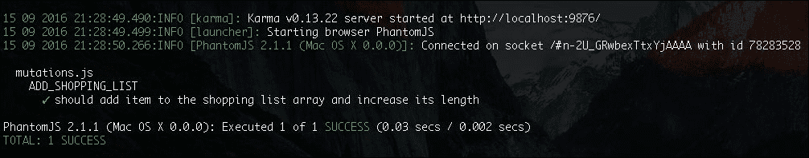
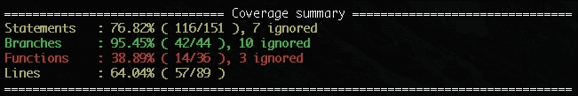
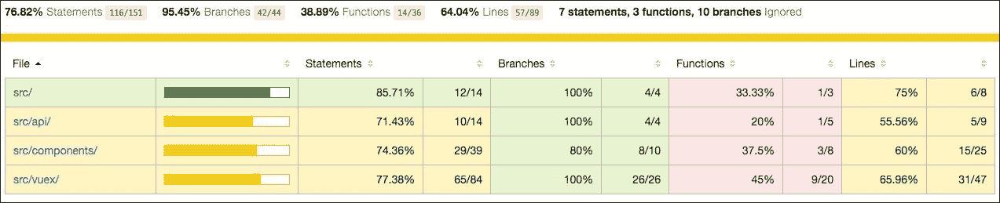
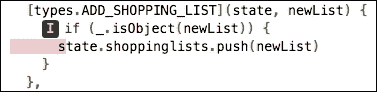

# 七、测试——是时候测试一下我们目前所做的东西了！

在上一章中，您学习了如何使用和创建 Vue 插件。我们使用了 Vue 现有的`resource`插件，并创建了我们自己的`NoiseGenerator`插件。

在本章中，我们将确保 Pomodoro 和购物清单应用的质量。我们将应用不同的测试技术测试这些应用。首先，我们将对 Vue 组件和 Vuex 相关代码（如操作、突变和 getter）执行经典的单元测试。之后，我们将学习如何使用 Nightwatch 执行端到端测试。因此，在本章中，我们将做以下工作：

*   谈谈单元测试和端到端测试的重要性
*   为 Pomodoro 和购物清单应用执行单元测试
*   了解如何在单元测试中模拟服务器响应
*   使用 Nightwatch 为两个应用实施端到端测试

# 为什么要进行单元测试？

在开始编写单元测试之前，让我们试着理解编写单元测试所要达到的目的。为什么单元测试如此重要？有时候，当我编写测试时，我唯一能想到的就是我的代码覆盖率；我想达到 100%的水平。

代码覆盖率是一个非常重要的指标，有助于理解代码流和需要测试的内容。但它不是单元测试质量的度量标准。这不是良好代码质量的指标。您可以 100%覆盖您的代码，仅仅因为您在测试代码中调用了所有函数，但是如果您的断言是错误的，那么代码也可能是错误的。编写好的单元测试是一门需要时间和耐心的艺术。但是，当您的单元测试足够好，并且当您专注于做出关于角落案例和分支覆盖率的好断言时，它们提供了以下内容：

*   帮助我们识别算法和逻辑中的故障
*   帮助我们提高代码质量
*   让我们编写易于测试的代码
*   防止将来的更改破坏功能
*   帮助我们制定更可预测的截止日期和估算

易于单元测试的代码同时也是易于阅读的代码。易于阅读的代码不太容易出错，而且更易于维护。可维护性是应用质量的主要支柱之一。

### 注

查看[演示文稿中有关单元测试的更多信息 https://chudaol.github.io/presentation-unit-testing](https://chudaol.github.io/presentation-unit-testing) 。

让我们为我们的应用编写一些单元测试。

我们将使用 Karma test runner、Mocha 测试框架、Chai 期望库和 Sinon 进行模拟。

有关这些工具的更多信息，请参阅以下内容：

*   **业力**：[http://karma-runner.github.io/](http://karma-runner.github.io/)
*   **摩卡咖啡**：[https://mochajs.org](https://mochajs.org)
*   **柴司**：[http://chaijs.com/](http://chaijs.com/)
*   **信农**：[http://sinonjs.org/](http://sinonjs.org/)

如果我们没有使用`vue-cli webpack`脚手架引导我们的应用，我们将不得不通过`npm`安装所有这些工具。但在我们的情况下，我们不需要这种安装。检查您的`package.json`文件，您可以看到所有这些东西都已经存在：

```js
  "devDependencies": { 
    <...> 
    "chai": "^3.5.0", 
    <...> 
    "karma": "^0.13.15", 
    "karma-chrome-launcher": "^2.0.0", 
    "karma-coverage": "^0.5.5", 
    "karma-mocha": "^0.2.2", 
    "karma-phantomjs-launcher": "^1.0.0", 
    "karma-sinon-chai": "^1.2.0", 
    "mocha": "^2.4.5", 
    <...> 
  } 

```

您当然知道为简单函数编写单元测试是多么简单。这几乎就像说人类的语言。如果输入为*Y*，则返回*X*。我希望它是*X*。

因此，如果我们有一个模块，它导出，比方说，一个返回两个参数之和的函数，那么这个函数的单元测试必须调用具有不同参数的函数，并期望得到一些输出。假设我们有一个函数，如下所示：

```js
function sum(a, b) { 
  return a + b 
} 

```

那么我们的单元测试可能如下所示：

```js
it('should follow commutative law', () => { 
  let a = 2; 
  let b = 3; 

  expect(sum(a, b)).to.equal(5); 
  expect(sum(b, a)).to.equal(5); 
}) 

```

当我们考虑正在进行单元测试的函数的可能输入时，我们绝不应该害羞。空输入，负输入，字符串输入，一切都很重要！你看过这条著名的推特吗 https://twitter.com/sempf/status/514473420277694465 ？


关于 QA 工程师心态的病毒性推特

考虑所有可能的输入和足够的输出。用期望和断言来表达这一点。运行测试。看看什么是失败的。修正你的代码。

# Vue 应用的单元测试

首先，让我们检查一下单元测试 Vue 应用及其组件的一些特殊性。为了能够为组件实例编写测试，首先，应该实例化它！很合乎逻辑，对吧？问题是，我们如何实例化 Vue 组件，使其方法变得可访问且易于测试？要测试组件初始状态的基本断言，您必须只导入它们并断言它们的属性。如果要测试组件绑定到 DOM 后发生更改的动态属性，则必须执行以下三项操作：

1.  导入组件。
2.  通过将其传递给`Vue`函数来实例化它。
3.  装上它。

### 提示

当实例绑定到物理 DOM 时，一旦实例化，编译将立即开始。在我们的例子中，我们没有将实例绑定到任何实际的物理 DOM 元素，因此我们必须通过手动调用 mount 方法（`$mount`显式地使其编译。

现在，您可以使用创建的实例并访问其方法。在伪代码中，它看起来如下所示

```js
import MyComponent from <path to my component> 
var vm = new Vue(MyComponent).$mount() 

```

现在我们可以访问所有`vm`实例方法并测试它们。其余的东西，比如`data`、`props`等等，我们可以假装。伪造东西是没有问题的，因为它让我们可以轻松地尝试各种输入，并测试每种输入的所有可行输出。

如果您想在测试使用`props`的组件时有一个更真实的场景，该组件由其父组件绑定到该组件，或者访问`vuex`存储等等，那么您可以使用`ref`属性将该组件绑定到`Vue`实例。这个`Vue`实例依次实例化存储和数据，并以通常的方式将数据项绑定到组件。然后，使用`$refs`Vue 属性访问组件实例。这种绑定将如下所示：

```js
import store from <path to store> 
import MyComponent from <path to my component> 
// load the component with a vue instance 
var vm = new Vue({ 
  template: '<div><test :items="items" :id="id" ref=testcomponent></test></div>', 
  components: { 
    'test': MyComponent 
  }, 
  data() { 
    return { 
      items: [], 
      id: 'myId' 
    } 
  }, 
  store 
}).$mount(); 

var myComponent = vm.$refs.testcomponent; 

```

现在您可以测试`myComponent`的所有方法，而不用担心覆盖其`props`、`methods`和其他与实例相关的内容。这是这种方法的一个很好的部分；但是，正如您所看到的，这不是最简单的设置，您应该考虑所有问题。例如，如果您的组件调用了某个存储的操作，而该操作调用了某个 API 的方法，那么您应该准备好伪造服务器响应。

我个人喜欢让事情尽可能简单，伪造所有数据输入，集中精力测试函数的可能输出和所有可能的边缘情况。但这只是我个人的观点，而且，我们应该尝试生活中的一切，所以在本章中，我们将尝试不同的方法。

# 为购物清单应用编写单元测试

在开始实际编写单元测试之前，让我们先建立一些规则。对于我们的每个`.js`或`.vue`文件，将存在一个相应的测试规范文件，该文件将具有相同的名称和`.spec.js`扩展名。这些规范的结构将遵循以下方法：

*   它将描述我们正在测试的文件
*   对于正在测试的每个方法，它都有一个`describe`方法
*   对于我们描述的每个案例，它都有一个`it`方法

因此，如果我们有一个`myBeautifulThing.js`文件和规范，它可能会如下所示：

```js
// myBeautifulThing.js 
export myBeautifulMethod1() { 
  return 'hello beauty' 
} 

export myBeautifulMethod2() { 
  return 'hello again' 
} 

// myBeautifulThing.spec.js 
import myBeautifulThing from <path to myBeautifulThing> 

describe('myBeautifulThing', () => { 
  //define needed variables 

  describe('myBeautifulMethod1', () => { 
    it('should return hello beauty', () { 
      expect(myBeautifulThing.myBeautifulMethod1()).to.equal('hello  
        beauty') 
    }) 
  }) 
}) 

```

让我们从单元测试开始，介绍`vuex`文件夹中的所有内容。

## 测试作用、获取剂和突变

对于本节，请使用[第 7 章/购物清单](https://github.com/PacktPublishing/Learning-Vue.js-2/tree/master/chapter7/shopping-list)文件夹中的代码。不要忘记运行`npm install`命令。注意有两个新的突变：`ADD_SHOPPING_LIST`和`DELETE_SHOPPING_LIST`。这些突变向列表中添加新的购物列表，并通过其 ID 删除列表。它们用于承诺失败处理程序中的`createShoppingList`和`deleteShoppingList`操作：

```js
//actions.js  
createShoppingList: (store, shoppinglist) => { 
  api.addNewShoppingList(shoppinglist).then(() => { 
    store.dispatch('populateShoppingLists') 
  }, () => { 
    store.commit(ADD_SHOPPING_LIST, shoppinglist) 
  }) 
}, 
deleteShoppingList: (store, id) => { 
  api.deleteShoppingList(id).then(() => { 
    store.dispatch('populateShoppingLists') 
  }, () => { 
    store.commit(DELETE_SHOPPING_LIST, id) 
  }) 
} 

```

因此，即使我们的后端服务器关闭，我们仍然没有失去这一功能。

如果您检查项目的结构，您将看到已有一个名为`test`的目录。在这个目录中，有两个目录，`unit`和`e2e`。现在，我们应该转到`unit`文件夹。在这里，您将看到另一个名为`specs`的目录。这就是我们所有单元测试规范的所在。让我们首先在`specs`中创建一个名为`vuex`的目录。这里是我们所有与 Vuex 相关的 JavaScript 文件规范的所在。

让我们从测试`mutations.js`方法开始。

创建一个`mutations.spec.js`文件。在这个文件中，我们应该导入`mutations.js`和突变类型，以便我们可以轻松调用突变。看一看`mutations.js`中声明的突变。它们都接收`state`和一些其他参数。让我们也创建一个带有`shoppinglist`数组的假`state`对象，以便在测试中使用它。

让我们在每次测试之前将其重置为空数组。

因此，在所有准备工作完成后，`mutations.js`的引导规范如下所示：

```js
// mutations.spec.js 
import mutations from 'src/vuex/mutations' 
import { ADD_SHOPPING_LIST, DELETE_SHOPPING_LIST, POPULATE_SHOPPING_LISTS, CHANGE_TITLE } from 'src/vuex/mutation_types' 

describe('mutations.js', () => { 
  var state 

  beforeEach(() => { 
    state = { 
      shoppinglists: [] 
    } 
  }) 
}) 

```

现在让我们添加对`ADD_SHOPPING_LIST`突变的测试。

再次检查它正在执行的操作：

```js
[types.ADD_SHOPPING_LIST] (state, newList) { 
  state.shoppinglists.push(newList) 
}, 

```

这个变异只是将接收到的对象推送到`shoppinglists`数组。非常简单，易于测试。

首先创建一个带有函数名称的`describe`语句：

```js
describe('ADD_SHOPPING_LIST', () => { 
}) 

```

现在，在这个`describe`回调中，我们可以添加带有所需断言的`it`语句。让我们思考一下，当我们向`shoppinglists`数组中添加新的购物列表时会发生什么。首先，数组的长度将增加，它还将包含新添加的购物列表对象。这是最基本的测试。带有所需断言的`it`函数如下所示：

```js
  it('should add item to the shopping list array and increase its 
    length', () => { 
  //call the add_shopping_list mutations 
  mutations[ADD_SHOPPING_LIST](state, {id: '1'}) 
  //check that the array now equals array with new object 
  expect(state.shoppinglists).to.eql([{id: '1'}]) 
  //check that array's length had increased 
  expect(state.shoppinglists).to.have.length(1) 
}) 

```

创建此函数后，整个规范的代码应如下所示：

```js
// mutations.spec.js 
import mutations from 'src/vuex/mutations' 
import { ADD_SHOPPING_LIST, DELETE_SHOPPING_LIST, POPULATE_SHOPPING_LISTS, CHANGE_TITLE } from 'src/vuex/mutation_types' 

describe('mutations.js', () => { 
  var state 

  beforeEach(() => { 
    state = { 
      shoppinglists: [] 
    } 
  }) 

  describe('ADD_SHOPPING_LIST', () => { 
    it('should add item to the shopping list array and increase its 
      length', () => { 
      mutations[ADD_SHOPPING_LIST](state, {id: '1'}) 
      expect(state.shoppinglists).to.eql([{id: '1'}]) 
      expect(state.shoppinglists).to.have.length(1) 
    }) 
  }) 
}) 

```

让我们运行测试！打开项目目录中的控制台并运行以下操作：

```js
npm run unit 

```

您应该看到以下输出：



运行测试的输出

还记得那个关于 QA 工程师的笑话吗？我们可以针对所有可能的输入测试`add_shopping_list`功能。例如，如果我们在不传递任何对象的情况下调用它，会发生什么？理论上，它不应该将其添加到购物列表数组中，对吗？让我们测试一下。创建一个新的`it`语句，并尝试在不使用第二个参数的情况下调用该函数。为空列表断言。

此测试将如下所示：

```js
it('should not add the item if item is empty', () => { 
  mutations[ADD_SHOPPING_LIST](state) 
  expect(state.shoppinglists).to.have.length(0) 
}) 

```

使用`npm run unit`命令运行测试。哦，啪！失败了！错误如下：

```js
expected [ undefined ] to have a length of 0 but got 1 

```

为什么？看看相应的突变。它只是将接收到的参数推送到数组，而不进行任何检查。这就是为什么我们能够添加任何垃圾、任何未定义和任何其他不合适的值！你还记得我说过编写好的单元测试可以帮助我们创建更少出错的代码吗？事实就是这样。现在我们意识到，在将新项推送到数组之前，可能应该运行一些检查。让我们添加检查，以确保接收的项是一个对象。打开`mutations.js`文件中的`ADD_SHOPPING_LIST`突变并重写如下：

```js
//mutations.js 
[types.ADD_SHOPPING_LIST](state, newList) { 
  if (_.isObject(newList)) { 
    state.shoppinglists.push(newList) 
  } 
} 

```

现在运行测试。他们都经过了！

当然，我们可以更加精确。我们还可以为`items`和`id`等【空对象】运行验证。我将把它作为一个小练习留给你。尝试考虑所有可能的输入和输出，编写所有可能的断言，并使代码与它们对应。

## 良好的测试标准

一个好的单元测试是当您更改代码时会失败的测试。例如，假设我们决定在将新购物列表推送到数组之前为其分配一个默认标题。因此，突变如下所示：

```js
[types.ADD_SHOPPING_LIST](state, newList) { 
  if (_.isObject(newList)) { 
    newList.title = 'New Shopping List'     
    state.shoppinglists.push(newList) 
  } 
} 

```

如果运行这些测试，它们将失败：


当代码更改时，单元测试失败

这很好。当代码更改后测试失败时，可能的结果是修复测试，因为代码正在执行预期的行为，或者修复代码。

## 代码覆盖率

我确信在运行测试之后，您已经注意到控制台输出中的一些测试统计信息。这些统计数据显示了我们的测试在运行时实现的不同类型的覆盖率。现在，它看起来如下所示：



在为 ADD_SHOPPING_ 列表编写了两个测试之后，对 translations.js 的代码覆盖率

你还记得我说过好的代码覆盖率并不意味着我们的测试和代码是完美的吗？实际上，我们有一些不错的语句、分支和行覆盖率，但我们仍然只测试了一个文件中的一个函数，甚至还没有涵盖该函数的所有可能输入。但数字不会说谎。我们几乎有 100%的分支覆盖率，因为我们的代码中几乎没有分支。

如果您想查看更详细的报告，只需在浏览器的`test/unit/coverage/lcov-report`目录中打开`index.html`文件即可。它将给你一个完整的，完整的图片，你的代码，到底是什么，以及如何涵盖。目前，它看起来如下所示：



我们的代码库覆盖范围的全貌

您可以深入到文件夹，打开文件，并检查代码的覆盖情况。我们来看看`mutations.js`：


actions.js 的覆盖率报告准确地显示了哪些代码被覆盖，哪些代码没有被覆盖

现在你知道还有什么需要测试了。您想看看它是如何报告`if…else`缺少的分支覆盖范围的吗？跳过我们的第二个测试：

```js
it.skip('should not add the item if item is empty', () => { 
  mutations[ADD_SHOPPING_LIST](state) 
  expect(state.shoppinglists).to.have.length(0) 
}) 

```

运行测试并刷新`actions.js`的报告。您将在`if`语句的左侧看到**`E`**图标：


if 语句附近的 E 图标表示 else 分支未被测试覆盖

这表明我们尚未涵盖`else`分支机构。如果您跳过了第一个测试，并留下了一个空对象的测试，您将看到**`I`**图标，表明我们跳过了`if`分支：



if 语句附近的 I 图标表示 if 分支未被测试覆盖

为其余的突变编写测试。至少执行以下检查：

*   对于`DELETE_SHOPPING_LIST`突变，请检查我们传递的 ID 为的列表是否已被删除（如果它以前存在于列表中），并且使用列表中不存在的 ID 调用突变不会导致任何更改
*   对于`POPULATE_SHOPPING_LISTS`突变，检查`shoppinglist`数组是否被调用此突变时传递的数组覆盖
*   对于`CHANGE_TITLE`突变，检查当我们传递新标题和 ID 时，该对象的标题是否发生了更改

最后，您的`mutation.spec.js`文件可能看起来像[的要点 https://gist.github.com/chudaol/befd9fc5701ff72dff7fb68ef1c7f06a](https://gist.github.com/chudaol/befd9fc5701ff72dff7fb68ef1c7f06a) 。

经过这些测试，`mutation.js`的覆盖率看起来不错，实际上：


在为所有突变编写单元测试后，对 translations.js 的覆盖率为 100%

同样，我们可以测试我们的`getters.js`。创建一个`getters.spec.js`文件并用测试填充它，以测试我们的两个 getter 函数。最后，它可能看起来像是[的要点 https://gist.github.com/chudaol/e89dd0f77b1563366d5eec16bd6ae4a9](https://gist.github.com/chudaol/e89dd0f77b1563366d5eec16bd6ae4a9) 。

单元测试中缺少的唯一重要存储组件是`actions.js`。但是我们的`actions.js`广泛使用 API，而 API 反过来执行 HTTP 请求。它的功能也是异步的。这类事情可以像我们刚才测试 getter 和 action 那样灵活、简单地进行单元测试吗？是的，它可以！让我们看看如何使用`sinon.js`伪造服务器响应，以及如何使用`mocha.js`编写异步测试。

## 伪造服务器响应并编写异步测试

打开`actions.js`文件，检查第一个动作方法：

```js
//actions.js 
populateShoppingLists: ({ commit }) => { 
  api.fetchShoppingLists().then(response => { 
    commit(POPULATE_SHOPPING_LISTS, response.data) 
  }) 
} 

```

首先，让我们在此函数中添加一个`return`语句，使其返回一个承诺。我们这样做是为了在承诺解决后调用`.then`方法，这样我们就可以测试同时发生的一切。因此，我们的函数如下所示：

```js
//actions.js 
populateShoppingLists: ({ commit }) => { 
  return api.fetchShoppingLists().then(response => { 
    commit(POPULATE_SHOPPING_LISTS, response.data) 
  }) 
} 

```

现在，检查此处发生的情况：

1.  此函数通过其`dispatch`方法接收`store`。
2.  它执行对 API 的调用。API 反过来调用 resource`get`方法，该方法只对我们的服务器执行 HTTP 请求。
3.  在 API 的`fetchShoppingLists`承诺得到解决后，我们的方法使用两个参数调用 store 的`commit`方法：一个`POPULATE_SHOPPING_LISTS`字符串和响应的数据。

我们如何对该工作流进行单元测试？如果我们能够捕获请求并模拟响应，我们可以检查`commit`方法（由我们传递，这意味着它也可以被模拟）是否与我们在服务器模拟中提供的响应一起被调用。听起来很困惑？一点也不！步骤如下：

1.  为`store`及其`commit`方法创建一个模拟。
2.  为假设的服务器响应创建一个模拟。
3.  创建一个假服务器，该服务器将拦截 GET 请求并返回模拟响应。
4.  检查是否使用模拟响应和`POPULATE_SHOPPING_LISTS`字符串调用了`commit`方法。

这意味着我们的测试可能如下所示：

```js
it('should test that commit is called with correct parameters', () => { 
  actions.populateShoppingLists({ commit }).then(() => { 
    expect(commit).to.have.been.calledWith(<...>) 
  }) 
}) 

```

这里的问题是我们的测试是同步的，这意味着代码永远不会到达`.then`回调中的内容。幸运的是，`mocha.js`为异步测试提供了支持。请点击[查看 https://mochajs.org/#asynchronous-代码](https://mochajs.org/#asynchronous-code)。你唯一需要做的就是通过`done`回调到`it()`，并在测试完成后调用它。这样，我们用于此测试的伪代码将如下所示：

```js
it('should test that commit is called with correct parameters', 
(done) => { 
  actions.populateShoppingLists({ commit }).then(() => { 
   expect(commit).to.have.been.calledWith(<...>) 
   done() 
  }) 
}) 

```

让我们现在开始编码！创建一个测试规范并将其命名为`actions.spec.js`，并编写所有需要的引导代码：

```js
// actions.spec.js 
import actions from 'src/vuex/actions' 
import { CHANGE_TITLE, POPULATE_SHOPPING_LISTS } from 'src/vuex/mutation_types' 

describe('actions.js', () => { 
  describe('populateShoppingLists', () => { 
    //here we will add our test case 
  }) 
}) 

```

现在让我们按照我们的步骤。首先，让我们模拟服务器响应。只需创建`lists`变量并在`beforeEach`方法中初始化即可：

```js
//actions.spec.js 
describe('actions.js', () => { 
  var lists 

  beforeEach(() => { 
    // mock shopping lists 
    lists = [{ 
      id: '1', 
      title: 'Groceries' 
    }, { 
      id: '2', 
      title: 'Clothes' 
    }] 
  }) 

  describe('populateShoppingLists', () => { 
  }) 
}) 

```

现在，让我们模拟一下商店的`commit`方法：

```js
// actions.spec.js 
describe('actions.js', () => { 
  var lists, store 

  beforeEach(() => { 
    <...> 
    //mock store commit method 
    store = { 
      commit: (method, data) => {}, 
      state: { 
        shoppinglists: lists 
      } 
    } 
  }) 
  <...> 
}) 

```

现在，我们必须监视这个`commit`方法，以便能够断言它是使用所需参数调用的。对此，我们将使用`sinon.stub`方法。请在[查阅`sinon.js`上关于此事项的文件 http://sinonjs.org/docs/#stubs](http://sinonjs.org/docs/#stubs) 。在给定函数上创建存根非常容易。只需调用`sinon.stub`方法，并将我们要监视的对象及其方法传递给它：

```js
sinon.stub(store, 'commit')  

```

因此，我们的`beforeEach`函数如下所示：

```js
beforeEach(() => { 
    <...> 
    // mock store commit method 
    store = { 
      commit: (method, data) => {}, 
      state: { 
        shoppinglists: lists 
      } 
    } 

    sinon.stub(store, 'commit') 
}) 

```

非常重要的是，在每个方法之后，我们*恢复*存根，以便每个测试方法都能在干净的环境中运行，而不受其他测试的影响。为此，创建一个`afterEach`方法并添加以下行：

```js
afterEach(function () { 
  //restore stub 
  store.commit.restore() 
}) 

```

现在我们需要做的唯一一件事就是用模拟数据伪造服务器响应。让我们使用 Sinon 的`fakeServer`来实现此目的。在[查阅信农的文件 http://sinonjs.org/docs/#fakeServer](http://sinonjs.org/docs/#fakeServer) 。我们只需要创建`fakeServer`并告诉它使用我们对 GET 请求的模拟响应进行响应：

```js
describe('actions.js', () => { 
  var lists, store, server 

  beforeEach(() => { 
    <...> 
    //mock server 
    server = sinon.fakeServer.create() 
    server.respondWith('GET', /shoppinglists/, xhr => { 
      xhr.respond(200, {'Content-Type': 'application/json'}, 
      JSON.stringify(lists)) 
    }) 
  }) 
  <...> 
}) 

```

在这些准备工作完成后，每个以某种方式执行请求的测试都应该调用服务器的`respond`方法，以便调用服务器的功能。

但是，我们可以通过告诉服务器自动响应每个捕获的请求来简化此过程：

```js
server.autoRespond = true 

```

因此，我们模拟服务器的代码如下所示：

```js
beforeEach(() => { 
    <...> 
    //mock server 
    server = sinon.fakeServer.create() 
    server.respondWith('GET', /shoppinglists/, xhr => { 
      xhr.respond(200, {'Content-Type': 'application/json'}, 
      JSON.stringify(lists) 
    }) 
    server.autoRespond = true   
}) 

```

非常重要的是，在每次测试之后，我们都会恢复我们的假服务器，这样其他测试就不会受到本测试中模拟的影响。因此，在`afterEach`方法中添加以下行：

```js
afterEach(() => { 
  //restore stubs and server mock 
  store.commit.restore() 
  server.restore() 
}) 

```

现在我们已经模拟了所有可以模拟的东西，我们终于可以编写我们的测试用例了！因此，您还记得，我们使用`done`回调创建一个`it()`语句，调用`populateShoppingLists`方法，并检查解析的响应是否与模拟的`list`对象相同。进入`describe`方法，将我们刚才描述的内容翻译成代码：

```js
it('should call commit method with POPULATE_SHOPPING_LIST and with mocked lists', done => { 
  actions.populateShoppingLists(store).then(() => { 
    expect(store.commit).to.have.been.calledWith(POPULATE_SHOPPING_LISTS,
    lists) 
    done() 
  }).catch(done) 
}) 

```

我们的整个测试规范现在看起来像[中的要点 https://gist.github.com/chudaol/addb6657095406234bc6f659970f3eb8](https://gist.github.com/chudaol/addb6657095406234bc6f659970f3eb8) 。

使用`npm run unit`运行测试。它起作用了！

现在我们只需要模拟服务器对 PUT、POST 和 DELETE 方法的响应。这些方法不返回任何数据；但是，为了能够测试响应，让我们返回伪造的成功消息，并在每个测试中检查返回的数据是否与这些响应对应。在等级库顶部添加以下变量：

```js
  var server, store, lists, successPut, successPost, successDelete 

  successDelete = {'delete': true} 
  successPost = {'post': true} 
  successPut = {'put': true} 

```

并将以下假响应方法添加到我们的服务器：

```js
    server.respondWith('POST', /shoppinglists/, xhr => { 
      xhr.respond(200, {'Content-Type': 'application/json'}, 
        JSON.stringify(successPost)) 
    }) 
    server.respondWith('PUT', /shoppinglists/, xhr => { 
      xhr.respond(200, {'Content-Type': 'application/json'}, 
        JSON.stringify(successPut)) 
    }) 
    server.respondWith('DELETE', /shoppinglists/, xhr => { 
      xhr.respond(200, {'Content-Type': 'application/json'}, 
        JSON.stringify(successDelete)) 
    }) 

```

让我们看看它将如何工作，例如，对于`changeTitle`方法。在这个测试中，我们想测试`commit`方法是否会被调用，并带有给定的 ID 和标题。因此，我们的测试如下所示：

```js
describe('changeTitle', () => { 
  it('should call commit method with CHANGE_TITLE string', (done) => { 
    let title = 'new title' 

    actions.changeTitle(store, {title: title, id: '1'}).then(() => { 
      expect(store.commit).to.have.been.calledWith(CHANGE_TITLE, 
      {title: title, id: '1'}) 
      done() 
    }).catch(done) 
  }) 
}) 

```

为了让它正常工作，我们还应该模拟商店的`dispatch`方法，因为它在`changeTitle`动作中使用。只需将`dispatch`属性添加到我们商店的模拟中，并返回已解决的承诺：

```js
// mock store commit and dispatch methods 
store = { 
  commit: (method, data) => {}, 
  dispatch: () => { 
    return Promise.resolve() 
  }, 
  state: { 
    shoppinglists: lists 
  } 
} 

```

此时在[处检查单元测试的最终代码 https://gist.github.com/chudaol/1405dff6a46b84c284b0eae731974050](https://gist.github.com/chudaol/1405dff6a46b84c284b0eae731974050) 。

通过增加`updateList`、`createShoppingList`和`deleteShoppingList`方法的单元测试来完成`actions.js`的测试。在[第 7 章/shopping-list2](https://github.com/PacktPublishing/Learning-Vue.js-2/tree/master/chapter7/shopping-list2)文件夹中检查单元测试的整个代码。

## 测试组件

现在，我们所有与 Vuex 相关的功能都经过了单元测试，是时候应用特定的 Vue 组件测试技术来测试购物清单应用的组件了。

在本章的第一节中，您还记得为了准备要进行单元测试的`Vue`实例，我们必须导入、启动（将其传递给新的`Vue`实例）并装载它。让我们做吧！在`test/unit/specs`目录中创建一个`components`文件夹。让我们从测试`AddItemComponent`组件开始。创建一个`AddItemComponent.spec.js`文件并导入`Vue`和`AddItemComponent`：

```js
//AddItemComponent.spec.js 
import Vue from 'vue' 
import AddItemComponent from 'src/components/AddItemComponent' 

describe('AddItemComponent.vue', () => { 

}) 

```

变量`AddItemComponent`可用于直接访问组件的所有初始数据。例如，我们可以断言组件数据是用一个等于空字符串的`newItem`属性初始化的：

```js
describe('initialization', () => { 
  it('should initialize the component with empty string newItem', () => { 
    expect(AddItemComponent.data()).to.eql({ 
      newItem: '' 
    }) 
  }) 
}) 

```

现在让我们检查一下单元测试可以涵盖该组件的哪些方法。

该组件只有一种方法，即`addItem`方法。让我们检查一下此方法的作用：

```js
//AddItemComponent.vue 
addItem () { 
  var text 

  text = this.newItem.trim() 
  if (text) { 
    this.$emit('add', this.newItem) 
    this.newItem = '' 
    this.$store.dispatch('updateList', this.id) 
  } 
} 

```

此方法访问存储，因此，我们必须使用另一种初始化组件的策略，而不是直接使用导入的值。在这种情况下，我们应该使用`AddItemComponent`作为子组件初始化 Vue 主组件，将所有必要的属性传递给它，并使用`$refs`属性访问它。因此，测试方法中组件的初始化如下所示：

```js
var vm, addItemComponent; 

vm = new Vue({ 
  template: '<add-item-component :items="items" :id="id" 
  ref="additemcomponent">' + 
  '</add-item-component>', 
  components: { 
    AddItemComponent 
  }, 
  data() { 
    return { 
      items: [], 
      id: 'niceId' 
    } 
  }, 
  store 
}).$mount(); 

addItemComponent = vm.$refs.additemcomponent 

```

返回方法的功能。因此，`addItem`方法获取实例的`newItem`属性，对其进行修剪，检查其是否为 falsy，如果不为 falsy，则发出自定义事件`add`，重置`newItem`属性，并在存储上发送`updateList`操作。我们可以通过分配不同的值`component.newItem`、`component.id`并检查输出是否与我们期望的一致来测试此方法。

### 提示

**阳性测试**表示通过提供有效数据来测试系统。**阴性测试**表示通过提供无效数据来测试系统。

在肯定测试中，我们应该使用有效字符串初始化`component.newItem`属性。调用该方法后，我们应该确保以下各项：

*   组件的`$emit`方法已通过`add`和我们分配给`newItem`属性的文本调用
*   `component.newItem`已重置为空字符串

*   已使用组件的`id`属性调用存储区的`dispatch`方法

走吧！首先，我们为`addItem`函数添加描述方法：

```js
describe('addItem', () => { 

}) 

```

现在我们可以添加`it()`方法，在这里我们将为`component.newItem`赋值，调用`addItem`方法，并检查我们需要检查的所有内容：

```js
//AddItemComponent.spec.js 
it('should call $emit method', () => { 
  let newItem = 'Learning Vue JS' 
  // stub $emit method 
  sinon.stub(component, '$emit') 
  // stub store's dispatch method 
  sinon.stub(store, 'dispatch') 
  // set a new item 
  component.newItem = newItem 
  component.addItem() 
  // newItem should be reset 
  expect(component.newItem).to.eql('') 
  // $emit should be called with custom event 'add' and a newItem value 
  expect(component.$emit).to.have.been.calledWith('add', newItem) 
  // dispatch should be called with updateList and the id of the list 
  expect(store.dispatch).to.have.been.calledWith('updateList', 
  'niceId') 
  store.dispatch.restore() 
  component.$emit.restore() 
}) 

```

运行测试并检查它们是否通过，以及一切是否正常。检查[第 7 章/shopping-list3](https://github.com/PacktPublishing/Learning-Vue.js-2/tree/master/chapter7/shopping-list3)文件夹中`AddItemComponent`的最终代码。

尝试为购物清单应用的其余组件编写单元测试。请记住编写单元测试来覆盖代码，以便在更改代码时它会中断。

# 为我们的 Pomotoro 应用编写单元测试

好啊让我们转到我们的 Pomodoro 应用！顺便问一下，你上次休息是什么时候？也许，是时候在浏览器中打开应用，等待几分钟 Pomotoro 工作时间计时器，并检查是否有小猫。

我就是这么做的，这让我感觉非常好和可爱：


我不是你的衣服。。。请休息一下

让我们从突变开始。打开[第 7 章/Pomotoro](https://github.com/PacktPublishing/Learning-Vue.js-2/tree/master/chapter7/pomodoro)文件夹中的代码。打开`mutations.js`文件，检查外面发生了什么。有四种突变发生：`START`、`STOP`、`PAUSE`和`TOGGLE_SOUND`。猜猜我们从哪一个开始。是的，你是对的，我们将从`start`方法开始。在`test/unit/specs`文件夹内创建`vuex`子文件夹并添加`mutations.spec.js`文件。让我们引导它为测试做好准备：

```js
// mutations.spec.js 
import Vue from 'vue' 
import mutations from 'src/vuex/mutations' 
import * as types from 'src/vuex/mutation_types' 

describe('mutations', () => { 
  var state 

  beforeEach(() => { 
    state = {} 
    // let's mock Vue noise plugin 
    //to be able to listen on its methods 
    Vue.noise = { 
      start: () => {}, 
      stop: () => {}, 
      pause: () => {} 
    } 
    sinon.spy(Vue.noise, 'start') 
    sinon.spy(Vue.noise, 'pause') 
    sinon.spy(Vue.noise, 'stop') 
  }) 

  afterEach(() => { 
    Vue.noise.start.restore() 
    Vue.noise.pause.restore() 
    Vue.noise.stop.restore() 
  }) 

  describe('START', () => { 
  }) 
}) 

```

注意，我模仿了 noise generator 插件的所有方法。这是因为在本规范中，我们不需要测试插件的功能（事实上，在发布之前，我们必须在插件本身的范围内进行测试）。对于这个测试的范围，我们应该测试插件的方法是否在需要调用时被调用。

为了能够测试`start`方法，让我们想想应该发生什么。单击开始按钮后，我们知道应用的`started`、`paused`和`stopped`状态必须获得一些特定值（实际上分别是`true`、`false`和`false`。我们还知道应该启动应用的间隔。我们还知道，如果 Pomodoro 的状态为`working`并且声音已启用，则应调用 noise generator 插件的`start`方法。事实上，我们的方法实际上就是这样做的：

```js
[types.START] (state) { 
  state.started = true 
  state.paused = false 
  state.stopped = false 
  state.interval = setInterval(() => tick(state), 1000) 
  if (state.isWorking && state.soundEnabled) { 
    Vue.noise.start() 
  } 
}, 

```

但是，即使它没有做所有这些事情，并且我们已经编写了测试来测试它，我们也会立即理解代码中缺少了什么，并修复它。然后让我们编写测试。让我们从定义`it()`方法开始，该方法测试所有属性的设置是否正确。为了确保在调用该方法之前尚未设置这些属性，我们还声明在测试开始时未定义所有这些属性：

```js
it('should set all the state properties correctly after start', () => { 
  // ensure that all the properties are undefined 
  // before calling the start method 
  expect(state.started).to.be.undefined 
  expect(state.stopped).to.be.undefined 
  expect(state.paused).to.be.undefined 
  expect(state.interval).to.be.undefined 
  // call the start method 
  mutations[types.START](state) 
  // check that all the properties were correctly set 
  expect(state.started).to.be.true 
  expect(state.paused).to.be.false 
  expect(state.stopped).to.be.false 
  expect(state.interval).not.to.be.undefined 
}) 

```

现在我们来看看`Vue.noise.start`方法。我们知道只有当`state.isWorking`是`true`并且`state.soundEnabled`是`true`时，才应该调用它。让我们写一个阳性测试。在本测试中，我们将两个布尔状态初始化为`true`，并检查是否调用了`noise.start`方法：

```js
it('should call Vue.noise.start method if both state.isWorking and state.soundEnabled are true', () => { 
  state.isWorking = true 
  state.soundEnabled = true 
  mutations[types.START](state) 
  expect(Vue.noise.start).to.have.been.called 
}) 

```

让我们为每个州添加两个阴性测试，`isWorking`和`soundEnabled`为`false`：

```js
it('should not call Vue.noise.start method if state.isWorking is not true', () => { 
  state.isWorking = false 
  state.soundEnabled = true 
  mutations[types.START](state) 
  expect(Vue.noise.start).to.not.have.been.called 
}) 

it('should not call Vue.noise.start method if state.soundEnabled is not true', () => { 
  state.isWorking = true 
  state.soundEnabled = false 
  mutations[types.START](state) 
  expect(Vue.noise.start).to.not.have.been.called 
}) 

```

我们的`start`突变经过了很好的测试！检查[第 7 章/POMOTORO2](https://github.com/PacktPublishing/Learning-Vue.js-2/tree/master/chapter7/pomodoro2)文件夹中代码的最终状态。我建议您现在不仅为突变编写其余的单元测试，而且为驻留在 getter 和 actions 中的所有与存储相关的函数编写单元测试。之后，应用这些技术测试我们刚刚学习的 Vue 组件，并测试我们的 Pomodoro 应用的一些组件。

至此，我们已经完成了单元测试！

# 什么是端到端测试？

**端到端**（**e2e**）测试是一种测试应用整个流程的技术。在这种测试中，既不使用 mock 也不使用 stub，真实系统正在测试中。执行 e2e 测试使我们能够测试应用 API、前端、后端、数据库、服务器负载的所有方面，从而确保系统集成的质量。

对于 web 应用，这些测试是通过 UI 测试执行的。每个测试描述了从打开浏览器到关闭浏览器的所有步骤。必须描述实现某些系统功能所需执行的所有步骤。事实上，这与您在应用页面上单击并执行某些操作是一样的，但它是自动且快速的。在本节中，我们将了解什么是 SeleniumWebDriver，什么是 Nightwatch，以及如何使用它们为我们的应用创建 e2e 测试。

# e2e 夜班

如果您已经使用过测试自动化，或者如果您已经使用过测试自动化的人员，那么您肯定已经听到了神奇的单词 Selenium Selenium 打开浏览器、单击、写入、以并行、良好分布、多平台和跨浏览器的方式像人一样做任何事情。事实上，Selenium 只是一个 JAR 文件，其中包含一个 API，用于在浏览器上执行不同的操作（单击、键入、滚动等）。

### 注

在[查看 Selenium 的文档 http://www.seleniumhq.org/](http://www.seleniumhq.org/) 。

执行此 JAR 文件时，它将连接到指定的浏览器，打开 API，并等待在浏览器上执行命令。发送到 Selenium 服务器的命令可以以多种不同的方式和语言执行。

有许多现有的实现和框架允许您使用几行代码调用 selenium 命令：

*   您可以使用本机 Selenium 的 Java 框架（[http://seleniumhq.github.io/selenium/docs/api/java/](http://seleniumhq.github.io/selenium/docs/api/java/) ）
*   您可以在浏览器中使用 Firefox 插件（[https://addons.mozilla.org/en-us/firefox/addon/selenium-ide/](https://addons.mozilla.org/en-us/firefox/addon/selenium-ide/) ）
*   您可以使用**Selenide**，这是 Java 的另一个实现，但比 Selenium 的框架（[更易于使用 http://selenide.org/](http://selenide.org/)
*   如果您是 AngularJS 开发人员，可以使用 Gragotor，它是 AngularJS 应用的一个非常好的 e2e 测试框架，也使用 Selenium webdriver（[http://www.protractortest.org/](http://www.protractortest.org/) ）

在我们的例子中，我们将使用 Nightwatch，这是一个非常好用的测试框架，可以使用 JavaScript 调用 Selenium 的命令。

查看[上的夜间值班文件 http://nightwatchjs.org/](http://nightwatchjs.org/) 。

当使用`vue-cli webpack`方法引导时，Vue 应用已经包含了对立即编写夜间监视测试的支持，而无需安装任何东西。基本上，每个测试规范看起来都类似于以下内容：

```js
module.exports = { 
  'e2e test': function (browser) { 
    browser 
    .url('http://localhost:8080') 
      .waitForElementVisible('#app', 5000) 
      .assert.elementPresent('.logo') 
      .assert.containsText('h1', 'Hello World!') 
      .assert.elementCount('p', 3) 
      .end() 
  } 
} 

```

语法很好，也很容易理解。每个高亮显示的方法都是一个夜间监视命令，该命令在幕后被转换为 Selenium 命令并进行调用。在[的官方文档页面中查看夜间监视命令的完整列表 http://nightwatchjs.org/api#commands](http://nightwatchjs.org/api#commands) 。

# 为 Pomodoro 应用编写 e2e 测试

因此，现在我们已经了解了 UI 测试背后的所有理论，我们可以为我们的 Pomotoro 应用创建第一个端到端测试。让我们定义将要执行的步骤和应该测试的内容。因此，首先，我们应该打开浏览器。然后，我们可能应该检查我们的容器（具有`#app`ID）是否在页面上。

我们还可以尝试检查暂停和停止按钮是否已禁用，以及页面上是否不存在声音切换按钮。

然后，我们可以单击开始按钮，检查声音切换按钮是否已出现，开始按钮是否已禁用，暂停和停止按钮是否已启用。有无数种进一步单击和检查的可能性，但让我们至少执行所描述的步骤。让我们以要点的形式来写：

1.  在`http://localhost:8080`处打开浏览器。
2.  检查`#app`元素是否在页面上。
3.  检查`.toggle-volume`图标是否不可见。
4.  检查`'[title=pause]'`和`'[title=stop]'`按钮是否禁用，以及`'[title=start]'`按钮是否启用。
5.  点击`'[title=start]'`按钮。
6.  检查`'[title=pause]'`和`'[title=stop]'`按钮是否已启用，`'[title=start]'`按钮是否已禁用。
7.  检查`.toggle-volume`图标现在是否可见。

让我们做吧！只需打开`tests/e2e/specs`文件夹中的`test.js`文件，删除其内容，并添加以下代码：

```js
module.exports = { 
  'default e2e tests': (browser) => { 
    // open the browser and check that #app is on the page 
    browser.url('http://localhost:8080') 
      .waitForElementVisible('#app', 5000); 
    // check that toggle-volume icon is not visible 
    browser.expect.element('.toggle-volume') 
      .to.not.be.visible 
    // check that pause button is disabled 
    browser.expect.element('[title=pause]') 
      .to.have.attribute('disabled') 
    // check that stop button is disabled 
    browser.expect.element('[title=stop]') 
      .to.have.attribute('disabled') 
    // check that start button is not disabled            
    browser.expect.element('[title=start]') 
      .to.not.have.attribute('disabled') 
    // click on start button, check that toggle volume 
    // button is visible 
    browser.click('[title=start]') 
      .waitForElementVisible('.toggle-volume', 5000) 
    // check that pause button is not disabled 
    browser.expect.element('[title=pause]') 
      .to.not.have.attribute('disabled') 
    // check that stop button is not disabled 
    browser.expect.element('[title=stop]') 
      .to.not.have.attribute('disabled') 
    // check that stop button is disabled 
    browser.expect.element('[title=start]') 
      .to.have.attribute('disabled') 
    browser.end() 
  } 
} 

```

你看到这种语言对人类有多么友好了吗？现在，让我们执行一项检查，以查看在工作时间段之后，kitten 元素是否显示在屏幕上。为了缩短测试时间，而不是等待很长时间才通过测试，让我们将工作时间设置为 6 秒。在我们的`config.js`文件中更改此值：

```js
//config.js 
export const WORKING_TIME = 0.1 * 60 

```

包含 cat 图像的元素有一个`'div.well.kittens'`选择器，因此我们将检查它是否可见。让我们在这个测试中检查一下，在 kitten 元素出现之后，图像的源包含了`'thecatapi'`字符串。该测试将非常简单，如下所示：

```js
'wait for kitten test': (browser) => { 
  browser.url('http://localhost:8080') 
    .waitForElementVisible('#app', 5000) 
  // initially the kitten element is not visible 
  browser.expect.element('.well.kittens') 
    .to.not.be.visible 
  // click on the start button and wait for 7s for 
  //kitten element to appear 
  browser.click('[title=start]') 
    .waitForElementVisible('.well.kittens', 7000) 
  // check that the image contains the src element 
  //that matches thecatapi string 
  browser.expect.element('.well.kittens img') 
    .to.have.attribute('src') 
    .which.matches(/thecatapi/); 
  browser.end() 
} 

```

运行测试。为此，请调用`e2e`npm 命令：

```js
npm run e2e 

```

您将看到浏览器如何打开并自行执行所有操作。

*这是一种魔力！*

我们所有的测试都通过了，所有的期望都实现了；查看控制台：


所有测试都通过了！

祝贺您刚刚学习了如何使用 Nightwatch 编写 e2e 测试。检查[第 7 章/pomodoro3](https://github.com/PacktPublishing/Learning-Vue.js-2/tree/master/chapter7/pomodoro3)文件夹中的代码。为我们的 Pomodoro 应用编写更多的测试用例。不要忘记我们的购物清单应用，它可能有更多的 UI 测试场景。写下它们，并检查 Selenium 如何为您工作。如果您决定增强代码，那么单元测试不仅可以保护代码质量，而且现在还应用了回归测试。每次更改代码时，只需一个命令即可运行两种类型的测试：

```js
npm test 

```

现在你当然应该休息一下了。喝杯咖啡或茶，打开 Pomodoro 应用页面上的浏览器，等待 6 秒钟，欣赏我们的小毛绒朋友：


事实上，这不是来自卡塔皮的小猫。这是我的猫 Patuscas，祝大家休息愉快！

# 总结

在本章中，我们已经测试了这两个应用。我们已经为 Vuex 方法和 Vue 组件编写了单元测试。我们使用了简单的单元测试和异步单元测试，并且熟悉了 Sinon 模拟技术，例如监视方法和伪造服务器响应。我们还学习了如何使用 Nightwatch 创建 UI 测试。我们的应用现在已经过测试，准备部署到生产环境中！我们将在下一章中发现如何部署它们，这一章将专门介绍如何使用 Heroku 云应用平台部署应用。