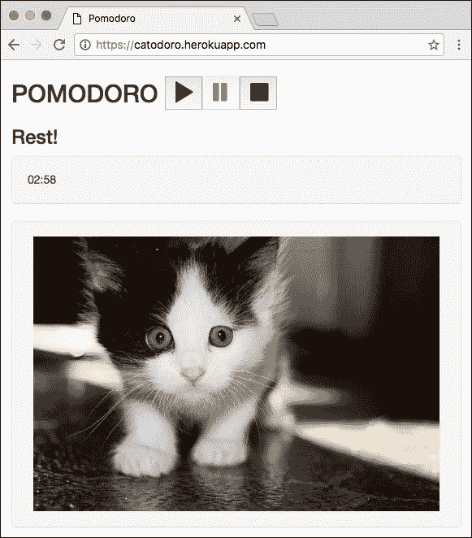
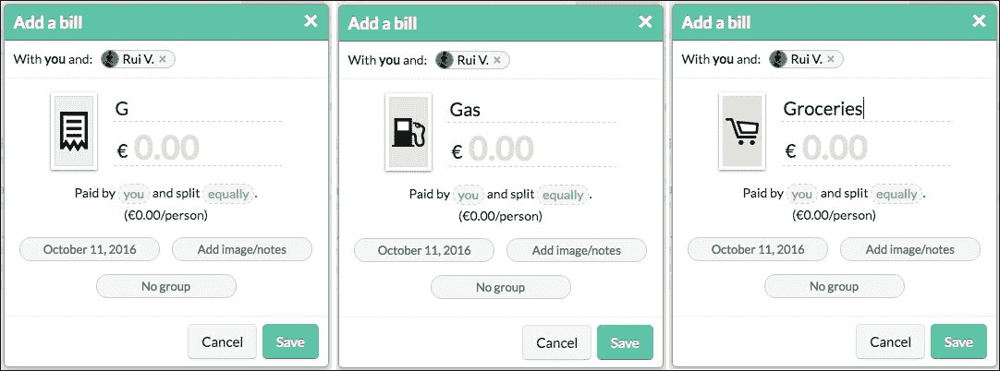

# 九、下一步是什么？

在上一章中，我们通过将应用部署到服务器并向全世界提供，使其投入使用。我们还保证了应用的持续集成和持续部署。这意味着每次提交对应用执行的更改时，都会自动测试和部署这些更改。

看来我们在这本书中的旅程已经结束了。但事实上，这才刚刚开始。毕竟我们已经发现和学习了，还有很多事情要做！在本章中，我们将总结到目前为止所学到的一切，看看我们还需要学习什么，我们还可以做些什么来达到应用的惊人水平。因此，在本章中，我们将做以下工作：

*   总结到目前为止我们所学到的一切
*   列一张跟进事项的清单

# 到目前为止的旅程

到目前为止，我们已经踏上了一段伟大的旅程，现在是总结我们所做的事情和所学到的东西的时候了。

在[第一章](01.html#aid-F8901 "Chapter 1. Going Shopping with Vue.js")中*与 Vue.js*一起购物，我们与 Vue.js 进行了第一次约会。我们讨论了什么是 Vue.js，它是如何创建的，它做了什么，并看到了一些基本示例。

在[第 2 章](02.html#aid-PNV61 "Chapter 2. Fundamentals – Installing and Using")*基础知识*的安装和使用中，我们深入到了 Vue.js 的幕后。我们了解了 MVVM 体系结构模式，了解了 Vue.js 的工作原理，并接触了 Vue.js 的不同方面，如*组件*、*指令*、*插件*和应用*状态*。我们学习了安装 Vue.js 的不同方法，从使用一个简单的独立编译脚本开始，经过使用 CDN 版本、NPM 版本，到使用 Vue.js 的开发版本，不仅能够使用它，而且能够为其代码库做出贡献。我们学习了如何调试以及如何使用`Vue-cli`构建 Vue.js 应用。我们甚至使用符合 CSP 的 Vue 版本创建了一个非常简单的 Chrome 应用。

在[第 3 章](03.html#aid-12AK81 "Chapter 3. Components – Understanding and Using")*组件——理解和使用*中，我们将手深深地放在组件的系统中。我们学习了如何定义 Vue 组件、组件的作用域如何工作以及组件之间如何相互关联，并且我们开始在以前引导的应用中使用单文件组件。

在[第 4 章](04.html#aid-1BRPS1 "Chapter 4. Reactivity – Binding Data to Your Application")*反应性-将数据绑定到应用*中，我们深入研究了 Vue.js 的数据绑定和反应性。我们学习了如何使用指令、表达式和过滤器。由于 Vue.js 的反应方式，我们将数据绑定到最初几章中开发的应用中，并使它们具有交互性。

在[第 5 章](05.html#aid-1HIT82 "Chapter 5. Vuex – Managing State in Your Application")*Vuex-应用中的管理状态*中，我们学习了如何使用 Vuex 存储系统管理 Vue 应用中的全局状态。我们学习了如何使用状态、动作、getter 和突变，以便创建一个模块化的、良好的应用结构，在这个结构中，组件可以轻松地相互通信。我们将这一新知识应用于我们在前几章中开发的应用中。

在[第 6 章](06.html#aid-1Q5IA1 "Chapter 6. Plugins – Building Your House with Your Own Bricks")*插件-用自己的砖块建造房子*中，我们了解了 Vue 插件如何与 Vue 应用合作。我们使用了一个现有的插件`vue-resource`，它帮助我们在浏览器刷新之间保存应用的状态。我们还为产生白色、棕色和粉色噪音的 Vue 应用创建了自己的插件。在这一点上，我们有一个功能齐全的应用，具有一组非常好的工作特性。

在[第 7 章](07.html#aid-1TVKI1 "Chapter 7. Testing – Time to Test What We Have Done So Far!")中*测试——是时候测试我们目前所做的了！*我们学习了如何测试我们的 Vue 应用。我们学习了如何编写单元测试，以及如何使用 Selenium 驱动程序创建和运行端到端测试。我们了解了什么是代码覆盖率，以及如何在单元测试中伪造服务器响应。我们用单元测试覆盖了几乎 100%的代码，我们看到 Selenium 驱动程序正在运行端到端测试。

在[第 8 章](08.html#aid-25JP21 "Chapter 8. Deploying – Time to Go Live!")中，*部署-该上线了！*我们终于向全世界公开了我们的应用。我们将它们部署到 Heroku 云系统，现在它们可以从互联网存在的任何地方访问。不仅如此，我们还使部署过程完全自动化。每次我们将代码更改推送到`master`分支，应用就被部署了！甚至更多。它们不仅部署在每次推送上，而且还通过 Travis 持续集成系统自动测试。

因此，在本书中，我们不仅仅学习了一个新的框架。我们应用我们的知识从头开始开发了两个简单但不错的应用。我们应用了最重要的 Vue 概念，使我们的应用具有反应性、快速性、可维护性和可测试性。然而，这并不是结束。在编写本书的过程中，Vue 2.0 已经发布。它带来了一些新的可能性和一些新的东西来学习和使用。

# Vue 2.0

Vue 2.0 于 2016 年 9 月 30 日发布。在[查看 Evan You 的这篇帖子 https://medium.com/the-vue-point/vue-2-0-is-here-ef1f26acf4b8#.ifpgtjlek](https://medium.com/the-vue-point/vue-2-0-is-here-ef1f26acf4b8#.ifpgtjlek) 。

在这本书中，我们使用了最新版本；但是，我尝试在必要时参考第一代 Vue 中的操作方式。实际上，API 几乎是一样的；虽然有一些细微的改变，一些不推荐使用的属性，但是提供给最终用户的整个界面几乎没有改变。

然而，它几乎是从头重写的！当然，有些部分代码几乎 100%被重用，但总的来说，这是一次重大的重构，一些概念完全改变了。例如，渲染层被完全重写。如果之前渲染引擎使用的是真实的 DOM，那么现在它使用的是轻量级虚拟 DOM 结构（[https://github.com/snabbdom/snabbdom](https://github.com/snabbdom/snabbdom) ）。它的性能胜过一切！查看下面的基准图：


性能基准（越低越好）取自 https://medium.com/the-vue-point/vue-2-0-is-here-ef1f26acf4b8#.fjxegtv98

这个新版本还有一个有趣的地方。如果您已经使用了第一代 Vue，并且阅读了相关内容并收听了播客，那么您可能知道 Vue 和 React 之间的主要区别之一是 React-Native（允许我们基于 React 构建本机应用的框架）。Evan You 总是声称 Vue 只是 web 界面的一个很小的层。现在，我们有了新出现的**Weex**，一个将 Vue 启发的组件呈现到本地应用中的框架（[https://github.com/alibaba/weex](https://github.com/alibaba/weex) ）。根据 Evan You 的说法，很快，“Vue 灵感”将变成“Vue 动力”！就等着吧。请继续关注。我想推荐这个令人惊叹的全栈广播播客，在这里，Evan You 谈到了 Vue 的新版本：[http://www.fullstackradio.com/50](http://www.fullstackradio.com/50) 。

> *Vue 作为一个辅助项目，从一开始就不起眼，现在已经有了很大的发展。今天，它是由社区资助的，在现实世界中被广泛采用，并且根据 stats.js.org，它是所有 JavaScript 库中增长最强劲的趋势之一。我们相信 2.0 将进一步推动这一进程。这是 Vue 自诞生以来最大的一次更新，我们很高兴看到您用它构建了什么-*艾凡尤*，https://medium.com/the-vue-point/vue-2-0-is-here-ef1f26acf4b8#.fjxegtv98)*

考虑到这一点，如果您来自 Vue 1.0 一代，升级应用并不困难。查看迁移指南，[http://vuejs.org/guide/migration.html](http://vuejs.org/guide/migration.html) ，安装迁移助手[https://github.com/vuejs/vue-migration-helper](https://github.com/vuejs/vue-migration-helper) ，应用所有需要的更改，然后查看应用的性能。

# 再次访问我们的应用

让我们再检查一下到目前为止我们做了什么。我们使用 Vue.js 开发了两个应用。让我们重温一下。

## 购物清单申请表

我们在本书各章中开发的购物清单应用是一个 web 应用，它允许以下功能：

*   创建不同的购物清单
*   在购物清单中添加新项目，并在购买后进行检查
*   重命名购物清单并将其删除

我们的购物清单应用位于 Heroku 云平台上：[https://shopping-list-vue.herokuapp.com/](https://shopping-list-vue.herokuapp.com/) 。

其代码托管在 GitHub 上：[https://github.com/chudaol/ShoppingList](https://github.com/chudaol/ShoppingList) 。

与 Travis 持续整合：[https://travis-ci.org/chudaol/ShoppingList](https://travis-ci.org/chudaol/ShoppingList)

其界面简单易懂：


使用 Vue.js 开发的购物清单应用的界面

它离你每次购物都会用到的东西还很远，不是吗？

## Pomodoro 的应用

我们在本书中开发的 Pomodoro 应用是一个 web 应用，它在 Pomodoro 工作期间实现了一个带有白噪声的 Pomodoro 计时器，并在间隔时间内实现了漂亮的猫图片。它允许以下操作：

*   启动、暂停和停止应用
*   工作时倾听白噪音，这种噪音有助于集中注意力
*   静音和取消静音白噪声声音
*   在业余时间盯着小猫看

我们的应用也托管在云平台上 https://catodoro.herokuapp.com/ 。

其代码也托管在 GitHub:[https://github.com/chudaol/Pomodoro](https://github.com/chudaol/Pomodoro) 。

它还使用 Travis 持续集成平台[在每次推送上进行构建和测试 https://travis-ci.org/chudaol/Pomodoro](https://travis-ci.org/chudaol/Pomodoro) 。

其界面干净，使用方便。以下是 20 分钟 Pomotoro 工作间隔的内容：


Pomodoro 工作期间的 Pomodoro 应用

以下是 5 分钟休息时间到来时出现的情况：



Pomodoro 在间歇时间内的应用

它实际上是非常有用的，但还远远不够完美。

# 为什么这只是开始？

在上一节中，我们总结了我们在本书中开发的应用所做的工作。我们也同意（我希望）它们还远远不够完美。远非完美的事物是我们想要改进的事物，因此它们给了我们挑战和目标。实际上还有很多工作要做。我们的应用很好，但它们缺少特性、样式、标识、用户体验模式、对其他平台的扩展，等等。让我们看看我们还能做些什么。

## 为我们的应用添加功能

我们的应用已经有了一些非常好的特性，但它们还可以有更多。它们可以更加可配置。它们可以更加灵活。它们可以更加 UI/UX 友好。让我们看一下它们，并列出可以添加的功能。这将是你的家庭作业。

### 购物清单申请表

在浏览器中打开我们的购物清单应用并查看它。您可以将列表和项目添加到其中。您可以删除项目和列表。但是，在浏览器中打开应用的每个人都可以这样做。这意味着我们必须提供一种方式，让每个人都拥有自己的购物清单应用，这只有通过身份验证机制才能实现。

还有一些用户体验问题。如果我们可以更改购物清单的名称，比如说，内联，为什么我们要使用页脚中的输入字段来更改购物清单的名称？实际上，当我们学习如何在 Vue 应用中实现数据绑定时，在输入字段中编辑购物清单的名称是我们实现的第一件事。因此，它在当时是有意义的，但现在它可以而且应该得到改进。

另一件事与删除的项目有关。没有办法清除它们。如果我们有一个长长的购物清单，即使我们删除了它们，它们也会永远存在，除非我们删除整个购物清单。应该有一种方法来清除列表上的已检查项。

我们可以应用的另一个外观变化与造型有关。不同的列表可能有不同的背景颜色、不同的字体颜色，甚至可能有不同的字体样式和大小。下面是购物清单应用的改进列表：

*   实现身份验证机制
*   实现内联名称编辑
*   执行检查项目的清理
*   实现配置不同购物清单样式的机制，例如背景颜色、文本颜色、字体大小和样式

您还可以为项目实现类别，并为每个类别实现图标。作为一个灵感，您可以在[上查看 Splitwise 应用 https://www.splitwise.com/](https://www.splitwise.com/) 。开始添加项目时，项目的图标是通用的。输入有意义的内容后，图标会发生变化，如以下屏幕截图所示：



Splitwise 应用的屏幕截图为图标类别提供了灵感：它根据您在输入字段中键入的内容进行调整

尝试为我们的购物清单应用实现这种分类。这将是一个非常好和强大的奖金！

### Pomodoro 的应用

在您的浏览器中打开我们的 Pomotoro 应用并尝试使用它。毫无疑问，这很好。它简单易用。但是，一些额外的配置可能会给它带来一些额外的功能。例如，我为什么要工作 20 分钟？也许我想要 15 分钟的工作时间。或者我想要更大的工作时间，比如说 25 或 30 分钟。它绝对应该是可配置的。

让我们彻底检查一下维基百科中对 Pomodoro 技术的描述，看看我们是否遗漏了什么：[https://en.wikipedia.org/wiki/Pomodoro_Technique](https://en.wikipedia.org/wiki/Pomodoro_Technique) 。

我很确定我们是。从基本原则上检查这一点：

|   | *“四个波莫多洛之后，休息更长时间（15-30 分钟），将您的复选标记计数重置为零，然后进入步骤 1。”* |   |
|   | --*https://en.wikipedia.org/wiki/Pomodoro_Technique* |

啊哈！四个波莫多洛之后应该会有事情发生。间隔越长，盯着猫看的时间就越多（或者做你想做的任何事情）。嗯，也许能够配置这段时间也很好！

还有一件重要的事。作为任何人，在努力工作之后，我希望看到一些进步。如果我们的 Pomodoro 应用能够显示一些关于我们能够集中精力做工作的时间的统计数据，那不是很好吗？为此，我们可以收集一些统计数据并将它们显示在我们的 Pomodoro 计时器中。

另外，存储这些统计数据，以便能够在一段时间内可视化它们，比如说，一周、一个月、一年，不是很好吗？这就需要实现一种存储机制。这个存储区应该存储每个用户的统计信息，因此同样需要一个身份验证机制。

让我们想想我们美妙的白色、棕色和粉色噪音。目前，我们只播放我们的`App.vue`中硬编码的棕色噪音：

```js
<template>
 <div id="app" class="container" v-noise="'brown'">
 </div>
</template> 

```

难道我们不能在噪音之间切换，选择我们最喜欢的一种吗？因此，我们确定了要添加到应用配置中的另一项。现在已经足够了；让我们把所有这些都列在清单中：

*   实现身份验证机制
*   实现一种存储机制，它应该收集关于工作时间的统计信息，并将它们存储在某个持久层中
*   实现统计显示机制，它应该抓取存储的统计数据，并以一种漂亮、干净的方式显示（例如，图表）

*   向 pomotoro 应用添加配置机制。此配置应允许以下操作：
    *   配置 Pomodoro 的工作时间段
    *   配置休息时间间隔
    *   在可配置的 Pomodoros 工作量（默认为 4）后，配置一个较长的休息时间
    *   配置在工作间隔期间播放的首选噪音

正如你所看到的，你还有一些工作要做。这是一件好事，您已经有了一个正在工作的 Pomodoro 计时器应用，可以在您进行改进时使用它！

## 美化我们的应用

这两个应用目前都相当灰色。当一只猫出现在屏幕上时，只有 Pomodoro 定时器应用变得更加丰富多彩。如果能为它们添加一些设计，那就太好了。让他们独一无二，给他们自己的身份；你在他们身上下了很大的功夫，他们显然应该得到一些漂亮的衣服。让我们考虑一下我们可以用样式做些什么。

### 标识

从标识开始。一个好的标志定义了你的产品，使它独一无二。我可以帮助您使用 Pomodoro 应用的徽标，至少是它的想法。我有一个非常好的朋友叫 Carina，她为我设计了一个西红柿，我刚刚尽了最大的努力给它加了一只小猫。过来看。你可以原封不动地使用它，也可以把它当作一个想法来发展你自己的想法。甚至天空也不是你想象的极限，真的！


Pomotoro 应用的标识创意

为购物清单应用考虑一个漂亮的徽标。可能是什么？装食品杂货的袋子？复选框？只是首字母 SL？同样，没有限制。我希望能在商店里看到你漂亮的标志。等不及了！

### 标识与设计

我们的应用肯定需要一些独特的设计。使用一些用户体验技术为他们开发一个好的身份指南。考虑一下颜色、字体以及元素在页面上的组合方式，以便为用户提供独特的用户友好体验。

### 动画和过渡

动画和转换是给应用带来活力的强大机制。但是，它们不能被滥用。想一想它们在哪里以及如何有意义。例如，将鼠标悬停在购物清单标题上可能会突出显示，购物清单项目在被选中时可能会出现一些微小的反弹，更改购物清单标题的过程也可能以某种方式突出显示，等等。Pomotoro 应用可以在每个状态转换时更改其背景色。它还可以知道一天中的时间，并相应地给背景上色。机会是无限的。发挥你的创造力，利用 Vue 的力量实现你的想法。

## 将我们的应用扩展到其他设备

我们的两个应用都是 web 应用。如果我们整天都在电脑上工作并使用网络，Pomodoro 应用可能没问题，但购物清单应用可能会有点不舒服。你去购物时不带笔记本电脑。当然，你可以在家里填写购物清单，然后在超市打开手机浏览器，但这可能会很慢，而且使用起来也不太好。使用 Weex（[https://github.com/alibaba/weex](https://github.com/alibaba/weex) 将我们的 web 应用引入移动设备。正如我们在[第 2 章](02.html#aid-PNV61 "Chapter 2. Fundamentals – Installing and Using")、*基础知识-安装和使用*中所了解的，这两个应用也可以扩展为 Google Chrome 应用。将您的工作扩展到您可以使用的每个设备。我期待着检查你的工作。

# 总结

这是本书的最后一章。老实说，我对此感到有点难过。我和你玩得很开心。我知道我不认识你，但我觉得我认识你。我跟你说话，我觉得有时候你跟我说话。到目前为止发展起来的一切，我都不能说是我自己发展起来的；我觉得我们一直在一起努力。

事实上，这是一种非常有趣的感觉，因为当你读这本书时，我同时处于现在和未来（对我来说，这是未来）。你现在在你的现在，同时在过去和我交谈。我喜欢书籍和技术不仅在人与人之间，而且在不同的时间间隔之间建立联系的方式。这太神奇了。

我真的希望你能像我一样成为 Vue.js 的粉丝。

我真的希望您能增强我们迄今为止开发的至少一个应用，并将其展示给我。如果你需要我的帮助，我将非常乐意帮助你。请随时在`chudaol@gmail.com`给我留言。

谢谢你一直和我在一起，我希望很快在下一本书中见到你！