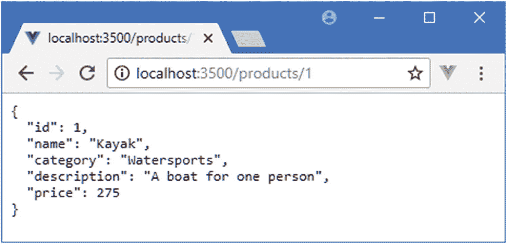
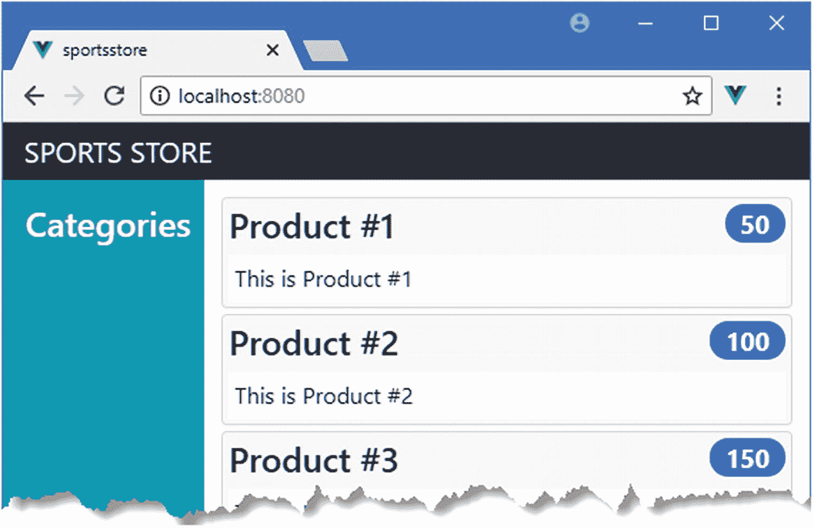
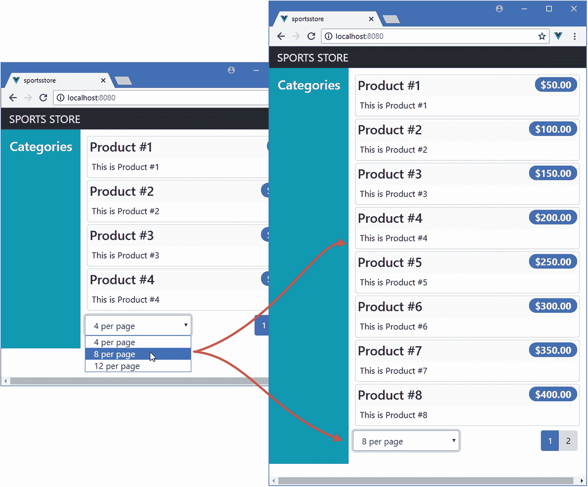
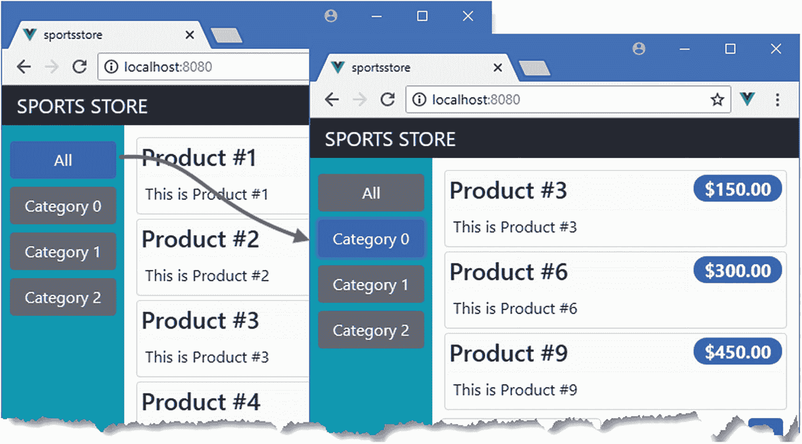
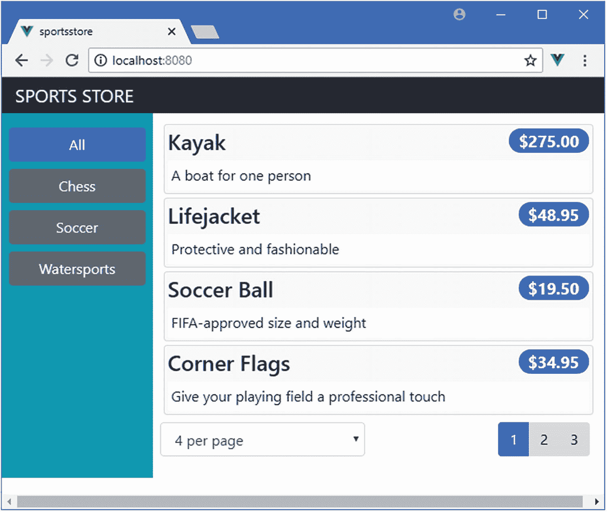

# 五、SportsStore：一个真正的应用

这本书的大部分章节都包含了专注于某个特定特性的小例子。这是一种向您展示 Vue.js 不同部分如何工作的有用方式，但有时缺乏上下文，并且很难将一章中的功能与其他章中的功能联系起来。为了帮助解决这个问题，我将在本章和后面的章节中创建一个更复杂的应用。

我的应用名为 SportsStore，将遵循各地在线商店采用的经典方法。我将创建一个客户可以按类别和页面浏览的在线产品目录，一个用户可以添加和删除产品的购物车，以及一个客户可以输入送货细节和下订单的收银台。我还将创建一个管理区域，其中包括用于管理目录的工具—我将保护它，以便只有登录的管理员才能进行更改。最后，我将向您展示如何准备应用，以便可以部署它。

我在这一章和后面几章的目标是通过创建尽可能真实的例子，让你对真正的 Vue.js 开发有所了解。当然，我想把重点放在 Vue.js 上，所以我简化了与外部系统的集成，比如后端数据服务器，并完全省略了其他部分，比如支付处理。

SportsStore 是我在几本书中使用的一个例子，尤其是因为它展示了使用不同的框架、语言和开发风格来实现相同结果的方法。你不需要阅读我的任何其他书籍来理解这一章，但如果你已经拥有我的*Pro ASP.NET 核心 MVC 2 或 Pro Angular* 书籍，你会发现这种对比很有趣。

我在 SportsStore 应用中使用的 Vue.js 特性将在后面的章节中详细介绍。我不会在这里重复所有的内容，我告诉您的内容足以让您理解示例应用，并让您参考其他章节以获得更深入的信息。你可以从头到尾阅读 SportsStore 章节，了解 Vue.js 的工作方式，也可以在详细章节之间跳转，深入了解。

### 警告

不要期望马上理解所有的东西——vue . js 有许多活动的部分，SportsStore 应用旨在向您展示它们是如何组合在一起的，而不会深入到本书其余部分描述的细节中。如果您陷入了困境，那么可以考虑阅读本书的第 2 部分，开始阅读各个特性，稍后再回到本章。

## 创建 SportsStore 项目

任何开发工作的第一步都是创建项目。打开一个新的命令提示符，导航到一个方便的位置，并运行清单 [5-1](#PC1) 中所示的命令。

### 注意

在撰写本文时，`@vue/cli`包已经发布了测试版。在最终发布之前可能会有一些小的变化，但是核心特性应该保持不变。有关任何突破性变化的详细信息，请查看本书的勘误表，可在 [`https://github.com/Apress/pro-vue-js-2`](https://github.com/Apress/pro-vue-js-2) 获得。

```js
vue create sportsstore --default

Listing 5-1Creating the SportsStore Project

```

将创建项目，并下载和安装应用和开发工具所需的包，这可能需要一些时间才能完成。

### 小费

你可以从 [`https://github.com/Apress/pro-vue-js-2`](https://github.com/Apress/pro-vue-js-2) 下载本章以及本书所有其他章节的示例项目。

### 添加附加包

Vue.js 专注于核心特性，并辅以可选的软件包，其中一些由主要的 Vue.js 团队开发，另一些由感兴趣的第三方开发。Vue.js 开发所需的大部分包都是自动添加到项目中的，但是 SportsStore 项目需要添加一些包。运行清单 [5-2](#PC2) 中所示的命令，导航到`sportsstore`文件夹并添加所需的包。(`npm`工具可以用来在一个命令中添加多个包，但是我已经将每个包分开，以便更容易看到名称和版本。)

```js
cd sportsstore
npm install axios@0.18.0
npm install vue-router@3.0.1
npm install vuex@3.0.1
npm install vuelidate@0.7.4
npm install bootstrap@4.0.0
npm install font-awesome@4.7.0
npm install --save-dev json-server@0.12.1
npm install --save-dev jsonwebtoken@8.1.1
npm install --save-dev faker@4.1.0

Listing 5-2Adding Packages

```

使用清单中显示的版本号很重要。在添加包时，您可能会看到关于未满足对等依赖关系的警告，但是这些可以忽略。表 [5-1](#Tab1) 中描述了每个包在 SportsStore 应用中的作用。有些包是使用`--save-dev`参数安装的，这表明它们是在开发过程中使用的，不会成为 SportsStore 应用的一部分。

表 5-1

SportsStore 项目所需的附加包

<colgroup><col class="tcol1 align-left"> <col class="tcol2 align-left"></colgroup> 
| 

名字

 | 

描述

 |
| --- | --- |
| `axios` | Axios 包用于向为 SportsStore 提供数据和服务的 web 服务发出 HTTP 请求。Axios 并不特定于 Vue.js，但它是处理 HTTP 的常见选择。我在第 [19](19.html) 章描述了 Axios 在 Vue.js 应用中的使用。 |
| `vue-router` | 这个包允许应用根据浏览器的当前 URL 显示不同的内容。这个过程被称为 URL 路由，我会在第[22](22.html)–[24](24.html)章中详细描述。 |
| `vuex` | 此包用于创建共享数据存储，以简化 Vue.js 项目中的数据管理。我在第 20 章中详细描述了 Vuex 数据存储。 |
| `veulidate` | 这个包用于验证用户输入表单元素的数据，如第 [6](06.html) 章所示。 |
| `bootstrap` | Bootstrap 包包含 CSS 样式，这些样式将用于样式化 SportsStore 应用呈现给用户的 HTML 内容。 |
| `font-awesome` | 字体 Awesome 包包含一个图标库，SportsStore 将使用它向用户表示重要的功能。 |
| `json-server` | 这个包为应用开发提供了一个易于使用的 RESTful web 服务，正是这个包将接收使用 Axios 发出的 HTTP 请求。本章“准备 RESTful Web 服务”一节中添加到项目中的 JavaScript 代码使用了这个包。 |
| `jsonwebtoken` | 该包用于生成授权令牌，授权令牌将授予对 SportsStore 管理功能的访问权限，这些功能将添加到第 [7](07.html) 章的项目中。 |
| `faker` | 这个包用于生成测试数据，我在第 [7 章](07.html)中使用它来确保 SportsStore 可以处理大量的数据。 |

### 注意

`vue-router`和`vuex`包可以作为项目模板的一部分自动安装，但是我已经单独添加了它们，以便我可以演示如何配置它们并将其应用到 Vue.js 应用。使用项目工具快速启动项目并没有错，但重要的是您要了解 Vue.js 项目中的一切是如何工作的，这样当出现问题时，您就能很好地知道从哪里开始。

#### 将 CSS 样式表合并到应用中

Bootstrap 和 Font Awesome 包需要将`import`语句添加到`main.js`文件中，这是执行 Vue.js 应用顶层配置的地方。清单 [5-3](#PC3) 中显示的`import`语句确保这些包提供的内容被 Vue.js 开发工具整合到应用中。

### 小费

目前不要担心`main.js`文件中的其他语句。他们负责初始化 Vue.js 应用，这我会在第 9 章[T2 中解释，但是理解他们是如何工作的对于开始 Vue.js 开发并不重要。](09.html)

```js
import Vue from 'vue'
import App from './App.vue'

Vue.config.productionTip = false

import "bootstrap/dist/css/bootstrap.min.css";

import "font-awesome/css/font-awesome.min.css"

new Vue({
    render: h => h(App)
}).$mount('#app')

Listing 5-3Incorporating Packages in the main.js File in the src Folder

```

这些语句将让我在整个应用中使用软件包提供的 CSS 特性。

### 准备 RESTful Web 服务

SportsStore 应用将使用异步 HTTP 请求来获取由 RESTful web 服务提供的模型数据。正如我在第 [19](19.html) 章中所描述的，REST 是一种设计 web 服务的方法，它使用 HTTP 方法或动词来指定操作和 URL 来选择操作所应用的数据对象。

我在上一节中添加到项目中的`json-server`包是从 JSON 数据或 JavaScript 代码快速生成 web 服务的优秀工具。为了确保项目可以重置到一个固定的状态，我将利用一个特性，该特性允许使用 JavaScript 代码为 RESTful web 服务提供数据，这意味着重新启动 web 服务将重置应用数据。我在`sportsstore`文件夹中创建了一个名为`data.js`的文件，并添加了清单 [5-4](#PC4) 中所示的代码。

```js
var data = [{ id: 1, name: "Kayak", category: "Watersports",
                description: "A boat for one person", price: 275 },
            { id: 2, name: "Lifejacket", category: "Watersports",
                description: "Protective and fashionable", price: 48.95 },
            { id: 3, name: "Soccer Ball", category: "Soccer",
                description: "FIFA-approved size and weight", price: 19.50 },
            { id: 4, name: "Corner Flags", category: "Soccer",
                description: "Give your playing field a professional touch",
                price: 34.95 },
            { id: 5, name: "Stadium", category: "Soccer",
                description: "Flat-packed 35,000-seat stadium", price: 79500 },
            { id: 6, name: "Thinking Cap", category: "Chess",
                description: "Improve brain efficiency by 75%", price: 16 },
            { id: 7, name: "Unsteady Chair", category: "Chess",
                description: "Secretly give your opponent a disadvantage",
                price: 29.95 },
            { id: 8, name: "Human Chess Board", category: "Chess",
                description: "A fun game for the family", price: 75 },
            { id: 9, name: "Bling Bling King", category: "Chess",
                description: "Gold-plated, diamond-studded King", price: 1200 }]

module.exports = function () {
    return {
        products: data,
        categories: [...new Set(data.map(p => p.category))].sort(),
        orders: []
    }
}

Listing 5-4The Contents of the data.js File in the sportsstore Folder

```

这个文件是一个 JavaScript 模块，它导出了一个默认函数，有两个集合将由 RESTful web 服务提供。`products`集合包含销售给客户的产品，categories 集合包含独特的`category`属性值，而`orders`集合包含客户已经下的订单(但目前为空)。

RESTful web 服务存储的数据需要受到保护，这样普通用户就不能修改产品或更改订单的状态。`json-server`包不包含任何内置的认证特性，所以我在`sportsstore`文件夹中创建了一个名为`authMiddleware.js`的文件，并添加了清单 [5-5](#PC5) 中所示的代码。

```js
const jwt = require("jsonwebtoken");

const APP_SECRET = "myappsecret";
const USERNAME = "admin";
const PASSWORD = "secret";

module.exports = function (req, res, next) {

    if ((req.url == "/api/login" || req.url == "/login")
            && req.method == "POST") {
        if (req.body != null && req.body.name == USERNAME
                && req.body.password == PASSWORD) {
            let token = jwt.sign({ data: USERNAME, expiresIn: "1h" }, APP_SECRET);
            res.json({ success: true, token: token });
        } else {
            res.json({ success: false });
        }
        res.end();
        return;
    } else if ((((req.url.startsWith("/api/products")
                || req.url.startsWith("/products"))
           || (req.url.startsWith("/api/categories")
                || req.url.startsWith("/categories"))) && req.method != "GET")
        || ((req.url.startsWith("/api/orders")
            || req.url.startsWith("/orders")) && req.method != "POST")) {
        let token = req.headers["authorization"];
        if (token != null && token.startsWith("Bearer<")) {
            token = token.substring(7, token.length - 1);
            try {
                jwt.verify(token, APP_SECRET);
                next();
                return;
            } catch (err) { }
        }
        res.statusCode = 401;
        res.end();
        return;
    }
    next();
}

Listing 5-5The Contents of the authMiddleware.js File in the sportsstore Folder

```

这段代码检查发送到 RESTful web 服务的 HTTP 请求，并实现一些基本的安全特性。这是与 Vue.js 开发没有直接关系的服务器端代码，所以如果它的目的不是很明显，也不用担心。我在第 [7](07.html) 章解释认证和授权过程。

### 警告

除了 SportsStore 应用之外，不要使用清单 [5-5](#PC5) 中的代码。它包含硬连线到代码中的弱密码。这对于 SportsStore 项目来说很好，因为重点是在 Vue.js 的开发客户端，但这不适合真实的项目。

需要在`package.json`文件中添加一个文件，这样就可以从命令行启动`json-server`包，如清单 [5-6](#PC6) 所示。

```js
{
  "name": "sportsstore",
  "version": "0.1.0",
  "private": true,
  "scripts": {
    "serve": "vue-cli-service serve",
    "build": "vue-cli-service build",
    "lint": "vue-cli-service lint",
    "json": "json-server data.js -p 3500 -m authMiddleware.js"

  },
  "dependencies": {
    "axios": "^0.18.0",
    "bootstrap": "^4.0.0",
    "font-awesome": "^4.7.0",
    "vue": "^2.5.16",
    "vue-router": "^3.0.1",
    "vuex": "^3.0.1"
  },

  // ...other configuration settings omitted for brevity...

}

Listing 5-6Adding a Script to the package.json File in the SportsStore Folder

```

`package.json`文件用于配置项目及其工具。`scripts`部分包含了可以使用已经添加到项目中的包来执行的命令。

### 启动项目工具

项目的所有配置都已完成，是时候启动将用于开发的工具并确保一切正常工作了。打开一个新的命令提示符，导航到`sportsstore`文件夹，运行清单 [5-7](#PC7) 中所示的命令来启动 web 服务。

```js
npm run json

Listing 5-7Starting the SportsStore Web Service

```

打开一个新的浏览器窗口并导航到 URL `http://localhost:3500/products/1`来测试 web 服务是否工作，这将产生如图 [5-1](#Fig1) 所示的结果。



图 5-1

测试 web 服务

在不停止 web 服务的情况下，打开第二个命令提示符，导航到`sportsstore`文件夹，运行清单 [5-8](#PC8) 中所示的命令来启动 Vue.js 开发工具。

```js
npm run serve

Listing 5-8Starting the Development Tools

```

将启动开发 HTTP 服务器，并执行初始准备过程，之后您将看到一条消息，表明应用正在运行。使用浏览器导航到`http://localhost:8080`，应该会看到如图 [5-2](#Fig2) 所示的内容，这是创建项目时添加的占位符。


图 5-2

运行应用

### 小费

端口 8080 是默认的，但是如果 8080 已经被使用，Vue.js 开发工具将选择另一个端口。如果发生这种情况，您可以停止使用该端口的进程，以便 Vue.js 可以使用该端口，或者导航到显示的 URL。

## 创建数据存储

任何新应用的最佳起点都是它的数据。在除了最简单的项目之外的所有项目中，Vuex 包用于创建数据存储，该数据存储用于在整个应用中共享数据，提供了一个公共存储库，确保应用的所有部分都使用相同的数据值。

### 小费

Vuex 不是唯一可用于管理 Vue.js 应用中的数据的包，但它是由核心 Vue.js 团队开发的，并很好地集成到 Vue.js 世界的其余部分。除非有特殊原因，否则应该在 Vue.js 项目中使用 Vuex。

Vuex 数据存储通常被定义为独立的 JavaScript 模块，在它们自己的目录中定义。我创建了`src/store`文件夹(这是约定俗成的名字)并在其中添加了一个名为`index.js`的文件，其内容如清单 [5-9](#PC9) 所示。

```js
import Vue from "vue";
import Vuex from "vuex";

Vue.use(Vuex);

const testData = [];

for (let i = 1; i <= 10; i++) {
    testData.push({
        id: i, name: `Product #${i}`, category: `Category ${i % 3}`,
        description: `This is Product #${i}`, price: i * 50
    })
}

export default new Vuex.Store({
    strict: true,
    state: {
        products: testData
    }
})

Listing 5-9The Contents of the index.js File in the src/store Folder

```

`import`语句声明了对 Vue.js 和 Vuex 库的依赖。Vuex 作为 Vue.js 插件发布，这使得在项目中提供应用范围的功能变得容易。我在第 26 章中解释了插件是如何工作的，但是对于 SportsStore 应用，知道插件必须使用`Vue.use`方法来启用就足够了。如果您忘记调用`use`方法，那么数据存储特性在应用的其余部分将不可用。

使用`new`关键字创建一个`Vuex.Store`对象，传递一个配置对象，从而创建一个数据存储。`state`属性的目的是用来定义存储中包含的数据值。为了启动数据存储，我使用了一个 for 循环来生成一个测试数据数组，并将其分配给一个名为`products`的状态属性。在本章后面的“使用 RESTful web 服务”一节中，我将用从 Web 服务获得的数据来替换它。

属性`strict`的目的不太明显，它与 Vuex 不同寻常的工作方式有关。数据值是只读的，只能通过突变来修改，突变只是改变数据的 JavaScript 方法。当我向 SportsStore 应用添加功能时，您将看到突变的示例，并且如果您忘记使用突变并直接修改数据值，则`strict`模式是一个有用的功能，它会生成警告——当您习惯 Vuex 的工作方式时，这种情况经常发生。

为了在应用中包含数据存储，我将清单 [5-10](#PC10) 中所示的语句添加到了`main.js`文件中，这是应用配置的要点。

```js
import Vue from 'vue'
import App from './App.vue'

Vue.config.productionTip = false

import "bootstrap/dist/css/bootstrap.min.css";
import "font-awesome/css/font-awesome.min.css"

import store from "./store";

new Vue({
    render: h => h(App),
    store

}).$mount('#app')

Listing 5-10Adding the Vuex Data Store in the main.js File in the src Folder

```

`import`语句声明了对数据存储模块的依赖，并为其分配了`store`标识符。将`store`属性添加到用于创建`Vue`对象的配置属性中，可以确保数据存储功能可以在整个应用中使用，正如您将看到的功能添加到 SportsStore 中一样。

### 警告

一个常见的错误是将`import`语句添加到`main.js`文件中，但是忘记将`store`属性添加到配置对象中。这会导致错误，因为数据存储功能不会添加到应用中。

## 创建产品商店

数据存储为应用提供了足够的基础设施，允许我开始开发最重要的面向用户的特性:产品存储。所有的网上商店都会给用户提供一些可供选择的商品，SportsStore 也不例外。商店的基本结构将是一个两列布局，带有允许过滤产品列表的类别按钮和一个包含产品列表的表格，如图 [5-3](#Fig3) 所示。


图 5-3

商店的基本结构

Vue.js 应用的基本构建块是组件。组件是在扩展名为`.vue`的文件中定义的，我首先在`src/components`文件夹中创建一个名为`Store.vue`的文件，其内容如清单 [5-11](#PC11) 所示。

```js
<template>
    <div class="container-fluid">
        <div class="row">
            <div class="col bg-dark text-white">
                <a class="navbar-brand">SPORTS STORE</a>
            </div>
        </div>
        <div class="row">
            <div class="col-3 bg-info p-2">
                <h4 class="text-white m-2">Categories</h4>
            </div>
            <div class="col-9 bg-success p-2">
                <h4 class="text-white m-2">Products</h4>
            </div>
        </div>
    </div>
</template>

Listing 5-11The Contents of the Store.vue File in the src/components Folder

```

这个组件目前只包含一个`template`元素，我已经用它定义了一个基本的布局，这个布局使用了引导类风格的 HTML 元素，我在第 [3](03.html) 章中简要描述了它。该内容目前没有什么特别之处，但它对应于图 [5-3](#Fig3) 所示的结构，并为我建立产品商店提供了基础。在清单 [5-12](#PC12) 中，我已经替换了`App.vue`文件的内容，这允许我用清单 [5-11](#PC11) 中创建的商店组件替换项目建立时创建的默认内容。

```js
<template>
    <store />

</template>

<script>

import Store from "./components/Store";

export default {
    name: 'app',
    components: { Store }

}
</script>

Listing 5-12Replacing the Contents of the App.vue File in the src Folder

```

Vue.js 应用通常包含许多组件，在大多数项目中，`App.vue`文件中定义的`App`组件负责决定应该向用户显示哪些组件。当我在第 6 章中添加购物车和结帐功能时，我演示了这是如何完成的，但是`Store`组件是我迄今为止定义的唯一一个组件，所以这是唯一一个可以显示给用户的组件。

`script`元素中的`import`语句声明了对清单 [5-11](#PC11) 中组件的依赖，并为其分配了`Store`标识符，该标识符被分配给`components`属性，告诉 vue . js`App`组件使用了`Store`组件。

当 Vue.js 处理`App`组件的模板时，会用清单 [5-11](#PC11) 中`template`元素的 HTML 替换`store`元素，产生如图 [5-4](#Fig4) 所示的结果。


图 5-4

向应用添加自定义组件

### 创建产品列表

下一步是创建一个向用户显示产品列表的组件。我在`src/components`文件夹中添加了一个名为`ProductList.vue`的文件，内容如清单 [5-13](#PC13) 所示。

```js
<template>
    <div>
        <div v-for="p in products" v-bind:key="p.id" class="card m-1 p-1 bg-light">
            <h4>
                {{p.name}}
                <span class="badge badge-pill badge-primary float-right">
                    {{ p.price }}
                </span>
            </h4>
            <div class="card-text bg-white p-1">{{ p.description }}</div>
        </div>
    </div>
</template>

<script>

import { mapState } from "vuex";

export default {
    computed: {
        ...mapState(["products"])
    }
}
</script>

Listing 5-13The Contents of the ProductList.vue File in the src/components Folder

```

`script`元素从`vuex`包中导入`mapState`函数，用于提供对存储中数据的访问。不同类型的操作有不同的 Vuex 函数，而`mapState`用于创建数据存储中组件和状态数据之间的映射。`mapState`函数与 spread 运算符一起使用，因为它可以在单个操作中映射多个数据存储属性，即使在本例中只映射了`products` state 属性。数据存储状态属性被映射为组件`computed`属性，我将在第 [11](11.html) 章中详细描述。

Vue.js 使用一个叫做*指令*的特性来操作 HTML 元素。在清单中，我使用了`v-for`指令，它为数组中的每一项复制一个元素及其内容。

```js
...
<div v-for="p in products" v-bind:key="p.id" class="card m-1 p-1 bg-light">
...

```

使用`mapState`函数的结果是，我可以使用带有`v-for`指令的`products`属性来访问数据存储中的数据，从而为每个产品生成相同的元素集。每个产品都被临时分配给一个名为`p`的变量，我可以用它来定制为每个产品生成的元素，如下所示:

```js
...
<div class="card-text bg-white p-1">{{ p.description }}</div>
...

```

双括号(`{{`和`}}`字符)表示一个数据绑定，它告诉 Vue.js 在向用户显示 HTML 元素时将指定的数据值插入到该元素中。我在第 [11](11.html) 章解释了数据绑定是如何工作的，[我](01.html)在第 [13](13.html) 章详细描述了`v-for`指令，但结果是当前`product`对象的`description`属性的值将被插入到`div`元素中。

### 小费

`v-for`指令与`v-bind`指令一起使用，后者用于定义一个属性，该属性的值通过一个数据值或一段 JavaScript 生成。在这种情况下，`v-bind`指令用来创建一个`key`属性，`v-for`指令用它来有效地响应应用数据的变化，如第 [13 章](13.html)所述。

### 将产品列表添加到应用

添加到项目中的每个组件都必须先注册，然后才能用于向用户呈现内容。在清单 [5-14](#PC16) 中，我已经在`Store`组件中注册了`ProductList`组件，这样我就可以删除占位符内容并用产品列表替换它。

```js
<template>
    <div class="container-fluid">
        <div class="row">
            <div class="col bg-dark text-white">
                <a class="navbar-brand">SPORTS STORE</a>
            </div>
        </div>
        <div class="row">
            <div class="col-3 bg-info p-2">
                <h4 class="text-white m-2">Categories</h4>
            </div>
            <div class="col-9 p-2 ">

                <product-list />

            </div>

        </div>
    </div>
</template>

<script>

import ProductList from "./ProductList";

export default {
    components: { ProductList }

}
</script>

Listing 5-14Registering a Component in the Store.vue File in the src/components Folder

```

当组件一起使用时，它们形成一种关系。在这个例子中，`Store`组件是`ProductList`组件的*父组件*，反过来，`ProductList`组件是`Store`组件的子组件。在清单中，我按照与向应用添加`Store`组件时相同的模式来注册组件:我导入子组件并将其添加到父组件的`components`属性中，这允许我使用定制的 HTML 元素将子组件的内容插入到父组件的模板中。在清单 [5-14](#PC16) 中，我使用`product-list`元素插入了`ProductList`组件的内容，Vue.js 认为这是表达多部分名称的一种常见方式(尽管我也可以使用`ProductList`或`productList`作为 HTML 元素标签)。

结果是，`App`组件将来自`Store`组件的内容插入到它的模板中，该模板包含来自`ProductList`组件的内容，产生如图 [5-5](#Fig5) 所示的结果。



图 5-5

显示产品列表

### 过滤价格数据

现在我已经有了基本的列表，我可以开始添加特性了。第一件事是将每个产品的`price`属性显示为货币金额，而不仅仅是一个数字。Vue.js 组件可以定义*过滤器*，这是用来格式化数据值的函数。在清单 [5-15](#PC17) 中，我向名为`currency`的`ProductList`组件添加了一个过滤器，将数据值格式化为美元金额。

```js
<template>
    <div>
        <div v-for="p in products" v-bind:key="p.id" class="card m-1 p-1 bg-light">
            <h4>
                {{p.name}}
                <span class="badge badge-pill badge-primary float-right">
                    {{ p.price | currency }}

                </span>
            </h4>
            <div class="card-text bg-white p-1">{{ p.description }}</div>
        </div>
    </div>
</template>

<script>

import { mapState } from "vuex";

export default {
    computed: {
        ...mapState(["products"])
    },
    filters: {

        currency(value) {

            return new Intl.NumberFormat("en-US",

                { style: "currency", currency: "USD" }).format(value);

        }

    }

}
</script>

Listing 5-15Defining a Filter in the ProductList.vue File in the src/components Folder

```

使用在`script`元素中定义的对象中的属性将组件特征组合在一起。`ProductList`组件现在定义了两个这样的属性:`computed`属性，它提供对数据存储中数据的访问，以及`filters`属性，它用于定义过滤器。清单 [5-15](#PC17) 中有一个名为`currency`的过滤器，它被定义为一个接受值的函数，该函数使用 JavaScript 本地化特性将数值格式化为美元金额，以美国使用的格式表示。

通过将数据值的名称与过滤器名称组合在一起，用竖线(`|`字符)分隔，在模板中应用过滤器，如下所示:

```js
...
<span class="badge badge-pill badge-primary float-right">
    {{ p.price | currency }}
</span>
...

```

当您将更改保存到`ProductList.vue`文件时，浏览器将重新加载，价格将被格式化，如图 [5-6](#Fig6) 所示。


图 5-6

使用筛选器设置货币值的格式

### 添加产品分页

产品以连续列表的形式显示给用户，随着产品数量的增加，用户会感到不知所措。为了使产品列表更易于管理，我将添加对分页的支持，指定数量的产品将显示在一个页面上，用户可以从一个页面移动到另一个页面来浏览产品。第一步是扩展数据存储，以便存储页面大小和当前所选页面的细节，我已经在清单 [5-16](#PC19) 中完成了。

```js
import Vue from "vue";
import Vuex from "vuex";

Vue.use(Vuex);

const testData = [];

for (let i = 1; i <= 10; i++) {
    testData.push({
        id: i, name: `Product #${i}`, category: `Category ${i % 3}`,
        description: `This is Product #${i}`, price: i * 50
    })
}

export default new Vuex.Store({
    strict: true,
    state: {
        products: testData,
        productsTotal: testData.length,

        currentPage: 1,

        pageSize: 4

    },
    getters: {

        processedProducts: state => {

            let index = (state.currentPage -1) * state.pageSize;

            return state.products.slice(index, index + state.pageSize);

        },

        pageCount: state => Math.ceil(state.productsTotal / state.pageSize)

    },

    mutations: {

        setCurrentPage(state, page) {

            state.currentPage = page;

        },

        setPageSize(state, size) {

            state.pageSize = size;

            state.currentPage = 1;

        }

    }

})

Listing 5-16Preparing for Pagination in the index.js File in the src/store Folder

```

支持验证的数据存储的增加展示了 Vuex 包提供的一些关键特性。第一组变化是新的`state`属性，它定义了产品数量、当前选择的页面以及每页显示的产品数量的值。

`getters`部分用于使用`state`属性计算其值的属性。在清单 [5-16](#PC19) 中，`getters`部分定义了一个`processedProducts`属性，它只返回当前页面所需的产品，以及一个`pageCount`属性，它计算出显示可用产品数据需要多少个页面。

清单 [5-16](#PC19) 中的`mutations`部分用于定义改变一个或多个状态属性值的方法。清单中有两个突变:`setCurrentPage`突变改变了`currentPage`属性的值，而`setPageSize`突变设置了`pageSize`属性。

标准数据属性和计算属性之间的分离是贯穿 Vue.js 开发的主题，因为它允许有效的变更检测。当数据属性改变时，Vue.js 能够确定对计算属性的影响，并且在底层数据没有改变时不必重新计算值。Vuex 数据存储更进了一步，它要求通过突变来改变数据值，而不是直接分配一个新值。当您第一次开始使用数据存储时，这可能会感到尴尬，但它很快就会成为您的第二天性；此外，遵循这种模式提供了一些有用的特性，比如使用 Vue Devtools 浏览器插件跟踪变更和撤销/重做变更的能力，如第 [1](01.html) 章所述。

### 小费

注意，清单 [5-16](#PC19) 中的 getters 和突变都被定义为接收一个`state`对象作为第一个参数的函数。该对象用于访问数据存储的`state`部分中定义的值，这些值不能被直接访问。更多细节和例子见第 20 章[。](20.html)

现在我已经将数据和突变添加到数据存储中，我可以创建一个利用它们的组件。我在`src/components`文件夹中添加了一个名为`PageControls.vue`的文件，内容如清单 [5-17](#PC20) 所示。

```js
<template>
    <div v-if="pageCount > 1" class="text-right">
        <div class="btn-group mx-2">
            <button v-for="i in pageNumbers" v-bind:key="i"
                    class="btn btn-secpmdary"
                    v-bind:class="{ 'btn-primary': i == currentPage }">
                {{ i }}
            </button>
        </div>
    </div>
</template>

<script>

    import { mapState, mapGetters } from "vuex";

    export default {
        computed: {
            ...mapState(["currentPage"]),
            ...mapGetters(["pageCount"]),
            pageNumbers() {
                return [...Array(this.pageCount + 1).keys()].slice(1);
            }
        }
    }
</script>

Listing 5-17The Contents of the PageControls.vue File in the src/components Folder

```

并不是所有的分页特性都已经到位，但是这里有足够的功能可以开始使用。该组件使用`mapState`和`mapGetters`助手函数来提供对数据存储库`currentPage`和`pageCount`属性的访问。并非所有内容都必须在数据存储中定义，组件定义了一个`pageNumbers`函数，该函数使用`pageCount`属性生成一系列数字，这些数字在`template`中用于显示产品页面的按钮，这是使用`v-for`指令完成的，该指令与我在清单 [5-17](#PC20) 中使用的指令相同，用于在产品列表中生成一组重复的元素。

### 小费

应用的多个部分需要的数据应该放在数据存储中，而特定于单个组件的数据应该在其脚本元素中定义。我将分页数据放在存储中，因为我用它从第 [7](07.html) 章中的 web 服务请求数据。

前面，我解释过,`v-bind`指令用于定义 HTML 元素上的属性，该属性的值由一个数据值或一段 JavaScript 代码决定。在清单 [5-17](#PC20) 中，我使用了`v-bind`指令来控制`class`属性的值，如下所示:

```js
...
<button v-for="i in pageNumbers" v-bind:key="i" class="btn btn-secpmdary"
    v-bind:class="{ 'btn-primary': i == currentPage }">
...

```

Vue.js 为管理元素的类成员资格提供了有用的特性，这允许我将代表当前数据页面的`button`元素添加到`btn-primary`类中，正如我在第 [12 章](12.html)中详细描述的。结果是代表活动按钮的按钮具有与其他页面按钮明显不同的外观，向用户指示正在显示哪个页面。

为了将分页组件添加到应用中，我使用 in `import`语句声明一个依赖项，并将其添加到父组件的属性中，如清单 [5-18](#PC22) 所示。

```js
<template>
    <div>
        <div v-for="p in products" v-bind:key="p.id" class="card m-1 p-1 bg-light">
            <h4>
                {{p.name}}
                <span class="badge badge-pill badge-primary float-right">
                    {{ p.price | currency }}
                </span>
            </h4>
            <div class="card-text bg-white p-1">{{ p.description }}</div>
        </div>
        <page-controls />

    </div>
</template>

<script>

import { mapGetters} from "vuex";

import PageControls from "./PageControls";

export default {
    components: { PageControls },

    computed: {
        ...mapGetters({ products: "processedProducts" })

    },
    filters: {
        currency(value) {
            return new Intl.NumberFormat("en-US",
                { style: "currency", currency: "USD" }).format(value);
        }
    }
}
</script>

Listing 5-18Applying Pagination in the ProductList.vue File in the src/components Folder

```

我还更改了由`ProductList`组件显示的数据源，使其来自数据存储的`processedProducts` getter，这意味着只有当前所选页面中的产品才会显示给用户。对`mapGetters`助手函数的使用允许我指定`processedProducts` getter 将使用名称`products`进行映射，这允许我更改数据源，而不必对模板中的`v-for`表达式进行相应的更改。当您保存更改时，浏览器将重新加载并显示如图 [5-7](#Fig7) 所示的分页按钮。


图 5-7

添加分页按钮

#### 更改产品页面

为了允许用户更改应用显示的产品页面，我需要在他们单击其中一个页面按钮时做出响应。在清单 [5-19](#PC23) 中，我使用了用于响应事件的`v-on`指令，通过调用数据存储的`setCurrentPage`变异来响应点击事件。

```js
<template>
    <div class="text-right">
        <div class="btn-group mx-2">
            <button v-for="i in pageNumbers" v-bind:key="i"

                    class="btn btn-secpmdary"

                    v-bind:class="{ 'btn-primary': i == currentPage }"

                    v-on:click="setCurrentPage(i)">

                {{ i }}
            </button>
        </div>
    </div>
</template>

<script>

    import { mapState, mapGetters, mapMutations } from "vuex";

    export default {
        computed: {
            ...mapState(["currentPage"]),
            ...mapGetters(["pageCount"]),
            pageNumbers() {
                return [...Array(this.pageCount + 1).keys()].slice(1);
            }
        },
        methods: {

            ...mapMutations(["setCurrentPage"])

        }

    }
</script>

Listing 5-19Responding to Button Clicks in the PageControls.vue File in the src/components Folder

```

`mapMutations`助手将`setCurrentPage`映射到一个组件方法，当收到`click`事件时，`v-on`指令将调用该组件方法。

```js
...
<button v-for="i in pageNumbers" v-bind:key="i" class="btn btn-secpmdary"
    v-bind:class="{ 'btn-primary': i == currentPage }"
    v-on:click="setCurrentPage(i)">
...

```

事件的类型被指定为指令的参数，使用冒号与指令名称分隔开。该指令的表达式告诉 Vue.js 调用`setCurrentPage`方法并使用临时变量`i`，该变量指示用户想要显示的页面。`setCurrentPage`映射到同名的数据存储变异，效果是点击其中一个分页按钮改变产品的选择，如图 [5-8](#Fig8) 所示。


图 5-8

更改产品页面

#### 更改页面大小

为了完成分页功能，我想让用户能够选择每页显示多少产品。在清单 [5-20](#PC25) 中，我向组件的模板添加了一个`select`元素，并将其连接起来，这样当用户选择一个值时，它就会调用数据存储中的`setPageSize`变异。

```js
<template>
    <div class="row mt-2">

        <div class="col form-group">

            <select class="form-control" v-on:change="changePageSize">

                <option value="4">4 per page</option>

                <option value="8">8 per page</option>

                <option value="12">12 per page</option>

            </select>

        </div>

        <div class="text-right col">

            <div class="btn-group mx-2">
                <button v-for="i in pageNumbers" v-bind:key="i"
                        class="btn btn-secpmdary"
                        v-bind:class="{ 'btn-primary': i == currentPage }"
                        v-on:click="setCurrentPage(i)">
                    {{ i }}
                </button>
            </div>
        </div>

    </div>

</template>

<script>

    import { mapState, mapGetters, mapMutations } from "vuex";

    export default {
        computed: {
            ...mapState(["currentPage"]),
            ...mapGetters(["pageCount"]),
            pageNumbers() {
                return [...Array(this.pageCount + 1).keys()].slice(1);
            }
        },
        methods: {
            ...mapMutations(["setCurrentPage", "setPageSize"]),

            changePageSize($event) {

                this.setPageSize(Number($event.target.value));

            }

        }
    }
</script>

Listing 5-20Changing Page Size in the PageControls.vue File in the src/components Folder

```

新的 HTML 元素将结构添加到组件的模板中，以便在分页按钮旁边显示一个`select`元素。select 元素显示改变页面大小的选项，`v-on`指令监听当用户选择一个值时触发的`change`事件。如果您在使用`v-on`指令时只指定了方法的名称，那么这些方法将接收一个事件对象，该对象可用于访问触发事件的元素的详细信息。我使用这个对象获取用户选择的页面大小，并将其传递给数据存储中的`setPageSize`变异，该变异已经使用`mapMutations`助手映射到组件。结果是页面大小可以通过从选择元素的列表中选择一个新值来改变，如图 [5-9](#Fig9) 所示。

### 小费

请注意，我只需调用突变来更改应用的状态。然后，Vuex 和 Vue.js 会自动处理更新的影响，以便用户可以看到所选页面或每页的产品数量。



图 5-9

更改页面大小

### 添加类别选择

产品列表已经开始成形，我将跳转话题并添加对按类别缩小产品列表的支持。我将遵循相同的模式来开发这个特性:扩展数据存储，创建一个新组件，并将这个新组件与应用的其余部分集成在一起。当您开始一个新的 Vue.js 项目，并且每个组件都向项目添加新的内容和特性时，您将会熟悉这种模式。在清单 [5-21](#PC26) 中，我添加了一个 getter，它返回用户可以从中选择的类别列表。

```js
import Vue from "vue";
import Vuex from "vuex";

Vue.use(Vuex);

const testData = [];

for (let i = 1; i <= 10; i++) {
    testData.push({
        id: i, name: `Product #${i}`, category: `Category ${i % 3}`,
        description: `This is Product #${i}`, price: i * 50
    })
}

export default new Vuex.Store({
    strict: true,
    state: {
        products: testData,
        productsTotal: testData.length,
        currentPage: 1,
        pageSize: 4,
        currentCategory: "All"

    },
    getters: {
        productsFilteredByCategory: state => state.products

            .filter(p => state.currentCategory == "All"

                || p.category == state.currentCategory),

        processedProducts: (state, getters) => {

            let index = (state.currentPage -1) * state.pageSize;

            return getters.productsFilteredByCategory

                .slice(index, index + state.pageSize);

        },

        pageCount: (state, getters) =>

            Math.ceil(getters.productsFilteredByCategory.length / state.pageSize),

        categories: state => ["All",

            ...new Set(state.products.map(p => p.category).sort())]

    },
    mutations: {
        setCurrentPage(state, page) {
            state.currentPage = page;
        },
        setPageSize(state, size) {
            state.pageSize = size;
            state.currentPage = 1;
        },
        setCurrentCategory(state, category) {

            state.currentCategory = category;

            state.currentPage = 1;

        }

    }
})

Listing 5-21Adding a Category List in the index.js File in the src/store Folder

```

`currentCategory` state 属性表示用户选择的类别，默认为`All`，应用将使用它来显示所有产品，而不考虑类别。

getter 可以通过定义第二个参数来访问数据存储中其他 getter 的结果。这允许我定义一个`productsFilteredByCategory` getter 并在`processedProducts`和`pageCount`getter 中使用它来反映结果中的类别选择。

我定义了`categories` getter，这样我就可以向用户呈现可用类别的列表。getter 处理`products`状态数组来选择`category`属性的值，并使用它们来创建一个`Set`，这具有删除任何重复的效果。`Set`被展开到一个数组中，该数组被排序，产生一个按名称排序的不同类别的数组。

`setCurrentCategory`突变改变了`currentCategory`状态属性的值，这将是用户改变所选类别和重置所选页面的方法。

为了管理类别选择，我在`src/components`文件夹中添加了一个名为`CategoryControls.vue`的文件，内容如清单 [5-22](#PC27) 所示。

```js
<template>
    <div class="container-fluid">
        <div class="row my-2" v-for="c in categories" v-bind:key="c">
            <button class="btn btn-block"
                    v-on:click="setCurrentCategory(c)"
                    v-bind:class="c == currentCategory
                        ? 'btn-primary' : 'btn-secondary'">
                {{ c }}
            </button>
        </div>
    </div>
</template>

<script>
    import { mapState, mapGetters, mapMutations} from "vuex";

    export default {
        computed: {
            ...mapState(["currentCategory"]),
            ...mapGetters(["categories"])
        },
        methods: {
            ...mapMutations(["setCurrentCategory"])
        }
    }
</script>

Listing 5-22The Contents of the CategoryControls.vue File in the src/components Folder

```

该组件向用户呈现一个按钮元素列表，该列表由`v-for`指令基于`categories`属性提供的值生成，该属性映射到数据存储中同名的 getter。`v-bind`指令用于管理`button`元素的类成员资格，以便将代表所选类别的`button`元素添加到`btn-primary`类中，并将所有其他的`button`元素添加到`btn-secondary`类中，确保用户可以很容易地看到选择了哪个类别。

`v-on`指令监听`click`事件并调用`setCurrentCategory`变异，这允许用户在类别之间导航。动态数据模型意味着变化将立即反映在向用户展示的产品中。

在清单 [5-23](#PC28) 中，我导入了新的组件，并添加到其父组件的 components 属性中，这样我就可以使用定制的 HTML 元素显示新的特性。

```js
<template>
    <div class="container-fluid">
        <div class="row">
            <div class="col bg-dark text-white">
                <a class="navbar-brand">SPORTS STORE</a>
            </div>
        </div>
        <div class="row">
            <div class="col-3 bg-info p-2">

                <CategoryControls />

            </div>
            <div class="col-9 p-2">
                <ProductList />
            </div>
        </div>
    </div>
</template>

<script>

    import ProductList from "./ProductList";
    import CategoryControls from "./CategoryControls";

    export default {
        components: { ProductList, CategoryControls }

    }

</script>

Listing 5-23Adding the Category Selection in the Store.vue File in the src/components Folder

```

结果是向用户呈现了一个按钮列表，这些按钮可用于按类别过滤产品，如图 [5-10](#Fig10) 所示。



图 5-10

添加对类别过滤的支持

## 使用 RESTful Web 服务

我喜欢使用测试数据开始一个项目，因为它让我定义初始特性，而不必处理网络请求。但是现在基本结构已经就绪，是时候用 RESTful web 服务提供的数据替换测试数据了。本章开始时安装并启动的`json-server`包将使用表 [5-2](#Tab2) 中列出的 URL 提供应用所需的数据。

表 5-2

获取应用数据的 URL

<colgroup><col class="tcol1 align-left"> <col class="tcol2 align-left"></colgroup> 
| 

统一资源定位器

 | 

描述

 |
| --- | --- |
| `http://localhost:3500/products` | 该 URL 将提供产品列表。 |
| `http://localhost:3500/categories` | 该 URL 将提供类别列表。 |

Vue.js 不包含对 HTTP 请求的内置支持。处理 HTTP 的最常见的包选择是 Axios，它不是特定于 Vue.js 的，但是非常适合开发模型，并且设计良好，易于使用。

HTTP 请求是异步执行的。我想在数据存储中执行我的 HTTP 请求，Vuex 使用一个名为 *actions* 的特性支持异步任务。在清单 [5-24](#PC29) 中，我添加了一个动作来从服务器获取产品和类别数据，并使用它来设置应用其余部分所依赖的状态属性。

```js
import Vue from "vue";
import Vuex from "vuex";

import Axios from "axios";

Vue.use(Vuex);

const baseUrl = "http://localhost:3500";

const productsUrl = `${baseUrl}/products`;

const categoriesUrl = `${baseUrl}/categories`;

export default new Vuex.Store({
    strict: true,
    state: {
        products: [],
        categoriesData: [],

        productsTotal: 0,
        currentPage: 1,
        pageSize: 4,
        currentCategory: "All"
    },
    getters: {
        productsFilteredByCategory: state => state.products
            .filter(p => state.currentCategory == "All"
                || p.category == state.currentCategory),
        processedProducts: (state, getters) => {
            let index = (state.currentPage - 1) * state.pageSize;
            return getters.productsFilteredByCategory.slice(index,
                index + state.pageSize);
        },
        pageCount: (state, getters) =>
            Math.ceil(getters.productsFilteredByCategory.length / state.pageSize),
        categories: state => ["All", ...state.categoriesData]

    },
    mutations: {
        setCurrentPage(state, page) {
            state.currentPage = page;
        },
        setPageSize(state, size) {
            state.pageSize = size;
            state.currentPage = 1;
        },
        setCurrentCategory(state, category) {
            state.currentCategory = category;
            state.currentPage = 1;
        },
        setData(state, data) {

            state.products = data.pdata;

            state.productsTotal = data.pdata.length;

            state.categoriesData = data.cdata.sort();

        }

    },
    actions: {

        async getData(context) {

            let pdata = (await Axios.get(productsUrl)).data;

            let cdata = (await Axios.get(categoriesUrl)).data;

            context.commit("setData", { pdata, cdata} );

        }

    }

})

Listing 5-24Requesting Data in the index.js File in the src/store Folder

```

Axios 包提供了一个用于发送 HTTP get 请求的`get`方法。我从两个 URL 请求数据，并使用`async`和`await`关键字等待数据。`get`方法返回一个对象，该对象的`data`属性返回一个 JavaScript 对象，该对象是从 web 服务的 JSON 响应中解析出来的。

Vuex 动作是接收上下文对象的函数，该对象提供对数据存储特征的访问。`getData`动作使用上下文来调用`setData`变异。我不能在数据存储内部使用`mapMutation`助手，所以我必须使用替代机制，即调用`commit`方法并指定变异的名称作为参数。

当应用初始化时，我需要调用动作数据存储动作。Vue.js 组件有一个明确定义的生命周期，我在第 17 章中对此进行了描述。对于生命周期的每个部分，组件都可以定义将被调用的方法。在清单 [5-25](#PC30) 中，我实现了`created`方法，该方法在创建组件时被调用，我用它来触发`getData`动作，该动作被映射到使用`mapActions`助手的方法。

```js
<template>
    <store />
</template>

<script>
    import Store from "./components/Store";
    import { mapActions } from "vuex";

    export default {
        name: 'app',
        components: { Store },
        methods: {

            ...mapActions(["getData"])

        },

        created() {

            this.getData();

        }

    }
</script>

Listing 5-25Requesting Data in the App.vue File in the src Folder

```

结果是测试数据已经被从 RESTful web 服务获得的数据所取代，如图 [5-11](#Fig11) 所示。



图 5-11

使用来自 web 服务的数据

### 注意

您可能需要重新加载浏览器才能看到来自 web 服务的数据。如果您仍然没有看到新的数据，那么使用清单 [5-25](#PC30) 中的命令停止并启动开发工具。

## 摘要

在这一章中，我开始了 SportsStore 项目的开发。我从定义数据源开始，它提供了对整个应用中共享数据的访问。我还开始了商店的工作，它向用户展示产品，支持分页和按类别过滤。我通过使用 Axios 包使用 HTTP 从 RESTful web 服务请求数据来完成本章，这允许我删除测试数据。在下一章中，我将继续开发 SportsStore 应用，添加对购物车、结账和创建订单的支持。