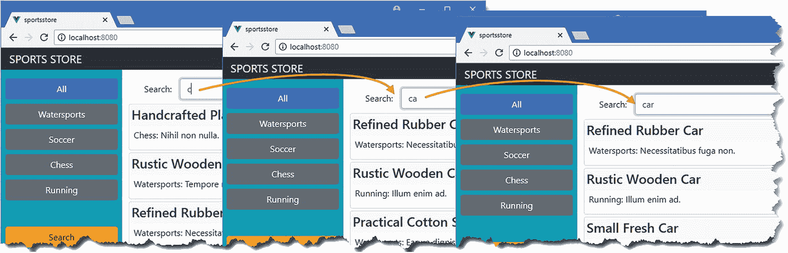
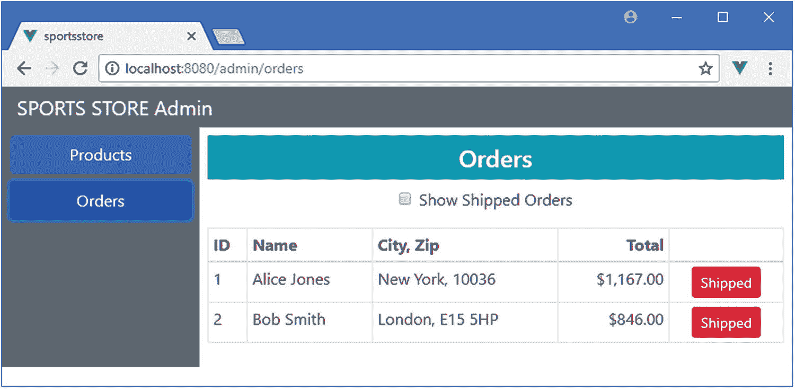

# 七、SportsStore：缩放和管理

在本章中，我继续向我在第 [5](05.html) 章中创建的 SportsStore 应用添加特性。我添加了对处理大量数据的支持，并开始实现管理应用所需的特性。

### 小费

你可以从 [`https://github.com/Apress/pro-vue-js-2`](https://github.com/Apress/pro-vue-js-2) 下载本章以及本书所有其他章节的示例项目。

## 为本章做准备

为了准备本章，我将增加应用必须处理的产品数据量。我使用了我在第 [5 章](05.html)中添加到项目中的 Faker 包，通过替换`data.js`文件的内容来生成大量的产品对象，如清单 [7-1](#PC1) 所示。

```js
var faker = require("faker");

var data = [];
var categories = ["Watersports", "Soccer", "Chess", "Running"];

faker.seed(100);

for (let i = 1; i <= 500; i++) {
    var category = faker.helpers.randomize(categories);
    data.push({
        id: i,
        name: faker.commerce.productName(),
        category: category,
        description: `${category}: ${faker.lorem.sentence(3)}`,
        price: faker.commerce.price()
    })
}

module.exports = function () {
    return {
        products: data,
        categories: categories,
        orders: []
    }
}

Listing 7-1Generating Data in the data.js File in the sportsstore Folder

```

Faker 包是一个在开发过程中产生随机数据的优秀工具，它是一种找到应用限制的有用方法，而不必手动创建真实的数据。Faker 包在 [`http://marak.github.io/faker.js`](http://marak.github.io/faker.js) 进行了描述，我用它生成了带有随机名称、描述和价格的产品数据。

要启动 RESTful web 服务，请打开命令提示符并在`sportsstore`文件夹中运行以下命令:

```js
npm run json

```

打开第二个命令提示符，在`sportsstore`文件夹中运行以下命令，启动开发工具和 HTTP 服务器:

```js
npm run serve

```

一旦初始构建过程完成，打开一个新的浏览器窗口并导航到`http://localhost:8080`以查看图 [7-1](#Fig1) 中显示的内容。


图 7-1

运行 SportsStore 应用

## 处理大量数据

您已经可以看到，应用需要做一些工作来处理 web 服务提供的大量产品数据，因为一行分页按钮太长了，以至于没有用。在接下来的小节中，我将修改 SportsStore 应用，以更有用的方式呈现数据，并减少从服务器请求的数据量。

### 改进页面导航

我将从最明显的问题开始，那就是向用户呈现一个很长的页码列表，这使得导航很困难。为了解决这个问题，我将向用户呈现一个页面按钮的受限列表，使导航更容易，尽管不能跳转到任何页面，如清单 [7-2](#PC4) 所示。

```js
<template>
    <div class="row mt-2">
        <div class="col-3 form-group">

            <select class="form-control" v-on:change="changePageSize">
                <option value="4">4 per page</option>
                <option value="8">8 per page</option>
                <option value="12">12 per page</option>
            </select>
        </div>
        <div class="text-right col">
            <button v-bind:disabled="currentPage == 1"

                v-on:click="setCurrentPage(currentPage - 1)"

                class="btn btn-secondary mx -1">Previous</button>

            <span v-if="currentPage > 4">

                <button v-on:click="setCurrentPage(1)"

                    class="btn btn-secondary mx-1">1</button>

                <span class="h4">...</span>

            </span>

            <span class="mx-1">

                <button v-for="i in pageNumbers" v-bind:key="i"

                        class="btn btn-secpmdary"

                        v-bind:class="{ 'btn-primary': i == currentPage }"

                        v-on:click="setCurrentPage(i)">{{ i }}</button>

            </span>

            <span v-if="currentPage <= pageCount - 4">

                <span class="h4">...</span>

                <button  v-on:click="setCurrentPage(pageCount)"

                    class="btn btn-secondary mx-1">{{ pageCount}}</button>

            </span>

            <button v-bind:disabled="currentPage == pageCount"

                    v-on:click="setCurrentPage(currentPage + 1)"

                    class="btn btn-secondary mx-1">Next</button>

        </div>
    </div>
</template>

<script>
    import { mapState, mapGetters, mapMutations } from "vuex";

    export default {
        computed: {
            ...mapState(["currentPage"]),
            ...mapGetters(["pageCount"]),
            pageNumbers() {

                if (this.pageCount < 4) {

                    return [...Array(this.pageCount + 1).keys()].slice(1);

                } else if (this.currentPage <= 4) {

                    return [1, 2, 3, 4, 5];

                } else  if (this.currentPage > this.pageCount - 4) {

                    return [...Array(5).keys()].reverse()

                        .map(v => this.pageCount - v);

                } else {

                    return [this.currentPage -1, this.currentPage,

                        this.currentPage + 1];

                }

            }
        },
        methods: {
            ...mapMutations(["setCurrentPage", "setPageSize"]),
            changePageSize($event) {
                this.setPageSize($event.target.value);
            }
        }
    }
</script>

Listing 7-2Improving Navigation in the PageControls.vue File in the /src/components Folder

```

不需要新的 Vue.js 特性来改变现在呈现给用户的分页方式，这些改变向用户呈现了当前选择的页面以及选择之前和之后的页面以及第一页和最后一页的选项，产生了如图 [7-2](#Fig2) 所示的结果。


图 7-2

限制分页选项

我用于页面的导航模型是模仿 Amazon 的，因为它是许多用户已经熟悉的一种方法。然而，这是一个分页模型，假设用户更可能对前几页感兴趣，并使它们更容易访问。

### 减少应用请求的数据量

应用在启动时发出一个请求，并从 web 服务获取所有可用的数据。这不是一种可扩展的方法，尤其是因为大多数数据不太可能显示给用户，因为这些数据将用于不太可能被查看的页面。为了解决这个问题，我将在用户需要时请求数据，如清单 [7-3](#PC5) 所示，预计大多数用户将从早期页面中选择产品。

```js
import Vue from "vue";
import Vuex from "vuex";
import Axios from "axios";
import CartModule from "./cart";
import OrdersModule from "./orders";

Vue.use(Vuex);

const baseUrl = "http://localhost:3500";
const productsUrl = `${baseUrl}/products`;
const categoriesUrl = `${baseUrl}/categories`;

export default new Vuex.Store({
    strict: true,
    modules:  { cart: CartModule, orders: OrdersModule },
    state: {
        //products: [],

        categoriesData: [],

        //productsTotal: 0,

        currentPage: 1,
        pageSize: 4,
        currentCategory: "All",
        pages: [],

        serverPageCount: 0

    },
    getters: {
        // productsFilteredByCategory: state => state.products

        //     .filter(p => state.currentCategory == "All"

        //         || p.category == state.currentCategory),

        processedProducts: (state) => {
            return state.pages[state.currentPage];

        },
        pageCount: (state) => state.serverPageCount,

        categories: state => ["All", ...state.categoriesData]

    },
    mutations: {
        _setCurrentPage(state, page) {
            state.currentPage = page;
        },
        _setPageSize(state, size) {

            state.pageSize = size;
            state.currentPage = 1;
        },
        _setCurrentCategory(state, category) {

            state.currentCategory = category;
            state.currentPage = 1;
        },
        // setData(state, data) {

        //     state.products = data.pdata;

        //     state.productsTotal = data.pdata.length;

        //     state.categoriesData = data.cdata.sort();

        // },

        addPage(state, page) {

            for (let i = 0; i < page.pageCount; i++) {

                Vue.set(state.pages, page.number + i,

                    page.data.slice(i * state.pageSize,

                        (i * state.pageSize) + state.pageSize));

            }

        },

        clearPages(state) {

            state.pages.splice(0, state.pages.length);

        },

        setCategories(state, categories) {

            state.categoriesData = categories;

        },

        setPageCount(state, count) {

            state.serverPageCount = Math.ceil(Number(count) / state.pageSize);

        },

    },
    actions: {
        async getData(context) {
            await context.dispatch("getPage", 2);

            context.commit("setCategories", (await Axios.get(categoriesUrl)).data);

        },
        async getPage(context, getPageCount = 1) {

            let url = `${productsUrl}?_page=${context.state.currentPage}`

                + `&_limit=${context.state.pageSize * getPageCount}`;

            if (context.state.currentCategory != "All") {

                url += `&category=${context.state.currentCategory}`;

            }

            let response = await Axios.get(url);

            context.commit("setPageCount", response.headers["x-total-count"]);

            context.commit("addPage", { number: context.state.currentPage,

                data: response.data, pageCount: getPageCount});

        },

        setCurrentPage(context, page) {

            context.commit("_setCurrentPage", page);

            if (!context.state.pages[page]) {

                context.dispatch("getPage");

            }

        },

        setPageSize(context, size) {

            context.commit("clearPages");

            context.commit("_setPageSize", size);

            context.dispatch("getPage", 2);

        },

        setCurrentCategory(context, category) {

            context.commit("clearPages");

            context.commit("_setCurrentCategory", category);

            context.dispatch("getPage", 2);

        }

    }
})

Listing 7-3Requesting Data in the index.js File in the src/store Folder

```

这些变化比看起来要简单，反映了 Vuex 对数据存储特性的严格要求。只有动作可以执行异步任务，这意味着任何导致 HTTP 数据请求的活动都必须使用动作来执行，而动作使用突变来改变状态。因此，我创建了一些动作，这些动作的名称以前被变异使用过，并在变异名称中添加了一个下划线，这样我仍然可以修改存储中的数据。这可能看起来很尴尬，但是动作到状态的流程是一个很好的模型，并且执行它有助于调试，正如我在第 [20](20.html) 章中解释的。

清单 [7-3](#PC5) 中变化的核心是发送到 web 服务的 URL 的变化。以前，URL 请求所有产品数据，如下所示:

```js
...
http://localhost:3500/products
...

```

提供 web 服务的`json-server`包支持请求的数据页面和过滤数据，使用如下 URL:

```js
...
http://localhost:3500/products?_page=3&_limit=4&category=Watersports

...

```

`_page`和`_limit`参数用于请求数据页面，而`category`参数仅用于选择`category`属性为`Watersports`的对象。这是清单 [7-3](#PC5) 中的更改引入到 SportsStore 应用中的 URL 格式。

我在清单中采用的方法是请求将显示给用户的页面中的数据。应用跟踪它从 web 服务收到的数据，并在用户导航到没有请求数据的页面时发送一个 HTTP 请求。当用户更改页面大小或选择类别时，从服务器请求的数据将被丢弃，当应用开始允许用户导航到一个页面而不触发网络请求时，将请求两个页面。

### 警告

实现复杂的方法来管理和缓存数据，以最大限度地减少应用发出的 HTTP 请求的数量，这很有诱惑力。缓存很难有效地实现，并且它给项目增加的复杂性通常会超过任何好处。我建议从一个简单的方法开始，比如清单 [7-3](#PC5) 中的方法，并且只有当你确定你需要它的时候才更主动地管理数据。

#### 确定项目的数量

当处理页面中的数据时，很难确定有多少对象可以显示分页按钮。为了帮助解决这个问题，`json-server`包在其响应中包含了一个`X-Total-Count`头，它指示集合中有多少对象。每次对一页数据发出 HTTP 请求时，我都会从响应中获取头的值，并使用它来更新页数，如下所示:

```js
...
context.commit("setPageCount", response.headers["x-total-count"]);
...

```

不是所有的 web 服务都提供这个特性，但是通常有一些类似的特性，这样您就可以确定有多少对象是可用的，而不需要请求所有的对象。

#### 将项目添加到页面数组中

Vue.js 和 Vuex 在跟踪变化和确保应用中的数据是动态的方面都做得很好。在大多数情况下，这种跟踪是自动的，不需要任何特殊的操作。但这并不是普遍正确的，JavaScript 的工作方式有一些限制，这意味着 Vue.js 需要一些特定操作的帮助，其中之一是将一个项目分配给一个数组索引，这不会触发变化检测过程。当我从服务器接收一页数据并将其添加到数组中时，我使用 Vue.js 为此提供的方法，如下所示:

```js
...

Vue.set(state.pages, page.number + i, page.data.slice(i * state.pageSize,
    (i * state.pageSize) + state.pageSize));
...

```

`Vue.set`方法接受三个参数:要修改的对象或数组、要赋值的属性或索引以及要赋值的值。正如我在第 13 章[中解释的那样，使用`Vue.set`可以确保变更被识别并作为更新处理。](13.html)

#### 更新组件以使用操作

我在清单 [7-3](#PC5) 中所做的更改需要使用已经被动作替换的突变的组件进行相应的更改。清单 [7-4](#PC10) 显示了`CategoryControls`组件所需的变更。

```js
...
<script>
    import { mapState, mapGetters, mapActions} from "vuex";

    export default {
        computed: {
            ...mapState(["currentCategory"]),
            ...mapGetters(["categories"])
        },
        methods: {
            ...mapActions(["setCurrentCategory"])

        }
    }
</script>
...

Listing 7-4Using Actions in the CategoryControls.vue File in the src/components Folder

```

为了更新组件，我用`mapActions`替换了`mapMutations`助手。这两个助手都向组件添加了方法，组件的其余部分不需要任何更改。在清单 [7-5](#PC11) 中，我更新了`PageControls`组件。

```js
...
<script>
    import { mapState, mapGetters, mapActions } from "vuex";

    export default {
        computed: {
            ...mapState(["currentPage"]),
            ...mapGetters(["pageCount"]),
            pageNumbers() {
                if (this.pageCount < 4) {
                    return [...Array(this.pageCount + 1).keys()].slice(1);
                } else if (this.currentPage <= 4) {
                    return [1, 2, 3, 4, 5];
                } else  if (this.currentPage > this.pageCount - 4) {
                    return [...Array(5).keys()].reverse()
                        .map(v => this.pageCount - v);
                } else {
                    return [this.currentPage -1, this.currentPage,
                        this.currentPage + 1];
                }
            }
        },
        methods: {
            ...mapActions(["setCurrentPage", "setPageSize"]),

            changePageSize($event) {
                this.setPageSize($event.target.value);
            }
        }
    }
</script>
...

Listing 7-5Using Actions in the PageControls.vue File in the src/components Folder

```

呈现给用户的内容在视觉上没有变化，但是如果您打开浏览器的 F12 开发人员工具，并在浏览产品时观察`Network`选项卡，您将看到发送的数据页面请求，如图 [7-3](#Fig3) 所示。


图 7-3

请求页面中的数据

### 添加搜索支持

我将在 SportsStore 应用中添加搜索产品的功能，这在处理大量数据时总是一个好主意，对于用户来说，这些数据太大了，很难完全浏览。在清单 [7-6](#PC12) 中，我已经更新了数据存储，以便可以在用于请求数据的 URL 中包含一个搜索字符串，使用了我用于 web 服务的`json-server`包提供的搜索特性。

```js
import Vue from "vue";
import Vuex from "vuex";
import Axios from "axios";
import CartModule from "./cart";
import OrdersModule from "./orders";

Vue.use(Vuex);

const baseUrl = "http://localhost:3500";
const productsUrl = `${baseUrl}/products`;
const categoriesUrl = `${baseUrl}/categories`;

export default new Vuex.Store({
    strict: true,
    modules:  { cart: CartModule, orders: OrdersModule },
    state: {
        categoriesData: [],
        currentPage: 1,
        pageSize: 4,
        currentCategory: "All",
        pages: [],
        serverPageCount: 0,
        searchTerm: "",

        showSearch: false

    },
    getters: {
        processedProducts: (state) => {
            return state.pages[state.currentPage];
        },
        pageCount: (state) => state.serverPageCount,
        categories: state => ["All", ...state.categoriesData]
    },
    mutations: {
        _setCurrentPage(state, page) {
            state.currentPage = page;
        },
        _setPageSize(state, size) {
            state.pageSize = size;
            state.currentPage = 1;
        },
        _setCurrentCategory(state, category) {
            state.currentCategory = category;
            state.currentPage = 1;
        },
        addPage(state, page) {
            for (let i = 0; i < page.pageCount; i++) {
                Vue.set(state.pages, page.number + i,
                    page.data.slice(i * state.pageSize,
                        (i * state.pageSize) + state.pageSize));
            }
        },
        clearPages(state) {
            state.pages.splice(0, state.pages.length);
        },
        setCategories(state, categories) {
            state.categoriesData = categories;
        },
        setPageCount(state, count) {
            state.serverPageCount = Math.ceil(Number(count) / state.pageSize);
        },
        setShowSearch(state, show) {

            state.showSearch = show;

        },

        setSearchTerm(state, term) {

            state.searchTerm = term;

            state.currentPage = 1;

        },

    },
    actions: {
        async getData(context) {
            await context.dispatch("getPage", 2);
            context.commit("setCategories", (await Axios.get(categoriesUrl)).data);
        },
        async getPage(context, getPageCount = 1) {
            let url = `${productsUrl}?_page=${context.state.currentPage}`
                + `&_limit=${context.state.pageSize * getPageCount}`;

            if (context.state.currentCategory != "All") {
                url += `&category=${context.state.currentCategory}`;
            }

            if (context.state.searchTerm != "") {

                url += `&q=${context.state.searchTerm}`;

            }

            let response = await Axios.get(url);
            context.commit("setPageCount", response.headers["x-total-count"]);
            context.commit("addPage", { number: context.state.currentPage,
                data: response.data, pageCount: getPageCount});
        },
        setCurrentPage(context, page) {
            context.commit("_setCurrentPage", page);
            if (!context.state.pages[page]) {
                context.dispatch("getPage");
            }
        },
        setPageSize(context, size) {
            context.commit("clearPages");
            context.commit("_setPageSize", size);
            context.dispatch("getPage", 2);
        },
        setCurrentCategory(context, category) {
            context.commit("clearPages");
            context.commit("_setCurrentCategory", category);
            context.dispatch("getPage", 2);
        },
        search(context, term) {

            context.commit("setSearchTerm", term);

            context.commit("clearPages");

            context.dispatch("getPage", 2);

        },

        clearSearchTerm(context) {

            context.commit("setSearchTerm", "");

            context.commit("clearPages");

            context.dispatch("getPage", 2);

        }

    }
})

Listing 7-6Adding Search Support in the index.js File in the src/store Folder

```

SportsStore 搜索特性需要两个状态属性:`showSearch`属性将决定是否向用户显示搜索框，而`searchTerm`属性将指定传递给 web 服务进行搜索的术语。`json-server`包支持通过`q`参数进行搜索，这意味着应用在搜索时会生成这样的 URL:

```js
...
http://localhost:3500/products?_page=3&_limit=4&category=Soccer&q=car

...

```

这个 URL 请求类别属性为`Soccer`的四个项目的第三个页面，并且具有包含术语`car`的任何字段。为了向用户呈现搜索特性，我在`src/components`文件夹中添加了一个名为`Search.vue`的文件，其内容如清单 [7-7](#PC14) 所示。

```js
<template>
    <div v-if="showSearch" class="row my-2">
        <label class="col-2 col-form-label text-right">Search:</label>
        <input class="col form-control"
            v-bind:value="searchTerm" v-on:input="doSearch"
            placeholder="Enter search term..." />
        <button class="col-1 btn btn-sm btn-secondary mx-4"
                v-on:click="handleClose">
            Close
        </button>
    </div>
</template>

<script>

import { mapMutations, mapState, mapActions } from "vuex";

export default {
    computed: {
        ...mapState(["showSearch", "searchTerm"])
    },
    methods: {
        ...mapMutations(["setShowSearch"]),
        ...mapActions(["clearSearchTerm", "search"]),
        handleClose() {
            this.clearSearchTerm();
            this.setShowSearch(false);
        },
        doSearch($event) {
            this.search($event.target.value);
        }
    }
}
</script>

Listing 7-7The Contents of the Search.vue File in the src/components Folder

```

该组件响应数据存储属性，向用户显示一个可用于输入搜索词的`input`元素。通过触发搜索，`v-on`指令用于在每次用户编辑`input`的内容时做出响应。为了在应用中引入搜索特性，我对`Store`组件进行了清单 [7-8](#PC15) 中所示的修改。

```js
<template>
    <div class="container-fluid">
        <div class="row">
            <div class="col bg-dark text-white">
                <a class="navbar-brand">SPORTS STORE</a>
                <cart-summary />
            </div>
        </div>
        <div class="row">
            <div class="col-3 bg-info p-2">
                <CategoryControls class="mb-5" />
                <button class="btn btn-block btn-warning mt-5"
                        v-on:click="setShowSearch(true)">
                    Search
                </button>
            </div>
            <div class="col-9 p-2">
                <Search />

                <ProductList />
            </div>
        </div>
    </div>
</template>

<script>
    import ProductList from "./ProductList";
    import CategoryControls from "./CategoryControls";
    import CartSummary from "./CartSummary";
    import { mapMutations } from "vuex";

    import Search from "./Search";

    export default {
        components: { ProductList, CategoryControls, CartSummary, Search },

        methods: {
            ...mapMutations(["setShowSearch"])

        }
    }
</script>

Listing 7-8Enabling Search in the Store.vue File in the src/components Folder

```

我在类别列表旁边添加了一个按钮，将向用户显示搜索特性，并注册了我在清单 [7-7](#PC14) 中定义的组件。结果是用户可以点击搜索按钮并输入文本进行搜索，如图 [7-4](#Fig4) 所示。结果显示在页面上，可以按类别过滤。



图 7-4

执行搜索

## 启动管理功能

任何向用户呈现内容的应用都需要某种程度的管理。对于 SportsStore，这意味着管理产品目录和客户下的订单。在接下来的小节中，我将开始向项目添加管理特性的过程，从身份验证开始，然后构建呈现管理特性的结构。

### 实施身份验证

RESTful web 服务的身份验证结果是一个 JSON Web 令牌(JWT ),它由服务器返回，并且必须包含在任何后续请求中，以表明应用被授权执行受保护的操作。您可以在 [`https://tools.ietf.org/html/rfc7519`](https://tools.ietf.org/html/rfc7519) 阅读 JWT 规范，但是对于 SportsStore 应用来说，只要知道应用可以通过向`/login` URL 发送 POST 请求来验证用户就足够了，在请求体中包含一个 JSON 格式的对象，其中包含名称和密码属性。第 [5](05.html) 章使用的认证码只有一组有效凭证，如表 [7-1](#Tab1) 所示。

表 7-1

RESTful Web 服务支持的身份验证凭证

<colgroup><col class="tcol1 align-left"> <col class="tcol2 align-left"></colgroup> 
| 

名字

 | 

描述

 |
| --- | --- |
| `admin` | `secret` |

正如我在第 [5](05.html) 章中提到的，您不应该在实际项目中硬编码凭证，但这是您在 SportsStore 应用中需要的用户名和密码。

如果正确的凭证被发送到`/login` URL，那么来自 RESTful web 服务的响应将包含一个 JSON 对象，如下所示:

```js
{
  "success": true,
  "token":"eyJhbGciOiJIUzI1NiIsInR5cCI6IkpXVCJ9.eyJkYXRhIjoiYWRtaW4iLCJleHBpcmVz
           SW4iOiIxaCIsImlhdCI6MTQ3ODk1NjI1Mn0.lJaDDrSu-bHBtdWrz0312p_DG5tKypGv6cA
           NgOyzlg8"
}

```

`success`属性描述认证操作的结果，而`token`属性包含 JWT，它应该包含在使用`Authorization` HTTP 头的后续请求中，格式如下:

```js
Authorization: Bearer<eyJhbGciOiJIUzI1NiIsInR5cCI6IkpXVCJ9.eyJkYXRhIjoiYWRtaW4iLC
                     JleHBpcmVzSW4iOiIxaCIsImlhdCI6MTQ3ODk1NjI1Mn0.lJaDDrSu-bHBtd
                     Wrz0312p_DG5tKypGv6cANgOyzlg8>

```

如果向服务器发送了错误的凭证，那么响应中返回的 JSON 对象将只包含一个设置为`false`的`success`属性，如下所示:

```js
{
  "success": false
}

```

我配置了服务器返回的 JWT 令牌，使它们在一小时后过期。

#### 扩展数据存储

为了支持在 HTTP 请求中包含认证头，我在`src/store`文件夹中添加了一个名为`auth.js`的文件，其内容如清单 [7-9](#PC19) 所示。

```js
import Axios from "axios";

const loginUrl = "http://localhost:3500/login";

export default {
    state: {
        authenticated: false,
        jwt: null
    },
    getters: {
        authenticatedAxios(state) {
            return Axios.create({
                headers: {
                    "Authorization": `Bearer<${state.jwt}>`
                }
            });
        }
    },
    mutations: {
        setAuthenticated(state, header) {
            state.jwt = header;
            state.authenticated = true;
        },
        clearAuthentication(state) {
            state.authenticated = false;
            state.jwt = null;
        }
    },
    actions: {
        async authenticate(context, credentials) {
            let response = await Axios.post(loginUrl, credentials);
            if (response.data.success == true) {
                context.commit("setAuthenticated", response.data.token);
            }
        }
    }
}

Listing 7-9The Contents of the auth.js File in the src/store Folder

```

authenticate 动作使用 Axios 向 web 服务的`/login` URL 发送 HTTP POST 请求，如果请求成功，则设置`authenticated`和`jwt`状态属性。Axios `create`方法用于配置一个可用于发出请求的对象，我在`authenticatedAxious` getter 中使用这个特性来提供一个 Axios 对象，该对象将在它发出的所有请求中包含`Authorization`头。在清单 [7-10](#PC20) 中，我将新模块添加到数据存储中。

```js
import Vue from "vue";
import Vuex from "vuex";
import Axios from "axios";
import CartModule from "./cart";
import OrdersModule from "./orders";

import AuthModule from "./auth";

Vue.use(Vuex);

const baseUrl = "http://localhost:3500";
const productsUrl = `${baseUrl}/products`;
const categoriesUrl = `${baseUrl}/categories`;

export default new Vuex.Store({
    strict: true,
    modules:  { cart: CartModule, orders: OrdersModule, auth: AuthModule },

    // ...data store features omitted for brevity...

})

Listing 7-10Adding a Module in the index.js File in the src/store Folder

```

#### 添加管理组件

为了开始进行身份验证，我需要两个组件，其中一个将提示用户输入凭据，另一个将在用户通过身份验证后显示给用户，并提供管理功能。为了将管理功能与应用的其余部分分开，我创建了`src/components/admin`文件夹，并在其中添加了一个名为`Admin.vue`的文件，其内容如清单 [7-11](#PC21) 所示。

```js
<template>
    <div class="bg-danger text-white text-center h4 p-2">Admin Features</div>
</template>

Listing 7-11The Contents of the Admin.vue File in the src/components/admin Folder

```

这只是一个占位符，以便我在获得基本特性的同时有一些东西可以使用，稍后我会用真正的管理特性替换这些内容。为了提示用户输入认证凭证，我在`src/components/admin`文件夹中添加了一个名为`Authentication.vue`的文件，其内容如清单 [7-12](#PC22) 所示。

### 注意

在清单 [7-12](#PC22) 中，我将用户名和密码属性的值设置为表 [7-1](#Tab1) 中的凭证，以简化开发过程。当您按照示例进行操作并对项目进行更改时，您经常需要重新进行身份验证，如果您每次都必须键入凭据，这很快就会变得令人沮丧。在第 8 章[中，我将在准备部署应用时删除组件中的值。](08.html)

```js
<template>
    <div class="m-2">
        <h4 class="bg-primary text-white text-center p-2">
            SportsStore Administration
        </h4>

        <h4 v-if="showFailureMessage"
                class="bg-danger text-white text-center p-2 my-2">
            Authentication Failed. Please try again.
        </h4>

        <div class="form-group">
            <label>Username</label>
            <input class="form-control" v-model="$v.username.$model">
            <validation-error v-bind:validation="$v.username" />
        </div>
        <div class="form-group">
            <label>Password</label>
            <input type="password" class="form-control" v-model="$v.password.$model">
            <validation-error v-bind:validation="$v.password" />
        </div>
        <div class="text-center">
            <button class="btn btn-primary" v-on:click="handleAuth">Log In</button>
        </div>
    </div>
</template>
<script>

import { required } from "vuelidate/lib/validators";
import { mapActions, mapState } from "vuex";
import ValidationError  from "../ValidationError";

export default {
    components: { ValidationError },
    data: function() {
        return {
            username: "admin",
            password: "secret",
            showFailureMessage: false,
        }
    },
    computed: {
        ...mapState({authenticated: state => state.auth.authenticated })
    },
    validations: {
        username: { required },
        password: { required }
    },
    methods: {
        ...mapActions(["authenticate"]),
        async handleAuth() {
            this.$v.$touch();
            if (!this.$v.$invalid) {
                await this.authenticate({ name: this.username,
                    password: this.password });
                if (this.authenticated) {
                    this.$router.push("/admin");
                } else {
                    this.showFailureMessage = true;
                }
            }
        }
    }
}

</script>

Listing 7-12The Contents of the Authentication.vue File in the src/components/admin Folder

```

该组件为用户提供了一对输入元素和一个按钮，该按钮使用清单 [7-9](#PC19) 中的数据存储特性执行身份验证，并通过数据验证来确保用户提供用户名和密码的值。如果身份验证失败，则会显示一条警告消息。如果认证成功，则使用路由系统导航到`/admin` URL。为了配置路由系统来支持新的组件，我添加了清单 [7-13](#PC23) 中所示的路由。

```js
import Vue from "vue";
import VueRouter  from "vue-router";

import Store from "../components/Store";
import ShoppingCart from "../components/ShoppingCart";
import Checkout from "../components/Checkout";
import OrderThanks from "../components/OrderThanks";

import Authentication from "../components/admin/Authentication";

import Admin from "../components/admin/Admin";

Vue.use(VueRouter);

export default new VueRouter({
    mode: "history",
    routes: [
        { path: "/", component: Store },
        { path: "/cart", component: ShoppingCart },
        { path: "/checkout", component: Checkout},
        { path: "/thanks/:id", component: OrderThanks},
        { path: "/login", component: Authentication },

        { path: "/admin", component: Admin},

        { path: "*", redirect: "/"}
    ]
})

Listing 7-13Adding Routes in the index.js File in the src/router Folder

```

要测试认证过程，导航至`http://localhost:8080/login`，输入用户名和密码，然后点击登录按钮。如果您使用表 [7-1](#Tab1) 中的凭证，认证将会成功，您将会看到占位符管理内容。如果您使用不同的凭据，身份验证将会失败，并且您会看到一个错误。两种结果如图 [7-5](#Fig5) 所示。


图 7-5

认证用户

#### 添加路由保护

目前，没有什么可以阻止用户直接导航到`/admin` URL 并绕过认证。为了防止这种情况，我添加了一个路线*守卫*，这是一个在路线即将改变时进行评估的功能，可以阻止或改变导航。Vue 路由器包提供了一系列不同的路由保护选项，我会在第 24 章[中描述。对于这一章，我需要一个特定于`/admin` URL 的路径的防护，如果用户没有被认证，它将阻止导航，如清单](24.html) [7-14](#PC24) 所示。

```js
import Vue from "vue";
import VueRouter  from "vue-router";

import Store from "../components/Store";
import ShoppingCart from "../components/ShoppingCart";
import Checkout from "../components/Checkout";
import OrderThanks from "../components/OrderThanks";
import Authentication from "../components/admin/Authentication";
import Admin from "../components/admin/Admin";

import dataStore from "../store";

Vue.use(VueRouter);

export default new VueRouter({
    mode: "history",
    routes: [
        { path: "/", component: Store },
        { path: "/cart", component: ShoppingCart },
        { path: "/checkout", component: Checkout},
        { path: "/thanks/:id", component: OrderThanks},
        { path: "/login", component: Authentication },
        { path: "/admin", component: Admin,
            beforeEnter(to, from, next) {

                if (dataStore.state.auth.authenticated) {

                    next();

                } else {

                    next("/login");

                }

            }

        },
        { path: "*", redirect: "/"}
    ]
})

Listing 7-14Adding a Route Guard in the index.js File in the src/router Folder

```

当用户导航到`/admin` URL 并检查数据存储以查看用户是否已经被认证时，调用`beforeEnter`函数。导航卫士通过调用作为参数接收的`next`函数来工作。当守卫不带参数地调用`next`函数时，导航被批准。通过调用带有替换 URL 的`next`来阻止导航，在这个例子中是`/login`来提示用户输入凭证。要查看效果，导航到`http://localhost:8080/admin`，您会看到路由守卫将浏览器重定向到`/login` URL，如图 [7-6](#Fig6) 所示。


图 7-6

路线守卫的作用

注意，我使用了一个`import`语句来访问数据存储。我在前面的例子中使用的`mapState`助手函数和可用于直接访问数据存储的`$store`属性只能在组件中使用，在应用的其他地方不可用，比如在路由配置中。`import`语句为我提供了对数据存储的访问，通过它我可以读取`state`属性的值，route guard 需要这个值来确定用户是否已经过身份验证。

### 添加管理组件结构

现在，身份验证功能已经就绪，我将返回到主要的管理功能。管理员需要能够管理呈现给用户的产品集合，查看订单并将它们标记为已发货。我将首先为每个功能区域创建占位符组件，使用它们来设置向用户显示它们的结构，然后实现每个功能的细节。我在`src/components/admin`文件夹中添加了一个名为`ProductAdmin.vue`的文件，内容如清单 [7-15](#PC25) 所示。

```js
<template>
    <div class="bg-danger text-white text-center h4 p-2">
        Product Admin
    </div>
</template>

Listing 7-15The Contents of the ProductAdmin.vue File in the src/components/admin Folder

```

接下来，我在同一个文件夹中添加了一个名为`OrderAdmin.vue`的文件，其内容如清单 [7-16](#PC26) 所示。

```js
<template>
    <div class="bg-danger text-white text-center h4 p-2">
        Order Admin
    </div>
</template>

Listing 7-16The Contents of the OrderAdmin.vue File in the src/components/admin Folder

```

为了向用户展示这些新组件，我用清单 [7-17](#PC27) 中所示的元素替换了`Admin`组件中的内容。

```js
<template>
    <div class="container-fluid">

        <div class="row">

            <div class="col bg-secondary text-white">

                <a class="navbar-brand">SPORTS STORE Admin</a>

            </div>

        </div>

        <div class="row">

            <div class="col-3 bg-secondary p-2">

                <router-link to="/admin/products" class="btn btn-block btn-primary"

                        active-class="active">

                    Products

                </router-link>

                <router-link to="/admin/orders"  class="btn btn-block btn-primary"

                        active-class="active">

                    Orders

                </router-link>

            </div>

            <div class="col-9 p-2">

                <router-view />

            </div>

        </div>

    </div>

</template>

Listing 7-17Presenting Components in the Admin.vue File in the src/components/admin Folder

```

应用可以包含多个`router-view`元素，我在这里使用了一个，这样我就可以使用 URL 路由在产品和订单管理组件之间进行切换，稍后我将对其进行配置。为了选择组件，我使用了被格式化为按钮的`router-link`元素。为了指示哪个按钮代表激活的选择，我使用了`active-class`属性，它指定了一个类，当由它的`to`属性指定的路线激活时，元素将被添加到这个类中，如第 [23 章](23.html)中所解释的。

为了配置新的路由器视图元素，我将清单 [7-18](#PC28) 中所示的路由添加到应用的路由配置中。

```js
import Vue from "vue";
import VueRouter  from "vue-router";
import Store from "../components/Store";
import ShoppingCart from "../components/ShoppingCart";
import Checkout from "../components/Checkout";
import OrderThanks from "../components/OrderThanks";
import Authentication from "../components/admin/Authentication";
import Admin from "../components/admin/Admin";

import ProductAdmin from "../components/admin/ProductAdmin";

import OrderAdmin from "../components/admin/OrderAdmin";

import dataStore from "../store";

Vue.use(VueRouter);

export default new VueRouter({
    mode: "history",
    routes: [
        { path: "/", component: Store },
        { path: "/cart", component: ShoppingCart },
        { path: "/checkout", component: Checkout},
        { path: "/thanks/:id", component: OrderThanks},
        { path: "/login", component: Authentication },
        { path: "/admin", component: Admin,
            beforeEnter(to, from, next) {
                if (dataStore.state.auth.authenticated) {
                    next();
                } else {
                    next("/login");
                }
            },
            children: [

                { path: "products", component: ProductAdmin },

                { path: "orders", component: OrderAdmin },

                { path: "", redirect: "/admin/products"}

            ]

        },
        { path: "*", redirect: "/"}
    ]
})

Listing 7-18Adding Routes in the index.js File in the src/router Folder

```

新增加的内容使用了*子路由*特性，我在第 [23](23.html) 章对此进行了描述，它允许使用嵌套的`router-view`元素。结果是导航到`/admin/products`将显示顶层的`Admin`组件，然后是`ProductAdmin`组件，而`/admin/orders` URL 将显示`OrderAdmin`组件，如图 [7-7](#Fig7) 所示。还有一个回退路由将`/admin` URL 重定向到`/admin/products`。


图 7-7

使用子路由和嵌套路由器视图元素

### 实施订单管理功能

为了让管理员管理订单，我需要提供来自服务器的对象列表，并提供将每个对象标记为已发货的方法。这些特性的起点是扩展数据存储，如清单 [7-19](#PC29) 所示。

```js
import Axios from "axios";

import Vue from "vue";

const ORDERS_URL = "http://localhost:3500/orders";

export default {
    state: {

        orders:[]

    },

    mutations: {

        setOrders(state, data) {

            state.orders = data;

        },

        changeOrderShipped(state, order) {

            Vue.set(order, "shipped",

                order.shipped == null || !order.shipped ? true : false);

        }

    },

    actions: {
        async storeOrder(context, order) {
            order.cartLines = context.rootState.cart.lines;
            return (await Axios.post(ORDERS_URL, order)).data.id;
        },
        async getOrders(context) {

            context.commit("setOrders",

                (await context.rootGetters.authenticatedAxios.get(ORDERS_URL)).data);

        },

        async updateOrder(context, order) {

            context.commit("changeOrderShipped", order);

            await context.rootGetters.authenticatedAxios

                .put(`${ORDERS_URL}/${order.id}`, order);

        }

    }
}

Listing 7-19Adding Features in the orders.js File in the src/store Folder

```

您已经看到了如何使用 Vue.js 在按需请求的页面中呈现数据，所以我保持了简单的订单特性:所有数据都是通过`getOrders`动作请求的，订单可以使用`updateOrder`动作修改。

为了提供一个订单列表，并允许对它们进行标记和发货，我替换了来自`OrderAdmin`组件的占位符内容，并将其替换为清单 [7-20](#PC30) 中所示的内容和代码。

```js
<template>
    <div>
        <h4 class="bg-info text-white text-center p-2">Orders</h4>
        <div class="form-group text-center">
            <input class="form-check-input" type="checkbox" v-model="showShipped" />
            <label class="form-check-label">Show Shipped Orders</label>
        </div>
        <table class="table table-sm table-bordered">
            <thead>
                <tr>
                    <th>ID</th><th>Name</th><th>City, Zip</th>
                    <th class="text-right">Total</th>
                    <th></th>
                </tr>
            </thead>
            <tbody>
                <tr v-if="displayOrders.length == 0">
                    <td colspan="5">There are no orders</td>
                </tr>
                <tr v-for="o in displayOrders" v-bind:key="o.id">
                    <td>{{ o.id }}</td>
                    <td>{{ o.name }}</td>
                    <td>{{ `${o.city}, ${o.zip}` }}</td>
                    <td class="text-right">{{ getTotal(o) | currency }}</td>
                    <td class="text-center">
                        <button class="btn btn-sm btn-danger"
                            v-on:click="shipOrder(o)">
                                {{ o.shipped ? 'Not Shipped' : 'Shipped' }}
                        </button>
                    </td>
                </tr>
            </tbody>
        </table>
    </div>
</template>

<script>

import { mapState, mapActions, mapMutations } from "vuex";

export default {
    data: function() {
        return {
            showShipped: false
        }
    },
    computed: {
        ...mapState({ orders: state => state.orders.orders}),
        displayOrders() {
            return this.showShipped ? this.orders
                : this.orders.filter(o => o.shipped != true);
        }
    },
    methods: {
        ...mapMutations(["changeOrderShipped"]),
        ...mapActions(["getOrders", "updateOrder"]),
        getTotal(order) {
            if (order.cartLines != null && order.cartLines.length > 0) {
                return order.cartLines.reduce((total, line) =>
                    total + (line.quantity * line.product.price), 0)
            } else {
                return 0;
            }
        },
        shipOrder(order) {
            this.updateOrder(order);
        }
    },
    created() {
        this.getOrders();
    }
}
</script>

Listing 7-20Managing Orders in the OrderAdmin.vue File in the src/components/admin Folder

```

该组件显示一个订单表，其中每个订单都有一个更改发货状态的按钮。要查看效果，导航到`http://localhost:8080`并使用商店功能创建一个或多个订单，然后导航到`http://localhost:8080/admin`，验证自己，并单击订单按钮查看和管理列表，如图 [7-8](#Fig8) 所示。



图 7-8

管理订单

## 摘要

在本章中，我继续构建 SportsStore 应用。我向您展示了如何使用 Vue.js 及其核心库来处理大量的数据，并且我实现了初始的管理特性，从认证和订单管理开始。在下一章中，我将完成管理特性并部署完整的应用。