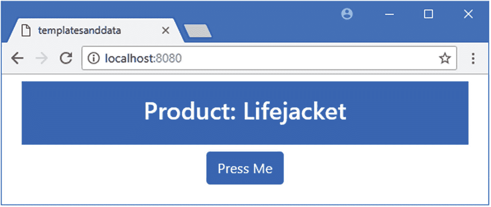
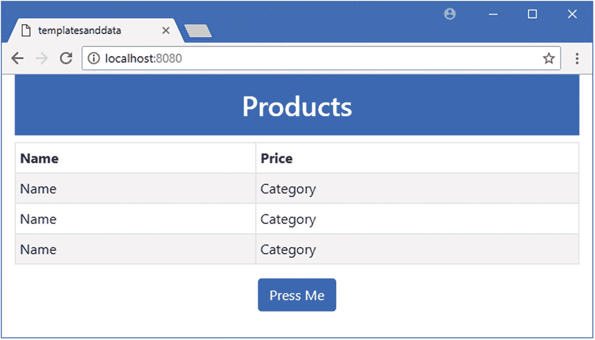
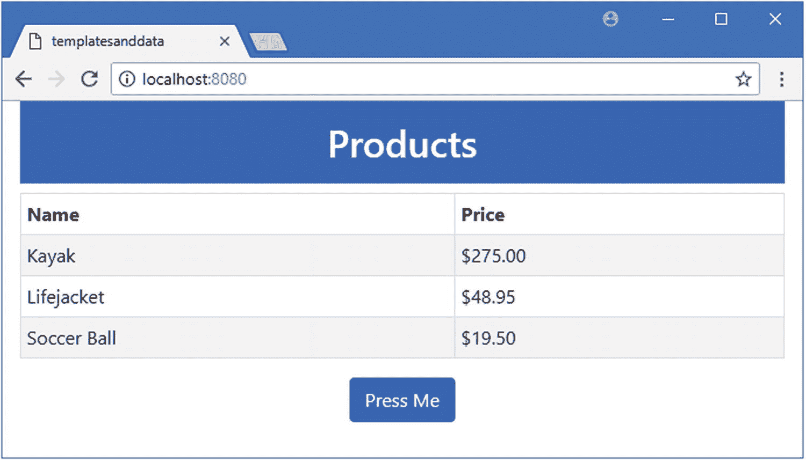
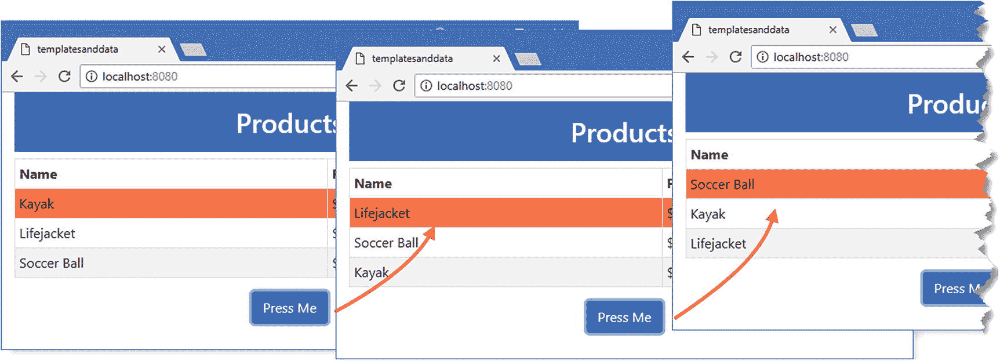
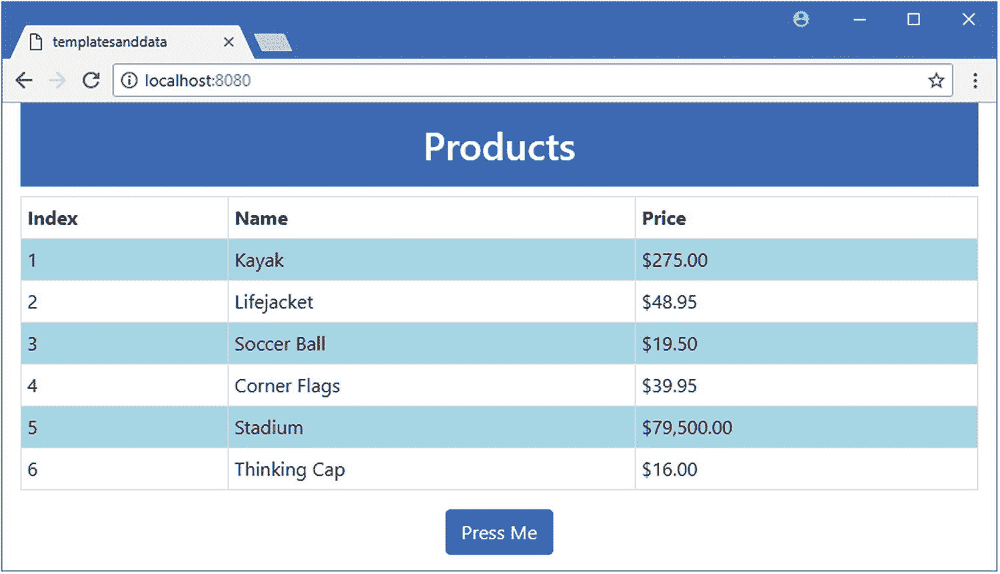
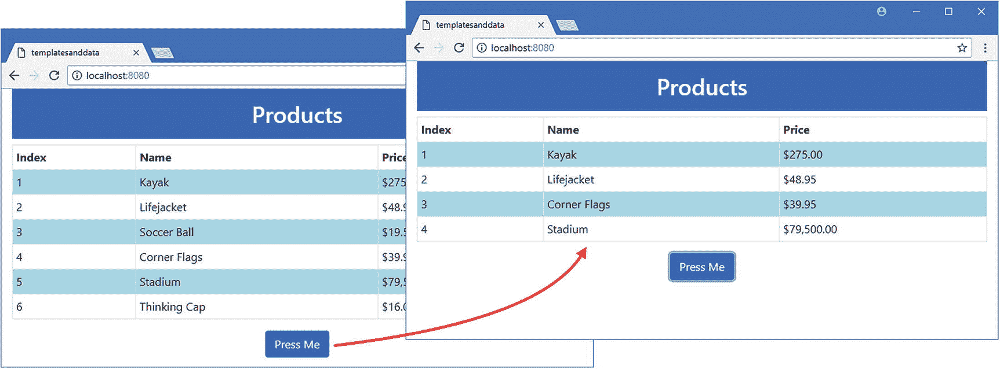
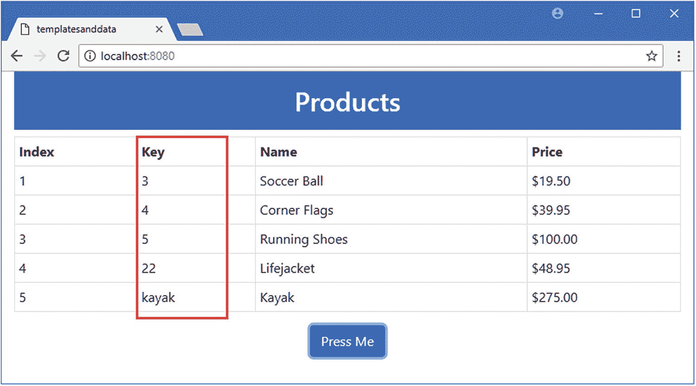
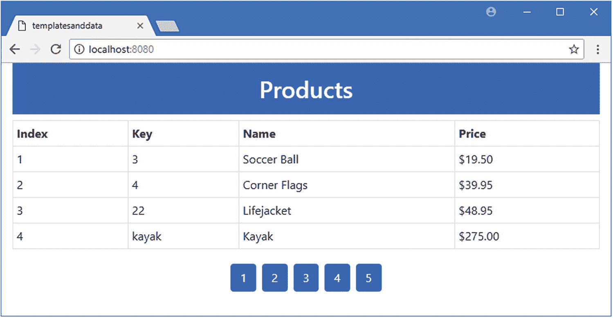
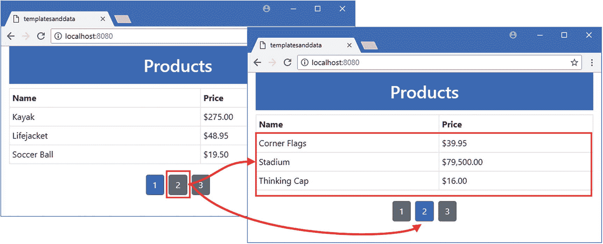

# 十三、使用重复器指令

在本章中，我将继续描述内置的 Vue.js 指令，并将重点放在`v-for`指令上，它通常用于填充列表并为表格和网格布局生成行。表 [13-1](#Tab1) 将`v-for`指令置于上下文中。

表 13-1

将 v-for 指令放在上下文中

<colgroup><col class="tcol1 align-left"> <col class="tcol2 align-left"></colgroup> 
| 

问题

 | 

回答

 |
| --- | --- |
| 这是什么？ | v-for 指令用于为数组中的每个项目或对象定义的每个属性复制一组 HTML 元素。 |
| 为什么有用？ | v-for 指令定义了一个变量，该变量提供对正在处理的对象的访问，可以在数据绑定中使用该变量来自定义重复的 HTML 元素。 |
| 如何使用？ | v-for 指令应用于要复制的顶级元素，它的表达式指定了对象的源和变量名，通过它们可以在数据绑定中引用每个对象。 |
| 有什么陷阱或限制吗？ | v-for 指令不支持 Set 和 Map 等 JavaScript 集合，必须注意对象定义的属性的枚举顺序。 |
| 还有其他选择吗？ | 你可以编写一个自定义指令，如第 26 章所述，来执行类似的任务，但是 v-for 指令包含了许多优化，使得它在处理大型数据集时更有效。 |

表 [13-2](#Tab2) 总结了本章内容。

表 13-2

章节总结

<colgroup><col class="tcol1 align-left"> <col class="tcol2 align-left"> <col class="tcol3 align-left"></colgroup> 
| 

问题

 | 

解决办法

 | 

列表

 |
| --- | --- | --- |
| 对数组中的每个对象或对象定义的每个属性重复相同的元素集 | 使用`v-for`指令 | 3, 13, 15–16 |
| 引用复制的元素集中的当前对象 | 使用`v-for`指令的别名功能 | four |
| 将 HTML 元素与特定对象相关联 | 使用`v-bind`指令定义一个`key`属性 | 5–7 |
| 引用当前对象在数组中的位置 | 使用`v-for`指令的索引功能 | eight |
| 确保检测到对数组索引的更改 | 使用`Vue.set`方法 | 9–11 |
| 没有数据源的重复元素 | 在`v-for`指令的表达式中使用一个数字值代替数据源 | Fourteen |

## 为本章做准备

在这一章中，我继续使用第 [12 章](12.html)中的`templatesanddata`项目。为了准备本章，我简化了应用的根组件，如清单 [13-1](#PC1) 所示。

### 小费

你可以从 [`https://github.com/Apress/pro-vue-js-2`](https://github.com/Apress/pro-vue-js-2) 下载本章以及本书其他章节的示例项目。

```js
<template>
    <div class="container-fluid">
        <div class="bg-primary text-white m-2 p-3 text-center">
            <h3>Product: {{ name }}</h3>
        </div>
        <div class="text-center">
            <button v-on:click="handleClick" class="btn btn-primary">
                Press Me
            </button>
        </div>
    </div>
</template>

<script>
    export default {
        name: "MyComponent",
        data: function () {
            return {
                name: "Lifejacket"
            }
        },
        methods: {
            handleClick() {
                // do nothing
            }
        }
    }
</script>

Listing 13-1Simplifying the Content of the App.vue File in the src Folder

```

保存对`App.vue`文件的修改，运行`templatesanddata`文件夹中清单 [13-2](#PC2) 所示的命令，启动 Vue.js 开发工具。

```js
npm run serve

Listing 13-2Starting the Development Tools

```

打开一个新的浏览器窗口并导航至`http://localhost:8080`以查看如图 [13-1](#Fig1) 所示的内容。



图 13-1

运行示例应用

## 枚举数组

大多数应用处理必须呈现给用户的相关对象的数组，通常是为了在表格或网格布局中创建行。指令用于为数组中的每个对象重复一组 HTML 元素。在清单 [13-3](#PC3) 中，我使用了`v-for`指令来枚举对象数组以填充一个表。

### 注意

对于本节中的示例，您将看到一些 linter 警告。当我介绍由`v-for`指令提供的特性时，这些警告将被处理。

```js
<template>
    <div class="container-fluid">
        <h2 class="bg-primary text-white text-center p-3">Products</h2>

        <table class="table table-sm table-bordered table-striped text-left">

            <tr><th>Name</th><th>Price</th></tr>

            <tbody>

                <tr v-for="p in products">

                    <td>Name</td>

                    <td>Category</td>

                </tr>

            </tbody>

        </table>

        <div class="text-center">
            <button v-on:click="handleClick" class="btn btn-primary">
                Press Me
            </button>
        </div>
    </div>
</template>

<script>
    export default {
        name: "MyComponent",
        data: function () {
            return {
                products: [

                    { name: "Kayak", price: 275 },

                    { name: "Lifejacket", price: 48.95 },

                    { name: "Soccer Ball", price: 19.50 }]

            }
        },
        methods: {
            handleClick() {
                // do nothing
            }
        }
    }
</script>

Listing 13-3Enumerating an Array in the App.vue File in the src Folder

```

名为`products`的`data`属性的值是一个对象数组，`v-for`指令处理数组中的每个对象以产生如图 [13-2](#Fig2) 所示的内容。这还不是一个特别有用的结果，但是`v-for`指令会引起混淆，需要仔细解释。



图 13-2

枚举对象以创建表格行

我在模板中应用了`v-for`指令，如下所示:

```js
...
<tr v-for="p in products">
    <td>Name</td>
    <td>Category</td>
</tr>
...

```

`v-for`指令的表达式必须是特定的形式: *<别名>在<源>* 中。 *source* 项是要被处理的对象的源，并且在本例中指定了名为`products`的数据属性。`in`关键字将数组与*别名*分开，后者是一个临时变量，在处理时分配给数组中的每个对象。

在示例中，别名是`p`，源是`products`。应用该指令告诉`v-for`为 products 数组中的每个对象复制`tr`元素和它包含的两个`td`元素，如下所示:

```js
...
<tbody>
    <tr><td>Name</td><td>Category</td></tr>
    <tr><td>Name</td> <td>Category</td></tr>
    <tr><td>Name</td> <td>Category</td></tr>
</tbody>
...

```

`product`数组包含三个对象，因此`v-for`指令复制了三次`tr`和`td`元素。

### 使用别名

前面的示例为源中的每个对象重复了相同的内容。大多数应用需要定制为每个对象生成的内容，这就是别名的作用，别名是数组中的每个对象在被`v-for`指令处理时被赋予的变量。别名很有用，因为它可以用在由`v-for`指令重复的元素内的数据绑定中，如清单 [13-4](#PC6) 所示。

```js
<template>
    <div class="container-fluid">
        <h2 class="bg-primary text-white text-center p-3">Products</h2>
        <table class="table table-sm table-bordered table-striped text-left">
            <tr><th>Name</th><th>Price</th></tr>
            <tbody>
                <tr v-for="p in products">

                    <td>{{ p.name }}</td>

                    <td>{{ p.price | currency }}</td>

                </tr>

            </tbody>
        </table>
        <div class="text-center">
            <button v-on:click="handleClick" class="btn btn-primary">
                Press Me
            </button>
        </div>
    </div>
</template>

<script>
    export default {
        name: "MyComponent",
        data: function () {
            return {
                products: [
                    { name: "Kayak", price: 275 },
                    { name: "Lifejacket", price: 48.95 },
                    { name: "Soccer Ball", price: 19.50 }]
            }
        },
        filters: {

            currency(value) {

                return new Intl.NumberFormat("en-US",

                    { style: "currency", currency: "USD", }).format(value);

            },

        },

        methods: {
            handleClick() {
                // do nothing
            }
        }
    }
</script>

Listing 13-4Using the v-for Alias in the App.vue File in the src Folder

```

本例中别名变量的名称是`p`，我使用了文本插值绑定，通过别名显示每个产品的`name`和`price`属性的值，绑定表达式为`p.name`和`p.price`。

```js
...
<tr v-for="p in products">
    <td>{{ p.name }}</td>
    <td>{{ p.price | currency }}</td>
</tr>
...

```

我在第 [11](11.html) 章中描述的所有文本插值特性都可以与一个`v-for`别名一起使用，我恢复了`currency`过滤器并使用它来格式化价格属性，产生了如图 [13-3](#Fig3) 所示的结果。



图 13-3

使用 v-for 指令别名

在数据绑定中包含分配给别名的对象的能力使得`v-for`指令非常有用，允许为每个被处理的对象生成不同的内容。

### 识别钥匙

如果您查看开发工具的输出——无论是在命令行上还是在浏览器的 JavaScript 控制台上——您将会看到 linter 正在报告一个警告。

```js
...
error: Elements in iteration expect to have 'v-bind:key' directives (vue/require-v-for-key)
   5 |             <tr><th>Name</th><th>Price</th></tr>
   6 |             <tbody>
>  7 |                 <tr v-for="p in products">
     |                 ^
   8 |                     <td>{{ p.name }}</td>
   9 |                     <td>{{ p.price | currency }}</td>
  10 |                 </tr>
...

```

这个警告与`v-for`指令处理对象顺序变化的方式有关。默认情况下，`v-for`指令通过更新它所创建的每个元素显示的内容来响应它所处理的对象顺序的变化。在本例中，这意味着重新访问已经创建的每个`tr`元素，并更新包含在`td`元素中的文本。

要了解这些变化是如何进行的，需要做一些工作。在清单 [13-5](#PC9) 中，我在`handleClick`方法中添加了一条语句，从数组中移除第一项，并在末尾再次插入它。我还向组件添加了一个`style`元素，其样式选择了一个`id`为`tagged`的元素，并设置了它的背景色。

```js
...
<script>
    export default {
        name: "MyComponent",
        data: function () {
            return {
                products: [
                    { name: "Kayak", price: 275 },
                    { name: "Lifejacket", price: 48.95 },
                    { name: "Soccer Ball", price: 19.50 }]
            }
        },
        filters: {
            currency(value) {
                return new Intl.NumberFormat("en-US",
                    { style: "currency", currency: "USD", }).format(value);
            },
        },
        methods: {
            handleClick() {
                this.products.push(this.products.shift());

            }
        }
    }
</script>

<style>

    #tagged { background-color: coral; }

</style>

...

Listing 13-5Adding a Style in the App.vue File in the src Folder

```

保存更改，应用更新后，打开浏览器的 F12 开发工具，切换到控制台面板，执行清单 [13-6](#PC10) 中所示的语句。

```js
document.querySelector("tbody > tr").id = "tagged"

Listing 13-6Marking an Element

```

该语句使用 DOM API 选择第一个`tr`元素，它是`tbody`元素的子元素，并将其 ID 设置为`tagged`，这对应于清单 [13-6](#PC10) 中样式的选择器。该命令一执行，表体的第一行就以不同的背景色显示。

点击按我按钮，查看`v-for`指令处理对象顺序变化的默认方式。每次`handleClick`方法改变数组中对象的顺序，`v-for`指令就会更新它所创建的元素的内容，如图 [13-4](#Fig4) 所示。



图 13-4

就地更新元素的内容

`v-for`指令必须更新它创建的所有元素，因为它不知道如何将它们与对象关联起来，因为数组已经被修改了。

给指令提供一个关于哪个对象与哪个元素相关的提示意味着选择一个属性并把它作为唯一键，然后使用`v-bind`指令来识别它，如清单 [13-7](#PC11) 所示。

```js
...
<template>
    <div class="container-fluid">
        <h2 class="bg-primary text-white text-center p-3">Products</h2>
        <table class="table table-sm table-bordered table-striped text-left">
            <tr><th>Name</th><th>Price</th></tr>
            <tbody>
                <tr v-for="p in products" v-bind:key="p.name">

                    <td>{{ p.name }}</td>
                    <td>{{ p.price | currency }}</td>
                </tr>
            </tbody>
        </table>
        <div class="text-center">
            <button v-on:click="handleClick" class="btn btn-primary">
                Press Me
            </button>
        </div>
    </div>
</template>
...

Listing 13-7Selecting a Key in the App.vue File in the src Folder

```

`v-bind`指令用于设置一个名为`key`的属性，其值使用在`v-for`指令表达式中定义的别名来表示。在本例中，我使用了`p`作为`v-for`别名，并且我想使用`name`属性作为数据对象的键，所以我使用了`p.name`作为`v-bind`表达式。

保存对组件的更改，一旦应用更新，再次执行清单 [13-6](#PC10) 中所示的语句来标记`table`主体中的第一个`tr`元素。背景颜色改变后，点击按钮改变`products`数组中对象的顺序。既然`v-for`指令知道如何计算出哪个对象与每组元素相关联，它就能够通过移动元素来响应数组顺序的变化，如图 [13-5](#Fig5) 所示。

### 小费

如果您想要默认行为，可以禁用需要键的 linter 规则，这对于少量对象来说会更快。参见清单 [13-14](#PC26) 中的示例。


图 13-5

移动元素以响应更改

### 获取项目索引

`v-for`指令支持一个附加变量，该变量被分配给数组中当前对象的索引，并可用于多种用途，如在表格中显示行号或用样式定位元素。在清单 [13-8](#PC12) 中，我向显示索引的表格中添加了一个新列，并使用`v-bind`指令在我应用了样式的表格行上设置了一个属性。

```js
<template>
    <div class="container-fluid">
        <h2 class="bg-primary text-white text-center p-3">Products</h2>
        <table class="table table-sm table-bordered  text-left">
            <tr><th>Index</th><th>Name</th><th>Price</th></tr>

            <tbody>
                <tr v-for="(p, i) in products"

                        v-bind:key="p.name" v-bind:odd="i % 2 == 0">

                    <td>{{ i + 1 }}</td>

                    <td>{{ p.name }}</td>
                    <td>{{ p.price | currency }}</td>
                </tr>
            </tbody>
        </table>
        <div class="text-center">
            <button v-on:click="handleClick" class="btn btn-primary">
                Press Me
            </button>
        </div>
    </div>
</template>

<script>
    export default {
        name: "MyComponent",
        data: function () {
            return {
                products: [

                    { name: "Kayak", price: 275 },

                    { name: "Lifejacket", price: 48.95 },

                    { name: "Soccer Ball", price: 19.50 },

                    { name: "Corner Flags", price: 39.95 },

                    { name: "Stadium", price: 79500 },

                    { name: "Thinking Cap", price: 16 }

                ]

            }

        },
        filters: {
            currency(value) {
                return new Intl.NumberFormat("en-US",
                    { style: "currency", currency: "USD", }).format(value);
            },
        },
        methods: {
            handleClick() {
                this.products.push(this.products.shift());
            }
        }
    }
</script>

<style>

    [odd]{ background-color: lightblue; }

</style>

Listing 13-8Using a v-for Index in the App.vue File in the src Folder

```

要使用索引功能，在应用`v-for`表达式时定义一个附加变量，如下所示:

```js
...
<tr v-for="(p, i) in products" v-bind:key="p.name" v-bind:odd="i % 2 == 0">
...

```

使用逗号(`,`字符)将索引变量与别名分开，两个变量都用括号括起来。当`v-for`指令枚举对象时，它将当前对象分配给`p`，并将`i`设置为当前对象在数组中的位置，从零开始。index 变量可以在数据绑定中使用，就像任何其他数据值一样。在清单中，我使用文本插值绑定来设置一个新表列的内容，使用一个表达式向用户呈现一个以 1 而不是零开始的序列:

```js
...
<td>{{ i + 1 }}</td>
...

```

我还使用索引在创建的每个`tr`元素上设置一个名为`odd`的自定义属性，并使用模运算符来指示一行是否为奇数。

```js
...
<tr v-for="(p, i) in products" v-bind:key="p.name" v-bind:odd="i % 2 == 0">
...

```

其效果是奇数行成为`odd`类的成员，该类匹配`style`元素中的选择器，并对表中的行进行条带化，如图 [13-6](#Fig6) 所示。我在清单 [13-8](#PC12) 的`products`数组中添加了更多的项目来强调结果。

### V-FOR 指令的扩展形式

看起来很奇怪，我能够使用一个应用于与`v-for`相同元素的`v-bind`指令来访问清单 [13-8](#PC12) 中的索引变量。这之所以有效，是因为我使用了简洁形式的`v-for`指令，它应用于应该为每个数据对象复制的最外层元素。这相当于使用一个`template`项目，就像这样:

```js
...
<tbody>
    <template v-for="(p, i) in products" >

        <tr v-bind:key="p.name"  v-bind:odd="i % 2 == 0">

            <td>{{ i + 1 }}</td>
            <td>{{ p.name }}</td>
            <td>{{ p.price | currency }}</td>
        </tr>
    </template>
</tbody>
...

```

这等同于清单 [13-8](#PC12) 中应用的指令，但更清楚地显示了指令及其内容交互的方式。除非需要为每个数据对象复制多个对等元素，否则不需要将`template`元素与`v-for`指令一起使用。如果您确实使用了一个`template`元素，请记住，`key`属性的`v-bind`指令必须应用于复制的元素，而不是模板。



图 13-6

使用 v-for 指令的索引功能

### 使用 CSS 对表格行进行条带化

在表格或网格布局中交替颜色是一种常见的需求，但是有一种比依赖于由`v-for`指令提供的索引特性更简单的方法。大多数 CSS 框架，包括 Bootstrap，都实现了表分条，但是如果你依赖于自定义样式，那么你可以在你的组件的`style`元素中使用 CSS 选择器:

```js
...
<style>
    tbody > tr:nth-child(even) { background-color: coral; }
    tbody > tr:nth-child(odd) { background-color: lightblue; }
</style>
...

```

这些样式的选择器匹配`odd`甚至是`tr`元素，它们是`tbody`元素的子元素。这些选择器的重要部分是`:n-child(odd)`和`:nth-child(even)`，可以用来选择任意奇数和偶数元素。

### 了解数组更改检测

Vue.js 将使用以下方法检测对数组的更改:`push`、`pop`、`shift`、`unshift`、`splice`、`sort`和`reverse`。这些被称为可变数组方法，因为它们改变数组的内容，这允许 Vue.js 保持对数组对象的引用并观察变化。这是我在清单 [13-8](#PC12) 中所做的更改类型，以展示关键特性:

```js
...
handleClick() {
    this.products.push(this.products.shift());
}
...

```

我使用`shift`方法从数组中移除一个对象，然后使用`push`方法再次将它添加回来。尽管数组的内容发生了变化，但是相同的数组对象仍然被分配给名为`products`的`data`属性。

其他操作会生成一个新数组，反映它们所做的更改。例如，`filter`和`slice`方法都返回新的数组，这导致一个新的数组对象被分配给`data`属性，如清单 [13-9](#PC19) 所示。

```js
...
handleClick() {
    this.products = this.products.filter(p => p.price > 20);

}
...

Listing 13-9Creating a New Array in the App.vue File in the src Folder

```

我用一个使用`filter`方法创建新数组的语句替换了`handleClick`方法中的语句，该数组只包含那些`price`值大于 20 的对象。我将`filter`方法返回的新数组赋给了`products`属性，但这是 Vue.js 设计来应对的操作，如果旧数组和新数组中的对象有重叠，现有内容将被重用以提高效率。但是，不管有多少重叠，用一个新的对象替换数组将会更新呈现给用户的内容，如图 [13-7](#Fig7) 所示。



图 13-7

分配新数组

#### 了解更新问题

有两种类型的数组变化 Vue.js 不能检测到，也不会响应。第一种情况是数组中的一个项目被替换，如清单 [13-10](#PC20) 所示。

```js
...
handleClick() {
    this.products[1] = { name: "Running Shoes", price: 100 };

}
...

Listing 13-10Replacing an Array Item in the App.vue File in the src Folder

```

方法使用数组索引表示法将新对象分配给数组中的位置 1。Vue.js 不会检测到更改，对新对象属性值的任何更改也不会被检测到。

为了解决这一限制，Vue.js 提供了一种替换数组中的对象并触发变化检测过程的方法。这个方法必须从它的模块中导入才能使用，如清单 [13-11](#PC21) 所示。

```js
...
<script>
    import Vue from "vue";

    export default {
        name: "MyComponent",
        data: function () {
            return {
                products: [
                    { name: "Kayak", price: 275 },
                    { name: "Lifejacket", price: 48.95 },
                    { name: "Soccer Ball", price: 19.50 },
                    { name: "Corner Flags", price: 39.95 },
                    { name: "Stadium", price: 79500 },
                    { name: "Thinking Cap", price: 16 }]
            }
        },
        filters: {
            currency(value) {
                return new Intl.NumberFormat("en-US",
                    { style: "currency", currency: "USD", }).format(value);
            },
        },
        methods: {
            handleClick() {
                Vue.set(this.products, 1, { name: "Running Shoes", price: 100 });

            }
        }
    }
</script>
...

Listing 13-11Safely Replacing an Array Item in the App.vue File in the src Folder

```

`Vue.set`方法接受三个参数:要修改的数组、要替换的对象的索引和新对象。其效果是执行更新并触发变化检测过程，从而更新呈现给用户的内容，如图 [13-8](#Fig8) 所示。


图 13-8

安全替换数组中的对象

### 小费

在组件中，`Vue.set`方法也可以作为`this.$set`来访问。我更喜欢使用`Vue.set`，因为不是所有的数组都在组件中执行，我喜欢保持更新的一致性。

Vue.js 无法检测到的对数组的另一个更改是通过更改`length`属性的值来缩短数组。通过使用 array `splice`方法以 Vue.js 可以看到的方式移除不需要的元素，可以避免这个问题。

## 枚举对象属性

虽然`v-for`指令最常见的用途是枚举数组的内容，但它也可以用于枚举对象的属性，这比它第一次出现时更有用。在清单 [13-12](#PC22) 中，我用一个对象替换了对象数组，这个对象的属性名和值包含了我需要的信息。

```js
<template>
    <div class="container-fluid">
        <h2 class="bg-primary text-white text-center p-3">Products</h2>
        <table class="table table-sm table-bordered  text-left">
            <tr><th>Index</th><th>Name</th><th>Price</th></tr>
            <tbody>
                <tr v-for="(p, key, i) in products" v-bind:key="p.name">

                    <td>{{ i + 1 }}</td>
                    <td>{{ p.name }}</td>
                    <td>{{ p. price | currency }}</td>
                </tr>
            </tbody>
        </table>
        <div class="text-center">
            <button v-on:click="handleClick" class="btn btn-primary">
                Press Me
            </button>
        </div>
    </div>
</template>

<script>
    import Vue from "vue";

    export default {
        name: "MyComponent",
        data: function () {
            return {
                products: {
                    1: { name: "Kayak", price: 275 },

                    2: { name: "Lifejacket", price: 48.95 },

                    3: { name: "Soccer Ball", price: 19.50 },

                    4: { name: "Corner Flags", price: 39.95 }

                }
            }
        },
        filters: {
            currency(value) {
                return new Intl.NumberFormat("en-US",
                    { style: "currency", currency: "USD", }).format(value);
            },
        },
        methods: {
            handleClick() {
                Vue.set(this.products, 5, { name: "Running Shoes", price: 100});

            }
        }
    }
</script>

Listing 13-12Using an Object for Enumeration in the App.vue File in the src Folder

```

在这个清单中，我修改了`products`属性，使它返回一个对象。这个对象定义了一些属性，这些属性的值本身就是带有`name`和`price`属性的对象。为了枚举`products`对象的属性，我像这样应用了`v-for`指令:

```js
...
<tr v-for="(p, key, i) in products" v-bind:key="p.name">
...

```

处理对象时，指令提供别名、包含键的新变量和索引变量。Vue.js 可以检测属性何时被修改，但不能判断新属性何时被添加到对象中，这就是为什么我在`handleClick`方法中使用了`Vue.set`方法，如下所示:

```js
...

Vue.set(this.products, 5, { name: "Running Shoes", price: 100});
...

```

结果是`v-for`指令将枚举对象的属性并为每个属性复制内容，如图 [13-9](#Fig9) 所示。


图 13-9

枚举对象的属性

### 了解对象属性排序

属性按照 JavaScript `Object.keys`方法返回的顺序进行枚举，该方法通常对属性进行如下排序:

1.  具有整数值的键，包括可以解析为整数的值，以升序排列

2.  具有字符串值的键，按照它们被定义的顺序

3.  所有其他键，按照它们被定义的顺序

### 警告

这是您通常会遇到的顺序，但是 JavaScript 实现之间可能会有差异。使用计算属性对对象进行排序，以确保一致性，如下一节所示。

为了演示属性排序的方式，我更改了`products`对象的键，并在 HTML 表中添加了一列来显示每个键值，如清单 [13-13](#PC25) 所示。

```js
<template>
    <div class="container-fluid">
        <h2 class="bg-primary text-white text-center p-3">Products</h2>
        <table class="table table-sm table-bordered  text-left">
            <tr><th>Index</th><th>Key</th><th>Name</th><th>Price</th></tr>

            <tbody>
                <tr v-for="(p, key, i) in products" v-bind:key="p.name">
                    <td>{{ i + 1 }}</td>
                    <td>{{ key }}</td>

                    <td>{{ p.name }}</td>
                    <td>{{ p. price | currency }}</td>
                </tr>
            </tbody>
        </table>
        <div class="text-center">
            <button v-on:click="handleClick" class="btn btn-primary">
                Press Me
            </button>
        </div>
    </div>
</template>

<script>
    import Vue from "vue";

    export default {
        name: "MyComponent",
        data: function () {
            return {
                products: {
                    "kayak": { name: "Kayak", price: 275 },

                    22: { name: "Lifejacket", price: 48.95 },

                    3: { name: "Soccer Ball", price: 19.50 },

                    "4": { name: "Corner Flags", price: 39.95 }

                }
            }
        },
        filters: {
            currency(value) {
                return new Intl.NumberFormat("en-US",
                    { style: "currency", currency: "USD", }).format(value);
            },
        },
        methods: {
            handleClick() {
                Vue.set(this.products, 5, { name: "Running Shoes", price: 100 });
            }
        }
    }
</script>

Listing 13-13Working with Object Keys in the App.vue File in the src Folder

```

当`v-for`指令枚举`products`对象的属性时，将按以下顺序处理:`3`、`4`、`22`、`kayak`。点击按钮，使用`5`作为键向对象添加一个新的属性，在`4`和`22`键之间会显示一个新的表格行，如图 [13-10](#Fig10) 所示。



图 13-10

对象属性排序的效果

## 没有数据源的重复 HTML 元素

指令可以用来复制 HTML 元素特定的次数，而不需要使用数据数组或对象作为数据源。这个特性对于创建与特定数据项无关的内容很有用，比如分页按钮，如清单 [13-14](#PC26) 所示。

```js
...
<template>
    <div class="container-fluid">
        <h2 class="bg-primary text-white text-center p-3">Products</h2>
        <table class="table table-sm table-bordered  text-left">
            <tr><th>Index</th><th>Key</th><th>Name</th><th>Price</th></tr>
            <tbody>
                <tr v-for="(p, key, i) in products" v-bind:key="p.name">
                    <td>{{ i + 1 }}</td>
                    <td>{{ key }}</td>
                    <td>{{ p.name }}</td>
                    <td>{{ p. price | currency }}</td>
                </tr>
            </tbody>
        </table>
        <div class="text-center">
            <!-- eslint-disable-next-line vue/require-v-for-key -->

            <button v-for="i in 5" v-on:click="handleClick(i)"

                    class="btn btn-primary m-1">

                {{ i }}

            </button>

        </div>
    </div>
</template>
...

Listing 13-14Repeating Content in the App.vue File in the src Folder

```

当`v-for`表达式中的源是一个整数值时，该指令将 HTML 元素重复指定的次数，并将当前值赋给别名。在这个清单中，当将`v-for`指令应用于按钮元素时，我指定了数字 5，并使用别名作为元素的内容。分配给别名的第一个值是 1，产生如图 [13-11](#Fig11) 所示的结果。

### 小费

请注意，我禁用了要求标识密钥的 linter 规则。因为值的序列是由指令生成的，所以不需要担心处理数组项顺序变化的策略。



图 13-11

没有数据源的重复元素

## 将计算属性与 v-for 指令一起使用

到目前为止，所有的例子都使用了`data`属性，但是`v-for`指令也将使用计算的属性和方法，这使得使用 JavaScript 来过滤或排序内容被复制的对象成为可能。在接下来的几节中，我将展示管理由`v-for`指令处理的数据的不同方法。

### 分页数据

大多数应用需要向用户呈现可用数据的子集，这通常是通过呈现数据页面来完成的。将计算出的属性与无数据源重复内容的特性结合起来，可以很容易地实现分页，如清单 [13-15](#PC27) 所示。

### 小费

在本书的第 1 部分，您可以在 SportsStore 应用中看到一个更复杂的分页示例。

```js
<template>
    <div class="container-fluid">
        <h2 class="bg-primary text-white text-center p-3">Products</h2>
        <table class="table table-sm table-bordered  text-left">
            <tr><th>Name</th><th>Price</th></tr>

            <tbody>
                <tr v-for="p in pageItems" v-bind:key="p.name">

                    <td>{{ p.name }}</td>
                    <td>{{ p. price | currency }}</td>
                </tr>
            </tbody>
        </table>
        <div class="text-center">
            <!-- eslint-disable-next-line vue/require-v-for-key -->
            <button v-for="i in pageCount" v-on:click="selectPage(i)"

                    class="btn btn-secondary m-1"

                    v-bind:class="{'bg-primary': currentPage == i}">

                {{ i }}

            </button>

        </div>
    </div>
</template>
<script>
    export default {
        name: "MyComponent",
        data: function () {
            return {
                pageSize: 3,

                currentPage: 1,

                products: [

                    { name: "Kayak", price: 275 },

                    { name: "Lifejacket", price: 48.95 },

                    { name: "Soccer Ball", price: 19.50 },

                    { name: "Corner Flags", price: 39.95 },

                    { name: "Stadium", price: 79500 },

                    { name: "Thinking Cap", price: 16 },

                    { name: "Unsteady Chair", price: 29.95 },

                    { name: "Human Chess Board", price: 75 },

                    { name: "Bling Bling King", price: 1200 }

                ]

            }
        },
        computed: {

            pageCount() {

                return Math.ceil(this.products.length / this.pageSize);

            },

            pageItems() {

                let start = (this.currentPage - 1) * this.pageSize;

                return this.products.slice(start, start + this.pageSize);

            }

        },

        filters: {
            currency(value) {
                return new Intl.NumberFormat("en-US",
                    { style: "currency", currency: "USD", }).format(value);
            },
        },
        methods: {
            selectPage(page) {

                this.currentPage = page;

            }

        }
    }
</script>

Listing 13-15Paging Data in the App.vue File in the src Folder

```

在这个例子中，我又使用了一个数组，并添加了一些对象，这样就有更多的数据可以处理了。有两个新的`data`属性:`pageSize`属性指定每页的项数，而`currentPage`属性用于跟踪向用户显示的页面。还有两个新的计算属性:`pageCount`属性返回应用需要的页数，而`pageItems`属性只返回当前页面需要的数据对象。

为了生成分页按钮，我在`v-for`表达式中使用了`pageItems`属性，这允许我为用户可以选择的每个页面重复使用`button`元素。我想突出显示代表当前页面的按钮，这是通过使用`v-bind`指令将元素分配给基于`v-for`别名值的类来实现的。最后，我使用`v-on`指令——我在第 [14 章](14.html)中描述了该指令——在用户点击按钮时调用一个名为`selectPage`的方法，该方法允许我更改`currentPage`值，允许用户在页面间导航，如图 [13-12](#Fig12) 所示。



图 13-12

分页数据

### 过滤和排序数据

计算出的属性也可用于在数据被`v-for`指令接收之前对其进行过滤和排序。在清单 [13-16](#PC28) 中，我添加了`select`元素，它们的值用于改变显示给用户的数据。

```js
<template>
    <div class="container-fluid">
        <h2 class="bg-primary text-white text-center p-3">Products</h2>
        <table class="table table-sm table-bordered  text-left">
            <tr><th>Name</th><th>Price</th></tr>
            <tbody>
                <tr v-for="p in pageItems" v-bind:key="p.name">
                    <td>{{ p.name }}</td>
                    <td>{{ p. price | currency }}</td>
                </tr>
            </tbody>
        </table>
        <div class="text-center">
            <button class="btn btn-secondary m-1" v-on:click="toggleSort"

                    v-bind:class="{'bg-primary': sort}">

                Toggle Sort

            </button>

            <button class="btn btn-secondary m-1" v-on:click="toggleFilter"

                    v-bind:class="{'bg-primary': filter}">

                Toggle Filter

            </button>

            <!-- eslint-disable-next-line vue/require-v-for-key -->
            <button v-for="i in pageCount" v-on:click="selectPage(i)"
                    class="btn btn-secondary m-1"
                    v-bind:class="{'bg-primary': currentPage == i}">
                {{ i }}
            </button>
        </div>
    </div>
</template>
<script>
    export default {
        name: "MyComponent",
        data: function () {
            return {
                pageSize: 3,
                currentPage: 1,
                filter: false,

                sort: false,

                products: [
                    { name: "Kayak", price: 275 },
                    { name: "Lifejacket", price: 48.95 },
                    { name: "Soccer Ball", price: 19.50 },
                    { name: "Corner Flags", price: 39.95 },
                    { name: "Stadium", price: 79500 },
                    { name: "Thinking Cap", price: 16 },
                    { name: "Unsteady Chair", price: 29.95 },
                    { name: "Human Chess Board", price: 75 },
                    { name: "Bling Bling King", price: 1200 }
                ]
            }
        },
        computed: {
            pageCount() {
                return Math.ceil(this.dataItems.length / this.pageSize);

            },
            pageItems() {
                let start = (this.currentPage - 1) * this.pageSize;
                return this.dataItems.slice(start, start + this.pageSize);

            },
            dataItems() {

                let data = this.filter

                    ? this.products.filter(p => p.price > 100) : this.products;

                return this.sort

                    ? data.concat().sort((p1, p2) => p2.price - p1.price) : data;

            }

        },
        filters: {
            currency(value) {
                return new Intl.NumberFormat("en-US",
                    { style: "currency", currency: "USD", }).format(value);
            },
        },
        methods: {
            selectPage(page) {
                this.currentPage = page;
            },
            toggleFilter() {

                this.filter = !this.filter

                this.currentPage = 1;

            },

            toggleSort() {

                this.sort = !this.sort;

                this.currentPage = 1;

            }

        }
    }
</script>

Listing 13-16Filtering and Sorting Data in the App.vue File in the src Folder

```

这个例子使用了一个名为`dataItems`的新计算属性，根据名为`sort`和`filter`的`data`属性来准备要显示的数据。通过点击新的`button`元素来切换`data`属性值，分页按钮的数量根据用户的选择进行更新，如图 [13-13](#Fig13) 所示。


图 13-13

分页和排序数据

## 摘要

在这一章中，我解释了`v-for`指令的用法，并演示了它如何枚举数组、对象的属性和数字序列。我向您展示了如何使用别名，如何使用键使更新更有效，以及如何获取正在处理的项目的索引。我还演示了如何将`v-for`指令用于计算属性，以便对数据进行分页、排序和过滤。在下一章，我将向您展示如何使用 Vue.js 指令处理事件。