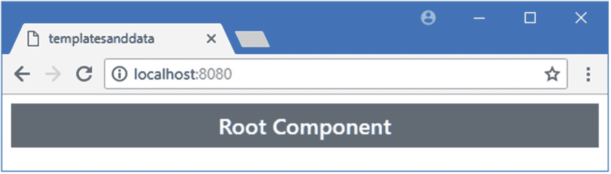
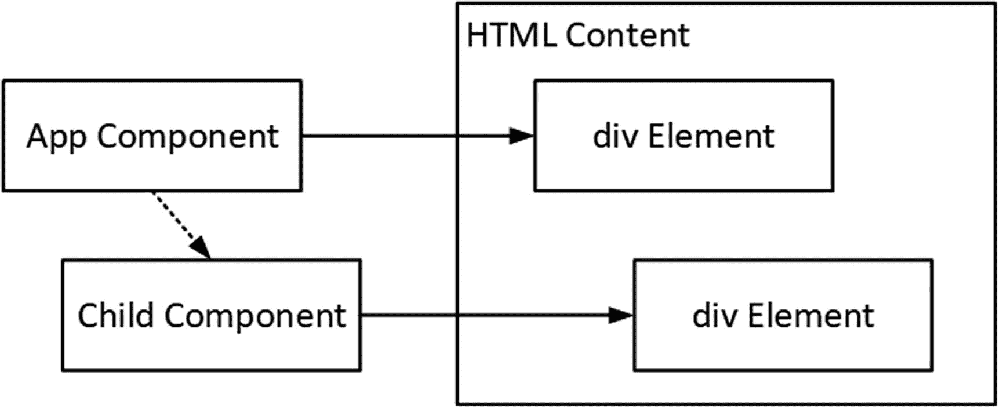
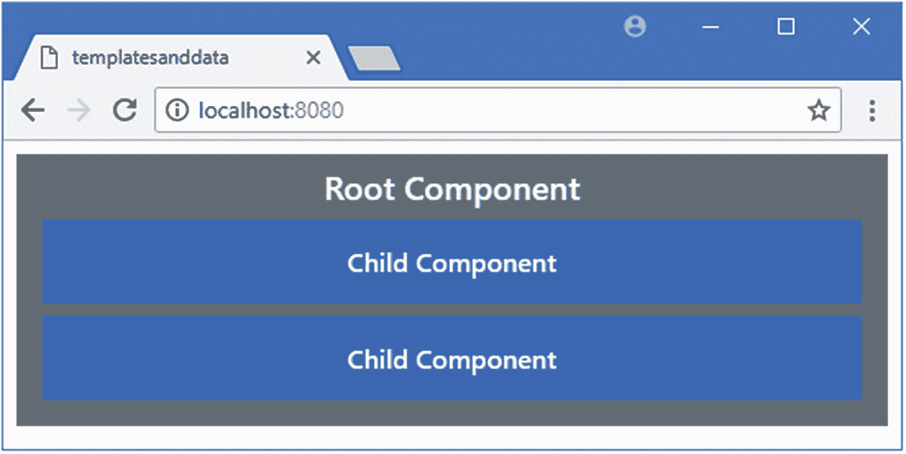
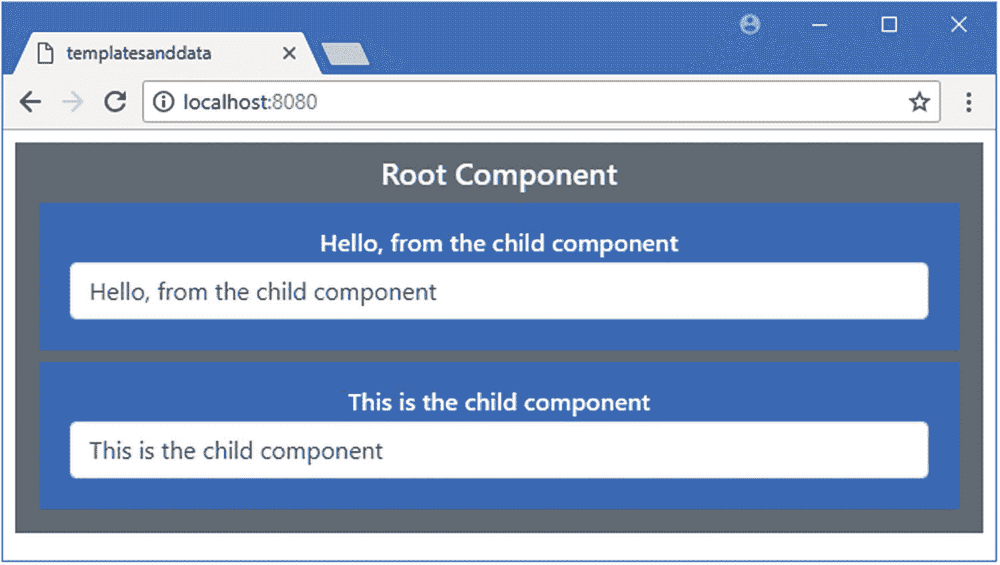
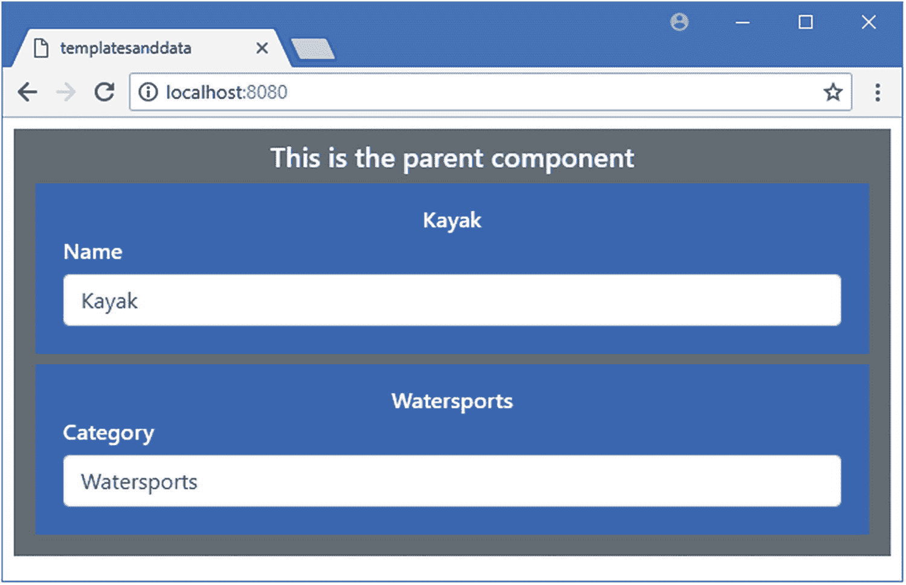
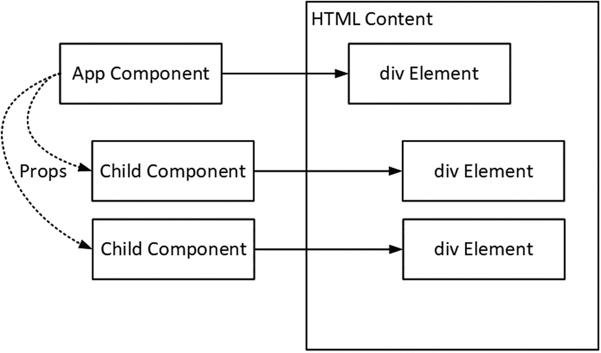

# 十六、使用组件

在这一章中，我将解释组件如何在 Vue.js 应用中形成构建块，并允许将相关内容和代码组合在一起，以使开发更容易。我将向您展示如何向项目中添加组件，如何在组件之间进行通信，以及组件如何协同工作来向用户呈现内容。表 [16-1](#Tab1) 将组件放在上下文中。

表 16-1

将组件放在上下文中

<colgroup><col class="tcol1 align-left"> <col class="tcol2 align-left"></colgroup> 
| 

问题

 | 

回答

 |
| --- | --- |
| 它们是什么？ | 可以组合组件，从较小的构建块中创建复杂的功能。 |
| 它们为什么有用？ | 使用单个组件构建复杂的应用，很难区分哪些内容和代码与每个功能相关。将应用分成几个组件意味着每个组件都可以单独开发和测试。 |
| 它们是如何使用的？ | 使用`script`元素中的`components`属性声明组件，并使用自定义 HTML 元素进行应用。 |
| 有什么陷阱或限制吗？ | 默认情况下，组件是相互隔离的，并且允许它们通信的特性可能很难掌握。 |
| 有其他选择吗？ | 您不必使用多个组件来构建一个应用，单个组件对于简单的项目来说可能是可以接受的。 |

表 [16-2](#Tab2) 总结了本章内容。

表 16-2

章节总结

<colgroup><col class="tcol1 align-left"> <col class="tcol2 align-left"> <col class="tcol3 align-left"></colgroup> 
| 

问题

 | 

解决办法

 | 

列表

 |
| --- | --- | --- |
| 群组相关功能 | 将组件添加到项目中 | 1–9 |
| 与子组件通信 | 使用道具功能 | 10–12 |
| 与父组件通信 | 使用自定义事件功能 | 13–14 |
| 混合父组件和子组件内容 | 使用插槽功能 | 15–20 |

## 为本章做准备

我继续从事第 15 章的`templatesanddata`项目。为了准备本章，我简化了应用的根组件，如清单 [16-1](#PC1) 所示。

### 小费

你可以从 [`https://github.com/Apress/pro-vue-js-2`](https://github.com/Apress/pro-vue-js-2) 下载本章以及本书其他章节的示例项目。

```js
<template>

    <div class="bg-secondary text-white text-center m-2 p-2 h5">
        Root Component
    </div>

</template>

<script>

export default {
    name: 'App'
}

</script>

Listing 16-1Simplifying the Content of the App.vue File in the src Folder

```

运行`templatesanddata`文件夹中清单 [16-2](#PC2) 所示的命令，启动开发工具。

```js
npm run serve

Listing 16-2Navigating to the Project Folder and Starting the Development Tools

```

将执行初始绑定过程，之后您将看到一条消息，告诉您项目已成功编译，HTTP 服务器正在侦听端口 8080 上的请求。打开一个新的浏览器窗口，导航到`http://localhost:8080`查看项目的占位符内容，如图 [16-1](#Fig1) 所示。



图 16-1

运行示例应用

## 将组件理解为构建块

随着应用复杂性的增加，使用单个组件变得越来越困难。你在第 [15](15.html) 章看到了这样一个例子，一个表单和它的验证逻辑并存，结果是很难确定模板和脚本元素的哪些部分负责处理表单，哪些与验证相关。具有多重职责的组件很难理解、测试和维护。

组件是 Vue.js 应用的构建块，在一个应用中使用多个组件允许更小的功能单元，这些单元在整个应用中更容易编写、维护和重用。

当使用组件构建应用时，结果是一种父子关系，其中一个组件(*父组件*)将其模板的一部分委托给另一个组件(*子组件*)。了解其工作原理的最佳方式是创建一个演示这种关系的示例。组件通常定义在`src/components`文件夹中扩展名为`.vue`的文件中，我在该文件夹中添加了一个名为`Child.vue`的文件，内容如清单 [16-3](#PC3) 所示。

### 注意

这个项目是用`src/components`中的`HelloWorld.vue`文件创建的，但是我在本章中不使用那个文件，您可以忽略或者删除这个文件。

```js
<template>
    <div class="bg-primary text-white text-center m-2 p-3 h6">
        Child Component
    </div>
</template>

Listing 16-3The Contents of the Child.vue File in the src/components Folder

```

组件必须至少提供一个`template`元素，这是委托过程的核心。下一步是建立委托并创建父和子之间的关系，如清单 [16-4](#PC4) 所示。

```js
<template>
    <div class="bg-secondary text-white text-center m-2 p-2 h5">
        Root Component
        <ChildComponent></ChildComponent>

    </div>
</template>

<script>

import ChildComponent from "./components/Child";

export default {
    name: 'App',
    components: {

        ChildComponent

    }

}
</script>

Listing 16-4Delegating to a Child Component in the App.vue File in the src Folder

```

在父组件中设置子组件需要三个步骤。第一步是为子组件使用一个`import`语句，如下所示:

```js
...
import ChildComponent from "./components/Child";
...

```

`import`语句中使用的源代码必须以句点开始，这表明这是一个本地导入语句，而不是一个针对使用包管理器安装的包的语句。import 语句最重要的部分是子组件被分配的名称，我用粗体标记了这个名称，在本例中是`ChildComponent`。

在`import`语句中的名字用于注册组件，在`script`元素中使用一个名为`components`的属性，如下所示:

```js
...
export default {
    name: 'App',
    components: {
        ChildComponent

    }
}
...

```

使用一个对象来分配`components`属性，该对象的属性是它所使用的组件，确保在`components`对象中使用与在`import`语句中相同的名称是很重要的。最后一步是将一个 HTML 元素添加到父组件的模板中，该元素带有一个与在`import`语句和`components`对象中使用的名称相匹配的标签，如下所示:

```js
...
<div class="bg-secondary text-white text-center m-2 p-2 h5">
    Root Component
    <ChildComponent></ChildComponent>

</div>
...

```

当 Vue.js 处理父组件的模板时，它找到自定义 HTML 元素并用子组件的`template`元素中的内容替换它，产生如图 [16-2](#Fig2) 所示的结果。

### 注意

这个例子展示了父子关系的一个重要方面:父组件决定了定义子组件的名称。这乍一看似乎很奇怪，但是它允许使用有意义的名称，反映了子组件的应用方式。正如您将在后面的示例中看到的，单个组件可以在应用的不同部分中使用，并且允许父组件命名其子组件意味着组件的每次使用都可以被赋予一个建议其用途的名称。


图 16-2

向示例应用添加组件

如果您使用浏览器的 F12 工具来检查 HTML 文档，您将会看到子组件是如何被用来替换`ChildComponent`元素的。

```js
...
<body>
    <div class="bg-secondary text-white text-center m-2 p-2 h5">
        Root Component
        <div class="bg-primary text-white text-center m-2 p-3 h6">

            Child Component

        </div>

    </div>
    <script type="text/javascript" src="/app.js"></script>
</body>
...

```

结果是`App.vue`文件中定义的`App`组件呈现的部分内容被委托给了`Child.vue`文件中定义的`Child`组件，如图 [16-3](#Fig3) 所示。



图 16-3

父子组件关系

### 了解子组件名称和元素

在清单 [16-4](#PC4) 中，我使用了`import`语句中的名称来设置子组件，这导致了这个看起来很笨拙的定制 HTML 元素:

```js
...
<div class="bg-secondary text-white text-center m-2 p-2 h5">
    Root Component
    <ChildComponent></ChildComponent>

</div>
...

```

这是一个很有用的方法来证明是父组件命名了它的子组件，但是 Vue.js 有一个更复杂的命名方法，这可以产生更优雅的 HTML。

第一个名称特性是 Vue.js 在寻找要使用的子组件时会自动重新格式化定制 HTML 元素标签名称，如清单 [16-5](#PC10) 所示。

```js
<template>
    <div class="bg-secondary text-white text-center m-2 p-2 h5">
        Root Component
        <ChildComponent></ChildComponent>
        <child-component></child-component>

    </div>
</template>

<script>
import ChildComponent from "./components/Child";

export default {
    name: 'App',
    components: {
        ChildComponent
    }
}
</script>

Listing 16-5Tag Name Reformatting in the App.vue File in the src Folder

```

模板中新的定制 HTML 元素演示了 Vue.js 将接受带连字符的标记名，然后这些标记名将被转换为组件名通常使用的 camel case 格式，这样标记`child-component`将被识别为使用`ChildComponent`的指令。清单 [16-5](#PC10) 中的两个定制 HTML 元素都告诉 Vue.js 将父组件模板的一部分委托给子组件的一个实例，产生如图 [16-4](#Fig4) 所示的结果。



图 16-4

灵活的自定义元素标记格式

`components`属性是一个映射，Vue.js 使用它将定制的 HTML 元素标记名转换为子组件名，这意味着当你注册一个组件时，你可以指定一个完全不同的标记名，如清单 [16-6](#PC11) 所示。

```js
<template>
    <div class="bg-secondary text-white text-center m-2 p-2 h5">
        Root Component
        <MyFeature></MyFeature>

        <my-feature></my-feature>

    </div>
</template>

<script>
import ChildComponent from "./components/Child";

export default {
    name: 'App',
    components: {
        MyFeature: ChildComponent

    }
}
</script>

Listing 16-6Specifying a Tag Name in the App.vue File in the src Folder

```

当您为子组件指定属性和值时，属性名称将用于自定义 HTML 元素。在这个例子中，我已经将属性的名称设置为`MyFeature`，这意味着我可以使用`MyFeature`和`my-feature`标签来应用`ChildComponent`。

### 全局注册组件

如果您有一个在整个应用中都需要的组件，那么您可以全局注册它。这种方法的优点是您不必配置每个父组件；然而，缺点是使用相同的 HTML 元素来应用子组件，这可能会导致模板意义不大。要全局注册一个组件，可以在`main.js`文件中添加一个导入语句，并使用`Vue.component`方法，如下所示:

```js
import Vue from 'vue'
import App from './App'

import "../node_modules/bootstrap/dist/css/bootstrap.min.css";

import ChildComponent from "./components/Child";

Vue.config.productionTip = false

Vue.component("child-component", ChildComponent);

new Vue({
  render: h => h(App)
}).$mount('#app')

```

在创建应用的`Vue`对象之前，必须调用`Vue.component`方法，它的参数是 HTML 元素标签，将用于应用组件和在`import`语句中命名的组件对象。结果是在整个应用中可以使用`child-component`元素来应用组件，而无需任何进一步的配置。

### 在子组件中使用组件功能

我在清单 [16-6](#PC11) 中定义的子组件只包含一个`template`元素，但是 Vue.js 支持子组件中前面章节描述的所有特性，包括单向和双向数据绑定、事件处理程序、`data`和`computed`属性以及方法。在清单 [16-7](#PC13) 中，我向子组件添加了一个`script`元素，并使用它来支持模板中的数据绑定。

```js
<template>
    <div class="bg-primary text-white text-center m-2 p-3 h6">
        {{ message }}

        <div class="form-group m-1">

            <input v-model="message" class="form-control" />

        </div>

    </div>
</template>

<script>

export default {

    data: function() {

        return {

            message: "This is the child component"

        }

    }

}

</script>

Listing 16-7Adding Features in the Child.vue File in the src/components Folder

```

我添加的`script`元素定义了一个名为`message`的数据属性，我在带有文本插值绑定和`v-model`指令的`template`元素中使用了这个属性。结果是子组件显示一个`input`元素，其内容反映在文本数据绑定中，如图 [16-5](#Fig5) 所示。



图 16-5

向子组件添加功能

## 了解元件隔离

组件是相互隔离的，这意味着您不必担心选择唯一的属性和方法名，也不必担心绑定到不同组件所拥有的值。

在图 [16-5](#Fig5) 中，你可以看到编辑一个`input`元素的内容对另一个子组件没有影响，即使它们都定义并使用了一个`message`属性。这种隔离也适用于父组件和子组件，这可以通过在示例应用中向父组件添加一个`message`属性来演示，如清单 [16-8](#PC14) 所示。

```js
<template>
    <div class="bg-secondary text-white text-center m-2 p-2 h5">
        {{ message }}

        <MyFeature></MyFeature>
        <my-feature></my-feature>
    </div>
</template>

<script>
import ChildComponent from "./components/Child";

export default {
    name: 'App',
    components: {
        MyFeature: ChildComponent
    },
    data: function() {

        return {

            message: "This is the parent component"

        }

    }

}
</script>

Listing 16-8Adding a Data Property in the App.vue File in the src Folder

```

现在在应用中有三个名为`message`的`data`属性，但是 Vue.js 将它们中的每一个都保持隔离，这样对其中一个的更改就不会影响到另一个，如图 [16-6](#Fig6) 所示。


图 16-6

父组件与子组件之间的隔离

### 理解 CSS 范围

如果您在组件中定义了自定义样式，您会发现它们会应用于任何组件定义的元素。例如，这种风格:

```js
...
<style>
    div { border: 5px solid red ; }
</style>
...

```

将匹配应用中的任何`div`元素，并应用红色实心边框。如果您想将您的自定义 CSS 样式限制在定义它们的组件中，您可以将`scoped`属性添加到`style`元素中，如下所示:

```js
...
<style scoped>
    div { border: 5px solid red ; }
</style>
...

```

`scoped`属性告诉 Vue.js，样式应该只应用于当前组件的`template`元素中的元素，而不应该应用于其他组件的模板中的元素。

### 使用组件道具

保持组件隔离是一个很好的默认策略，因为它避免了意外的交互。如果组件没有相互隔离，对一个`message`属性的改变会影响所有的组件。另一方面，在大多数应用中，组件必须协同工作才能为用户提供功能，这意味着要突破组件之间的障碍。组件协作的一个特性是 *prop* ，它允许父母为孩子提供数据值。在清单 [16-9](#PC17) 中，我给子组件添加了一个道具。

```js
<template>
    <div class="bg-primary text-white text-center m-2 p-3 h6">
        {{ message }}
        <div class="form-group m-1 text-left">

            <label>{{ labelText }}</label>

            <input v-model="message" class="form-control" />
        </div>
    </div>
</template>

<script>
    export default {
        props: ["labelText"],

        data: function () {
            return {
                message: "This is the child component"
            }
        }
    }
</script>

Listing 16-9Adding a Prop in the Child.vue File in the src/components Folder

```

使用分配给组件的`script`元素中的`props`属性的字符串数组来定义 Props。在这种情况下，道具名称是`labelText`。一旦定义了一个属性，就可以在组件的其他地方使用它，比如在文本插值绑定中。如果您需要修改从父组件接收到的值，那么您必须使用一个`data`或`computed`属性，其初始值是从 prop 获得的，如清单 [16-10](#PC18) 所示。

### 注意

这种方法是必需的，因为属性中的数据流是单向的:从父组件到子组件。如果修改属性值，所做的更改可能会被父组件覆盖。

```js
<template>
    <div class="bg-primary text-white text-center m-2 p-3 h6">
        {{ message }}
        <div class="form-group m-1 text-left">
            <label>{{ labelText }}</label>
            <input v-model="message" class="form-control" />
        </div>
    </div>
</template>

<script>
    export default {
        props: ["labelText", "initialValue"],

        data: function () {
            return {
                message: this.initialValue

            }
        }
    }
</script>

Listing 16-10Setting a Mutable Value from a Prop in the Child.vue File in the src/components Folder

```

该组件定义了第二个属性，名为`initialValue`，用于设置`message`属性的值。

#### 在父组件中使用道具

当一个组件定义一个属性时，它的父组件可以通过使用定制 HTML 元素上的属性向它发送数据值，如清单 [16-11](#PC19) 所示。

```js
<template>
    <div class="bg-secondary text-white text-center m-2 p-2 h5">
        {{ message }}
        <MyFeature labelText="Name" initialValue="Kayak"></MyFeature>

        <my-feature label-text="Category" initial-value="Watersports"></my-feature>

    </div>
</template>

<script>
    import ChildComponent from "./components/Child";

    export default {
        name: 'App',
        components: {
            MyFeature: ChildComponent
        },
        data: function () {
            return {
                message: "This is the parent component"
            }
        }
    }
</script>

Listing 16-11Using a Prop in the App.vue File in the src Folder

```

Vue.js 在将属性名与属性匹配时，与将定制 HTML 元素与组件匹配时一样灵活。例如，这意味着我可以使用`labelText`或`label-text`来设置道具的值。清单 [16-11](#PC19) 中的属性配置子组件以产生如图 [16-7](#Fig7) 所示的结果。

### 小费

您可能需要重新加载浏览器才能看到此示例的结果。



图 16-7

使用道具配置子组件

### 小费

Prop 属性值是文字，这意味着该值不作为表达式计算。如果你想传递一个字符串给子组件，那么你可以这样做:`my-attr="Hello"`。不需要使用双引号:`my-attr="'Hello'"`。如果你想让一个属性的值作为一个表达式来计算，那么使用`v-bind`指令。如果你想让子组件响应数据绑定的适当变化，那么你可以使用一个观察器，如第 [17](17.html) 章所述。

当使用道具时，重要的是要记住数据流只从父组件流向子组件，如图 [16-8](#Fig8) 所示。如果你试图修改一个属性值，你会收到一个警告，提醒你这个属性应该被用来初始化一个数据属性，如清单 [16-10](#PC18) 所示。



图 16-8

使用道具时的数据流

### 在自定义 HTML 元素上设置常规属性

当 Vue.js 用子组件的模板替换自定义 HTML 元素时，它会将任何非 prop 属性转移到顶级模板元素，这可能会导致混淆的结果，尤其是如果子组件的模板中的元素已经具有该属性。例如，如果这是子模板元素:

```js
...
<template>
    <div id="childIdValue">This is the child's element</div>
</template>
...

```

这是父模板元素:

```js
...
<template>
    <my-feature id="parentIdValue"></my-feature>
</template>
...

```

然后，父属性应用的属性将覆盖子属性，在浏览器中生成如下所示的 HTML:

```js
...
<div id="parentIdValue">This is the child's element</div>
...

```

属性`class`和`style`的行为是不同的，浏览器通过组合这两个属性值来处理它们。如果这是子模板元素:

```js
...
<template>
    <div class="bg-primary">This is the child's element</div>
</template>
...

```

这是父模板元素:

```js
...
<template>
    <my-feature class="text-white"></my-feature>
</template>
...

```

然后，浏览器将组合`class`属性值，在浏览器中生成以下 HTML:

```js
...
<div class="bg-primary text-white">This is the child's element</div>
...

```

当父组件和子组件都设置相同的属性时，必须小心，理想情况下应该避免这种情况。如果您想让父元素负责指定子元素呈现的 HTML 内容，那么就使用插槽特性，我在“使用组件插槽”一节中对此进行了描述。

#### 使用属性值表达式

除非使用了`v-bind`指令，否则属性的值不会被计算为表达式，如清单 [16-12](#PC26) 所示。

```js
<template>
    <div class="bg-secondary text-white text-center m-2 p-2 h5">
        <div class="form-group">

            <input class="form-control" v-model="labelText" />

        </div>

        <my-feature v-bind:label-text="labelText" initial-value="Kayak"></my-feature>

    </div>
</template>

<script>
    import ChildComponent from "./components/Child";

    export default {
        name: 'App',
        components: {
            MyFeature: ChildComponent
        },
        data: function () {
            return {
                message: "This is the parent component",
                labelText: "Name"
            }
        }
    }
</script>

Listing 16-12Using an Expression in the App.vue File in the src Folder

```

父组件的模板包括一个使用`v-model`指令绑定到`labelText`属性的`input`元素。在子指令的自定义元素上指定了相同的属性，这告诉 Vue.js 在子组件的`labelText`属性和父组件的`data`属性之间建立一个单向绑定。

```js
...
<my-feature v-bind:label-text="labelText" initial-value="Kayak"></my-feature>
...

```

结果是当父组件的`input`元素被编辑时，新值被子组件接收，并通过文本插值绑定显示，如图 [16-9](#Fig9) 所示。

### 警告

变更流仍然是单向的，即使使用了`v-bind`指令。父组件不会收到子组件对属性值所做的更改，当`v-bind`指令所使用的属性发生更改时，这些更改将被丢弃。有关如何将数据从子组件发送到其父组件的详细信息，请参见下一节。


图 16-9

使用适当的值表达式

### 创建自定义事件

props 特性的对应部分是自定义事件，它允许子组件向其父组件发送数据。为了演示自定义事件的使用，我扩展了子组件的功能，以便它提供一些自包含的功能，如清单 [16-13](#PC28) 所示，这是组件在实际项目中使用的更典型方式。

### 结合道具和自定义事件

在某种程度上，大多数刚接触 Vue.js 开发的开发人员会尝试通过组合定制事件、道具和`v-model`指令，让父组件和子组件同时显示和更改相同的数据值。只需一点点努力，您就能让某些东西工作起来，但是它违背了这些特性的目的，并且总是一个脆弱的解决方案，偶尔会不可预测地以迷惑用户的方式运行。如第 [20 章](20.html)所述，如果你希望多个组件能够显示和改变相同的数据值，使用共享应用状态。对于更简单的应用，事件总线可能就足够了，如第 [18 章](18.html)所述

。

```js
<template>
    <div class="bg-primary text-white text-center m-2 p-3 h6">
        <div class="form-group m-1 text-left">

            <label>Name</label>

            <input v-model="product.name" class="form-control" />

        </div>

        <div class="form-group m-1 text-left">

            <label>Category</label>

            <input v-model="product.category" class="form-control" />

        </div>

        <div class="form-group m-1 text-left">

            <label>Price</label>

            <input v-model.number="product.price" class="form-control" />

        </div>

        <div class="mt-2">

            <button class="btn btn-info" v-on:click="doSubmit">Submit</button>

        </div>

    </div>
</template>

<script>
    export default {
        props: ["initialProduct"],

        data: function () {
            return {
                product: this.initialProduct || {}

            }
        },
        methods: {

            doSubmit() {

                this.$emit("productSubmit", this.product);

            }

        }

    }
</script>

Listing 16-13Adding Features to the Child.vue File in the src/components Folder

```

该组件是产品对象的基本编辑器，其中的`input`元素编辑分配给名为`product`的`data`属性的对象的`name`、`category`和`price`属性，这些属性的初始数据值是使用名为`initialProduct`的属性接收的。

还有一个`button`元素，它通过调用一个叫做`doSubmit`的方法，使用`v-on`指令来响应`click`事件。正是这种方法允许组件与其父组件通信，它是这样做的:

```js
...
doSubmit() {
    this.$emit("productSubmit", this.product);

}
...

```

使用关键字`this`调用的`$emit`方法用于发送自定义事件。第一个参数是事件类型，表示为一个字符串，可选的第二个参数是事件的有效负载，可以是父级可能发现有用的任何值。在本例中，我发送了一个名为`productSubmit`的事件，并将`product`对象作为有效载荷。

#### 从子组件接收自定义事件

父组件使用`v-on`指令从其子组件接收事件，就像常规的 DOM 事件一样。在清单 [16-14](#PC30) 中，我已经更新了`App.vue`文件，以便为子组件提供初始数据进行编辑，并在事件被触发时对其做出响应。

```js
<template>
    <div class="bg-secondary text-white text-center m-2 p-2 h5">
        <h6>{{ message }}</h6>
        <my-feature v-bind:initial-product="product"

                    v-on:productSubmit="updateProduct">

        </my-feature>
    </div>
</template>

<script>
    import ChildComponent from "./components/Child";

    export default {
        name: 'App',
        components: {
            MyFeature: ChildComponent
        },
        data: function () {
            return {
                message: "Ready",

                product: {

                    name: "Kayak",

                    category: "Watersports",

                    price: 275

                }

            }
        },
        methods: {

            updateProduct(newProduct) {

                this.message = JSON.stringify(newProduct);

            }

        }

    }
</script>

Listing 16-14Responding to Child Component Events in the App.vue File in the src Folder

```

`v-on`指令用于监听子组件的定制事件，使用作为第一个参数传递给`$emit`方法的名称，在本例中是`productSubmit`:

```js
...
<my-feature v-bind:initial-product="product" v-on:productSubmit="updateProduct">
...

```

在这种情况下，`v-on`绑定用于通过调用`updateProduct`方法来响应`productSubmit`事件。父组件使用的方法接收子组件用作`$emit`方法的第二个参数的可选有效负载，在本例中，有效负载的 JSON 表示被分配给名为`message`的`data`属性，该属性通过文本插值绑定显示给用户。结果是您可以编辑子组件显示的值，点击提交按钮，并查看父组件接收的数据，如图 [16-10](#Fig10) 所示。

### 注意

定制事件的行为不像常规的 DOM 事件，即使使用了`v-on`指令来处理它们。自定义事件只传递给父组件，不会通过 DOM 中 HTML 元素的层次结构传播，并且没有捕获、目标和冒泡阶段。如果你想超越父子关系进行交流，那么你可以使用事件总线，如第 [18 章](18.html)所述，或者共享状态，如第 [20 章](20.html)所述。


图 16-10

从子组件处理自定义事件

### 使用组件插槽

如果您在应用的不同部分使用一个组件，您可能希望定制它呈现给用户的 HTML 元素的外观以适应上下文。

对于简单的内容更改，可以使用 prop，或者父组件可以直接样式化用于应用子组件的自定义 HTML 元素。

对于更复杂的内容更改，Vue.js 提供了一个名为 *slots* 的特性，它允许父组件提供内容，通过这些内容子组件提供的特性将被显示。在清单 [16-15](#PC32) 中，我给子组件添加了一个插槽，它将用于显示父组件提供的内容。

```js
...
<template>
    <div class="bg-primary text-white text-center m-2 p-3 h6">
        <slot>

            <h4>Use the form fields to edit the data</h4>

        </slot>

        <div class="form-group m-1 text-left">
            <label>Name</label>
            <input v-model="product.name" class="form-control" />
        </div>
        <div class="form-group m-1 text-left">
            <label>Category</label>
            <input v-model="product.category" class="form-control" />
        </div>
        <div class="form-group m-1 text-left">
            <label>Price</label>
            <input v-model.number="product.price" class="form-control" />
        </div>
        <div class="mt-2">
            <button class="btn btn-info" v-on:click="doSubmit">Submit</button>
        </div>
    </div>
</template>
...

Listing 16-15Adding a Slot in the Child.vue File in the src/components Folder

```

`slot`元素表示组件模板的一个区域，该区域将被替换为父组件在用于应用子组件的定制元素的开始和结束标记之间包含的任何内容。如果父组件不提供任何内容，那么 Vue.js 将忽略 slot 元素，这是你保存`Child.vue`文件并在浏览器中检查内容时会看到的，如图 [16-11](#Fig11) 所示。

### 小费

您可能需要重新加载浏览器才能看到这个示例的效果。


图 16-11

在槽中显示默认内容

这提供了一个回退，允许子组件向用户显示有用的内容。为了覆盖默认内容，父组件必须在其模板中包含元素，如清单 [16-16](#PC33) 所示。

```js
...
<template>
    <div class="bg-secondary text-white text-center m-2 p-2 h5">
        <h6>{{ message }}</h6>
        <my-feature v-bind:initial-product="product"
                    v-on:productSubmit="updateProduct">
            <div class="bg-warning m-2 p-2 h3 text-dark">Product Editor</div>

        </my-feature>
    </div>
</template>
...

Listing 16-16Providing Elements for a Slot in the App.vue File in the src Folder

```

出现在`my-feature`元素的开始和结束标记之间的`div`元素被用作子组件模板中`slot`元素的内容，产生如图 [16-12](#Fig12) 所示的结果。


图 16-12

为子组件的插槽提供内容

#### 使用命名插槽

如果一个子组件可以从它的父组件接收几个区域的内容，那么它可以给它的槽分配名称，如清单 [16-17](#PC34) 所示。

```js
...
<template>
    <div class="bg-primary text-white text-center m-2 p-3 h6">
        <slot name="header">

            <h4>Use the form fields to edit the data</h4>

        </slot>

        <div class="form-group m-1 text-left">
            <label>Name</label>
            <input v-model="product.name" class="form-control" />
        </div>
        <div class="form-group m-1 text-left">
            <label>Category</label>
            <input v-model="product.category" class="form-control" />
        </div>
        <div class="form-group m-1 text-left">
            <label>Price</label>
            <input v-model.number="product.price" class="form-control" />
        </div>
        <slot name="footer"></slot>

        <div class="mt-2">
            <button class="btn btn-info" v-on:click="doSubmit">Submit</button>
        </div>
    </div>
</template>
...

Listing 16-17Adding Named Slots in the Child.vue File in the src/components Folder

```

`name`属性用于为每个`slot`元素指定名称。在这个例子中，我给出现在`input`元素上面的元素指定了名称`header`，给出现在它们下面的`slot`指定了名称 footer。`footer`槽不包含任何元素，这意味着除非父组件提供内容，否则不会显示任何内容。

为了使用一个命名的 slot，父元素将一个 slot 属性添加到包含在自定义开始和结束标记之间的一个元素中，如清单 [16-18](#PC35) 所示。

```js
...
<template>
    <div class="bg-secondary text-white text-center m-2 p-2 h5">
        <h6>{{ message }}</h6>
        <my-feature v-bind:initial-product="product"
                    v-on:productSubmit="updateProduct">
            <div slot="header" class="bg-warning m-2 p-2 h3 text-dark">

                 Product Editor

            </div>

            <div slot="footer" class="bg-warning p-2 h3 text-dark">

                Check Details Before Submitting

             </div>

        </my-feature>
    </div>
</template>
...

Listing 16-18Using Names Slots in the App.vue File in the src Folder

```

父元素已经为每个指定的槽提供了`div`元素，这产生了如图 [16-13](#Fig13) 所示的结果。

### 小费

如果子组件定义了一个未命名的槽，那么它将显示父模板中没有分配给带有`slot`属性的槽的任何元素。如果子组件没有定义未命名的插槽，那么父组件的未分配元素将被丢弃。


图 16-13

使用命名插槽

#### 使用作用域插槽

作用域槽允许父组件提供一个模板，子组件可以在其中插入数据，这在子组件使用从父组件接收的数据执行转换，并且父组件需要控制格式时非常有用。为了演示作用域插槽特性，我在`src/components`文件夹中添加了一个名为`ProductDisplay.vue`的文件，并添加了清单 [16-19](#PC36) 中所示的内容。

```js
<template>
    <ul>
        <li v-for="prop in Object.keys(product)" v-bind:key="prop">
            <slot v-bind:propname="prop" v-bind:propvalue="product[prop]">
                {{ prop }}: {{ product[prop] }}
            </slot>
        </li>
    </ul>
</template>

<script>
export default {
    props: ["product"]
}
</script>

Listing 16-19The Contents of the ProductDisplay.vue File in the src/components Folder

```

这个组件通过一个名为`product`的 prop 接收一个对象，它的属性和值使用`v-for`指令在模板中被枚举。`slot`元素为父元素提供了一个替换显示属性名和值的内容的机会，但是增加了以下重要属性:

```js
...
<slot v-bind:propname="prop" v-bind:propvalue="product[prop]">
...

```

`propname`和`propvalue`属性允许父组件将分配给它们的值合并到插槽内容中，如清单 [16-20](#PC38) 所示。

```js
<template>
    <div class="bg-secondary text-white text-center m-2 p-2 h5">
        <product-display v-bind:product="product">

            <div slot-scope="data" class="bg-info text-left">

                {{data.propname}} is {{ data.propvalue }}

            </div>

        </product-display>

        <my-feature v-bind:initial-product="product"
                    v-on:productSubmit="updateProduct">
            <div slot="header" class="bg-warning m-2 p-2 h3 text-dark">
                Product Editor
            </div>
            <div slot="footer" class="bg-warning p-2 h3 text-dark">
                Check Details Before Submitting
            </div>
        </my-feature>
    </div>
</template>

<script>
    import ChildComponent from "./components/Child";
    import ProductDisplay from"./components/ProductDisplay";

    export default {
        name: 'App',
        components: {
            MyFeature: ChildComponent,
            ProductDisplay

        },
        data: function () {
            return {
                message: "Ready",
                product: {
                    name: "Kayak",
                    category: "Watersports",
                    price: 275
                }
            }
        },
        methods: {
            updateProduct(newProduct) {
                this.message = JSON.stringify(newProduct);
            }
        }
    }
</script>

Listing 16-20Using a Scoped Slot in the App.vue File in the src Folder

```

`slot-scope`属性用于选择在处理模板时创建的临时变量的名称，并且将为子元素在其`slot`元素上定义的每个属性分配一个属性，然后可以在插槽内容中的数据绑定和指令中使用该属性，如下所示:

```js
...
<product-display v-bind:product="product">
    <div slot-scope="data" class="bg-info text-left">
        {{data.propname}} is {{ data.propvalue }}
    </div>
</product-display>
...

```

结果是来自父组件的 HTML 元素与子组件提供的数据混合，产生如图 [16-14](#Fig14) 所示的结果。

### 小费

作用域 slot 内容中的表达式和数据绑定是在父组件的上下文中计算的，这意味着 Vue.js 将查找您引用的任何值，只要它没有以父组件的`script`元素中的`slot-scope`属性中命名的变量为前缀。


图 16-14

使用作用域插槽

## 摘要

在这一章中，我描述了组件作为 Vue.js 应用的构建块的使用方式，允许相关的内容和代码被分组以便于开发和维护。我解释了组件在默认情况下是如何被隔离的，prop 和 custom event 特性如何允许组件进行通信，以及 slots 特性如何允许父组件向子组件提供内容。在本书的第 3 部分，我描述了高级的 Vue.js 特性。