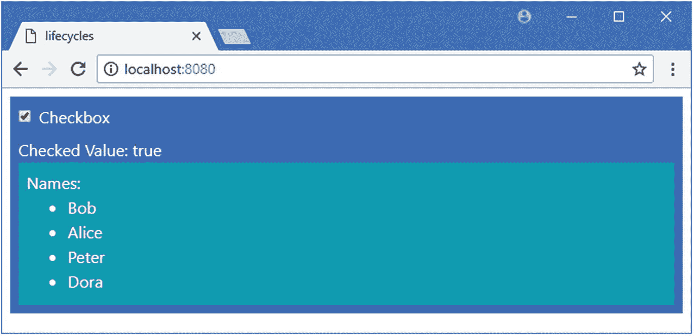
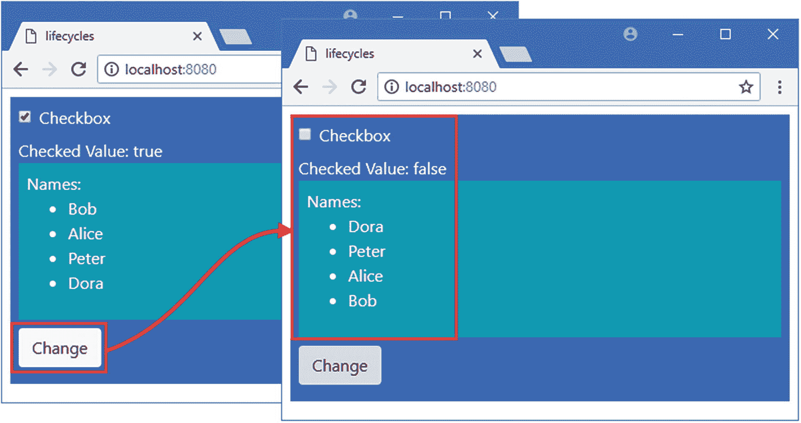
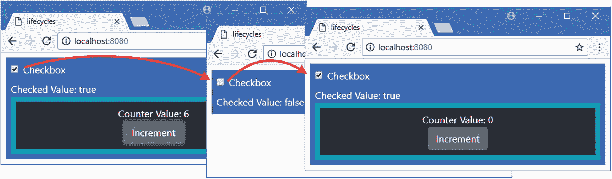

# 十七、了解组件生命周期

当 Vue.js 创建一个组件时，它就开始了一个定义良好的生命周期，包括准备数据值、在文档对象模型(DOM)中呈现 HTML 内容以及处理任何更新。在这一章中，我描述了组件生命周期中的不同阶段，并演示了组件对这些阶段做出响应的各种方式。

组件生命周期值得您关注有两个原因。首先，你对 Vue.js 的工作原理了解得越多，当你没有得到你期望的结果时，你对诊断问题的准备就越充分。第二个原因是，我在后面的章节中描述的一些高级特性在您理解它们的工作环境时会更容易理解和应用。表 [17-1](#Tab1) 将组件生命周期放在上下文中。

表 17-1

将组件生命周期放在上下文中

<colgroup><col class="tcol1 align-left"> <col class="tcol2 align-left"></colgroup> 
| 

问题

 | 

回答

 |
| --- | --- |
| 这是什么？ | 每个组件都遵循一个明确定义的生命周期，从 Vue.js 创建它开始，到它被销毁结束。 |
| 为什么有用？ | 定义良好的生命周期使得 Vue.js 组件可预测，并且有通知方法允许组件响应不同的生命周期阶段。 |
| 如何使用？ | Vue.js 自动遵循生命周期，不需要任何直接操作。如果一个组件想要接收关于其生命周期的通知，那么它可以实现表 [17-3](#Tab3) 中描述的方法。 |
| 有什么陷阱或限制吗？ | 实现生命周期通知方法的一个主要原因是使用 DOM API 直接访问组件的 HTML 内容，而不是使用指令或其他 Vue.js 特性。这可能会破坏应用的设计，并使其更难测试和维护。 |
| 还有其他选择吗？ | 您不必关注组件的生命周期，许多项目根本不需要实现通知方法。 |

表 [17-2](#Tab2) 总结了本章内容。

表 17-2

章节总结

<colgroup><col class="tcol1 align-left"> <col class="tcol2 align-left"> <col class="tcol3 align-left"></colgroup> 
| 

问题

 | 

解决办法

 | 

列表

 |
| --- | --- | --- |
| 创建组件时收到通知 | 实施`beforeCreate`或`created`方法 | eight |
| 当允许访问 DOM 时接收通知 | 实施`beforeMount`或`mounted`方法 | 9, 10 |
| 当数据属性更改时接收通知 | 实施`beforeUpdate`或`updated`方法 | 11–12 |
| 更新后执行任务 | 使用`Vue.nextTick`方法 | Thirteen |
| 接收单个数据属性的通知 | 使用观察器 | Fourteen |
| 当组件被销毁时收到通知 | 实施`beforeDestroy`或`destroyed`方法 | 15, 16 |
| 出现错误时收到通知 | 实现`errorCaptured`方法 | 17, 18 |

## 为本章做准备

对于本章中的例子，在一个方便的位置运行清单 [17-1](#PC1) 中所示的命令来创建一个新的 Vue.js 项目。

### 小费

你可以从 [`https://github.com/Apress/pro-vue-js-2`](https://github.com/Apress/pro-vue-js-2) 下载本章以及本书其他章节的示例项目。

```js
vue create lifecycles --default

Listing 17-1Creating a New Project

```

这个命令创建了一个名为*生命周期*的项目。项目创建完成后，将名为`vue.config.js`的文件添加到`lifecycles`文件夹中，内容如清单 [17-2](#PC2) 所示。这个文件用于启用将模板定义为字符串的能力，如第 [10](10.html) 章所述，我在本章的一个例子中使用了它。

```js
module.exports = {
    runtimeCompiler: true
}

Listing 17-2The Contents of the vue.config.js File in the nomagic Folder

```

将清单 [17-3](#PC3) 中所示的语句添加到`package.json`文件的 linter 部分，以禁用在使用 JavaScript 控制台时发出警告的规则。本章中的许多例子我都依赖于控制台。

```js
...
"eslintConfig": {
    "root": true,
    "env": {
      "node": true
    },
    "extends": [
        "plugin:vue/essential",
        "eslint:recommended"
     ],
     "rules": {
        "no-console": "off"

     },
     "parserOptions": {
        "parser": "babel-eslint"
     }
},
...

Listing 17-3Disabling a Linter Rule in the package.json File in the lifecycles Folder

```

运行`lifecycles`文件夹中清单 [17-4](#PC4) 所示的命令，将引导 CSS 包添加到项目中。

```js
npm install bootstrap@4.0.0

Listing 17-4Adding the Bootstrap CSS Package

```

将清单 [17-5](#PC5) 中所示的语句添加到`src`文件夹中的`main.js`文件中，将引导 CSS 文件合并到应用中。

```js
import Vue from 'vue'
import App from './App.vue'

import "bootstrap/dist/css/bootstrap.min.css";

Vue.config.productionTip = false

new Vue({
  render: h => h(App)
}).$mount('#app')

Listing 17-5Incorporating the Bootstrap Package in the main.js File in the src Folder

```

最后的准备步骤是替换根组件的内容，如清单 [17-6](#PC6) 所示。

```js
<template>
    <div class="bg-primary text-white m-2 p-2">
        <div class="form-check">
            <input class="form-check-input" type="checkbox" v-model="checked" />
            <label>Checkbox</label>
        </div>
        Checked Value: {{ checked }}
    </div>
</template>

<script>

export default {
    name: 'App',
    data: function () {
        return {
            checked: true
        }
    }
}
</script>

Listing 17-6Replacing the Contents of the App.vue File in the src Folder

```

运行`productapp`文件夹中清单 [17-7](#PC7) 所示的命令，启动开发工具。

```js
npm run serve

Listing 17-7Starting the Development Tools

```

将执行初始绑定过程，之后您将看到一条消息，告诉您项目已成功编译，HTTP 服务器正在侦听端口 8080 上的请求。打开一个新的浏览器窗口，导航到`http://localhost:8080`查看项目的占位符内容，如图 [17-1](#Fig1) 所示。


图 17-1

运行示例应用

## 了解组件生命周期

组件生命周期从 Vue.js 第一次初始化组件时开始。生命周期包括准备数据属性、处理模板、处理数据更改，以及最终销毁不再需要的组件。对于生命周期中的每个阶段，Vue.js 都提供了方法，如果由组件实现，它将调用这些方法。在表 [17-3](#Tab3) 中，我描述了每一种组件生命周期方法。

表 17-3

组件生命周期方法

<colgroup><col class="tcol1 align-left"> <col class="tcol2 align-left"></colgroup> 
| 

名字

 | 

描述

 |
| --- | --- |
| `beforeCreate` | 这个方法在 Vue.js 初始化组件之前被调用，如“理解创建阶段”一节所述。 |
| `created` | 这个方法在 Vue.js 初始化一个组件后被调用，如“理解创建阶段”一节所述。 |
| `beforeMount` | 这个方法在 Vue.js 处理组件的模板之前被调用，如“理解安装阶段”一节所述。 |
| `mounted` | 这个方法在 Vue.js 处理组件的模板之后被调用，如“理解安装阶段”一节所述。 |
| `beforeUpdate` | 这个方法在 Vue.js 处理组件数据更新之前调用，如“理解更新阶段”一节所述。 |
| `updated` | 这个方法在 Vue.js 处理组件数据更新后调用，如“理解更新阶段”一节所述。 |
| `activated` | 如第 [22 章](22.html)所述，当一个用`keep-alive`元素保持活动的组件被激活时，该方法被调用。 |
| `deactivated` | 如第 [22 章](22.html)所述，当通过`keep-alive`元素保持活动的组件被停用时，该方法被调用。 |
| `beforeDestroy` | 这个方法在 Vue.js 销毁组件之前被调用，如“理解销毁阶段”一节所述。 |
| `destroyed` | 这个方法在 Vue.js 销毁一个组件后被调用，如“理解销毁阶段”一节所述。 |
| `errorCaptured` | 这个方法允许组件处理由它的一个子组件抛出的错误，如“处理组件错误”一节所述。 |

### 了解创建阶段

这是生命周期的初始阶段，Vue.js 创建一个组件的新实例并准备使用，包括处理`script`元素中的属性，比如`data`和`computed`属性。在创建组件之后——但在处理其配置对象之前——vue . js 调用`beforeCreate`方法。一旦 Vue.js 处理了配置属性，包括数据属性，就会调用`created`方法。在清单 [17-8](#PC8) 中，我将这个阶段的两种方法都添加到了组件中。

```js
<template>
    <div class="bg-primary text-white m-2 p-2">
        <div class="form-check">
            <input class="form-check-input" type="checkbox" v-model="checked" />
            <label>Checkbox</label>
        </div>
        Checked Value: {{ checked }}
    </div>
</template>

<script>

export default {
    name: 'App',
    data: function () {
        return {
            checked: true
        }
    },
    beforeCreate() {

        console.log("beforeCreate method called" + this.checked);

    },

    created() {

        console.log("created method called" + this.checked);

    }

}
</script>

Listing 17-8Adding Creation Lifecycle Methods in the App.vue File to the src Folder

```

在清单中，`beforeCreate`和`created`方法都向浏览器的 JavaScript 控制台写入一条消息，其中包含了`checked`属性的值。

### 注意

生命周期方法直接在对象的`script`元素中定义，而不是在`methods`属性下定义。

在`beforeCreate`和`created`方法之间，Vue.js 设置了使组件有用的特性，包括方法和数据属性，你可以看到浏览器的 JavaScript 控制台中显示的消息。

```js
...
beforeCreate method called undefined
created method called true
...

```

当调用`beforeCreate`方法时，Vue.js 还没有设置组件的`data`属性，因此`checked`属性的值是`undefined`。在调用`created`方法时，设置已经完成，并且`checked`属性已经创建并被赋予了初始值。

#### 了解组件对象的创建

`beforeCreate`方法显示的消息显示 Vue.js 已经创建了组件，并在调用方法之前将其分配给了`this`。分配给`this`的对象是组件，如果一个应用中使用一个组件的多个实例，那么每个实例都有一个对象。当 Vue.js 经历初始化过程时，`data`属性、`computed`属性和方法被分配给这个对象。例如，当您定义一个方法时，您使用用于创建组件的配置对象上的`methods`属性；在初始化期间，Vue.js 将您定义的函数分配给组件对象，这样您就可以作为`this.myMethod()`调用它，而无需担心配置对象的结构。当 Vue.js 第一次创建组件对象时，它几乎没有什么有用的特性，大多数项目都不需要实现`beforeCreate`事件。

#### 了解反应性准备

Vue.js 的一个关键特性是反应性，其中对数据属性的更改会自动传播到整个应用，触发对计算属性、数据绑定和属性的更新，以确保一切都是最新的。

在创建阶段，Vue.js 从组件的`script`元素处理组件的配置对象。一个属性被添加到每个`data`属性的组件对象中，带有一个 getter 和 setter，这样 Vue.js 可以检测到属性何时被读取或修改。这意味着 Vue.js 能够检测属性何时被使用，并更新应用受影响的部分——但这也意味着在 Vue.js 执行创建阶段之前，您必须确保您已经定义了所有您需要的`data`属性。

### 小费

如果一个应用需要外部数据，比如来自 RESTful API 的数据，那么`created`方法提供了一个请求数据的好机会，如第 [20 章](20.html)所示。

### 了解安装阶段

在组件生命周期的第二阶段，Vue.js 处理组件的模板，处理数据绑定、指令和其他应用特性。

#### 访问文档对象模型

如果一个组件需要访问文档对象模型(DOM ),那么`mounted`事件表明组件的内容已经被处理，可以通过一个名为`$el`的属性访问，这个属性是 Vue.js 在组件对象上定义的。

在清单 [17-9](#PC10) 中，我访问了 DOM 来获取数据值，这些数据值是通过应用组件的 HTML 元素上的属性提供的。正如我在第 [16](16.html) 章中解释的，任何应用于 HTML 元素的属性都会被转移到组件模板的顶层元素中。

### 警告

只有当没有更适合 Vue.js 模型的替代方法时，才应该直接访问 DOM。在这个例子中，数据是通过属性提供的，当把 Vue.js 集成到一个以编程方式生成 HTML 文档的环境中时，这个例子会很有用。在更好的方法实现之前，这些方法应该作为临时措施，比如使用 RESTful API，如第 20 章所述。

```js
<template>
    <div class="bg-primary text-white m-2 p-2">
        <div class="form-check">
            <input class="form-check-input" type="checkbox" v-model="checked" />
            <label>Checkbox</label>
        </div>
        Checked Value: {{ checked }}
        <div class="bg-info p-2">

            Names:

            <ul>

                <li v-for="name in names" v-bind:key="name">

                    {{ name }}

                </li>

            </ul>

        </div>

    </div>
</template>

<script>

    export default {
        name: 'App',
        data: function () {
            return {
                checked: true,
                names: []

            }
        },
        beforeCreate() {
            console.log("beforeCreate method called" + this.checked);
        },
        created() {
            console.log("created method called" + this.checked);
        },
        mounted() {

            this.$el.dataset.names.split(",")

                .forEach(name => this.names.push(name));

        }

    }
</script>

Listing 17-9Accessing the DOM in the App.vue File in the src Folder

```

在处理完模板并将其内容添加到 DOM 之后，将调用`mounted`方法，此时添加到应用该组件的定制 HTML 元素的属性将已经从清单 [17-9](#PC10) 传输到顶层`div`元素。在`mounted`方法中，我使用`this.$el`属性来访问一组`data-`属性，以读取`data-names`属性的值，创建一个数组，并将每一项推入`names`数据属性，其值使用`v-for`指令显示在一个列表中。

### 小费

注意，在清单 [17-9](#PC10) 中，我已经定义了`names`属性并给它分配了一个空数组。在对所有`data`属性进行处理以设置反应性之前，对其进行定义是很重要的；否则，将不会检测到更改。

在清单 [17-10](#PC11) 中，我为应用组件的 HTML 元素添加了一个`data-name`属性。

```js
import Vue from 'vue'
import App from './App'

import "bootstrap/dist/css/bootstrap.min.css";

Vue.config.productionTip = false

new Vue({
  el: '#app',
  components: { App },
  template: '<App data-names="Bob, Alice, Peter, Dora" />'

})

Listing 17-10Adding an Attribute in the main.js File in the src Folder

```

结果是组件使用浏览器提供的 DOM API 来读取应用于其元素的属性，并使用其内容来设置数据属性，如图 [17-2](#Fig2) 所示。



图 17-2

在挂载生命周期阶段访问 DOM

### 了解更新阶段

一旦组件被初始化并且它的内容被装载，它将进入更新阶段，在这个阶段 Vue.js 对数据属性的更改做出反应。当检测到一个变化时，Vue.js 将调用一个组件的`beforeUpdate`方法，并且一旦更新已经被执行并且 HTML 内容已经被更新以反映该变化，就调用该组件的`updated`方法。

大多数项目不需要使用`beforeUpdate`和`updated`方法，提供这两个方法是为了让组件可以在更改前后直接访问 DOM。与上一节中的直接 DOM 访问一样，这不是一件轻而易举的事情，应该只在没有标准 Vue.js 特性适用时才执行。为了完整起见，在清单 [17-11](#PC12) 中，我为这个阶段实现了两种方法。

```js
...
<script>
    export default {
        name: 'App',
        data: function () {
            return {
                checked: true,
                names: []
            }
        },
        beforeCreate() {
            console.log("beforeCreate method called" + this.checked);
        },
        created() {
            console.log("created method called" + this.checked);
        },
        mounted() {
            this.$el.dataset.names.split(",")
                .forEach(name => this.names.push(name));
        },
        beforeUpdate() {

            console.log(`beforeUpdate called. Checked: ${this.checked}`

                + ` Name: ${this.names[0]} List Elements: `

                + this.$el.getElementsByTagName("li").length);

        },

        updated() {

            console.log(`updated called. Checked: ${this.checked}`

                + ` Name: ${this.names[0]} List Elements: `

                + this.$el.getElementsByTagName("li").length);

        }

    }
</script>
...

Listing 17-11Implementing the Update Phase Methods in the App.vue File in the src Folder

```

`beforeUpdate`和`updated`方法向浏览器的 JavaScript 控制台写出一条消息，其中包括`checked`属性的值，包括`names`数组中的第一个值和组件的 HTML 内容中的`li`元素的数量，我通过 DOM 访问这些内容。当您保存对组件的更改时，您将在浏览器的 JavaScript 控制台中看到以下消息:

```js
...
beforeCreate method called undefined
created method called true
beforeUpdate called. Checked: true Name: Bob List Elements: 0
updated called. Checked: true Name: Bob List Elements: 4
...

```

这个消息序列揭示了 Vue.js 为组件所经历的初始化过程。在`created`方法中，我将值添加到组件的一个`data`属性中，这导致呈现给用户的 HTML 内容发生相应的变化。当调用`beforeUpdate`方法时，组件的内容中没有`li`元素，当调用`updated`方法并且 Vue.js 已经完成处理更新时，有四个`li`元素。

#### 了解更新整合

注意只有一次对`beforeUpdate`和`updated`方法的调用，尽管我向`names`数组中添加了四项。Vue.js 不响应单独的数据更改，这将导致一系列单独的 DOM 更新，执行起来代价很高。相反，Vue.js 维护一个等待更新的队列，删除重复的更新，并允许一起批量更改。为了提供更清晰的演示，我向组件添加了一个`button`元素，它导致两个`data`属性都发生了变化，如清单 [17-12](#PC14) 所示。

```js
<template>
    <div class="bg-primary text-white m-2 p-2">
        <div class="form-check">
            <input class="form-check-input" type="checkbox" v-model="checked" />
            <label>Checkbox</label>
        </div>
        Checked Value: {{ checked }}
        <div class="bg-info p-2">
            Names:
            <ul>
                <li v-for="name in names" v-bind:key="name">
                    {{ name }}
                </li>
            </ul>
        </div>
        <div class="text-white center my-2">

            <button class="btn btn-light" v-on:click="doChange">

                Change

            </button>

        </div>

    </div>
</template>

<script>
    export default {
        name: 'App',
        data: function () {
            return {
                checked: true,
                names: []
            }
        },
        beforeCreate() {
            console.log("beforeCreate method called" + this.checked);
        },
        created() {
            console.log("created method called" + this.checked);
        },
        mounted() {
            this.$el.dataset.names.split(",")
                .forEach(name => this.names.push(name));
        },
        beforeUpdate() {
            console.log(`beforeUpdate called. Checked: ${this.checked}`
                + ` Name: ${this.names[0]} List Elements: `
                + this.$el.getElementsByTagName("li").length);
        },
        updated() {
            console.log(`updated called. Checked: ${this.checked}`
                + ` Name: ${this.names[0]} List Elements: `
                + this.$el.getElementsByTagName("li").length);
        },
        methods: {

            doChange() {

                this.checked = !this.checked;

                this.names.reverse();

            }

        }

    }
</script>

Listing 17-12Making Multiple Changes in the App.vue File in the src Folder

```

点击按钮调用`doChange`方法，该方法切换`checked`属性的值并反转`names`数组中的项目顺序，如图 [17-3](#Fig3) 所示。



图 17-3

进行多项更改

尽管对两个不同的数据属性进行了更改，但浏览器的 JavaScript 控制台中显示的消息显示，只对组件的 HTML 内容执行了一次更新。

```js
...
beforeUpdate called. Checked: false Name:  Dora List Elements: 4
updated called. Checked: false Name:  Dora List Elements: 4
...

```

### 小费

只有在需要更改一个或多个 HTML 元素时，才会调用`beforeUpdate`和`updated`方法。如果您对数据属性所做的更改不需要对组件的 HTML 内容进行相应的更改，那么这些方法将不会被调用。

#### 使用更新后回调

Vue.js 合并和推迟更新的方式的一个后果是，您不能进行数据更改，然后直接使用 DOM，并期望更改的效果已经应用到组件的 HTML 元素。Vue.js 提供了`Vue.nextTick`方法，该方法可用于在应用了所有挂起的更改之后执行任务。在清单 [17-13](#PC16) 中，我在`doChange`方法中使用了`nextTick`来说明动作和方法调用的顺序。

```js
...
<script>

    import Vue from "vue";

    export default {
        name: 'App',
        data: function () {
            return {
                checked: true,
                names: []
            }
        },
        beforeCreate() {
            console.log("beforeCreate method called" + this.checked);
        },
        created() {
            console.log("created method called" + this.checked);
        },
        mounted() {
            this.$el.dataset.names.split(",")
                .forEach(name => this.names.push(name));
        },
        beforeUpdate() {
            console.log(`beforeUpdate called. Checked: ${this.checked}`
                + ` Name: ${this.names[0]} List Elements: `
                + this.$el.getElementsByTagName("li").length);
        },
        updated() {
            console.log(`updated called. Checked: ${this.checked}`
                + ` Name: ${this.names[0]} List Elements: `
                + this.$el.getElementsByTagName("li").length);
        },
        methods: {
            doChange() {
                this.checked = !this.checked;
                this.names.reverse();
                Vue.nextTick(() => console.log("Callback Invoked"));

            }
        }
    }
</script>
...

Listing 17-13Using a Post-Update Callback in the App.vue File in the src Folder

```

`nextTick`方法接受一个函数和一个可选的上下文对象作为其参数，该函数将在下一个更新周期结束时被调用。保存更改，单击按钮，您将在浏览器的 JavaScript 控制台中看到以下消息序列:

```js
...
beforeUpdate called. Checked: false Name:  Dora List Elements: 4
updated called. Checked: false Name:  Dora List Elements: 4

Callback Invoked

...

```

导致更新的更改是由`doChange`方法触发的，但是使用`nextTick`方法可以确保在处理完更改的影响和更新 DOM 之前不会调用回调。

#### 使用观察器观察数据变化

`beforeUpdate`和`update`方法告诉你组件的 HTML 元素何时更新，但不告诉你做了什么改变，如果改变是对一个没有在指令表达式或数据绑定中引用的`data`属性，这些方法根本不会被调用。

如果您希望在数据属性更改时收到通知，那么您可以使用观察器。在清单 [17-14](#PC18) 中，我添加了一个观察器，它将在名为`checked`的`data`属性被更改时提供通知。

```js
...
<script>

    import Vue from "vue";

    export default {
        name: 'App',
        data: function () {
            return {
                checked: true,
                names: []
            }
        },
        beforeCreate() {
            console.log("beforeCreate method called" + this.checked);
        },
        created() {
            console.log("created method called" + this.checked);
        },
        mounted() {
            this.$el.dataset.names.split(",")
                .forEach(name => this.names.push(name));
        },
        beforeUpdate() {
            console.log(`beforeUpdate called. Checked: ${this.checked}`
                + ` Name: ${this.names[0]} List Elements: `
                + this.$el.getElementsByTagName("li").length);
        },
        updated() {
            console.log(`updated called. Checked: ${this.checked}`
                + ` Name: ${this.names[0]} List Elements: `
                + this.$el.getElementsByTagName("li").length);
        },
        methods: {
            doChange() {
                this.checked = !this.checked;
                this.names.reverse();
                Vue.nextTick(() => console.log("Callback Invoked"));
            }
        },
        watch: {

            checked: function (newValue, oldValue) {

                console.log(`Checked Watch, Old: ${oldValue}, New: ${newValue}`);

            }

        }

    }
</script>
...

Listing 17-14Using a Watcher in the App.vue File in the src Folder

```

使用组件的配置对象上的`watch`属性来定义观察器，该配置对象被分配了一个对象，该对象包含要观察的每个属性的属性。观察器需要属性的名称和一个处理函数，该函数将用新值和以前的值调用。在清单中，我为`checked`属性定义了一个观察器，它将新值和旧值写出到浏览器的 JavaScript 控制台。保存更改并取消选中复选框，您将看到以下消息序列，包括来自观察器的消息:

```js
...

Checked Watch, Old: true, New: false

beforeUpdate called. Checked: false Name: Bob List Elements: 4
updated called. Checked: false Name: Bob List Elements: 4
...

```

注意观察器的处理函数在`beforeUpdate`和`updated`方法之前被调用。

### 使用观察选项

有两个选项可以用来改变观察器的行为，尽管它们要求观察器以不同的方式表达。第一个选项是`immediate`，它告诉 Vue.js 在创建阶段，在调用`beforeCreate`和`created`方法之间，一旦设置了观察器，就调用处理程序。要使用该特性，观察器被表示为一个具有`handler`属性和立即属性的对象，如下所示:

```js
...
watch: {
    checked: {
        handler: function (newValue, oldValue) {
           // respond to changes here
        },
        immediate: true
     }
}
...

```

另一个选项是`deep`，它将监视由分配给一个数据属性的对象定义的所有属性，这比必须为每个属性设置单独的监视器更方便。`deep`选项的应用如下:

```js
...
watch: {
    myObject: {
        handler: function (newValue, oldValue) {
           // respond to changes here
        },
        deep: true

     }
}
...

```

`deep`选项不能用于创建所有数据属性的观察器，只能用于已分配对象的单个属性。当你为一个观察器使用一个函数时，你不能使用一个箭头表达式，因为`this`不会被赋值给值已经改变的组件。相反，使用传统的`function`关键字，如图所示。

### 了解销毁阶段

组件生命周期的最后阶段是它的销毁，这通常发生在组件被动态显示并且不再需要时，如第 [22 章](22.html)所示。Vue.js 将调用`beforeDestroy`方法让组件有机会准备自己，并将在销毁过程之后调用`destroy`方法，这将删除观察器、事件处理程序和任何子组件。

为了帮助演示生命周期的这一部分，我在`src/components`文件夹中添加了一个名为`MessageDisplay.vue`的文件，其内容如清单 [17-15](#PC22) 所示。

```js
<template>
    <div class="bg-dark text-light text-center p-2">
        <div>
            Counter Value: {{ counter }}
        </div>
        <button class="btn btn-secondary" v-on:click="handleClick">
            Increment
        </button>
    </div>
</template>

<script>
export default {
    data: function () {
        return {
            counter: 0
        }
    },
    created: function() {
        console.log("MessageDisplay: created");
    },
    beforeDestroy: function() {
        console.log("MessageDisplay: beforeDestroy");
    },
    destroyed: function() {
        console.log("MessageDisplay: destroyed");
    },
    methods: {
        handleClick() {
            this.counter++;
        }
    }
}
</script>

Listing 17-15The Contents of the MessageDisplay.vue File in the src/components Folder

```

该组件显示一个计数器，可以通过单击按钮来递增。它还实现了`created`、`beforeDestroy`和`destroyed`方法，这样就可以在写入浏览器 JavaScript 控制台的消息中看到组件生命周期的开始和结束。在清单 [17-16](#PC23) 中，我已经简化了示例应用的根组件，并应用了新的组件，以便它仅在名为 checked 的`data`值为`true`时才显示。

```js
<template>
    <div class="bg-primary text-white m-2 p-2">
        <div class="form-check">
            <input class="form-check-input" type="checkbox" v-model="checked" />
            <label>Checkbox</label>
        </div>
        Checked Value: {{ checked }}
        <div class="bg-info p-2" v-if="checked">

            <message-display></message-display>

        </div>

    </div>
</template>

<script>
    import MessageDisplay from "./components/MessageDisplay"

    export default {
        name: 'App',
        components: { MessageDisplay },

        data: function () {
            return {
                checked: true,
                names: []
            }
        }
    }
</script>

Listing 17-16Applying a Child Component in the App.vue File in the src Folder

```

当复选框被切换时，Vue.js 创建并销毁`MessageDisplay`组件，如图 [17-4](#Fig4) 所示。



图 17-4

创建和销毁组件

### 警告

你不应该依赖销毁阶段来执行重要的任务，因为 Vue.js 并不总是能够完成生命周期。例如，如果用户导航到另一个 URL，整个应用将被终止，没有机会完成组件的生命周期。

当您取消选中该复选框时，子组件将被销毁，其内容将从 DOM 中删除。选中该复选框后，将创建一个新组件，生命周期将重新开始。如果您检查浏览器的 JavaScript 控制台，当一个组件被销毁而另一个组件被创建时，您会看到如下消息:

```js
...
MessageDisplay: beforeDestroy
MessageDisplay: destroyed
MessageDisplay: created
...

```

如果您在切换复选框之前单击增量按钮，您将能够看到组件的状态在被销毁时丢失。参见第 [21](21.html) 章，了解如何为一个应用创建一个共享状态的详细信息，该共享状态将在单个组件生命周期变化后继续存在。

## 处理组件错误

有一个阶段在标准生命周期之外，它发生在子组件中出现错误的时候。为了演示这个阶段，我向`MessageDisplay`组件添加了清单 [17-17](#PC25) 中所示的元素和代码，以便在单击按钮时生成一个错误。

```js
<template>
    <div class="bg-dark text-light text-center p-2">
        <div>
            Counter Value: {{ counter }}
        </div>
        <button class="btn btn-secondary" v-on:click="handleClick">
            Increment
        </button>
        <button class="btn btn-secondary" v-on:click="generateError">

            Generate Error

        </button>

    </div>
</template>

<script>
export default {
    data: function () {
        return {
            counter_base: 0,

            generate_error: false

        }
    },
    created: function() {
        console.log("MessageDisplay: created");
    },
    beforeDestroy: function() {
        console.log("MessageDisplay: beforeDestroy");
    },
    destroyed: function() {
        console.log("MessageDisplay: destroyed");
    },
    methods: {
        handleClick() {
            this.counter_base++;

        },
        generateError() {

            this.generate_error = true;

        }

    },
    computed: {

        counter() {

            if (this.generate_error) {

                throw "My Component Error";

            } else {

                return this.counter_base;

            }

        }

    }

}
</script>

Listing 17-17Generating an Error in the MessageDisplay.vue File in the src/components Folder

```

组件错误处理支持可以处理在修改组件数据、执行监视功能或调用某个生命周期方法时出现的错误。当处理一个事件出错时，它不起作用，这就是为什么清单 [17-17](#PC25) 中的代码通过设置一个`data`属性来响应按钮点击，这个属性使用`throw`关键字导致`counter`计算属性生成一个错误。

为了处理来自其子组件的错误，组件实现了`errorCaptured`方法，该方法定义了三个参数:错误、抛出错误的组件和描述错误发生时 Vue.js 正在做什么的信息字符串。如果`errorCaptured`方法返回`false`，错误将不会在组件层次结构中进一步传播，这是阻止多个组件响应同一个错误的有效方法。在清单 [17-18](#PC26) 中，我在应用的根组件中实现了`errorCaptured`方法，并在它的模板中添加了元素来显示它收到的错误的细节。

```js
<template>
    <div class="bg-danger text-white text-center h3 p-2" v-if="error.occurred">

        An Error Has Occurred

        <h4>

            Error : "{{ error.error }}" ({{ error.source }})

        </h4>

    </div>

    <div v-else class="bg-primary text-white m-2 p-2">

        <div class="form-check">
            <input class="form-check-input" type="checkbox" v-model="checked" />
            <label>Checkbox</label>
        </div>
        Checked Value: {{ checked }}
        <div class="bg-info p-2" v-if="checked">
            <message-display></message-display>
        </div>
    </div>
</template>

<script>
    import MessageDisplay from "./components/MessageDisplay"

    export default {
        name: 'App',
        components: { MessageDisplay },
        data: function () {
            return {
                checked: true,
                names: [],
                error: {

                    occurred: false,

                    error: "",

                    source: ""

                }

            }
        },
        errorCaptured(error, component, source) {

            this.error.occurred = true;

            this.error.error = error;

            this.error.source = source;

            return false;

        }

    }
</script>

Listing 17-18Handling an Error in the App.vue File in the src Folder

```

`errorCaptured`方法通过设置名为`error`的`data`对象的属性来响应错误，该属性通过`v-if`和`v-else`指令显示给用户。当您保存更改并点击生成错误按钮时，您将看到如图 [17-5](#Fig5) 所示的错误信息。


图 17-5

处理错误

### 定义全局错误处理程序

Vue.js 还提供了一个全局错误处理程序，用来处理应用中组件没有处理的错误。全局处理程序是一个函数，它接收与`errorCaptured`方法相同的参数，但是定义在`main.js`文件中应用的顶层`Vue`对象上，而不是在它的一个组件中。

当应用的其他部分没有处理问题时，全局错误处理程序允许您接收通知，这通常意味着您将无法做任何特别有用的事情来从这种情况中恢复。但是如果您需要在错误还没有被处理的时候执行一个任务，那么您可以在`main.js`文件中定义一个处理程序，如下所示:

```js
...
import Vue from 'vue'
import App from './App'

import "bootstrap/dist/css/bootstrap.min.css";

Vue.config.productionTip = false

Vue.config.errorHandler = function (error, component, source) {

    console.log(`Global Error Handler: ${error}, ${component}, ${source}`);

}

new Vue({
    el: '#app',
    components: { App },
    template: `<div><App data-names="Bob, Alice, Peter, Dora" /></div>`
})
...

```

这个处理程序向浏览器的 JavaScript 控制台写入一条消息，这类似于默认行为。有一些错误跟踪服务，允许开发人员通过将错误推送到中央服务器供以后分析来核对和检查错误，其中一些使用全局错误处理程序为 Vue.js 应用提供现成的支持，尽管如果您有大量用户，使用它们可能会变得昂贵。

## 摘要

在这一章中，我描述了 Vue.js 为其组件提供的生命周期，以及允许您在每次停止时接收通知的方法。我解释了如何处理数据值的更改，如何在 DOM 中访问组件的 HTML 内容，如何使用观察器观察数据值，以及如何处理错误。在下一章，我将解释如何使用松散耦合的组件向 Vue.js 应用添加结构。