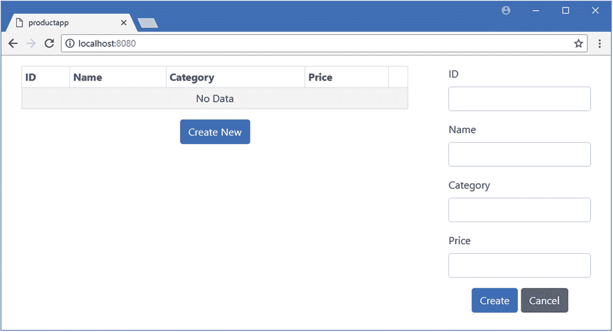
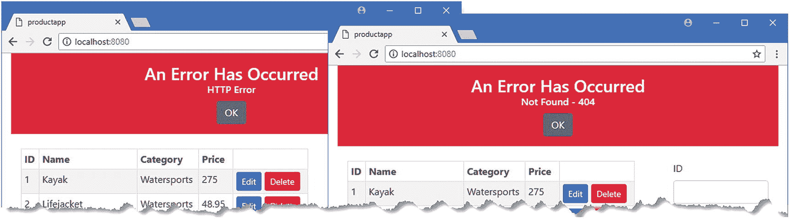

# 十九、使用 RESTful Web 服务

在本章中，我将演示如何在 Vue.js 应用中使用 RESTful web 服务。我解释了发出 HTTP 请求的不同方式，并扩展了示例应用，使其能够从服务器读取和存储数据。表 [19-1](#Tab1) 将 web 服务的使用放在 n 上下文中。

表 19-1

将 RESTful Web 服务放在上下文中

<colgroup><col class="tcol1 align-left"> <col class="tcol2 align-left"></colgroup> 
| 

问题

 | 

回答

 |
| --- | --- |
| 它们是什么？ | RESTful web 服务通过 HTTP 请求向 web 应用提供数据。 |
| 它们为什么有用？ | 许多应用需要访问数据，并允许用户从持久性数据存储中创建、修改和删除对象。 |
| 它们是如何使用的？ | web 应用向服务器发送一个 HTTP 请求，使用请求类型和 URL 来标识所需的数据和操作。 |
| 有什么陷阱或限制吗？ | RESTful web 服务没有标准，这意味着 web 服务的工作方式存在差异。在 Vue.js 应用中，HTTP 请求是异步执行的，这让许多开发人员感到困惑。需要特别注意处理错误，因为 Vue.js 不会自动检测它们。 |
| 还有其他选择吗？ | 您不必在 web 应用中使用 HTTP 请求，尤其是当您只有少量数据要处理时。 |

表 [19-2](#Tab2) 总结了本章内容。

表 19-2

章节总结

<colgroup><col class="tcol1 align-left"> <col class="tcol2 align-left"> <col class="tcol3 align-left"></colgroup> 
| 

问题

 | 

解决办法

 | 

列表

 |
| --- | --- | --- |
| 从 web 服务获取数据 | 创建`Axios.get`方法并读取响应对象的`data`属性 | 10–14 |
| 整合访问 web 服务的代码 | 创建 HTTP 服务 | 15–17 |
| 执行其他 HTTP 操作 | 使用与您需要的 HTTP 请求类型相对应的 Axios 方法 | 18–19 |
| 应对错误 | 合并请求并使用一个`try` / `catch`块来捕获和处理错误 | 20–23 |

## 为本章做准备

在本章中，我继续使用第 [18](18.html) 章的 productapp 项目。按照下面几节中的说明来准备处理 HTTP 请求的示例应用。

### 小费

你可以从 [`https://github.com/Apress/pro-vue-js-2`](https://github.com/Apress/pro-vue-js-2) 下载本章以及本书其他章节的示例项目。

### 准备 HTTP 服务器

我需要一个额外的包来接收本章中的示例应用发出的 HTTP 请求。运行`productapp`文件夹中清单 [19-1](#PC1) 所示的命令，安装一个名为`json-server`的包。

```js
npm install json-server@0.12.1

Listing 19-1Installing a Package

```

为了向服务器提供它将用来处理 HTTP 请求的数据，在`productapp`文件夹中添加一个名为`restData.js`的文件，其内容如清单 [19-2](#PC2) 所示。

```js
module.exports = function () {
    var data = {
        products: [
            { id: 1, name: "Kayak", category: "Watersports", price: 275 },
            { id: 2, name: "Lifejacket", category: "Watersports", price: 48.95 },
            { id: 3, name: "Soccer Ball", category: "Soccer", price: 19.50 },
            { id: 4, name: "Corner Flags", category: "Soccer", price: 34.95 },
            { id: 5, name: "Stadium", category: "Soccer", price: 79500 },
            { id: 6, name: "Thinking Cap", category: "Chess", price: 16 },
            { id: 7, name: "Unsteady Chair", category: "Chess", price: 29.95 },
            { id: 8, name: "Human Chess Board", category: "Chess", price: 75 },
            { id: 9, name: "Bling Bling King", category: "Chess", price: 1200 }
        ]
    }
    return data
}

Listing 19-2The Contents of the restData.js File in the productapp Folder

```

为了允许 NPM 运行`json-server`包，将清单 [19-3](#PC3) 中所示的语句添加到`package.json`文件的`scripts`部分。

```js
...
  "scripts": {
    "serve": "vue-cli-service serve",
    "build": "vue-cli-service build",
    "lint": "vue-cli-service lint",
    "json": "json-server restData.js -p 3500"

  },
...

Listing 19-3Adding a Script in the package.json File in the productapp Folder

```

### 准备示例应用

为了准备本章的示例应用，我将删除一些不再需要的特性，删除硬编码到应用中的数据，并准备处理除了我在第 [18](18.html) 章中使用的`id`、`name`和`price`属性之外还具有 category 属性的对象。

#### 安装 HTTP 包

但是，首先，我要添加我将用来发出 HTTP 请求的包。在`productapp`文件夹中运行清单 [19-4](#PC4) 所示的命令来安装一个名为 Axios 的包。

```js
npm install axios@0.18.0

Listing 19-4Installing a Package

```

Axios 是一个流行的库，用于在 web 应用中发出 HTTP 请求。它不是专门为 Vue.js 应用编写的，但它已经成为 Vue.js 应用中最常用的 HTTP 库，因为它可靠且易于使用。您不必在自己的项目中使用 Axios，我在“选择 HTTP 请求机制”侧栏中描述了选项的范围。

#### 简化组件

我简化了`ProductEditor`组件，以便直接向用户显示用于编辑的`input`元素，而不是通过一个单独的组件，我在第 [18](18.html) 章中使用这个组件来演示如何连接应用的不同部分。清单 [19-5](#PC5) 显示了简化的组件。

```js
<template>

    <div>
        <div class="form-group">
            <label>ID</label>
            <input class="form-control" v-model="product.id" />
        </div>
        <div class="form-group">
            <label>Name</label>
            <input class="form-control" v-model="product.name" />
        </div>
        <div class="form-group">
            <label>Category</label>
            <input class="form-control" v-model="product.category" />
        </div>
        <div class="form-group">
            <label>Price</label>
            <input class="form-control" v-model.number="product.price" />
        </div>
        <div class="text-center">
            <button class="btn btn-primary" v-on:click="save">
                {{ editing ? "Save" : "Create" }}
            </button>
            <button class="btn btn-secondary" v-on:click="cancel">Cancel</button>
        </div>
    </div>

</template>

<script>

    export default {
        data: function () {
            return {
                editing: false,
                product: {}
            }
        },
        methods: {
            startEdit(product) {
                this.editing = true;
                this.product = {
                    id: product.id,
                    name: product.name,
                    category: product.category,
                    price: product.price
                }
            },
            startCreate() {
                this.editing = false;
                this.product = {};
            },
            save() {
                this.eventBus.$emit("complete", this.product);
                this.startCreate();
            },
            cancel() {
                this.product = {};
                this.editing = false;
            }
        },
        inject: ["eventBus"],
        created() {
            this.eventBus.$on("create", this.startCreate);
            this.eventBus.$on("edit", this.startEdit);
        }
    }
</script>

Listing 19-5Simplifying the Component in the ProductEditor.vue File in the src/components Folder

```

接下来，我简化了`ProductDisplay`组件，删除了硬编码的数据并增加了对显示类别值的支持，如清单 [19-6](#PC6) 所示。

```js
<template>
    <div>
        <table class="table table-sm table-striped table-bordered">
            <tr>
                <th>ID</th><th>Name</th><th>Category</th><th>Price</th><th></th>
            </tr>
            <tbody>
                <tr v-for="p in products" v-bind:key="p.id">
                    <td>{{ p.id }}</td>
                    <td>{{ p.name }}</td>
                    <td>{{ p.category }}</td>
                    <td>{{ p.price }}</td>
                    <td>
                        <button class="btn btn-sm btn-primary"
                                v-on:click="editProduct(p)">
                            Edit
                        </button>
                    </td>
                </tr>
                <tr v-if="products.length == 0">
                    <td colspan="5" class="text-center">No Data</td>
                </tr>
            </tbody>
        </table>
        <div class="text-center">
            <button class="btn btn-primary" v-on:click="createNew">
                Create New
            </button>
        </div>
    </div>
</template>

<script>

    import Vue from "vue";

    export default {
        data: function () {
            return {
                products: []
            }
        },
        methods: {
            createNew() {
                this.eventBus.$emit("create");
            },
            editProduct(product) {
                this.eventBus.$emit("edit", product);
            }
        },
        inject: ["eventBus"]
    }
</script>

Listing 19-6Simplifying the Component in the ProductDisplay.vue File in the src/components Folder

```

最后，我简化了`App`组件，删除了用于切换输入元素颜色的按钮以及它使用的方法和服务，如清单 [19-7](#PC7) 所示。

```js
<template>
    <div class="container-fluid">
        <div class="row">
            <div class="col-8 m-3"><product-display/></div>
            <div class="col m-3"><product-editor/></div>
        </div>
    </div>
</template>

<script>
    import ProductDisplay from "./components/ProductDisplay";
    import ProductEditor from "./components/ProductEditor";

    export default {
        name: 'App',
        components: { ProductDisplay, ProductEditor }
    }
</script>

Listing 19-7Simplifying the Component in the App.vue File in the src Folder

```

### 运行示例应用和 HTTP 服务器

本章需要两个命令提示符:一个运行 HTTP 服务器，另一个运行 Vue.js 开发工具。在`productapp`文件夹中打开一个新的命令提示符，运行清单 [19-8](#PC8) 中所示的命令来启动 HTTP 服务器。

```js
npm run json

Listing 19-8Starting the RESTful Server

```

服务器将开始监听端口 3500 上的请求。要测试服务器是否正在运行，请打开一个新的 web 浏览器并请求 URL `http://localhost:3500/products/1`。如果服务器正在运行并且能够找到数据文件，那么浏览器将显示以下 JSON 数据:

```js
...
{
  "id": 1,
  "name": "Kayak",
  "category": "Watersports",
  "price": 275
}
...

```

让 HTTP 服务器保持运行，并打开另一个命令提示符。导航到`productapp`文件夹并运行清单 [19-9](#PC10) 中所示的命令来启动 Vue.js 开发工具。

```js
npm run serve

Listing 19-9Starting the Vue.js Development Tools

```

一旦初始捆绑过程完成，打开一个新的浏览器窗口并导航到`http://localhost:8080`，在那里你将看到示例应用，如图 [19-1](#Fig1) 所示。



图 19-1

运行示例应用

## 理解 RESTful Web 服务

向应用交付数据的最常见方法是使用表述性状态转移模式(称为 REST)来创建数据 web 服务。REST 没有详细的规范，这导致很多不同的方法都打着 RESTful 的旗号。然而，在 web 应用开发中有一些有用的统一思想。

RESTful web 服务的核心前提是包含 HTTP 的特性，以便请求方法——也称为*动词*——指定服务器要执行的操作，请求 URL 指定操作将应用到的一个或多个数据对象。

例如，在示例应用中，下面是一个可能指向特定产品的 URL:

```js
http://localhost:3500/products/2

```

URL 的第一段—`products`—表示将被操作的对象的集合，并允许单个服务器提供多个服务，每个服务都有自己的数据。第二个片段——`2`——在`products`集合中选择一个单独的对象。在本例中，`id`属性的值唯一地标识了一个对象，并将在 URL 中使用，在本例中，指定了`Lifejacket`对象。

用于发出请求的 HTTP 动词或方法告诉 RESTful 服务器应该对指定的对象执行什么操作。在上一节中测试 RESTful 服务器时，浏览器发送了一个 HTTP GET 请求，服务器将其解释为检索指定对象并将其发送给客户机的指令。正是由于这个原因，浏览器显示了一个表示`Lifejacket`对象的 JSON。

表 [19-3](#Tab3) 显示了 HTTP 方法和 URL 的最常见组合，并解释了当发送到 RESTful 服务器时它们各自的作用。

表 19-3

RESTful Web 服务中常见的 HTTP 方法及其效果

<colgroup><col class="tcol1 align-left"> <col class="tcol2 align-left"> <col class="tcol3 align-left"></colgroup> 
| 

方法

 | 

统一资源定位器

 | 

描述

 |
| --- | --- | --- |
| `GET` | `/products` | 这种组合检索`products`集合中的所有对象。 |
| `GET` | `/products/2` | 这个组合从`products`集合中检索出`id`为`2`的对象。 |
| `POST` | `/products` | 该组合用于向`products`集合添加一个新对象。请求体包含新对象的 JSON 表示。 |
| `PUT` | `/products/2` | 该组合用于替换`products`集合中`id`为 2 的对象。请求体包含替换对象的 JSON 表示。 |
| `PATCH` | `/products/2` | 该组合用于更新`products`集合中对象属性的子集，该集合的`id`为 2。请求体包含要更新的属性和新值的 JSON 表示。 |
| `DELETE` | `/products/2` | 该组合用于从`products`集合中删除`id`为 2 的产品。 |

需要谨慎，因为一些 RESTful web 服务的工作方式可能存在相当大的差异，这是由用于创建它们的框架和开发团队的偏好的差异造成的。确认 web 服务如何使用动词以及在 URL 和请求正文中需要什么来执行操作是很重要的。

一些常见的变体包括不接受任何包含`id`值的请求主体的 web 服务(以确保它们是由服务器的数据存储唯一生成的)和不支持所有动词的 web 服务(通常忽略`PATCH`请求，只接受使用`PUT`动词的更新)。

### 选择 HTTP 请求机制

异步 HTTP 请求有三种不同的方式。第一种方法是使用`XMLHttpRequest`对象，这是异步请求的原始机制，可以追溯到 XML 作为 web 应用的标准数据格式的时候。下面是一段代码，它向本章中使用的 RESTful web 服务发送一个 HTTP 请求:

```js
...
let request = new XMLHttpRequest();
request.onreadystatechange = () => {
    if (request.readyState == XMLHttpRequest.DONE && request.status == 200) {
        this.products.push(...JSON.parse(request.responseText));
    }
};
request.open("GET", "http://localhost:3500/products");
request.send();
...

```

由`XMLHttpRequest`对象提供的 API 使用一个事件处理程序来接收更新，包括请求完成时来自服务器的响应细节。`XMLHttpRequest`使用起来很笨拙，并且不支持像`async` / `await`关键字这样的现代特性，但是你可以相信它在所有运行 Vue.js 应用的浏览器中都是可用的。你可以在 [`https://developer.mozilla.org/en-US/docs/Web/API/XMLHttpRequest`](https://developer.mozilla.org/en-US/docs/Web/API/XMLHttpRequest) 了解更多关于`XMLHttpRequest`的 API。

第二种方法是使用 Fetch API，这是最近对`XMLHttpRequest`对象的替代。Fetch API 使用承诺，而不是事件，通常更容易使用。下面是获取产品数据的一段代码，相当于`XMLHttpRequest`示例:

```js
...
fetch("http://localhost:3500/products")
    .then(response => response.json())
    .then(data => this.products.push(...data));
...

```

如果有的话，Fetch API 使用了太多的承诺。`fetch`方法用于发出 HTTP 请求，该请求返回一个产生结果对象的承诺，该结果对象的`json`方法产生从 JSON 数据解析的请求的最终结果。Fetch API 可以与`async`和`await`关键字一起使用，但是处理多个承诺需要小心，可能会导致类似下面这样的语句:

```js
...
this.products.push(
    ...await (await fetch("http://localhost:3500/products")).json());
...

```

Fetch API 是对`XMLHttpRequest`的改进，但是并不是所有可以运行 Vue.js 应用的浏览器都支持它。你可以在 [`https://developer.mozilla.org/en-US/docs/Web/API/Fetch_API`](https://developer.mozilla.org/en-US/docs/Web/API/Fetch_API) 找到获取 API 的详细信息。

第三种方法是使用一个包，该包使用了`XMLHttpRequest`对象，但隐藏了细节，并提供了一个与 Vue.js 开发体验的其余部分更加一致的 API。我在这一章中使用了 Axios 包，因为它是最流行的，但也有许多可用的选择。Vue.js 没有一个“官方的”HTTP 包，但是有很多选择，甚至不是专门为 Vue.js 编写的包也很容易使用，正如本章所演示的。使用 HTTP 包的缺点是应用的大小会增加，因为浏览器需要额外的代码。

## 使用 RESTful Web 服务

关于 web 应用发出的 HTTP 请求，需要理解的最重要的一点是它们是异步的。这似乎是显而易见的，但它会引起混乱，因为来自服务器的响应不会立即可用。因此，HTTP 请求所需的代码必须仔细编写，并且需要 JavaScript 特性来处理异步操作。因为 HTTP 请求会引起很多混乱，所以在接下来的小节中，我将一步一步地为第一个请求构建代码。

### 提出跨来源请求

默认情况下，浏览器会强制执行一个安全策略，只允许 JavaScript 代码在包含异步 HTTP 请求的文档的同一来源内发出这些请求。该政策旨在降低跨站点脚本(CSS)攻击的风险，在这种攻击中，浏览器被诱骗执行恶意代码，这在 [`http://en.wikipedia.org/wiki/Cross-site_scripting`](http://en.wikipedia.org/wiki/Cross-site_scripting) 中有详细描述。对于 web 应用开发人员来说，同源策略在使用 web 服务时可能是一个问题，因为它们通常位于包含应用 JavaScript 代码的源之外。如果两个 URL 具有相同的协议、主机和端口，则它们被认为是来源相同，否则它们具有不同的来源。我在本章中为 RESTful web 服务使用的 URL 与主应用使用的 URL 有不同的来源，因为它们使用不同的 TCP 端口。

跨源资源共享(CORS)协议用于向不同的源发送请求。使用 CORS，浏览器在异步 HTTP 请求中包含标头，向服务器提供 JavaScript 代码的来源。来自服务器的响应包括告诉浏览器它是否愿意接受请求的头。CORS 的详细情况不在本书讨论范围之内，但在 [`https://en.wikipedia.org/wiki/Cross-origin_resource_sharing`](https://en.wikipedia.org/wiki/Cross-origin_resource_sharing) 有题目介绍，在 [`www.w3.org/TR/cors`](http://www.w3.org/TR/cors) 有 CORS 规格。

CORS 是在这一章中自动发生的事情。提供 RESTful web 服务的`json-server`包支持 CORS，并将接受来自任何来源的请求，而我用来发出 HTTP 请求的 Axios 包自动应用 CORS。当您为自己的项目选择软件时，您必须选择一个允许通过单一来源处理所有请求的平台，或者配置 CORS 以便服务器接受应用的数据请求。

### 处理响应数据

这可能看起来违反直觉，但是最好从处理您期望从服务器接收的数据的代码开始。在清单 [19-10](#PC15) 中，我在`ProductDisplay`组件的脚本元素中添加了一个方法，当从 RESTful web 服务接收到产品数据时，它将处理这些数据。

```js
...
<script>

    import Vue from "vue";

    export default {
        data: function () {
            return {
                products: []
            }
        },
        methods: {
            createNew() {
                this.eventBus.$emit("create");
            },
            editProduct(product) {
                this.eventBus.$emit("edit", product);
            },
            processProducts(newProducts) {

                this.products.splice(0);

                this.products.push(...newProducts);

            }

        },
        inject: ["eventBus"]
    }
</script>
...

Listing 19-10Adding a Method in the ProductDisplay.vue File in the src/components Folder

```

`processProducts`方法将接收一个产品对象数组，并用它们替换名为`products`的`data p`属性的内容。正如我在第 [13](13.html) 章中解释的，Vue.js 在检测数组中的变化时有一些困难，所以我使用了`splice`方法来移除任何现有的对象。然后，我使用`destructuring`操作符解包方法参数中的值，并使用`push`方法重新填充数组。由于`products`数组是一个反应式数据属性，Vue.js 将自动检测变化并更新数据绑定以反映新数据。

### 发出 HTTP 请求

下一步是发出 HTTP 请求，并向 RESTful web 服务请求数据。在清单 [19-11](#PC16) 中，我已经导入了 Axios 包，并使用它来发送 HTTP 请求。

```js
...
<script>

    import Vue from "vue";
    import Axios from "axios";

    const baseUrl = "http://localhost:3500/products/";

    export default {
        data: function () {
            return {
                products: []
            }
        },
        methods: {
            createNew() {
                this.eventBus.$emit("create");
            },
            editProduct(product) {
                this.eventBus.$emit("edit", product);
            },
            processProducts(newProducts) {
                this.products.splice(0);
                this.products.push(...newProducts);
            }
        },
        inject: ["eventBus"],
        created() {

            Axios.get(baseUrl);

        }

    }
</script>
...

Listing 19-11Making an HTTP Request in the ProductDisplay.vue File in the src/components Folder

```

Axios 为每种 HTTP 请求类型提供了方法，比如使用`get`方法发出 GET 请求，使用`post`方法发出 POST 请求，等等。还有一个`request`方法，接受一个配置对象，可以用来发出所有类型的请求；我在“创建错误处理服务”一节中使用了它。

我在组件的`created`方法中发出 HTTP 请求。我希望我的请求的结果在收到数据时触发 Vue.js 更改机制，并且使用`created`方法确保在我向 HTTP 服务器发出请求之前组件的数据属性已经得到处理。

### 小费

一些开发人员更喜欢使用`mounted`方法来发出初始 HTTP 请求。您使用哪种方法并不重要，但保持一致是个好主意，这样所有组件的行为都是一样的。

### 接收响应

Axios `get`方法的结果是一个`Promise`，它将在 HTTP 请求完成时产生来自服务器的响应。正如我在第 [4](04.html) 章中解释的那样，`then`方法用于指定当一个`Promise`表示的工作完成时会发生什么，在清单 [19-12](#PC17) 中，我使用了`then`方法来处理 HTTP 响应。

```js
...
<script>

    import Vue from "vue";
    import Axios from "axios";

    const baseUrl = "http://localhost:3500/products/";

    export default {
        data: function () {
            return {
                products: []
            }
        },
        methods: {
            createNew() {
                this.eventBus.$emit("create");
            },
            editProduct(product) {
                this.eventBus.$emit("edit", product);
            },
            processProducts(newProducts) {
                this.products.splice(0);
                this.products.push(...newProducts);
            }
        },
        inject: ["eventBus"],
        created() {
            Axios.get(baseUrl).then(resp => {

                console.log(`HTTP Response: ${resp.status}, ${resp.statusText}`);

                console.log(`Response Data: ${resp.data.length} items`);

            });

        }
    }
</script>
...

Listing 19-12Receiving the HTTP Response in the ProductDisplay.vue File in the src/components Folder

```

`then`方法从 Axios 接收一个对象，该对象代表服务器的响应，并定义了表 [19-4](#Tab4) 中所示的属性。

表 19-4

Axios 响应属性

<colgroup><col class="tcol1 align-left"> <col class="tcol2 align-left"></colgroup> 
| 

名字

 | 

描述

 |
| --- | --- |
| `status` | 该属性返回响应的状态代码，如 200 或 404。 |
| `statusText` | 此属性返回伴随状态代码的说明性文本，如 OK 或 Not Found。 |
| `headers` | 此属性返回一个对象，该对象的属性表示响应标头。 |
| `data` | 该属性从响应中返回有效负载。 |
| `config` | 此属性返回一个对象，该对象包含用于发出请求的配置选项。 |
| `request` | 该属性返回用于发出请求的`XMLHttpRequest`对象。 |

在清单 [19-12](#PC17) 中，我使用`status`和`statusText`属性写出浏览器 JavaScript 控制台响应的细节。更令人感兴趣的是`data`属性，该属性返回服务器发送的有效负载，Axios 自动对 JSON 响应进行解码，这意味着我可以读取`length`属性来找出响应中包含了多少对象。保存对组件的更改，并检查浏览器的 JavaScript 控制台，您将看到以下消息:

```js
...
HTTP Response: 200, OK
Response Data: 9 items
...

```

### 处理数据

最后一步是从响应对象读取数据属性，并将其传递给`processProducts`方法，这样从 RESTful web 服务获得的对象将更新应用，如清单 [19-13](#PC19) 所示。

```js
...
<script>

    import Vue from "vue";
    import Axios from "axios";

    const baseUrl = "http://localhost:3500/products/";

    export default {
        data: function () {
            return {
                products: []
            }
        },
        methods: {
            createNew() {
                this.eventBus.$emit("create");
            },
            editProduct(product) {
                this.eventBus.$emit("edit", product);
            },
            processProducts(newProducts) {
                this.products.splice(0);
                this.products.push(...newProducts);
            }
        },
        inject: ["eventBus"],
        created() {
            Axios.get(baseUrl).then(resp => this.processProducts(resp.data));

        }
    }
</script>
...

Listing 19-13Processing the Response in the ProductDisplay.vue File in the src/components Folder

```

效果是组件将在其`created`方法中发起一个 HTTP GET 请求。当从服务器收到响应时，Axios 解析它包含的 JSON 数据，并使它作为响应的一部分可用。响应数据用于填充组件的`products`数组，随后的更新评估模板中的`v-for`指令，并显示如图 [19-2](#Fig2) 所示的数据。


图 19-2

从 web 服务获取数据

我可以使用`async` / `await`关键字简化这段代码，这将让我不必依赖于`then`方法就能发出 HTTP 请求，有些开发人员会觉得这种方法令人困惑。在清单 [19-14](#PC20) 中，我将`async`关键字应用于`create`方法，并使用`await`关键字发出 HTTP 请求。

```js
...

async created() {
    let data = (await Axios.get(baseUrl)).data;

    this.processProducts(data);

}
...

Listing 19-14Streamlining the Request Code in the ProductDisplay.vue File in the src/components Folder

```

这段代码的工作方式与清单 [19-13](#PC19) 中的代码相同，但是没有使用`then`方法来指定当 HTTP 请求完成时将要执行的语句。

## 创建 HTTP 服务

在继续之前，我将更改应用的结构。我在上一节中采用的方法演示了在组件中发出 HTTP 请求是多么容易，但是结果是组件提供给用户的功能被与服务器通信所需的代码冲淡了。随着请求类型范围的扩大，该组件将越来越专注于处理 HTTP。

我在`src`文件夹中添加了一个名为`restDataSource.js`的 JavaScript 文件，并用它来定义清单 [19-15](#PC21) 中所示的 JavaScript 类。

```js
import Axios from "axios";

const baseUrl = "http://localhost:3500/products/";

export class RestDataSource {

    async getProducts() {
        return (await Axios.get(baseUrl)).data;
    }
}

Listing 19-15The Contents of the restDataSource.js File in the src Folder

```

我已经使用 JavaScript 类特性定义了`RestDataSource`类，它有一个异步的`getProducts`方法，使用 Axios 向 RESTful web 服务发送 HTTP 请求，并返回接收到的数据。在清单 [19-16](#PC22) 中，我创建了一个`RestDataSource`类的实例，并将其配置为`main.js`文件中的一个服务，这样它将在整个应用中可用。

```js
import Vue from 'vue'
import App from './App.vue'

import "../node_modules/bootstrap/dist/css/bootstrap.min.css";

import { RestDataSource } from "./restDataSource";

Vue.config.productionTip = false

new Vue({
  render: h => h(App),
  provide: function () {
      return {
          eventBus: new Vue(),
          restDataSource: new RestDataSource()

      }
  }
}).$mount('#app')

Listing 19-16Configuring a Service in the main.js File in the src Folder

```

新服务被称为`restDataSource`，它将可供应用中的所有组件使用。

### 使用 HTTP 服务

现在我已经定义了一个服务，我可以从`ProductDisplay`代码中删除 Axios 代码，并使用该服务，如清单 [19-17](#PC23) 所示。

```js
...
<script>

    import Vue from "vue";

    //import Axios from "axios";

    //const baseUrl = "http://localhost:3500/products/";

    export default {
        data: function () {
            return {
                products: []
            }
        },
        methods: {
            createNew() {
                this.eventBus.$emit("create");
            },
            editProduct(product) {
                this.eventBus.$emit("edit", product);
            },
            processProducts(newProducts) {
                this.products.splice(0);
                this.products.push(...newProducts);
            }
        },
        inject: ["eventBus", "restDataSource"],

        async created() {
            this.processProducts(await this.restDataSource.getProducts());

        }
    }
</script>
...

Listing 19-17Using the HTTP Service in the ProductDisplay.vue File in the src/components Folder

```

`inject`属性声明了对`restDataSource`服务的依赖，在`created`方法中使用该服务从 RESTful web 服务获取数据，并填充名为`products`的`data`属性。

### 添加其他 HTTP 操作

现在我已经有了一个基本的结构，我可以添加应用需要的完整的 HTTP 操作集，扩展服务以使用 Axios 提供的方法，如清单 [19-18](#PC24) 所示。

```js
import Axios from "axios";

const baseUrl = "http://localhost:3500/products/";

export class RestDataSource {

    async getProducts() {
        return (await Axios.get(baseUrl)).data;
    }

    async saveProduct(product) {

        await Axios.post(baseUrl, product);

    }

    async updateProduct(product) {

        await Axios.put(`${baseUrl}${product.id}`, product);

    }

    async deleteProduct(product) {

        await Axios.delete(`${baseUrl}${product.id}`, product);

    }

}

Listing 19-18Adding Operations in restDataSource.js in the src Folder

```

我添加了保存新对象、更新现有对象和删除对象的方法。所有这些方法都使用`async` / `await`关键字，这将允许需要操作的组件等待结果。这很重要，因为这意味着组件可以确保数据的本地表示不会被更新，除非 HTTP 操作成功完成。

### 小费

删除或编辑项目后，停止并启动`json-server`包，将示例数据重置为其原始状态。清单 [19-2](#PC2) 中创建的 JavaScript 文件的内容将在进程开始时用于重新填充数据库。

在清单 [19-19](#PC25) 中，我修改了`ProductDisplay`组件以使用清单 [19-18](#PC24) 中定义的方法，并增加了对删除对象的支持。

```js
<template>
    <div>
        <table class="table table-sm table-striped table-bordered">
            <tr>
                <th>ID</th>
                <th>Name</th>
                <th>Category</th>
                <th>Price</th>
                <th></th>
            </tr>
            <tbody>
                <tr v-for="p in products" v-bind:key="p.id">
                    <td>{{ p.id }}</td>
                    <td>{{ p.name }}</td>
                    <td>{{ p.category }}</td>
                    <td>{{ p.price }}</td>
                    <td>
                        <button class="btn btn-sm btn-primary"
                                v-on:click="editProduct(p)">
                            Edit
                        </button>
                        <button class="btn btn-sm btn-danger"

                                v-on:click="deleteProduct(p)">

                            Delete

                        </button>

                    </td>
                </tr>
                <tr v-if="products.length == 0">
                    <td colspan="5" class="text-center">No Data</td>
                </tr>
            </tbody>
        </table>
        <div class="text-center">
            <button class="btn btn-primary" v-on:click="createNew">
                Create New
            </button>
        </div>
    </div>
</template>

<script>

    import Vue from "vue";

    export default {
        data: function () {
            return {
                products: []
            }
        },
        methods: {
            createNew() {
                this.eventBus.$emit("create");
            },
            editProduct(product) {
                this.eventBus.$emit("edit", product);
            },
            async deleteProduct(product) {

                await this.restDataSource.deleteProduct(product);

                let index = this.products.findIndex(p => p.id == product.id);

                this.products.splice(index, 1);

            },

            processProducts(newProducts) {
                this.products.splice(0);
                this.products.push(...newProducts);
            },
            async processComplete(product) {

                let index = this.products.findIndex(p => p.id == product.id);
                if (index == -1) {
                    await this.restDataSource.saveProduct(product);

                    this.products.push(product);
                } else {
                    await this.restDataSource.updateProduct(product);

                    Vue.set(this.products, index, product);
                }
            }
        },
        inject: ["eventBus", "restDataSource"],
        async created() {
            this.processProducts(await this.restDataSource.getProducts());
            this.eventBus.$on("complete", this.processComplete);

        }
    }
</script>

Listing 19-19Adding Data Operations in the ProductDisplay.vue File in the src/components Folder

```

当调用由 HTTP 服务定义的异步方法时，使用`await`关键字是很重要的。如果省略了`await`关键字，那么不管 HTTP 请求的结果如何，组件方法中的后续语句都会立即执行。对于要求 RESTful web 服务存储或删除对象的操作，这意味着应用向用户显示的数据将表明操作已经立即成功完成，即使发生了错误。例如，在这个方法中使用`await`关键字可以防止组件从`products`数组中移除对象，直到 HTTP 请求完成:

```js
...
async deleteProduct(product) {
    await this.restDataSource.deleteProduct(product);
    let index = this.products.findIndex(p => p.id == product.id);
    this.products.splice(index, 1);
},
...

```

当您使用`await`关键字时，在异步操作执行期间发生的任何错误都将导致在组件的方法中抛出异常，这将停止组件方法中语句的执行，在这种情况下，防止用户数据与服务器上的数据不同步。

### 小费

当你在一个组件的方法中使用`await`关键字时，你必须记住也应用`async`关键字，如清单 [19-19](#PC25) 所示。

这些变化的结果是应用从 RESTful web 服务中读取数据，并能够创建新产品，编辑和删除现有产品，如图 [19-3](#Fig3) 所示。


图 19-3

执行 HTTP 操作

### 创建错误处理服务

Vue.js 不能检测异步 HTTP 操作中出现的异常，需要做一些额外的工作来告诉用户发生了错误。我倾向于创建一个专门显示错误的组件，并让`RestDataSource`类通过事件总线发送定制事件来提供错误通知。在清单 [19-20](#PC27) 中，我添加了对`RestDataSource`类的支持，通过调度自定义事件来处理异常。

```js
import Axios from "axios";

const baseUrl = "http://localhost:3500/products/";

export class RestDataSource {

    constructor(bus) {

        this.eventBus = bus;

    }

    async getProducts() {
        return (await this.sendRequest("GET", baseUrl)).data;

    }

    async saveProduct(product) {
        await this.sendRequest("POST", baseUrl, product);

    }

    async updateProduct(product) {
        await this.sendRequest("PUT", `${baseUrl}${product.id}`, product);

    }

    async deleteProduct(product) {
        await this.sendRequest("DELETE", `${baseUrl}${product.id}`, product);

    }

    async sendRequest(httpMethod, url, product) {

        try {

            return await Axios.request({

                method: httpMethod,

                url: url,

                data: product

            });

        } catch (err) {

            if (err.response) {

                this.eventBus.$emit("httpError",

                    `${err.response.statusText} - ${err.response.status}`);

            } else {

                this.eventBus.$emit("httpError", "HTTP Error");

            }

            throw err;

        }

    }

}

Listing 19-20Handling Errors in the restDataSource.js File in the src Folder

```

常规类不经历组件生命周期，不能使用`inject`属性接收服务。考虑到这一点，我添加了一个接受事件总线的构造函数，我重写了这个类，这样所有的方法都通过调用使用 Axios `request`方法的`sendRequest`方法来执行它们的工作。这个方法允许使用一个配置对象来指定请求的细节，并允许我合并执行 HTTP 请求的代码，以便我可以一致地处理错误。

Axios 并不总是能够提供包含响应的对象，比如当请求超时时。对于这些情况，我提供了一般性的描述，指出问题与 HTTP 请求有关。

当 HTTP 请求返回 400 和 500 范围内的状态代码时，Axios 方法会抛出错误，这表明存在问题。在清单 [19-20](#PC27) 中，我使用了一个`try` / `catch`块来捕捉异常并发送一个名为`httpError`的定制事件。在`catch`块中接收的对象是一个`response`属性，它返回一个表示来自服务器的响应的对象。这个对象定义了表 [19-4](#Tab4) 中描述的属性，我用它来制定一个简单的消息来伴随自定义事件。

### 小费

注意，在发送自定义事件后，我仍然`throw`事件。这是为了让发起 HTTP 请求的组件接收到异常，而不会继续更新数据的本地表示。如果没有`throw`语句，只有自定义事件的接收者会知道有问题。

我在清单 [19-20](#PC27) 中添加的构造函数需要一个事件总线，我在`main.js`文件中提供了，如清单 [19-21](#PC28) 所示。

```js
import Vue from 'vue'
import App from './App.vue'

import "../node_modules/bootstrap/dist/css/bootstrap.min.css";
import { RestDataSource } from "./restDataSource";

Vue.config.productionTip = false

new Vue({
  render: h => h(App),
  data: {

    eventBus: new Vue()

  },

  provide: function () {
      return {
          eventBus: this.eventBus,

          restDataSource: new RestDataSource(this.eventBus)

      }
  }
}).$mount('#app')

Listing 19-21Configuring a Service in the main.js File in the src Folder

```

定义服务的属性不能引用其他服务，所以我定义了一个创建事件总线的数据属性，然后我通过它自己的`provide`属性直接公开它，并作为`RestDataSource`类的构造函数参数。

#### 创建错误显示组件

我需要一个组件，将接收自定义事件，并向用户显示错误消息。我在`src/components`文件夹中添加了一个名为`ErrorDisplay.vue`的文件，并添加了清单 [19-22](#PC29) 中所示的内容。

```js
<template>
    <div v-if="error" class="bg-danger text-white text-center p-3 h3">
        An Error Has Occurred
        <h6>{{ message }}</h6>
        <a href="/" class="btn btn-secondary">OK</a>
    </div>
</template>

<script>

export default {
    data: function () {
        return {
            error: false,
            message: ""
        }
    },
    methods: {
        handleError(err) {
            this.error = true;
            this.message = err;
        }
    },
    inject: ["eventBus"],
    created() {
        this.eventBus.$on("httpError", this.handleError);
    }
}
</script>

Listing 19-22The Contents of the ErrorDisplay.vue File in the src/components Folder

```

该组件通过使用事件总线在其`created`方法中注册其对自定义事件的兴趣，并在接收到事件时通过`v-if`指令显示一个元素进行响应。为了将组件应用到用户，我对应用的根组件进行了更改，如清单 [19-23](#PC30) 所示。

```js
<template>
    <div class="container-fluid">
        <div class="row">

            <div class="col"><error-display /></div>

        </div>

        <div class="row">
            <div class="col-8 m-3"><product-display/></div>
            <div class="col m-3"><product-editor/></div>
        </div>
    </div>
</template>

<script>
    import ProductDisplay from "./components/ProductDisplay";
    import ProductEditor from "./components/ProductEditor";
    import ErrorDisplay from "./components/ErrorDisplay";

    export default {
        name: 'App',
        components: { ProductDisplay, ProductEditor, ErrorDisplay }

    }
</script>

Listing 19-23Applying a Component in the App.vue File in the src Folder

```

一个`import`语句将名称`ErrorDisplay`分配给`component`，用于向 Vue.js 注册它，并允许将一个`error-display`元素添加到根组件的模板中。结果是在 HTTP 请求过程中遇到的任何错误都会显示给用户，如图 [19-4](#Fig4) 所示。

### 小费

如果您想测试错误处理，那么最简单的方法就是停止`json-server`进程，并更改`RestDataSource`类中的`baseUrl`值，使其指向一个不存在的 URL，比如`http://localhost:3500/hats/`。



图 19-4

显示错误

### 从 HTTP 错误中恢复

我在错误处理组件中采用的方法是全有或全无的方法，在这种方法中，用户会看到一个导航到根 URL 的 OK 按钮，这有效地重新加载了应用并获得了新数据。这种方法的缺点是用户会丢失任何本地状态，这可能会导致挫败感，特别是如果用户试图重复一个复杂的任务，结果却再次处于相同的状态。

更好的方法是允许用户纠正问题并重试 HTTP 请求，但是只有当问题的原因清楚并且解决方案显而易见时，才应该尝试这样做。即使服务器提供了额外的错误信息，从 HTTP 请求中诊断出问题并不总是容易的。

## 摘要

在本章中，我演示了 Vue.js 应用如何使用 Axios 包访问 RESTful web 服务。我演示了如何使用 HTTP 请求执行数据操作，我向您展示了如何创建一个单独的类来将 HTTP 请求的细节与应用的其余部分分开，我解释了如何在出现错误时进行处理。在下一章中，我将解释如何使用 Vuex 包来创建共享数据存储。