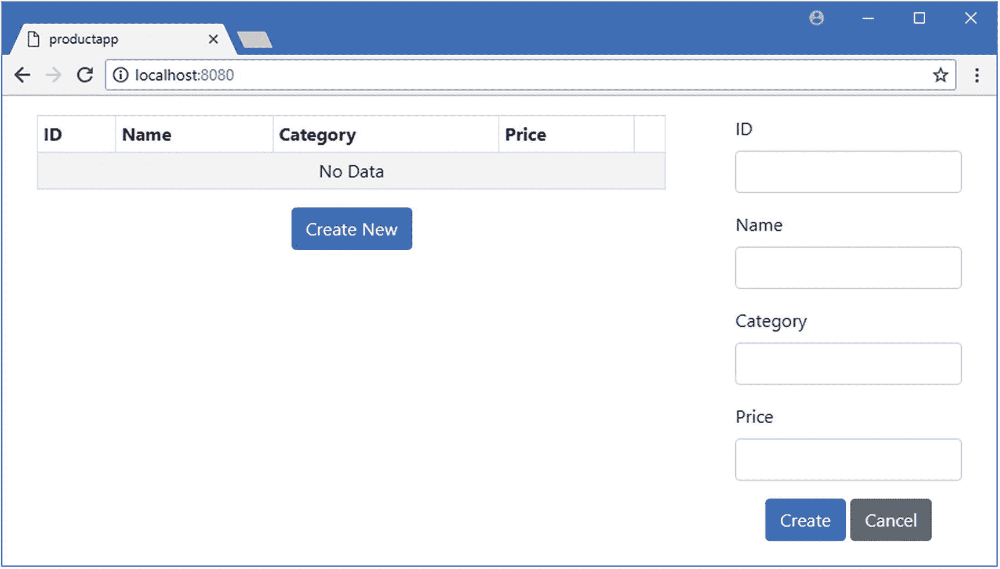
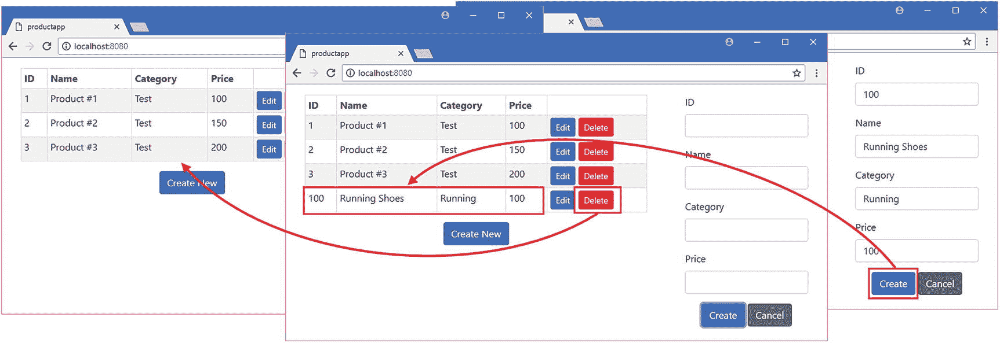
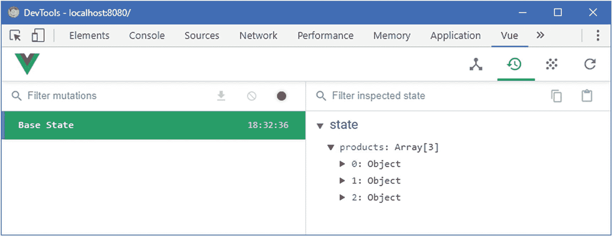
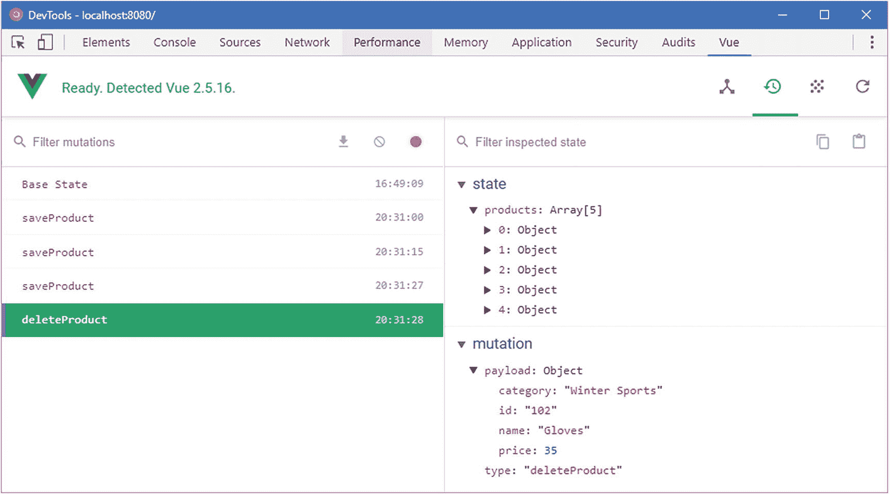
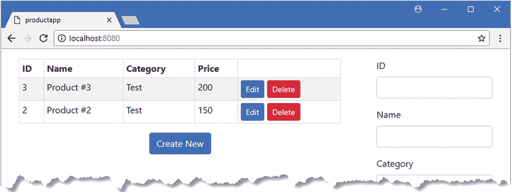
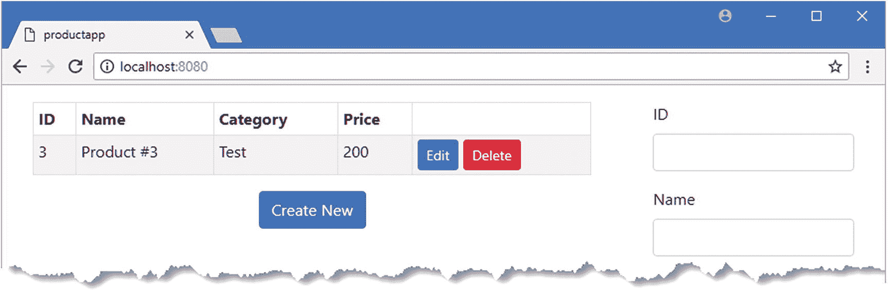
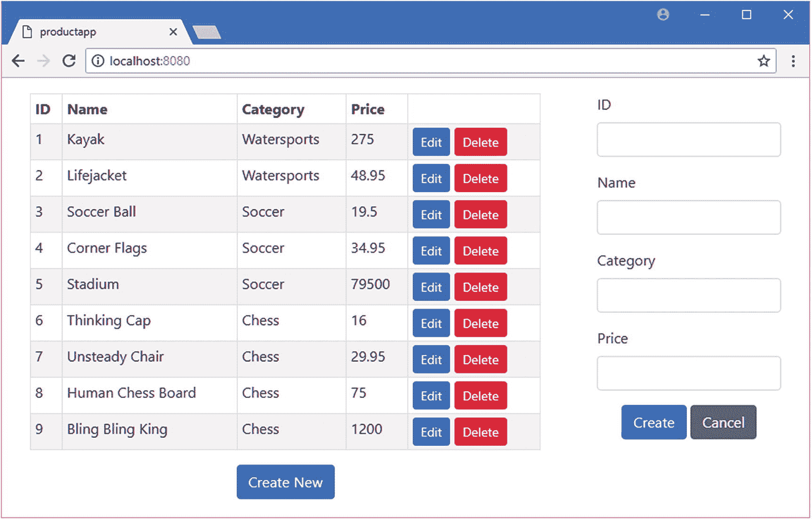
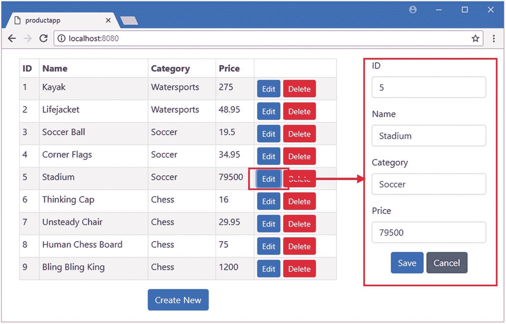
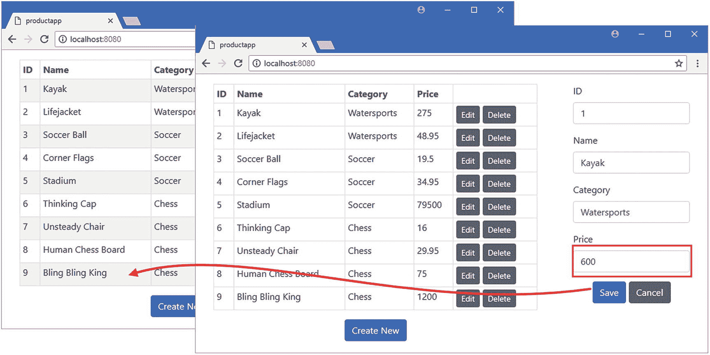

# 二十、使用数据存储

在这一章中，我将向您展示如何使用 Vuex 包来创建数据存储，它提供了一种在应用中共享数据和在组件之间安排协调的替代方法。表 [20-1](#Tab1) 将 Vuex 数据存储放在上下文中。

表 20-1

将 Vuex 数据存储放在上下文中

<colgroup><col class="tcol1 align-left"> <col class="tcol2 align-left"></colgroup> 
| 

问题

 | 

回答

 |
| --- | --- |
| 这是什么？ | 数据存储是应用状态的公共存储库，由 Vuex 包管理，它是 Vue.js 项目的正式组成部分。 |
| 为什么有用？ | 数据存储可以通过应用使数据易于使用，从而简化数据管理。 |
| 如何使用？ | 使用 Vuex 包创建一个数据存储，并在`main.js`文件中注册，这样每个组件都可以通过一个特殊的`$store`属性访问数据存储。 |
| 有什么陷阱或限制吗？ | 当您第一次开始使用 Vuex 数据存储时，它以一种特殊的方式工作，这是违反直觉的。在您习惯 Vuex 方法之前，最好启用严格模式，尽管您必须记住在部署应用之前禁用该特性。 |
| 有其他选择吗？ | 如果你不能使用 Vuex，那么你可以使用依赖注入特性和事件总线模式，如第 [18](18.html) 章所述，来达到类似的结果。 |

表 [20-2](#Tab2) 总结了本章内容。

表 20-2

章节总结

<colgroup><col class="tcol1 align-left"> <col class="tcol2 align-left"> <col class="tcol3 align-left"></colgroup> 
| 

问题

 | 

解决办法

 | 

列表

 |
| --- | --- | --- |
| 创建数据存储 | 定义一个新模块，用它注册 Vuex 插件并创建一个`Vuex.Store`对象 | six |
| 注册数据存储 | 导入数据存储模块，并将存储属性添加到 Vue 对象的配置中 | seven |
| 访问组件中的数据存储 | 使用`$store`属性 | eight |
| 在数据存储中进行更改 | 引发突变 | nine |
| 在数据存储中定义计算的特性 | 使用吸气剂 | 10–13 |
| 在数据存储中执行异步任务 | 使用一个动作 | 14–16 |
| 观察数据存储的变化 | 使用观察器 | 17–19 |
| 将数据存储功能映射到组件计算的属性和方法 | 使用映射函数 | Twenty |
| 将数据存储分成单独的文件 | 创建其他数据存储模块 | 21–24 |
| 将模块中的特征与数据存储的其余部分分开 | 使用名称空间功能 | 25, 26 |

## 为本章做准备

在本章中，我继续使用第 19 章中的 productapp 项目。要启动 RESTful web 服务，打开命令提示符并运行清单 [20-1](#PC1) 中的命令。

### 小费

你可以从 [`https://github.com/Apress/pro-vue-js-2`](https://github.com/Apress/pro-vue-js-2) 下载本章以及本书其他章节的示例项目。

```js
npm run json

Listing 20-1Starting the Web Service

```

打开第二个命令提示符，导航到`productapp`目录，运行清单 [20-2](#PC2) 中所示的命令，下载并安装 Vuex 包。

```js
npm install vuex@3.0.1

Listing 20-2Installing the Vuex Package

```

为了准备本章，我从管理产品数据和使用事件总线的`ProductDisplay`组件中删除了所有语句，只留下了当用户点击按钮时调用的空方法，如清单 [20-3](#PC3) 所示。

```js
<template>
    <div>
        <table class="table table-sm table-striped table-bordered">
            <tr>
                <th>ID</th><th>Name</th><th>Category</th><th>Price</th><th></th>
            </tr>
            <tbody>
                <tr v-for="p in products" v-bind:key="p.id">
                    <td>{{ p.id }}</td>
                    <td>{{ p.name }}</td>
                    <td>{{ p.category }}</td>
                    <td>{{ p.price }}</td>
                    <td>
                        <button class="btn btn-sm btn-primary"
                                v-on:click="editProduct(p)">
                            Edit
                        </button>
                        <button class="btn btn-sm btn-danger"
                                v-on:click="deleteProduct(p)">
                            Delete
                        </button>
                    </td>
                </tr>
                <tr v-if="products.length == 0">
                    <td colspan="5" class="text-center">No Data</td>
                </tr>
            </tbody>
        </table>
        <div class="text-center">
            <button class="btn btn-primary" v-on:click="createNew">
                Create New
            </button>
        </div>
    </div>
</template>

<script>
    export default {
        data: function () {
            return {
                products: []
            }
        },
        methods: {
            createNew() { },
            editProduct(product) { },
            deleteProduct(product) { }
        }
    }
</script>

Listing 20-3Simplifying the Contents of the ProductDisplay.vue File in the src/components Folder

```

我还从`ProductEditor`组件中移除了事件总线，如清单 [20-4](#PC4) 所示。

```js
<template>

    <div>
        <div class="form-group">
            <label>ID</label>
            <input class="form-control" v-model="product.id" />
        </div>
        <div class="form-group">
            <label>Name</label>
            <input class="form-control" v-model="product.name" />
        </div>
        <div class="form-group">
            <label>Category</label>
            <input class="form-control" v-model="product.category" />
        </div>
        <div class="form-group">
            <label>Price</label>
            <input class="form-control" v-model.number="product.price" />
        </div>
        <div class="text-center">
            <button class="btn btn-primary" v-on:click="save">
                {{ editing ? "Save" : "Create" }}
            </button>
            <button class="btn btn-secondary" v-on:click="cancel">Cancel</button>
        </div>
    </div>

</template>
<script>
    export default {
        data: function () {
            return {
                editing: false,
                product: {}
            }
        },
        methods: {
            save() { },
            cancel() { }
        }
    }
</script>

Listing 20-4Simplifying the Contents of the ProductEditor.vue File in the src/components Folder

```

保存更改并运行`productapp`目录中清单 [20-5](#PC5) 所示的命令来启动 Vue.js 开发工具。

```js
npm run serve

Listing 20-5Starting the Development Tools

```

一旦初始捆绑过程完成，打开一个新的浏览器窗口并导航到`http://localhost:8080`，在那里您将看到示例应用，如图 [20-1](#Fig1) 所示。



图 20-1

运行示例应用

## 创建和使用数据存储

开始共享应用状态的过程包括几个步骤，但是一旦基本的数据存储就绪，应用就可以很容易地扩展，并且最初的时间投资是值得的。惯例是在名为`store`的文件夹中创建 Vuex 存储。我创建了`src/store`文件夹，并在其中添加了一个名为`index.js`的文件，其内容如清单 [20-6](#PC6) 所示。

```js
import Vue from "vue";
import Vuex from "vuex";

Vue.use(Vuex);

export default new Vuex.Store({
    state: {
        products: [
            { id: 1, name: "Product #1", category: "Test", price: 100 },
            { id: 2, name: "Product #2", category: "Test", price: 150 },
            { id: 3, name: "Product #3", category: "Test", price: 200 }]
    },
    mutations: {
        saveProduct(currentState, product) {
            let index = currentState.products.findIndex(p => p.id == product.id);
            if (index == -1) {
                currentState.products.push(product);
            } else {
                Vue.set(currentState.products, index, product);
            }
        },
        deleteProduct(currentState, product) {
            let index = currentState.products.findIndex(p => p.id == product.id);
            currentState.products.splice(index, 1);
        }
    }
})

Listing 20-6The Contents of the index.js File in the src/store Folder

```

这是一个基本的 Vuex 数据存储。获得商店的基本结构很重要，所以我将一步一步地检查清单 [20-6](#PC6) 中的代码。前两条语句从模块中导入 Vue.js 和 Vuex 功能。

```js
...
import Vue from "vue";
import Vuex from "vuex";
...

```

下一条语句启用 Vuex 功能，如下所示:

```js
...
Vue.use(Vuex);
...

```

Vuex 是作为 Vue.js *插件*提供的，它允许核心 Vue.js 特性被扩展，正如我在第 [26 章](26.html)中所描述的，插件是用`Vue.use`方法安装的。下一条语句创建数据存储，并使其成为 JavaScript 模块的默认导出:

```js
...
export default new Vuex.Store({
...

```

关键字`new`用于创建一个新的`Vuex.Store`对象，它接受一个配置对象作为它的参数。

### 理解分离状态和突变

使用数据存储最具挑战性的一个方面是，数据是只读的，所有的更改都是使用称为*突变*的独立函数进行的。当创建数据存储时，应用的数据是使用一个`state`属性定义的，可以对该数据进行的一组更改是使用一个`mutations`属性指定的。对于清单 [20-6](#PC6) 中定义的数据存储，有一个数据项。

```js
...
state: {
    products: [
        { id: 1, name: "Product #1", category: "Test", price: 100 },
        { id: 2, name: "Product #2", category: "Test", price: 150 },
        { id: 3, name: "Product #3", category: "Test", price: 200 }]
},
...

```

属性`state`已经被用来定义一个属性`products`，我已经给它分配了一个对象数组。清单 [20-6](#PC6) 中的数据存储也定义了两个突变。

```js
...
mutations: {
    saveProduct(currentState, product) {
        let index = currentState.products.findIndex(p => p.id == product.id);
        if (index == -1) {
            currentState.products.push(product);
        } else {
            Vue.set(currentState.products, index, product);
        }
    },
    deleteProduct(currentState, product) {
        let index = currentState.products.findIndex(p => p.id == product.id);
        currentState.products.splice(index, 1);
    }
}
...

```

突变是接收数据存储的当前状态和一个可选的有效负载参数的函数，该有效负载参数提供进行更改的上下文。在这个例子中，`saveProduct`变异是一个接收对象并将其添加到`products`数组或替换数组中现有对象的函数，而`deleteProduct`变异是一个接收对象并使用`id`值从`products`数组中定位和移除相应对象的函数。

### 小费

注意，在清单 [20-6](#PC6) 的`saveProduct`变异中，我使用了`Vue.set`来替换数组中的一个项目。如第 [13 章](13.html)所述，数据存储与 Vue.js 应用的其他部分有相同的变化检测限制。

变异函数使用第一个函数参数访问数据存储的当前状态，如下所示:

```js
...
saveProduct(currentState, product) {
    let index = currentState.products.findIndex(p => p.id == product.id);
    if (index == -1) {
        currentState.products.push(product);
    } else {
        Vue.set(currentState.products, index, product);
    }
},
...

```

在突变中不使用`this`关键字，只有通过第一个参数才能访问数据。大多数开发人员习惯于自由地读写数据，因此定义单独的函数来进行更改可能会感觉很笨拙。但是，正如您将了解到的，这种方法有一些好处，在大型复杂的应用中尤其有价值。

### 提供对 Vuex 数据存储的访问

一旦创建了数据存储，下一步就是让它对应用的组件可用。这是通过在`main.js`文件中配置`Vue`对象来完成的，如清单 [20-7](#PC13) 所示。

```js
import Vue from 'vue'
import App from './App.vue'

import "../node_modules/bootstrap/dist/css/bootstrap.min.css";
import { RestDataSource } from "./restDataSource";

import store from "./store";

Vue.config.productionTip = false

new Vue({
  render: h => h(App),
  data: {
    eventBus: new Vue()
  },
  store,

  provide: function () {
      return {
          eventBus: this.eventBus,
          restDataSource: new RestDataSource(this.eventBus)
      }
  }
}).$mount('#app')

Listing 20-7Configuring the Vuex Data Store in the main.js File in the src Folder

```

`import`语句用于从`store`文件夹中导入模块(这将自动加载`index.js`文件)并为其指定名称`store`，然后用于在配置对象上定义一个属性，该属性用于创建`Vue`对象。这样做的效果是将在`index.js`文件中创建的 Vuex 存储对象作为特殊变量`$store`在所有组件中可用，如下一节所示。

### 使用数据存储

当您创建数据存储时，数据及其变体的分离感觉很笨拙，但是它非常适合组件的结构。在清单 [20-8](#PC14) 中，我已经更新了`ProductDisplay`组件，以便它从数据存储中读取数据，并在点击`Delete`按钮时使用`deleteProduct`变异。

```js
...
<script>
    export default {
        //data: function () {

        //    return {

        //        products: []

        //    }

        //},

        computed: {

            products() {

                return this.$store.state.products;

            }

        },

        methods: {
            createNew() { },
            editProduct(product) { },
            deleteProduct(product) {

                this.$store.commit("deleteProduct", product);

            }

        }
    }
</script>
...

Listing 20-8Using the Data Store in the ProductDisplay.vue File in the src/components Folder

```

访问商店中的数据是通过添加到清单 [20-7](#PC13) 中所示的`Vue`配置对象中创建的`$store`属性来完成的。因为数据存储值是只读的，所以它们作为`computed`属性集成到组件中，在本例中，我用从数据存储返回值的同名计算属性替换了`products`数据属性。

```js
...
products() {
    return this.$store.state.products;

}
...

```

`$store`属性返回数据存储，`state`属性用于访问单个数据属性，例如本例中使用的`products`属性。

### 使用严格模式来避免直接的状态改变

默认情况下，Vuex 不强制分离状态和操作，这意味着组件能够访问和修改在商店的`state`部分中定义的属性。人们很容易忘记不应该直接进行更改，这样做意味着像 Vue Devtools 这样的调试工具不会检测到所做的更改。

为了帮助避免意外的更改，Vuex 提供了一个`strict`设置来监控存储的状态属性，如果直接进行了更改，就会抛出一个错误。通过向用于创建存储的配置对象添加一个`strict`属性来启用该特性，如下所示:

```js
import Vue from "vue";
import Vuex from "vuex";

Vue.use(Vuex);

export default new Vuex.Store({
    strict: true,

    state: {
        products: [
            { id: 1, name: "Product #1", category: "Test", price: 100 },
            { id: 2, name: "Product #2", category: "Test", price: 150 },
            { id: 3, name: "Product #3", category: "Test", price: 200 }]
    },
    mutations: {
        saveProduct(currentState, product) {
            let index = currentState.products
                .findIndex(p => p.id == product.id);
            if (index == -1) {
                currentState.products.push(product);
            } else {
                Vue.set(currentState.products, index, product);
            }
        },
        deleteProduct(currentState, product) {
            let index = currentState.products
                .findIndex(p => p.id == product.id);
            currentState.products.splice(index, 1);
        }
    }
})

```

此设置只应在开发期间使用，因为它依赖于可能会影响应用性能的昂贵操作。

对数据存储应用突变是通过`$store.commit`方法完成的，类似于触发事件。`comment`方法的第一个参数是应该应用的变异的名称，表示为一个字符串，后面跟着一个可选的有效载荷参数，为变异提供上下文。在这个例子中，我已经设置了组件的`deleteProduct`方法的主体，当用户点击一个`Delete`方法时触发，以应用同名的变异:

```js
...
deleteProduct(product) {
    this.$store.commit("deleteProduct", product);
}
...

```

一旦理解了如何读取和修改值，就可以将数据存储集成到应用中。在清单 [20-9](#PC18) 中，我已经更新了`ProductEditor`组件，以便它修改数据存储来创建新产品。

```js
...
<script>

    export default {
        data: function () {
            return {
                editing: false,
                product: {}
            }
        },
        methods: {
            save() {
                this.$store.commit("saveProduct", this.product);

                this.product = {};

            },
            cancel() { }
        }
    }
</script>
...

Listing 20-9Using the Data Store in the ProductEditor.vue File in the src/components Folder

```

对`save`方法进行了更新，以应用数据存储的`addProduct`变异，这将向数据存储的`state`部分的`products`数组中添加一个新产品。组件更改的结果是用户可以填写表单字段，点击创建按钮添加新产品，点击删除按钮删除新产品，如图 [20-2](#Fig2) 所示。



图 20-2

使用数据存储

### 访问组件外部的数据存储

可以使用应用中任何组件的`$store`属性来访问数据存储。如果您想访问应用中非组件部分的数据存储，那么您可以使用`import`语句，如下所示:

```js
...
import dataStore from "../store";
...

```

这句话来自第 24 章[的后面一个例子，我在一个不包含组件的代码文件中使用数据存储。该语句将数据存储分配给名称`dataStore`，跟随`from`关键字的表达式是包含`index.js`文件的`store`文件夹的路径。一旦使用了`import`语句，就可以像这样访问数据存储功能:](24.html)

```js
...
dataStore.commit("setComponentLoading", true);
...

```

这是第 [24](24.html) 章中同一示例的另一个陈述，您可以看到该功能在上下文中的使用。

### 检查数据存储更改

使用数据存储的主要优点是，它将应用的数据与组件分离开来，这使组件保持简单，允许它们轻松地进行交互，并使整个项目更容易理解和测试。

仅通过突变来执行更改使得跟踪对存储数据所做的更改成为可能。Vue Devtools 浏览器插件已经集成了对使用 Vuex 的支持，如果你打开浏览器的 F12 工具并导航到 Vue 选项卡，你会看到一个带有时钟图标的按钮，点击它会显示 Vuex 商店中的数据，如图 [20-3](#Fig3) 所示。



图 20-3

检查数据存储

您可以看到,`state`部分包含一个`products`属性，其值是三个对象的数组。您可以浏览数组中的每个对象，并查看它定义的属性。

保持 F12 工具窗口打开，使用主浏览器窗口通过输入表 [20-3](#Tab3) 中所示的详细信息创建三个新项目。在输入每组详细信息后，单击 Create 按钮，这样一个新项目就会显示在由`ProductDisplay`组件显示的产品表中。

表 20-3

用于测试 Vuex 商店的产品

<colgroup><col class="tcol1 align-left"> <col class="tcol2 align-left"> <col class="tcol3 align-left"> <col class="tcol4 align-left"></colgroup> 
| 

身份

 | 

名字

 | 

种类

 | 

价格

 |
| --- | --- | --- | --- |
| One hundred | 运动鞋 | 运转 | One hundred |
| One hundred and one | 滑雪板 | 冬季运动 | Five hundred |
| One hundred and two | 手套 | 冬季运动 | Thirty-five |

创建完所有三个产品后，单击手套产品的删除按钮，这会将其从列表中删除。

当您进行每个更改时，Vue Devtools 选项卡的 Vuex 部分将显示应用于数据的每个突变的效果，以及商店数据的快照和为每个更改提供的有效负载参数的详细信息，如图 [20-4](#Fig4) 所示。



图 20-4

数据存储的发展状态

可以撤消每个更改，以展开数据存储的状态并将其返回到早期阶段，并且可以导出整个状态，然后稍后再重新导入。能够看到对存储进行的每个更改以及这些更改产生的影响是一个强大的工具，可以简化复杂问题的调试，尽管它需要一定程度的规则来确保更改仅通过突变应用，因为直接对状态属性进行的更改不会被检测到(如果您发现很难记住使用突变，请参见关于 Vuex 严格模式的“使用严格模式避免直接状态更改”侧栏)。

## 在数据存储中定义计算的特性

当您将应用的数据移动到一个存储中时，您经常会发现几个组件必须对一个状态值执行相同的操作才能获得它们需要的数据。与其在每个组件中复制相同的代码，不如使用 Vuex *getters* 特性，它相当于组件中的计算属性。在清单 [20-10](#PC21) 中，我在数据存储中添加了两个 getters 来转换产品数据。

```js
import Vue from "vue";
import Vuex from "vuex";

Vue.use(Vuex);

export default new Vuex.Store({
    state: {
        products: [
            { id: 1, name: "Product #1", category: "Test", price: 100 },
            { id: 2, name: "Product #2", category: "Test", price: 150 },
            { id: 3, name: "Product #3", category: "Test", price: 200 }]
    },
    mutations: {
        saveProduct(currentState, product) {
            let index = currentState.products.findIndex(p => p.id == product.id);
            if (index == -1) {
                currentState.products.push(product);
            } else {
                Vue.set(currentState.products, index, product);
            }
        },
        deleteProduct(currentState, product) {
            let index = currentState.products.findIndex(p => p.id == product.id);
            currentState.products.splice(index, 1);
        }
    },
    getters: {

        orderedProducts(state) {

            return state.products.concat().sort((p1, p2) => p2.price - p1.price);

        },

        filteredProducts(state, getters) {

            return getters.orderedProducts.filter(p => p.price > 100);

        }

     }

})

Listing 20-10Adding Getters in the index.js File in the src/store Folder

```

通过向存储的配置对象添加一个`getters`属性来定义 Getters。每个 getter 都是一个接收对象的函数，该对象提供对数据存储的状态属性的访问，其结果是计算出的值。我定义的第一个 getter 通过 state 参数访问 products 数组来对产品数据进行排序。

```js
...
orderedProducts(state) {
    return state.products.concat().sort((p1, p2) => p2.price - p1.price);
},
...

```

一个 getter 可以通过定义第二个参数来构建另一个 getter 的结果，这允许 getter 的函数接收一个对象，该对象提供对存储中其他 getter 的访问。我定义的第二个 getter 获取由`orderedProducts` getter 产生的排序后的产品，然后过滤它们，只选择那些`price`属性大于 100 的产品。

```js
...
filteredProducts(state, getters) {
    return getters.orderedProducts.filter(p => p.price > 100);
}
...

```

能够编写 getters 来创建更复杂的结果是一个有用的特性，有助于减少代码重复。

### 警告

Getters 不应更改存储区中的数据。正是因为这个原因，我在`orderedProducts` getter 中使用了`concat`方法，因为`sort`方法对数组中的对象进行了排序。`concat`方法生成一个新数组，并确保读取 getter 的值不会导致存储的状态数据发生变化。

### 在组件中使用 Getter

读取一个 getter 是通过`this.$store.getters`属性来完成的，并使用 getter 的名称来读取，这样就可以使用`this.$store.getters.myGetter`来读取一个名为`myGetter`的 getter。在清单 [20-11](#PC24) 中，我已经更改了由`ProductDisplay`组件定义的 computed 属性，这样它就可以从`filteredProducts` getter 获取数据。

```js
...
<script>
    export default {
        computed: {
            products() {
                return this.$store.getters.filteredProducts;

            }
        },
        methods: {
            createNew() { },
            editProduct(product) { },
            deleteProduct(product) {
                this.$store.commit("deleteProduct", product);
            }
        }
    }
</script>
...

Listing 20-11Using a Getter in the ProductDisplay.vue File in the src/components Folder

```

组件模板中的`v-for`绑定读取`products`计算属性的值，该属性从数据存储中的 getter 获取其值。结果是向用户显示一组经过过滤和排序的产品，如图 [20-5](#Fig5) 所示。



图 20-5

使用数据存储 getter

### 向 Getters 提供参数

Getters 还可以接收组件提供的附加参数，这些参数可以用来影响组件生成的值。在清单 [20-12](#PC25) 中，我修改了`filteredProducts` getter，这样用于过滤产品对象的数量可以作为一个参数指定。

```js
...
getters: {
    orderedProducts(state) {
        return state.products.concat().sort((p1, p2) => p2.price - p1.price);
    },
    filteredProducts(state, getters) {
        return (amount) => getters.orderedProducts.filter(p => p.price > amount);

    }
}
...

Listing 20-12Using a Getter Argument in the index.js File in the src/store Folder

```

语法有些笨拙，但是要接收参数，getter 必须返回一个函数，当 getter 被读取并由组件提供参数时，该函数将被调用。在这个例子中，getter 的结果是一个函数，它接收一个在过滤产品对象时应用的`amount`参数。在清单 [20-13](#PC26) 中，我更新了由`ProductDisplay`组件定义的 computed 属性，将一个值传递给 getter。

```js
...
<script>
    export default {
        computed: {
            products() {
                return this.$store.getters.filteredProducts(175);

            }
        },
        methods: {
            createNew() { },
            editProduct(product) { },
            deleteProduct(product) {
                this.$store.commit("deleteProduct", product);
            }
        }
    }
</script>
...

Listing 20-13Using a Getter Argument in the ProductDisplay.vue File in the src/components Folder

```

结果是只显示一个示例产品对象，因为它的价格是唯一超过组件指定值的价格，如图 [20-6](#Fig6) 所示。



图 20-6

使用 getter 参数

## 执行异步操作

变异执行同步操作，这意味着它们非常适合处理本地数据，但不适合处理 RESTful web 服务。对于异步任务，Vuex 提供了一个名为 *actions* 的特性，它允许执行任务，并通过突变将更改反馈到数据存储中。在清单 [20-14](#PC27) 中，我向数据存储添加了消费 RESTful web 服务的动作。

```js
import Vue from "vue";
import Vuex from "vuex";

import Axios from "axios";

Vue.use(Vuex);

const baseUrl = "http://localhost:3500/products/";

export default new Vuex.Store({
    state: {
        products: []

    },
    mutations: {
        saveProduct(currentState, product) {
            let index = currentState.products.findIndex(p => p.id == product.id);
            if (index == -1) {
                currentState.products.push(product);
            } else {
                Vue.set(currentState.products, index, product);
            }
        },
        deleteProduct(currentState, product) {
            let index = currentState.products.findIndex(p => p.id == product.id);
            currentState.products.splice(index, 1);
        }
    },
    getters: {
        orderedProducts(state) {
            return state.products.concat().sort((p1, p2) => p2.price - p1.price);
        },
        filteredProducts(state, getters) {
            return (amount) => getters.orderedProducts.filter(p => p.price > amount);
        }
     },
    actions: {

        async getProductsAction(context) {

            (await Axios.get(baseUrl)).data

                .forEach(p => context.commit("saveProduct", p));

        },

        async saveProductAction(context, product) {

            let index = context.state.products.findIndex(p => p.id == product.id);

            if (index == -1) {

                await Axios.post(baseUrl, product);

            } else {

                await Axios.put(`${baseUrl}${product.id}`, product);

            }

            context.commit("saveProduct", product);

        },

        async deleteProductAction(context, product) {

            await Axios.delete(`${baseUrl}${product.id}`);

            context.commit("deleteProduct", product);

        }

    }

})

Listing 20-14Adding Actions in the index.js File in the src/store Folder

```

通过向存储的配置对象添加一个`actions`属性来定义动作，每个动作都是一个接收上下文对象的函数，该对象提供对状态、getters 和突变的访问。动作不允许直接修改状态数据，必须使用`commit`方法通过突变来工作。在清单中，我已经从`products`数组中移除了虚拟数据，并定义了三个动作，它们使用 Axios 与 RESTful web 服务通信，并使用其变体更新数据存储。

### 小费

你不必在给你的行为起的名字中包含`Action`这个词。我喜欢确保我的行为和突变是明确区分的，但这只是个人偏好，并不是一个要求。

在清单 [20-15](#PC28) 中，我已经更新了`ProductDisplay`组件，这样当用户点击删除按钮时，它就可以使用商店的动作从 web 服务获取初始数据。

```js
...
<script>
    export default {
        computed: {
            products() {
                return this.$store.state.products;

            }
        },
        methods: {
            createNew() { },
            editProduct(product) { },
            deleteProduct(product) {
                this.$store.dispatch("deleteProductAction", product);

            }
        },
        created() {

            this.$store.dispatch("getProductsAction");

        }

    }
</script>
...

Listing 20-15Using Actions in the ProductDisplay.vue File in the src/components Folder

```

使用`dispatch`方法调用动作，该方法接受要使用的参数的名称和将传递给动作的可选参数，类似于使用突变的方式。没有直接支持在创建 Vuex 商店时填充它，所以我使用了组件的`created`方法，在第 [17 章](17.html)中描述，来调用`getProductsAction`动作并从 web 服务获取初始数据。(我还修改了用于`products` computed 属性的数据，使其从状态数据而不是 getters 中读取，确保显示从服务器接收的所有数据。)

在清单 [20-16](#PC29) 中，我已经更新了`ProductEditor`组件，以便它使用动作来存储或更新 web 服务中的数据。

```js
...
<script>

    export default {
        data: function () {
            return {
                editing: false,
                product: {}
            }
        },
        methods: {
            save() {
                this.$store.dispatch("saveProductAction", this.product);

                this.product = {};
            },
            cancel() { }
        }
    }
</script>
...

Listing 20-16Using Action in the ProductEditor.vue File in the src/components Folder

```

结果是从 web 服务中获取数据，如图 [20-7](#Fig7) 所示，创建或删除对象会导致服务器端发生相应的变化。



图 20-7

使用数据存储操作

## 接收变更通知

Vuex 数据存储可用于应用的所有状态，而不仅仅是显示给用户的数据。在示例应用中，用户通过单击由`ProductDisplay`组件提供的按钮来选择要编辑的产品，但是`ProductEditor`组件提供编辑特性。为了在组件之间实现这种类型的协调，Vuex 提供了当数据值改变时触发通知的观察器，相当于 Vue.js 组件提供的观察器(在第 [17 章](17.html)中描述)。在清单 [20-17](#PC30) 中，我在数据存储中添加了一个状态属性，表明用户选择了哪个产品，同时添加了一个设置其值的变异。

```js
import Vue from "vue";
import Vuex from "vuex";
import Axios from "axios";

Vue.use(Vuex);

const baseUrl = "http://localhost:3500/products/";

export default new Vuex.Store({
    state: {
        products: [],
        selectedProduct: null

    },
    mutations: {
        saveProduct(currentState, product) {
            let index = currentState.products.findIndex(p => p.id == product.id);
            if (index == -1) {
                currentState.products.push(product);
            } else {
                Vue.set(currentState.products, index, product);
            }
        },
        deleteProduct(currentState, product) {
            let index = currentState.products.findIndex(p => p.id == product.id);
            currentState.products.splice(index, 1);
        },
        selectProduct(currentState, product) {

            currentState.selectedProduct = product;

        }

    },
    getters: {
        // ...getters omitted for brevity...

     },
    actions: {
        // ...actions omitted for brevity...

    }
})

Listing 20-17Adding a State Property and Mutation in the index.js File in the src/store Folder

```

在清单 [20-18](#PC31) 中，我已经更新了`ProductDisplay`组件，这样当用户单击 Create New 按钮或其中一个编辑按钮时，它就会调用`selectProduct`变异。

```js
...
<script>
    export default {
        computed: {
            products() {
                return this.$store.state.products;
            }
        },
        methods: {
            createNew() {
                this.$store.commit("selectProduct");

            },
            editProduct(product) {
                this.$store.commit("selectProduct", product);

            },
            deleteProduct(product) {
                this.$store.dispatch("deleteProductAction", product);
            }
        },
        created() {
            this.$store.dispatch("getProductsAction");
        }
    }
</script>
...

Listing 20-18Using a Mutation in the ProductDisplay.vue File in the src/components Folder

```

当用户单击 Create New 按钮时，组件的`createNew`方法被调用，这将触发没有参数的`selectProduct`变异，将`selectedProduct`状态属性设置为`null`，这表明用户没有选择要编辑的现有产品。当用户点击一个编辑按钮时，`editProduct`方法被调用，这触发了同样的变异，但提供了一个产品对象，表明这是用户想要编辑的对象。

为了响应`ProductDisplay`组件通过数据存储发送的信号，我给`ProductEditor`组件添加了一个 Vuex 观察器，如清单 [20-19](#PC32) 所示。

```js
...
<script>

    export default {
        data: function () {
            return {
                editing: false,
                product: {}
            }
        },
        methods: {
            save() {
                this.$store.dispatch("saveProductAction", this.product);
                this.product = {};
            },
            cancel() {
                this.$store.commit("selectProduct");

            }
        },
        created() {

            this.$store.watch(state => state.selectedProduct,

                (newValue, oldValue) => {

                    if (newValue == null) {

                        this.editing = false;

                        this.product = {};

                    } else {

                        this.editing = true;

                        this.product = {};

                        Object.assign(this.product, newValue);

                    }

                });

        }

    }
</script>
...

Listing 20-19Watching a Data Store Value in the ProductEditor.vue File in the src/components Folder

```

我使用组件的`created`生命周期方法，在第 [17 章](17.html)中描述，来创建观察器；这是通过使用`watch`方法完成的，该方法以`this.$store.watch`的形式访问。`watch`方法接受两个函数:第一个函数用于为`watch`选择数据值，第二个函数在所选数据发生变化时调用，使用组件观察器使用的相同函数样式。

### 小费

`watch`方法的结果是一个可以被调用来停止接收通知的函数。你可以在第 [21 章](21.html)中看到该功能的使用示例。

其效果是，组件通过更改其本地状态并复制选定产品(如果有)中的值来对通过数据存储发送的信号做出反应。您可以通过点击“新建”或“编辑”按钮并检查表单域是否响应来测试更改，如图 [20-8](#Fig8) 所示。



图 20-8

使用数据存储观察器

### 了解间接和本地组件状态

清单 [20-19](#PC32) 中的代码有一点值得注意:我使用`Object.assign`将数据存储中对象的值复制到本地`product`属性，如下所示:

```js
...
} else {
    this.editing = true;
    this.product = {};
    Object.assign(this.product, newValue);

}
...

```

您可能想知道为什么我不直接在数据存储中处理 state 属性。第一个原因是使用`v-bind`指令在 Vuex 数据值上创建双向绑定是不方便的。这是可以做到的，但是需要使用单独的数据和事件绑定，或者创建既有 setters 又有 getters 的计算属性。结果并不理想，我倾向于在组件中使用本地状态，如本例所示。

第二个原因是，直接使用数据存储中的对象会给用户带来困惑。由于数据存储中的这个对象与由`ProductDisplay`组件使用的`v-for`指令显示的对象相同，因此在`input`元素中所做的任何更改都会立即反映在表格中。如果用户在没有点击 Save 按钮的情况下取消操作，更改不会被发送到 web 服务，而是由应用显示出来，导致用户认为更改已经保存，而实际上并没有保存。

当您第一次开始使用 Vuex 时，很想使用存储中的数据来完成应用中的所有工作，但这并不总是最好的方法，有些应用功能最好通过将数据存储与本地状态数据相结合来处理。

## 将数据存储功能映射到组件

在组件中使用数据存储特性可以产生大量类似的代码，这些代码具有几个访问状态变量的计算属性和触发突变和动作的方法。Vuex 提供了一组函数，这些函数生成的函数提供了对数据存储功能的自动访问，并可用于简化组件。表 [20-4](#Tab4) 描述了映射功能。

表 20-4

Vuex 特征映射功能

<colgroup><col class="tcol1 align-left"> <col class="tcol2 align-left"></colgroup> 
| 

名字

 | 

描述

 |
| --- | --- |
| `mapState` | 该函数生成计算属性，提供对数据存储的`state`值的访问。 |
| `mapGetters` | 此函数生成计算的属性，这些属性提供对数据存储的 getters 的访问。 |
| `mapMutations` | 该函数生成提供对数据存储的变化的访问的方法。 |
| `mapActions` | 此函数生成提供对数据存储操作的访问的方法。 |

这些函数将数据存储中的特性与组件的本地属性和方法一起添加。在清单 [20-20](#PC34) 中，我使用了表 [20-4](#Tab4) 中的函数来提供对`ProductDisplay`组件中数据存储的访问。

```js
<template>
    <div>
        <table class="table table-sm table-striped table-bordered">
            <tr>
                <th>ID</th><th>Name</th><th>Category</th><th>Price</th><th></th>
            </tr>
            <tbody>
                <tr v-for="p in products" v-bind:key="p.id">
                    <td>{{ p.id }}</td>
                    <td>{{ p.name }}</td>
                    <td>{{ p.category }}</td>
                    <td>{{ p.price }}</td>
                    <td>
                        <button class="btn btn-sm btn-primary"
                                v-on:click="editProduct(p)">
                            Edit
                        </button>
                        <button class="btn btn-sm btn-danger"
                                v-on:click="deleteProduct(p)">
                            Delete
                        </button>
                    </td>
                </tr>
                <tr v-if="products.length == 0">
                    <td colspan="5" class="text-center">No Data</td>
                </tr>
            </tbody>
        </table>
        <div class="text-center">
            <button class="btn btn-primary" v-on:click="createNew()">

                Create New
            </button>
        </div>
    </div>
</template>

<script>

    import { mapState, mapMutations, mapActions } from "vuex";

    export default {
        computed: {
            ...mapState(["products"])

        },
        methods: {
            ...mapMutations({

                editProduct: "selectProduct",

                createNew: "selectProduct",

            }),

            ...mapActions({

                getProducts: "getProductsAction",

                deleteProduct: "deleteProductAction"

            })

        },
        created() {
            this.getProducts();

        }
    }
</script>

Listing 20-20Generating Members in the ProductDisplay.vue File in the src/components Folder

```

表 [20-4](#Tab4) 中描述的函数从`vuex`模块中导入，并应用 JavaScript spread 运算符(`...`表达式)来创建映射到数据存储的属性和方法。

有两种方法可以创建数据存储映射。第一种方法是向映射函数传递一个字符串数组，它告诉 Vuex 创建属性或方法，其名称与数据存储中使用的名称相匹配，如下所示:

```js
...
computed: {
    ...mapState(["products"])
},
...

```

这告诉 Vuex 创建一个名为`products`的计算属性，该属性返回`products`数据存储状态属性的值。如果您不想使用数据存储中的名称，那么您可以将一个 map 对象传递给表 [20-4](#Tab4) 中的函数，它为 Vuex 提供应该在组件中使用的名称，如下所示:

```js
...

...mapActions({

    getProducts: "getProductsAction",

    deleteProduct: "deleteProductAction"

})

...

```

这个例子告诉 Vuex 创建名为`getProducts`和`deleteProduct`的方法，这些方法调用名为`getProductsAction`和`deleteProductAction`的数据存储动作。

### 调用不带参数的映射方法

由映射函数为突变和动作生成的方法将接受参数，然后这些参数被传递给数据存储。如果您想在没有参数的情况下从事件绑定器中直接调用这些方法之一，就需要小心了。在清单 [20-20](#PC34) 中，我必须对 Create New 按钮的事件绑定进行更改。

```js
...
<button class="btn btn-primary" v-on:click="createNew()">
...

```

以前，`v-on`指令的表达式只指定了方法名。这具有调用 Vuex 创建的映射方法的效果，该方法带有指令提供的事件对象，该对象被传递给映射的变异。示例应用依赖于在没有参数的情况下调用的突变，所以我在`v-on`指令的表达式中添加了空括号，以防止提供参数。

## 使用数据存储模块

随着应用复杂性的增加，存储中的数据和代码量也在增加。Vuex 提供了对模块的支持，这使得数据存储可以分解为独立的部分，更易于编写、理解和管理。

每个模块都在一个单独的文件中定义。为了演示，我在`src/store`文件夹中添加了一个名为`preferences.js`的文件，其内容如清单 [20-21](#PC38) 所示。

```js
export default {
    state: {
        stripedTable: true,
        primaryEditButton: false,
        dangerDeleteButton: false
    },
    getters: {
        editClass(state) {
            return state.primaryEditButton ? "btn-primary" : "btn-secondary";
        },
        deleteClass(state) {
            return state.dangerDeleteButton ? "btn-danger" : "btn-secondary";
        },
        tableClass(state, payload, rootState) {
            return rootState.products.length > 0
                && rootState.products[0].price > 500 ? "table-striped" : ""
        }
    },
    mutations: {
        setEditButtonColor(currentState, primary) {
            currentState.primaryEditButton = primary;
        },
        setDeleteButtonColor(currentState, danger) {
            currentState.dangerDeleteButton = danger;
        }
    }
}

Listing 20-21The Contents of the preferences.js File in the src/store Folder

```

当你定义一个模块时，你就定义了一个 JavaScript 对象，它具有与你在本章前面章节中看到的相同的状态、getters、mutations 和 actions 属性。不同之处在于，传递给模块中定义的函数的上下文对象只提供对本地模块中的状态数据和其他特性的访问。如果要访问主模块中的数据存储功能，可以定义一个附加参数，如下所示:

```js
...
tableClass(state, payload, rootState) {
    return rootState.products.length > 0
        && rootState.products[0].price > 500 ? "table-striped" : ""
}
...

```

这个 getter 定义了一个用于访问`products`属性的`rootState`参数，允许根据数组中第一个产品的`price`值来确定 getter 的结果。

### 小费

当访问根数据存储模块时，即使不打算使用它，也必须定义 payload 参数，如清单 [20-21](#PC38) 所示。

### 注册和使用数据存储模块

要将一个模块合并到数据存储中，必须使用`import`语句并使用`modules`属性配置数据存储，如清单 [20-22](#PC40) 所示。

```js
import Vue from "vue";
import Vuex from "vuex";
import Axios from "axios";

import PrefsModule from "./preferences";

Vue.use(Vuex);

const baseUrl = "http://localhost:3500/products/";

export default new Vuex.Store({
    modules: {

        prefs: PrefsModule

    },

    state: {
        products: [],
        selectedProduct: null
    },

    // ...other data store features omitted for brevity...

})

Listing 20-22Registering a Module in the index.js File in the src/store Folder

```

Vuex 将模块中定义的状态、getters、突变和动作与直接在`index.js`文件中定义的相结合，这意味着组件不必担心数据存储的不同部分是在哪里定义的。在清单 [20-23](#PC41) 中，我已经更新了`ProductDisplay`组件，以便它使用模块中定义的数据和突变。

```js
<template>
    <div>
        <table class="table table-sm table-bordered" v-bind:class="tableClass">

            <tr>
                <th>ID</th><th>Name</th><th>Category</th><th>Price</th><th></th>
            </tr>
            <tbody>
                <tr v-for="p in products" v-bind:key="p.id">
                    <td>{{ p.id }}</td>
                    <td>{{ p.name }}</td>
                    <td>{{ p.category }}</td>
                    <td>{{ p.price }}</td>
                    <td>
                        <button class="btn btn-sm"
                                v-bind:class="editClass"

                                v-on:click="editProduct(p)">

                            Edit
                        </button>
                        <button class="btn btn-sm"

                                v-bind:class="deleteClass"

                                v-on:click="deleteProduct(p)">

                            Delete
                        </button>
                    </td>
                </tr>
                <tr v-if="products.length == 0">
                    <td colspan="5" class="text-center">No Data</td>
                </tr>
            </tbody>
        </table>
        <div class="text-center">
            <button class="btn btn-primary" v-on:click="createNew()">
                Create New
            </button>
        </div>
    </div>
</template>

<script>

    import { mapState, mapMutations, mapActions, mapGetters } from "vuex";

    export default {
        computed: {
            ...mapState(["products"]),
            ...mapGetters(["tableClass", "editClass", "deleteClass"])

        },
        methods: {
            ...mapMutations({
                editProduct: "selectProduct",
                createNew: "selectProduct",
            }),
            ...mapMutations(["setEditButtonColor", "setDeleteButtonColor"]),

            ...mapActions({
                getProducts: "getProductsAction",
                deleteProduct: "deleteProductAction"
            })
        },
        created() {
            this.getProducts();
            this.setEditButtonColor(false);

            this.setDeleteButtonColor(false);

        }
    }
</script>

Listing 20-23Using Module Features in the ProductDisplay.vue File in the src/components Folder

```

我使用了映射函数来映射数据存储模块提供的 getters 和 mutations，并使用`v-bind`指令将它们的值绑定到组件的模板中。我调用组件的`created`方法中的突变，通过将表中第一个产品的`price p`属性更改为大于 500，您可以看到访问根数据存储状态的 getter 的效果，如图 [20-9](#Fig9) 所示。当该值小于 500 时，表行不进行分条；当该值大于 500 时，行以交替颜色显示。



图 20-9

使用由数据存储模块提供的特征

#### 访问模块状态

如果您想要访问模块中定义的状态属性，则需要一种不同的方法。尽管 getters、mutations 和 actions 与数据存储的其余部分无缝合并，但状态数据保持独立，并且必须使用导入时分配给模块的名称来访问，如清单 [20-24](#PC42) 所示。

```js
<template>
    <div>
        <table class="table table-sm table-bordered"

                v-bind:class="'table-striped' == useStripedTable">

            <tr>
                <th>ID</th><th>Name</th><th>Category</th><th>Price</th><th></th>
            </tr>
            <tbody>
                <tr v-for="p in products" v-bind:key="p.id">
                    <td>{{ p.id }}</td>
                    <td>{{ p.name }}</td>
                    <td>{{ p.category }}</td>
                    <td>{{ p.price }}</td>
                    <td>
                        <button class="btn btn-sm"
                                v-bind:class="editClass"
                                v-on:click="editProduct(p)">
                            Edit
                        </button>
                        <button class="btn btn-sm"
                                v-bind:class="deleteClass"
                                v-on:click="deleteProduct(p)">
                            Delete
                        </button>
                    </td>
                </tr>
                <tr v-if="products.length == 0">
                    <td colspan="5" class="text-center">No Data</td>
                </tr>
            </tbody>
        </table>
        <div class="text-center">
            <button class="btn btn-primary" v-on:click="createNew()">
                Create New
            </button>
        </div>
    </div>
</template>

<script>

    import { mapState, mapMutations, mapActions, mapGetters } from "vuex";

    export default {
        computed: {
            ...mapState(["products"]),
            ...mapState({

                useStripedTable: state => state.prefs.stripedTable

            }),

            ...mapGetters(["tableClass", "editClass", "deleteClass"])
        },
        methods: {
            ...mapMutations({
                editProduct: "selectProduct",
                createNew: "selectProduct",
            }),
            ...mapMutations(["setEditButtonColor", "setDeleteButtonColor"]),
            ...mapActions({
                getProducts: "getProductsAction",
                deleteProduct: "deleteProductAction"
            })
        },
        created() {
            this.getProducts();
            this.setEditButtonColor(false);
            this.setDeleteButtonColor(false);
        }
    }
</script>

Listing 20-24Accessing Module State Data in the ProductDisplay.vue File in the src Folder

```

向`mapState`方法传递一个对象，该对象的属性是将用作本地属性的名称，其值是接收状态对象并选择所需数据存储值的函数。在这个例子中，我使用这个特性创建了一个名为`useStripedTable`的`computed`属性，它被映射到在`prefs`模块中定义的`stripedTable`状态属性。

### 使用模块命名空间

模块的默认行为是将它们提供的 getters、mutations 和 actions 合并到数据存储中，以便组件不知道存储结构，但保持状态数据独立，以便必须使用前缀来访问它。如果您启用了名称空间特性，如清单 [20-25](#PC43) 所示，那么所有的特性都必须使用前缀来访问。

```js
export default {
    namespaced: true,

    state: {
        stripedTable: true,
        primaryEditButton: true,
        dangerDeleteButton: false
    },
    getters: {
        editClass(state) {
            return state.primaryEditButton ? "btn-primary" : "btn-secondary";
        },
        deleteClass(state) {
            return state.dangerDeleteButton ? "btn-danger" : "btn-secondary";
        },
        tableClass(state, payload, rootState) {
            return rootState.products.length > 0
                && rootState.products[0].price > 500 ? "table-striped" : ""
        }
    },
    mutations: {
        setEditButtonColor(currentState, primary) {
            currentState.primaryEditButton = primary;
        },
        setDeleteButtonColor(currentState, danger) {
            currentState.dangerDeleteButton = danger;
        }
    }
}

Listing 20-25Enabling the Namespace Feature in the preferences.js File in the src/store Folder

```

当您将模块定义的特性映射到一个组件时，您想要的特性的名称必须以用于将模块注册到数据存储的名称为前缀，如清单 [20-26](#PC44) 所示。

```js
...
<script>
    import { mapState, mapMutations, mapActions, mapGetters } from "vuex";

    export default {
        computed: {
            ...mapState(["products"]),
            ...mapState({

                striped: state => state.prefs.stripedTable

            }),

            ...mapGetters({

                tableClass: "prefs/tableClass",

                editClass: "prefs/editClass",

                deleteClass: "prefs/deleteClass"

            })

        },
        methods: {
            ...mapMutations({
                editProduct: "selectProduct",
                createNew: "selectProduct",
                setEditButtonColor: "prefs/setEditButtonColor",

                setDeleteButtonColor: "prefs/setDeleteButtonColor"

            }),
            ...mapActions({
                getProducts: "getProductsAction",
                deleteProduct: "deleteProductAction"
            })
        },
        created() {
            this.getProducts();
            this.setEditButtonColor(false);
            this.setDeleteButtonColor(false);
        }
    }
</script>
...

Listing 20-26Using a Module Namespace in the ProductDisplay.vue File in the src/components Folder

```

为了选择 getters、mutations 和 actions，使用名称空间，后跟一个正斜杠(`/`字符)和函数名，如下所示:

```js
...
...mapGetters({
    tableClass: "prefs/tableClass",
    editClass: "prefs/editClass",
    deleteClass: "prefs/deleteClass"
})
...

```

这个片段映射了`prefs`名称空间中的`tableClass`、`editClass`和`deleteClass`getter。

## 摘要

在本章中，我向您展示了如何使用 Vuex 为 Vue.js 应用创建数据存储。我向您展示了如何使用突变修改状态数据，如何使用 getters 合成值，以及如何使用 actions 执行异步任务。我还演示了用于将数据存储特性映射到组件的 Vuex 函数，以及如何使用模块和名称空间构建数据存储。在下一章，我将描述 Vue.js 动态组件特性。