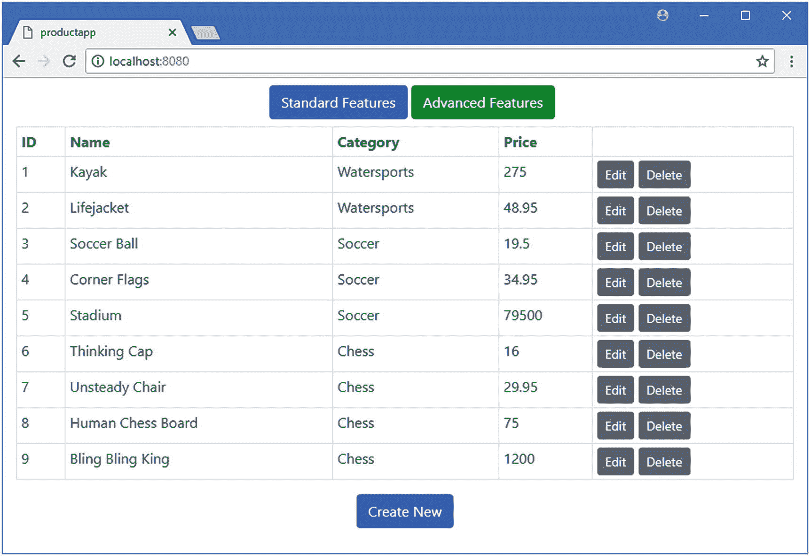
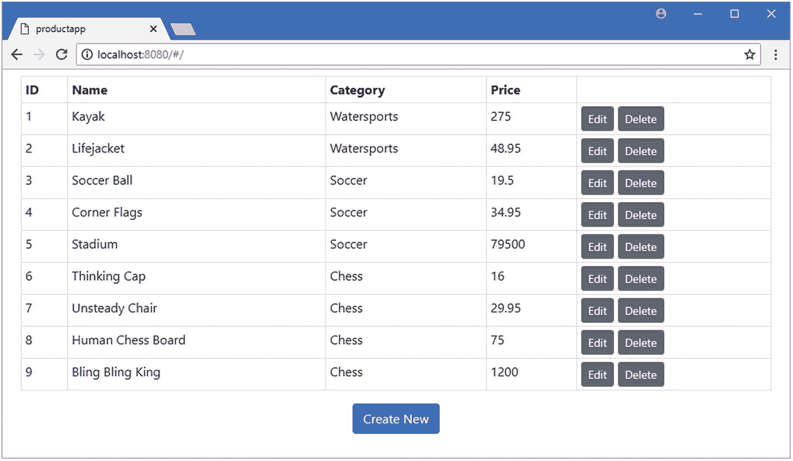
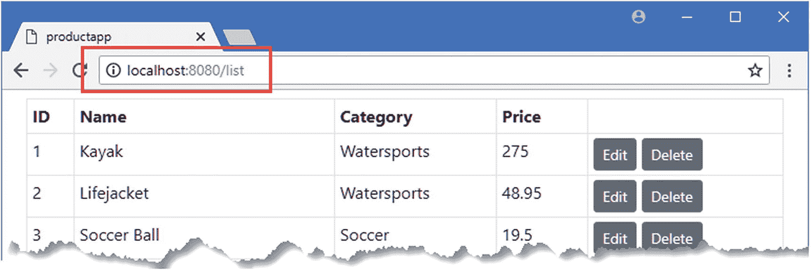
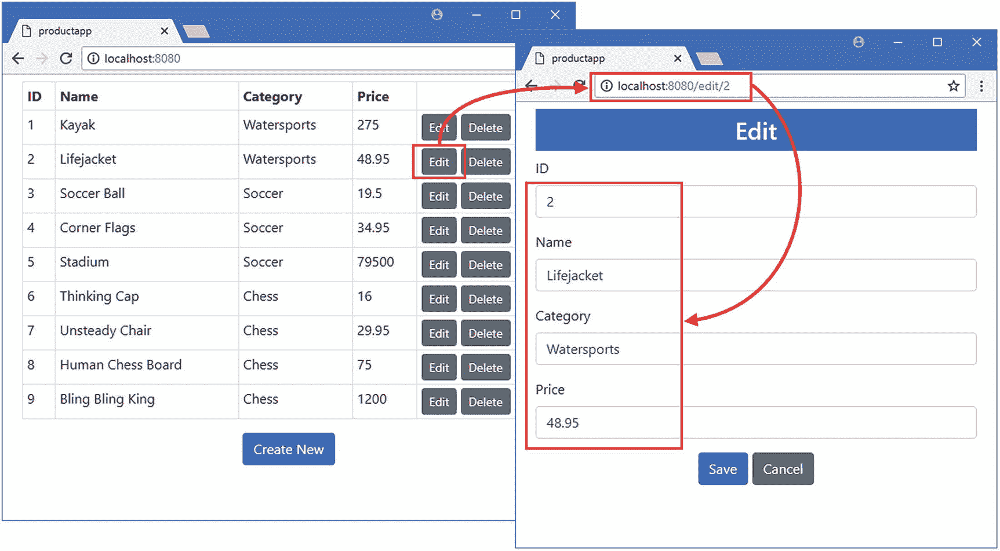
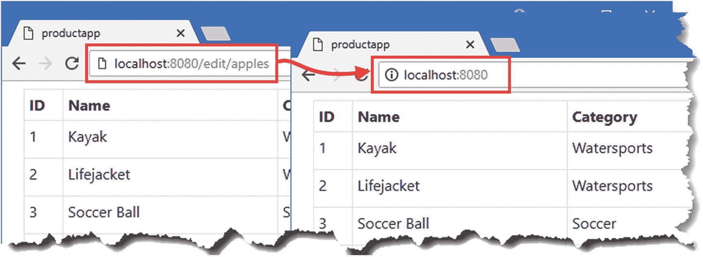

# 二十二、URL 路由

在这一章中，我开始描述 URL 路由特性，它建立在我在第 [21](21.html) 章中描述的动态组件的基础上，但是使用当前的 URL 来选择向用户显示的组件。URL 路由是一个复杂的话题，我将在第 23 章[和第 24 章](23.html)[中继续描述这个特性的不同方面。表](24.html) [22-1](#Tab1) 将 URL 路由放在上下文中。

表 22-1

将 URL 路由置于上下文中

<colgroup><col class="tcol1 align-left"> <col class="tcol2 align-left"></colgroup> 
| 

问题

 | 

回答

 |
| --- | --- |
| 这是什么？ | URL 路由根据当前 URL 选择要向用户显示的组件。 |
| 为什么有用？ | 使用 URL 选择组件允许用户直接导航到应用的特定部分，并允许以比在代码中选择组件更容易维护的方式来组成复杂的应用。 |
| 如何使用？ | Vue Router 包被添加到一个项目中，一个`router-view`元素被用来显示应用的路由配置所选择的组件。 |
| 有什么陷阱或限制吗？ | 可能很难在简明表达路线和创建易于阅读和理解的路线之间找到适当的平衡。 |
| 有其他选择吗？ | URL 路由是可选的，只有复杂的应用才需要本章描述的功能。 |

表 [22-2](#Tab2) 总结了本章内容。

表 22-2

章节总结

<colgroup><col class="tcol1 align-left"> <col class="tcol2 align-left"> <col class="tcol3 align-left"></colgroup> 
| 

问题

 | 

解决办法

 | 

列表

 |
| --- | --- | --- |
| 配置 URL 路由 | 创建一个`VueRouter`对象，并为其提供一个具有`routes`属性的配置对象 | 4, 5 |
| 显示布线元件 | 使用`router-view`元素 | six |
| 在代码中导航 | 使用`$router.push`方法 | seven |
| 在模板中导航 | 使用路由器链接元素 | eight |
| 配置路由模式 | 创建`VuewRouter`对象时使用`mode`属性 | nine |
| 定义一个总括路线 | 以`*`为路径定义路线 | Ten |
| 定义路线的别名 | 使用 route 属性 | Eleven |
| 用代码获取路线的详细信息 | 使用`$route`对象 | 12–14 |
| 控制路由匹配的 URL | 添加动态段、使用正则表达式或使用可选段 | 15–20 |
| 为路线指定名称 | 使用`name`属性 | 21–23 |
| 当活动路线改变时接收通知 | 实现一个或多个保护方法 | Twenty-four |

## 为本章做准备

在本章中，我继续使用第 21 章[的 productapp 项目。URL 路由特性需要将名为`vue-router`的包添加到项目中。运行`productapp`文件夹中清单](21.html) [22-1](#PC1) 所示的命令来安装包。

### 小费

你可以从 [`https://github.com/Apress/pro-vue-js-2`](https://github.com/Apress/pro-vue-js-2) 下载本章以及本书其他章节的示例项目。

```js
npm install vue-router@3.0.1

Listing 22-1Installing the Routing Package

```

要启动 RESTful web 服务，打开命令提示符并运行清单 [22-2](#PC2) 中的命令。

```js
npm run json

Listing 22-2Starting the Web Service

```

打开第二个命令提示符，导航到`productapp`目录，运行清单 [22-3](#PC3) 中所示的命令来启动 Vue.js 开发工具。

```js
npm run serve

Listing 22-3Starting the Development Tools

```

一旦初始捆绑过程完成，打开一个新的浏览器窗口并导航到`http://localhost:8080`，在那里你将看到示例应用，如图 [22-1](#Fig1) 所示。



图 22-1

运行示例应用

## URL 路由入门

在我进入如何使用和配置 URL 路由的细节之前，我将提供一个主要特性的快速介绍，以便您对更详细的主题有一些背景。开始使用 URL 路由的第一步是配置一组*路由*，它们是应用将支持的 URL 和每个 URL 将显示的组件之间的映射。惯例是将路由配置放在一个名为`router`的文件夹中，所以我在示例项目中创建了`src/router`文件夹，并在其中添加了一个名为`index.js`的文件，代码如清单 [22-4](#PC4) 所示。

### 小费

当您创建一个项目并选择单个特性时，其中一个选项是 Router，它安装`vue-router`包并设置一个基本的路由配置。

```js
import Vue from "vue";
import VueRouter  from "vue-router";

import ProductDisplay from "../components/ProductDisplay";
import ProductEditor from "../components/ProductEditor";

Vue.use(VueRouter);

export default new VueRouter({
    routes: [
        { path: "/", component: ProductDisplay },
        { path: "/edit", component: ProductEditor}
    ]
})

Listing 22-4The Contents of the index.js File in the src/router Folder

```

在设置路由包时，获得正确的基本配置是很重要的，所以我将仔细检查清单 [22-4](#PC4) 中的每一行代码并解释它的用途，就像我在第 [20 章](20.html)中设置 Vuex 数据存储时所做的一样，它遵循类似的模式。第一组语句从其他模块导入路由配置所需的功能。

```js
...
import Vue from "vue";
import VueRouter  from "vue-router";

import ProductDisplay from "../components/ProductDisplay";
import ProductEditor from "../components/ProductEditor";
...

```

前两个`import`语句针对 Vue.js 和 Vue 路由器功能。其他的`import`语句提供了对将要显示给用户的组件的访问，这是一个复杂应用中的一长串语句。

下一条语句启用 Vue 路由器功能:

```js
...
Vue.use(VueRouter);
...

```

Vue 路由器是作为 Vue.js 插件提供的，它允许 Vue.js 核心功能被扩展，正如我在第 [26 章](26.html)中描述的，插件是用`Vue.use`方法安装的。

### 警告

如果你忘记调用`Vue.use`方法，Vue.js 将不会识别 Vue 路由器包使用的`router-view`和`router-link` HTML 元素。

下一条语句创建路由配置，并使其成为从`routes`文件夹中的模块的默认导出:

```js
...
export default new VueRouter({
...

```

关键字`new`用于创建一个`VueRouter`对象，它接受一个配置对象。本例中的配置提供了如何显示两个组件的一组基本指令。

```js
...
routes: [
    { path: "/", component: ProductDisplay },
    { path: "/edit", component: ProductEditor}
]
...

```

属性用来定义 URL 和组件之间的映射。本例中的映射告诉 Vue Router 为应用的默认路由显示`ProductDisplay`组件，为`/edit` URL 显示`ProductEditor`组件。现在不要担心 URL 路由，因为一旦你看到它们是如何被应用和使用的，它们会更容易理解。

### 提供对路由配置的访问

下一步是向应用添加路由功能，以便组件可以使用它，如清单 [22-5](#PC9) 所示。

```js
import Vue from 'vue'
import App from './App.vue'

import "../node_modules/bootstrap/dist/css/bootstrap.min.css";
import { RestDataSource } from "./restDataSource";
import store from "./store";

import router from "./router";

Vue.config.productionTip = false

new Vue({
  render: h => h(App),
  data: {
    eventBus: new Vue()
  },
  store,
  router,

  provide: function () {
      return {
          eventBus: this.eventBus,
          restDataSource: new RestDataSource(this.eventBus)
      }
  }
}).$mount('#app')

Listing 22-5Enabling the Routing Configuration in the main.js File in the src Folder

```

为了将 URL 路由功能添加到应用中，我使用了一个`import`语句来指定`router`模块，并将其命名为`router`(我不必指定`index.js`文件，因为这是导入模块时查找的默认名称)。`import`语句从`router`文件夹中的`index.js`文件加载路由配置。我向`Vue`配置对象添加了一个`router`属性，这使得应用的组件可以使用 URL 路由功能。

### 警告

如果您忘记添加清单 [22-5](#PC9) 中所示的`router`属性，URL 路由包将无法正确设置，您将在下面的示例中遇到错误。

### 使用布线系统显示元件

既然路由系统已经启用，我可以使用它向用户显示组件，如清单 [22-6](#PC10) 所示，在这里我使用 URL 路由来替换现有的内容和动态显示组件的代码。

```js
<template>
    <div class="container-fluid">
        <div class="row">
            <div class="col m-2">

                <router-view></router-view>

            </div>
        </div>
    </div>
</template>

<script>
    // import ProductDisplay from "./components/ProductDisplay";

    // import ProductEditor from "./components/ProductEditor";

    // import ErrorDisplay from "./components/ErrorDisplay";

    //import { mapState } from "vuex";

    export default {
        name: 'App',
        // components: { ProductDisplay, ProductEditor, ErrorDisplay },

        created() {
            this.$store.dispatch("getProductsAction");
        },
        // computed: {

        //     ...mapState({

        //         selected: state => state.nav.selected

        //     }),

        //     selectedComponent() {

        //         return this.selected == "table" ? ProductDisplay : ProductEditor;

        //     }

        // }

    }
</script>

Listing 22-6Using URL Routing in the App.vue File in the src Folder

```

Vue 路由器使用`router-view`元素来显示内容，取代了之前使用`is`属性的元素。因为 Vue 路由器包将负责选择由`router-view`元素显示的组件，所以我能够简化组件的配置对象，删除`components`属性、计算属性和所有的`import`语句。这些变化的结果是由元素`router-view`呈现的内容的责任被委托给 Vue 路由器，产生如图 [22-2](#Fig2) 所示的结果。(Create New 和 Edit 按钮还没有效果，但是我将很快连接它们。)

### 小费

添加和更改路由功能时，您可能并不总能得到预期的响应。如果发生这种情况，首先要做的是重新加载浏览器，以获得应用的新副本，这通常会解决问题。



图 22-2

使用 Vue 路由器包

这可能看起来像前面的例子，但有一个重要的区别，这可以通过检查浏览器的 URL 栏看出。当您导航到`http://localhost:8080`时，浏览器实际上会显示以下 URL:

```js
http://localhost:8080/#/

```

需要注意的重要部分是 URL 的最后一部分，也就是`#/`。仔细编辑浏览器 URL 栏中的 URL，以导航到此 URL:

```js
http://localhost:8080/#/edit

```

这与之前显示的 URL 相同，但是在末尾附加了`edit`。按回车键，浏览器显示的内容会改变，如图 [22-3](#Fig3) 所示。


图 22-3

更改 URL 的效果

Vue Router 没有使用数据存储属性来选择向用户显示的组件，而是使用浏览器的 URL，URL 中跟在`#`字符后面的部分对应于我在清单 [22-4](#PC4) 中定义的配置。

```js
...
routes: [
    { path: "/", component: ProductDisplay },

    { path: "/edit", component: ProductEditor}

]
...

```

由`path`属性指定的值对应于 URL 中跟在`#`字符后面的部分。Vue Router 监控当前 URL，当它发生变化时，通过根据其`path`属性找到相应的`routes`配置项，并显示其 component 属性指定的组件，来选择组件显示在`router-view`元素中。

### 导航到不同的 URL

要更改显示给用户的组件，我必须更改浏览器的 URL，此时 Vue Router 会将新的 URL 与其配置进行比较，并显示相应的组件。Vue 路由器提供了导航到新 URL 的特性，在清单 [22-7](#PC14) 中，我已经更新了`ProductDisplay`组件来使用它们。

```js
...
<script>
    import { mapState, mapMutations, mapActions, mapGetters } from "vuex";

    export default {
        computed: {
            ...mapState(["products"]),
            ...mapState({
                useStripedTable: state => state.prefs.stripedTable
            }),
            ...mapGetters({
                tableClass: "prefs/tableClass",
                editClass: "prefs/editClass",
                deleteClass: "prefs/deleteClass"
            })
        },
        methods: {
            editProduct(product) {
                this.selectProduct(product);
                //this.selectComponent("editor");

                this.$router.push("/edit");

            },
            createNew() {
                this.selectProduct();
                //this.selectComponent("editor");

                this.$router.push("/edit");

            },
            ...mapMutations({
                selectProduct: "selectProduct",
                //selectComponent: "nav/selectComponent",

                setEditButtonColor: "prefs/setEditButtonColor",
                setDeleteButtonColor: "prefs/setDeleteButtonColor"
            }),
            ...mapActions({
                deleteProduct: "deleteProductAction"
            })
        },
        created() {
            this.setEditButtonColor(false);
            this.setDeleteButtonColor(false);
        }
    }
</script>
...

Listing 22-7Navigating Programatically in the ProductDisplay.vue File in the src/components Folder

```

在清单 [22-7](#PC14) 中添加`router`属性的效果是，应用中的所有组件都可以通过`$router`变量访问 Vue 路由器特性，类似于组件使用`$store`属性访问 Vuex 数据存储的方式。`$router`属性返回一个定义表 [22-3](#Tab3) 中描述的导航方法的对象。

表 22-3

Vue 路由器导航方法

<colgroup><col class="tcol1 align-left"> <col class="tcol2 align-left"></colgroup> 
| 

名字

 | 

描述

 |
| --- | --- |
| `push(location)` | 此方法导航到指定的 URL。此方法接受可选的回调参数，这些参数在导航完成或出现错误时被调用。 |
| `replace(location)` | 该方法执行与`push`方法相同的任务，但不会在浏览器的历史记录中留下条目，如表后所述。 |
| `back()` | 此方法导航到浏览器历史记录中的上一个 URL。 |
| `forward()` | 此方法导航到浏览器历史记录中的下一个 URL。 |

这两种方法的区别在于，使用`push`方法执行的导航会在浏览器的历史记录中产生一个条目，其效果是单击浏览器的后退按钮将返回到以前的路线。`replace`方法改变 URL 而不添加到浏览器的历史中，这意味着向后移动可能会导致浏览器离开 Vue.js 应用。在清单中，我禁用了应用于数据存储突变的`selectComponent`方法，并将其替换为对 Vue 路由器推送方法的调用，以导航到`/edit` URL。

```js
...
this.$router.push("/edit");
...

```

结果是，单击“新建”按钮或“编辑”按钮会告诉 Vue Router 让浏览器导航到`#/edit` URL。URL 路由是一个两阶段的过程。`push`方法改变 URL，Vue Router 观察并使用它来改变显示给用户的组件。换句话说，点击一个按钮会改变 URL，进而改变显示给用户的组件，如图 [22-4](#Fig4) 所示。


图 22-4

在应用中导航

#### 使用 HTML 元素导航

`$router`方法并不是在应用中导航的唯一方式。Vue Router 还支持一个定制的 HTML 元素，当它被点击时触发导航。`$router`方法和自定义 HTML 元素可以在一个组件中自由混合，如清单 [22-8](#PC16) 所示。

```js
<template>

    <div>
        <div class="form-group">
            <label>ID</label>
            <input class="form-control" v-model="product.id" />
        </div>
        <div class="form-group">
            <label>Name</label>
            <input class="form-control" v-model="product.name" />
        </div>
        <div class="form-group">
            <label>Category</label>
            <input class="form-control" v-model="product.category" />
        </div>
        <div class="form-group">
            <label>Price</label>
            <input class="form-control" v-model.number="product.price" />
        </div>
        <div class="text-center">
            <button class="btn btn-primary" v-on:click="save">
                {{ editing ? "Save" : "Create" }}
            </button>
            <router-link to="/" class="btn btn-secondary">Cancel</router-link>

        </div>
    </div>

</template>

<script>

    let unwatcher;

    export default {
        data: function () {
            return {
                editing: false,
                product: {}
            }
        },
        methods: {
            async save() {
                await this.$store.dispatch("saveProductAction", this.product);
                //this.$store.commit("nav/selectComponent", "table");

                this.$router.push("/");

                this.product = {};
            },
            // cancel() {

            //     this.$store.commit("selectProduct");

            //     //this.$store.commit("nav/selectComponent", "table");

            //     this.$router.push("/");

            // },

            selectProduct(selectedProduct) {
                if (selectedProduct == null) {
                    this.editing = false;
                    this.product = {};
                } else {
                    this.editing = true;
                    this.product = {};
                    Object.assign(this.product, selectedProduct);
                }
            }
        },
        created() {
            unwatcher = this.$store.watch(state =>
                state.selectedProduct, this.selectProduct);
            this.selectProduct(this.$store.state.selectedProduct);
        },
        beforeDestroy() {
           unwatcher();
        }
    }
</script>

Listing 22-8Adding URL Navigation in the ProductEditor.vue File in the src/components Folder

```

在组件的模板中，我使用了`router-link`元素来创建一个 HTML 元素，当它被点击时将触发导航。将被导航到的 URL 是使用`to`属性指定的，如下所示:

```js
...
<router-link to="/" class="btn btn-secondary">Cancel</router-link>
...

```

在这种情况下，我指定了`/`，这是配置中定义的第一条路由。当模板被处理并显示给用户时，结果是一个锚(`a)`元素，如下所示:

```js
...
<a href="#/" class="btn btn-secondary router-link-active">Cancel</a>
...

```

指定了`href`属性，使得浏览器导航到的 URL 相对于 URL 的`#`部分，尽管您不应该在`to`属性中指定这一点，因为有其他方法可以实现 URL 导航，正如我很快解释的那样。我在本书中使用的引导 CSS 框架支持样式锚元素，因此它们显示为按钮，这允许我将路由链接呈现为它所替换的`button`元素的无缝替换。由于 URL 导航是由 anchor 元素直接处理的，我已经能够移除`cancel`方法。

并不是所有的导航都可以仅仅使用 HTML 元素来执行，因为一些额外的任务必须响应用户的动作来执行，正如`save`方法所展示的。组件模板中的保存/创建按钮不能用`router-link`元素替换，因为用户输入的数据必须发送到 web 服务。对于这种类型的活动，可以使用`$router.push`方法，如清单所示。清单 [22-8](#PC16) 中的更改允许用户从编辑器导航回表格，或者通过点击保存/创建按钮来保存他们的更改，或者点击取消来放弃它们，如图 [22-5](#Fig5) 所示。


图 22-5

导航回产品显示

## 了解和配置 URL 路由匹配

上一节中的例子已经简要介绍了 URL 路由的工作原理，包括定义路由和在应用中导航的不同方式。在接下来的章节中，我会更深入地探讨并解释如何改变 URL 的格式以使它们对用户更友好，以及表达路线以匹配 URL 的不同方式。

### 了解 URL 匹配和格式

Vue 路由器检查当前 URL，并通过其配置中的路由列表向下查找，直到找到匹配项。要匹配路由，URL 必须包含相同数量的段，并且每个段必须包含路由配置中指定的值。下面是我在清单 [22-4](#PC4) 的`src/router`文件夹的`index.js`文件中定义的路线:

```js
...
routes: [
    { path: "/", component: ProductDisplay },
    { path: "/edit", component: ProductEditor}
]
...

```

在考虑应用的路由时，请记住路由是按照定义的顺序匹配的，路由系统只对 URL 的一部分感兴趣。默认情况下，路由系统使用的 URL 部分跟在`#`字符后面，称为 URL*片段*或名为锚的*。URL `http://localhost:8080/#/edit`将匹配路径为`/edit`的路由，如图 [22-6](#Fig6) 所示。*


图 22-6

URL 的片段部分

URL 片段最初是指 HTML 文档中的特定位置，以便用户可以在复杂的静态内容中导航。对于 Vue.js 应用，URL 片段用于路由，因为它们可以被更改，而不会导致浏览器向服务器发送 HTTP 请求并丢失应用的状态。

### 使用 HTML5 历史 API 进行路由

所有浏览器都支持 URL 片段，但结果是应用的 URL 具有奇怪的结构，可能会让用户感到困惑。使用 URL 路由的吸引力之一是用户可以通过改变 URL 直接导航到应用的特定部分，但是如果不理解`#`字符的重要性，这可能是一个容易出错的过程。例如，如果用户导航到`/edit`而不是`/#/edit`，浏览器将假设用户正试图导航到一个新的 URL，并将向服务器发送 HTTP 请求，结果浏览器将导航离开 Vue.js 应用。

一个更好的替代方案是配置 Vue Router，使其使用 HTML 5 历史 API，这允许更健壮和优雅的 URL，但旧浏览器不支持，尽管 Vue Router 会自动退回到使用不支持历史 API 的浏览器中的片段。在清单 [22-9](#PC20) 中，我已经更新了路由配置，这样 Vue 路由器将使用历史 API。

```js
import Vue from "vue";
import VueRouter  from "vue-router";

import ProductDisplay from "../components/ProductDisplay";
import ProductEditor from "../components/ProductEditor";

Vue.use(VueRouter);

export default new VueRouter({
    mode: "history",

    routes: [
        { path: "/", component: ProductDisplay },
        { path: "/edit", component: ProductEditor}
    ]
})

Listing 22-9Enabling the History API in the index.js File in the src/router Folder

```

使用表 [22-4](#Tab4) 中显示的值，将`mode`属性添加到 Vue 路由器配置对象中，以指定用于 URL 路由的机制。

表 22-4

模式属性配置值

<colgroup><col class="tcol1 align-left"> <col class="tcol2 align-left"></colgroup> 
| 

**名称**

 | 

**描述**

 |
| --- | --- |
| `hash` | 这种模式使用 URL 片段进行路由，这提供了最广泛的浏览器支持，但产生了笨拙的 URL。如果未指定`mode`属性，这是使用的默认模式。 |
| `history` | 这种模式使用历史 API 进行路由，这提供了最自然的 URL，但不被旧的浏览器支持。 |

在清单中，我为`mode`属性指定了`history`值，它告诉 Vue Router 使用历史 API。要查看效果，重新加载浏览器并在应用重新加载后点击其中一个编辑按钮，如图 [22-7](#Fig7) 所示。

### 小费

对于本章中的许多示例，您可能需要重新加载浏览器窗口或手动导航到`http://localhost:8080`来查看更改。


图 22-7

使用历史 API 进行路由

应用导航到了`http://localhost:8080/edit`，而不是包含片段的 URL，比如`http://localhost:8080/#/edit`。历史 API 允许使用完整的 URL 进行导航，无需触发浏览器重新加载，其效果是用于路由的 URL 部分发生变化，如图 [22-8](#Fig8) 所示。


图 22-8

使用历史 API 的效果

### 注意

对于不支持历史 API(包括旧版本的 Internet Explorer)的浏览器，Vue Router 将自动尝试使用哈希设置，这将使应用返回到使用 URL 片段来定义路由。要禁用这种行为，您可以在路由配置对象中将`fallback`属性设置为`false`。

#### 提供一条包罗万象的路线

使用历史 API 需要额外的工作来确保用户的流畅体验，用户可以直接导航到对应用有意义的 URL，但是服务器上没有该 URL 的 HTML 文档。在示例应用中，这意味着用户可以在地址栏中键入`http://localhost:8080/edit`，这将导致浏览器发送一个对名为`edit`的文档的 HTTP 请求。服务器上没有这样的 HTML 文档，但是 webpack 开发服务器已经配置为使用`index.html`文件响应任何请求。

请求了什么 URL 并不重要；如果没有可用的内容，服务器将总是返回`index.html`文件的内容，并且永远不会返回 404-Not Found 错误。当用户请求一个与应用定义的某个路由相对应的 URL 时，这很有用，比如示例应用中的`/edit`，但是当 URL 与某个路由不相对应时，它会让用户看到一个空窗口。

### 警告

如果您使用历史 API 进行路由，您必须确保配置您的生产 HTTP 服务器来返回`index.html`文件的内容。Vue.js 团队在 [`https://router.vuejs.org/en/essentials/history-mode.html`](https://router.vuejs.org/en/essentials/history-mode.html) 提供常用生产服务器的说明。

为了解决这个问题，可以定义一个无所不包的路由来匹配任何请求并将其重定向到另一个 URL，如清单 [22-10](#PC21) 所示

```js
import Vue from "vue";
import VueRouter  from "vue-router";

import ProductDisplay from "../components/ProductDisplay";
import ProductEditor from "../components/ProductEditor";

Vue.use(VueRouter);

export default new VueRouter({
    mode: "history",
    routes: [
        { path: "/", component: ProductDisplay },
        { path: "/edit", component: ProductEditor},
        { path: "*", redirect: "/" }

    ]
})

Listing 22-10Creating a Catchall Route in the index.js File in the src/router Folder

```

这个路由的`path`属性是一个星号(`*`字符)，这允许它匹配任何 URL。这个路由没有`component`属性，而是有一个`redirect`属性，它告诉 Vue.js 执行到指定 URL 的重定向。总体效果与 HTTP 服务器的回退功能相结合，这意味着没有内容的请求将使用`index.html`文件的内容来处理，如果 URL 不对应于某个路由，浏览器将被重定向到`/` URL。为了测试这个特性，打开一个新的浏览器窗口并请求`http://localhost:8080/does/not/exist` URL。如图 [22-9](#Fig9) 所示，浏览器将显示应用，即使请求的 URL 与应用的任何路由都不对应。

### 小费

重定向也可以定义为一个函数，它允许将用户请求的 URL 的某些方面合并到重定向的 URL 中。参见第 [23](23.html) 章中的示例。


图 22-9

总括路线的效果

当 Vue.js 应用启动时，Vue Router 检查当前的 URL，并开始通过它的路由寻找匹配。第一个和第二个路由确实与当前 URL 匹配，因为该 URL 既不是`/`也不是`/edit`。Vue 路由器到达最终的 URL，它匹配任何内容并导致重定向到`/`。匹配过程再次开始，但是现在第一条路线匹配了，这导致应用显示`ProductDisplay`组件。

### 使用路线别名

使用重定向的一个潜在缺陷是，用户将看到他们在浏览器中键入的 URL 将立即被重定向的 URL 所替换，这可能会令人困惑。另一种方法是为一个路由创建一个别名，这允许它匹配多个 URL 而不需要重定向。在清单 [22-11](#PC22) 中，我在路由配置中添加了一个别名，以改变不匹配 URL 的处理方式。

```js
import Vue from "vue";
import VueRouter from "vue-router";

import ProductDisplay from "../components/ProductDisplay";
import ProductEditor from "../components/ProductEditor";

Vue.use(VueRouter);

export default new VueRouter({
    mode: "history",
    routes: [
        { path: "/", component: ProductDisplay, alias: "/list" },

        { path: "/edit", component: ProductEditor } ,
        { path: "*", redirect: "/" }
    ]
})

Listing 22-11Using a Route Alias in the index.js File in the src/router Folder

```

属性用于为一个路由创建一个别名，这允许它在不使用重定向的情况下匹配多个 URL。我创建的别名将`/list` URL 定义为根 URL 的别名，可以通过导航到`http://localhost:8080/list`进行测试。如图 [22-10](#Fig10) 所示，显示`ProductDisplay`组件，不修改当前 URL。



图 22-10

使用路由别名

### 获取组件中的路由数据

除了`$router`属性之外，Vue Router 包还为组件提供了一个`$route`属性，该属性描述了当前的路由，可用于调整组件的内容或行为。为了演示，我在示例应用中添加了一条新路线，如清单 [22-12](#PC23) 所示。

```js
import Vue from "vue";
import VueRouter from "vue-router";

import ProductDisplay from "../components/ProductDisplay";
import ProductEditor from "../components/ProductEditor";

Vue.use(VueRouter);

export default new VueRouter({
    mode: "history",
    routes: [
        { path: "/", component: ProductDisplay, alias: "/list" },
        { path: "/edit", component: ProductEditor },
        { path: "/create", component: ProductEditor },

        { path: "*", redirect: "/" }
    ]
})

Listing 22-12Adding a Route in the index.js File in the src/router Folder

```

新的路由匹配`/create` URL 并指向`ProductEditor`组件，这意味着有两个不同的 URL——`/edit`和`/create`——将引导应用显示编辑器特性。在清单 [22-13](#PC24) 中，我用一个针对`/edit`和`/create`URL 的`router-link`元素替换了`ProductDisplay`组件模板中的`button`元素。

```js
...
<template>
    <div>
        <table class="table table-sm table-bordered" v-bind:class="tableClass">
            <tr>
                <th>ID</th><th>Name</th><th>Category</th><th>Price</th><th></th>
            </tr>
            <tbody>
                <tr v-for="p in products" v-bind:key="p.id">
                    <td>{{ p.id }}</td>
                    <td>{{ p.name }}</td>
                    <td>{{ p.category }}</td>
                    <td>{{ p.price }}</td>
                    <td>
                        <router-link to="/edit" v-bind:class="editClass"

                            class="btn btn-sm">

                                Edit

                        </router-link>

                        <button class="btn btn-sm"
                                v-bind:class="deleteClass"
                                v-on:click="deleteProduct(p)">
                            Delete
                        </button>
                    </td>
                </tr>
                <tr v-if="products.length == 0">
                    <td colspan="5" class="text-center">No Data</td>
                </tr>
            </tbody>
        </table>
        <div class="text-center">
            <router-link to="/create" class="btn btn-primary">

                Create New

            </router-link>

        </div>
    </div>
</template>
...

Listing 22-13Targeting Routes in the ProductDisplay.vue File in the src/components Folder

```

注意，组件不知道导航到`/edit`或`/create` URL 的结果会是什么。这类似于使用数据存储来协调组件的效果，如第 [21 章](21.html)中所述，其优点是您可以通过编辑路由配置来轻松地重新配置应用。现在有两个不同的 URL 显示了`ProductEditor`组件，我可以使用`$route`属性来查看它们中的哪一个被使用了，并更改呈现给用户的内容，如清单 [22-14](#PC25) 所示。

```js
<template>

    <div>
        <h3 class="btn-primary text-center text-white p-2">

            {{ editing ? "Edit" : "Create"}}

        </h3>

        <div class="form-group">
            <label>ID</label>
            <input class="form-control" v-model="product.id" />
        </div>
        <div class="form-group">
            <label>Name</label>
            <input class="form-control" v-model="product.name" />
        </div>
        <div class="form-group">
            <label>Category</label>
            <input class="form-control" v-model="product.category" />
        </div>
        <div class="form-group">
            <label>Price</label>
            <input class="form-control" v-model.number="product.price" />
        </div>
        <div class="text-center">
            <button class="btn btn-primary" v-on:click="save">
                {{ editing ? "Save" : "Create" }}
            </button>
            <router-link to="/" class="btn btn-secondary">Cancel</router-link>
        </div>
    </div>

</template>

<script>

    let unwatcher;

    export default {
        data: function () {
            return {
                editing: false,
                product: {}
            }
        },
        methods: {
            async save() {
                await this.$store.dispatch("saveProductAction", this.product);
                this.$router.push("/");
                this.product = {};
            },
            selectProduct(selectedProduct) {
                if (this.$route.path == "/create") {

                    this.editing = false;
                    this.product = {};
                } else {
                    this.product = {};
                    Object.assign(this.product, selectedProduct);
                    this.editing = true;
                }
            }
        },
        created() {
            unwatcher = this.$store.watch(state =>
                state.selectedProduct, this.selectProduct);
            this.selectProduct(this.$store.state.selectedProduct);
        },
        beforeDestroy() {
            unwatcher();
        }
    }
</script>

Listing 22-14Accessing Route Information in the ProductEditor.vue File in the src/components Folder

```

当调用`selectProduct`方法时，组件检查`$route`对象以获得路线的细节。`$route`属性被赋予一个描述当前路线的对象。表 [22-5](#Tab5) 描述了`$route`对象提供的最有用的属性。

表 22-5

有用的 route 属性

<colgroup><col class="tcol1 align-left"> <col class="tcol2 align-left"></colgroup> 
| 

名字

 | 

描述

 |
| --- | --- |
| `name` | 该属性返回路由的名称，如“创建命名路由”一节所述。 |
| `path` | 这个属性返回 URL 路径，比如`/edit/4`。 |
| `params` | 该属性返回由动态路由匹配的参数的 map 对象，如“动态匹配路由”一节中所述。 |
| `query` | 此属性返回包含查询字符串值的 map 对象。例如，对于 URL `/edit/4?validate=true`，查询属性将返回一个带有`validate`属性的对象，该属性的值为`true`。 |

在清单中，我使用`path`属性来确定是否使用了`/create`或`/edit` URL，并相应地配置组件。为了使区别更加明显，我添加了一个`h3`元素，它使用文本插值绑定来显示标题。为了测试这些更改，您可以单击由`ProductDisplay`组件显示的新建或编辑按钮，或者直接导航到`http://localhost:8080/create`和`http://localhost:8080/edit`URL，这将产生如图 [22-11](#Fig11) 所示的结果。


图 22-11

响应组件中的不同路线

### 动态匹配路线

我在上一节中所做的修改的问题是，`/edit` URL 告诉`ProductEditor`组件用户想要执行编辑操作，但是没有指定应该编辑哪个对象。

我可以使用一个*动态段*来解决这个问题，当一个组件需要从 URL 接收数据时，它会被添加到一个路由中。在清单 [22-15](#PC26) 中，我扩展了路由配置，使其包含一个动态段。

```js
import Vue from "vue";
import VueRouter from "vue-router";

import ProductDisplay from "../components/ProductDisplay";
import ProductEditor from "../components/ProductEditor";

Vue.use(VueRouter);

export default new VueRouter({
    mode: "history",
    routes: [
        { path: "/", component: ProductDisplay, alias: "/list" },
        { path: "/edit/:id", component: ProductEditor },

        { path: "/create", component: ProductEditor },
        { path: "*", redirect: "/" }
    ]
})

Listing 22-15Using a Dynamic Segment in the index.js File in the src/router Folder

```

段变量通过在段前加冒号(`:`字符)来定义，如下所示:

```js
...
{ path: "/edit/:id", component: ProductEditor },
...

```

该路线的`path`属性包含两段。第一段匹配以`/edit`开头的 URL，就像前面的例子一样。第二段是动态的，将匹配任何 URL 段，并将该段的值赋给一个名为`id`的变量。结果是该路由将匹配任何包含两段的 URL，其中第一段是`/edit`，例如`/edit/10`。

为了定位新的 URL 及其动态段，我更新了`ProductDisplay`组件模板中的`router-link`元素，如清单 [22-16](#PC28) 所示。

```js
...
<template>
    <div>
        <table class="table table-sm table-bordered" v-bind:class="tableClass">
            <tr>
                <th>ID</th><th>Name</th><th>Category</th><th>Price</th><th></th>
            </tr>
            <tbody>
                <tr v-for="p in products" v-bind:key="p.id">
                    <td>{{ p.id }}</td>
                    <td>{{ p.name }}</td>
                    <td>{{ p.category }}</td>
                    <td>{{ p.price }}</td>
                    <td>
                        <router-link v-bind:to="'/edit/' +  p.id "

                            v-bind:class="editClass" class="btn btn-sm">

                                Edit
                        </router-link>
                        <button class="btn btn-sm"
                                v-bind:class="deleteClass"
                                v-on:click="deleteProduct(p)">
                            Delete
                        </button>
                    </td>
                </tr>
                <tr v-if="products.length == 0">
                    <td colspan="5" class="text-center">No Data</td>
                </tr>
            </tbody>
        </table>
        <div class="text-center">
            <router-link to="/create" class="btn btn-primary">
                Create New
            </router-link>
        </div>
    </div>
</template>
...

Listing 22-16Targeting a Dynamic Segment in the ProductDisplay.vue File in the src/components Folder

```

这一变化意味着单击编辑按钮将导航到包含相应对象的`id`属性的 URL，例如，单击体育场产品的按钮将导航到`/edit/5`。

组件可以通过`$route.params`属性访问动态段变量。在清单 [22-17](#PC29) 中，我已经更新了`ProductEditor`组件，以便根据`id`动态段的值从数据存储中检索产品对象。

```js
...
<script>

    let unwatcher;

    export default {
        data: function () {
            return {
                editing: false,
                product: {}
            }
        },
        methods: {
            async save() {
                await this.$store.dispatch("saveProductAction", this.product);
                this.$router.push("/");
                this.product = {};
            },
            selectProduct() {
                if (this.$route.path == "/create") {
                    this.editing = false;
                    this.product = {};
                } else {
                    let productId = this.$route.params.id;

                    let selectedProduct

                        = this.$store.state.products.find(p => p.id == productId);

                    this.product = {};
                    Object.assign(this.product, selectedProduct);
                    this.editing = true;
                }
            }
        },
        created() {
            unwatcher = this.$store.watch(state => state.products,

                this.selectProduct);

            this.selectProduct();

        },
        beforeDestroy() {
            unwatcher();
        }
    }
</script>
...

Listing 22-17Using a Dynamic Segment Value in the ProductEditor.vue File in the src/components Folder

```

在`selectProduct`方法中，我通过`$route`对象获取`id`段的值，并通过数据存储获取用户选择的对象。

这可能很难发现，但是我也在这个清单中更改了数据存储观察器的目标。`ProductDisplay`组件不再为用户的编辑选择使用数据存储，这可能会使您认为观察器现在是多余的。然而，观察器仍然是必需的，但是它观察对象的产品数组。

```js
...
unwatcher = this.$store.watch(state => state.products, this.selectProduct);
...

```

用户现在可以直接导航到一个将编辑一个对象的 URL，结果是在用来自 HTTP 请求的数据填充数据存储之前，将向用户显示`ProductEditor`组件，HTTP 请求由`App`组件发送到 web 服务。为了确保用户看到他们需要的数据，我使用了一个调用`selectProduct`方法的数据存储观察器。

### 小费

Vue 路由器包提供了一种更优雅的等待数据的方式，我在第 [24](24.html) 章对此进行了描述。

这些更改的效果是，单击由`ProductDisplay`组件呈现的编辑按钮之一，导航到一个 URL，如`/edit/4`，用户也可以使用浏览器的 URL 栏直接导航到该 URL。

当 URL 被路由系统匹配时，`ProductEditor`组件读取动态段的值，从数据存储中定位相应的对象，显示给用户编辑，如图 [22-12](#Fig12) 所示。



图 22-12

使用动态段

### 使用正则表达式匹配 URL

动态段扩展了路由将匹配的 URL 的范围，但结果可能是路由匹配您稍后要在路由配置中处理的 URL。为了帮助提高路由的精确度，Vue 路由器支持对动态段使用正则表达式，从而对将要匹配的 URL 提供细粒度控制。

在清单 [22-18](#PC31) 中，我修改了路由配置，添加了一个带有正则表达式的动态段，并将正则表达式应用于现有的`id`段。

```js
import Vue from "vue";
import VueRouter from "vue-router";

import ProductDisplay from "../components/ProductDisplay";
import ProductEditor from "../components/ProductEditor";

Vue.use(VueRouter);

export default new VueRouter({
    mode: "history",
    routes: [
        { path: "/", component: ProductDisplay, alias: "/list" },
        { path: "/:op(create|edit)/:id(\\d+)", component: ProductEditor },

        //{ path: "/create", component: ProductEditor },

        { path: "*", redirect: "/" }
    ]
})

Listing 22-18Using Regular Expressions in the index.js File in the src/router Folder

```

正则表达式应用于动态段名称后的括号中。新的动态段称为`op`，我应用的正则表达式允许它匹配包含`create`或`edit`的段，这允许我将两条路线合并为一条，并注释掉专用的`/create`路线。

```js
...
{ path: "/:op(create|edit)/:id(\\d+)", component: ProductEditor },
...

```

我应用于`id`段的正则表达式将匹配仅由一个或多个数字组成的段。这个表达式中的`d`字符必须用两个反斜杠(`\`字符)进行转义，以防止它被解释为字面上的`d`字符，加号(`+`字符)指定表达式应该只匹配一个或多个数字。

```js
...
{ path: "/:op(create|edit)/:id(\\d+)", component: ProductEditor },
...

```

结果是，该路由现在将匹配两个段 URL，其中第一个段是`/create`或`/edit`，第二个段包含一个或多个数字。

#### 定义可选段

我在清单 [22-18](#PC31) 中定义的路线并不完全如我所愿，因为它与`/create`不匹配，而后者是当用户单击 Create New 按钮时`ProductDisplay`组件导航到的 URL。可以使用问号(`?`字符)将动态段标记为可选的，问号是用于匹配零个或多个表达式实例的符号。在清单 [22-19](#PC34) 中，我使用了一个问号来使`id`段可选。

```js
import Vue from "vue";
import VueRouter from "vue-router";

import ProductDisplay from "../components/ProductDisplay";
import ProductEditor from "../components/ProductEditor";

Vue.use(VueRouter);

export default new VueRouter({
    mode: "history",
    routes: [
        { path: "/", component: ProductDisplay, alias: "/list" },
        { path: "/:op(create|edit)/:id(\\d+)?", component: ProductEditor },

        { path: "*", redirect: "/" }
    ]
})

Listing 22-19Using an Optional Segment in the index.js File in the src/router Folder

```

由于`id`段是可选的，该路由现在将匹配任何单段 URL，如`/edit`和`/create`，以及任何两段 URL，其中第一段是`/edit`或`/create`，第二段由一个或多个数字组成。

这个路由配置将匹配一个 URL，例如`/create/10`,`ProductEditor`组件中的现有代码将把它视为一个编辑`id`为`10`的对象的请求。这显示了当您更改应用的路由配置时更新组件的重要性，在清单 [22-20](#PC35) 中，我修改了`ProductEditor`组件，通过检查清单 [22-19](#PC34) 中引入的新动态段来避免这个问题。

```js
...
<script>

    let unwatcher;

    export default {
        data: function () {
            return {
                editing: false,
                product: {}
            }
        },
        methods: {
            async save() {
                await this.$store.dispatch("saveProductAction", this.product);
                this.$router.push("/");
                this.product = {};
            },
            selectProduct() {
                if (this.$route.params.op == "create") {

                    this.editing = false;
                    this.product = {};
                } else {
                    let productId = this.$route.params.id;
                    let selectedProduct
                        = this.$store.state.products.find(p => p.id == productId);
                    this.product = {};
                    Object.assign(this.product, selectedProduct);
                    this.editing = true;
                }
            }
        },
        created() {
            unwatcher = this.$store.watch(state => state.products,
                this.selectProduct);
            this.selectProduct();
        },
        beforeDestroy() {
            unwatcher();
        }
    }
</script>
...

Listing 22-20Using a New Segment in the ProductEditor.vue File in the src/components Folder

```

作为添加到路由配置中的正则表达式的结果，选择了`ProductEditor`组件的路由不会匹配像`/edit/apples`这样的 URL。相反，路由系统将通过路由配置继续工作，直到到达`catch-all`路由，该路由执行到应用根 URL 的重定向，如图 [22-13](#Fig13) 所示。



图 22-13

在路线中使用正则表达式

### 创建命名路由

如果您不想将 URL 嵌入到组件的代码和模板中，那么您可以将您的名称分配给您的路由并使用它们。这种方法的优点是很容易改变应用使用的 URL，而不必改变其组件中的所有导航元素和代码，这可以在第 [23 章](23.html)中看到演示。缺点是使用命名路由需要笨拙的语法。在清单 [22-21](#PC36) 中，我添加了针对`ProductDisplay`和`ProductEditor`组件的路线名称。

```js
import Vue from "vue";
import VueRouter from "vue-router";

import ProductDisplay from "../components/ProductDisplay";
import ProductEditor from "../components/ProductEditor";

Vue.use(VueRouter);

export default new VueRouter({
    mode: "history",
    routes: [
        { name: "table", path: "/", component: ProductDisplay, alias: "/list" },

        { name: "editor", path: "/:op(create|edit)/:id(\\d+)?",

            component: ProductEditor },

        { path: "*", redirect: "/" }
    ]
})

Listing 22-21Naming a Route in the index.js File in the src/router Folder

```

`name`属性用于为一条路线指定一个名称，我已经使用了名称`table`和`editor`。在清单 [22-22](#PC37) 中，我使用了一条路线的名称来导航，而不是它的 URL。

```js
<template>

    <div>
        <h3 class="btn-primary text-center text-white p-2">
            {{ editing ? "Edit" : "Create"}}
        </h3>
        <div class="form-group">
            <label>ID</label>
            <input class="form-control" v-model="product.id" />
        </div>
        <div class="form-group">
            <label>Name</label>
            <input class="form-control" v-model="product.name" />
        </div>
        <div class="form-group">
            <label>Category</label>
            <input class="form-control" v-model="product.category" />
        </div>
        <div class="form-group">
            <label>Price</label>
            <input class="form-control" v-model.number="product.price" />
        </div>
        <div class="text-center">
            <button class="btn btn-primary" v-on:click="save">
                {{ editing ? "Save" : "Create" }}
            </button>
            <router-link v-bind:to="{name: 'table'}" class="btn btn-secondary">

                Cancel
            </router-link>
        </div>
    </div>

</template>

<script>

    let unwatcher;

    export default {
        data: function () {
            return {
                editing: false,
                product: {}
            }
        },
        methods: {
            async save() {
                await this.$store.dispatch("saveProductAction", this.product);
                this.$router.push({name: "table"});

                this.product = {};
            },
            selectProduct() {
                if (this.$route.params.op == "create") {
                    this.editing = false;
                    this.product = {};
                } else {
                    let productId = this.$route.params.id;
                    let selectedProduct
                        = this.$store.state.products.find(p => p.id == productId);
                    this.product = {};
                    Object.assign(this.product, selectedProduct);
                    this.editing = true;
                }
            }
        },
        created() {
            unwatcher = this.$store.watch(state => state.products,
                this.selectProduct);
            this.selectProduct();
        },
        beforeDestroy() {
            unwatcher();
        }
    }
</script>

Listing 22-22Navigating by Route Name in the ProductEditor.vue File in the src/components Folder

```

为了通过名称导航到一条路线，一个具有`name`属性的对象被传递给`$router.push`方法或者被分配给一个`router-link`元素的`to`属性。`name`属性的值是所需路线的名称，必须使用`v-bind`指令来确保 Vue.js 将属性值解释为 JavaScript 表达式。

如果路线有动态段，那么用于导航的对象定义一个用于提供段值的`params`属性。在清单 [22-23](#PC38) 中，我已经更改了导航元素和代码，使用名称并提供参数值。

```js
...
<template>
    <div>
        <table class="table table-sm table-bordered" v-bind:class="tableClass">
            <tr>
                <th>ID</th>
                <th>Name</th>
                <th>Category</th>
                <th>Price</th>
                <th></th>
            </tr>
            <tbody>
                <tr v-for="p in products" v-bind:key="p.id">
                    <td>{{ p.id }}</td>
                    <td>{{ p.name }}</td>
                    <td>{{ p.category }}</td>
                    <td>{{ p.price }}</td>
                    <td>
                        <router-link v-bind:to="{name: 'editor',

                                        params: { op: 'edit', id: p.id}}"

                            v-bind:class="editClass" class="btn btn-sm">

                                Edit

                        </router-link>

                        <button class="btn btn-sm"
                                v-bind:class="deleteClass"
                                v-on:click="deleteProduct(p)">
                            Delete
                        </button>
                    </td>
                </tr>
                <tr v-if="products.length == 0">
                    <td colspan="5" class="text-center">No Data</td>
                </tr>
            </tbody>
        </table>
        <div class="text-center">
            <router-link v-bind:to="{name: 'editor', params: { op: 'create'}}"

                         class="btn btn-primary">

                Create New
            </router-link>
        </div>
    </div>
</template>
...

Listing 22-23Navigating with Parameters in the ProductDisplay.vue File in the src/components Folder

```

当使用名称并通过`router-link`元素提供参数时，需要`v-bind`指令；否则，Vue.js 不会将`to`属性的值解释为 JavaScript 对象，而是将该值视为 URL。

## 处理导航更改

当一个路由变更需要新的内容时，现有的组件被销毁，新组件的一个实例被创建，遵循我在第 [17 章](17.html)和第 [21 章](21.html)中描述的生命周期。当路由更改显示相同的组件时，Vue 路由器包只是重用现有的组件，并通知它已经发生了更改。为了演示这个问题，我向`ProductEditor`组件添加了新的导航特性，允许用户在可供编辑的对象间移动，如清单 [22-24](#PC39) 所示。

```js
<template>

    <div>
        <h3 class="btn-primary text-center text-white p-2">
            {{ editing ? "Edit" : "Create"}}
        </h3>
        <div class="form-group">
            <label>ID</label>
            <input class="form-control" v-model="product.id" />
        </div>
        <div class="form-group">
            <label>Name</label>
            <input class="form-control" v-model="product.name" />
        </div>
        <div class="form-group">
            <label>Category</label>
            <input class="form-control" v-model="product.category" />
        </div>
        <div class="form-group">
            <label>Price</label>
            <input class="form-control" v-model.number="product.price" />
        </div>
        <div class="text-center">

            <button class="btn btn-primary" v-on:click="save">
                {{ editing ? "Save" : "Create" }}
            </button>
            <router-link to="{name: 'table'}" class="btn btn-secondary">
                Cancel
            </router-link>

            <router-link v-if="editing" v-bind:to="nextUrl" class="btn btn-info">

                Next

            </router-link>

        </div>
    </div>

</template>

<script>

    let unwatcher;

    export default {
        data: function () {
            return {
                editing: false,
                product: {}
            }
        },
        computed: {

            nextUrl() {

                if (this.product.id != null && this.$store.state.products != null) {

                    let index = this.$store.state.products

                        .findIndex(p => p.id == this.product.id);

                    let target = index < this.$store.state.products.length - 1

                        ? index + 1 : 0

                    return `/edit/${this.$store.state.products[target].id}`;

                }

                return "/edit";

            }

        },

        methods: {
            async save() {
                await this.$store.dispatch("saveProductAction", this.product);
                this.$router.push({name: "table"});
                this.product = {};
            },
            selectProduct(route) {

                if (route.params.op == "create") {

                    this.editing = false;
                    this.product = {};
                } else {
                    let productId = route.params.id;

                    let selectedProduct
                        = this.$store.state.products.find(p => p.id == productId);
                    this.product = {};
                    Object.assign(this.product, selectedProduct);
                    this.editing = true;
                }
            }
        },
        created() {
            unwatcher = this.$store.watch(state => state.products,

                () => this.selectProduct(this.$route));

            this.selectProduct(this.$route);

        },
        beforeDestroy() {
            unwatcher();
        },
        beforeRouteUpdate(to, from, next) {

            this.selectProduct(to);

            next();

        }

    }
</script>

Listing 22-24Adding Navigation Features in the ProductEditor.vue File in the src/components Folder

```

我添加了一个`router-link`元素，该元素在编辑产品时显示，并导航到数据存储中的下一个产品。显示给用户的组件不会改变，这意味着 Vue Router 不会销毁`ProductEditor`组件的现有实例并创建一个新实例。

组件可以实现从路由系统接收通知的方法。我在第 [24 章](24.html)中描述了所有的方法，但是对于这一章来说，最重要的是`beforeRouteUpdate`方法，因为在不破坏组件的情况下，当路线将要改变时会调用这个方法。`beforeRouteUpdate`方法定义了三个参数，在表 [22-6](#Tab6) 中有描述。

表 22-6

beforeRouteUpdate 参数

<colgroup><col class="tcol1 align-left"> <col class="tcol2 align-left"></colgroup> 
| 

名字

 | 

描述

 |
| --- | --- |
| `to` | 此参数被赋予一个对象，该对象描述应用将要导航到的路线。 |
| `from` | 此参数被赋予一个描述当前路线的对象，应用将导航离开该路线。 |
| `next` | 此参数被赋予一个函数，必须调用该函数才能允许其他组件处理通知。它还可以用来控制导航过程，我在第 [24](24.html) 章对此进行了描述。 |

通过`to`和`from`参数接收的对象定义了与`$route`对象相同的属性集，如表 [22-5](#Tab5) 所述。在清单中，`beforeRouteUpdate`方法的实现将`to`对象传递给`selectProduct`方法，以便组件可以更新其状态。请记住，活动路由尚未更改，因此我不能使用`$route`对象来响应更新。一旦我处理了更改，我就调用`next`函数，它允许应用中的其他组件接收通知(这似乎是一个奇怪的要求，但是`next`函数也可以用来阻止或改变导航，我在第 [24 章](24.html)中对此进行了描述)。

要测试路由通知，请导航至`http://localhost:8080`，点击其中一个编辑按钮，然后点击下一步按钮浏览产品对象，如图 [22-14](#Fig14) 所示。


图 22-14

响应路由通知

## 摘要

在本章中，我向您展示了如何使用 URL 路由动态选择组件。我向您展示了定义路由的不同方法，如何使 HTML5 历史 API 能够在没有 URL 片段的情况下路由，如何提供一个无所不包的路由，以及如何命名路由并为它们创建别名。我还演示了使用动态段从 URL 获取数据，并向您展示了当路由更改将显示相同的组件时如何接收通知。在下一章，我将更详细地描述用于管理路由的 HTML 元素。