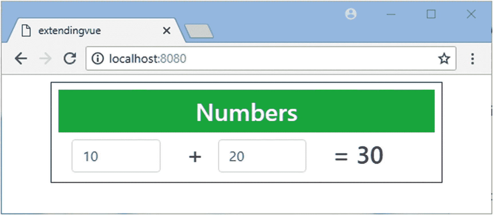
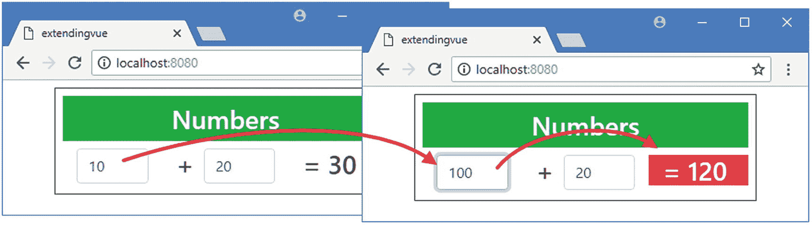
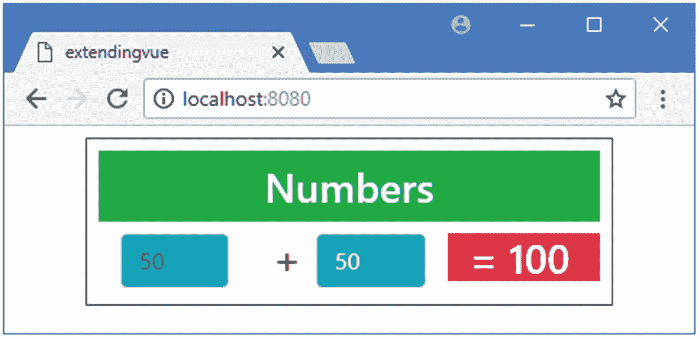
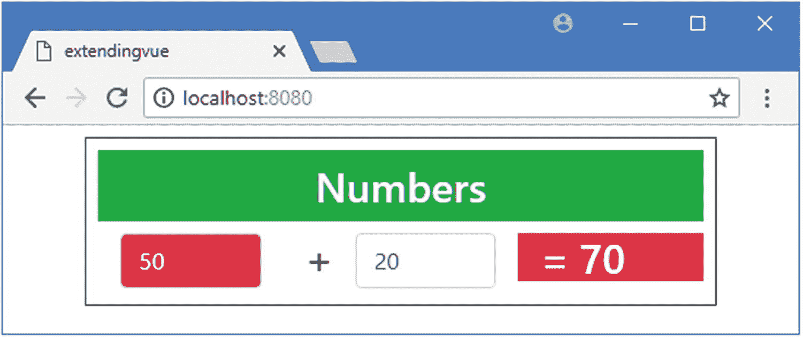
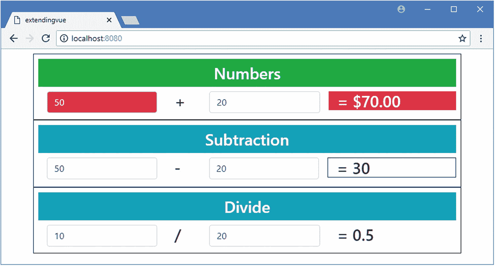

# 二十六、扩展 Vue.js

Vue.js 提供了大多数 web 应用项目所需的所有特性。但是如果你发现你需要扩展 Vue.js，那么有几种不同的技术可用，它们是本章的主题。我将向您展示如何用您自己的定制代码来补充内置指令，如何使用 mixins 来定义组件的公共特性，以及如何使用插件来对更广泛的相关特性进行分组。表 [26-1](#Tab1) 将本章放在上下文中。

表 26-1

将 Vue.js 特性放在上下文中

<colgroup><col class="tcol1 align-left"> <col class="tcol2 align-left"></colgroup> 
| 

问题

 | 

回答

 |
| --- | --- |
| 它们是什么？ | 本章描述的特性允许您扩展 Vue.js 提供的功能。 |
| 它们为什么有用？ | 如果您有整个应用都需要的公共代码，而您不能对这些代码使用依赖注入，那么这些特性会很有用。如果您有多个应用项目所需的通用功能，这些功能也很有用。 |
| 它们是如何使用的？ | 指令是使用一系列函数创建的，这些函数在它们应用到的元素的状态发生变化时被调用。混合被定义为一组特性，当创建一个新实例时，这些特性与组件定义的特性合并。插件是 JavaScript 模块，可以包含广泛的 Vue.js 特性，可以在整个应用中使用。 |
| 有什么陷阱或限制吗？ | 这些都是高级功能，应该小心使用，并且不是大多数功能所必需的。在使用这些功能之前，考虑使用前面章节中的功能是否可以达到预期的效果。 |
| 还有其他选择吗？ | 这些是可选特性，在大多数项目中并不需要，Vue.js 提供的内置功能就足够了。 |

表 [26-2](#Tab2) 总结了本章内容。

表 26-2

章节总结

<colgroup><col class="tcol1 align-left"> <col class="tcol2 align-left"> <col class="tcol3 align-left"></colgroup> 
| 

问题

 | 

解决办法

 | 

列表

 |
| --- | --- | --- |
| 定义自定义指令 | 实现一个或多个钩子函数，并使用组件的`directives`属性注册指令 | 7–8, 16–18 |
| 获取有关如何应用自定义指令的信息 | 读取绑定对象的属性 | 9–14 |
| 在钩子函数之间传递数据 | 在应用了组件的 HTML 元素上使用数据属性 | Fifteen |
| 定义零部件的基本特征 | 定义混音 | 19–22 |
| 创建一组混合的相关特征 | 创建插件 | 23–31 |

## 为本章做准备

要创建本章示例所需的项目，请在方便的位置运行清单 [26-1](#PC1) 中所示的命令。

```js
vue create extendingvue --default

Listing 26-1Creating the Example Project

```

一旦设置过程完成，运行`extendingvue`文件夹中清单 [26-2](#PC2) 所示的命令，将引导 CSS 包添加到项目中。

```js
npm install bootstrap@4.0.0

Listing 26-2Adding the Bootstrap CSS Package

```

将清单 [26-3](#PC3) 中显示的语句添加到`src`文件夹中的`main.js`文件中，将`Bootstrap`包合并到应用中。

```js
import Vue from 'vue'
import App from './App.vue'

import "bootstrap/dist/css/bootstrap.min.css";

Vue.config.productionTip = false

new Vue({
  render: h => h(App)
}).$mount('#app')

Listing 26-3Incorporating the Bootstrap Package in the main.js File in the src Folder

```

我在`src/components`文件夹中添加了一个名为`Numbers.vue`的文件，内容如清单 [26-4](#PC4) 所示。

```js
<template>
    <div class="mx-5 p-2 border border-dark">
        <h3 class="bg-success text-white text-center p-2">Numbers</h3>

        <div class="container-fluid">
            <div class="row">
                <div class="col">
                    <input class="form-control" v-model.number="first" />
                </div>
                <div class="col-1 h3">+</div>
                <div class="col">
                    <input class="form-control" v-model.number="second" />
                </div>
                <div class="col h3">= {{ total }} </div>
            </div>
        </div>
    </div>
</template>

<script>
    export default {
        data: function () {
            return {
                first: 10,
                second: 20
            }
        },
        computed: {
            total() {
                return this.first + this.second;
            }
        }
    }
</script>

Listing 26-4The Contents of the Numbers.vue File in the src/components Folder

```

这是我在第 25 章开始时使用的相同组件，没有我在后面的例子中添加的过渡。要将这个组件集成到应用中，需要替换`App.vue`文件中的内容，如清单 [26-5](#PC5) 所示。

```js
<template>
    <div class="m-2">
        <numbers />
    </div>
</template>

<script>

import Numbers from "./components/Numbers"

export default {
    name: 'App',
    components: { Numbers }
}
</script>

Listing 26-5The Contents of the App.vue File in the src Folder

```

运行`transitions`文件夹中清单 [26-6](#PC6) 所示的命令，启动开发工具。

```js
npm run serve

Listing 26-6Starting the Development Tools

```

将执行初始绑定过程，之后您将看到一条消息，告诉您项目已成功编译，HTTP 服务器正在侦听端口 8080 上的请求。打开一个新的浏览器窗口并导航到`http://localhost:8080`以查看如图 [26-1](#Fig1) 所示的内容。



图 26-1

运行示例应用

## 创建自定义指令

Vue.js 提供的内置指令涵盖了大多数应用中需要的关键任务，但是如果您需要直接处理应用提供的 HTML 元素，并且需要在整个应用中这样做，您也可以创建自己的指令。我添加了一个`src/directives`文件夹，并在其中添加了一个名为`colorize.js`的文件，其内容如清单 [26-7](#PC7) 所示。

### 小费

注意，我已经创建了一个 JavaScript 文件。只有组件是使用`.vue`文件编写的，它允许 HTML、CSS 和 JavaScript 的混合。指令只使用 JavaScript 编写。

```js
export default {
    update(el, binding) {
        if (binding.value > 100) {
            el.classList.add("bg-danger", "text-white");
        } else {
            el.classList.remove("bg-danger", "text-white");
        }
    }
}

Listing 26-7The Contents of the colorize.js File in the src/directives Folder

```

我将很快解释自定义指令是如何工作的，但是在深入研究它是如何工作的之前，先展示一下这段代码是做什么的会有所帮助。在清单 [26-8](#PC8) 中，我注册了该指令并将其应用于一个 HTML 元素。

### 为什么您可能不需要自定义指令

Vue.js 应用中的基本构建块是组件，当您想要向项目添加功能时，应该创建组件。指令更难处理，可用的功能更有限，并且可能需要使用 JavaScript APIs 来操作 HTML 元素，这可能是一个乏味的过程。

如果你想在底层操作一个 HTML 元素，指令可能是有用的，但是在大多数情况下，这可以通过使用内置指令来完成，因为最常见的改变需要像`v-bind`这样的指令来支持，如第 [12 章](12.html)中所述。如果您发现自己正在创建一个自定义指令，那么有必要花点时间问问自己，使用 Vue.js 的其他特性是否能够达到同样的效果。

```js
<template>
    <div class="mx-5 p-2 border border-dark">
        <h3 class="bg-success text-white text-center p-2">Numbers</h3>

        <div class="container-fluid">
            <div class="row">
                <div class="col">
                    <input class="form-control" v-model.number="first" />
                </div>
                <div class="col-1 h3">+</div>
                <div class="col">
                    <input class="form-control" v-model.number="second" />
                </div>
                <div v-colorize="total" class="col h3">= {{ total }} </div>

            </div>
        </div>
    </div>
</template>

<script>
    import Colorize from "../directives/colorize";

    export default {
        data: function () {
            return {
                first: 10,
                second: 20
            }
        },
        computed: {
            total() {
                return this.first + this.second;
            }
        },
        directives: { Colorize }

    }
</script>

Listing 26-8Registering and Applying a Directive in the Numbers.vue File in the src/components Folder

```

自定义指令是使用`directives`属性注册的，该属性被赋予一个对象。在这个例子中，我使用了`import`关键字给这个指令命名为`Colorize`，然后我将它作为一个属性应用到组件模板中的一个 HTML，这个属性的名称以`v-`为前缀，如下所示:

```js
...
<div v-colorize="total" class="col h3">= {{ total }} </div>
...

```

我已经将`total`属性指定为属性值，当我解释该指令如何工作时，我将返回到这个属性。要测试该指令，请重新加载浏览器并输入提供大于 100 的总和的值。当你这样做时，结果的背景和文本颜色被改变，如图 [26-2](#Fig2) 所示。



图 26-2

自定义指令的效果

### 理解指令如何工作

指令定义了方法，称为*钩子函数*，这些方法在应用了它们的模板的组件的生命周期中的关键时刻被调用。表 [26-3](#Tab3) 描述了指令钩子函数。

表 26-3

指令钩子函数

<colgroup><col class="tcol1 align-left"> <col class="tcol2 align-left"></colgroup> 
| 

名字

 | 

描述

 |
| --- | --- |
| `bind` | 首次初始化指令时调用此方法，并提供执行任何初始任务的机会。 |
| `inserted` | 当应用了指令的元素插入到其父元素中时，调用此方法。 |
| `update` | 当更新其模板包含已应用指令的元素的组件时，调用此方法。此方法可能在组件的子级更新之前调用。 |
| `componentUpdated` | 当其模板包含已应用指令的元素的组件被更新时，并且在其子级被更新后，调用此方法。 |
| `unbind` | 调用此方法是为了在指令不再与元素关联之前提供清理的机会。 |

在清单 [26-7](#PC7) 中，自定义指令实现了`update`钩子，当模板包含 HTML 元素的组件被更新时，它可以更新 HTML 元素。当您在一个`input`元素中输入一个新值时，这个变化触发了组件的更新，导致指令的`update`钩子函数被调用，为指令提供了一个修改它所应用的 HTML 元素的机会。

钩子函数的第一个参数是一个`HTMLElement`对象，它实现了标准的 DOM API，可以用来修改呈现给用户的 HTML 内容。我在 hook 函数中使用这个对象来添加和删除对应于引导 CSS 样式的类，如下所示:

```js
...
export default {
    update(el, binding) {
        if (binding.value > 100) {
            el.classList.add("bg-danger", "text-white");

        } else {
            el.classList.remove("bg-danger", "text-white");

        }
    }
}
...

```

这是标准的 DOM API，我不在本书中描述，但是你可以在 [`https://developer.mozilla.org/en-US/docs/Web/API/HTMLElement`](https://developer.mozilla.org/en-US/docs/Web/API/HTMLElement) 了解到。

### 全局注册指令

在清单 [26-8](#PC8) 中，我注册了在单个组件中使用的自定义指令。您还可以注册指令，以便它们可以全局使用，这样您就不必为单个组件注册它们。使用`Vue.directive`方法在`main.js`文件中完成全局注册，如下所示:

```js
...
import Vue from 'vue'
import App from './App'

import "bootstrap/dist/css/bootstrap.min.css";

import Colorize from "./directives/colorize";

Vue.directive("colorize", Colorize);

Vue.config.productionTip = false

new Vue({
    el: '#app',
    components: { App },
    template: '<App/>'
})
...

```

第一个参数是应用指令的名称，第二个参数是从自定义指令的 JavaScript 文件导入的对象或函数。在为应用创建`new Vue`对象之前，必须调用`Vue.directive`方法，如代码片段所示，结果是您可以在整个应用中使用该指令，而无需使用`directives`属性。

传递给钩子函数的第二个参数是一个对象，它表示指令与 HTML 元素的绑定，并定义了表 [26-4](#Tab4) 中所示的属性。

### 小费

钩子函数也和 Vue.js 用来在内部跟踪 HTML 元素的`VNode`对象一起提供，但是我没有在本章中描述它们，因为它们不是很有用。详见 [`https://vuejs.org/v2/api/#VNode-Interface`](https://vuejs.org/v2/api/#VNode-Interface) 。

表 26-4

由绑定对象定义的属性

<colgroup><col class="tcol1 align-left"> <col class="tcol2 align-left"></colgroup> 
| 

名字

 | 

描述

 |
| --- | --- |
| `name` | 该属性返回用于将指令应用到 HTML 元素的名称，不带`v-`前缀。这将是清单 [26-8](#PC8) 中应用的指令的`colorize`。 |
| `expression` | 此属性返回用于应用指令的表达式，以字符串形式表示。在本例中，这将是`total`。您不必处理表达式来获得结果，结果是通过`value`属性提供的。 |
| `value` | 此属性返回通过计算用于应用指令的表达式而产生的当前值。例如，这将是组件的`total`属性的当前值 |
| `oldValue` | 该属性返回前一个表达式值，但仅适用于`update`和`componentUpdated`钩子函数。 |
| `arg` | 此属性返回用于应用指令的参数(如果有)。 |
| `modifiers` | 此属性返回用于应用指令的修饰符(如果有)。 |

我在清单 [26-7](#PC7) 中定义的自定义指令使用`value`属性来获取表达式的当前值，它使用该值来决定是否从引导 CSS 类中添加或移除元素。

```js
...
export default {
    update(el, binding) {

        if (binding.value > 100) {

            el.classList.add("bg-danger", "text-white");
        } else {
            el.classList.remove("bg-danger", "text-white");
        }
    }
}
...

```

请注意，该指令与组件没有任何直接关系，它通过表达式接收值，而没有任何关于该值含义的上下文。

### 警告

表 [26-4](#Tab4) 中描述的属性是只读的。自定义指令应该只通过 HTML 元素进行更改。

### 使用自定义指令表达式

在创建自定义指令时，人们倾向于将过多的逻辑放入指令中，而不依赖核心 Vue.js 特性，结果是创建了一个无法广泛应用的指令。我在清单 [26-7](#PC7) 中定义的指令落入了这个陷阱，因为它在 JavaScript 代码中硬编码了触发元素着色的值。一个更好的方法是依靠 Vue.js 表达式特性让组件控制指令的行为，如清单 [26-9](#PC13) 所示。

```js
...
<template>
    <div class="mx-5 p-2 border border-dark">
        <h3 class="bg-success text-white text-center p-2">Numbers</h3>

        <div class="container-fluid">
            <div class="row">
                <div class="col">
                    <input v-colorize="first > 45" class="form-control"

                        v-model.number="first" />

                </div>
                <div class="col-1 h3">+</div>
                <div class="col">
                    <input class="form-control" v-model.number="second" />
                </div>
                <div v-colorize="total > 50" class="col h3">= {{ total }} </div>

            </div>
        </div>
    </div>
</template>
...

Listing 26-9Using an Expression in the Numbers.vue File in the src/components Folder

```

我没有为指令提供`total`值，而是使用了允许触发类的值的表达式，这意味着我能够将相同的指令应用于具有不同触发值的不同元素。在清单 [26-10](#PC14) 中，我对指令做了相应的修改。

```js
export default {
    update(el, binding) {
        if (binding.value) {

            el.classList.add("bg-danger", "text-white");
        } else {
            el.classList.remove("bg-danger", "text-white");
        }
    }
}

Listing 26-10Removing the Trigger Value in the colorize.js File in the src/directives Folder

```

结果是，如果第一个`input`元素的值超过 45，该指令将改变其背景和字体颜色；如果第一个`div`元素的值超过 50，该指令将改变其背景和字体颜色，如图 [26-3](#Fig3) 所示。


图 26-3

对多个元素应用相同的指令

### 使用自定义指令参数

一个指令可以被提供参数，这些参数提供附加信息来塑造它的行为，例如在使用`v-on`指令时指定你想要处理的事件的方式，如第 [14 章](14.html)中所述。自定义指令也可以接收一个参数，在清单 [26-11](#PC15) 中，我使用了一个参数来指定类的名称，这个类将用于改变指令所应用的元素的背景颜色。

```js
export default {
    update(el, binding) {
        const bgClass = binding.arg || "bg-danger";

        if (binding.value) {
            el.classList.add(bgClass, "text-white");

        } else {
            el.classList.remove(bgClass, "text-white");

        }
    }
}

Listing 26-11Receiving an Argument in the colorize.js File in the src/directives Folder

```

我使用`arg`属性获取类名，如果没有提供参数，则返回到`bg-danger`类。在清单 [26-12](#PC16) 中，我在其中一个指令中添加了一个参数来指定`bg-info`类。

```js
...
<template>
    <div class="mx-5 p-2 border border-dark">
        <h3 class="bg-success text-white text-center p-2">Numbers</h3>

        <div class="container-fluid">
            <div class="row">
                <div class="col">
                    <input v-colorize:bg-info="first > 45" class="form-control"

                           v-model.number="first" />

                </div>
                <div class="col-1 h3">+</div>
                <div class="col">
                    <input class="form-control" v-model.number="second" />
                </div>
                <div v-colorize="total > 50" class="col h3">= {{ total }} </div>
            </div>
        </div>
    </div>
</template>
...

Listing 26-12Adding an Argument in the Numbers.vue File in the src/components Folder

```

因此，在第一个输入元素中输入超过 45 的值会将该元素放入 Bootstrap 使用不同背景颜色的类中，如图 [26-4](#Fig4) 所示。


图 26-4

在自定义指令中使用参数

### 使用自定义指令修饰符

修饰符为指令提供了额外的指令，可以用来补充参数。在清单 [26-13](#PC17) 中，我已经更新了自定义指令，这样它可以检查指定背景和文本颜色是否应该改变的修饰符。

```js
export default {
    update(el, binding) {
        const bgClass = binding.arg || "bg-danger";
        const noMods = Object.keys(binding.modifiers).length == 0;

        if (binding.value) {
            if (noMods || binding.modifiers.bg) {

                el.classList.add(bgClass);

            }

            if (noMods|| binding.modifiers.text) {

                el.classList.add("text-white");

            }

        } else {
            el.classList.remove(bgClass, "text-white");
        }
    }
}

Listing 26-13Receiving Modifiers in the colorizer.js File in the src/directives Folder

```

修饰符是通过参数`binding`的`modifiers`属性返回的对象来访问的。如果没有应用修改器，那么对象将没有属性，但是对于每个已经应用的修改器，将有一个属性，其名称为修改器，其值为`true`。对于我的示例指令，如果没有修饰符，我想改变背景和文本颜色。如果使用了修饰符，那么`bg`修饰符将指示背景颜色应该改变，而`text`修饰符将指示文本颜色应该改变。在清单 [26-14](#PC18) 中，我对指令使用了不同的修饰符组合，并将指令应用于第二个`input`元素。

```js
...
<template>
    <div class="mx-5 p-2 border border-dark">
        <h3 class="bg-success text-white text-center p-2">Numbers</h3>

        <div class="container-fluid">
            <div class="row">
                <div class="col">
                    <input v-colorize:bg-info.bg="first > 45" class="form-control"

                           v-model.number="first" />

                </div>
                <div class="col-1 h3">+</div>
                <div class="col">
                    <input v-colorize:bg-info="second > 30"

                        class="form-control" v-model.number="second" />

                </div>
                <div v-colorize.bg.text="total > 50" class="col h3">

                    = {{ total }}
                </div>
            </div>
        </div>
    </div>
</template>
...

Listing 26-14Using Directive Modifiers in the Numbers.vue File in the src/components Folder

```

示例指令的修饰符是可选的，所以我可以使用不带修饰符的`v-colorizer`属性，只使用`bg`修饰符，同时使用`bg`和`text`修饰符。这样做的效果是，我可以单独配置指令应用到的每个 HTML 元素，如图 [26-5](#Fig5) 所示。



图 26-5

使用修饰符配置指令

### 钩子函数之间的通信

定制指令的本质是简单的和无状态的，如果你想在钩子函数之间传递数据，例如，在`bind`钩子中产生的一些结果可以在`update`钩子中重用，或者一次调用`update`钩子的结果可以在下一次更新中使用，这需要一些努力。这个问题的解决方案是使用 HTML 元素来存储使用`data`属性所需的数据。在清单 [26-15](#PC19) 中，我修改了自定义指令，因此它使用`data`属性来跟踪元素是否已经被添加到引导类中。

```js
export default {
    update(el, binding) {
        const bgClass = binding.arg || "bg-danger";
        const noMods = Object.keys(binding.modifiers).length == 0;
        if (binding.value) {
            if (noMods || binding.modifiers.bg) {
                el.classList.add(bgClass);
                el.dataset["bgClass"] = true;

            }
            if (noMods|| binding.modifiers.text) {
                el.classList.add("text-white");
                el.dataset["textClass"] = true;

            }
        } else {
            if (el.dataset["bgClass"]) {

                el.classList.remove(bgClass);

                el.dataset["bgClass"] = false;

            }

            if (el.dataset["textClass"]) {

                el.classList.remove("text-white");

                el.dataset["textClass"] = false;

            }

        }
    }
}

Listing 26-15Using Data Attributes in the colorize.js File in the src/directives Folder

```

`dataset`属性提供了对 HTML 元素的`data-`属性的访问，我创建了`data-bgClass`和`data-textClass`属性来指示元素何时被添加到引导类中。在此示例中，没有明显的变化，但是如果您将第一个 HTML 元素的值设置为大于 45，然后使用浏览器的 F12 工具检查该元素，您将会看到指令已经能够使用该元素来存储其状态数据，如下所示:

```js
...
<div class="col h3 bg-danger text-white"
    data-bg-class="true" data-text-class="true">
        = 70
</div>
...

```

这似乎是一种奇怪的方法，但它意味着 HTML 元素提供了指令使用的一致数据源，而不需要为本地状态数据和单独的指令生命周期添加功能。

### 定义单一功能指令

如果指令需要在设置期间执行相同的任务，并且在有变化时再次执行相同的任务，那么它们很容易出现代码重复，如清单 [26-16](#PC21) 所示。

```js
export default {
    bind(el, binding) {

        if (binding.value) {

            el.classList.add("bg-danger", "text-white");

        } else {

            el.classList.remove("bg-danger", "text-white");

        }

    },

    update(el, binding) {
        if (binding.value) {

            el.classList.add("bg-danger", "text-white");

        } else {

            el.classList.remove("bg-danger", "text-white");

        }

    }
}

Listing 26-16Adding a Hook in the colorizer.js File in the src/directives Folder

```

我已经简化了指令，使其不再使用参数、修饰符或数据属性，并且添加了`bind`钩子。结果是，用于应用指令的表达式的初始值被用于配置 HTML 元素，尽管在每个钩子中重复相同的语句。

这是一个如此常见的模式，以至于 Vue.js 支持一个优化，它允许只需要`bind`和`update`钩子的指令被表达为一个单一的函数，如清单 [26-17](#PC22) 所示。

```js
export default function (el, binding) {

    if (binding.value) {
        el.classList.add("bg-danger", "text-white");
    } else {
        el.classList.remove("bg-danger", "text-white");
    }
}

Listing 26-17Using a Single Function in the colorizer.js File in the src/directives Folder

```

这种方法的缺点是不能指定任何其他挂钩，但是它允许将大多数指令表示为一个函数，而不必复制任何代码。为了展示 Vue.js 应用指令就像它有一个绑定钩子一样，我增加了一个`Numbers`组件的数据属性的初始值，如清单 [26-18](#PC23) 所示。

```js
...
<script>

    import Colorize from "../directives/colorize";

    export default {
        data: function () {
            return {
                first: 50,

                second: 20
            }
        },
        computed: {
            total() {
                return this.first + this.second;
            }
        },
        directives: { Colorize }
    }
</script>
...

Listing 26-18Increasing a Data Property in the Numbers.vue File in the src/components Folder

```

新值超过了用于应用指令的阈值，这产生了如图 [26-6](#Fig6) 所示的结果。



图 26-6

使用单个函数来提供绑定钩子

## 创建组件混合

混合是向组件提供共享特性的一种有用方式，有助于减少代码重复。mixins 的优点是简单，但缺点是它们不能用于共享状态，这需要依赖注入或数据存储等特性。

我喜欢在 mixins 自己的文件夹中定义它们，以使它们与项目的其他部分分开。为了演示一个 mixin，我创建了`src/mixins`目录，并在其中添加了一个名为`numbersMixin.js`的文件，其内容如清单 [26-19](#PC24) 所示。

```js
import Colorize from "../directives/colorize";

export default {
    data: function () {
        return {
            first: 50,
            second: 20
        }
    },
    computed: {
        total() {
            return 0;
        }
    },
    directives: { Colorize },
}

Listing 26-19The Contents of the numbersMixin.js File in the src/mixins Folder

```

mixin 可以包含任何组件代码特性，包括数据和计算属性、方法、过滤器和指令。如果您正在构建一组共享通用功能的相关组件，那么 mixin 可能是避免将相同的代码复制并粘贴到`.vue`文件的`script`元素中的好方法。清单 [26-19](#PC24) 中的 mixin 包含数据属性、计算属性和指令注册，所有这些都是我从现有的`Numbers`组件中获取的，尽管`total`计算属性返回零，我这样做是为了展示 mixin 是如何工作的。

在清单 [26-20](#PC25) 中，我已经更新了`Numbers`组件，因此它使用 mixin 并只定义不同的功能。

```js
...
<script>
    import mixin from "../mixins/numbersMixin";

    export default {
        computed: {
            total() {
                return this.first + this.second;
            }
        },
        mixins: [ mixin ]

    }
</script>
...

Listing 26-20Using a Mixin in the Numbers.vue File in the src/components Folder

```

使用`mixins`属性应用 mixin，该属性被赋予一个 mixin 对象数组。当使用 mixin 时，Vue.js 将组件视为已经定义了 mixin 所提供的特性。当组件定义了一个同名的特性，比如清单 [26-20](#PC25) 中的`total` computed 属性，那么组件的特性会覆盖 mixin 提供的特性。

### 将混音应用到所有组件

Mixins 可以全局注册，这将它们的特性应用于应用中的所有组件。这不是一件轻而易举的事情，因为它的影响是广泛的，通常会导致预期的行为。使用`Vue.mixin`方法在`main.js`文件中全局注册 Mixins，如下所示:

```js
...
import Vue from 'vue'
import App from './App'

import "bootstrap/dist/css/bootstrap.min.css";

Vue.config.productionTip = false

import mixin from "./mixins/numbersMixin";

Vue.mixin(mixin);

new Vue({
    el: '#app',
    components: { App },
    template: '<App/>'
})
...

```

在为应用创建`new Vue`对象之前，必须调用`Vue.mixin`方法，如代码片段所示。当你像这样注册一个 mixin 时，你不需要在单独的组件中使用`mixins`属性。

这允许 mixin 提供被更专门化的行为覆盖的通用功能。为了展示如何使用单个 mixin 为相关组件提供基础，我在`src/components`文件夹中创建了一个名为`Subtraction.vue`的文件，其内容如清单 [26-21](#PC27) 所示。

### 小费

当一个 mixin 和一个组件都实现一个生命周期方法时，如第 [17](17.html) 章所述，Vue.js 调用 mixin 的方法，然后调用组件定义的方法。

```js
<template>
<div class="mx-5 p-2 border border-dark">
    <h3 class="bg-info text-white text-center p-2">Subtraction</h3>

    <div class="container-fluid">
        <div class="row">
            <div class="col">
                <input class="form-control" v-model.number="first" />
            </div>
            <div class="col-1 h3">-</div>
            <div class="col">
                <input class="form-control" v-model.number="second" />
            </div>
            <div v-colorize.bg.text="total > 50" class="col h3">= {{ total }}</div>
        </div>
    </div>
</div>
</template>

<script>

    import mixin from "../mixins/numbersMixin";

    export default {

        computed: {
            total() {
                return this.first - this.second;
            }
        },
        mixins: [ mixin ]
    }
</script>

Listing 26-21The Contents of the Subtraction.vue File in the src/components Folder

```

该组件与`Numbers`组件具有相同的基本结构，但是覆盖了 total `computed`属性，以便从一个数据属性中减去另一个数据属性的值，而不是由原始组件执行的加法。所有其他组件特性都由 mixin 提供。在清单 [26-22](#PC28) 中，我已经更新了顶层的`App`组件以显示新组件。

```js
<template>
    <div class="m-2">
        <numbers />
        <subtraction />

    </div>
</template>

<script>

import Numbers from "./components/Numbers";

import Subtraction from "./components/Subtraction";

export default {
    name: 'App',
    components: { Numbers, Subtraction }

}
</script>

Listing 26-22Adding a Component in the App.vue File in the src Folder

```

我已经将新组件显示在现有组件旁边，产生了如图 [26-7](#Fig7) 所示的结果。

### 注意

使用 mixin 的每个组件都有自己的数据属性，这些属性不与其他组件共享。如果您希望组件对相同的数据值进行操作，那么请参见第 [18](18.html) 章了解依赖注入的详细信息，或者参见第 [20](20.html) 章了解关于数据存储的信息。


图 26-7

使用相同的 mixin 创建相似的组件

## 创建 Vue.js 插件

插件允许在整个应用中全局应用广泛的特性，而不需要单独配置每个特性。这些特性包括指令和混合，但也允许全局定义方法和属性，这就是像 Vuex(第 [20](20.html) 章)和 Vue Router(第 [22](22.html) 章)这样的包如何提供对其功能的访问。

为了演示插件是如何创建和使用的，我将定义一组全局特性，这些特性将支持示例应用中的组件所执行的简单数学运算。

首先，我创建了`src/plugins/maths`文件夹，并在其中添加了一个名为`filters.js`的文件，其内容如清单 [26-23](#PC29) 所示。

```js
export default {

    currency: function (value) {
        return new Intl.NumberFormat("en-US",
            { style: "currency", currency: "USD" }).format(value);
    },

    noDecimal: function (value) {
        return Number(value).toFixed(0);
    }
}

Listing 26-23The Contents of the filters.js File in the src/plugins/maths Folder

```

这个文件定义了两个过滤函数，它们格式化数值并将它们分配给属性，稍后我将使用这些属性的名称来注册过滤器。这些过滤器的目的不如它们被包含在插件中的方式重要。有关过滤器如何工作的详细信息，请参见第 [11](11.html) 章。

插件也可以包含指令，所以我在`src/plugins/maths`文件夹中创建了一个名为`directives.js`的文件，内容如清单 [26-24](#PC30) 所示。

```js
export default {

    borderize: function (el, binding) {
        if (binding.value) {
            el.classList.add("border", "border-dark");
        } else {
            el.classList.remove("border", "border-dark");
        }
    }
}

Listing 26-24The Contents of the directives.js File in the src/plugins/maths Folder

```

这个文件定义了一个单函数指令，当它的表达式是`true`时，这个指令将一个边框应用到它的 HTML 元素。这不是一个特别有用的指令，但是，如前所述，自定义指令很少有用，在大多数应用中也不需要。

插件还可以定义全局方法和属性，这些方法和属性可以在整个应用中被访问。我在`src/plugins/maths`文件夹中添加了一个名为`globals.js`的文件，内容如清单 [26-25](#PC31) 所示。

```js
export default {
    sumValues(...vals) {
        return vals.reduce((val, total) => total += val, 0);
    },

    getSymbol(operation) {
        switch (operation.toLowerCase()) {
            case "add": return "+";
            case "subtract": return "-";
            case "multiply": return "*";
            default: return "/";
        }
    }
}

Listing 26-25The Contents of the globals.js File in the src/plugins/maths Folder

```

在清单中，我定义了一个`sumValues`函数，它使用一个 rest 参数来接收一组值，这些值相加后产生一个结果，还定义了一个`getSymbol`方法，它接受数学运算的名称并返回表示它的符号。

你也可以使用插件为每个组件添加属性和方法，类似于 Vuex 提供`$store`属性和 Vue Router 提供`$route`和`$router`的方式。我在`src/plugins/maths`文件夹中添加了一个名为`componentFeatures.js`的文件，内容如清单 [26-26](#PC32) 所示。

```js
export default {
    $calc: {
        add(first, second) {
            return first + second;
        },
        subtract(first, second) {
            return first - second;
        },
        multiply(first, second) {
            return first * second;
        },
        divide(first, second) {
            return first / second;
        }
    }
}

Listing 26-26The Contents of the componentFeatures.js File in the src/plugins/maths Folder

```

按照惯例，提供给组件的特性名称以美元符号开头，在清单中，我用执行基本数学运算的`add`、`subtract`、`multiply`和`divide`方法定义了一个`$calc`对象。

插件可以包含组件，这是确保通用功能在整个应用中可用的有效方法。我在`src/plugins/maths`文件夹中添加了一个名为`Operation.vue`的文件，内容如清单 [26-27](#PC33) 所示。

```js
<template>
    <div class="mx-5 p-2 border border-dark">
        <h3 class="bg-info text-white text-center p-2">{{ operation }}</h3>

        <div class="container-fluid">
            <div class="row">
                <div class="col">
                    <input class="form-control" v-model.number="first" />
                </div>
                <div class="col-1 h3">{{ symbol }}</div>
                <div class="col">
                    <input class="form-control" v-model.number="second" />
                </div>
                <div class="col h3" v-borderize="total > 25">= {{ total }}</div>
            </div>
        </div>
    </div>
</template>

<script>

import Vue from "vue";

export default {
        props: ["firstVal", "secondVal", "operation"],
        data: function () {
            return {
                first: Number(this.firstVal),
                second: Number(this.secondVal)
            }
        },
        computed: {
            symbol() {
                return Vue.getSymbol(this.operation);
            },
            total() {
                switch (this.operation.toLowerCase()) {
                    case "add":
                        return this.$calc.add(this.first, this.second);
                    case "subtract":
                        return this.$calc.subtract(this.first, this.second);
                    case "multiply":
                        return this.$calc.multiply(this.first, this.second);
                    case "divide":
                        return this.$calc.divide(this.first, this.second);
                }
            }
        }
}
</script>

Listing 26-27The Contents of the Operation.vue File in the src/plugins/maths Folder

```

这个组件提供了一个标准化的接口，用于对两个数字执行简单的操作，并建立在插件中的一些其他特性之上，我将很快对此进行解释。

### 创建插件

我在上一节中定义的特性必须结合起来才能创建一个插件。我在`src/plugins/maths`文件夹中添加了一个名为`index.js`的文件，并添加了清单 [26-28](#PC34) 中所示的代码，这些代码将不同的特性组合在一起，创建了一个插件。

```js
import filters from "./filters";
import directives from "./directives";
import globals from "./globals";
import componentFeatures from "./componentFeatures";
import Operation from "./Operation";

export default {
    install: function (Vue) {

        Vue.filter("currency", filters.currency);
        Vue.filter("noDecimal", filters.noDecimal);
        Vue.directive("borderize", directives.borderize);
        Vue.component("maths", Operation);

        Vue.sumValues = globals.sumValues;
        Vue.getSymbol = globals.getSymbol;

        Vue.prototype.$calc = componentFeatures.$calc;
    }
}

Listing 26-28The Contents of the index.js File in the src/plugins/maths Folder

```

插件是定义一个`install`函数的对象，该函数接收一个`Vue`对象和一个可选的配置对象。由`Vue`对象提供的方法用于注册每个特性，这些特性是我从上一节创建的 JavaScript 文件中导入的，如表 [26-5](#Tab5) 所述。

表 26-5

注册插件特性的 Vue 方法

<colgroup><col class="tcol1 align-left"> <col class="tcol2 align-left"></colgroup> 
| 

名字

 | 

描述

 |
| --- | --- |
| `Vue.directive` | 此方法用于注册指令。参数是应用指令的名称和指令对象。 |
| `Vue.filter` | 此方法用于注册过滤器。参数是应用筛选器的名称和筛选器对象。 |
| `Vue.component` | 此方法用于注册组件。参数是应用组件的名称和组件对象。 |
| `Vue.mixin` | 这个方法用于注册一个 mixin。这个方法的参数是 mixin 对象。 |

在清单 [26-28](#PC34) 中，我使用了`filter`、`directive`和`component`方法来注册上一节中定义的特性。为了注册全局方法和属性，新成员被添加到`Vue`对象，如下所示:

```js
...
Vue.getSymbol = globals.getSymbol;
...

```

这条语句使得`getSymbol`方法在整个应用中可用，这意味着它可以通过`Vue`对象来访问，如清单 [26-27](#PC33) 中组件的这条语句所示:

```js
...
symbol() {
    return Vue.getSymbol(this.operation);
},
...

```

您想在每个组件中访问的方法和属性被添加到`Vue.prototype`对象中，如下所示:

```js
...
Vue.prototype.$calc = componentFeatures.$calc;
...

```

该语句设置了`$calc`对象，因此它可以在组件中作为`this.$calc`被访问，如组件列表 [26-27](#PC33) 中的语句所示:

```js
...
return this.$calc.add(this.first, this.second);
...

```

通过结合这些技术和表 [26-5](#Tab5) 中的方法，插件能够为 Vue.js 应用提供广泛的特性。

### 使用插件

插件是通过`Vue.use`方法启用的，这个方法与我在前面章节中注册数据存储和 URL 路由插件的方法相同，唯一的区别是这些插件在它们自己的 NPM 包中。在清单 [26-29](#PC39) 中，我已经在示例应用中导入了定制包，并使用`Vue.use`方法启用了它。

```js
import Vue from 'vue'
import App from './App.vue'
import "bootstrap/dist/css/bootstrap.min.css";

Vue.config.productionTip = false

import MathsPlugin from "./plugins/maths";

Vue.use(MathsPlugin);

new Vue({
  render: h => h(App)
}).$mount('#app')

Listing 26-29Using the Plugin in the main.js File in the src Folder

```

一旦一个插件被启用，它的特性就可以在整个应用中使用。在清单 [26-30](#PC40) 中，我已经将我定义的组件添加到顶层`App`组件的模板中。

```js
<template>
    <div class="m-2">
        <numbers />
        <subtraction />
        <maths operation="Divide" firstVal="10"  secondVal="20" />

    </div>
</template>

<script>

import Numbers from "./components/Numbers";
import Subtraction from "./components/Subtraction";

export default {
    name: 'App',
    components: { Numbers, Subtraction }
}
</script>

Listing 26-30Using a Plugin’s Component in the App.vue File in the src Folder

```

请注意，我不必注册组件，我只需向模板添加一个`maths`元素，因为插件提供的特性在整个应用中都是可用的。例如，在清单 [26-31](#PC41) 中，我在`Numbers`组件中使用了一个过滤器和一个全局方法。

```js
<template>
    <div class="mx-5 p-2 border border-dark">
        <h3 class="bg-success text-white text-center p-2">Numbers</h3>

        <div class="container-fluid">
            <div class="row">
                <div class="col">
                    <input v-colorize:bg-info.bg="first > 45" class="form-control"
                           v-model.number="first" />
                </div>
                <div class="col-1 h3">+</div>
                <div class="col">
                    <input v-colorize:bg-info="second > 30"
                        class="form-control" v-model.number="second" />
                </div>
                <div v-colorize.bg.text="total > 50" class="col h3">
                    = {{ total | currency }}

                </div>
            </div>
        </div>
    </div>
</template>

<script>
    import mixin from "../mixins/numbersMixin";
    import Vue from "vue";

    export default {

        computed: {
            total() {
                return Vue.sumValues(this.first, this.second);

            }
        },
        mixins: [ mixin ]
    }
</script>

Listing 26-31Using Plugin Features in the Numbers.vue File in the src/components Folder

```

结果是组件显示的值被格式化为货币金额，一个新的组件显示给用户，如图 [26-8](#Fig8) 所示。



图 26-8

使用插件功能

## 摘要

在这一章中，我描述了扩展 Vue.js 提供的功能的不同方式。我向您展示了如何创建一个自定义指令，并警告说这很少是最好的方法；如何使用 mixin 提供具有公共特性的组件；以及如何通过创建插件来提供一系列相关功能。

这就是我要教你的关于 Vue.js 的全部内容。我从创建一个简单的应用开始，然后带你全面浏览框架中的不同构建块，向你展示如何创建、配置和应用它们来创建 web 应用。

我祝你在 Vue.js 项目中一切顺利，我只希望你能像我喜欢写这本书一样喜欢读这本书。