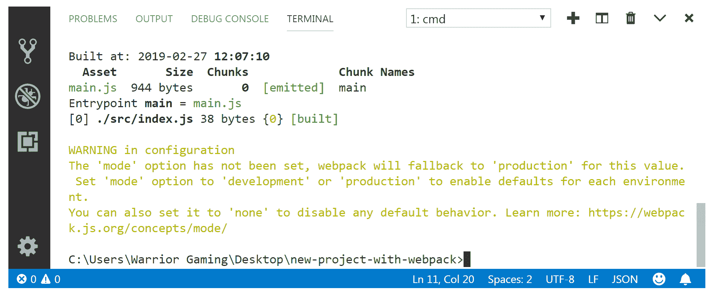
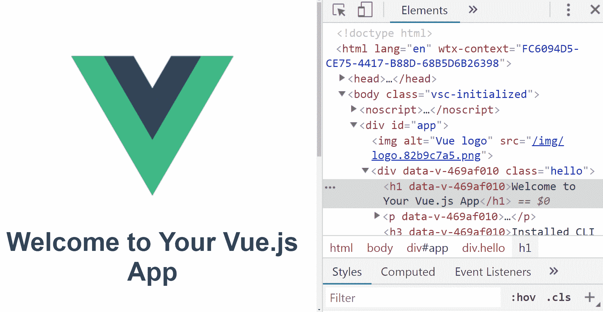
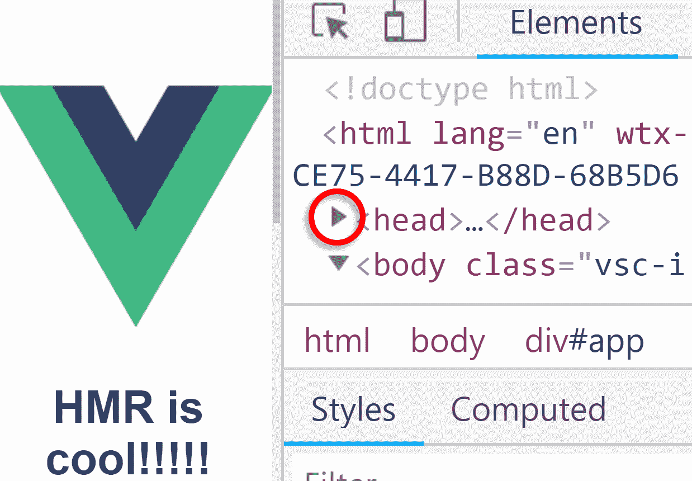

# 二、Vue CLI 3 中的 Webpack

在上一章中，我们了解了如何通过命令行和 UI 开始使用 Vue CLI。在本章中，我们将从 Vue CLI 3 的角度介绍 Webpack 的基础知识。我们将从什么是 Webpack 的概述开始。我们将了解模块捆绑、树抖动、Webpack 加载程序和输出、Webpack 插件、**热模块替换**（**HMR**）、代码覆盖率和代码拆分背后的概念，然后我们将了解这些概念如何与 Vue CLI 3 相适应，如下所示：

*   **JavaScript**（**JS**语言）从脚本标签到模块绑定器的演变
*   脚本标签
*   **立即调用函数表达式**（**IIFEs**），解决了哪些问题，没有解决哪些问题
*   **节点包管理器**（**NPM**如何帮助团队在代码中共享第三方库
*   JS 任务运行程序和 NPM 脚本的角色
*   CommonJS 规范是什么，模块如何在 JavaScript 和 Node.js 中工作
*   什么是模块绑定器以及它们如何在 Node.js 和浏览器之间架起桥梁
*   什么 Webpack，它是如何工作的
*   如何在项目上运行 webpack
*   使用生产和开发模式将资产与 Web 包绑定
*   通过 NPM 添加 Vue 项目并使用 webpack

准确理解 webpack 的工作原理对于理解 Vue CLI 3 的魔力至关重要。如果您熟悉 webpack，您可能仍然会发现本章的某些部分很有用。如果你觉得自己是一个网页专家，你可以跳过这一章。

在深入了解什么是 webpack 并正确理解 webpack 解决的问题之前，我们需要回顾一下 JS 语言在过去十年中发生的一些变化历史。

# JS 语言的演变

从 webpack 的优势来看，以下是添加到 JS 生态系统中的方法、技术、最佳实践和模式的时间顺序列表，这些方法、技术、最佳实践和模式导致了当前的状况：

*   `script`标记作为向网页添加交互性的答案
*   立即调用函数表达式作为模块化库和避免代码冲突的答案
*   IIFEs 的问题
*   与 NPM 在团队环境中共享第三方库
*   JS 任务运行程序和 NPM 脚本
*   JS 中的模块

让我们更详细地了解这些解决方案中的每一个。

# 脚本标签

最初，将 JS 添加到网页意味着您需要直接在 HTML 中添加一些`script`标记。对于快速原型，即使到今天，这仍然是一种有效的方法。通常，第三方库是通过`script`标记中的`src`属性添加的（在我们的 HTML 中，它通常位于结束`body`标记的正上方）。

不幸的是，在 HTML 中通常需要多个`script`标记。无论您是直接向页面添加 JS 代码，还是从项目中的另一个文件添加 JS 代码，或者从远程位置（例如使用`src`属性从**内容交付网络**（**CDN**）添加 JS 代码），最终，所有这些脚本都会添加到全局 JS 范围。这意味着一件事，碰撞。

为了避免碰撞，采用了一种巧妙的方法，即使用 IIFE

# 立即调用的函数表达式

IIFEs 是关于什么的？IIFE 只是利用了一个事实，即在 JS 中，*括号不能包含语句*。仅凭这一事实，JS 开发人员就可以通过简单地将匿名函数包装在括号中，将其放入可以立即调用的匿名函数中，而不会从解析器中得到任何错误。

iLife 本质上是 JS 语言的一种怪癖，但它非常有用；对于 IIFE，所有代码的作用域都是函数，因此您的代码不会受到它之外的任何其他内容的影响。换句话说，使用 IIFEs 是避免冲突的一种简单方法，即意外重写变量或函数。因此，在某一点上，许多流行的库开始将自己的代码包装到 IIFE 中。例如，如果您打开 jQuery 库的代码（[https://code.jquery.com](https://code.jquery.com) ），或用于 Chart.js 库（[https://cdnjs.cloudflare.com/ajax/libs/Chart.js/2.7.3/Chart.bundle.js](https://cdnjs.cloudflare.com/ajax/libs/Chart.js/2.7.3/Chart.bundle.js) ），或者对于许多其他流行的 JS 库，您会发现它们使用 IIFE 模式。

因此，使用 IIFEs，我们可以向页面中添加不同的脚本，而不必担心可能发生代码冲突。

# IIFEs 的问题

不幸的是，仅仅使用 IIFEs 并不能解决我们所有的问题。为了说明当前的问题，让我们引用 Erlang 的创建者 Joe Armstrong 的话：

"You wanted a banana, but what you got is the gorilla holding the banana, and the entire jungle."

请记住，在这段引文中，Armstrong 先生讨论了面向对象语言的一个问题，但基本问题适用于 JS 代码模块化。

基本上，IIFEs 的问题是我们无法从 JS 库中挑选我们想要使用的特定功能。对于 IIFE 模式，我们*必须*使用 IIFE 中包含的所有内容，即使我们只使用特定库代码库的一小部分。当然，老实说，IIFE 不是罪魁祸首。JS 语言在很长一段时间内根本没有能力挑选任何类型的代码功能，因为在 JS 中，根本不可能将代码拆分为模块。

JS 的另一个主要难点是跨团队重用第三方代码的问题。

# 与 NPM 在团队环境中共享第三方库

IIFE 解决了代码冲突的问题，但没有解决代码重用的问题。如果我团队中的某个开发人员有一个不同的、更新版本的库，并且发生了破坏性的更改，该怎么办？如果我决定更新计算机上的依赖项，该怎么办？我的其他团队成员将如何应对？除了使用源代码版本控制，还有其他更快协作的选项吗？

**节点包管理器****NPM**就是这些问题的答案。Node 只是一个可以在服务器上运行的 googlev8js 引擎。NPM 只允许开发人员将新库安装到项目中，而不管它是用于应用的前端还是后端。因此，NPM 实际上是 JS 包管理器，类似于我们在 Ruby（gems（【T6）】中所做的 https://rubygems.org/ 、C#（NuGet（[https://www.nuget.org/](https://www.nuget.org/) ），或在 Linux（`apt-get`、`yum`中。

例如，假设我们想通过 NPM 安装 Vue。如果我们在机器上安装了节点，那么我们也将安装 NPM，因为 NPM 与节点安装捆绑在一起。

接下来，我们需要创建一个新目录。让我们将此目录的名称更改为`vue-from-npm`，并将命令行控制台指向它。然后，我们可以使用以下命令进行后续操作：

```js
npm init -y
```

运行前面的命令将创建一个`package.json`文件。`-y`标志接受控制台中提示的所有默认答案。

如果我们查看项目目录中新创建的`package.json`文件，我们会看到以下内容：

```js
{
  "name": "vue-from-npm",
  "version": "1.0.0",
  "description": "",
  "main": "index.js",
  "scripts": {
    "test": "echo \"Error: no test specified\" && exit 1"
  },
  "keywords": [],
  "author": "",
  "license": "ISC"
}
```

注意，`npm init`命令只将`package.json`文件添加到空目录中。这就是它的全部功能！

添加 Vue 非常简单，只需运行以下命令：

```js
npm install vue --save --verbose
```

前面的命令将执行一些操作，即：

*   它将添加`node_modules`目录。
*   它将把整个 Vue 库放在`node_modules`目录中。
*   它将在我们项目的根目录中创建`package-lock.json`文件。
*   它将更新我们项目根目录中的`package.json`文件。

更新后的`package.json`文件现在如下所示：

```js
{
  "name": "vue-from-npm",
  "version": "1.0.0",
  "description": "",
  "main": "index.js",
  "scripts": {
    "test": "echo \"Error: no test specified\" && exit 1"
  },
  "keywords": [],
  "author": "",
  "license": "ISC",
  "dependencies": {
    "vue": "^2.6.7"
  }
}
```

如果不明显，则文件已更新为新条目：`dependencies`。此条目列出项目中包含的所有依赖项。具体来说，我们已将 Vue（2.6.7 或更高版本）添加到我们的项目中。

NPM 的一个优点是，我们可以将任何其他库添加到我们的项目中，就像使用 Vue 一样简单。例如，要使用 accounting.js 更新我们的项目，我们只需运行以下命令：

```js
npm install accounting-js --save --verbose
```

安装完成后，我们再次检查`node_modules`目录，如下所示：

```js
vue-npm/node_modules/
 ├── accounting-js/
 │ ├── dist/
 │ ├── lib/
 │ ├── CHANGELOG.md
 │ ├── package.json
 │ └── README.md
 ├── is-string/
 ├── object-assign/
 └── vue/
```

请注意，为了简洁起见，我们只显示了`accounting-js`文件夹中的第二级文件夹和文件。`is-string`、`object-assign`和`vue`文件夹显示为折叠状态。

这向我们展示的是，有时其他 NPM 模块与我们安装的实际库捆绑在一起。在`accounting-js`的情况下，我们还得到了`is-string`和`object-assign`NPM 模块。我们也来检查一下目录根目录中更新的`package.json`文件，如下所示：

```js
{
  "name": "vue-from-npm",
  "version": "1.0.0",
  "description": "",
  "main": "index.js",
  "scripts": {
    "test": "echo \"Error: no test specified\" && exit 1"
  },
  "keywords": [],
  "author": "",
  "license": "ISC",
  "dependencies": {
    "accounting-js": "^1.1.1",
    "vue": "^2.6.7"
  }
}
```

如我们所见，根`package.json`文件已更新为正确版本的`accounting-js`。让我们找到另一个`package.json`文件，这次在`node_modules/accounting-js`文件夹中。如果你打开这个文件，它会保存更多的信息，只需要 100 多行代码。此信息特定于实际的 NPM 模块`accounting-js`。

好的，现在我们的项目已经准备好合作了。怎么做？让我们看看我们的一位同事，我们叫他`John`，他会如何在自己的计算机上添加我们刚刚创建的项目和所有项目依赖项。

为此，我们将创建一个新文件夹，我们称之为`johns-computer`，然后将根级别`package.json`从`vue-from-npm`文件夹复制到`johns-computer`文件夹中。

接下来，让我们简单地运行以下命令：

```js
npm install --verbose
```

运行前面的命令将安装我们在`vue-from-npm`文件夹中的所有项目和依赖项。

# JavaScript 任务运行程序和 NPM 脚本

大约在 NPM 越来越流行的同时，另一种前端技术也在兴起：任务跑者。任务运行器是简单的工具；他们执行重复的任务。有时，任务运行程序被称为构建工具，因为它们在开发人员对代码库进行的更新和生产就绪代码的最终生成之间充当中介。这就是所谓的*构建步骤*，是软件开发过程中的一部分，在编写完成后，代码*发生了变化。*

例如，添加到 CSS3 的新功能通常以*供应商前缀*（也称为*浏览器前缀*）开始。换句话说，在所有浏览器中都可以使用新的 CSS 功能之前，它将在各个浏览器中的实验阶段实现，使用特定于浏览器的前缀，如下所示：

```js
-ms-
-moz-
-o-
-webkit-
```

在这个按字母顺序排列的浏览器前缀列表中，我们可以看到 Microsoft 浏览器、Mozilla、Opera 的旧版本，以及所有基于 webkit 的浏览器（Chrome、Safari、较新的 Opera 等）的浏览器前缀。

跟踪浏览器前缀的更新有点困难。监控 CSS 实现的更改，然后相应地更新代码，这可能不是开发人员时间的最佳利用。例如，在过去的某个时刻，在 CSS`transition`属性上必须使用以下浏览器前缀：

```js
-webkit-transition: background-color 1s;
-moz-transition: background-color 1s;
-o-transition: background-color 1s;
-ms-transition: background-color 1s;
```

显然，今天我们只是在 CSS 声明中使用了`transition`属性，没有任何浏览器前缀，因为所有现代浏览器都广泛支持`transition`属性。

面对不断变化的 CSS 规范及其在各种浏览器中的实现，我们需要以任务运行器的形式来解决这个问题。前端开发人员不必手动将供应商前缀添加到他们的 CSS 代码中，现在只需向他们的任务运行程序中添加一个插件，它就可以为他们完成繁重的工作：在需要的地方添加供应商前缀。

当然，我们之前看到的只是任务运行程序的一个示例。其他一些示例包括：缩小 CSS 和 JS 文件、从 ES6 传输到 ES5、从 SASS 编译 CSS、删除未使用的 CSS、在项目中保存文件时重新加载浏览器，等等

今天，有许多不同的工具可以帮助我们有效地自动化开发过程中的一些任务。三种工具非常突出：Grunt、Gulp 和 NPM 脚本。

虽然 Grunt 和 Gulp 是可以通过 NPM 安装的独立任务运行程序，但 NPM 脚本是一个有趣的替代方案，原因如下：

*   无论如何，您都在使用 NPM，那么为什么不更熟悉您已经在使用的工具呢？
*   使用 NPM 脚本而不是前面提到的任务运行程序将进一步简化您的开发。
*   通过使用 NPM，您可以避免在 NPM 中直接自动化的任务中使用任务运行器插件的复杂性。

到目前为止，我们已经回顾了 JS 生态系统的历史和演变。我们已经了解了 IIFEs 是如何用于处理意外范围泄漏的。我们还看到了 NPM 是如何处理代码共享的。我们进一步研究了如何在任务运行者的帮助下自动化一些重复性任务，以及如何使用 NPM 将任务保留在 NPM 脚本中，从而消除不必要的抽象层。

然而，我们还没有找到解决 JS 中代码模块化问题的方法。那么，让我们看下一个。

# JavaScript 中的模块

在任何编程语言中，模块都是一个独立的功能部件。您可以将其视为电视节目的不同片段。它们可以单独查看。它们可以独立存在，尽管它们是更大整体的一部分。

就像电视节目中的一集有一个季节和一个数字，因此我们知道*在更大的情节中适合*的位置，一个模块也保存着信息，告诉我们它依赖哪些其他模块（模块依赖项），以及它为整个应用添加了哪些功能；这就是所谓的*模块的接口*，是一种向其他模块公开的 API。

我们已经看到，在一开始，JS 根本没有模块。随着 Node.js 的引入，情况发生了变化。Node.js 实际上是 CommonJS 的一个实现，该项目由 Mozilla 的 Kevin Dangoor 于 2009 年启动

CommonJS 项目的目的是定义一个标准库，提供在浏览器之外使用的 JSAPI。这包括一个模块规范，使得开发人员能够在 Node.js 中使用如下代码：

```js
var bootstrap = require('bootstrap');
```

# 使用 Node.js 中的模块

我们需要并使用 Node.js 中的一些模块：

1.  首先，我们将创建一个新目录。我们叫它`module-practice`。让我们将 Git Bash 指向这个文件夹。
2.  进入它之后，让我们创建两个新文件。我们将这些文件称为`main.js`和`whatever.js`，如下所示：

```js
touch main.js whatever.js
```

3.  接下来，让我们在 VS 代码中打开整个文件夹，如下所示：

```js
code .
```

4.  现在，让我们为`whatever.js`添加一些代码，如下所示：

```js
console.log('whatever');
```

这就像 JS 中的一段代码一样简单。

5.  现在让我们看看如何在我们的`main.js`文件中提供它。我们只需要要求`whatever.js`如下：

```js
let whatever = require('./whatever');
```

6.  既然它是必需的，我们就可以使用它了，那么我们将`main.js`更新为：

```js
let whatever = require('./whatever');

whatever.returnWhatever();
```

7.  现在让我们使用以下代码运行此代码：

```js
node main.js
```

现在将要发生的是，我们将看到在 Git Bash 中打印的单词`whatever`。

让我们把实验进行得更进一步。以下是我们更新的`whatever.js`：

```js
module.exports = {
    returnWhatever: function() {
        console.log('whatever');
    }
}
```

因此，我们也需要更新`main.js`如下：

```js

whatever.returnWhatever();
```

正如我们已经看到的，`require`关键字导入一个模块的代码，并使其在另一个文件中可用；在我们的示例中，`main.js`文件。

`exports`关键字允许我们将代码提供给其他文件，但需要注意一点。它还允许我们选择模块的哪些部分可供其他文件使用。正如我们看到的，`module.exports`是一个对象。此对象的内容是当`main.js`需要我们的`whatever`模块时返回的内容。这允许我们只公开代码的某些部分，并允许设置模块的接口。换句话说，`module.exports`使我们能够将部分代码保持私有。考虑到对 Ty5 T5 的更新：

```js
module.exports = {
    returnWhatever: function() {
        returnSomething();
    }
}

let returnSomething = () => {
    console.log('whatever');
}
```

我们不需要对`main.js`进行任何更改。如果我们从 GitBash 运行它，我们仍然可以将单词`whatever`输出到控制台。但我们已经制作了`whatever.js`的部分无法直接访问。

请注意，在前面的代码中，ES3 和 ES5 的函数语法是并排使用的。定义`returnSomething`函数的代码部分使用了更新的语法，这样我们就可以编写函数定义，而不必使用`function`关键字。

# 模块绑定器，一种在浏览器中使用模块的方法

不幸的是，正如我们刚才看到的，你不能直接在浏览器中使用`require`关键字。`require`关键字不是 JS 浏览器 API 的一部分。这里需要注意的一点是，Node.js 能够从计算机的文件系统中读取数据，也可以向计算机的文件系统中读取数据。因此，如果您使用 Node.js 在项目中安装了任何 NPM 包，您将能够像前面解释的那样需要这样的模块

然而，浏览器中的 JS 无法访问操作系统的文件系统，因此这给我们留下了一个难题：如何在浏览器中使用 JS 模块语法？

答案是：我们有一个工具，叫做**模块绑定器**

今天，在 2019 年，有许多不同的模块绑定器可用，例如 webpack（[http://webpack.github.io/](http://webpack.github.io/) 、保险丝盒（[https://fuse-box.org/](https://fuse-box.org/) 、包裹（[https://parceljs.org/](https://parceljs.org/) 、rollup.js（[https://rollupjs.org/guide/en](https://rollupjs.org/guide/en) 或浏览化（ [http://browserify.org/](http://browserify.org/) 。

什么是模块绑定器？下面是 Browserify 主页上的一段引语，简洁地说：

"Browserify lets you require ('modules') in the browser by bundling up all of your dependencies."

除了绑定通过项目中的模块获得的所有依赖项之外，模块绑定器还可以解决诸如周期性依赖项之类的问题；也就是说，他们使用的算法可以解析项目的所有依赖项在项目中捆绑的顺序。

我们几乎已经完成了对 JS 生态系统的概述。接下来，我们将研究模块绑定器的一种特殊风格，即 webpack

一旦我们知道什么是 webpack 以及它在引擎盖下是如何工作的，我们就能够完全理解它在 Vue CLI 中的适用范围。

# 什么是 Webpack？

Webpack 是用于 web 的模块绑定器。有些人还将其称为 web 应用的资产编译器。

根据 webpack 的 GitHub 页面：

"It packs many modules into a few bundled assets and so on. Modules can be CommonJs, AMD, ES6 modules, CSS, images, JSON, CoffeeScript, LESS, and so on, and your custom stuff."

在本章的前面，在题为*的章节中，我们在 Node.js*中使用模块，我们几乎没有触及到模块在节点应用中如何导出和需要的表面。我们没有提到的是，我们可以使用各种不同的模块语法。如前所述，Node.js 使用 CommonJS 模块语法。除此之外，还有异步模块**和**的定义。除了 AMD，您还可以使用 ESM 模块。对于 ESM 模块，语法与我们前面看到的略有不同。

让我们按照以下步骤使用 ESM 语法重写`whatever`模块，并在`main.js`中使用它：

1.  为了方便起见，我们还将创建一个新文件夹，如下所示：

```js
mkdir es6-module-practice;
```

2.  让我们使用`cd`命令（*change directory*命令）指出我们的 Git Bash，如下所示：

```js
cd es6-module-practice
```

3.  让我们按如下方式添加两个文件：

```js
touch whatever2.mjs main2.mjs
```

4.  现在，让我们用 VS 代码打开文件夹，如下所示：

```js
code .
```

5.  接下来，我们添加`main2.mjs`的代码如下：

```js
import returnWhatever from './whatever2';

returnWhatever();
```

6.  最后，让我们使用`whatever2.mjs`的代码进行后续操作，如下所示：

```js
let returnWhatever = () => {
    returnSomething();
}

let returnSomething = () => {
    console.log('whatever');
}

export default returnWhatever;
```

7.  如我们所见，我们需要使用`mjs`文件扩展名将文件保存为 ESM 模块。Node.js 实验性地支持 ESM 模块，因此需要在 Git Bash 中运行以下命令：

```js
node --experimental-modules main2.mjs
```

8.  运行上述命令后，您将在控制台中看到以下输出：

```js
(node:12528) ExperimentalWarning: The ESM module loader is experimental.
whatever
```

我们可以看到，除了在控制台中接收到预期的输出外，我们还得到了`ExperimentalWarning`消息。希望这两种不同类型的模块语法的演示能帮助我们理解 webpack 将为我们做什么。除此之外，它将*为*提供公平的竞争环境，以便我们可以使用各种标准和非标准的方式在我们的项目中使用模块。

基本上，webpack 所做的是，它将我们的模块与依赖项（包括我们项目的资产，如`.png`、`.jpeg`和`.scss`文件）相结合，并输出静态资产（`.js`、`.css`和`.image`文件）。

# Webpack 的工作原理

我们已经了解了如何使用 CommonJS 和 ESM 模块语法。同样，CommonJS 是用于 Node.js 模块的语法。这意味着 Node.js 模块中的所有依赖项都是使用`require`命令描述的。与此相反，Web 包模块的依赖关系可以用多种语法来描述。例如，如果您的模块的依赖项是 SCSS 部分，那么您将使用一个`@import`语句。如果您要导入 AMD 模块的依赖项，您将使用它自己的`require`和`define`语法。

这意味着，*Webpack 模块基本上接受所有不同的语法，用于导入模块的各种依赖项*。甚至`src`属性（对于`img`HTML 元素）也被认为是 webpack 模块的依赖项。

# 构建新项目并在其上运行 Webpack

现在，让我们通过以下步骤构建一个项目并将 webpack 捆绑集成到我们的工作流中：

1.  让我们添加一个新目录。让我们运行一个不存在的命令，如下所示：

```js
new-project-with-webpack
```

控制台将返回以下信息：

```js
bash: new-project-with-webpack: command not found
```

2.  伟大的现在，让我们使用*重复上一个命令*快捷方式，双感叹号，如下所示：

```js
mkdir !! && cd !!
```

运行前面的命令将创建我们的`new-project-with-webpack`文件夹，并将`cd`放入这个新目录。双符号命令（`&&`）只是一种一个接一个地运行多个命令的方法，而不必一个接一个地键入它们。双感叹号命令（`!!`表示*重复上一行*，所以前面的命令实际上是指：

```js
mkdir new-project-with-webpack && cd new-project-with-webpack
```

3.  接下来，让我们添加我们的`package.json`，并接受所有默认值（使用`-y`标志），如下所示：

```js
npm init -y
```

4.  让我们检查 VS 代码中文件夹的内容，如下所示：

```js
code .
```

5.  一旦 VS 代码在我们的屏幕上运行，我们可以双击`package.json`文件并验证其内容，如下所示：

```js
{
  "name": "new-project-with-webpack",
  "version": "1.0.0",
  "description": "",
  "main": "index.js",
  "scripts": {
    "test": "echo \"Error: no test specified\" && exit 1"
  },
  "keywords": [],
  "author": "",
  "license": "ISC"
}

```

6.  现在，让我们按如下方式将 Webpack 添加到我们的项目中：

```js
npm install --save-dev webpack webpack-cli --verbose
```

7.  完成后，让我们回到 VS 代码，再次回顾我们的`package.json`，如下所示：

```js
{
  "name": "new-project-with-webpack",
  "version": "1.0.0",
  "description": "",
  "main": "index.js",
  "scripts": {
    "test": "echo \"Error: no test specified\" && exit 1"
  },
  "keywords": [],
  "author": "",
  "license": "ISC",
  "devDependencies": {
    "webpack": "^4.29.5",
    "webpack-cli": "^3.2.3"
  }
}
```

我们可以看到，添加了一个新密钥：`devDependencies`。在它里面，我们有`webpack`和`webpack-cli`开发依赖项。这些`devDependencies`是您仅在构建项目时使用的依赖项，而 webpack 就是这种依赖项的完美示例：您在生产中不需要 webpack。这就是我们通过 NPM 安装 webpack 时使用`--save-dev`标志的原因。

查看我们项目的文件结构，我们现在可以看到以下内容：

```js
node_modules/
package.json
package-lock.json
```

如果你打开`node_modules`文件夹，你会看到里面有 300 多个文件夹。这个庞大的依赖项列表从一个`.bin`文件夹开始。这与我们前面的一个示例`vue-from-npm`相比，在`node_modules`文件夹中只有四个子文件夹，尽管我们同时安装了`vue`和`accounting-js`NPM 包。还要注意的是，在`vue-from-npm`文件夹中没有`.bin`文件夹。无论您在运行`npm install`时是使用`--save`还是`--save-dev`标志安装，都会出现这种情况。虽然这对于经验丰富的开发人员来说可能是显而易见的，但对于那些没有足够的 Node.js 和 NPM 生态系统经验的开发人员来说，更好地理解这一点可能很重要

那么，这个`.bin`文件夹是什么？它只存储您使用`npm install`安装的节点模块的编译本机二进制文件（即可执行文件）。并非所有的 NPM 模块都有这些编译的本机二进制文件，这就是为什么您不会总是在`node_modules`文件夹中看到`.bin`文件夹的原因。在这个`.bin`文件夹中，有许多不同的节点模块。这些都是 webpack 正常工作所必需的。

回到我们的项目，我们现在添加两个文件：`index.js`和`whatever.js`如下：

```js
touch index.js whatever.js
```

目前，我们不会向这些文件中的任何一个添加任何代码。现在，我们将重点关注在项目中运行 webpack。

# 在项目上运行 Web 包

回到我们的`new-project-with-webpack`文件夹，再次检查`package.json`的内容，重点放在`scripts`键上，如下所示：

```js
"scripts": {
    "test": "echo \"Error: no test specified\" && exit 1"
},
```

在 Git Bash 中使用以下命令运行`test`脚本：

```js
npm run test
```

这将抛出一个错误，带有`exit code 1`。

让我们对其进行如下更改：

```js
"scripts": {
    "test": "echo \"You haven't specified any tests\""
},
```

让我们用`npm run test`再次运行测试。这一次控制台中的输出不会那么可怕，因为我们删除了`exit 1`命令，并且在运行`test`命令时更改了将要回显的内容的措辞。

让我们完全按照以下方式尝试其他内容：

```js
"scripts": {
    "test": "node index.js"
},
```

现在，我们没有错误，因为我们的`index.js`是空的。让我们添加如下内容：

```js
// add up 2 numbers
console.log(2+2)
```

将更改保存到`index.js`，再次运行`npm run test`，这次 Git Bash 中的输出将被数字`4`打印到屏幕上。

这告诉我们什么？它告诉我们，我们完全可以控制我们的脚本要做什么！所以，最初我们有一个名为 test 的脚本。此脚本将回显一条消息并抛出一个带有`exit code 1`的错误。

就像我们可以给脚本任意的键名，比如`test`，我们也可以给它们任意的值。当然，`console.log(2+2)`是一个愚蠢的值，给一个脚本键。我们可以为脚本键提供更好的值，例如：

```js
  "scripts": {
    "webpack": "webpack"
  },
```

现在，当我们运行一个值为 webpack 的 NPM 脚本时，这个脚本将运行 webpack 可执行文件。让我们按如下方式进行尝试：

```js
npm run webpack
```

这将返回一个错误，但在所有注销的信息中，以下两行是最重要的：

```js
Insufficient number of arguments or no entry found.
Alternatively, run 'webpack(-cli) --help' for usage info.
```

我们出现此错误的原因是 webpack 正在查找要开始的入口点。默认情况下，该入口点设置为`./src/index.js`。那么，让我们添加这个`src`文件夹，并将我们的`index.js`移动到其中，如下所示：

```js
mkdir src && mv index.js $_
```

现在，让我们再次从命令行运行 webpack，如下所示：

```js
npm run webpack
```

这一次我们将获得更好的产量。但是，默认情况下 GitBash 中没有语法突出显示。这个问题可以很快解决。由于我们已经在使用 VS 代码，只需键入键盘快捷键*Ctrl*+*~*。如果您不熟悉此符号，则称为*波浪形*，它位于*Esc*键的正下方，*选项卡*键的上方。按下此键盘快捷键将打开 VS Code 内的终端窗口，如果再次执行`npm run webpack`命令，您将获得格式良好、颜色突出显示的输出，如下所示：



Figure 2.1: Webpack logging out information to console in VS Code As a side note, your screen's colors might look different, depending on the color scheme you are using in your VS Code. To access the color themes, use the following keyboard shortcut: *Ctrl + K* *Ctrl + T*.

查看输出到控制台的消息，我们可以看到它可以分为两部分：一部分包含实际信息（哈希、版本、时间、构建时间、入口点等）和警告。警告显示我们尚未设置`mode`选项

如果未设置，`mode`选项默认为生产。但是，我们也可以将其设置为`development`，这是为更快的构建而优化的。这意味着我们可以在`package.json`的`scripts`部分添加另一个脚本，然后该脚本可以用于我们项目的开发构建。这是更新后的`scripts`部分：

```js
"scripts": {
    "webpack": "webpack",
    "dev": "webpack --mode=development"
},
```

现在，我们可以使用以下命令在 webpack 中运行开发模式：

```js
npm run dev
```

以下是控制台中的完整输出：

```js
Hash: 86c0da41f48381d9bd70
Version: webpack 4.29.5
Time: 108ms
Built at: 2019-02-27 12:23:30
 Asset Size Chunks Chunk Names
main.js 3.81 KiB main [emitted] main
Entrypoint main = main.js
[./src/index.js] 38 bytes {main} [built]
```

我们可以看到，webpack`108ms`将我的项目捆绑到开发模式中。当我在生产模式下运行它时（在我的设置中默认的`npm run webpack`命令），它花费了`447ms`。

当我们运行这个命令时，实际会发生什么？webpack 在后台做什么？它构建了所有模块依赖关系的依赖关系图。回到本章前面的类比，就好像我们给了它一系列电视节目的片段，记录在一堆蓝光光盘上，它把所有的片段都拿出来，并正确地排列起来。Webpack 找出每个模块的正确位置，然后将它们打包并提供给`dist`文件夹。如果您再次查看项目的文件结构，您将看到现在有一个新的添加：`dist`文件夹。如果我们检查`dist`文件夹的内容，我们将看到：

```js
./dist/
   |- main.js
```

如果我们检查`main.js`文件，我们会看到 webpack 添加了很多东西。即使是像我们这样的小项目，输出也会有大约 100 行长。

我们的`main.js`文件的前几行如下所示：

```js
/******/ (function(modules) { // webpackBootstrap
/******/ // The module cache
/******/ var installedModules = {};
...
```

让我们再次运行`npm run webpack`命令，看看它将如何影响`main.js`中的输出。

如果我们检查`main.js`，我们将看到现在只有一行代码，从以下代码开始：

```js
!function(e){var t={};function n(r){if(t[r])return t[r].exports;var ...
```

这意味着当在生产模式下运行时，webpack 会使我们的代码变丑并缩小。

显然，这也会影响文件大小。捆绑的`main.js`文件在开发模式下的文件大小为 3.81 KB，而在生产模式下捆绑的文件大小仅为 944 字节。

最后，为了避免看到警告消息，我们可以将`package.json`中的脚本条目更新为：

```js
"scripts": {
    "webpack": "webpack --mode=production",
    "dev": "webpack --mode=development"
},
```

现在，我们可以开始使用带有 Vue 的 webpack。但是，我们不会使用 Vue CLI。相反，我们将看到如何手动设置所有内容。这不是做事情的最佳方式，但它将帮助我们更好地理解为什么事情会以 Vue 生态系统中的方式进行

# 通过 NPM 添加 Vue 项目并使用 webpack

在本节中，我们将使用 NPM 构建一个新项目，然后向其中添加 webpack，最后向其中添加一个 Vue 单文件组件。

首先，让我们通过以下步骤创建一个新目录。我们将我们的项目称为`npm-vue-webpack`：

1.  打开 Git Bash 并添加一个新文件夹，如下所示：

```js
mkdir npm-vue-webpack && cd $_
```

2.  初始化`npm`如下：

```js
npm init -y
```

3.  接下来，将 Vue 和 webpack 安装到我们的新项目中，如下所示：

```js
npm install vue webpack webpack-cli --save-dev --verbose
```

NPM 安装完成后，我们可以像本章前面所做的那样验证文件夹和`package.json`的内容。

4.  接下来，添加项目将使用的源文件夹和输出文件夹，如下所示：

```js
mkdir dist src
```

5.  在 VS 代码中打开我们的新项目，如下所示：

```js
code .
```

现在，我们可以从 VS 代码编辑器添加两个新文件。我们将调用第一个文件`source.js`，我们将调用第二个文件`output.js`。确保您在本阶段已在项目中添加并保存了这两个空文件：`source.js`在`src`文件夹中，而`output.js`在`dist`文件夹中。

# 将 Vue 组件添加为 JavaScript 模块

现在，让我们添加我们的 Vue 组件：

1.  接下来，我们将此代码添加到`source.js`中，如下所示：

```js
import CustomArticle from './CustomArticle.js';

new Vue({
    el: '#app',
    render: h => h(CustomArticle),
})
```

2.  在第一行，我们正在导入一个名为`CustomArticle.js`的文件。

3.  让我们在`src`文件夹中创建一个新文件。我们将此文件称为`CustomArticle.js`。
4.  并向其添加以下代码：

```js
let CustomArticle = Vue.component('custom-article', {
    template: `
      <article>
        Our own custom article component!
      </article>`
  })

export default CustomArticle;
```

如我们所见，我们正在使用 ESM 语法导出和导入 JS 模块。

# 用 webpack 编译 JavaScript 模块

在 webpack 的帮助下，我们已经准备好将我们的`source.js`编译成`output.js`。但是，在我们这样做之前，我们仍然需要更新我们的`package.json`的`scripts`部分，如下所示：

```js
"scripts": {
    "webpack": "webpack"
},
```

现在，我们可以在 Git Bash 中运行以下命令：

```js
npm run webpack ./src/source.js ./dist/output.js
```

正如预期的那样，我们在控制台中看到了输出，以及关于设置 mode 选项的警告。我们现在知道这意味着什么，所以现在处理它并不重要。

如果我们检查`output.js`的内容，我们会看到它是空的，默认情况下，webpack 缩小并将我们的输出代码模糊为默认的`main.js`文件，如下所示：

```js
!function(e){var t={};function n(r){if(t[r])return t[r].exports;var o=t[r]={i ...
```

那么，除了默认的`main.js`之外，我们如何将 Webpack 输出到其他文件？我们使用 Webpack 配置文件！ 

# 在 Webpack 配置文件的帮助下添加选项

使用 webpack 配置文件，我们可以为应用与 webpack 捆绑的方式添加各种选项。以下是如何：

1.  将新文件添加到项目的根目录中。我们称之为`webpack.config.js`文件。代码如下：

```js
module.exports = {
  output: {
    filename: 'output.js',
  }
};
```

2.  现在，按如下方式再次运行命令：

```js
npm run webpack ./src/source.js ./dist/output.js
```

这次它输出到正确的文件。

3.  正如我们可以指定输出文件一样，我们也可以按如下方式指定输入文件：

```js
module.exports = {
 entry: './src/source.js',
 output: {
 filename: 'output.js',
 }
};
```

我们仍然需要在屏幕上的某个位置渲染 Vue 组件。我们需要一个 HTML 文件。

# 添加一个 HTML 文件，以便我们可以呈现我们的 Vue 组件

让我们在`dist`文件夹中添加一个新的 HTML 文件，我们称之为`index.html`，如下所示：

```js
<!DOCTYPE html>
<html lang="en">
<head>
    <title>Compiled HTML file</title>
</head>
<body>
    <div id="entryPoint"></div>

    <script src="https://cdnjs.cloudflare.com/ajax/libs/vue/2.5.13/vue.min.js"></script>
    <script src="output.js"></script>
</body>
</html>
```

正如我们在本章一开始所讨论的，我们正在以*传统*的方式直接向 HTML 添加脚本，只需将`script`标记堆叠在 HTML 文件的底部。我们使用的第一个`script`标记从 CDN 获取 Vue，第二个`script`标记从`dist`文件夹获取我们的`output.js`文件。

如果您使用的是 VS 代码，现在可以右键单击新的`dist/index.html`文件，然后单击“在默认浏览器中打开”命令。

您将在打开的网页上看到以下句子：

我们自己的自定义文章组件！

现在，我们需要让 webpack 能够输出 HTML 文件。为此，我们需要使用`html-webpack-plugin`。

# 使 webpack 能够输出 HTML 文件

在本节中，我们将通过以下步骤了解如何使用 webpack 插件输出 HTML 文件：

1.  通过 NPM 安装`html-webpack-plugin`如下：

```js
npm install html-webpack-plugin --save-dev --verbose
```

2.  我方`package.json`的`devDependencies`已相应更新如下：

```js
"devDependencies": {
    "html-webpack-plugin": "^3.2.0",
    "vue": "^2.6.7",
    "webpack": "^4.29.5",
    "webpack-cli": "^3.2.3"
}
```

3.  现在，更新我们的`webpack.config.js`，如下所示：

```js
let HtmlWebpackPlugin = require('html-webpack-plugin');

module.exports = {
    entry: './src/source.js',
    output: {
        filename: 'output.js',
    },
    plugins: [new HtmlWebpackPlugin()]
};
```

4.  在继续之前，请删除`dist`文件夹中的`index.html`文件。不过，不要担心删除它，因为 webpack 很快就会重新创建它。
5.  接下来，让我们再次运行 webpack 脚本，如下所示：

```js
npm run webpack
```

Webpack 刚刚为我们创建了一个新的`index.html`文件！以下是该文件的内容：

```js
<!DOCTYPE html>
<html>
  <head>
    <meta charset="UTF-8">
    <title>Webpack App</title>
  </head>
  <body>
  <script type="text/javascript" src="output.js"></script></body>
</html>
```

这一切都很好，但显然，我们的文件不一样。我们已经失去了 Vue 组件的入口点。此外，我们需要更新我们的 Vue 代码，使其作为单个文件组件工作。

# 将.vue 文件添加为 JavaScript 模块

首先，让我们更新`source.js`文件，如下所示：

```js
import Vue from 'vue';
import CustomArticle from './CustomArticle.vue';

new Vue({
    el: '#entryPoint',
    render: h => h(CustomArticle),
})
```

我们现在也可以将我们的`CustomArticle.js`重命名为`CustomArticle.vue`，并添加以下代码：

```js
<template>
  <div id="entryPoint">
      <article>
        Our own custom article component!
      </article>
  </div>
</template>
```

不幸的是，webpack 不能处理开箱即用的`.vue`文件。要解决当前的问题，我们需要使用**Webpack 加载程序**。webpack 加载器可帮助 webpack 了解其使用的文件。有很多加载程序，但现在，我们需要使用 Vue。

# 添加 Webpack 加载器以使用.vue 文件

要使用`.vue`文件，请执行以下步骤：

1.  通过 NPM 安装名为`vue-loader`的 Webpack 加载程序，如下所示：

```js
npm install vue-loader --save-dev --verbose
```

2.  现在我们已经保存了它，我们需要使用它，我们将通过如下更新 webpack 配置来实现这一点：

```js
let HtmlWebpackPlugin = require('html-webpack-plugin');
let VueLoaderPlugin = require('vue-loader/lib/plugin');

module.exports = {
    entry: './src/source.js',
    output: {
        filename: 'output.js',
    },
    plugins: [
        new HtmlWebpackPlugin(),
        new VueLoaderPlugin(), 
    ]
};
```

3.  按如下所示尝试运行 webpack。扰流板警报：它将失败：

```js
npm run webpack
```

我们收到的错误消息如下所示：

```js
Error: [VueLoaderPlugin Error] No matching rule for .vue files found.
```

4.  要修复此错误，我们需要为我们的 Vue 加载程序添加一条规则，方法是将我们的`webpack.config.js`文件更新为以下内容：

```js
let HtmlWebpackPlugin = require('html-webpack-plugin');
let VueLoaderPlugin = require('vue-loader/lib/plugin');

module.exports = {
    entry: './src/source.js',
    output: {
        filename: 'output.js',
    },
    module: {
        rules: [
            { test: /\.vue$/, use: 'vue-loader' }
        ]
    },
    plugins: [
        new HtmlWebpackPlugin(),
        new VueLoaderPlugin(), 
    ]
};
```

`rules`选项中数组内的`test`键接收一个正则表达式作为值。此正则表达式正在检查是否存在具有`vue`文件扩展名的文件。如果匹配，也就是说，如果找到一个`vue`文件，它将使用其上的`vue-loader`模块。

5.  让我们按如下方式再次运行我们的 webpack 脚本：

```js
npm run webpack
```

这将引发另一个错误，如下所示：

```js
ERROR in ./src/CustomArticle.vue
Module Error (from ./node_modules/vue-loader/lib/index.js):
[vue-loader] vue-template-compiler must be installed as a peer dependency, or a compatible compiler implementation must be passed via options
```

6.  有更多的错误注销到控制台，但这是我们需要通过添加另一个 NPM 包来修复的错误，如下所示：

```js
npm install vue-template-compiler --save-dev --verbose
```

`package.json`中的`devDependencies`条目刚刚收到另一个更新，如下所示：

```js
  "devDependencies": {
    "html-webpack-plugin": "^3.2.0",
    "vue": "^2.6.7",
    "vue-loader": "^15.6.4",
    "vue-template-compiler": "^2.6.7",
    "webpack": "^4.29.5",
    "webpack-cli": "^3.2.3"
  }
```

因此，现在我们可以按如下方式再次运行 webpack：

```js
npm run webpack
```

运行 webpack 后，如果您此时打开`output.js`，您将看到其中包含完整的 Vue 库，最后还有我们的`CustomArticle`。这一切都没有任何错误。

# 修复了 index.html 文件的问题

我们在`dist`文件夹中还有`index.html`文件的问题。这很容易解决！我们只需将自己的`index.html`文件添加到`src`文件夹中，内容如下：

```js
<!DOCTYPE html>
<html lang="en">
<head>
    <title>Compiled HTML file</title>
</head>
<body>
    <div id="entryPoint"></div>
</body>
</html>
```

请注意，我们现在已经删除了自己的`script`标记，因为 webpack 将添加它们。另外，确保删除`dist`文件夹中的`index.html`文件。现在，再次运行`npm run webpack`命令，您将在`dist/index.html`中获得如下输出：

```js
<!DOCTYPE html>
<html>
  <head>
    <meta charset="UTF-8">
    <title>Webpack App</title>
  </head>
  <body>
  <script type="text/javascript" src="output.js"></script></body>
</html>
```

为什么这不起作用？

它不起作用，因为我们需要更新要输出的 JS 文件以及 HTML 文件。目前我们只更新了 JS 文件，但是我们的`index.html`文件还需要更新。幸运的是，我们已经有`html-webpack-plugin`可以帮忙了。

# 借助 HTML Webpack 插件通过 Webpack 交付 HTML 文件

我们首先更新`webpack.config.js`文件中的`html-webpack-plugin`，如下所示：

```js
plugins: [
    new HtmlWebpackPlugin({
        template: './src/index.html',
    }),
        new VueLoaderPlugin(), 
]
```

我们在插件部分所做的是，我们将一个`options`对象传递给我们的`HtmlWebpackPlugin()`调用。在这个`options`对象中，我们指定了模板：`./src/index.html`。

在我们再次运行 webpack 脚本之前，我们需要确保添加`charset`设置为`utf-8`的`meta`标记。否则，当我们在浏览器中打开`dist/index.html`时，我们的控制台将出现错误。

现在我们再跑一次。这一次，一切顺利！我们在屏幕上看到一句谦逊的话：

我们自己的自定义文章组件！

祝贺虽然看起来很谦逊，但您已经成功地将 Vue 应用添加到一个 NPM 支持的项目中，并在 webpack 上运行。

接下来，我们将了解 HMR，以及它如何帮助我们开发 Vue。

# 理解 Vue 中的热模块更换

在过去的几年里，HMR 已经成为一种流行语。有什么大不了的？在本节中，我们将讨论 HMR 是如何工作的。

为此，我们将构建另一个默认的简单应用，就像我们在[第 1 章](1.html)*介绍 Vue CLI 3*中所做的那样，如下所示：

```js
vue create -d second-default-app
```

一段时间后，一旦完成，我们将进入我们的应用目录，如下所示：

```js
cd second-default-app
```

让我们在 VS 代码中打开项目文件夹，如下所示：

```js
code .
```

现在我们可以看到我们`second-default-project`的全部内容了

现在，我们可以为该应用提供以下服务：

```js
npm run serve
```

当然，我们的应用现在在我们的浏览器中运行。

To view your app, visit `localhost:8080` in your browser.

让我们看看实时发生的 HMR 更新。

# 观察 HMR 更新

当浏览器窗口处于活动状态时，让我们按*F12*键打开开发工具。我们还要确保我们的元素面板是开发工具中的活动选项卡，这样我们就可以看到**文档对象模型**（**DOM**结构，如下面从浏览器放大的屏幕截图所示：



Figure 2.2: The welcome screen of second-default-app with the Elements panel open in dev tools

现在，让我们看看 HMR 的实际行动。理想情况下，要看到这一点，您需要使用两个监视器。因此，例如，您可以将 VS 代码窗口移到左侧监视器，将带有应用的浏览器移到右侧监视器。或者，您可以使用一个监视器并排查看两个应用（每个应用占用屏幕宽度的一半）。本练习的重点是能够同时查看浏览器开发工具中的 VS 代码窗口、Vue 应用浏览器窗口和元素面板。

接下来，在 VS 代码中，打开`App.vue`文件（在项目的`src`文件夹中）。请看第 4 行，目前的内容如下：

```js
<HelloWorld msg="Welcome to Your Vue.js App"/>
```

我们很快会把那句话换成别的。在更改行之前，请注意这些更改如何反映在为您的应用提供服务的浏览器中。浏览器会刷新吗？

既然您关注的是跟踪浏览器中的更改，那么让我们更新`App.vue`中的第 4 行，如下所示：

```js
<HelloWorld msg="HMR is cool"/>
```

在 VS 代码中保存对`App.vue`的更改时，请注意浏览器。最好的方法是聚焦 VS 代码，但要注意浏览器窗口，特别是“元素”面板。在 VS 代码处于焦点的情况下，您可以使用快捷键*Ctrl*+*S*保存更改

如果你仔细观察，如果你使用的是 Chrome，你会注意到 Elements 面板中有一道紫色的闪光。这是 Chrome 浏览器，通知我们 Vue 应用的 DOM 发生的更改。如果您密切关注，`head`元素、`h1`元素及其子文本节点`HMR is cool`上都有一个闪光。

此外，您可能会注意到浏览器上没有刷新。无论是 Webpack、我们的应用代码还是我们自己都没有强迫浏览器刷新。结论是什么？Webpack 实际上并没有强制使用 HMR 刷新页面！相反，它只是注入一个 HMR。

虽然`h1`元素的更改是显而易见的（因为这是我们更改`App.vue`文件中文本的直接可见结果），但`head`元素中发生的更新更模糊，也更有用。要查看发生了什么，让我们通过单击元素面板内`head`标记左侧的黑色小三角形旋转打开 head 标记，如以下屏幕截图所示：



Figure 2.3: Twirl-open the head tag inside Elements panel in dev tools

接下来，我们需要一直向下滚动到结束`</head>`标记。在它的正上方，会有一个`script`标签，上面写着类似的内容：

```js
<script charset="utf-8" src="/app.c7e7b2f6599f49948328.hot-update.js"></script>
```

让我们密切关注元素面板中 DOM 树的这一部分，同时对`App.vue`进行另一个更改。让我们将第 4 行的`msg`属性更新为：

```js
<HelloWorld msg="HMR is cool indeed"/>
```

如果您观察到`script`标记，您会注意到它的变化如下：

```js
<script charset="utf-8" src="/app.417e697f270d544a21b3.hot-update.js"></script>
```

您是否注意到 Vue 在结束`</head>`标记上方注入了另一个脚本？那个注入的脚本就是 HMR 在运行，就在那里。

让我们检查附加脚本文件的第一行，如下所示：

```js
webpackHotUpdate("app",{
```

整个过程是如何进行的？Webpack 只需运行我们的更改，将更新捆绑到我们的应用，并且，由于它已经在运行，所以使用 Vue loader 注入新代码。

所以，正如我们刚才看到的，HMR 只是 webpack 的一个功能，它可以帮助我们更顺利地完成任务，而不必担心刷新应用。

# 总结

在本章中，我们讨论了 JS 语言及其生态系统的演变，以及这种演变如何导致模块绑定器的出现。我们还研究了 webpack，它是 Vue CLI 3 的模块绑定器。

我们研究了如何插入一个非常基本的 Vue 驱动的应用，在单文件 Vue 模板上运行。除了这个小项目，我们还研究了一些重要的网页概念。我们通过观察 Vue 项目的 HMR 完成了本章。

现在，我们已经了解了 webpack 工作原理的基本知识，在接下来的章节中，我们将讨论一些其他相关技术，并以我们对 webpack 和 Vue CLI 3 的了解为基础。我们将仔细研究的下一个主题是 Babel。