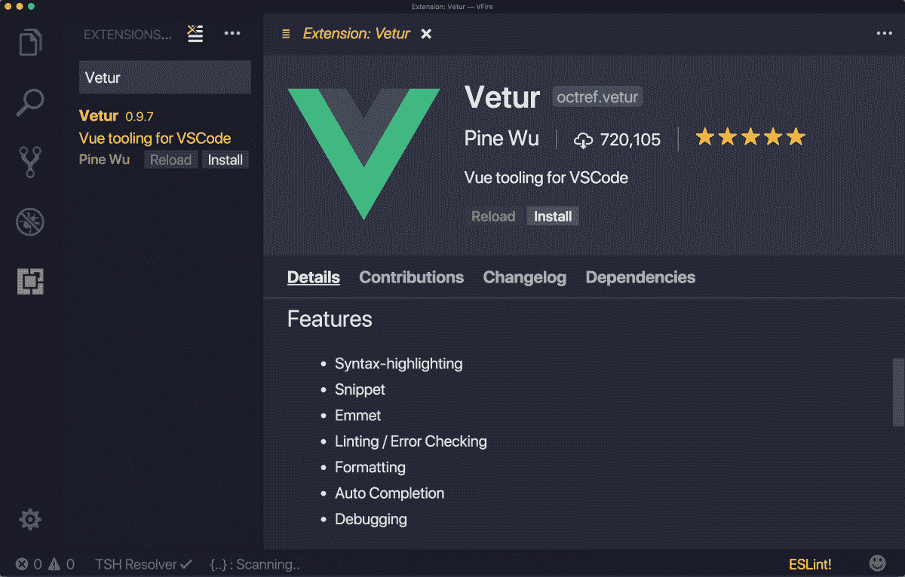
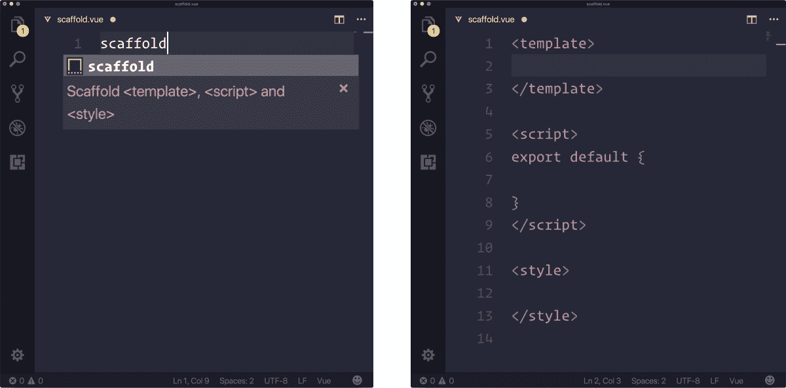
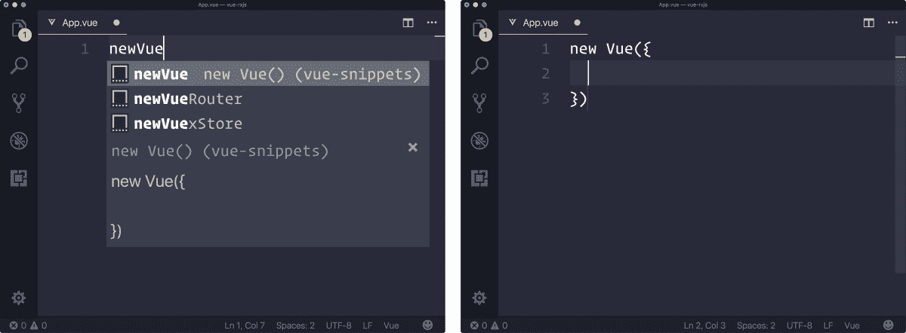
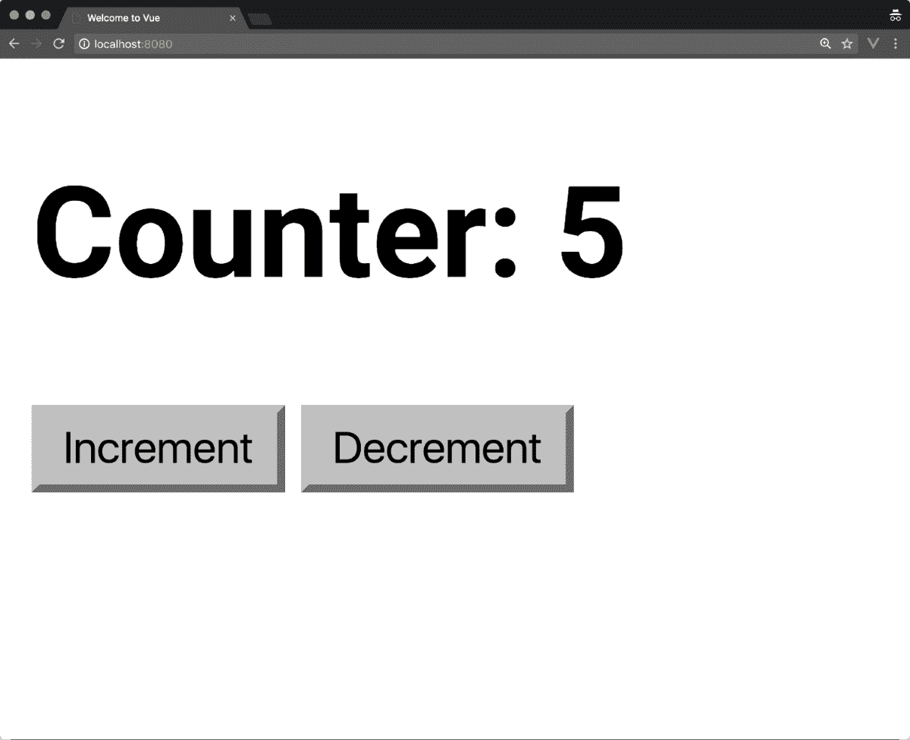
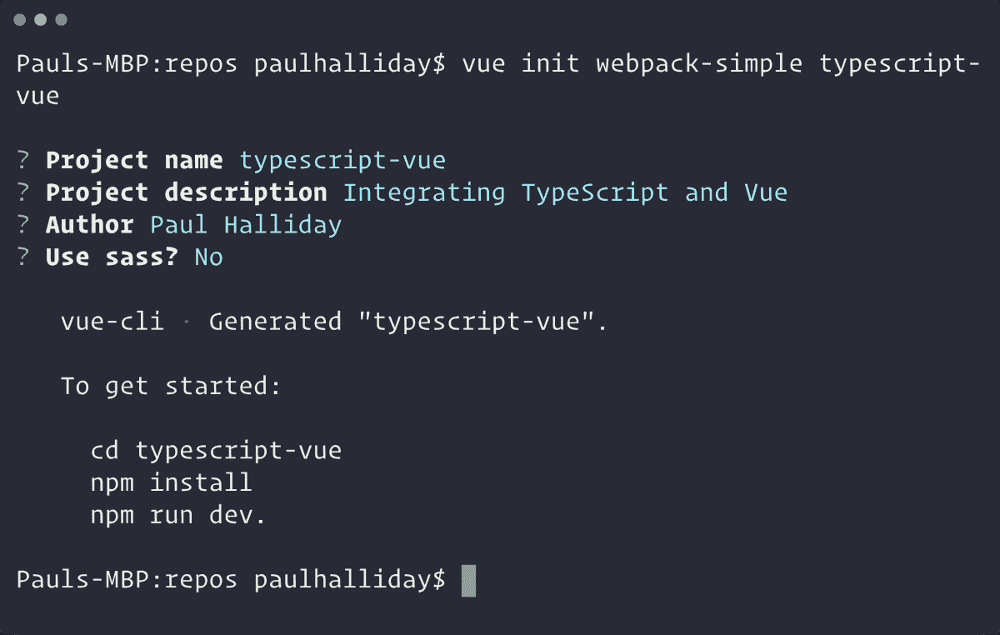
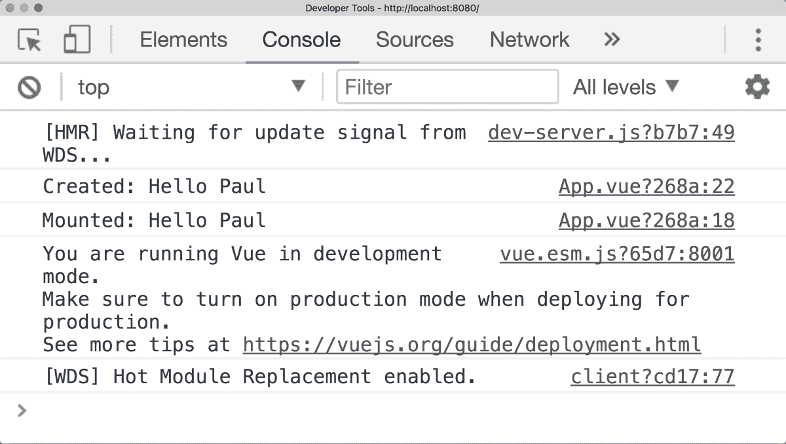
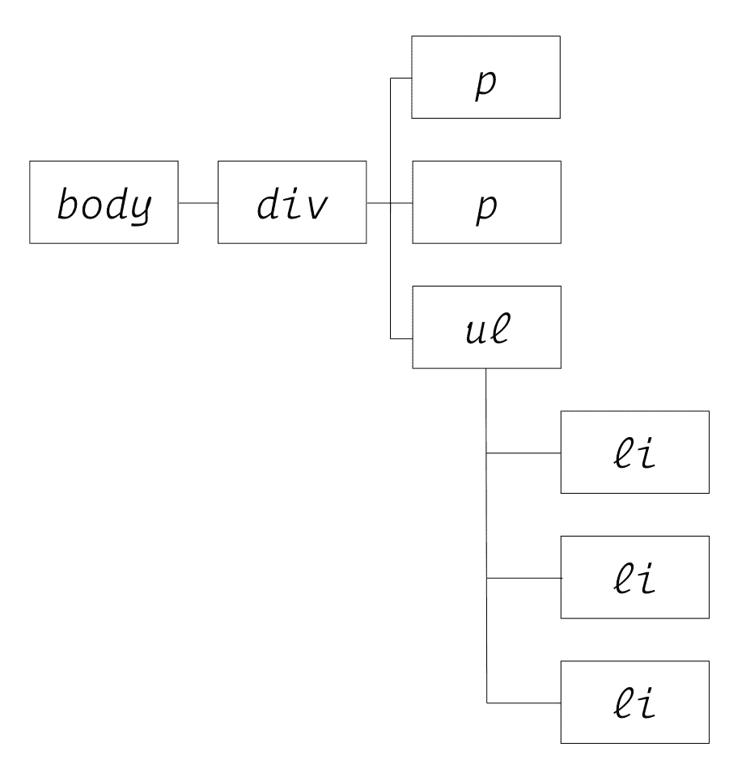
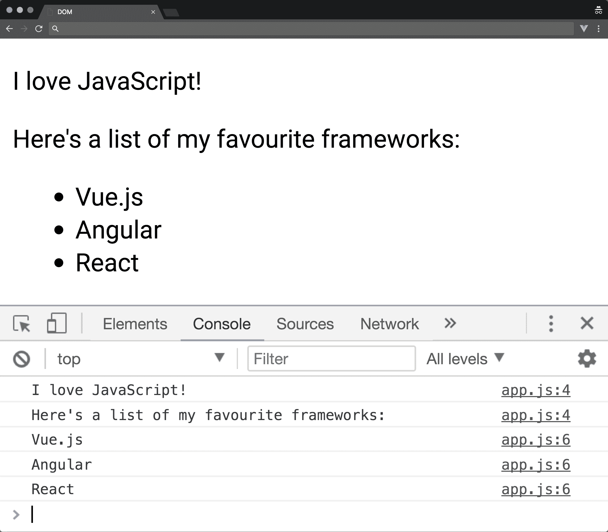

# 二、正确创建 Vue 项目

在本章中，我们将介绍如何创建可维护的 Vue 项目，以及如何利用许多可用的工具和模式。如果您目前没有在开发工作流程中最大限度地利用这些东西，您可能会发现我们在本章中讨论的大多数概念都适用于其他技术。

在本章中，我们将了解以下内容：

*   Vue 开发工具
*   VisualStudio 代码扩展
*   打字脚本集成
*   与 RxJS 的反应性

# VisualStudio 代码扩展

我们的开发环境是应用开发的重要组成部分。使用 Visual Studio 代码创建 Vue 应用时，建议使用以下扩展：

*   维图尔
*   VUE2 代码段

让我们更详细地看看这两个。

# 维图尔

Vetur 由 Vue 语言服务器提供支持，并为我们提供语法高亮显示、Emmet（用于增强 HTML/CSS 工作流）、代码片段、linting、IntelliSense 等功能。这大大改善了我们的开发体验，并得到了广泛支持，GitHub 上有 1000 多颗星星。要安装扩展，请单击 Visual Studio 代码中的扩展图标并键入`Vetur`；从这里，您可以选择安装，它将自动用于整个项目：



Installing Vetur

这样，我们就可以访问代码片段，如`scaffold`，它生成一个新的空白模板、脚本和样式对象，供我们在 Vue 组件中使用：



Scaffolding a new Vue project

# VUE2 代码段

代码片段是应用开发的重要组成部分；与 Emmet 类似，它们允许我们在应用中快速构建通用模式。我们还将安装另一个 VisualStudio 代码扩展，它为我们提供了多种常用的代码片段，名为 Vue 2 snippets**。**

这使我们能够节省大量的时间，否则我们将不得不花在编写相同的样板代码上。举下一个例子；虽然本质上过于简单，但我们得到了对该片段的描述，点击*选项卡*后，它扩展为预定义的代码：



Taking advantage of Vue snippets

# Vue CLI

Vue**命令行界面**（**CLI**允许我们使用各种不同的模板选项快速构建新的 Vue 项目。目前，可用的模板选项包括 Webpack、Browserify 和渐进式 Web 应用功能等技术。

当然，我们可以创建自己的 Vue 应用并手动添加 Webpack 等工具，但这会造成技术开销，我们必须学习、构建和维护配置。Vue CLI 在维护一组选定的官方模板的同时为我们做到这一点，但并不限制我们修改生成的网页包配置。所有这些都使我们能够生成新的非专用 Vue 项目。

要开始使用 Vue CLI，请确保已安装它：

```js
npm install vue-cli -g
```

然后，我们可以使用 Vue`init`命令使用 Webpack 模板构建一个新的 Vue 项目：

```js
vue init webpack-simple my-vue-project
```

在输入上述命令时，我们应获得如下信息，如终端上所示：


Creating projects with Vue init

如果我们将其分解，我们实际上是在初始化一个新的 Vue 项目，该项目基于名为 my Vue project 的网页包简单模板。然后，我们被导航到一个向导过程，该向导过程要求我们提供有关项目的更多元数据。此元数据和配置将因您选择的模板而异。

让我们调查一下模板创建的文件和文件夹：

| **文件/文件夹** | **说明** |
| `src/` | 此文件夹包含我们的所有项目代码。我们将在 src 内花费大部分时间。 |
| `.bablrc` | 这是我们的 Babel 配置文件，允许我们编写 ES2015 并进行适当传输。 |
| `index.html` | 这是我们默认的 HTML 文件。 |
| `package.json` | 这保存了我们的依赖项和其他特定于项目的元数据。 |
| `webpack.config.js` | 这是我们的网页配置文件，允许我们使用`.vue`文件、Babel 等。 |

请注意，我们是如何不再处理`.js`文件的，现在我们的`src`目录中有`.vue`文件。Vue 文件被称为单个文件组件，它有一个模板、脚本和样式标记，允许我们仅将所有内容限定到该组件。

这是可能的，由于我们的网页模板，因为我们有一个自定义的“加载器”。这是怎么回事？在看这个之前，让我们快速绕过并回顾现代 JavaScript 构建系统。

# JavaScript 模块

为了创建可重用的模块化代码，我们的目标应该是在大多数情况下每个特性有一个文件。这使我们能够避免可怕的“意大利面代码”反模式，在这种模式中，我们有很强的耦合，很少分离关注点。继续面向面食的主题，解决方案是采用“Ravioli 代码”模式，使用更小、松散耦合、更易于使用的分布式模块。JavaScript 模块是什么样子的？

在 ECMAScript 2015 中，模块只是一个使用`export`关键字的文件，并允许其他模块随后导入该功能：

```js
// my-module.js
export default function add(x, y) {
 return x + y
}
```

然后我们可以从另一个模块`import``add`：

```js
// my-other-module.js
import { add } from './my-other-module'

add(1, 2) // 3
```

由于浏览器还没有完全跟上模块导入的步伐，我们经常使用工具来辅助捆绑过程。该领域的常见项目有 Babel、Bublé、Webpack 和 Browserify。当我们使用 Webpack 模板创建新项目时，它使用 Vue 加载程序将 Vue 组件转换为标准 JavaScript 模块。

# Vue 装载机

在我们的`./webpack-config.js`内，在标准`webpack-simple`模板内，我们有一个模块对象，允许我们设置加载程序；这告诉 Webpack 我们希望它在我们的项目中使用`.vue`文件：

```js
module: {
 rules: [{
  test: /\.vue$/,
  loader: 'vue-loader',
  options: {
   loaders: {}
  // other vue-loader options go here
 }
}]
```

为了实现这一点，Webpack 对与`.vue`匹配的任何内容运行正则表达式，然后将其传递给我们的`vue-loader`以转换为普通 JavaScript 模块。在这个简单的例子中，我们正在加载扩展名为`.vue`的文件，但是`vue-loader`可以进一步定制，您可能需要进一步研究（[https://goo.gl/4snNfD](https://goo.gl/4snNfD) ）。我们当然可以自己进行配置，但希望您能看到使用 Vue CLI 生成 Web 包项目的好处。

# 在没有网页包的情况下加载模块

虽然 Webpack 在很多方面帮助我们，而不仅仅是加载一个模块，但我们现在可以在浏览器中本地加载 JavaScript 模块。它的性能往往比捆绑工具差（在编写本文时），但这可能会随着时间的推移而改变。

为了演示这一点，让我们转到终端，用一个基于简单模板的项目创建一个简单的计数器。此模板可以有效地启动新的 Vue 项目，而无需任何捆绑工具：

```js
# New Vue Project
vue init simple vue-modules

# Navigate to Directory
cd vue-modules

# Create App and Counter file
touch app.js
touch counter.js
```

然后，我们可以编辑我们的`index.html`以从`type="module"`添加脚本文件，这允许我们使用前面概述的导出/导入语法：

```js
<!-- index.html -->
<!DOCTYPE html>
<html>
<head>
 <title>Vue.js Modules - Counter</title>
 <script src="https://unpkg.com/vue"></script>
</head>
<body>
 <div id="app">
 </div>
 <script type="module" src="counter.js"></script>
 <script type="module" src="app/app.js"></script>
</body>
</html>
```

Warning: Ensure that your browser is up to date so that the preceding code can run successfully.

然后，在我们的`counter.js`内部，我们可以导出一个新的`default`对象，作为一个新的 Vue 实例。它作为一个简单的计数器，允许我们增加或减少一个值：

```js
export default {
 template: `
  <div>
   <h1>Counter: {{counter}}</h1>
   <button @click="increment">Increment</button>
   <button @click="decrement">Decrement</button>
  </div>`,
 data() {
  return {
   counter: 1
  };
 },
 methods: {
  increment() {
   this.counter++;
  },
 decrement() {
   this.counter--;
  }
 }
};
```

然后我们可以导入`app.js`中的`counter.js`文件，从而演示导入/导出模块的方法。为了让计数器显示在根 Vue 实例中，我们将计数器注册为该实例中的一个组件，并将模板设置为`<counter></counter>`，组件名称：

```js
import Counter from './counter.js';

const app = new Vue({
 el: '#app',
 components: {
  Counter
 },
 template: `<counter></counter>`
});
```

在本书的后续章节中，我们将更详细地介绍这一点，但此时您需要知道的是，它实际上充当了另一个 Vue 实例。当我们在实例中注册组件时，我们只能从该实例访问该组件。

令人惊叹的以下是我们模块导入/导出的结果：



Vue.js Modules

在下一节中，我们将更深入地了解 Vue 应用的调试，以及 Vue devtools 在其中扮演的角色。

# VueJS 开发工具

能够准确地调试我们的应用是我们开发工作流程的一个重要部分。在上一章中，我们安装了 VueJS devtools，本节将更详细地介绍如何使用它。让我们做一个游乐场项目：

```js
# New project
vue init webpack-simple vue-devtools

# Change directory
cd vue-devtools

# Install dependencies
npm install

# Run application
npm run dev
```

然后，我们可以打开开发人员控制台并导航到 Vue 选项卡。当我们从组件列表中选择应用时，我们可以看到该组件的数据对象和其他信息。默认情况下，我们在模板中绑定了`msg`变量，我们可以在开发人员工具中看到这一点：


Inspecting a Vue instance

这是双向的-我们可以通过`$vm0.$data`访问这个 Vue 实例中的对象，将其范围限定为`msg`。要在控制台内查看，选择`<Root>`后`<App>`将显示`msg`0；在控制台内。我们可以更改此值，当 Vue 正在查看该值时，它将在屏幕上自动更改：


Editing Vue instance data from the console

注意我们的消息是如何变为`"Hello Vue Devtools!"`；如果我们有多个 Vue 实例，则会有其他带前缀的 Vue 版本，其中有`$vm1`、`$vm2`等等。在本书的后面部分，当我们开始使用`Vuex`时，我们将经常使用它。接下来，让我们看看如何将 TypeScript 集成到 VUE 项目中。这对于有角度背景的人或任何希望利用静态键入的人来说都很有用。

# TypeScript 和 Vue

您可能在过去使用过 TypeScript，或者您可能对如何利用 TypeScript 在 Vue 项目中提供的额外工具感到好奇。为什么要使用打字脚本？Gao 等人最近的一项研究发现，TypeScript/静态类型化工具将提交的 bug 减少了 15%（[https://goo.gl/XUTPf4](https://goo.gl/XUTPf4) ）。

如果您以前使用过 Angular，那么这种语法应该让您感到宾至如归，因为我们将使用 decorator 和 ES2015 类。让我们研究如何将 TypeScript 添加到使用 Vue CLI 构建的项目中：

```js
# Create a new Vue project
vue init webpack-simple typescript-vue

# Change directory
cd typescript-vue

# Install dependencies
npm install
```

您应该在终端上获得以下输出：



如果我们导航到我们的项目目录并按照说明运行`npm install`，那么我们需要安装 TypeScript 加载程序并编辑我们的网页配置。这允许我们在项目内部加载`.ts`文件，因为我们使用了`webpack-simple`模板，所以只需安装加载程序并进行一些更改即可。同时，我们还可以将 TypeScript 安装到项目中：

```js
# Install TypeScript and the TypeScript Loader
npm install typescript ts-loader --save-dev

```

然后，我们需要对网页包配置进行一些更改，以添加新的加载程序。默认情况下启用热模块替换，因此加载后无需刷新以查看任何更改。

Remember to run the project from the command line, and type `npm dev`.

我们需要将我们的入口点更改为`main.ts`（随后将其重命名），并定义`ts-loader`并删除`babel-loader`来完成此操作，并编辑`webpack.config.js`文件，粘贴以下内容：

```js
var path = require('path');
var webpack = require('webpack');

module.exports = {
 entry: './src/main.ts',
 output: {
 path: path.resolve(__dirname, './dist'),
 publicPath: '/dist/',
 filename: 'build.js'
 },
 module: {
 rules: [
 {
 test: /\.vue$/,
 loader: 'vue-loader',
 options: {
 loaders: {}
 }
 },
 {
 test: /\.tsx?$/,
 loader: 'ts-loader',
 exclude: /node_modules/,
 options: {
 appendTsSuffixTo: [/\.vue$/]
 }
 },
 {
 test: /\.(png|jpg|gif|svg)$/,
 loader: 'file-loader',
 options: {
 name: '[name].[ext]?[hash]'
 }
 }
 ]
 },
 resolve: {
 extensions: ['.ts', '.js', '.vue'],
 alias: {
 vue$: 'vue/dist/vue.esm.js'
 }
 },
 devServer: {
 historyApiFallback: true,
 noInfo: true
 },
 performance: {
 hints: false
 },
 devtool: '#eval-source-map'
};

if (process.env.NODE_ENV === 'production') {
 module.exports.devtool = '#source-map';
 // http://vue-loader.vuejs.org/en/workflow/production.html
 module.exports.plugins = (module.exports.plugins || []).concat([
 new webpack.DefinePlugin({
 'process.env': {
 NODE_ENV: '"production"'
 }
 }),
 new webpack.optimize.UglifyJsPlugin({
 sourceMap: true,
 compress: {
 warnings: false
 }
 }),
 new webpack.LoaderOptionsPlugin({
 minimize: true
 })
 ]);
}
```

在此之后，我们可以在项目根目录中创建一个`tsconfig.json`，负责适当配置我们的 TypeScript 设置：

```js
{
 "compilerOptions": {
 "lib": ["dom", "es5", "es2015"],
 "module": "es2015",
 "target": "es5",
 "moduleResolution": "node",
 "experimentalDecorators": true,
 "sourceMap": true,
 "allowSyntheticDefaultImports": true,
 "strict": true,
 "noImplicitReturns": true
 },
 "include": ["./src/**/*"]
}
```

TypeScript 现在已经在我们的项目中设置好了，但是为了在我们的 Vue 应用中真正利用它，我们还应该使用`vue-class-component`。这使我们能够利用组件属性上的静态类型，并将组件定义为本机 JavaScript 类：

```js
# Install TypeScript helpers
npm install vue-class-component --save-dev
```

然后，我们可以通过首先将`App.vue`文件指定为具有`lang="ts"`属性的脚本来定义它。然后我们可以像往常一样导入 Vue，但除此之外，我们还从`vue-class-component`导入`Component`以用作此文件中的装饰器。这允许我们将其指定为新的 Vue 组件，并使用组件装饰器定义属性、模板等。

在我们的组件装饰器中，我们指定了一个带有输入框和按钮的模板。这个例子让我们了解如何绑定到类属性，以及如何从类中调用方法。以下代码应替换`App.vue`文件中已有的代码：

```js
<script lang="ts">
import Vue from 'vue';
import Component from 'vue-class-component';

@Component({
 template: `
 <div>
   <input type="text" v-model="name" />
   <button @click="sayHello(name)">Say Hello!</button>
</div>
`
})
export default class App extends Vue {
 name: string = 'Paul';

 sayHello(name: string): void {
   alert(`Hello ${name}`)
 }
}
</script>
```

运行上述代码后，您应该会得到如下结果：


# 生命周期挂钩

生命周期挂钩，如`created()`、`mounted()`、`destroyed()`等，可以定义为类内的函数。

*   `created()`

这允许在将组件添加到 DOM 之前对其执行操作。使用这个钩子可以访问数据和事件。

*   `mounted()`

Mounted 允许在呈现组件之前以及呈现组件之后访问组件。它提供了与 DOM 和组件交互的完全访问权限。

*   `destroyed()`

连接到组件的所有内容都已被销毁。当组件从 DOM 中删除时，它允许清理组件。

在没有打字脚本的情况下，它们将被识别并以与预期相同的方式工作。下面是一个使用`created`和`mounted`挂钩的示例：

```js
// Omitted
export default class App extends Vue {
 name: string = 'Paul';

 created() {
 console.log(`Created: Hello ${this.name}`)
 }

 mounted() {
 console.log(`Mounted: Hello ${this.name}`);
 }
}
```

现在，如果我们转到控制台，我们可以看到“Hello”的消息以 Paul 的名字输出：



# 性质

我们已经了解了如何创建类和使用组件装饰器；现在让我们来看看如何使用`vue-property-decorator`在类中定义“道具”：

```js
# Install Vue Property Decorator
npm install vue-property-decorator --save-dev
```

这取决于`vue-class-component`，所以无论何时我们安装`vue-property-decorator`您都需要确保`vue-class-component`也已安装。然后让我们使用`@Prop`装饰器定义`Component`属性：

```js
<script lang="ts">
import Vue from 'vue';
import { Component, Prop } from 'vue-property-decorator';

// Omitted
@Component({
})
export default class App extends Vue {
@Prop({ default: 'Paul Halliday' }) name: string;
}
</script>
```

注意我们现在是如何从`'vue-property-decorator'`而不是`vue-class-component`导入`Component`。这是因为它将此作为模块导出，供我们导入。然后，我们用 name 键和`default`值`'Paul Halliday'`定义一个新的组件属性；在使用 TypeScript 之前，它应该如下所示：

```js
export default {
 props: {
 name: {
  type: String,
  default: 'Paul Halliday'
  }
 }
}
```

# 计算

计算属性允许传递多个表达式，Vue 实例上的这些属性需要使用类 getter/setter。因此，如果我们想要检索名称的反向版本，我们可以简单地传递以下内容：

```js
@Component({
 template: `
   <div>
     <input type="text" v-model="name" />
     <button @click="sayHello(name)">Say Hello!</button>
     <p>{{nameReversed}}</p>
   </div>
 `
})
export default class App extends Vue {
 @Prop({ default: 'Paul Halliday' }) name: string;

 // Computed values
 get nameReversed() {
  return this.name.split("").reverse().join("");
 }

 sayHello(name: string): void {
  alert(`Hello ${name}`)
 }
}
```

否则，这相当于：

```js
export default {
 computed: {
  nameReversed() {
   return this.name.split("").reverse().join("");
  }
 }
}
```

可以使用其他装饰物，如`@Watch`、`@Inject`、`@Model`和`@Provide`。每个 decorator 都允许一致的实现，并提供与 vanilla Vue 实例类似的 API。在下一节中，我们将研究如何使用 RxJS 增强 Vue 应用的反应性。

# RxJS 和 Vue

如果你来自一个有棱角的背景，你很可能会对 RxJS 的基本概念有一种宾至如归的感觉。这意味着我们通常要处理一些事情，比如观察对象、主体和各种操作符。如果您以前没有使用过 RxJS，不用担心——我们将调查 RxJS 是什么，以及为什么要在 Vue 中使用它。

# 什么是 RxJS？

如果我们查看 RxJS 文档，我们会看到以下定义：**ReactiveX 是一个库，用于使用可观察序列*（[组合异步和基于事件的程序 http://reactivex.io/intro.html](http://reactivex.io/intro.html) ）。乍一看，这并不是一个让我们在项目中使用它感到舒服的描述。*

 *RxJS 帮助我们在应用内部使用反应式编程原则，通常被称为更具声明性的风格，而不是命令式。当我们谈论命令式编程风格时，我们通常会告诉计算机如何执行特定任务的确切步骤。声明式风格允许我们更多地关注预期结果，而不是实现。

在 JavaScript 中，我们可以使用以下方法创建一个`event`流：

```js
document.addEventListener('click', event => {
 console.log(event);
 }); 
```

这样我们就可以观察文档上的任何鼠标点击。我们可以捕获诸如单击坐标、目标、事件类型等内容。显然，这是一个异步可观测数据流。我们不知道什么时候会有人点击屏幕，我们也不在乎。我们所做的就是在事件发生时观察并执行特定的动作。

我们可以使用 RxJS 来采用这些相同的原则，并将其应用到我们的现代应用中，在这些应用中，一切都是一个流。我们可以有一个可观察的数据流，从 Facebook 提要到文档点击事件、计时器，任何东西！一切都可以是一条小溪。

# 与 Vue 集成

要将 RxJS 与 Vue 集成，我们需要创建一个新的 Vue 项目，并安装 RxJS 和 Vue Rx。使用 Vue Rx 插件的一个好处是它得到了 Vue.js 团队的正式支持，这让我们相信它将得到长期支持。

让我们使用 Vue CLI 创建一个新项目，并集成 RxJS：

```js
# New Vue project
vue init webpack-simple vue-rxjs

# Change directory
cd vue-rxjs

# Install dependencies
npm install

# Install rxjs and vue-rx
npm install rxjs vue-rx

# Run project
npm run dev
```

我们现在需要告诉 Vue 我们想使用`VueRx`插件。这可以使用`Vue.use()`来完成，并且不特定于此实现。每当我们希望向我们的 Vue 实例添加新插件时，调用`Vue.use()`会对插件的`install()`方法进行内部调用，用新功能扩展全局范围。要编辑的文件将是我们的`main.js`文件，位于`src/main.js`。我们将在本书后面几章中更详细地介绍插件：

```js
import Vue from "vue";
import App from "./App.vue";
import VueRx from "vue-rx";
import Rx from "rxjs";

// Use the VueRx plugin with the entire RxJS library
Vue.use(VueRx, Rx);

new Vue({
 el: "#app",
 render: h => h(App)
});
```

注意到前面的实现有什么问题吗？好的，为了应用性能和减少捆绑包大小，我们应该只导入我们需要的东西。这就变成了：

```js
import Vue from "vue";
import App from "./App.vue";
import VueRx from "vue-rx";

// Import only the necessary modules
import { Observable } from "rxjs/Observable";
import { Subject } from "rxjs/Subject"; 

// Use only Observable and Subject. Add more if needed.
Vue.use(VueRx, {
Observable,
Subject
});

new Vue({
el: "#app",
render: h => h(App)
});
```

然后，我们可以在 Vue 应用内部创建一个`Observable`数据流。让我们转到`App.vue`，从 RxJS 导入必要的模块：

```js
// Required to create an Observable stream
import { Observable } from 'rxjs/Observable';
import 'rxjs/add/observable/of';
```

然后我们可以创建一个新的`Observable`数据；在本例中，我们将使用一个简单的人员数组：

```js
// New Observable stream of string array values
const people$ = Observable.of(['Paul', 'Katie', 'Bob']);
```

这样我们就可以从 subscriptions 对象中订阅这个`Observable`。如果您以前使用过 Angular，这允许我们访问与异步管道类似的`Observable`（并处理必要的取消订阅）：

```js
export default {
  data () {
    return {
      msg: 'Welcome to Your Vue.js App'
    }
  },
  /**
   * Bind to Observable using the subscriptions object.
   * Allows us to then access the values of people$ inside of our template.
   * Similar to the Async pipe within Angular
   **/
  subscriptions: {
    people$
  }
}
```

除此之外，如果我们想为每个组件创建`Observable`的新实例，我们可以将订阅声明为函数：

```js
 subscriptions() {
   const people$ = Observable.of(['Paul', 'Katie', 'Bob'])
   return {
     people$
   }
 }
```

最后，我们可以在模板内部显示`Observable`的结果。我们可以使用`v-for`指令迭代数组并在屏幕上显示结果。这是怎么回事？在下面的例子中，`v-for`语法使用`item in items`语法，在我们的上下文中可以认为是`person in people$`。这允许我们通过插值绑定访问`people$`可观测（或任何其他数组）中的每个项目：

```js
<template>
  <div id="app"> 
    <ul>
      <li
        v-for="(person,index) in people$":key="index"> {{person}}
      </li>
    </ul>
  </div>
</template>
```

正如您在浏览器内部看到的，我们的三个项目现在出现在列表项目内的屏幕上：


Iterating over RxJS Observables

# 总结

在本章中，我们介绍了如何利用 Vue CLI 构建具有适当捆绑配置和 ES2015 支持的新 Vue 项目。我们已经看到，这不仅给了我们额外的力量，而且从长远来看，它还为我们节省了大量的时间。我们不必记住如何创建网页包或 Babel 配置，因为这都是由初学者模板为我们处理的；但即使如此，如果我们想添加额外的配置选项，我们也可以。

然后，我们研究了如何使用 Webpack 和`ts-loader`实现 TypeScript，以及如何利用属性装饰器的常见 TypeScript 和 Vue 模式。这使我们能够利用核心工具，帮助减少代码中的错误。

最后，我们还在应用中实现了 RxJS 和 Vue Rx，以利用可观察模式。如果您对在项目中使用 RxJS 感兴趣，这是未来集成的良好起点。

在下一章中，我们将更深入地了解 Vue.js 实例和不同的保留属性，例如数据、计算、ND 监视，以及创建 getter 和 setter。本章特别考虑何时应使用 computed 来使用或监视属性。

在本节中，我们将通过查看 Vue 如何处理 Vue.js 实例，来研究 Vue.js 实例如何在较低级别上工作。我们还将研究实例上的各种属性，如数据、计算、监视，以及使用每种属性时的最佳实践。此外，我们将研究 Vue 实例中可用的各种生命周期挂钩，使我们能够在应用的各个阶段调用特定函数。最后，我们将研究**文档对象模型**（**DOM**）以及 Vue 实现虚拟 DOM 以提高性能的原因。

在本章结束时，您将：

*   更好地了解`this`关键字在 JavaScript 中的工作方式
*   了解 Vue 如何在 Vue 实例中代理`this`关键字
*   使用数据属性创建反应式绑定
*   使用计算属性根据数据模型创建声明性函数
*   使用监视的属性访问异步数据，并在计算属性的基础上构建
*   使用生命周期挂钩在 Vue 生命周期的特定阶段激活功能
*   调查 DOM 和虚拟 DOM，了解 Vue 如何将数据呈现到屏幕上

首先，让我们先看看这在 JavaScript 中是如何工作的，以及它如何与 Vue 实例中的上下文相关。

# 代理

到目前为止，您可能已经与 Vue 应用进行了交互，并在想：`this`是如何工作的？在研究 Vue.js 如何处理`this`之前，让我们先看看它在 JavaScript 中是如何工作的。

# “this”在 JavaScript 中的工作原理

在 JavaScript 中，`this`具有不同的上下文，从全局窗口上下文到 eval、newable 和函数上下文。由于默认上下文与全局范围相关，因此这是我们的窗口对象：

```js
/**
 * Outputting the value of this to the console in the global context returns the Window object
 */
console.log(this);

/**
 * When referencing global Window objects, we don't need to refer to them with this, but if we do, we get the same behavior
 */
alert('Alert one');
this.alert('Alert two');
```

根据我们在范围内的位置，这种情况的背景会发生变化。这意味着，如果我们有一个具有特定值的`Student`对象，例如`firstName`、`lastName`、`grades`等等，`this`的上下文将与对象本身相关：

```js
/**
 * The context of this changes when we enter another lexical scope, take our Student object example:
 */
const Student = {
 firstName: 'Paul',
 lastName: 'Halliday',
 grades: [50, 95, 70, 65, 35],
 getFullName() {
  return `${this.firstName} ${this.lastName}` 
 },
 getGrades() {
  return this.grades.reduce((accumulator, grade) => accumulator + grade);
 },
 toString() {
  return `Student ${this.getFullName()} scored ${this.getGrades()}/500`;
 }
}
```

当我们使用`console.log(Student.toString())`运行前面的代码时，我们得到：`Student Paul Halliday scored 315/500`，因为它的上下文现在的作用域是对象本身，而不是全局窗口作用域。

如果我们想在文档中显示这一点，我们可以这样做：

```js
let res = document.createTextNode(Student.toString());
let heading = document.createElement('h1');
heading.appendChild(res);
document.body.appendChild(heading);
```

请注意，对于前面的代码，我们再次不必使用`this`，因为全局上下文不需要它。

现在我们已经了解了`this`在基本级别上的工作原理，我们可以研究 Vue 代理`this`在实例中如何使与各种属性的交互更加容易。

# Vue 如何处理“此”

到目前为止，您可能已经注意到，我们可以使用`this`语法引用数据、方法和其他对象内部的值，但我们实例的实际结构是`this.data.propertyName`或`this.methods.methodName`；由于 Vue 代理实例属性的方式，所有这些都是可能的。

让我们来看看一个非常简单的 VUE 应用，它有一个实例。我们有一个`data`对象，它有一个`message`变量和一个名为`showAlert`的方法；Vue 如何知道如何使用`this.message`访问我们的警报文本？

```js
<template>
 <button @click="showAlert">
 Show Alert</button>
</template>

<script>
export default {
 data() {
  return {
   message: 'Hello World!',
  };
 },
 methods: {
  showAlert() {
   alert(this.message);
  },
 },
};
</script>
```

Vue 将实例属性代理到顶级对象，使我们能够通过该代理访问这些属性。如果我们将实例注销到控制台（在 Vue.js devtools 的帮助下），我们将得到以下结果：


Console logout

在前面的屏幕截图中要查看的关键属性是`message`和`showAlert`，这两个属性都是在我们的 Vue 实例上定义的，但在初始化时已代理到根对象实例。

# 数据属性

当我们向数据对象添加变量时，我们实际上是在创建一个被动属性，该属性在视图发生任何更改时都会更新视图。这意味着，如果我们有一个名为`firstName`的属性的数据对象，那么每次值更改时，该属性都会在屏幕上重新呈现：

```js
<!DOCTYPE html>
<html>
<head>
 <title>Vue Data</title>
 <script src="https://unpkg.com/vue"></script>
</head>
<body>
 <div id="app">
  <h1>Name: {{ firstName }}</h1>
  <input type="text" v-model="firstName">
 </div>

 <script>
 const app = new Vue({
  el: '#app',
  data: {
   firstName: 'Paul'
  }
 });
 </script>
</body>
</html>
```

这种反应性不适用于在数据对象之外创建 Vue 实例后添加到该实例的对象。如果我们有另一个例子，但这次包括将另一个属性（如`fullName`）附加到实例本身：

```js
<body>
 <div id="app">
  <h1>Name: {{ firstName }}</h1>
  <h1>Name: {{ name }}</h1>
  <input type="text" v-model="firstName">
 </div>

 <script>
 const app = new Vue({
  el: '#app',
  data: {
   firstName: 'Paul'
  }
 });
 app.fullName = 'Paul Halliday';
 </script>
</body>
```

即使此项位于根实例上（与我们的`firstName`变量相同），`fullName`也不是被动的，不会在任何更改后重新呈现。这不起作用，因为当 Vue 实例初始化时，它映射到每个属性，并向每个数据属性添加一个 getter 和 setter，因此，如果我们在初始化后添加一个新属性，它将缺少此属性，并且不是被动的。

Vue 如何实现反应性特性？目前，它使用`Object.defineProperty`为实例内部的项定义自定义 getter/setter。让我们在具有标准`get`/`set`功能的对象上创建我们自己的属性：

```js
 const user = {};
 let fullName = 'Paul Halliday';

 Object.defineProperty(user, 'fullName', {
  configurable: true,
  enumerable: true,
  get() {
   return fullName;
  },
  set(v) {
   fullName = v;
  }
 });

 console.log(user.fullName); // > Paul Halliday
 user.fullName = "John Doe";
 console.log(user.fullName); // > John Doe
```

由于观察者是使用自定义属性 setter/getter 设置的，因此在初始化后仅向实例添加属性是不允许反应的。这可能会在 Vue 3 中发生变化，因为它将使用较新的 ES2015+代理 API（但可能不支持较旧的浏览器）。

我们的 Vue 实例不仅仅是一个数据属性！让我们使用 computed 根据数据模型中的项创建反应性的派生值。

# 计算属性

在本节中，我们将查看 Vue 实例中的计算属性。这允许我们创建小型的声明性函数，这些函数根据数据模型中的项返回单个值。为什么这很重要？好吧，如果我们将所有逻辑都保存在模板中，那么我们的团队成员和未来的自己都必须做更多的工作来理解我们的应用的功能。

因此，我们可以使用计算属性大大简化模板，并创建可以引用的变量，而不是逻辑本身。它不仅仅是一种抽象；计算出的属性将被缓存，并且不会重新计算，除非依赖项已更改。

让我们创建一个简单的项目来了解这一点：

```js
# Create a new Vue.js project
$ vue init webpack-simple computed 

# Change directory
$ cd computed

# Install dependencies
$ npm install

# Run application
$ npm run dev
```

插值功能强大；例如，在我们的 Vue.js 模板中，我们可以使用一个字符串（例如，`firstName`）并使用`reverse()`方法将其反转：

```js
<h1>{{  firstName.split('').reverse().join('') }}</h1>
```

我们现在将展示我们的`firstName`的反向版本，因此 Paul 将成为 luaP。这样做的问题是，在模板中保留逻辑不是很实际。如果要反转多个字段，则必须在每个属性上添加另一个`split()`、`reverse()`和`join()`。为了使其更具声明性，我们可以使用计算属性。

在`App.vue`内部，我们可以添加一个新的计算对象，其中包含一个名为`reversedName`的函数；这需要我们反转字符串的逻辑，并允许我们将其抽象为包含逻辑的函数，否则会污染模板：

```js
<template>
 <h1>Name: {{ reversedName }}</h1>
</template>

<script>
export default {
 data() {
  return {
   firstName: 'Paul'
  }
 },
 computed: {
  reversedName() {
   return this.firstName.split('').reverse().join('')
  }
 }
}
</script>
```

然后，我们可以在 Vue.js devtools 中查看有关计算属性的更多信息：


Using devtools to display data

在我们的简单示例中，重要的是要认识到，虽然我们可以将其作为一种方法，但我们有理由将其保留为计算属性。计算属性会被缓存，并且不会重新呈现，除非它们的依赖关系发生变化，如果我们有一个更大的数据驱动应用，这一点尤为重要。

# 监视的属性

计算属性并不总是解决被动数据问题的答案，有时我们需要创建自己的自定义监视属性。计算属性只能是同步的，必须是纯的（例如，没有观察到的副作用），并返回一个值；这与监视属性形成直接对比，监视属性通常用于处理异步数据。

监视属性允许我们在数据更改时反应性地执行函数。这意味着，每当数据对象中的某个项发生更改时，我们都可以调用一个函数，并且我们可以将此更改后的值作为参数进行访问。让我们来看一个简单的例子：

Note: `Axios` is a library that will need to be added to the project. To do so, head to [https://github.com/axios/axios](https://github.com/axios/axios) and follow the installation steps provided.

```js
<template>
 <div>
  <input type="number" v-model="id" />
  <p>Name: {{user.name}}</p>
  <p>Email: {{user.email}}</p>
  <p>Id: {{user.id}}</p>
 </div>
</template>

<script>
import axios from 'axios';

export default {
 data() {
  return {
   id: '',
   user: {}
  }
 },
 methods: {
  getDataForUser() { 
   axios.get(`https://jsonplaceholder.typicode.com/users/${this.id}`)
 .then(res => this.user = res.data);
  }
 },
 watch: {
  id() {
   this.getDataForUser();
  }
 }
}
</script>
```

在本例中，每当文本框更改为新的`id`（1-10）时，我们都会得到关于该特定用户的信息，如下所示：


这将有效地监视`id`上的任何更改，并调用`getDataForUser`方法，检索有关此用户的新数据。

虽然监视属性确实有很多功能，但不应低估计算属性对性能和易用性的好处；因此，在可能的情况下，将计算属性置于监视属性之上。

# 生命周期挂钩

我们可以访问各种各样的生命周期挂钩，这些挂钩在创建 Vue 实例期间的特定点上触发。这些钩子的范围从创建之前的`beforeCreate`到实例之后的`mounted`、`destroyed`等等。

如下图所示，创建新的 Vue 实例会在实例生命周期的不同阶段触发功能。

我们将在本节中了解如何激活这些挂钩：


Vue.js instance lifecycle hooks

利用生命周期挂钩（[https://vuejs.org/v2/guide/instance.html](https://vuejs.org/v2/guide/instance.html) ）可以以与我们的 Vue 实例上的任何其他属性类似的方式完成。让我们来看看我们如何与每个钩子相互作用，从顶部开始；我将基于标准`webpack-simple`模板创建另一个项目：

```js
// App.vue
<template>
</template>

<script>
export default {
 data () {
   return {
    msg: 'Welcome to Your Vue.js App'
   }
 },
 beforeCreate() {
  console.log('beforeCreate'); 
 },
 created() {
  console.log('created');
 }
}
</script>
```

请注意，我们只是简单地将这些函数添加到实例中，而没有任何额外的导入或语法。然后，我们在控制台中得到两个不同的日志语句，一个在创建实例之前，一个在创建实例之后。我们实例的下一个阶段是`beforeMounted`和`mounted`挂钩；如果添加这些，我们将能够再次在控制台上看到一条消息：

```js
beforeMount() {
 console.log('beforeMount');
},
mounted() {
 console.log('mounted');
}
```

如果我们修改我们的模板，使其有一个按钮更新我们的一个数据属性，我们就可以启动一个`beforeUpdated`和`updated`挂钩：

```js
<template>
 <div>
  <h1>{{msg}}</h1>
  <button @click="msg = 'Updated Hook'">Update Message</button>
 </div>
</template>

<script>
export default {
 data () {
   return {
    msg: 'Welcome to Your Vue.js App'
   }
 },
 beforeCreate() {
  console.log('beforeCreate'); 
 },
 created() {
  console.log('created');
 },
 beforeMount() {
  console.log('beforeMount');
 },
 mounted() {
  console.log('mounted');
 },
 beforeUpdated() {
  console.log('beforeUpdated'); 
 },
 updated() {
  console.log('updated');
 }
}
</script>
```

每当我们选择`Update Message`按钮时，我们的`beforeUpdated`和`updated`都会触发。这允许我们在生命周期的这个阶段执行一项操作，只留下`beforeDestroy`和尚未覆盖的破坏。让我们向我们的实例添加一个按钮和一个调用`$destroy`的方法，允许我们触发适当的生命周期挂钩：

```js
<template>
  <div>
    <h1>{{msg}}</h1>
    <button @click="msg = 'Updated Hook'">Update Message
    </button>
    <button @click="remove">Destroy instance</button>
  </div>
</template>
```

然后我们可以将`remove`方法添加到我们的实例中，以及允许我们捕获适当钩子的函数：

```js
methods: {
  remove(){
   this.$destroy();
  }
},
// Other hooks
  beforeDestroy(){
  console.log("Before destroy");
},
  destroyed(){
  console.log("Destroyed");
}
```

当我们选择`destroy`实例按钮时，`beforeDestroy`和`destroy`生命周期挂钩将启动。这允许我们在销毁实例时清理任何订阅或执行任何其他操作。在现实场景中，生命周期控制应该由数据驱动的指令决定，例如`v-if`和`v-for`。我们将在下一章更详细地了解这些指令。

# Vue.js 和虚拟 DOM

在性能改进的主题上，让我们考虑 Vue.js 为什么广泛使用虚拟 DOM 来在屏幕上呈现元素。在研究虚拟 DOM 之前，我们需要对 DOM 实际上是什么有一个基本的了解。

# 多姆

DOM 用于描述 HTML 或 XML 页面的结构。它创建了一个树状结构，使我们能够在 JavaScript 中完成从创建、读取、更新和删除节点到遍历树和更多功能的所有操作。让我们考虑下面的 HTML 页面：

```js
<!DOCTYPE html>
<html lang="en">
<head>
 <title>DOM Example</title>
</head>
<body>
 <div&gt;
  <p>I love JavaScript!</p>
  <p>Here's a list of my favourite frameworks:</p>
  <ul>
   <li>Vue.js</li>
   <li>Angular</li>
   <li>React</li>
  </ul>
 </div>

 <script src="app.js"></script>
</body>
</html>
```

我们可以查看 HTML，看到我们有一个**div**、两个**p**、一个**ul**和**li**标签。浏览器解析此 HTML 并生成 DOM 树，该树在较高级别上类似于以下内容：



然后，我们可以通过`TagName`使用`document.getElementsByTagName()`与 DOM 交互以访问这些元素，并返回一个 HTML 集合。如果我们想映射这些集合对象，我们可以使用`Array.from`创建这些元素的数组。以下是一个例子：

```js
const paragraphs = Array.from(document.getElementsByTagName('p'));
const listItems = Array.from(document.getElementsByTagName('li'));

paragraphs.map(p => console.log(p.innerHTML));
listItems.map(li => console.log(li.innerHTML));
```

然后将每个项目的`innerHTML`记录到数组内部的控制台，从而显示如何访问 DOM 内部的项目：



# 虚拟 DOM

更新 DOM 节点在计算上非常昂贵，并且取决于应用的大小，这会大大降低应用的性能。虚拟 DOM 采用了 DOM 的概念，并为我们提供了一个抽象，它允许使用扩散算法来更新 DOM 节点。为了充分利用这一点，这些节点不再使用文档前缀进行访问，而是通常表示为 JavaScript 对象。

这允许 Vue 精确地计算出*什么*发生了变化，并且只在实际 DOM 中重新呈现与之前不同的项。

# 总结

在本章中，我们进一步了解了 Vue 实例，以及如何利用各种属性类型，如数据、观察者、计算值等。我们已经了解了`this`在 JavaScript 中的工作原理以及在 Vue 实例中使用它时的区别。此外，我们还研究了 DOM 以及 Vue 为什么使用虚拟 DOM 创建性能良好的应用。

总之，数据属性允许在模板中使用被动属性，计算属性允许我们使用模板和过滤逻辑并将其分离为可在模板中访问的性能属性，监视属性允许我们处理异步操作的复杂性。

在下一章中，我们将深入了解 Vue 指令，如`v-if`、`v-model`、`v-for`，以及如何使用它们创建功能强大的反应式应用。*