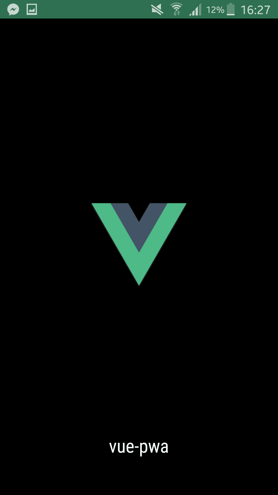
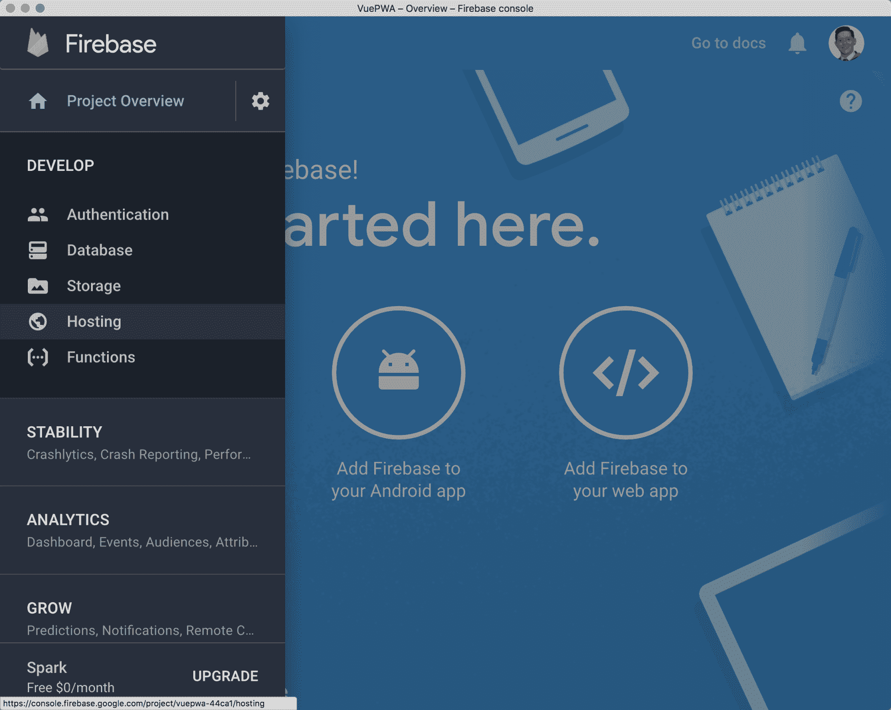
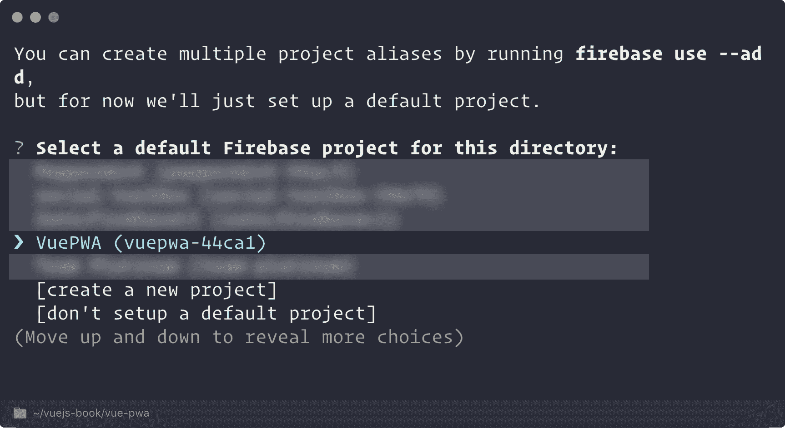
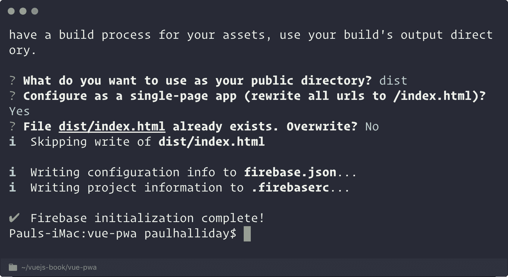
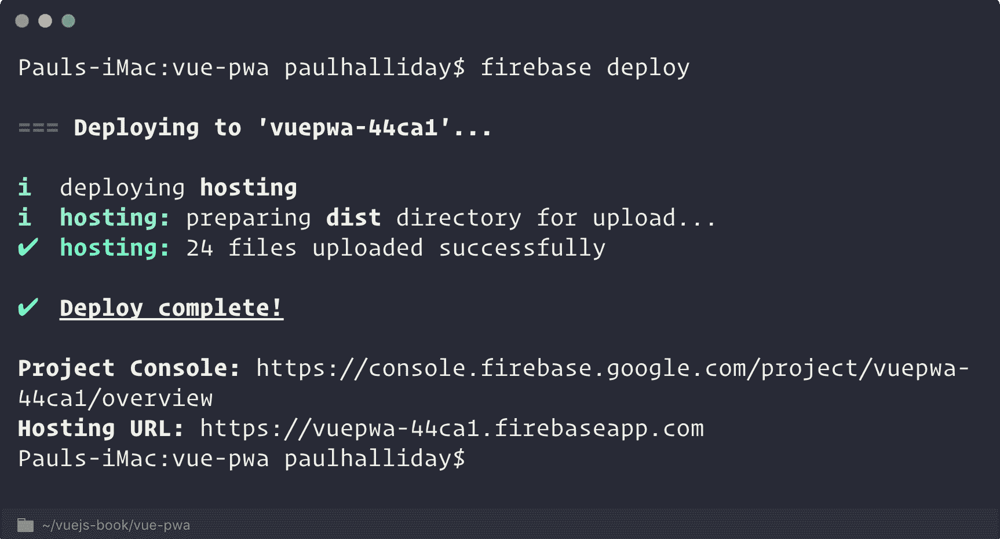
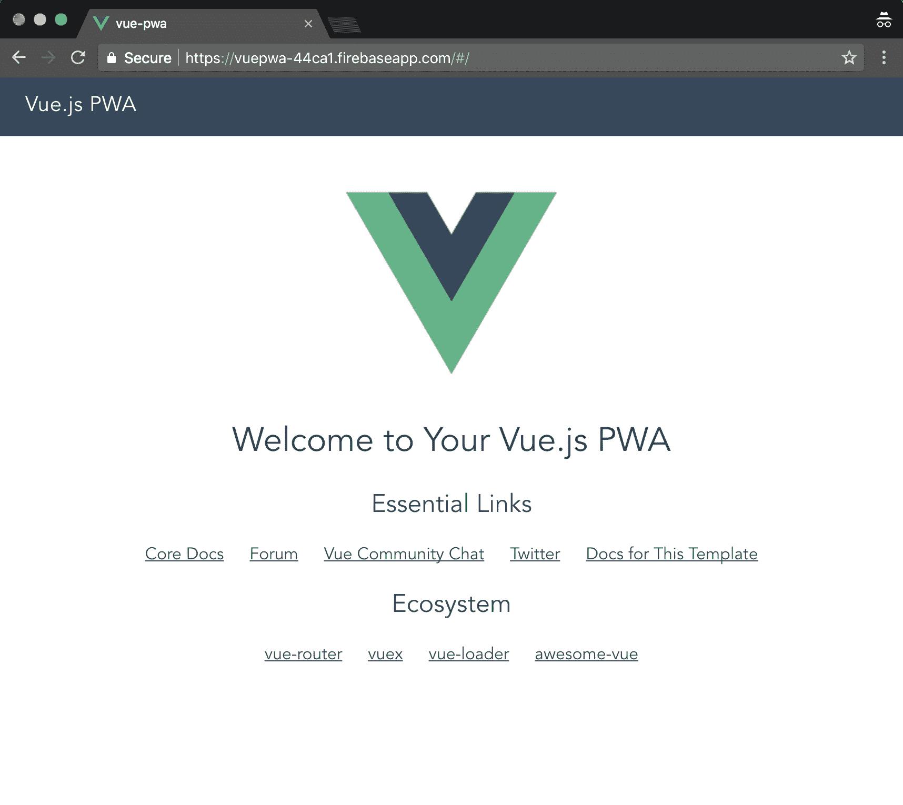
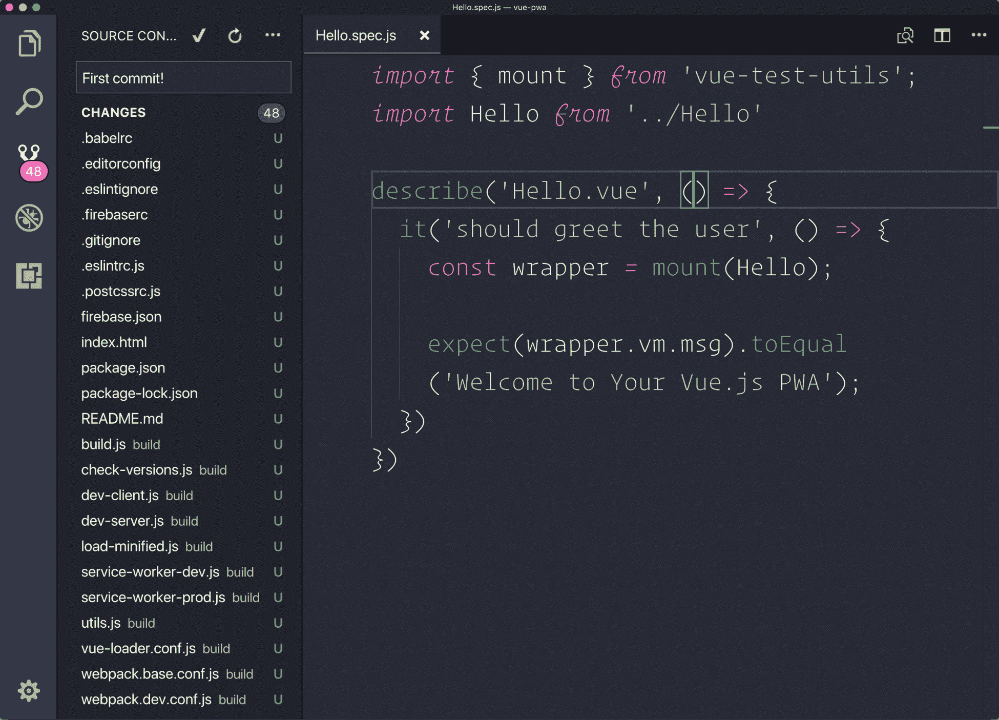
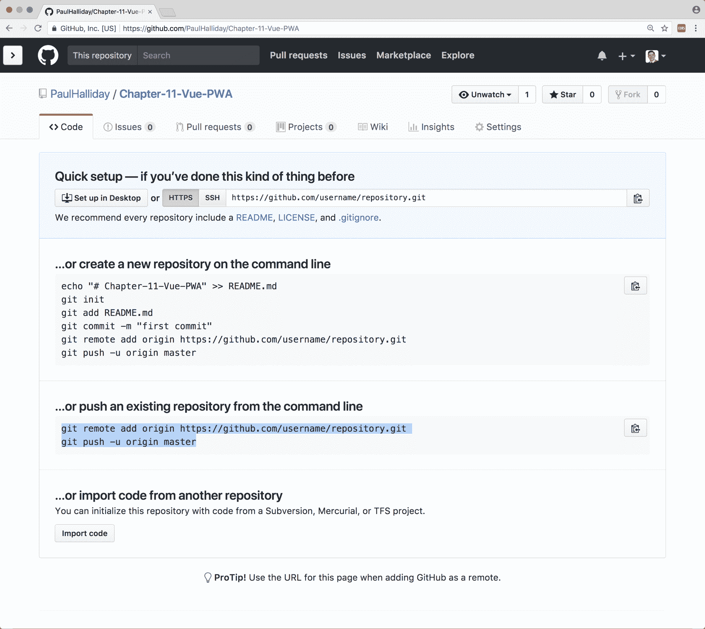
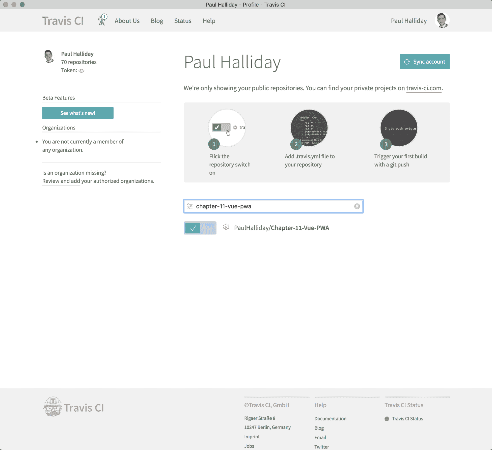

# 十一、优化

如果您多年来一直在编写针对 web 平台的应用，您将看到 web 经历了多少变化。一开始只是一个简单的文档查看器，现在我们不得不处理复杂的构建步骤、状态管理模式、性能和兼容性的持续审查，等等。

谢天谢地，JavaScript 和后续工具的流行意味着我们可以使用模板和经过测试的技术来优化应用和部署。

在本章中，我们将了解以下主题：

*   Vue CLI 中的`vue-pwa`模板
*   渐进式 Web 应用的功能
*   使用 ngrok 查看任何设备上的本地主机应用
*   使用 Firebase 托管部署 web 应用
*   持续集成及其对大型项目的意义
*   在每个 Git`commit`上自动运行测试
*   自动部署到每个 Git 上的 Firebase 主机`commit`

# 渐进式 Web 应用（PWAs）

PWA 可以定义为使用现代 web 的功能来提供周到、吸引人和交互式体验的应用。我对 PWAs 的定义包含了逐步增强的原则。我们当然可以利用 PWAs 提供的一切，但我们不必（或者至少不必一次全部利用）。

这意味着，随着时间的推移，我们不仅在不断改进应用，而且坚持这些原则迫使我们从互联网连接不良、想要离线第一体验、需要可访问主屏幕的应用等用户的角度来思考问题。

Vue CLI 再一次为我们简化了这一过程，因为它提供了一个 PWA 模板。让我们使用适当的模板创建一个新的 Vue 应用：

```js
# Create a new Vue project
$ vue init pwa vue-pwa

? Project name vue-pwa
? Project short name: fewer than 12 characters to not be truncated on homescreens (default: same as name) 
? Project description A PWA built with Vue.js
? Author Paul Halliday <hello@paulhalliday.io>
? Vue build runtime
? Install vue-router? Yes
? Use ESLint to lint your code? Yes
? Pick an ESLint preset Airbnb
? Setup unit tests with Karma + Mocha? No
? Setup e2e tests with Nightwatch? No

# Navigate to directory
$ cd vue-pwa

# Install dependencies
$ npm install

# Run application
$ npm run dev
```

在本章中，我们将看到此模板给我们带来的好处，以及使应用和操作更加进步的方法。

# Web 应用清单

你可能已经看到了使用 web 应用清单的应用的好处，如果你曾经在一个网站上要求你在主屏幕上安装这个，或者如果你注意到地址栏的颜色在 Android Chrome 上从默认的灰色变为不同的颜色，这是一个渐进的应用。

我们到`static/manifest.json`去调查一下内容：

```js
{
  "name": "vue-pwa",
  "short_name": "vue-pwa",
  "icons": [
    {
      "src": "/statimg/icons/android-chrome-192x192.png",
      "sizes": "192x192",
      "type": "img/png"
    },
    {
      "src": "/statimg/icons/android-chrome-512x512.png",
      "sizes": "512x512",
      "type": "img/png"
    }
  ],
  "start_url": "/index.html",
  "display": "standalone",
  "background_color": "#000000",
  "theme_color": "#4DBA87"
}
```

我们可以选择提交我们的申请`name`和`short_name`；安装在设备主屏幕上时，将显示这些信息。

`icons`阵列用于提供不同尺寸的图标，以实现跨设备的高清体验。`start_url`定义了安装在用户主屏幕上启动时要加载的文件，因此指向`index.html`。

我们可以使用 display 属性更改应用作为 PWA 在设备上运行时的显示方式。有多种可用选项，如`browser`、`standalone`、`minimal-ui`和`fullscreen`。每一个都会改变我们的应用在设备上的显示方式；[(https://developers.google.com/web/fundamentals/web-app-manifest/)](https://developers.google.com/web/fundamentals/web-app-manifest/)

以下是浏览器和单机版的示例：


Display options—the web app manifest

我们还可以利用`background_color`选项在 PWA 启动时更改启动屏幕背景的颜色，如以下屏幕截图所示：



如果我们想更改工具栏的颜色，我们可以使用`theme_color`选项（我们将在前进时看一个示例）。

您还可以将其他选项传递到 web 应用清单，您应该根据项目的需要自定义这些选项。您可以在[上找到有关 MDN 上的 web 应用清单的更多信息 https://developer.mozilla.org/en-US/docs/Web/Manifest](https://developer.mozilla.org/en-US/docs/Web/Manifest) 。

# 在设备上测试

如果我们想在设备上测试我们的应用而不必担心部署，我们可以使用一个工具，比如 ngrok，在本地主机和外部世界之间创建一个隧道。这允许我们在任何带有公共 URL 的设备上查看应用，一旦我们关闭连接，URL 和后续应用就会消失。

导航至[下载 ngrokhttps://ngrok.com/download](https://ngrok.com/download) 并遵循平台的安装步骤。

Ngrok 也可以通过`npm`输入来安装：

```js
npm install ngrok -g
```

由于我们的 Vue 应用在端口`8080`上运行，我们可以启动 ngrok 并告诉它从该端口服务。在安装了 ngrok 的终端中运行以下命令：

```js
$ ngrok http 8080
```

然后，我们在终端中得到以下结果：


然后，我们可以在任何设备上导航到此 URL，并在屏幕上看到以下结果：


这不更像是一种本土体验吗？现在，默认情况下，我们有一个彩色的地址/状态栏。在生产模式下，我们还可以通过`ServiceWorker`的力量获得更多。在深入讨论之前，让我们先看看如何使用 Firebase 将应用部署到更永久的 URL。

# 火基部署

Firebase 是 Google 提供的一个平台，它允许我们充分利用实时数据库、远程配置、推送通知等一切资源。对于我们的用例来说，可能更重要的是静态文件部署的潜力，这是我们将要利用的。

The platform has three different packages available, each offering different levels of service, with the first tier being free and then the following two tiers requiring payment.

导航至[开始 https://firebase.google.com](https://firebase.google.com) 点击登录，使用谷歌账号登录，然后点击右上角的 GO TO CONSOLE。

然后，我们可以通过在 Firebase 仪表板上选择+添加项目，然后选择项目名称和国家/地区来创建新的 Firebase 项目。

然后，我们将导航到 Project Overview，在这里我们可以选择将 Firebase 添加到我们的项目和其他各种选项中。我们正在寻找主机，因为我们对部署静态内容感兴趣。从左侧菜单中，单击主机：



我们将经常出现在这个屏幕上，因为它允许我们恢复部署以及查看其他使用指标。由于我们尚未进行第一次部署，因此屏幕将类似于以下内容：


如果我们单击 GET Start，我们将收到一条消息，说明我们需要下载 Firebase 工具。这是一个 CLI，允许我们从终端内部管理 Firebase 项目。

通过在终端中运行以下命令来安装 Firebase 工具：

```js
$ npm install firebase-tools -g
```

然后，我们可以按照托管向导的下一步中概述的步骤进行操作，但现在还不使用部署步骤。向导应如下所示：


让我们从在终端中运行以下命令登录 Firebase 控制台开始：

```js
$ firebase login
```

选择一个 Google 帐户并授予它相应的权限。然后应向您提供以下屏幕：


然后，我们可以在`vue-pwa`项目中初始化一个新的 Firebase 项目。在终端中运行以下命令：

```js
$ firebase init
```

此时，我们可以使用键盘导航到主机，并使用空格键选择主机。这将使圆圈变成绿色，并告诉 Firebase 我们希望在项目中设置主机。


然后，我们必须将本地项目与 Firebase 仪表板中的项目相匹配。从列表中选择先前创建的项目：



然后，它应向您询问与设置相关的问题，并按如下方式回答：



我们现在可以随意部署到 Firebase。我们需要为生产构建项目，以适当地生成包含应用内容的`dist`文件夹。让我们在终端中运行以下命令：

```js
$ npm run prod
```

然后，要部署到 Firebase，我们可以运行以下命令：

```js
$ firebase deploy
```

过一会儿，您应该会得到一个可导航的 URL，其中包含我们通过 HTTPS 提供的应用：



我们的 Firebase 仪表板也已更新，以反映我们的部署：


如果我们随后导航到 URL，则应按预期获取项目：



此外，由于我们使用生产版本构建应用，因此我们可以将其与 Wi-Fi 断开连接，或者选中开发人员工具中的脱机框。这样做之后，我们会发现我们的应用仍然按照预期运行，因为我们在所有生产构建上都有一个`ServiceWorker`运行。

# 持续集成（CI）

有多种 CI 平台可用，如 Travis、GitLab、Jenkins 和无数其他平台。每个平台通常都有一个共同的目标，即自动化部署和随之而来的挑战。

当然，我们可以部署站点，运行测试，并在不断增加的构建步骤中继续其他项目。这不仅是一个乏味的过程，而且给了我们很多犯错误的机会。此外，它还意味着必须为团队的每个成员记录每个步骤，文档必须保持最新，并且不能在整个组织中准确地扩展。

对于我们的示例，我们将使用 Travis CI，我想解决的第一个目标是自动运行单元测试。为此，我们需要在项目中进行一个或多个单元测试。

# 单元测试

我们在前一章中介绍了 Vue.js 应用的测试，因此，在每次推送新版本时自动运行测试不是很好吗？让我们在项目内部快速设置一些测试，并将其与 Travis 集成：

```js
# Install necessary dependencies
$ npm install jest vue-test-utils babel-jest vue-jest --save-dev
```

然后，我们可以添加一个运行`jest`的新脚本：

```js
{
  "scripts": {
    "test": "jest"
  }
}
```

接下来，将`jest`配置添加到您的`package.json`：

```js
"jest": {
  "moduleNameMapper": {
    "^@/(.*)$": "<rootDir>/src/$1"
  },
  "moduleFileExtensions": [
    "js",
    "vue"
  ],
  "transform": {
    "^.+\\.js$": "<rootDir>/node_modules/babel-jest",
    ".*\\.(vue)$": "<rootDir>/node_modules/vue-jest"
  }
}
```

最后，我们可以在`.babelrc`中更新我们的`babel`配置：

```js
{
  "presets": [
    ["env", {
      "modules": false,
      "targets": {
        "browsers": ["> 1%", "last 2 versions", "not ie <= 8"]
      }
    }],
    "stage-2"
  ],
  "plugins": ["transform-runtime"],
  "env": {
    "test": {
      "presets": [["env", { "targets": { "node": "current" } }]],
      "plugins": [ "istanbul" ]
    }
  }
}
```

然后，我们可以在`components/__test__/Hello.spec.js`内部进行样本测试，简单地检查数据内部的`msg`是否与字符串匹配：

```js
import { mount } from 'vue-test-utils';
import Hello from '../Hello';

describe('Hello.vue', () => {
  it('should greet the user', () => {
    const wrapper = mount(Hello);

    expect(wrapper.vm.msg).toEqual('Welcome to Your Vue.js PWA');
  })
})
```

正如预期的那样，我们可以运行`npm test`来执行我们的测试：


# 创建 Git 存储库

要使用与 Travis CI 的持续集成，我们需要将项目上传到 GitHub。如果您的机器上还没有 Git，请从[下载 https://git-scm.com/](https://git-scm.com/) 并随后在[创建 GitHub 账户 https://github.com](https://github.com) 。

在[为您的项目创建一个新的存储库 https://github.com/new](https://github.com/new) ，或通过点击屏幕右上角的+点击新建存储库按钮。

然后，我们可以为存储库命名，并将可见性设置为公共或私有：


单击 CreateRepository 按钮后，我们会看到各种各样的方法，可以将存储库上传到 GitHub。唯一的问题是我们还没有将我们的 PWA 项目变成 Git 存储库。

我们可以在 VisualStudio 代码或命令行中执行此操作。在 Visual Studio 代码中，单击“新建存储库”按钮。如果您刚刚安装了 Git，可能需要重新启动编辑器才能显示此按钮。这就是它在 VisualStudio 代码中的显示方式。


然后，我们可以使用一条简单的消息（如 First commit）进行新的提交，然后单击勾号：



然后，我们可以按照内部突出显示的步骤将这些更改推送到 GitHub 上的存储库……或者从下图中给出的命令行推送到现有存储库：



将来对存储库的任何更改都将推送到该远程存储库。这一点很重要，因为当我们创建 Travis 帐户时，它将自动访问我们所有的 GitHub 存储库。

# 连接到 Travis CI

让我们导航到[https://travis-ci.org/](https://travis-ci.org/) 然后单击 GitHub 登录。在授予 Travis 任何必要的权限后，您应该能够看到附加到您的帐户的存储库列表。我们可以告诉 Travis，我们希望它通过将开关拨到绿色来监视此存储库中的更改：



# 配置 Travis

接下来要做的事情是向我们的项目中添加一个合适的`.travis.yml`配置文件。这将告诉 Travis 每次将构建推送到 GitHub 时要做什么。因此，当我们使用 Travis 构建时，会发生两个不同的阶段：

*   Travis 在我们的项目中安装任何依赖项
*   Travis 运行构建脚本

我们可以连接到构建过程的各个阶段，例如`before_install`、`install`、`before_script`、`script`、`before_cache`、`after_success`、`after_failure`、`before_deploy`、`deploy`、`after_deploy`和`after_script`。所有这些相对来说都是不言自明的，但如果它看起来有很多需要接受的话，别担心，我们只会进入这些阶段中的一小部分。

让我们在项目的根目录中添加一个名为`.travis.yml`的文件，并一步一步地添加选项。我们可以从定义项目的语言开始，在使用 Node 时，后续的 Node 环境版本也可以：

```js
language: node_js
node_js: 
 - "9.3.0"
```

我选择的`node_js`版本与我的环境匹配（可通过`node -v`检查），但如果需要针对特定版本的节点（或多个版本），可以在此处添加它们。

接下来，让我们补充一下，我们只想触发`master`分支上的构建：

```js
branches: 
  only:
    - master
```

然后，我们需要告诉特拉维斯从`package.json`运行哪个脚本。由于要运行测试，我们将运行测试脚本：

```js
script:
  - npm run test
```

最后，让我们声明我们希望接收每个构建的电子邮件通知：

```js
notifications:
  email:
    recipients:
      - your@email.com
    on_success: always 
    on_failure: always
```

这为我们提供了以下文件：

```js
language: node_js
node_js: 
  - "9.3.0"

branches: 
  only:
    - master

script:
  - npm run build
  - npm run test

notifications:
  email:
    recipients:
      - your@email.com
    on_success: always 
    on_failure: always
```

如果我们随后将这些更改推送到存储库并与源代码同步，我们应该能够在 Travis 控制台运行测试时观察它。Travis 可能需要几分钟才能开始构建，如下所示，请耐心等待：


如果我们向下滚动到日志底部，您可以看到我们的项目是为产品和测试运行而构建的：


令人惊叹的现在，我们可以使用 Travis CI 运行测试并连接到构建过程的各个阶段。鉴于我们正在 Travis 上构建生产项目，我们应该能够自动将此构建部署到 Firebase。

让我们将`Hello.vue`组件更改为具有新消息（并使测试失败）：

```js
export default {
  name: 'hello',
  data() {
    return {
      msg: 'Welcome to Your Vue.js PWA! Deployed to Firebase by Travis CI',
    };
  },
};
```

# 自动部署到 Firebase

我们可以让 Travis 自动处理我们的部署，但我们需要一种方法让 Travis 访问我们的部署令牌。通过在终端中运行以下命令，我们可以为 CI 环境获取此令牌：

```js
$ firebase login:ci
```

再次登录您的 Google 帐户后，应在终端内为您提供一个令牌：

```js
 Success! Use this token to login on a CI server:

# Token here
```

暂时保留令牌，因为我们马上就需要它。

导航回 Travis CI 仪表板，然后转到项目的设置。在设置中，我们需要添加一个环境变量，然后可以在部署脚本中引用该变量。

添加`FIREBASE_TOKEN`环境变量，其值等于我们从终端获得的令牌：


然后，我们可以更新我们的`.travis.yml`文件，在我们的 CI 环境中安装 firebase 工具，如果一切顺利，则将它们部署到我们的 firebase 托管环境：

```js
language: node_js
node_js: 
  - "9.3.0"

branches: 
  only:
    - master

before_script: 
  - npm install -g firebase-tools

script:
  - npm run build
  - npm run test

after_success: 
  - firebase deploy --token $FIREBASE_TOKEN

notifications:
  email:
    recipients:
      - your@email.com
    on_success: always 
    on_failure: always
```

更改此文件后进行新的提交并同步存储库。这将触发 Travis 上的新构建，我们可以查看日志。

结果如下：


我们的部署失败**，因为我们的测试失败。**请注意，我们在 Firebase 上托管的应用完全没有改变。这是我们的意图，也是我们将部署步骤放在`after_success`中的原因，因为如果测试失败，我们很可能不希望将此代码推向生产。

让我们修复测试并将新的`commit`推送到存储库：

```js
import { mount } from 'vue-test-utils';
import Hello from '../Hello'

describe('Hello.vue', () => {
  it('should greet the user', () => {
    const wrapper = mount(Hello);

    expect(wrapper.vm.msg).toEqual('Welcome to Your Vue.js PWA! Deployed to Firebase by Travis CI');
  })
})
```

当我们所有的脚本都以 0（无错误）的退出代码通过时，`after_success`钩子被触发，将我们的项目推到 Firebase 宿主：


如果我们在适当的 URL 上检查应用，我们将看到一条更新的消息：


# 服务人员

在使用`vue-pwa`模板构建我们的生产应用时，它包括`ServiceWorker`。这本质上是一个在后台运行的脚本，允许我们利用离线优先方法、推送通知、后台同步等。

我们的应用现在还将提示用户在其主屏幕上安装应用，如下所示：


如果我们断开与 internet 的连接，我们也会获得离线的第一次体验，因为应用仍在继续运行。这是我们在使用`vue-pwa`模板时获得的主要好处之一，如果您想了解更多关于`ServiceWorker`的信息，并了解如何根据您的需要定制此模板，谷歌在[上有一个很棒的入门指南 https://developers.google.com/web/fundamentals/primers/service-workers/](https://developers.google.com/web/fundamentals/primers/service-workers/) 。

# 总结

在本章中，我们研究了 Vue CLI 中的 PWA 模板，随后研究了如何在应用继续增长时自动部署和测试应用。这些原则允许我们不断地确保我们每次都能花更多的时间开发特性，花更少的时间维护部署文档和完成基本任务。

在下一章中，我们将介绍 Nuxt，一个允许我们使用 Vue 创建服务器端渲染/静态应用的框架。Nuxt 还有一个有趣的基于文件夹的路由结构，它在创建 Vue 应用时为我们提供了很多功能。