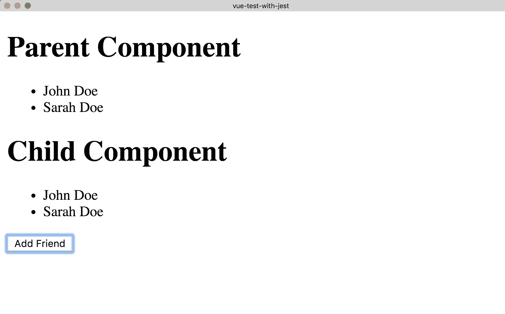
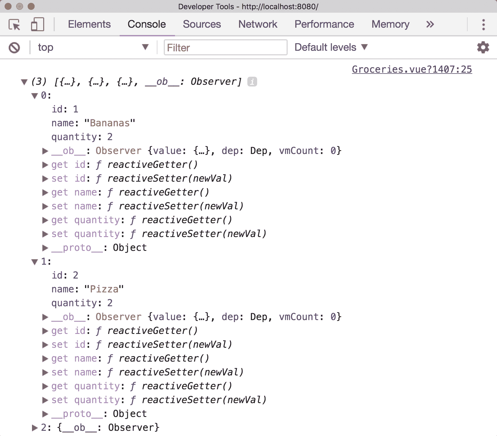

# 十三、模式

在本章中，我们将介绍 Vue.js 中的各种反模式，并从较高的层次回顾我们在本书中学习到的概念。我们将研究各种模式和反模式，以及如何编写跨团队和您自己的项目一致的代码。

在将任何东西定义为*模式*或*反模式*之前，读者必须准确地定义这两种模式。如果某种东西被认为是一种模式，这意味着在绝大多数情况下，这是一种推荐的做法。相反，如果我将其定义为反模式，那么在绝大多数情况下，它很可能不是推荐的做法。关于这方面的更多信息，可在[找到模式和指南的良好来源 https://github.com/pablohpsilva/vuejs-component-style-guide](https://github.com/pablohpsilva/vuejs-component-style-guide) 。

软件开发是一个固执己见的领域，有各种各样的方法来解决同一个问题，所以可能有一些意识形态被归类为你不同意的东西，这没关系。最终，每个团队都有自己的风格，但是开发人员应该尽可能地坚持减少摩擦和加快开发的模式。

在本章中，我们将学习以下主题：

*   Vue 项目中的常见模式和反模式
*   容器/呈现组件
*   如何编写可测试的 Vue.js 组件

# 组件

组件在 Vue 中进行通信的方式有很多，例如使用道具、事件和基于存储的场景。Vue 还允许我们访问`$parent`和`$children`对象，这允许我们与父/子组件交互。让我们看看这个，看看为什么不应该使用它。

# 通信-反模式

假设我们有一个熟悉的`TodoList`示例，在`TodoItem`组件中，我们希望能够完成特定的 Todo。如果我们希望将 TODO 保持在`TodoList`范围内，从而从`TodoItem`调用已完成的方法，我们可以这样做：

```js
export default {
  props: ['todo'],
  methods: {
    completeTodo(todo) {
      this.$parent.$options.methods.completeTodo(todo);
    }
  }
}
```

这是一个坏主意，原因很多，主要是因为我们将这两个组件紧密耦合在一起，并假设父组件上总是有一个`completeTodo`方法。

# 我们可以对此做些什么改变以使其更好？

我并不是说父/子组件不能通信，但您应该以灵活的方式设计组件。根据应用的结构使用事件或 Vuex 存储。下面是一个使用事件的示例：

```js
methods: {
  completeTodo(todo) {
    this.$emit('completeTodo', todo)
  }
}
```

# 儿童变异道具-反模式

重要的是，我们不会在子组件中修改道具。当道具传递给组件时，应将其视为真理的来源，因此，在子组件内更改值通常是不好的做法。但是，在一些特殊情况下，这样做可能是合适的，例如使用`.sync`修饰符实现双向数据绑定时。

如果我们使用上一个示例，并从子对象中更改 todos 道具，我们将在控制台中得到警告：

```js
methods: {
  completeTodo(todo) {
    this.todo = [{id: 1, name: 'Do the dishes.'}];
    this.$emit('completeTodo', todo)
  }
}
```

# 我们应该怎么做呢？

如果要在子组件中使用道具，最好将道具保存为`data`选项中的新变量。这样，您就可以在此组件本地对道具的新版本进行变异：

```js
export default {
  props: {
    age: {
      type: Number,
    }
  },
  data() {
    return {
      personAge: this.age
    }
  },
}
```

然后我们就可以进入并变异`personAge`，而不必担心任何副作用。创建可过滤搜索框时可以看到另一个示例，在该示例中，不直接修改道具，而是创建一个执行所需功能的`computed`属性：

```js
export default {
  props: {
    filter: {
      type: String,
    }
  },
  computed: {
    trimFilter() {
      return this.filter.trim().toLowerCase()
    }
  }
}
```

# 变异属性数组

在 JavaScript 中将数组和对象作为属性传递时，需要考虑的一个重要因素是它们是通过引用传递的。这意味着对子组件中原始数组的任何更改也将溢出到父组件中。让我们看看这一点：

```js
<template>
  <div>
    <h1>Parent Component</h1>
    <ul>
      <li v-for="friend in friendList" :key="friend.id">{{friend.name}}</li>
    </ul>

    <Person :friendList="friendList" />
  </div>
</template>

<script>
import Person from './components/Person';

export default {
  data() {
    return {
      friendList: [{ id: 1, name: 'John Doe' }]
    }
  },
  components: {
    Person
  }
}
</script>
```

这里，我们有一个组件（`App.vue`），它包含一个数组，我们在屏幕上显示该数组并将其传递给子组件。我们将在子组件内的屏幕上显示相同的数组，但也会给子组件一个按钮，以便将新项目添加到数组中：

```js
<template>
  <div>
    <h1>Child Component</h1>
    <ul>
      <li v-for="friend in friendList" :key="friend.id">{{friend.name}}</li>
    </ul>
    <button @click="addFriend">Add Friend</button>
  </div> 
</template>

<script>
export default {
  props: {
    friendList: {
      type: Array,
    }
  },
  methods: {
    addFriend() {
      this.friendList.push({ id: 2, name: 'Sarah Doe' })
    }
  }
}
</script>
```

当我们向好友列表中添加一个新人时，这是我们的结果：



然后，两个组件都有相同的数组！这不是我们想要的。如果出于某种原因，我们想采取这样的行动，最好保留一份好友列表的副本，并对其进行修改，如下所示：

```js
export default {
  props: {
    friendList: {
      type: Array,
    }
  },
  data() {
    return {
      fList: [...this.friendList]
    }
  },
  methods: {
    addFriend() {
      this.fList.push({ id: 2, name: 'Sarah Doe' })
    }
  }
}
```

# 使用数据作为对象-反模式

使用 Vue 创建组件时，数据选项必须是一个返回包含数据的新对象的函数，而不仅仅是一个普通数据对象。

如果只使用非函数的数据对象，则组件的所有实例将共享相同的数据。这是不好的，因为正如您可以想象的那样，组件的所有实例在任何时候更改时都将使用相同的数据进行更新。确保每个组件都能够管理自己的数据，而不是全面共享数据，这一点很重要。

让我们来看看这个问题：

```js
data: {
 recipeList: [],
 selectedCategory: 'Desserts'
}
```

我们可以通过执行以下操作来解决此问题：

```js
data () {
 return {
  recipeList: [],
  selectedCategory: 'Desserts'
 }
}
```

通过创建`return`语句，它允许创建的每个实例拥有自己的对象，而不是共享的对象。这样就可以多次使用代码，而不会与共享数据发生冲突。

接下来，让我们来看一下命名组件的最佳实践。

# 命名组件-反模式

用单个单词命名组件不是一个好主意，因为它有可能与本机 HTML 元素冲突。假设我们有一个注册表单和一个名为`Form.vue`的组件；在我们的模板中使用此名称时，合适的名称是什么？

正如您所想象的，名为`<form>`的组件将和`<form>`冲突，所以最好使用多个单词来命名组件。更好的示例可以是`signup-form`、`app-signup-form`或`app-form`的名称，具体取决于偏好：

```js
// This would not be an appropriate name as it conflicts with HTML elements.
Vue.component('form', Form)

// This is a better name as it's multi-word and there are less chances to conflict.
Vue.component('signup-form', Form)
```

# 模板表达式

通常，当我们在屏幕上显示项目时，我们可能需要计算值并调用函数来更改数据的外观。建议不要在模板内执行此操作，而是将其移出到`computed`属性中，因为这样更易于维护：

```js
// Bad 
<nuxt-link :to="`/categories/${this.category.id}`" class="card-footer-item">View</nuxt-link>

// Good
<nuxt-link :to="categoryLink" class="card-footer-item">View</nuxt-link>

export default {
  props: ['category'],
  computed: {
    categoryLink () {
      return `/categories/${this.category.id}`
    }
  }
}
```

这意味着模板中的任何更改都更容易处理，因为输出映射到计算属性。

# 模式–容器/表示组件

组件设计的一个重要部分是确保组件是可测试的。您应该将每个组件视为应用中的一个独立模块，可以根据需要进行切换；因此，它不应该与另一个组件紧密耦合。

最好的方法是在确保光耦合通过组件道具具有定义良好的公共 API，然后使用事件在父/子组件之间通信之后，确保组件是可测试的。这也有助于我们进行测试，因为我们能够更轻松地模拟组件。

遵循此模型时使用的常见模式是容器/表示组件。这意味着我们将所有业务逻辑和状态都保存在“容器”中，然后将状态传递给“表示”组件以在屏幕上显示。

如有必要，presentational 组件仍然可以使用事件与其他组件通信，但它不应该在入站道具之外修改或保持状态。这确保了我们的组件之间有一个通用的数据流，这意味着我们的应用更容易推理。

这里有一个明确命名的组件-`DogContainer.vue`：

```js
<template>
  <dog-presentational :dogName="dogName" @woof="woof"></dog-presentational>
</template>

<script>
import DogPresentational from './DogPresentational'

export default {
  data() {
    return {
      dogName: 'Coco',
    }
  },
  components: {
    'dog-presentational': DogPresentational
  },
  methods: {
    woof() {
      alert('Woof!');
    }
  },
}
</script>
```

容器组件已将狗的名称（以及任何其他项目）作为属性传递到表示组件中。容器组件也正在侦听此组件上名为`woof`的事件，并在发出该事件时通过调用`woof`方法来执行操作。以下是我们的演示部分：

```js
<template>
  <div>
    <h1>Name: {{dogName}}</h1>
    <button @click="woof">Woof</button>
  </div>
</template>

<script>
export default {
  props: ['dogName'],
  methods: {
    woof() {
      this.$emit('woof')
    }
  }
}
</script>
```

我们组件的关注点现在已明确分开，并且我们在它们之间有一条清晰的沟通路径。

此组合可以在下图中可视化：


Composing components

# 道具验证

虽然我们应该寻求通过道具在子组件之间进行通信，但在通过考虑类型、需求、默认值等来验证属性时，详细说明是很重要的。在整本书中，为了简洁起见，我混合使用了这两种技术，但在制作中，道具应该得到适当的验证。让我们先看一些属性类型的示例：

```js
export default {
  props: {
    firstName: {
      type: String
    },
    lastName: {
      type: String
    },
    age: {
      type: Number
    },
    friendList: {
      type: Array
    }
  },
}
```

我们还提供了各种其他类型，如布尔函数、函数或任何其他构造函数（即人员类型）。通过准确地定义我们期望的类型，这使我们（和我们的团队）能够更好地推理我们可以在这个组件中期望什么。

同时，我们还可以确保需要道具。这应在必要时进行，以确保无论何时使用组件，都不会丢失所需的道具：

```js
  props: {
    firstName: {
      type: String,
      required: true,
      default: 'John'
    },
    lastName: {
      type: String,
      required: true,
      default: 'Doe'
    }
  }
```

在可能的情况下，我们应该始终寻求为我们的道具提供默认值，因为这样可以减少必要的配置，但如果开发人员需要，仍然可以自定义组件。处理对象和数组时，函数用作默认参数，以避免实例共享相同值的问题。

```js
props: {
  firstName: {
    type: String,
    default: 'John'
  },
  lastName: {
    type: String,
    default: 'Doe'
  },
  friendList: {
    type: Array,
    default: () => [{ id: 1, name: 'Paul Halliday'}]
  }
}
```

我们也可以为我们的属性指定一个自定义的`validator`函数。假设我们有一个插槽`machine`组件，仅当用户`18`岁或更大时才渲染该组件：

```js
  props: {
    age: {
      type: Number,
      required: true,
      validator: value => {
        return value >= 18
      }
    },
  }
```

# 了解反应性

在前面的章节中，我们已经讨论了反应性以及如何使用反应性，但重新考虑这一点很重要。当我们在 Vue 中创建反应式数据对象时，它会获取每个属性，并使用`Object.defineProperty`添加适当的 getter/setter。这允许 Vue 处理对对象的更改并通知观察者，随后更新组件[https://vuejs.org/v2/guide/reactivity.html](https://vuejs.org/v2/guide/reactivity.html) 。这可以这样可视化：


Visualizing Reactivity

这意味着“数据”选项中定义的任何属性都是自动响应的。下面是一个例子：

```js
export default {
  data() {
    return {
      name: 'Vue.js'
    }
  }
}
```

`name`属性在此 Vue 实例内是反应性的，但如果我们要在 Vue 实例外添加另一个属性，这将不是反应性的。让我们来看一个例子：

```js
export default {
  data() {
    return {
      items: [
        { id: 1, name: 'Bananas'},
        { id: 2, name: 'Pizza', quantity: 2},
        { id: 3, name: 'Cheesecake', quantity: 5}
      ] 
    }
  },
}
```

我们的`groceries`组件有一个包含各种对象的 items 数组。除了`Bananas`对象之外，每个对象都有一个数量，但我们要为此设置数量。当使用`v-for`时，重要的是要包括`v-bind:key`（或缩写`:key`），因为它作为每个项目的唯一标识符，这样做允许重用和重新排序每个节点。虽然`key`可能是`v-for`的一个属性，但请记住它确实有其他用例场景。

```js
<template>
  <div>
    <ul>
      <li v-for="(item, index) in items" :key="item.id" @click="addQuantity(index)">
        {{item.name}} {{item.quantity}}
      </li>
    </ul>
  </div> 
</template>

<script>
export default {
  data() {
    return {
      items: [
        { id: 1, name: 'Bananas'},
        { id: 2, name: 'Pizza', quantity: 2},
        { id: 3, name: 'Cheesecake', quantity: 5}
      ] 
    }
  },
  methods: {
    addQuantity(selected) {
      this.items[selected].quantity = 1;
      console.log(this.items);
    }
  }
}
```

如果我们接着转到浏览器，继续使用开发工具访问`console`，我们可以看到数量已设置为保存对象的值。


请注意，当在数据对象内部定义数量时，数量对象中如何存在反应式 getter 和 setter。在事实之后向项添加属性意味着 Vue 不会添加适当的 getter/setter。如果我们想这样做，我们必须使用`Vue.set`来代替：

```js
methods: {
  addQuantity(selected) {
    const selectedItem = this.items[selected];
    this.$set(selectedItem, 'quantity', 2)
    console.log(this.items);
  }
}
```

这一次，实例中的每个属性都有 getter/setter：



# 总结

在这一章中，我们研究了反模式和模式，并且我们扩展了我们的知识，不仅了解了它们是什么，还了解了何时使用它们来符合最佳实践。不仅如此，我们还回顾了本章书中所学的许多概念，同时考虑了一些新的思想和技术，这些思想和技术可以用于未来。

回顾前面的章节，我们可以回过头来看看我们涵盖了多少领域。实践本书中介绍的技术将使您能够使用 Vue.js 创建可伸缩的应用，并在所学的基础上进行构建。另一件需要记住的重要事情是**web 开发一直在发展**，Vue 的*实际应用*数量在不断增长，您也应该*不断增长。*

接下来呢？尝试新事物！创建新项目，参加 Vue.js 会议-寻找新的方法来应用您的技能来教授他人。你不仅会对他人产生积极的影响，而且会重申你作为开发人员的技能。