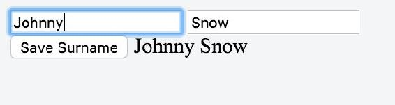
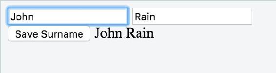
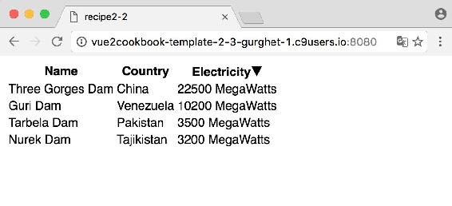
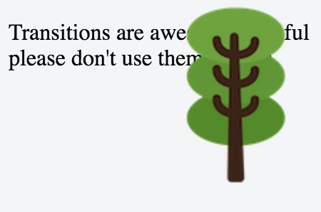
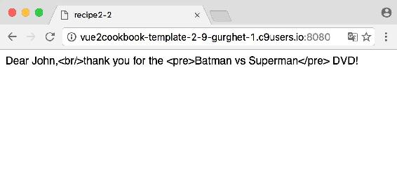
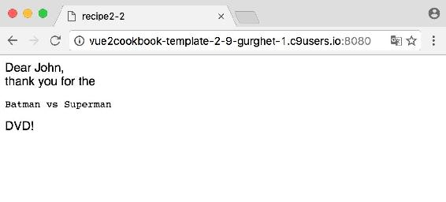
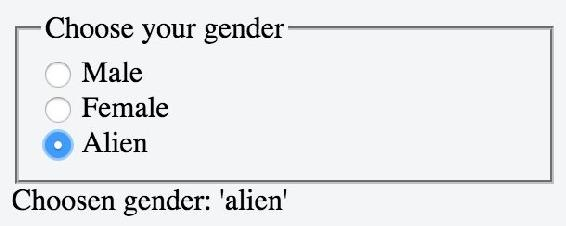
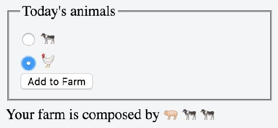

# 二、基本 Vue.js 功能

本章将介绍以下配方:

*   了解如何使用计算属性
*   使用计算属性过滤列表
*   使用计算属性对列表进行排序
*   使用筛选器设置货币格式
*   用筛选器设置日期格式
*   有条件地显示和隐藏元素
*   有条件地添加样式
*   用 CSS 转场给你的应用增加一些乐趣
*   输出原始 HTML
*   创建带有复选框的表单
*   创建带有单选按钮的表单
*   使用选择元素创建表单


# 介绍

在本章中，您将找到开发一个全功能、交互式、自包含的 Vue 应用所需的所有构件。在第一个配方中，您将创建计算属性，这些属性封装了您可以用来创建更具语义的应用的逻辑；然后，您将使用过滤器和`v-html`指令探索更多的文本格式。您将在条件呈现和转换的帮助下创建一个图形上吸引人的应用。最后，我们将构建一些表单元素，如复选框和单选按钮。

从现在开始，所有食谱都将由 ES6 独家编写。在撰写本文时，如果您正在使用 Chrome 9x 和 JSFiddle，它们应该可以无缝地工作；如果您正在将这段代码集成到一个更大的项目中，记得使用 Babel(更多信息，请查看[第 8 章](part0390.html#BJTRC0-d58460e0eb6644049f9e99e6566f895c)、*Organize+Automate+Deploy = web pack*中的*使用 Babel 从 ES6* 编译)。


# 了解如何使用计算属性

计算属性是 Vue 组件中的数据，它依赖于对其他更原始的数据的一些计算。当该原始数据是反应性的时，计算的属性是最新的并且本身是反应性的。在这个上下文中，原语是一个相对的术语。您当然可以基于其他计算属性来构建计算属性。


# 做好准备

在冒险准备这个食谱之前，一定要熟悉`v-model`指令和`@event`符号。如果您不确定，可以完成前一章中的*对点击和击键等事件的反应*配方。


# 怎么做...

一个简单的例子将阐明什么是计算属性:

```js
<div id="app"> 
  <input type="text" v-model="name"/> 
  <input type="text" id="surname" value='Snow'/> 
  <button @click="saveSurname">Save Surname</button> 
  <output>{{computedFullName}}</output> 
</div> 

let surname = 'Snow' 
new Vue({ 
  el: '#app', 
  data: { 
    name: 'John' 
  }, 
  computed: { 
    computedFullName () { 
      return this.name + ' ' + surname 
    } 
  }, 
  methods: { 
    saveSurname () { 
      surname = this.$el.querySelector('#surname').value 
    } 
  } 
})

```

运行这个示例将显示两个输入字段:一个用于姓名，一个用于姓氏，还有一个专门用于保存姓氏的按钮。检查 JavaScript 代码会发现，虽然名字是在对象的数据部分声明的，但姓氏是在开头声明的，在 Vue 实例之外。这意味着它不会作为反应变量被 Vue 拾取。我们可以边编辑边检查；姓名会影响计算出的值，编辑姓氏则不会，即使姓氏变量本身实际上发生了变化，我们可以在浏览器控制台中检查:

1.  在 JSFiddle 上运行app；您将在输入字段中看到`John`和`Snow`，作为`computedFullName`的结果，您将看到以下内容:

 

2.  键入`Johnny`而不是`John`，您将看到计算的属性实时变化。这是因为变量名是无功的:



3.  输入`Rain`而不是`Snow`，然后点击保存姓氏。什么都不会发生，因为`surname`没有反应。它不会触发视图的更新。让我们检查一下它是否确实被保存了:


4.  将`Johnny`替换为`John`。计算属性中的姓瞬间变成“雨”。这是因为更改名字触发了计算属性的更新:



我们刚刚通过实验验证了，虽然变量中的更改被保存到内存中，但是当编辑非反应性变量时，不会触发视图刷新。

值得注意的是，同样的限制在这里也适用于反应性——如果变量是一个数组，用括号符号改变元素不起作用，不使用`$remove`删除元素也不起作用。对于计算属性的其他限制，您应该在 https://vuejs.org/v2/guide/computed.html 的 [查看官方文档。](https://vuejs.org/v2/guide/computed.html)


# 还有更多...

在下面的文本中，我所说的“依赖”一词指的是在计算属性中使用的反应性变量。当依赖项发生更改时，将计算 computed 属性。

计算属性不是用来记忆数据的，但是如果直接设置一个值比通过依赖关系间接操作它更有意义的话，你可以定义一个 setter。此外，如果计算的属性返回一个对象，它每次都将是一个新的对象，而不是前一个对象的修改版本。最后，如果所有的依赖项都没有改变，computed 属性将不会被调用。

这种缓存机制和设置器的定义将在下面的章节中进行分析。


# 缓存计算属性

每次我们调用方法选项中的函数时，它们都会被执行，而中的函数 computed 会根据依赖关系被缓存，而依赖关系又是由函数中的所有 reactive 函数定义的。

在下一个配方中，将探索如何组合计算属性，但是您可以很容易地想象如何对计算属性进行非常繁重的计算:

```js
computed: { 
  trillionthDigitOfPi () { 
    // hours of computations and terabytes later... 
    return 2 
  } 
}

```

然后，您可以反复使用相同的属性，而无需在每次使用时都进行重新评估:

```js
unnecessarilyComplexDoubler (input) { 
  return input * this.trillionthDigitOfPi 
}

```

每次调用这个函数，我们只是取`trillionthDigitOfPi`的缓存值；不需要再次计算。


# 计算设定器

有时，我们有一个计算属性，它真正代表了我们模型中的一个清晰的对象，直接编辑它比修改它的依赖关系更清晰。

在桌子工厂的上下文中，我们希望指定我们将构建的桌子数量或桌腿数量:

```js
<div id="app"> 
  <label>Legs: <input v-model="legCount" type="range"></label><br> 
  <label>Tops: <input @input="update" :value="tableCount"></label><br> 
  <output> 
    We are going to build {{legCount}} legs 
    and assembly {{tableCount}} tables. 
  </output> 
</div>

```

我们的状态只由`legCount`决定，桌数是自动决定的。创建新的 Vue 实例:

```js
new Vue({ 
  el: '#app', 
  data: { 
    legCount: 0 
  }   
}

```

为了知道表的数量，我们有了`tableCount` computed 属性:

```js
computed: { 
  tableCount: { 
    get () { 
      return this.legCount / 4 
    }, 
    set (newValue) { 
      this.legCount = newValue * 4 
    } 
  } 
}

```

`get`部分和往常一样，是任何时候的属性值，setter 允许我们直接设置表的数量(以及间接设置腿的数量)。然后我们可以编写`update`方法，每当我们改变表的数量时就会触发这个方法:

```js
update (e) { 
  this.tableCount = e.target.value 
}

```


# 使用计算属性过滤列表

在 Vue 的早期版本中，过滤器被用在`v-for`指令中，只提取一些值。他们仍然被称为过滤器，但他们不再在这个意义上使用。它们被归入文本后处理的角色。老实说，我从来没有真正理解如何在 Vue 1 中对列表使用过滤器，但这在版本 2 中不会成为问题，因为过滤列表的唯一正确方法是使用计算属性。

有了这个食谱，你将能够从最简单的待办事项清单到最复杂的飞船材料清单中筛选你的清单。


# 做好准备

您应该对 Vue 列表有所了解，并了解计算属性的基础知识；如果你不知道，那么*的写作清单*和*学习如何使用计算属性*的食谱将会让你知道。


# 怎么做...

为了开始这个食谱，我们需要一个示例列表，从中筛选出我们喜欢的元素。假设我们为 *ACME 研发实验室*工作，我们负责复制任何领域的一些实验。我们可以从下面的列表中选择一个实验:

```js
data: { 
  experiments: [ 
    {name: 'RHIC Ion Collider', cost: 650, field: 'Physics'}, 
    {name: 'Neptune Undersea Observatory', cost: 100, field: 'Biology'}, 
    {name: 'Violinist in the Metro', cost: 3, field: 'Psychology'}, 
    {name: 'Large Hadron Collider', cost: 7700, field: 'Physics'}, 
    {name: 'DIY Particle Detector', cost: 0, field: 'Physics'} 
  ] 
}

```

让我们使用一个简单的`<ul>`元素立即打印列表:

```js
<div id="app"> 
  <h3>List of expensive experiments</h3> 
  <ul> 
    <li v-for="exp in experiments"> 
      {{exp.name}} ({{exp.cost}}m ) 
    </li> 
  </ul> 
</div>

```

如果你不是一个物理迷，你可能想从这个列表中筛选出物理实验。为此，我们创建了一个新变量，它将只保存`nonPhysics`个实验。此变量将是一个计算属性:

```js
computed: { 
  nonPhysics () { 
    return this.experiments.filter(exp => exp.field !== 'Physics') 
  } 
}

```

当然，我们现在还想让列表从这里画出一个元素:

```js
<li v-for="exp in nonPhysics"> 
  {{exp.name}} ({{exp.cost}}m ) 
</li>

```

如果我们现在启动程序，列表中只显示非物理实验:


# 它是如何工作的...

`nonPhysics` computed 属性将包含我们数组的一个副本，其中指定了处理过程。它将简单地检查非`Physics`字段的实验，并传递新的数组以作为列表呈现。

如您所见，过滤完全是任意的。我们可以从一个变量中取出一个单词，而不是单词`Physics`，这个变量又是从一个文本框中取出的:

```js
<input v-model="term"> // HTML 

// inside the Vue instance 
data: { 
  term: '' 
}, 
computed: { 
  allExceptTerm () { 
    return this.experiments 
      .filter(exp => exp.field.indexOf(this.term) === -1) 
  } 
}

```


# 还有更多...

事实证明，我们想复制这样的实验，但我们的预算有限；任何超过 300 万欧元的东西都是我们的禁区。让我们为此构建一个过滤器:

```js
lowCost () { 
  return this.experiments.filter(exp => exp.cost <= 3) 
}

```

如果我们使用这个过滤器而不是之前的那个，我们仍然有*自己动手粒子探测器*物理实验。既然我们不喜欢物理，我们想把这两个过滤器结合起来。

在旧版本的 Vue 中，你可以直接在`v-for`中连接两个过滤器；在这里，我们将把刚刚创建的计算属性移到方法通道中，并把它们变成纯函数:

```js
methods: { 
  nonPhysics (list) { 
    return list.filter(exp => exp.field !== 'Physics') 
  }, 
  lowCost (list) { 
    return list.filter(exp => exp.cost <= 3) 
  } 
}

```

这样，过滤器是可组合的；我们可以通过以下方式在`v-for`中使用它们:

```js
<li v-for="exp in nonPhysics(lowCost(experiments))"> 
  {{exp.name}} ({{exp.cost}}m ) 
</li>

```

另一种在 HTML 中减少逻辑的方法是将所有内容封装在一个专用的计算属性中:

```js
filteredExperiments () { 
  return this.lowCost(this.nonPhysics(this.experiments)) 
}

```

HTML 变成如下所示:

```js
<li v-for="exp in filteredExperiments"> 
  {{exp.name}} ({{exp.cost}}m ) 
</li>

```

最后，在所有这些过滤之后，唯一留在列表上的元素是地铁中的*小提琴手，公平地说，300 万是小提琴的成本，而不是整个实验的成本。*


# 使用计算属性对列表进行排序

在带有过滤器的`v-for`中排序是另一个在 Vue 1 中被考虑删除的东西，在当前版本中没有保留下来。

使用计算属性对列表进行排序提供了更大的灵活性，我们可以实现任何定制的排序逻辑。在这个菜谱中，您将创建一个包含一些数字的列表；我们将使用它们对列表进行排序。


# 做好准备

要完成这个菜谱，您只需要熟悉一些列表和计算属性；你可以通过*写作列表*和*学习如何使用计算属性*配方来温习它们。


# 怎么做...

让我们列出世界上最大的水坝。

首先，我们需要一个包含三列的 HTML 表格(姓名、国家、电力):

```js
<div id="app"> 
<table> 
  <thead> 
    <tr> 
      <th>Name</th> 
      <th>Country</th> 
      <th>Electricity</th> 
    </tr> 
  </thead> 
  <tbody> 
  </tbody> 
</table> 
</div>

```

此外，我们需要 Vue 实例的 JavaScript，目前，它只包含一个小型数据库，其中包含大坝、它们的位置以及它们产生的电量:

```js
new Vue({ 
  el: '#app', 
  data: { 
    dams: [ 
      {name: 'Nurek Dam', country: 'Tajikistan', electricity: 3200}, 
      {name: 'Three Gorges Dam', country: 'China', electricity: 22500}, 
      {name: 'Tarbela Dam', country: 'Pakistan', electricity: 3500}, 
      {name: 'Guri Dam', country: 'Venezuela', electricity: 10200} 
    ] 
  } 
})

```

在`<tbody>`标签中，我们放置了一个`v-for`,它将简单地迭代我们刚刚创建的水坝列表:

```js
<tr v-for="dam in dams"> 
  <td>{{dam.name}}</td> 
  <td>{{dam.country}}</td> 
  <td>{{dam.electricity}} MegaWatts</td> 
</tr>

```

这会呈现下表:


我们想按装机容量对这些大坝进行分类。为此，我们将创建一个计算属性`damsByElectricity`，它将返回一组有序的 dams:

```js
computed: { 
  damsByElectricity () { 
    return this.dams.sort((d1, d2) => d2.electricity - d1.electricity); 
  } 
}

```

添加计算属性后，我们只需在 HTML 中编写`damsByElectricity`而不是 dams 。其他一切都保持不变，行为也一样:

```js
<tr v-for="dam in damsByElectricity"> 
  <td>{{dam.name}}</td> 
  <td>{{dam.country}}</td> 
  <td>{{dam.electricity}} MegaWatts</td> 
</tr>

```


# 它是如何工作的...

我们刚刚创建的计算属性`damsByElectricity`将返回一个数组，该数组将是`this.dams`的排序克隆。与计算的属性一样，结果将被缓存(或存储)；每次我们需要结果的时候，如果原始列表没有改变，就不会调用函数，返回缓存的结果。

`sort`函数接受两个参数:列表的两个成员。如果第二个成员在第一个成员之后，返回值必须是正数；如果相反，返回值必须是负数。

我们用`d2.electricity - d1.electricity`得到的订单是递减的；如果我们想要一个升序，我们必须交换这两个操作数或者将它们乘以 *-1* 。


# 还有更多...

我们可以扩展我们的列表，在表头的一个字段上绑定一个点击事件来反转排序，这样当我们点击`Electricity`时，它会以相反的方式对 dams 进行排序。

我们将使用条件样式；如果你不熟悉，你会在完成*后有条件地添加样式*配方。

为了明确我们的排序方式，我们应该引入两个 CSS 类:

```js
.ascending:after { 
  content: "25B2" 
} 

.descending:after { 
  content: "25BC" 
}

```

在这里，内容是一个箭头的 Unicode 表示，向上指表示升序，向下指表示降序。

首先，我们应该用一个变量 order 来跟踪订单，该变量在升序时为 1，在降序时为-1:

```js
data: { 
  dams: [ 
    // list of dams 
  ], 
  order: 1 // means ascending 
},

```

条件样式是一个简单的三元运算符。查看*添加有条件样式*配方，了解更多有条件样式:

```js
<th>Name</th> 
<th>Country</th> 
<th v-bind:class="order === 1 ? 'descending' : 'ascending'" 
    @click="sort">Electricity</th>

```

这里，`sort`方法定义如下:

```js
methods: { 
  sort () { 
    this.order = this.order * -1 
  } 
}

```

我们需要做的最后一件事是编辑`damsByElectricity` computed 属性来考虑订单:

```js
damsByElectricity () { 
  return this.dams.sort((d1, d2) => 
    (d2.electricity - d1.electricity) * this.order); 
}

```

这样，当顺序为`-1`时，顺序就会颠倒，代表升序:



# 用筛选器格式化货币

在 Vue 1 中格式化货币有些受限；我们将使用优秀的`accounting.js`库来构建一个更强大的过滤器。


# 做好准备

过滤的基本原理在*用过滤器格式化你的文本*食谱中有所探讨；在你建立一个基本过滤器的地方，确保你完成它，然后回到这里。


# 怎么做...

将`accounting.js`添加到您的页面。参考[http://openexchangerates.github.io/accounting.js/](https://vuejs.org/v2/guide/computed.html)关于如何做的更多细节。如果您使用的是 JSFiddle，您可以将它作为外部资源添加到左侧菜单中。你可以添加一个链接到服务于它的 CDN，例如，[https://cdn.jsdelivr.net/accounting.js/0.3.2/accounting.js](http://openexchangerates.github.io/accounting.js/)。

这个过滤器非常简单:

```js
Vue.filter('currency', function (money) { 
  return accounting.formatMoney(money) 
})

```

您可以用 HTML 中的一行程序来尝试一下:

```js
I have {{5 | currency}} in my pocket

```

它将默认为美元，并打印`I have $5.00 in my pocket`。


# 它是如何工作的...

当你在 JSFiddle 中将`accounting.js`添加到你的页面中或者手动添加到你的页面中时(或者使用导入，你使得对象记账可用。这样，您可以在过滤器中(以及代码中的任何地方)使用外部库。


# 还有更多...

货币经常出现在表格中，它们需要对齐；让我们看看这将如何工作。我们从这张 HMTL 表开始:

```js
<div id="app"> 
<table> 
  <thead> 
    <tr> 
      <th>Item</th> 
      <th>Price</th> 
    </tr> 
  </thead> 
  <tbody> 
    <tr v-for="item in inventory"> 
      <td>{{item.name}}</td> 
      <td>{{item.price}} 
    </td> 
  </tr> 
  </tbody> 
</table> 
</div>

```

我们正在迭代一个库存，当然，我们需要在我们的 JavaScript 中指定:

```js
new Vue({ 
  el:'#app', 
  data: { 
    inventory: [ 
      {name: 'tape measure', price: '7'}, 
      {name: 'stamp', price: '0.01'}, 
      {name: 'shark tooth', price: '1.5'}, 
      {name: 'iphone', price: '999'} 
    ] 
  } 
})

```

此时，我们在页面上呈现了一个价格表，但是没有货币符号，小数点后的位数不一致，也没有对齐。

我们计划使用我们的过滤器来帮助我们添加所有这三个。

在继续之前，最精明的读者可能已经注意到我使用字符串来表示价格。为什么不是数字？这是因为 JavaScript 中的数字是浮点；换句话说，它们并不准确，因为十进制数字是“浮动的”

如果我们有一个小猫钥匙链以 0.83 欧元的价格出售，并且我们有一个小猫 50%的折扣，我们应该以 0.415 欧元的价格出售它。由于 0.5 美分不存在，我们将执行一些舍入。

一位客户浏览我们的网上商店，对我们的 kitty 折扣感到惊讶。他买了 3 个。如果你算一下，结果是 1.245 欧元；我们对它应用`Math.round`函数，结果应该是 1.25 欧元。我们可以用下面的代码来检查它:

```js
Math.round(1.245 * 100) / 100 
// output: 1.25

```

然而，请考虑我们对所有计算进行编码:

```js
var kittenKeychain = 0.83 
var kittyDiscount = 0.5 
var discountedKittenKeychain = kittenKeychain * kittyDiscount 
var boughtKeychains = discountedKittenKeychain * 3 
Math.round(boughtKeychains * 100) / 100 
// outputs: 1.24

```

在这个过程中我们损失了一分钱。想象一下，有一个大型应用处理成千上万个这样的交易，或者想象一下，这不是价格，而是汇率。假设您必须将这个结果返回到后端，但是计算结果并不匹配。误差会累积，最终的数字会有很大的差异。这只是一个小例子，但是当浮点数和钱一起使用时，会有更多的问题。

使用字符串(或整数)来表示货币可以提供您想要的精度。

使用我们之前的过滤器将引入美元符号和小数点后的两个数字，但我们仍然达不到我们想要的对齐。我们应该给我们的 CSS 添加一个新的样式:

```js
.price { 
  text-align: right 
}

```

将类别价格分配给价格列将确保在该点上对齐。下面是完整的代码:

```js
<div id="app"> 
<table> 
  <thead> 
    <tr> 
      <th>Item</th> 
      <th>Price</th> 
      </tr> 
  </thead> 
  <tbody> 
    <tr v-for="item in inventory"> 
      <td>{{item.name}}</td> 
      <td class="price">{{item.price | dollars}}</td> 
    </tr> 
  </tbody> 
</table> 
</div>

```

以下是 JavaScript 的代码:

```js
Vue.filter('dollars', function (money) { 
  return accounting.formatMoney(money) 
}) 
new Vue({ 
  el:'#app', 
  data: { 
    inventory: [ 
      {name: 'tape measure', price: '7'}, 
      {name: 'stamp', price: '0.01'}, 
      {name: 'shark tooth', price: '1.5'}, 
      {name: 'iphone', price: '999'} 
    ] 
  } 
})

```


# 用筛选器设置日期格式

有时你需要一个比基本过滤器功能稍微强一点的过滤器。你必须多次使用类似的过滤器，但每次都有细微的变化。过滤器太多会造成混乱。这个有日期的例子将说明问题和解决方案。


# 做好准备

在继续之前，通过浏览[第一章](part0026.html#OPEK0-d58460e0eb6644049f9e99e6566f895c)、*vue . js**中的*用滤镜格式化你的文本*食谱，让自己对滤镜更加熟悉；如果你已经知道过滤器，请继续阅读。*


# 怎么做...

比方说，我们正在策划一个学习历史的互动页面。我们的 Vue 实例包含以下 JavaScript 代码:

```js
new Vue({ 
  el:'#app', 
  data: { 
    bastilleStormingDate: '1789-07-14 17 h' 
  } 
})

```

在我们的数据中，我们在实例数据中非正式地将日期写成字符串。我们的 HTML 可以包含法国大革命的时间表，在某些情况下，可以包含以下内容:

```js
<div id="app"> 
  The Storming of the Bastille, happened on {{bastilleStormingDate | date}} 
</div>

```

我们需要一个能够完成句子的过滤器。为此，一个可能的库是优秀的`moment.js`，出于我们的目的，我们将选择本地化版本:[https://cdnjs . cloud flare . com/Ajax/libs/moment . js/2 . 14 . 1/moment-with-locales . js](https://cdnjs.cloudflare.com/ajax/libs/moment.js/2.14.1/moment-with-locales.js)。

添加库后，编写以下过滤器:

```js
Vue.filter('date', function (date) { 
  return moment(date).format('LL') 
})

```

这将显示一个格式良好的日期:`The Storming of the Bastille, happened on July 14, 1789`。

如果我们想要一个多语言的网站，并且希望日期是用法语格式化的，该怎么办？`moment.js`库在语言环境方面很棒；事实上，让我们用法语写同样的文字:

```js
La prise de la Bastille, survenue le {{bastilleStormingDate | date}}

```

我们必须用以下内容修改我们的过滤器:

```js
Vue.filter('date', function (date) { 
  moment.locale('fr') 
  return moment(date).format('LL') 
})

```

我们的成绩是`La prise de la Bastille, survenue le 14 juillet 1789`，好看！但是我们不想在每一页都硬编码语言。最好在我们的过滤器中添加一个参数。我们希望能够通过语言向过滤器传递一个变量，如下所示:

```js
La prise de la Bastille, survenue le {{bastilleStormingDate | date('fr')}}

```

为此，我们必须向过滤器声明添加第二个参数:

```js
Vue.filter('date', function (date, locale) { 
  moment.locale(locale) 
  return moment(date).format('LL') 
})

```

这样，我们可以通过页面中的变量传递参数中的语言，例如，取决于所选择的语言。


# 有条件地显示和隐藏元素

在网页上显示和隐藏元素是一些设计的基础。你可以有一个弹出窗口，一组你想一次显示一个的元素，或者一些只有当你点击一个按钮时才显示的东西。

在这个菜谱中，我们将使用条件显示，并了解重要的`v-if`和`v-show`指令。


# 做好准备

在尝试这个方法之前，确保你对计算属性有足够的了解，或者看一看*用计算属性过滤列表*的方法。


# 怎么做...

让我们建造一个只有在晚上才看得见的幽灵:

```js
<div id="ghost"> 
  <div v-show="isNight"> 
    I'm a ghost! Boo! 
  </div> 
</div>

```

`v-show`保证只有当`isNight`为`true.`时才会显示`<div>`的幽灵，例如我们可以这样写:

```js
new Vue({ 
  el: '#ghost', 
  data: { 
    isNight: true 
  } 
})

```

这将使鬼可见。为了让这个例子更真实，我们可以把`isNight`写成一个计算属性:

```js
new Vue({ 
    el: '#ghost', 
    computed: { 
      isNight () { 
        return new Date().getHours() < 7 
    } 
  } 
})

```

如果你在 JSFiddle 中加载这个程序，你只会在午夜之后和 7:00 之前看到幽灵。如果实在等不及要见鬼，可以作弊，在夜里插入一个时间，比如:

```js
return (new Date('4 January 03:30')).getHours() < 7

```


# 它是如何工作的...

`v-show`指令计算`isNight`计算属性，并在元素`style`属性中放置一个 `display: none` 。

这意味着元素完全由 Vue 渲染；只是看不见，像鬼一样。

另一个有条件显示元素的指令是`v-if`指令。除了在 DOM 中根本找不到元素之外，其行为与`v-show`相同。当`v-if`评估为`true`时，元素将被动态添加，不涉及元素样式。要尝试一下，只需将`v-show`换成`v-if`:

```js
<div id="ghost"> 
  <div v-if="isNight"> 
    I'm a ghost! Boo! 
  </div> 
</div>

```

一般来说，如果没有区别，使用`v-show`更好，因为从长远来看它需要更少的资源。另一方面，如果你甚至不确定一些元素会出现在页面上，使用`v-if`会让你的用户节省一些 CPU 时间(你永远不知道你的应用什么时候会病毒式传播，拥有数百万用户；选对了可以节省很多精力！).

顺便说一句，不要在页面前等到午夜。什么都不会发生。只有当计算属性内部的反应属性发生变化时，才会重新计算计算属性。在这种情况下，我们有一个不活跃的`Date`,因此不会触发任何更新。


# 有条件地添加样式

现代网页架构的一个重要特征是能够在 CSS 中打包大量的显示逻辑。这意味着你可以有一个非常干净和富有表现力的 HTML，并通过 CSS 创建令人印象深刻的交互式页面。

Vue 特别擅长表达 HTML 和 CSS 之间的关系，并允许您将复杂的逻辑封装在易于使用的函数中。

在这份食谱中，我们将探索用 Vue 进行造型的基础。


# 怎么做...

我们将创建一个文本区域，当您达到允许的最大字符数时会发出警告:

```js
<div id="app"> 
  <textarea 
    v-model="memeText" 
    :maxlength="limit"> 
  </textarea> 
  {{memeText.length}} 
</div>

```

写在里面的文本将被绑定到`memeText`变量，我们的文本的`length`通过 mustaches 写在最后。

当只剩下 10 个字符时，我们想改变背景颜色。为此，我们必须烘焙一个小小的 CSS 类`warn`:

```js
.warn { 
  background-color: mistyrose 
}

```

我们将在`textarea`上使用这个类来表示即将发生的 alt 写操作。让我们来看看我们的 JavaScript:

```js
new Vue({ 
  el: '#app', 
  data: { 
    memeText: 'What if I told you ' + 
              'CSS can do that', 
    limit: 50 
  } 
})

```

这只是我们的模型；我们想添加一个函数`longText`，每当我们达到 40 个字符(离 50 个字符还差 10 个字符)时，它将计算为真:

```js
computed: { 
  longText () { 
    if (this.limit - this.memeText.length <= 10) { 
        return true 
    } else { 
        return false 
    } 
  } 
}

```

现在一切就绪，可以有条件地添加 warn 样式了。为此，我们有两种选择:**对象语法**和**数组语法**。让我们首先尝试对象语法:

```js
<div id="app"> 
  <textarea 
    v-model="memeText" 
    :class="{ warn: longText }" 
    :maxlength="limit"> 
  </textarea> 
  {{memeText.length}} 
</div>

```

这意味着，无论何时`longText`计算为`true`(或者通常为真)，类别警告将被添加到`textarea`。


# 它是如何工作的...

如果你试着在文本区域写超过 39 个字符，背景会变成朦胧的玫瑰色。 *n* 类的通用对象语法如下:

```js
:class="{ class1: var1, class2: var2, ..., classn: varn }"

```

然而，这种语法有两种替代方法。首先，你不需要在 HTML 中写完整的对象；您也可以绑定到对象。一般方法如下所示:

```js
<div :class="classes"></div> // in HTML 

// in your Vue instance 
data: { 
  classes: { 
    warn: true 
  } 
}

```

此时，操纵类对象将会在`<div>`中添加或删除警告类。一种更聪明的绑定方式是绑定到一个本身返回一个对象的计算属性:

```js
<div :class="classes"></div> 

computed: { 
  classes () { 
    return { 
      warn: true 
    } 
  } 
}

```

当然，在 computed 属性中放置一些自定义逻辑要容易得多:

```js
computed: { 
  classes () { 
    const longText = this.limit - this.memeText.length <= 10 
    return { 
      warn: longText 
    } 
  } 
}

```


# 用 CSS 转场给你的应用增加一些乐趣

过渡是在 DOM 中插入、更新和删除元素时可以应用的效果。

对于这个食谱，我们将构建一个小谜语供朋友们欣赏。当他们想知道解决方案时，它会以渐隐过渡的方式出现。


# 做好准备

要完成本课，您应该已经了解了条件显示和条件呈现。*有条件地显示和隐藏一个元素*配方将教你如何做。


# 怎么做...

让我们在 HTML 中设置这个谜语:

```js
<div id="app"> 
  <article> 
    They call me fruit.<br> 
    They call me fish.<br> 
    They call me insect.<br> 
    But actually I'm not one of those. 
    <div id="solution" @click="showSolution = true"> 
      I am a <span id="dragon" v-show="showSolution">Dragon</span> 
    </div> 
  </article> 
</div>

```

Vue 实例很容易初始化；你只需要写下以下内容:

```js
new Vue({ 
    el: '#app', 
  data: { 
    showSolution: false 
  } 
})

```

在 CSS 中，我们想清楚地表明可以点击`<div>`解决方案，因此我们添加了以下规则:

```js
#solution { 
  cursor: pointer; 
}

```

在这一点上，应用工作了，但是你会立即看到龙。我们想给我们的谜语增加一点档次，让龙以一种淡入淡出的效果出现。

我们需要两个 CSS 类；当解决方案出现时，第一类将应用一个刻度:

```js
.fade-enter { 
  opacity: 0 
}

```

第二个将在第一个之后持续:

```js
.fade-enter-active { 
  transition: opacity .5s;  
}

```

最后，我们将解决方案包装在一个过渡中:

```js
I am a <transition name="fade"> 
  <span id="dragon" v-show="showSolution">Dragon</span> 
</transition>

```


# 它是如何工作的...

过渡的名字是 CSS 类选择器`(fade)`的第一个单词，Vue 会根据元素是出现在屏幕上还是从屏幕上消失来寻找它们。如果没有指定名称，只使用了`<transition>`，Vue 将使用 CSS 的过渡名称`v`。

在我们的例子中，之前不可见的龙正在出现，因此，`fade-enter`将被应用于一个刻度(一个刻度是一个刷新视图的周期，但您可以将其视为动画中的一帧)。这意味着`<span>`在开始时实际上是不可见的，因为不透明度将被设置为`0`。

在那之后，`fade-enter`级将被移除，隶属于`fade-enter`的`fade-enter-active`现在是仅存的一个级。不透明度会在半秒内到`1`从上课的规则可以看出。1 指定在哪里？这是默认值。

Vue 将在转换中寻找的完整类集合如下:

*   `name-enter`:这是`enter`的起始课；它在插入元素之前应用，在一帧之后移除。
*   `name-enter-active`:这是`enter`的持久类。它在插入元素之前应用，并在过渡/动画结束时移除。使用它来定义过渡的特征，如持续时间和缓动。
*   `name-enter-to`:这是`enter`的结束类。当`name-enter`被移除时应用。
*   `name-leave`:这是`leave`的起始课。当`leave`转换被触发时应用，并在一帧后移除。
*   `name-leave-active`:这是`leave`的持久类。它在`leave`过渡被触发时应用，并在过渡/动画结束时移除。
*   `name-leave-to`:代替`name-leave`。

这里，名称是您的转换的名称(`v`没有指定名称)。


# 还有更多...

过渡很酷，但是有一棵树挡住了我们的视线，破坏了过渡的声誉；要跟进，请考虑下面的 HTML:

```js
<div id="app"> 
  <p> 
    Transitions are awesome, careful<br/> 
    please don't use them always. 
  </p> 
  <transition name="fade"> 
     
  </transition> 
</div>

```

CSS 的一点点如下:

```js
#tree { 
  position: absolute; 
  left: 7.5em; 
  top: 0em; 
  cursor: pointer; 
} 

.fade-leave-active { 
  transition: opacity .5s; 
  opacity: 0 
}

```

最后，需要一个简单的 Vue 实例:

```js
new Vue({ 
    el: '#app', 
  data: { 
    show: true 
  } 
})

```

当我们运行应用时，我们得到的是:



点击树显示真正的信息。


# 输出原始 HTML

有时您需要在应用数据中插入 HTML 内容，比如换行符(`<br>`)。这可以通过`v-html`指令轻松实现。

在这个食谱中，我们将制作一封感谢信。


# 做好准备

对于这个食谱，你不需要任何特殊的知识，但我们将建立在一些基本的 Vue 功能；如果你完成了这一章或上一章的食谱，你就可以开始了。


# 怎么做...

假设你有一个朋友约翰。你想在收到礼物前准备一封格式化的感谢信，但你还不知道他会送你什么。你预先写了三条短信:

```js
new Vue({ 
    el: '#app', 
  data: { 
    htmlTexts: [ 
    'Dear John,<br/>thank you for the <pre>Batman vs Superman</pre> DVD!', 
    'Dear John,<br/>thank you for <i>Ghostbusters 3</i>!', 
    'Dear John,<br/>thanks, <b>Gods of Egypt</b> is my new favourite!' 
    ] 
  } 
})

```

假设您要直接在 mustaches 中输出这个变量，如下所示:

```js
<div id="app"> 
  {{htmlTexts[0]}} 
</div>

```

问题是，在这种情况下，您会得到纯文本和所有的 HTML 乱码:



这不是你要找的。你希望你的感谢信按照 HTML 标签的格式。

你需要做的是使用`v-html`指令，如下所示:

```js
<div id="app" v-html="htmlTexts[0]"> 
</div>

```

这样，HTML 标签就不会被 Vue 转义，并且会被解释为我们组件中的内容:




# 它是如何工作的...

输出原始的 HTML 通常是非常危险的。解释网络安全超出了本书的范围，但是为了得到这个想法，想象一下你的网站中有一个评论区，有人在评论中放了一个``。如果你把它解释成 HTML 并显示给其他用户，你可以让你的用户下载他们不一定想要的图像；如果图像不是您的，您可能需要为您没有计划的带宽付费。现在你可以扩展这个理由了。如果用户在注释中添加了一个`<script>`，这会带来更大的风险，因为脚本几乎可以做任何事情。

默认情况下，Vue 通过不允许你输出 HTML 来完全避免这个问题；这就是为什么我们需要特殊的`v-html`指令来查看它。也就是说，一定要确保你能完全控制你输出的内容。


# 还有更多...

还有一种输出原始 HTML 的方法；它很先进，但是更干净，更易于维护，尤其是当您的组件严重依赖 HTML 格式时。

在这些更人为的情况下，你可以选择**功能组件**，它们在[第 9 章](part0431.html#CR12E0-d58460e0eb6644049f9e99e6566f895c)、*高级 Vue.js -指令、插件和渲染函数*中的*创建功能组件*方法中有详细介绍，但在这里你会发现一个例子，它是我们刚刚完成的内容的扩展。

您应该编写的 HTML 如下:

```js
<div id="app"> 
  <thanks gift="Batman" decoration="strong"></thanks> 
</div>

```

您已经可以看出意图很明显:使用 HTML `<strong>`作为装饰，为蝙蝠侠礼物写一封感谢信。创建`<thanks>`组件的 JavaScript 如下:

```js
Vue.component('thanks', { 
    functional: true, 
  render: function (createElement, context) { 
    let decoratedGift = 
      createElement(context.props.decoration, context.props.gift) 
    return createElement('p', ['Dear John, thanks for ', decoratedGift]) 
  }, 
  props: { 
    gift: String, 
    decoration: String 
  } 
})

```

当然，您还需要 Vue 实例。


# 创建带有复选框的表单

在今天的网络应用中，要求用户输入是最基本的。向用户提供多种选择使界面使用起来更有趣，并且对于结构化输入是必要的。

在本食谱中，您将学习如何通过为自己的打印店创建确认页面来创建复选框！


# 做好准备

我们已经知道了数据绑定在 Vue 中是如何工作的，所以您可以开始了。否则，回到第一个配方，收集 200 个，然后进入[第 1 章](part0026.html#OPEK0-d58460e0eb6644049f9e99e6566f895c)、*vue . js 入门*中的*对点击和击键等事件做出反应*配方，以了解更多关于`v-model`指令的信息。


# 怎么做...

让我们假设你要用三台不同的打印机建立一个火星打印店:

*   单色打印机
*   等离子彩色打印机
*   3D DNA 克隆打印机

确认页面基本上只是一个表单:

```js
<div id="app"> 
  <form> 
    <!-- list of printers go here --> 
  </form> 
</div>

```

我们将使用`v-model`将模型绑定到视图，而不是使用名称和:

```js
<label> 
  <input type="checkbox" v-model="outputPrinter" value="monochrome"/> 
  Monochrome 
</label>

```

每个具有相同`v-model`的`<input>`复选框都将参与一个将被实时更新的反应式数组。让我们在 Vue 实例中声明这个数组:

```js
new Vue({ 
    el:'#app', 
  data:{ 
    outputPrinter: [] 
  } 
})

```

这只是一个普通的数组。所有选定的打印机将自动插入阵列并从中移除。下面是完整的 HTML:

```js
<div id="app"> 
  <form> 
    <fieldset> 
      <legend>What printers you want to use?</legend> 
      <label> 
        <input type="checkbox" v-model="outputPrinter" value="monochrome"/> 
        Monochrome</label><br> 
      <label> 
        <input type="checkbox" v-model="outputPrinter" value="plasma"/> 
        Plasma Color</label><br> 
      <label> 
        <input type="checkbox" v-model="outputPrinter" value="cloner"/> 
        3D DNA Cloner</label><br> 
      <input type="submit" value="Print now"/> 
    </fieldset> 
  </form> 
</div>

```

这将产生如下所示的表单:


将`{{ outputPrinter }}`放在你的应用中的某个地方，放在一个 `<div>`标签中，当你选择打印机时，你可以看到数组实时变化。


# 它是如何工作的...

如果您检查第一台和最后一台打印机，阵列将如下所示:

```js
outputPrinter: ['monochrome', 'cloner']

```

然后，您可以使用这个数组通过 AJAX 将它发送到 web 服务，或者在此基础上进一步构建。

Vue 中的复选框只是普通的`<input>`元素，唯一的区别是我们不需要传统表单中使用的 name 属性。这是因为我们没有第二个页面来提交我们的值(通常使用 name 属性读取值的页面)。


# 还有更多...

要到达我所说的“第二页”，只需点击提交按钮。这是默认行为，在我们的例子中，这不是我们想要的；由于我们通常不喜欢在处理 Vue 时不得不改变页面，我将向您展示如何防止它。

现代网站往往会在同一个页面上对你的行动给出反馈，有时不会打断你的工作流程(如果你想在同一个会话中克隆另外五六个生物呢？)

让我们把它变成更有用的东西。首先我们要防止按钮默认动作，就是换页；为此，我们使用防止修改器:

```js
<input type="submit" value="Print now" @click.prevent="printHandler"/>

```

`printHandler`将是我们的 Vue 实例中的一个方法，它会给我们一些反馈。您可以随意添加任何您想要的处理程序，也许是一个告诉您打印正在进行的弹出窗口；也许你可以回到主页。

在本例中，我们将只检查按钮是否与弹出警告一起使用:

```js
methods: { 
  printHandler () { 
    let printers = this.outputPrinter 
    alert('Printing with: ' + 
      (printers.length ? printers.join(', ') : 'none') + '.') 
  } 
}

```


# 创建带有单选按钮的表单

单选按钮让您只能在许多选项中选择一个。当用户选择一个单选按钮时，任何先前选择的单选按钮都被取消选择。一个常见的例子是，当你创建一个注册表单，你选择男性和女性。


# 做好准备

这个配方将类似于*创建一个带有复选框的表单*配方，因为我们使用了类似的技术。我建议你完成这两个食谱，成为 Vue 形式的黑带。


# 怎么做...

首先，我们需要一些可供选择的东西，所以我们在 Vue 实例中写了一个数组:

```js
new Vue({ 
  el: '#app', 
  data: { 
    genders: ['male', 'female', 'alien'], 
    gender: undefined 
  } 
})

```

我们将使用变量 gender (单数)来保存所选选项的值。从这里开始，我们可以用几行代码建立一个表单:

```js
<div id="app"> 
  <form> 
    <fieldset> 
      <legend>Choose your gender</legend> 
      <label> 
        <input type="radio" v-model="gender" value="male"/> 
          Male 
      </label><br> 
      <label> 
        <input type="radio" v-model="gender" value="female"/> 
          Female 
      </label> <br>
      <label> 
        <input type="radio" v-model="gender" value="alien"/> 
          Alien 
      </label> 
    </fieldset> 
  </form> 
</div>

```

你可以运行应用，它会工作；但是，您需要在表单后添加一个小胡子来查看发生了什么:

```js
<div> 
  Choosen gender: '{{ gender }}' 
</div>

```

这样，您可以看到单击单选按钮是如何影响内部数据的:



# 它是如何工作的...

这里我们只插入三个单选按钮。由于都有`v-model="gender"`，所以逻辑上属于同一组。这意味着在任何给定时间只能选择其中一个值。在同一个表单中，我们可以有任意多个组。


# 还有更多...

在这个配方中，单选按钮的值是完全固定的:

```js
<input type="radio" v-model="gender" value="male"/>

```

我们可以使用`v-bind:value`改变`value="male"`使其反应。这将值绑定到我们传递给它的任何变量。例如，假设我们的模型中有一组性别:

```js
genders: ['male', 'female']

```

我们可以像这样重写前面的单选按钮:

```js
<input type="radio" v-model="gender"**:value="genders[1]"**/>

```

在这里，`:value`是`v-bind:value`的简称。

为了将我们所学的付诸实践，让我们构建一个简单的游戏。

假设你是一个农民，你的农场从零动物开始。动物市场每天都有新动物出售。你在任何一天只能买一个。我们可以用单选按钮来表达这种选择！

因此，我们的模型中有一个动物数组，一个动物变量，它将包含我们当天的选择，以及一个农场数组(最初为空)，它将表示我们的囤积。我们用`i`变量添加了一点随机性，以保存一个代表当天可用动物的随机数:

```js
data:{ 
  animals: ['', '', ''], 
  animal: undefined, 
  farm: [], 
  i: 0 
}

```

我用表情符号来代表动物，因为它们用起来非常有趣。如果你不知道在哪里可以找到它们，就从[](http://emojipedia.org/)中复制粘贴，然后寻找动物。

我们可以从一开始使用的相同 HTML 开始；我们只需要改变传说:

```js
<legend>Today's animals</legend>

```

此时，我们应该添加一个可供选择的动物列表，但我们希望它是动态的，也就是说，每天都有一对不同的动物:

```js
<label> 
  <input type="radio" v-model="animal" :value="animals[i]"/> 
  {{animals[i]}} 
</label><br> 
<label> 
  <input type="radio" v-model="animal" :value="animals[i+1]"/> 
  {{animals[i+1]}} 
</label><br>

```

这意味着单选按钮的值(和标签)将随着`i`变量的改变而改变。

剩下的唯一一件事就是想办法买下动物，把它加入农场，然后等待第二天。我们将在一个提交按钮中总结所有这些:

```js
<input type="submit" value="Add to Farm" @click.prevent="addToFarm"/>

```

这里，`addToFarm`方法定义如下:

```js
addToFarm () { 
    if (this.animal === undefined) { return } 
    this.farm.push(this.animal) 
    this.i = Math.floor(Math.random() * (this.animals.length - 1)) 
  this.animal = undefined 
}

```

如果动物没有被选中，不要做任何事情；否则，将动物添加到农场，为第二天抽取一个随机数，并重置选择。若要查看您的服务器场，请将其添加到您的 HTML 中:

```js
<div> 
  Your farm is composed by {{ farm.join(' ') }} 
</div>

```

您的应用将如下所示:



# 使用选择元素创建表单

选择元素或“下拉列表”在单选按钮不能胜任的表单中使用，要么是因为有太多的选择，要么是因为无论有多少选项，它们总是占据相同的空间。


# 做好准备

我建议您在深入研究 select 元素之前，先完成一份关于数据绑定或表单的食谱。*创建一个带有单选按钮的表单*的方法会让你熟悉单选按钮，它的功能类似于选择元素。


# 怎么做...

在这个菜谱中，我们将创建一个简单的国家选择器。我将在没有 Vue 帮助的情况下开始编写选择器，只是为了复习 HTML。首先，创建一个`form`来放置`select`元素:

```js
<form> 
  <fieldset> 
    <legend>Choose your country</legend> 
      <!-- here goes the select element --> 
  </fieldset> 
</form>

```

在`fieldset`中，编写`select`元素的代码:

```js
<select> 
  <option>Japan</option> 
  <option>India</option> 
  <option>Canada</option> 
</select>

```

运行应用。从一开始就有一个工作的 select 元素。解剖学非常简单。每一个`<option>`都会加长可供选择的物品清单。

就目前而言，对于这个元素没有太多的事情要做。让我们用 Vue 把选择的国家绑定到一个变量上。你必须编辑你的 HTML:

```js
<select v-model="choosenCountry">

```

现在，您必须将`choosenCountry`添加到您的模型中:

```js
new Vue({ 
    el:'#app', 
  data:{ 
    choosenCountry: undefined 
  } 
})

```

不要忘记用`<div id="app">`将表单括起来，否则它不会被 Vue 选中。

立即运行应用；你会注意到，尽管之前下拉列表开始时已经选择了日本，但现在它服从我们在代码中的初始化。

这意味着，最初不会选择任何国家。我们可以添加一个小胡子来查看变量的当前状态:

```js
<div> 
  {{choosenCountry}} 
</div>

```

国家选择器将如下所示:


# 它是如何工作的...

当您将一个`<select>`元素与`v-model`绑定时，选中的选项将填充绑定的变量。

注意，如果你为你的选项设置了一个值，变量将采用它而不是写在标签中的内容。例如，您可以这样写:

```js
<select> 
  <option value="1">Japan</option> 
  <option value="2">India</option> 
  <option value="7">Canada</option> 
</select>

```

这可以确保每个国家都绑定到一个数值。


# 还有更多...

通常，国家和城市是以等级的方式排列的。例如，这意味着我们需要两个或更多的 select 元素来确定用户的出生地。在这一段，我们将探索一点多下拉菜单的分层选择。由于世界上有太多的城市，我将使用一个生物等价物，我们将从动物中选择:

```js
clans: { 
  mammalia: { 
    'have fingers': { 
      human: 'human', 
      chimpanzee: 'chimpanzee' 
    }, 
    'fingerless': { 
      cat: 'cat', 
      bear: 'bear' 
    } 
  }, 
  birds: { 
    flying: { 
      eagle: 'eagle', 
      pidgeon: 'pidgeon' 
    }, 
    'non flying': { 
      chicken: 'chicken' 
    } 
  } 
}

```

我们称最高级为`clan`，第二级为`type`，最后一级为动物。我知道这是一种非正统的动物分类方式，但对这个例子来说是可行的。

让我们添加两个变量来保存我们的 Vue 模型的状态:

```js
clan: undefined, 
type: undefined

```

我们现在可以添加第一个`select`元素:

```js
<select v-model="clan"> 
  <option v-for="(types, clan) in clans">{{clan}}</option> 
</select>

```

这将创建一个包含以下内容的下拉菜单:

*   哺乳动物
*   鸟

变量类型在这种特殊情况下实际上不做任何事情。

我们希望用特定`clan`的`type`填充第二个下拉列表:

```js
<select v-model="type"> 
  <option v-for="(species, type) in clans[clan]">{{type}}</option> 
</select>

```

当变量 clan 有值时，这个选择元素将让您选择动物的类型。尽管我们为物种添加了第三个选择:

```js
<select> 
  <option v-for="(animals, species) in clans[clan][type]">{{species}}</option> 
</select>

```

这将在我们的程序中导致一个错误，因为`clans[clan]`是未定义的，Vue 将试图对它求值。为了纠正这一点，我们可能希望第三个 select 元素仅在第一个和第二个元素有值时出现。对于这一点，我们可以使用`v-show`指令，但问题是 Vue 用`v-show`渲染元素，只有渲染之后，才会隐藏元素。这意味着错误仍然会被抛出。

正确的方法是使用`v-if`，如果里面的条件不满足，它会阻止元素的渲染，如下所示:

```js
<select v-if="clans[clan]"> 
  <option v-for="(animals, species) in clans[clan][type]">{{species}}</option> 
</select>

```

去吧，分层选择你最喜欢的动物！