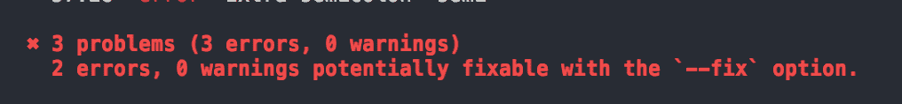
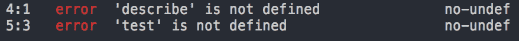
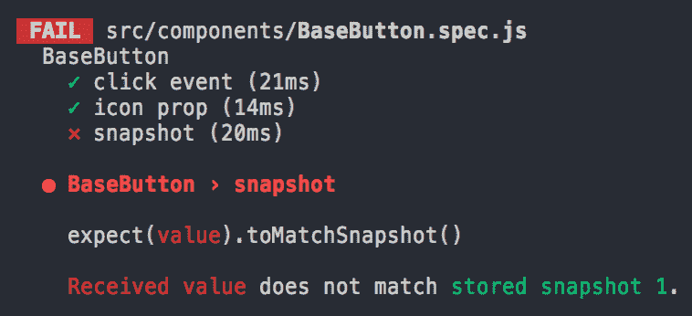
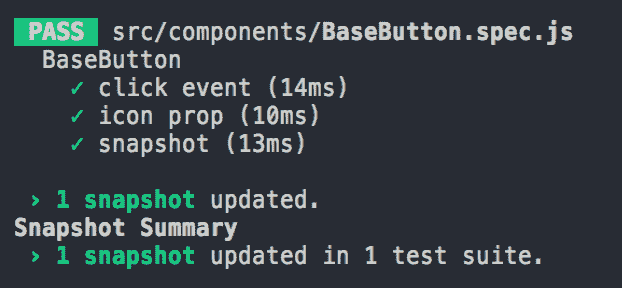
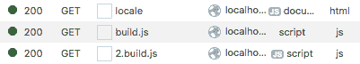
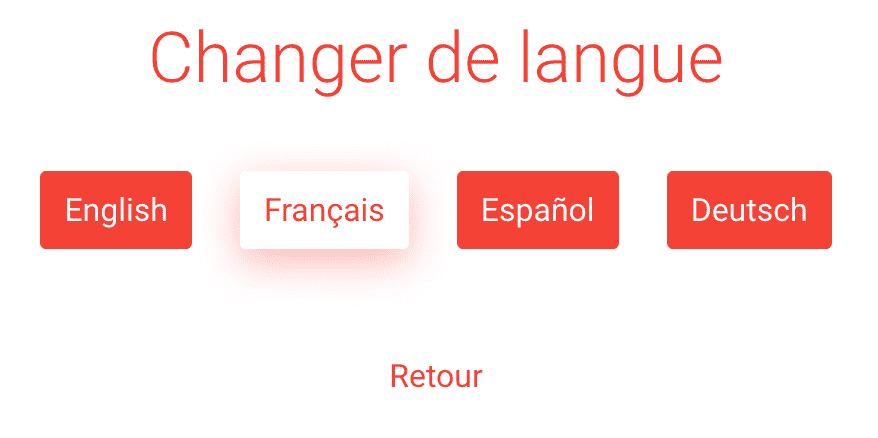

# 七、项目 5——网上商店和扩大规模

在本章中，我们将快速建立一个“时尚商店”应用程序，以关注更高级的主题，例如：

*   提高 CSS 代码与 PostCSS 和 AutoRefixer 的兼容性
*   使用 ESLint 来提升代码的质量和风格
*   单元测试我们的 Vue 组件
*   本地化应用程序并利用 webpack 的代码拆分功能
*   在 Nodejs 中启用应用程序的服务器端呈现
*   为生产构建应用程序

该应用程序将是一个简单的可穿戴在线商店，外观如下：


# 高级开发工作流

在第一部分中，我们将使用新的工具和包改进我们的开发工作流程。然而，首先，我们需要建立我们的时装店项目。

# 建立项目

1.  使用`vue init`命令生成一个新项目，就像我们在[第 5 章](5.html)、*项目 3-支持中心*和[第 6 章](8.html)、*项目 4-地理定位博客*中所做的那样：

```js
 vue init webpack-simple e-shop
      cd e-shop
      npm install
      npm install -S babel-polyfill
```

2.  我们还将安装触控笔：

```js
 npm i -D stylus stylus-loader
```

3.  删除`src`文件夹的内容。然后下载源文件（[https://github.com/Akryum/packt-vue-project-guide/tree/master/chapter7-download/src](https://github.com/Akryum/packt-vue-project-guide/tree/master/chapter7-download/src) 并将其解压缩到`src`文件夹中。这些包含所有已经完成的应用程序源代码，以便我们能够更快地前进。
4.  我们需要在依赖项中再安装几个软件包：

```js
 npm i -S axios vue-router vuex vuex-router-sync
```

axios is a great library for making requests to the server and is recommended by the Vue.js team.

# 生成快速开发 API

以前，我们的后端有一个完整的节点服务器，但这次我们将不再关注应用程序的功能。因此，为了本章的目的，我们将使用`json-server`包生成一个非常简单的本地 API：

1.  安装`json-server`作为开发依赖项：

```js
 npm i -D json-server
```

2.  当我们运行这个包时，它将在本地公开一个简单的 RESTAPI，并使用一个`db.json`文件来存储数据。您可以下载它（[https://github.com/Akryum/packt-vue-project-guide/blob/master/chapter7-download/db.json](https://github.com/Akryum/packt-vue-project-guide/blob/master/chapter7-download/db.json) ），并将其放入项目根目录中。如果你打开它，你会看到一些待售商品和评论。

3.  然后，我们需要添加一个脚本来启动 json 服务器。在`package.json`文件中添加新的`db`脚本：

```js
      "db": "json-server --watch db.json"
```

前面的命令将运行`json-server`包命令行工具，并查看您刚刚下载的`db.json`文件的更改，以便您可以轻松地对其进行编辑。要尝试，请使用`npm run`：

```js
npm run db
```

默认情况下，它将侦听端口`3000`。您可以通过在浏览器中打开`http://localhost:3000/items`REST 地址来尝试：


# 启动应用程序

我们现在准备启动该应用程序。打开新的终端，照常使用`npm run`：

```js
npm run dev
```

它将以正确的地址打开一个新的浏览器窗口，您应该能够使用该应用程序：


# 使用 postss 自动为 CSS 添加前缀

在编写 CSS（或手写笔）代码时，我们希望它与大多数浏览器兼容。幸运的是，有一些工具可以自动为我们做到这一点，例如，通过添加带有供应商前缀的 CSS 属性版本（如`-webkit-user-select`和`-moz-user-select`）。

PostCSS 是一个专门用于 CSS 后处理的库。它有一个非常模块化的架构；它通过添加插件来工作，插件以各种方式处理 CSS。

我们不必安装它。`vue-loader`已包含邮政编码。我们只需要安装我们想要的插件。在我们的例子中，我们需要`autoprefixer`包使我们的 CSS 代码与更多浏览器兼容。

1.  安装`autoprefixer`包：

```js
 npm i -D autoprefixer
```

2.  要激活 POSTSS，我们需要在项目根目录中添加一个名为`postcss.config.js`的配置文件。让我们告诉 PostSS 我们想在这个文件中使用`autoprefixer`：

```js
      module.exports = {
        plugins: [
          require('autoprefixer'),
        ],
      }
```

就这样！我们的代码现在将由`autoprefixer`处理。例如，考虑这个手写笔代码：

```js
.store-cart-item
  user-select none
```

最终 CSS 将如下所示：

```js
.store-item[data-v-1af8c5dc] {
  -webkit-user-select: none;
 -moz-user-select: none;
 -ms-user-select: none;
  user-select: none;
}
```

# 使用 browserslist 针对特定浏览器

我们可以通过`browserslist`配置更改`autoprefixer`针对的浏览器。它由一系列规则组成，用于确定支持哪些浏览器。打开`package.json`文件并查找`browserslist`字段。它应该已经有了`webpack-simple`模板的默认值，如下所示：

```js
"> 1%",
"last 2 versions",
"not ie <= 8"
```

第一条规则适用于互联网上使用份额超过 1%的浏览器。第二个选项额外选择每个浏览器的最后两个版本。最后，我们声明不支持 InternetExplorer8 或更早版本。

The data used is provided by the site ([https://caniuse.com/](https://caniuse.com/)), which is specialized in browser compatibility data.

现在，通过自定义此字段，您可以针对更老的浏览器。例如，要针对 Firefox 20 及更高版本，您需要添加以下规则：

```js
"Firefox >= 20"
```

您可以在`browserslist`的存储库（[中找到更多关于`browserslist`的信息 https://github.com/ai/browserslist [T2]。](https://github.com/ai/browserslist)

# 使用 ESLint 改进代码质量和样式

在与其他开发人员一起进行项目时，实施良好的编码实践和质量是至关重要的。它确保不会出现语法或基本错误（例如忘记声明变量），并且有助于保持源代码的干净性和一致性。此过程称为**脱毛**。

ESLint 是 Vue.js 团队推荐的 linting 工具。它提供了一组 linting 规则，可以打开和关闭这些规则来检查代码质量。插件可以添加更多的规则，一些包定义了一个预设的启用规则。

1.  我们将使用 StandardJS 预设和`eslint-plugin-vue`包，这将添加更多规则，帮助遵循官方的 Vue 样式指南（[https://vuejs.org/v2/style-guide/](https://vuejs.org/v2/style-guide/) ：

```js
 npm i -D eslint eslint-config-standard eslint-plugin-vue@beta
```

2.  `eslint-config-standard`包有四个对等依赖项，我们也需要安装它们：

```js
 npm i -D eslint-plugin-import eslint-plugin-node eslint-plugin- 
       promise eslint-plugin-standard
```

3.  为了在 ESLint 解析文件时将 babel 用于 JavaScript 代码，我们需要一个额外的包：

```js
 npm i -D babel-eslint
```

# 配置 ESLint

在项目根目录中创建一个新的`.eslintrc.js`文件，并写入以下配置：

```js
module.exports = {
  // Use only this configuration
  root: true,
  // File parser
  parser: 'vue-eslint-parser',
  parserOptions: {
    // Use babel-eslint for JavaScript
    'parser': 'babel-eslint',
    'ecmaVersion': 2017,
    // With import/export syntax
    'sourceType': 'module'
  },
  // Environment global objects
  env: {
    browser: true,
    es6: true,
  },
  extends: [
    // https://github.com/feross/standard/blob/master/RULES.md#javascript-standard-style
    'standard',
    // https://github.com/vuejs/eslint-plugin-vue#bulb-rules
    'plugin:vue/recommended',
  ],
}
```

首先，我们使用`vue-eslint-parser`读取文件（包括`.vue`文件）。解析 JavaScript 代码时使用`babel-eslint`。我们还指定 JavaScript 的 EcmaScript 版本，并为模块使用`import/export`语法。

然后，我们告诉 ESLint，我们希望处于浏览器和 ES6（或 ES2015）JavaScript 环境中，这意味着我们应该能够访问全局变量，如[T0]或 Promise，而不必 ESLint 引发未定义的变量错误。

我们还指定要使用的配置（或预设）——`standard`和`vue/recommended`。

# 自定义规则

我们可以使用`rules`对象更改启用的规则并修改它们的选项。将以下内容添加到 ESLint 配置中：

```js
rules: {
  // https://github.com/babel/babel-eslint/issues/517
  'no-use-before-define': 'off',
  'comma-dangle': ['error', 'always-multiline'],
},
```

第一行禁用`no-use-before-define`规则，该规则在使用`...`解构运算符时存在错误。第二个修改了[T2]规则，强制在所有数组和对象行的末尾添加一个尾随的[T3]逗号。

The rules have a status, which can take on those three values--`'off'` (or `0`), `'warn'` (or `1`), and `'error'` (or `2`).

# 运行 ESLint

要在`src`文件夹上运行 eslint，我们需要在`package.json`中添加一个新脚本：

```js
"eslint": "eslint --ext .js,.jsx,.vue src"
```

您应该注意控制台中的一些错误：



ESLint 可以通过在前面的`eslint`命令中添加`--fix`参数来解决其中一些问题：

```js
"eslint": "eslint --ext .js,.jsx,.vue src --fix"
```

再次运行，您应该只看到一个错误：


ESLint 告诉我们，如果不将引用保留在变量中，就不应该创建新对象。如果我们查看相应的代码，就会发现我们确实在`main.js`文件中创建了一个新的 Vue 实例：

```js
new Vue({
  el: '#app',
  router,
  store,
  ...App,
})
```

If you look at the ESLint error, you can see the code of the rule--`no-new`. You can open the [https://eslint.org/](https://eslint.org/) website and type it in the search field to get the rule definition. If it's a rule added by a plugin, it should have the name of the plugin followed by a slash, for example, `vue/require-v-for-key`.

此代码按预期编写，因为这是声明 Vue 应用程序的标准方式。因此，我们需要通过在以下内容之前添加特殊注释来禁用此特定代码行的此规则：

```js
// eslint-disable-next-line no-new
new Vue({
  ...
})

```

# ESLint 内部网页包

现在，我们必须手动运行`eslint`脚本来检查代码。如果我们能够在 Webpack 处理代码时检查代码，那就更好了，所以它将是全自动的。幸运的是，多亏了[T1]，这是可能的。

1.  将其安装在`friendly-errors-webpack-plugin`包旁边的开发依赖项中，这将改进控制台消息：

```js
 npm i -D eslint-loader friendly-errors-webpack-plugin
```

现在我们必须更改 Web 包配置以添加新的 ESLint 加载程序规则。

2.  编辑`webpack.config.js`文件，并在`module.rules`选项顶部添加此新规则：

```js
      module: {
        rules: [
          {
 test: /\.(jsx?|vue)$/,
 loader: 'eslint-loader',
 enforce: 'pre',
 },
          // ...
```

3.  此外，我们还可以启用`friendly-errors-webpack-plugin`包。在文件顶部导入它：

```js
      const FriendlyErrors = require('friendly-errors-webpack-plugin')
```

We can't use the `import/export` syntax here, since it will be executed in nodejs.

4.  然后，当我们处于开发模式时，通过在配置文件末尾添加一个`else`条件来添加此插件：

```js
      } else {
        module.exports.plugins = (module.exports.plugins ||            
        []).concat([
          new FriendlyErrors(),
        ])
      }
```

通过重新运行[T0]脚本并删除代码中的某个逗号来重新启动 webpack。您应该可以在网页包输出中看到 ESLint 错误：


在浏览器中，您现在应该可以看到错误覆盖：


如果通过再次放回逗号来修复错误，则覆盖将关闭，控制台将显示友好消息：


# 用 Jest 进行单元测试

重要的代码和组件应该进行单元测试，以确保它们按照预期的方式工作，并在代码演化时防止大多数回归。推荐的 Vue 组件测试运行程序是 Facebook 的 Jest。它有一个缓存系统，速度非常快，并且有一个方便的快照功能来帮助检测回归。

1.  首先，安装 Jest 和官方 Vue 单元测试工具：

```js
 npm i -D jest vue-test-utils
```

2.  我们还需要一些与 Vue 相关的实用程序来编译带有`jest-vue`的`.vue`文件，并拍摄组件的快照：

```js
 npm i -D vue-jest jest-serializer-vue vue-server-renderer
```

The recommended way to get the HTML render of a component in node is using the `vue-server-renderer` package used to do server-side rendering as we will see later in the chapter.

3.  最后，我们需要一些 babel 包来支持 babel 编译和 Jest 内的 webpack 动态导入：

```js
 npm i -D babel-jest babel-plugin-dynamic-import-node
```

# 配置笑话

要配置 Jest，让我们在项目根目录中创建一个新的`jest.config.js`文件：

```js
module.exports = {
  transform: {
    '.+\\.jsx?$': '<rootDir>/node_modules/babel-jest',
    '.+\\.vue$': '<rootDir>/node_modules/vue-jest',
  },
  snapshotSerializers: [
    '<rootDir>/node_modules/jest-serializer-vue',
  ],
  mapCoverage: true,
}
```

`transform`选项定义 JavaScript 和 Vue 文件的处理器。然后，我们告诉 Jest 使用`jest-serializer-vue`序列化组件的快照。我们还将使用`mapCoverage`选项启用源地图。

您可以在 Jest 网站（[上找到更多配置选项 https://facebook.github.io/jest/](https://facebook.github.io/jest/) ）。

# Is 的巴别塔配置

为了在 Jest 中支持 JavaScript`import/export`模块和动态导入，我们需要在测试运行时更改 babel 配置。

When using Jest, we are not using webpack and the loaders we use to build the real application.

当`NODE_ENV`环境变量设置为`"test"`时，我们需要在配置中添加两个 babel 插件：

```js
{
  "presets": [
    ["env", { "modules": false }],
    "stage-3"
  ],
 "env": {
 "test": {
 "plugins": [
 "transform-es2015-modules-commonjs",
 "dynamic-import-node"
 ]
 }
 }
}
```

`transform-es2015-modules-commonjs`插件为 Jest 添加了对`import/export`语法的支持，`dynamic-import-node`添加了对动态导入的支持。

When run, Jest will automatically set the `NODE_ENV` environment variable to `'test'`.

# 我们的第一个单元测试

为了在默认情况下被 Jest 识别，我们需要调用我们的测试文件`.test.js`或`.spec.js`。我们将测试`BaseButton.vue`组件；继续，在`src/components`文件夹中创建一个新的`BaseButton.spec.js`文件。

1.  首先，我们将从`vue-test-utils`导入组件和`shallow`方法：

```js
      import BaseButton from './BaseButton.vue'
      import { shallow } from 'vue-test-utils'
```

2.  然后，我们将创建一个具有`describe`功能的测试套件：

```js
 describe('BaseButton', () => {
        // Tests here
      })
```

3.  在测试套件中，我们可以使用`test`功能添加我们的第一个单元测试：

```js
      describe('BaseButton', () => {
        test('click event', () => {
          // Test code
        })
      })
```

4.  我们将测试在单击组件时是否发出`click`事件。我们需要围绕组件创建一个包装器对象，该对象将提供有用的函数来测试组件：

```js
      const wrapper = shallow(BaseButton)
```

5.  然后，我们将模拟单击组件：

```js
      wrapper.trigger('click')
```

6.  最后，我们将使用 Jest`expect`方法检查`click`事件是否发出：

```js
      expect(wrapper.emitted().click).toBeTruthy()
```

7.  现在，让我们在`package.json`文件中添加一个脚本来运行 Jest：

```js
      "jest": "jest"
```

8.  然后，使用通常的`npm run`命令：

```js
 npm run jest
```

启动测试并应通过以下测试：


要了解有关单元测试 Vue 组件的更多信息，请访问官方指南[https://vue-test-utils.vuejs.org/](https://vue-test-utils.vuejs.org/)

# ESLint 是全球性的

如果我们现在运行 ESLint，我们将得到与 Jest 关键字相关的错误，例如`describe`、`test`和`expect`：



我们需要对 ESLint 配置做一个微小的更改——我们必须指定`jest`环境；编辑`.eslintrc.js`文件：

```js
// Environment global objects
env: {
  browser: true,
  es6: true,
  jest: true,
},
```

现在，ESLint 将了解 Jest 关键字并停止抱怨。

# 笑话快照

快照是每次运行测试以检测潜在回归时保存和比较的字符串。它们主要用于保存组件的 HTML 呈现，但可以用于任何值，只要在测试之间存储并比较它是有意义的。

对于我们的 Vue 组件，我们将使用名为`vue-server-renderer`的服务器端呈现工具对其 HTML 呈现进行快照。我们需要此包中的`createRenderer`方法：

```js
import { createRenderer } from 'vue-server-renderer'
```

在测试开始时，我们实例化一个渲染器实例，然后用`shallow`包装该组件，并开始将该组件渲染为字符串。最后，我们将结果与前面的结果进行了比较。以下是`BaseButton`组件的快照测试示例，传递一些道具值和默认插槽内容：

```js
test('snapshot', () => {
  const renderer = createRenderer()
  const wrapper = shallow(BaseButton, {
    // Props values
    propsData: {
      icon: 'add',
      disabled: true,
      badge: '3',
    },
    // Slots content
    slots: {
      default: '<span>Add Item</span>',
    },
  })
  renderer.renderToString(wrapper.vm, (err, str) => {
    if (err) throw new Error(err)
    expect(str).toMatchSnapshot()
  })
})
```

If the snapshot test is run for the first time, it will create and save the snapshot to a `__snapshots__` folder next to it. If you are using a versioning system such as git, you need to add these snapshot files to it.

# 更新快照

如果修改组件，其 HTML 呈现也可能会更改。这意味着它的快照将不再有效，Jest 测试将失败。幸运的是，`jest`命令有一个`--updateSnapshots`参数。使用时，所有失败的快照都将重新保存并通过。

1.  让我们在`package.json`文件中添加一个新脚本：

```js
      "jest:update": "jest --updateSnapshot"
```

2.  例如，通过更改 CSS 类来修改`BaseButton`组件。如果您再次运行 Jest 测试，您应该会得到一个错误，即快照不再匹配。



3.  现在，使用新脚本更新快照：

```js
 npm run jest:update
```

现在所有测试都应该通过，`BaseButton`快照应该更新：



You should run this command only when you are sure there are no regressions elsewhere. A good idea is to run the tests normally just before, to make sure only the modified component snapshot fails, as expected. After you have updated the snapshots, use the normal test command.

# 补充专题

在本节中，我们将介绍一些对大型应用程序有用的主题。

# 国际化和代码拆分

如果该应用程序将被不同国家的人使用，则应将其翻译成更友好、更具吸引力的应用程序。要本地化应用程序的文本，您可以使用推荐的`vue-i18n`软件包：

```js
npm i -S vue-i18n
```

使用`vue-i18n`，我们将在`AppFooter`组件中添加一个链接到一个新页面，用户可以在其中选择语言。只有链接和此页面将被翻译，但如果您愿意，您可以翻译应用程序的更多部分。`vue-i18n`的工作原理是使用翻译后的消息从它创建一个`i18n`对象，并将其注入 Vue 应用程序。

1.  在`src/plugins.js`文件中，将新插件安装到 Vue 中：

```js
      import VueI18n from 'vue-i18n'

      // ...

      Vue.use(VueI18n)
```

2.  让我们在项目目录中创建一个名为`i18n`的新文件夹。下载`locales`文件夹（[https://github.com/Akryum/packt-vue-project-guide/tree/master/chapter7-download/locales](https://github.com/Akryum/packt-vue-project-guide/tree/master/chapter7-download/locales) ）包含翻译文件并放入其中。例如，您应该在`i18n/locales/en.js`文件中有`en`翻译。

3.  创建新的[T0]文件，导出可用语言列表：

```js
      export default [
        'en',
        'fr',
        'es',
        'de',
      ]
```

我们需要两个新的实用功能：

*   `createI18n`：创建`i18n`对象，带`locale`参数。
*   `getAutoLang`：返回用户在浏览器中设置的两个字母的语言代码，如`en`或`fr`。大多数情况下，这将是操作系统语言设置。

4.  在`src/utils`文件夹中，创建一个新的`i18n.js`文件并导入`VueI18n`和我们前面定义的可用地区列表：

```js
      import VueI18n from 'vue-i18n'
      import langs from '../../i18n'
```

5.  在撰写本文时，我们需要[T0]（或更少）来允许 Babel 解析动态导入。在`package.json`文件中，更改`babel-preset-stage-3`包：

```js
      "babel-preset-stage-2": "^6.24.1",
```

6.  运行`npm install`更新您的软件包。
7.  编辑根文件夹中的`.babelrc`文件，并将`stage-3`更改为`stage-2`。
8.  要切换到第 2 阶段，请执行以下安装：

```js
npm install --save-dev babel-preset-stage-2
```

# 使用动态导入进行代码拆分

当我们创建`i18n`对象时，我们只希望通过`locale`参数加载所选语言环境的翻译。为此，我们将使用`import`函数动态导入该文件。它将 path 作为参数并返回一个 Promise，一旦从服务器加载，它最终将解析为相应的 JavaScript 模块。

在 webpack 中，这种动态导入功能有时被称为“代码拆分”，因为 webpack 会将异步模块移动到另一个被编译的 JavaScript 文件（称为块）。

以下是加载了动态导入的异步模块的示例：

```js
async function loadAsyncModule () {
  await module = await import('./path/to/module')
  console.log('default export', module.default)
  console.log('named export', module.myExportedFunction)
}
```

您可以在导入的路径中使用变量，只要它有一些关于 webpack 在哪里可以找到文件的信息。例如，此代码将不起作用：

```js
import(myModulePath)
```

但是，只要变量路径简单（没有[T0]），下面的方法就可以正常工作：

```js
import(`./data/${myFileName}.json`)
```

In this example, all the files with the `json` extension in the `data` folder will be added to the build into asynchronous chunks, because webpack can't guess which ones you will really use at runtime.

异步加载带有动态导入的大型 JavaScript 模块可以减少打开页面时发送到浏览器的初始 JavaScript 代码的大小。在我们的应用程序中，它允许我们只加载相关的翻译文件，而不是将它们全部包含在初始 JavaScript 文件中。

If a module is already imported with a normal `import` in the main code (the initial chunk), it will already be loaded and will not be split into another chunk. In that case, you won't have the benefits of the code-splitting feature and the initial file size won't be reduced. Note that you can synchronously use other modules with the normal `import` keyword inside the dynamically loaded module: they will be put together in the chunk (if they aren't already included in the initial chunk).

`i18n`对象是使用`vue-i18n`包中的`VueI18n`构造函数创建的。我们将通过`locale`论证。

以下是`createI18n`函数的外观：

```js
export async function createI18n (locale) {
  const { default: localeMessages } = await import(`../../i18n/locales/${locale}`)
  const messages = {
    [locale]: localeMessages,
  }

  const i18n = new VueI18n({
    locale,
    messages,
  })

  return i18n
}
```

As you can see, we need to take the `default` value of the module, because we exported the messages using `export default`.

上面使用`async/await`的代码可以使用承诺来编写：

```js
export function createI18n (locale) {
  return import(`../../i18n/locales/${locale}`)
    .then(module => {
      const localeMessages = module.default
      // ...
    })
}
```

# 自动加载用户区域设置

接下来，我们可以使用`navigator.language`（或`userLanguage`用于 Internet Explorer 兼容性）检索区域设置代码。然后，我们将检查它是否在`langs`列表中可用，或者是否必须使用默认的`en`语言环境。

1.  `getAutoLang`函数应该如下所示：

```js
      export function getAutoLang () {
        let result = window.navigator.userLanguage || 
        window.navigator.language
        if (result) {
          result = result.substr(0, 2)
        }
        if (langs.indexOf(result) === -1) {
          return 'en'
        } else {
          return result
        }
      }
```

Some browsers may return the code in the `en-US` format, but we only need the first two characters.

2.  在`src/main.js`文件中，导入两个新的实用程序函数：

```js
      import { createI18n, getAutoLang } from './utils/i18n'
```

3.  然后，修改`main`功能：
    1.  使用`getAutoLang`检索首选区域设置。
    2.  使用`createI18n`函数创建并等待`i18n`对象。
    3.  将`i18n`对象注入根 Vue 实例。

现在应该是这样的：

```js
async function main () {
  const locale = getAutoLang()
 const i18n = await createI18n(locale)
  await store.dispatch('init')

  // eslint-disable-next-line no-new
  new Vue({
   el: '#app',
    router,
    store,
    i18n, // Inject i18n into the app
    ...App,
  })
}
```

Don't forget the `await` keyword in front of `createI18n`, or else you will get the Promise instead.

现在，您可以在浏览器 devtools 中打开网络窗格并刷新页面。webpack 将在单独的请求中加载与所选语言环境相对应的翻译模块。在此示例屏幕截图中，这是异步加载的`2.build.js`文件：



# 更改语言页面

现在，应用程序中没有什么真正的改变，所以让我们添加一个页面，让我们可以选择语言。

1.  在`src/router.js`文件中，导入`PageLocale`组件：

```js
      import PageLocale from './components/PageLocale.vue'
```

2.  然后，在`routes`数组中添加`locale`路由，就在最后一个路由之前（使用`*`路径）：

```js
      { path: '/locale', name: 'locale', component: PageLocale },
```

3.  在`AppFooter.vue`组件中，将此路由链接添加到模板：

```js
      <div v-if="$route.name !== 'locale'">
        <router-link :to="{ name: 'locale' }">{{ $t('change-lang') }}
        </router-link>
      </div>
```

正如您在前面的代码中所看到的，我们使用`vue-i18n`提供的`$t`来显示翻译后的文本。参数对应于区域设置文件中的键。您现在应该可以在应用程序页脚中看到链接：


链接将我们带到语言选择页面，该页面已使用`vue-i18n`进行了完全翻译：



您可以在`components/PageLocale.vue`文件中查看其源代码。

单击区域设置按钮时，如果尚未加载相应的翻译，则会加载相应的翻译。在浏览器 devtools 的“网络”窗格中，您应该每次都会看到对其他块的请求：


# 服务器端渲染

**服务器端呈现**（**SSR**）包括在服务器上运行并呈现应用程序，然后将 HTML 发送回浏览器。这有两个主要优点：

*   更好的**搜索引擎优化**（**SEO**），因为应用程序的初始内容将呈现在页面 HTML 中。这一点很重要，因为没有搜索引擎为异步 JavaScript 应用程序编制索引（例如，当您有一个微调器时）。
*   较慢的网络或设备将更快地显示内容——呈现的 HTML 不需要向用户显示 JavaScript。

然而，使用 SSR 也带来了一些权衡：

*   代码需要能够在服务器上运行（除非它位于仅客户端的钩子中，如`mounted`）。此外，某些库可能在浏览器上无法正常运行，可能需要进行特殊处理。
*   服务器上的负载将增加，因为它正在做更多的工作。
*   开发设置有点复杂。

因此，使用 SSR 并不总是一个好主意，特别是如果第一个内容显示的时间并不重要（例如，管理仪表板）。

# 通用结构应用程序

编写同时在客户端和服务器上运行的通用应用程序需要更改源代码的体系结构。

在客户端上运行时，每次加载页面时，我们都处于一个新的上下文中。这就是为什么到目前为止我们使用根实例、路由和存储的单例实例。然而，现在我们也需要在服务器上有一个新的上下文——问题是 Node.js 是有状态的。解决方案是为服务器处理的每个请求创建一个新的根实例、路由和存储。

1.  让我们从路由开始。在`src/router.js`文件中，将路由创建包装到新导出的`createRouter`函数中：

```js
 export function createRouter () {
        const router = new VueRouter({
          routes,
          mode: 'history',
          scrollBehavior (to, from, savedPosition) {
            // ...
          },
        })

        return router
 }
```

2.  我们将对 Vuex 商店执行同样的操作。在`src/store/index.js`文件中，将代码包装到新导出的`createStore`函数中：

```js
 export function createStore () {
        const store = new Vuex.Store({
          strict: process.env.NODE_ENV !== 'production',

          // ...

          modules: {
            cart,
            item,
            items,
            ui,
          },
        })

        return store
 }
```

3.  让我们将`src/main.js`文件重命名为`src/app.js`。这将是创建路由、存储和 Vue 根实例的通用文件。将`main`函数更改为导出的`createApp`函数，该函数接受`context`参数并返回应用程序、路由和商店：

```js
 export async function createApp (context) {
        const router = createRouter()
        const store = createStore()

        sync(store, router)

        const i18n = await createI18n(context.locale)
        await store.dispatch('init')

        const app = new Vue({
          router,
          store,
          i18n,
          ...App,
        })

        return {
 app,
 router,
 store,
 }
      }
```

Don't forget to change the imports for `createRouter` and `createStore`.

在服务器上，我们不会以与客户端相同的方式选择初始区域设置，因为我们无法访问`window.navigator`。这就是我们在[T1]参数中传递区域设置的原因：

```js
const i18n = await createI18n(context.locale)
```

我们还从根实例定义中删除了`el`选项，因为它在服务器上没有意义。

# 客户条目

在浏览器上，代码将在我们现在编写的客户机条目文件中启动。

1.  创建一个新的`src/entry-client.js`文件，作为客户端包的入口点。获取用户语言，调用`createApp`函数，然后将应用挂载到页面：

```js
      import { createApp } from './app'
      import { getAutoLang } from './utils/i18n'

      const locale = getAutoLang()
      createApp({
        locale,
      }).then(({ app }) => {
        app.$mount('#app')
      })
```

2.  您现在可以更改`webpack.config.js`文件中的输入路径：

```js
 entry: './src/entry-client.js',
```

您可以重新启动`dev`脚本并检查应用程序是否仍在浏览器中工作。

# 服务器条目

创建一个新的`src/entry-server.js`文件，作为服务器包的入口点。它将导出一个函数，该函数从我们稍后构建的 HTTP 服务器获取一个`context`对象。它应该返回一个承诺，该承诺在 Vue 应用程序准备就绪时解决。

我们将向上下文传递一个`url`属性，以便我们可以像这样设置当前路由：

```js
router.push(context.url)
```

与客户端条目类似，我们还使用`createApp`函数创建根应用程序实例、路由和商店。`entry-server.js`应该是这样的：

```js
import { createApp } from './app'

export default context => {
  return new Promise(async (resolve, reject) => {
    const { app, router, store } = await createApp(context)
    // Set the current route
    router.push(context.url)
    // TODO get matched components to preload data
    // TODO resolve(app)
  })
}
```

We return a Promise because we will send the application `app` when we will have finished all the operations.

使用`resolve(app)`将`app`根实例发送回我们称之为渲染器的地方（有点像我们做 Jest 快照时）。首先，我们需要注意预加载 Vuex 存储。

# 国家管理

在处理请求时，我们需要在呈现应用程序之前获取相关组件上的数据。这样，当浏览器加载 HTML 时，数据就会显示出来。例如，`PageHome.vue`获取存储项目，`PageStoreItem.vue`检索项目详细信息和注释。

我们将添加一个新的`asyncData`自定义选项，以便在执行 SSR 时在服务器上调用它。

1.  通过添加此函数来编辑`PageHome.vue`组件，该函数调度`items`存储模块的`fetchItems`动作：

```js
 asyncData ({ store }) {
        return store.dispatch('items/fetchItems')
      },
```

2.  在`PageStoreItem.vue`组件中，我们需要调用`item`存储模块的`fetchStoreItemDetails`动作，使用服务器传递的路由的`id`参数：

```js
 asyncData ({ store, route }) {
        return store.dispatch('item/fetchStoreItemDetails', {
          id: route.params.id,
        })
      },
```

3.  现在我们的组件已经准备好了，我们将回到`entry-server.js`。我们可以使用`router.getMatchedComponents()`方法得到与当前路由匹配的组件列表：

```js
      export default context => {
        return new Promise(async (resolve, reject) => {
          const { app, router, store } = await createApp(context)
          router.push(context.url)
          // Wait for the component resolution
          router.onReady(() => {
 const matchedComponents = router.getMatchedComponents()
            // TODO pre-load data
            // TODO resolve(app)
          }, reject)
        })
      }
```

4.  然后我们可以调用这些组件的所有`asyncData`选项并等待它们完成。我们将存储和当前路由都传递给它们，当它们全部完成后，我们将 Vuex 存储状态发送回带有`context.state = store.state`的渲染器。使用`Promise.all(array)`等待所有`asyncData`呼叫：

```js
      router.onReady(() => {
        const matchedComponents = router.getMatchedComponents()

        Promise.all(matchedComponents.map(Component => {
 if (Component.asyncData) {
 return Component.asyncData({
 store,
 route: router.currentRoute,
 })
 }
 })).then(() => {
          // Send back the store state
          context.state = store.state

          // Send the app to the renderer
          resolve(app)
 }).catch(reject)
      }, reject)
```

如果发生错误，它将拒绝我们返回给渲染器的承诺。

# 正在恢复客户端上的 Vuex 状态

存储状态由服务器在 HTML 页面中的`__INITIAL_STATE__`变量上序列化。我们甚至可以在安装应用程序之前使用它来设置状态，这样组件就可以访问它。

在安装应用程序之前，编辑`entry-client.js`文件并使用`store.replaceState`方法：

```js
createApp({
  locale,
}).then(({ app, store }) => {
  if (window.__INITIAL_STATE__) {
 store.replaceState(window.__INITIAL_STATE__)
 }

  app.$mount('#app')
})
```

现在，存储将由服务器发送数据。

# WebPack 配置

我们的应用程序代码现在已经准备好了。在继续之前，我们需要重构我们的网页包配置。

我们将需要一个稍微不同的客户端和服务器的网页包配置。最好有一个公共配置文件，然后为客户机和服务器扩展该文件。我们可以通过`webpack-merge`包轻松实现这一点，该包将多个 Web 包配置对象合并为一个。

对于服务器配置，我们还需要`webpack-node-externals`包来防止 webpack 将包捆绑到`node_modules`中——这是不必要的，因为我们将在 NodeJ 内部运行，而不是在浏览器中运行。所有相应的导入都将保留为`require`语句，以便节点自己加载它们。

1.  在开发人员依赖项中安装软件包：

```js
 npm i -D webpack-merge webpack-node-externals
```

2.  在项目根目录中新建一个`webpack`文件夹，然后将`webpack.config.js`文件移动并重命名为`webpack/common.js`。需要做一些改变。
3.  从配置中删除`entry`选项。这将在特定的扩展配置中指定。

4.  更新`output`选项以定位正确的文件夹并生成更好的区块名称：

```js
      output: {
        path: path.resolve(__dirname, '../dist'),
        publicPath: '/dist/',
        filename: '[name].[chunkhash].js',
      },
```

# 客户端配置

在`webpack/common.js`旁边，创建一个扩展基本配置的新`client.js`文件：

```js
const webpack = require('webpack')
const merge = require('webpack-merge')
const common = require('./common')
const VueSSRClientPlugin = require('vue-server-renderer/client-plugin')

module.exports = merge(common, {
  entry: './src/entry-client',
  plugins: [
    new webpack.optimize.CommonsChunkPlugin({
      name: 'manifest',
      minChunks: Infinity,
    }),
    // Generates the client manifest file
    new VueSSRClientPlugin(),
  ],
})
```

`VueSSRClientPlugin`将生成一个`vue-ssr-client-manifest.json`文件，我们将把它提供给渲染器。通过这种方式，它将更多地了解客户机。此外，它还会自动将脚本标记和关键 CSS 注入 HTML。

The Critical CSS is the style of the components rendered by the server. Those styles will be directly injected to the page HTML so that the browser doesn't have to wait for the CSS to be loaded; it can display those components sooner.

[T0]将把 webpack 运行时代码放在一个前导块中，这样就可以在它之后立即注入异步块。它还改进了应用程序和供应商代码的缓存。

# 服务器配置

在`webpack/common.js`旁边，创建一个扩展基本配置的新`server.js`文件：

```js
const merge = require('webpack-merge')
const common = require('./common')
const nodeExternals = require('webpack-node-externals')
const VueSSRServerPlugin = require('vue-server-renderer/server-plugin')

module.exports = merge(common, {
  entry: './src/entry-server',
  target: 'node',
  devtool: 'source-map',
  output: {
    libraryTarget: 'commonjs2',
  },
  // Skip webpack processing on node_modules
  externals: nodeExternals({
    // Force css files imported from no_modules
    // to be processed by webpack
    whitelist: /\.css$/,
  }),
  plugins: [
    // Generates the server bundle file
    new VueSSRServerPlugin(),
  ],
})
```

在这里，我们更改了多个选项，例如`target`和`output.libraryTarget`选项，以适应 node.js 环境。

使用`webpack-node-externals`包，我们告诉 webpack 忽略`node_modules`文件夹中的模块（即依赖项）。因为我们在 nodejs 中，而不是在浏览器中，所以我们不必将所有依赖项捆绑到捆绑包中，因此这将缩短构建时间。

最后，我们使用`VueSSRServerPlugin`生成渲染器将使用的服务器包文件。它包含已编译的服务器端代码和许多其他信息，因此渲染器可以支持源映射（使用`source-map`值`devtool`）、热重新加载、关键 CSS 注入以及与客户端清单数据相关的其他注入。

# 服务器端设置

在开发过程中，我们不能再直接将`webpack-dev-server`用于 SSR。相反，我们将用 webpack 设置 express 服务器。下载`server.dev.js`文件（[https://github.com/Akryum/packt-vue-project-guide/blob/master/chapter7-download/server.dev.js](https://github.com/Akryum/packt-vue-project-guide/blob/master/chapter7-download/server.dev.js) ），并将其放入项目根目录中。此文件导出一个`setupDevServer`函数，我们将使用该函数运行 webpack 并更新服务器。

我们还需要一些用于开发设置的软件包：

```js
npm i -D memory-fs chokidar webpack-dev-middleware webpack-hot-middleware
```

我们可以使用`memory-fs`创建虚拟文件系统，使用`chokidar`查看文件，并使用最后两个中间件在 express server 中启用 webpack 热模块替换。

# 页面模板

在`index.html`旁边创建一个新的`index.template.html`文件并复制其内容。然后，用特别的`<!--vue-ssr-outlet-->`注释替换正文内容：

```js
<!DOCTYPE html>
<html lang="en">
  <head>
    <meta charset="utf-8">
    <title>Fashion Store</title>
  </head>
  <body>
    <!--vue-ssr-outlet-->
  </body>
</html&gt;
```

此特殊注释将替换为服务器上呈现的标记。

# 快速服务器

在 nodejs 端，我们将使用`express`包来创建我们的 HTTP 服务器。我们还需要`reify`包，这样我们就可以需要在 nodejs 中使用`import/export`语法的文件（nodejs 本身不支持它）。

1.  安装新软件包：

```js
 npm i -S express reify
```

2.  下载此不完整的`server.js`文件（[https://github.com/Akryum/packt-vue-project-guide/blob/master/chapter7-download/server.dev.js](https://github.com/Akryum/packt-vue-project-guide/blob/master/chapter7-download/server.dev.js) ），并将其放入项目根目录中。它已经创建了一个 express server 并配置了必要的 express 路由。

现在，我们将重点关注开发部分。

# 创建和更新渲染器

要呈现我们的应用程序，我们需要使用`vue-server-renderer`包中的`createBundleRenderer`函数创建一个呈现程序。

A bundle renderer is quite different from a normal renderer. It uses a server bundle file (that will be generated, thanks to our new webpack configuration) with an optional client manifest that allows the renderer to have more information about the code. This enables more features such as source maps and hot-reloading.

在`server.js`文件中，将`// TODO development`注释替换为以下代码：

```js
const setupDevServer = require('./server.dev')
readyPromise = setupDevServer({
  server,
  templatePath,
  onUpdate: (bundle, options) => {
    // Re-create the bundle renderer
    renderer = createBundleRenderer(bundle, {
      runInNewContext: false,
      ...options,
    })
  },
})
```

感谢`server.dev.js`文件，我们可以向 express 服务器添加对网页包热重新加载的支持。我们还指定 HTML 页面模板的路径，以便在更改时也可以重新加载它。

当安装程序触发更新时，我们创建或重新创建包渲染器。

# 渲染应用程序视图

接下来，我们需要实现呈现应用程序的代码，并将 HTML 结果发送回客户端。

将`// TODO render`注释替换为：

```js
const context = {
  url: req.url,
  // Languages sent by the browser
  locale: req.acceptsLanguages(langs) || 'en',
}
renderer.renderToString(context, (err, html) => {
  if (err) {
    // Render Error Page or Redirect
    res.status(500).send('500 | Internal Server Error')
    console.error(`error during render : ${req.url}`)
    console.error(err.stack)
  }
  res.send(html)
})
```

由于 express 中的`req.acceptsLanguages`方法，我们可以轻松选择用户的首选语言。

When performing the request, the web browser will send a list of "accepted languages" by the user. This is generally the language set for either their browser or OS.

然后我们使用`renderToString`方法调用我们在`entry-server.js`文件中导出的函数，等待返回的承诺完成，然后将应用程序呈现为 HTML 字符串。最后，我们将结果发送到客户端（除非在渲染过程中出现错误）。

# 运行我们的 SSR 应用程序

现在是运行该应用程序的时候了。将[T0]脚本更改为运行我们的 express server，而不是[T1]：

```js
"dev": "node server",
```

重新启动脚本并刷新应用程序。为确保 SSR 正常工作，请查看页面来源：


服务器已以 HTML 格式呈现应用程序。

# 不必要的获取

不幸的是，我们的应用程序有问题。服务器将 Vuex store 数据与页面的 HTML 一起发送，这意味着应用程序已经拥有了第一次运行时所需的所有数据，但仍在请求检索项目详细信息和注释的存储项目。您可以看到这一点，因为第一次加载或刷新其中一个相应页面时会出现加载动画。

解决此问题的方法是，如果不需要，防止组件获取数据：

1.  在`PageHome.vue`组件中，只有在我们还没有物品的情况下，我们才需要取回物品：

```js
      mounted () {
        if (!this.items.length) {
          this.fetchItems()
        }
      },
```

2.  在`PageStoreItem.vue`组件中，只有在我们没有数据的情况下才能获取详细信息和注释：

```js
      fetchData () {
        if (!this.details || this.details.id !== this.id) {
          this.fetchStoreItemDetails({
            id: this.id,
          })
        }
      },
```

我们现在不再有这个问题了。

要继续了解有关 SSR 的更多信息，您可以访问官方文档[https://ssr.vuejs.org/](https://ssr.vuejs.org/) 或使用一个名为 nuxtjs 的易于使用的框架（[https://nuxtjs.org/](https://nuxtjs.org/) ），它从您那里提取了很多样板文件。

# 生产建设

我们的应用程序在开发中运行良好。假设我们已经完成了它，并希望将其部署到一个真正的服务器上。

# 附加配置

我们需要为应用程序的生产构建添加一些配置，以确保其得到优化。

# 将样式提取到 CSS 文件中

到目前为止，该样式是通过 JavaScript 代码添加到页面的。这在开发中是非常好的，因为它允许用 webpack 重新加载。但是，在生产中，建议将其提取到单独的 CSS 文件中。

1.  在 dev 依赖项中安装`extract-text-webpack-plugin`包：

```js
 npm i -D extract-text-webpack-plugin
```

2.  在`webpack/common.js`配置文件中，添加一个新的`isProd`变量：

```js
      const isProd = process.env.NODE_ENV === 'production'
```

3.  修改`vue-loader`规则以启用 CSS 提取（如果我们正在生产），并忽略 HTML 标记之间的空白：

```js
      {
        test: /\.vue$/,
        loader: 'vue-loader',
        options: {
          extractCSS: isProd,
          preserveWhitespace: false,
        },
      },
```

4.  将`ExtractTextPlugin`和`ModuleConcatenationPlugin`添加到文件底部的仅生产插件列表中：

```js
      if (isProd) {
        module.exports.devtool = '#source-map'
        module.exports.plugins = (module.exports.plugins || 
        []).concat([
          // ...
          new webpack.optimize.ModuleConcatenationPlugin(),
 new ExtractTextPlugin({
 filename: 'common.[chunkhash].css',
 }),
        ])
      } else {
       // ...
      }
```

`ExtractTextPlugin`将把样式放入 CSS 文件中，`ModuleConcatenationPlugin`将优化编译后的 JavaScript 代码以加快速度。

# 生产快速服务器

我们需要对代码进行的最后更改是在 express 服务器中创建包渲染器。

在`server.js`文件中，将`// TODO production`注释替换为：

```js
const template = fs.readFileSync(templatePath, 'utf-8')
const bundle = require('./dist/vue-ssr-server-bundle.json')
const clientManifest = require('./dist/vue-ssr-client-manifest.json')
renderer = createBundleRenderer(bundle, {
  runInNewContext: false,
  template,
  clientManifest,
})
```

我们将阅读 HTML 页面模板、服务器包和客户机清单。然后，我们创建一个新的 bundle 渲染器，因为在产品中不会进行热重新加载。

# 新的 npm 脚本

编译后的代码将输出到项目根目录中的`dist`目录。在每个构建之间，我们需要删除它，以便处于干净状态。为了以跨平台的方式实现这一点，我们将使用能够递归删除文件和文件夹的`rimraf`包。

1.  将`rimraf`包安装到开发依赖项：

```js
 npm i -D rimraf
```

2.  为客户端和服务器捆绑包添加一个`build`脚本：

```js
      "build:client": "cross-env NODE_ENV=production webpack --progress 
       --hide-modules --config webpack/client.js",
      "build:server": "cross-env NODE_ENV=production webpack --progress 
       --hide-modules --config webpack/server.js",
```

我们将`NODE_ENV`环境变量设置为`'production'`，并使用相应的网页配置文件运行`webpack`命令。

3.  创建一个新的`build`脚本，清除`dist`文件夹并运行另外两个`build:client`和`build:server`脚本：

```js
      "build": "rimraf dist && npm run build:client && npm run 
        build:server",
```

4.  添加在生产模式下运行 express server 的最后一个名为`start`的脚本：

```js
      "start": "cross-env NODE_ENV=production node server",
```

5.  您现在可以运行构建；使用通常的`npm run`命令：

```js
 npm run build
```

`dist`文件夹现在应该包含 webpack 生成的所有区块，以及服务器包和客户端清单 json 文件：


These are the files that need to be uploaded to your real nodejs server.

6.  我们现在可以启动 express 服务器：

```js
 npm start
```

You should also upload the `server.js`, `package.json`, and `package-lock.json` files to the real server. Don't forget to install the dependencies with `npm install`.

# 总结

在本章中，我们通过学习如何使用 postss 自动刷新 CSS、使用 ESLint 刷新代码以提高质量以及使用 Jest 对组件进行单元测试，改进了我们的开发工作流程。我们甚至更进一步，通过`vue-i18n`包和动态导入添加本地化，并通过重构项目来支持服务器端呈现，同时仍然利用令人敬畏的 Web 包功能，如热重新加载、代码拆分和优化。

在最后一章中，我们将使用 Meteor fullstack 框架和 Vue 创建一个简单的实时应用程序。