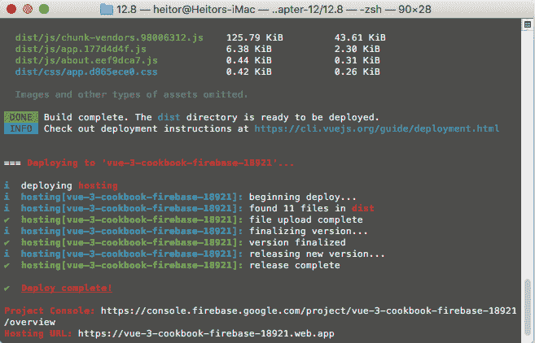

# 十、将应用部署到云平台

现在是时候将您的应用部署到万维网，并让全球所有人都可以使用它了。

在本章中，我们将学习如何使用三种不同的托管平台—Netlify、Now 和 Firebase。在这里，我们将学习在每个平台上创建帐户、设置环境、配置应用以进行部署以及最终将其部署到 web 的过程。

在本章中，我们将介绍以下配方：

*   创建 Netlify 帐户
*   准备在 Netlify 中部署应用
*   准备使用 GitHub 在 Netlify 上自动部署
*   创建 Vercel 帐户
*   配置 Vercel CLI 并部署项目
*   准备使用 GitHub 在 Vercel 上自动部署
*   创建 Firebase 项目
*   配置 Firebase CLI 并部署项目

# 技术要求

在本章中，我们将使用**Node.js**和**Vue CLI**。

Attention Windows Users! You need to install an NPM package called windows-build-tools in order to be able to install the following requisite packages. To do this, open PowerShell as the administrator and execute the following command: `> npm install -g windows-build-tools`

要安装 Vue CLI，您需要打开终端（macOS 或 Linux）或命令提示符/PowerShell（Windows）并执行以下命令：

```js
> npm install -g @vue/cli @vue/cli-service-global
```

## 创建 Vue 项目

要创建 Vue CLI 项目，请执行以下步骤：

1.  打开终端（macOS 或 Linux）或命令提示符/PowerShell（Windows）并执行以下命令：

```js
> vue create vue-project
```

2.  Vue CLI 将要求您选择预设；使用*空格键*选择`Manually select features`：

```js
? Please pick a preset: (Use arrow keys)
  default (babel, eslint) ❯ Manually select features 
```

3.  现在，Vue CLI 将要求提供这些功能，您需要在默认功能的基础上选择`Router`、`Vuex`和 `Linter / Formatter`作为附加功能：

```js
? Check the features needed for your project: (Use arrow keys) ❯ Babel
  TypeScript
  Progressive Web App (PWA) Support ❯ Router ❯ Vuex
  CSS Pre-processors ❯ Linter / Formatter
  Unit Testing
  E2E Testing
```

4.  现在，Vue CLI 将询问您是否要使用历史记录模式进行路由管理。我们将选择`y`（是）：

```js
? Use history mode for router? (Requires proper server setup for 
  index fallback in production) (Y/n) y 
```

5.  通过选择 linter 和 formatter 继续此过程。我们将选择`ESLint + Airbnb config`：

```js
? Pick a linter / formatter config: (Use arrow keys)
  ESLint with error prevention only ❯ ESLint + Airbnb config 
  ESLint + Standard config 
  ESLint + Prettier
```

6.  选择短绒的其他特征（此处为[T0]）：

```js
? Pick additional lint features: (Use arrow keys)
  Lint on save ❯ Lint and fix on commit
```

7.  选择要放置 linter 和 formatter 配置文件的位置（此处，[T0]：

```js
? Where do you prefer placing config for Babel, ESLint, etc.? (Use arrow keys) ❯ In dedicated config files 
  In package.json 
```

8.  最后，CLI 将询问您是否要为将来的项目保存设置；您将选择`N`。之后，Vue CLI 将为您创建文件夹并安装依赖项：

```js
? Save this as a preset for future projects? (y/N) n
```

# 创建 Netlify 帐户

是时候开始 Netlify 平台的部署过程了。在本教程中，我们将学习如何创建 Netlify 帐户，以便将应用部署到 web 上。

## 准备

此配方的先决条件如下：

*   电子邮件地址
*   GitHub 帐户
*   GitLab 帐户
*   比特桶账户

在 Netlify 上创建帐户的过程中，您可以使用**电子邮件**地址、**GitHub**帐户、**GitLab**帐户或**BitBucket**帐户来完成。

## 怎么做。。。

在这里，我们将学习如何使用电子邮件地址创建 Netlify 帐户：

1.  访问 Netlify 网站[https://www.netlify.com/](https://www.netlify.com/) 点击**注册→ 标题菜单中的**。您将被重定向到初始**注册**页面。
2.  在此页面上，您可以选择要用于注册 Netlify 的方法。在此过程中，我们将继续使用电子邮件地址。点击**电子邮件**按钮，重定向至电子邮件注册表单。
3.  在表格中填写您的电子邮件地址和您选择的密码。密码规则至少为 8 个字符。填写表格后，点击**注册**按钮。从那里，您将被重定向到成功页面。
4.  现在，您将在收件箱中收到一封验证电子邮件，以便继续使用 Netlify 平台。要继续，请打开您的电子邮件收件箱并检查 Netlify 电子邮件。
5.  在您的电子邮件收件箱中，打开 Netlify 电子邮件，然后单击**验证电子邮件**按钮。此时，将打开一个新窗口，您可以使用最近注册的电子邮件和密码登录。
6.  在这里，您可以使用您在步骤 3 中选择的电子邮件地址和密码填写登录表单。之后，单击“登录”按钮以重定向到 Netlify 平台的主窗口。
7.  最后，您会发现自己在 Netlify 平台的主屏幕上，有一个空白页面开始在平台上部署。

## 它是如何工作的。。。

在此配方中，我们学习了如何在 Netlify 上创建帐户。我们看到，使用各种 OAuth 方法和我们在配方中使用的基本电子邮件可以做到这一点。

电子邮件地址创建过程包括定义将使用的电子邮件地址和帐户密码，验证帐户电子邮件。然后，您可以登录到该平台。

## 另见

有关 Netlify 的更多信息，请访问[https://docs.netlify.com/](https://docs.netlify.com/) 。

# 准备在 Netlify 中部署应用

要启动部署过程，我们需要将项目配置为具有有效的 Netlify 部署架构。在本教程中，您将学习如何在任何基于 Vue 的应用上设置 Netlify 部署模式。

## 准备

此配方的先决条件如下：

*   Node.js 12+
*   视图项目

所需的 Node.js 全局对象如下：

*   `@vue/cli`
*   `@vue/cli-service-global`

## 怎么做。。。

在此配方中，我们将学习如何准备部署到 Netlify 的应用：

1.  打开 Vue 项目并打开[T0]文件。检查是否定义了`build`脚本，如下例所示：

```js
"scripts": {
  "serve": "Vue-CLI-service serve",
  "build": "Vue-CLI-service build",
  "lint": "Vue-CLI-service lint"
},
```

2.  打开终端（macOS 或 Linux）或命令提示符/PowerShell（Windows）并执行以下命令：

```js
> npm run build
```

3.  确保您的应用`build`脚本在主文件夹中创建`dist`文件夹。
4.  如果您的`vue-router`被定义为使用历史记录模式，则必须在`public`文件夹中创建一个`_redirects`文件。在此文件中，您需要将指令添加到 Netlify 路由：

```js
# Netlify settings for single-page application
/*    /index.html   200
```

5.  将应用发布到 GitHub 存储库。不要担心构建文件夹，因为它已经在`.gitignore`文件中声明，并且不会发送到您的存储库。

## 它是如何工作的。。。

在这个配方中，我们学习了如何检查和准备 Netlify 部署的应用。

为了使部署工作正常，我们需要确保在脚本部分的`package.json`处有`build`命令，并验证构建目标是`dist`文件夹。

最后，我们在公用文件夹中创建了一个`_redirects`文件，以指示 Netlify 路由了解 vue 路由历史模式。

## 另见

有关 Netlify 部署的官方 Vue CLI 文档的更多信息，请访问[https://cli.vuejs.org/guide/deployment.html#netlify](https://cli.vuejs.org/guide/deployment.html#netlify) 。

有关 Netlify 路由重写的更多信息，请访问[https://docs.netlify.com/routing/redirects/rewrites-proxies/#history-pushstate 和单页应用](https://docs.netlify.com/routing/redirects/rewrites-proxies/#history-pushstate-and-single-page-apps)。

# 准备使用 GitHub 在 Netlify 上自动部署

现在是准备部署的时候了。在本教程中，您将学习如何设置 Netlify 部署过程，以便在 GitHub 上自动获取应用并进行部署。

## 准备

此配方的先决条件如下：

*   不可靠的帐目
*   视图项目
*   GitHub 帐户

## 怎么做。。。

最后，在创建 Netlify 帐户、在 GitHub 存储库上发布项目并配置所有内容之后，是时候准备 Netlify 平台在每个 GitHub 推送上执行自动部署了：

1.  转到 Netlify（[https://www.netlify.com/](https://www.netlify.com/) ），登录并打开初始仪表板。在那里，您将从 Git 按钮找到一个新站点。您将被重定向到“创建新网站”页面。
2.  现在，您可以单击 GitHub 按钮打开一个新窗口，在 GitHub 上进行 Netlify 授权，并继续该过程。
3.  使用您的 GitHub 帐户登录，然后您将被重定向到应用安装页面。

4.  在此页面上，您可以选择将 Netlify 的访问权限授予所有存储库，也可以仅授予选定的存储库，但请确保应用的存储库可用。
5.  当您在 GitHub 上完成 Netlify 的安装后，您在上一步中访问的存储库将可在 Netlify 平台上选择。选择包含应用的一个。
6.  要完成创建过程，需要选择将用于自动部署的分支。然后，您需要填写应用上使用的 build 命令，在本例中为[T0]。打开包含构建文件的文件夹，在我们的例子中，这是`dist`文件夹，然后单击 DeploySite 按钮。
7.  最后，Netlify CLI 将启动构建过程，并在构建完成且没有任何错误时发布应用。

## 它是如何工作的。。。

Netlify 平台连接到您的 GitHub 帐户，并作为应用安装，从而访问选定的存储库。然后，在平台上，您可以选择要用于部署的存储库。选择存储库后，我们需要使用构建说明和构建的目标文件夹配置 Netlify CLI。最后，CLI 将运行，我们的应用将在 web 上启动并运行。

## 另见

有关高级 Netlify 部署的更多信息，请访问[https://docs.netlify.com/configure-builds/file-based-configuration/](https://docs.netlify.com/configure-builds/file-based-configuration/) 。

# 创建 Vercel 帐户

Vercel 是在 web 上部署应用的著名平台。使用 Vercel，您可以使用 GitHub、GitLab 和 BitBucket 自动化部署过程。在本食谱中，我们将学习如何在 Vercel 平台上创建我们的帐户。

## 准备

此配方的先决条件只是以下选项之一：

*   GitHub 帐户
*   GitLab 帐户
*   比特桶账户

## 怎么做。。。

让我们从 Vercel 平台开始我们的旅程。在这里，我们将学习如何在平台上创建帐户以开始项目部署：

1.  打开 Vercel 网站（[https://vercel.com/](https://vercel.com/) ）并点击顶部栏上的注册按钮。您将被重定向到注册页面。
2.  在这里，您可以选择其中一个存储库管理器—GitHub、GitLab 或 BitBucket。我们将通过点击**GitHub**按钮继续。选择注册方法后，您将被重定向到授权页面。
3.  在此页面上，您可以访问 Vercel 平台以访问您帐户上的信息。点击**授权**按钮，您将被重定向回 Vercel 仪表板。
4.  最后，您已创建 Vercel 帐户并准备好使用。

## 它是如何工作的。。。

在这个配方中，我们进入了 Vercel 平台，并使用存储库管理器注册了它。我们能够创建帐户，现在可以通过存储库集成或 CLI 工具在平台上启动部署过程。

## 另见

有关 Vercel 的更多信息，请访问[https://vercel.com/](https://vercel.com/) 。

# 配置 Vercel CLI 并部署项目

您已经创建了一个 Vercel 帐户。现在是在您的项目上配置 Vercel CLI 的时候了，因此它可以在 Vercel 平台和 web 上使用。

## 准备

此配方的先决条件如下：

*   维塞尔帐户
*   视图项目
*   Node.js 12+

所需的 Node.js 全局对象如下：

*   `@vue/cli`
*   `@vue/cli-service-global`
*   `vercel`

要安装`vercel`，您需要打开终端（macOS 或 Linux）或命令提示符/PowerShell（Windows）并执行以下命令：

```js
> npm i -g vercel
```

## 怎么做。。。

在此配方中，我们将学习如何通过 Vercel CLI 将我们的项目链接到 Vercel 平台，然后使用它部署平台：

1.  打开 Vue 项目，然后打开`package.json`文件。检查是否定义了`build`脚本，如下例所示：

```js
"scripts": {
  "serve": "Vue-CLI-service serve",
  "build": "Vue-CLI-service build",
  "lint": "Vue-CLI-service lint"
},
```

2.  确保应用构建脚本在主文件夹中创建一个`dist`文件夹。

3.  在`project`文件夹中，打开终端（macOS 或 Linux）或命令提示符/PowerShell（Windows）并执行以下命令：

```js
> vercel
```

这将提示您登录到 Vercel 平台：

```js
> No existing credentials found. Please log in:
 Enter your email:
```

4.  输入链接到用于登录 Vercel 的存储库管理器的电子邮件地址。您将收到一封带有验证按钮的电子邮件；单击它以验证您的电子邮件地址：
5.  一旦您的电子邮件得到验证，您就可以使用`> vercel`命令在终端中部署应用。
6.  要将您的应用部署到 web 上，我们需要执行`project`文件夹中的`> vercel`命令，它会在部署之前询问一些有关项目设置的问题。第一个问题与项目路径有关：

```js
? Set up and deploy "~/Versionamento/Vue.js-3.0-Cookbook/chapter-
   14/14.5"? [Y/n] y
```

7.  现在它将询问将部署项目的范围。当您在同一用户名下定义了多个帐户访问选项时，将使用此选项。在大多数场景中，它只有一个，您可以按*进入*：

```js
? Set up and deploy "~/Versionamento/Vue.js-3.0-Cookbook/chapter-
   14/14.5"? y
? Which scope do you want to deploy to? ❯ Heitor Ramon Ribeiro 
```

8.  然后，它将要求链接到 Vercel 上的现有项目。在我们的案例中，这是一个全新的项目，所以我们将选择`n`：

```js
? Link to existing project? [Y/n] n
```

9.  将要求您定义项目名称（仅允许使用小写字母数字字符和连字符）：

```js
? What's your project's name? vuejscookbook-12-5
```

10.  现在需要定义项目源代码的位置。此位置是`package.json`文件所在的位置；在我们的例子中，这将是`./`文件夹，或主项目文件夹：

```js
? In which directory is your code located? ./
```

11.  Vercel CLI 将检测到该项目是 Vue CLI 项目，并将自动定义用于部署应用的所有命令和目录设置。在我们的案例中，我们将选择`n`：

```js
Auto-detected Project Settings (Vue.js):
- Build Command: `npm run build` or `Vue-CLI-service build`
- Output Directory: dist
- Development Command: Vue-CLI-service serve --port $PORT
? Want to override the settings? [y/N] n
```

12.  设置好所有内容后，CLI 将部署应用的第一个预览，您将收到一个访问应用预览的链接。要将应用部署为生产就绪状态，您需要打开终端（macOS 或 Linux）或命令提示符/PowerShell（Windows）并执行以下命令：

```js
> vercel --prod
```

## 它是如何工作的。。。

在本教程中，我们学习了如何使用链接到 repository manager 的电子邮件地址将 Vercel CLI 连接到在线平台，并设置项目部署。

在此过程中，我们学习了如何通过定义 build 命令、distribution 文件夹和 development 命令的项目设置来配置 CLI 的高级选项。

最后，我们能够在将项目部署到生产环境之前获得项目的预览 URL。

## 另见

有关 Vercel CLI 的更多信息，请访问[https://vercel.com/docs/cli?query=CLI#getting-开始](https://vercel.com/docs/cli?query=CLI#getting-started)。

有关 Vercel 高级配置的更多信息，请访问[https://vercel.com/docs/configuration?query=now.json#introduction/configuration-参考文献](https://vercel.com/docs/configuration?query=now.json#introduction/configuration-reference)。

# 准备使用 GitHub 在 Vercel 上自动部署

在前面的配方中，我们学习了如何使用 Vercel CLI 使用本地终端将我们的应用部署到 web 上，但是可以将 repository manager 与 Vercel 平台集成，并通过任何推送或打开拉式请求自动部署。这就是我们在这个食谱中要做的。

## 准备

此配方的先决条件如下：

*   维塞尔帐户
*   存储库管理器上的 Vue 项目

## 怎么做。。。

在本配方中，我们将学习如何将 Vercel 平台与 repository manager 集成并进行自动部署：

1.  打开 Vercel 仪表板（[https://vercel.com/dashboard](https://vercel.com/dashboard) ）并点击导入项目按钮。
2.  在导入项目页面上，单击 From Git 存储库卡中的**继续**按钮。
3.  现在，Vercel 网站将询问持有您正在导入的项目存储库的用户是否是您的个人帐户。如果是，点击**是**。如果不是，Vercel 将在开始该过程之前将该项目转入您的个人帐户。
4.  然后，Vercel 将询问您希望将项目绑定到哪个帐户。在我们的情况下，这将是我们的个人帐户。选中它，点击**继续**按钮。
5.  您将被重定向到 GitHub 网页，以允许 Vercel 访问您的存储库。您可以授予对所有存储库的访问权限，也可以仅授予对要部署的存储库的访问权限。在本例中，我们将允许访问帐户上的所有存储库。

6.  在 GitHub 帐户上安装 Vercel 应用后，您将被发送回 Vercel 网页。在这里，您可以为正在创建的项目定义设置，包括项目名称、正在使用的预设、生成说明和环境变量。Vercel 将自动检测到我们的项目是 Vue CLI 项目，并将为我们配置构建和部署设置。然后，点击**部署**按钮继续。
7.  Vercel 将启动第一个部署过程。完成后，Vercel 将为您提供应用的链接，以及打开仪表板的链接。

## 它是如何工作的。。。

Vercel 平台连接到您的 GitHub 帐户并作为应用安装，从而允许访问选定的存储库。然后，在平台上，您可以选择要用于部署的存储库。

选择存储库后，需要使用生成说明和生成的目标文件夹配置 Vercel CLI。

最后，CLI 将运行，我们的应用将在 web 上启动并运行。

## 另见

有关 Vercel 与 Git 存储库集成的更多信息，请访问[https://zeit.co/docs/v2/git-integrations](https://zeit.co/docs/v2/git-integrations) 。

# 创建 Firebase 项目

Firebase 是由 Google 创建的一个集多功能于一体的解决方案，旨在帮助开发人员使用专用工具进行分析、通知、机器学习和云解决方案。他们提供的云解决方案之一是托管平台。

通过托管平台，我们能够在谷歌云服务器上托管我们的单页应用，并通过全球内容交付网络让每个人都可以使用它们。

## 准备

此配方的先决条件如下：

*   谷歌账户
*   视图项目

## 怎么做。。。

在此配方中，我们将学习如何创建 Firebase 项目，以便将应用部署到 Firebase 主机：

1.  打开 Firebase 主页（[https://firebase.google.com/](https://firebase.google.com/) 点击标题菜单中的**登录**链接。如果您已经登录到您的 Google 帐户，请单击**转到控制台**链接。
2.  在控制台页面上，单击**创建项目**按钮创建新的 Firebase 项目。
3.  Firebase 将要求输入项目名称（您只能使用字母数字字符和空格）。
4.  然后，Firebase 将询问您是否希望在此项目中启用 Google Analytics。在本例中，我们将禁用此选项。
5.  最后，您将被重定向到 project overview 仪表板。

## 它是如何工作的。。。

在此配方中，我们创建了第一个 Firebase 项目。要做到这一点，我们首先登录到我们的 Google 帐户，然后进入 Firebase 控制台。在 Firebase 控制台上，我们创建了一个新项目，在安装向导步骤中，我们禁用了 Google Analytics 选项，因为我们不会在此配方中使用附加的分析。最后，当我们完成安装向导时，我们的项目就准备好了。

## 另见

在[上查找有关 Google Firebase 的更多信息 https://firebase.google.com](https://firebase.google.com) 。

# 配置 Firebase CLI 并部署项目

要将应用部署到 Firebase 主机，我们需要使用 Firebase CLI。CLI 将帮助打包文件并将其发送到 Google 云服务器。

在此配方中，我们将学习如何配置 Firebase CLI，以便使用本地终端将应用部署到 web。

## 准备

此配方的先决条件如下：

*   谷歌账户
*   视图项目
*   火基项目
*   Node.js 12+

所需的 Node.js 全局对象如下：

*   `@vue/cli`
*   `@vue/cli-service-global`
*   `firebase-tools`

要安装`firebase-tools`，您需要打开终端（macOS 或 Linux）或命令提示符/PowerShell（Windows）并执行以下命令：

```js
> npm install -g firebase-tools
```

## 怎么做。。。

在本配方中，我们将学习如何在项目上设置 Firebase CLI，以及如何使用在上一配方中创建的项目对其进行初始化：

1.  打开终端（macOS 或 Linux）或命令提示符/PowerShell（Windows），并在项目的根文件夹上执行以下命令：

```js
> firebase login
```

2.  Firebase CLI 将打开一个浏览器窗口，以便您可以登录到您的 Google 帐户，并允许 Firebase CLI 访问您的 Google 帐户。（如果浏览器未自动打开，Firebase CLI 上将显示一个链接，复制该链接，然后将其粘贴到浏览器中以继续。）
3.  打开终端（macOS 或 Linux）或命令提示符/PowerShell（Windows），并在项目的根文件夹上执行以下命令：

```js
> firebase init
```

4.  现在，我们正在用我们的项目初始化 CLI 的配置过程。对于 CLI 的第一个问题，我们将只使用**托管**功能，所以我们只需要选择`Hosting`：

```js
? Which Firebase CLI features do you want to set up 
    for this folder? 
 Press space to select feature, then Enter to confirm 
    your choices. 
  Database: Deploy Firebase Realtime Database Rules
   Firestore: Deploy rules and create indexes for Firestore
   Functions: Configure and deploy Cloud Functions ❯  Hosting: Configure and deploy Firebase Hosting sites
   Storage: Deploy Cloud Storage security rules
   Emulators: Set up local emulators for Firebase features
```

5.  然后，CLI 将询问我们要使用哪个 Firebase 项目。在我们的例子中，我们在前面的配方中创建了项目，因此我们将选择`Use an existing project`：

```js
? Use an existing project ❯ Use an existing project
  Create a new project
  Add Firebase to an existing Google Cloud Platform project
  Don't set up a default project
```

6.  现在将显示您帐户上可用项目的列表。选择要用于部署此应用的应用：

```js
? Select a default Firebase project for this directory: (Use arrow 
   keys) ❯ vue-3-cookbook-firebase-18921 (Vue 3 Cookbook Firebase)
```

7.  CLI 将询问应用的公共目录，或者在我们的示例中，因为它是单页应用，所以我们需要使用构建目标文件夹。键入目标文件夹的名称，在本例中为`dist`：

```js
? What do you want to use as your project public directory? dist
```

8.  最后，该过程的最后一步是选择是否将配置用作单页应用。键入`y`以允许将所有 URL 重写到`index.html`，因此我们可以使用`vue-router`的历史模式：

```js
? Configure as a single-page app (rewrite all urls to /index.html)? 
  (y/N) y
```

9.  打开项目根目录上的`package.json`文件，并添加新脚本以自动化构建和部署过程：

```js
"scripts": {
  "serve": "Vue-CLI-service serve",
  "build": "Vue-CLI-service build",
  "deploy": "npm run build && firebase deploy",
  "lint": "Vue-CLI-service lint"
},
```

10.  打开终端（macOS 或 Linux）或命令提示符/PowerShell（Windows），并在项目的根文件夹上执行以下命令：

```js
> npm run deploy
```

现在您的项目已部署并可在 web 上使用，CLI 将为您提供访问该项目的链接：



## 它是如何工作的。。。

在本教程中，我们学习了如何配置 Firebase CLI 和部署应用。

首先，我们安装了 Firebase CLI 并登录到 Google 身份验证平台。然后，我们能够在项目文件夹中初始化 CLI。

在此过程中，我们选择了在上一个配方中创建的项目，并将 building 文件夹指向 Vue CLI 项目上已更正的文件夹。

然后，我们配置要使用单页应用路由结构，并在`package.json`中添加了部署脚本。最后，我们能够部署我们的应用并使其对每个人都可用。

## 另见

在[上了解有关 Firebase 主机的更多信息 https://firebase.google.com/docs/hosting](https://firebase.google.com/docs/hosting) 。