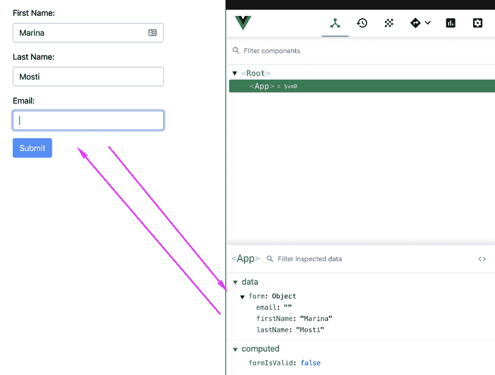

# 最简单的形式

好吧让我们从头开始（在路上绕道一点，让它看起来很漂亮）。我们将用表单创建一个非常简单的页面。此表格将要求我们的用户提供一些基本的个人数据，表格的第二部分将用于更具体的问题。

在本章结束时，您将对如何在 Vue 中构建基本表单有一个坚实的理解，此外，您还将快速复习 Vue 的基本概念，如`v-model`、事件和属性。

在本章中，我们将介绍以下主题：

*   开始使用引导
*   实际上写了一些代码
*   将输入绑定到本地状态
*   提交表单的数据
*   引入 Axios

# 技术要求

本章的代码可以在以下 GitHub 存储库中找到：

[https://github.com/PacktPublishing/Building-Forms-with-Vue.js/tree/master/Chapter02](https://github.com/PacktPublishing/Building-Forms-with-Vue.js/tree/master/Chapter02) 。

请查看以下视频以查看代码的运行情况：

T0http://bit.ly/35F6340 T1

# 开始使用引导

让我们首先将 bootstrap4 作为一个依赖项添加到我们的项目中，这样我们就不必考虑设计问题，可以专注于表单的功能

Bootstrap 是一个流行的开源工具包，它为我们提供了一些预定义的类和样式，这样我们就可以使我们的应用程序看起来很漂亮，而不必担心样式。

要为我们的项目安装和设置引导程序，请执行以下步骤：

1.  打开终端到项目文件夹，并使用以下命令安装依赖项：

```js
> npm install bootstrap
```

2.  令人惊叹的这会将包添加到我们的`node_modules`文件夹和`package.json`。现在，继续将必要的样式导入到`src/main.js`。使用以下命令执行此操作：

```js
import 'bootstrap/dist/css/bootstrap.min.css';
```

我们不会使用任何 Bootstrap 脚本，因此我们只能使用缩小的 CSS。

让我们对`App.vue`文件做一点清理，因为现在我们只有一些样板代码，但我们想重新开始！那么，让我们开始清理：

1.  用以下代码替换`App.vue`内的所有内容：

```js
<template>
  <div id="app">
  </div>
</template>

<script>
export default {
  name: 'app'
}
</script>
```

2.  继续，通过在终端上运行以下命令来启动开发服务器：

```js
> npm run serve
```

3.  打开终端显示给您的链接（显示本地的链接），您应该会在浏览器中看到一个空白屏幕。

看第一步的空白画布，形成伟大和东西！哎呀！

让我们继续，开始实际的表单。现在是编写代码的时候了。

# 实际上写了一些代码

好了，设置够了，让我们写一些代码吧！我们将从一个非常简单的表单开始，这样我们的用户就可以填写他们的个人信息。没什么疯狂的，只是小步而已。

我们将在表单中添加三个字段。一个`firstName`输入、一个`lastName`输入和一个`email`输入。最后，我们将添加一个`Submit`按钮。

还记得我们安装 Bootstrap 的时候吗？这就是它发光的地方。我们将要添加到标记中的所有类都将通过引导神奇地设置样式。

对您的`App.vue`文件进行以下更改：

```js
<template>
  <div id="app" class="container py-4">
    <div class="row">
      <div class="col-12">
        <form>
          <div class="form-group">
            <label>First Name:</label>
            <input type="text" class="form-control">
          </div>

          <div class="form-group">
            <label>Last Name:</label>
            <input type="text" class="form-control">
          </div>

          <div class="form-group">
            <label>Email:</label>
            <input type="email" class="form-control">
          </div>

          <div class="form-group">
            <button type="submit" class="btn btn-primary">Submit</button>
          </div>
        </form>
      </div>
    </div>
  </div>
</template>
```

在前面的代码示例中，我们已经用[T0]设置了一个容器。在这个`row`中，我们用三种不同的输入填充了它，两种`text`类型（一种用于第一个，一种用于姓氏）和一种`email`类型的输入。最后，我们添加了`<button>`，这将作为提交表格的主要方式。

保存文件并签出浏览器。如果服务器仍在运行，则应该可以看到自动反映的更改。好吧，我同意这有点令人失望，但我确实说过我们从一个简单的例子开始，这是最简单的！

表单功能齐全，您甚至可以单击 Submit 按钮，让它自行提交，而完全不需要完成任何工作。整洁的但让我们用一些 Vue 来调味。

# 将输入绑定到本地状态

web 应用程序中表单的目的是捕获一些用户输入，并能够对其进行处理。在我们的示例中，对于我们的 Vuetiful 计划，我们仍然无法使用 JavaScript 访问用户的输入，因此，让我们从这个开始。

请注意，您不必将表单的数据包装到辅助对象中，但我发现它更干净，尤其是当您开始向组件添加其他数据属性时，这些属性可能不一定与表单相关。

在`App.vue`文件的实例上创建一个新的`data`属性。在它里面，我们将声明一个`form`对象，它将依次为我们的每个输入保存一个属性：

```js
<script>
export default {
  name: 'app',
  data() {
    return {
      form: {
        firstName: '',
        lastName: '',
        email: ''
      }
    }
  }
}
</script>
```

为了将输入值绑定到内部状态，我们需要使用 Vue 的`v-model`属性。那么，让我们将`v-model`添加到每个输入中。这样，每当用户输入或删除信息时，输入元素的值将绑定到我们的`data`属性。

记住`v-model`不是*魔法*属性。这是两件事的简写：

*   它绑定我们输入框的`input`事件：

```js
v-on:input="form.name = $event.target.value"
```

*   它将`value`属性绑定到我们的`data`属性：

```js
 v-bind:value="form.firstName"
```

继续并将`v-model`添加到我们的所有输入中：

```js
...
<div class="form-group">
  <label>First Name:</label>
  <input 
    v-model="form.firstName" 
    type="text" 
    class="form-control"
  >
</div>
<div class="form-group">
  <label>Last Name:</label>
  <input 
    v-model="form.lastName" 
    type="text" 
    class="form-control"
  >
</div>
<div class="form-group">
  <label>Email:</label>
  <input
    v-model="form.email"
    type="email"
    class="form-control"
  >
</div>
```

以下屏幕截图显示了 Vue developer 工具，显示了表单与数据中的内部状态之间的双向数据绑定：



干得好！现在，这并不令人印象深刻，但我们正在为未来的事情奠定基础。

在下一节中，我们将了解如何处理提交并发送到 API 端点的表单。

# 提交表单的数据

与当前一样，当您单击“提交”按钮时，表单将被提交到同一 URL。这不是 Vue magic，这只是默认的`<form>`行为，特别是因为我们没有在标记上指定动作属性。

在大多数真实场景中，您需要在提交表单之前执行几个操作。最常见的是验证某些输入，甚至可能使用 Axios 之类的库通过异步调用重写默认提交行为

首先，我们需要确保，当用户单击 Submit 按钮时，我们防止表单自行退出。我们还希望将一个新方法绑定到正在单击的方法。

让我们先绑定表单的`submit`事件。请记住，我们希望将`.prevent`修饰符添加到事件中，以便在提交表单时不会触发默认行为，并且我们的函数将按预期运行：

```js
<form @submit.prevent="onSubmit">
  ...
</form>
```

含糖的现在我们需要在`App.vue`文件的配置上创建这个新的`onSubmit`方法。让我们在`click`方法处理程序中使用`console.log`来验证它是否有效，然后再进行详细说明

将此代码作为属性添加到导出默认声明中：

```js
methods: {
  onSubmit() {
    console.log('click');
  }
}
```

为了验证一切正常，请打开浏览器并单击“提交”按钮几次。检查控制台；日志应该显示 click。到目前为止，我们已经成功地控制了表单的行为。

让我们以一个*非常*的基本验证方法为例。我们将验证三个字段的输入长度是否为`> 0`（非空）。在后面的一章中，我们将讨论 Vuelidate，它将为表单提供更深入、更强大的验证。

让我们创建一个名为`formIsValid`的新计算属性，它将检查我们刚才讨论的条件。将以下内容添加到`App.vue`：

```js
computed: {
  formIsValid() {
    return (
      this.form.firstName.length > 0 && 
      this.form.lastName.length > 0 && 
      this.form.email.length > 0
    );
 }
}
```

现在我们有了一个检查表单状态的计算属性，让我们在`onSubmit`方法中实际使用它。我们将验证`this.formIsValid`是否为`true`，如果不是，我们将返回并阻止提交表格。目前，我们仅使用`console.log`进行确认。

将`onSubmit`方法调整为如下：

```js
onSubmit() {
  if (!this.formIsValid) return;
  console.log('Send my form!');
}
```

继续在您的浏览器上进行测试。如果您缺少任何字段，您将无法获得`console.log`，因为验证将失败。如果您将它们填满并点击提交按钮，您将在控制台中收到消息

在下一个模块中，我们将合并第三方库 Axios，以帮助我们发送数据。

# 引入 Axios

表单中的下一步是让表单将用户的数据发送到服务器。例如，数据实际上不会存储在任何地方，但我们将了解创建 POST 调用的步骤，大多数表单将使用 POST 调用将数据传输到 API 或服务器端点。

Axios 是一个非常棒的、流行的库，用于从服务器发送和接收数据。我个人建议，只要您需要从 Vue 应用程序进行任何 HTTP 调用，就可以使用它。您可以在这里找到 GitHub 的官方页面：[GitHub.com/axios/axios](http://github.com/axios/axios)。

按照以下步骤在项目中准备好 Axios：

1.  启动终端并运行以下命令：

```js
> npm install axios
```

2.  我们需要一个 API 端点来调用。由于我们手头没有任何服务器，为了让事情变得简单，我们将使用一个名为 Mockoon 的应用程序。前往[mockoon.com/#下载](http://mockoon.com/#download)并为您的操作系统下载应用程序。安装后，启动它。

3.  在第二列中，您将看到两个示例管线；我们感兴趣的是去海豚的后路线（坦率地说，我更像是海獭类型的女孩，但我是随波逐流的）。继续，点击顶部的绿色游戏三角形；默认情况下，这将在`localhost:3000`上启动服务器，但无论出于何种原因，如果默认端口不适用于您，您可以更改端口。
4.  现在 Axios 已经作为一个依赖项添加到项目中，我们可以将其导入到`App.vue`中，以利用其不同的方法
5.  将导入语句添加到`App.vue`文件的顶部，就在打开`<script>`标记之后，`export default {`行之前：

```js
import axios from 'axios';
```

由于这一导入，我们现在可以在该组件的任何位置使用 Axios。请记住，如果以后我们想在另一个组件或文件上使用它，我们将不得不再次导入它。

6.  让我们再次更新`onSubmit`按钮。这一次，我们将去掉`console.log`，然后用 Axios 打`async`电话：

```js
onSubmit() {
  if (!this.formIsValid) return;
  axios
    .post('http://localhost:3000/dolphins', { params: this.form })
    .then(response =>   {
      console.log('Form has been posted', response);
    }).catch(err => {
      console.log('An error occurred', err);
    });
}
```

每个 Axios 方法都返回一个承诺，这是一个普通的 JavaScript 对象。[T0]块在这个承诺解决时被调用，换句话说，当实际的 HTTP 请求完成时！有关 promises 的更多信息，MDN 在[developer.mozilla.org/en-US/docs/Web/JavaScript/Reference/Global_Objects/Promise](http://developer.mozilla.org/en-US/docs/Web/JavaScript/Reference/Global_Objects/Promise)上有大量资源。

如果您现在进入浏览器试用，您会看到，当点击提交按钮时，我们的`onSubmit`方法被触发，并且`console.log`被成功执行。在这一点上，我们可以说，我们有一个非常基本的（但可悲的是无用的）形式！

让我们更进一步，实际上禁用输入按钮，直到表单有效。（请记住，我们的验证目前非常薄弱，但我们将在稍后进行处理。）

回到您的模板，让我们将按钮的`:disabled`属性连接到我们的计算属性`formIsValid`：

```js
<button 
  :disabled="!formIsValid" 
  @click.prevent="onSubmit" 
  type="submit" 
  class="btn btn-primary"
> 
  Submit
</button>
```

再次在浏览器中进行测试，您将看到“输入”按钮变灰，直到表单实际填写完毕。整洁的

# 总结

在本章中，我们已经采取了创建简单数据收集表单的第一步。我们使用 Bootstrap 设计了它，并将其与`<form>`事件挂钩。最后，我们使用 Axios 和 Mockoon 将数据发送到虚拟后端进行测试。

在下一章中，我们将研究如何利用 Vue 的强大功能构建可重用的表单组件。