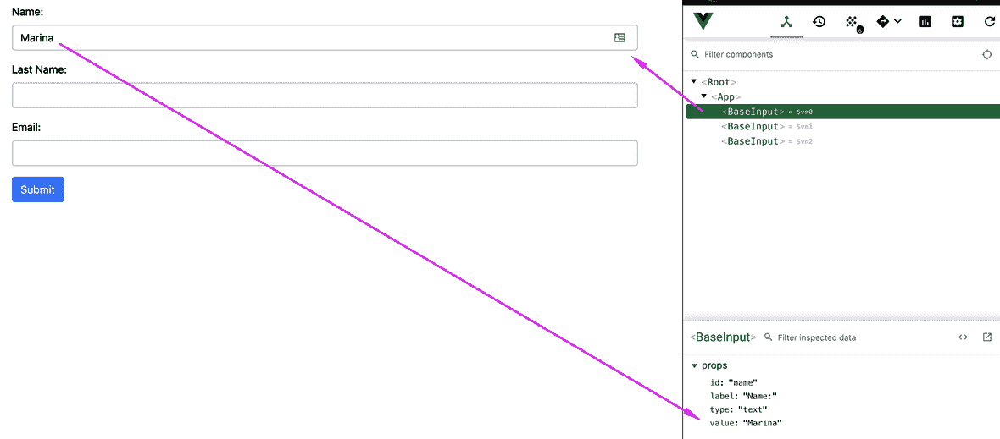

# 创建可重用的表单组件

Vue 最强大的部分之一是其制作组件的能力

组件是可重用的代码，通常包括模板、脚本和样式。组件的神奇之处在于，您可以将特定元素或元素组的所有逻辑封装到单个单元中。

从组件的角度开始思考的一个好方法是开始将日常对象分解为简单的、更小的部分。（请记住！）

以您正在使用的计算机为例。作为一个整体，整个系统可以称为一台计算机。现在把它拆得更细，它有显示器、键盘和电缆。现在拿起键盘并将其分解。现在您有了一个容器，这个容器有密钥。每个键都是一个单独的组件，它自身会重复，并且某些属性在彼此之间会有所不同。键上的标签会更改，有时还会更改大小。

这个关键部件呢？你能进一步细分吗？大概但是值得吗？键盘键是一个很好的单一组件。它有明确的属性来定义它，我们可以清楚地定义它的内部功能。当它被按下时，我们需要告诉包含它的人按下了一个键，以及该键的值

这种精神崩溃的过程也可以应用于任何 Vue 应用程序。从应用程序作为一个整体开始，并将其分解

现在，我们目前的形式是`App.vue`上的一个大斑点，这不太理想。让我们创建一些组件！

在本章中，我们将介绍以下主题：

*   将应用程序分解为可重用组件
*   了解定制组件中的`v-model`
*   实现自定义输入和选择组件

# 技术要求

本章的代码可以在以下 GitHub 存储库中找到：

[https://github.com/PacktPublishing/Building-Forms-with-Vue.js/tree/master/Chapter03](https://github.com/PacktPublishing/Building-Forms-with-Vue.js/tree/master/Chapter03) 。

请查看以下视频以查看代码的运行情况：

我对上帝发誓。http://bit.ly/2qgj7wx T1。

# 将表单分解为多个组件

看看`App.vue`，让我们从我们可以创建的最小组件开始。如果你仔细看，你会在代码中看到一个重复的模式——这通常是一个好的迹象，表明某些东西可以成为一个好的组件！

在`<form>`元素中，我们有三种不同的文本输入。其中两人属于`type``text`，一人属于`type``email`。看起来我们需要某种方法将这些值分配给`type`属性。道具对象可能是一个简单的解决方案！

作为快速提醒，以下是表单的当前代码：

```js
<div class="form-group">
  <label>First Name:</label>
  <input v-model="form.firstName" type="text" class="form-control">
</div>
<div class="form-group">
  <label>Last Name:</label>
  <input v-model="form.lastName" type="text" class="form-control">
</div>
<div class="form-group">
  <label>Email:</label>
  <input v-model="form.email" type="email" class="form-control">
</div>
```

继续，在`src/components`文件夹中创建一个新文件，命名为`BaseInput.vue`。就我个人而言，我喜欢将我最基本的输入组件命名为`Base`；这样，我知道这是我在应用程序中可以找到的最简单的输入形式

如果我需要制作一个以某种方式扩展或使用`Base`的组件，那么我可以简单地导入`BaseInput`组件，并进行一些调整！不过，请随意使用您喜欢的任何命名约定。如果您想要一些命名组件的实际样式指南和最佳实践，请参阅此处的官方指南：[https://vuejs.org/v2/style-guide/](https://vuejs.org/v2/style-guide/) 。

让我们将第一个输入从`App.vue`复制到`<template>`标记中的新组件中，这样我们就有了一个基础：

```js
<template>
  <div class="form-group">
    <label>Name:</label>
    <input v-model="form.firstName" type="text" class="form-control">
  </div>
</template>
<script>
export default {

}
</script>
```

我们需要做的第一件事是找出如何去掉硬编码的值；毕竟，将代码提取到组件中的目的是使组件具有动态性和可重用性。

让我们创建一个 prop 对象来保存`label`的值（名称为`string`：

```js
<script>
export default {
  props: {
    label: {
      type: String,
      required: true
    }
  }
}
</script>
```

我们将使用扩展的方法来声明属性，使用对象表示法。通过这种方式，我们可以确保使用我们的组件的任何人如果忘记定义标签，至少会被浏览器中的控制台大喊大叫。

现在，让我们回到模板，用新创建的 prop 对象替换该值：

```js
<template>
  <div class="form-group">
    <label>{{ label }}</label>
    <input v-model="form.firstName" type="text" class="form-control">
  </div>
</template>
```

还有一个，那类型呢？我们可能希望（而且我们会）将其用于电子邮件，并最终用于密码字段。

让我们为此创建一个新的道具对象，并将其绑定，如前所述：

```js
props: {
  label: {
    type: String,
    required: true
  },
  type: {
    type: String,
    default: 'text',
    validator(value) {
      return ['text', 'email', 'password'].includes(value);
    }
  }
}
```

我们新类型的属性有一个默认值，在实现该属性时，如果组件中缺少该属性，将使用该默认值

`validator`是一个可以很好地验证的函数！它只接受一个参数，即传递到属性中的值，并且它必须返回一个布尔值，以验证该值是否可用于属性（`validator`验证！）

在这种特殊情况下，我们只是检查它是否是我们将允许此组件的三个选择之一：`text`、`email`或`password`。

现在我们设置好了，让我们更新`<input>`：

```js
<input v-model="form.firstName" :type="type" class="form-control">
```

到目前为止，一切都很好！除了还有一件事我们还缺少，那就是我们必须重构。你能认出它吗

到目前为止，我们已经看到了如何将表单分解为组件。现在让我们更深入地了解一下`v-model`，以及它在创建动态组件时的重要性。

# 了解定制组件中的 v 模型

如您所知，`v-model`是给定元素上`v-on:input`和`v-bind:value="value"`的缩写。它允许我们双向绑定特定元素的值，以及它发出的事件到我们的一个内部状态属性。

然而，在讨论组件组成时，我们需要考虑额外的事情。

为了让定制组件能够实现`v-model`合同，我们必须确保发生两件事。这是正确的！我们需要确保组件具有`value`属性，并且它`$emits`是一个输入事件。

有一种方法可以通过使用`model`属性来更改此默认行为，但它超出了本书的范围。如果您想告诉您的组件使用不同的属性，或者为`v-model`使用不同的事件，请查看[https://vuejs.org/v2/api/#model](https://vuejs.org/v2/api/#model) 。

让我们把这个理论付诸实践。我们将修改`BaseInput`组件，以便能够使用`v-model`绑定。首先，让我们添加一个`value`属性，并将其挂接到`<input>`：

```js
props: {
  label: {
    type: String,
    required: true
  },
  type: {
    type: String,
    default: 'text',
    validator(value) {
      return ['text', 'email', 'password'].includes(value);
    }
  },

  // Add this new prop
  value: {
    type: String,
    required: true
  }
}
```

现在我们有了新的`value`道具，我们需要将其绑定到`<input>`的值。不过，一定要把旧的`v-model`从上面取下来！请看以下示例：

```js
<input :value="value" type="text" class="form-control">
```

几乎在那里；现在我们需要确保`<input>`在更新时发送输入事件。因此，我们需要添加一个事件处理程序来`$emits`处理这些信息。

**Important!** Before we continue, let me tell you about a very common *gotcha* when working with `v-model` and forms. Not all inputs are created equally! The `<input>` text elements (`text`, `email`, and `password`) and `<textarea>` are easy. They fire input events that we can listen to for our `v-model` binding. But, what about `select`, `checkboxes`, and `radio`?

Vue 文档非常清晰，因此我将引用它：

“*`v-model`内部使用不同的属性，针对不同的输入元素发出不同的事件：*

*   *`text`和`textarea`元素使用`value`属性和`input`事件；*
*   *`checkboxes`和`radiobuttons`使用`checked`属性和`change`事件；*
*   *`select`字段使用`value`作为道具，`change`作为事件。*

现在我们已经排除了这个理论，让我们来听听我们的活动：

```js
<input 
  :value="value" 
  :type="type" 
  class="form-control"
  @input="$emit('input', $event.target.value)"
> 
```

祝贺我们的`BaseInput`组件已准备好使用。

现在我们已经清楚地了解了`v-model`和自定义组件，我们将在表单中使用我们的组件。它将使它更具可读性、动态性和易于维护。

# 实现自定义输入组件

创建可重用的自定义组件是 Vue 的核心部分，但要使组件真正有用，我们必须实际使用它们！

打开您的`App.vue`文件，让我们用自定义组件替换三个`<div class="form-group">`元素。

第一件事：我们要做的是将组件导入到我们的文件中。让我们别挡道。将以下导入添加到`<script>`元素的顶部，如下所示：

```js
import BaseInput from '@/components/BaseInput';
```

仅仅导入文件是不够的；实际上，我们必须将组件添加到文件中组件的属性中，以便我们可以在模板中使用它。我们目前在 Vue 实例中没有这样的属性，所以让我们在`name`和`data()`之间创建一个：

```js
...
components: { BaseInput },
...
```

现在我们已经注册了我们的组件，并导入到我们的`App.vue`文件中，我们可以进入模板，用新组件替换旧输入：

```js
<BaseInput 
  label="First Name:" 
  v-model="form.firstName" 
/>
<BaseInput 
  label="Last Name:" 
  v-model="form.lastName" 
/>
<BaseInput 
  label="Email:" 
  v-model="form.email" 
  type="email" 
/>
```

返回浏览器，使用该应用程序进行游戏。您应该看到，即使没有任何实际更改，表单现在由可重用的输入组件驱动，如果我们曾经面临更新输入的 CSS 的需要，例如，我们只需在该文件中更改一次，整个应用程序就会更新以反映这些更改。

再次打开 Vue DevTools，确保选择了第一个图标（用于组件结构的图标）。深入到结构中，您将看到三个`BaseInput`组件。

你甚至可以点击其中的每一个，道具面板将清晰地显示每一个道具的独特之处！ 

在下面的屏幕截图中，您可以看到，当我在 name:字段中键入我的名字时，<baseinput>组件将其反映在其 value 属性中：</baseinput>



还有一件事！在表单中键入一些值并查看“道具”框，它将使用 value 属性中的双向绑定进行实时更新。现在，单击 DevTools 上的第三个图标，看起来像一堆点的图标这是事件视图。

再次输入其中一个输入，您将看到事件框将充满条目。单击其中一个，您会注意到每次击键都会触发输入事件

这是两个不同的*操作-*值得到更新和触发的输入事件弥补了`v-model`的工作，正如我们前面讨论的！

让我们来看看下面的截图：


在前面的屏幕截图中，您可以看到`<BaseInput>`组件如何发出输入事件-`payload`是用户在表单中键入的内容。

# 再来一次–带下拉列表！

在我们结束本章之前，让我们构建一个自定义组件来封装一个下拉输入，以便回顾到目前为止所学的内容。

首先创建组件文件，我们将其命名为`BaseSelect.vue`，并将其放入`components`文件夹中。

正如我们对[T0]所做的那样，首先我们要定义我们的 HTML 模板。我们将暂时保留一些属性为空，因为稍后将绑定它们。我们还将设置一些虚拟数据以便于测试。在组件创建中，您会发现小步骤才是正确的选择！

添加以下代码作为`BaseSelect`的模板：

```js
<template>
  <div class="form-group">
 <label>Label here</label>
 <select class="form-control">
 <option value="">Test!</option>
 <option value="">Me!</option>
 <option value="">:D</option>
 </select>
  </div>
</template>
```

看起来不错！让我们将这个新组件导入到`App.vue`中，并导入到我们的模板中，这样我们就可以在浏览器中测试它。请按照给定的步骤执行此操作：

1.  导入`script`元素顶部`BaseInput`导入语句旁边的组件：

```js
import BaseSelect from '@/components/BaseSelect';
```

2.  在您的`components`声明中添加`BaseSelect`：

```js
components: { BaseInput, BaseSelect },
```

3.  在`<template>`元素内部，在最后一个`BaseInput`组件的正下方，在持有输入按钮的`div`之前创建`BaseSelect`的实例：

```js
...
<BaseSelect />
... 
```

检查浏览器，您将看到我们新选择的组件正在运行。她不漂亮吗？

让我们更进一步，我们急需一些`props`。让我们从添加`label`开始；我们可以从模板中看出，它需要动态化

在新的`script`元素中创建您的`props`对象，并将其添加到列表中：

```js
<script>
export default {
  props: {
    label: {
      type: String,
      required: true
    }
  }
}
</script>
```

现在，转到模板并动态绑定它们。我们需要通过一些插值使`<label>`的内容动态化：

```js
<template>
  <div class="form-group">
    <label>{{ label }}</label>
    <select class="form-control">
      <option value="">Test!</option>
      <option value="">Me!</option>
      <option value="">:D</option>
    </select>
  </div>
</template>
```

到目前为止，一切都很好！返回到`App.vue`，并将这些新的`props`添加到我们的示例组件中：

```js
<BaseSelect 
  label="What do you love most about Vue?" 
/>
```

在浏览器中进行测试，确保没有损坏。到目前为止，该组件运行良好，但它显示的选项仍然是硬编码的。这次让我们实现一个`options`属性，它将是一个对象数组，我们将使用它填充`select`选项。

返回`BaseSelect.vue`并创建新属性：

```js
options: {
  type: Array,
  required: true,
  validator(opts) {
    return !opts.find(opt => typeof opt !== 'object');
  }
}
```

对于`validator`对象，我们将使用 JavaScript 数组，以便找到一个方法，看看是否可以在数组中找到一个不是对象的元素。如果发现某个内容，`find`方法将返回该内容，`!`将对其求值为`false`，这将抛出控制台错误。如果未找到任何内容（且所有元素都是对象），则`find`返回`undefined`，由`!`转为`true`，验证通过

有关`find`方法的更多信息，请查看以下链接：[https://developer.mozilla.org/en-US/docs/Web/JavaScript/Reference/Global_Objects/Array/find](https://developer.mozilla.org/en-US/docs/Web/JavaScript/Reference/Global_Objects/Array/find) 。

让我们继续在`<select>`元素中实现一个`v-for`循环：

```js
<select class="form-control">
  <option 
    v-for="opt in options"
    :key="opt.value"
    :value="opt.value"
    >
    {{ opt.label || 'No label' }}  
  </option>
</select>
```

将`<option>`和`v-for`中的每一个元素创建一个新的元素；别忘了设置`:key`属性！

如果您想了解更多关于`:key`的信息，即何时使用以及为什么使用，请在以下链接查看我的文章：[https://www.telerik.com/blogs/in-vue-when-do-i-actually-need-the-key-attribute-and-why](https://www.telerik.com/blogs/in-vue-when-do-i-actually-need-the-key-attribute-and-why) 。

我们需要选项中的每个对象都有一个`label`和`value`属性，但如果缺少`label`，我们将提供一个默认值。

回到`App.vue`，我们将在`data()`中创建一个名为`loveOptions`的新内部`state`属性，它将保留我们对该`<Select>`的选项：

```js
return {
  form: ...,
  loveOptions: [
    { label: 'Fun to use', value: 'fun' },
    { label: 'Friendly learning curve', value: 'curve' },
    { label: 'Amazing documentation', value: 'docs' },
    { label: 'Fantastic community', value: 'community' }
  ]
}
```

现在我们已经设置好了，转到模板并将其绑定到我们的`BaseSelect`组件的`options`道具：

```js
<BaseSelect 
  label="What do you love most about Vue?" 
  :options="loveOptions"
/>
```

保存并签出选项后返回浏览器。它还活着！

还有一点我们需要添加到这个组件中，`v-model`功能。我们需要创建一个`value`道具，让选中的`option`属性使用它，并确保从组件内部触发输入事件。

"Remember, remember, the rules of `v-model`, the properties bindings and emit. I know of no reason, the `v-model` system, should ever be forgot." - Vue Fawkes

在这种情况下，因为我们将把`v-model`与`select`一起使用，请记住，我们需要倾听变化，即使是在内部！另一件需要注意的事情是，您可能会试图在[T3]标记的顶部放置一个[T2]绑定，这不是使用 selects 的正确方法！

HTML 中的`<select>`元素没有`value`属性；它所做的是将`selected`属性应用于其中的`option`元素，该元素保存当前值：

1.  添加`value`属性：

```js
      value: {
        type: String,
        required: true
      }
```

2.  您将使用`value`道具检查此选项的值是否等于它。确保我们在`select`元素触发`change`事件时发出`input`：

```js
      <select 
        class="form-control"
        @change="$emit('input', $event.target.value)"
       >
        <option
          v-for="opt in options"
          :key="opt.value"
          :value="opt.value"
          :selected="value === opt.value"
          >
          {{ opt.label || 'No label' }}  
        </option>
      </select>
```

3.  返回到`App.vue`并将`v-model`绑定添加到此新元素。您需要在`data()`中的`form`道具内创建一个名为`love`的新属性，并将`v-model`属性添加到`BaseSelect`元素中：

```js
      form: {
        firstName: '',
        lastName: '',
        email: '',
        love: 'fun'
      },
```

`BaseSelect`元素现在将具有`v-model`绑定：

```js
<BaseSelect 
        label="What do you love most about Vue?" 
        :options="loveOptions"
        v-model="form.love"
      />
```

最后，检查你的浏览器，看看一切正常。进入 DevTools 并检查你的应用程序组件，你会看到当你切换 select 的值时，它也会更新！

# 总结

在本章中，我们介绍了将单例应用程序或表单分解为可重用动态组件的过程。我们已经介绍了重要的 Vue 核心功能，如`v-model`、属性和事件。

在下一章中，我们将更进一步，实现一个非常接近**u****ser 体验**（**UX**的）相关功能，输入掩码！