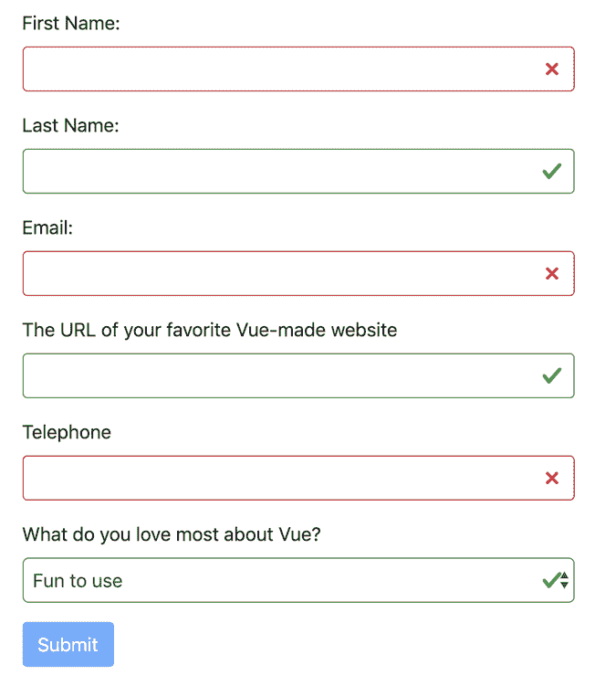

# 使用 Vuelidate 进行输入验证

在生产就绪表单中，必须验证用户输入。即使在服务器端，应用程序应该仔细检查传递给它们的所有数据，对于任何有经验的开发人员来说，在前端预先验证数据也是一项强制性的实践。

在本章中，我们将介绍一个非常著名且功能强大的表单验证库 Vuelidate。您将学习如何在项目中使用此库，并能够使用它成功验证用户输入。

谢天谢地，在 Vue 中，我们为第三方库提供了一些不同的选项，例如 Vuelidate、VeeValidate，甚至 Vuetify 也有自己的验证方法

在本章中，我们将介绍 Vuelidate。从安装到创建规则并将其应用于表单输入，以及使用错误状态通知用户问题。

本章将涵盖以下主题：

*   安装依赖项
*   创建验证规则
*   将验证转移到自定义输入中
*   添加最后的润色

# 技术要求

本章的代码可以在以下 GitHub 存储库中找到：

[https://github.com/PacktPublishing/Building-Forms-with-Vue.js/tree/master/Chapter05](https://github.com/PacktPublishing/Building-Forms-with-Vue.js/tree/master/Chapter05) 。

请查看以下视频以查看代码的运行情况：

T0http://bit.ly/2VJIL8E T1

# 安装依赖项

让我们首先在项目中作为依赖项安装 Vuelidate，然后使用它进行验证。遵循以下步骤：

1.  打开终端并执行以下命令：

```js
> npm install vuelidate
```

一旦安装了库，我们必须将其导入`main.js`并将其作为插件使用，这样我们的所有组件都可以在全球范围内使用它。

2.  在导入`Vue`和`App`的代码后，将以下代码添加到`main.js`：

```js
import Vuelidate from 'vuelidate';
Vue.use(Vuelidate);
```

现在 Vuelidate 已经安装，并且是我们项目依赖项的一部分，我们准备让它完成一些繁重的工作。在下一节中，我们将创建验证规则。

# 创建验证规则

当我们通过`Vue.use`将 Vuelidate 添加到我们的项目中时，库添加了一个新的保留属性，我们可以在组件上使用它：`validations`。

此属性与[T0]、[T1]等一起添加到组件的配置对象中。它也是一个对象，它为我们要验证的每个输入保存自己的属性。

让我们创建这个属性并设置一个新的输入，而不需要测试自定义组件包装器。一旦我们了解了基础知识，我们就可以将所有这些内容转换为`BaseInput`和`BaseSelect`组件。

按照以下步骤创建验证规则：

1.  在`App.vue`中`BaseInput`的`telephone`对象下方新建`<input>`表单：

```js
<input type="text" v-model="form.website" />
```

2.  记住将这个新属性`website`添加到`data()`的`form`对象中：

```js
form: {
  firstName: '',
  lastName: '',
  email: '',
  love: 'fun',
  telephone: '',
  website: ''
},
```

现在，让我们实际创建一个`validations`属性；现在，我们只添加`form.website`验证。

3.  将其放置在`component`对象的顶层，与您的`data()`和计算属性处于同一层：

```js
validations: {
  form: {
    website: {
      // our validations will go here
    }
  }
}
```

对于这个特定字段，我们希望确保验证用户提供的输入是否是有效的 URL。在 Vuelidate 中，我们有几个不同的内置验证器，可以开箱即用。完整的列表可在[中找到 https://vuelidate.netlify.com/#sub-内置验证器](https://vuelidate.netlify.com/#sub-builtin-validators)。

为了验证输入是否是有效的 URL，我们有 URL 验证器。但是，为了将它添加到我们网站的`validators`对象中，我们必须首先导入它。Vuelidate 允许我们只导入我们实际将要使用的验证器；这样，我们可以确保部署的代码保持较小。

4.  将以下导入语句添加到`App.vue`，靠近其他导入：

```js
import { url } from 'vuelidate/lib/validators';
```

5.  现在我们已经导入了该语句，最后可以将其添加到`validations.website`对象中：

```js
validations: {
  form: {
    website: {
      url // Validate that the "website" input is a valid URL
    }
   }
 },
```

建立我们的规则就够了。还记得我们之前创建用来保存`v-model="form.website"`的新`<input>`表单吗？我们需要对`v-model`的设置方式进行一些调整，以便 Vuelidate 负责验证。

除了我们之前用来设置规则的`validations`属性外，Vuelidate 还允许我们访问组件实例中的一个新属性：`$v`。

`$v`是一个特殊的对象，它持有我们的验证结构的副本。`$model`每个元素都有一个值得注意的特性`validations`。Vuelidate 将成为我们的*中介*模式，反过来，它将自动处理对`data()`内`form.website`物业的实际约束力。

让我们在实践中看看这一点：

6.  更新`<input>`网站元素以使用 Vuelidate 期望的新`v-model`格式。此外，我们将在其下方插入`$v`对象，以便您可以更清楚地看到幕后发生的事情，如下所示：

```js
<input type="text" v-model="$v.form.website.$model" />
<pre>{{ $v }}</pre>
```

7.  在新表单字段中键入任何内容之前，请返回浏览器，查看`$v`对象的结构

首先要特别注意的是`form.website`对象。在此对象内，Vuelidate 将保持此输入的验证状态。`$model`属性将保存用户的输入，正如我们告诉`v-model`的那样。`$error`属性实际上会切换布尔值，并会让我们知道输入中是否有错误。

尝试在字段中键入一些随机乱码，并观察更新的属性。`$error`属性将更新为`true`，表示存在错误。直接绑定到 URL 规则的`url`属性将切换到`false`，表示不满足 URL 验证条件。

8.  让我们在`<input>`上添加一些 CSS 绑定，以便直观地显示某些内容未通过输入验证：

```js
<input 
  type="text"
  v-model="$v.form.website.$model" 
  class="form-control"
  :class="{ 
    'is-valid': !$v.form.website.$error && $v.form.website.$dirty,
    'is-invalid': $v.form.website.$error
  }"
/>
```

在我们进一步解释之前，请在您的浏览器中尝试此操作。请尝试键入有效的 URL，如[T0]http://google.com ，并注意输入如何变化以反映您的变化

`:class`绑定是一种将类有条件地添加到 Vue 中任何 HTML 元素的方法。在我们这里使用的语法类型中，一个对象允许我们设置一个键值对，其中键定义了我们想要切换的类，例如，`is-valid`

该值是一个 JavaScript 条件，将对其进行计算，以确定是否应应用该类。这些条件是反应性的，并且每次条件的依赖项更改时都将重新执行。

在我们的示例中，`is-valid`将在上切换*，只要没有`$error`且输入为`$dirty`。如果您想知道为什么我们还要检查`$dirty`，请尝试删除该部分条件，然后重新加载浏览器。您会立即注意到，绿色边框和复选标记出现在输入上，即使元素中没有任何值。通过`$dirty`属性判断`<input>`是否在任何时候被用户修改；在这种情况下，从用户体验的角度来看，在实际有输入之前不显示有效的可视队列是有意义的。*

在`is-invalid`的情况下，我们正在检查字段中是否存在`$errors`，并使用漂亮的红色边框和 x 图标设置字段。

现在我们已经有了一些基本规则，让我们继续下一节，在那里我们将学习如何将所有这些合并到自定义组件中。

# 将验证转移到自定义输入中

拥有自己的定制组件的奇妙之处在于，您可以以任何喜欢的方式制作它们。在本章中，我们将为组件添加对有效和无效状态的支持。主验证逻辑仍将由父级`App.vue`持有，因为它是持有表单的包含组件。

按照以下步骤添加验证：

1.  首先，让我们为每个输入添加新规则。将以下内容添加到`validations`属性：

```js
validations: {
form: {
first_name: { alpha, required },
last_name: { alpha },
    email: { email, required },
  telephone: {
      validPhone: phone => phone.match(/((\(\d{3}\) ?)|(\d{3}-))? 
      \d{3}-\d{4}/) !== null
    },
    website: { url },
    love: { required }
  }
},
```

2.  请不要忘记更新您的导入语句，以引入我们现在使用的新验证器，如下所示：

```js
import { url, alpha, email, required } from 'vuelidate/lib/validators';
```

让我们看一下新的验证器：

*   `alpha`：这将限制字段仅包含字母数字字符
*   `required`：该字段为必填字段；如果没有值，则无效。
*   `email`：此字段确保输入的电子邮件格式有效。

对于`telephone`字段，我们将进行一些自定义验证，因为该字段被屏蔽为具有特定格式`(###)###-####`，我们需要编写自己的验证函数。

在本例中，我们调用验证器，`validPhone`，它是一个返回布尔值的函数。该布尔值是通过将电话与正则表达式匹配并确保其不为空来计算的；也就是说，它确实有一个匹配项。

现在我们已经准备好了所有的`validations`，我们必须更新`App.vue`模板。我们的`BaseInput`组件和`BaseSelect`组件需要更新`v-model`，以便它指向 Vuelidate 模型，而不是我们的本地状态。此外，我们需要将我们的网站输入更新为完整的`BaseInput`组件。

3.  对代码进行以下更改；我们正在更新`v-model`和输入类型：

```js
<form>
  <BaseInput 
    label="First Name:" 
    v-model="$v.form.firstName.$model" 
  />
  <BaseInput 
    label="Last Name:" 
    v-model="$v.form.lastName.$model" 
  />
  <BaseInput 
    label="Email:" 
    v-model="$v.form.email.$model" 
    type="email" 
  />
  <BaseInput 
    label="The URL of your favorite Vue-made website"
    v-model="$v.form.website.$model"
  />
  <BaseInput 
    label="Telephone"
    type="text" 
    v-model="$v.form.telephone.$model"
    :mask="'(###)###-####'"
  />
  <BaseSelect 
    label="What do you love most about Vue?" 
    :options="loveOptions"
    v-model="$v.form.love.$model"
  />
  <div class="form-group">
    <button 
      :disabled="!formIsValid" 
      @click.prevent="onSubmit" 
      type="submit" 
      class="btn btn-primary"
    >Submit</button>
  </div>
</form>
```

为了让我们的自定义组件显示正确的 CSS 类，我们将向它们添加一个名为`validator`的新道具，并将引用传递给与此特定元素匹配的 Vuelidate 对象的道具。

4.  打开`BaseInput.vue`并创建`validator`属性，如下所示：

```js
validator: {
type: Object,
  required: false,
  validator($v) {
    return $v.hasOwnProperty('$model');
  }
}
```

在属性的`validator`方法中，我们将检查作为属性传入的`validator`对象中是否有`$model`属性（即`validator.$model`，对于 Vuelidate 的所有字段道具来说都是`true`。这样，我们就可以确保能够访问所需的属性。

接下来，让我们把之前在`<input>`元素上的`:class`绑定带过来，但我们会做一些轻微的调整，以说明这是一个`component`属性。

5.  在`BaseInput.vue`内的`<input>`元素中添加以下内容：

```js
:class="{
  'is-valid': validator && !validator.$error && validator.$dirty,
  'is-invalid': validator && validator.$error
}"
```

由于`validator`不是我们组件上的必需道具，我们必须在检查其`$error`和`$dirty`属性之前，再次检查实际设置的条件。

6.  最后，返回到`App.vue`并将`:validator`属性添加到我们的所有`BasicInput`元素中：

```js
<BaseInput 
  label="First Name:" 
  v-model="$v.form.firstName.$model" 
  :validator="$v.form.firstName"
/>
<BaseInput 
  label="Last Name:" 
  v-model="$v.form.lastName.$model" 
  :validator="$v.form.lastName"
/>
<BaseInput 
  label="Email:" 
  v-model="$v.form.email.$model" 
  :validator="$v.form.email"
  type="email" 
/>
<BaseInput 
  label="The URL of your favorite Vue-made website"
  v-model="$v.form.website.$model"
  :validator="$v.form.website"
/>
<BaseInput 
  label="Telephone"
  type="text" 
  v-model="$v.form.telephone.$model"
  :validator="$v.form.telephone"
  :mask="'(###)###-####'"
/>
```

现在 Vuelidate 已经在幕后验证了输入，请返回到浏览器并对输入进行处理！

哇，这是相当多的信息，休息一下，吃点鳄梨吐司；当之无愧在下一节中，我们将对表单、`BaseSelect`和`onSubmit`方法做一些最后的修改，以便我们可以总结。

# 添加最后的润色

在结束本章之前，我们还需要做一些事情。首先，让我们关注`BaseSelect`；它仍然需要一个`validator`属性和一些`:class`绑定。

按照以下步骤了解我们如何做到这一点：

1.  首先在`BaseSelect.vue`中增加`validator`道具：

```js
validator: {
type: Object,
 required: false,
  validator($v) {
   return $v.hasOwnProperty('$model');
  }
}
```

现在，让我们添加`:class`绑定；除此之外，我们不会检查`$dirty`，因为我们没有初始空值。

2.  在`<select>`元素中添加以下代码：

```js
:class="{
  'is-valid': validator && !validator.$error,
  'is-invalid': validator && validator.$error
}"
```

3.  现在组件已经准备好了，返回到`App.vue`并用它自己的`:validator`属性更新我们的`BaseSelect`元素：

```js
<BaseSelect 
  label="What do you love most about Vue?" 
  :options="loveOptions"
  v-model="$v.form.love.$model"
  :validator="$v.form.love"
/>
```

4.  返回浏览器并验证元素是否按预期运行。

另一件我们不应该忘记改变的事情是我们在`App.vue`上的`onSubmit`方法。现在，我们正在使用一个`computed`属性，它在检查表单的有效性方面做得很差。让我们利用 Vuelidate 的更多功能来检查表单是否已准备好提交，从而解决这个问题。为此，我们先删除我们的`formIsValid``computed`属性

Vuelidate 在`$v`对象的根上有一个`$invalid`属性，我们可以检查表单是否准备好提交。我们将在一分钟内将其用于我们的`onSubmit`方法。

5.  完全删除`formIsValid``computed`属性：

```js
computed: {}
```

默认情况下，所有表单一开始都有一个`$invalid`状态，因为当用户`$touches`修改输入字段时，Vuelidate 会触发其验证。我们需要做一些轻微的调整，以适应提交按钮的这种行为。

6.  首先更改按钮的`:disabled`属性，以检查`$error`，而不是我们原来的`computed`属性：

```js
<button 
 :disabled="$v.$error" 
  @click.prevent="onSubmit" 
  type="submit" 
  class="btn btn-primary"
>Submit</button>
```

7.  接下来，让我们修改`onSubmit`方法，强制所有输入的`$touch`方法（并触发所有输入的验证），然后检查表单是否实际有效并准备提交：

```js
onSubmit() {
  this.$v.$touch();
  if (!this.$v.$invalid) return;   
  axios.post('http://localhost:3000/dolphins', { params:        
  this.form }).then(response => {
  console.log('Form has been posted', response);
  }).catch(err => {
  console.log('An error occurred', err);
  });
}
```

返回浏览器并重新加载窗口以清除输入。在不键入任何内容的情况下，单击“提交”按钮。您将看到`$v.$touch()`方法将触发，无效输入（例如，所需的输入）将变为红色，表示存在问题。

在下面的屏幕截图中，您可以看到`validator`是如何工作的，以及它是如何在视觉上向用户确认正在发生的事情的：



就这样！Vuelidate 是一个非常棒的工具，在表单验证方面，它非常灵活，允许连接到外部数据源，如 Vuex，我们将在下一章中看到。

# 总结

在本章中，您学习了如何将 Vuelidate 作为依赖项添加到 Vue 项目中，以及如何获得在常规输入和自定义组件上设置和管理表单验证的技能。在下一章中，我们将更进一步，使用-[T0]鼓轮[T1]-Vuex 查看全局状态管理！