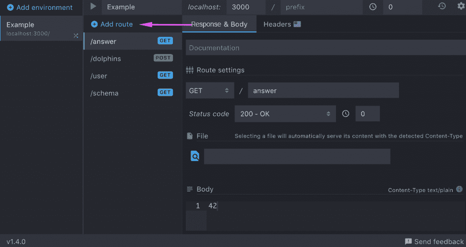
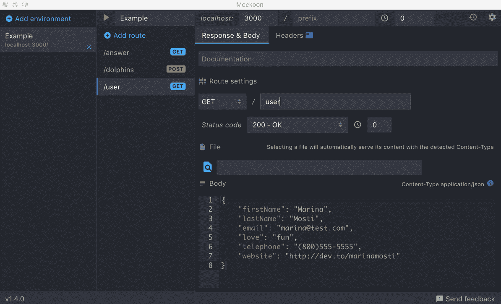
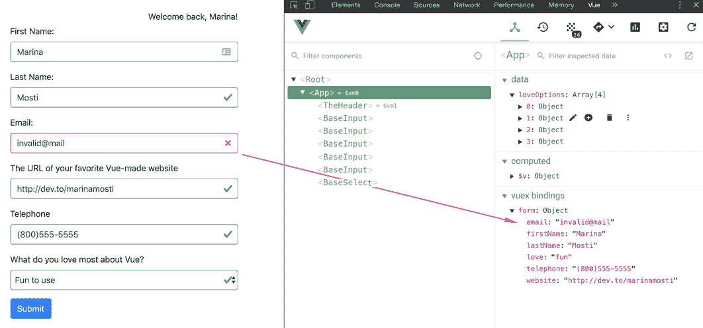

# 六、使用 Vuex 移动全局状态

Vuex 是一种状态管理模式和库。等等，什么？让我们把所有的技术术语放在一边，如果你想阅读官方的技术解释，你可以在 Vuex 官方网站上阅读，什么是 Vuex？，在[https://vuex.vuejs.org/](https://vuex.vuejs.org/) 。

在本章中，您将学习如何使用全局状态管理模式和库 Vuex 设置项目。Vuex 将允许您将本地状态从组件提取到全局全知状态。如果您不熟悉这种类型的模式，例如 React 的 Redux，不要担心！继续读下去，我们将迈出一小步。

我们将从一个对我来说意味着什么的角度来看待它。您可能知道，Vue 中组件的通信方式是通过从父级到子级的道具和从子级到父级的事件。在某些情况下，子组件希望将数据发送回其父组件。也许您想提醒家长，其中的某些内容已被单击，或者某些数据已更改。在前面的示例中，我们的`BasicInput`和`BasicSelect`组件`$emit`值在发生更改或输入时会传递给父级。

在某些情况下，父组件有自己的父组件，也有自己的`$emits`组件。有时，这个第三个父节点有一个父节点等等。这会很快成为一个非常复杂的组件网络，它们在完美的平衡中完美地相互通信。至少你是这么想的

你从你的客户端得到一个调用：他们希望你在你的应用程序上进行一个 API 调用，在标题上显示当前用户的名称，如果有当前登录的用户，他们希望你在表单上预先填充一些字段。你是做什么的？也许您正在考虑对`App.vue`父组件进行 API 调用，并开始在需要它的组件上构建一个道具链，但是当其中一个子组件上的数据发生变化时会发生什么？你会`$emit`将价值回馈给父母并创建一个庞大的链条吗

解决方案是使用 Vuex。Vuex 将为您提供一个全局状态，该状态不直接连接到任何组件，但可供所有组件访问。在本章中，我们将从上一章中获取我们的工作，并将整个表单迁移到 Vuex。我们还将进行模拟 API 调用，以提取登录用户的数据，并用一些值预先填充我们的全局存储。

本章将介绍以下主题：

*   将 Vuex 添加到我们的项目中
*   创建模拟 API 端点
*   创建全球国家
*   添加一些突变
*   灯光，风景，行动！
*   Vuelidate 和 Vuex

# 技术要求

本章的完整代码可以在以下 GitHub 存储库中找到：

[https://github.com/PacktPublishing/Building-Forms-with-Vue.js/tree/master/Chapter06](https://github.com/PacktPublishing/Building-Forms-with-Vue.js/tree/master/Chapter06) 。

请查看以下视频以查看代码的运行情况：

T0http://bit.ly/31l16Kg T1

# 将 Vuex 添加到我们的项目中

让我们先将 Vuex 添加到我们的项目中。遵循以下步骤：

1.  打开终端并运行以下命令以将 Vuex 作为依赖项添加到项目中：

```js
> npm install vuex
```

2.  现在我们已经安装了库，我们需要将它作为插件添加到我们的应用程序中。转到`main.js`，导入并添加以下代码行。您可以将它们放在`Vue`和`App`导入语句之后：

```js
import Vuex from 'vuex';
Vue.use(Vuex);
const store = new Vuex.store({
  // Our global store
});
```

`store`变量将保存我们所有的全局状态，包括我们的行为和突变。我们将很快详细讨论这些问题。为了让整个应用程序都能使用`store`，我们错过了最后一步。我们需要将`store`变量注入`Vue`实例。

3.  在`main.js`内部，进入新`Vue`实例的配置选项，将`store`作为属性注入其中：

```js
new Vue({
store: store,
  render: h => h(App),
}).$mount('#app');
```

干得好！现在，我们已经将 Vuex 设置为项目依赖项，我们几乎可以开始创建我们的应用商店了，在此之前，只需再做一件小事。我们将为测试创建一个快速模拟 API 端点。

# 创建模拟 API 端点

为了模拟我们正在对 API 进行 HTTP 调用以获取用户的详细信息，我们需要首先使用 Mockoon 进行设置。如果您没有进行设置，请查看[第 2 章](2.html)、*中关于如何安装它的说明，*引入 Axios*中最简单的表单*这本书的第一节。

让我们看看如何创建模拟 API 端点。遵循以下步骤：

1.  打开应用程序并单击第二列中的添加路线按钮。这将向同一列中的列表中添加新路由。单击它以选择它，右侧的窗格将更新以显示此特定路线的信息：



2.  在 Route settings（路由设置）下，您可以输入路由的名称，将谓词保留为 GET，并将端点的名称设置为`user`：


3.  现在，转到面板的主体部分，设置我们将从调用返回的虚拟数据。当然，请随意填写您自己的姓名和虚拟信息，如下所示：

```js
{ 
   "firstName": "Marina",
   "lastName": "Mosti",
    "email": "marina@test.com",
    "love": "fun",
    "telephone": "(800)555-5555",
    "website": "http://dev.to/marinamosti"
}

```

以下屏幕截图显示了虚拟信息的外观：



4.  在启动模拟服务器之前，还有一件事。转到面板顶部的“标题”选项卡，并添加新标题。左侧为内容类型，右侧为`application/json`，如下图所示：


最后，确保使用工具栏上的绿色播放图标启动服务器。如果服务器已在运行，请单击停止按钮并重新启动它。

Mockoon 是一个超级简单但功能强大的工具，通过这些简单的步骤，我们有了一个功能齐全的端点来运行测试。在下一节中，我们将最终深入到创建我们的商店以及全球状态。

# 创建全球国家

现在我们已经完成了设置，我们可以回到`main.js`并开始处理我们的全局状态。

在新的`Vuex.Store`配置中，我们将添加一个名为`state`的保留属性。`state`是一个反应性对象，其工作方式与本地状态`data()`类似，因此我们将在这里重新定义表单的结构，除了，因为它现在没有直接绑定，我们将其重命名为`user`。

回到`main.js`，继续在新`Vuex.Store`对象内设置以下状态：

```js
state: {
  user: {
    firstName: '',
    lastName: '',
    email: '',
    love: 'fun',
   telephone: '',
    website: ''
  }
},
```

您可能想知道为什么我们将保存用户数据的全局属性命名为`user`而不是之前的`form`。首先，让我澄清一下，您可以自由地将状态变量命名为最适合应用程序需要的变量！然而，在这种情况下，`form`并不能一眼就清楚地说明我们将在这里存储什么样的数据；另一方面，`user`是超描述性的。

通常的做法是将此处的[T0]属性以 null 开头。在这种情况下，您可以使用简单的[T1]语句（如[T2]）检查它们是否已经过身份验证。在这种情况下，为了结构的清晰，我选择了这种设置。当然，在`App.vue`中，用户的数据将用于填充表单，但在我们的应用程序的另一部分中，它可能用于显示任何类型表单之外的一些用户数据。

学习如何设置您的店铺是成功实现功能性全局状态的第一步。在下一节中，我们将添加使用突变修改此存储的功能

# 向我们的商店添加一些突变

关于 Vuex，需要了解的一件重要事情是，即使全局状态可以从我们的任何组件访问，我们也不应该直接对其进行变异或修改。要修改用户的内容，我们需要创建一个名为**突变**的东西。突变是一种只有一个作业的方法：接受值或有效负载并提交对状态的修改。这样，Vuex 就可以跟踪哪些组件正在修改状态，而不会使状态变得非常混乱！

让我们创造我们的第一个突变；我们称之为`updateUser`

此变异将采用两个参数：第一个参数为`state`。每一次变异都会将状态作为第一个参数接收；默认情况下，Vuex 会将其注入突变。第二个参数是，当你调用它时，这个变异将得到的值。在本例中，我们将它称为`user`，因为这是我们将传递给它的。重要的是要知道突变*不能*执行异步代码。每个突变都需要同步，因为它们直接改变了我们的状态。

在`Vuex.Store`配置中创建一个名为`mutations`的新属性，然后将以下新变异添加到该属性中：

```js
mutations: {
 updateUser(state, user) {
    state.user = user;
  },
},
```

当这个变异被提交时，它将通过调用`state.user = user`来更新全局状态，我们将通过它传递给用户。现在，我们到底想在哪里进行这种新的变异？

之前，我们设置了一个 API 端点来获取我们的模拟*登录*用户。我们仍然需要设置对此端点的调用，以便应用程序在开始检查是否有来自 API 的用户时可以使用它。

# 灯光，风景，动作！

Vuex 的第三个关键部分称为**动作**。动作是方法，就像突变一样，但它们可以在其中执行异步代码

操作接收两个参数，如下所示：

*   第一个是`context`，它是一个对象，包含对状态、getter 的引用，以及提交突变和分派其他操作的能力。
*   第二个（可选）参数是用户定义的；这意味着，如果我们需要，我们可以向我们的行动发送额外的信息，但这也可以被安全地忽略。

Vuex 驱动的应用程序中的一种常见模式是将 HTTP 调用保留在 Vuex 操作中，这样，应用程序中的任何组件都可以在需要时调度 HTTP 调用。这些 HTTP 调用通常会修改或使用状态，这非常方便，因为我们可以通过`context`获得这些

让我们回到手头的问题上来。我们需要呼叫`/users`端点以获取用户信息。我们将创建一个名为`getLoggedInUser`的 Vuex 操作，它将知道如何为我们进行此调用，并将自动将它获取的信息提交到状态

遵循以下步骤：

1.  由于我们将使用 Axios 进行此操作，请确保我们首先将其与其他导入语句一起导入到文件顶部的`main.js`：

```js
import axios from 'axios';
```

2.  现在，在`Vuex.Store`配置对象中创建一个名为`actions`的属性；此属性也是保留字。在它里面，我们将创建我们的`getLoggedInUser`功能：

```js
getLoggedInUser(context) {
    axios.get('http://localhost:3000/user')
    .then(response => {
      context.commit('updateUser', response.data);
    });
  },
```

请记住，Axios 返回一个 JavaScript 承诺，因此我们将在调用中附加一个`.then`块，其中我们将使用响应数据提交`updateUser`突变。这个数据正是我们之前在 Mockoon 中定义为 JSON 对象的数据。请记住，现实生活中的应用程序需要更复杂的过程来检查用户是否实际登录；一种常见的做法是将某种 ID 传递给端点，甚至后端也可能通过来回传递令牌来处理会话。然而，这超出了本书的范围，因此我们将继续使用这个假场景进行演示。

现在我们已经准备好了行动，我们需要一个地方来调度它。在这种情况下，我们将假设我们的应用程序希望尽快检查登录用户，因此我们将利用`App.vue`文件中的`created()`钩子：

1.  前往`App.vue`并在组件上添加`created`方法：

```js
created() {
 this.$store.dispatch('getLoggedInUser');
}
```

2.  打开浏览器，刷新页面，然后检查“开发人员工具”上的“网络”选项卡。您将看到，页面一加载，我们对[T0]的 Axios 调用就被触发，用户的数据也被加载。如果出现错误，请记住首先在 Mockoon 上启动服务器！
3.  在我们开始修改表单之前，让我们制作一个新的`<TheHeader>`组件来展示我们新的全球国家的力量。在`components`文件夹中创建一个新文件`TheHeader.vue`，并复制以下代码：

```js
<template>
 <div class="row">
    <div class="col-12 text-right">
      <p v-if="$store.state.user">
        Welcome back, {{ $store.state.user.firstName }}!
      </p>
    </div>
  </div>
</template>
```

在这个组件中，我们将使用插值输出`$store.state.user.firstName`，反过来，它将访问全局状态、状态内部和用户内部，并查找`firstName`属性并在此处显示。

4.  返回`App.vue`导入组件：

```js
import 'TheHeader' from '@/components/TheHeader' 
```

不要忘记在`components`属性中声明，如下所示：

```js
components: { BaseInput, BaseSelect, TheHeader },
```

5.  最后，将我们的新组件添加到 opening`<div>`元素正下方的模板中，并在浏览器上查看它。您应该看到直接从全局状态输出的用户名称：

```js
<div id="app" class="container py-4">
    <TheHeader />
    ...
```

既然你已经了解了动作和突变，我们就可以把难度提高一个档次了。在下一节中，我们将合并两个主要的库 Vuex 和 Vuelidate。

# Vuelidate 和 Vuex

为了让我们的表单继续与 Vuelidate 一起使用 Vuex，我们必须对数据设置方式进行一些调整，以便对输入进行双向绑定。别担心，我们会一步一步来。现在我们已经将 Vuex 整合到我们的应用程序中，我们希望我们的表单使用我们的全局状态，而不是我们的`data() { form: {...} }`内部`App.vue`中的本地状态。因此，我们需要在模板中进行一些更改，以告知双向绑定使用 Vuex。

我们将从表单的输入中删除所有的`v-model`语句。相反，我们将通过设置`:value`绑定和`@input`侦听器来手动创建双向绑定。

首先，我们将创建一个名为`updateUser`的新方法，该方法将接收两个参数，如下所示：

*   第一个是我们正在更新的表单中的`property`，例如`firstName`或`lastName`。
*   第二个参数是这个新属性将接收的`value`。

那么，让我们首先将这个新方法添加到我们的`App.vue`组件中：

```js
updateUser(property, value) {
  this.$store.dispatch('updateUserData', {
    property,
    value
  });

  this.$v.form[property].$touch();
}
```

这个方法将发送一个新的动作，我们将在一瞬间创建一个名为`updateUserData`的动作；它将发送一个有效载荷，其中包含该方法获得的`property`和`value`。

让我们停下来看一下第二句话。由于 Vuelidate 将不再连接到本地状态，因此需要我们告诉它何时重新计算输入的脏状态并检查验证中的错误

由于`updateUser`方法将负责对我们的全局状态进行更改，因此我们将通过`$v.form[property]`访问 Vuelidate 的对象以进行此输入，并强制对其进行`$touch()`。

现在我们的州将是全球性的，我们不再需要我们的`form: {...}`本地州，所以你可以继续删除它。您的`data()`道具现在应该如下所示：

```js
data() {
  return {
    loveOptions: [
      { label: 'Fun to use', value: 'fun' },
      { label: 'Friendly learning curve', value: 'curve' },
      { label: 'Amazing documentation', value: 'docs' },
      { label: 'Fantastic community', value: 'community' }
    ]
  }
},
```

但是，为了使 Vuelidate 能够访问全局状态，我们需要使用 Vuex 帮助函数将其映射到计算属性。在这种情况下，我们希望使用`mapState`。想象一下，如果您必须为我们的每个用户属性创建一个计算属性，那么您必须沿着列表创建大量重复的代码，如下例所示：

```js
firstName() {
  return this.$store.state.user.firstName;
}
```

想象一下，必须对表单的所有属性执行此操作，可能会很快变得单调乏味，对吗？

在这些情况下，Vuex 具有一些方便的映射功能，我们可以利用这些功能，因此让我们继续将`mapState`导入到`App.vue`文件的顶部：

```js
import { mapState } from 'vuex';
```

接下来，我们将在`App.vue`组件中添加一个`computed`道具，并使用`mapState`函数将整个状态映射到计算属性：

```js
computed: {
  ...mapState({form: 'user'}),
},
```

我们将向`mapState`传递一个对象，告诉函数我们希望将整个全局状态的哪一部分映射到我们的计算属性。在本例中，我们告诉它将用户全局状态中的所有内容映射到本地表单。由于用户是一个具有多个子属性的对象，它将为每个子属性创建一个绑定，这样当`App.vue`调用例如`this.form.firstName`时，它将在`this.$store.state.user.firstName`中处于全局状态。太棒了，对吧？！

请记住，`mapState`返回一个对象，因此我们可以在这里使用 JavaScript ES6 spread 操作符将新创建的对象合并到`computed: {}`属性中。如果以后要添加一些未从 Vuex 映射的计算属性，这将非常方便。

如果您想了解有关 spread operator 的更多信息，请参阅以下文章：[https://dev.to/marinamosti/understanding-the-spread-operator-in-javascript-485j](https://dev.to/marinamosti/understanding-the-spread-operator-in-javascript-485j) 。

在我们开始进行`updateUserData`操作之前，让我们对我们讨论的输入进行`v-model`更改。删除所有的`v-model`语句，并在每个语句上替换它们，如下所示：

```js
<BaseInput 
  label="First Name:"
  :value="$store.state.user.firstName"
  @input="updateUser('firstName', $event)"
  :validator="$v.form.firstName"
/>
<BaseInput  
  label="Last Name:"
  :value="$store.state.user.lastName"
  @input="updateUser('lastName', $event)"
  :validator="$v.form.lastName"
/>
<BaseInput 
  label="Email:" 
  :value="$store.state.user.email"
  @input="updateUser('email', $event)"
  :validator="$v.form.email"
  type="email" 
/>
<BaseInput 
  label="The URL of your favorite Vue-made website"
  :value="$store.state.user.website"
  @input="updateUser('website', $event)"
  :validator="$v.form.website"
/>
<BaseInput 
  label="Telephone"
  type="text" 
  :value="$store.state.user.telephone"
  @input="updateUser('telephone', $event)"
  :validator="$v.form.telephone"
  :mask="'(###)###-####'"
/>
<BaseSelect 
  label="What do you love most about Vue?" 
  :options="loveOptions"
  :value="$store.state.user.love"
  @input="updateUser('love', $event)"
  :validator="$v.form.love"
/>
```

`:value`属性将绑定到我们的全局状态，即我们在本章开头创建的状态。借助 Vuex，`$store`属性可以通过我们的应用程序进行全局访问，我们可以使用它直接访问状态，甚至在我们的模板中。`@input`侦听器将直接指向`updateUser`，将属性设置为字符串，并将`$event`的有效负载作为值传递。

前往`main.js`；我们必须创建`updateUser`方法调用的新操作。我们将利用已经存在的变异`updateUser`，来更新用户的一个属性。您还可以将其重构为一个变种，专门更新其中一个属性，而不是覆盖整个对象。在这种情况下，对象非常小，性能不受关注。将以下操作添加到您的应用商店：

```js
updateUserData(context, payload) {
const userCopy = {...context.state.user};
  userCopy[payload.property] = payload.value;
  context.commit('updateUser', userCopy);
}
```

在操作的第一行，我们将使用 ES6 的 spread 操作符创建用户状态的浅拷贝。重要的是要记住，状态永远不应该在变异之外改变，因此如果我们将新属性值直接分配给状态中的用户，我们就可以做到这一点。

复制完成后，我们将属性设置为新值，并调用`updateUser`变异的`commit`。返回浏览器并重新加载页面；确保运行虚拟 Mockoon API，以便我们的 Axios 调用正常工作，并检查结果：



就这样！通过对我们的应用程序进行这些更改，我们成功地做到了这一点，这样不仅可以让全局状态控制我们的表单，还可以利用 Vuelidate 的灵活性和强大功能直接连接到全局状态。

# 总结

在本章中，您已经掌握了设置、创建和使用 Vuex 作为全局状态模式和库的必要技能。您还学习了如何将 Vuelidate 与 Vuex 连接起来，以便验证直接连接到全局状态。

在下一章中，我们将讨论如何将我们所做的一切和我们的表单转换为完全由模式驱动的表单。