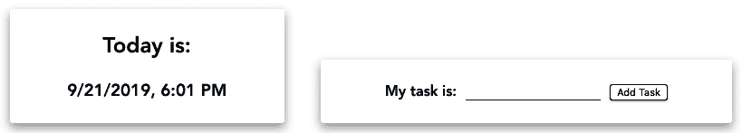
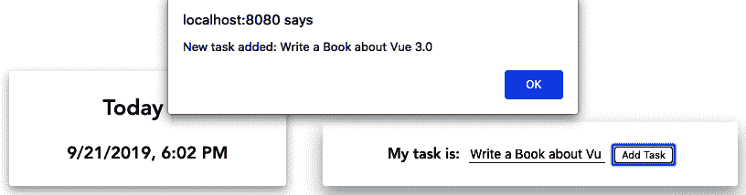
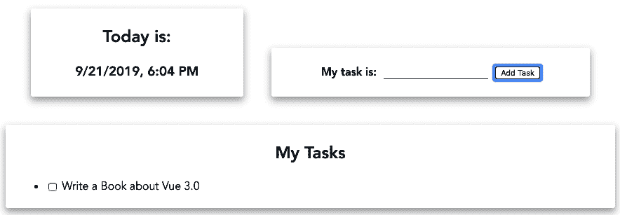
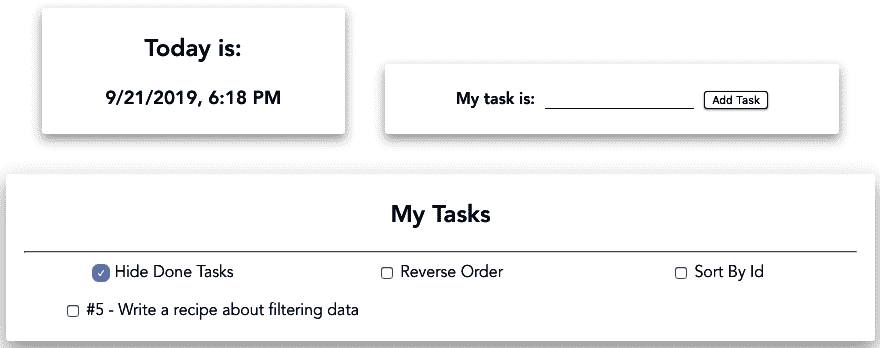
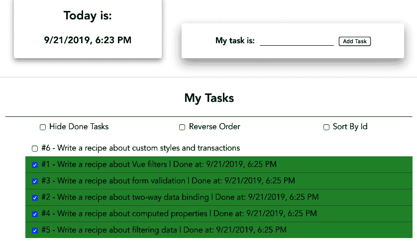
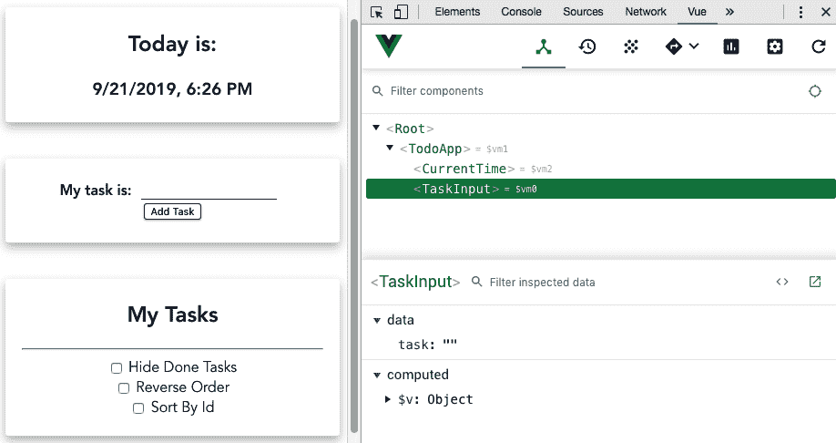
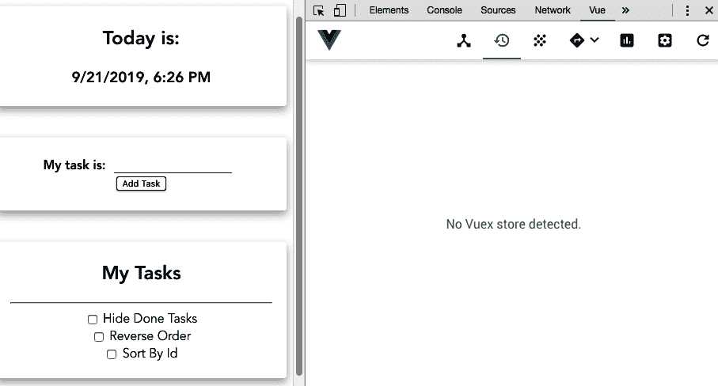
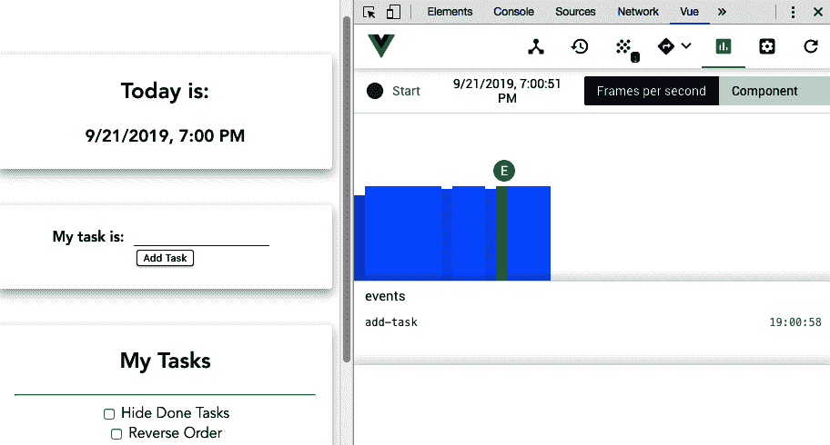
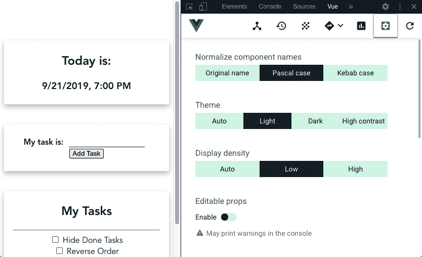

Data Binding, Events, and Computed Properties

**数据**是目前世界上最有价值的资产，知道如何管理它是必须的。在 Vue 中，我们有权选择如何收集这些数据，根据需要对其进行操作，并将其传送到服务器。

在本章中，我们将进一步了解数据操作和数据处理过程、表单验证、数据过滤、如何向用户显示这些数据，以及如何以不同于应用程序内部的方式呈现这些数据。

我们将学习如何使用各种`vue-devtools`，以便深入了解 Vue 组件，了解我们的数据和应用程序发生了什么变化。

在本章中，我们将介绍以下配方：

*   使用 Vue CLI 创建第一个项目
*   创建 hello world 组件
*   使用双向数据绑定创建输入表单
*   向元素添加事件侦听器
*   从输入中删除`v-model`指令
*   创建动态待办事项列表
*   创建计算属性并了解其工作方式
*   使用自定义过滤器显示更清晰的数据和文本
*   为列表创建过滤器和分类器
*   创建条件筛选器以对列表数据进行排序
*   添加自定义样式和过渡
*   使用`vue-devtools`调试应用程序

让我们开始吧！

# 技术要求

在本章中，我们将使用**Node.js**和**Vue CLI****。**

Attention, Windows users – you need to install an `npm` package called `windows-build-tools` to be able to install the following required packages. To do this, open PowerShell as administrator and execute the
`> npm install -g windows-build-tools` command.

要安装**Vue CLI**，您需要打开终端（macOS 或 Linux）或命令提示符/PowerShell（Windows）并执行以下命令：

```js
> npm install -g @vue/cli @vue/cli-service-global
```

# 使用 Vue CLI 创建第一个项目

当 Vue 团队意识到开发人员在创建和管理其应用程序时遇到问题时，他们看到了一个机会，可以创建一个可以帮助世界各地开发人员的工具。有鉴于此，Vue CLI 项目诞生了。

Vue CLI 工具是一种 CLI 工具，用于终端命令行，如 Windows PowerShell、Linux Bash 或 macOS 终端。它是作为 Vue 开发的起点创建的，在这里，开发人员可以启动一个项目并顺利地管理和构建它。Vue CLI 团队的重点是让开发人员有更多的时间思考代码，并在将代码投入生产所需的工具上花费更少的时间，添加新插件或简单的`hot-module-reload`。

Vue CLI 工具经过调整，在投入生产之前，无需将工具代码弹出 CLI 之外。

在版本 3 发布时，Vue UI 项目作为主要功能添加到 CLI 中，将 CLI 命令转换为一个更完整的可视化解决方案，并进行了大量新的添加和改进。

## 准备

此配方的先决条件是 Node.js 12+。

此配方所需的 Node.js 全局对象如下：

*   `@vue/cli`
*   `@vue/cli-service-global`

## 怎么做。。。

要创建 Vue CLI 项目，请执行以下步骤：

1.  我们需要打开终端（macOS 或 Linux）或命令提示符/PowerShell（Windows）并执行以下命令：

```js
> vue create my-first-project
```

2.  CLI 将询问一些有助于创建项目的问题。您可以使用箭头键导航，*输入*键继续，使用*空格键*选择选项：

```js
? Please pick a preset: (Use arrow keys)
  default (babel, eslint) ❯ Manually select features ‌
```

3.  启动新项目有两种方法。默认方法是基本的`babel`和`eslint`项目，没有任何插件或配置，但也有`Manually`模式，您可以选择更多模式、插件、过梁和选项。我们将选择`Manually`。‌
4.  在这一点上，我们将被问及我们希望为我们的项目提供哪些功能。这些特性是一些 Vue 插件，如 Vuex 或路由器（Vue 路由器）、测试器、linter 等。对于本项目，我们将选择`CSS Pre-processors`并按*进入*继续：

```js
? Check the features needed for your project: (Press <space> to 
  select, <a> to toggle all, <i> to invert selection)
 ❯ Choose Vue version
 ❯ Babel
 TypeScript
 Progressive Web App (PWA) Support
 Router
 Vuex
 CSS Pre-processors
 ❯ Linter / Formatter
 Unit Testing
 E2E Testing
```

5.  CLI 将要求您选择用于启动应用程序的 Vue 版本。我们将在这里选择`3.x (Preview)`。按*进入*继续：

```js
? Choose a version of Vue.js that you want to start the project with 
 (Use arrow keys)
 2.x 
❯ 3.x (Preview)
```

6.  可以选择与 Vue 一起使用的主**级联样式表**（**CSS**）预处理器；即，`Sass`、`Less`和`Stylus`。由您选择最适合您的设计且最适合您的：

```js
? Pick a CSS pre-processor (PostCSS, Autoprefixer and CSS Modules
  are supported by default): (Use arrow keys)
  Sass/SCSS (with dart-sass) 
  Sass/SCSS (with node-sass) 
  Less 
❯ Stylus 
```

7.  是时候格式化你的代码了。您可以使用基本配置在`AirBnB`、`Standard`和`Prettier`之间进行选择。在`ESLint`中导入的规则始终可以定制，没有任何问题，并且有一个完美的规则满足您的需求。如果您发现什么对您最有利，请执行以下操作：

```js
? Pick a linter / formatter config: (Use arrow keys)
  ESLint with error prevention only ❯ ESLint + Airbnb config ESLint + Standard config 
  ESLint + Prettier
```

8.  一旦设置了 linting 规则，我们需要定义它们何时应用于代码。它们可以在保存时应用，也可以在提交时修复：

```js
? Pick additional lint features: 
 Lint on save
❯ Lint and fix on commit 
```

9.  一旦定义了所有这些插件、linter 和处理器，我们需要选择存储设置和配置的位置。存储它们的最佳位置是在专用文件中，但也可以将它们存储在`package.json`文件中：

```js
? Where do you prefer placing config for Babel, ESLint, etc.? (Use  
  arrow keys) ❯ In dedicated config files In package.json
```

10.  现在，您可以选择是否要将此选择设置为未来项目的预设，以便无需再次重新选择所有内容：

```js
? Save this as a preset for future projects? (y/N) n
```

11.  CLI 将使用您在*步骤 1*中设置的名称自动创建文件夹，安装所有内容，并配置项目。

这样，您就可以导航并运行项目了。Vue CLI 项目的基本命令如下：

*   `npm run serve`：用于在本地运行开发服务器
*   `npm run build`：用于构建和缩小部署应用程序
*   `npm run lint`：在代码上执行 lint

您可以通过终端（macOS 或 Linux）或命令提示符/PowerShell（Windows）执行这些命令。

## 还有更多。。。

CLI 中有一个名为 Vue UI 的工具，可帮助您管理 Vue 项目。这个项目的依赖项和插件的配置将由这个工具负责。

Vue UI 工具中的每个`npm`脚本都称为一个任务，在这些任务上，您可以收集实时统计信息，如资产、模块和依赖项的大小；错误或警告的数量；以及用于微调应用程序的更深入的网络数据。

要进入 Vue UI 界面，您需要打开终端（macOS 或 Linux）或命令提示符/PowerShell（Windows），然后执行以下命令：

```js
> vue ui
```

## 另见

*   有关 Vue CLI 项目的更多信息，请访问[https://cli.vuejs.org/guide/](https://cli.vuejs.org/guide/) 。
*   有关 Vue CLI 插件开发的更多信息，请访问[https://cli.vuejs.org/dev-guide/plugin-dev.html](https://cli.vuejs.org/dev-guide/plugin-dev.html) 。

# 创建 hello world 组件

Vue 应用程序是各种组件的组合，由 Vue 框架绑定在一起并进行编排。了解如何制作组件非常重要。每个构件就像墙上的一块砖，需要以一种在放置时不需要在其周围以不同方式重塑其他砖的方式制作。在本食谱中，我们将学习如何在遵循一些重要原则的同时制作一个基本组件，这些原则侧重于组织和干净的代码。

## 准备

此配方的先决条件是 Node.js 12+。

此配方所需的 Node.js 全局对象如下：

*   `@vue/cli`
*   `@vue/cli-service-global`

要启动我们的组件，我们可以使用 Vue CLI 创建我们的 Vue 项目，正如我们在*使用 Vue CLI*方法创建您的第一个项目中所学到的，或者启动一个新项目。

## 怎么做。。。

要启动新组件，请打开终端（macOS 或 Linux）或命令提示符/PowerShell（Windows），然后执行以下命令：

```js
> vue create my-component
```

**命令行界面**（**CLI**将询问一些有助于您创建项目的问题。您可以使用箭头键导航，*输入*键继续，以及*空格键*选择一个选项。选择**`default`**选项：

```js
? Please pick a preset: (Use arrow keys)
❯ default (babel, eslint) 
  Manually select features ‌
```

让我们按照以下步骤创建第一个`hello world`组件：

1.  让我们在`src/components`文件夹中创建一个名为`CurrentTime.vue`的新文件。
2.  在这个文件中，我们将从组件的`<template>`部分开始。它将是一个阴影框卡，显示当前日期，格式为：

```js
<template>
  <div class='cardBox'>
    <div class='container'>
      <h2>Today is:</h2>
      <h3>{{ getCurrentDate }}</h3>
    </div>
  </div>
</template>
```

3.  现在，我们需要创建`<script>`部分。我们将从`name`属性开始。这将在使用`vue-devtools`调试我们的应用程序时使用，以识别我们的组件，并帮助**集成开发环境**（**IDE**）。对于`getCurrentDate`计算属性，我们将创建一个`computed`属性，该属性将返回当前日期，由`Intl`浏览器功能格式化：

```js
<script>
export default {
  name: 'CurrentTime',
  computed: {
    getCurrentDate() {
      const browserLocale =
        navigator.languages && navigator.languages.length
          ? navigator.languages[0]
          : navigator.language;
      const intlDateTime = new Intl.DateTimeFormat(
        browserLocale, 
        {
          year: 'numeric',
          month: 'numeric',
          day: 'numeric',
          hour: 'numeric',
          minute: 'numeric'
        });

      return intlDateTime.format(new Date());
    }
  }
};
</script>
```

4.  要设置方框的样式，我们需要在`src`文件夹中创建一个`style.css`文件，然后将`cardBox`样式添加到其中：

```js
.cardBox {
  box-shadow: 0 5px 10px 0 rgba(0, 0, 0, 0.2);
  transition: 0.3s linear;
  max-width: 33%;
  border-radius: 3px;
  margin: 20px;
}

.cardBox:hover {
  box-shadow: 0 10px 20px 0 rgba(0, 0, 0, 0.2);
}

.cardBox>.container {
  padding: 4px 18px;
}

[class*='col-'] {
  display: inline-block;
}

@media only screen and (max-width: 600px) {
  [class*='col-'] {
    width: 100%;
  }

  .cardBox {
    margin: 20px 0;
  }
}

@media only screen and (min-width: 600px) {
  .col-1 {width: 8.33%;}
  .col-2 {width: 16.66%;}
  .col-3 {width: 25%;}
  .col-4 {width: 33.33%;}
  .col-5 {width: 41.66%;}
  .col-6 {width: 50%;}
  .col-7 {width: 58.33%;}
  .col-8 {width: 66.66%;}
  .col-9 {width: 75%;}
  .col-10 {width: 83.33%;}
  .col-11 {width: 91.66%;}
  .col-12 {width: 100%;}
}

@media only screen and (min-width: 768px) {
  .col-1 {width: 8.33%;}
  .col-2 {width: 16.66%;}
  .col-3 {width: 25%;}
  .col-4 {width: 33.33%;}
  .col-5 {width: 41.66%;}
  .col-6 {width: 50%;}
  .col-7 {width: 58.33%;}
  .col-8 {width: 66.66%;}
  .col-9 {width: 75%;}
  .col-10 {width: 83.33%;}
  .col-11 {width: 91.66%;}
  .col-12 {width: 100%;}
}

@media only screen and (min-width: 992px) {
  .col-1 {width: 8.33%;}
  .col-2 {width: 16.66%;}
  .col-3 {width: 25%;}
  .col-4 {width: 33.33%;}
  .col-5 {width: 41.66%;}
  .col-6 {width: 50%;}
  .col-7 {width: 58.33%;}
  .col-8 {width: 66.66%;}
  .col-9 {width: 75%;}
  .col-10 {width: 83.33%;}
  .col-11 {width: 91.66%;}
  .col-12 {width: 100%;}
}

@media only screen and (min-width: 1200px) {
  .col-1 {width: 8.33%;}
  .col-2 {width: 16.66%;}
  .col-3 {width: 25%;}
  .col-4 {width: 33.33%;}
  .col-5 {width: 41.66%;}
  .col-6 {width: 50%;}
  .col-7 {width: 58.33%;}
  .col-8 {width: 66.66%;}
  .col-9 {width: 75%;}
  .col-10 {width: 83.33%;}
  .col-11 {width: 91.66%;}
  .col-12 {width: 100%;}
}
```

5.  在`App.vue`文件中，我们需要导入我们的组件以便可以看到它：

```js
<template>
  <div id='app'>
    <current-time />
  </div>
</template>

<script>
import CurrentTime from './components/CurrentTime.vue';

export default {
  name: 'app',
  components: {
    CurrentTime
  }
}
</script>
```

6.  在`main.js`文件中，我们需要导入`style.css`文件，以便将其包含在 Vue 应用程序中：

```js
import { createApp } from 'vue';
import './style.css';
import App from './App.vue';

createApp(App).mount('#app');
```

7.  要运行服务器并查看组件，您需要打开终端（macOS 或 Linux）或命令提示符/PowerShell（Windows），然后执行以下命令：

```js
> npm run serve
```

以下是渲染并运行的组件：


## 它是如何工作的。。。

Vue 组件的工作原理几乎与 Node.js 包类似。要在代码中使用它，需要导入组件，然后在要使用的组件的`components`属性中声明它。

与砖墙一样，Vue 应用程序由调用和使用其他组件的组件组成。

对于我们的组件，我们使用了`Intl.DateTimeFormat`函数，这是一个本机函数，可用于将日期格式化和解析到声明的位置。为了获得本地格式，我们使用了 navigator 全局变量。

## 另见

*   有关`Intl.DateTimeFormat`的更多信息，请访问[https://developer.mozilla.org/en-US/docs/Web/JavaScript/Reference/Global_Objects/DateTimeFormat](https://developer.mozilla.org/en-US/docs/Web/JavaScript/Reference/Global_Objects/DateTimeFormat) 。
*   有关 Vue 组件的更多信息，请访问[https://v3.vuejs.org/guide/single-file-component.html](https://v3.vuejs.org/guide/single-file-component.html) 。

# 使用双向数据绑定创建输入表单

为了在 web 上收集数据，我们使用 HTML 表单输入。在 Vue 中，可以使用双向数据绑定方法，**文档对象模型**（**DOM**上的输入值传递给 JavaScript，反之亦然。

这使 web 表单更加动态，使您能够在保存数据或将数据发送回服务器之前管理、格式化和验证数据。

## 准备

此配方的先决条件是 Node.js 12+。

此配方所需的 Node.js 全局对象如下：

*   `@vue/cli`
*   `@vue/cli-service-global`

要启动我们的组件，我们可以使用 Vue CLI 创建我们的 Vue 项目，正如我们在*使用 Vue CLI*配方创建您的第一个项目中所学到的，或者使用*创建 hello world 组件*配方中的项目。

## 怎么做。。。

按照以下步骤创建具有双向数据绑定的输入表单：

1.  让我们在`src/components`文件夹中创建一个名为`TaskInput.vue`的新文件。
2.  在这个文件中，我们将创建一个具有文本输入和一些显示文本的组件。此文本将基于作为文本输入键入的内容。在组件的`<template>`部分，我们需要创建一个 HTML 输入和一个`mustache`变量来接收和呈现数据：

```js
<template>
  <div class='cardBox'>
    <div class='container tasker'>
      <strong>My task is: {{ task }}</strong>
      <input 
        type='text'
        v-model='task'
        class='taskInput' />
    </div>
  </div>
</template>
```

3.  现在，在组件的`<script>`部分，我们将命名它并将任务添加到`data`属性中。由于数据总是需要返回一个`Object`，我们将使用箭头函数直接返回一个`Object`：

```js
<script>
export default {
  name: 'TaskInput',
  data: () => ({
    task: '',
  }),
};
</script>
```

4.  我们需要为这个组件添加一些样式。在组件的`<style>`部分，我们需要添加`scoped`属性，这样样式只会绑定到组件，不会与其他**级联样式表**（**CSS**规则混在一起：

```js
<style scoped>
  .tasker{
    margin: 20px;
  }
  .tasker .taskInput {
    font-size: 14px;
    margin: 0 10px;
    border: 0;
    border-bottom: 1px solid rgba(0, 0, 0, 0.75);
  }
  .tasker button {
    border: 1px solid rgba(0, 0, 0, 0.75);
    border-radius: 3px;
    box-shadow: 0 1px 2px 0 rgba(0, 0, 0, 0.2);
  }
</style>
```

5.  现在，我们需要将这个组件导入到我们的`App.vue`文件中：

```js
<template>
 <div id='app'>
  <current-time class='col-4' />
  <task-input class='col-6' />
 </div>
</template>

<script>
import CurrentTime from './components/CurrentTime.vue';
import TaskInput from './components/TaskInput.vue';

export default {
  name: 'TodoApp',
  components: {
    CurrentTime,
    TaskInput,
  },
};
</script>

```

6.  要运行服务器并查看组件，您需要打开终端（macOS 或 Linux）或命令提示符/PowerShell（Windows），然后执行以下命令：

```js
> npm run serve
```

下面是呈现并运行的组件：



## 它是如何工作的。。。

当您创建一个 HTML`input`元素并向其中添加一个`v-model`元素时，您正在传递一个内置于 Vue 中的指令，该指令检查输入类型并为我们提供输入的 sugar 语法。这将处理更新变量和 DOM 的值。

这个模型就是所谓的**双向数据绑定**。如果代码更改了变量，DOM 将重新加载，如果 DOM 通过用户输入（如`input-form`）更改了变量，则 JavaScript 代码可以执行一个函数。

## 另见

有关表单输入绑定的更多信息，请访问[https://v3.vuejs.org/guide/forms.html](https://v3.vuejs.org/guide/forms.html) 。

# 向元素添加事件侦听器

Vue 中最常见的父子沟通方法是通过道具和事件。在 JavaScript 中，通常向 DOM 树的元素添加事件侦听器，以对特定事件执行函数。在 Vue 中，可以添加监听器并根据需要命名它们，而不是坚持使用 JavaScript 引擎上的名称。

在本食谱中，我们将学习如何创建自定义事件以及如何发出这些事件。

## 准备

此配方的先决条件是 Node.js 12+。

此配方所需的 Node.js 全局对象如下：

*   `@vue/cli`
*   `@vue/cli-service-global`

要启动我们的组件，我们可以使用 Vue CLI 创建我们的 Vue 项目，正如我们在*使用 Vue CLI*配方创建您的第一个项目中所学到的，或者使用*创建具有双向数据绑定*配方的输入表单中的项目。

## 怎么做。。。

按照以下步骤向 Vue 中的元素添加事件侦听器：

1.  创建新组件或打开`TaskInput.vue`文件。
2.  在`<template>`部分，我们将添加一个 button 元素，并使用`v-on`指令向 button click 事件添加一个事件监听器。我们将从组件中删除`{{ task }}`变量，因为从现在起，它将被释放，不再显示在组件上：

```js
<template>
  <div class='cardBox'>
    <div class='container tasker'>
      <strong>My task is:</strong>
      <input 
        type='text' 
        v-model='task' 
        class='taskInput' />
      <button 
        v-on:click='addTask'>
            Add Task
      </button>
    </div>
  </div>
</template>
```

3.  在组件的`<script>`部分，我们需要添加一个方法来处理点击事件。此方法将命名为`addTask`。它将发出一个名为`add-task`的事件，并将任务发送给数据。之后，将重置组件上的任务：

```js
<script>
export default {
 name: 'TaskInput',
 data: () => ({
 task: '',
 }),
  methods: {
    addTask(){
      this.$emit('add-task', this.task);
      this.task = '';
    },
  }
};
</script>
```

4.  在`App.vue`文件中，我们需要向组件添加一个事件侦听器绑定。此侦听器将附加到`add-task`事件。我们将使用`v-on`指令的简称`@`。触发时，事件将调用`addNewTask`方法，该方法将发送警报，说明添加了新任务：

```js
<template>
  <div id='app'>
    <current-time class='col-4' />
    <task-input 
      class='col-6'
      @add-task='addNewTask'
    />
  </div>
</template>
```

5.  现在，让我们创建`addNewTask`方法。这将接收任务作为参数，并向用户显示警报，说明任务已添加：

```js
<script>
import CurrentTime from './components/CurrentTime.vue';
import TaskInput from './components/TaskInput.vue';

export default {
  name: 'TodoApp',
  components: {
    CurrentTime,
    TaskInput,
  },
  methods: {
    addNewTask(task) {
      alert(`New task added: ${task}`);
    },
  },
};
</script>

```

6.  要运行服务器并查看组件，您需要打开终端（macOS 或 Linux）或命令提示符/PowerShell（Windows），然后执行以下命令：

```js
> npm run serve
```

下面是呈现并运行的组件：



## 它是如何工作的。。。

Vue 使用`v-on`事件处理指令读取 HTML 事件。当我们将`v-on:click`指令附加到按钮上时，我们在按钮上添加了一个侦听器，以便在用户单击按钮时执行一个函数。

该函数在组件方法上声明。调用此函数时，将发出一个事件，表示将此组件作为子组件使用的任何组件都可以使用`v-on`指令侦听它。

## 另见

有关事件处理的更多信息，请访问[https://v3.vuejs.org/guide/events.html](https://v3.vuejs.org/guide/events.html) 。

# 从输入中删除 v-model 指令

如果我告诉你，在`v-model`的魔力背后，有很多代码使得我们的魔法糖语法发生了呢？如果我告诉你兔子洞可以足够深，你可以通过事件和输入值控制一切可能发生的事情，会怎么样？

在本食谱中，我们将学习如何提取`v-model`指令的 sugar 语法，并将其转换为其背后的基本语法。

## 准备

此配方的先决条件是 Node.js 12+。

此配方所需的 Node.js 全局对象如下：

*   `@vue/cli`
*   `@vue/cli-service-global`

要启动我们的组件，我们可以使用 Vue CLI 创建我们的 Vue 项目，正如我们在*使用 Vue CLI*配方创建您的第一个项目中所学到的，或者使用*中的项目将事件侦听器添加到元素*配方中。

## 怎么做。。。

通过执行以下步骤，我们将从输入中删除`v-model`指令 sugar 语法：

1.  打开`TaskInput.vue`文件。

2.  在组件的`<template>`块中，找到`v-model`指令。我们需要删除`v-model`指令。然后，我们需要向名为`v-bind:value`或简称为`:value`的输入添加一个新绑定，并向 HTML`input`元素添加一个事件侦听器。我们需要使用`v-on:input`指令或缩短版本`@input`向`input`事件添加事件侦听器。输入绑定将接收任务值作为参数，事件侦听器将接收值属性，其中它将使任务变量等于事件值的值：

```js
<template>
  <div class='cardBox'>
    <div class='container tasker'>
      <strong>My task is:</strong>
      <input 
        type='text' 
        :value='task' 
        @input='task = $event.target.value' 
        class='taskInput' 
      />
      <button v-on:click='addTask'>
        Add Task
      </button>
    </div>
  </div>
</template>
```

3.  要运行服务器并查看组件，您需要打开终端（macOS 或 Linux）或命令提示符/PowerShell（Windows），然后执行以下命令：

```js
> npm run serve 
```

## 它是如何工作的。。。

作为一种语法糖，`v-model`指令为您自动向元素声明绑定和事件侦听器。然而，它的副作用是，你不能完全控制可以实现什么。

如我们所见，例如，绑定值可以是变量、方法、计算属性或 Vuex getter。就事件侦听器而言，它可以是函数，也可以是变量赋值的直接声明。当发出事件并将其传递给 Vue 时，`$event`变量用于传递事件。在本例中，与普通 JavaScript 一样，为了捕获输入的值，我们需要使用`event.target.value`值。

## 另见

有关事件处理的更多信息，请访问[https://v3.vuejs.org/guide/events.html](https://v3.vuejs.org/guide/events.html) 。

# 创建动态待办事项列表

每个程序员在学习新语言时首先创建的项目之一是待办事项列表。这样做可以让我们更多地了解操作状态和数据时所遵循的语言过程。

我们将使用 Vue 制作待办事项列表。我们将使用我们在前面的食谱中学习和创造的内容。

## 准备

此配方的先决条件是 Node.js 12+。

此配方所需的 Node.js 全局对象如下：

*   `@vue/cli`
*   `@vue/cli-service-global`

要启动我们的组件，我们可以使用 Vue CLI 创建我们的 Vue 项目，正如我们在*使用 Vue CLI*配方创建您的第一个项目中所学到的，或者使用*中的项目从输入*配方中删除 v-model 指令。

## 怎么做。。。

制作待办事项应用程序涉及到一些基本原则——它必须包含一个任务列表，任务可以标记为完成和撤消，列表可以过滤和排序。现在，我们将学习如何接受任务并将其添加到任务列表中。

按照以下步骤创建一个动态待办事项列表，其中包含 Vue 和您从以前的食谱中获得的信息：

1.  在`App.vue`文件中，我们将创建任务数组。此任务将在`TaskInput.vue`组件每次发出消息时完成。我们将向该数组中添加一个包含任务的对象，以及创建任务的当前日期。任务完成的日期暂时不确定。为此，在组件的`<script>`部分，我们需要创建一个接收任务的方法，并将此任务连同当前日期一起添加到`taskList`数组中：

```js
<script>
import CurrentTime from './components/CurrentTime.vue';
import TaskInput from './components/TaskInput.vue';

export default {
  name: 'TodoApp',
  components: {
    CurrentTime,
    TaskInput,
  },
  data: () => ({
    taskList: [],
  }),
  methods:{
    addNewTask(task){
      this.taskList.push({
        task,
        createdAt: Date.now(),
        finishedAt: undefined,
      })
    },
  },
}
</script>
```

2.  现在，我们需要在`<template>`部分呈现此列表。我们将使用 Vue 的`v-for`指令迭代任务列表。当我们将该指令与数组一起使用时，它允许我们访问两个属性–项本身和项的索引。我们将使用项来渲染它，并使用索引来为渲染过程生成元素的键。我们需要添加一个复选框，当该复选框被标记时，将调用一个函数来更改任务的状态，并在任务完成时显示：

```js
<template>
  <div id='app'>
    <current-time class='col-4' />
    <task-input class='col-6' @add-task='addNewTask' />
    <div class='col-12'>
      <div class='cardBox'>
        <div class='container'>
          <h2>My Tasks</h2>
          <ul class='taskList'>
            <li 
              v-for='(taskItem, index) in taskList'
              :key='`${index}_${Math.random()}`'
            >
              <input type='checkbox' 
                :checked='!!taskItem.finishedAt' 
                @input='changeStatus(index)'
              /> 
              {{ taskItem.task }} 
              <span v-if='taskItem.finishedAt'>
                {{ taskItem.finishedAt }}
              </span>
            </li>
          </ul>
        </div>
      </div>
    </div>
  </div>
</template>
```

It's always important to remember that the key in the iterator needs to be unique. This is because the `render` function needs to knows which elements were changed. In this example, we added the `Math.random()` function to the index to generate a unique key, because the index of the first elements of the array is always the same number when the number of elements is reduced.

3.  我们需要在`App.vue`文件的`methods`属性上创建`changeStatus`函数。此函数将接收任务的索引作为参数，然后转到任务数组并更改任务完成时的标记`finishedAt`属性：

```js
changeStatus(taskIndex){
  const task = this.taskList[taskIndex];
    if(task.finishedAt){
      task.finishedAt = undefined;
    } else {
      task.finishedAt = Date.now();
    }
}
```

4.  现在，我们需要将任务文本添加到屏幕的左侧。在组件的`<style>`部分，我们将使其作用域化并添加自定义类：

```js
<style scoped>
  .taskList li{
    text-align: left;
  }
</style>
```

5.  要运行服务器并查看组件，您需要打开终端（macOS 或 Linux）或命令提示符/PowerShell（Windows），然后执行以下命令：

```js
> npm run serve
```

以下是渲染并运行的组件：



## 它是如何工作的。。。

当我们从组件接收到发出的消息时，我们用更多的数据将消息水合，并将其推送到本地数组变量。

在模板中，我们迭代该数组，将其转换为任务列表。这将显示我们需要完成的任务、要在任务完成时标记的复选框以及任务完成的时间。

当用户单击复选框时，它会执行一个函数，将当前任务标记为已完成。如果任务已经完成，函数会将`finishedAt`属性设置为`undefined`。

## 另见

*   有关列表呈现的更多信息，请访问[https://v3.vuejs.org/guide/list.html#mapping-](https://v3.vuejs.org/guide/list.html#mapping-an-array-to-elements-with-v-for)的 A-array-to-elements-with-v-for。
*   有关条件渲染的更多信息，请访问[https://v3.vuejs.org/guide/conditional.html#v-如果](https://v3.vuejs.org/guide/conditional.html#v-if)。
*   有关`Math.random`的更多信息，请访问[https://developer.mozilla.org/en-US/docs/Web/JavaScript/Reference/Global_Objects/Math/random](https://developer.mozilla.org/en-US/docs/Web/JavaScript/Reference/Global_Objects/Math/random) 。

# 创建计算属性并了解其工作方式

想象一下，每次必须获取被操纵的数据时，都需要执行一个函数。想象一下，您需要获取需要经过某个过程的特定数据，并且每次都需要通过一个函数来执行它。这类工作不容易维持。存在计算属性来解决这些问题。使用计算属性可以更容易地获取需要预处理甚至缓存的数据，而无需执行任何其他外部存储功能。

## 准备

此配方的先决条件是 Node.js 12+。

此配方所需的 Node.js 全局对象如下：

*   `@vue/cli`
*   `@vue/cli-service-global`

您可以继续执行我们的待办事项列表项目，或者使用 Vue CLI 创建新的 Vue 项目，正如我们在使用 Vue CLI 创建第一个项目的*中所了解的那样。*

## 怎么做。。。

按照以下步骤创建计算属性并了解其工作原理：

1.  在`App.vue`文件中，在`<script>`部分，我们将在`data`和`method`之间添加一个新属性，称为`computed`。这是放置`computed`属性的位置。我们将创建一个名为`displayList`的新计算属性，用于在模板上呈现最终列表：

```js
<script>
import CurrentTime from './components/CurrentTime.vue';
import TaskInput from './components/TaskInput.vue';

export default {
  name: 'TodoApp',
  components: {
    CurrentTime,
    TaskInput
  },
  data: () => ({
    taskList: []
  }),
  computed: {
    displayList(){
      return this.taskList;
    },
  },
  methods: {
    addNewTask(task) {
      this.taskList.push({
        task,
        createdAt: Date.now(),
        finishedAt: undefined
      });
    },
    changeStatus(taskIndex){
      const task = this.taskList[taskIndex];
      if(task.finishedAt){
        task.finishedAt = undefined;
      } else {
        task.finishedAt = Date.now();
      }
    }
  }
};
</script>
```

目前，`displayList`属性只是返回变量的缓存值，而不是直接变量本身。

2.  现在，对于`<template>`部分，我们需要更改获取列表的位置：

```js
<template>
  <div id='app'>
    <current-time class='col-4' />
    <task-input class='col-6' @add-task='addNewTask' />
    <div class='col-12'>
      <div class='cardBox'>
        <div class='container'>
          <h2>My Tasks</h2>
          <ul class='taskList'>
            <li 
              v-for='(taskItem, index) in displayList'
              :key='`${index}_${Math.random()}`'
            >
              <input type='checkbox' 
                :checked='!!taskItem.finishedAt' 
                @input='changeStatus(index)'
              /> 
              {{ taskItem.task }} 
              <span v-if='taskItem.finishedAt'>
                {{ taskItem.finishedAt }}
              </span>
            </li>
          </ul>
        </div>
      </div>
    </div>
  </div>
</template>
```

3.  要运行服务器并查看您的组件，您需要打开终端（macOS 或 Linux）或命令提示符/PowerShell*l*（Windows）并执行以下命令：

```js
> npm run serve 
```

## 它是如何工作的。。。

当使用`computed`属性向模板传递值时，该值现在被缓存。这意味着我们将仅在更新值时触发渲染过程。同时，我们确保模板不使用该变量进行渲染，因此不能在模板上更改它，因为它是该变量的缓存副本。

使用这个过程，我们可以获得最好的性能，因为我们不会浪费处理时间，为对显示的数据没有影响的更改重新提交 DOM 树。这是因为，如果某些内容发生更改，并且结果相同，`computed`属性将缓存结果，并且不会更新最终结果。

## 另见

有关计算属性的更多信息，请访问[https://v3.vuejs.org/guide/computed.html](https://v3.vuejs.org/guide/computed.html) 。

# 使用自定义过滤器显示更清晰的数据和文本

有时，您可能会发现用户甚至您都无法读取 Unix 时间戳或其他`DateTime`格式。我们如何解决这个问题？在 Vue 中呈现数据时，可以使用我们称之为过滤器的方法。

想象一系列数据通过管道流动。数据以一种形状进入每个管道，以另一种形状退出。这就是 Vue 中的过滤器的外观。您可以在同一个变量上放置一系列过滤器，以便在代码保持不变的情况下，对其进行格式化、重塑，并最终显示不同的数据。初始变量的代码在这些管道中是不可变的。

## 准备

此配方的先决条件是 Node.js 12+。

此配方所需的 Node.js 全局对象如下：

*   `@vue/cli`
*   `@vue/cli-service-global`

我们可以继续我们的待办事项列表项目，或者使用 Vue CLI 创建一个新的 Vue 项目，正如我们在*使用 Vue CLI 创建第一个项目*配方中所了解的那样。

## 怎么做。。。

按照以下步骤创建第一个自定义 Vue 筛选器：

1.  在`App.vue`文件的`<script>`部分，在方法中，在该属性内创建一个`formatDate`函数。此功能将接收`value`作为参数，并进入过滤管。我们可以检查该值是否为数字，因为我们知道时间是基于 Unix 时间戳格式的。如果它是一个数字，我们将根据当前浏览器位置格式化并返回格式化值。如果值不是数字，我们只返回传递的值：

```js
<script>
  import CurrentTime from './components/CurrentTime.vue';
  import TaskInput from './components/TaskInput.vue';

  export default {
    name: 'TodoApp',
    components: {
      CurrentTime,
      TaskInput
    },
    data: () => ({
      taskList: []
    }),
    computed: {
      displayList() {
        return this.taskList;
      }
    },
    methods: {
      formatDate(value) {
        if (!value) return '';
        if (typeof value !== 'number') return value;

        const browserLocale =
          navigator.languages && navigator.languages.length
            ? navigator.languages[0]
            : navigator.language;
        const intlDateTime = new Intl.DateTimeFormat(
          browserLocale, 
          {
            year: 'numeric',
            month: 'numeric',
            day: 'numeric',
            hour: 'numeric',
            minute: 'numeric'
          });

        return intlDateTime.format(new Date(value));
      },
      addNewTask(task) {
        this.taskList.push({
          task,
          createdAt: Date.now(),
          finishedAt: undefined
        });
      },
      changeStatus(taskIndex) {
        const task = this.taskList[taskIndex];
        if (task.finishedAt) {
          task.finishedAt = undefined;
        } else {
          task.finishedAt = Date.now();
        }
      }
    }
  };
</script>
```

2.  对于组件的`<template>`部分，我们需要将变量传递给 filter 方法。为此，我们需要找到`taskItem.finishedAt`属性，并将其作为`formatDate`方法的参数。我们将添加一些文本来表示任务是日期开始时的`Done at:`：

```js
<template>
  <div id='app'>
    <current-time class='col-4' />
    <task-input class='col-6' @add-task='addNewTask' />
    <div class='col-12'>
      <div class='cardBox'>
        <div class='container'>
          <h2>My Tasks</h2>
          <ul class='taskList'>
            <li 
              v-for='(taskItem, index) in displayList'
              :key='`${index}_${Math.random()}`'
            >
              <input type='checkbox' 
                :checked='!!taskItem.finishedAt' 
                @input='changeStatus(index)'
              /> 
              {{ taskItem.task }} 
              <span v-if='taskItem.finishedAt'> | 
                Done at: 
                {{ formatDate(taskItem.finishedAt) }}
              </span>
            </li>
          </ul>
        </div>
      </div>
    </div>
  </div>
</template>
```

3.  要运行服务器并查看组件，请打开终端（macOS 或 Linux）或命令提示符/PowerShell（Windows），然后执行以下命令：

```js
> npm run serve
```

以下是渲染并运行的组件：


## 它是如何工作的。。。

筛选器是接收值的方法，必须返回要在文件的`<template>`部分中显示的值，或在 Vue 属性中使用的值。

当我们将值传递给`formatDate`方法时，我们知道它是一个有效的 Unix 时间戳，因此可以调用一个新的`Date`类构造函数，将`value`作为参数传递，因为 Unix 时间戳是一个有效的日期构造函数。

我们过滤器背后的代码是`Intl.DateTimeFormat`函数，这是一个本机函数，可用于格式化日期并将其解析到声明的位置。为了获得本地格式，我们可以使用`navigator`全局变量。

## 另见

有关`Intl.DateTimeFormat`的更多信息，请访问[https://developer.mozilla.org/en-US/docs/Web/JavaScript/Reference/Global_Objects/DateTimeFormat](https://developer.mozilla.org/en-US/docs/Web/JavaScript/Reference/Global_Objects/DateTimeFormat) 。

# 为列表创建过滤器和分类器

在处理列表时，经常会发现自己使用原始数据。有时，您需要对这些数据进行过滤，以便用户能够读取这些数据。要做到这一点，我们需要一个计算属性的组合，以形成最终的过滤器和分类器集。

在本食谱中，我们将学习如何创建一个简单的过滤器和分类器，用于控制初始待办任务列表。

## 准备

此配方的先决条件是 Node.js 12+。

此配方所需的 Node.js 全局对象如下：

*   `@vue/cli`
*   `@vue/cli-service-global`

我们可以继续我们的待办事项列表项目，或者使用 Vue CLI 创建一个新的 Vue 项目，正如我们在*使用 Vue CLI 创建第一个项目*配方中所了解的那样。

## 怎么做。。。

按照以下步骤向列表中添加一组筛选器和排序：

1.  在`App.vue`文件中，在`<script>`部分，我们将添加新的计算属性；这些将用于排序和筛选。我们将添加三个新的计算属性：`baseList`、`filteredList`和`sortedList`。`baseList`地产将是我们第一次操纵。我们将通过`Array.map`向任务列表添加`id`属性。由于 JavaScript 数组从零开始，我们将把`1`添加到数组的索引中。`filteredList`属性将过滤`baseList`属性并仅返回未完成的任务，`sortedList`属性将对`filteredList`属性进行排序，以便最后添加的`id`属性将首先显示给用户：

```js
<script>
import CurrentTime from "./components/CurrentTime.vue";
import TaskInput from "./components/TaskInput";

export default {
  name: "TodoApp",
  components: {
    CurrentTime,
    TaskInput
  },
  data: () => ({
    taskList: [],
  }),
  computed: {
    baseList() {
      return [...this.taskList]
        .map((t, index) => ({
            ...t,
            id: index + 1
          }));
    },
    filteredList() {
      return [...this.baseList]
            .filter(t => !t.finishedAt);
    },
    sortedList() {
      return [...this.filteredList]
          .sort((a, b) => b.id - a.id);
    },
    displayList() {
      return this.sortedList;
    }
  },
  methods: {
    formatDate(value) {
      if (!value) return "";
      if (typeof value !== "number") return value;

      const browserLocale =
        navigator.languages && navigator.languages.length
          ? navigator.languages[0]
          : navigator.language;
      const intlDateTime = new Intl.DateTimeFormat(browserLocale, {
        year: "numeric",
        month: "numeric",
        day: "numeric",
        hour: "numeric",
        minute: "numeric"
      });

      return intlDateTime.format(new Date(value));
    },
    addNewTask(task) {
      this.taskList.push({
        task,
        createdAt: Date.now(),
        finishedAt: undefined
      });
    },
    changeStatus(taskIndex) {
      const task = this.taskList[taskIndex];

      if (task.finishedAt) {
        task.finishedAt = undefined;
      } else {
        task.finishedAt = Date.now();
      }
    }
  }
};
</script>
```

2.  对于`<template>`部分，我们将添加`Task ID`并更改`changeStatus`方法发送参数的方式。因为索引现在是可变的，所以我们不能将其用作变量；它只是数组上的一个临时索引。我们需要使用任务`id`：

```js
<template>
  <div id="app">
    <current-time class="col-4" />
    <task-input class="col-6" @add-task="addNewTask" />
    <div class="col-12">
      <div class="cardBox">
        <div class="container">
          <h2>My Tasks</h2>
          <ul class="taskList">
            <li 
              v-for="(taskItem, index) in displayList"
              :key="`${index}_${Math.random()}`"
            >
              <input type="checkbox" 
                :checked="!!taskItem.finishedAt" 
                @input="changeStatus(taskItem.id)"
              /> 
              #{{ taskItem.id }} - {{ taskItem.task }} 
              <span v-if="taskItem.finishedAt"> | 
                Done at: 
                {{ formatDate(taskItem.finishedAt) }}
              </span>
            </li>
          </ul>
        </div>
      </div>
    </div>
  </div>
</template>
```

3.  我们还需要更新`changeStatus`方法中的函数。由于索引现在从`1`开始，我们需要将数组的索引减少 1，以获得元素的实际索引，然后才能更新它：

```js
changeStatus(taskId) {
    const task = this.taskList[taskId - 1];

    if (task.finishedAt) {
      task.finishedAt = undefined;
    } else {
      task.finishedAt = Date.now();
    }
}
```

4.  要运行服务器并查看组件，您需要打开终端（macOS 或 Linux）或命令提示符/PowerShell（Windows），然后执行以下命令：

```js
> npm run serve
```

以下是渲染并运行的组件：


## 它是如何工作的。。。

`computed`属性作为列表的缓存一起工作，确保在操作元素时没有副作用：

1.  对于`baseList`属性，我们创建了一个具有相同任务的新数组，但向任务添加了一个新的`id`属性。
2.  对于`filteredList`属性，我们使用`baseList`属性，只返回未完成的任务。
3.  对于`sortedList`属性，我们按照任务 ID 按降序对`filteredList`属性上的任务进行排序。

完成所有操作后，`displayList`属性返回被操作数据的结果。

## 另见

*   有关`Array.prototype.map`的更多信息，请访问[https://developer.mozilla.org/en-US/docs/Web/JavaScript/Reference/Global_Objects/Array/map](https://developer.mozilla.org/en-US/docs/Web/JavaScript/Reference/Global_Objects/Array/map) 。
*   有关`Array.prototype.filter`的更多信息，请访问[https://developer.mozilla.org/en-US/docs/Web/JavaScript/Reference/Global_Objects/Array/filter](https://developer.mozilla.org/en-US/docs/Web/JavaScript/Reference/Global_Objects/Array/filter) 。
*   有关`Array.prototype.sort`的更多信息，请访问[https://developer.mozilla.org/en-US/docs/Web/JavaScript/Reference/Global_Objects/Array/sort](https://developer.mozilla.org/en-US/docs/Web/JavaScript/Reference/Global_Objects/Array/sort) 。

# 创建条件筛选器以对列表数据进行排序

现在您已经完成了上一个配方，应该对数据进行过滤和排序，但是您可能需要检查过滤后的数据，或者需要更改其排序方式。在本配方中，您将学习如何创建条件过滤器并对列表中的数据进行排序。

使用一些基本原理，可以收集信息并以多种不同的方式显示。

## 准备

此配方的先决条件是 Node.js 12+。

此配方所需的 Node.js 全局对象如下：

*   `@vue/cli`
*   `@vue/cli-service-global`

我们可以继续我们的待办事项列表项目，或者使用 Vue CLI 创建一个新的 Vue 项目，正如我们在使用 Vue CLI 创建第一个项目的*中所学到的。*

## 怎么做。。。

按照以下步骤添加条件筛选器以对列表数据进行排序：

1.  在`App.vue`文件中，在`<script>`部分，我们将更新`computed`属性；也就是说，`filteredList`、`sortedList`和`displayList`。我们需要为我们的项目添加三个新变量：`hideDone`、`reverse`和`sortById`。这三个变量都将是布尔变量，并将以默认值`false`开始。`filteredList`属性将检查`hideDone`变量是否为`true`。如果是，它将具有相同的行为，但如果不是，它将显示整个列表，而不显示过滤器。`sortedList`属性将检查`sortById`**变量**是否为`true`。如果是，它将具有相同的行为，但如果不是，它将按照任务的完成日期对列表进行排序。最后，`displayList`**属性**将检查`reverse`变量是否为`true`。如果是，则会反转显示的列表，如果不是，则会有相同的行为：******** 

```js
<script>
import CurrentTime from "./components/CurrentTime.vue";
import TaskInput from "./components/TaskInput";

export default {
  name: "TodoApp",
  components: {
    CurrentTime,
    TaskInput
  },
  data: () => ({
    taskList: [],
    hideDone: false,
    reverse: false,
    sortById: false,
  }),
  computed: {
    baseList() {
      return [...this.taskList]
        .map((t, index) => ({
            ...t,
            id: index + 1
          }));
    },
    filteredList() {
      return this.hideDone
        ? [...this.baseList]
            .filter(t => !t.finishedAt)
        : [...this.baseList];
    },
    sortedList() {
      return [...this.filteredList]
          .sort((a, b) => (
            this.sortById
              ? b.id - a.id
              : (a.finishedAt || 0) - (b.finishedAt || 0)
          ));
    },
    displayList() {
      const taskList = [...this.sortedList];

      return this.reverse 
      ? taskList.reverse() 
      : taskList;
    }
  },
  methods: {
    formatDate(value) {
      if (!value) return "";
      if (typeof value !== "number") return value;

      const browserLocale =
        navigator.languages && navigator.languages.length
          ? navigator.languages[0]
          : navigator.language;

      const intlDateTime = new Intl.DateTimeFormat(browserLocale, {
        year: "numeric",
        month: "numeric",
        day: "numeric",
        hour: "numeric",
        minute: "numeric"
      });

      return intlDateTime.format(new Date(value));
    },
    addNewTask(task) {
      this.taskList.push({
        task,
        createdAt: Date.now(),
        finishedAt: undefined
      });
    },
    changeStatus(taskId) {
      const task = this.taskList[taskId - 1];

      if (task.finishedAt) {
        task.finishedAt = undefined;
      } else {
        task.finishedAt = Date.now();
      }
    }
  }
};
</script>
```

2.  对于`<template>`部分，我们需要为这些变量添加控制器。我们将创建三个复选框，通过`v-model`指令直接链接到变量：

```js
<template>
  <div id="app">
    <current-time class="col-4" />
    <task-input class="col-6" @add-task="addNewTask" />
    <div class="col-12">
      <div class="cardBox">
        <div class="container">
          <h2>My Tasks</h2>
          <hr /> 
          <div class="col-4">
            <input 
              v-model="hideDone"
              type="checkbox"
              id="hideDone"
              name="hideDone"
            />
            <label for="hideDone">
              Hide Done Tasks
            </label>
          </div>
          <div class="col-4">
            <input 
              v-model="reverse"
              type="checkbox"
              id="reverse"
              name="reverse"
            />
            <label for="reverse">
              Reverse Order
            </label>
          </div>
          <div class="col-4">
            <input 
              v-model="sortById"
              type="checkbox"
              id="sortById"
              name="sortById"
            />
            <label for="sortById">
              Sort By Id
            </label>
          </div>
          <ul class="taskList">
            <li 
              v-for="(taskItem, index) in displayList"
              :key="`${index}_${Math.random()}`"
            >
              <input type="checkbox" 
                :checked="!!taskItem.finishedAt" 
                @input="changeStatus(taskItem.id)"
              /> 
              #{{ taskItem.id }} - {{ taskItem.task }} 
              <span v-if="taskItem.finishedAt"> | 
                Done at: 
                {{ formatDate(taskItem.finishedAt) }}
              </span>
            </li>
          </ul>
        </div>
      </div>
    </div>
  </div>
</template>
```

3.  要运行服务器并查看组件，您需要打开终端（macOS 或 Linux）或命令提示符/PowerShell（Windows），然后执行以下命令：

```js
> npm run serve
```

以下是渲染并运行的组件：



## 它是如何工作的。。。

`computed`属性作为列表的缓存一起工作，确保在操作元素时没有任何副作用。通过条件过程，可以通过变量更改过滤和排序过程的规则，并实时更新显示：

1.  对于`filteredList`属性，我们获取了`baseList`属性并返回了未完成的任务。当`hideDone`变量为`false`时，我们返回了整个列表，没有任何过滤器。
2.  对于`sortedList`属性，我们在`filteredList`属性上对任务进行排序。当`sortById`变量为`true`时，列表按 ID 降序排序；当为`false`时，按任务完成时间升序排序。
3.  对于`displayList`属性，当`reverse`变量为`true`时，最终列表被反转。

完成所有操作后，`displayList`**属性返回被操作数据的结果。**

 **这些`computed`属性由用户屏幕上的复选框控制，因此用户可以完全控制他们可以看到什么以及如何看到它。

## 另见

*   有关`Array.prototype.map`的更多信息，请访问[https://developer.mozilla.org/en-US/docs/Web/JavaScript/Reference/Global_Objects/Array/map](https://developer.mozilla.org/en-US/docs/Web/JavaScript/Reference/Global_Objects/Array/map) 。
*   有关`Array.prototype.filter`的更多信息，请访问[https://developer.mozilla.org/en-US/docs/Web/JavaScript/Reference/Global_Objects/Array/filter](https://developer.mozilla.org/en-US/docs/Web/JavaScript/Reference/Global_Objects/Array/filter) 。
*   有关`Array.prototype.sort`的更多信息，请访问[https://developer.mozilla.org/en-US/docs/Web/JavaScript/Reference/Global_Objects/Array/sort](https://developer.mozilla.org/en-US/docs/Web/JavaScript/Reference/Global_Objects/Array/sort) 。

# 添加自定义样式和过渡

向组件中添加样式是一种很好的做法，因为它允许您更清楚地向用户显示正在发生的事情。通过这样做，您可以向用户显示视觉响应，并让他们更好地体验您的应用程序。

在这个配方中，我们将学习如何添加一种新的条件类绑定。我们将使用 CSS 效果与每个新的 Vue 更新附带的重新渲染混合使用。

## 准备

此配方的先决条件是 Node.js 12+。

此配方所需的 Node.js 全局对象如下：

*   `@vue/cli`
*   `@vue/cli-service-global`

我们可以继续我们的待办事项列表项目，或者使用 Vue CLI 创建一个新的 Vue 项目，正如我们在使用 Vue CLI 创建第一个项目的*中所学到的。*

## 怎么做。。。

按照以下步骤向组件添加自定义样式和过渡：

1.  在`App.vue`文件中，我们将向已完成任务的列表项中添加一个条件类：

```js
<template>
  <div id="app">
    <current-time class="col-4" />
    <task-input class="col-6" @add-task="addNewTask" />
    <div class="col-12">
      <div class="cardBox">
        <div class="container">
          <h2>My Tasks</h2>
          <hr /> 
          <div class="col-4">
            <input 
              v-model="hideDone"
              type="checkbox"
              id="hideDone"
              name="hideDone"
            />
            <label for="hideDone">
              Hide Done Tasks
            </label>
          </div>
          <div class="col-4">
            <input 
              v-model="reverse"
              type="checkbox"
              id="reverse"
              name="reverse"
            />
            <label for="reverse">
              Reverse Order
            </label>
          </div>
          <div class="col-4">
            <input 
              v-model="sortById"
              type="checkbox"
              id="sortById"
              name="sortById"
            />
            <label for="sortById">
              Sort By Id
            </label>
          </div>
          <ul class="taskList">
            <li 
              v-for="(taskItem, index) in displayList"
              :key="`${index}_${Math.random()}`"
              :class="!!taskItem.finishedAt ? 'taskDone' : ''"
            >
              <input type="checkbox" 
                :checked="!!taskItem.finishedAt" 
                @input="changeStatus(taskItem.id)"
              /> 
              #{{ taskItem.id }} - {{ taskItem.task }} 
              <span v-if="taskItem.finishedAt"> | 
                Done at: 
                {{ formatDate(taskItem.finishedAt) }}
              </span>
            </li>
          </ul>
        </div>
      </div>
    </div>
  </div>
</template>
```

2.  对于组件的`<style>`部分，我们将为`taskDone`CSS 类创建 CSS 样式表类。我们需要使列表中的项目之间有一个分隔符；然后，我们将使列表具有条纹样式。当它们被标记为“完成”时，背景将发生变化并产生效果。要在线条和条纹列表或斑马样式之间添加分隔符，我们需要添加一个适用于列表中每个`even nth-child`**的 CSS 规则：**

```js
<style scoped>
  .taskList li {
    list-style: none;
    text-align: left;
    padding: 5px 10px;
    border-bottom: 1px solid rgba(0,0,0,0.15);
  }

  .taskList li:last-child {
    border-bottom: 0px;
  }

  .taskList li:nth-child(even){
    background-color: rgba(0,0,0,0.05);
  }
</style>
```

3.  为了在任务完成后向背景添加效果，在`<style>`部分末尾，我们将添加一个 CSS 动画关键帧，指示背景颜色的变化，并将此动画应用于`.taskDone`CSS 类：

```js
<style scoped>
  .taskList li {
    list-style: none;
    text-align: left;
    padding: 5px 10px;
    border-bottom: 1px solid rgba(0,0,0,0.15);
  }

  .taskList li:last-child {
    border-bottom: 0px;
  }

  .taskList li:nth-child(even){
    background-color: rgba(0,0,0,0.05);
  }

  @keyframes colorChange {
    from{
      background-color: inherit;
    }
    to{
      background-color: rgba(0, 160, 24, 0.577); 
    }
  }

  .taskList li.taskDone{
    animation: colorChange 1s ease;
    background-color: rgba(0, 160, 24, 0.577);
  }
</style>
```

4.  要运行服务器并查看组件，您需要打开终端（macOS 或 Linux）或命令提示符/PowerShell（Windows），然后执行以下命令：

```js
> npm run serve
```

以下是渲染并运行的组件：



## 它是如何工作的。。。

每次应用程序中的一个新项目标记为“完成”时，`displayList`属性就会更新并触发组件的重新招标。

因为我们的动画是附在背景上的。

## 另见

*   有关 CSS 动画的更多信息，请访问[https://developer.mozilla.org/en-US/docs/Web/CSS/CSS_Animations/Using_CSS_animations](https://developer.mozilla.org/en-US/docs/Web/CSS/CSS_Animations/Using_CSS_animations) 。
*   有关类和样式绑定的更多信息，请访问[https://v3.vuejs.org/guide/class-and-style.html](https://v3.vuejs.org/guide/class-and-style.html) 。

# 使用 vue devtools 调试应用程序

`vue-devtools`是每个 Vue 开发人员必须具备的功能。此工具向我们显示 Vue 组件、路由、事件和 Vuex 的深度。

借助于`vue-devtools`扩展，我们可以调试应用程序，在更改代码之前尝试新数据，执行函数而无需直接在代码中调用它们，等等。

在本教程中，我们将学习更多关于如何使用各种 devtool 来了解更多关于我们的应用程序的信息，以及如何使用它们来帮助调试过程。

## 准备

此配方的先决条件是 Node.js 12+。

此配方所需的 Node.js 全局对象如下：

*   `@vue/cli`
*   `@vue/cli-service-global`

您需要在浏览器中安装`vue-devtools`扩展：

*   镀铬延伸件：[http://bit.ly/chrome-vue-devtools](http://bit.ly/chrome-vue-devtools)
*   Firefox 扩展名：[http://bit.ly/firefox-vue-devtools](http://bit.ly/firefox-vue-devtools)

我们可以继续我们的待办事项列表项目，或者使用 Vue CLI 创建一个新的 Vue 项目，正如我们在使用 Vue CLI 创建第一个项目的*中所学到的。*

## 怎么做。。。

在开发任何 Vue 应用程序时，使用手边的`vue-devtools`进行开发始终是一种良好的做法。

按照以下步骤了解如何使用`vue-devtools`以及如何正确调试 Vue 应用程序：

1.  要输入`vue-devtools`，您需要将其安装在浏览器中，因此请查看本配方的*准备*部分，以获取指向 Chrome 或 Firefox 扩展的链接。在 Vue 开发应用程序中，输入浏览器开发人员检查器模式。将出现一个名为 Vue 的新选项卡：


2.  您将看到的第一个选项卡是“组件”选项卡。此选项卡显示应用程序组件树。如果您单击某个组件，您将能够看到所有可用数据、计算属性以及由插件（如`vuelidate`、`vue-router`或`vuex`）注入的额外数据。您可以编辑此数据以实时查看应用程序中的更改：



3.  第二个选项卡用于 Vuex 开发。此选项卡将显示突变的历史记录、当前状态和 getter。可以检查每个突变传递的有效载荷并进行时间旅行突变，*返回时间*并查看状态中的 Vuex 变化：



4.  第三个选项卡专用于应用程序中的事件发射器。应用程序中发出的所有事件都将显示在此处。您可以通过单击来检查发出的事件。通过这样做，您可以看到事件的名称、类型、事件的来源（在本例中，它是一个组件）和有效负载：


5.  第四个选项卡专用于 vue 路由器插件。在那里，您可以查看其导航历史记录，以及传递到新路由的所有元数据。在这里，您可以检查应用程序中的所有可用路由：


6.  第五个选项卡是性能选项卡。在这里，您可以检查组件的加载时间和应用程序运行时的每秒帧数，以了解实时发生的事件。以下屏幕截图显示了当前应用程序和选定组件的每秒当前帧数：



以下屏幕截图显示了组件的生命周期挂钩性能以及执行每个挂钩所需的时间：


7.  第六个选项卡是设置选项卡。在这里，您可以管理扩展并更改其外观、内部行为以及在 Vue 插件中的行为：



8.  最后一个选项卡是`vue-devtools`的刷新按钮。有时，当`hot-module-reload`发生时，或者当应用程序组件树中发生一些复杂事件时，扩展可能会丢失正在发生的事情。此按钮强制扩展重新加载并再次读取 Vue 应用程序状态。

## 另见

有关`vue-devtools`的更多信息，请访问[https://github.com/vuejs/vue-devtools](https://github.com/vuejs/vue-devtools) 。**********