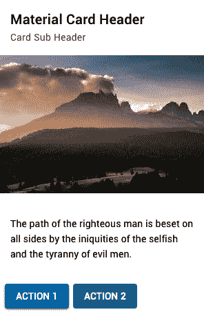

Components, Mixins, and Functional Components

构建 Vue 应用程序就像拼图一样。拼图的每个部分都是一个组件，每个部分都有一个要填充的槽。

组件在 Vue 开发中扮演着重要角色。在 Vue 中，代码的每一部分都是一个组件——它可以是布局、页面、容器或按钮，但归根结底，它是一个组件。学习如何与它们交互并重用它们是清理 Vue 应用程序中的代码和性能的关键。组件是最终将在屏幕上呈现某些内容的代码，无论其大小如何。

在本章中，我们将学习如何制作一个可以在许多地方重用的可视化组件。我们将使用插槽在组件中放置数据，创建功能组件以实现快速渲染，实现父组件和子组件之间的直接通信，并考虑异步加载组件。

然后，我们将把所有这些片段放在一起，创建一个漂亮的拼图，它也是一个 Vue 应用程序。

在本章中，我们将介绍以下配方：

*   创建可视化模板组件
*   使用插槽和命名插槽在组件中放置数据
*   向组件传递数据并验证数据
*   创建功能组件
*   访问子组件的数据
*   创建动态注入组件
*   创建依赖项注入组件
*   创建一个`mixin`组件
*   延迟加载组件

让我们开始吧！

# 技术要求

在本章中，我们将使用**Node.js**和**Vue CLI****。**

**Attention Windows users**: You need to install an `npm` package called `windows-build-tools` to be able to install the required packages. To do so, open PowerShell as an administrator and execute the `> npm install -g windows-build-tools` command.

要安装**Vue CLI**，您需要打开终端（macOS 或 Linux）或命令提示符*/*PowerShell（Windows），并执行以下命令：

```js
> npm install -g @vue/cli @vue/cli-service-global
```

# 创建可视化模板组件

组件可以是数据驱动的、无状态的、有状态的或简单的可视组件。但什么是可视组件？可视组件是只有一个用途的组件：可视操作。

一个可视化组件可以有一个带有一些`div`HTML 元素的简单范围 CSS，也可以是一个更复杂的组件，可以实时计算元素在屏幕上的位置。

在这个配方中，我们将创建一个卡片包装器组件，它遵循材料设计指南。

## 准备

此配方的先决条件是 Node.js 12+。

此配方所需的 Node.js 全局对象如下：

*   `@vue/cli`
*   `@vue/cli-service-global`

## 怎么做。。。

要启动我们的组件，我们需要使用 Vue CLI 创建一个新的 Vue 项目。打开终端（macOS 或 Linux）或命令提示符/PowerShell（Windows）并执行以下命令：

```js
> vue create visual-component
```

CLI 将询问一些有助于创建项目的问题。您可以使用箭头键导航，*输入*键继续，以及*s**起搏器*选择选项。选择`default`选项：

```js
? Please pick a preset: (Use arrow keys)
❯ default (babel, eslint) 
  Manually select features ‌
```

现在，按照以下步骤创建可视模板组件：

1.  在`src/components`文件夹中创建一个名为`MaterialCardBox.vue`的新文件。
2.  在这个文件中，我们将开始处理组件的模板。我们需要为卡片创建框。使用材料设计指南，此框将有阴影和圆角：

```js
<template>
  <div class="cardBox elevation_2">
    <div class="section">
      This is a Material Card Box
    </div>
  </div>
</template>
```

3.  在我们组件的`<script>`部分，我们将只添加我们的基本名称：

```js
<script>
  export default {
    name: 'MaterialCardBox',
  };
</script>
```

4.  我们需要创建我们的提升 CSS 规则。为此，在`style`文件夹中创建一个名为`elevation.css`的文件。在那里，我们将创建从`0`到`24`的标高，以便我们可以遵循材料设计指南提供的所有标高：

```js
.elevation_0 {
  border: 1px solid rgba(0, 0, 0, 0.12);
}

.elevation_1 {
  box-shadow: 0 1px 3px rgba(0, 0, 0, 0.2),
  0 1px 1px rgba(0, 0, 0, 0.14),
  0 2px 1px -1px rgba(0, 0, 0, 0.12);
}

.elevation_2 {
  box-shadow: 0 1px 5px rgba(0, 0, 0, 0.2),
  0 2px 2px rgba(0, 0, 0, 0.14),
  0 3px 1px -2px rgba(0, 0, 0, 0.12);
}

.elevation_3 {
  box-shadow: 0 1px 8px rgba(0, 0, 0, 0.2),
  0 3px 4px rgba(0, 0, 0, 0.14),
  0 3px 3px -2px rgba(0, 0, 0, 0.12);
}

.elevation_4 {
  box-shadow: 0 2px 4px -1px rgba(0, 0, 0, 0.2),
  0 4px 5px rgba(0, 0, 0, 0.14),
  0 1px 10px rgba(0, 0, 0, 0.12);
}

.elevation_5 {
  box-shadow: 0 3px 5px -1px rgba(0, 0, 0, 0.2),
  0 5px 8px rgba(0, 0, 0, 0.14),
  0 1px 14px rgba(0, 0, 0, 0.12);
}

.elevation_6 {
  box-shadow: 0 3px 5px -1px rgba(0, 0, 0, 0.2),
  0 6px 10px rgba(0, 0, 0, 0.14),
  0 1px 18px rgba(0, 0, 0, 0.12);
}

.elevation_7 {
  box-shadow: 0 4px 5px -2px rgba(0, 0, 0, 0.2),
  0 7px 10px 1px rgba(0, 0, 0, 0.14),
  0 2px 16px 1px rgba(0, 0, 0, 0.12);
}

.elevation_8 {
  box-shadow: 0 5px 5px -3px rgba(0, 0, 0, 0.2),
  0 8px 10px 1px rgba(0, 0, 0, 0.14),
  0 3px 14px 2px rgba(0, 0, 0, 0.12);
}

.elevation_9 {
  box-shadow: 0 5px 6px -3px rgba(0, 0, 0, 0.2),
  0 9px 12px 1px rgba(0, 0, 0, 0.14),
  0 3px 16px 2px rgba(0, 0, 0, 0.12);
}

.elevation_10 {
  box-shadow: 0 6px 6px -3px rgba(0, 0, 0, 0.2),
  0 10px 14px 1px rgba(0, 0, 0, 0.14),
  0 4px 18px 3px rgba(0, 0, 0, 0.12);
}

.elevation_11 {
  box-shadow: 0 6px 7px -4px rgba(0, 0, 0, 0.2),
  0 11px 15px 1px rgba(0, 0, 0, 0.14),
  0 4px 20px 3px rgba(0, 0, 0, 0.12);
}

.elevation_12 {
  box-shadow: 0 7px 8px -4px rgba(0, 0, 0, 0.2),
  0 12px 17px 2px rgba(0, 0, 0, 0.14),
  0 5px 22px 4px rgba(0, 0, 0, 0.12);
}

.elevation_13 {
  box-shadow: 0 7px 8px -4px rgba(0, 0, 0, 0.2),
  0 13px 19px 2px rgba(0, 0, 0, 0.14),
  0 5px 24px 4px rgba(0, 0, 0, 0.12);
}

.elevation_14 {
  box-shadow: 0 7px 9px -4px rgba(0, 0, 0, 0.2),
  0 14px 21px 2px rgba(0, 0, 0, 0.14),
  0 5px 26px 4px rgba(0, 0, 0, 0.12);
}

.elevation_15 {
  box-shadow: 0 8px 9px -5px rgba(0, 0, 0, 0.2),
  0 15px 22px 2px rgba(0, 0, 0, 0.14),
  0 6px 28px 5px rgba(0, 0, 0, 0.12);
}

.elevation_16 {
  box-shadow: 0 8px 10px -5px rgba(0, 0, 0, 0.2),
  0 16px 24px 2px rgba(0, 0, 0, 0.14),
  0 6px 30px 5px rgba(0, 0, 0, 0.12);
}

.elevation_17 {
  box-shadow: 0 8px 11px -5px rgba(0, 0, 0, 0.2),
  0 17px 26px 2px rgba(0, 0, 0, 0.14),
  0 6px 32px 5px rgba(0, 0, 0, 0.12);
}

.elevation_18 {
  box-shadow: 0 9px 11px -5px rgba(0, 0, 0, 0.2),
  0 18px 28px 2px rgba(0, 0, 0, 0.14),
  0 7px 34px 6px rgba(0, 0, 0, 0.12);
}

.elevation_19 {
  box-shadow: 0 9px 12px -6px rgba(0, 0, 0, 0.2),
  0 19px 29px 2px rgba(0, 0, 0, 0.14),
  0 7px 36px 6px rgba(0, 0, 0, 0.12);
}

.elevation_20 {
  box-shadow: 0 10px 13px -6px rgba(0, 0, 0, 0.2),
  0 20px 31px 3px rgba(0, 0, 0, 0.14),
  0 8px 38px 7px rgba(0, 0, 0, 0.12);
}

.elevation_21 {
  box-shadow: 0 10px 13px -6px rgba(0, 0, 0, 0.2),
  0 21px 33px 3px rgba(0, 0, 0, 0.14),
  0 8px 40px 7px rgba(0, 0, 0, 0.12);
}

.elevation_22 {
  box-shadow: 0 10px 14px -6px rgba(0, 0, 0, 0.2),
  0 22px 35px 3px rgba(0, 0, 0, 0.14),
  0 8px 42px 7px rgba(0, 0, 0, 0.12);
}

.elevation_23 {
  box-shadow: 0 11px 14px -7px rgba(0, 0, 0, 0.2),
  0 23px 36px 3px rgba(0, 0, 0, 0.14),
  0 9px 44px 8px rgba(0, 0, 0, 0.12);
}

.elevation_24 {
  box-shadow: 0 11px 15px -7px rgba(0, 0, 0, 0.2),
  0 24px 38px 3px rgba(0, 0, 0, 0.14),
  0 9px 46px 8px rgba(0, 0, 0, 0.12);
}
```

5.  为了在组件的`<style>`部分设置卡的样式，我们需要在`<style>`标记内设置`scoped`属性。这确保了视觉样式不会干扰应用程序中的任何其他组件。我们将按照材料设计指南制作此卡。我们需要导入`Roboto`字体系列并将其应用于将被包装在此组件中的所有元素：

```js
<style scoped>
  @import url('https://fonts.googleapis.com/css? 
    family=Roboto:400,500,700&display=swap');
  @import '../style/elevation.css';

  * {
    font-family: 'Roboto', sans-serif;
  }

  .cardBox {
    width: 100%;
    max-width: 300px;
    background-color: #fff;
    position: relative;
    display: inline-block;
    border-radius: 0.25rem;
  }

  .cardBox > .section {
    padding: 1rem;
    position: relative;
  }
</style>
```

6.  要运行服务器并查看组件，您需要打开终端（macOS 或 Linux）或命令提示符/PowerShell（Windows），然后执行以下命令：

```js
> npm run serve
```

以下是渲染并运行的组件：


## 它是如何工作的。。。

可视组件是一种组件，它将封装任何组件，并将封装的数据与自定义样式一起放置。由于此组件与其他组件混合，因此它可以形成一个新组件，而无需重新应用或重写代码中的任何样式。

## 另见

*   您可以在[上找到关于作用域 CSS 的更多信息 https://vue-loader.vuejs.org/guide/scoped-css.html#child-组件根元素](https://vue-loader.vuejs.org/guide/scoped-css.html#child-component-root-elements)。
*   有关材料设计卡的更多信息，请访问[https://material.io/components/cards/](https://material.io/components/cards/) 。
*   在[查看 Roboto 字体系列 https://fonts.google.com/specimen/Roboto](https://fonts.google.com/specimen/Roboto) 。

# 使用插槽和命名插槽在组件中放置数据

有时候，拼图的各个部分都不见了，而你却发现自己一片空白。想象一下，你可以用自己制作的一块来填补这个空白点，而不是拼图盒附带的原始块。这是 Vue 插槽的粗略类比。

Vue 插槽就像组件中的开放空间，其他组件可以用文本、HTML 元素或其他 Vue 组件填充这些开放空间。您可以声明插槽的位置以及它在组件中的行为方式。

使用此技术，您可以创建一个组件，并在需要时对其进行自定义，而无需任何努力。

## 准备

此配方的先决条件是 Node.js 12+。

此配方所需的 Node.js 全局对象如下：

*   `@vue/cli`
*   `@vue/cli-service-global`

为了完成这个配方，我们将使用我们的 Vue 项目和 Vue CLI，就像我们在*创建可视化模板组件*配方中所做的那样。

## 怎么做。。。

按照以下说明在组件中创建插槽和命名插槽：

1.  打开`components`文件夹中的`MaterialCardBox.vue`文件。
2.  在组件的`<template>`部分，我们需要向卡中添加四个主要部分。这些部分基于材料设计卡的解剖结构，分别为`header`、`media`、`main section`和`action`区域。我们将使用`main section`的默认插槽；其余的都将被命名为作用域。对于某些命名插槽，我们将添加一个回退配置，如果用户没有为插槽选择任何设置，将显示该配置：

```js
<template>
  <div class="cardBox elevation_2">
    <div class="header">
      <slot
        v-if="$slots.header"
        name="header"
      />
      <div v-else>
        <h1 class="cardHeader cardText">
          Card Header
        </h1>
        <h2 class="cardSubHeader cardText">
          Card Sub Header
        </h2>
      </div>
    </div>
    <div class="media">
      <slot
        v-if="$slots.media"
        name="media"
      />
      
    </div>
    <div
      v-if="$slots.default"
      class="section cardText"
      :class="{
        noBottomPadding: $slots.action,
        halfPaddingTop: $slots.media,
      }"
    >
      <slot/>
    </div>
    <div
      v-if="$slots.action"
      class="action"
    >
      <slot name="action"/>
    </div>
  </div>
</template>
```

3.  现在，我们需要为组件创建文本 CSS 规则。在`style`文件夹中，创建一个名为`cardStyles.css`的新文件。在这里，我们将添加卡片文本和标题的规则：

```js
h1, h2, h3, h4, h5, h6 {
  margin: 0;
}

.cardText {
  -moz-osx-font-smoothing: grayscale;
  -webkit-font-smoothing: antialiased;
  text-decoration: inherit;
  text-transform: inherit;
  font-size: 0.875rem;
  line-height: 1.375rem;
  letter-spacing: 0.0071428571em;
}

h1.cardHeader {
  font-size: 1.25rem;
  line-height: 2rem;
  font-weight: 500;
  letter-spacing: .0125em;
}

h2.cardSubHeader {
  font-size: .875rem;
  line-height: 1.25rem;
  font-weight: 400;
  letter-spacing: .0178571429em;
  opacity: .6;
}
```

4.  在组件的`<style>`部分，我们需要创建一些符合我们设计指南规则的 CSS：

```js
<style scoped>
  @import url("https://fonts.googleapis.com/css?family=Roboto:400,500,700&display=swap");
  @import "../style/elevation.css";
  @import "../style/cardStyles.css";

  * {
    font-family: "Roboto", sans-serif;
  }

  .cardBox {
    width: 100%;
    max-width: 300px;
    border-radius: 0.25rem;
    background-color: #fff;
    position: relative;
    display: inline-block;
    box-shadow: 0 1px 5px rgba(0, 0, 0, 0.2), 0 2px 2px rgba(0, 0,
      0, 0.14),
    0 3px 1px -2px rgba(0, 0, 0, 0.12);
  }

  .cardBox > .header {
    padding: 1rem;
    position: relative;
    display: block;
  }

  .cardBox > .media {
    overflow: hidden;
    position: relative;
    display: block;
    max-width: 100%;
  }

  .cardBox > .section {
    padding: 1rem;
    position: relative;
    margin-bottom: 1.5rem;
    display: block;
  }

  .cardBox > .action {
    padding: 0.5rem;
    position: relative;
    display: block;
  }

  .cardBox > .action > *:not(:first-child) {
    margin-left: 0.4rem;
  }

  .noBottomPadding {
    padding-bottom: 0 !important;
  }

  .halfPaddingTop {
    padding-top: 0.5rem !important;
  }
</style>
```

5.  在`App.vue`文件的`src`文件夹中，我们需要向这些插槽添加元素。这些元素将添加到每个命名插槽以及默认插槽中。我们将更改文件的`<template>`部分中的组件。要添加命名插槽，我们需要使用名为`v-slot:`的指令，然后添加要使用的插槽的名称：

```js
<template>
  <div id="app">
    <MaterialCardBox>
      <template v-slot:header>
        <strong>Card Title</strong><br>
        <span>Card Sub-Title</span>
      </template>
      <template v-slot:media>
        
      </template>
      <p>Main Section</p>
      <template v-slot:action>
        <button>Action Button</button>
        <button>Action Button</button>
      </template>
    </MaterialCardBox>
  </div>
</template>
```

For the default slot, we don't need to use a directive; it just needs to be wrapped inside the component so that it can placed inside the `<slot />` part of the component.

6.  要运行服务器并查看组件，您需要打开终端（macOS 或 Linux）或命令提示符/PowerShell（Windows），然后执行以下命令：

```js
> npm run serve
```

以下是渲染并运行的组件：


## 它是如何工作的。。。

插槽是可以将任何可以渲染到 DOM 中的内容放入其中的位置。我们选择插槽的位置，并告诉组件在收到任何信息时渲染的位置。

在这个配方中，我们使用了命名插槽，这些插槽设计用于需要多个插槽的组件。要在 Vue 单个文件（`.vue``<template>`部分中的该组件内放置任何信息，需要添加`v-slot:`指令，以便 Vue 知道将传递的信息放置在何处。

## 另见

*   有关 Vue 插槽的更多信息，请访问[https://v3.vuejs.org/guide/component-slots.html](https://v3.vuejs.org/guide/component-slots.html) 。
*   您可以在[上找到有关材料设计卡解剖结构的更多信息 https://material.io/components/cards/#anatomy](https://material.io/components/cards/#anatomy) 。

# 向组件传递数据并验证数据

此时，您知道如何通过插槽将数据放置在组件中，但这些插槽是为 HTMLDOM 元素或 Vue 组件制作的。有时，您需要传递诸如字符串、数组、布尔值甚至对象之类的数据。

整个应用程序就像一个拼图，每个部分都是一个组件。组件之间的通信是其中的一个重要部分。将数据传递给组件是连接拼图的第一步，而验证数据是连接拼图的最后一步。

在这个配方中，我们将学习如何将数据传递给组件，并验证传递给它的数据。

## 准备

此配方的先决条件是 Node.js 12+。

此配方所需的 Node.js 全局对象如下：

*   `@vue/cli`
*   `@vue/cli-service-global`

为了完成这个配方，我们将继续使用*使用插槽和命名插槽中的项目，将数据放入组件*配方中。

## 怎么做。。。

按照以下说明将数据传递到组件并进行验证：

1.  打开`src/components`文件夹中的`MaterialCardBox.vue`文件。
2.  在组件的`<script>`部分，我们将创建一个名为`props`的新属性。此属性接收组件的数据，这些数据可用于可视化操作、代码中的变量或需要执行的函数。在这个属性中，我们需要声明属性的名称、类型（如果需要）和验证函数。此函数将在运行时执行，以验证已传递的属性是否有效：

```js
<script>
export default {
  name: 'MaterialCardBox',
  inheritAttrs: false,
  props: {
    header: {
      type: String,
      required: false,
      default: '',
      validator: (v) => typeof v === 'string',
    },
    subHeader: {
      type: String,
      required: false,
      default: '',
      validator: (v) => typeof v === 'string',
    },
    mainText: {
      type: String,
      required: false,
      default: '',
      validator: (v) => typeof v === 'string',
    },
    showMedia: {
      type: Boolean,
      required: false,
      default: false,
      validator: (v) => typeof v === 'boolean',
    },
    imgSrc: {
      type: String,
      required: false,
      default: '',
      validator: (v) => typeof v === 'string',
    },
    showActions: {
      type: Boolean,
      required: false,
      default: false,
      validator: (v) => typeof v === 'boolean',
    },
    elevation: {
      type: Number,
      required: false,
      default: 2,
      validator: (v) => typeof v === 'number',
    },
  },
  computed: {},
};
</script>
```

3.  在`computed`属性中，在组件的`<script>`部分，我们需要创建一组用于渲染卡的视觉操作规则。这些规则称为`showMediaContent`、`showActionsButtons`、`showHeader`和`cardElevation`。每个规则将检查收到的`props`和`$slots`对象，以检查是否需要呈现相关的卡片部分：

```js
computed: {
  showMediaContent() {
    return (this.$slots.media || this.imgSrc) && this.showMedia;
  },
  showActionsButtons() {
    return this.showActions && this.$slots.action;
  },
  showHeader() {
    return this.$slots.header || (this.header || this.subHeader);
  },
  showMainContent() {
    return this.$slots.default || this.mainText;
  },
  cardElevation() {
    return `elevation_${parseInt(this.elevation, 10)}`;
  },
},
```

4.  添加可视化操作规则后，我们需要将创建的规则添加到组件的`<template>`部分。它们会影响卡的外观和行为。例如，如果没有定义头槽，但定义了头属性，我们将显示回退头。此标头包含通过`props`传递的数据：

```js
<template>
  <div
    class="cardBox"
    :class="cardElevation"
  >
    <div
      v-if="showHeader"
      class="header"
    >
      <slot
        v-if="$slots.header"
        name="header"
      />
      <div v-else>
        <h1 class="cardHeader cardText">
          {{ header }}
        </h1>
        <h2 class="cardSubHeader cardText">
          {{ subHeader }}
        </h2>
      </div>
    </div>
    <div
      v-if="showMediaContent"
      class="media"
    >
      <slot
        v-if="$slots.media"
        name="media"
      />
      
    </div>
    <div
      v-if="showMainContent"
      class="section cardText"
      :class="{
        noBottomPadding: $slots.action,
        halfPaddingTop: $slots.media,
      }"
    >
      <slot v-if="$slots.default" />
      <p
        v-else
        class="cardText"
      >
        {{ mainText }}
      </p>
    </div>
    <div
      v-if="showActionsButtons"
      class="action"
    >
      <slot
        v-if="$slots.action"
        name="action"
      />
    </div>
  </div>
</template>
```

5.  要运行服务器并查看组件，您需要打开终端（macOS 或 Linux）或命令提示符/PowerShell（Windows），然后执行以下命令：

```js
> npm run serve
```

以下是渲染并运行的组件：


## 它是如何工作的。。。

每个 Vue 组件都是一个具有渲染功能的 JavaScript 对象。当需要在 HTML DOM 中呈现时，将调用此呈现函数。单个文件组件是该对象的抽象。

当我们宣布我们的组件具有可以传递的唯一道具时，它为其他组件或 JavaScript 打开了一扇小门，让它们将信息放在我们的组件中。然后，我们可以在组件中使用这些值来渲染数据、进行一些计算或制定可视化规则。

在我们的例子中，使用单文件组件，我们将这些规则作为 HTML 属性传递，因为`vue-template-compiler`将获取这些属性并将它们转换为 JavaScript 对象。

当这些值传递给我们的组件时，Vue 会检查传递的属性是否与正确的类型匹配，然后在每个值的顶部执行验证函数，以查看它是否与我们期望的匹配。

完成所有这些之后，组件的生命周期将继续，我们可以渲染组件。

## 另见

*   有关`props`的更多信息，请访问[https://v3.vuejs.org/guide/component-props.html](https://v3.vuejs.org/guide/component-props.html) 。
*   有关`vue-template-compiler`的更多信息，请访问[https://vue-loader.vuejs.org/guide/](https://vue-loader.vuejs.org/guide/) 。

# 创建功能组件

功能组件的优点在于简单。它们是无状态组件，没有任何数据、计算属性，甚至没有生命周期。它们只是在传递的数据发生更改时调用的渲染函数。

您可能想知道这有什么用处。功能组件是不需要在其中保存任何数据的 UI 组件的完美伴侣，或者是不需要任何数据操作的呈现组件的可视组件。

顾名思义，它们类似于函数组件，它们只不过是渲染函数。它们是专门用于性能渲染和视觉元素的组件的精简版本。

## 准备

此配方的先决条件是 Node.js 12+。

此配方所需的 Node.js 全局对象如下：

*   `@vue/cli`
*   `@vue/cli-service-global`

为了完成此配方，我们将使用我们的 Vue 项目和 Vue CLI，正如我们在*中所做的那样，将数据传递给您的组件并验证数据**配方。*

 *## 怎么做。。。

按照以下说明创建 Vue 功能组件：

1.  在`src/components`文件夹中创建一个名为`MaterialButton.vue`的新文件。
2.  在这个组件中，我们需要验证我们将接收的道具是否是有效的颜色。为此，请在项目内部安装`is-color`模块。您需要打开终端（macOS 或 Linux）或命令提示符/PowerShell（Windows）并执行以下命令：

```js
> npm install --save is-color
```

3.  在组件的`<script>`部分，我们需要创建功能组件将接收的`props`对象。由于功能组件只是一个没有状态的呈现函数，因此它是无状态的–组件的`<script>`部分被裁剪为`props`、`injections`和`slots`。将有四个`props`对象：`backgroundColor`、`textColor`、`isRound`和`isFlat`。当我们安装组件时不需要这些，因为我们将在`props`中定义一个默认值：

```js
<script>
import isColor from 'is-color';

export default {
  name: 'MaterialButton',
  props: {
    backgroundColor: {
      type: String,
      required: false,
      default: '#fff',
      validator: (v) => typeof v === 'string' && isColor(v),
    },
    textColor: {
      type: String,
      required: false,
      default: '#000',
      validator: (v) => typeof v === 'string' && isColor(v),
    },
    isRound: {
      type: Boolean,
      required: false,
      default: false,
    },
    isFlat: {
      type: Boolean,
      required: false,
      default: false,
    },
  },
};
</script>
```

4.  我们需要创建一个按钮 HTML 元素，其中包含一个基本的`class`属性按钮和一个基于接收到的`props`对象的动态`class`属性。与普通组件相比，我们需要指定`props`属性才能使用功能组件。对于按钮的样式，我们需要创建一个动态的`style`属性，也基于`$props`。要将所有事件侦听器直接发送到父级，我们可以调用`v-bind`指令并传递`$attrs`属性。这将绑定所有事件侦听器，而无需声明每个事件侦听器。在按钮内部，我们将添加一个`div`HTML 元素以增强视觉效果，并在文本放置的位置添加`<slot>`：

```js
<template>
  <button
    tabindex="0"
    class="button"
    :class="{
      round: $props.isRound,
      isFlat: $props.isFlat,
    }"
    :style="{
      background: $props.backgroundColor,
      color: $props.textColor
    }"
    v-bind="$attrs"
  >
    <div
      tabindex="-1"
      class="button_focus_helper"
    />
    <slot/>
  </button>
</template>
```

5.  现在，让我们把它弄漂亮。在组件的`<style>`部分，我们需要为这个按钮创建所有 CSS 规则。我们需要将`scoped`属性添加到`<style>`，这样 CSS 规则就不会影响我们应用程序中的任何其他元素：

```js
<style scoped>
  .button {
    user-select: none;
    position: relative;
    outline: 0;
    border: 0;
    border-radius: 0.25rem;
    vertical-align: middle;
    cursor: pointer;
    padding: 4px 16px;
    font-size: 14px;
    line-height: 1.718em;
    text-decoration: none;
    color: inherit;
    background: transparent;
    transition: 0.3s cubic-bezier(0.25, 0.8, 0.5, 1);
    min-height: 2.572em;
    font-weight: 500;
    text-transform: uppercase;
  }
  .button:not(.isFlat){
    box-shadow: 0 1px 5px rgba(0, 0, 0, 0.2),
    0 2px 2px rgba(0, 0, 0, 0.14),
    0 3px 1px -2px rgba(0, 0, 0, 0.12);
  }

  .button:not(.isFlat):focus:before,
  .button:not(.isFlat):active:before,
  .button:not(.isFlat):hover:before {
    content: '';
    position: absolute;
    top: 0;
    right: 0;
    bottom: 0;
    left: 0;
    border-radius: inherit;
    transition: 0.3s cubic-bezier(0.25, 0.8, 0.5, 1);
  }

  .button:not(.isFlat):focus:before,
  .button:not(.isFlat):active:before,
  .button:not(.isFlat):hover:before {
    box-shadow: 0 3px 5px -1px rgba(0, 0, 0, 0.2),
    0 5px 8px rgba(0, 0, 0, 0.14),
    0 1px 14px rgba(0, 0, 0, 0.12);
  }

  .button_focus_helper {
    position: absolute;
    top: 0;
    left: 0;
    width: 100%;
    height: 100%;
    pointer-events: none;
    border-radius: inherit;
    outline: 0;
    opacity: 0;
    transition: background-color 0.3s cubic-bezier(0.25, 0.8, 0.5,
      1),
    opacity 0.4s cubic-bezier(0.25, 0.8, 0.5, 1);
  }

  .button_focus_helper:after, .button_focus_helper:before {
    content: '';
    position: absolute;
    top: 0;
    left: 0;
    width: 100%;
    height: 100%;
    opacity: 0;
    border-radius: inherit;
    transition: background-color 0.3s cubic-bezier(0.25, 0.8, 0.5,
      1),
    opacity 0.6s cubic-bezier(0.25, 0.8, 0.5, 1);
  }

  .button_focus_helper:before {
    background: #000;
  }

  .button_focus_helper:after {
    background: #fff;
  }

  .button:focus .button_focus_helper:before,
  .button:hover .button_focus_helper:before {
    opacity: .1;
  }

  .button:focus .button_focus_helper:after,
  .button:hover .button_focus_helper:after {
    opacity: .6;
  }

  .button:focus .button_focus_helper,
  .button:hover .button_focus_helper {
    opacity: 0.2;
  }

  .round {
    border-radius: 50%;
  }
</style>

```

6.  要运行服务器并查看组件，您需要打开终端（macOS 或 Linux）或命令提示符/PowerShell（Windows），然后执行以下命令：

```js
> npm run serve
```

以下是渲染并运行的组件：



## 它是如何工作的。。。

功能组件与渲染函数一样简单。他们没有任何类型的数据、功能，也无法访问外部世界。

它们最初仅作为 JavaScript 对象`render()`函数引入 Vue；后来，它们被添加到用于 Vue 单文件应用程序的`vue-template-compiler`中。

功能组件通过接收两个参数来工作：`createElement`和`context`。正如我们在单个文件中看到的，我们只能访问元素，因为它们不在 JavaScript 对象的`this`属性中。发生这种情况是因为在将上下文传递给呈现函数时，没有`this`属性。

功能组件在 Vue 上提供尽可能快的渲染，因为它不依赖于组件的生命周期来检查渲染；它只是在每次数据更改时呈现。

## 另见

*   有关功能组件的更多信息，请访问[https://v3.vuejs.org/guide/migration/functional-components.html](https://v3.vuejs.org/guide/migration/functional-components.html) 。
*   有关`is-color`模块的更多信息，请访问[https://www.npmjs.com/package/is-color](https://www.npmjs.com/package/is-color) 。

# 访问子组件的数据

通常，亲子沟通是通过事件或道具完成的。但有时，您需要访问存在于子函数或父函数中的数据、函数或计算属性。

Vue 为我们提供了一种双向互动的方式，从而为沟通和活动（如道具和事件侦听器）打开了大门。

还有另一种方法可以访问组件之间的数据：使用直接访问。这可以在使用单文件组件时借助模板中的特殊属性来完成，或者通过直接调用 JavaScript 中的对象来完成。有些人认为这种方法有点懒惰，但有时真的没有其他方法可以做到这一点。

## 准备

此配方的先决条件是 Node.js 12+。

此配方所需的 Node.js 全局对象如下：

*   `@vue/cli`
*   `@vue/cli-service-global`

为了完成这个配方，我们将使用我们的 Vue 项目和 Vue CLI，就像我们在*创建功能组件*配方中所做的那样。

## 怎么做。。。

我们将把这个食谱分成四部分。前三部分将涵盖新组件的创建—`StarRatingInput`、`StarRatingDisplay`和`StarRating`——而**最后一部分将涵盖数据和功能访问的直接父子操作。**

 **### 创建星级输入

在这个配方中，我们将创建一个基于五星级排名系统的星级评级输入。

按照以下步骤创建自定义星级输入：

1.  在`src/components`文件夹中创建一个名为`StarRatingInput.vue`的新文件。
2.  在组件的`<script>`部分，在`props`属性中创建一个`maxRating`属性，该属性为数字，非必需，默认值为`5`。在`data`属性中，我们需要创建我们的`rating`属性，默认值为`0`。在`methods`属性中，我们需要创建三个方法：`updateRating`、`emitFinalVoting`和`getStarName`。`updateRating`方法会将评级保存到数据中，`emitFinalVoting`会调用`updateRating`并通过`final-vote`事件将评级发送到父组件，`getStarName`会收到一个值并返回星的图标名称：

```js
<script>
  export default {
    name: 'StarRatingInput',
    props: {
      maxRating: {
        type: Number,
        required: false,
        default: 5,
      },
    },
    data: () => ({
      rating: 0,
    }),
    methods: {
      updateRating(value) {
        this.rating = value;
      },
      emitFinalVote(value) {
        this.updateRating(value);
        this.$emit('final-vote', this.rating);
      },
      getStarName(rate) {
        if (rate <= this.rating) {
          return 'star';
        }
        if (Math.fround((rate - this.rating)) < 1) {
          return 'star_half';
        }
        return 'star_border';
      },
    },
  };
</script>
```

3.  在组件的`<template>`部分，我们需要创建一个`<slot>`组件，这样我们可以将文本放在星级之前。我们将根据通过`props`属性接收到的`maxRating`值创建一个动态星星列表。在`mouseenter`、`focus`和`click`事件中，创建的每个明星都会有一个监听器。当`mouseenter`和`focus`被激发时，将调用`updateRating`方法，`click`将调用`emitFinalVote`：

```js
<template>
  <div class="starRating">
    <span class="rateThis">
      <slot/>
    </span>
    <ul>
      <li
        v-for="rate in maxRating"
        :key="rate"
        @mouseenter="updateRating(rate)"
        @click="emitFinalVote(rate)"
        @focus="updateRating(rate)"
      >
        <i class="material-icons">
          {{ getStarName(rate) }}
        </i>
      </li>
    </ul>
  </div>
</template>
```

4.  我们需要将材质设计图标导入到我们的应用程序中。在名为`materialIcons.css`的`styles`文件夹中创建一个新样式文件，并为`font-family`添加 CSS 规则：

```js
@font-face {
  font-family: 'Material Icons';
  font-style: normal;
  font-weight: 400;
  src: url(https://fonts.gstatic.com/s/materialicons/v48/flUhRq6tzZclQEJ- Vdg-IuiaDsNcIhQ8tQ.woff2) format('woff2');
}

.material-icons {
  font-family: 'Material Icons' !important;
  font-weight: normal;
  font-style: normal;
  font-size: 24px;
  line-height: 1;
  letter-spacing: normal;
  text-transform: none;
  display: inline-block;
  white-space: nowrap;
  word-wrap: normal;
  direction: ltr;
  -webkit-font-feature-settings: 'liga';
  -webkit-font-smoothing: antialiased;
}
```

5.  打开`main.js`文件，将创建的样式表导入其中。`css-loader`网页包将处理 JavaScript 文件中导入的`.css`文件。这将有助于开发，因为您不需要将文件重新导入其他位置：

```js
import { createApp } from 'vue';
import App from './App.vue';
import './style/materialIcons.css';

createApp(App).mount('#app');

```

6.  为了设计组件的样式，我们将在名为`starRating.css`的`src/style`文件夹中创建一个通用样式文件。在这里，我们将添加将在`StarRatingDisplay`和`StarRatingInput`组件之间共享的通用样式：

```js
.starRating {
  user-select: none;
  display: flex;
  flex-direction: row;
}

.starRating * {
  line-height: 0.9rem;
}

.starRating .material-icons {
  font-size: .9rem !important;
  color: orange;
}

ul {
  display: inline-block;
  padding: 0;
  margin: 0;
}

ul > li {
  list-style: none;
  float: left;
}
```

7.  在组件的`<style>`部分，我们需要创建所有 CSS 规则。然后，在`src/components`文件夹中的`StarRatingInput.vue`组件文件中，我们需要将`scoped`属性添加到`<style>`中，以便 CSS 规则不会影响应用程序中的任何其他元素。在这里，我们将导入我们创建的常用样式，并为输入添加新样式：

```js
<style scoped>
  @import '../style/starRating.css';

  .starRating {
    justify-content: space-between;
  }

  .starRating * {
    line-height: 1.7rem;
  }

  .starRating .material-icons {
    font-size: 1.6rem !important;
  }

  .rateThis {
    display: inline-block;
    color: rgba(0, 0, 0, .65);
    font-size: 1rem;
  }
</style>
```

8.  要运行服务器并查看组件，您需要打开终端（macOS 或 Linux）或命令提示符/PowerShell（Windows），然后执行以下命令：

```js
> npm run serve
```

以下是渲染并运行的组件：


### 创建 StarRatingDisplay 组件

现在我们有了输入，我们需要一种向用户显示所选选项的方法。按照以下步骤创建`StarRatingDisplay`组件：

1.  在`src/components`文件夹中创建一个名为`StarRatingDisplay.vue`的新组件。
2.  在组件的`<script>`部分，在`props`属性中，我们需要创建三个新属性：`maxRating`、`rating`和`votes`。这三个参数都是数字，不是必需的，都有一个默认值。在`methods`属性中，我们需要创建一个名为`getStarName`的新方法，该方法将接收一个值并返回星星的图标名称：

```js
<script>
  export default {
    name: 'StarRatingDisplay',
    props: {
      maxRating: {
        type: Number,
        required: false,
        default: 5,
      },
      rating: {
        type: Number,
        required: false,
        default: 0,
      },
      votes: {
        type: Number,
        required: false,
        default: 0,
      },
    },
    methods: {
      getStarName(rate) {
        if (rate <= this.rating) {
          return 'star';
        }
        if (Math.fround((rate - this.rating)) < 1) {
          return 'star_half';
        }
        return 'star_border';
      },
    },
  };
</script>
```

3.  在`<template>`中，我们需要根据通过`props`属性接收到的`maxRating`值创建一个动态恒星列表。在列表之后，我们需要显示我们收到的选票，如果我们收到更多的选票，我们也会显示它们：

```js
<template>
  <div class="starRating">
    <ul>
      <li
        v-for="rate in maxRating"
        :key="rate"
      >
        <i class="material-icons">
          {{ getStarName(rate) }}
        </i>
      </li>
    </ul>
    <span class="rating">
      {{ rating }}
    </span>
    <span
      v-if="votes"
      class="votes"
    >
      ({{ votes }})
    </span>
  </div>
</template>
```

4.  在组件的`<style>`部分，我们需要创建所有 CSS 规则。我们需要将`scoped`属性添加到`<style>`，这样 CSS 规则就不会影响应用程序中的任何其他元素。在这里，我们将导入我们创建的常用样式，并为显示添加新样式：

```js
<style scoped>
  @import '../style/starRating.css';

  .rating, .votes {
    display: inline-block;
    color: rgba(0, 0, 0, .65);
    font-size: .75rem;
    margin-left: .4rem;
  }
</style>
```

5.  要运行服务器并查看组件，您需要打开终端（macOS 或 Linux）或命令提示符/PowerShell（Windows），然后执行以下命令：

```js
> npm run serve
```

以下是渲染并运行的组件：


### 创建星号组件

现在我们已经创建了输入和显示，我们需要将它们连接在一个组件中。这个组件将是我们将在应用程序中使用的最后一个组件。

按照以下步骤创建最终的`StarRating`组件：

1.  在`src/components`文件夹中创建一个名为`StarRating.vue`的新文件。
2.  在组件的`<script>`部分，我们需要导入`StarRatingDisplay`和`StarRatingInput`组件。在`props`属性中，我们需要创建三个新属性：`maxRating`、`rating`和`votes`。这三个参数都是数字，不是必需的，并且有一个默认值。在`data`属性中，我们需要创建我们的`rating`属性，默认值为`0`，以及一个名为`voted`的属性，默认值为`false`。在`methods`属性中，我们需要添加一个名为`vote`的新方法，该方法将接收`rank`作为参数。将`rating`定义为接收值，将`voted`组件的内部变量定义为`true`：

```js
<script>
  import StarRatingInput from './StarRatingInput.vue';
  import StarRatingDisplay from './StarRatingDisplay.vue';

  export default {
    name: 'StarRating',
    components: { StarRatingDisplay, StarRatingInput },
    props: {
      maxRating: {
        type: Number,
        required: false,
        default: 5,
      },
      rating: {
        type: Number,
        required: false,
        default: 0,
      },
      votes: {
        type: Number,
        required: false,
        default: 0,
      },
    },
    data: () => ({
      rank: 0,
      voted: false,
    }),
    methods: {
      vote(rank) {
        this.rank = rank;
        this.voted = true;
      },
    },
  };
</script>
```

3.  对于`<template>`部分，我们将在此处放置两个组件，从而显示评级的输入：

```js
<template>
  <div>
    <StarRatingInput
      v-if="!voted"
      :max-rating="maxRating"
      @final-vote="vote"
    >
      Rate this Place
    </StarRatingInput>
    <StarRatingDisplay
      v-else
      :max-rating="maxRating"
      :rating="rating || rank"
      :votes="votes"
    />
  </div>
</template>
```

### 子组件上的数据操作

现在所有组件都准备好了，我们需要将它们添加到应用程序中。基本应用程序将访问子组件，并将评级设置为 5 星。

按照以下步骤理解和操作子组件中的数据：

1.  在`App.vue`文件中，在组件的`<template>`部分，删除`MaterialCardBox`组件的`main-text`属性，并将其设置为组件的默认插槽。
2.  在放置的文本之前，我们将添加`StarRating`组件。我们将为它添加一个`ref`属性。此属性将告诉 Vue 将此组件直接链接到组件的`this`对象中的特殊属性。在操作按钮中，我们将添加单击事件的侦听器–一个用于`resetVote`，另一个用于`forceVote`：

```js
<template>
  <div id="app">
    <MaterialCardBox
      header="Material Card Header"
      sub-header="Card Sub Header"
      show-media
      show-actions
      img-src="https://picsum.photos/300/200"
    >
      <p>
        <StarRating
          ref="starRating"
        />
      </p>
      <p>
        The path of the righteous man is beset on all sides by the
        iniquities of the selfish and the tyranny of evil men.
      </p>
      <template v-slot:action>
        <MaterialButton
          background-color="#027be3"
          text-color="#fff"
          @click="resetVote"
        >
          Reset
        </MaterialButton>
        <MaterialButton
          background-color="#26a69a"
          text-color="#fff"
          is-flat
          @click="forceVote"
        >
          Rate 5 Stars
        </MaterialButton>
      </template>
    </MaterialCardBox>
  </div>
</template>
```

3.  在组件的`<script>`部分，我们将创建一个`methods`属性，并添加两个新方法：`resetVote`和`forceVote`。这些方法将分别访问`StarRating`组件并重置数据或将数据设置为五星投票：

```js
<script>
  import MaterialCardBox from './components/MaterialCardBox.vue';
  import MaterialButton from './components/MaterialButton.vue';
  import StarRating from './components/StarRating.vue';

  export default {
    name: 'App',
    components: {
      StarRating,
      MaterialButton,
      MaterialCardBox,
    },
    methods: {
      resetVote() {
        this.$refs.starRating.rank = 0;
        this.$refs.starRating.voted = false;
      },
      forceVote() {
        this.$refs.starRating.rank = 5;
        this.$refs.starRating.voted = true;
      },
    },
  };
</script>
```

## 它是如何工作的。。。

当`ref`属性添加到组件中时，Vue 会将引用元素的链接添加到 JavaScript 的`this`属性对象内的`$refs`属性。从那里，您可以完全访问该组件。

此方法通常用于操作 HTMLDOM 元素，而无需调用文档查询选择器函数。

但是，此属性的主要功能是直接授予对 Vue 组件的访问权限，使您能够执行函数并查看组件的计算属性、变量和更改的变量–这就像从外部完全访问组件一样。

## 还有更多。。。

就像父级可以访问子组件一样，子级可以通过调用`this`对象上的`$parent`来访问父级组件。事件可以通过调用`$root`属性来访问 Vue 应用程序的根元素。

## 另见

有关亲子沟通的更多信息，请访问[https://v3.vuejs.org/guide/migration/custom-directives.html#edge-案例访问组件实例](https://v3.vuejs.org/guide/migration/custom-directives.html#edge-case-accessing-the-component-instance)。

# 创建动态注入组件

在某些情况下，组件可以通过接收的变量类型或数据类型来定义；然后，您需要动态更改组件，而无需设置大量 Vue`v-if`、`v-else-if`和`v-else`指令。

在这些情况下，最好使用动态组件，此时计算属性或函数可以定义将用于渲染的组件，并实时做出决策。

如果有两个响应，这些决策有时可能很简单，但如果有一个很长的切换案例，其中可能有一长串可能需要使用的组件，那么这些决策可能会更复杂。

## 准备

此配方的先决条件是 Node.js 12+。

The Node.js global objects that are required for this recipe are as follows:

*   `@vue/cli`
*   `@vue/cli-service-global`

为了完成此配方，我们将使用我们的 Vue 项目和 Vue CLI，就像我们在访问*您的孩子组件数据*配方中所做的那样。

## 怎么做。。。

按照以下步骤创建动态注入组件：

1.  打开`StarRating.vue`组件。
2.  在组件的`<script>`部分，我们需要创建一个`computed`属性，并使用一个名为`starComponent`的新计算值。此值将检查用户是否已投票。如果没有，则返回`StarRatingInput`组件；否则返回`StarRatingDisplay`组件：

```js
<script>
  import StarRatingInput from './StarRatingInput.vue';
  import StarRatingDisplay from './StarRatingDisplay.vue';

  export default {
    name: 'StarRating',
    components: { StarRatingDisplay, StarRatingInput },
    props: {
      maxRating: {
        type: Number,
        required: false,
        default: 5,
      },
      rating: {
        type: Number,
        required: false,
        default: 0,
      },
      votes: {
        type: Number,
        required: false,
        default: 0,
      },
    },
    data: () => ({
      rank: 0,
      voted: false,
    }),
    computed: {
      starComponent() {
        if (!this.voted) return StarRatingInput;
        return StarRatingDisplay;
      },
    },
    methods: {
      vote(rank) {
        this.rank = rank;
        this.voted = true;
      },
    },
  };
</script>
```

3.  在组件的`<template>`部分，我们将移除两个现有组件，并将其替换为一个名为`<component>`的特殊组件。此特殊组件具有一个命名属性，可以指向返回有效 Vue 组件的任何位置。在我们的例子中，我们将指向计算的`starComponent`属性。我们将获取由其他两个组件定义的所有绑定道具，并将它们放在这个新组件中，包括放在`<slot>`中的文本：

```js
<template>
  <component
    :is="starComponent"
    :max-rating="maxRating"
    :rating="rating || rank"
    :votes="votes"
    @final-vote="vote"
  >
    Rate this Place
  </component>
</template>
```

## 它是如何工作的。。。

使用 Vue 特殊的`<component>`组件，我们根据在 computed 属性上设置的规则声明了该组件应该呈现的内容。

作为一个通用组件，您始终需要保证可以呈现的每个组件的所有内容都在那里。最好的方法是使用`v-bind`指令和需要定义的道具和规则，但也可以直接在组件上定义，因为它将作为道具传递。

## 另见

有关动态组件的更多信息，请访问[https://v3.vuejs.org/guide/component-dynamic-async.html#dynamic-异步组件](https://v3.vuejs.org/guide/component-dynamic-async.html#dynamic-async-components)。

# 创建依赖项注入组件

直接从子组件或父组件访问数据而不知道它们是否存在可能非常危险。

在 Vue 中，可以使组件行为像接口一样，并具有在开发过程中不会改变的通用抽象功能。依赖注入过程在发展中国家是一种常见的范例，并且已经在 Vue 中实现。

使用 Vue 的内部依赖注入有一些优点和缺点，但它始终是一种很好的方法，可以确保您的子组件知道在开发父组件时可以从父组件获得什么。

## 准备

此配方的先决条件是 Node.js 12+。

The Node.js global objects that are required for this recipe are as follows:

*   `@vue/cli`
*   `@vue/cli-service-global`

为了完成这个配方，我们将使用我们的 Vue 项目和 Vue CLI，就像我们在*创建动态注入组件*配方中所做的那样。

## 怎么做。。。

按照以下步骤创建依赖项注入组件：

1.  打开`StarRating.vue`组件。
2.  在组件的`<script>`部分，添加一个名为`provide`的新属性。在我们的例子中，我们将只添加一个键值来检查组件是否是特定组件的子组件。使用`starRating`键和`true`值在属性中创建一个对象：

```js
<script>
import StarRatingInput from './StarRatingInput.vue';
import StarRatingDisplay from './StarRatingDisplay.vue';

export default {
  name: 'StarRating',
  components: { StarRatingDisplay, StarRatingInput },
  provide: {
    starRating: true,
  },
  props: {
    maxRating: {
      type: Number,
      required: false,
      default: 5,
    },
    rating: {
      type: Number,
      required: false,
      default: 0,
    },
    votes: {
      type: Number,
      required: false,
      default: 0,
    },
  },
  data: () => ({
    rank: 0,
    voted: false,
  }),
  computed: {
    starComponent() {
      if (!this.voted) return StarRatingInput;
      return StarRatingDisplay;
    },
  },
  methods: {
    vote(rank) {
      this.rank = rank;
      this.voted = true;
    },
  },
};
</script>
```

3.  打开`StarRatingDisplay.vue`文件。
4.  在组件的`<script>`部分，我们将添加一个名为`inject`的新属性。此属性将接收一个具有名为`starRating`的键的对象，该值将是一个具有`default()`函数的对象。

如果此组件不是`StarRating`组件的子组件，则此函数将记录错误：

```js
<script>
export default {
  name: 'StarRatingDisplay',
  props: {
    maxRating: {
      type: Number,
      required: false,
      default: 5,
    },
    rating: {
      type: Number,
      required: false,
      default: 0,
    },
    votes: {
      type: Number,
      required: false,
      default: 0,
    },
  },
  inject: {
    starRating: {
      default() {
        console.error('StarRatingDisplay need to be a child of 
           StarRating');
      },
    },
  },
  methods: {
    getStarName(rate) {
      if (rate <= this.rating) {
        return 'star';
      }
      if (Math.fround((rate - this.rating)) < 1) {
        return 'star_half';
      }
      return 'star_border';
    },
  },
};
</script>
```

5.  打开`StarRatingInput.vue`文件。
6.  在组件的`<script>`部分，我们将添加一个名为`inject`的新属性。此属性将接收一个具有名为`starRating`的键的对象，该值将是一个具有`default()`函数的对象。如果此组件不是`StarRating`组件的子组件，则此函数将记录错误：

```js
<script>
export default {
  name: 'StartRatingInput',
  props: {
    maxRating: {
      type: Number,
      required: false,
      default: 5,
    },
  },
  inject: {
    starRating: {
      default() {
        console.error('StarRatingInput need to be a child of 
          StartRating');
      },
    },
  },
  data: () => ({
    rating: 0,
  }),
  methods: {
    updateRating(value) {
      this.rating = value;
    },
    emitFinalVote(value) {
      this.updateRating(value);
      this.$emit('final-vote', this.rating);
    },
    getStarName(rate) {
      if (rate <= this.rating) {
        return 'star';
      }
      if (Math.fround((rate - this.rating)) < 1) {
        return 'star_half';
      }
      return 'star_border';
    },
  },
};
</script>
```

## 它是如何工作的。。。

在运行时，Vue 将检查`StarRatingDisplay`和`StarRatingInput`组件中`starRating`的注入属性，如果父组件未提供此值，则会将错误记录到控制台。

使用组件注入通常用于提供和维护绑定组件之间的公共接口，例如菜单和项目。一个项目可能需要一些存储在菜单中的功能或数据，或者我们可能需要检查它是否是菜单的子项。

依赖注入的主要缺点是在共享元素上没有更多的反应性。因此，它主要用于共享函数或检查组件链接。

## 另见

有关组件依赖项注入的更多信息，请访问[https://v3.vuejs.org/guide/component-provide-inject.html#provide-注射](https://v3.vuejs.org/guide/component-provide-inject.html#provide-inject)。

# 创建组件 mixin

有时，您会发现自己在一遍又一遍地重写相同的代码。然而，有一种方法可以防止这种情况的发生，并使自己的工作效率大大提高。

为此，您可以使用所谓的`mixin`，Vue 中的一种特殊代码导入，它将组件外部的代码部分连接到当前组件。

## 准备

此配方的先决条件是 Node.js 12+。

其配方所需的 Node.js 全局对象如下：

*   `@vue/cli`
*   `@vue/cli-service-global`

为了完成这个配方，我们将使用我们的 Vue 项目和 Vue CLI，就像我们在*创建依赖项注入组件*配方中所做的那样。

## 怎么做。。。

按照以下步骤创建组件混合：

1.  打开`StarRating.vue`组件。
2.  在`<script>`部分，我们需要将`props`属性提取到一个名为`starRatingDisplay.js`的新文件中，我们需要在`mixins`文件夹中创建该文件。这个新文件将是我们的第一个`mixin`，看起来如下：

```js
export default {
  props: {
    maxRating: {
      type: Number,
      required: false,
      default: 5,
    },
    rating: {
      type: Number,
      required: false,
      default: 0,
    },
    votes: {
      type: Number,
      required: false,
      default: 0,
    },
  },
};
```

3.  回到`StarRating.vue`组件中，我们需要导入这个新创建的文件，并将其添加到名为`mixin`：
    的新属性中

```js
<script>
  import StarRatingInput from './StarRatingInput.vue';
  import StarRatingDisplay from './StarRatingDisplay.vue';
  import StarRatingDisplayMixin from '../mixins/starRatingDisplay';

  export default {
    name: 'StarRating',
    components: { StarRatingDisplay, StarRatingInput },
    mixins: [StarRatingDisplayMixin],
    provide: {
      starRating: true,
    },
    data: () => ({
      rank: 0,
      voted: false,
    }),
    computed: {
      starComponent() {
        if (!this.voted) return StarRatingInput;
        return StarRatingDisplay;
      },
    },
    methods: {
      vote(rank) {
        this.rank = rank;
        this.voted = true;
      },
    },
  };
</script>
```

4.  现在，我们将打开`StarRatingDisplay.vue`文件。
5.  在`<script>`部分，我们将`inject`属性提取到一个名为`starRatingChild.js`的新文件中，该文件将在`mixins`文件夹中创建。这将是我们对`inject`物业的`mixin`：

```js
export default {
  inject: {
    starRating: {
      default() {
        console.error('StarRatingDisplay need to be a child of 
          StarRating');
      },
    },
  },
};
```

6.  回到`StarRatingDisplay.vue`文件中的`<script>`部分，我们将把`methods`属性提取到一个名为`starRatingName.js`的新文件中，该文件将在`mixins`文件夹中创建。这将是我们针对`getStarName`方法的`mixin`：

```js
export default {
  methods: {
    getStarName(rate) {
      if (rate <= this.rating) {
        return 'star';
      }
      if (Math.fround((rate - this.rating)) < 1) {
        return 'star_half';
      }
      return 'star_border';
    },
  },
};
```

7.  回到`StarRatingDisplay.vue`文件中，我们需要导入这些新创建的文件，并将它们添加到名为`mixin`的新属性中：

```js
<script>
import StarRatingDisplayMixin from '../mixins/starRatingDisplay';
import StarRatingNameMixin from '../mixins/starRatingName';
import StarRatingChildMixin from '../mixins/starRatingChild';

export default {
  name: 'StarRatingDisplay',
  mixins: [
    StarRatingDisplayMixin,
    StarRatingNameMixin,
    StarRatingChildMixin,
  ],
};
</script>
```

8.  打开`StarRatingInput.vue`文件。
9.  在`<script>`部分，删除`inject`属性，并将`props`属性提取到名为`starRatingBase.js`的新文件中，该文件将在`mixins`文件夹中创建。这将是我们对`props`物业的`mixin`：

```js
export default {
  props: {
    maxRating: {
      type: Number,
      required: false,
      default: 5,
    },
    rating: {
      type: Number,
      required: false,
      default: 0,
    },
  },
};
```

10.  回到`StarRatingInput.vue`文件中，我们需要将`rating`数据属性重命名为`rank`，在`getStarName`方法中，我们需要添加一个新常量，该常量将接收`rating`道具或`rank`数据。最后，我们需要进口`starRatingChildMixin`和`starRatingBaseMixin`：

```js
<script>
  import StarRatingBaseMixin from '../mixins/starRatingBase';
  import StarRatingChildMixin from '../mixins/starRatingChild';

  export default {
    name: 'StarRatingInput',
    mixins: [
      StarRatingBaseMixin,
      StarRatingChildMixin,
    ],
    data: () => ({
      rank: 0,
    }),
    methods: {
      updateRating(value) {
        this.rank = value;
      },
      emitFinalVote(value) {
        this.updateRating(value);
        this.$emit('final-vote', this.rank);
      },
      getStarName(rate) {
        const rating = (this.rating || this.rank);
        if (rate <= rating) {
          return 'star';
        }
        if (Math.fround((rate - rating)) < 1) {
          return 'star_half';
        }
        return 'star_border';
      },
    },
  };
</script>
```

## 它是如何工作的。。。

mixin 将对象合并在一起，但请确保不要用导入的属性替换组件中已存在的属性。

`mixins`属性的顺序也很重要，因为它们将被检查并作为`for`循环导入，所以最后一个`mixin`不会改变它们祖先的任何属性。

在这里，我们将代码的许多重复部分拆分为四个不同的小 JavaScript 文件，这些文件更易于维护并提高生产率，而无需重写代码。

## 另见

您可以在[上找到有关混合的更多信息 https://v3.vuejs.org/guide/mixins.html#mixins](https://v3.vuejs.org/guide/mixins.html#mixins) 。

# 延迟加载组件

`webpack`和 Vue 生来就是要在一起的。当使用`webpack`作为 Vue 项目的绑定器时，可以使组件异步加载或在需要时加载。这通常被称为延迟加载。

## 准备

此配方的先决条件是 Node.js 12+。

此配方所需的 Node.js 全局对象如下：

*   `@vue/cli`
*   `@vue/cli-service-global`

为了完成这个配方，我们将使用我们的 Vue 项目和 Vue CLI，就像我们在*创建组件混合*配方中所做的那样。

## 怎么做。。。

按照以下步骤使用延迟加载技术导入组件：

1.  打开`App.vue`文件。
2.  在组件的`<script>`部分，从 Vue 导入`defineAsyncComponent`API，并将`lazyLoad`组件函数作为`defineAsyncComponent`函数的参数传递：

```js
<script>
import { defineAsyncComponent } from 'vue';

export default {
  name: 'App',
  components: {
    StarRating: defineAsyncComponent(() => import('./components/StarRating.vue')),
    MaterialButton: defineAsyncComponent(() => import('./components/MaterialButton.vue')),
    MaterialCardBox: defineAsyncComponent(() => import('./components/MaterialCardBox.vue')),
  },
  methods: {
    resetVote() {
      this.$refs.starRating.rank = 0;
      this.$refs.starRating.voted = false;
    },
    forceVote() {
      this.$refs.starRating.rank = 5;
      this.$refs.starRating.voted = true;
    },
  },
};
</script>

<style>
  body {
    font-size: 14px;
  }
</style>

```

## 它是如何工作的。。。

Vue 现在使用一个名为`defineAsyncComponent`的新 API 将组件标识为异步组件，并作为参数接收另一个返回`import()`方法的函数。

当我们声明一个函数为每个组件返回一个`import()`函数时，`webpack`知道这个导入函数将是代码拆分，它将使组件成为捆绑包中的一个新文件。

## 另见

*   有关异步组件的更多信息，请访问[https://v3.vuejs.org/guide/component-dynamic-async.html#dynamic-异步组件](https://v3.vuejs.org/guide/component-dynamic-async.html#dynamic-async-components)。
*   有关 TC39 动态导入的更多信息，请访问[https://github.com/tc39/proposal-dynamic-import](https://github.com/tc39/proposal-dynamic-import) 。***