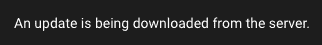
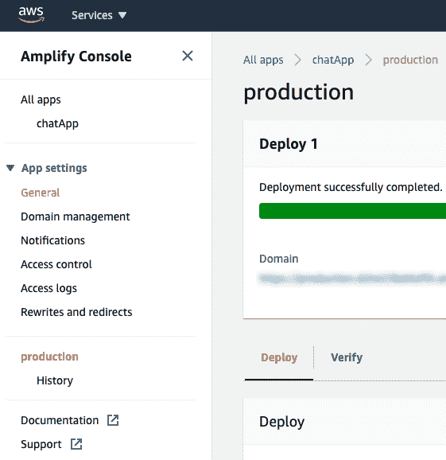
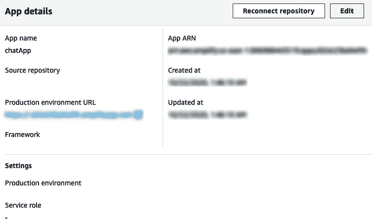
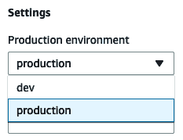
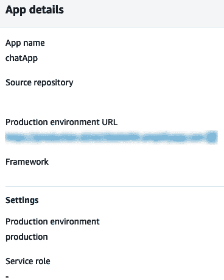

Transforming Your App into a PWA and Deploying to the Web

当我们完成编码后，是时候完成应用程序并准备发布了。现在，我们的自定义聊天应用程序与 Amplify 服务（用于后端）以及 Quasar 和 Vue（用于前端）一起工作，我们已经准备好在 web 上启动并运行了。

在本章中，您将学习如何将您的应用程序转换为**渐进式 Web 应用程序**（**PWA**），在服务人员上添加一些事件以通知用户您的应用程序的新版本，创建自定义横幅以安装在 iOS 设备上，并最终部署应用程序。

因此，在本章中，我们将介绍以下配方：

*   将应用程序转换为 PWA
*   创建应用程序更新通知
*   在 iOS 上添加自定义 PWA 安装通知
*   创建生产环境并部署

# 技术要求

在本章中，我们将使用**Node.js**、**AWS Amplify**、**和**类星体框架**。**

**Attention, Windows users! You need to install an `npm` package called `windows-build-tools` to be able to install the required packages. To do it, open PowerShell as an administrator and execute the following command:
`> npm install -g windows-build-tools`

要安装**Quasar Framework**，您需要打开终端（macOS 或 Linux）或命令提示符/PowerShell（Windows）并执行以下命令：

```js
> npm install -g @quasar/cli
```

要安装**AWS Amplify****、**您需要打开终端（macOS 或 Linux）或命令提示符/PowerShell（Windows）并执行以下命令：

```js
> npm install -g @aws-amplify/cli
```

# 将应用程序转换为 PWA

为了让应用程序在 web 上获得最佳体验，您需要有一个**PWA**，在这里您可以让应用程序缓存代码的某些部分、脱机工作、接收推送通知等等。

在本配方中，您将学习如何将您的**单页应用程序**（**SPA**）转换为 PWA，并重新配置 Amplify CLI 以使用新配置。

## 准备

此配方的先决条件是 Node.js 12+。

所需的 Node.js 全局对象如下：

*   `@aws-amplify/cli`
*   `@quasar/cli`

为了开始将我们的项目转化为 PWA，我们将继续在*第 6 章中创建的项目，创建聊天和消息 Vuex、页面和路由*。

## 怎么做。。。

现在是将我们的应用程序转换为 PWA 的时候了，然后才能在生产环境中使用它。按照以下步骤将 PWA 模式添加到 Quasar 中：

1.  首先，我们需要将 PWA 模式添加到类星体应用程序中。要执行此操作，请在项目文件夹中打开终端（macOS 或 Linux）或命令提示符/PowerShell（Windows），然后执行以下命令：

```js
> quasar m add pwa
```

2.  打开项目根文件夹中的`quasar.conf.js`文件，找到`pwa`属性。从 JavaScript 对象中删除`workboxPluginMode`和`workboxOptions`属性，添加`cleanupOutdatedCaches`、`skipWaiting`和`clientsClaim`属性，定义为`true`。最后，在`manifest`属性上，更改`name`、`short_name`和`description`以匹配您的应用程序，如下代码所示：

```js
pwa: {
 cleanupOutdatedCaches: true,
 skipWaiting: true,
 clientsClaim: true,
   manifest: {
     name: 'Chat Application',
     short_name: 'Chat App',
     description: 'Quasar & AWS Amplify Chat Application',
     ...
   },
 ...
}
```

3.  现在是将 Amplify CLI 的配置更改为新配置的时候了。为此，在项目文件夹中，打开终端（macOS 或 Linux）或命令提示符/PowerShell（Windows），并执行以下命令：

```js
> amplify configure project
```

4.  CLI 将询问您是否要更改项目名称。无需更改，按*进入*继续：

```js
? Enter a name for the project (chatapp) 
```

5.  CLI 将询问您是否要更改项目默认编辑器。选择`Visual Studio Code`（或您将在项目中使用的默认编辑器）并按*输入*继续：

```js
? Choose your default editor: (Use arrow keys)
❯ Visual Studio Code 
  Atom Editor 
  Sublime Text 
  IntelliJ IDEA 
  Vim (via Terminal, Mac OS only) 
  Emacs (via Terminal, Mac OS only) 
  None 
```

6.  CLI 将询问您是否要更改项目应用程序类型。选择`javascript`选项，按*进入*继续：

```js
? Choose the type of app that you're building (Use arrow keys)
  android 
  ios 
❯ javascript 
```

7.  CLI 将询问您是否要更改项目的 JavaScript 框架。选择`none`并按*进入*继续：

```js
Please tell us about your project
? What javascript framework are you using (Use arrow keys)
  angular 
  ember 
  ionic 
  react 
  react-native 
  vue 
❯ none 
```

8.  CLI 将询问您是否要更改项目应用程序源目录。无需更改，按*进入*继续：

```js
? Source Directory Path:  (src)
```

9.  CLI 将询问您是否要更改项目应用程序分发目录；将路径更改为`dist/pwa`，然后按*进入*继续：

```js
? Distribution Directory Path: dist/pwa
```

10.  CLI 将要求您提供`Build Command`选项；将命令更改为`quasar build -m pwa`，然后按*进入*继续：

```js
? Build Command: quasar build -m pwa
```

11.  CLI 将要求您提供`Start Command`选项；切换到`quasar dev -m pwa`，然后按*进入*继续：

```js
? Start Command: quasar dev -m pwa
```

12.  CLI 将询问您是否要更新或删除项目配置。选择`update`并按*进入*继续：

```js
Using default provider awscloudformation

For more information on AWS Profiles, see:
https://docs.aws.amazon.com/cli/latest/userguide/cli-configure-profiles.html

For the awscloudformation provider.
? Do you want to update or remove the project level configuration (Use arrow keys)
❯ update 
  remove 
  cancel 
```

13.  CLI 将询问您是否希望在此更新中使用 AWS 配置文件。键入*Y*并按*进入*继续：

```js
? Do you want to use an AWS profile? Y
```

14.  最后，选择您要使用的配置文件，按*回车*继续：

```js
? Please choose the profile you want to use (Use arrow keys)
❯ default 
```

## 它是如何工作的。。。

在这个方法中，我们使用 Quasar CLI 将 PWA 开发环境添加到我们的项目中，使用内置的`quasar -m add`命令添加新的开发环境。

然后我们将`quasar.conf.js`文件配置为在`pwa`属性上添加新属性，以便在我们将部署的应用程序中添加更好的用户体验。

最后，我们更改了 Amplify CLI 配置，因此它将使用新的`pwa`环境作为构建命令和分发文件夹。

## 另见

*   在[找到更多关于开发类星体 PWA 的信息 https://quasar.dev/quasar-cli/developing-pwa/introduction](https://quasar.dev/quasar-cli/developing-pwa/introduction) 。
*   有关放大 CLI 的更多信息，请访问[https://docs.amplify.aws/cli](https://docs.amplify.aws/cli) 。

# 创建应用程序更新通知

让用户随时了解应用程序的更新是一种很好的做法，因为他们总是知道应用程序正在维护和改进。

使用 PWA，您可以访问诸如创建本机移动应用程序、允许在移动设备上安装应用程序等功能。

发布更新后，我们需要通知用户，并更新当前安装的代码。

在此配方中，我们将学习如何使用服务人员生命周期来注册应用程序安装，并使用它在出现新更新时通知用户并应用新的更新版本。

## 准备

此配方的先决条件是 Node.js 12+。

所需的 Node.js 全局对象如下：

*   `@aws-amplify/cli`
*   `@quasar/cli`

要开始添加自定义更新通知，我们将继续在*中创建的项目，将应用程序转换为 PWA*配方。

## 怎么做。。。

按照以下步骤在 PWA 中添加更新通知：

1.  打开项目根文件夹中的`quasar.conf.js`文件，找到`framework`属性。然后对于`plugins`属性，将`'Notify'`字符串添加到数组中，以便 Quasar 在应用程序启动时加载`Notify`插件：

```js
framework: {
 ...
  plugins: [
   'Dialog',
   'Notify',
  ],
 ...
},
```

2.  打开`src-pwa`文件夹中的`register-service-worker.js`文件，从 Quasar 导入`Notify`插件：

```js
import { Notify } from 'quasar';
```

3.  创建一个名为`clearLocalCache`的异步函数。然后创建一个名为`cachedFiles`的常量，并将其定义为`await caches.keys()`；在`cachedFiles`常量上执行一个参数为`file`的数组`map`函数；并在函数内部执行`await caches.delete(file)`。最后，重新加载应用程序：

```js
async function clearLocalCache() {
  const cachedFiles = await caches.keys();

  await cachedFiles.map(async (file) => {
    await caches.delete(file);
  });

  window.location.reload();
}
```

4.  找到`updatefound`函数，创建一个名为`installKey`的常量，并将其定义为`'chatAppInstalled'`。然后验证在浏览器的`localStorage`项中是否有一个名为常数的项。如果该项存在，则执行`Notify.create`函数，将一个 JavaScript 对象作为参数传递，`color`属性定义为`'dark'`，而`message`属性定义为更新消息。如果`localStorage`项不存在，则在`localStorage`中添加一个名称为`installKey`常数且值为`'1'`的项：

```js
updatefound(/* registration */) {
  const installKey = 'chatAppInstalled';
  if (localStorage.getItem(installKey)) {
    Notify.create({
      color: 'dark',
      message: 'An update is being downloaded from the server.',
    });
  } else {
    localStorage.setItem(installKey, '1');
  }
},
```

5.  最后，找到`updated`函数，并添加`Notify.create`函数，将 JavaScript 对象作为参数传递。在此对象中，添加一个定义为`'positive'`的`type`属性、一个定义为成功更新消息的`message`属性、一个定义为刷新应用程序指令的`caption`属性以及一个定义为数组的`actions`属性。在`actions`数组中添加一个 JavaScript 对象，`label`属性定义为`'Refresh'`、`color`属性定义为`'white'`、`handler`属性定义为`clearLocalCache`函数：

```js
updated(/* registration */) {
  Notify.create({
    type: 'positive',
    message: 'The application was updated successfully!',
    caption: 'Please refresh the page to apply the new update.',
    actions: [
      {
        label: 'Refresh',
        color: 'white',
        handler: clearLocalCache,
      },
    ],
  });
},
```

以下是通知的预览：

*   发现新的更新：



*   应用的更新：


## 它是如何工作的。。。

首先，我们将`Notify`插件添加到`quasar.conf.js`文件插件属性中，因此 Quasar CLI 可以在执行运行时为我们提供该插件。

然后，在`register-service-worker.js`文件中，我们添加了 Notify 插件，并创建了一个自定义缓存清除功能。

在`updatefound`生命周期中，我们添加了一个安装验证，这样新的更新通知将只显示给在浏览器上安装了应用程序的用户。

最后，我们在更新的生命周期中添加了一个更新完成过程的通知，以及一个操作按钮，供用户清除缓存并重新启动应用程序。

## 另见

*   有关 Quasar Notify 插件的更多信息，请访问[https://quasar.dev/quasar-plugins/notify](https://quasar.dev/quasar-plugins/notify) 。
*   有关 JavaScript 缓存接口的更多信息，请访问[https://developer.mozilla.org/en-US/docs/Web/API/Cache](https://developer.mozilla.org/en-US/docs/Web/API/Cache) 。

# 在 iOS 上添加自定义 PWA 安装通知

不幸的是，Safari 引擎在浏览器中不提供默认的输出标题。在这种情况下，我们必须实现自己的版本。使用名为`a2hs.js`的社区插件（用于*添加到主屏幕*，我们可以在 iOS 上为用户显示自定义安装消息。

在这个配方中，我们将学习如何在我们的项目中添加`a2hs.js`插件，以及如何使用 Quasar 引导文件将其添加到项目引导序列中。

## 准备

此配方的先决条件是 Node.js 12+。

所需的 Node.js 全局对象如下：

*   `@aws-amplify/cli`
*   `@quasar/cli`
*   `a2h2.js`

从定制 iOS PWA 安装横幅的开发开始，我们将继续在*创建应用程序更新通知*配方中创建的项目。

## 怎么做。。。

在 Safari 上的 iOS 平台中，浏览器中没有 PWA 应用程序的安装横幅。在这些步骤中，我们将添加`a2hs.js`插件以添加缺少的功能：

1.  首先，我们需要在我们的项目中安装`a2js.js`插件。要执行此操作，请在项目文件夹中打开终端（macOS 或 Linux）或命令提示符/PowerShell（Windows），然后执行以下命令：

```js
> npm install --save a2hs.js
```

2.  在`boot`文件夹中，然后在`src`文件夹中，创建一个`a2hs.js`文件并打开它。接下来，导入`a2hs.js`插件：

```js
import AddToHomeScreen from 'a2hs.js';
```

3.  要使 Quasar 引导文件正常工作，我们需要创建一个默认的导出函数。在该函数中，创建一个名为`options`的常量，并将其定义为 JavaScript 对象，`brandName`属性作为应用程序的名称：

```js
export default() => {
  const options = {
    brandName: 'Chat App',
  };
  AddToHomeScreen(options);
};
```

4.  最后，在项目根文件夹中，打开`quasar.conf.js`文件并找到`boot`属性。在阵列中，添加`'a2hs'`字符串以使其可用于 Quasar CLI 并加载新创建的启动文件：

```js
boot: [
  'amplify',
  'axios',
  'a2hs',
],
```

以下是将在 iOS 设备上弹出的警报预览：


## 它是如何工作的。。。

首先，我们将`a2hs.js`插件添加到带有`npm`安装的项目中。然后，我们在`boot`文件夹中创建了一个`a2hs.js`文件，用作 Quasar 上的启动文件。

然后，在新创建的文件中，我们导入了`a2hs.js`插件和应用程序徽标，然后使用自定义选项实例化`a2hs.js`插件。

最后，我们将`a2hs`引导文件添加到`quasar.conf.js`文件的`boot`属性中。

## 另见

*   你可以在[找到更多关于 Quasar 引导文件结构的信息 https://quasar.dev/quasar-cli/boot-files](https://quasar.dev/quasar-cli/boot-files) 。
*   有关`a2hs.js`的更多信息，请访问[https://github.com/koddr/a2hs.js/](https://github.com/koddr/a2hs.js/) 。

# 创建生产环境并部署

在完成了所有准备好应用程序的工作之后，是时候通过创建一个生产环境并将其部署到该环境中，将其构建为一个生产就绪的发行版了。这个新环境将没有来自测试的数据，我们将确保这个环境将专门用于生产状态。

生产环境可以描述为这样一种环境，在这种环境中，您的应用程序是为最终用户而放置的，其中包含代码和数据库，这些代码和数据库随时可以提供最终用户数据。

在本教程中，我们将学习如何使用 Amplify CLI 创建生产环境，以及如何在 Amplify 控制台上将其定义为默认生产环境。

## 准备

此配方的先决条件是 Node.js 12+。

所需的 Node.js 全局对象如下：

*   `@aws-amplify/cli`
*   `@quasar/cli`

从创建生产环境开始，我们将继续在 iOS 配方上添加自定义 PWA 安装通知的*中创建的项目。*

## 怎么做。。。

我们需要准备好应用程序，以便在生产环境中发布给用户。按照以下步骤创建生产环境，并在放大控制台中将其定义为应用程序的默认生产环境：

1.  在项目根文件夹中，打开终端（macOS 或 Linux）或命令提示符/PowerShell（Windows），并执行以下命令：

```js
> amplify env add
```

2.  Amplify CLI 将询问您是否要使用现有环境作为基础；按*N*和*进入*继续：

```js
? Do you want to use an existing environment? (Y/n) n
```

3.  现在，Amplify CLI 将询问您新环境的名称；键入`production`作为名称，按*进入*继续：

```js
? Enter a name for the environment production production
```

4.  CLI 将询问您是否希望在此更新中使用 AWS 配置文件；键入*Y*并按*进入*继续：

```js
? Do you want to use an AWS profile? (Y/n) y
```

5.  选择要使用的配置文件，按*键进入*键继续：

```js
? Please choose the profile you want to use (Use arrow keys)
❯ default 
```

6.  现在我们需要推送对服务器所做的更改；为此，请打开终端（macOS 或 Linux）或命令提示符/PowerShell（Windows），输入项目文件夹，然后执行以下命令：

```js
> amplify push
```

7.  Amplify CLI 将询问您是否要更新自动生成的 GraphQl 代码；键入*Y*并按*进入*继续：

```js
? Do you want to update code for your updated GraphQL API (Y/n) y
```

8.  放大 CLI 将询问您是否要覆盖当前现有代码；键入*Y*并按*进入*继续：

```js
? Do you want to generate GraphQL statements (queries, mutations and 
  subscription) based on your schema types?
This will overwrite your current graphql queries, mutations and subscriptions (Y/n) y
```

9.  然后将站点发布到生产环境。为此，请打开终端（macOS 或 Linux）或命令提示符/PowerShell（Windows），输入项目文件夹，然后执行以下命令：

```js
> amplify publish
```

10.  对于最后一部分，我们需要配置应用程序设置以使用我们创建的新`production`环境。为此，请打开终端（macOS 或 Linux）或命令提示符/PowerShell（Windows），输入项目文件夹，然后执行以下命令：

```js
> amplify console
```

11.  打开侧菜单并单击常规链接：



12.  现在，在应用程序详细信息卡的右上角，单击编辑按钮：



13.  然后在设置中，打开生产环境选择框并选择生产：



14.  最后，要检查更改是否正确保存，请刷新页面并检查应用程序详细信息卡的设置部分：



## 它是如何工作的。。。

在此配方中，我们首先使用 Amplify CLI 向本地 Amplify 实例添加一个新环境，然后选择使用一个全新的环境。然后我们将这个新环境发送到云，更新本地代码库，并使用这个新环境发布项目。

最后，我们转到 Amplify 控制台，将应用程序的生产环境配置为我们创建的新环境。

## 另见

*   有关放大 CLI 的更多信息，请访问[https://docs.amplify.aws/cli](https://docs.amplify.aws/cli) 。
*   有关放大控制台的更多信息，请访问[https://aws.amazon.com/amplify/console/?nc1=h_ls](https://aws.amazon.com/amplify/console/?nc1=h_ls) 。**