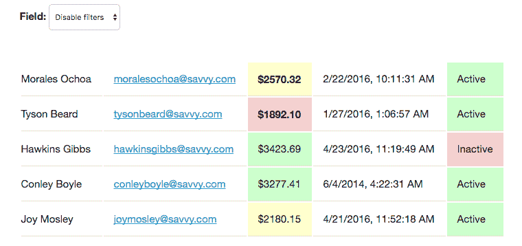

# 显示、循环、搜索和筛选数据

在[第一章](02.html)*Vue.js*入门中，我们介绍了 Vue 中的`data`、`computed`和`method`对象以及如何显示静态数据值。在本章中，我们将介绍：

*   使用 Vue 使用`v-if`、`v-else`和`v-for`显示列表和更复杂的数据
*   使用表单元素筛选列表
*   基于数据应用条件 CSS 类

我们将要使用的数据将由 JSON 生成器服务（[）随机生成 http://www.json-generator.com/](http://www.json-generator.com/) ）。这个网站允许我们获取虚拟数据进行练习。以下模板用于生成我们将使用的数据。将以下内容复制到左侧，以生成相同格式的数据，使属性与代码示例匹配，如下所示：

```js
      [
        '{{repeat(5)}}',
        {
          index: '{{index()}}',
          guid: '{{guid()}}',
          isActive: '{{bool()}}',
          balance: '{{floating(1000, 4000, 2, "00.00")}}',
          name: '{{firstName()}} {{surname()}}',
          email: '{{email()}}',
          registered: '{{date(new Date(2014, 0, 1), new Date(), "YYYY-            
         MM-ddThh:mm:ss")}}'
        }
      ]
```

在我们开始构建简单的应用程序并显示用户之前，我们将介绍 Vue 的更多功能以及视图中可用的 HTML 特定属性。这些范围从动态呈现内容到通过数组循环。

# HTML 声明

Vue 允许您使用 HTML 标记和属性来控制和更改应用程序的视图。这涉及到动态设置属性，例如`alt`和`href`。它还允许您根据应用程序中的数据呈现标记和组件。这些属性以`v-`开头，如本书开头所述，在呈现时从 HTML 中删除。在我们开始输出和过滤数据之前，我们将运行一些常见的声明。

# v-html

`v-html`指令允许您输出内容，而无需使用小胡子样式的花括号语法。如果输出包含 HTML 标记，也可以使用它–它将输出呈现为 HTML 而不是纯文本。HTML 属性的值是数据键或计算函数名的值：

**视图**：

在视图应用程序空间中，向元素添加`v-html`属性：

```js
      <div id="app">
        <div v-html="message"></div>
      </div>
```

**JavaScript**：

在 JavaScript 中，将`message`变量设置为包含一些 HTML 元素的字符串：

```js
      const app = new Vue({
        el: '#app',

        data: {
          message: '<h1>Hello!</h1>'
        }
      });
```

您应该尽量避免将 HTML 添加到 Vue 实例中，因为它开始混淆 ViewModel 中的视图和 MVVM 结构的模型。在另一个 HTML 标记中输出无效 HTML 标记也有危险。您应该只对您信任的数据使用`v-html`，因为将其与外部 API 一起使用可能会带来安全问题，因为它将允许 API 控制您的应用程序。一个潜在的恶意 API 可以使用`v-html`注入不需要的内容和 HTML。仅对您完全信任的数据使用`v-html`。

# 声明式呈现

常规 HTML 属性，例如``标记的`src`，可以使用`v-bind:`属性用 Vue 动态填充。这允许您使用 Vue 应用程序中的数据填充任何现有属性。这可能是图像源或元素 ID。

`bind`选项通过在要填充的属性前面加上前缀来使用。例如，如果您希望使用名为`imageSource`的数据键的值填充图像源，您将执行以下操作：

**视图**：

使用`v-bind`和一个名为`imageSource`的变量，在视图应用程序空间中创建一个具有动态`src`属性的 img 标记。

```js
      <div id="app">
        
      </div>
```

**JavaScript**：

在 Vue JavaScript 代码中创建一个名为`imageSource`的变量。将 URL 添加到所需图像：

```js
      const app = new Vue({
        el: '#app',

        data: {
          imageSource: 'http://via.placeholder.com/350x150'
        }
      });
```

`v-bind:`属性可以缩短为仅`:`，因此，例如`v-bind:src`将变为`:src`。

# 条件渲染

使用自定义 HTML 声明，Vue 允许您根据数据属性或 JavaScript 声明有条件地呈现元素和内容。其中包括用于显示容器声明是否等于 true 的`v-if`，以及用于显示备选方案的`v-else`。

# v-if

最基本的例子是`v-if`指令——确定是否应显示块的值或函数。

创建一个 Vue 实例，在视图中有一个`div`，数据键`isVisible`设置为`false`。

**视图**：

从视图代码开始，如下所示：

```js
      <div id="app">
        <div>Now you see me</div>
      </div>
```

**JavaScript**：

在 JavaScript 中，初始化 Vue 并创建一个`isVisible`数据属性：

```js
      const app = new Vue({
        el: '#app',

        data: {
          isVisible: false
        }
      });
```

现在，您的 Vue 应用程序将显示元素的内容。现在将`v-if`指令添加到 HTML 元素中，其值为`isVisible`：

```js
      <div id="app">
        <div v-if="isVisible">Now you see me</div>
      </div>
```

按“保存”后，文本将消失。这是因为标记是基于当前为`false`的值有条件地呈现的。如果打开 JavaScript 控制台并运行以下代码，则元素应重新出现：

```js
      app.isVisible = true
```

`v-if`不仅仅适用于布尔真/假值。您可以检查数据属性是否等于特定字符串：

```js
      <div v-if="selected == 'yes'">Now you see me</div>
```

例如，前面的代码检查所选数据属性是否等于`yes`的值。`v-if`属性接受 JavaScript 运算符，因此可以检查不等于、大于或小于

这里的危险是，您的逻辑开始从 ViewModel 悄悄进入视图。为了解决这个问题，属性还将函数作为一个值。该方法可以根据需要复杂，但如果希望显示代码，最终必须返回一个`true`，否则返回一个`false`。请记住，如果函数返回除假值以外的任何值（如`0`或`false`），则结果将被解释为真。

这看起来像这样：

```js
      <div v-if="isSelected">Now you see me</div>
```

你的方法可以是这样的：

```js
      isSelected() {
        return selected == 'yes';
      }
```

如果您不希望完全删除元素而只隐藏它，那么有一个更合适的指令，`v-show`。这将应用 CSS 显示属性，而不是操作 DOM—`v-show`将在本章后面介绍。

# v-else

`v-else`允许您根据`v-if`语句的相反部分呈现替代元素。如果结果为`true`，则显示第一个元素；否则，包含`v-else`的元素将被删除

The element with `v-else` needs to directly follow the one containing `v-if`; otherwise, your application will throw an error.

`v-else`没有值，放在元素标签内。

```js
      <div id="app">
        <div v-if="isVisible">
          Now you see me
        </div>
        <div v-else>
          Now you don't
        </div>
      </div>
```

将前面的 HTML 添加到你的应用程序空间中只会显示其中一个`<div>`元素–如我们之前所做的那样在控制台中切换值将显示另一个容器。如果你希望链接你的条件，也可以使用`v-else-if`。`v-else-if`的一个例子如下：

```js
      <div id="app">
        <div v-if="isVisible">
          Now you see me
        </div>
        <div v-else-if="otherVisible">
          You might see me
        </div>
        <div v-else>
          Now you don't
        </div>
      </div>
```

如果`isVisible`变量等于`false`，而`otherVisible`变量等于`true`，您可能会看到我会显示出来。

`v-else`应谨慎使用，因为可能模棱两可，并可能导致误报情况。

# v-for 和显示我们的数据

下一个 HTML 声明意味着我们可以开始显示数据并将其中一些属性付诸实践。因为我们的数据是一个数组，所以我们需要遍历它来显示每个元素。为此，我们将使用`v-for`指令

生成 JSON 并将其分配给名为`people`的变量。在这些示例中，生成的 JSON 循环将在代码块中显示为`[...]`。您的 Vue 应用程序应如下所示：

```js
      const app = new Vue({
        el: '#app',

        data: {
          people: [...]
        }
      });
```

我们现在需要开始在视图中以项目符号列表的形式显示每个人的姓名。这就是`v-for`指令的作用：

```js
      <div id="app">
        <ul>
          <li v-for="person in people">
            {{ person }}
          </li>
        </ul>
      </div>
```

`v-for`循环遍历 JSON 列表，并为每个条目临时分配`person`变量。然后我们可以输出变量的值或属性。

`v-for`循环需要应用于要重复的 HTML 元素，在本例中为`<li>`。如果没有包装元素或不希望使用 HTML，可以使用 Vue`<template>`元素。这些在运行时被删除，同时仍为您创建一个容器以输出数据：

```js
      <div id="app">
        <ul>
          <template v-for="person in people">
            <li>
              {{ person }}
            </li>
          </template>
        </ul>
      </div>
```

在应用程序初始化之前，模板标签也会隐藏内容，如果网络速度慢或 JavaScript 启动需要一段时间，这可能会很方便。

只需将视图留给输出`{{ person }}`将创建一长串信息，对我们没有任何用处。更新输出以针对`person`对象的`name`属性：

```js
      <li v-for="person in people">
        {{ person.name }}
      </li>
```

在浏览器中查看结果时，应显示用户名列表。更新 HTML 以在表中列出用户，显示其姓名、电子邮件地址和余额。将`v-for`应用于`<tr>`元件：

```js
      <table>
        <tr v-for="person in people">
          <td>{{ person.name }}</td>
          <td>{{ person.email }}</td>
          <td>{{ person.balance }}</td>
          <td>{{ person.registered }}</td>
        </tr>
      </table>
```

在表格中添加一个额外的单元格。这将使用`person`对象上的`isActive`属性显示 Active（如果它们处于活动状态）和 Inactive（如果不处于活动状态）。这可以通过两种方式实现——使用`v-if`指令或三元`if`指令。三元 ifs 是可以放在视图的花括号内的串联`if`语句。如果我们想使用 HTML 元素来应用一些样式，我们会使用`v-if`。

如果我们使用三元“If”，单元格将如下所示：

```js
      <td>{{ (person.isActive) ? 'Active' : 'Inactive' }}</td>
```

如果我们选择带有`v-else`的`v-if`选项，允许我们使用我们想要的 HTML，它将如下所示：

```js
      <td>
        <span class="positive" v-if="person.isActive">Active</span>
        <span class="negative" v-else>Inactive</span>
      </td>
```

此活动元素是 Vue 组件理想应用的完美示例–我们将在[第 3 章](02.html)、*优化我们的应用程序并使用组件显示数据*中介绍这一点。作为一种更符合 MVVM 方法的替代方法，我们可以创建一个返回状态文本的方法。这将整理我们的视图，并将逻辑移动到我们的应用程序：

```js
      <td>{{ activeStatus(person) }}</td>
```

然后，我们的方法将执行与我们的观点相同的逻辑：

```js
activeStatus(person) {
  return (person.isActive) ? 'Active' : 'Inactive';
}
```

我们的表现在将如下所示：


# 使用 v-html 创建链接

下一步是链接电子邮件地址，以便查看人员列表的用户可以单击该地址。在本例中，我们需要通过在电子邮件地址之前添加一个`mailto:`来连接字符串

第一本能是做以下事情：

```js
      <a href="mailto:{{person.email}}">{{ person.email }}</a>
```

但是 Vue 不允许在属性内部进行插值。相反，我们必须在`href`属性上使用`v-bind`指令。这会将属性转换为 JavaScript 变量，因此任何原始文本都必须用引号括起来，并与所需变量连接：

```js
<a v-bind:href="'mailto:' + person.email">{{ person.email }}</a>
```

注意添加了`v-bind:`、单引号和串联`+`标识符。

# 格式平衡

在我们继续过滤用户之前，请添加一个方法来正确设置余额的格式，在数据对象中定义一个货币符号，并确保小数点后有两个数字。我们可以采用[第 1 章](02.html)、*Vue.js*入门中的方法来实现这一点。我们的 Vue 应用程序现在应该如下所示：

```js
      const app = new Vue({
        el: '#app',

        data: {
          people: [...],
          currency: '$'
        },
        methods: {
          activeStatus(person) {
            return (person.isActive) ? 'Active' : 'Inactive';
          },
          formatBalance(balance) {
            return this.currency + balance.toFixed(2);
          }
        }
    });
```

在我们看来，我们可以利用这种新方法：

```js
      <td>{{ formatBalance(person.balance) }}</td>
```

# 格式注册日期

数据中的“注册日期”字段是计算机友好型字段，不太便于阅读。创建一个名为`formatDate`的新方法，该方法采用一个参数——类似于之前的`formatBalance`方法。

如果您想要完全定制日期的显示，有几个可用的库，例如`moment.js`，可以让您在输出任何基于日期和时间的数据时具有更大的灵活性。对于此方法，我们将使用一个本机 JavaScript 函数，以`LocaleString()`：

```js
      formatDate(date) {
        let registered = new Date(date);
        return registered.toLocaleString('en-US');
      }
```

对于注册的日期，我们将其传递给本机的`Date()`函数，以便 JavaScript 知道如何将字符串解释为日期。一旦存储在注册变量中，我们将通过`toLocaleString()`函数以字符串形式返回对象。此函数接受大量选项（如 MDN 中所述）以自定义日期的输出。现在，我们将传递希望显示的区域设置，并使用该位置的默认值。我们现在可以在视图中使用我们的方法：

```js
      <td>{{ formatDate(person.registered) }}</td>
```

现在，每个表行应如下所示：


# 过滤我们的数据

随着我们的数据被列出，我们现在要建立过滤能力。这将允许用户选择筛选依据的字段和输入查询的文本字段。然后，Vue 应用程序将根据用户类型筛选行。为此，我们将把一些表单输入绑定到`data`对象中的各种值，创建一个新方法，并对表行使用一个新指令；`v-show`。

# 构建表单

首先在视图中创建 HTML。创建一个`<select>`框，每个要筛选的字段对应一个`<option>`，查询对应一个`<input>`，还有一对单选按钮——我们将使用这些按钮筛选活动和非活动用户。确保每个`<option>`的值属性反映用户数据中的键–这将保存所需的代码，并使选择框的用途更加明显。

您正在筛选的数据不需要显示出来，我们的筛选工作才能正常进行，尽管这里需要考虑用户体验。如果在没有筛选数据的情况下显示表行，这有意义吗？

创建将用于筛选的表单：

```js
      <form>
        <label for="fiterField">
          Field:
          <select id="filterField">
            <option value="">Disable filters</option>
            <option value="isActive">Active user</option>
            <option value="name">Name</option>
            <option value="email">Email</option>
            <option value="balance">Balance</option>
            <option value="registered">Date registered</option>
          </select>
        </label>

        <label for="filterQuery">
          Query:
          <input type="text" id="filterQuery">
        </label>

        <span>
          Active:
          <label for="userStateActive">
            Yes:
            <input type="radio" value="true" id="userStateActive"                   
          selected>
          </label>
          <label for="userStateInactive">
            No:
            <input type="radio" value="false" id="userStateInactive">
          </label>
        </span>
      </form>
```

此表单包括一个用于选择筛选依据的字段的选择框、一个允许用户输入查询以进行筛选的输入框，以及一对单选按钮，用于按活动和非活动用户进行筛选。想象中的用户流是这样的：用户将选择他们希望过滤数据的字段，然后输入他们的查询或选择单选按钮。在选择框中选择`isActive`（活动用户）选项时，将显示单选按钮并隐藏输入框。我们已确保默认情况下选择第一个单选按钮以提供帮助

过滤输入不需要包含在表格中即可工作；但是，保留语义 HTML 是一种很好的做法，即使在 JavaScript 应用程序中也是如此。

# 绑定输入

要将输入绑定到可通过 Vue 实例访问的变量，需要在字段中添加 HTML 属性，并在`data`对象中添加相应的键。在`data`对象中为每个字段创建一个变量，以便我们可以将表单元素绑定到它们：

```js
      data: {
        people: [...],

        currency: '$',

        filterField: '',
 filterQuery: '',
 filterUserState: ''
      }
```

数据对象现在有三个附加键：`filterField`，用于存储下拉列表的值；`filterQuery`，文本框中输入数据的占位符；和`filterUserState`，允许我们存储单选按钮复选框。

现在有了可利用的数据键，我们可以将表单元素绑定到它们。对每个表单字段应用一个`v-model=""`属性，该属性的值为数据键。

下面是一个例子：

```js
      <input type="text" id="filterQuery" v-model="filterQuery">
```

确保两个单选按钮具有完全相同的`v-model=""`属性：这样它们就可以更新相同的值。为了验证它是否有效，现在可以输出数据变量并获取字段的值。

尝试输出`filterField`或`filterQuery`并更改字段。

```js
      {{ filterField }}
```

如果要输出`filterUserState`变量，您可能会注意到一件事，即它似乎正在工作，但并没有得到所需的实际结果。变量的输出将是`true`和`false`，如值属性中所设置。

仔细观察，这些值实际上是字符串，而不是布尔值。布尔值是一个硬的`true`或`false`、`1`或`0`，您可以很容易地对其进行比较，而字符串则需要对硬编码字符串进行精确检查。这可以通过输出`typeof`变量来验证：

```js
      {{ typeof filterUserState }}
```

这可以通过将单选按钮的值与`v-bind:value`属性绑定来解决。此属性允许您指定 Vue 要解释的值，并可以采用布尔值、字符串值或对象值。现在，我们将传递它`true`和`false`，就像我们已经在处理标准值属性一样，但 Vue 将知道如何将其解释为布尔值：

```js
      <span>
        Active:
        <label for="userStateActive">
          Yes:
          <input type="radio" v-bind:value="true" id="userStateActive"       
         v-model="filterUserState" selected>
        </label>
        <label for="userStateInactive">
          No:
          <input type="radio" v-bind:value="false"       
         id="userStateInactive" v-model="filterUserState">
        </label>
      </span>
```

下一步是基于这些过滤器显示和隐藏表行。

# 显示和隐藏 Vue 内容

除了`v-if`用于显示和隐藏内容外，您还可以使用`v-show=""`指令。`v-show`与`v-if`非常相似；它们都被添加到 HTML 包装器中，并且都可以接受相同的参数，包括一个函数。

两者之间的区别在于`v-if`修改标记，根据需要删除和添加 HTML 元素，而`v-show`呈现元素，隐藏和显示具有内联 CSS 样式的元素。`v-if`更适合于运行时呈现或不频繁的用户交互，因为它可能会重新构造整个页面。`v-show`在很多元素快速进出视图时是有利的，例如，在过滤时！

将`v-show`与方法一起使用时，函数只需返回一个`true`或`false`。函数不知道在哪里使用它，所以我们需要传入正在渲染的当前人员来计算是否应该显示它。

在您的 Vue 实例上创建一个名为`filterRow()`的方法，并将其设置为`return true`：

```js
      filterRow(person) {
         return true;
      }
```

该函数接受一个参数，即我们将从 HTML 传入的人。在您看来，在传入 person 对象时，将`v-show`属性添加到`<tr>`元素中，并将`filterRow`作为值：

```js
      <table>
        <tr v-for="person in people" v-show="filterRow(person)">
          <td>{{ person.name }}</td>
          ...
```

作为一个简单的测试，将`isActive`值返回给此人。这将立即过滤掉任何处于非活动状态的人，因为他们的值将返回`false`：

```js
      filterRow(person) {
        return person.isActive;
      }
```

# 过滤我们的内容

现在我们可以控制我们的人员行和视图中的一些过滤器控件，我们需要让过滤器工作。我们已经通过`isActive`键进行过滤，因此单选按钮将是第一个连接的。对于单选按钮值和我们将要筛选的键，我们已经有了布尔形式的值。为了让这个过滤器工作，我们需要比较`isActive`键和单选按钮的值。

*   如果`filterUserState`值为`true`，则向用户显示`isActive`为`true`的位置
*   但是，如果`filterUserState`值为`false`，则仅向用户显示其`isActive`值为`false`的位置

这可以通过比较两个变量写入一行：

```js
      filterRow(person) {
        return (this.filterUserState === person.isActive);
      }
```

页面加载时，由于`filterUserState`键既不设置为`true`也不设置为`false`，因此不会显示任何用户。单击其中一个单选按钮将显示相应的用户

只有在下拉列表中选择了 active user（活动用户）选项时，我们才能使过滤器工作：

```js
      filterRow(person) {
        let result = true;

        if(this.filterField === 'isActive') {
          result = this.filterUserState === person.isActive;
        }

        return result;
      }
```

此代码将变量设置为`true`作为默认值。然后我们可以立即返回变量，我们的行将显示出来。但是，在返回之前，它会检查选择框的值，如果是所需的值，则会通过单选按钮进行过滤。由于我们的选择框绑定到`filterField`值，与`filterUserState`变量一样，它会在我们与应用程序交互时更新。尝试在选择框中选择活动用户选项并更改单选按钮。

下一步是在未选择活动用户选项时使用输入查询框。我们还希望我们的查询是一个*模糊*搜索—例如，匹配包含搜索查询的单词，而不是精确匹配。我们还希望它不区分大小写：

```js
      filterRow(person) {
        let result = true;

        if(this.filterField) {

          if(this.filterField === 'isActive') {
            result = this.filterUserState === person.isActive;
          } else {
 let query = this.filterQuery.toLowerCase(),
 field =  person[this.filterField].toString().toLowerCase(); result = field.includes(query);
 }

        }

        return result;
      }
```

为了工作，我们必须在这个方法中添加一些东西。第一步是检查 select 字段是否具有开始筛选的值。由于我们选择字段中的第一个选项有一个`value=""`，这相当于`false`。如果是这种情况，则该方法返回默认值`true`。

如果它确实有一个值，那么它将转到原始的`if`语句。这将检查特定值以查看它是否匹配`isActive`——如果匹配，它将运行我们之前编写的代码。如果没有，我们开始我们的替代过滤。建立了一个新变量`query`，它接受输入值并将其转换为小写。

第二个变量是我们要过滤的数据。这将使用选择框的值（该框是人员的字段键）提取要过滤的值。此值转换为字符串（在日期或余额的情况下），转换为小写并存储为`field`变量。最后，我们使用`includes`函数检查字段是否包含输入的查询。如果是，则返回`true`，该行显示为 If；不，行是隐藏的。

我们可以解决的下一个问题是使用数字进行过滤。用户输入他们所追求的用户的确切余额是不直观的——一种更自然的搜索方式是找到余额低于或高于一定金额的用户，例如，`< 2000`。

执行此操作的第一步是仅在`balance`字段中应用此类型的过滤。我们可以通过两种方式来实现这一点——我们可以检查字段名是否为`balance`（类似于检查`isActive`字段的方式），或者我们可以检查正在筛选的数据类型。

对照字段名进行检查更简单。我们可以在方法中使用`else if()`语句，甚至可以迁移到`switch`语句，以便于阅读和扩展。但是，检查字段类型的替代方法更具可伸缩性。这意味着我们可以用更多的数字字段扩展数据集，而无需扩展或更改代码。然而，这确实意味着在我们的代码中会有更多的`if`语句。

我们首先要做的是改变存储方法，因为我们不希望字段或查询必须小写：

```js
      if(this.filterField === 'isActive') {
        result = this.filterUserState === person.isActive;
      } else {

        let query = this.filterQuery,
 field = person[this.filterField]; 
 }
```

下一步是在字段变量中建立数据类型。这可以通过再次使用`typeof`操作符来建立。可在`if`语句中使用，检查字段类型是否为数字：

```js
      if(this.filterField === 'isActive') {
        result = this.filterUserState === person.isActive;
      } else {

        let query = this.filterQuery,
            field = person[this.filterField];

        if(typeof field === 'number') {
          // Is a number
 } else {
 // Is not a number
          field = field.toLowerCase();
          result = field.includes(query.toLowerCase());
 }

      }
```

检查完成后，我们可以默认返回原始查询代码。如果选择选项*不是*`isActive`，并且在*上过滤的数据不是*数字，则使用此选项。如果是这种情况，那么它将对字段进行小写，并查看在将字段转换为小写时是否包含在查询框中写入的内容。

下一步是将我们的编号数据与查询框中写入的数据进行实际比较。为此，我们将使用本机 JavaScript`eval`函数。

`eval`函数可能是一个潜在的危险函数，在没有进行一些认真的输入消毒检查的情况下，不应在生产代码中使用，此外，它的性能不如更长的替代品。它以本机 JavaScript 的形式运行内部的所有内容，因此可能会被滥用。然而，由于我们将其用于一个虚拟应用程序，重点放在 Vue 本身，而不是创建一个完全 web 安全的应用程序，因此在本例中这是很好的。您可以通过 24 种方式阅读有关`eval`的更多信息：

```js
      if(this.filterField === 'isActive') {
       result = this.filterUserState === person.isActive;
      } else {

        let query = this.filterQuery,
            field = person[this.filterField];

        if(typeof field === 'number') {
          result = eval(field + query);
        } else {
          field = field.toLowerCase();
          result = field.includes(query.toLowerCase());
        }

      }
```

这会将字段和查询传递给`eval()`函数，并将结果（T1 或 T2）传递给`result`变量，以确定行的可见性。`eval`函数逐字计算表达式并确定它是`true`还是`false`。下面是一个例子：

```js
      eval(500 > 300); // true
      eval(500 < 400); // false
      eval(500 - 500); // false
```

在本例中，数字`500`是我们的字段，或者在本例中是`balance`。之后的任何内容都是由用户编写的。您的筛选代码现在已准备就绪。尝试从下拉列表中选择余额，并对余额高于`2000`的用户进行过滤

在继续之前，我们需要添加一些错误检查。如果您打开了 JavaScript 控制台，则在键入第一个大于或小于的值时可能会注意到一个错误。这是因为`eval`函数无法评估`X >`（其中`X`是平衡）。您可能也曾试图用货币输入`*$2000*`，但意识到这不起作用。这是因为货币是在呈现视图时应用的，而我们在呈现视图之前过滤数据。

为了克服这两个错误，我们必须删除查询中键入的任何货币符号，并在依赖`eval`函数返回结果之前测试我们的`eval`函数。使用本机 JavaScript`replace()`函数删除货币符号。如果更改，则使用应用程序中存储的货币符号，而不是对当前使用的货币符号进行硬编码

```js
      if(typeof field == 'number') {
        query = query.replace(this.currency, '');
        result = eval(field + query);
      }
```

我们现在需要测试`eval`功能，这样它就不会在每次按下键时抛出错误。为此，我们使用`try...catch`语句：

```js
      if(typeof field == 'number') {
        query = query.replace(this.currency, '');

        try {
          result = eval(field + query);
 } catch(e) {}
      }
```

由于我们不希望在输入错误时输出任何内容，因此可以将`catch`语句保留为空。我们可以把`field.includes(query)`语句放在这里，这样它就回到了默认功能。我们完整的`filterRow()`方法现在看起来如下：

```js
      filterRow(person) {
        let result = true;

        if(this.filterField) {

          if(this.filterField === 'isActive') {

            result = this.filterUserState === person.isActive;

          } else {

            let query = this.filterQuery,
          field = person[this.filterField];

            if(typeof field === 'number') {

              query = query.replace(this.currency, '');        
              try {
                result = eval(field + query);
              } catch (e) {}

            } else {

              field = field.toLowerCase();
              result = field.includes(query.toLowerCase());

            }
          }
        }

        return result;

      }
```

# 过滤我们的过滤器

现在我们有了过滤功能，我们只需要在下拉菜单中选择`isActive`选项时显示单选按钮。利用我们学到的知识，这应该是相对简单的。

创建一个新方法，检查选择框值，并在下拉列表中选择活动用户时返回`true`：

```js
      isActiveFilterSelected() {
        return (this.filterField === 'isActive');
      }
```

我们现在可以对输入和单选按钮使用`v-show`，与查询框上的效果相反：

```js
      <label for="filterQuery" v-show="!isActiveFilterSelected()">
        Query:
        <input type="text" id="filterQuery" v-model="filterQuery">
      </label>
      <span v-show="isActiveFilterSelected()">
        Active:
        <label for="userStateActive">
          Yes:
          <input type="radio" v-bind:value="true" id="userStateActive"           
         v-model="filterUserState">
        </label>
        <label for="userStateInactive">
          No:
     <input type="radio" v-bind:value="false" id="userStateInactive" v-
      model="filterUserState">
        </label>
      </span>
```

注意输入字段上方法调用之前的感叹号。这意味着不是，并有效地反转函数的结果，例如，not true 与 false 相同，反之亦然。

为了改善用户体验，我们还可以在显示任何一个输入之前检查过滤是否处于活动状态。这可以通过在我们的`v-show`属性中包含二次检查来添加：

```js
      <label for="filterQuery" v-show="this.filterField &&        
      !isActiveFilterSelected()">
        Query:
        <input type="text" id="filterQuery" v-model="filterQuery">
      </label>
```

现在检查`filterField`是否有值，并且选择框是否未设置为`isActive`。确保您也将其添加到单选按钮中。

进一步的用户体验增强是确保在选择`isActive`选项时所有用户不会消失。当前出现这种情况是因为默认设置为字符串，该字符串与字段的`true`或`false`值都不匹配。在过滤此字段之前，我们应该检查`filterUserState`变量是否为`true`或`false`，即布尔值。使用`typeof`我们可以再做一次：

```js
      if(this.filterField === 'isActive') {
        result = (typeof this.filterUserState === 'boolean') ?                  
        (this.filterUserState === person.isActive) : true;
      }
```

我们使用三元运算符检查要过滤的结果是否为`boolean`。如果是的话，那么像我们一样过滤；如果不是，则只显示该行。

# 更改 CSS 类

与任何 HTML 属性一样，Vue 能够操纵 CSS 类。与 Vue 中的所有内容一样，这可以通过多种方式完成，从对象本身的属性到使用方法。如果用户处于活动状态，我们将开始添加类。

绑定 CSS 类类似于其他属性。该值获取一个对象，该对象可以从视图中计算逻辑，也可以抽象到我们的 Vue 实例中。这一切都取决于操作的复杂性。

首先，如果用户处于活动状态，让我们向包含`isActive`变量的单元格添加一个类：

```js
      <td v-bind:class="{ active: person.isActive }">
        {{ activeStatus(person) }}
      </td>
```

类 HTML 属性首先由`v-bind:`加上前缀，以让 Vue 知道它需要处理该属性。然后，值是一个对象，CSS 类作为键，条件作为值。如果`person.isActive`变量等于`true`，则此代码切换表格单元格上的`active`类。如果我们想在用户未处于活动状态时添加一个`inactive`类，我们可以将其添加到对象中：

```js
      <td v-bind:class="{ active: person.isActive, inactive: 
      !person.isActive }">
        {{ activeStatus(person) }}
      </td>
```

下面是我们再次使用感叹号来反转状态。如果你运行这个应用程序，你会发现 CSS 类按预期应用。

如果我们只是基于一个条件应用两个类，那么可以在 class 属性内部使用三元`if`语句：

```js
      <td v-bind:class="person.isActive ? 'active' : 'inactive'">
        {{ activeStatus(person) }}
      </td>
```

注意类名周围的单引号。然而，逻辑再次开始潜入我们的视野，如果我们希望在其他地方也使用这个类，那么它的可伸缩性就不是很强

在我们的 Vue 实例上创建一个名为`activeClass`的新方法，并将逻辑抽象为该方法-不要忘记传入 person 对象：

```js
      activeClass(person) {
        return person.isActive ? 'active' : 'inactive';
      }
```

我们现在可以在我们的视图中调用该方法：

```js
      <td v-bind:class="activeClass(person)">
        {{ activeStatus(person) }}
      </td>
```

我理解这是一个相当简单的执行；让我们试试更复杂一点的。我们希望根据值向平衡单元格添加一个条件类。如果他们的余额低于 2000 美元，我们将添加一个`error`类。如果在$2000 和$3000 之间，将应用`warning`类，如果超过$3000，将添加`success`类。

与`error`、`warning`和`success`类一起，如果余额超过 500 美元，将增加`increasing`类。例如，余额 2600 美元将同时获得`warning`和`increasing`课程，而 2400 美元将只获得`warning`课程。

由于它包含一些逻辑，我们将在实例中创建一个 use a 方法。创建一个`balanceClass`方法，并将其绑定到包含余额的单元格的 class HTML 属性。首先，我们将添加`error`、`warning`和`success`类。

```js
      <td v-bind:class="balanceClass(person)">
        {{ formatBalance(person.balance) }}
      </td>
```

在方法中，我们需要访问传入人员的`balance`属性，并返回要添加的类的名称。现在，我们将返回一个固定结果以验证它是否正常工作：

```js
      balanceClass(person) {
        return 'warning';
      }
```

我们现在需要评估我们的平衡。由于它已经是一个数字，与我们的标准进行比较不会涉及任何转换：

```js
      balanceClass(person) {
        let balanceLevel = 'success';

        if(person.balance < 2000) {
          balanceLevel = 'error';
        } else if (person.balance < 3000) {
          balanceLevel = 'warning';
        }

        return balanceLevel;
      }
```

在前面的方法中，类输出默认设置为`success`，因为我们只需要更改小于`3000`的输出。第一个`if`检查余额是否低于我们的第一个阈值——如果低于，则将输出设置为`error`。如果没有，则尝试第二个条件，即检查余额是否低于`3000`。如果成功，应用的类将变为`warning`。最后，它输出所选的类，该类直接应用于元素。

我们现在需要考虑我们怎样才能做这类课程。为了让它与现有的`balanceLevel`类一起输出，我们需要将单个变量的输出转换为数组。要验证这是否有效，请将额外的类硬编码到输出：

```js
      balanceClass(person) {
        let balanceLevel = 'success';
        if(person.balance < 2000) {
          balanceLevel = 'error';
        } else if (person.balance < 3000) {
          balanceLevel = 'warning';
        }
        return [balanceLevel, 'increasing'];
      }
```

这会将两个类添加到元素中。将字符串转换为变量，默认设置为`false`。对于数组中传递的`false`值，Vue 不会输出任何内容。

为了计算出我们是否需要增加类，我们需要对平衡进行一些计算。由于我们希望增加等级，如果余额高于 500，则无论其处于何种范围，我们需要对数字进行四舍五入并进行比较：

```js
      let increasing = false,
          balance = person.balance / 1000;

      if(Math.round(balance) == Math.ceil(balance)) {
        increasing = 'increasing';
      }
```

最初，我们将`increasing`变量设置为`false`作为默认值。我们还存储余额除以`1000`的版本。我们的平均余额是 2.45643，而不是 2456.42。在此基础上，我们将 JavaScript 四舍五入后的数字（例如 2.5 变为 3，而 2.4 变为 2）与强制四舍五入的数字（例如 2.1 变为 3，以及 2.9）进行比较。

如果数字输出相同，`increasing`变量被设置为我们想要设置的类的字符串。然后我们可以将这个变量和`balanceLevel`变量一起作为数组传递出去。完整方法现在如下所示：

```js
      balanceClass(person) {
        let balanceLevel = 'success';

        if(person.balance < 2000) {
          balanceLevel = 'error';
        } else if (person.balance < 3000) {
          balanceLevel = 'warning';
        } 

        let increasing = false,
            balance = person.balance / 1000;

        if(Math.round(balance) == Math.ceil(balance)) {
          increasing = 'increasing';
        }

        return [balanceLevel, increasing];
      }
```

# 过滤和自定义类

我们现在有了一个成熟的用户列表/注册表，它根据标准对选定字段和自定义 CSS 类进行过滤。总而言之，这就是我们的视图，现在我们有了过滤器：

```js
      <div id="app">
        <form>
          <label for="fiterField">
            Field:
            <select id="filterField" v-model="filterField">
              <option value="">Disable filters</option>
              <option value="isActive">Active user</option>
              <option value="name">Name</option>
              <option value="email">Email</option>
              <option value="balance">Balance</option>
              <option value="registered">Date registered</option>
            </select>
          </label>

          <label for="filterQuery" v-show="this.filterField &&                  
          !isActiveFilterSelected()">
            Query:
            <input type="text" id="filterQuery" v-model="filterQuery">
          </label>

          <span v-show="isActiveFilterSelected()">
         Active:
        <label for="userStateActive">
        Yes:
        <input type="radio" v-bind:value="true" id="userStateActive" v-
         model="filterUserState">
      </label>
      <label for="userStateInactive">
        No:
        <input type="radio" v-bind:value="false" id="userStateInactive"          
      v-model="filterUserState">
      </label>
          </span>
        </form>

        <table>
          <tr v-for="person in people" v-show="filterRow(person)">
            <td>{{ person.name }}</td>
            <td>
         <a v-bind:href="'mailto:' + person.email">{{ person.email }}            
           </a>
            </td>
            <td v-bind:class="balanceClass(person)">
              {{ formatBalance(person.balance) }}
            </td>
            <td>{{ formatDate(person.registered) }}</td>
            <td v-bind:class="activeClass(person)">
              {{ activeStatus(person) }}
            </td>
          </tr>
        </table>

      </div>
```

我们的 Vue 应用程序的 JavaScript 应该如下所示：

```js
      const app = new Vue({
        el: '#app',

        data: {
          people: [...],

          currency: '$',

          filterField: '',
          filterQuery: '',
          filterUserState: ''
        },
        methods: {
          activeStatus(person) {
            return (person.isActive) ? 'Active' : 'Inactive';
          },

          activeClass(person) {
            return person.isActive ? 'active' : 'inactive';
          },
          balanceClass(person) {
            let balanceLevel = 'success';

            if(person.balance < 2000) {
              balanceLevel = 'error';
            } else if (person.balance < 3000) {
              balanceLevel = 'warning';
            }

            let increasing = false,
          balance = person.balance / 1000;

            if(Math.round(balance) == Math.ceil(balance)) {
              increasing = 'increasing';
            }

            return [balanceLevel, increasing];
          },

          formatBalance(balance) {
            return this.currency + balance.toFixed(2);
          },
          formatDate(date) {
            let registered = new Date(date);
            return registered.toLocaleString('en-US');
          },

          filterRow(person) {
            let result = true;
            if(this.filterField) {

              if(this.filterField === 'isActive') {

              result = (typeof this.filterUserState === 'boolean') ?       
              (this.filterUserState === person.isActive) : true;
             } else {

          let query = this.filterQuery,
              field = person[this.filterField];

          if(typeof field === 'number') {
            query.replace(this.currency, '');
            try {
              result = eval(field + query);
            } catch(e) {}
          } else {
            field = field.toLowerCase();
            result = field.includes(query.toLowerCase());
            }
          }
        }

            return result;
          },

          isActiveFilterSelected() {
            return (this.filterField === 'isActive');
          }
        }
      });
```

使用少量 CSS，我们的人员筛选应用程序现在看起来如下所示：



# 总结

在本章中，我们研究了 Vue HTML 声明，有条件地呈现我们的 HTML，并在需要时显示一个替代方案。我们还将所学的方法付诸实践。最后，我们为我们的表构建了一个过滤组件，允许我们显示活动和非活动用户，查找具有特定名称和电子邮件的用户，并根据余额过滤出行。

现在我们的应用程序有了一个很好的点，这是一个很好的机会来看看我们的代码，看看它是否可以以任何方式进行优化。通过优化，我的意思是减少重复，尽可能简化代码，并将逻辑抽象为更小、可读和可重用的块。

在[第 3 章](02.html)*优化我们的应用程序并使用组件显示数据*中，我们将优化我们的代码，并将 Vue 组件视为将逻辑分离为单独的段和部分的一种方式。