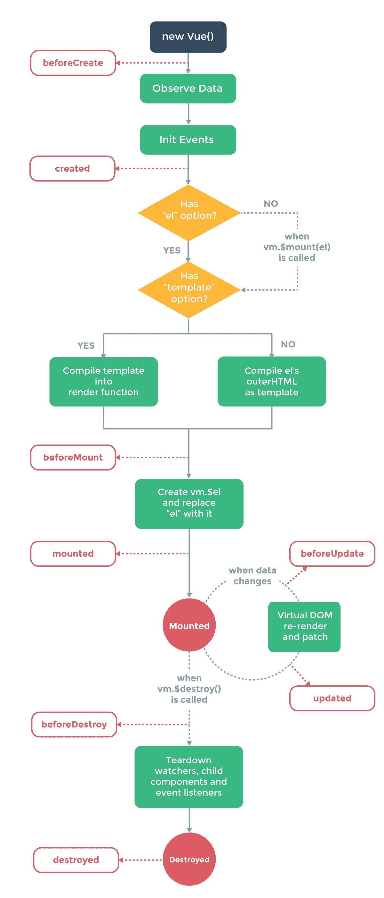

# 使用 Dropbox API 获取文件列表

在接下来的几章中，我们将构建一个基于 Vue 的 Dropbox 浏览器。此应用程序将获取您的 Dropbox API 密钥，并允许您导航到文件夹和下载文件。您将了解如何与 Vue 应用程序中的 API 交互，Vue 生命周期挂钩，包括`created()`方法，最后我们将引入一个名为`Vuex`的库来处理应用程序的缓存和状态。应用程序将具有可共享的 URL，并检索通过`#`URL 参数传入的文件夹的内容。

如果你想让用户在不提供用户名和密码的情况下访问 Dropbox 的内容，这种应用程序将非常有用。但是，请注意，精通技术的用户可能会在代码中找到您的 API 密钥并加以滥用，因此不要将此代码发布到万维网。

本章将涵盖：

*   加载和查询 Dropbox API
*   列出 Dropbox 帐户中的目录和文件
*   向应用程序添加加载状态
*   使用 Vue 动画

您将需要一个 Dropbox 帐户来了解接下来的几章。如果你没有，注册并添加一些虚拟文件和文件夹。Dropbox 的内容无关紧要，但有文件夹可供浏览将有助于理解代码。

# 开始加载库

为要运行的应用程序创建新的 HTML 页面。创建网页所需的 HTML 结构，并包含应用程序视图包装：

```js
      <!DOCTYPE html>
      <html>
      <head>
        <title>Dropbox App</title>
      </head>
      <body>  
 <div id="app">
 </div>  
      </body>
      </html>
```

它在这里被称为`#app`，但是你可以随意调用它——只要记住更新 JavaScript 即可。

由于我们的应用程序代码将变得相当粗，所以创建一个单独的 JavaScript 文件并将其包含在文档底部。您还需要包括 Vue 和 Dropbox API SDK

与以前一样，您可以引用远程文件或下载库文件的本地副本。出于速度和兼容性的考虑，下载本地副本。在 HTML 文件底部包含三个 JavaScript 文件：

```js
      <script src="js/vue.js"></script>
      <script src="js/dropbox.js"></script>
      <script src="js/app.js"></script>
```

创建您的`app.js`并初始化一个新的 Vue 实例，使用`el`标记将实例装载到视图中的 ID 上。

```js
      new Vue({
          el: '#app'
      });
```

# 创建 Dropbox 应用程序并初始化 SDK

在与 Vue 实例交互之前，我们需要通过 SDK 连接到 Dropbox API。这是通过 Dropbox 自身生成的 API 密钥来完成的，该 API 密钥用于跟踪连接到您的帐户的内容以及 Dropbox 要求您制作自定义 Dropbox 应用程序的位置。

前往 Dropbox 开发者区，选择创建你的应用。选择 Dropbox API 并选择受限文件夹*或*完全访问。这取决于您的需要，但对于测试，请选择 FullDropbox。为你的应用程序命名，然后单击“创建应用程序”按钮。

生成应用程序的访问令牌。为此，在查看应用程序详细信息页面时，单击生成的访问令牌下的生成按钮。这将为您提供一长串数字和字母——将其复制并粘贴到编辑器中，并将其作为变量存储在 JavaScript 顶部。在本书中，API 密钥将被称为`XXXX`：

```js
      /**
       * API Access Token
       */
      let accessToken = 'XXXX';
```

现在我们有了 API 密钥，可以从 Dropbox 访问文件和文件夹了。初始化 API 并将`accessToken`变量传递给 Dropbox API 的`accessToken`属性：

```js
      /**
      * Dropbox Client
      * @type {Dropbox}
      */
      const dbx = new Dropbox({
        accessToken: accessToken
      });
```

我们现在可以通过`dbx`变量访问 Dropbox。我们可以通过连接并输出根路径的内容来验证与 Dropbox 的连接是否正常：

```js
      dbx.filesListFolder({path: ''})
          .then(response => {
            console.log(response.entries);
          })
          .catch(error => {
            console.log(error);
          });
```

此代码使用 JavaScript 承诺，这是一种向代码中添加操作而不需要回调函数的方法。如果您不熟悉承诺，请查看谷歌的这篇博文（[https://developers.google.com/web/fundamentals/primers/promises](https://developers.google.com/web/fundamentals/primers/promises) ）。

记下第一行，尤其是`path`变量。这允许我们传入文件夹路径，以列出该目录中的文件和文件夹。例如，如果您的 Dropbox 中有一个名为`images`的文件夹，您可以将参数值更改为`/images`，返回的文件列表将是该目录中的文件和文件夹。

打开 JavaScript 控制台并检查输出；您应该得到一个包含多个对象的数组-Dropbox 根目录中的每个文件或文件夹对应一个对象。

# 显示数据并使用 Vue 获取数据

现在我们可以使用 Dropbox API 检索数据了，现在是在 Vue 实例中检索数据并显示在视图中的时候了。这个应用程序将完全使用组件构建，所以我们可以利用划分的数据和方法。如果你想集成到其他应用程序中，这也意味着代码是模块化和可共享的。

我们还将利用本机 Vue`created()`函数——我们将在稍后触发时介绍它。

# 创建组件

首先，在视图中创建自定义 HTML 元素`<dropbox-viewer>`。在页面底部为我们的 HTML 布局创建一个`<script>`模板块：

```js
      <div id="app">
        <dropbox-viewer></dropbox-viewer>
      </div> 
      <script type="text/x-template" id="dropbox-viewer-          
       template">
        <h1>Dropbox</h1>
      </script>
```

在`app.js`文件中初始化组件，将其指向模板 ID：

```js
      Vue.component('dropbox-viewer', {
        template: '#dropbox-viewer-template'
      });
```

在浏览器中查看应用程序时，应显示模板中的标题。下一步是将 Dropbox API 集成到组件中。

# 检索 Dropbox 数据

创建一个名为`dropbox`的新方法。在其中，移动调用 Dropbox 类并返回实例的代码。现在，我们可以通过调用`this.dropbox()`通过组件访问 Dropbox API：

```js
      Vue.component('dropbox-viewer', {
        template: '#dropbox-viewer-template',  
        methods: {
 dropbox() {
 return new Dropbox({
 accessToken: this.accessToken
 });
 }
 }
      });
```

我们还将把 API 密钥集成到组件中。创建一个返回包含访问令牌的对象的数据函数。更新 Dropbox 方法以使用密钥的本地版本：

```js
      Vue.component('dropbox-viewer', {
        template: '#dropbox-viewer-template',  
        data() {
 return {
 accessToken: 'XXXX'
 }
 },
        methods: {
          dropbox() {
            return new Dropbox({
              accessToken: this.accessToken
            });
          }
        }
      });
```

我们现在需要为组件添加获取目录列表的功能。为此，我们将创建另一个方法，该方法使用单个参数 path。这将使我们能够在需要时请求不同路径或文件夹的结构。

使用前面提供的代码-将`dbx`变量更改为`this.dropbox()`：

```js
      getFolderStructure(path) {
        this.dropbox().filesListFolder({path: path})
        .then(response => {
          console.log(response.entries);
        })
        .catch(error => {
          console.log(error);
        });
      }
```

更新 Dropbox`filesListFolder`函数以接受传入的 path 参数，而不是固定值。在浏览器中运行此应用程序将显示 Dropbox 标题，但不会检索任何文件夹，因为尚未调用这些方法。

# Vue 生命周期挂钩

这就是`created()`函数的作用。一旦 Vue 实例初始化了数据和方法，但尚未将实例装载到 HTML 组件上，就会调用`created()`函数。在生命周期的不同阶段，还有一些其他功能可用；更多关于这些的信息可以在 Alligator.io 上阅读。生命周期如下：



使用`created()`功能，我们可以访问方法和数据，同时能够在 Vue 安装应用程序时启动检索过程。这些不同阶段之间的时间是瞬间的，但在性能和创建快速应用程序方面，每一刻都很重要。如果我们可以提前开始任务，那么在处理数据之前等待应用程序完全安装是没有意义的。

在组件上创建`created()`函数并调用`getFolderStructure`方法，为路径传递一个空字符串以获取 Dropbox 的根：

```js
      Vue.component('dropbox-viewer', {
        template: '#dropbox-viewer-template',  
        data() {
          return {
            accessToken: 'XXXX'
          }
        }, 
        methods: {
         ...
        }, 
        created() {
 this.getFolderStructure('');
 }
      });
```

现在在浏览器中运行应用程序将把文件夹列表输出到控制台，控制台将给出与以前相同的结果。

现在我们需要在视图中显示文件列表。为此，我们将在组件中创建一个空数组，并用 Dropbox 查询的结果填充它。这样做的好处是，即使在 Vue 包含任何内容之前，也可以在视图中为其提供一个可循环使用的变量。

# 显示 Dropbox 数据

在数据对象中创建一个名为`structure`的新属性，并将其分配给一个空数组。在文件夹检索的响应功能中，将`response.entries`分配给`this.structure`。留下`console.log`，因为我们需要检查条目以确定在模板中输出什么：

```js
      Vue.component('dropbox-viewer', {
        template: '#dropbox-viewer-template', 
        data() {
          return {
            accessToken: 'XXXX',
            structure: []
          }
        },
        methods: {
          dropbox() {
            return new Dropbox({
              accessToken: this.accessToken
            });
          },
          getFolderStructure(path) {
            this.dropbox().filesListFolder({path: path})
            .then(response => {
              console.log(response.entries);
              this.structure = response.entries;
            })
            .catch(error => {
              console.log(error);
            });
          }
        },  
        created() {
          this.getFolderStructure('');
        }
      });
```

我们现在可以更新视图以显示 Dropbox 中的文件夹和文件。由于结构数组在我们的视图中可用，因此创建一个具有可重复的`<li>`循环的`<ul>`。

由于我们现在正在添加第二个元素，Vue 要求模板包含该元素，将标题和列表包装在`<div>`中：

```js
      <script type="text/x-template" id="dropbox-viewer-         
        template">
        <div>
          <h1>Dropbox</h1>
          <ul>
 <li v-for="entry in structure">
 </li>
 </ul>
 </div>
      </script>
```

当数组出现在 JavaScript 控制台中时，在浏览器中查看应用程序将显示许多空项目符号。要确定可以显示哪些字段和属性，请在 JavaScript 控制台中展开数组，然后进一步展开每个对象。您应该注意到，每个对象都有一个类似属性的集合，其中一些属性在文件夹和文件之间有所不同。

第一个属性`.tag`帮助我们识别项目是文件还是文件夹。这两种类型都具有以下共同属性：

*   `id`：Dropbox 的唯一标识符
*   `name`：文件或文件夹的名称，无论项目位于何处
*   `path_display`：项目的完整路径，其大小写与文件和文件夹的大小写匹配
*   `path_lower`：与`path_display`相同，但全部小写

带有文件`.tag`的项目还包含多个字段供我们显示：

*   `client_modified`：文件添加到 Dropbox 的日期。
*   `content_hash`：文件的散列，用于标识文件是否与本地或远程副本不同。更多信息可以在 Dropbox 网站上阅读。
*   `rev`：文件版本的唯一标识符。
*   `server_modified`：上次在 Dropbox 上修改文件的时间。
*   `size`：以字节为单位的文件大小。

首先，我们将显示项目的名称和大小（如果存在）。更新列表项以显示以下属性：

```js
      <li v-for="entry in structure">
        <strong>{{ entry.name }}</strong>
        <span v-if="entry.size"> - {{ entry.size }}</span>
      </li>
```

# 更多文件元信息

为了使文件和文件夹视图更有用，我们可以向文件（如图像）添加更丰富的内容和元数据。通过在 Dropbox API 中启用`include_media_info`选项，可以获得这些详细信息。

返回您的`getFolderStructure`方法，并在`path`之后添加参数。以下是一些新的可读性行：

```js
      getFolderStructure(path) {
        this.dropbox().filesListFolder({
          path: path, 
          include_media_info: true
        })
        .then(response => {
          console.log(response.entries);
          this.structure = response.entries;
        })
        .catch(error => {
          console.log(error);
        });
      }
```

检查这个新 API 调用的结果将显示视频和图像的`media_info`键。展开此选项将显示有关文件的更多信息，例如尺寸。如果要添加这些，需要在显示信息之前检查`media_info`对象是否存在：

```js
      <li>
        <strong>{{ f.name }}</strong>
        <span v-if="f.size"> - {{ bytesToSize(f.size) }}          
        </span> - 
        <span v-if="f.media_info">
 [
 {{ f.media_info.metadata.dimensions.width }}px x 
 {{ f.media_info.metadata.dimensions.height }}px
 ]
 </span>
      </li>
```

从 Dropbox 检索数据时，请尝试更新路径。例如，如果您有一个名为`images`的文件夹，请将`this.getFolderStructure`参数更改为`/images`。如果您不确定路径是什么，请在 JavaScript 控制台中分析数据并复制文件夹的`path_lower`属性值，例如：

```js
      created() {
        this.getFolderStructure('/images');
      }
```

# 格式化文件大小

由于文件大小是以普通字节输出的，用户很难将其卸载。为了解决这个问题，我们可以添加一种格式化方法来输出更为用户友好的文件大小，例如显示<q>1kb</q>而不是<q>1024</q>

首先，在数据对象上创建一个新键，该键包含一个名为`byteSizes`的单元数组：

```js
      data() {
        return {
          accessToken: 'XXXX',
          structure: [],
          byteSizes: ['Bytes', 'KB', 'MB', 'GB', 'TB']
        }
      }
```

这是将被添加到图中的内容，因此可以随意将这些属性设置为小写或全字，例如，*兆字节*。

接下来，在您的组件中添加一个新方法`bytesToSize`，该方法将获取一个参数`bytes`，并输出一个带格式的字符串，该字符串的末尾是单位：

```js
      bytesToSize(bytes) {
        // Set a default
        let output = '0 Byte'; 
        // If the bytes are bigger than 0
        if (bytes > 0) {
          // Divide by 1024 and make an int
          let i = parseInt(Math.floor(Math.log(bytes) /              
           Math.log(1024)));
          // Round to 2 decimal places and select the                 
             appropriate unit from the array
            output = Math.round(bytes / Math.pow(1024, i), 
              2) + ' ' + this.byteSizes[i];
            }
            return output
          }
```

在我们看来，我们现在可以利用这种方法：

```js
      <li v-for="entry in structure">
        <strong>{{ entry.name }}</strong>
        <span v-if="entry.size"> - {{ 
        bytesToSize(entry.size) }}</span>
      </li>
```

# 添加加载屏幕

本章的最后一步是为我们的应用程序制作一个加载屏幕。如果 Dropbox API 运行缓慢（或者您有很多数据要显示！），这将告诉用户应用正在加载。

这个加载屏幕背后的理论是相当基本的。默认情况下，我们会将一个加载变量设置为`true`，一旦加载数据，该变量就会设置为`false`。基于此变量的结果，我们将利用视图属性来显示、然后隐藏包含加载文本或动画的元素，并显示加载的数据列表。

在标题为`isLoading`的数据对象中创建新密钥。默认设置此变量为`true`：

```js
      data() {
        return {
          accessToken: 'XXXX',
          structure: [],
          byteSizes: ['Bytes', 'KB', 'MB', 'GB', 'TB'],
          isLoading: true
        }
      }
```

在组件的`getFolderStructure`方法中，将`isLoading`变量设置为`false`。这应该在您设置结构后在承诺范围内发生：

```js
      getFolderStructure(path) {
        this.dropbox().filesListFolder({
          path: path, 
          include_media_info: true
        })
        .then(response => {
          console.log(response.entries);
          this.structure = response.entries;
          this.isLoading = false;
        })
        .catch(error => {
          console.log(error);
        });
      }
```

现在，我们可以在视图中使用此变量来显示和隐藏装载容器。

在包含一些加载文本的无序列表之前创建一个新的`<div>`。请随意添加 CSS 动画或 gif 动画，让用户知道应用程序正在检索数据：

```js
      <h1>Dropbox</h1>
 <div>Loading...</div>
      <ul>
      ...
```

现在，我们只需要在应用正在加载时显示加载 div，并在数据加载后显示列表。因为这只是对 DOM 的一个更改，所以我们可以使用`v-if`指令。为了让您可以自由地重新排列 HTML，请将属性添加到两者，而不是使用`v-else`。

要显示或隐藏，我们只需要检查`isLoading`变量的状态。我们可以在列表前加上感叹号，仅在应用未加载时显示：

```js
      <div>
        <h1>Dropbox</h1>
        <div v-if="isLoading">Loading...</div>
         <ul v-if="!isLoading">
          <li v-for="entry in structure">
            <strong>{{ entry.name }}</strong>
            <span v-if="entry.size">- {{ 
             bytesToSize(entry.size) }}</span>
          </li>
        </ul>
      </div>
```

我们的应用程序现在应该在装载后显示装载容器，然后在收集应用程序数据后显示列表。总而言之，我们完整的组件代码如下所示：

```js
      Vue.component('dropbox-viewer', {
        template: '#dropbox-viewer-template',
        data() {
          return {
            accessToken: 'XXXX',
            structure: [],
            byteSizes: ['Bytes', 'KB', 'MB', 'GB', 'TB'],
            isLoading: true
          }
        },
        methods: {
          dropbox() {
            return new Dropbox({
              accessToken: this.accessToken
            });
          },
          getFolderStructure(path) {
            this.dropbox().filesListFolder({
              path: path, 
              include_media_info: true
            })
            .then(response => {
              console.log(response.entries);
              this.structure = response.entries;
              this.isLoading = false;
            })
            .catch(error => {
              console.log(error);
            });
          },

          bytesToSize(bytes) {
            // Set a default
            let output = '0 Byte';

            // If the bytes are bigger than 0
            if (bytes > 0) {
              // Divide by 1024 and make an int
              let i = parseInt(Math.floor(Math.log(bytes)               
              / Math.log(1024)));
              // Round to 2 decimal places and select the                 
                appropriate unit from the array
                output = Math.round(bytes / Math.pow(1024, 
                i), 2) + ' ' + this.byteSizes[i];
            }
           return output
          }
        },
        created() {
          this.getFolderStructure('');
        }
      });
```

# 在状态之间设置动画

作为对用户的一个很好的增强，我们可以在组件和状态之间添加一些转换。Vue 包含一些内置的过渡效果，这很有帮助。使用 CSS，这些转换允许您在插入 DOM 元素时轻松添加淡入淡出、滑动和其他 CSS 动画。有关转换的更多信息，请参见 Vue 文档。

第一步是添加 Vue 自定义 HTML`<transition>`元素。使用单独的转换元素包装您的加载和列表，并为其指定一个属性`name`和一个值`fade`：

```js
      <script type="text/x-template" id="dropbox-viewer-      
       template">
        <div>
          <h1>Dropbox</h1>
          <transition name="fade">
            <div v-if="isLoading">Loading...</div>
          </transition>
          <transition name="fade">
            <ul v-if="!isLoading">
              <li v-for="entry in structure">
                <strong>{{ entry.name }}</strong>
                <span v-if="entry.size">- {{         
                bytesToSize(entry.size) }}</span>
              </li>
            </ul>
          </transition>
        </div>
</script>
```

现在，将以下 CSS 添加到文档的标题或单独的样式表（如果已有样式表的话）：

```js
      .fade-enter-active,
      .fade-leave-active {
        transition: opacity .5s
      }
      .fade-enter, 
      .fade-leave-to {
        opacity: 0
      }
```

通过 transition 元素，Vue 可以根据转换的状态和时间添加和删除各种 CSS 类。所有这些都以通过属性传入的名称开头，并附加当前转换阶段：


在浏览器中尝试该应用程序，您会注意到加载容器淡出，文件列表淡入。虽然在这个基本示例中，淡入淡出完成后列表会跳起来，但这是一个帮助您理解在 Vue 中使用转换的示例。

# 总结

在本章中，我们学习了如何制作 Dropbox viewer，这是一个单页应用程序，它列出了 Dropbox 帐户中的文件和文件夹，并允许我们通过更新代码来显示不同的文件夹内容。我们已经学习了如何将基本加载状态添加到应用程序中，并使用 Vue 动画进行导航。

在[第 5 章](04.html)、*浏览文件树并从 URL*加载文件夹中，我们将浏览我们的应用程序文件夹，并向我们的文件添加下载链接。