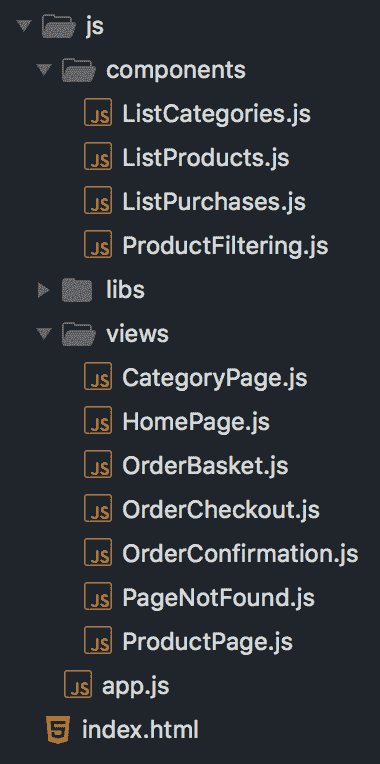
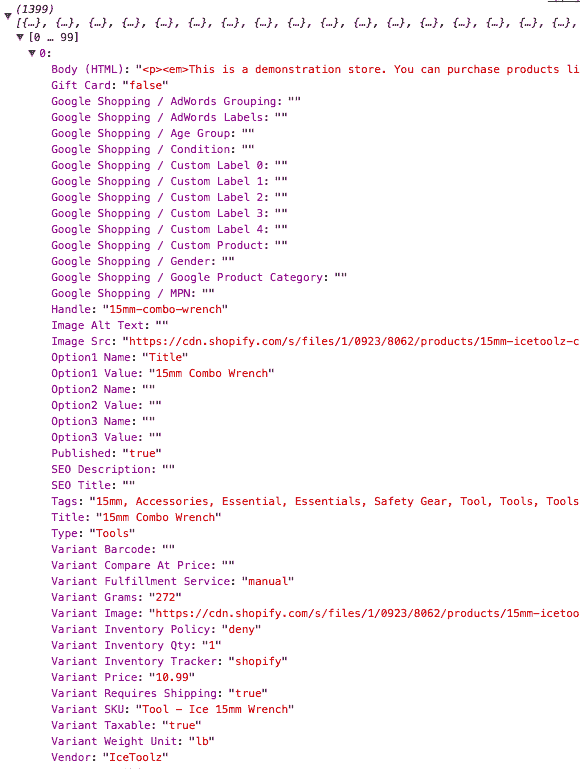
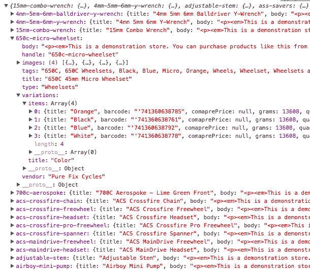

# 九、使用 Vue 动态路由加载数据

在[第 8 章](09.html)*介绍 Vue 路由和加载基于 URL 的组件*中，我们探讨了 Vue 路由及其功能和功能。有了这些知识，我们现在可以继续使用 Vue 打造我们的店铺。在我们开始编写代码并开始创建之前，我们应该首先计划我们的商店将如何工作，我们需要什么 URL，以及我们需要制作什么组件。规划好应用后，我们可以继续创建产品页面。

在本章中，我们将：

*   概述我们的组件和管线，并创建占位符文件
*   加载产品 CSV 文件，对其进行处理，并在 Vuex 中缓存
*   创建包含图像和产品变体的单个产品页面

# 概述并规划你的应用

首先，让我们考虑一下整个应用和用户流。

我们将创建一个没有支付处理网关的商店。商店主页将显示手工挑选的产品列表。用户将能够使用类别浏览产品，并使用我们制作的过滤器缩小选择范围。他们将能够选择一种产品，并查看有关该产品的更多详细信息。该产品将有各种变化（尺寸、颜色等），并且可能有多个产品图像。用户将能够向他们的篮子中添加变体。从那里，他们可以继续浏览产品并添加更多内容到购物篮中，或者继续结帐，在那里他们将被要求提供姓名和地址并付款。订单将显示确认屏幕。

整个商店应用将在 Vue 中创建并在客户端运行。这不包括支付、用户帐户、库存管理或验证所需的任何服务器端代码。

该应用将使用 Vue 路由处理 URL，使用 Vuex 存储产品、篮子内容和用户详细信息。

# 组件

在概述了用户流程之后，我们需要计划我们需要为我们的商店制造哪些组件以及它们的名称。这有助于开发应用，因为我们清楚地知道需要创建哪些组件。我们还将决定组件名称。遵循 Vue 风格指南（[https://vuejs.org/v2/style-guide/index.html](https://vuejs.org/v2/style-guide/index.html) ），我们的所有组件将由两个名称组成。

# 路由组件

以下组件将与 Vue router 结合使用，形成我们应用的页面：

*   **店铺主页**-`HomePage`：店铺主页将显示由店主策划的产品列表。这将使用预先选择的产品手柄列表进行显示。
*   **类别页面**-`CategoryPage`：该页面将列出特定类别的产品。类别列表页面也会有过滤器。
*   **产品页面**-`ProductPage`：产品页面将显示产品的详细信息、图像和变化。
*   **购物篮**-`OrderBasket`：在购物篮中，用户可以查看他们添加的产品，删除不需要的物品，并更改每个物品的数量。它还将显示订单的总体成本。
*   **结帐**-`OrderCheckout`：结帐将锁定购物篮–取消移除和更新产品的功能，并提供一个表单供用户输入其地址
*   **订单确认**-`OrderConfirmation`：下单后会显示此组件，确认购买的产品、交货地址和总价。
*   `404`**页面**-`PageNotFound`：输入错误 URL 时的错误页面。

# HTML 组件

HTML 组件将在页面组件中使用，以帮助减少重复布局代码中的重复：

*   **列表中的产品**-`ListProducts`：在列表视图中查看时，将显示分页的产品列表–例如在`HomePage`或`CategoryPage`组件中。
*   **类别列表**-`ListCategories`：这将创建一个用于导航的类别列表。
*   **采购清单**-`ListPurchases`：该组件将出现在购物篮、结帐、订单确认页面；它将以表格形式列出产品–详细说明变化、价格和数量。它还将显示篮子中所有产品的总价格
*   **过滤**-`ProductFiltering`：类别页面一侧使用的组件将为用户提供过滤功能，并将使用[第 8 章](https://cdp.packtpub.com/vue_js_by_example/wp-admin/post.php?post=103&action=edit#post_93)*中介绍的获取参数更新 URL，*介绍 Vue 路由并加载基于 URL 的组件。**

# 路径

通过概述我们的组件，我们可以规划到我们商店的路径和 URL，以及他们将采取哪些组件或行动。我们还需要考虑错误 URL 以及是否应该将用户重定向到合适的位置或显示错误消息：

*   `/`：`Home`
*   `/category/:slug`：`CategoryPage`，使用`:slug`唯一标识符标识要展示的产品
*   `/category`：将重定向到`/`
*   `/product/:slug`：`ProductPage`-再次使用`:slug`标识产品
*   `/product`：将重定向到`/`
*   `/basket`：`OrderBasket`
*   `/checkout`：`OrderCheckout`-如果没有产品，则会将用户重定向到`/basket`
*   `/complete`：`OrderConfirmation`-如果用户不是来自`OrderCheckout`组件，那么他们将被重定向到``/basket``
*   `*`：`PageNotFound`-这将捕获任何未指定的路线

确定了路线和组件后，我们就可以开始创建应用了。

# 创建初始文件

使用上一节中概述的应用，我们可以为文件结构和组件创建框架。由于此应用是一个大型应用，我们将为每个组件将文件拆分为单独的文件。这意味着我们的文件更易于管理，我们的主应用 JavaScript 文件不会失控。

虽然可以接受开发，但部署具有此数量文件的应用可能会增加加载时间，具体取决于服务器的设置方式。在传统的 HTTP/1.1 中，浏览器必须请求并加载每个文件——如果有多个文件，这是一个障碍。但是，使用 HTTP/2，您可以同时向用户推送多个文件–在这种情况下，多个文件可以在一定程度上提高应用的性能。

无论您选择在部署中使用哪种方法，强烈建议您在将代码部署到生产环境时缩小 JavaScript。这样可以确保在向用户提供服务时，代码尽可能小：



为每个组件、视图和库（如 Vue、Vuex 和 Vue 路由）创建一个文件。然后，为每种类型的文件创建一个文件夹。最后，添加一个`app.js`——这是初始化库的地方。

You may also consider using the vue-cli [(https://github.com/vuejs/vue-cli)](https://github.com/vuejs/vue-cli) for building your app. Beyond the scope of this book, as we only cover building a Vue app using the included JavaScript files, the vue-cli application allows you to develop your app in a more modular way and, once developed, deploy it in a similar fashion to how we have been developing the app.

创建一个`index.html`并包含您的 JavaScript 文件，确保首先加载 Vue，最后加载应用的 JavaScript。为您的应用添加一个容器，以形成我们商店的视图：

```js
<!DOCTYPE html>
<html>
<head>
  <title>Vue Shop</title>
</head>
<body>
  <div id="app"></div>

  <!-- Libraries -->
  <script type="text/javascript" src="js/libs/vue.js"></script>
  <script type="text/javascript" src="js/libs/vuex.js"></script>
  <script type="text/javascript" src="js/libs/router.js"></script>

  <!-- Components -->
  <script src="js/components/ListCategories.js"></script>
  <script src="js/components/ListProducts.js"></script>
  <script src="js/components/ListPurchases.js"></script>
  <script src="js/components/ProductFiltering.js"></script>

  <!-- Views -->
  <script src="js/views/PageNotFound.js"></script>
  <script src="js/views/CategoryPage.js"></script>
  <script src="js/views/HomePage.js"></script>
  <script src="js/views/OrderBasket.js"></script>
  <script src="js/views/OrderCheckout.js"></script>
  <script src="js/views/OrderConfirmation.js"></script>
  <script src="js/views/ProductPage.js"></script>

  <!-- App -->
  <script type="text/javascript" src="js/app.js"></script>
</body>
</html>
```

Ensure the `PageNotFound` component is loaded first, as we are going to be utilizing it within other components, as well as specifying it as the 404 page in our routes.

在每个文件中，通过声明变量或使用`Vue.component`来初始化组件的类型。对于视图，还要添加一个`name`属性，以帮助以后进行调试。

例如，`js/components/`文件夹中的所有文件都应按如下方式初始化。确保这些组件是小写的并用连字符连接：

```js
Vue.component('list-products', {

});
```

鉴于`js/views`中的路线和视图组件应如下所示：

```js
const OrderConfirmation = {
name: 'OrderConfirmation'
};
```

最后一步是初始化 Vuex 存储、Vue 路由和 Vue 应用。打开`app.js`并初始化库：

```js
const store = new Vuex.Store({});

const router = new VueRouter({});

new Vue({
  el: '#app',

  store,
  router
});
```

Vue 组件和路由已准备就绪，商店、路由和应用已初始化，让我们看看如何设置服务器（如果需要）并加载数据。

# 服务器设置

对于我们的商店，我们将在页面加载中加载 CSV 产品。这将模拟从数据库或销售点系统的 API 收集库存和产品数据，这是有实体商店的在线商店可能必须处理的事情。

与本书前面的 Dropbox 应用类似，我们将加载外部数据并将其保存到 Vuex 存储中。然而，我们将面临的问题是，当通过 JavaScript 加载资源时；浏览器要求所请求文件的协议通过 HTTP、HTTPS 或 CORS 请求。

这意味着我们无法使用 Dropbox API 使用的`fetch()`技术加载*本地*文件，因为在浏览器中查看我们的应用时，我们正在通过`file://`协议加载本地资产。

我们可以用几种不同的方式解决这个问题——您选择哪种方式取决于您的情况。我们将加载一个 CSV 文件，并使用两个插件将其转换为一个可用的 JSON 对象。您有三个选择：

1.  在本地存储文件
2.  使用远程服务器或
3.  使用本地服务器

让我们详细介绍一下每个选项，以及每个选项的优缺点。

# 在本地存储文件

第一个选项是将 CSV 适当地转换为 JSON 一次，然后将输出保存在文件中。您需要将其分配给文件中的一个变量，并在库之前加载 JSON。例如，创建一个`data.json`并将其更新为分配给变量：

```js
const products = {...}
```

然后可以在 HTML 中加载 JSON 文件：

```js
<script type="text/javascript" src="data.json"></script>
```

然后在`app.js`中有`products`变量可供使用。

优点：

*   减少代码中的负载
*   无需加载处理 CSV 所需的额外文件
*   不需要额外的步骤

缺点：

*   不模拟真实世界
*   如果要更新 CSV 数据，则需要转换、保存并分配给变量

# 使用远程服务器

另一个选择是将文件上传到远程现有服务器，并在那里开发应用

优点：

*   模拟加载 CSV 的真实开发
*   可以在任何地方用任何机器开发

缺点：

*   可能很慢
*   需要连接到 internet
*   需要在实时服务器上设置部署过程或编辑文件

# 设置本地服务器

最后一个选项是在您的计算机上设置本地服务器。有几个小的、轻量级的、零配置的模块和应用，或者也有更大的、更强大的应用。如果您的计算机上安装了 npm，建议使用节点 HTTP 服务器。如果没有，还有其他选择。

另一种选择是使用更重的应用，它可以为您提供 SQL 数据库和运行 PHP 应用的能力。这方面的一个例子是 MAMP 或 XAMPP。

优点：

*   模拟加载 CSV 的真实开发
*   快速、即时的更新
*   可以离线开发

缺点：

 ***   需要安装软件
*   可能需要一些配置和/或命令行知识

我们要选择的选项是最后一个，使用 HTTP 服务器。让我们加载并处理 CSV，以便开始创建我们的店铺。

# 加载 CSV

为了模拟从商店数据库或销售点收集数据，我们的应用将从 CSV 加载产品数据。CSV 或逗号分隔值是一种文件格式，通常用于以数据库方式共享数据。想一想如何在 excel 或数字中列出产品列表：这就是 CSV 文件的格式。

下一步需要下载并包含更多的 JavaScript 文件。如果您在*服务器设置*部分中选择了选项 1—将文件存储在本地 JSON 文件中—您可以跳过此步骤。

我们将要使用的数据是来自 Shopify 的示例商店数据。这些 CSV 有多种产品类型和不同的数据可供选择，这将测试我们的 Vue 技能。Shopify 已将其示例数据从 GitHub 存储库（[中）下载 https://github.com/shopifypartners/shopify-product-csvs-and-images](https://github.com/shopifypartners/shopify-product-csvs-and-images) ）。下载您感兴趣的任何 CSV 文件，并将其保存在文件系统的`data/`文件夹中。对于这个应用，我将使用`bicycles.csv`文件。 

如果不对逗号分隔和引号封装的值进行大量编码和处理，JavaScript 就无法本机加载和处理 CSV 文件。为了避免这本书偏离了如何加载、解析和处理 CSV 文件的主题，我们将使用一个库为我们完成繁重的工作。有两个值得注意的库，CSV 解析器（[https://github.com/okfn/csv.js](https://github.com/okfn/csv.js) 和 d3（[https://d3js.org/](https://d3js.org/) ）。CSV 解析器只进行 CSV 解析，而 d3 能够生成图表和数据可视化。

值得考虑的是哪一个最适合你；CSV 解析器只为你的应用增加了略多于 3KB 的权重，而 d3 大约是 60KB。除非您希望以后添加可视化，否则建议您使用较小的库，尤其是当它们执行相同的函数时。但是，我们将运行这两个库的示例。

我们希望在应用加载时加载产品数据，以便在组件需要数据时加载并解析 CSV。因此，我们将以 Vue 的`created()`方法加载数据。

# 用 d3 加载 CSV

两个插件都以非常相似的方式加载数据，但是返回的数据有所不同——不过，一旦加载了数据，我们就会处理这些问题。

加载 d3 库–如果要尝试，可以使用托管版本：

```js
<script src="https://d3js.org/d3.v4.min.js"></script>
```

使用 d3，我们在`csv()`的`d3`对象上使用一个函数，该函数接受一个参数–CSV 文件的路径。将`created()`函数添加到 Vue 实例并初始化 CSV 加载程序：

```js
new Vue({
  el: '#app',

  store,
  router,

  created() {
    d3.csv('./data/csv-files/bicycles.csv', (error, data) => {
 console.log(data);
 });
  }
});
```

Remember the path to your file is relative to the HTML file which is including your JavaScript file – in this case, `index.html`.

在浏览器中打开文件不会呈现任何输出。但是，如果打开 Javascript 控制台并展开正在输出的对象，您将看到类似的内容：



这将以`key: value`格式提供每个产品上所有可用属性的明细。这允许我们使用每个产品上一致的`key`访问每个红色`value`。例如，如果我们想从上面的产品中获得`15mm-combo-wrench`，我们可以使用`Handle`键。有关这方面的更多信息将在后面介绍

# 使用 CSV 解析器加载 CSV

CSV 解析器的工作方式稍有不同，它可以接受许多不同的参数，并且库中包含几个不同的方法和函数。数据输出也采用不同的格式，作为回报，提供一个表/CSV 样式的结构，带有一个`headers`和`fields`对象：

```js
new Vue({
  el: '#app',

  store,
  router,

  created() {
    CSV.fetch({url: './data/csv-files/bicycles.csv'}).then(data => {
 console.log(data);
 });
  }
});
```

这次查看输出将显示一个非常不同的结构，需要将字段的`key`与`headers`对象的索引进行匹配。

# 统一 Shopify CSV 数据

在保存和利用 Shopify 数据之前，我们需要统一数据并将其操作到更易于管理的状态。如果您检查任何一个库输出的数据，您会注意到产品的每个变体或附加图像都有一个条目，句柄是每个条目之间的链接因子。例如，大约有 12 个条目的句柄为`pure-fix-bar-tape`，每个条目都有不同的颜色。理想情况下，我们希望将每个变体分组在同一项目下，同时将图像显示为一个产品列表。

Shopify CSV 数据的另一个问题是，字段标题的标点符号和语法并不能构成很好的对象键。理想情况下，对象键应该像 URL slug 一样，小写，并且不包含空格。例如，`Variant Inventory Qty`在理想情况下应为`variant-inventory-qty`。

为了保存手动处理数据和更新密钥，我们可以使用 Vue 插件来处理加载库的输出，并返回一个产品对象，其格式完全符合我们的要求。插件为`vue-shopify-products`，可从 unpkg 获得：

```js
https://unpkg.com/vue-shopify-products
```

下载该库并将其包含到您的`index.html`文件中。下一步是告诉 Vue 使用此插件–在`app.js`文件的顶部，包括以下行：

```js
Vue.use(ShopifyProducts);
```

这现在在`$formatProducts()`的 Vue 实例上公开了一个新方法，它允许我们传入 CSV 加载库的输出，并获得更有用的对象集合：

```js
Vue.use(ShopifyProducts);

const store = new Vuex.Store({});

const router = new VueRouter({});

new Vue({
  el: '#app',

  store,
  router,

  created() {
    CSV.fetch({url: './data/csv-files/bicycles.csv'}).then(data => {
      let products = this.$formatProducts(data);
      console.log(products);
    });
  }
});
```

现在，检查输出将显示一个按`handle`分组的集合，其中变量和图像作为对象：



随着我们的产品更有效地分组，我们可以根据需要进行存储和召回。

# 储存产品

检索并格式化 CSV 数据后，我们可以将内容缓存在 Vuex 存储中。这将通过一个简单的变异来完成，该变异会获取有效载荷并将其存储，而无需任何修改。

在商店中创建一个`state`和`mutations`对象。在`state`中添加`products`键作为对象，并在`mutations`对象中创建一个函数，也称为`products`。变异应接受两个参数–状态和有效载荷：

```js
const store = new Vuex.Store({
  state: {
    products: {}
  },

  mutations: {
    products(state, payload) {

    }
  }
});
```

将`state.products`对象更新为`payload`的内容：

```js
const store = new Vuex.Store({
  state: {
    products: {}
  },

  mutations: {
    products(state, payload) {
      state.products = payload;
    }
  }
});
```

将主 Vue 实例中的`console.log`替换为提交函数，调用新的变种并传入格式化的产品数据：

```js
new Vue({
  el: '#app',

  store,
  router,

  created() {
    CSV.fetch({url: './data/csv-files/bicycles.csv'}).then(data => {
      let products = this.$formatProducts(data);
      this.store.commit('products', products);
    });
  }
});
```

通过将`$formatProducts`函数直接传递到 store`commit()`函数中，而不是将其存储为变量，可以在一定程度上减少这种情况：

```js
new Vue({
  el: '#app',

  store,
  router,

  created() {
    CSV.fetch({url: './data/csv-files/bicycles.csv'}).then(data => {
      this.$store.commit('products', this.$formatProducts(data));
    });
  }
});
```

# 显示单个产品

存储数据后，我们现在可以开始制作组件并在前端显示内容。我们将从制作产品视图开始–显示产品详细信息、变化和图像。我们将继续在[第 10 章](09.html)*中创建类别列表页面，创建电子商务商店-浏览产品*。

创建产品视图的第一步是创建路由，以允许通过 URL 显示组件。回到本章开头的注释，产品组件将加载到`/product/:slug`路径。

在 Vue 路由中创建一个`routes`阵列，指定路径和组件：

```js
const router = new VueRouter({
  routes: [
 {
      path: '/product/:slug', 
      component: ProductPage
    }
 ]
});
```

通过解释`products`对象的布局，我们可以开始了解路线和产品是如何连接的。我们将把产品的句柄传递到 URL 中。这将选择具有该手柄的产品并显示数据。这意味着我们不需要将`slug`与`products`明确链接。

# 找不到页面

创建第一条路由后，我们还应该创建`PageNotFound`路由，以捕获任何不存在的 URL。当没有匹配的产品时，我们也可以重定向到此页面。

我们将以与以前稍有不同的方式创建`PageNotFound`组件。我们将创建一个`/404`路径作为命名路由，而不是将组件放在`*`上。这允许我们根据需要别名和重定向多个不同的路由。

向 routes 数组添加一个新对象，路径为`/404`，指定组件为`PageNotFound`组件。为您的路线添加一个名称，以便我们可以在需要时使用，最后，添加一个`alias`属性，其中包含我们的全局 catchall 路线。

别忘了把这个*放在 routes 数组的*末尾，以便捕获任何以前未指定的路由。添加新路线时，务必记住将其放在`PageNotFound`路线之前：

```js
const router = new VueRouter({
  routes: [
    {
      path: '/product/:slug', 
      component: ProductPage
    },

    {
 path: '/404', 
 alias: '*',
 component: PageNotFound
 }
  ]
});
```

在`PageNotFound`组件中添加模板。现在，给它一些基本的内容——我们可以在以后改进它，一旦我们将应用的其余部分设置好：

```js
const PageNotFound = {
  name: 'PageNotFound',
  template: `<div>
 <h1>404 Page Not Found</h1>
 <p>Head back to the <router-link to="/">home page</router-link> and start again.</p>
 </div>`
};
```

请注意内容中路由链接的使用。我们需要做的最后一件事是在我们的应用中添加`<router-view>`元素。前往视图，并将其包含在应用空间中：

```js
<div id="app">
  <router-view></router-view>
</div> 
```

在浏览器中加载应用，如果需要，不要忘记启动 HTTP 服务器。首先，应该向您展示您的`PageNotFound`组件内容。导航到以下产品 URL 将导致 JavaScript 错误，而不是`404`页面。这表明路由正确拾取 URL，但错误是因为我们的`ProductPage`组件不包含模板：

```js
#/product/15mm-combo-wrench
```

如果您看到`PageNotFound`组件，请检查您的路线代码，因为这意味着`ProductPage`路线未被提取。

# 选择正确的产品

设置好初始路线后，我们现在可以继续加载所需的产品并显示来自商店的信息。打开`views/Product.js`并创建模板密钥。首先，创建一个简单的`<div>`容器，显示产品的标题：

```js
const ProductPage = {
  name: 'ProductPage',
  template: `<div>{{ product.title }}</div>`
};
```

在浏览器中查看此内容将立即引发 JavaScript 错误，因为 Vue 希望`product`变量是一个对象，但它目前尚未定义，因为我们尚未声明它。虽然目前的修复看起来相当简单，但我们需要考虑产品尚未定义的情况。

我们的商店应用异步加载数据。这意味着在加载产品时，应用其余部分的执行不会停止。总的来说，这提高了我们的应用的速度。在我们拥有产品的那一刻，我们就可以开始操作和显示列表，而无需等待应用的其余部分启动。

因此，用户很有可能访问产品详细信息页面，无论是通过共享的链接还是搜索结果，而无需加载产品列表。要防止应用在未完全初始化的情况下尝试显示产品数据，请在尝试显示其任何属性之前，向模板添加条件属性以检查产品变量是否存在。

加载我们的产品数据时，我们可以确保产品变量设置为`false`，直到所有内容都已完全加载。将`v-if`属性添加到模板中的包含元素：

```js
const ProductPage = {
  name: 'ProductPage',
  template: `<div v-if="product">{{ product.title }}</div>`
};
```

现在，我们可以开始从商店加载正确的产品，并将其分配给变量

创建一个内有`product()`函数的`computed`对象。在其中，创建产品的一个空白变量，然后返回它。现在默认返回`false`，这意味着我们的模板不会生成`<div>`：

```js
const ProductPage = {
  name: 'ProductPage',
  template: `<div v-if="product">{{ product.title }}</div>`,

  computed: {
    product() {
 let product;

 return product;
 }
  }
};
```

选择产品现在是一个相当简单的过程，这要感谢我们的产品存储和`Product`组件中的`slug`变量。存储中的`products`对象以句柄为键，以`product details`对象为值进行格式化。考虑到这一点，我们可以使用方括号格式选择所需的产品。例如：

```js
products[handle]
```

使用路由`params`对象，从商店加载所需产品，并将其分配给要返回的`product`变量：

```js
const ProductPage = {
  name: 'ProductPage',
  template: `<div v-if="product">{{ product.title }}</div>`,

  computed: {
    product() {
      let product;

      product = this.$store.state.products[this.$route.params.slug];

      return product;
    }
  }
};
```

我们不直接赋值`product`的原因是，我们可以添加一些条件语句。为了确保我们只在商店有可用数据的情况下加载产品，我们可以添加一个`if()`语句以确保产品的对象有可用的密钥；换句话说，数据加载了吗？

添加一个`if`语句，检查存储产品密钥的长度。如果存在，则将存储区中的数据分配给要返回的`product`变量：

```js
const ProductPage = {
  name: 'ProductPage',
  template: `<div v-if="product">{{ product.title }}</div>`,

  computed: {
    product() {
      let product;

      if(Object.keys(this.$store.state.products).length) {
        product = this.$store.state.products[this.$route.params.slug];
      }

      return product;
    }
  }
};
```

现在在浏览器中查看应用，加载数据后，您将看到产品的标题。这应该只需要一瞬间就可以加载，并且应该由我们的`if`语句优雅地处理。

在继续显示所有产品数据之前，我们需要处理 URL 中不存在句柄的产品的情况。因为我们的`ProductPage`路由在 URL 中的`/product`之后拾取任何内容，`PageNotFound`通配符路径将无法使用–因为加载数据并确定产品是否存在的是我们的`ProductPage`组件。

# 未找到正在捕获的产品

为了在产品不可用时显示`PageNotFound`页面，我们将使用`ProductPage`组件加载该组件并有条件地显示它。

为此，我们需要注册该组件，以便在模板中使用它。我们需要注册它，因为我们的`PageNotFound`组件当前作为对象而不是 Vue 组件存在（例如，当我们使用`Vue.component`时）

将一个`components`对象添加到您的`ProductPage`组件中，并包括`PageNotFound`：

```js
const ProductPage = {
  name: 'ProductPage',

  template: `<div v-if="product"><h1>{{ product.title }}</h1></div>`,

 components: {
 PageNotFound
 },

  computed: {
    product() {
      let product;

      if(Object.keys(this.$store.state.products).length) {
        product = this.$store.state.products[this.$route.params.slug];
      }

      return product;
    }
  }
};
```

这现在给了我们一个新的 HTML 元素，以`<page-not-found>`的形式使用。将此元素添加到现有的`<div>`之后的模板中。由于我们的模板需要一个根元素，请将它们都包装在一个额外的容器中：

```js
const ProductPage = {
  name: 'ProductPage',

  template: `<div>
    <div v-if="product"><h1>{{ product.title }}</h1></div>
    <page-not-found></page-not-found>
  </div>`,

  components: {
    PageNotFound
  },
  computed: {
    product() {
      let product;

      if(Object.keys(this.$store.state.products).length) {
        product = this.$store.state.products[this.$route.params.slug];
      }

      return product;
    }
  }
};
```

在浏览器中查看此内容将呈现`404`页面模板，并且在加载数据后，会呈现上面的产品标题。我们现在需要更新组件，以便在没有数据显示时仅显示`PageNotFound`组件。我们可以使用带有`v-if`属性的现有产品变量，如果为 false，则显示如下错误消息：

```js
<page-not-found v-if="!product"></page-not-found>
```

然而，这意味着如果用户在没有加载产品数据的情况下访问了产品页面，他们将在被产品信息替换之前看到 404 信息的闪烁。这不是一个很好的用户体验，因此只有在确定产品数据已加载且没有匹配项的情况下，我们才应该显示错误。

为了解决这个问题，我们将创建一个新变量来确定组件是否显示。在`ProductPage`组件中创建一个数据函数，该函数返回一个键为`productNotFound`且设置为 false 的对象。在`<page-not-found>`元素中添加`v-if`条件，对照新的`productNotFound`变量进行检查：

```js
const ProductPage = {
  name: 'ProductPage',

  template: `<div>
    <div v-if="product"><h1>{{ product.title }}</h1></div>
    <page-not-found v-if="productNotFound"></page-not-found>
  </div>`,

  components: {
    PageNotFound
  },

 data() {
 return {
 productNotFound: false
 }
 },

  computed: {
    product() {
      let product;

      if(Object.keys(this.$store.state.products).length) {
        product = this.$store.state.products[this.$route.params.slug];
      }

      return product;
    }
  }
};
```

最后一步是，如果产品不存在，将变量设置为`true`。因为我们只想在数据加载后执行此操作，所以将代码添加到`$store.state.products`检查中。我们已经将数据分配给了`product`变量，因此我们可以添加一个检查来查看该变量是否存在——如果不存在，请更改`productNotFound`变量的极性：

```js
const ProductPage = {
  name: 'ProductPage',

  template: `<div>
    <div v-if="product"><h1>{{ product.title }}</h1></div>
    <page-not-found v-if="productNotFound"></page-not-found>
  </div>`,

  components: {
    PageNotFound
  },

  data() {
    return {
      productNotFound: false
    }
  },

  computed: {
    product() {
      let product;

      if(Object.keys(this.$store.state.products).length) {
        product = this.$store.state.products[this.$route.params.slug];

 if(!product) {
 this.productNotFound = true;
 }
      }

      return product;
    }
  }
};
```

试着在 URL 的末尾输入一个错误的字符串——您应该会看到我们现在熟悉的`404`错误页面。

# 显示产品信息

随着我们的产品加载、过滤和错误捕捉到位，我们可以继续显示我们产品所需的信息。每种产品都可能包含一个或多个图像，以及一个或多个变体和它们之间的任意组合，因此我们需要确保满足这些场景中的每一个。

要查看我们可用的数据，请在`return`之前添加一个`console.log(product)`：

```js
product() {
  let product;

  if(Object.keys(this.$store.state.products).length) {
    product = this.$store.state.products[this.$route.params.slug];
    if(!product) {
      this.productNotFound = true;
    }
  }

  console.log(product);
  return product;
}
```

打开 JavaScript 控制台并检查现在应该存在的对象。熟悉可用的键和值。注意，`images`键是一个数组，`variations`键是一个对象，包含一个字符串和另一个数组。

在处理变体和图像之前，让我们先输出简单的内容。我们需要记住的是，我们输出的每个字段可能不存在于每个产品上，因此最好在必要时将其包装在条件标记中。

从产品明细中输出`body`、`type`、`vendor.title`。在`vendor.title`和`type`前面加上它们是什么的描述，但确保仅在产品详细信息中存在该文本时才呈现该文本：

```js
template: `<div>
  <div v-if="product">
    <h1>{{ product.title }}</h1>
    <div class="meta">
 <span>
 Manufacturer: <strong>{{ product.vendor.title }}</strong>
 </span>
 <span v-if="product.type">
 Category: <strong>{{ product.type }}</strong>
 </span>
 </div>
 {{ product.body }}
  </div>
  <page-not-found v-if="productNotFound"></page-not-found>
</div>`,
```

请注意，我们可以灵活地在类型和供应商前面加上更加用户友好的名称。一旦我们设置了类别和筛选，我们就可以将供应商和类型链接到适当的产品列表。

在浏览器中查看此内容将显示正文，正文将所有 HTML 标记输出为文本，这意味着我们可以在页面上看到它们。如果您回想一下我们在书的开头讨论的输出类型，我们需要使用`v-html`告诉 Vue 将块呈现为原始 HTML：

```js
template: `<div>
  <div v-if="product">
    <h1>{{ product.title }}</h1>
    <div class="meta">
      <span>
        Manufacturer: <strong>{{ product.vendor.title }}</strong>
      </span>
      <span v-if="product.type">
        Category: <strong>{{ product.type }}</strong>
      </span>
    </div>
    <div v-html="product.body"></div>
  </div>
  <page-not-found v-if="productNotFound"></page-not-found>
</div>`,
```

# 产品形象

下一步是为我们的产品输出图像。如果您使用的是 bicycles CSV 文件，一个很好的测试产品是`650c-micro-wheelset`——导航到此产品，因为它有四个图像。别忘了回到您的原始产品，检查它是否与一个图像一起工作。

图像值将始终是一个数组，无论是一个图像还是 100 个图像，因此要显示它们，我们将始终需要执行`v-for`。添加一个新容器并循环浏览图像。为每个图像添加宽度，使其不会占据页面。

图像数组包含每个图像的一个对象。这有一个`alt`和`source`键，可以直接输入 HTML。但是，在某些情况下，`alt`值缺失–如果缺失，请插入产品名称：

```js
template: `<div>
  <div v-if="product">

    <div class="images" v-if="product.images.length">
 <template v-for="img in product.images">
 
 </template>
 </div> 

    <h1>{{ product.title }}</h1>

    <div class="meta">
      <span>
        Manufacturer: <strong>{{ product.vendor.title }}</strong>
      </span>
      <span v-if="product.type">
        Category: <strong>{{ product.type }}</strong>
      </span>
    </div>

    <div v-html="product.body"></div>

  </div>
  <page-not-found v-if="productNotFound"></page-not-found>
</div>`,
```

随着我们的图像显示，这将是一个很好的补充，以创建一个画廊。商店通常只展示一个大图像，下面有一组缩略图。单击每个缩略图，然后替换主图像，以便用户可以更好地查看更大的图像。让我们重新创建该功能。如果只有一张图片，我们还需要确保不会显示缩略图。

我们这样做，通过将一个图像变量设置为图像数组中的第一个图像，这就是将形成大图像的图像。如果数组中有多个图像，我们将显示缩略图。然后，我们将创建一个 click 方法，用所选图像更新图像变量。

在数据对象中创建一个新变量，并在产品加载后使用 images 数组中的第一项对其进行更新。在尝试赋值之前，最好确保`images`键实际上是一个项目数组：

```js
const ProductPage = {
  name: 'ProductPage',

  template: `<div>
    <div v-if="product">
      <div class="images" v-if="product.images.length">
        <template v-for="img in product.images">
          
        </template>
      </div> 
      <h1>{{ product.title }}</h1>
      <div class="meta">
        <span>
          Manufacturer: <strong>{{ product.vendor.title }}</strong>
        </span>
        <span v-if="product.type">
          Category: <strong>{{ product.type }}</strong>
        </span>
      </div>
      <div v-html="product.body"></div>
    </div>
    <page-not-found v-if="productNotFound"></page-not-found>
  </div>`,

  components: {
    PageNotFound
  },

  data() {
    return {
      productNotFound: false,
      image: false
    }
  },

  computed: {
    product() {
      let product;

      if(Object.keys(this.$store.state.products).length) {

        product = this.$store.state.products[this.$route.params.slug];
        this.image = (product.images.length) ? product.images[0] : false;

        if(!product) {
          this.productNotFound = true;
        }
      }

      console.log(product);
      return product;
    }
  }
};
```

接下来，更新模板中的现有图像循环，使其仅在阵列中有多个图像时显示。另外，将第一个图像添加为模板中的主图像–不要忘记首先检查它是否存在：

```js
template: `<div>
  <div v-if="product">

    <div class="images" v-if="image">
      <div class="main">
        
      </div>

      <div class="thumbnails" v-if="product.images.length > 1">
        <template v-for="img in product.images">
          
        </template>
      </div>
    </div> 

    <h1>{{ product.title }}</h1>

    <div class="meta">
      <span>
        Manufacturer: <strong>{{ product.vendor.title }}</strong>
      </span>
      <span v-if="product.type">
        Category: <strong>{{ product.type }}</strong>
      </span>
    </div>

    <div v-html="product.body"></div>

  </div>
  <page-not-found v-if="productNotFound"></page-not-found>
</div>`,
```

最后一步是向每个缩略图添加单击处理程序，以便在与交互时更新图像变量。由于图像本身不具有`cursor: pointer`CSS 属性，因此可能值得考虑添加此属性。

单击处理程序将是一种方法，它接受缩略图循环中的每个图像作为参数。单击后，它将使用传递的对象更新图像变量：

```js
const ProductPage = {
  name: 'ProductPage',

  template: `<div>
    <div v-if="product">
      <div class="images" v-if="image">
        <div class="main">
          
        </div>

        <div class="thumbnails" v-if="product.images.length > 1">
          <template v-for="img in product.images">
            
          </template>
        </div>
      </div> 

      <h1>{{ product.title }}</h1>

      <div class="meta">
        <span>
          Manufacturer: <strong>{{ product.vendor.title }}</strong>
        </span>
        <span v-if="product.type">
          Category: <strong>{{ product.type }}</strong>
        </span>
      </div>

      <div v-html="product.body"></div>

    </div>
    <page-not-found v-if="productNotFound"></page-not-found>
  </div>`,

  components: {
    PageNotFound
  },

  data() {
    return {
      productNotFound: false,
      image: false
    }
  },

  computed: {
    product() {
      let product;

      if(Object.keys(this.$store.state.products).length) {

        product = this.$store.state.products[this.$route.params.slug];
        this.image = (product.images.length) ? product.images[0] : false;

        if(!product) {
          this.productNotFound = true;
        }
      }

      console.log(product);
      return product;
    }
  },

  methods: {
 updateImage(img) {
 this.image = img;
 }
 }
};
```

在浏览器中加载产品并尝试单击任何缩略图-您应该能够更新主图像。不要忘记用一个图像甚至零个图像在产品上验证代码，以确保用户不会遇到任何错误。

Don't be afraid of whitespace and adding new lines for readability. Being able to easily understand your code is better than the few bytes you would have saved on file load. When deploying to production, files should be minified, but during development white space takes precedence.  

# 产品变化

对于这个特定的数据集，我们的每个产品都至少包含一个变体，但可以包含多个变体。这通常与图像的数量密切相关，但并不总是相关的。变化可以是颜色或大小等。

在我们的`Product`对象上，我们有两个键来帮助我们显示变化。它们是`variationTypes`，其中列出了尺寸和颜色等变体的名称，以及`variationProducts`，其中包含所有变体。`variationProducts`对象中的每个产品还有一个`variant`对象，该对象列出了所有可变属性。例如，如果一件夹克有两种颜色，每种颜色有三种尺寸，那么会有六种`variationProducts`，每种都有两种`variant`属性

每个产品都会包含至少一个变体，尽管如果只有一个变体，我们可能需要考虑产品页面的 UX。我们将在表和下拉中显示我们的产品变体，这样您就可以体验到创建这两个元素。

# 变化显示表

在产品模板中创建一个新容器，以显示变体。在这个容器中，我们可以创建一个表来显示产品的不同变体。这将通过`v-for`声明实现。但是，现在您对该功能更加熟悉了，我们可以引入一个新属性。

# 使用带循环的键

在 Vue 中使用循环时，建议您使用一个额外属性来标识每个项目`:key`。这有助于 Vue 在重新排序、排序或筛选时识别阵列的元素。`:key`使用的一个例子是：

```js
<div v-for="item in items" :key="item.id">
  {{ item.title }}
</div>
```

键属性应该是项本身的唯一属性，而不是数组中项的索引，以帮助 Vue 识别特定对象。有关使用带循环键的更多信息，请参见[Vue 官方文档](https://vuejs.org/v2/guide/list.html#key)

我们将在显示变体时使用`key`属性，但使用`barcode`属性。

# 在表格中显示变量

在变体容器中添加一个表元素，并在`items`数组中循环。现在，显示`title`、`quantity`和`price`。添加一个额外的单元格，其中包含一个值为 Add to basket 的按钮。我们将在[第 11 章](09.html)中对其进行配置*构建电子商务商店–添加收银台。*别忘了在价格前加上`$`货币符号，因为它目前只是一个“原始”数字。

当心–当在模板文本中使用`$`符号时，JavaScript 将尝试将其与花括号一起解释为 JavaScript 变量。为了抵消这一点，在货币前面加一个反斜杠——这会告诉 JavaScript 下一个字符是文字，不应以任何其他方式解释：

```js
template: `<div>
  <div v-if="product">
    <div class="images" v-if="image">
      <div class="main">
        
      </div>

      <div class="thumbnails" v-if="product.images.length > 1">
        <template v-for="img in product.images">
          
        </template>
      </div>
    </div> 

    <h1>{{ product.title }}</h1>

    <div class="meta">
      <span>
        Manufacturer: <strong>{{ product.vendor.title }}</strong>
      </span>
      <span v-if="product.type">
        Category: <strong>{{ product.type }}</strong>
      </span>
    </div>

    <div class="variations">
 <table>
 <tr v-for="variation in product.variationProducts" :key="variation.barcode">
 <td>{{ variation.quantity }}</td>
 <td>\${{ variation.price }}</td>
 <td><button>Add to basket</button></td>
 </tr>
 </table>
 </div>

    <div v-html="product.body"></div>

  </div>
  <page-not-found v-if="productNotFound"></page-not-found>
</div>`,
```

虽然我们显示的是价格和数量，但并没有输出变量的实际变量属性（例如颜色）。要做到这一点，我们需要用一种方法对变量进行一些处理。

variant 对象包含每个变体类型的子对象，每个变体类型有一个名称和一个值。它们还存储在对象内的 slug 转换键中。有关更多详细信息，请参见以下屏幕截图：


在表格的开头添加一个新单元格，将变化传递给名为`variantTitle()`的方法：

```js
<div class="variations">
  <table>
    <tr v-for="variation in product.variationProducts" :key="variation.barcode">
      <td>{{ variantTitle(variation) }}</td>
      <td>{{ variation.quantity }}</td>
      <td>\${{ variation.price }}</td>
      <td><button>Add to basket</button></td>
    </tr>
  </table>
</div>
```

在`methods`对象中创建新方法：

```js
methods: {
  updateImage(img) {
    this.image = img;
  },

 variantTitle(variation) {

 }
}
```

我们现在需要构造一个带有变量标题的字符串，显示所有可用选项。为此，我们将构造每个类型的数组，然后将它们连接到一个字符串中。

将`variants`存储为变量，并创建一个空数组。我们现在可以循环使用`variants`对象中可用的键，并创建一个要输出的字符串。如果您决定将 HTML 添加到字符串中，如以下示例所示，我们将需要更新模板以输出 HTML 而不是原始字符串：

```js
variantTitle(variation) {
  let variants = variation.variant,
 output = [];

 for(let a in variants) {
 output.push(`<b>${variants[a].name}:</b> ${variants[a].value}`);
 } 
}
```

我们的输出数组将为每个变量设置一个项，格式如下：

```js
["<b>Color:</b> Alloy", "<b>Size:</b> 49 cm"]
```

我们现在可以将每一个连接在一起，从而将输出从数组转换为字符串。您选择加入的字符、字符串或 HTML 由您决定。现在，使用一个两边都有空格的`/`。或者，您可以使用`</td><td>`标记创建一个新的表格单元格。增加`join()`功能，更新模板使用`v-html`：

```js
const ProductPage = {
  name: 'ProductPage',

  template: `<div>
    <div v-if="product">
      <div class="images" v-if="image">
        <div class="main">
          
        </div>

        <div class="thumbnails" v-if="product.images.length > 1">
          <template v-for="img in product.images">
            
          </template>
        </div>
      </div> 

      <h1>{{ product.title }}</h1>

      <div class="meta">
        <span>
          Manufacturer: <strong>{{ product.vendor.title }}</strong>
        </span>
        <span v-if="product.type">
          Category: <strong>{{ product.type }}</strong>
        </span>
      </div>

      <div class="variations">
        <table>
          <tr v-for="variation in product.variationProducts" :key="variation.barcode">
            <td v-html="variantTitle(variation)"></td>
            <td>{{ variation.quantity }}</td>
            <td>\${{ variation.price }}</td>
            <td><button>Add to basket</button></td>
          </tr>
        </table>
      </div>

      <div v-html="product.body"></div>

    </div>
    <page-not-found v-if="productNotFound"></page-not-found>
  </div>`,

  components: {
    PageNotFound
  },

  data() {
    return {
      productNotFound: false,
      image: false
    }
  },

  computed: {
    ...
  },

  methods: {
    updateImage(img) {
      this.image = img;
    },

    variantTitle(variation) {
      let variants = variation.variant,
        output = [];

      for(let a in variants) {
        output.push(`<b>${variants[a].name}:</b> ${variants[a].value}`);
      }

      return output.join(' / ');
    }

  }
};
```

将单击事件附加到“添加到篮子”按钮，并在组件上创建新方法。此方法需要传入`variation`对象，以便将正确的对象添加到篮子中。现在，添加一个 JavaScript`alert()`以确认您拥有正确的 JavaScript：

```js
const ProductPage = {
  name: 'ProductPage',

  template: `<div>
    <div v-if="product">
      <div class="images" v-if="image">
        <div class="main">
          
        </div>

        <div class="thumbnails" v-if="product.images.length > 1">
          <template v-for="img in product.images">
            
          </template>
        </div>
      </div> 

      <h1>{{ product.title }}</h1>

      <div class="meta">
        <span>
          Manufacturer: <strong>{{ product.vendor.title }}</strong>
        </span>
        <span v-if="product.type">
          Category: <strong>{{ product.type }}</strong>
        </span>
      </div>

      <div class="variations">
        <table>
          <tr v-for="variation in product.variationProducts" :key="variation.barcode">
            <td v-html="variantTitle(variation)"></td>
            <td>{{ variation.quantity }}</td>
            <td>\${{ variation.price }}</td>
            <td><button @click="addToBasket(variation)">Add to basket</button></td>
          </tr>
        </table>
      </div>

      <div v-html="product.body"></div>

    </div>
    <page-not-found v-if="productNotFound"></page-not-found>
  </div>`,

  components: {
    PageNotFound
  },

  data() {
    return {
      productNotFound: false,
      image: false
    }
  },

  computed: {
    product() {
      let product;

      if(Object.keys(this.$store.state.products).length) {

        product = this.$store.state.products[this.$route.params.slug];
        this.image = (product.images.length) ? product.images[0] : false;

        if(!product) {
          this.productNotFound = true;
        }
      }

      console.log(product);
      return product;
    }
  },

  methods: {
    updateImage(img) {
      this.image = img;
    },

    variantTitle(variation) {
      let variants = variation.variant,
        output = [];

      for(let a in variants) {
        output.push(`<b>${variants[a].name}:</b> ${variants[a].value}`);
      }

      return output.join(' / ');
    },

    addToBasket(variation) {
 alert(`Added to basket: ${this.product.title} - ${this.variantTitle(variation)}`);
 }

  }
};
```

注意警报框中使用的模板文本–这允许我们使用 Javascript 变量，而无需使用字符串连接技术。单击 Addtobasket 按钮将生成一个弹出列表，列出产品名称和单击的变体。

# 在选择框中显示变体

产品页面上更常见的界面模式是有一个下拉列表或选择框，显示您的变体并可供选择。

当使用选择框时，我们将有一个变体，它要么是默认选择的，要么是用户与之交互并专门选择的。因此，我们可以在用户更改选择框时更改图像，并在产品页面上显示有关变体的其他信息，包括价格和数量。

我们不会依赖于将变量传递给`addToBasket`方法，因为它将作为一个对象存在于产品组件上。

将您的`<table>`元素更新为`<select>`，将`<tr>`元素更新为`<option>`。将按钮*移到该元素*之外，并从`click`事件中删除该参数。从`variantTitle()`方法中删除任何 HTML。因为它现在位于选择框中，所以不需要：

```js
<div class="variations">
 <select>
 <option 
 v-for="variation in product.variationProducts" 
 :key="variation.barcode" 
 v-html="variantTitle(variation)"
 ></option>
 </select>

  <button @click="addToBasket()">Add to basket</button>
</div>
```

下一步是创建可用于组件的新变量。与图像类似，这将通过`variationProducts`数组的第一项完成，并在选择框更改时更新

在数据对象中创建一个新项目，标题为`variation`。将此变量【填充 T1】加载到变量中时：

```js
const ProductPage = {
  name: 'ProductPage',

  template: `...`,

  components: {
    PageNotFound
  },

  data() {
    return {
      productNotFound: false,
      image: false,
      variation: false
    }
  },

  computed: {
    product() {
      let product;

      if(Object.keys(this.$store.state.products).length) {

        product = this.$store.state.products[this.$route.params.slug];

        this.image = (product.images.length) ? product.images[0] : false;
        this.variation = product.variationProducts[0];

        if(!product) {
          this.productNotFound = true;
        }
      }

      console.log(product);
      return product;
    }
  },

  methods: {
    ...
  }
};
```

更新`addToBasket`方法，使用`ProductPage`组件的`variation`变量，不依赖参数：

```js
addToBasket() {
  alert(`Added to basket: ${this.product.title} - ${this.variantTitle(this.variation)}`);
}
```

尝试单击“添加到篮子”按钮–无论在下拉列表中选择了什么，都应添加第一个变体。要在更改时更新变量，我们可以将`variations`变量绑定到选择框，方法与本书开头的文本框过滤相同。

向`select`元素添加一个`v-model`属性。在选择时，我们还需要告诉 Vue 绑定到该变量的内容。默认情况下，它将执行`<option>`的内容，这是当前我们的自定义变体标题。但是，我们希望绑定整个`variation`对象。将`:value`属性添加到`<option>`元素：

```js
<div class="variations">
  <select v-model="variation">
    <option 
      v-for="variation in product.variationProducts" 
      :key="variation.barcode" 
      :value="variation"
      v-html="variantTitle(variation)"
    ></option>
  </select>

  <button @click="addToBasket()">Add to basket</button>
</div>
```

更改选择框并单击“添加到篮子”按钮将生成正确的变体。这种方法使我们在显示表中的变化时具有更大的灵活性。

它允许我们在产品的其他位置显示变化数据。尝试在`meta`容器内的产品名称和数量旁边添加价格：

```js
template: `<div>
  <div v-if="product">
    <div class="images" v-if="image">
      <div class="main">
        
      </div>

      <div class="thumbnails" v-if="product.images.length > 1">
        <template v-for="img in product.images">
          
        </template>
      </div>
    </div> 

    <h1>{{ product.title }} - \${{ variation.price }}</h1>

    <div class="meta">
      <span>
        Manufacturer: <strong>{{ product.vendor.title }}</strong>
      </span>
      <span v-if="product.type">
        Category: <strong>{{ product.type }}</strong>
      </span>
      <span>
 Quantity: <strong>{{ variation.quantity }}</strong>
 </span>
    </div>

    <div class="variations">
      <select v-model="variation">
        <option 
          v-for="variation in product.variationProducts" 
          :key="variation.barcode" 
          :value="variation"
          v-html="variantTitle(variation)"
        ></option>
      </select>

      <button @click="addToBasket()">Add to basket</button>
    </div>

    <div v-html="product.body"></div>

  </div>
  <page-not-found v-if="productNotFound"></page-not-found>
</div>`,
```

这两个新属性将在更改变体时更新。我们还可以将图像更新为选定的变体（如果有）。为此，向组件添加一个`watch`对象，该对象监视变量的变化。更新时，我们可以检查变量是否有图像，如果有，则使用以下属性更新图像变量：

```js
const ProductPage = {
  name: 'ProductPage',

  template: `...`,

  components: {
    ...
  },

  data() {
    ...
  },

  computed: {
    ...
  },

 watch: {
 variation(v) {
 if(v.hasOwnProperty('image')) {
 this.updateImage(v.image);
 }
 }
 },

  methods: {
    ...
  }
};
```

使用`watch`时，函数将新项作为第一个参数传递。我们可以使用它来收集图像信息，而不是引用组件上的图像。

我们可以做的另一个增强是禁用 addtobasket 按钮，并在变体缺货时在下拉列表中添加注释。此信息从变体`quantity`键收集。

检查数量，如果少于一个，则在选择框中显示缺货消息，并使用`disabled`HTML 属性禁用添加到购物篮按钮。我们还可以更新按钮的值：

```js
template: `<div>
    <div v-if="product">
      <div class="images" v-if="image">
        <div class="main">
          
        </div>

        <div class="thumbnails" v-if="product.images.length > 1">
          <template v-for="img in product.images">
            
          </template>
        </div>
      </div> 

      <h1>{{ product.title }} - \${{ variation.price }}</h1>

      <div class="meta">
        <span>
          Manufacturer: <strong>{{ product.vendor.title }}</strong>
        </span>
        <span v-if="product.type">
          Category: <strong>{{ product.type }}</strong>
        </span>
        <span>
          Quantity: <strong>{{ variation.quantity }}</strong>
        </span>
      </div>

      <div class="variations">
        <select v-model="variation">
          <option 
            v-for="variation in product.variationProducts" 
            :key="variation.barcode" 
            :value="variation"
            v-html="variantTitle(variation) + ((!variation.quantity) ? ' - out of stock' : '')"
          ></option>
        </select>

        <button @click="addToBasket()" :disabled="!variation.quantity">
          {{ (variation.quantity) ? 'Add to basket' : 'Out of stock' }}
        </button>
      </div>

      <div v-html="product.body"></div>

    </div>
    <page-not-found v-if="productNotFound"></page-not-found>
  </div>`,
```

如果使用`bicycles.csv`数据集，Keirin Pro Track 框架集产品（`/#/product/keirin-pro-track-frame`）包含多个变体，其中一些没有库存。这允许您在更改图像的同时测试`out of stock`功能。

我们可以对产品页面做的另一件事是，仅当存在多个变体时才显示下拉列表。只有一个的产品示例是 15 mm 组合扳手（`#/product/15mm-combo-wrench`。在本例中，不值得显示`<select>`框。当我们在`Product`组件上设置`variation`变量时，我们并不依赖选择来初始设置变量。因此，当只有一种替代产品时，我们可以完全删除带有`v-if=""`的选择框。

就像我们对图像所做的那样，检查数组的长度是否超过一个，这次是`variationProducts`数组：

```js
<div class="variations">
  <select v-model="variation" v-if="product.variationProducts.length > 1">
    <option 
      v-for="variation in product.variationProducts" 
      :key="variation.barcode" 
      :value="variation"
      v-html="variantTitle(variation) + ((!variation.quantity) ? ' - out of stock' : '')"
    ></option>
  </select>

  <button @click="addToBasket()" :disabled="!variation.quantity">
    {{ (variation.quantity) ? 'Add to basket' : 'Out of stock' }}
  </button>
</div>
```

通过在不需要的时候删除元素，我们现在有了一个更少混乱的界面。

# 切换 URL 时更新产品详细信息

在浏览不同的产品 URL 以检查变体时，您可能已经注意到，单击“后退”和“前进”不会更新页面上的产品数据。

这是因为`Vue-router`意识到页面之间正在使用相同的组件，因此，它不会销毁和创建新实例，而是重用该组件。这样做的缺点是数据没有得到更新；我们需要触发一个函数来包含新产品数据。好处是代码更高效。

要告诉 Vue 检索新数据，我们需要创建一个`watch`函数；我们不看变量，而是看`$route`变量。更新后，我们可以加载新数据

在`slug`的数据实例中新建一个变量，并将默认设置为路由参数。更新`product`计算函数以使用此变量而不是路由：

```js
const ProductPage = {
  name: 'ProductPage',

  template: `...`,

  components: {
    PageNotFound
  },

  data() {
    return {
      slug: this.$route.params.slug,
      productNotFound: false,
      image: false,
      variation: false
    }
  },

  computed: {
    product() {
      let product;

      if(Object.keys(this.$store.state.products).length) {

        product = this.$store.state.products[this.slug];

        this.image = (product.images.length) ? product.images[0] : false;
        this.variation = product.variationProducts[0];

        if(!product) {
          this.productNotFound = true;
        }
      }

      console.log(product);
      return product;
    }
  },

  watch: {
    ...
  },

  methods: {
    ...
  }
};
```

我们现在可以创建一个`watch`函数，关注`$route`变量。当这发生变化时，我们可以更新`slug`变量，该变量反过来将更新正在显示的数据。

观察路线时，该函数有两个参数传递给它：`to`和`from`。`to`变量包含我们要去的路线的所有信息，包括参数和使用的组件。`from`变量包含当前路线的所有信息。

当路由改变时，通过将`slug`变量更新为新参数，我们强制组件使用存储区中的新数据重新绘制：

```js
const ProductPage = {
  name: 'ProductPage',

  template: `<div>
    <div v-if="product">
      <div class="images" v-if="image">
        <div class="main">
          
        </div>

        <div class="thumbnails" v-if="product.images.length > 1">
          <template v-for="img in product.images">
            
          </template>
        </div>
      </div> 

      <h1>{{ product.title }} - \${{ variation.price }}</h1>

      <div class="meta">
        <span>
          Manufacturer: <strong>{{ product.vendor.title }}</strong>
        </span>
        <span v-if="product.type">
          Category: <strong>{{ product.type }}</strong>
        </span>
        <span>
          Quantity: <strong>{{ variation.quantity }}</strong>
        </span>
      </div>

      <div class="variations">
        <select v-model="variation" v-if="product.variationProducts.length > 1">
          <option 
            v-for="variation in product.variationProducts" 
            :key="variation.barcode" 
            :value="variation"
            v-html="variantTitle(variation) + ((!variation.quantity) ? ' - out of stock' : '')"
          ></option>
        </select>

        <button @click="addToBasket()" :disabled="!variation.quantity">
          {{ (variation.quantity) ? 'Add to basket' : 'Out of stock' }}
        </button>
      </div>

      <div v-html="product.body"></div>

    </div>
    <page-not-found v-if="productNotFound"></page-not-found>
  </div>`,

  components: {
    PageNotFound
  },

  data() {
    return {
      slug: this.$route.params.slug,
      productNotFound: false,
      image: false,
      variation: false
    }
  },

  computed: {
    product() {
      let product;

      if(Object.keys(this.$store.state.products).length) {

        product = this.$store.state.products[this.slug];

        this.image = (product.images.length) ? product.images[0] : false;
        this.variation = product.variationProducts[0];

        if(!product) {
          this.productNotFound = true;
        }
      }

      return product;
    }
  },

  watch: {
    variation(v) {
      if(v.hasOwnProperty('image')) {
        this.updateImage(v.image);
      }
    },

    '$route'(to) {
 this.slug = to.params.slug;
 }
  },

  methods: {
    updateImage(img) {
      this.image = img;
    },

    variantTitle(variation) {
      let variants = variation.variant,
        output = [];

      for(let a in variants) {
        output.push(`${variants[a].name}: ${variants[a].value}`);
      }

      return output.join(' / ');
    },

    addToBasket() {
      alert(`Added to basket: ${this.product.title} - ${this.variantTitle(this.variation)}`);
    }

  }
};
```

完成产品页面后，我们可以继续为`type`和`vendor`变量创建类别列表。删除代码中的任何`console.log()`调用，保持代码整洁。

# 总结

本章涵盖了很多内容。我们将产品的 CSV 文件加载并存储到 Vuex 商店中。在此基础上，我们创建了一个产品详细信息页面，该页面使用 URL 中的动态变量加载特定产品。我们创建了一个产品详细信息视图，允许用户浏览图像库并从下拉列表中选择变体。如果变体具有关联图像，则主图像将更新。

在[第 10 章](09.html)*建立电子商务商店–浏览产品*
中，我们将创建一个分类页面，创建过滤和订购功能–帮助用户找到他们想要的产品。**