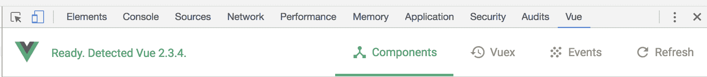
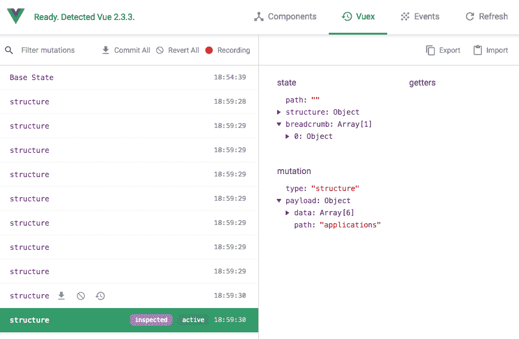
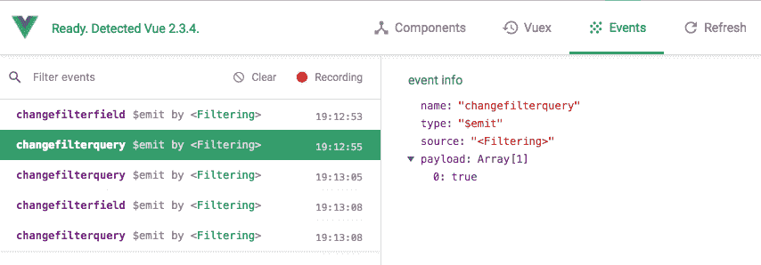

# 使用 Vue 开发工具并测试您的 SPA

在过去的 11 章中，我们使用`Vue.js`开发了几个**单页应用程序**（**SPA**）。尽管开发是创建 SPA 的一个重要部分，但测试也是创建任何 JavaScript web 应用程序的一个重要部分。

Chrome 和 Firefox 中提供的 Vue developer 工具可以深入了解特定视图中使用的组件或 Vuex 存储的当前状态，以及 JavaScript 发出的任何事件。这些工具允许您在开发应用程序时检查和验证应用程序中的数据，以确保一切正常。

SPA 测试的另一面是自动化测试。为自动化应用程序中的任务而编写的条件、规则和路由，允许您指定输出内容，然后测试运行条件以验证结果是否匹配。

在本章中，我们将：

*   在我们开发的应用程序中介绍 Vue 开发人员工具的使用
*   概述测试工具和应用程序

# 使用 Vue.js 开发人员工具

Vue 开发者工具可用于 Chrome 和 Firefox，并可从 GitHub（[下载 https://github.com/vuejs/vue-devtools](https://github.com/vuejs/vue-devtools) ）。一旦安装，它们将成为浏览器开发人员工具的扩展。例如，在 Chrome 中，它们出现在“审核”选项卡之后。



只有在开发模式下使用 Vue 时，Vue 开发人员工具才能工作。默认情况下，未统一版本的 Vue 启用了开发模式。但是，如果您使用的是代码的生产版本，则可以通过在代码中将`devtools`变量设置为`true`来启用开发工具：

```js
Vue.config.devtools = true
```

在本书中，我们一直在使用 Vue 的开发版本，因此开发工具应该与我们开发的所有三个 SPA 配合使用。打开 Dropbox 示例并打开 Vue 开发人员工具。

# 检查 Vue 组件数据和计算值

Vue developer 工具在页面上提供了对正在使用的组件的详细概述。您还可以深入组件并预览该特定实例上正在使用的数据。这非常适合在任何给定时间检查页面上每个组件的属性。

例如，如果我们检查 Dropbox 应用程序并导航到 Components 选项卡，我们可以看到<root>Vue 实例，也可以看到<dropboxviewer>组件。单击此按钮将显示组件的所有数据属性以及所有计算属性。这使我们可以验证结构是否正确构造，以及计算路径属性：</dropboxviewer></root>


深入到每个组件，我们可以访问单个数据对象和计算属性。

使用 Vue developer 工具检查应用程序是在创建应用程序时验证数据的一种更有效的方法，因为它省去了放置几个`console.log()`语句的麻烦

# 查看 Vuex 突变和时间旅行

导航到下一个选项卡 Vuex，允许我们实时观察发生的存储突变。每次激发一个变异，就会在左侧面板中创建一个新行。此元素允许我们查看正在发送的数据，以及提交数据前后 Vuex 存储的外观。

它还为您提供了多个选项，用于还原、提交和时间旅行到任意点。加载 Dropbox 应用程序时，几个结构突变立即填充在左侧面板中，列出突变名称和发生时间。这是对正在运行的文件夹进行预缓存的代码。单击每一个将显示 Vuex 存储状态–以及包含发送的有效负载的变异。在有效载荷已发送且突变已提交后，状态显示为*。要预览该突变之前的状态*，请选择前面的选项：**



在每个条目上，在变异名称旁边，您将注意到三个符号，它们允许您执行多个操作并直接在浏览器中变异存储：

*   **提交该突变**：这允许您提交到该点的所有数据。这将*从 dev 工具中删除*所有突变，并将碱基状态更新到此点。如果您希望跟踪发生的多个突变，这是很方便的。
*   **回复该突变**：这将撤销该突变以及该点之后的所有突变。这使您可以一次又一次地执行相同的操作，而无需按刷新或丢失当前位置。例如，在我们的商店应用程序中将产品添加到购物篮时，会发生突变。使用此选项将允许您从购物篮中删除产品并撤消任何以下突变，而无需离开产品页面。
*   **时间旅行到此状态**：这允许您预览应用程序和该特定突变的状态，而无需恢复在所选点之后发生的任何突变。

“突变”选项卡还允许您提交或还原左侧面板顶部的所有突变。在右侧面板中，还可以导入和导出存储状态的 JSON 编码版本。当您想要重新测试多个环境和实例而不必重复多个步骤时，这尤其方便。

# 预览事件数据

Vue developer 工具的“事件”选项卡的工作方式与 Vuex 选项卡类似，允许您检查整个应用程序中发出的任何事件。我们的 Dropbox 应用程序不使用事件，所以打开我们在本书[第 2 章](12.html)、*显示、循环、搜索和过滤数据*、[第 3 章](02.html)、*优化我们的应用程序并使用组件显示数据*中创建的人物过滤应用程序。

每次更新过滤器类型时，更改此应用中的过滤器都会发出一个事件，以及过滤器查询：



左侧面板再次列出事件的名称和发生时间。右侧面板包含有关事件的信息，包括其组件来源和有效负载。此数据允许您确保事件数据符合预期，如果不符合预期，则可帮助您定位事件的触发位置。

Vue 开发工具是非常宝贵的，尤其是当您的 JavaScript 应用程序变得更大、更复杂时。打开我们开发的 SPA 商店，检查各种组件和 Vuex 数据，了解此工具如何帮助您创建只提交所需突变并发出所需事件的应用程序。

# 测试你的水疗

大多数 Vue 测试套件都围绕着掌握命令行知识和使用**CLI**（**命令行界面**创建 Vue 应用程序展开。除了在与前端兼容的 JavaScript 中创建应用程序外，Vue 还有一个 CLI，允许您使用基于组件的文件创建应用程序。这些文件具有`.vue`扩展名，包含模板 HTML 以及组件所需的 JavaScript。它们还允许您创建作用域 CSS–仅适用于该组件的样式。如果您选择使用 CLI 创建应用程序，那么您在本书中学到的所有理论和大量实践知识都可以轻松移植到其他应用程序中。

# 命令行单元测试

与组件文件一起，Vue CLI 允许您更轻松地与命令行单元测试集成，例如 Jest、Mocha、Chai 和 TestCafe（[https://testcafe.devexpress.com/](https://testcafe.devexpress.com/) ）。例如，TestCafe 允许您指定几个不同的测试，包括检查内容是否存在，以及单击按钮测试功能。TestCafe 测试检查第一个应用程序中的过滤组件是否包含工作*字段*的示例如下：

```js
test('The filtering contains the word "filter"', async testController => {
  const filterSelector = await new Selector('body > #app > form > label:nth-child(1)');

  await testController.expect(paragraphSelector.innerText).eql('Filter');
});
```

该测试将等同于`true`或`false`。单元测试通常与组件本身一起编写，允许组件被重用并单独测试。这允许您检查外部因素是否与测试的输出无关。

大多数命令行 JavaScript 测试库将与 Vue.js 集成；在令人敬畏的 Vue GitHub 存储库（[中有一个很好的列表 https://github.com/vuejs/awesome-vue#test](https://github.com/vuejs/awesome-vue#test) ）。

# 浏览器自动化

使用命令行单元测试的替代方法是使用测试套件自动化浏览器。这种测试仍然是通过命令行触发的，但它并没有直接与 Vue 应用程序集成，而是在浏览器中打开页面并像用户一样与之交互。一个常用的工具是`Nightwatch.js`（[http://nightwatchjs.org/](http://nightwatchjs.org/) 。

您可以使用此套件打开店铺，与筛选组件或产品列表进行交互，并对结果进行排序和比较。这些测试是用非常口语化的英语编写的，并且不限于与被测试站点位于同一域名或文件网络上。该库也是语言不可知的——为任何网站工作，不管它是用什么构建的。

`Nightwatch.js`在其网站上给出的示例用于打开谷歌，并确保谷歌搜索`rembrandt van rijn`*的第一个结果是维基百科条目：*

```js
module.exports = {
  'Demo test Google' : function (client) {
    client
      .url('http://www.google.com')
      .waitForElementVisible('body', 1000)
      .assert.title('Google')
      .assert.visible('input[type=text]')
      .setValue('input[type=text]', 'rembrandt van rijn')
      .waitForElementVisible('button[name=btnG]', 1000)
      .click('button[name=btnG]')
      .pause(1000)
      .assert.containsText('ol#rso li:first-child',
        'Rembrandt - Wikipedia')
      .end();
  }
};
```

另一种替代夜视的方法是硒（[http://www.seleniumhq.org/](http://www.seleniumhq.org/) ）。Selenium 具有 Firefox 扩展的优势，该扩展允许您直观地创建测试和命令。

测试，尤其是大型应用程序的测试，是至关重要的，尤其是在将应用程序部署到开发环境时。无论您选择单元测试还是浏览器自动化，都有大量关于此主题的文章和书籍。

# 总结

到目前为止，我们创建了一个模拟商店。使用 Shopify CSV 文件中的真实数据，我们创建了一个允许单独查看产品的应用程序。我们还创建了一个分类列表页面，可以对其进行过滤和排序，使用户可以找到他们想要的特定产品。我们构建了一个可编辑的购物篮，一个可编辑的购物篮。在本章中，我们介绍了 Vue 开发工具的使用，然后介绍了如何构建测试。*