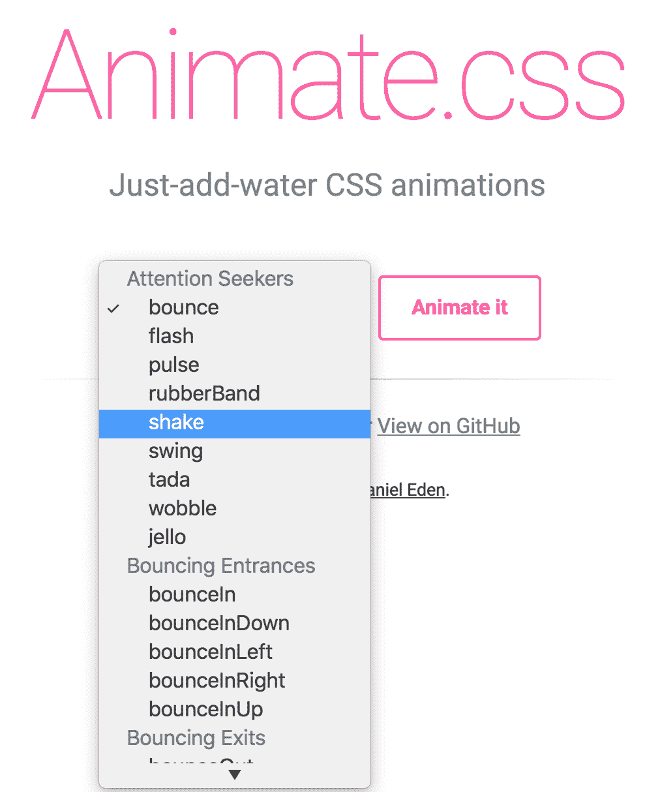
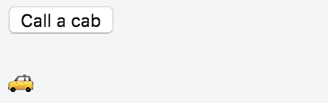
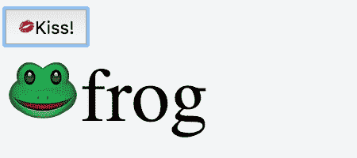
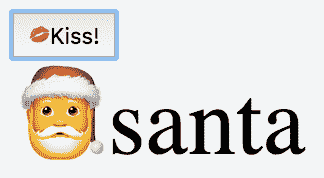
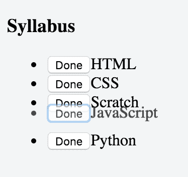
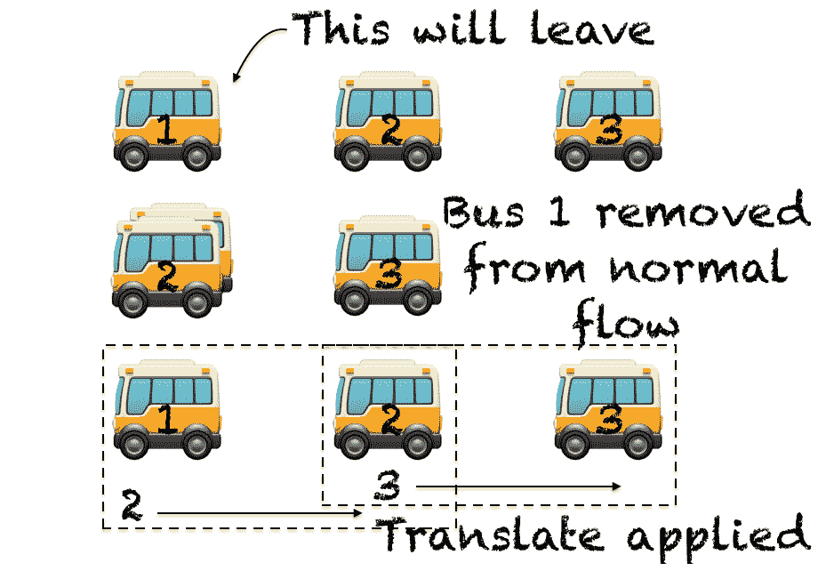
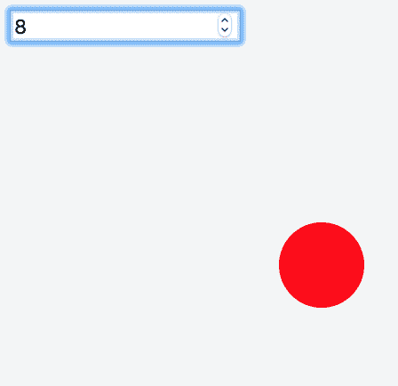
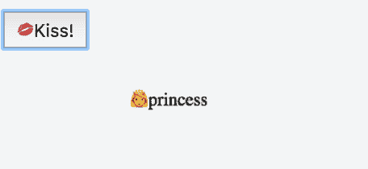

# 十三、过渡和动画

本章将介绍以下配方：

*   与第三方 CSS 动画库（如 animate.CSS）集成
*   添加您自己的转换类
*   使用 JavaScript 而不是 CSS 制作动画
*   在初始渲染上转换
*   在元素之间转换
*   让元素在过渡的进入阶段之前离开
*   添加列表元素的输入和离开转换
*   转换在列表中移动的元素
*   设置组件状态的动画
*   将可重用的转换打包到组件中
*   动态转换

# 介绍

本章包含与过渡和动画相关的配方。Vue 有自己的标签，用于处理元素进入或离开场景时的过渡：`<transition>`和`<transition-group>`。您将了解所有这些功能，以及如何使用它们为客户提供更好的用户体验。

Vue 转换功能非常强大，因为它们完全可以自定义，并且可以轻松地将 JavaScript 和 CSS 样式结合起来，同时具有非常直观的默认设置，可以让您编写更少的代码，以防您不需要所有的虚饰。

即使没有转换标记，您也可以为组件中发生的大量事件设置动画，因为您所要做的就是将状态变量绑定到某个可见属性。

最后，一旦您掌握了有关 Vue 转换和动画的所有知识，就可以轻松地将它们打包到分层组件中，并在整个应用中重用它们。这使得它们不仅功能强大，而且易于使用和维护。

# 与第三方 CSS 动画库（如 animate.CSS）集成

图形界面不仅需要可用且易于理解；它们还应具有可承受性，并易于使用。通过提供网站如何以一种有趣的方式工作的线索，进行转换可以帮助很大。在此配方中，我们将研究如何在应用中使用 CSS 库。

# 准备

在开始之前，您可以先看一下[https://daneden.github.io/animate.css/](https://daneden.github.io/animate.css/) ，如图所示，只是为了了解可用的动画，但您并不需要任何专门知识来继续：



# 怎么做。。。

假设您正在创建一个预订出租车的应用。我们将创建的界面将是简单和有趣的。

首先，将`animate.css`库添加到依赖项列表中（请参阅*选择开发环境*配方以了解如何操作）。

要继续，我们需要我们常用的包装：

```js
<div id="app"> 
</div>
```

在里面，我们会按一个按钮叫出租车：

```js
<button @click="taxiCalled = true"> 
  Call a cab 
</button>
```

您已经知道，我们将使用`taxiCalled`变量跟踪按钮是否被按下

让我们添加一个表情符号，在呼叫出租车时向用户确认：

```js
<p v-if="taxiCalled"></p>
```

此时，我们可以添加一些 JavaScript：

```js
new Vue({ 
  el: '#app', 
  data: { 
    taxiCalled: false 
  } 
})
```

运行该应用，当您按下按钮时，您将看到出租车立即出现。我们是一家很酷的出租车公司，因此，让我们通过一个过渡让出租车驶向我们：

```js
<transition  
  enter-active-class="animated slideInRight"> 
  <p v-if="taxiCalled"></p> 
</transition>
```

现在运行您的应用；如果你叫出租车，它会从右边滑到你身边：


如图所示，从左到右滑动：



# 它是如何工作的。。。

每个转换应用四个类。两个在元素进入*场景*时应用，另外两个在元素离开时应用：

| **名称** | **在**时应用 | 当时**被移除** |
| `v-enter` | 在插入元素之前 | 一帧之后 |
| `v-enter-active` | 在插入元素之前 | 过渡结束时 |
| `v-enter-to` | 一帧之后 | 过渡结束时 |
| `v-leave` | 过渡开始 | 一帧之后 |
| `v-leave-active` | 过渡开始 | 过渡结束时 |
| `v-leave-to` | 一帧之后 | 过渡结束时 |

在这里，首字母*v*代表您过渡的名称。如果不指定名称，将使用*v*。

While the beginning of the transition is a well-defined instant, the end of the transition is a bit of work for the browser to figure out. For example, if a CSS animation loops, the duration of the animation will only be one iteration. Also, this may change in future releases, so keep this in mind.

在我们的案例中，我们希望提供第三方`v-enter-active`，而不是编写我们自己的。问题是，我们的库已经为我们想要使用的动画类（`slideInRight`）使用了不同的名称。因为我们无法更改类的名称，所以我们告诉 Vue 使用`slideInRight`而不是查找`v-enter-active`类。

为此，我们使用了以下代码：

```js
<transition enter-active-class="animated slideInRight">
```

这意味着我们的`v-enter-active`现在被称为动画`slideInRight`。Vue 将在插入元素之前附加这两个类，并在转换结束时删除它们。请注意，动画是`animate.css`附带的一种助手类。

# 添加您自己的转换类

如果您的应用中有丰富的动画，并且您希望通过混合和匹配其他项目中的 CSS 类来重用它们，那么这就是适合您的方法。您还将了解表演动画的一项重要技术，称为**翻转**（**倒转播放**。虽然后一种技术通常由 Vue 自动触发，但我们将手动实现它，以便更好地了解其工作原理。

# 准备

要完成这个配方，您应该了解 CSS 动画和转换是如何工作的。这超出了本书的范围，但你可以在[找到一本好的入门书 http://css3.bradshawenterprises.com/](https://daneden.github.io/animate.css/) 。这个网站也很棒，因为它会解释什么时候可以使用动画和过渡。

# 怎么做。。。

我们将为出租车公司建立一个界面（类似于前面的配方），用户只需点击按钮即可呼叫出租车，并在呼叫出租车时提供良好的动画反馈。

要对按钮进行编码，请编写以下 HTML：

```js
<div id="app"> 
  <button @click="taxiCalled = true"> 
    Call a cab 
  </button> 
  <p v-if="taxiCalled"></p> 
</div>
```

然后，将`taxiCalled`变量初始化为`false`，如下 JavaScript 所示：

```js
new Vue({ 
  el: '#app', 
  data: { 
    taxiCalled: false 
  } 
})
```

此时，我们将在 CSS 中创建自己的自定义转换：

```js
.slideInRight { 
  transform: translateX(200px); 
} 

.go { 
  transition: all 2s ease-out; 
}
```

将汽车表情符号包装成 Vue 过渡：

```js
<transition  
  enter-class="slideInRight" 
  enter-active-class="go"> 
  <p v-if="taxiCalled"></p> 
</transition>
```

当你运行你的代码并点击呼叫出租车按钮时，你会看到一辆出租车经过。

# 它是如何工作的。。。

当我们点击按钮时，`taxiCalled`变量将变为`true`，Vue 将出租车插入您的页面。在实际执行此操作之前，它将读取您在`enter-class`中指定的类（在本例中，仅为`slideInRight`），并将其应用于已包装的元素（带有出租车表情符号的`<p>`元素）。它还适用于`enter-class-active`中规定的类别（在这种情况下，仅适用于 go）。

`enter-class`中的类在第一帧后被移除，`enter-class-active`中的类在动画结束时也被移除。

此处创建的动画遵循由四个点组成的翻转技术：

*   **第一（F）**：将属性作为动画第一帧中的属性；在我们的例子中，我们希望出租车从屏幕右侧开始。
*   **Last（L）**：您按照动画最后一帧中的状态获取属性，在我们的例子中，这是屏幕左侧的出租车。
*   **反转（I）**：您反转您在第一帧和最后一帧之间注册的属性更改。由于我们的出租车向左移动，在最后一帧，它将以-200 像素的偏移量移动。我们将其反转，并将`slideInRight`类设置为将 transform 设置为`translateX(200px)`，这样当它出现时，滑行将处于+200 像素偏移。
*   **游戏（P）**：我们为我们接触过的每一处财产创建一个过渡。在 taxi 示例中，我们使用 transform 属性，因此，我们使用`writetransition: all 2s ease-out`平滑地在 taxi 之间切换。

Vue 在封面下自动使用此技术，使转换在`<transition-group>`标记内工作。更多信息，请参见*中为列表*配方的元素添加进入和离开转换。

# 使用 JavaScript 而不是 CSS 制作动画

一个常见的误解是，用 JavaScript 制作动画速度较慢，动画应该用 CSS 制作。事实是，如果正确使用，JavaScript 中的动画可以具有类似或更高的性能。在本食谱中，我们将借助简单但功能强大的 Velocity.js（[创建一个动画 http://velocityjs.org/](http://velocityjs.org/) 图书馆：


# 准备

这个方法，虽然它假定您不了解 Velocity 库，但假设您非常熟悉 CSS 或 JavaScript 库（如 jQuery）中的动画。如果您从未看过 CSS 动画，并且希望快速介绍，只需完成前面的两个食谱，您就应该能够跟随。

# 怎么做。。。

我们仍在寻找一家出租车公司的完美过渡（与前面的配方相同），该公司将在等待出租车时招待我们的客户。我们有一个叫出租车的按钮和一个出租车表情符号，当我们预订时会出现。

首先，将 Velocity 库作为依赖项添加到项目中--[https://cdnjs.cloudflare.com/ajax/libs/velocity/1.2.3/velocity.min.js](http://velocityjs.org/) 。

以下是创建界面框架的 HTML：

```js
<div id="app"> 
  <button @click="taxiCalled = true"> 
    Call a cab 
  </button> 
  <p v-if="taxiCalled"></p> 
</div>
```

我们的 Vue 模型非常简单，只包含`taxiCalled`变量：

```js
new Vue({ 
  el: '#app', 
  data: { 
    taxiCalled: false 
  } 
})
```

通过在 Vue 过渡中包裹小滑行来创建动画：

```js
<transition 
  @enter="enter" 
  :css="false" 
> 
<p v-if="taxiCalled"></p> 
</transition>
```

按下按钮插入出租车表情符号后，将立即调用 enter 方法。

必须添加到 Vue 实例中的 enter 方法如下所示：

```js
methods: { 
    enter (el) { 
      Velocity(el,  
      { opacity: [1, 0], translateX: ["0px", "200px"] }, 
      { duration: 2000, easing: "ease-out" }) 
    } 
  }
```

运行您的代码并按下按钮预订出租车！

# 它是如何工作的。。。

正如您可能已经注意到的，您的代码中没有 CSS。动画完全由 JavaScript 驱动。让我们稍微分析一下我们的 Vue 转换：

```js
<transition 
  @enter="enter" 
  :css="false" 
> 
  <p v-if="taxiCalled"></p> 
</transition>
```

虽然这仍然是一个可以使用 CSS 的转换，但我们希望告诉 Vue 通过设置`:css="false"`关闭 CSS 并节省宝贵的 CPU 周期。这将使 Vue 跳过所有与 CSS 动画相关的代码，并防止 CSS 干扰我们的纯 JavaScript 动画。

多汁的部分在`@enter="enter"`位。我们正在将插入元素时触发的钩子绑定到`enter`方法。方法本身如下：

```js
enter (el) { 
  Velocity(el,  
    { opacity: [1, 0], translateX: ["0px", "200px"] }, 
    { duration: 2000, easing: "ease-out" }
  ) 
}
```

这里，我们称之为 Velocity 库。Vue 免费传递了`el`参数，它指的是插入的元素（在我们的例子中，是包含汽车表情符号的`<p>`元素）。

Velocity 函数的语法如图所示：

```js
Velocity( elementToAnimate, propertiesToAnimate, [options] )
```

其他语法是可能的，但我们将坚持使用这个语法。

在调用此函数时，我们将段落元素作为第一个参数传递；然后我们说不透明度应该从 0 变为 1，同时，元素应该从 x 轴上 200 像素的起始位置向原点移动。作为选项，我们指定动画应持续两秒，并希望在接近结束时使动画轻松。

我认为一切都很清楚，也许除了我们如何传递`opacity`和`translateX`参数。

这就是 Velocity 所称的**强制进给**——我们告诉 Velocity，不透明度应该从 0 开始，然后变为 1。同样，我们告诉 Velocity，`translateX`属性应该从 200 像素开始，以 0 像素结束。

通常，我们可以避免传递数组来指定属性的初始值；速度将计算如何过渡。

例如，我们可以使用以下 CSS 类：

```js
p { 
  opacity: 0; 
}
```

如果我们重写 Velocity 调用，如下所示：

```js
Velocity(el,  
  { opacity: 1 } 
)
```

汽车会慢慢出现。Velocity 向 DOM 查询元素的初始值，然后将其转换为 1。这种方法的问题是，由于涉及到对 DOM 的查询，某些动画可能会变慢，特别是当您有很多并发动画时。

另一种获得与强制进给相同效果的方法是使用 begin 选项，如下所示：

```js
Velocity(el,  
  { opacity: 1 }, 
  { begin: () => { el.style.opacity = 0 } } 
)
```

这将在动画开始之前（因此，在插入元素之前）将不透明度设置为零。这将有助于在较慢的浏览器中，强制进给仍将显示汽车的闪光，然后将其一直带到右侧并启动动画。

下表总结了 JavaScript 动画的可能挂钩：

| **属性** | **说明** |
| `@before-enter` | 在插入元素之前调用此函数。 |
| `@enter` | 插入元素时调用此函数。 |
| `@after-enter` | 在插入元素并完成动画时调用此函数。 |
| `@enter-cancelled` | 当动画仍在进行中，但元素必须离开时，将调用此函数。如果您使用速度，您可以执行类似于`Velocity(el, "stop")`的操作。 |
| `@before-leave` | 在触发 leave 函数之前调用此函数。 |
| `@leave` | 当元素离开时调用此函数。 |
| `@after-leave` | 当元素离开页面时调用此函数。 |
| `@leave-cancelled` | 如果在离开调用完成之前必须插入元素，则调用此函数。它只适用于 v-show。 |

Just be reminded that these hooks are valid for any library, not just Velocity.

# 还有更多。。。

我们可以通过实现“取消”按钮来尝试使用此界面进行另一次拍摄。如果用户误订了出租车，点击 cancel 将删除预订，很明显，出租车表情符号消失了。

首先，我们添加一个取消按钮：

```js
<button @click="taxiCalled = false">
  Cancel
</button>
```

这很容易；现在，我们添加休假过渡：

```js
<transition 
  @enter="enter" 
  @leave="leave" 
  :css="false" 
> 
  <p v-if="taxiCalled"></p> 
</transition>
```

这就引出了我们的离开方法：

```js
leave (el) { 
  Velocity(el, 
    { opacity: [0, 1], 'font-size': ['0.1em', '1em'] }, 
    { duration: 200}) 
}
```

我们正在做的是使表情符号消失，同时缩小它。

如果您试图运行代码，您将遇到一些问题。

当您单击“取消”按钮时，将启动“离开”动画，出租车将变小并最终消失。相反，什么也没发生，出租车突然消失了。

取消动画没有按计划播放的原因是因为动画是用 JavaScript 而不是 CSS 编写的，所以 Vue 无法判断动画何时完成。特别是，Vue 认为离开动画在开始之前就已经完成了。这就是我们的车消失的原因。

诀窍在于第二个论点。每个钩子调用一个带有两个参数的函数。我们已经看到了第一个`el`，这是动画的主题。第二个是回调，调用该回调时，它会告诉 Vue 动画已完成。

我们将利用 Velocity 有一个名为`complete`的选项这一事实，该选项期望在动画（从 Velocity 角度）完成时调用一个函数。

让我们用以下新信息重写代码：

```js
leave (el, done) { 
  Velocity(el, 
  { opacity: [0, 1], 'font-size': ['0.1em', '1em'] }, 
  { duration: 200 }) 
}
```

将 done 参数添加到函数中可以让 Vue 知道我们希望在动画完成时调用回调。我们不需要显式地使用回调，因为 Vue 会自己解决这个问题，但由于依赖默认行为（如果没有记录，它们可能会改变）总是一个坏主意，让我们在动画完成后调用 done 函数：

```js
leave (el, done) { 
  Velocity(el, 
  { opacity: [0, 1], 'font-size': ['0.1em', '1em'] }, 
  { duration: 200, complete: done }) 
}
```

运行您的代码并按取消按钮取消您的出租车！

# 在初始渲染上转换

使用`appear`关键字，我们可以在元素首次加载时为它们打包转换。这有助于用户体验，因为它给人的印象是，当您将页面应用于许多元素时，页面响应更快，加载速度更快。

# 准备

这个食谱没有假定任何特定的知识，但是如果你至少完成了*通过 CSS 转换*食谱为你的应用添加一些乐趣，那将是小菜一碟。

# 怎么做。。。

我们将建立一个关于美国演员菲利·默里的网页；不，不是比尔·默里。【你可以在 T0 找到更多关于他的信息】http://www.fillmurray.com 。我们将使用这个网站的图片来填充关于他的页面。

在 HTML 中，我们编写一个标题作为页面标题：

```js
<h1> 
  The Fill Murray Page 
</h1>
```

标题后，我们将放置我们的 Vue 应用：

```js
<div id="app"> 
   
  <p> 
    The internet was missing the ability to 
    provide custom-sized placeholder images of Bill Murray. 
    Now it can. 
  </p> 
</div>
```

在浏览器中渲染时，其显示如下所示：


我们的页面现在非常简单。我们希望填充 Murray 的图片淡入。我们必须将其包装在一个过渡中：

```js
<transition appear> 
   
</transition>
```

以下是 CSS 类：

```js
img { 
  float: left; 
  padding: 5px 
} 
.v-enter { 
  opacity: 0 
} 
.v-enter-active { 
  transition: opacity 2s 
}
```

现在运行我们的页面将使图像显示缓慢，但也会移动文本。要解决此问题，我们必须提前指定图像大小：

```js
<transition appear> 
   
</transition>
```

这样，我们的浏览器将为缓慢显示的图像留出一些空间。

# 它是如何工作的。。。

`transition`标签中的`appear`指令将使组件第一次出现，并带有相关的转换（如果找到）。

有许多可能的方法可以在组件的第一次渲染时指定转换。在所有情况下，必须指定`appear`指令。

当此指令存在时，Vue 首先会查找标记中指定的 JavaScript 挂钩或 CSS 类：

```js
<transition 
  appear 
  @before-appear="customBeforeAppearHook" 
  @appear="customAppearHook" 
  @after-appear="customAfterAppearHook" 
  appear-class="custom-appear-class" 
  appear-active-class="custom-appear-active-class" 
> 
  <p>My element</p> 
</transition>
```

之后，如果指定了名称，Vue 将查找该元素的入口转换：

```js
<transition appear name="myTransition"> 
  <p>My element</p> 
</transition>
```

前面的代码将查找以下命名的类：

```js
.myTransition-enter {...} 
.myTransition-enter-active {...}
```

如果其他所有操作都失败，Vue 将查找元素插入的默认 CSS 类（`v-enter`和`v-enter-active`。顺便说一句，这就是我们在食谱中所做的。

Relying on these defaults is not a good practice; here, we have done it just as a demonstration. You should always give names to your transitions.

也许值得一提的是，为什么我们必须在图像中添加宽度和高度。原因是，当我们在 HTML 中指定图像 URL 时，浏览器事先不知道图像的大小，因此默认情况下不会为其保留任何空间。只有预先指定图像的大小，浏览器才能在加载图像之前正确合成页面。

# 在元素之间转换

网页上的所有内容都是元素。由于 Vue`v-if`和`v-show`指令，您可以轻松地使它们出现和消失。使用过渡，您可以轻松控制它们的显示方式，甚至添加魔术效果。这个食谱解释了怎么做。

# 准备

对于这个方法，您应该对 Vue 转换和 CSS 的工作原理有一些熟悉。

# 怎么做。。。

既然我们谈到了魔法，我们就要把青蛙变成公主。这种转变本身就是一种过渡。

我们将举例说明一个按钮，当按下该按钮时，表示对青蛙的亲吻：

```js
<div id="app"> 
  <button @click="kisses++">Kiss!</button> 
</div>
```

每次按下按钮时，可变吻数都会增加。变量将初始化为零，如下代码所示：

```js
new Vue({ 
   el: '#app', 
  data: { 
   kisses: 0 
  } 
})
```

接下来，我们需要青蛙和公主，我们将在按钮后立即添加它们：

```js
<transition name="fade"> 
  <p v-if="kisses < 3" key="frog">frog</p> 
  <p v-if="kisses >= 3" key="princess">princess</p> 
</transition>
```

淡入过渡为以下 CSS：

```js
.fade-enter-active, .fade-leave-active { 
  transition: opacity .5s 
} 
.fade-enter, .fade-leave-active { 
  opacity: 0 
}
```

为了使其正常工作，我们需要添加最后一个 CSS 选择器：

```js
p { 
  margin: 0; 
  position: absolute; 
  font-size: 3em; 
}
```

如果您运行应用并单击 kiss 按钮足够多次，您应该会看到您的青蛙变成公主：



此过渡将产生淡入淡出效果：


青蛙表情符号将变成公主表情符号：


# 它是如何工作的。。。

在编写这两个元素时，我们使用了`key`属性来指定谁是青蛙，谁是公主。这是因为，否则 Vue 优化系统将启动。它将看到两个元素的内容可以在不交换元素本身的情况下进行交换，并且不会发生转换，因为元素是相同的，只有内容发生了更改。

如果我们移除`key`属性，我们可以看到青蛙和公主将发生变化，但不会发生任何转换：

```js
<transition name="fade"> 
  <p v-if="kisses < 3">frog</p> 
  <p v-if="kisses >= 3">princess</p> 
</transition>
```

考虑我们使用两种不同的元素，如图所示：

```js
<p v-if="kisses < 3" >frog</p> 
<span v-if="kisses >= 3">princess</span>
```

此外，我们还相应地修改了`<p>`的 CSS 选择器：

```js
p, span { 
  margin: 0; 
  position: absolute; 
  font-size: 3em; 
  display: block; 
}
```

现在，如果我们再次启动我们的应用，那么一切都不会使用任何`key`属性。

Using keys is generally recommended even when not necessary, like in the preceding case. This is especially true when items have a different semantic meaning. There are a couple of reasons for this. The main reason is that when multiple people work on the same line of code, modifying the `key` attribute will not break the application as easily as switching a `span` element back into a `p` element, which will ruin the transition as we just saw.

# 还有更多。。。

在这里，我们介绍前面配方的两个子类：在两个以上的元素之间切换和绑定`key`属性。

# 在两个以上的元素之间转换

我们可以以一种简单的方式扩展刚刚完成的配方。

让我们假设，如果我们亲吻公主太多次，她会变成圣诞老人，这可能吸引人，也可能不吸引人，我想这取决于你的年龄。

首先，我们添加第三个元素：

```js
<transition name="fade"> 
  <p v-if="kisses < 3" key="frog">frog</p> 
  <p v-else-if="kisses >= 3 && kisses <= 5" key="princess">princess</p> 
  <p v-else key="santa">santa</p> 
</transition>
```

我们可以立即启动该应用，当我们亲吻公主/青蛙超过五次时，圣诞老人将以相同的褪色过渡出现：



使用此设置，我们在使用前两个元素之间使用的相同转换时受到限制。

在*动态转换*配方中解释了一种解决方法。

# 动态设置键属性

如果我们已经有了一些可用的数据，我们不必为所有元素编写密钥。另一种方法是编写相同的应用，但不重复该元素，如下所示：

```js
<transition name="fade">
  <p :key="transformation">{{emoji}}{{transformation}}</p>
</transition>
```

当然，这意味着我们必须根据亲吻的次数为`transformation`和`emoji`变量提供一个合理的值。

为此，我们将它们与计算属性绑定：

```js
computed: { 
  transformation () { 
    if (this.kisses < 3) { 
      return 'frog' 
    } 
    if (this.kisses >= 3 && this.kisses <= 5) { 
      return 'princess' 
    } 
    if (this.kisses > 5) { 
      return 'santa' 
    } 
  }, 
  emoji () { 
    switch (this.transformation) { 
      case 'frog': return '' 
      case 'princess': return '' 
      case 'santa': return '' 
    } 
  } 
}
```

我们在 Vue 实例中交换了模板中的一些复杂性，以获得更多的逻辑。从长远来看，如果我们预期将来会有更复杂的逻辑，或者如果转换的数量增加，这可能是好的。

# 让元素在过渡的进入阶段之前离开

在*元素间转换*配方中，我们探讨了如何在两个元素间进行转换。Vue 的默认行为是在第一个元素离开的同时开始正在进入的元素的转换；这并不总是可取的。

您将了解这个重要的角落案例，以及如何在本食谱中解决它。

# 准备

这个方法建立在两个元素之间的转换之上，解决了一个特定的问题。如果你不知道我们在谈论什么，回到一个食谱，你很快就会走上正轨。

# 怎么做。。。

首先，如果您还没有遇到问题，您将看到问题。接下来，我们将看看 Vue 为我们提供了什么解决方案。

# 两要素问题

让我们在我们的网站上创建一个旋转木马效果。用户将一次查看一个产品，然后他将滑动到下一个产品。要滑动到下一个产品，用户需要单击按钮。

首先，我们需要 Vue 实例中的产品列表：

```js
new Vue({ 
  el: '#app', 
  data: { 
    product: 0, 
    products: ['umbrella', 'computer', 'ball', 'camera'] 
  } 
})
```

在 HTML 中，我们只需要一个按钮和一个元素的视图：

```js
<div id="app"> 
  <button @click="product++">next</button> 
  <transition name="slide"> 
    <p :key="products[product % 4]">{{products[product % 4]}}</p> 
  </transition> 
</div>
```

模 4（产品%4）只是因为我们希望在产品列表结束时重新开始。

要设置滑动过渡，我们需要以下规则：

```js
.slide-enter-active, .slide-leave-active { 
  transition: transform .5s 
} 
.slide-enter { 
  transform: translateX(300px) 
} 
.slide-leave-active { 
  transform: translateX(-300px); 
}
```

此外，为了让一切看起来都很好，我们最后做了以下几点：

```js
p { 
  position: absolute; 
  margin: 0; 
  font-size: 3em; 
}
```

如果现在运行代码，您将看到一个漂亮的旋转木马：


现在，让我们尝试从上一条规则中删除`position: absolute`：

```js
p { 
  margin: 0; 
  font-size: 3em; 
}
```

如果您现在尝试您的代码，您将看到产品中出现一个奇怪的跳跃：


这就是我们正在努力解决的问题。第二个转换在第一个产品离开之前开始。如果定位不是绝对的，我们会看到一些奇怪的效果。

# 过渡模式

要解决此问题，我们将更改转换模式。让我们修改`<transition>`代码：

```js
<transition name="slide" mode="out-in"> 
  <p :key="products[product%4]">{{products[product%4]}}</p> 
</transition>
```

现在运行您的程序，您将看到产品在滑入屏幕之前需要更多的时间。他们正在等待前一项在进入前消失。

# 它是如何工作的。。。

概括地说，您有两种不同的方法来管理 Vue 中组件之间的转换。默认方式是在*输出*转换的同时启动*输入*转换。我们可以通过以下方式明确这一点：

```js
<transition mode="in-out"> 
  <!-- elements --> 
</transition>
```

我们可以通过等待*输出*部分完成，然后在动画中启动*来更改此默认行为。我们通过以下措施实现了这一目标：*

```js
<transition mode="out-in"> 
  <!-- elements --> 
</transition>
```

当元素具有绝对的样式位置时，前者是有用的，而当我们真的需要等待在页面上放置更多内容之前有一个明确的方法时，后者更相关。

绝对定位不关心元素之间的重叠，因为它们不遵循页面的流程。另一方面，静态定位将在第一个元素之后附加第二个元素，如果两个元素同时显示，则转换会很困难。

# 添加列表元素的输入和离开转换

在这里，我们将尝试添加一种可视化的方式来建议从列表中添加或删除元素。这会给用户体验增加很多内容，因为您有机会向用户建议添加或删除元素的原因。

# 准备

熟悉 CSS 和转换会有所帮助。如果你觉得这是必要的，只需浏览本章中的其他食谱。

# 怎么做。。。

我们将建立一个学习编程的教学大纲。当我们完成一个主题时，我们会感到轻松，我们希望通过让主题在学习过程中远离教学大纲，将这种感觉融入到我们的应用中。

列表的数据将在我们的 Vue 实例中：

```js
new Vue({ 
  el: '#app', 
  data: { 
    syllabus: [ 
      'HTML', 
      'CSS', 
      'Scratch', 
      'JavaScript', 
      'Python' 
    ] 
  } 
})
```

列表将以我们的 HTML 格式打印，并带有以下代码：

```js
<div id="app"> 
  <h3>Syllabus</h3> 
  <ul> 
    <li v-for="topic in syllabus"> 
      {{topic}} 
    </li> 
  </ul> 
</div>
```

当我们按下按钮时，我们希望主题从列表中消失。为了实现这一点，我们需要修改我们编写的代码。

首先，让我们在每个主题前添加一个“完成”按钮：

```js
<li v-for="topic in syllabus"> 
  <button @click="completed(topic)">Done</button>{{topic}} 
</li>
```

在这里，完成的方法如下所示：

```js
methods: { 
  completed (topic) { 
    let index = this.syllabus.indexOf(topic) 
    this.syllabus.splice(index, 1) 
  } 
}
```

现在运行代码将显示一个简单的应用，用于检查我们已经研究过的主题。不过，我们想要的是一部能让我们感到轻松的动画。

为此，我们需要编辑列表的容器。我们移除了`<ul>`标记，并告诉`<transition-group>`编译成`<ul>`标记：

```js
<transition-group tag="ul"> 
  <li v-for="topic in syllabus" :key="topic"> 
    <button @click="completed(topic)">Done</button>{{topic}} 
  </li> 
</transition-group>
```

注意，我们还根据主题为每个列表元素添加了一个键。我们最不需要的是将转换规则添加到 CSS 中：

```js
.v-leave-active { 
  transition: all 1s; 
  opacity: 0; 
  transform: translateY(-30px); 
}
```

现在，单击“完成”按钮，主题将随着转换而消失，如图所示：



# 它是如何工作的。。。

`<transition-group>`标记表示一组元素的容器，这些元素将同时显示。默认情况下，它表示`<span>`标记，但通过将标记属性设置为`ul`，我们使其表示无序列表。

列表中的每个元素都必须具有唯一的键，否则转换将无法工作。Vue 将负责对进入或离开的每个元素应用转换。

# 转换在列表中移动的元素

在此配方中，您将构建一个元素列表，这些元素根据列表的变化而移动。当您想告诉用户某些内容已更改并且列表现在已相应更新时，此特定动画非常有用。它还将帮助用户识别插入元素的点。

# 准备

这个配方有点先进；如果您不太熟悉 Vue 中的转换，我建议您完成本章中的一些食谱。如果您可以轻松完成*添加列表*配方元素的进入和离开转换，您就可以开始了。

# 怎么做。。。

您将构建一个小游戏--一个汽车站模拟器！

每当一辆公交车（以表情符号为代表）离开车站时，所有其他公交车都会向前开一点以取代它的位置。每个总线都由一个数字标识，从 Vue 实例数据可以看出：

```js
new Vue({ 
  el: '#app', 
  data: { 
    buses: [1,2,3,4,5], 
    nextBus: 6 
  } 
})
```

每当一辆新公共汽车到达时，它都会被分配一个累进编号。我们希望每两秒钟有一辆新公共汽车开走。当我们的组件安装在屏幕上时，我们可以通过挂接计时器来实现这一点。在数据之后，立即写下以下内容：

```js
mounted () { 
  setInterval(() => { 
    const headOrTail = () => Math.random() > 0.5 
    if (headOrTail()) { 
      this.buses.push(this.nextBus) 
      this.nextBus += 1 
    } else { 
      this.buses.splice(0, 1) 
    } 
  }, 2000) 
}
```

我们应用的 HTML 将如下所示：

```js
<div id="app"> 
  <h3>Bus station simulator</h3> 
  <transition-group tag="p" name="station"> 
    <span v-for="bus in buses" :key="bus"></span> 
  </transition-group> 
</div>
```

为了使公交车移动，我们需要在前缀 station 下指定一些 CSS 规则：

```js
.station-leave-active, .station-enter-active { 
  transition: all 2s; 
  position: absolute; 
} 

.station-leave-to { 
  opacity: 0; 
  transform: translateX(-30px); 
} 

.station-enter { 
  opacity: 0; 
  transform: translateX(30px); 
} 

.station-move { 
  transition: 2s; 
} 

span { 
  display: inline-block; 
  margin: 3px; 
}
```

现在启动该应用将导致公交车有序排队，每两秒钟就有一辆公交车离开或到达：


# 它是如何工作的。。。

我们应用的核心是`<transition-group>`标签。它管理由其密钥标识的所有总线：

```js
<transition-group tag="p" name="station"> 
  <span v-for="bus in buses" :key="bus"></span> 
</transition-group>
```

无论何时巴士进入或离开场景，Vue 都会自动触发翻转动画（参见*添加您自己的过渡类*配方）。

为了修正想法，假设我们有公交车[1,2,3]，公交车 1 离开现场。接下来发生的事情是，在动画实际开始之前，将记住第一个总线的`<span>`元素的属性。因此，我们可以检索以下描述属性的对象：

```js
{ 
  bottom:110.4375 
  height:26 
  left:11 
  right:27 
  top:84.4375 
  width:16 
}
```

Vue 对`<transition-group>`标记内键入的所有元素执行此操作。

在此之后，`station-leave-active`类将应用于第一条总线。让我们简要回顾一下规则是什么：

```js
.station-leave-active, .station-enter-active { 
  transition: all 2s; 
  position: absolute; 
}
```

我们注意到，位置变为绝对位置。这意味着该元素将从页面的正常流中删除。这反过来意味着他身后的所有公交车都会突然移动，以填补留下的空白。Vue 还记录此阶段总线的所有属性，并将其视为动画的最后一帧。此帧实际上不是实际显示的帧；它只是用作计算元素最终位置的抽象：



Vue 将计算最终帧和起始帧之间的差异，并应用样式以使总线显示在初始帧中，即使它们不是。样式将在一帧后删除。总线缓慢爬行到其最终帧位置而不是立即移动到其新位置的原因是它们是`span`元素，并且我们指定任何变换样式（Vue 用于为一帧伪造其位置的样式）必须转换两秒钟：

```js
.station-move { 
  transition: 2s; 
}
```

换言之，在第 1 帧，三条总线全部就位并记录其位置。

在第 0 帧，第一条总线从页面流中移除，其他总线立即移到它后面。在同一帧中，Vue 记录了它们的新位置，并应用了一个变换，该变换会将总线移回它们在第 1 帧处的位置，从而呈现出无人移动的外观。

在第 1 帧，变换被删除，但由于我们有一个过渡，总线将缓慢移动到其最终位置。

# 设置组件状态的动画

在计算机中，一切都是数字。在 Vue 中，任何数字都可以以某种方式设置动画。在此配方中，您将控制一个弹跳球，该球将使用 tween 动画平滑地定位自身。

# 准备

要完成这个食谱，您至少需要熟悉一些 JavaScript。JavaScript 的技术性超出了本书的范围，但我将在*的工作原理中为您详细介绍代码。。。*部分，所以不要太担心。

# 怎么做。。。

在我们的 HTML 中，我们将只添加两个元素：一个输入框，在其中输入所需的弹跳球位置和球本身：

```js
<div id="app"> 
  <input type="number"> 
  <div class="ball"></div> 
</div>
```

要正确渲染球，请编写此 CSS 规则，它将显示在屏幕上：

```js
.ball { 
  width: 3em; 
  height: 3em; 
  background-color: red; 
  border-radius: 50%; 
  position: absolute; 
  left: 10em; 
}
```

我们想控制棒*Y*的位置。为此，我们将绑定球的`top`属性：

```js
<div id="app"> 
  <input type="number"> 
  <div class="ball" :style="'top: ' + height + 'em'"></div> 
</div>
```

高度将是我们的 Vue 实例模型的一部分：

```js
new Vue({ 
   el: '#app', 
   data: { 
     height: 0 
   } 
})
```

现在，由于我们希望每当`enteredHeight`改变时，球在新的位置上进行动画，一个想法是绑定输入元素的`@change`事件：

```js
<div id="app"> 
  <input type="number" @input="move"> 
  <div class="ball" :style="'top: ' + height + 'em'"></div> 
</div>
```

移动方法将负责获取球的当前高度并将其缓慢转换为指定值。

在执行此操作之前，您将添加**Tween.js**库作为依赖项。官方存储库位于[https://github.com/tweenjs/tween.js](https://github.com/tweenjs/tween.js) 。如果您使用的是 JSFIDLE，那么可以添加 README.md 页面中指定的 CDN 链接。

在添加库之后添加 move 方法，如下所示：

```js
methods: { 
  move (event) { 
    const newHeight = Number(event.target.value) 
    const _this = this 
    const animate = (time) => { 
      requestAnimationFrame(animate) 
      TWEEN.update(time) 
    } 
    new TWEEN.Tween({ H: this.height }) 
      .easing(TWEEN.Easing.Bounce.Out) 
      .to({ H: newHeight }, 1000) 
      .onUpdate(function () { 
        _this.height = this.H 
      }) 
      .start() 
    animate() 
  } 
}
```

尝试启动应用，并在编辑球的高度时看到球反弹：


当我们改变高度时，球的位置也会改变：



# 它是如何工作的。。。

这里的一般原则是您拥有元素或组件的状态。当状态本质上是数字时，可以根据特定曲线或加速度从一个值到另一个值进行“过渡”（从中间）。

让我们把代码分解一下，好吗？

我们要做的第一件事是获取球的指定新高度，并将其保存到`newHeight`变量：

```js
const newHeight = Number(event.target.value)
```

在下一行中，我们还将 Vue 实例保存在一个`_this`helper 变量中：

```js
const _this = this
```

我们这样做的原因很快就会清楚：

```js
const animate = (time) => { 
  requestAnimationFrame(animate) 
  TWEEN.update(time) 
}
```

在前面的代码中，我们将所有动画包装在一个函数中。这是 Tween.js 库的惯用用法，它标识了我们将用于设置动画的主循环。如果我们有其他两个孩子，这是触发他们的地方：

```js
new TWEEN.Tween({ H: this.height }) 
  .easing(TWEEN.Easing.Bounce.Out) 
  .to({ H: newHeight }, 1000) 
  .onUpdate(function () { 
    _this.height = this.H 
  }) 
.start()
```

这是对我们库的 API 调用。首先，我们正在创建一个对象，该对象将保存高度值的副本，以代替我们的组件。通常情况下，在这里放置表示状态本身的对象。由于 Vue 限制（或 Tween.js 限制），我们使用了不同的策略；我们正在设置状态副本的动画，并同步每个帧的真实状态：

```js
Tween({ H: this.height })
```

第一行将此副本初始化为等于球的当前实际高度：

```js
easing(TWEEN.Easing.Bounce.Out)
```

我们选择类似弹性球的缓和：

```js
.to({ H: newHeight }, 1000)
```

此行设置动画应持续的目标高度和毫秒数：

```js
onUpdate(function () { 
  _this.height = this.H 
})
```

在这里，我们将动画的高度复制回真实的物体。由于此函数将其绑定到复制状态，因此我们不得不使用 ES5 语法来访问它。这就是为什么我们准备了一个变量来引用 Vue 实例。如果我们使用 ES6 语法，我们将无法直接获得`H`的值。

# 将可重用的转换打包到组件中

我们的网站可能有一个重要的转变，我们希望在整个用户漏斗中重复使用。如果您试图保持代码的条理化，将转换打包到组件中可能是一个很好的策略。在此配方中，您将构建一个简单的转换组件。

# 准备

如果您已经使用 Vue 完成了过渡，那么遵循此方法是有意义的。此外，由于我们使用的是组件，您至少应该知道它们是什么。浏览下一章，了解有关组件的入门知识。特别是，我们将创建一个功能组件，其解剖结构在*创建功能组件*配方中有详细说明。

# 怎么做。。。

我们将为新闻门户网站构建签名转换。实际上，我们将在卓越魔法库（[中使用预先制作的转换 https://github.com/miniMAC/magic](https://github.com/miniMAC/magic) ），所以您应该将其作为依赖项添加到项目中。您可以在[找到 CDN 链接 https://cdnjs.com/libraries/magic](https://cdnjs.com/libraries/magic) [（进入页面查找链接，不要将其复制为链接）。](https://github.com/miniMAC/magic)

首先，您将构建网站页面，然后您将构建转换本身。最后，您只需将转换添加到不同的元素。

# 构建基本网页

我们的网页将由两个按钮组成，每个按钮将显示一张卡片：一个是配方，另一个是最后的突发新闻：

```js
<div id="app"> 
  <button @click="showRecipe = !showRecipe"> 
    Recipe 
  </button> 
  <button @click="showNews= !showNews"> 
    Breaking News 
  </button> 
  <article v-if="showRecipe" class="card"> 
    <h3> 
      Apple Pie Recipe 
    </h3> 
    <p> 
      Ingredients: apple pie. Procedure: serve hot. 
    </p> 
  </article> 
  <article v-if="showNews" class="card"> 
    <h3> 
      Breaking news 
    </h3> 
    <p> 
      Donald Duck is the new president of the USA. 
    </p> 
  </article> 
</div>
```

由于以下 CSS 规则，卡片将具有其独特的触感：

```js
.card { 
  position: relative; 
  background-color: FloralWhite; 
  width: 9em; 
  height: 9em; 
  margin: 0.5em; 
  padding: 0.5em; 
  font-family: sans-serif; 
  box-shadow: 0px 0px 10px 2px rgba(0,0,0,0.3); 
}
```

JavaScript 部分将是一个非常简单的 Vue 实例：

```js
new Vue({ 
  el: '#app', 
  data: { 
    showRecipe: false, 
    showNews: false 
  } 
})
```

运行此代码将显示您的网页：


# 构建可重用的转换

我们决定，我们的网站将具有一个过渡时，卡显示。由于我们打算将动画与网站中的所有内容一起重用，因此我们最好将其打包成一个组件。

在 Vue 实例之前，我们声明以下组件：

```js
Vue.component('puff', { 
  functional: true, 
  render: function (createElement, context) { 
    var data = { 
      props: { 
        'enter-active-class': 'magictime puffIn', 
        'leave-active-class': 'magictime puffOut' 
      } 
    } 
    return createElement('transition', data, context.children) 
  } 
})
```

`puffIn`和`puffOut`动画在`magic.css`中定义。

# 将转换与页面中的元素一起使用

现在，我们将编辑我们的网页，将`<puff>`组件添加到我们的卡中：

```js
<div id="app"> 
  <button @click="showRecipe = !showRecipe"> 
    Recipe 
  </button> 
  <button @click="showNews = !showNews"> 
    Breaking News 
  </button> 
 <puff> 
    <article v-if="showRecipe" class="card"> 
      <h3> 
        Apple Pie Recipe 
      </h3> 
      <p> 
        Ingredients: apple pie. Procedure: serve hot. 
      </p> 
    </article> 
 </puff> <puff> 
    <article v-if="showNews" class="card"> 
      <h3> 
        Breaking news 
      </h3> 
      <p> 
        Donald Duck is the new president of the USA. 
      </p> 
    </article> 
 </puff> 
</div>
```

现在，当按下按钮时，卡会出现和消失，并产生“蓬松”效果。

# 它是如何工作的。。。

代码中唯一棘手的部分是构建`<puff>`组件。一旦我们有了这些，我们放在里面的任何东西都会随着我们的转变而出现和消失。在我们的示例中，我们使用了一个已经完成的转换。在现实世界中，我们可能会制作出非常复杂的动画，但每次都很难以同样的方式应用。将其打包到组件中更容易维护。

两件事使得`<puff>`组件作为可重用的转换工作：

```js
props: { 
  'enter-active-class': 'magictime puffIn', 
  'leave-active-class': 'magictime puffOut' 
}
```

这里，我们指定组件在进入和离开时必须采用的类；这里没有什么特别之处，我们已经在*中与第三方 CSS 动画库（如 animate.CSS*配方）集成了它。
最后我们返回实际元素：

```js
return createElement('transition', data, context.children)
```

这一行创建了元素的根，它是一个只有一个子元素的`<transition>`标记--`context.children`。这意味着孩子未指定；组件将把在模板中传递的任何实际子级作为子级。在我们的示例中，我们传递了一些即时显示的卡片。

# 动态转换

在 Vue 中，一个不变的主题是反应性，当然，由于这一点，转换可以是动态的。不仅转换本身，而且它们的所有属性都可以绑定到反应变量。这使我们能够控制在任何给定时刻使用哪个转换。

# 准备

此配方建立在*元素*配方之间的转换之上。如果你已经知道了转换，你就不需要回头了，但是如果你觉得自己错过了什么，那么最好先完成。

# 怎么做。。。

我们会用一些吻把青蛙变成公主，但是如果我们吻得太多，公主就会变成圣诞老人。当然，我们谈论的是表情符号。

我们的 HTML 设置非常简单：

```js
<div id="app"> 
  <button @click="kisses++">Kiss!</button> 
  <transition :name="kindOfTransformation" :mode="transformationMode"> 
    <p :key="transformation">{{emoji}}{{transformation}}</p> 
  </transition> 
</div>
```

请注意，这里的大多数属性都绑定到变量。下面是 JavaScript 的展开方式。

首先，我们将使用所有数据创建一个简单的 Vue 实例：

```js
new Vue({ 
el: '#app', 
  data: { 
    kisses: 0, 
    kindOfTransformation: 'fade', 
    transformationMode: 'in-out' 
  } 
})
```

我们所指的淡入淡出变换是以下 CSS：

```js
.fade-enter-active, .fade-leave-active { 
  transition: opacity .5s 
} 
.fade-enter, .fade-leave-active { 
  opacity: 0 
}
```

变量 transformation 和 emoji 由两个计算属性定义：

```js
computed: { 
  transformation () { 
    if (this.kisses < 3) { 
      return 'frog' 
    } 
    if (this.kisses >= 3 && this.kisses <= 5) { 
      return 'princess' 
    } 
    if (this.kisses > 5) { 
         return 'santa' 
    } 
  }, 
  emoji () { 
    switch (this.transformation) { 
      case 'frog': return '' 
      case 'princess': return '' 
      case 'santa': return '' 
    } 
  } 
}
```

当我们使用青蛙和公主之间的淡入淡出过渡时，我们想要公主和青蛙之间的其他东西。我们将使用以下转换类：

```js
.zoom-leave-active, .zoom-enter-active { 
  transition: transform .5s; 
} 

.zoom-leave-active, .zoom-enter { 
  transform: scale(0) 
}
```

现在，由于我们将转换的名称绑定到一个变量，因此可以通过编程轻松地切换该名称。我们可以通过向 computed 属性添加以下高亮显示的行来实现这一点：

```js
transformation () { 
  if (this.kisses < 3) { 
    return 'frog' 
  } 
  if (this.kisses >= 3 && this.kisses <= 5) { 
 this.transformationMode = 'out-in' 
    return 'princess' 
  } 
  if (this.kisses > 5) { 
 this.kindOfTransformation = 'zoom' 
    return 'santa' 
  } 
}
```

添加的第一行是为了避免在缩放转换开始时出现重叠（更多关于*中的内容，在转换*配方中让元素在进入阶段之前离开）。

添加的第二行将动画切换为“缩放”。

要使所有内容都正确显示，我们还需要一条 CSS 规则：

```js
p { 
  margin: 0; 
  position: absolute; 
  font-size: 3em; 
}
```

这个好多了。

现在运行应用，看看如何动态使用两种不同的过渡：



随着接吻次数的增加，公主缩小了：


有了这个，圣诞老人放大了：


# 它是如何工作的。。。

如果您了解反应性在 Vue 中是如何工作的，那么就没有什么可补充的了。我们将转换的名称绑定到`kindOfTransformation`变量，并在代码中从淡入淡出切换到放大。我们还证明，`<transition>`标记的其他属性也可以动态更改。