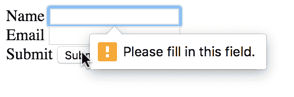
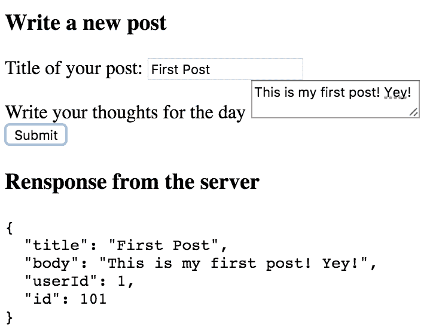
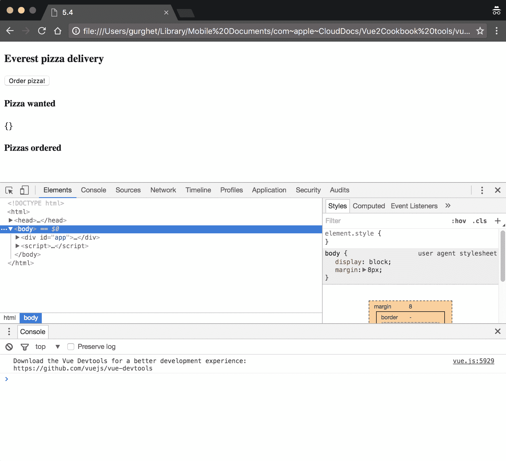
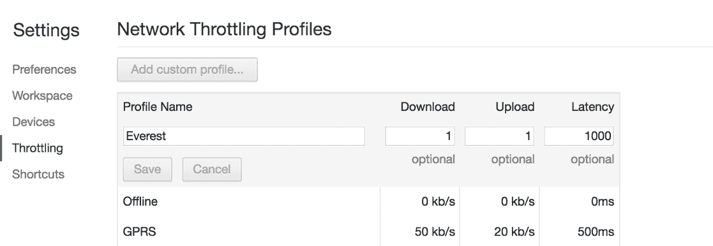
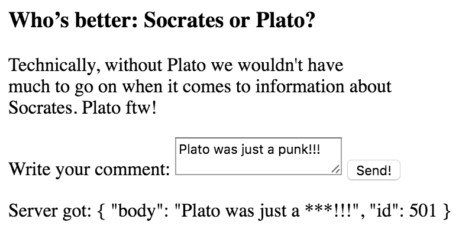

# Vue 与 Internet 通信

本章将介绍以下配方：

*   使用 Axios 发送基本 AJAX 请求
*   发送前验证用户数据
*   创建表单并将数据发送到服务器
*   在请求期间从错误中恢复
*   创建 REST 客户端（和服务器！）
*   实现无限滚动
*   在发送请求之前处理请求
*   防止对应用程序的 XSS 攻击

# 介绍

Web 应用程序很少能够独立工作。让他们感兴趣的事实是，他们让我们能够以创新的方式与世界交流，而这在几年前是不存在的。

Vue 本身不包含任何机制或库来发出 AJAX 请求或打开 web 套接字。因此，在本章中，我们将探讨 Vue 如何与内置机制和外部库交互以连接到外部服务。

首先，在外部库的帮助下发出基本的 AJAX 请求。然后，您将探索在表单中发送和获取数据的一些常见模式。最后，介绍了一些实际应用程序的方法以及如何构建 RESTful 客户机。

# 使用 Axios 发送基本 AJAX 请求

**Axios**是 Vue 提出 HTTP 请求的推荐库。这是一个非常简单的库，但它有一些内置功能，可以帮助您执行常见操作。它实现了使用 HTTP 谓词发出请求的 REST 模式，还可以处理函数调用中的并发性（同时生成多个请求）。您可以在[找到更多信息 https://github.com/mzabriskie/axios](https://github.com/mzabriskie/axios) 。

# 准备

对于这个配方，您不需要任何特定的 Vue 知识。我们将使用 Axios，Axios 本身使用**JavaScript 承诺**。如果你从未听说过承诺，你可以在[上读一本初级读物 https://developers.google.com/web/fundamentals/getting-started/primers/promises](https://developers.google.com/web/fundamentals/getting-started/primers/promises) 。

# 怎么做。。。

您将构建一个简单的应用程序，在每次访问网页时为您提供明智的建议。

您首先需要在应用程序中安装 Axios。如果您使用的是 npm，则只需发出以下命令：

```js
    npm install axios
```

如果您正在处理单个页面，您可以在[处从 CDN 导入以下文件 https://unpkg.com/axios/dist/axios.js](https://unpkg.com/axios/dist/axios.js) 。

Unfortunately, the advise slip service we will use will not work with JSFiddle because while the service runs on HTTP, JSFiddle is on HTTPS and your browser will most likely complain. You can run this recipe on a local HTML file.

我们的 HTML 如下所示：

```js
<div id="app"> 
  <h2>Advice of the day</h2> 
  <p>{{advice}}</p> 
</div>
```

我们的 Vue 实例如下所示：

```js
new Vue({ 
  el: '#app', 
  data: { 
    advice: 'loading...' 
  }, 
  created () { 
    axios.get('http://api.adviceslip.com/advice') 
      .then(response => { 
        this.advice = response.data.slip.advice 
      }) 
      .catch(error => { 
        this.advice = 'There was an error: ' + error.message 
      }) 
  } 
})
```

打开你的应用程序，获得令人耳目一新的建议：


# 它是如何工作的。。。

当我们的应用程序启动时，创建的钩子将被激活，并将使用 Axios 运行代码。第一行执行对 API 端点的 GET 请求：

```js
axios.get('http://api.adviceslip.com/advice')
```

这将回报一个承诺。如果承诺成功解决，我们可以对任何承诺使用`then`方法对结果采取行动：

```js
.then(response => { 
  this.advice = response.data.slip.advice 
})
```

响应对象将包含一些关于请求结果的数据。可能的响应对象如下所示：

```js
{ 
  "data": { 
    "slip": { 
      "advice": "Repeat people's name when you meet them.", 
      "slip_id": "132" 
    } 
  }, 
  "status": 200, 
  "statusText": "OK", 
  "headers": { 
    "content-type": "text/html; charset=UTF-8", 
    "cache-control": "max-age=0, no-cache" 
  }, 
  "config": { 
    "transformRequest": {}, 
    "transformResponse": {}, 
    "timeout": 0, 
    "xsrfCookieName": "XSRF-TOKEN", 
    "xsrfHeaderName": "X-XSRF-TOKEN", 
    "maxContentLength": -1, 
    "headers": { 
      "Accept": "application/json, text/plain, */*" 
    }, 
    "method": "get", 
    "url": "http://api.adviceslip.com/advice" 
  }, 
  "request": {} 
}
```

我们导航到要与之交互的属性；在我们的例子中，我们需要`response.data.slip.advice`，这是字符串。我们在实例状态下复制了变量 advice 中的字符串。

最后一部分是当我们的请求或第一个分支中的代码发生错误时：

```js
.catch(error => { 
  this.advice = 'There was an error: ' + error.message 
})
```

我们将在*从请求*过程中的错误恢复中更深入地探讨错误处理。现在，让我们手动触发一个错误，看看会发生什么。

触发错误最便宜的方法是在 JSFIDLE 上运行应用程序。由于浏览器在安全连接上检测到 JSFIDLE，而我们的 API 在 HTTP 上（这是不安全的），现代浏览器会抱怨并阻止连接。您应该看到以下文本：

```js
There was an error: Network Error
```

这只是您可以尝试的许多可能错误之一。将席 get 端点编辑到一些不存在的页面：

```js
axios.get('http://api.adviceslip.com/non-existent-page')
```

在这种情况下，您将得到一个 404 错误：

```js
There was an error: Request failed with status code 404
```

有趣的是，即使请求进行得很顺利，但在第一个分支中有错误，您也将进入错误分支。

将`then`分支更改为：

```js
.then(response => { 
  this.advice = undefined.hello 
})
```

众所周知，JavaScript 无法读取未定义对象的“hello”属性：

```js
There was an error: Cannot read property 'hello' of undefined
```

正如我告诉你的。

# 发送前验证用户数据

一般来说，用户讨厌表单。虽然我们无法改变这一点，但我们可以通过提供有关如何填写的相关说明，让他们不那么沮丧。在这个配方中，我们将创建一个表单，并且我们将利用 HTML 标准为用户提供关于如何完成表单的良好指导。

# 准备

此配方无需事先了解即可完成。虽然我们将构建一个表单（*使用 Axios*配方发送基本 AJAX 请求），但我们将伪造 AJAX 调用并集中精力进行验证。

# 怎么做。。。

我们将构建一个非常简单的表单：一个用于用户名的字段和一个用于用户电子邮件的字段，再加上一个用于提交信息的按钮。

键入以下 HTML：

```js
<div id="app"> 
  <form @submit.prevent="vueSubmit"> 
    <div> 
      <label>Name</label> 
      <input type="text" required> 
    </div> 
    <div> 
      <label>Email</label> 
      <input type="email" required> 
    </div> 
    <div> 
      <label>Submit</label> 
      <button type="submit">Submit</button> 
    </div> 
  </form> 
</div>
```

Vue 实例很简单，如图所示：

```js
new Vue({ 
  el: '#app', 
  methods: { 
    vueSubmit() { 
      console.info('fake AJAX request') 
    } 
  } 
})
```

运行此应用程序并尝试提交包含空字段或错误电子邮件的表单。您应该看到浏览器本身的帮助：



然后，如果尝试输入无效的电子邮件地址，您将看到以下内容：


# 它是如何工作的。。。

我们使用的是原生 HTML5 验证 API，它在内部使用模式匹配来检查我们输入的内容是否符合某些规则。

考虑以下行所需的属性：

```js
<input type="text" required>
```

这确保了当我们提交表单时，该字段实际上已填充，而另一个输入元素中的`type="email"`确保了内容类似于电子邮件格式。

此 API 非常丰富，您可以在[上阅读更多内容 https://developer.mozilla.org/en-US/docs/Web/Guide/HTML/Forms/Data_form_validation](https://developer.mozilla.org/en-US/docs/Web/Guide/HTML/Forms/Data_form_validation) 。

很多时候，问题是要利用这个 API，我们需要触发本机验证机制。这意味着我们不允许阻止提交按钮的默认行为：

```js
<button type="submit" @click.prevent="vueSubmit">Submit</button>
```

这不会触发本机验证，表单将始终提交。另一方面，如果我们采取以下措施：

```js
<button type="submit" @click="vueSubmit">Submit</button>
```

表单将得到验证，但由于我们不阻止提交按钮的默认行为，表单将被发送到另一个页面，这将破坏一页应用程序体验。

诀窍是在表单级别拦截提交：

```js
<form @submit.prevent="vueSubmit">
```

这样，我们就可以进行表单本地验证，并获得我们真正喜欢的所有现代浏览体验。

# 创建表单并将数据发送到服务器

HTML 表单是与用户交互的标准方式。您可以收集他们的数据以在站点内注册，让他们登录，甚至执行更高级的交互。在此配方中，您将使用 Vue 构建第一个表单。

# 准备

这个方法非常简单，但它假设您已经了解 AJAX，并且希望将您的知识应用于 Vue。

# 怎么做。。。

让我们假设我们有一个博客，我们想写一篇新文章。为此，我们需要一份表格。下面是如何布置 HTML 的：

```js
<div id="app"> 
  <h3>Write a new post</h3> 
  <form> 
    <div> 
      <label>Title of your post:</label> 
      <input type="text" v-model="title"> 
    </div> 
    <div> 
      <label>Write your thoughts for the day</label> 
      <textarea v-model="body"></textarea> 
    </div> 
    <div> 
      <button @click.prevent="submit">Submit</button> 
    </div> 
  </form> 
</div>
```

我们有一个标题框，一个新帖子的正文框，还有一个发送帖子的按钮。

在我们的 Vue 实例中，这三件事以及用户 ID 将成为应用程序状态的一部分：

```js
new Vue({ 
  el: '#app', 
  data: { 
    userId: 1, 
    title: '', 
    body: '' 
  } 
})
```

此时，我们只需要添加一个方法，在单击 Submit 按钮时将数据发送到服务器。由于我们没有服务器，我们将通过**代码使用非常有用的服务。**它基本上是一个假的 REST 服务器。我们将发送一个请求，服务器将以现实的方式响应，即使什么也不会发生。

以下是我们的方法：

```js
methods: { 
  submit () { 
    const xhr = new XMLHttpRequest() 
    xhr.open('post', 'https://jsonplaceholder.typicode.com/posts') 
    xhr.setRequestHeader('Content-Type',  
                         'application/json;charset=UTF-8') 
    xhr.onreadystatechange = () => { 
    const DONE = 4 
    const CREATED = 201 
    if (xhr.readyState === DONE) { 
      if (xhr.status === CREATED) { 
          this.response = xhr.response 
        } else { 
          this.response = 'Error: ' + xhr.status 
        } 
      } 
    } 
    xhr.send(JSON.stringify({ 
      title: this.title, 
      body: this.body, 
      userId: this.userId 
    })) 
  } 
}
```

要查看服务器的实际响应，我们将在状态中添加响应变量：

```js
data: { 
  userId: 1, 
  title: '', 
  body: '', 
 response: '...' 
}
```

在 HTML 中的表单之后，添加以下内容：

```js
<h3>Response from the server</h3> 
<pre>{{response}}</pre>
```

启动页面时，您应该能够与服务器进行交互。当您写帖子时，服务器将回显帖子并使用帖子 ID 进行回复：



# 它是如何工作的。。。

大多数魔法发生在`submit`方法中。在第一行中，我们正在创建一个`XMLHttpRequest`对象，这是一个本地 JavaScript 机制，用于发出 AJAX 请求：

```js
const xhr = new XMLHttpRequest()
```

然后我们使用`open`和`setRequestHeader`方法来配置一个新的连接；我们想发送一个 POST 请求，并将发送一些 JSON：

```js
xhr.open('post', 'http://jsonplaceholder.typicode.com/posts') 
xhr.setRequestHeader('Content-Type', 'application/json;charset=UTF-8')
```

由于我们正在与 RESTful 接口交互，POST 方法意味着我们希望请求修改服务器上的数据（特别是创建一个新 POST），并且多次发出相同的请求每次都会得到不同的结果（即每次我们将创建一个新的、不同的 POST ID）。

这与更常见的 GET 请求不同，GET 请求不会修改服务器上的数据（可能除了日志），并且始终会产生相同的结果（前提是服务器上的数据在请求之间不会更改）。

有关 REST 的更多详细信息，请参阅*创建 REST 客户机（和服务器！）*配方。

以下几行都是关于响应的：

```js
xhr.onreadystatechange = () => { 
  const DONE = 4 
  const CREATED = 201 
  if (xhr.readyState === DONE) { 
    if (xhr.status === CREATED) { 
      this.response = xhr.response 
    } else { 
      this.response = 'Error: ' + xhr.status 
    } 
  } 
}
```

每当我们在对象中得到某种更改时，这将安装一个处理程序。如果将`readyState`更改为`DONE`，则表示我们收到了来自服务器的响应。接下来，我们检查状态代码，它应该是`201`以表示新资源（我们的新帖子）已经创建。如果是这样的话，我们将变量设置在胡须中以获得快速反馈。否则，我们将收到的错误消息放在同一个变量中。

在设置事件处理程序之后，我们需要做的最后一件事是实际发送请求以及新帖子的数据：

```js
xhr.send(JSON.stringify({ 
  title: this.title, 
  body: this.body, 
  userId: this.userId 
}))
```

# 还有更多。。。

解决相同问题的另一种方法是使用 Axios 发送 AJAX 请求。如果您需要了解 Axios 是什么，请看一看*使用 Axios*发送基本 AJAX 请求的方法。

`submit`方法的代码如下（记住将 Axios 添加为依赖项）：

```js
submit () { 
  axios.post('http://jsonplaceholder.typicode.com/posts', { 
    title: this.title, 
    body: this.body, 
    userId: this.userId 
  }).then(response => { 
    this.response = JSON.stringify(response,null,'  ') 
  }).catch(error => { 
    this.response = 'Error: ' + error.response.status 
  }) 
}
```

这段代码完全等效，但它比使用本机浏览器对象更具表现力和简洁性。

# 在请求期间从错误中恢复

从计算机的角度来看，对外部服务的请求需要很长时间。用人类的话来说，这就像是向木星发射一颗卫星，然后等待它返回地球。你不能 100%确定旅行是否会结束，旅行实际需要多少时间。网络是出了名的脆弱，最好做好准备，以防我们的请求无法成功完成。

# 准备

这个配方有点复杂，但是没有使用先进的概念。尽管如此，我们还是希望您熟悉 Vue 的使用。

我们将使用 Axios 制作此配方。如果您不确定到底需要什么，可以使用 Axios 方法完成*发送基本 AJAX 请求。*

# 怎么做。。。

你将在珠穆朗玛峰上建立一个订购比萨饼的网站。该地区的互联网连接非常差，因此我们可能想在放弃比萨饼之前重试几次。

这就是我们的 HTML 的外观：

```js
<div id="app"> 
  <h3>Everest pizza delivery</h3> 
  <button @click="order"  
          :disabled="inProgress">Order pizza!</button> 
  <span class="spinner" v-show="inProgress"></span> 
  <h4>Pizza wanted</h4> 
  <p>{{requests}}</p> 
  <h4>Pizzas ordered</h4> 
  <span v-for="pizza in responses"> 
    {{pizza.id}}:{{pizza.req}} 
  </span> 
</div>
```

我们有一个按钮来下订单，当订单正在进行时，该按钮将被禁用——一个正在进行的订单列表（目前只包含一个订单）和一个已经订购的比萨饼列表。

我们可以增加一个旋转器，让等待变得更愉快。添加此 CSS 使小比萨饼旋转：

```js
@keyframes spin { 
  100% {transform:rotate(360deg);} 
} 
.spinner { 
  width: 1em; 
  height: 1em; 
  padding-bottom: 12px; 
  display: inline-block; 
  animation: spin 2s linear infinite; 
}
```

我们的 Vue 实例将跟踪一些事情；编写以下代码以开始构建实例：

```js
new Vue({ 
  el: '#app', 
  data: { 
    inProgress: false, 
    requests: new Object(null), 
    responses: new Object(null), 
    counter: 0, 
    impatientAxios: undefined 
  } 
})
```

我想为请求和响应使用 JavaScript 集；不幸的是，集合在 Vue 中不是被动的；我们可以使用的最接近的东西是一个对象，它现在是空的，也就是说，我们正在初始化一个空对象的请求和响应。

`impatientAxios`变量将在创建时填充。只要 Axios 正常等待响应，浏览器就会等待很长时间。由于我们不耐烦，我们将创建一个 Axios，它将在 3 秒钟后断开连接：

```js
created () { 
  this.impatientAxios = axios.create({ 
    timeout: 3000  
  }) 
}
```

我们最不需要构建的是 order 方法。由于我们没有可向其发出实际请求的 web 服务器，因此我们将使用`http://httpstat.us/200`端点，该端点仅对我们的所有请求回答 200 OK：

```js
methods: { 
  order (event, oldRequest) { 
    let request = undefined 
    if (oldRequest) { 
      request = oldRequest 
    } else { 
      request = { req: '', id: this.counter++} 
   } 
   this.inProgress = true 
   this.requests[request.id] = request 
   this.impatientAxios.get('http://httpstat.us/200') 
    .then(response => { 
      this.inProgress = false 
      this.responses[request.id] = this.requests[request.id] 
      delete this.requests[request.id] 
    }) 
    .catch(e => { 
      this.inProgress = false 
      console.error(e.message) 
      console.error(this.requests.s) 
      setTimeout(this.order(event, request), 1000) 
    }) 
}
```

要按预期运行此程序，请在 Chrome 中打开它，并使用*Cmd*+*Opt*+*I*（*F12*在 Windows 上）打开开发工具：



将选项卡切换到“网络”并打开下拉列表，您将看到没有节流：

 ****

单击它以显示下拉菜单：


添加一个名为`Everest`的新自定义节流，其中`1kb/s`用于下载和上载，延迟为`1,000`毫秒，如以下屏幕截图所示：



然后，您可以选择该类型的节流，并尝试订购一些比萨饼。如果幸运的话，由于 Axios 的坚持，您最终应该能够订购一些。

如果你没有成功，或者如果你所有的比萨饼都订对了，试着调整参数；这一过程的大部分实际上是随机的，并且高度依赖于机器。

# 它是如何工作的。。。

有很多方法可以处理脆弱的连接，有很多库与 Axios 集成，并具有更高级的重试和重新尝试策略。在这里，我们只看到了一个基本策略，但是像**耐心 JS**这样的库有更高级的策略，它们不难使用。

# 创建 REST 客户端（和服务器！）

在本食谱中，我们将学习 REST 以及如何构建 REST 客户机。为了构建 REST 客户机，我们需要一个公开 REST 接口的服务器；我们也将建立这一机制。等一下！整个 REST 服务器是一本关于 Vue 的书中配方的旁注？只要跟着走，你就不会失望。

# 准备

这个方法相当先进，因为您需要熟悉客户机和服务器的体系结构，并且至少听说过或阅读过 REST 接口。您还需要熟悉命令行并安装 npm。您可以在*选择开发环境*配方中阅读所有相关内容。

Axios 也需要安装；在本章的第一个食谱中阅读更多关于这方面的内容。

# 怎么做。。。

我记得几年前，构建 REST 服务器可能需要几天或几周的时间。你可以使用`Feather.js`，它将是快速的（希望没有痛苦）。打开命令行并使用以下命令通过 npm 进行安装：

```js
    npm install -g feathers-cli
```

之后，创建一个目录，在其中运行服务器，进入其中并启动：

```js
    mkdir my-server
    cd my-server
    feathers generate app
```

用默认值回答所有问题。流程完成后，键入以下命令以创建新资源：

```js
 feathers generate service
```

其中一个问题是资源的名称；将其命名为`messages`，但除此之外，所有其他问题都使用默认值。

使用`exit`命令退出 cli，并使用以下命令启动新服务器：

```js
    npm start
```

几秒钟后，您的 REST 服务器应该启动，并且应该正在侦听端口`3030`。你能诚实地说这很难吗？

The preceding sequence of commands works with Feathers version 2.0.0
It's totally possible that you may be using another version but it should still be easy to get the same result with a later version; check the online install guide at [https://feathersjs.com/](https://feathersjs.com/).

接下来，您将构建一个与服务器无缝通信的 Vue 应用程序。现在，由于服务器通过 HTTP 在您的本地环境中运行，您将无法使用 JSFIDLE，因为它在 HTTPS 上工作，并且认为 HTTP 不安全。您可以使用前面描述的其他方法，也可以使用 HTTP 上的服务，如[codepen.io](http://codepen.io)或其他。

您将编写一个管理粘性消息的应用程序。我们希望能够查看、添加、编辑和删除它们。

在此 HTML 中键入以下内容：

```js
<div id="app"> 
  <h3>Sticky messages</h3> 
  <ol> 
    <li v-for="message in messages"> 
      <button @click="deleteItem(message._id)">Delete</button> 
      <button @click="edit(message._id, message.text)"> 
        edit 
      </button> 
      <input v-model="message.text"> 
    </li> 
  </ol> 
  <input v-model="toAdd"> 
  <button @click="add">add</button> 
</div>
```

我们的 Vue 实例状态将包括记录的消息列表，以及要添加到列表中的临时消息：

```js
new Vue({ 
  el: '#app', 
  data: { 
    messages: [], 
    toAdd: '' 
  }, 
})
```

我们要做的第一件事是要求服务器提供消息列表。编写为此创建的钩子：

```js
created () { 
  axios.get('http://localhost:3030/messages/') 
    .then(response => { 
      this.messages = response.data.data 
    }) 
},
```

要创建新消息，请编写一个绑定到单击“添加”按钮的方法，并将输入框中写入的内容发送到服务器：

```js
methods: { 
  add () { 
    axios.post('http://localhost:3030/messages/', { 
      text: this.toAdd 
    }) 
      .then(response => { 
        if (response.status === 201) { 
          this.messages.push(response.data) 
          this.toAdd = '' 
        } 
      }) 
  } 
}
```

类似地，编写删除消息和编辑消息的方法：

```js
deleteItem (id) { 
  console.log('delete') 
  axios.delete('http://localhost:3030/messages/' + id) 
    .then(response => { 
      if (response.status < 400) { 
        this.messages.splice( 
          this.messages.findIndex(e => e.id === id), 1) 
      } 
    }) 
}, 
edit (id, text) { 
  axios.put('http://localhost:3030/messages/' + id, { 
    text 
  }) 
    .then(response => { 
      if (response.status < 400) { 
        console.info(response.status) 
      } 
    }) 
}
```

启动您的应用程序，您将能够管理您的粘性消息板：


为了向自己证明您确实在与服务器通信，您可以刷新页面或关闭并重新打开浏览器，并且您的笔记仍将保留在那里。

# 它是如何工作的。。。

**REST**表示**代表性状态转移**，如您将转移某个资源状态的表示。实际上，我们使用一组**动词**来传递消息状态的表示。

使用 HTTP 协议，我们可以使用以下动词：

| **动词** | **属性** | **说明** |
| `GET` | 幂等的，安全的 | 用于检索资源的表示形式 |
| `POST` |  | 用于上载新资源 |
| `PUT` | 幂等元 | 用于上载现有资源（对其进行修改） |
| `DELETE` | 幂等元 | 用于删除资源 |

幂等式意味着如果我们两次使用同一个动词，资源将不会发生任何事情，而 safe 意味着根本不会发生任何事情。

在我们的应用程序中，我们只在创建过程的开始使用 GET 动词。当我们看到列表由于其他操作而发生更改时，这只是因为我们在前端的服务器上镜像这些操作。

POST 动词用于向列表中添加新消息。注意它不是幂等的，因为即使在粘性消息中有相同的文本，我们仍然会在按下 add 按钮时创建一个 ID 不同的新消息。

按下编辑按钮触发 PUT 和 Delete 按钮，您可以想象它使用 Delete 动词。

Axios 通过使用动词本身命名其 API 的方法来明确这一点。

# 实现无限滚动

无限滚动是一个很好的例子，说明了如何使用 Vue 和 AJAX。它也非常流行，可以改善某些内容的交互。您将构建一个可以无限滚动的随机字生成器。

# 准备

我们将使用 Axios。看看*使用 Axios*发送基本 AJAX 请求的方法，了解如何安装它及其基本功能。除此之外，你不需要知道太多就可以跟进。

# 怎么做。。。

为了让我们的应用程序正常运行，我们将随机询问[中的单词 http://www.setgetgo.com/randomword/get.php](http://www.setgetgo.com/randomword/get.php) 终点。每次你把浏览器指向这个地址，你都会得到一个随机单词。

整个页面将只包含无限的单词列表。编写以下 HTML：

```js
<div id="app"> 
  <p v-for="word in words">{{word}}</p> 
</div>
```

当我们向下滚动时，单词列表需要增加。因此，我们需要两件事：理解用户何时到达页面底部，以及获取新单词。

为了知道用户何时到达页面底部，我们在 Vue 实例中添加了一个方法：

```js
new Vue({ 
  el: '#app', 
  methods: { 
    bottomVisible () { 
      const visibleHeight = document.documentElement.clientHeight 
      const pageHeight = document.documentElement.scrollHeight 
      const scrolled = window.scrollY 
      const reachedBottom = visibleHeight + scrolled >= pageHeight 
      return reachedBottom || pageHeight < visibleHeight 
    } 
  } 
})
```

如果其中一个页面滚动到页面底部小于浏览器，则返回`true`。

接下来，我们需要添加一种机制，将此函数的结果绑定到状态变量 bottom，并在用户每次滚动页面时更新它。我们可以在创建的钩子中执行此操作：

```js
created () { 
  window.addEventListener('scroll', () => { 
    this.bottom = this.bottomVisible() 
  }) 
}
```

状态将由`bottom`变量和随机字列表组成：

```js
data: { 
  bottom: false, 
  words: [] 
}
```

我们现在需要一个方法将单词添加到数组中。将以下方法添加到现有方法中：

```js
addWord () { 
  axios.get('http://www.setgetgo.com/randomword/get.php') 
    .then(response => { 
      this.words.push(response.data) 
      if (this.bottomVisible()) { 
        this.addWord() 
      } 
    }) 
}
```

该方法将递归地调用自身，直到页面有足够的单词填充整个浏览器视图。

由于每次到达底部时都需要调用此方法，因此我们将监视底部变量，如果该变量为`true.`则触发该方法，并在数据之后向 Vue 实例添加以下选项：

```js
watch: { 
  bottom (bottom) { 
    if (bottom) { 
      this.addWord() 
    } 
  } 
}
```

我们还需要在创建的钩子中调用`addWord`方法来启动页面：

```js
created () { 
  window.addEventListener('scroll', () => { 
    this.bottom = this.bottomVisible() 
  }) 
 this.addWord() 
}
```

如果您现在启动该页面，您将拥有无限的随机单词流，这在您需要创建新密码时非常有用！

# 它是如何工作的。。。

在此配方中，我们使用了一个名为`watch`的选项，该选项使用以下语法：

```js
watch: { 
 'name of sate variable' (newValue, oldValue) { 
   ... 
  } 
}
```

当我们对某些反应变量变化后的结果不感兴趣时，这是计算属性的对应项。事实上，我们用它来激发另一种方法。如果我们对某些计算的结果感兴趣，我们会使用计算属性。

# 在发送请求之前处理请求

这个食谱教你如何使用拦截器在你的请求进入互联网之前编辑它。这在某些情况下非常有用，例如当您需要向服务器提供授权令牌以及所有请求时，或者当您需要一个点来编辑 API 调用的执行方式时。

# 准备

此配方使用 Axios（使用 Axios 配方发送基本 AJAX 请求的*；除此之外，在发送*配方之前完成*如何验证用户数据将非常有用，因为我们将构建一个小表单进行演示。*

# 怎么做。。。

在此配方中，您将为假设的注释系统构建一个诅咒词过滤器。假设我们网站上有一篇文章可能引发一场火焰战：

```js
<div id="app"> 
  <h3>Who's better: Socrates or Plato?</h3> 
  <p>Technically, without Plato we wouldn't have<br> 
  much to go on when it comes to information about<br> 
  Socrates. Plato ftw!</p>
```

在那篇文章之后，我们放置一个评论框：

```js
  <form> 
    <label>Write your comment:</label> 
    <textarea v-model="message"></textarea> 
    <button @click.prevent="submit">Send!</button> 
  </form> 
  <p>Server got: {{response}}</p> 
</div>
```

我们还在表单后面添加了一行，以调试将从服务器获得的响应。

在我们的 Vue 实例中，我们编写所有支持代码以将注释发送到我们的服务器，在本例中，该服务器将为[http://jsonplaceholder.typicode.com/comments](http://www.setgetgo.com/randomword/get.php) ，一个伪 REST 接口，其行为类似于真正的服务器。

以下是按提交按钮触发的提交方法：

```js
methods: { 
  submit () { 
    axios.post('http://jsonplaceholder.typicode.com/comments', 
    { 
      body: this.message 
    }).then(response => { 
      this.response = response.data 
    }) 
  } 
}
```

Vue 实例的状态将只有两个变量：

```js
data: { 
  message: '', 
  response: '...' 
}
```

像往常一样，我们希望将其装载到`<div>`应用程序：

```js
new Vue({ 
  el: '#app', 
...
```

安装实例后，我们希望在 Axios 中安装单词过滤器；为此，我们点击 Vue 的`mounted`钩子：

```js
mounted () { 
  axios.interceptors.request.use(config => { 
    const body = config.data.body.replace(/punk/i, '***') 
    config.data.body = body 
    return config 
  }) 
}
```

我们现在可以启动我们的应用程序，并尝试写下我们的评论：



# 它是如何工作的。。。

在`mounted`钩子中，我们特别安装了一个所谓的`interceptor.`，它是一个请求拦截器，这意味着它将接收我们的请求并在发送到互联网之前对其进行处理：

```js
axios.interceptors.request.use(config => { 
  const body = config.data.body.replace(/punk/i, '***') 
  config.data.body = body 
  return config 
})
```

`config`对象包含许多我们可以编辑的内容。它包含标题和 URL 参数。它还包含 Axios 配置变量。您可以查看 Axios 文档以获取最新列表。

我们正在获取与 POST 请求一起发送的数据部分中的内容，并嗅探是否找到`punk`字。如果是这样，它将被星号代替。返回的对象将是当前请求的新配置。

# 防止对应用程序的 XSS 攻击

编写应用程序而不考虑安全性将不可避免地导致漏洞，特别是当它必须在 web 服务器上运行时。**跨站点脚本**（**XSS**）是当今最流行的安全问题之一；即使您不是安全专家，也应该知道它是如何工作的，以及如何在 Vue 应用程序中防止它。

# 准备

除了 Axios 之外，此配方不需要任何先前的知识。您可以在*使用 Axios*发送基本 AJAX 请求的配方中找到更多关于 Axios 以及如何安装它的信息。

# 怎么做。。。

您应该做的第一件事是发现后端是如何给您 CSRF 令牌的（下一段将对此进行详细介绍）。我们假设服务器将在浏览器中放置一个名为 XSRF-TOKEN 的 cookie。

You can simulate your server, setting a cookie with the `document.cookie = 'XSRF-TOKEN=abc123'` command issued in the browser console (in the developer tools).

Axios 会自动读取这样的 cookie，并在下一个请求中传输它。

考虑我们在代码中调用 AXIOS 席的 T0 请求，如下：

```js
methods: { 
  sendAllMoney () { 
    axios.get('/sendTo/'+this.accountNo) 
  } 
}
```

Axios 将拾取该 cookie 并向请求添加一个名为 X-XSRF-TOKEN 的新头。通过单击请求的名称，您可以在 Chrome 中开发者工具的网络选项卡中看到此类标题：


# 它是如何工作的。。。

为了防止 XSS 攻击，您必须确保没有用户输入可以在应用程序中显示为代码。这意味着您必须非常小心使用`v-html`属性（即*输出原始 HTML*配方）。

不幸的是，您无法控制页面之外发生的事情。如果您的某个用户收到一封包含与应用程序中的某个操作相对应的链接的假电子邮件，单击电子邮件中的链接将触发该操作。

让我们举个具体的例子；您开发了一个银行应用程序*VueBank*，您的应用程序的一个用户收到以下虚假电子邮件：

```js
Hello user!
Click here to read the latest news.
```

如您所见，邮件甚至与我们的应用程序无关，`here`超链接隐藏在邮件本身的 HTML 中。实际上，它指向`http://vuebank.com?give_all_my_money_to_account=754839534`地址。

如果我们登录到 VueBank，该链接可能会立即工作。这对我们的财政状况不太好。

为了防止此类攻击，我们应该让我们的后端为我们生成一个**CSRF**（**跨站点请求伪造**令牌）。我们将获取令牌并将其与请求一起发送，以证明请求来自用户。前面的链接将变为

`http://vuebank.com?give_all_my_money_to_account=754839534&csrf=s83Rnj`。

由于每次都随机生成令牌，因此无法正确伪造邮件中的链接，因为攻击者不知道服务器提供给网页的令牌。

在 Vue 中，我们使用 Axios 发送令牌。通常，我们不会将其作为链接的一部分发送，而是在请求的头中发送；事实上，Axios 为我们做到了这一点，并在下一个请求中自动放入令牌。

您可以通过设置`axios.defaults.xsrfCookieName`变量来更改 Axios 将拾取的 cookie 的名称，并且您可以编辑将返回作用于`axios.defaults.xsrfHeaderName`变量的令牌的标头的名称。