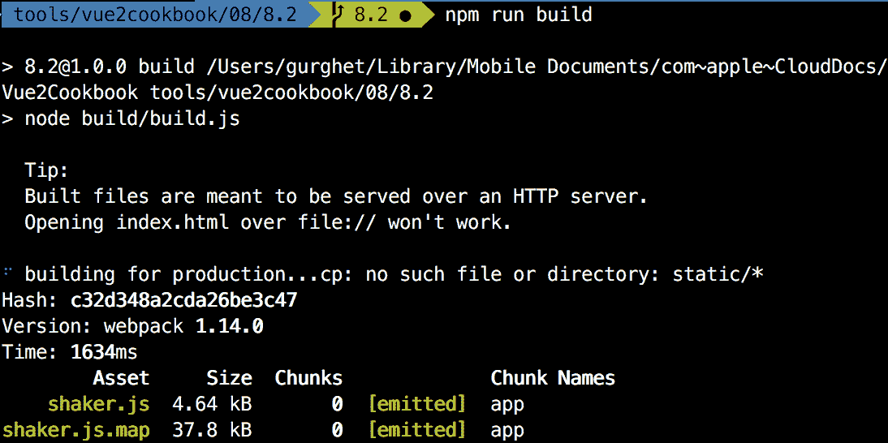
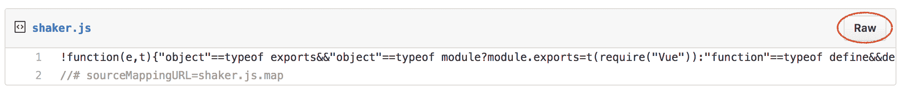
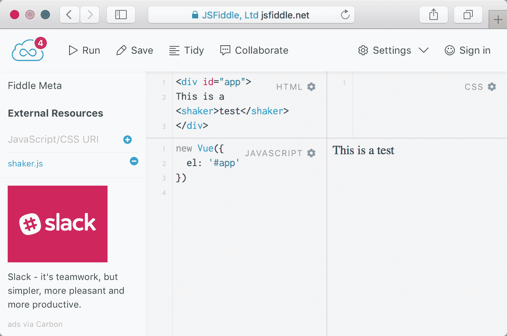
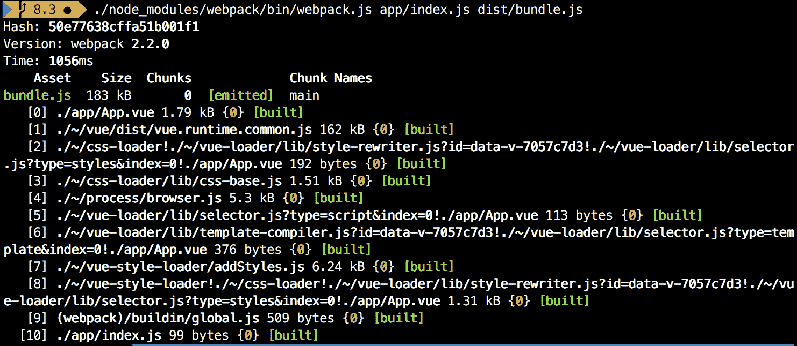
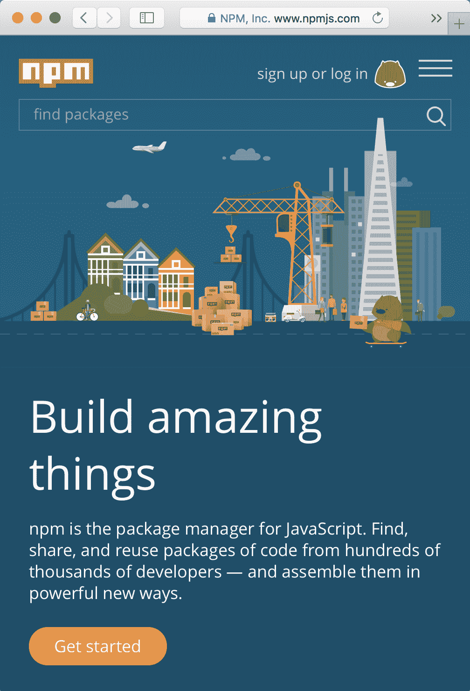
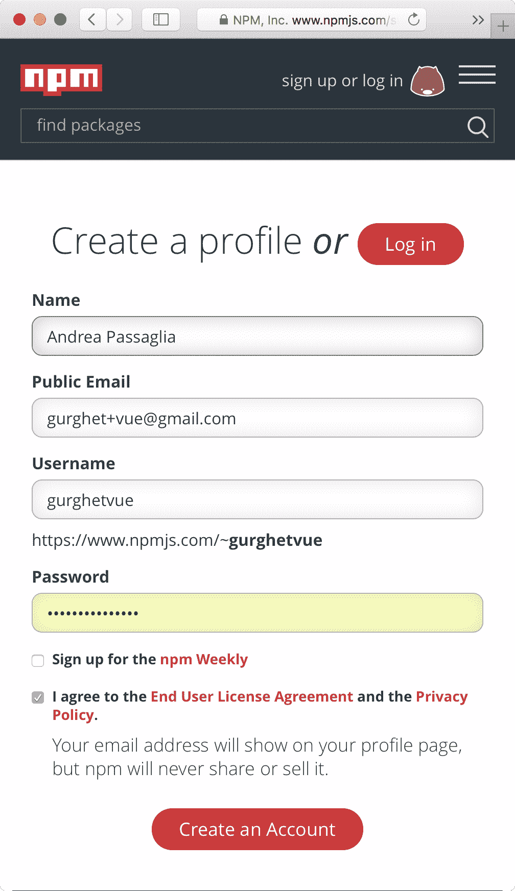

# 组织+自动化+部署=网页包

在本章中，我们将讨论以下主题：

*   从组件中提取逻辑以保持代码整洁
*   将组件与 Webpack 绑定
*   使用 Webpack 组织依赖项
*   在 Web 包项目中使用外部组件
*   热重加载连续反馈开发
*   使用 Babel 从 ES6 编译
*   在开发时运行代码过滤器
*   仅使用一个命令来构建缩小的和 development.js 文件
*   向公众发布您的组件

# 介绍

Webpack 加上 npm 是一个非常强大的工具。本质上，它只是一个 bundler，它将一些文件及其依赖项打包成一个或多个可消费文件。它现在是第二个版本，比以前代表了更多，特别是对于 Vue 开发人员。

Webpack 将使您能够方便地编写隔离在单个文件中的组件，并可根据命令进行交付。它将使您能够使用不同的 JavaScript 标准，如 ES6，但也可以使用其他语言，这一切都要归功于**加载程序**，这一概念将在下面的食谱中重现。

# 从组件中提取逻辑以保持代码整洁

Vue 组件有时会变得非常复杂。在这些情况下，最好将它们分开，并尝试用抽象来隐藏一些复杂性。放置这种复杂性的最佳位置是外部 JavaScript 文件。通过这种方式，您还有一个额外的好处，即在必要时，更容易与其他组件共享提取的逻辑。

# 准备

这个食谱是中级的。在来到这里之前，你知道如何与 npm 建立一个项目。

另外，确保使用以下命令全局安装了`vue-cli`包：

```js
npm install -g vue-cli
```

# 怎么做。。。

我们将建立一个复利计算器；你会发现在最初的投资之后你会有多少钱。

# 创建一个干净的网页包项目

使用以下命令创建一个新目录，并在其中创建一个新的`Vue`项目：

```js
vue init webpack
```

您可以为所问问题选择默认值。

运行`npm install`安装所有必需的依赖项。

然后，导航到目录结构中的`src/App.vue`并删除文件中的几乎所有内容。

最终结果如下：

```js
<template>
  <div id="app">
  </div>
</template>

<script>
export default {
  name: 'app'
}
</script>

<style>
</style>
```

I've already done this for you, and, you can use another template with the following command instead:
`vue init gurghet/webpack`

# 构建复利计算器

要构建复利计算器，您需要三个字段：初始资本或本金、年利率和投资长度。然后，您将添加一个输出字段以显示最终结果。以下是相应的 HTML 代码：

```js
<div id="app">
  <div>
    <label>principal capital</label>
    <input v-model.number="principal">
  </div>
  <div>
    <label>Yearly interestRate</label>
    <input v-model.number="interestRate">
  </div>
  <div>
    <label>Investment length (timeYears)</label>
    <input v-model.number="timeYears">
  </div>
  <div>
    You will gain:
    <output>{{final}}</output>
  </div>
</div>
```

我们放入`.number`修饰符，否则我们放入的数字将被 JavaScript 转换为字符串。

在 JavaScript 部分，通过编写以下代码声明三个模型变量：

```js
export default {
  name: 'app',
  data () {
    return {
      principal: 0,
      interestRate: 0,
      timeYears: 0
    }
  }
}
```

要计算复利，我们采用其数学公式：


在 JavaScript 中，可以按如下方式编写：

```js
P * Math.pow((1 + r), t)
```

您必须将其作为计算属性添加到`Vue`组件中，如图所示：

```js
computed: {
  final () {
    const P = this.principal
    const r = this.interestRate
    const t = this.timeYears
    return P * Math.pow((1 + r), t)
  }
}
```

您可以使用以下命令（从目录启动）运行应用程序：

```js
npm run dev
```

现在，我们的应用程序工作了，您可以看到我们将 0.93 美元存入一个利率为 2.25%的银行账户并休眠 1000 年（43 亿美元！），将获得多少收益：


代码中的公式现在并不麻烦。但是，如果我们有另一个组件也做同样的计算呢？我们还想更明确地说，我们计算的是复利，实际上我们并不关心公式在这个范围内的作用。

在`src`文件夹中新建一个名为`compoundInterest.js`的文件；在其中编写以下代码：

```js
export default function (Principal, yearlyRate, years) {
  const P = Principal
  const r = yearlyRate
  const t = years
  return P * Math.pow((1 + r), t)
}
```

然后我们相应地修改了`App.vue`中的代码：

```js
computed: {
  final () {
    return compoundInterest(
 this.principal,
 this.interestRate,
 this.timeYears
 )
  }
}
```

另外，请记住导入我们刚刚在 JavaScript 部分顶部创建的文件：

```js
<script>
 import compoundInterest from './compoundInterest'
  export default {
  ...
```

# 它是如何工作的。。。

在组件中工作或一般编程时，最好将代码范围缩小到一个抽象层。当我们编写一个返回最终资本值的计算函数时，我们应该只考虑调用正确的函数——为我们的目的进行正确计算的函数。公式的内部在较低的抽象层上，我们不想处理这个问题。

我们所做的是，我们把所有计算的细节都放在一个单独的文件中。然后，我们使用以下行从文件中导出函数：

```js
export default function (Principal, yearlyRate, years) {
...
```

当我们从`Vue`组件导入文件时，默认情况下该功能可用：

```js
import compoundInterest from './compoundInterest'
...
```

现在，`compoundInterest`是我们在另一个文件中定义的函数。此外，这种关注点分离允许我们使用此函数计算代码中任何地方的复利，甚至在其他文件中（可能还有其他项目）。

# 将组件与 Webpack 绑定

Webpack 允许您在缩小的 JavaScript 文件中打包项目。然后，您可以分发这些文件或自己使用它们。当您使用`vue-cli`附带的内置模板时，Webpack 被配置为使用它构建一个完整的工作应用程序。有时，我们希望构建一个库以在另一个项目中发布或使用。在此配方中，您将调整 Webpack 模板的默认配置以释放组件。

# 准备

只有在您安装了 npm 并熟悉了`vue-cli`和网页模板后，此配方才对您有意义。

# 怎么做。。。

对于这个配方，您将构建一个可重用的组件，它可以动摇您放入其中的任何东西；为此，我们将使用优秀的 CSShake 库。

基于 Webpack 模板创建新的 clean 项目。你可以看看前面的配方，看看如何做到这一点，或者你可以使用我制作的预构建模板。您可以通过创建新目录并运行以下命令来使用我的模板：

```js
vue init gurghet/webpack
```

如果您不知道默认答案的意思，请选择默认答案。记住运行`npm install`以引入依赖项。

让我们首先重命名两件事：将`App.vue`文件重命名为`Shaker.vue`。

在其中，编写以下内容作为 HTML 模板：

```js
<template>
  <span id="shaker" class="shake">
    <link rel="stylesheet" type="text/css" href="https://csshake.surge.sh/csshake.min.css">
    <slot></slot>
  </span>
</template>
```

请注意，我们是如何相对于原始模板将`<div>`更改为`<span>`。这是因为我们希望我们的震动器是一个内联组件。

组件是完整的，因为它是；我们只需要在 JavaScript 部分进行一次小的修饰性编辑：

```js
<script>
  export default {
    name: 'shaker'
  }
</script>
```

要手动测试我们的应用程序，我们可以通过以下方式修改`main.js`文件（突出显示的文本是修改后的代码）：

```js
// The Vue build version to load with the `import` command
// (runtime-only or standalone) has been set in webpack.base.conf with an alias.
import Vue from 'vue'
import Shaker from './Shaker'

/* eslint-disable no-new */
new Vue({
  el: '#app',
 template: `
    <div>
      This is a <Shaker>test</Shaker>
    </div>
  `,  components: { Shaker }
})
```

这将创建一个示例页面，如下面的屏幕截图所示，在该页面中，我们可以通过热重新加载来原型化我们的组件。通过运行以下命令启动它：

```js
npm run dev
```


将光标放在单词`test`上会使其抖动。

现在，我们想把这个组件打包成一个 JavaScript 文件，将来可以重用。

默认模板中没有此配置，但添加一个配置非常简单。

首先，你要在文件夹中做一些`build`的锤击。

让我们去掉一些发布库时不需要的插件；在文件中找到`plugins`数组。它是一个数组，包含以下代码形式的插件：

```js
plugins: [
  new Plugin1(...),
  new Plugin2(...),
  ...
  new PluginN(...)
]
```

我们只需要以下插件：

*   `webpack.DefinePlugin`
*   `webpack.optimize.UglifyJsPlugin`
*   `webpack.optimize.OccurrenceOrderPlugin`

摆脱所有其他插件，因为我们不需要它们；最后一个数组应该如下所示：

```js
plugins: [
  new webpack.DefinePlugin({
    'process.env': env
  }),
  new webpack.optimize.UglifyJsPlugin({
    compress: {
      warnings: false
    }
  }),
  new webpack.optimize.OccurrenceOrderPlugin()
]
```

第一个插件允许您添加更多配置，第二个插件缩小文件，第三个插件将优化结果文件的大小。

我们需要编辑的另一个属性是`output`，因为我们希望简化输出路径。

原始属性如下所示：

```js
output: {
  path: config.build.assetsRoot,
  filename: utils.assetsPath('js/[name].[chunkhash].js'),
  chunkFilename: utils.assetsPath('js/[id].[chunkhash].js')
}
```

它最初做的是在一个`js`目录中创建一系列输出文件。方括号中有变量；我们不需要它们，因为我们的应用程序只有一个独立的模块，我们称之为*shaker*。我们需要获得以下代码：

```js
output: {
  path: config.build.assetsRoot,
 filename: utils.assetsPath('shaker.js') }
```

因为，正如刚才所说，您希望组件是自包含的，所以我们需要更多的修改，这也将取决于您的需要。

如果您希望组件内置任何 CSS 样式（在我们的案例中，由于我们使用的是外部 CSS 库，因此没有），您应该禁用`ExtractTextPlugin`；我们已经从列表中删除了插件，但是其他一些文件仍在使用它。在`vue-loader.conf.js`文件中找到`extract`选项（在某些版本中，同一文件的`vue`部分），并将其替换为以下代码：

```js
... {
  loaders: utils.cssLoaders({
    ...
    extract: false
  })
}
```

我们的组件通常包含 Vue 库；如果要在 Vue 项目中使用该组件，则不需要它，因为它是重复的代码。您可以告诉 Webpack 仅在外部搜索依赖项，而不包括它们。在`plugins`之前刚修改的`webpack.prod.js`文件中添加以下属性：

```js
externals: {
  'vue': 'Vue'
}
```

这将告诉 Webpack 不要将 Vue 库写入捆绑包，而只需获取一个名为`Vue`的全局函数，并在代码中导入`vue`依赖项的任何地方使用它。网页包配置基本完成；我们只需要在`module`属性之前添加另一个属性：

```js
var webpackConfig = merge(baseWebpackConfig, {
  entry: {
 app: './src/dist.js'
 },
  module: {
  ...
```

这将从`dist.js`文件开始编译读取代码。等等，这个文件还不存在。让我们创建它并在其中添加以下代码：

```js
import Vue from 'vue'
import Shaker from './Shaker'
Vue.component('shaker', Shaker)
```

在最终的 JavaScript 缩小文件中，Vue 依赖项将从外部获取，然后我们全局注册组件。

作为最后一个更改，我建议修改保存缩小文件的文件夹。在`config/index.js`文件中，编辑以下行：

```js
assetsSubDirectory: 'static',
```

用以下代码替换前一行：

```js
assetsSubDirectory: '.',
```

现在运行命令以使用 npm 构建缩小的文件：

```js
npm run build
```

您将看到如下输出：


为了测试我们的文件，我们可以使用 JSFIDLE

复制您在`dist/shaker.js`中创建的文件内容，然后转到[https://gist.github.com/](https://gist.github.com/) （您可能需要注册）并将文件内容粘贴到文本区域内。命名为`shaker.js`：


由于文本是单行，因此启用“无换行”选项时，您将看不到太多内容。单击 CreatePublicGist，当您看到下一页时，单击 Raw，如以下屏幕截图所示：



复制地址栏中的 URL 并转到[http://rawgit.com/](http://rawgit.com/) ，您可以在此处粘贴链接：


单击并复制右侧的链接。祝贺您，您刚刚在 Web 上发布了您的组件！

现在转到 JSFIDLE 并选择 Vue 作为库。现在，您可以添加在左侧复制的链接，并且您的组件可以使用：



# 它是如何工作的。。。

官方模板中的网页包配置相当复杂。另一方面，不要试图马上理解每件事，否则你会陷入困境，学不到多少东西。

我们创建了一个**UMD**（**通用模块定义**模块），该模块将尝试查看是否存在可用的 Vue 依赖项，并将自身作为组件安装。

您甚至可以将 CSS 和样式添加到您的组件中，按照我们配置 Webpack 的方式，这些样式仍将随组件一起提供。

# 还有更多。。。

在本章的*向公众发布组件*配方中，您将学习如何在 npm 发布注册表中发布组件。我们将使用与此不同的方法，但您会发现其中缺少将其发布到注册表的步骤。

# 使用 Webpack 组织依赖项

Webpack 是一个用于组织代码和依赖项的工具。此外，它还提供了一种使用 JavaScript 文件开发和构建的方法，这些文件嵌入了我们传递给它们的所有依赖项和模块。我们将在本配方中使用它来构建一个小型 Vue 应用程序，并将所有内容捆绑在一个文件中。

# 准备

除了使用 npm 和一些命令行知识外，这个配方不需要任何特殊技能。您可以在本章的*使用 Webpack*配方组织依赖项中找到更多信息。

# 怎么做。。。

为您的配方创建一个新文件夹，并创建一个包含以下内容的`package.json`文件：

```js
{
 "name": "recipe",
 "version": "1.0.0"
}
```

这在我们的文件夹中定义了一个 npm 项目。当然，如果您知道自己在做什么，可以使用`npm init`或`yarn init`。

我们将为此配方安装 Webpack2。要将其添加到项目依赖项，请运行以下命令：

```js
npm install --save-dev webpack@2
```

`--save-dev`选项意味着我们不会在最终产品中发布 Webpack 的代码，但我们将仅用于开发目的。

创建一个新的`app`目录，并在其中创建一个`App.vue`文件。

该文件将是一个简单的`Vue`组件；它可以简单地如下所示：

```js
<template>
  <div>
    {{msg}}
  </div>
</template>
<script>
export default {
  name: 'app',
  data () {
    return {
      msg: 'Hello world'
    }
  }
}
</script>
<style>
</style>
```

我们需要告诉 Webpack 如何将`.vue`文件转换为`.js`文件。为此，我们在根文件夹中创建了一个名为`webpack.config.js`的配置文件；此文件将由 Webpack 自动拾取。在该文件中，按如下方式编写：

```js
module.exports = {
  module: {
    rules: [
      {test: /.vue$/, use: 'vue-loader'}
    ]
  }
}
```

规则中的行表示以下内容：

<q>嘿，Webpack，当你看到一个以`.vue`结尾的文件时，使用`vue-loader`将其转换为 JavaScript 文件。</q>

我们需要使用以下命令使用 npm 安装这样的加载程序：

```js
npm install --save-dev vue-loader
```

此加载程序在内部使用不会自动安装的其他依赖项；我们需要通过运行以下命令手动执行此操作：

```js
npm install --save-dev vue-template-compiler css-loader
```

我们也借此机会安装 Vue 本身：

```js
npm install --save vue
```

现在我们的`Vue`组件准备好了。我们需要写一个页面来放置它并尝试它。在`app`文件夹中创建一个名为`index.js`的文件。我们将在 Vue 实例中实例化该组件。在`index.js`内，写下以下内容：

```js
import Vue from 'vue'
import App from './App.vue'
new Vue({
  el: '#app',
  render: h => h(App)
})
```

这将把 Vue 实例装入带有`id="app"`的元素中，它将包含一个组件——我们的`App.vue`。

我们还需要一个文件——一个 HTML 文件。在根目录中，使用以下代码创建`index.html`：

```js
<!DOCTYPE html>
<html>
  <head>
    <title>Webpack 2 demo</title>
  </head>
  <body>
    <div id="app"></div>
    <script src="dist/bundle.js"></script>
  </body>
</html>
```

我们不想在这里直接提到`app/index.js`；这是因为`index.js`本身包含的内容不多。它有一个浏览器无法识别的`import`语句。相反，Webpack 可以轻松创建内部带有`index.js`的`dist/bundle.js`及其所有依赖项。要执行此操作，请运行以下命令：

```js
./node_modules/webpack/bin/webpack.js app/index.js dist/bundle.js
```

这将生成类似以下内容的输出：



您现在可以打开`index.html`，您将看到组件正在工作。

然而，每次启动这个长命令并不是那么有趣。Webpack 和 npm 可以做得更好。

在`webpack.config.js`中，添加以下属性：

```js
module.exports = {
  entry: './app/index.js',
 output: {
 filename: 'bundle.js',
 path: __dirname + '/dist'
 },
  module: {
  ...
```

这将指定 Webpack 的入口点以及保存结果文件的位置。

我们还可以在`package.json`中添加脚本：

```js
"scripts": {
  "build": "webpack"
}
```

现在，启动`npm run build`将具有与我们使用的长命令相同的效果。

# 它是如何工作的。。。

在这个方法中，我们基本上创建了一个 JavaScript 文件（`bundle.js`，其中同时包含 Vue 和我们编写的组件。在`index.html`中没有 Vue 的痕迹，因为它嵌入在`bundle.js`中。

当我们有很多依赖项时，这种工作方式要好得多。我们不再需要在页面的头部或正文中添加很多标签。此外，我们不必害怕加载我们不需要的依赖项。

作为额外的好处，Webpack 具有强大的功能和灵活性，可以缩小最终文件和其他高级优化，而手动加载依赖项是不可能的。

# 在 Web 包项目中使用外部组件

在您自己的项目中使用外部 Vue 组件通常很简单。不过有时候事情并不是那么简单。特别是，官方模板的 Webpack 中有一些配置（奇怪的）实际上阻止您使用某些外部组件。在这个配方中，我们将从 Bulma 项目安装一个模态对话框组件。

# 准备

在这个配方中，我们将调整网页包的配置。建议在执行此任务之前，已完成用 Webpack 方法组织依赖项的*步骤。*

# 怎么做。。。

我们将从一个新的网页项目开始。您可以使用`vue-cli`和官方网页模板创建一个新的。然而，我的建议是，从我的网页模板开始，这是一个全新的模板。要执行此操作，请在新目录中运行以下命令：

```js
vue init gurghet/webpack
```

我们将安装`vue-bulma-modal`，这是一个用 Vue 编写的、带有 Bulma CSS 框架的组件：

```js
npm install --save vue-bulma-modal bulma
```

在前面的命令中，我们也安装了`bulma`，它包含实际的 CSS 样式。

要使这些样式真正起作用，我们需要将它们转换为网页的 JavaScript；这意味着我们需要安装两台装载机：

```js
npm install --save-dev node-sass sass-loader
```

SASS 加载程序已配置，因此无需触摸任何东西。不过，我们将接触到的是与 Babel loader 相关的网页包配置（在*开发中了解更多信息，并通过热重新加载*配方持续反馈）。

在官方模板中（但这可能会改变，请注意），有一行代码阻止 Webpack 编译依赖项。前往`build/webpack.base.conf.js`并找到该街区：

```js
{
  test: /.js$/,
  loader: 'babel-loader',
  include: [
    path.join(projectRoot, 'src')
  ],
 exclude: /node_modules/
},
```

Depending on the version of Webpack you are using, you may need to slightly tweak the loader syntax. In older versions of Webpack, for example, you would write `babel` instead of `babel-loader`.

您必须删除突出显示的行，并编写以下内容：

```js
{
  test: /.js$/,
  loader: 'babel-loader',
  include: [
    path.join(projectRoot, 'src'),
 path.join(projectRoot, 'node_modules/vue-bulma-modal')
  ]
},
```

这是告诉 Webpack 编译我们刚刚安装的组件`babel-loader`。

现在，在`App.vue`中编写以下 HTML 布局：

```js
<template>
  <div id="app">
    <card-modal
      @ok="accept"
      ok-text="Accept"
      :visible="popup"
      @cancel="cancel"
    >
      <div class="content">
        <h1>Contract</h1>
          <p>
            I hereby declare I have learned how to
            install third party components in my
            own Vue project.
          </p>
        </div>
      </card-modal>
    <p v-if="signed">It appears you signed!</p>
  </div>
</template>
```

然后，您可以在 JavaScript 中编写逻辑，如图所示：

```js
<script>
import { CardModal } from 'vue-bulma-modal'
export default {
  name: 'app',
  components: { CardModal },
  data () {
    return {
      signed: false,
      popup: true
    }
  },
  methods: {
    accept () {
      this.popup = false
      this.signed = true
    },
    cancel () {
      this.popup = false
    }
  }
}
</script>
```

要实际使用 Bulma 样式，我们需要启动 SASS 加载程序并导入`bulma`文件。添加以下行：

```js
<style lang="sass">
@import '~bulma';
</style>
```

注意我们是如何在第一行中指定样式的语言的（我们正在编写 SCS，但在本例中我们按原样编写）。

如果您现在在对话框中尝试运行其所有模式命令，请执行以下操作：


# 它是如何工作的。。。

官方网页包模板包含从不编译`node_modules`目录内文件的配置规则。这意味着鼓励 web 组件的作者分发已编译的文件，因为否则，用户将在其项目中导入原始 JavaScript 文件（因为 Webpack 不会编译这些文件），从而在浏览器中导致各种错误。就我个人而言，我认为这不是一个好的工程。此设置的一个问题是，由于您在项目中导入的文件是针对一个版本的 Vue 编译的，因此如果您使用较新版本的 Vue，该组件可能无法工作（这实际上是在过去发生的）。

更好的方法是导入原始文件和组件，并让 Webpack 在单个文件中编译它们。不幸的是，大多数可用的组件都是分布式的，并且已经编译好了，因此，尽管在官方模板下可以很快地导入它们，但您更可能遇到兼容性问题。

导入外部组件时，首先要检查它们的`package.json`文件。让我们看看`vue-bulma-modal`包在这个文件中包含了什么：

```js
{
  "name": "vue-bulma-modal",
  "version": "1.0.1",
  "description": "Modal component for Vue Bulma",
 "main": "src/index.js",  "peerDependencies": {
    "bulma": ">=0.2",
    "vue": ">=2"
  },
  ...
  "author": "Fangdun Cai <cfddream@gmail.com>",
  "license": "MIT"
}
```

`main`属性引用的文件是我们在 JavaScript 中编写以下行时导入的文件：

```js
import { CardModal } from 'vue-bulma-modal'
```

`src/index.js`文件依次包含以下代码：

```js
import Modal from './Modal'
import BaseModal from './BaseModal'
import CardModal from './CardModal'
import ImageModal from './ImageModal'

export {
  Modal,
  BaseModal,
  CardModal,
  ImageModal
}
```

这不是一个编译文件；它是原始的 ES6，我们知道它，因为`import`不是在常规 JavaScript 中定义的。这就是为什么我们需要网页来为我们编译这个。

另一方面，考虑如下：

```js
<style lang="sass">
@import '~bulma';
</style>
```

使用波浪符号（`~`，我们告诉 Webpack 解析样式，就像它是一个模块一样，因此，我们真正导入的是`bulma`包的`package.json`中的 main 引用的文件，如果我们检查，它如下所示：

```js
{
  "name": "bulma",
  "version": "0.3.1",
  ...
 "main": "bulma.sass",
  ...
}
```

由于我们使用 SASS 语法导入 SASS，因此需要在 Vue 组件中指定我们正在使用的`lang="sass"`。

# 热重加载连续反馈开发

热重新加载是一项非常有用的技术，它允许您在浏览器中查看结果的同时进行开发，而无需刷新页面。这是一个非常紧密的循环，可以真正加快您的开发过程。在官方网页包模板中，默认情况下会安装热重新加载。在本食谱中，您将学习如何自行安装。

# 准备

在尝试这个食谱之前，你至少应该对网页包的工作原理有一个模糊的概念；本章中的*使用 Webpack*方法组织您的依赖关系将涵盖您。

# 怎么做。。。

使用`npm init -y`或`yarn init -y`在新目录中创建新的 npm 项目。我个人更喜欢第二个，因为生成的`package.json`更紧凑。

To install Yarn, you can use the `npm install -g yarn` command. The main benefit of Yarn is that you will be able to lock your dependencies to a known version. This prevents bugs when working in teams and the application gets cloned from Git with slightly different versions that introduce incompatibilities.

您将创建一个数字发誓罐。对于你所说的每一个脏话，你都会为一个长期目标向一个脏话罐捐赠一笔钱。

创建一个名为`SwearJar.vue`的新文件，并在其中添加以下代码：

```js
<template>
  <div>
    Swears: {{counter}} $$
    <button @click="addSwear">+</button>
  </div>
</template>
<script>
export default {
  name: 'swear-jar',
  data () {
    return {
      counter: 0
    }
  },
  methods: {
    addSwear () {
      this.counter++
    }
  }
}
</script>
```

您将在网页上插入此组件。

在同一目录下创建一个名为`index.html`的文件，并编写以下代码：

```js
<!DOCTYPE html>
<html>
  <head>
    <title>Swear Jar Page</title>
  </head>
  <body>
    <div id="app"></div>
    <script src="bundle.js"></script>
  </body>
</html>
```

`bundle.js`文件将由 Webpack 为我们创建（内存中）。

您需要的最后一个应用程序文件是包含我们的 Vue 根实例的 JavaScript 文件。在同一目录下创建并命名为`index.js`；将以下内容放入其中：

```js
import Vue from 'vue'
import SwearJar from './SwearJar.vue'
new Vue({
  el: '#app',
  render: h => h(SwearJar)
})
```

现在您需要创建一个文件`webpack.config.js`，告诉 Webpack 一些事情。第一件事是我们的应用程序（`index.js`的入口点）以及我们希望将编译后的文件放在哪里：

```js
module.exports = {
  entry: './index.js',
  output: {
    path: 'dist',
    filename: 'bundle.js'
  }
}
```

接下来，我们将告诉 Webpack 使用`vue-loader`将`.vue`文件转换为 JavaScript：

```js
module.exports = {
  entry: './index.js',
  output: {
    path: 'dist',
    filename: 'bundle.js'
  },
  module: {
 rules: [
 {
 test: /.vue$/,
 use: 'vue-loader'
 }
 ]
 }
}
```

要使一切正常工作，我们仍然需要安装代码中隐含的依赖项。我们可以使用以下两个命令安装它们：

```js
npm install --save vue
npm install --save-dev vue-loader vue-template-compiler webpack webpack-dev-server
```

特别是最后一个--`webpack-dev-server`--是一个开发服务器，它将帮助我们通过热重新加载进行开发。

运行以下命令以启动服务器：

```js
./node_modules/webpack-dev-server/bin/webpack-dev-server.js --output-path / --inline --hot --open
```

实际上，让我们把这个命令放在 npm 脚本中。

打开`package.json`并添加以下行：

```js
"scripts": {
  "dev": "webpack-dev-server --output-path / --inline --hot --open"
}
```

我们现在可以运行`npm run dev`，我们将得到相同的结果——将弹出一个浏览器——如以下屏幕截图所示：


点击加号按钮会使计数器上升，但是这个应用程序的风格呢？让我们让它更吸引人。

并排打开代码编辑器和窗口，对`SwearJar.vue`进行如下修改：

```js
<template>
  <div>
    <p>Swears: {{counter}} $$</p>
    <button @click="addSwear">Add Swear</button>
  </div>
</template>
```

保存该文件，您将看到页面本身正在更新。更好的是，如果计数器已设置为零以上，则状态将保留，这意味着如果您有一个复杂的组件，则不必在每次修改后手动将其重新设置为相同的状态。尝试将宣誓计数设置为某个数字并编辑模板。大多数情况下，计数器不会重置为零。

# 它是如何工作的。。。

WebpackDev 服务器是一个非常有用的软件，它可以让您通过非常紧密的反馈循环进行开发。我们使用了大量参数使其运行：

```js
webpack-dev-server --output-path / --inline --hot --open
```

所有这些参数在`webpack.config.js`中都是相同的。相反，为了方便起见，我们将这些参数放在命令行中。`--output-path`是网页包服务器提供`bundle.js`服务的地方；在我们的例子中，我们说我们希望它在根路径上服务，因此它将有效地将`/bundle.js`路径绑定到实际的`bundle.js`文件。

第二个参数`--inline`将在我们的浏览器中注入一些 JavaScript 代码，以便我们的应用程序可以与 Webpack dev 服务器通信。

`--hot`参数将激活热模块更换插件，该插件将与`vue-loader`（实际上是与`vue-hot-reload-api`（位于其内部）通信，并将重新启动或重新启动（保留状态）页面内的每个 Vue 模型。

最后，`--open`为我们打开默认浏览器。

# 使用 Babel 从 ES6 编译

ES6 有很多有用的特性，在本教程中，您将了解如何在项目中使用它。值得注意的是，ES6 目前有非常好的浏览器支持。在野外，80%的浏览器都不会出现兼容性问题，但您可能需要联系仍在使用 Internet Explorer 11 的用户，这取决于您的用户群，或者您可能只是想最大限度地扩大用户群。此外，一些用于开发和 Node.js 的工具仍然不完全支持 ES6，甚至认为 Babel 对于开发也是必要的。

# 准备

在这个配方中，我们将使用 npm 和命令行

# 怎么做。。。

使用空 npm 项目创建新目录。您可以使用`npm init -y`命令，或者，如果您安装了 Thread，您可以在目录中使用`yarn init -y`。此命令将在目录中创建一个新的`package.json`。（参考*开发中的注释，在纱线上使用热重新加载*配方进行持续反馈。）

对于这个 npm 项目，除了 Vue:Webpack 和 Babel 之外，我们还需要一些依赖项，它们的形式是 Webpack 的加载程序。哦，是的，我们还需要`vue-loader`作为网页包。要安装它们，请启动以下两个命令：

```js
npm install --save vue
npm install --save-dev webpack babel-core babel-loader babel-preset-es2015 vue-loader vue-template-compiler
```

在同一个目录中，让我们编写一个使用 ES6 语法的组件；我们称之为`myComp.vue`：

```js
<template>
  <div>Hello</div>
</template>
<script>
var double = n => n * 2
export default {
  beforeCreate () {
    console.log([1,2,3].map(double))
  }
}
</script>
```

该组件除了将`[2,4,6]`数组打印到控制台外，没有做很多工作，但它使用以下行中的箭头语法来完成：

```js
var double = n => n * 2
```

有些浏览器和工具不理解这一点；我们需要用 Webpack 编译这个组件，但我们需要用 Babel 加载程序来完成。

创建一个新的`webpack.config.js`文件，并在其中写入以下内容：

```js
module.exports = {
  entry: 'babel-loader!vue-loader!./myComp.vue',
  output: {
    filename: 'bundle.js',
    path: 'dist'
  }
}
```

这将告诉 Webpack 从我们的`myComp.vue`文件开始编译，但在此之前，它将由`vue-loader`处理，将其转换为 js 文件，然后由`babel-loader`将箭头函数转换为更简单、更兼容的文件。

我们可以通过不同且更标准的配置实现相同的目标：

```js
module.exports = {
 entry: './myComp.vue',  output: {
    filename: 'bundle.js'
  },
  module: {
    rules: [
      {
        test: /.vue$/,
        use: 'vue-loader'
      },
      {
        test: /.js$/,
        use: 'babel-loader'
      }
    ]
  }
}
```

这是一个更一般的配置，它说每当我们遇到一个以`.vue`结尾的文件时，应该用`vue-loader`和`.js`文件以及`babel-loader`对其进行解析和处理。

要配置 Babel 加载程序，有两个选项；我们将遵循推荐的方法。在项目文件夹中创建一个名为`.babelrc`的文件（注意初始点），并指定要应用`es2015`预设，我们编写以下代码：

```js
{
  "presets": ["es2015"]
}
```

最后，我总是喜欢在`package.json`文件中添加一个新脚本，以使启动命令更容易。在文件末尾（但在最后一个大括号之前）添加以下行：

```js
"scripts": {
  "build": "webpack"
}
```

然后运行`npm run build`。这会在`dist`目录中创建一个名为`bundle.js`的文件；打开它并搜索包含例如`double`的行。您应该找到如下内容：

```js
...
var double = function double(n) {
  return n * 2;
};
...
```

这是我们的`var double = n => n * 2`，从 ES6 转换为*常规*JavaScript。

# 它是如何工作的。。。

`es2015`巴贝尔预设是巴贝尔插件的集合，旨在将 ECMAScript 2015（ES6）语法转换为更简单的 JavaScript。例如，它包含`babel-plugin-transform-es2015-arrow-functions`插件，正如您可能猜到的，它可以转换箭头函数：

```js
var addOne = n => n + 1
```

将箭头函数转换为更简单的 JavaScript，如下所示：

```js
var addOne = function addOne(n) {
  return n + 1
}
```

为了选择文件及其各自的加载程序，我们在`webpack.config.js`中填充了测试字段，为了匹配`.vue`文件，我们编写了以下内容：

```js
test: /\.vue$/
```

此语法是一个正则表达式，它总是以正斜杠开始，以另一个正斜杠结束。它匹配的第一个字符是点，表示为`\.`，因为`.`字符已用于其他目的。该点后面必须跟有`vue`字符串，字符串的结尾字符表示为美元符号。如果将它们放在一起，它将匹配以`.vue`结尾的所有字符串。`.js`文件也有类似的情况。

# 在开发时运行代码过滤器

对代码进行 Linting 可以极大地减少开发过程中积累的小错误和低效率，它保证了整个团队或组织的编码风格是一致的，并且使代码更具可读性。与其偶尔运行一次短绒，不如让它不断运行。这个食谱教你如何使用 Webpack。

# 准备

在这个食谱中，我们将再次使用 Webpack。您将与`webpack-dev-server`建立一个紧密的循环，这在*开发与热重新加载*配方的持续反馈中有介绍。

# 怎么做。。。

在新文件夹中，创建一个新的 npm 项目（您可以使用`npm init -y`或`yarn init -y`。

在文件夹中，创建一个名为`src`的新目录，并在其中放入一个名为`MyComp.vue`的文件。让文件包含以下代码：

```js
<template>
  <div>
    Hello {{name}}!
  </div>
</template>
<script>
export default {
  data () {
    return {
      name: 'John',
      name: 'Jane'
    }
  }
}
</script>
```

我们已经发现了一个问题，`John`name 属性将被后一个具有相同密钥的属性`Jane`覆盖。让我们假装我们没有注意到这一点，并将组件放在网页中。为此，我们需要另一个名为`index.js`的文件，位于`src`目录中。在其中编写以下代码：

```js
import Vue from 'vue'
import MyComp from './MyComp.vue'
new Vue({
  el: '#app',
  render: h => h(MyComp)
})
```

在根目录中，放置一个带有以下代码的`index.html`文件：

```js
<!DOCTYPE html>
<html>
  <head>
    <title>Hello</title>
  </head>
  <body>
    <div id="app"></div>
      <script src="bundle.js"></script>
    </body>
</html>
```

我们现在需要一个`webpack.config.js`文件来告诉 Webpack 如何编译我们的文件；在里面写下以下内容：

```js
module.exports = {
  entry: './src/index.js',
  module: {
    rules: [
      { 
        test: /.vue$/,
        use: 'vue-loader'
      }
    ]
  }
}
```

这只是告诉 Webpack 从`index.js`文件开始编译，并在找到`.vue`文件时，使用`vue-loader`将其转换为 JavaScript。除此之外，我们还希望用一根线扫描所有文件，以确保代码中没有犯愚蠢的错误。

将以下加载程序添加到`rules`数组中：

```js
{
  test: /.(vue|js)$/,
  use: 'eslint-loader',
  enforce: 'pre'
}
```

`enforce: 'pre'`属性将在其他加载程序之前运行此加载程序，因此它将应用于您编写的代码，而不是它的转换。

我们最不需要的是配置 ESLint。在根目录中创建一个名为`.eslintrc.js`的新文件，并在其中添加以下内容：

```js
module.exports = {
  "extends": "eslint:recommended",
  "parser": "babel-eslint",
  plugins: [
    'html'
  ]
}
```

我们在这里说了几件事。首先是我们希望应用于代码的一组规则；换句话说，我们的规则集（现在为空）正在扩展推荐的规则集。其次，我们使用的是`babel-eslint`解析器，而不是默认的解析器。最后，我们使用 HTMLESLint 插件，它将帮助我们处理`.vue`文件，并提取其中的 JavaScript 代码。
我们现在已经准备好启动我们的开发机制，但首先，我们需要使用以下命令安装依赖项：

```js
npm install --save vue
npm install --save-dev babel-eslint eslint eslint-loader eslint-plugin-html vue-loader vue-template-compiler webpack webpack-dev-server
```

我们可以直接启动 Webpack dev 服务器，但我强烈建议在`package.json`文件中添加以下代码：

```js
"scripts": {
  "dev": "webpack-dev-server --entry ./src/index.js --inline --hot --open"
}
```

现在，如果我们启动`npm run dev`，浏览器将打开，组件将错误地显示以下内容：

`<q>Hello Jane!</q>`

您还应该能够在控制台中看到问题：

`11:7  error  Duplicate key 'name'  no-dupe-keys`

这意味着我们有两个具有相同*名称*的键。通过删除属性来更正错误：

```js
data () {
  return {
    name: 'John'
  }
}
```

在控制台中，保存 Vue 组件后，应注意 Webpack 已再次执行编译，这次没有错误。

# 它是如何工作的。。。

基本上，这里发生的是 linter 加载程序在其他编译步骤之前处理文件，并在控制台中写入错误。这样，在不断开发的同时，您将能够看到代码中的缺陷。

Vue 官方模板中提供了 ESLint 和 Webpack。您现在知道，如果出于某种原因，您想要修改 ESLint 规则，您可以从`.eslintrc.js`文件中进行修改，如果您想要同时使用另一个 linter，您可以在 Webpack 配置文件中使用另一个加载程序。

# 仅使用一个命令来构建缩小的和 development.js 文件

在处理组件的发布时，您可能需要一个可靠的过程来发布生成的文件。一个常见的操作是发布一个库/组件的两个版本：一个用于开发，另一个用于生产代码，通常是小型化的。在此配方中，您将调整官方模板，以同时发布缩小的 JavaScript 文件和开发 JavaScript 文件。

# 准备

如果您已经在构建和分发自己的组件，那么这个方法是有意义的。如果您想了解更多，我建议您参考*将您的组件与 Webpack*配方捆绑。

# 怎么做…

我们将从一个带有官方网页模板的项目开始。您可以使用自己的，也可以使用`vue init webpack`启动一个新项目，并使用`npm isntall`安装依赖项。

进入`build`目录。当您启动`npm run build`命令时，您实际上正在启动此目录中的`build.js`文件。

如果检查该文件，您会在结尾处发现类似的内容：

```js
webpack(webpackConfig, function (err, stats) {
...
})
```

这相当于使用第一个参数`webpackConfig`中指定的相同配置从命令行启动 Webpack。要获得缩小和非缩小文件，我们必须将`webpackConfig`设置为一个共同点，然后我们将只指定文件的开发版本和生产版本之间的差异。

要执行此操作，请进入同一目录中的`webpack.prod.conf.js`。在这里，您可以看到我们正在传递的配置；特别是，您会发现`UglifyJsPlugin`，如果您查看插件阵列，它负责缩小文件。删除插件，因为它代表了两个发行版之间的主要区别。

现在，在 Webpack 命令前面的`build.js`中写入以下内容：

```js
const configs = [
  {
    plugins: [
      new webpack.optimize.UglifyJsPlugin({
        compress: {
          warnings: false
        },
        sourceMap: true
      })
    ]
  },
  {
    plugins: []
  }
]
```

现在您有了一个具有两种不同配置的阵列，一个带有缩小文件所需的插件，另一个没有插件。如果您将它们与`webpack.prod.conf.js`中的配置合并，您将获得不同的结果。

为了合并这两种配置，我们将使用`webpack-merge`包。将以下行添加到文件顶部：

```js
var merge = require('webpack-merge')
```

然后，将 Webpack 命令的第一行修改为以下内容：

```js
configs.map(c => webpack(merge(webpackConfig, c), function (err, stats) {
...
```

这将启动我们在 configs 阵列中指定的任意多个不同的合并配置

您现在可以启动`npm run build`命令，但问题是这些文件将具有相同的名称。从`webpack.prod.conf.js`中剪切输出属性，并将其粘贴到`config`数组中，现在应该是这样的：

```js
const configs = [
  {
    output: {
 path: <whatever is your path>,
 filename: 'myFilename.min.js'),
 <other options you may have>
 },
    plugins: [
      new webpack.optimize.UglifyJsPlugin({
        compress: {
          warnings: false
        }
      })
    ]
  },
  {
    output: {
 path: <whatever is your path>,
 filename: 'myFilename.js'),
 <other options you may have>
 },
    plugins: []
  }
]
```

如果您现在构建项目，您将同时拥有一个缩小的和一个开发文件。当然，您可以个性化地进行配置。例如，可以在其中一个中添加源贴图，而另一个保持不变。

# 它是如何工作的。。。

我们首先创建了一个表示 Web 包配置差异的对象数组。然后，在`webpack-merge`的帮助下，我们将每个配置映射到一个更大的通用配置中。当我们现在调用`npm run build`命令时，两个配置都会一个接一个地运行。

通常的惯例是在文件名后加上`min`以表示该文件已缩小，可以在生产中使用。

# 向公众发布您的组件

在某一时刻，你会想要回馈社区。也许你建立了一个“放屁按钮”，或者你建立了一个自动股票期权交易员；无论您构建了什么，JavaScript 和 Vue 社区都会很高兴欢迎您。在营销和许可方面有大量的工作要做，但在本食谱中，您将专注于更多的技术方面。

# 准备

此食谱针对那些希望与社区其他人分享他们在 Vue 中的工作的人。在*将组件与 Webpack*捆绑的配方中，您将发现如何调整官方 Webpack 模板以正确捆绑组件；这个食谱可以看作是第二部分。但我们不会使用官方模板。

# 怎么做。。。

我将采用*周纪尧姆*的优秀`vue-share-components`模板制作此配方。我们将从这个起点构建一个笑话按钮。

在命令行中，创建新目录并在其中键入以下命令：

```js
vue init Akryum/vue-share-components
```

它会问你一些问题；您可以从下图复制响应。唯一需要注意的是，你（遗憾地）不能在你的项目中使用`joke-button`名称，因为我在写这个配方时已经注册了它。但是，您可以找到一个类似的名称（在继续之前，您可能需要检查`npm`注册表中是否有该名称）：


创建项目后，可以使用`npm install`安装依赖项，就像在控制台输出中一样。

在项目内部，让我们创建笑话按钮组件。在`component`文件夹中，您会发现一个`Test.vue`组件；将其重命名为`JokeButton.vue`并使其看起来像以下代码：

```js
<template>
  <div class="test">
    <button @click="newJoke">New Joke</button>
    <p>{{joke}}</p>
  </div>
</template>
<script>
const jokes = [
 'Chuck Norris/'s keyboard has the Any key.',
 'Chuck Norris can win at solitaire with only 18 cards.',
 'Chuck Norris/' first job was as a paperboy. There were no survivors.',
 'When Chuck Norris break the build, you can/'t fix it.',
]
export default {
  name: 'joke-button',
  data () {
    return {
      joke: '...',
    }
  },
  methods: {
    newJoke () {
      this.joke = jokes[Math.floor(Math.random() * jokes.length)]
    },
  },
}
</script>
```

显然，您可以创建您喜欢的组件；这只是一个例子。

在`index.js`文件中，您将看到导入并安装的`Test`组件；您需要安装`JokeButton`来代替。需要更改的行将高亮显示：

```js
import JokeButton from './components/JokeButton.vue'
// Install the components
export function install (Vue) {
  Vue.component('jokeButton', JokeButton)
  /* -- Add more components here -- */
}
// Expose the components
export {
  JokeButton,
  /* -- Add more components here -- */
}
...
```

我们的组件准备好了！

现在你必须去 npm 网站注册一个帐户（如果你还没有）。

请访问[npmjs.com](https://www.npmjs.com/)：



单击“注册”并输入您的详细信息，就像我在此处所做的那样：



当然，如果您愿意，您可以订阅 npm 每周时事通讯。

注册完成后，您就可以返回命令行了。您必须使用以下命令从终端登录到 npm 注册表：

```js
npm adduser
```

您将看到如下内容：


您必须输入刚刚为 npm 网站输入的密码。

下一个命令将在公共存储库中发布您的库：

```js
npm publish
```

现在，您甚至可以查看您的软件包，果然，您会发现它如以下屏幕截图所示：


试一试，你可以在自己的`README`中找到说明，这有多酷？

# 它是如何工作的。。。

`vue-share-components`比官方模板简单，所以通过检查它是一种很好的学习方法。

我们首先要看的是`package.json`文件。以下几行是相关的：

```js
...
"main": "dist/joke-button.common.js",
"unpkg": "dist/joke-button.browser.js",
"module": "index.js",
"scripts": {
  "dev": "cross-env NODE_ENV=development webpack --config config/webpack.config.dev.js --progress --watch",
  "build": "npm run build:browser && npm run build:common",
  "build:browser": "cross-env NODE_ENV=production webpack --config config/webpack.config.browser.js --progress --hide-modules",
  "build:common": "cross-env NODE_ENV=production webpack --config config/webpack.config.common.js --progress --hide-modules",
  "prepublish": "npm run build"
},
...
```

`main`属性是我们在程序中编写以下命令时实际得到的：

```js
import JokeButton from 'JokeButton'
```

或者，当我们添加以下代码时，我们会得到它：

```js
var JokeButton = require("JokeButton")
```

因此，`JokeButton`变量实际上将包含在`joke-button.common.js`中导出的内容。

You can edit the main property of `package.json` to point directly to a `.vue` component. This way, you give the user the responsibility to compile the component. While this is more work for the user, it also helps when one wants the freedom to compile against the most recent version of Vue.
In the latter case, if you have some logic of your component exported in `external.js` files (like in the first recipe of this chapter), always remember to add the directory in the Webpack rules, like so:
`{`
`  test: /.js$/,`
`  loader: 'babel-loader',`
`  include: [resolve('src'), resolve('test'), resolve('node_modules/myComponent')]`
`},`

unpkg 是[unpkg.com](https://unpkg.com/#/)的特例，它是一个 CDN。这非常好，因为一旦我们发布我们的项目，我们将在[发布我们的脚本 https://unpkg.com/joke-button](https://unpkg.com/joke-button) ，它将指向适合浏览器的`joke-button.browser.js`文件。

`prepublish`脚本是一个特殊脚本，在使用`npm publish`命令将项目发布到 npm 之前将调用该脚本。这消除了您在发布组件之前忘记构建文件的可能性（这种情况在我身上发生过很多次，因此我被迫手动增加软件版本，手动构建文件，然后再次发布）。

另一个值得注意的有趣事实是输出`joke-button.common.js`文件的`webpack.config.common.js`和输出`joke-button.browser.js`文件的`webpack.config.browser.js`之间的差异。

第一个文件的输出设置如下：

```js
output: {
  path: './dist',
  filename: outputFile + '.common.js',
  libraryTarget: 'commonjs2',
},
target: 'node',
```

因此，它将输出一个将公开 commonJS 接口的库；这是为非浏览器环境定制的，您必须需要或导入此库才能使用它。另一方面，浏览器的第二个文件具有以下输出：

```js
output: {
  path: './dist',
  filename: outputFile + '.browser.js',
  library: globalName,
  libraryTarget: 'umd',
},
```

UMD 将在全局范围内公开自身，无需导入任何内容，因此它非常适合浏览器，因为我们可以将文件包含在 Vue 网页中，并自由使用该组件。由于`index.js`自动安装功能，这也是可能的：

```js
/* -- Plugin definition & Auto-install -- */
/* You shouldn't have to modify the code below */
// Plugin
const plugin = {
 /* eslint-disable no-undef */
 version: VERSION,
 install,
}
export default plugin
// Auto-install
let GlobalVue = null
if (typeof window !== 'undefined') {
 GlobalVue = window.Vue
} else if (typeof global !== 'undefined') {
 GlobalVue = global.Vue
}
if (GlobalVue) {
 GlobalVue.use(plugin)
}
```

此代码所做的是将 install 函数（向 Vue 注册组件）打包到`plugin`常量中，同时将其导出。然后，它检查是否定义了`window`或`global`，在这种情况下，它会获取表示 Vue 库的`Vue`变量，并使用插件 API 安装组件。