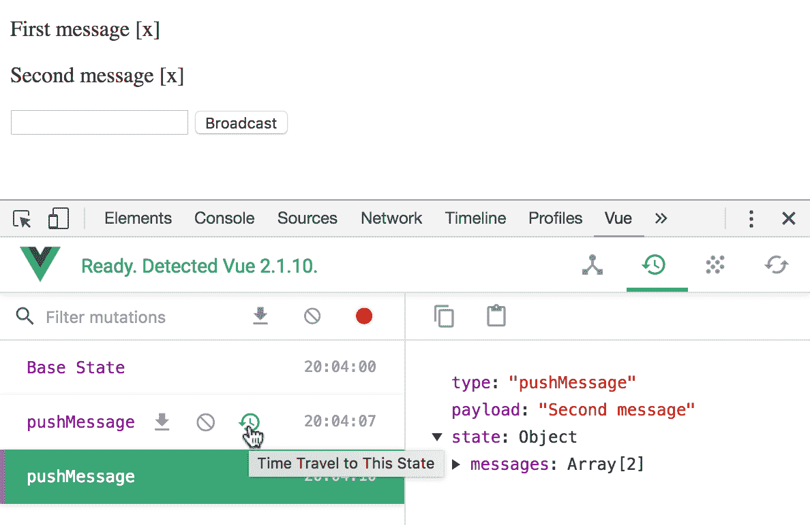
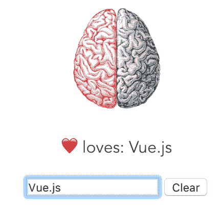

# 十八、使用 Vuex 的大型应用模式

在本章中，我们将介绍以下配方：

*   在 vue 路由中动态加载页面
*   为应用状态构建简单存储
*   理解 Vuex 突变
*   在 Vuex 中列出您的操作
*   用模块分离关注点
*   构建 getter 以帮助检索数据
*   测试你的商店

# 介绍

在本章中，您将了解 Vuex 的工作原理以及如何使用它来支持可扩展的应用。Vuex 实现了一种在前端框架中流行的模式，它包括划分不同的关注点以管理大型全局应用状态。突变是唯一可以改变状态的东西，所以你只有一个地方可以找到它。大部分逻辑以及所有异步逻辑都包含在操作中；最后，getter 和模块进一步有助于在计算派生状态和将代码拆分为不同文件时分散认知负载。

随着食谱，你会发现我发现在开发真正的大型应用时有用的智慧颗粒；一些与命名约定有关，另一些则与避免 bug 的小技巧有关。

如果你完成了所有的步骤，你就可以开发出 bug 少、协作无缝的大型前端应用了。

# 在 vue 路由中动态加载页面

很快，您将构建包含大量组件的大型 Vue 网站。加载大量 JavaScript 可能会产生浪费和无用的前期延迟。

# 准备

此配方需要了解 vue 路由。

# 怎么做。。。

通过创建一个新目录并运行以下命令，使用`vue-cli`创建一个新项目：

```js
vue init webpack
```

您可以根据自己的喜好回答问题，只要在被询问时将`vue-router`添加到模板中即可。

我们将创建两个组件：一个是我们的主页，它将小而轻，另一个组件将非常大，加载速度非常慢。我们想要实现的是立即加载主页，而不必等待浏览器下载巨大的组件。

打开`components`文件夹中的`Hello.vue`文件。删除所有内容，只保留以下内容：

```js
<template>
  <div>
    Lightweight hello
  </div>
</template>
```

在同一文件夹中，创建另一个名为`Massive.vue`的文件，并在其中写入以下内容：

```js
<template>
  <div>
   Massive hello
  </div>
</template>

<script>
/* eslint-disable no-unused-vars */
const a = `
```

在最后一行留下一个空勾，因为我们必须用大量无用的数据填充文件。保存并关闭`Massive.vue`。

在控制台中，转到存储文件的同一目录，并使用以下文件将大量垃圾放入其中：

```js
yes "XXX" | head -n $((10**6)) >> Massive.vue
```

此命令所做的是将`XXX`行重复 10<sup>6</sup>次附加到文件中；这将为文件增加 400 万字节，使其对于快速浏览体验来说过于庞大。

现在我们需要关闭我们打开的背面标记。现在不要尝试打开文件，因为您的文本编辑器可能无法打开如此大的文件；相反，请使用以下命令：

```js
echo '`</script>' >> Massive.vue
```

我们的`Massive`组件现已完成。

打开`router`文件夹内的`index.js`，添加组件及其路径：

```js
import Massive from '@/components/Massive'
...
export default new Router({
  routes: [
    {
      path: '/',
      name: 'Hello',
      component: Hello
    },
 {
 path: '/massive',
 name: 'Massive',
 component: Massive
 }
  ]
})
```

在使用`npm install`安装了所有依赖项之后，我们现在准备使用`npm run dev`命令启动我们的大型应用。

应用的加载速度相当快，但这是因为它直接从本地存储加载；要模拟更真实的场景，请打开“网络”选项卡上的“开发人员工具”，然后选择“网络节流”。选择一些较慢的方式，例如 GPRS 或可能是良好的 3G，我们大多数人可能都有：


现在右键点击刷新按钮，选择硬加载绕过缓存（或按*Shift*+*Cmd*+*R*：


您会注意到页面有几分钟没有加载。当页面变为 X 时，可以再次单击刷新按钮停止加载页面。

要解决此问题，请返回到`router`文件夹中的`index.js`文件。删除导入`Massive`组件的以下行：

```js
import Massive from '@/components/Massive'
```

前一行告诉 Webpack 在单个 js 包中包含`Massive`组件中包含的所有代码。相反，我们希望告诉 Webpack 将`Massive`组件作为一个单独的捆绑包保存，并仅在必要时加载它。
不直接导入组件，而是使用以下代码声明`Massive`：

```js
const Massive = resolve =>
 require(['../components/Massive.vue'], resolve)
```

Webpack 将把这个特殊的语法转换成一个单独的文件，该文件将被延迟加载。保存并进行另一次硬刷新，同时限制仍设置为慢速（如 GPRS 到良好的 3G）。几秒钟后，您应该能够看到 hello 页面。如果您想加载`Massive`组件，只需将`massive`添加到 URL，但您需要等待一段时间。

# 它是如何工作的。。。

现在，在一个实际的应用中，你显然不会有这么大的组件，但你可以很容易地看到，如果`Massive`组件代表你应用的所有其他组件，它们很快就会达到这么大的规模。

这里的技巧是异步加载它们；Webpack 将帮助您将它们分成更小的捆绑包，以便仅在需要时加载它们。

# 还有更多。。。

有一种替代语法可以延迟导入组件。它将来可能成为 ECMA 标准，因此您应该了解它。打开`router`目录中的`index.js`并完全删除`Massive`组件的导入或我们在此配方中添加的`Massive`常量行。
在路由内部，为`/massive`路由指定组件时，请尝试以下操作：

```js
routes: [
  {
    path: '/',
    name: 'Hello',
    component: Hello
  },
  { 
    path: '/massive',
    name: 'Massive',
 component: import('@/components/Massive')  }
]

```

这将相当于我们以前所做的，因为 Webpack 将采取行动，而不是直接导入大量组件的代码，它将创建一个不同的 js 文件，并延迟加载。

# 为应用状态构建简单存储

在本教程中，您将了解构建大型应用时 Vuex 的基本原理。这个配方有点不合常规，因为要了解 Vuex 的商店是如何工作的，我们将直接操作它；在实际应用中，您永远不应该这样做。

# 准备

在尝试此方法之前，您应该知道如何让组件与 Vuex 进行对话。

# 怎么做。。。

使用在新目录中运行的以下命令，基于 Web 包模板创建新项目：

```js
vue init webpack
```

你如何回答这个问题无关紧要。运行`npm intall`并使用`npm install vuex --save`或`yarn add vuex`安装 Vuex（如果您使用纱线）

打开`src`文件夹中的`main.js`文件，添加以下高亮显示的行以完成 Vuex 的安装：

```js
import Vue from 'vue'
import App from './App'
import router from './router'
import store from './store'

/* eslint-disable no-new */
new Vue({
 el: '#app',
 router,
 store,
 template: '<App/>',
 components: { App }
})
```

当然，现在没有`store`模块，所以您需要创建一个。为此，在`src`文件夹下创建一个文件夹，并将其命名为`store`。在其中，创建一个名为`index.js`的文件。在`main.js`文件中，我们没有指定使用`index.js`文件，但这是默认行为，当没有指定文件，只指定文件夹时。

我们将实施一个简化的股票市场。我们有三种资产：星星、灯和钻石。我们将定义两条路线：一条用于 STAR/LAMP 市场，另一条用于 LAMP/DIAM 市场。

在 store 文件夹的`index.js`文件中，写入以下内容：

```js
import Vue from 'vue'
import Vuex from 'vuex'
Vue.use(Vuex)
const store = new Vuex.Store({
  state: {
    STAR: 100,
    LAMP: 100,
    DIAM: 100,
    rate: {
      STAR: {
        LAMP: 2
      },
      LAMP: {
        DIAM: 0.5
      }
    }
  }
})
export default store
```

我们正在创建一个新的`Vuex`商店来保持我们的平衡。最初，我们拥有 100%的每项资产；在商店里，星星与灯具、灯具与钻石的汇率也是固定的。

在`components`目录下创建一个名为`Market.vue`的新组件。它将具有以下模板：

```js
<template>
  <div class="market">
    <h2>{{symbol1}}/{{symbol2}} Stock Exchange</h2>
    <div class="buy-sell">
      <input v-model.number="amount">{{symbol1}}
      <button @click="buy">
        Buy for {{rate*amount}} {{symbol2}}
      </button>
      <button @click="sell">
        Sell for {{rate*amount}} {{symbol2}}
      </button>
    </div>
  </div>
</template>
```

`symbol1`和`symbol2`代表交易的两项资产。在这个组件的 JavaScript 中，我们定义了`sell`和`buy`方法，我们直接操作全局`Vuex`存储：

```js
<script>
export default {
  name: 'market',
  data () {
    return {
      amount: 0
    }
  },
  computed: {
    rate () {
      return this.$store.state.rate[this.symbol1][this.symbol2]
    }
  },
  props: ['symbol1', 'symbol2'],
  methods: {
    buy () {
      this.$store.state[this.symbol1] += this.amount
      this.$store.state[this.symbol2] -= this.amount * this.rate
    },
    sell () {
      this.$store.state[this.symbol1] -= this.amount
      this.$store.state[this.symbol2] += this.amount * this.rate
    }
  }
}
</script>
```

You should never touch the state directly like I've done here. You should always use mutations. Here, we are skipping the middleman to keep the recipe minimalistic. There's more on mutations in the next recipe.

您必须使用`index.js`中`router`文件夹内的该组件，方法如下：

```js
import Vue from 'vue'
import Router from 'vue-router'
import Market from '@/components/Market'
Vue.use(Router)
export default new Router({
  routes: [
    {
      path: '/',
      redirect: '/STAR/LAMP'
    },
    {
      path: '/:symbol1/:symbol2',
      component: Market,
      props: true
    }
  ]
})
```

在前面的代码中，我们将`Market`组件用于包含两个交易符号的任何路由。作为主页，我们使用星光灯市场。

要显示指向不同市场和我们当前余额的一些导航链接，我们可以使用以下模板编辑`App.vue`组件：

```js
<template>
  <div id="app">
    <nav>
      <ul>
        <li>
          <router-link to="/STAR/LAMP">STAR/LAMP Market</router-link>
        </li><li>
          <router-link to="/LAMP/DIAM">LAMP/DIAM Market</router-link>
        </li>
      </ul>
    </nav>
    <router-view></router-view>
    <div class="balance">
      Your balance is:
      <ul>
        <li>{{$store.state.STAR}} stars</li>
        <li>{{$store.state.LAMP}} lamps</li>
        <li>{{$store.state.DIAM}} diamonds</li>
      </ul>
    </div>
  </div>
</template>
```

这个组件不需要任何 JavaScript，所以您可以删除`<script>`标记。

我们的应用现在准备好了；启动它并开始交易。下图是我们完成的应用，没有`App.vue`中包含的样式：


# 它是如何工作的。。。

底部的平衡就像是全球状态的总结。有了 Vuex，我们可以通过访问 Vuex 插件注入每个组件的`$store`变量来影响其他组件。当您希望基本上将变量的范围扩展到组件本身之外时，您可以很容易地想象如何在大型应用中使用此策略。

一些状态可能是局部的，例如，如果您需要一些动画或需要一些变量来显示组件的模态对话框；不把这些值放在商店里是完全可以的。否则，在一个地方有一个结构化的集中式状态会有很大帮助。在接下来的食谱中，您将使用更先进的技术更好地利用 Vuex 的威力。

# 理解 Vuex 突变

在 Vuex 应用中改变状态的正确方法是借助于改变。突变是分解原子单元中状态变化的非常有用的抽象。在本食谱中，我们将探讨这一点。

# 准备

可以在不太了解 Vuex 的情况下完成此配方，但建议先完成上一个配方。

# 怎么做。。。

将 Vuex 作为依赖项添加到项目中（CDN 地址为`https://unpkg.com/vuex`。我将假设您正在使用 JSFIDLE 进行后续操作；否则，请记住将`Vue.use(Vuex)`放在存储代码之前。

我们将构建的示例应用是向网站用户广播通知。

HTML 布局如图所示：

```js
<div id="app">
  <div v-for="(message, index) in messages"> 
    <p style="cursor:pointer">{{message}}
      <span @click="close(index)">[x]</span>
    </p>
  </div>
  <input v-model="newMessage" @keyUp.enter="broadcast">
  <button @click="broadcast">Broadcast</button>
</div>
```

这个想法是有一个文本框来写消息，广播的消息将显示在顶部，最新的消息将首先出现。通过点击小 x 可以消除这些信息。

首先，让我们构建一个存储区来保存广播消息列表，并列举我们可以对所述列表进行的可能变化：

```js
const store = new Vuex.Store({
  state: {
    messages: []
  },
  mutations: {
    pushMessage (state, message) {
      state.messages.push(message)
    },
    removeMessage (state, index) {
      state.messages.splice(index, 1)
    }
  }
})
```

因此，我们有一个消息列表；我们可以将一条消息推到列表的顶部，也可以通过知道其索引来删除一条消息。

接下来，我们需要编写应用本身的逻辑：

```js
new Vue({
  store,
  el: '#app',
  data: {
    newMessage: ''
  },
  computed: Vuex.mapState(['messages']),
  methods: {
    broadcast () {
      store.commit('pushMessage', this.newMessage)
      this.newMessage = ''
    },
    close (index) {
      store.commit('removeMessage', index)
    }
  }
})
```

您现在可以启动该应用并开始向我们想象中的用户广播消息：


# 它是如何工作的。。。

我认为重要的是要注意突变的名称；它们被称为`pushMessage`和`removeMessage`，但在这个应用中，它们真正做的是在屏幕上以堆栈的形式显示消息，并（虚构地）向用户广播消息。叫他们`showMessage`还是`broadcastMessage`和`hideMessage`更好？不，那是因为在突变本身和突变的特殊效应之间必须有明确的意图分离。例如，当我们决定让用户能够忽略这些通知，或者在实际广播通知之前引入延迟时，问题就变得很清楚了。然后我们会有一个`showMessage`突变，实际上并没有显示信息。

我们使用的计算语法如图所示：

```js
computed: Vuex.mapState(['messages'])
```

You don't have to explicitly use Vuex in your expression when you are importing Vuex as an ES6 module. You just need to write
`import { mapState } from 'Vuex'`.
Then, the `mapState` function will be available.

`mapState`方法将字符串数组作为参数，在存储中查找与字符串同名的`state`变量，并创建同名的计算属性。可以使用任意多的变量执行此操作。

# 还有更多。。。

如果您关注一个本地 npm 项目，请打开 Vue 开发人员工具（不幸的是，在使用 JSFIDLE 时，Vue 开发人员工具不可用），您将看到每条消息都会发出一个新的变体。考虑一下你点击小时钟：



实际上，您可以用它撤消突变，如下图所示：


请注意，当单击时间旅行选项时，状态没有发生变化；那是因为紫丝带仍处于最后状态。要检查不同的状态，只需单击突变本身的名称。

这种调试机制是可能的，因为突变总是同步的；这意味着可以拍摄突变前后的状态快照，并在时间中导航。在下一个配方中，您将学习如何使用 Vuex 执行异步操作。

# 在 Vuex 中列出您的操作

所有的变化都必须是同步的，那么如何处理诸如等待超时或使用 Axios 处理 AJAX 请求之类的事情呢？动作是下一个抽象层次，它将帮助您实现这一点。在一个动作中，您可以提交多个突变并进行异步操作。

# 准备

突变是行动的基石，因此强烈建议您在尝试之前完成前面的配方。

我们将使用*中的设置为应用状态*配方构建一个简单的存储；您也可以使用自己的，但在任何情况下，此配方都基于对官方网页模板的轻微修改。

# 怎么做。。。

您将创建流行的 Xkcd 网站的克隆。实际上，它将是一个包装而不是一个真正的克隆，因为我们将重用网站上的面板。

基于带有`vue init webpack`的Webpack模板创建 Vue 项目。我们要做的第一件事是将 API 连接到`config`文件夹中`index.js`中的 Xkcd 网站。在`proxyTable`对象内放置以下行：

```js
module.exports = {
  ...
  dev: {
    proxyTable: {
      '/comic': {
        target: 'https://xkcd.com',
        changeOrigin: true,
        pathRewrite: (path, req) => {
          const num = path.split('/')[2]
          return `/${num}/info.0.json`
        }
      }
    },
  ...
```

这将把我们向`/comic`发出的所有请求重定向到 Xkcd 网站。

在`src`内新建一个`store`目录，在目录内新建一个`index.js`；在这里，开始构建应用存储：

```js
import Vue from 'vue'
import Vuex from 'vuex'

Vue.use(Vuex)

const store = new Vuex.Store({
  state: {
    currentPanel: undefined,
    currentImg: undefined,
    errorStack: []
  },
  actions: {},
  mutations: {}
}

export default store
```

你应该像以前的食谱一样在`main.js`中导入这个。我们希望跟踪当前面板编号、面板图像链接以及可能的错误。修改状态的唯一方法是通过突变，而操作可以执行异步工作。

当应用加载后，我们计划显示最新的漫画。为此，我们创建了一个操作：

```js
actions: {
  goToLastPanel ({ commit }) {
    axios.get(endpoint)
      .then(({ data }) => {
        commit('setPanel', data.num)
        commit('setImg', data.img)
      }).catch(error => {
        commit('pushError', error)
      })
  }
 ...
```

要使此代码正常工作，我们需要声明端点并安装 Axios：

```js
...
import axios from 'axios'
...
const endpoint = '/comic/'
```

编写相应的突变应该很容易：

```js
mutations: {
  setPanel (state, num) {
    state.currentPanel = num
  },
  setImg (state, img) {
    state.currentImg = img
  },
  pushError (state, error) {
    state.errorStack.push(error)
  }
}
```

我们将回收`Hello.vue`组件，并将以下模板放入其中：

```js
<template>
  <div class="hello">
    <h1>XKCD</h1>
    
  </div>
</template>
```

要在加载时显示最后一个面板，可以在组件中使用以下 JavaScript：

```js
<script>
import { mapState } from 'vuex'
export default {
  name: 'hello',
  computed: mapState(['currentImg']),
  created () {
    this.$store.dispatch('goToLastPanel')
  }
}
</script>
```

此外，您还可以删除大部分`App.vue`模板，只保留以下内容：

```js
<template>
  <div id="app">
    <router-view></router-view>
  </div>
</template>
```

# 它是如何工作的。。。

`proxyTable`对象将配置`http-proxy-middleware`。每当我们开发一个更大的 web 应用的 UI，并且在`localhost`上启动我们的开发人员服务器时，这是非常有用的，但是我们的 API 会响应另一个 web 服务器。当我们想使用 CORS 并且不允许其他网站使用我们的 API 时，这一点尤其重要。XKCDAPI 不允许`localhost`使用 web 服务。这就是为什么，即使我们尝试直接使用 XKCDAPI，我们的浏览器也不允许我们这样做。`changeOrigin`选项将以 Xkcd 作为主机发送请求，这使得 CORS 不必要。

为了从组件调用操作，我们使用了`dispatch`函数。也可以传递第二个参数，第一个参数是操作本身的名称。当您将操作定义为第二个参数时，将传递第二个参数。

关于命名的最后一点——动作是异步的，而突变是同步的，在我看来，没有必要将动作名称中的异步性显式化。

# 用模块分离关注点

构建大型应用时，Vuex 商店可能会变得拥挤。幸运的是，可以用模块将应用的不同关注点划分为单独的部分。

# 准备

如果您想使用模块，此配方可以作为参考。您应该已经对 Vuex 有了足够的了解。

对于这个食谱，你必须对 Webpack 有点熟悉。

# 怎么做。。。

在本食谱中，我们将以稍微简化的方式模拟一个功能齐全的人体。每个器官都有一个单独的模块。
用`vue init webpack`和`npm install vuex`创建一个新的网页模板。创建一个包含`src/store/index.js`文件的新目录。在里面写下以下内容：

```js
import Vue from 'vue'
import Vuex from 'vuex'

Vue.use(Vuex)

const store = new Vuex.Store({
  modules: {
    brain,
    heart
  }
})

export default store
```

`heart`模块是这样的；将其放在门店声明之前：

```js
const heart = {
  state: { loves: undefined },
  mutations: {
    love (state, target) {
      state.loves = target
    },
    unlove (state) {
      state.loves = undefined
    }
  }
}
```

请注意，在突变内部传递的状态不是根状态，而是模块的本地状态。

然后是大脑，它分为左叶和右叶；在存储之前写下以下内容：

```js
const brain = {
  modules: {
    left: leftLobe,
    right: rightLobe
  }
}
```

您可以将它们实现为简单的布尔状态（将它们写在它们所依赖的大脑之前）：

```js
const leftLobe = {
  namespaced: true,
  state: { reason: true },
  mutations: {
    toggle (state) { state.reason = !state.reason }
  }
}
const rightLobe = {
  namespaced: true,
  state: { fantasy: true },
  mutations: {
   toggle (state) { state.fantasy = !state.fantasy }
  }
}
```

将`namespaced`设置为 true 会修改调用 mutator 的方式。由于它们都被称为`toggle`，现在您可以指定哪个叶，例如，对于左叶，突变字符串变为`left/toggle`，其中`left`表示它是大脑中用来指代左叶的键。

要查看正在运行的存储，可以创建一个使用所有突变的组件。对于大脑，我们可以有两张肺叶的图片，如下所示：

```js

```

这将用红铅笔画出两幅脑叶图；注意以嵌套方式使用模块的名称。以下`off`CSS 规则使叶变灰：

```js
.off {
  filter: grayscale(100%)
}
```

为了调用突变，我们在正确的方法中使用上述字符串：

```js
methods: {
  left () {
    this.$store.commit('left/toggle')
  },
  right () {
    this.$store.commit('right/toggle')
  }
}
```

您还可以创建一个输入文本框并调用其他两个变体，如下所示：

```js
...
love () {
  this.$store.commit('love', this.partner)
},
clear () {
  this.$store.commit('unlove')
  this.partner = undefined
}
...
```

这很容易，但是你如何找回你喜欢的名字呢？您可以将这些胡须放入模板中：

```js
<p> loves: {{$store.state.heart.loves}}</p>
<input v-model="partner" @input="love">
<button @click="clear">Clear</button>
```

显然，您必须在 Vue 实例上声明`partner`变量：



# 它是如何工作的。。。

我们已经了解了如何使用模块将您的应用关注点划分为不同的单元。随着项目规模的扩大，这种能力可能变得越来越重要。

常见的模式是，在变异内部，您可以直接访问本地状态：

```js
const leftLobe = {
  namespaced: true,
  state: { reason: true },
  mutations: {
    toggle (state) {
      // here state is the left lobe state
      state.reason = !state.reason
    }
  }
}
```

在变异中，只接触当地政府是有意义的。例如，大脑不能改变心脏，反之亦然，但行动又如何呢？如果我们在一个模块内声明一个操作，我们将被传递一个名为 context 的对象，如下所示：

```js
{
  "getters":{},
  "state":{
    "reason":true
  },
  "rootGetters":{},
  "rootState":{
    "brain":{
      "left":{
        "reason":true
      },
      "right":{
        "fantasy":false
      }
    },
    "heart":{
      "loves": "Johnny Toast"
    }
  }
}
```

因此，如果我们想在左叶宣布一个动作，我们想影响心脏，我们必须做如下的事情：

```js
actions: {
  beNerd ({ rootState }) {
    rootState.heart.loves = 'Math & Physics'
  }
}
```

# 构建 getter 以帮助检索数据

您不想在您所在的州保留太多数据。保留重复或衍生数据尤其危险，因为它很容易失去同步。getter 通过将所有逻辑保持在一个位置来帮助您实现这一点，而不会将负担转移到组件上。

# 准备

如果您已经掌握了一些 Vuex 知识，并且希望扩展您的视野，则此配方适合您。

# 怎么做。。。

假设您正在构建一个比特币钱包。你想让你的用户对他们的余额有一个大致的了解，并且你想让他们知道它对应多少欧元。
用`vue init webpack`和`npm install vuex`创建一个新的网页模板。创建一个新的`src/store/index.js`文件，并在其中写入以下内容：

```js
import Vue from 'vue'
import Vuex from 'vuex'

Vue.use(Vuex)

const store = new Vuex.Store({
  state: {
    bitcoin: 600,
    rate: 1000,
    euro: 600000
  }
})

export default store
```

这段代码容易出错。第一个错误可能是，如果我们没有正确计算乘法，那么欧元金额可能会计算错误。第二种错误可能是，我们在交易过程中告诉用户`bitcoin`和`euro`余额，导致这两种余额中的一种出现过期和错误的金额。

为了解决这些问题，我们使用`getters`：

```js
const store = new Vuex.Store({
  state: {
    bitcoin: 600,
    rate: 1000
  },
  getters: {
    euro: state => state.bitcoin * state.rate
  }
})
```

这样一来，`euro`金额永远不会处于状态，而是始终进行计算。此外，它集中在存储中，因此我们不需要向组件添加任何内容。

现在，很容易从模板中检索两个金额：

```js
<template>
  <div>
    <h1>Balance</h1>
    <ul>
      <li>{{$store.state.bitcoin}}฿</li>
      <li>{{$store.getters.euro}}&euro;</li>
    </ul>
  </div>
</template>
```

这里，`&#3647 ;`是比特币符号的 HTML 实体。

# 它是如何工作的。。。

如果我们不是在讨论输入数据，那么为派生数据设置`getter`总是一个好主意。我们还没有讨论过的 getter 的一个显著特征是它们能够与其他 getter 交互并进行讨论。

# 访问其他 getter

调用时传递给 getter 的第二个参数是包含另一个`getters`的对象：

```js
getters: {
  ...
  getCatPictures: state => state.pictures.filter(pic => isCat(pic))
  getKittens: (state, getters) => {
    return getters.getCatPictures().filter(cat => !isAdult(cat))
  }
}

```

在我们的配方中，我们可以调用`euro`getter 来获得更多的衍生数据，比如在平均价格为 150000 欧元的情况下，我们可以用比特币购买多少房子：

```js
const store = new Vuex.Store({
  state: {
    bitcoin: 600,
    rate: 1000
  },
  getters: {
    euro: state => state.bitcoin * state.rate,
    houses: (state, getters) => getters.euro() / 150000
})
```

# 辩论

如果 getter 返回带有参数的函数，则该参数将是 getter 的参数：

```js
getters: {
  ...
  getWorldWonder: state => nth => state.worldWonders[nth]
}
```

在我们的食谱中，一个实际的例子可以指定上一段中 getter 中一栋房子的平均成本：

```js
const store = new Vuex.Store({
  state: {
    bitcoin: 600,
    rate: 1000
  },
  getters: {
    euro: state => state.bitcoin * state.rate,
    houses: (state, getters) => averageHousePrice => {
 return getters.euro() / averageHousePrice
 }
})
```

# 测试你的商店

在此配方中，您将为 Vuex 存储编写测试。

# 准备

这个方法需要了解单元测试和端到端测试，并且对 Vuex 不太熟悉。

# 怎么做。。。

首先，我将定义我们的商店必须实现的一些特性；然后，您将编写测试来证明这些特性是存在的，并且是有效的。

# 软件需求

我们的商店由待办事项列表中的项目组成，如下所示：

```js
state: {
  todo: [
    { id: 43, text: 'Buy iPhone', done: false },
    ...
  ],
  archived: [
    { id: 2, text: 'Buy gramophone', done: true },
    ...
  ]
}
```

我们有两个要求：

*   我们必须有一个`MARK_ITEM_AS_DONE`突变，将`done`字段从假变为真
*   我们必须有一个`downloadNew`操作，从我们的服务器下载最新的项目并将其添加到列表中

# 检测突变

为了能够测试您的突变，您必须使它们可用于您的测试文件。为此，您必须从存储中提取突变对象。考虑一下这样的事情：

```js
import Vuex from 'vuex'
import Vue from 'vue'

Vue.use(Vuex)

const store = new Vuex.Store({
  ...
  mutations: {
    ...
    MARK_ITEM_AS_DONE (state, itemId) {
      state.todo.filter(item => {
        return item.id === itemId
      }).forEach(item => {
        item.done = true
      })
      state.archived.filter(item => {
        return item.id === itemId
      }).forEach(item => {
        item.done = true
      })
    }
  }
}) 

export default store
```

您必须将其提取为类似以下内容：

```js
export const mutations = { ... }

const store = new Vuex.Store({ ... })

export default store
```

这样，您可以使用以下行导入测试文件中的突变：

```js
import { mutations } from '@/store'
```

1 号要求的测试可编写如下：

```js
describe('mutations', () => {
  it(`MARK_ITEM_AS_DONE mutation must change the
        done field from false to true for a todo`, () => {
    const state = {
      todo: [
        { id: 43, text: 'Buy iPhone', done: false }
      ],
      archived: [
        { id: 40, text: 'Buy cat', done: false }
      ]
    }
    mutations.MARK_ITEM_AS_DONE(state, 43)
    expect(state.todo[0].done).to.be.true
  })
})
```

If you are using the official Webpack template, you can run your tests with `npm run unit`. This uses PhantomJS by default, which doesn't implement some features. You can either use Babel polyfills or simply go into `karma.conf.js` and write `Chrome` instead of `PhantomJS` in the `browsers` array. Remember to install the Chrome launcher with `npm install karma-chrome-launcher --save-dev`.

# 测试动作

**测试动作**意味着测试该动作是否发生了预期的突变。我们对突变本身不感兴趣（至少在单元测试中不感兴趣），因为它们已经被单独测试过了。不过，我们可能需要模拟一些依赖关系。

为了避免 Vue 或 Vuex 的任何依赖关系（因为我们不需要它们，它们可能会污染测试），我们在`store`目录中创建了一个新的`actions.js`文件。使用`npm install axios`安装 Axios。`actions.js`文件可以如下所示：

```js
import axios from 'axios'

export const actions = {
  downloadNew ({ commit }) {
    axios.get('/myNewPosts')
      .then(({ data }) => {
        commit('ADD_ITEMS', data)
      })
  }
}
```

为了测试需求 2，我们首先模拟对应该下载新待办事项的服务器的调用：

```js
describe('actions', () => {
const actionsInjector = 
  require('inject-loader!@/store/actions')
const buyHouseTodo = {
  id: 84,
  text: 'Buy house',
  done: true
}
const actions = actionsInjector({
  'axios': {
    get () {
      return new Promise(resolve => {
        resolve({
          data: [buyHouseTodo]
        })
      })
    }
  }
}).default
}
```

这将确保对`axios`的 get 方法的任何调用都将始终返回一个新的待办事项。

然后，我们要确保`ADD_ITEMS`突变在调度时被调用：

```js
describe('actions', () => {
  const actionsInjector = 
    require('inject-loader!@/store/actions')
    const buyHouseTodo = {
      id: 84,
      text: 'Buy house',
      done: true
    }
    const actions = actionsInjector({
      'axios': {
        get () {
          return new Promise(resolve => {
            resolve({ data: [buyHouseTodo] })
          })
        }
      }
    }).default
    it(`downloadNew should commit ADD_ITEMS
    with the 'Buy house' todo when successful`, done => {
    const commit = (type, payload) => {
      try {
        expect(type).to.equal('ADD_ITEMS')
        expect(payload).to.deep.equal([buyHouseTodo])
        done()
      } catch (error) {
        done(error)
      }
    }
  actions.downloadNew({ commit })
  })
})
```

# 它是如何工作的。。。

虽然突变的测试非常简单，但我认为行为的测试应该得到更多的解释。

因为我们不想依赖外部服务来执行操作，所以我们不得不模拟`axios`服务。我们使用了`inject-loader`，它取原始库，并用任意代码模拟我们指定的部分（`@`符号是`src`的缩写）；在我们的例子中，我们模仿了`axios`库，确切地说，是`get`方法。我们必须使用 CommonJS 语法（使用`require`），因为这是告诉 Webpack 在导入中使用加载程序的唯一方法。

我们在测试中所做的是，我们还模拟了`commit`函数。通常，此函数调用修改状态的变异。我们只是想知道是否调用了正确的突变，是否使用了正确的参数。此外，我们必须将所有东西都包装在一个`try`块中；如果没有它，测试将在超时后失败，我们将丢失错误。相反，现在我们立即失败，我们可以从控制台读取导致测试失败的错误。