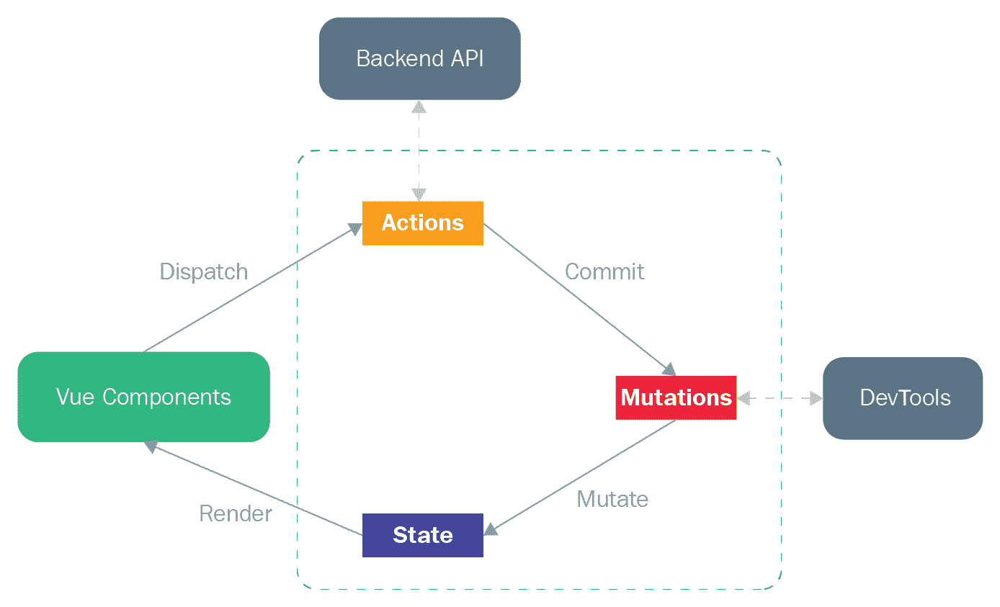

# 十、添加 Vuex 商店

拥有像 MongoDB 这样的数据库系统来管理我们的数据非常好，因为我们可以在需要时使用它远程请求路由数据。然而，有时，我们需要跨页面或组件共享一些数据，我们不想对此类数据发出额外的、不必要的 HTTP 请求。理想情况下，我们希望在本地应用中有一个中心位置，在那里我们可以存储这些“无处不在”的集中数据。幸运的是，我们有一个名为 Vuex 的系统来为我们存储此类数据，这就是您将在本章中探讨的内容。因此，在本章中，您将学习如何在应用中使用 Vuex 进行状态管理（集中式数据管理）。您将了解 Vuex 体系结构、其核心概念以及管理模块化 Vuex 存储的建议目录结构。最后，您将学习如何在 Nuxt 应用中激活和使用 Vuex 商店。

我们将在本章中介绍的主题如下：

*   了解 Vuex 体系结构
*   开始使用 Vuex
*   理解 Vuex 核心概念
*   构建 Vuex 存储模块
*   在 Vuex 存储中处理表单
*   在 Nuxt 中使用 Vuex 存储

# 了解 Vuex 体系结构

在学习如何在 Nuxt 应用中使用 Vuex 应用商店之前，我们应该了解它在标准 Vue 应用中的工作原理。Vuex 是什么？让我们在下一节中找到答案。

## 什么是 Vuex？

简言之，Vuex 是一个集中化的数据（也称为状态）管理系统，具有一些规则（我们将在后面介绍），以确保状态只能从需要访问公共数据的多个（远程）组件中进行可预测的变化。这种信息集中的思想在 React 中的 Redux 等工具中很常见。它们都与 Vuex 共享类似的状态管理模式。让我们来看看下一节中的模式是什么。

## 国家管理模式

为了理解 Vuex 的国家管理模式，让我们来看看一个我们已经熟悉的简单的 VUE 应用：

```js
<div id="app"></div>

new Vue({
  // state
  data () {
    return { message: '' }
  },

  // view
  template: `
    <div>
      <p>{{ message }}</p>
      <button v-on:click="greet">Greet</button>
    </div>
  `,

  // actions
  methods: {
    greet () {
      this.message = 'Hello World'
    }
  }
}).$mount('#app')
```

此简单应用包含以下部分：

*   `state`，其中包含应用的源代码
*   `view`，映射状态
*   `actions`，可用于从视图中改变状态

当两个或两个以上的组件在同一个状态下工作时，如果我们希望在同一个或两个以上的状态下共享它们，那么这两个或两个以上的组件将变得很容易，但当我们希望在同一个状态下共享它们时，这两个或两个以上的组件将变得不可持续。

传递道具可能是突然出现在您脑海中的解决方案，但对于嵌套较深的组件来说，这是一件乏味的事情。这就是 Vuex 的用武之地，它提取公共状态并在一个称为存储的特定位置对其进行全局管理，以便任何组件都可以从任何地方访问它，而不管它嵌套的深度有多深。

因此，使用国家管理和一些强制性规则进行分离可以保持观点和国家的独立性。使用它，我们可以使代码更加结构化和可维护。下面我们来看看 VUEX 的体系结构：



Reference Source: [https://vuex.vuejs.org/](https://vuex.vuejs.org/)

简而言之，Vuex 由动作、突变和状态组成。状态始终通过突变进行突变，而突变始终通过 Vuex 生命周期中的操作提交。然后将变异状态呈现给组件，同时（通常）从组件中调度操作。与后端 API 的通信通常发生在操作中。让我们在下一节中从 Vuex 开始，深入了解它的构成。

# 开始使用 Vuex

正如我们在上一节中提到的，所有 Vuex 活动都发生在存储中，只需在项目根目录中创建即可。然而，尽管看起来很简单，Vuex 存储区与普通 JavaScript 对象不同，因为 Vuex 存储区是反应式的，就像带有`v-model`指令的`<input>`元素上的双向绑定一样。因此，您在 Vue 组件中访问的任何状态数据在存储中更改时都会响应性地更新。存储状态下的数据必须是通过突变明确提交的*，就像我们在上一节的图表中解释的那样。*

在本练习中，我们将使用单个文件组件框架使用 Vuex 构建一些简单的 Vue 应用。我们将把所有示例代码放在 GitHub 存储库的`/chapter-10/vue/vuex-sfc/`中。让我们开始吧。

## 安装 Vuex

在创建 Vuex 存储之前，必须安装 Vuex 并使用以下步骤导入它：

1.  使用 npm 安装 Vuex：

```js
$ npm i vuex
```

2.  通过`Vue.use()`方式导入并注册：

```js
import Vue from 'vue'
import Vuex from 'vuex'

Vue.use(Vuex)
```

请记住，前面的安装步骤旨在将 Vuex 与模块系统一起使用，这正是本章的目的。但在进入模块系统应用之前，我们应该在下一节中了解如何使用 CDN 或直接下载来创建 Vuex 应用。

Note that Vuex requires Promise support. If your browser does not support Promise, please check out how you can install a polyfill library for your apps at [https://vuex.vuejs.org/installation.html#promise](https://vuex.vuejs.org/installation.html#promise).

## 创建一个简单的商店

我们可以从使用 CDN 的简单商店开始，或通过以下步骤直接下载：

1.  使用 HTML`<script>`块安装 Vue 和 Vuex：

```js
<script src="/path/to/vue.js"></script>
<script src="/path/to/vuex.js"></script>
```

2.  在 HTML`<body>`块中激活 Vuex 存储：

```js
<script type="text/javascript">
  const store = new Vuex.Store({
    state: { count: 0 },
    mutations: {
      increment (state) { state.count++ }
    }
  })
  store.commit('increment')
  console.log(store.state.count) // -> 1
</script>
```

从这段代码中可以看出，您只需要在 JavaScript 对象中创建 Vuex 状态，即一个变异方法，然后您就可以使用 store 的`state`键访问 state 对象，并使用 store 的`commit`方法触发状态更改，如下所示：

```js
store.commit('increment')
console.log(store.state.count)
```

在这个简单的示例中，我们遵守了 Vuex 中的一个强制规则，即通过提交变异来更改状态数据，而不是直接更改。让我们在下一节中创建模块系统应用，深入了解 Vuex 的核心概念和其他规则。

# 理解 Vuex 核心概念

Vuex 中有五个核心概念，我们将在本节中为您提供指导。它们是状态、获取者、突变、动作和模块。在下一节中，我们将首先研究状态概念。

## 国家

州是 Vuex 商店的中心。它是“全局”数据的来源，我们可以在 Vuex 中以结构化和可预测的方式管理和维护这些数据。Vuex 中的状态是单个状态树–一个包含所有应用状态数据的单个 JavaScript 对象。因此，通常每个应用都有一个商店。让我们来看看如何在下面的章节中把状态变成组件。

### 访问国家

正如我们在上一节中提到的，Vuex 存储是被动的，但是如果我们想访问视图中的被动值，我们应该使用`computed`属性而不是`data`方法，如下所示：

```js
// vuex-sfc/state/basic/src/app.vue
<p>{{ number }}</p>

import Vue from 'vue/dist/vue.js'
import Vuex from 'vuex'
Vue.use(Vuex)

const store = new Vuex.Store({
  state: { number: 1 }
})

export default {
  computed: {
    number () {
      return store.state.number
    }
  }
}
```

所以现在，`<template>`块中的`number`字段是被动的，`computed`属性将在`store.state.number`发生变化时重新评估和更新 DOM。但是这种模式会导致耦合问题，并且与 Vuex 的提取思想背道而驰。因此，让我们通过以下步骤重构前面的代码：

1.  将存储提取到根组件：

```js
// vuex-sfc/state/inject/src/entry.js
import Vue from 'vue/dist/vue.js'
import App from './app.vue'

import Vuex from 'vuex'
Vue.use(Vuex)

const store = new Vuex.Store({
  state: { number: 0 }
})

new Vue({
  el: 'app',
  template: '<App/>',
  store,
  components: {
    App
  }
})
```

2.  从子组件中删除存储，但保持`computed`属性不变：

```js
// vuex-sfc/state/inject/src/app.vue
<p>{{ number }}</p>

export default {
  computed: {
    number () {
      return this.$store.state.number
    }
  }
}
```

在更新的代码中，存储现在被注入到子组件中，您可以使用组件中的`this.$store`来访问它。然而，当您有许多需要使用`computed`属性计算的存储状态属性时，这种模式可能会变得重复和冗长。在这种情况下，我们可以使用`mapState`助手来解除负担。让我们来看看下一节如何使用它。

### mapState 助手

我们可以使用`mapState`助手帮助我们生成计算状态函数，通过以下步骤保存一些行和击键：

1.  创建具有多个状态属性的存储：

```js
// vuex-sfc/state/mapstate/src/entry.js
const store = new Vuex.Store({
  state: {
    experience: 1,
    name: 'John',
    age: 20,
    job: 'designer'
  }
})
```

2.  从 Vuex 导入`mapState`助手，并将状态属性作为数组传递给`mapState`方法：

```js
// vuex-sfc/state/mapstate/src/app.vue
import { mapState } from 'vuex'

export default {
  computed: mapState([
    'experience', 'name', 'age', 'job'
  ])
}
```

只要映射的计算属性的名称与状态属性的名称相同，这种方法就可以正常工作。但是，最好将其与对象扩展操作符一起使用，以便我们可以在`computed`属性中混合多个`mapState`辅助对象：

```js
computed: {
  ...mapState({
    // ...
  })
}
```

例如，您可能希望使用子组件中的数据计算状态数据，如下所示：

```js
// vuex-sfc/state/mapstate/src/app.vue
import { mapState } from 'vuex'

export default {
  data () {
    return { localExperience: 2 }
  },
  computed: {
    ...mapState([
      'experience', 'name', 'age', 'job'
    ]),
    ...mapState({
      experienceTotal (state) {
        return state.experience + this.localExperience
      }
    })
  }
}
```

您还可以传递一个字符串值来为`experience`状态属性创建别名，如下所示：

```js
...mapState({
  experienceAlias: 'experience'
})
```

3.  将计算的状态属性添加到`<template>`，如下所示：

```js
// vuex-sfc/state/mapstate/src/app.vue
<p>{{ name }}, {{ age }}, {{ job }}</p>
<p>{{ experience }}, {{ experienceAlias }}, {{ experienceTotal }}</p>
```

您应该在浏览器上获得以下结果：

```js
John, 20, designer
1, 1, 3
```

您可能想知道，既然我们可以计算子组件中的状态数据，那么我们可以计算存储本身中的状态数据吗？答案是肯定的，我们可以使用 getter 来实现，我们将在下一节中介绍。让我们开始吧。

## 吸气剂

您可以在存储区的`getters`属性中定义 getter 方法，以便在子组件在视图中使用它之前计算状态。就像`computed`属性一样，getter 中的计算结果是反应性的，但它是缓存的，并且在其依赖项发生更改时将被更新。getter 将状态作为第一个参数，`getters`作为第二个参数。让我们创建一些 getter，并通过以下步骤在子组件中使用它们：

1.  创建一个具有`state`属性的存储区，该存储区包含项目列表和一些用于访问这些项目的 getter：

```js
// vuex-sfc/getters/basic/src/entry.js
const store = new Vuex.Store({
  state: {
    fruits: [
      { name: 'strawberries', type: 'berries' },
      { name: 'orange', type: 'citrus' },
      { name: 'lime', type: 'citrus' }
    ]
  },
  getters: {
    getCitrus: state => {
      return state.fruits.filter(fruit => fruit.type === 'citrus')
    },
    countCitrus: (state, getters) => {
      return getters.getCitrus.length
    },
    getFruitByName: (state, getters) => (name) => {
      return state.fruits.find(fruit => fruit.name === name)
    }
  }
})
```

在这个商店中，我们创建了`getCitrus`方法来获取类型为`citrus`的所有项目，并创建了`countCitrus`方法来依赖于`getCitrus`方法中的结果。第三种方法`getFruitByName`用于按名称获取列表中的特定项。

2.  在`computed`属性中创建一些方法来执行存储中的 getter，如下所示：

```js
// vuex-sfc/getters/basic/src/app.vue
export default {
  computed: {
    totalCitrus () {
      return this.$store.getters.countCitrus
    },
    getOrange () {
      return this.$store.getters.getFruitByName('orange')
    }
  }
}
```

3.  将计算的状态属性添加到`<template>`，如下所示：

```js
// vuex-sfc/getters/basic/src/app.vue
<p>{{ totalCitrus }}</p>
<p>{{ getOrange }}</p>
```

您应该在浏览器中获得以下结果：

```js
2
{ "name": "orange", "type": "citrus" }
```

与`mapState`助手一样，我们可以在`computed`属性中使用`mapGetters`助手，这为我们节省了一些行和击键。让我们在下一节讨论它。

### mapGetters 助手

就像`mapState`助手一样，我们可以使用`mapGetters`助手在`computed`属性中映射存储 getter。让我们看看如何通过以下步骤使用它：

1.  从 Vuex 导入`mapGetters`助手，并使用对象扩展操作符将 getter 作为数组传递给`mapGetters`方法，以便我们可以在`computed`属性中混合多个`mapGetters`助手：

```js
// vuex-sfc/getters/mapgetters/src/app.vue
import { mapGetters } from 'vuex'

export default {
  computed: {
    ...mapGetters([
      'countCitrus'
    ]),
    ...mapGetters({
      totalCitrus: 'countCitrus'
    })
  }
}
```

在前面的代码中，我们通过将字符串值传递给`totalCitrus`键，为`countCitrus`getter 创建了一个别名。请注意，使用对象扩展操作符，我们还可以在`computed`属性中混合其他普通方法。因此，让我们在这些`mapGetters`助手之上的`computed`选项中添加一个普通的`getOrange`getter 方法，如下所示：

```js
// vuex-sfc/getters/mapgetters/src/app.vue
export default {
  computed: {
    // ... mapGetters
    getOrange () {
      return this.$store.getters.getFruitByName('orange')
    }
  }
}
```

2.  将计算的状态属性添加到`<template>`，如下所示：

```js
// vuex-sfc/getters/mapgetters/src/app.vue
<p>{{ countCitrus }}</p>
<p>{{ totalCitrus }}</p>
<p>{{ getOrange }}</p>
```

您应该在浏览器中获得以下结果：

```js
2
2
{ "name": "orange", "type": "citrus" }
```

到目前为止，您已经了解了如何使用计算方法和 getter 访问存储中的状态。换个州怎么样？让我们在下一节讨论它。

## 突变

正如我们在前面几节中提到的，存储状态必须通过突变显式提交。突变只是一个函数，就像您在 store 属性中了解的任何其他函数一样，但它必须在 store 的`mutations`属性中定义。它总是将状态作为第一个参数。让我们创建一些突变，并通过以下步骤在子组件中使用它们：

1.  创建一个具有`state`属性和一些变异方法的存储，我们可以使用这些方法来变异状态，如下所示：

```js
// vuex-sfc/mutations/basic/src/entry.js
const store = new Vuex.Store({
  state: { number: 1 },
  mutations: {
    multiply (state) {
      state.number = state.number * 2
    },
    divide (state) {
      state.number = state.number / 2
    },
    multiplyBy (state, n) {
      state.number = state.number  n
    }
  }
})
```

2.  在组件中创建以下方法，使用`this.$store.commit`添加一个提交突变的调用：

```js
// vuex-sfc/mutations/basic/src/app.js
export default {
  methods: {
    multiply () {
      this.$store.commit('multiply')
    },
    multiplyBy (number) {
      this.$store.commit('multiply', number)
    },
    divide () {
      this.$store.commit('divide')
    }
  }
}
```

与 getter 方法一样，您也可以在变异方法上使用`mapMutations`助手，因此让我们在下一节中讨论它。

### 地图助手

我们可以使用`mapMutations`辅助对象将组件方法映射到具有对象扩散算子的变异方法，以便我们可以在`method`属性中混合多个`mapMutations`辅助对象。让我们看看如何通过以下步骤来实现：

1.  从 Vuex 导入`mapMutations`助手，并将突变作为数组传递给具有对象扩展运算符的`mapMutations`方法，如下所示：

```js
// vuex-sfc/mutations/mapmutations/src/app.vue
import { mapMutations } from 'vuex'

export default {
  computed: {
    number () {
      return this.$store.state.number
    }
  },
  methods: {
    ...mapMutations([
      'multiply',
      'multiplyBy',
      'divide'
    ]),
    ...mapMutations({
      square: 'multiply'
    })
  }
}
```

2.  将计算状态属性和方法添加到`<template>`，如下所示：

```js
// vuex-sfc/mutations/mapmutations/src/app.vue
<p>{{ number }}</p>
<p>
  <button v-on:click="multiply">x 2</button>
  <button v-on:click="divide">/ 2</button>
  <button v-on:click="square">x 2 (square)</button>
  <button v-on:click="multiplyBy(10)">x 10</button>
</p>
```

当您单击前面的按钮时，您应该看到浏览器上的`number`状态正在反应性地被乘或除。在本例中，我们通过变异成功地更改了状态值，这是 Vuex 中的规则之一。另一条规则是我们*不能*在突变中进行异步调用。换句话说，*突变必须是同步的*，这样每个突变都可以被 DevTool 记录下来进行调试。如果要进行异步调用，请使用 actions，我们将在下一节中对您进行介绍。让我们开始吧。

## 行动

动作就像突变一样，只是它们不用于突变状态，而是用于提交突变。与突变不同，动作*可以是异步的*。我们在商店的`actions`属性中创建动作方法。动作方法将上下文对象作为第一个参数，将自定义参数作为第二个参数，依此类推。您可以使用`context.commit`进行突变，`context.state`访问状态，`context.getters`访问 getter。让我们通过以下步骤添加一些操作方法：

1.  创建具有`state`属性和操作方法的存储，如下所示：

```js
// vuex-sfc/actions/basic/src/entry.js
const store = new Vuex.Store({
  state: { number: 1 },
  mutations: { ... },
  actions: {
    multiplyAsync (context) {
      setTimeout(() => {
        context.commit('multiply')
      }, 1000)
    },
    multiply (context) {
      context.commit('multiply')
    },
    multiplyBy (context, n) {
      context.commit('multiplyBy', n)
    },
    divide (context) {
      context.commit('divide')
    }
  }
})
```

在本例中，我们使用了上一节中相同的变体并创建了 action 方法，其中一个创建了异步 action 方法来演示为什么异步调用需要操作，尽管一开始它们看起来很乏味。

请注意，如果愿意，您可以使用 ES6 JavaScript destructuring 赋值对`context`进行解构，并直接导入`commit`属性，如下所示：

```js
divide ({ commit }) {
  commit('divide')
}
```

2.  创建一个组件并使用`this.$store.commit`分派前面的操作，如下所示：

```js
// vuex-sfc/actions/basic/src/app.js
export default {
  methods: {
    multiply () {
      this.$store.dispatch('multiply')
    },
    multiplyAsync () {
      this.$store.dispatch('multiplyAsync')
    },
    multiplyBy (number) {
      this.$store.dispatch('multiply', number)
    },
    divide () {
      this.$store.dispatch('divide')
    }
  }
}
```

像变异和 getter 方法一样，您也可以在动作方法上使用`mapActions`助手，所以让我们在下一节进行讨论。

### mapActions 助手

我们可以使用`mapActions`辅助对象将组件方法映射到具有对象扩展操作符的动作方法，以便在`method`属性中混合多个`mapActions`辅助对象。让我们看看如何通过以下步骤实现这一点：

1.  从 Vuex 导入`mapActions`助手，并将突变作为数组传递给具有对象扩展运算符的`mapActions`方法，如下所示：

```js
// vuex-sfc/actions/mapactions/src/app.vue
import { mapActions } from 'vuex'

export default {
  methods: {
    ...mapActions([
      'multiply',
      'multiplyAsync',
      'multiplyBy',
      'divide'
    ]),
    ...mapActions({
      square: 'multiply'
    })
  }
}
```

2.  添加 computed state 属性并将方法绑定到`<template>`，如下所示：

```js
// vuex-sfc/mapactions/src/app.vue
<p>{{ number }}</p>
<p>
  <button v-on:click="multiply">x 2</button>
  <button v-on:click="square">x 2 (square)</button>
  <button v-on:click="multiplyAsync">x 2 (multiplyAsync)</button>
  <button v-on:click="divide">/ 2</button>
  <button v-on:click="multiplyBy(10)">x 10</button>
</p>

export default {
  computed: {
    number () {
      return this.$store.state.number
    }
  },
}
```

当您单击前面的按钮时，您应该看到浏览器上的`number`状态正在反应性地被乘或除。在本例中，我们再次通过使用 store`dispatch`方法只能调度的操作提交突变来更改状态值。这些是我们在应用应用商店时必须遵守的强制规则。

然而，当商店和应用增长时，我们可能希望将状态、突变和动作分成若干组。在这种情况下，我们需要 Vuex 中的最后一个概念——模块——我们将在下一节中介绍。让我们开始吧。

## 模块

我们可以将我们的商店划分为模块来扩展应用。每个模块都可以有一个状态、变量、操作和 getter，如下所示：

```js
const module1 = {
  state: { ... },
  mutations: { ... },
  actions: { ... },
  getters: { ... }
}

const module2 = {
  state: { ... },
  mutations: { ... },
  actions: { ... },
  getters: { ... }
}

const store = new Vuex.Store({
  modules: {
    a: module1,
    b: module2
  }
})
```

然后，您可以访问每个模块的状态或其他属性，如下所示：

```js
store.state.a
store.state.b
```

在为存储编写模块时，您应该了解存储模块中的本地状态、根状态和名称空间。让我们在下面几节中看看它们。

### 了解局部状态和根状态

每个模块中的突变和 getter 将接收模块的本地状态作为其第一个参数，如下所示：

```js
const module1 = {
  state: { number: 1 },
  mutations: {
    multiply (state) {
      console.log(state.number)
    }
  },

  getters: {
    getNumber (state) {
      console.log(state.number)
    }
  }
}
```

在这段代码中，突变和 getter 方法中的状态是本地模块状态，所以对于`console.log(state.number)`您将得到`1`，而在每个模块的操作中，您将得到上下文作为第一个参数，您可以使用它访问本地状态和根状态`context.state`和`context.rootState`，如下所示：

```js
const module1 = {
  actions: {
    doSum ({ state, commit, rootState }) {
      //...
    }
  }
}
```

根状态在每个模块的 getter 中也可用作第三个参数，如下所示：

```js
const module1 = {
  getters: {
    getSum (state, getters, rootState) {
      //...
    }
  }
}
```

当我们有多个模块时，来自模块的本地状态和来自存储根的根状态可能会混淆，并变得混乱。这就带来了名称空间，它可以使我们的模块更加独立，并且不太可能相互冲突。让我们在下一节讨论它。

### 理解名称空间

默认情况下，每个模块中的`actions`、`mutations`和`getters`属性都在全局命名空间下注册，因此每个属性中的键或方法名称都必须是唯一的。换句话说，方法名称不能在两个不同的模块中重复，如下所示：

```js
// entry.js
const module1 = {
  getters: {
    getNumber (state) {
      return state.number
    }
  }
}

const module2 = {
  getters: {
    getNumber (state) {
      return state.number
    }
  }
}
```

对于前面的示例，由于在 getter 中使用相同的方法名，您将看到以下错误：

```js
[vuex] duplicate getter key: getNumber
```

因此，为了避免重复，必须为每个模块显式命名方法名称，如下所示：

```js
getNumberModule1
getNumberModule2
```

然后，您可以在子组件中访问这些方法并映射它们，如下所示：

```js
// app.js
import { mapGetters } from 'vuex'

export default {
  computed: {
    ...mapGetters({
      getNumberModule1: 'getNumberModule1',
      getNumberModule2: 'getNumberModule2'
    })
  }
}
```

如果您不想像前面的代码那样使用`mapGetters`，这些方法也可以编写如下：

```js
// app.js
export default {
  computed: {
    getNumberModule1 (state) {
      return this.$store.getters.getNumberModule1
    },
    getNumberModule2 (state) {
      return this.$store.getters.getNumberModule2
    }
  }
}
```

然而，这种模式可能看起来很冗长，因为我们必须为存储中创建的每个方法重复编写`this.$store.getters`或`this.$store.actions`。访问每个模块的状态是相同的，如下所示：

```js
// app.js
export default {
  computed: {
    ...mapState({
      numberModule1 (state) {
        return this.$store.state.a.number
      }
    }),
    ...mapState({
      numberModule2 (state) {
        return this.$store.state.b.number
      }
    })
  }
}
```

因此，这种情况的解决方案是通过将每个模块中的`namespaced`键设置为`true`来为每个模块使用名称空间，如下所示：

```js
const module1 = {
  namespaced: true
}
```

注册模块时，其所有 getter、action 和 mutation 将根据模块注册的路径自动命名。以以下为例：

```js
// entry.js
const module1 = {
  namespaced: true
  state: { number:1 }
}

const module2 = {
  namespaced: true
  state: { number:2 }
}

const store = new Vuex.Store({
  modules: {
    a: module1,
    b: module2
  }
})
```

现在，您可以使用更少的代码访问每个模块的状态，从而更易于阅读，如下所示：

```js
// app.js
import { mapState } from 'vuex'

export default {
  computed: {
    ...mapState('a', {
      numberModule1 (state) {
        return state.number
      }
    }),
    ...mapState('b', {
      numberModule2 (state) {
        return state.number
      }
    })
  }
}
```

对于前面的示例代码，`numberModule1`将获得`1`，而`numberModule2`将获得`2`。此外，还可以通过使用名称空间消除“复制 getter 键”的错误。现在，您可以有更多方法的“抽象”名称，如下所示：

```js
// entry.js
const module1 = {
  getters: {
    getNumber (state) {
      return state.number
    }
  }
}

const module2 = {
  getters: {
    getNumber (state) {
      return state.number
    }
  }
}
```

现在，您可以调用这些方法并将其精确映射到它们注册的名称空间，如下所示：

```js
// app.js
import { mapGetters } from 'vuex'

export default {
  computed: {
    ...mapGetters('a', {
      getNumberModule1: 'getNumber',
    }),
    ...mapGetters('b', {
      getNumberModule2: 'getNumber',
    })
  }
}
```

我们一直在根文件`entry.js`中编写存储。无论您是否正在向模块化存储区写入，当状态属性和突变、getter 和操作中的方法随时间增长时，此根文件将变得臃肿。因此，我们将进入下一节，您将学习如何在单个文件中分离和构造这些方法和状态属性。让我们开始吧。

# 构建 Vuex 存储模块

在 Vue 应用中，只要您遵守我们在前几节中介绍的强制规则，就不会对您应该如何构建店铺设置严格的限制。根据您的商店的复杂程度，本书中推荐了两种结构，您可以在以下部分中使用。让我们开始吧。

## 创建简单的存储模块结构

在这个简单的模块结构中，您可以有一个`/store/`目录，其中包含一个`/modules/`目录，该目录将所有模块保存在此文件夹中。以下是创建此简单项目结构的步骤：

1.  使用存储模块创建一个`/store/`目录，其中包含一个`/modules/`目录，如下所示：

```js
// vuex-sfc/structuring-modules/basic/
├── index.html
├── entry.js
├── components
│ ├── app.vue
│ └── ...
└── store
    ├── index.js
    ├── actions.js
    ├── getters.js
    ├── mutations.js
    └── modules
        ├── module1.js
        └── module2.js
```

在这个简单的结构中，`/store/index.js`是我们从`/modules/`目录组装模块并导出存储，以及根的状态、操作、getter 和突变，如下所示：

```js
// store/index.js
import Vue from 'vue'
import actions from './actions'
import getters from './getters'
import mutations from './mutations'
import module1 from './modules/module1'
import module2 from './modules/module2'

import Vuex from 'vuex'
Vue.use(Vuex)

export default new Vuex.Store({
  state: {
    number: 3
  },
  actions,
  getters,
  mutations,
  modules: {
    a: module1,
    b: module2
  }
})
```

2.  将根的操作、突变和 getter 拆分为单独的文件，并将它们组合到根索引文件中，如下所示：

```js
// store/mutations.js
export default {
  mutation1 (state) {
    //...
  },
  mutation2 (state, n) {
    //...
  }
}
```

3.  在`.js`文件中创建模块，包括它们的状态、动作、突变和获取方法，就像您在前面章节中所学的那样，如下所示：

```js
// store/modules/module1.js
export default {
  namespaced: true,
  state: {
    number: 1
  },
  mutations: { ... },
  getters: { ... },
  actions: { ... }
}
```

如果模块文件太大，我们可以将模块的状态、操作、突变和 getter 拆分为单独的文件。这就引出了一个高级存储模块结构，我们将在下一节中介绍它。让我们看看。

## 创建高级存储模块结构

在这个高级模块结构中，您可以有一个`/store/`目录，其中包含一个`/modules/`目录，该目录将所有模块保存在此文件夹的子文件夹中。我们可以将模块的状态、操作、突变和 getter 拆分为单独的文件，然后通过以下步骤将它们保存在模块文件夹中：

1.  创建一个包含存储模块的`/modules/`目录的`/store/`目录，如下所示：

```js
// vuex-sfc/structuring-modules/advanced/
├── index.html
├── entry.js
├── components
│ └── app.vue
└── store
    ├── index.js
    ├── action.js
    └── ...
      ├── module1
      │ ├── index.js
      │ ├── state.js
      │ ├── mutations.js
      │ └── ...
      └── module2
          ├── index.js
          ├── state.js
          ├── mutations.js
          └── ...
```

在这个更复杂的项目结构中，`/store/module1/index.js`是我们组装`module1`的地方，`/store/module2/index.js`是我们组装`module2`的地方，如下所示：

```js
// store/module1/index.js
import state from './state'
import getters from './getters'
import actions from './actions'
import mutations from './mutations'

export default {
  namespaced: true,
  state,
  getters,
  actions,
  mutations
}
```

我们还可以将模块状态拆分为单个文件，如下所示：

```js
// store/module1/state.js
export default () => ({
  number: 1
})
```

2.  将模块的操作、突变和 getter 拆分为单独的文件，以将它们组合到前面的模块索引文件中，如下所示：

```js
// store/module1/mutations.js
export default {
  mutation1 (state) {
    //...
  },
  mutation2 (state, n) {
    //...
  }
}
```

3.  将模块索引文件导入到我们组装模块并导出存储的存储根目录，如下所示：

```js
// store/index.js
import module1 from './module1'
import module2 from './module2'
```

4.  打开严格模式以确保存储状态仅在`mutations`属性中发生变化，如下所示：

```js
const store = new Vuex.Store({
  strict: true,
  ...
})
```

使用 strict 模式是一种很好的做法，可以提醒我们对`mutations`属性中的任何状态进行变异。因此，每当存储状态在`mutations`属性之外发生变化时，开发过程中就会抛出一个错误。但是，我们应该在生产中禁用它，因为当存储中存在大量状态突变时，它会影响性能。因此，我们可以使用构建工具动态关闭它，如下所示：

```js
// store/index.js
const debug = process.env.NODE_ENV !== 'production'

const store = new Vuex.Store({
  strict: debug,
  ...
})
```

但是，在商店中使用严格模式处理表单有一个警告，我们将在下一节中介绍。

# 在 Vuex 存储中处理表单

当我们在 Vue 应用中使用双向数据绑定与`v-model`时，Vue 实例中的数据与 v-model 输入字段同步。因此，当您在输入字段中键入任何内容时，数据将立即更新。但是，这将在 Vuex 存储中产生问题，因为我们*不能*在`mutations`属性之外改变存储状态（数据）。让我们来看一个 VUEX 商店中简单的双向数据绑定：

```js
// vuex-non-sfc/handling-forms/v-model.html
<input v-model="user.message" />

const store = new Vuex.Store({
  strict: true,
  state: {
    message: ''
  }
})

new Vue({
  el: 'demo',
  store: store,
  computed: {
    user () {
      return this.$store.state.user
    }
  }
})
```

对于本例，在输入字段中键入消息时，您将在浏览器的调试工具中看到以下错误消息：

```js
Error: [vuex] do not mutate vuex store state outside mutation handlers.
```

这是因为当您键入时，`v-model`试图在存储状态下直接变异`message`，因此在严格模式下会导致错误。让我们在下面几节中了解解决此问题的方法。

## 使用 v-bind 和 v-on 指令

在大多数情况下，双向绑定并不总是合适的。通过将`<input>`与`input`或`change`事件上的`value`属性绑定，在 Vuex 中使用单向绑定和显式数据更新更有意义。通过以下步骤，您可以轻松完成此任务：

1.  创建一个方法来改变`mutations`属性中的状态，正如您在前面几节中所了解的：

```js
// vuex-sfc/form-handling/value-event/store/index.js
export default new Vuex.Store({
  strict: true,
  state: {
    message: ''
  },
  mutations: {
    updateMessage (state, message) {
      state.message = message
    }
  }
})
```

2.  用`value`属性绑定`<input>`元素，用方法绑定`input`事件，如下所示：

```js
// vuex-sfc/form-handling/value-event/components/app.vue
<input v-bind:value="message" v-on:input="updateMessage" />

import { mapState } from 'vuex'

export default {
  computed: {
    ...mapState({
      message: state => state.message
    })
  },
  methods: {
    updateMessage (e) {
      this.$store.commit('updateMessage', e.target.value)
    }
  }
}
```

在这个解决方案中，我们使用子组件中的`updateMessage`方法提交存储中的突变方法`updateMessage`，并传递输入事件中的值。通过像这样明确地实施突变*和*，我们并没有违反 Vuex 中必须遵守的强制规则。因此，采用此解决方案意味着您无法使用 v-model 来处理 Vuex 存储区的表单。但是，如果您使用的是 Vue 本身的计算 getter 和 setter，那么仍然可以使用它。让我们在下一节中了解这一点。

## 使用双向计算属性

通过以下步骤，我们可以使用 Vue 的内置双向计算属性和 setter 来处理带有 v 模型的表单：

1.  创建一个方法来改变`mutations`属性中的状态，就像上一节一样。
2.  将`get`和`set`方法应用于`message`键，如下所示：

```js
// vuex-sfc/form-handling/getter-setter/components/app.vue
<input v-model="message" />

export default {
  computed: {
    message: {
      get () {
        return this.$store.state.message
      },
      set (value) {
        this.$store.commit('updateMessage', value)
      }
    }
  }
}
```

但是，这可能适用于简单的计算属性。如果要更新的深层对象有 10 多个键，则需要 10 组双向计算属性（getter 和 setter）。与基于事件的解决方案相比，代码最终会变得更加重复和冗长。

做得好！你已经成功地通过了 VUEX 商店的基础和概念。您已经学习了如何在 Vue 应用中使用商店。现在，是时候在 Nuxt 中应用存储了。那么，让我们在下一节讨论它。

If you want to find out more information about Vuex, please visit [https://vuex.vuejs.org/](https://vuex.vuejs.org/).

# 在 Nuxt 中使用 Vuex 存储

在 Nuxt 中，已经为您安装了 Vuex。您只需要确保项目根目录中存在`/store/`目录。如果您使用`create-nuxt-app`安装 Nuxt 项目，则在项目安装过程中会自动生成此目录。在 Nuxt 中，您可以在两种不同的模式下创建存储：

*   单元
*   经典（已弃用）

由于经典模式已被弃用，因此在本书中我们将只关注模块模式。那么，让我们从下一节开始。

You can find the source code for all of the following Nuxt examples in `/chapter-10/nuxt-universal/` in our GitHub repository.

## 使用模块模式

与 Vue 应用不同，在 Nuxt 中，每个模块以及根模块的`namespaced`键默认设置为`true`。此外，在 Nuxt 中，不需要在存储根目录中组装模块；您只需要将状态*导出为函数*，将突变、getter 和动作*导出为根文件和模块文件中的对象*。让我们通过以下步骤开始工作：

1.  创建存储根目录，如下所示：

```js
// store/index.js
export const state = () => ({
  number: 3
})

export const mutations = {
  mutation1 (state) { ... }
}

export const getters = {
  getter1 (state, getter) { ... }
}

export const actions = {
  action1 ({ state, commit }) { ... }
}
```

在 Nuxt 中，Vuex 的严格模式在开发期间默认设置为`true`，在生产模式下自动关闭，但您可以在开发期间禁用该模式，如下所示：

```js
// store/index.js
export const strict = false
```

2.  创建一个模块，如下所示：

```js
// store/module1.js
export const state = () => ({
  number: 1
})

export const mutations = {
  mutation1 (state) { ... }
}

export const getters = {
  getter1 (state, getter, rootState) { ... }
}

export const actions = {
  action1 ({ state, commit, rootState }) { ... }
}
```

然后，正如我们在上一节的 Vue 应用中*手动*一样，商店将自动生成，如下所示：

```js
new Vuex.Store({
  state: () => ({
    number: 3
  }),
  mutations: {
    mutation1 (state) { ... }
  },
  getters: {
    getter1 (state, getter) { ... }
  },
  actions: {
    action1 ({ state, commit }) { ... }
  },
  modules: {
    module1: {
      namespaced: true,
      state: () => ({
        number: 1
      }),
      mutations: {
        mutation1 (state) { ... }
      }
      ...
    }
  }
})
```

3.  在任何页面的`<script>`块中映射所有存储状态、getter、突变和操作，如下所示：

```js
// pages/index.vue
import { mapState, mapGetters, mapActions } from 'vuex'

export default {
  computed: {
    ...mapState({
      numberRoot: state => state.number,
    }),
    ...mapState('module1', {
      numberModule1: state => state.number,
    }),
    ...mapGetters({
      getNumberRoot: 'getter1'
    }),
    ...mapGetters('module1', {
      getNumberModule1: 'getter1'
    })
  },
  methods: {
    ...mapActions({
      doNumberRoot:'action1'
    }),
    ...mapActions('module1', {
      doNumberModule1:'action1'
    })
  }
}
```

4.  在`<template>`块中显示计算属性和提交突变的方法，如下所示：

```js
// pages/index.vue
<p>{{ numberRoot }}, {{ getNumberRoot }}</p>
<button v-on:click="doNumberRoot">x 2 (root)</button>

<p>{{ numberModule1 }}, {{ getNumberModule1 }}</p>
<button v-on:click="doNumberModule1">x 2 (module1)</button>
```

您应该在屏幕上看到以下初始结果，当您从模板中单击屏幕上显示的上述按钮时，这些结果将发生变化：

```js
3, 3
1, 1
```

如前所述，您不需要在 Nuxt 的存储根目录中组装模块，因为只有在使用以下结构的情况下，Nuxt 才会为您“组装”模块：

```js
// chapter-10/nuxt-universal/module-mode/
└── store
    ├── index.js
    ├── module1.js
    ├── module2.js
    └── ...
```

但是，如果您使用我们用于在存储根目录中手动组装模块的结构，就像我们为 Vue 应用所做的那样，如下所示：

```js
// chapter-10/vuex-sfc/structuring-modules/basic/
└── store
    ├── index.js
    ├── ...
    └── modules
        ├── module1.js
        └── module2.js
```

您将在 Nuxt 应用中遇到以下错误：

```js
ERROR [vuex] module namespace not found in mapState(): module1/
ERROR [vuex] module namespace not found in mapGetters(): module1/
```

要修复这些错误，您需要明确地告诉 Nuxt*这些模块存放在哪里：*

```js
export default {
  computed: {
    ..mapState('modules/module1', {
      numberModule1: state => state.number,
    }),
    ...mapGetters('modules/module1', {
      getNumberModule1: 'getter1'
    })
  },
  methods: {
    ...mapActions('modules/module1', {
      doNumberModule1:'action1'
    })
  }
}
```

就像 Vue 应用中的 Vuex 一样，我们也可以在 Nuxt 应用中将状态、操作、突变和 getter 拆分为单独的文件。在下一节中，让我们看看如何做到这一点，以及与 Nuxt 的区别。

## 使用模块文件

我们可以将模块中的大文件拆分为单独的文件——`state.js`、`actions.js`、`mutations.js`和`getters.js`——用于存储根目录和每个模块。那么，让我们通过以下步骤来实现：

1.  为存储根创建单独的状态、操作、变化和获取程序文件，如下所示：

```js
// store/state.js
export default () => ({
  number: 3
})

// store/mutations.js
export default {
  mutation1 (state) { ... }
}
```

2.  为模块创建状态、操作、变化和获取程序的单独文件，如下所示：

```js
// store/module1/state.js
export default () => ({
  number: 1
})

// store/module1/mutations.js
export default {
  mutation1 (state) { ... }
}
```

同样，在 Nuxt 中，我们不需要像在 Vue 应用中那样用`index.js`组合这些单独的文件。只要我们使用以下结构，Nuxt 将为我们做到这一点：

```js
// chapter-10/nuxt-universal/module-files/
└── store
    ├── state.js
    ├── action.js
    └── ...
      ├── module1
      │ ├── state.js
      │ ├── mutations.js
      │ └── ...
      └── module2
          ├── state.js
          ├── mutations.js
          └── ...
```

我们可以将其与用于 Vue 应用的以下结构进行比较，在 Vue 应用中，我们需要一个`index.js`文件用于存储根和每个模块，以从单独的文件中组装状态、动作、突变和 getter：

```js
// chapter-10/vuex-sfc/structuring-modules/advanced/
└── store
    ├── index.js
    ├── action.js
    └── ...
      ├── module1
      │ ├── index.js
      │ ├── state.js
      │ ├── mutations.js
      │ └── ...
      └── module2
          ├── index.js
          ├── state.js
          ├── mutations.js
          └── ...
```

因此，商店在 Nuxt 中开箱即用，它为您节省了一些用于组装文件和注册模块的代码行。真好，不是吗？现在，让我们更进一步，看看如何在下一节中使用`fetch`方法在 Nuxt 中*动态填充*存储状态。

## 使用 fetch 方法

在呈现页面之前，我们可以使用`fetch`方法填充存储状态。它的工作原理与我们已经介绍过的`asyncData`方法相同——每次加载组件之前都会调用它。它在服务器端调用一次，然后在导航到其他路由时在客户端调用。就像`asyncData`一样，我们可以将`async/await`与`fetch`方法一起用于异步数据。组件创建后调用，所以我们可以通过`fetch`方法中的`this`访问组件实例。所以，我们可以通过`this.$nuxt.context.store`进入商店。让我们通过以下步骤使用此方法创建一个简单的 Nuxt 应用：

1.  在任何页面中，通过`fetch`方法从远程 API 异步请求用户列表，如下所示：

```js
// pages/index.vue
import axios from 'axios'

export default {
  async fetch () {
    const { store } = this.$nuxt.context
    await store.dispatch('users/getUsers')
  }
}
```

2.  创建一个包含状态、突变和动作的`user`模块，如下所示：

```js
// store/users/state.js
export default () => ({
  list: {}
})

// store/users/mutations.js
export default {
  setUsers (state, data) {
    state.list = data
  },
  removeUser (state, id) {
    let found = state.list.find(todo => todo.id === id)
    state.list.splice(state.list.indexOf(found), 1)
  }
}

// store/users/actions.js
export default {
  setUsers ({ commit }, data) {
    commit('setUsers', data)
  },
  removeUser ({ commit }, id) {
    commit('removeUser', id)
  }
}
```

突变和动作中的`setUsers`方法用于将用户列表设置为状态，而`removeUser`方法用于一次将一个用户从状态中移除。

3.  将方法从状态和操作映射到页面，如下所示：

```js
// pages/index.vue
import { mapState, mapActions } from 'vuex'

export default {
  computed: {
    ...mapState ('users', {
      users (state) {
        return state.list
      }
    })
  },
  methods: {
    ...mapActions('users', {
      removeUser: 'removeUser'
    })
  }
}
```

4.  循环并显示`<template>`块中的用户列表，如下所示：

```js
// pages/index.vue
<li v-for="(user, index) in users" v-bind:key="user.id">
  {{ user.name }}
  <button class="button" v-on:click="removeUser(user.id)">Remove</button>
</li>
```

当您在浏览器中加载应用时，您应该会在屏幕上看到用户列表，您可以单击“删除”按钮删除用户。我们也可以在操作中使用`async/await`来获取远程数据，如下所示：

```js
// store/users/actions.js
import axios from 'axios'

export const actions = {
  async getUsers ({ commit }) {
    const { data } = await axios.get('https://jsonplaceholder.typicode.com/users')
    commit('setUsers', data)
  }
}
```

然后，我们可以只发送`getUsers`动作，如下所示：

```js
// pages/index.vue
export default {
  async fetch () {
    const { store } = this.$nuxt.context
    await store.dispatch('users/getUsers')
  }
}
```

除了在 Nuxt 中使用`fetch`方法获取和填充状态外，我们还可以使用`nuxtServerInit`操作，该操作仅在 Nuxt 中可用。让我们在下一节继续看它。

## 使用 nuxtServerInit 操作

与`asyncData`方法（仅在页面级组件中可用）和`fetch`方法（可在所有 Vue 组件（包括页面级组件）中使用）不同，`nuxtServerInit`操作是一种保留的存储操作方法，仅在 Nuxt 存储中可用（如果已定义）。它只能在商店根目录的`index.js`文件中定义，并且在启动 Nuxt 应用之前，只能在服务器端调用。与`asyncData`和`fetch`方法不同，在后续路由中先在服务器端调用，然后在客户端调用，`nuxtServerInit`动作方法只在服务器端*调用一次，*除非您在浏览器中刷新应用的*任何页面*。此外，与`asyncData`方法不同，`nuxtServerInit`操作方法将 Nuxt 上下文对象作为其第一个参数，而`asyncData`方法将其作为其第二个参数。它接收的第一个参数是存储上下文对象。让我们将这些上下文对象放入下表：

| **第一个参数** | **第二个参数** |
| 

*   `dispatch`
*   `commit`

*   `state`
`rootGetters`
*   `rootState`

 | 

*   `isStatic`
*   `isDev`

*   `app`

*   `res`
*   `...`

 |

因此，当我们想从应用中的任何页面从服务器端获取数据，然后用服务器数据填充存储状态时，`nuxtServerInit`操作方法非常有用，例如，当用户登录我们的应用时，我们在服务器端的会话中存储的经过身份验证的用户数据。这个会话数据可以存储在 Koa 中的 Express T1 或 Ty2 T2。然后，我们可以通过`req`对象将`ctx.session`传递到`nuxtServerInit`。

让我们用这个方法动作创建一个简单的用户登录应用，并使用 Koa 作为服务器端 API，您在 Oracle T1 第 8 章中了解到了这一点。我们只需要在服务器端进行一些修改，然后才能将任何数据注入会话，并使用`nuxtServerIni`操作方法创建一个存储，我们可以通过以下步骤完成：

1.  使用 npm 安装会话包`koa-session`：

```js
$ npm install koa-session
```

2.  将会话包导入并注册为中间件，如下所示：

```js
// server/middlewares.js
import session from 'koa-session'

app.keys = ['some secret hurr']
app.use(session(app))
```

3.  在服务器端创建两条路由，如下所示：

```js
// server/routes.js
router.post('/login', async (ctx, next) => {
  let request = ctx.request.body || {}
  if (request.username === 'demo' && request.password === 'demo') {
    ctx.session.authUser = { username: 'demo' }
    ctx.body = { username: 'demo' }
  } else {
    ctx.throw(401)
  }
})

router.post('/logout', async (ctx, next) => {
  delete ctx.session.authUser
  ctx.body = { ok: true }
})
```

在前面的代码中，我们使用 AUTE T0EY 路由将认证用户数据，AUT1 T1，注入到膝关节炎上下文中，用会话 Type T2T，而使用 OUTT3AL 来取消认证的数据。

4.  使用`authUser`键创建存储状态以保存已验证的数据：

```js
// store/state.js
export default () => ({
  authUser: null
})
```

5.  创建一个变异方法，将数据设置为前一状态的`authUser`键：

```js
// store/mutations.js
export default {
  setUser (state, data) {
    state.authUser = data
  }
}
```

6.  使用以下操作在存储根目录中创建一个`index.js`文件：

```js
// store/index.js
export const actions = {
  nuxtServerInit({ commit }, { req }) {
    if (req.ctx.session && req.ctx.session.authUser) {
      commit('setUser', req.ctx.session.authUser)
    }
  },
  async login({ commit }, { username, password }) {
    const { data } = await axios.post('/api/login', { username, 
     password })
    commit('setUser', data.data)
  },
  async logout({ commit }) {
    await axios.post('/api/logout')
    commit('setUser', null)
  }
}
```

在前面的代码中，`nuxtServerInit`操作方法用于从服务器访问会话数据，并通过提交`setUser`方法填充存储状态。`login`和`logout`操作方法用于验证用户登录凭据并将其取消设置。注意，会话数据存储在 AuthT4 中，因为这本书使用的是膝关节炎作为服务器 API。如果您使用的是 Express，请使用以下代码：

```js
actions: {
  nuxtServerInit ({ commit }, { req }) {
    if (req.session.user) {
      commit('user', req.session.user)
    }
  }
}
```

就像`asyncData`和`fetch`方法一样，`nuxtServerInit`动作方法也可以是异步的。您只需返回一个承诺，或者对 Nuxt 服务器使用一个`async/await`语句来等待异步完成操作，如下所示：

```js
actions: {
  async nuxtServerInit({ commit }) {
    await commit('setUser', req.ctx.session.authUser)
  }
}

```

7.  创建一个表单以使用存储的操作方法，如下所示：

```js
// pages/index.vue
<form v-on:submit.prevent="login">
  <input v-model="username" type="text" name="username" />
  <input v-model="password" type="password" name="password" />
  <button class="button" type="submit">Login</button>
</form>

export default {
  data() {
    return {
      username: '',
      password: ''
    }
  },
  methods: {
    async login() {
      await this.$store.dispatch('login', {
        username: this.username,
        password: this.password
      })
    },
    async logout() {
      await this.$store.dispatch('logout')
    }
  }
}
```

We have simplified the preceding code and the code in *step 6* to fit this page, but you can find the complete versions for them from our GitHub repository in `/chapter-10/nuxt-universal/nuxtServerInit/`.

做得好！您终于完成了 Nuxt 和 Vue–Vuex 商店令人兴奋的功能之一。这是一个很长的章节，但这是一个非常重要的章节，因为我们需要回到 Vuex，并在接下来的章节中经常使用它。现在，让我们总结一下您在本章学到的知识。

# 总结

我们已经走了很长的路。在本章中，您了解了 Vuex 存储中的体系结构、核心概念、模块结构和表单处理。此时，您应该知道 Vuex 存储只与状态（或数据）集中和管理相关，并且必须遵守一些强制执行的规则。因此，对于存储中的任何状态属性，访问它的正确方法是在组件的`computed`属性中计算它。如果要更改 state 属性的值，必须通过突变对其进行突变，突变必须是同步的。如果要进行异步调用以改变状态，则必须通过在组件中调度操作来使用操作来提交改变。

您还了解到，在 Nuxt 应用中创建存储比在 Vue 应用中更容易、更简单，因为默认情况下，Vuex 是预先安装在 Nuxt 上的。此外，在 Nuxt 中，您不需要手动组装模块及其所有方法，因为它们在默认情况下是为您完成的。此外，在 Nuxt 中，在呈现页面组件和启动 Nuxt 应用之前，您可以使用`fetch`和`nuxtServerInit`方法使用服务器端 API 填充存储状态。最后，您已经使用 Vuex store 和`nuxtServerInit`操作方法创建了一个简单的用户登录应用，这为在接下来的章节中创建用户登录和 API 身份验证铺平了道路。

在下一章中，我们将研究 Nuxt 中的中间件——具体地说，路由中间件和服务器中间件。您将学习区分这两种类型的 Nuxt 中间件。在 Nuxt 应用中创建中间件之前，您将在 Vue 应用中创建一些带有导航卫士的路由中间件。然后，您将在`serverMiddleware`配置选项中编写一些 Nuxt 服务器中间件，作为您在[第 8 章](08.html)中学习创建的服务器端 API 的替代服务器 API，*添加服务器端框架*。最后但并非最不重要的一点是，您将了解如何使用 Vue CLI 创建 Vue 应用，而不是我们使用自定义网页包配置制作的 Vue 应用。那么，让我们开始吧。