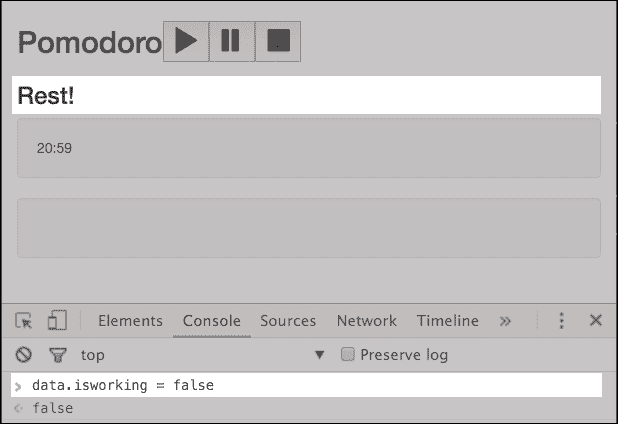
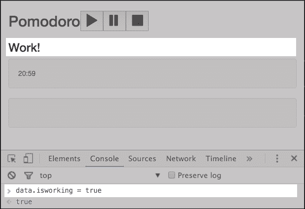
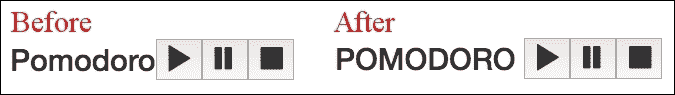
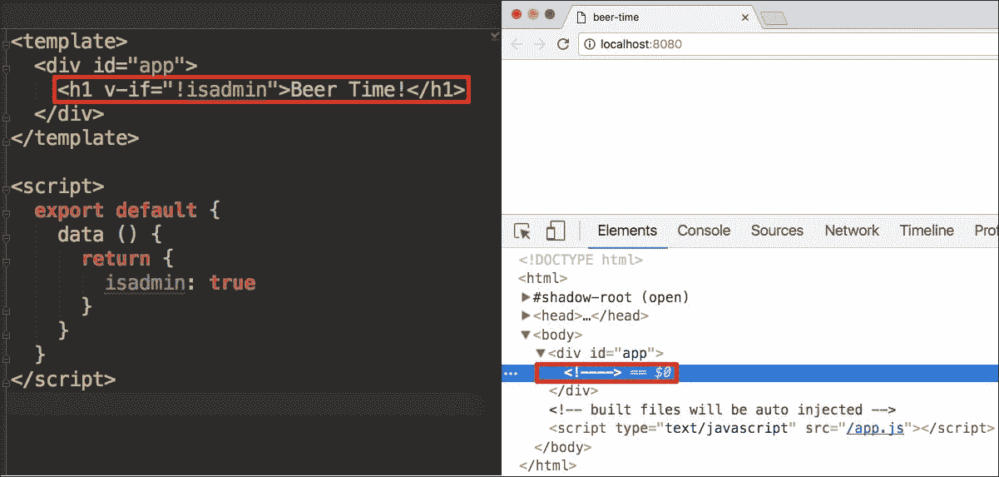
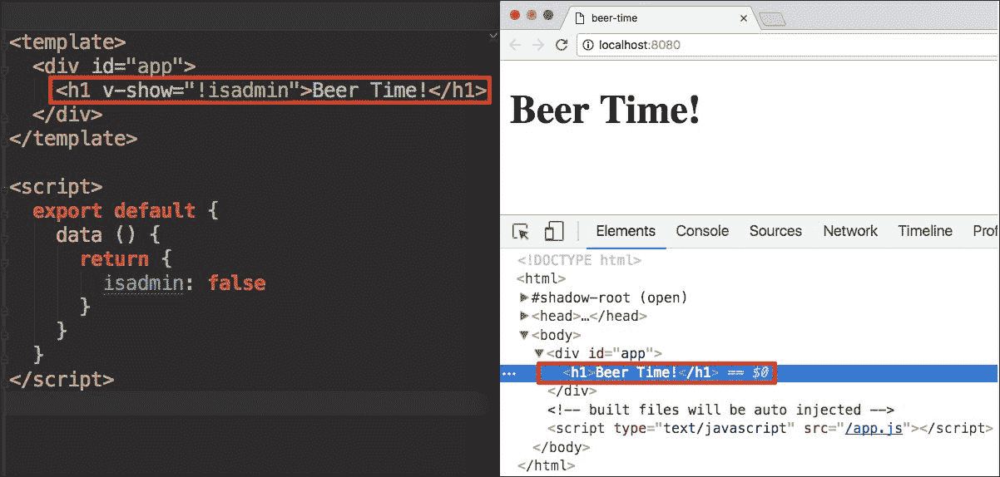
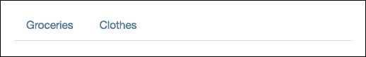
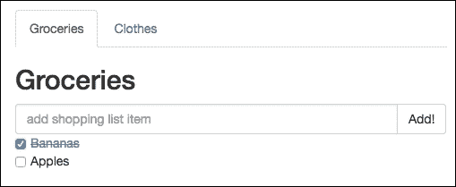

# 第 4 章反应性–将数据绑定到应用程序

在上一章中，您学习了 Vue.js 最重要的概念之一：组件。您了解了如何创建组件、如何注册、如何调用以及如何使用和重用它们。您还学习了单文件组件的概念，甚至在购物清单和 pomodoo 应用程序中使用了它们。

在本章中，我们将深入探讨数据绑定的概念。我们之前已经讨论过了，所以您已经熟悉了。我们将以所有可能的方式在组件中绑定数据。

综上所述，在本章中，我们将：

*   重温数据绑定语法
*   在我们的应用程序中应用数据绑定
*   迭代元素数组，并使用具有不同数据的相同模板呈现每个元素
*   在我们的应用程序中重新访问并应用数据和事件绑定的缩写

# 重温数据绑定

我们从第一章开始讨论数据绑定和反应性。因此，您已经知道数据绑定是一种将更改从数据传播到可见层的机制，反之亦然。在本章中，我们将仔细回顾所有不同的数据绑定方式，并将它们应用到我们的应用程序中。

# 插值数据

让我们想象一下下面的 HTML 代码：

```js
<div id="hello"></div> 

```

另外，想象一下以下 JavaScript 对象：

```js
var data = { 
  msg: 'Hello' 
}; 

```

如何在页面上呈现数据项的值？我们如何访问它们，以便在 HTML 中使用它们？实际上，在过去的两章中，我们已经在 Vue.js 上做了很多。一次又一次的理解和实践是没有问题的。

> *“重复最重要的研究”*

如果您已经是数据插值的专业人士，只需跳过本节，进入表达式和过滤器。

那么，我们应该如何用`msg`的值填充`<div>`呢？如果我们采用老式的 jQuery 方式，我们可能会执行以下操作：

```js
$("#hello").text(data.msg); 

```

但是，在运行时，如果您更改了`msg`的值，并且希望将此更改传播到 DOM，则必须手动执行。通过简单地更改`data.msg`值，什么也不会发生。

例如，让我们编写以下代码：

```js
var data = { 
  msg: 'Hello' 
}; 
$('#hello').text(data.msg); 
data.msg = 'Bye'; 

```

当然，`<div>`中出现的文本将是`Hello`。在[处检查此 JSFIDLEhttps://jsfiddle.net/chudaol/uevnd0e4/](https://jsfiddle.net/chudaol/uevnd0e4/) 。

使用 Vue，最简单的插值是通过`{{ }}`（把手注释）完成的。在我们的示例中，我们将编写以下 HTML 代码：

```js
<div id="hello">{{ msg }}</div> 

```

因此，`<div>`的内容与`msg`数据绑定。每次`msg`改变，`div`的内容会随内容自动改变。请看一下位于[的 JSFIDLE 示例 https://jsfiddle.net/chudaol/xuvqotmq/1/](https://jsfiddle.net/chudaol/xuvqotmq/1/) 。`data.msg`在 Vue 实例化后也发生了变化。屏幕上显示的值是新值！

它仍然是单向绑定插值。如果我们更改 DOM 中的值，数据将不会发生任何变化。尽管如此，如果我们只需要数据的值出现在 DOM 中并进行相应的更改，那么这是一种完美而有效的方法。

此时，应该非常清楚，如果我们想在模板中使用`data`对象的值，我们应该用`{{}}`包围它们。

让我们将缺少的插值添加到 pomodoo 应用程序中。请在[第 4 章/pomodoro](https://github.com/PacktPublishing/Learning-Vue.js-2/tree/master/chapter4/pomodoro)文件夹中查看当前情况。如果您运行`npm run dev`并查看打开的页面，您将看到该页面如下所示：


Pomodoro 应用程序中缺少插值

从第一眼看到这一页，我们就能够识别出它遗漏了什么。

页面缺少计时器、小猫、Pomodoro 状态的标题（显示**`Work!`**或**`Rest!`**的标题），以及根据 Pomodoro 状态显示或隐藏小猫占位符的逻辑。让我们从添加 Pomodoro 状态的标题和 Pomodoro 计时器的分秒开始。

## 增加波莫多罗州的名称

首先，我们应该决定这个元素应该属于哪个组件。看看我们的四个组成部分。很明显，它应该属于`StateTitleComponent`。如果查看以下代码，您将看到它实际上已经在其模板中插入了标题：

```js
//StateTitleComponent.vue 
<template> 
  <h3>{{ title }}</h3> 
</template> 

<style scoped> 
</style> 

<script> 
</script> 

```

好的在上一章中，我们已经完成了大部分工作。现在我们只需要添加必须插值的数据。在这个组件的`<script>`标记中，我们添加`data`对象，其中包含`title`属性。现在，让我们将其硬编码为一个可能的值，然后决定如何更改它。你喜欢什么？**`Work!`**还是**`Rest!`**？我想我知道答案，所以让我们在`script`标签中添加以下代码：

```js
//StateTitleComponent.vue 
<script> 
  export default { 
    data () { 
      return { 
        title: 'Learning Vue.js!' 
      } 
    } 
  } 
</script> 

```

现在就这样吧。我们稍后将在“方法和事件处理”一节中回到这一点。

## 运动

与我们添加 Pomodoro 州标题的方式相同，请将分钟和秒计时器计数器添加到`CountDownComponent`。它们现在可以硬编码。

# 使用表达式和过滤器

在前面的示例中，我们在`{{}}`插值中使用了简单的属性键。实际上，Vue 在这些漂亮的花括号中支持更多。让我们看看在那里可以做些什么。

## 表达

这听起来可能出乎意料，但 Vue 在数据绑定括号内支持完整的 JavaScript 表达式！让我们转到任何 pomodoo 应用程序组件，并将任何 JavaScript 表达式添加到模板中。您可以在[第 4 章/pomodoro2](https://github.com/PacktPublishing/Learning-Vue.js-2/tree/master/chapter4/pomodoro2)文件夹中进行一些实验。

例如，尝试打开`StateTitleComponent.vue`文件。让我们向其模板添加一些 JavaScript 表达式插值，例如：

```js
{{ Math.pow(5, 2) }} 

```

实际上，您只需要取消注释以下行：

```js
//StateTitleComponent.vue 
<!--<p>--> 
  <!--{{ Math.pow(5, 2) }}--> 
<!--</p>--> 

```

您将在页面上看到编号**`25`**。很好，不是吗？让我们用 JavaScript 表达式替换 pomodoo 应用程序中的一些数据绑定。例如，在`CountdownComponent`组件的模板中，`min`和`sec`的两个指令可以被一个表达式替换。目前情况如下：

```js
//CountdownComponent.vue 
<template> 
  <div class="well"> 
    <div class="pomodoro-timer"> 
      <span>{{ min }}</span>:<span>{{ sec }}</span> 
    </div> 
  </div> 
</template> 

```

我们可以将其替换为以下代码：

```js
//CountdownComponent.vue 
<template> 
  <div class="well"> 
    <div class="pomodoro-timer"> 
      <span>{{ min + ':' + sec }}</span> 
    </div> 
  </div> 
</template> 

```

我们还可以在哪里添加一些表达式？我们来看看`StateTitleComponent`。此时，我们使用硬编码标题。然而，我们知道，它应该以某种方式取决于波莫多罗状态。如果处于*工作*状态，则显示**`Work!`**，否则显示**`Rest!`**。我们创建这个属性并将其命名为`isworking`，然后将其分配给主`App.vue`组件，因为它似乎属于全局应用程序状态。然后我们将在`StateTitleComponent`组件的`props`属性中重用它。因此，打开`App.vue`，添加布尔属性`isworking`并将其设置为`true`：

```js
//App.vue 
<...> 
window.data = { 
  kittens: true, 
  isworking: true 
}; 

export default { 
  <...> 
  data () { 
    return window.data 
  } 
} 

```

现在让我们在`StateTitleComponent`中重用此属性，为每个可能的标题添加两个字符串属性，最后，在模板中添加表达式，该表达式将有条件地根据当前状态呈现一个或另一个标题。因此，组件的脚本如下所示：

```js
//StateTitleComponent.vue 
<script> 
  export default { 
    data () { 
      return { 
        workingtitle: 'Work!', 
        restingtitle: 'Rest!' 
      } 
    }, 
    props: ['isworking'] 
  } 
</script> 

```

现在我们可以根据`isworking`属性有条件地呈现一个或另一个标题。因此，`StateTitleComponent`的模板如下所示：

```js
<template> 
  <div> 
    <h3> 
      {{ isworking ? workingtitle : restingtitle }} 
    </h3> 
  </div> 
</template> 

```

查看刷新的页面。奇怪的是，它的标题是**`Rest!`**。如果`App.vue`中的`isworking`属性设置为`true`，这是如何发生的？我们只是忘记了在`App.vue`模板中的组件调用上绑定此属性！打开`App.vue`组件，在`state-title-component`调用中添加以下代码：

```js
<state-title-component v-bind:isworking="isworking"></state-title-component> 

```

现在，如果您查看页面，正确的标题显示为**`Work!`**。如果您打开 devtools 控制台并键入`data.isworking = false`，您将看到标题更改。

如果`isworking`属性为`false`，则标题为**`Rest!`**，如下图所示：



如果`isworking`属性为`true`，则标题为**`Work!`**，如下图所示：



## 过滤器

除了花括号内的表达式外，还可以使用应用于表达式结果的过滤器。过滤器只是函数。它们由我们创建并使用管道符号`|`应用。如果创建的过滤器使字母大写，并将其称为大写，则为了应用它，只需在胡须插值内的管道符号后使用它：

```js
<h3> {{ title | lowercase }} </h3> 

```

您可以链接任意多个筛选器，例如，如果您有筛选器`A`、`B`、`C`，您可以执行类似于`{{ key | A | B | C }}`的操作。过滤器是使用`Vue.filter`语法创建的。让我们创建我们的`lowercase`过滤器：

```js
//main.js 
Vue.filter('lowercase', (key) => { 
  return key.toLowerCase() 
}) 

```

让我们将其应用于主`App.vue`组件中的 Pomotoro 标题。为了能够使用过滤器，我们应该在把手插值符号中传递`'Pomodoro'`字符串。我们应该将其作为 JavaScript 字符串表达式传递，并使用管道符号应用过滤器：

```js
<template> 
  <...> 
    <h2> 
      <span>{{ 'Pomodoro' | lowercase }}</span> 
      <controls-component></controls-component> 
    </h2> 
  <...> 
</template> 

```

检查页面；**`Pomodoro`**标题实际上是用小写语法书写的。

让我们重温一下`CountdownTimer`组件，看看计时器。现在，只有硬编码的值，对吗？但当应用程序功能齐全时，这些值将来自一些计算。值的范围将从 0 到 60。如果计时器显示**`20:40`**可以，但少于十个值则不可以。例如，当它只有 1 分 5 秒时，它将是**`1:5`**，这是不好的。我们期待看到类似于**`01:05`**的东西。所以，我们需要`leftpad`过滤器！让我们创建它。

转到`main.js`文件，在大写过滤器定义后添加`leftpad`过滤器：

```js
//main.js 
Vue.filter('leftpad', (value) => { 
  if (value >= 10) { 
    return value 
  } 
  return '0' + value 
}) 

```

打开`CountdownComponent`组件，让我们再次将`min`和`sec`拆分到不同的内插括号中，并为每个括号添加过滤器：

```js
//CountdownComponent.vue 
<template> 
  <div class="well"> 
    <div class="pomodoro-timer"> 
      <span>{{ min | leftpad }}:{{ sec | leftpad }}</span> 
    </div> 
  </div> 
</template> 

```

将数据中的`min`和`sec`分别替换为 1 和 5，然后查看。这些数字前面有一个“0”！

## 运动

创建两个过滤器`uppercase`和`addspace`，并将它们应用于标题**`Pomodoro:`**

*   `uppercase`过滤器必须完全按照它所说的做
*   `addspace`过滤器必须在给定字符串值的右侧添加空格

不要忘记**`Pomodoro`**不是一个键，所以在插值括号内，它应该被视为一个字符串！此练习前后的标题如下所示：



应用过滤器前后的 Pomodoro 应用程序标题大写和 addspace

检查自己：查看[第 4 章/pomodoro3](https://github.com/PacktPublishing/Learning-Vue.js-2/tree/master/chapter4/pomodoro3)文件夹。

# 重新审视和应用指令

在上一节中，我们了解了如何插值应用程序的数据以及如何将其绑定到可视层。虽然语法功能非常强大，并且提供了修改数据的高可能性（使用过滤器和表达式），但它有一些局限性。例如，尝试使用`{{}}`符号实现以下内容：

*   在用户输入中使用插值数据，并在用户输入时将更改应用于相应的数据
*   将特定元素的属性（例如，`src`）绑定到数据
*   有条件地呈现某个元素
*   迭代一个数组，并用数组的元素呈现一些组件
*   在元素上创建事件侦听器

让我们至少试试第一个。例如，打开购物清单应用程序（位于[第 4 章/购物清单](https://github.com/PacktPublishing/Learning-Vue.js-2/tree/master/chapter4/shopping-list)文件夹中）。在`App.vue`模板中创建一个`input`元素，并将其值设置为`{{ title }}`：

```js
<template> 
  <div id="app" class="container"> 
    <h2>{{ title }}</h2> 
    <input type="text" value="{{ title }}"> 
    <add-item-component></add-item-component> 
    <...> 
  </div> 
</template> 

```

哦，不！错误，到处都是错误。**`Interpolation inside attributes has been removed,`**上面写着。这是否意味着在 Vue 2.0 之前，您可以轻松使用属性内部的插值？是的，也不是。如果在属性中使用插值，则不会出现错误，但在输入中更改标题将不会产生任何结果。在 Vue 2.0 以及以前的版本中，为了实现这种行为，我们必须使用指令。

### 注

**指令**是具有`v-`前缀的元素的特殊属性。为什么`v-`？因为 Vue！指令提供了一种比简单的文本插值更丰富的语法。他们有能力在每次数据更改时对可视层应用一些特殊行为。

## 使用 v-model 指令的双向绑定

双向绑定是一种绑定类型，其中不仅数据更改被传播到 DOM 层，而且 DOM 中绑定数据发生的更改也被传播到数据层。要以这种方式将数据绑定到 DOM，我们可以使用`v-model`指令。

我相信您仍然记得从第一章开始，`v-model`指令的用法如下：

```js
<input type="text" v-model="title"> 

```

这样，标题值将显示在输入中，如果在此输入中键入内容，相应的更改将立即应用于数据，并反映在页面上的所有插值中。

只需将车把符号替换为`v-model`并打开页面。

尝试在输入中键入一些内容。您将看到标题是如何立即更改的！

请记住，此指令只能用于以下元素：

*   `<input>`
*   `<select>`
*   `<textarea>`

请全部尝试，然后删除此代码。我们的主要目的是能够使用 ChangeTitle 组件更改标题。

## 组件之间的双向绑定

请记住上一章中提到的使用`v-model`指令无法轻松实现组件之间的双向绑定。由于体系结构方面的原因，Vue 只会阻止孩子轻松更改家长的范围。

这就是为什么我们在上一章中使用事件系统，以便能够从子组件更改购物列表的标题。

我们将在本章中再次这样做。只需等待几段，直到我们到达关于`v-on`指令的部分。

## 使用 v-bind 指令绑定属性

`v-bind`指令允许我们将元素的`attribute`或`component`属性绑定到表达式。为了将其应用于特定属性，我们使用冒号分隔符：

```js
v-bind:attribute 

```

例如：

*   `v-bind:src="src"`
*   `v-bind:class="className"`

`""`中可以写任何表达式。与前面的示例一样，也可以使用数据属性。让我们使用`thecatapi`作为源，将小猫图像添加到 Pomodoro 应用程序中的`KittenComponent`。从[第 4 章/pomodoro3](https://github.com/PacktPublishing/Learning-Vue.js-2/tree/master/chapter4/pomodoro3)文件夹打开我们的 Pomodoro 应用程序。

打开`KittenComponent`，将`catimgsrc`添加到组件数据中，并使用`v-bind`语法和`src`属性将其绑定到图像模板：

```js
<template> 
  <div class="well"> 
     
  </div> 
</template> 

<style scoped> 
</style> 

<script> 
  export default { 
    data () { 
      return { 
        catimgsrc: "http://thecatapi.com/aimg/get?size=med" 
      } 
    } 
  } 
</script> 

```

打开页面。享受这只小猫！


具有应用源属性的 Pomodoro KittenComponent

## 使用 v-if 和 v-show 指令的条件渲染

如果您在前面的部分中已经足够注意，并且如果我要求您有条件地呈现某些内容，那么您实际上可以使用内插括号`{{ }}`中的 JavaScript 表达式来实现。

但是，请尝试有条件地呈现某些元素或整个组件。它可能不像在括号内应用表达式那么简单。

`v-if`指令允许有条件地呈现整个元素，根据某些条件，该元素也可能是组件元素。条件可以是任何表达式，也可以使用数据属性。例如，我们可以执行以下操作：

```js
<div v-if="1 < 5">hello</div> 

```

或：

```js
<div v-if="Math.random() * 10 < 6">hello</div> 

```

甚至：

```js
<div v-if="new Date().getHours() >= 16">Beer Time!</div> 

```

或使用组件的数据：

```js
<template> 
  <div> 
    <h1 v-if="!isadmin">Beer Time!</h1> 
  </div> 
</template> 
<script> 
  export default { 
    data () { 
      return { 
        isadmin: false 
      } 
    } 
  } 
</script> 

```

`v-show`属性做同样的工作。唯一的区别是`v-if`将或不会相应地将元素呈现给条件，而`v-show`属性将始终呈现元素，当条件的结果为`false`时，仅应用`display:none`CSS 属性。让我们看看区别。打开[第 4 章/啤酒时间](https://github.com/PacktPublishing/Learning-Vue.js-2/tree/master/chapter4/beer-time)文件夹中的`beer-time`项目。运行`npm install`和`npm run dev`。打开`App.vue`组件，播放`true`/`false`值，尝试将`v-if`替换为`v-show`。打开 devtools 并检查**`elements`**选项卡。

让我们首先检查一下当我们使用`v-if`在`isadmin`属性值中的`true`和`false`之间切换时它的外观。

当条件满足时，一切都如预期的那样出现；元素将呈现并显示在页面上：


使用 v-if 指令的条件渲染。条件满足。

如果不满足条件，则不渲染元素：



使用 v-if 指令的条件渲染。不符合条件。

请注意，如果条件未满足，则根本不会渲染相应的元素！

让我们使用`v-show`指令处理条件结果值。当条件满足时，其显示方式与前一个案例中使用`v-if`时完全相同：



使用 v-show 指令的条件渲染。条件满足。

现在，让我们检查当不满足正确条件时，使用`v-show`指令的元素会发生什么：


使用 v-show 指令的条件渲染。不符合条件。

在这种情况下，当条件满足时，一切都是一样的，但是当条件未满足时，元素也会使用`display:none`CSS 属性呈现。

你如何决定哪一个更好用？在第一次渲染时，如果不满足条件，`v-if`指令将根本不渲染元素，从而降低初始渲染的计算成本。但是，如果属性在运行时频繁更改，则呈现/删除元素的成本高于仅应用`display:none`属性。因此，如果在运行期间条件不会发生太大变化，则使用频繁更改属性的`v-show`和`v-if`。

让我们回到我们的 Pomodoro 应用程序。当 Pomotoro 不在其工作状态时，应有条件地呈现`KittensComponent`。因此，在[第 4 章/pomodoro4](https://github.com/PacktPublishing/Learning-Vue.js-2/tree/master/chapter4/pomodoro4)文件夹中打开您的 Pomodoro 应用程序代码。

你认为应该用什么？`v-if`还是`v-show`？让我们分析一下。与我们使用的内容无关，该元素是否应该在初始渲染时可见？答案是否定的，因为在初始渲染时，用户开始工作日并启动 Pomodoro 计时器。在没有必要的情况下，最好使用`v-if`来避免初始渲染的成本。但是，让我们分析另一个因素，即切换状态的频率，这将使小猫组件可见/不可见。这将发生在每个波莫多罗间歇期，对吗？在 15-20 分钟的工作之后，然后在 5 分钟的休息间隔之后，实际上，这并不频繁，也不会对渲染成本造成太大影响。在这种情况下，在我看来，你用哪一个并不重要。让我们使用`v-show`。打开`App.vue`文件并将`v-show`指令应用于`kittens-component`调用：

```js
<template> 
  <div id="app" class="container"> 
    <...> 
    <transition name="fade"> 
      <kittens-component v-show="!isworking"></kittens-component> 
    </transition> 
  </div> 
</template> 

```

打开页面，尝试在 devtools 控制台中切换`data.isworking`的值。您将看到**小猫**容器是如何出现和消失的。

## 使用 v-for 指令的数组迭代

您可能还记得，数组迭代是使用具有以下语法的`v-for`指令完成的：

```js
<div v-for item in items> 
  item 
</div> 

```

或使用组件：

```js
<component v-for item in items v-bind:componentitem="item"></component> 

```

对于数组中的每个项，这将呈现一个组件，并将组件的`item`属性绑定到该项的值。当然，您还记得，在绑定语法的`""`中，您可以使用任何您想要的 JavaScript 表达式。所以，要有创意！

### 提示

不要忘记我们在绑定语法（`componentitem`中使用的属性应该出现在组件的数据中！

例如，看看我们的购物清单应用程序（第 4 章[第 4 章/购物清单](https://github.com/PacktPublishing/Learning-Vue.js-2/tree/master/chapter4/shopping-list)文件夹）。它已经使用了`ItemsComponent`中的`v-for`语法来呈现项目列表：

```js
<template> 
  <ul> 
    <item-component v-for="item in items" :item="item"></item-component> 
  </ul> 
</template> 

```

`ItemComponent`反过来使用`props`声明`item`属性：

```js
<script> 
  export default { 
    props: ['item'] 
  } 
</script> 

```

现在，让我们用购物清单应用程序做一些有趣的事情。到目前为止，我们只处理一份购物清单。想象一下，对于不同类型的购物，您希望有不同的购物清单。例如，您可能有一个正常杂货购物日的常规购物清单。假期你可能会有不同的购物清单。当你买新房子时，你可能还想有一个不同的购物清单。让我们利用 Vue 组件的可重用性，将购物清单应用程序转换为购物清单！我们将使用 Bootstrap 的选项卡面板显示它们；更多信息，请参考[http://getbootstrap.com/javascript/#tabs](http://getbootstrap.com/javascript/#tabs) 。

在 IDE 中打开您的购物清单应用程序（在[第 4 章/购物清单](https://github.com/PacktPublishing/Learning-Vue.js-2/tree/master/chapter4/shopping-list)文件夹中）。

首先，我们应该添加 Bootstrap 的 JavaScript 文件和 jQuery，因为 Bootstrap 依靠它来实现其惊人的魔力。继续，只需手动将它们添加到`index.html`文件：

```js
  <body> 
    <...> 
    <script src="https://code.jquery.com/jquery-3.1.0.js"></script> 
    <script 
      src="https://maxcdn.bootstrapcdn.com/bootstrap/3.3.7/js/bootstrap.min.js"> 
    </script> 
    <...> 
  </body> 

```

现在，让我们一步一步地概述一下，为了将我们的应用程序转换为购物清单，我们应该做些什么：

1.  首先，我们必须创建一个新组件。让我们称之为`ShoppingListComponent`并将当前`App.vue`的内容移动到那里。
2.  我们的新`ShoppingListComponent`应该包含`props`属性和`title`和`items`，它将从`App.vue`接收。
3.  `ItemsComponent`应该从`props`属性接收`items`，而不是硬编码。
4.  在`App`组件的`data`中，让我们声明并硬编码（目前）一个`shoppinglists`数组，每个项目都应该有一个标题、一个项目数组和一个 ID。
5.  `App.vue`导入`ShoppingListComponent`，在模板中迭代`shoppinglists`数组，针对每个`shoppinglists`数组，为每个购物清单构建标签面板的`html/jade`结构。

好吧，那我们开始吧！

### 创建 ShoppingListComponent 并修改 ItemsComponent

在`components`文件夹中，创建一个新的`ShoppingListComponent.vue`。将`App.vue`文件的内容复制粘贴到此新文件中。不要忘记声明将包含`title`和`items`的`props`，并将`items`绑定到模板内的`items-component`调用。此组件的最终代码应如下所示：

```js
//ShoppingListComponent.vue 
<template> 
  <div> 
    <h2>{{ title }}</h2> 
    <add-item-component></add-item-component> 
    <items-component v-bind:items="items"></items-component> 
    <div class="footer"> 
      <hr /> 
      <change-title-component></change-title-component> 
    </div> 
  </div> 
</template> 

<script> 
  import AddItemComponent from './AddItemComponent' 
  import ItemsComponent from './ItemsComponent' 
  import ChangeTitleComponent from './ChangeTitleComponent' 

  export default { 
    components: { 
      AddItemComponent, 
      ItemsComponent, 
      ChangeTitleComponent 
    } 
    props: ['title', 'items'] 
  } 
</script> 

<style scoped> 
  .footer { 
    font-size: 0.7em; 
    margin-top: 20vh; 
  } 
</style> 

```

注意，我们从父项`div`中删除了容器和容器`class`的样式。这部分代码应该保留在`App.vue`中，因为它定义了全局应用程序的容器样式。不要忘记`props`属性和`props`到`items-component`的绑定！

打开`ItemsComponent.vue`并确保其包含带有`items`的`props`属性：

```js
<script> 
  <...> 
  export default { 
    props: ['items'], 
    <...> 
  } 
</script> 

```

### 修改 App.vue

现在转到`App.vue`。移除`<script>`和`<template>`标签内的所有代码。在`script`标记中，导入`ShoppingListComponent`并在`components`属性中调用它：

```js
//App.vue 
<script> 
  import ShoppingListComponent from './components/ShoppingListComponent' 

  export default { 
    components: { 
      ShoppingListComponent 
    } 
  } 
</script> 

```

添加一个`data`属性并在那里创建一个`shoppinglists`数组。为此数组添加任意数据。数组中的每个对象都应该具有`id`、`title`和`items`属性。正如您所记得的，`items`必须包含`checked`和`text`属性。例如，您的`data`属性可能如下所示：

```js
//App.vue 
<script> 
  import ShoppingListComponent from './components/ShoppingListComponent' 

  export default { 
    components: { 
      ShoppingListComponent 
    }, 
    data () { 
      return { 
        shoppinglists: [ 
          { 
            id: 'groceries', 
            title: 'Groceries', 
            items: [{ text: 'Bananas', checked: true }, 
                    { text: 'Apples', checked: false }] 
          }, 
          { 
            id: 'clothes', 
            title: 'Clothes', 
            items: [{ text: 'black dress', checked: false }, 
                    { text: 'all stars', checked: false }] 
          } 
        ] 
      } 
    } 
  } 
</script> 

```

比我更有创意：添加更多的列表，更多的项目，一些好的和有趣的东西！

现在，让我们创建一个结构，用于基于购物列表上的迭代来组成引导选项卡面板！让我们从定义选项卡工作所需的基本结构开始。让我们添加所有必要的类和 jade 结构，假装我们只有一个元素。让我们也用大写字母来锁定将从购物列表数组中重用的所有未知项：

```js
//App.vue 
<template> 
  <div id="app" class="container"> 
    <ul class="nav nav-tabs" role="tablist"> 
      <li role="presentation"> 
        <a href="ID" aria-controls="ID" role="tab" data-toggle="tab">TITLE</a> 
      </li> 
    </ul> 
    <div class="tab-content"> 
      <div class="tab-pane" role="tabpanel" id="ID"> 
        SHOPPING LIST COMPONENT 
      </div> 
    </div> 
  </div> 
</template> 

```

我们需要迭代购物列表数组中的两个元素，`<li>`标记包含`<a>`属性和`tab-pane`div。在第一种情况下，我们必须将每个购物列表的 ID 绑定到`href`和`aria-controls`属性，并插入标题。在第二种情况下，我们需要将`id`属性绑定到`id`属性，呈现购物列表项，并将`items`数组和`title`绑定到它。容易的走吧。首先将`v-for`指令添加到每个元素（添加到`<li>`和`tab-pane div`元素）：

```js
//App.vue 
<template> 
  <div id="app" class="container"> 
    <ul class="nav nav-tabs" role="tablist"> 
      <li v-for="list in shoppinglists" role="presentation"> 
        <a href="ID" aria-controls="ID" role="tab" data-
          toggle="tab">TITLE</a> 
      </li> 
    </ul> 
    <div class="tab-content"> 
      <div v-for="list in shoppinglists" class="tab-pane" 
        role="tabpanel" 
        id="ID"> 
        SHOPPING LIST COMPONENT 
      </div> 
    </div> 
  </div> 
</template> 

```

现在用合适的绑定件更换 Caps Lock 中的零件。记住，对于`bind`属性，我们使用`v-bind:<corresponding_attribute>="expression"`语法。

对于锚元素的`href`属性，我们必须定义一个表达式，将 ID 选择器`#`附加到`id: v-bind:href="'#' + list.id"`。`aria-controls`属性应该绑定到 ID 的值。`title`可以使用简单的`{{ }}`符号插值进行绑定。

对于`shopping-list-component`，我们必须将`title`和`items`绑定到列表项的对应值。您还记得我们在`ShoppingListComponent`的`props`中定义了`title`和`items`属性吗？因此，绑定应该类似于`v-bind:title=list.title`和`v-bind:items=list.items`。

因此，在正确的绑定属性之后，模板将如下所示：

```js
//App.vue 
<template> 
  <div id="app" class="container"> 
    <ul class="nav nav-tabs" role="tablist"> 
      <li v-for="list in shoppinglists" role="presentation"> 
        <a v-bind:href="'#' + list.id" v-bind:aria-controls="list.id" 
          role="tab" data-toggle="tab">{{ list.title }}</a> 
      </li> 
    </ul> 
    <div class="tab-content"> 
      <div v-for="list in shoppinglists" class="tab-pane" role="tabpanel"
        v-bind:id="list.id"> 
        <shopping-list-component v-bind: 
 v-bind:items="list.items"></shopping-list-component> 
      </div> 
    </div> 
  </div> 
</template> 

```

我们快完了！如果现在打开页面，您将看到页面上显示的两个选项卡的标题：



修改后屏幕上显示的选项卡标题

如果开始单击选项卡标题，将打开相应的选项卡窗格。但这不是我们期望看到的，对吗？我们所期望的是默认情况下第一个选项卡是可见的（活动的）。为此，我们应该将`active`类添加到第一个`li`和第一个`tab-pane div`中。但是，如果只要我们在数组中迭代，所有选项卡的代码都是相同的，我们怎么做呢？

幸运的是，Vue 不仅允许我们在`v-for`循环中提供*迭代项*，还允许我们提供`index`，然后在模板中使用的表达式中重用此`index`变量。因此，如果索引为“0”，我们可以使用它有条件地呈现`active`类。在`v-for`循环中使用`index`变量非常简单，如下所示：

```js
v-for="(list, index) in shoppinglists" 

```

【对于类 T0，语法也是相同的】：

```js
v-bind:class= "active" 

```

您还记得我们可以在引号中编写任何 JavaScript 表达式吗？在这种情况下，我们想写一个条件来计算`index`的值，如果为“0”，则类的值为`active`：

```js
v-bind:class= "index===0 ? 'active' : ''" 

```

将`index`变量添加到`v-for`修饰符中，并将`class`绑定到`li`和`tab-pane`元素中，这样最终的模板代码如下所示：

```js
<template> 
  <div id="app" class="container"> 
    <ul class="nav nav-tabs" role="tablist"> 
      <li v-bind:class= "index===0 ? 'active' : 
        ''" v-for="(list, index) in shoppinglists" role="presentation"> 
        <a v-bind:href="'#' + list.id" v-bind:aria-controls="list.id" 
          role="tab" data-toggle="tab">{{ list.title }}</a> 
      </li> 
    </ul> 
    <div class="tab-content"> 
      <div v-bind:class= "index===0 ? 'active' : ''" 
        v-for="(list,index) in shoppinglists" class="tab-pane" 
        role="tabpanel" v-bind:id="list.id"> 
        <shopping-list-component v-bind: 
          v-bind:items="list.items"></shopping-list-component> 
      </div> 
    </div> 
  </div> 
</template> 

```

看这一页。现在，您应该看到默认情况下显示内容的漂亮选项卡：



正确的类绑定后购物清单应用程序的外观

修改后的最终购物清单应用代码可在[第 4 章/shopping-list2](https://github.com/PacktPublishing/Learning-Vue.js-2/tree/master/chapter4/shopping-list2)文件夹中找到。

## 使用 v-on 指令的事件侦听器

使用 Vue.js 收听事件和回调非常容易。事件侦听还使用一个特殊指令完成，该指令对每个事件类型都有特定的修饰符。该指令为`v-on`。修改器应用于冒号之后：

```js
v-on:click="myMethod" 

```

好的，你说，我在哪里声明这个方法？您可能不会相信我，但是所有组件的方法都在`methods`属性中声明！因此，要声明名为`myMethod`的方法，您应该执行以下操作：

```js
<script> 
  export default { 
    methods: { 
      myMethod () { 
        //do something nice  
      }  
    } 
  } 
</script> 

```

所有的`data`和`props`属性都可以使用`this`关键字在方法内部访问。

让我们添加一个方法，向`items`数组添加一个新项。在上一章中，我们已经完成了这项工作，当时我们学习了如何使用事件发射系统在父组件和子组件之间传递数据。我们将在这里重述这一部分。

为了能够将`AddItemComponent`内的新项目添加到属于`ShoppingListComponent`的购物清单中，我们应该执行以下操作：

*   确保`AddItemComponent`有一个名为`newItem`的`data`属性。
*   在`AddItemComponent`中创建一个`addItem`方法，推送`newItem`并发出事件`add`。
*   使用`v-on:click`指令将事件侦听器应用于**`Add!`**按钮。此事件侦听器应调用已定义的`addItem`方法。
*   在`ShoppingListComponent`中创建一个`addItem`方法，将`text`作为参数接收并推送到`items`数组中。
*   将带有自定义`add`修饰符的`v-on`指令绑定到`ShoppingListComponent`内部的`add-item-component`调用。此侦听器将调用此组件中定义的`addItem`方法。

那我们走吧！使用[第 4 章/shopping-list2](https://github.com/PacktPublishing/Learning-Vue.js-2/tree/master/chapter4/shopping-list2)文件夹中的购物清单应用程序，并使用它。

首先打开`AddItemComponent`并将缺失的`v-on`指令添加到**`Add!`**按钮和`addItem`方法中：

```js
//AddItemComponent.vue 
<template> 
  <div class="input-group"> 
    <input type="text" v-model="newItem" 
      placeholder="add shopping list item" class="form-control"> 
    <span class="input-group-btn"> 
      <button v-on:click="addItem" class="btn btn-default" 
        type="button">Add!</button> 
    </span> 
  </div> 
</template> 

<script> 
  export default { 
    data () { 
      return { 
        newItem: '' 
      } 
    }, 
    methods: { 
      addItem () { 
        var text 

        text = this.newItem.trim() 
        if (text) { 
          this.$emit('add', this.newItem) 
          this.newItem = '' 
        } 
      } 
    } 
  } 
</script> 

```

切换到`ShoppingListComponent`并将`v-on:add`指令绑定到`template`标签内的`add-item-component`调用：

```js
//ShoppingListComponent.vue 
<template> 
  <div> 
    <h2>{{ title }}</h2> 
    <add-item-component v-on:add="addItem"></add-item-component> 
    <items-component v-bind:items="items"></items-component> 
    <div class="footer"> 
      <hr /> 
      <change-title-component></change-title-component> 
    </div> 
  </div> 
</template> 

```

现在在`ShoppingListComponent`中创建`addItem`方法。它应该接收文本并将其推入`this.items`数组：

```js
//ShoppingListComponent.vue 
<script> 
  import AddItemComponent from './AddItemComponent' 
  import ItemsComponent from './ItemsComponent' 
  import ChangeTitleComponent from './ChangeTitleComponent' 

  export default { 
    components: { 
      AddItemComponent, 
      ItemsComponent, 
      ChangeTitleComponent 
    }, 
    props: ['title', 'items'], 
    methods: { 
      addItem (text) { 
        this.items.push({ 
          text: text, 
          checked: false 
        }) 
      } 
    } 
  } 
</script> 

```

打开页面，通过在输入框中键入并在其后单击按钮，尝试将项目添加到列表中。它起作用了！

现在，我想请您将您的角色从应用程序的开发人员切换到其用户。在输入框中键入新项。引入项目后，用户的明显行为是什么？你不是想按*进入*按钮吗？我打赌你是！当什么都没发生的时候，这有点令人沮丧，不是吗？别担心，我的朋友，我们只需在输入框中再添加一个事件侦听器，然后调用与使用**`Add!`**按钮相同的方法。

听起来很简单，对吧？当我们点击*进入*按钮时，会触发什么事件？对，这是一个关键事件。因此，我们只需在分隔符冒号之后使用带有`keyup`方法的`v-on`指令：`v-on:keyup`。问题是，当按下任何键盘按钮时都会触发此事件，这意味着当我们键入新的购物列表项时，每次引入新字母时，都会调用该方法。这不是我们想要的。当然，我们可以在`addItem`方法中添加一个条件来检查`event.code`属性，只有在`13`（对应于*Enter*键）的情况下，我们才会调用该方法的其余部分。幸运的是，对于我们来说，Vue 提供了一种机制来为这个方法提供击键修饰符，它只允许我们在命中某个键代码时调用一个方法。应使用点（`.`修饰符实现。就我们而言，情况如下：

```js
v-on:keyup.enter 

```

让我们把它添加到输入框中。转到`AddItemComponent`并将`v-on:keyup.enter`指令添加到输入中，如下所示：

```js
<template> 
  <div class="input-group"> 
    <input type="text" v-on:keyup.enter="addItem" v-model="newItem" 
      placeholder="add shopping list item" class="form-control"> 
    <span class="input-group-btn"> 
      <button v-on:click="addItem" class="btn btn-default" 
        type="button">Add!</button> 
    </span> 
  </div> 
</template> 

```

打开页面，尝试使用*输入*按钮将项目添加到购物清单中。它起作用了！

让我们做同样的标题改变。唯一的区别是添加项目时，我们使用了一个自定义的`add`事件，这里我们将使用本机输入事件。我们已经做到了。我们只需执行以下步骤：

1.  使用`v-model`指令将模型标题绑定到`ShoppingListComponent`模板中的`change-title-component`。
2.  在`ChangeTitleComponent`的`props`属性中导出`value`。
3.  在`ChangeTitleComponent`中创建一个`onInput`方法，该方法将发出带有事件目标值的本机`input`方法。
4.  使用`onInput`修饰符将`value`绑定到`ChangeTitleComponent`组件模板内的`input`和`v-on`指令。

因此，`ShoppingListComponent`模板内的`change-title-component`调用将如下所示：

```js
//ShoppingListComponent.vue 
<change-title-component v-model="title"></change-title-component> 

```

`ChangeTitleComponent`将如下所示：

```js
//ChangeTitleComponent.vue 
<template> 
  <div> 
    <em>Change the title of your shopping list here</em> 
    <input v-bind:value="value" v-on:input="onInput"/> 
  </div> 
</template> 

<script> 
  export default { 
    props: ['value'], 
    methods: { 
      onInput (event) { 
        this.$emit('input', event.target.value) 
      } 
    } 
  } 
</script>  

```

此部分的最终代码可在[第 4 章/shopping-list3](https://github.com/PacktPublishing/Learning-Vue.js-2/tree/master/chapter4/shopping-list3)文件夹中找到。

## 速记

当然，每次在代码中写入`v-bind`或`v-on`指令并不耗时。开发人员倾向于认为，每次我们减少代码量，我们就赢了。Vue.js 让我们赢得胜利！请记住，`v-bind`指令的缩写是冒号（`:`，而`v-on`指令的缩写是`@`符号。这意味着以下代码执行相同的操作：

```js
v-bind:items="items"  :items="items" 
v-bind:class=' $index === 0 ? "active" : ""'  
:class=' $index===0 ? "active" : ""' 
v-on:keyup.enter="addItem"  @keyup.enter="addItem" 

```

## 运动

使用我们刚刚学习的快捷方式重写购物清单应用程序中的所有`v-bind`和`v-on`指令。

查看[第 4 章/shopping-list4](https://github.com/PacktPublishing/Learning-Vue.js-2/tree/master/chapter4/shopping-list4)文件夹检查自己。

# 小猫

在本章中，我们并没有涉及太多关于 Pomodoro 应用程序及其漂亮小猫的内容。我向你保证，我们将在下一章做很多。同时，我希望这只小猫能让你快乐：


小猫问“下一步是什么？”

# 总结

在本章中，我们对将数据绑定到表示层的所有可能方法进行了全面的概述。您学习了如何使用把手括号（`{{ }}`）简单地插入数据。您还学习了如何在这种插值中使用 JavaScript 表达式和过滤器。您学习并应用了`v-bind`、`v-model`、`v-for`、`v-if`和`v-show`等指令。

我们修改了应用程序，以便它们使用更丰富、更高效的数据绑定语法。

在下一章中，我们将讨论 Vuex**，**这一受 Flux 和 Redux 启发但概念简化的状态管理体系结构。

我们将为这两个应用程序创建全局应用程序状态管理存储，并通过使用它来发掘它们的潜力。