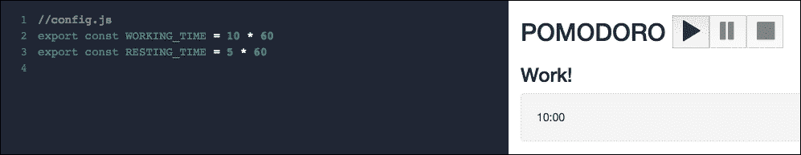
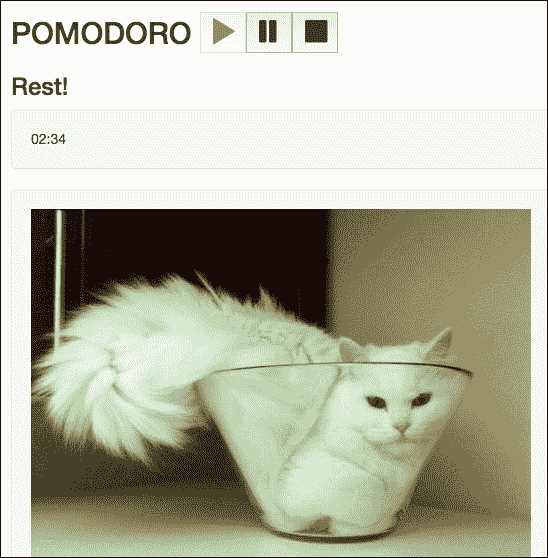
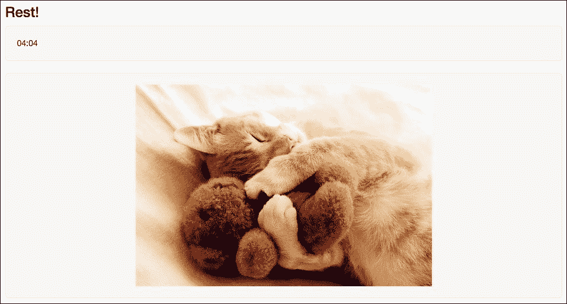

# 五、Vuex——管理应用中的状态

在上一章中，您学习了 Vue.js 最重要的概念之一：数据绑定。您学习并应用了许多将数据绑定到应用的方法。您还学习了如何使用指令、如何侦听事件以及如何创建和调用方法。在本章中，您将看到如何管理表示全局应用状态的数据。我们将讨论 Vuex，它是 Vue 应用中集中状态的一种特殊体系结构。您将学习如何创建全局数据存储以及如何在组件内部检索和更改它。我们将在应用中定义哪些数据是本地的，哪些数据应该是全局的，我们将使用 Vuex 存储区处理其中的全局状态。

综上所述，在本章中，我们将：

*   了解本地和全局应用状态之间的差异
*   了解什么是 Vuex 及其工作原理
*   了解如何使用全局存储中的数据
*   了解存储获取者、突变和操作
*   在购物清单和 Pomodoro 应用中安装并使用 Vuex 商店

# 亲子成分的沟通、事件和脑筋急转弯

还记得我们的购物清单应用吗？您还记得我们的`ChangeTitleComponent`吗？我们是如何确保在输入框中键入内容会影响属于父组件的购物列表的标题的？请记住，每个组件都有自己的作用域，父组件的作用域不受子组件的影响。因此，为了能够将更改从子组件内部传播到父组件，我们使用了事件。简单地说，您可以使用被调度事件的名称从子组件调用`$emit`方法，并在父组件的`v-on`指令中侦听此事件。

如果它是一个本机事件，比如`input`，则更简单。只需将所需的属性作为`v-model`绑定到子组件，然后从子组件调用具有事件名称的`$emit`方法（例如，`input`。

实际上，这正是我们对`ChangeTitleComponent`所做的。

打开[第 5 章/购物清单](https://github.com/PacktPublishing/Learning-Vue.js-2/tree/master/chapter5/shopping-list)文件夹中的代码，检查我是否正确。（如果要在浏览器中检查应用的行为，可能还需要运行`npm install`和`npm run dev`

我们使用`v-model`指令将标题绑定到`ShoppingListComponent`模板内的`ChangeTitleComponent`：

```js
//ShoppingListComponent.vue 
<template> 
  <div> 
    <...> 
    <div class="footer"> 
      <hr /> 
      <change-title-component v-model="title"></change-title-component> 
    </div> 
  </div> 
</template> 

```

之后，我们在`ChangeTitleComponent`的`props`属性中声明 title 模型的值，并在`input`动作上发出`input`事件：

```js
<template> 
  <div> 
    <em>Change the title of your shopping list here</em> 
    <input :value="value" @input="onInput"/> 
  </div> 
</template> 

<script> 
  export default { 
    props: ['value'], 
    methods: { 
      onInput (event) { 
        this.$emit('input', event.target.value) 
      } 
    } 
  } 
</script> 

```

看起来很简单，对吧？

如果我们尝试更改输入框中的标题，则购物列表的标题会相应更改：


在父组件和子组件之间建立基于事件的通信后，我们可以更改标题

看来我们真的达到了目的。但是，如果打开 devtools，您将看到一个丑陋的错误：

```js
[Vue warn]: Avoid mutating a prop directly since the value will be overwritten whenever the parent component rerenders. Instead, use a data or computed property based on the prop's value. Prop being mutated: "title"

```

哎哟 Vue 实际上是对的，我们正在变异包含在`ShoppingList`组件`props`属性中的数据。此属性来自主父组件`App.vue`，它又是我们`ShoppingListComponent`的父组件。我们已经知道不能从子组件中改变父组件的数据。如果标题直接属于`ShoppingListComponent`，我们都很好，但在这种情况下，我们肯定做错了什么。

另外，如果您足够注意，您可能会注意到，还有一个地方包含相同的数据，尽管我们付出了努力，但仍然没有改变。查看选项卡的标题。它继续显示单词**`Groceries`**。但我们也希望它改变！

小旁注：我添加了一个新组件，`ShoppingListTitleComponent`。它表示选项卡的标题。你还记得计算属性吗？请注意，此组件包含一个仅在通过`props`属性导入的 ID 前面加上`#`以生成锚：

```js
<template> 
  <a :href="href" :aria-controls="id" role="tab" data-toggle="tab">
  {{ title }}</a> 
</template> 
<script> 
  export default{ 
    props: ['id', 'title'], 
    computed: { 
      href () { 
        return '#' + this.id 
      } 
    } 
  } 
</script> 

```

显示选项卡标题的锚包含依赖于此计算属性的`href`绑定指令。

那么，回到标题更改。当`ChangeTitleComponent`中的标题更改时，我们可以如何更改此组件的标题？如果我们能够将事件传播到主`App.vue`组件，我们实际上可以解决这两个问题。只要父组件中的数据发生更改，它就会影响所有子组件。

因此，我们需要以某种方式使事件从`ChangeTitleComponent`流到主`App`组件。听起来很难，但实际上，我们只需要在`ChangeTitleComponent`及其父级中注册自定义事件，并发出它，直到它到达`App`组件。`App`组件应通过对相应标题应用更改来处理此事件。为了让`App.vue`准确地知道哪个购物清单正在更改，它的子`ShoppingListComponent`还应该传递它所代表的购物清单的 ID。为了实现这一点，`App.vue`应该将`id`属性传递给组件，购物清单组件应该在其`props`属性中注册它。

因此，我们将采取以下措施：

1.  在`App`组件的模板中创建`id`属性时，将其绑定到`ShoppingListComponent`。
2.  从`ShoppingList`组件内部将属性`title`而不是`v-model`绑定到`change-title-component`。
3.  将自定义事件（我们称之为`changeTitle`附加到`ChangeTitleComponent`中的`input`。
4.  告诉`ShoppingListComponent`使用`v-on`指令监听来自`change-title-component`的自定义`changeTitle`事件，并通过发出`App`组件应该捕获的另一个事件（也可以称为`changeTitle`来处理它。
5.  将`changeTitle`事件的侦听器附加到`App.vue`内的`shopping-list-component`中，并通过实际更改相应购物清单的标题来处理它。

首先修改`App.vue`文件的模板，将购物清单的 ID 绑定到`shopping-list-component`：

```js
//App.vue 
<template> 
  <div id="app" class="container"> 
    <...> 
        <shopping-list-component :id="list.id" : 
          :items="list.items"></shopping-list-component> 
    <...> 
  </div> 
</template> 

```

现在在`ShoppingListComponent`组件的`props`中注册`id`属性：

```js
//ShoppingListComponent.vue 
<script> 
  <...> 
  export default { 
    <...> 
    props: ['id', 'title', 'items'], 
    <...> 
  } 
</script> 

```

将`title`数据属性而不是`v-model`指令绑定到`change-title-component`：

```js
//ShoppingListComponent.vue 
<template> 
  <...> 
      <change-title-component :></change-title-component> 
  <...> 
</template> 

//ChangeTitleComponent.vue 
<template> 
  <div> 
    <em>Change the title of your shopping list here</em> 
    <input :value="title" @input="onInput"/> 
  </div> 
</template> 

<script> 
  export default { 
    props: ['value', 'title'], 
    <...> 
  } 
</script> 

```

从`ChangeTitleComponent`发出一个自定义事件而不是`input`，并在其父组件中侦听此事件：

```js
//ChangeTitleComponent.vue 
<script> 
  export default { 
    <...> 
    methods: { 
      onInput (event) { 
        this.$emit('changeTitle', event.target.value) 
      } 
    } 
  } 
</script> 

//ShoppingListComponent.vue 
<template> 
  <...> 
      <change-title-component :  
        v-on:changeTitle="onChangeTitle"></change-title-component> 
  <...> 
</template> 

```

在`ShoppingListComponent`中创建`onChangeTitle`方法，该方法将发出自己的`changeTitle`事件。使用`v-on`指令在`App.vue`组件中收听此事件。请注意，购物清单组件的`onChangeTitle`方法应发送其 ID，以便`App.vue`知道哪个购物清单的标题正在更改。因此，`onChangeTitle`方法及其处理将如下所示：

```js
//ShoppingListComponent.vue 
<script> 
  <...> 

  export default { 
    <...> 
    methods: { 
      <...> 
      onChangeTitle (text) { 
        this.$emit('changeTitle', this.id, text) 
      } 
    } 
  } 
</script> 

//App.vue 
<template> 
  <...> 
  <shopping-list-component :id="list.id" : 
    :items="list.items" v-on:changeTitle="onChangeTitle">
  </shopping-list-component> 
  <...> 
</template> 

```

最后，让我们在`App.vue`中创建一个`changeTitle`方法，通过 ID 在`shoppinglists`数组中查找购物清单并更改其标题：

```js
<script> 
  <...> 
  import _ from 'underscore' 

  export default { 
    <...> 
    methods: { 
      onChangeTitle (id, text) { 
        _.findWhere(this.shoppinglists, { id: id }).title = text 
      } 
    } 
  } 
</script> 

```

注意，我们使用了`underscore`类的`findWhere`方法（[http://underscorejs.org/#findWhere](http://underscorejs.org/#findWhere) ）使我们通过 ID 查找购物清单的任务更容易。

和我们完了！在[第 5 章/shopping-list2](https://github.com/PacktPublishing/Learning-Vue.js-2/tree/master/chapter5/shopping-list2)文件夹中检查此摘要的最终代码。在浏览器中检查页面。尝试更改输入框中的标题。你会发现它到处都在变化！

承认这很有挑战性。试着自己重复所有的步骤。同时，让我随机告诉你们两个词：全球和本地。想想看。

# 为什么我们需要一个全球状态存储？

作为开发人员，您已经熟悉全局和本地概念。应用的每个部分都可以访问全局变量，但是方法也有自己的（局部）作用域，其他方法无法访问它们的作用域。

基于组件的系统也有其局部和全局状态。每个组件都有其本地数据，但应用具有可由应用的任何组件访问的全局应用状态。如果我们有一个包含购物清单标题的全局变量存储，并且每个组件都可以访问和修改它们，那么我们在上一段中遇到的挑战将很容易解决。幸运的是，Vue 的创建者考虑到了我们，并创建了 Vuex 体系结构。这种体系结构允许我们创建一个全局应用存储，在这里可以存储和管理全局应用状态！

# 什么是 Vuex？

如前所述，Vuex 是一种用于集中状态管理的应用体系结构。它的灵感来源于 Flux 和 Redux，但更易于理解和使用：


Vuex 架构；该图像取自位于的 Vuex GitHub 页面 https://github.com/vuejs/vuex

照镜子（别忘了对自己微笑）。你看到一个漂亮的人。然而，它里面有一个完整的复杂系统。你觉得冷的时候做什么？天气热的时候你感觉如何？饿是什么感觉？很饿吗？摸一只毛茸茸的猫感觉如何？人类可以处于各种状态（高兴、饥饿、微笑、愤怒等等）。人类也有很多组成部分，比如手、手臂、腿、胃、脸等等。你能想象，如果一只手能够直接影响你的胃，让你感到饥饿，而你却没有意识到这一点，那会是什么样子吗？

我们的工作方式非常类似于集中状态管理系统。我们的大脑包含一个事物的初始状态（快乐、不饥饿、满足等等）。它还提供了一种机制，允许拉动其中可能影响状态的字符串。例如，*微笑*、*感到满意*、*拍手*等等。我们的手、胃、嘴和其他部件不能直接影响状态。但它们可以告诉我们的大脑做出某些改变，这些改变反过来会影响状态。

例如，当你饿的时候，你吃东西。你的胃在某一点上告诉大脑它是满的。这一动作使人产生一种渴望满足的状态突变。你的嘴被绑定到这个状态，它使它表达微笑。因此，这些组件被绑定到只读的大脑状态，并且可以调度将改变状态的大脑动作。组件彼此不知道，并且不能以任何方式直接修改彼此的状态。它们也不能直接影响大脑的初始状态。他们只能采取行动。动作属于大脑，在它们的回调中，状态可以被修改。因此，我们的大脑是真理的唯一来源。

### 提示

信息系统中的单一真实来源是一种设计应用体系结构的方法，即每个数据元素只存储一次。此数据是只读的，以防止应用的组件破坏其他组件访问的状态。Vuex 存储区的设计方式使其无法从任何组件更改其状态。

# 这家商店是怎么运作的？它有什么特别之处？

Vuex 存储库基本上包含两种内容：**状态**和**突变**。状态是表示应用数据初始状态的对象。突变也是一个包含影响状态的动作函数的对象。Vuex 存储只是一个普通的 JavaScript 文件，它导出这两个对象并告诉 Vue 使用 Vuex（`Vue.use(Vuex)`。然后可以将其导入到任何其他组件中。如果将其导入主`App.vue`文件，并在`Vue`应用初始化上注册存储，则会将其传递给整个子链，并可通过`this.$store`变量进行访问。因此，非常粗略地，以一种非常简单的方式，我们将创建一个商店，在主应用中导入它，并以以下方式在组件中使用它：

```js
//CREATE STORE 
//initialize state 
const state = { 
  msg: 'Hello!' 
} 
//initialize mutations 
const mutations = { 
  changeMessage(state, msg) { 
    state.msg = msg 
  } 
} 
//create store with defined state and mutations 
export default new Vuex.Store({ 
  state: state 
  mutations: mutations 
}) 

//CREATE VUE APP 
<script> 
  import store from './vuex/store' 
  export default { 
    components: { 
      SomeComponent 
    }, 
    store: store 
  } 
</script> 

//INSIDE SomeComponent 
<script> 
  export default { 
    computed: { 
      msg () { 
        return this.$store.state.msg; 
      } 
    }, 
    methods: { 
      changeMessage () { 
        this.$store.commit('changeMessage', newMsg);      
      } 
    } 
  } 
</script> 

```

可能会出现一个非常合乎逻辑的问题：为什么要创建一个 Vuex 存储，而不只是拥有一个导入某些状态的共享 JavaScript 文件？当然，您可以这样做，但是您必须确保没有任何组件可以直接改变状态。当然，能够直接更改存储属性要容易得多，但这可能会导致错误和不一致。Vuex 提供了一种隐式保护存储直接访问状态的干净方法。而且，它是反应性的。将所有这些放在声明中：

*   Vuex 商店是被动的。一旦组件从中检索到状态，它们将在每次状态更改时反应性地更新其视图。
*   组件不能直接改变存储的状态。相反，他们必须调度存储声明的突变，这样可以方便地跟踪变化。
*   因此，我们的 Vuex 商店成为了唯一的真相来源。

让我们创建一个简单的问候语示例来查看 Vuex 的实际应用。

# 与门店的问候

我们将创建一个非常简单的 Vue 应用，其中包含两个组件：一个包含问候语消息，另一个包含允许我们更改此消息的`input`。我们的存储将包含表示初始问候语的初始状态和能够更改消息的变异。让我们先创建一个 Vue 应用。我们将使用`vue-cli`和`webpack-simple`模板：

```js
vue init webpack-simple simple-store

```

安装依赖项并按如下方式运行应用：

```js
cd simple-store npm install npm run dev

```

应用已启动！在`localhost:8080`中打开浏览器。实际上，问候语已经在那里了。现在，让我们添加必要的组件：

*   `ShowGreetingsComponent`将只显示问候信息
*   `ChangeGreetingsComponent`将显示允许更改消息的输入字段

在`src`文件夹中，创建`components`子文件夹。首先将`ShowGreetingsComponent.vue`添加到此文件夹。

它看起来很简单，如下所示：

```js
<template> 
  <h1>{{ msg }}</h1> 
</template> 
<script> 
  export default { 
    props: ['msg'] 
  } 
</script> 

```

之后，将`ChangeGreetingsComponent.vue`添加到此文件夹。它必须包含带有`v-model='msg'`指令的输入：

```js
<template> 
  <input v-model='msg'> 
</template> 
<script> 
  export default { 
    props: ['msg'] 
  } 
</script> 

```

现在打开`App.vue`文件，导入组件，并用这两个组件替换标记。别忘了把`msg`和它们都绑在一起。因此，修改后的`App.vue`将如下所示：

```js
<template> 
  <div> 
    <show-greetings-component :msg='msg'></show-greetings-component> 
    <change-greetings-component :msg='msg'></change-greetings-component> 
  <div> 
</template> 

<script> 
import ShowGreetingsComponent from './components/ShowGreetingsComponent.vue' 
import ChangeGreetingsComponent from './components/ChangeGreetingsComponent.vue' 

export default { 
  components: { ShowGreetingsComponent, ChangeGreetingsComponent }, 
  data () { 
    return { 
      msg: 'Hello Vue!' 
    } 
  } 
} 
</script> 

```

打开浏览器。您将看到带有我们问候语的输入框；但是，键入它不会更改标题中的消息。我们已经预料到了这一点，因为我们知道组件不能直接影响彼此的状态。现在让我们来介绍一下这家商店！首先，我们必须安装`vuex`：

```js
npm install vuex --save

```

在`src`文件夹中创建一个名为`vuex`的文件夹。创建一个名为 JavaScript 的文件。这将是我们的状态管理条目。首先，同时导入`Vue`和`Vuex`，并告知`Vue`我们希望在本应用中使用`Vuex`：

```js
//store.js
import Vue from 'vue'
import Vuex from 'vuex'
  Vue.use(Vuex)

```

现在创建两个常量，`state`和`mutations`。`State`将包含消息`msg`，而`mutations`将导出允许我们修改`msg`的方法：

```js
const state = { 
  msg: 'Hello Vue!' 
} 

const mutations = { 
  changeMessage(state, msg) { 
    state.msg = msg 
  } 
} 

```

现在使用已创建的`state`和`mutations`初始化 Vuex 存储：

```js
export default new Vuex.Store({ 
  state: state, 
  mutations: mutations 
}) 

```

### 提示

当我们使用 ES6 时，符号`{state: state, mutations: mutations}`可以简单地替换为`{state, mutations}`

因此，我们整个商店的代码如下所示：

```js
//store.js 
import Vue from 'vue' 
import Vuex from 'vuex' 

Vue.use(Vuex) 
const state = { 
  msg: 'Hello Vue!' 
} 
const mutations = { 
  changeMessage(state, msg) { 
    state.msg = msg 
  } 
} 
export default new Vuex.Store({ 
  state, 
  mutations 
}) 

```

我们现在可以在我们的`App.vue`中导入存储。通过这样做，我们告诉所有组件他们可以使用全局存储，因此，我们可以从`App.vue`中删除数据。此外，我们不再需要将数据绑定到组件：

```js
//App.vue 
<template> 
  <div> 
    <show-greetings-component></show-greetings-component> 
    <change-greetings-component></change-greetings-component> 
  </div> 
</template> 

<script> 
import ShowGreetingsComponent from './components/ShowGreetingsComponent.vue' 
import ChangeGreetingsComponent from './components/ChangeGreetingsComponent.vue' 
import store from './vuex/store' 

export default { 
  components: {ShowGreetingsComponent, ChangeGreetingsComponent}, 
  store 
} 
</script>    

```

现在让我们回到我们的组件，重用存储中的数据。为了能够重用来自存储状态的反应式数据，我们应该使用计算属性。Vue 非常智能，它将为我们完成所有工作，以便在状态发生变化时及时更新这些属性。不，我们不需要在组件内部导入存储。我们只需使用`this.$store`变量就可以访问它。因此，我们的`ShowGreetingsComponent`将如下所示：

```js
//ShowGreetingsComponent.vue 
<template> 
  <h1>{{ msg }}</h1> 
</template> 
<style> 
</style> 
<script> 
  export default { 
    computed: { 
      msg () { 
        return this.$store.state.msg 
      } 
    } 
  } 
</script> 

```

按照相同的逻辑重用`ChangeGreetingsComponent`中商店的`msg`。现在我们只需要在每个`keyup`事件上分配突变。为了实现这一点，我们只需要创建一个方法，该方法将提交相应存储的变异，并从输入的`keyup`侦听器调用：

```js
//ChangeGreetingsComponent.vue 
<template> 
  <input v-model='msg' @keyup='changeMsg'> 
</template> 
<script> 
  export default { 
    computed: { 
      msg() { 
        return this.$store.state.msg 
      } 
    }, 
    methods: { 
      changeMsg(ev) { 
        this.$store.commit('changeMessage', ev.target.value) 
      } 
    } 
  } 
</script> 

```

打开页面。尝试更改标题。瞧！它起作用了！


使用 Vuex 存储调用突变并更改存储的状态（通过组件传播）

我们不再需要绑定`v-model`指令，因为所有的更改都是由于调用存储的变异方法而发生的。因此，`msg`属性可以作为值的属性绑定到输入框：

```js
<template> 
  <input :value='msg' @keyup='changeMsg'> 
</template> 

```

在[第 5 章/简单存储](https://github.com/PacktPublishing/Learning-Vue.js-2/tree/master/chapter5/simple-store)文件夹中检查此部分的代码。在本例中，我们使用了商店的一个非常简化的版本。然而，复杂的**单页应用**（**SPA**）需要更复杂和模块化的结构。我们可以而且应该提取存储的 getter 和操作，这些 getter 和操作将突变发送到分离的文件。我们还可以根据相应数据的职责对这些文件进行分组。在下一节中，我们将看到如何通过使用 getter 和 action 实现这样的模块化结构。

## 存储状态和 getter

当然，我们可以在组件内部重用`this.$store.state`关键字是件好事。但想象一下以下场景：

*   在一个不同组件使用`$this.store.state.somevalue`访问商店状态的大型应用中，我们决定更改`somevalue`的名称。这意味着我们必须更改每个组件中使用它的变量的名称！
*   我们想要使用一个*计算出的*状态值。例如，假设我们想要一个计数器。其初始状态为“0”。每次我们使用它，我们都想增加它。这意味着每个组件都必须包含一个函数，该函数重用存储的值并使其递增，这意味着每个组件中都有重复的代码，这一点都不好！

对不起，情况不太好，伙计们！幸运的是，有一个很好的方法不落入其中任何一个。想象一下，集中式 getter 访问存储的状态，并为每个状态项提供 getter 函数。如果需要，这个 getter 可以对状态项应用一些计算。如果我们需要更改某些属性的名称，我们只在一个地方更改它，在这个 getter 中。这是一个很好的实践或惯例，而不是体系结构强制系统，但我强烈建议使用它，即使您只有几个状态项。

让我们为简单的问候语应用创建这样一个 getter。只需在`vuex`文件夹中创建一个`getters.js`文件，导出一个`getMessage`函数，返回`state.msg`：

```js
//getters.js 
export default { 
  getMessage(state) { 
    return state.msg 
  } 
} 

```

然后它应该由存储导入并导出到新的`Vuex`对象中，以便存储知道它的 getter 是什么：

```js
//store.js 
import Vue from 'vue' 
import Vuex from 'vuex' 
import getters from './getters' 

Vue.use(Vuex) 

const state = { 
  msg: 'Hello Vue!' 
} 

const mutations = { 
  changeMessage(state, msg) { 
    state.msg = msg 
  } 
} 

export default new Vuex.Store({ 
  state, mutations, getters 
}) 

```

然后，在我们的组件中，我们使用 getter 而不是直接访问存储的状态。只需将两个组件中的`computed`属性替换为以下内容：

```js
computed: { 
  msg () { 
    return this.$store.getters.getMessage 
  } 
}, 

```

打开页面；每件事都很有魅力！

`this.$store.getters`符号仍然包含许多要写的字母。我们程序员都很懒，对吧？Vue 很好，它为我们提供了一个简单的方法来支持我们的懒惰。它提供了一个`mapGetters`帮助程序，它完全按照其名称执行，为我们的组件提供了商店的所有 getter。只需导入它并在您的`computed`属性中使用它，如下所示：

```js
//ShowGreetingsComponent.vue 
<template> 
  <h1>{{ getMessage }}</h1> 
</template> 
<script> 
  import { mapGetters } from 'vuex' 

  export default { 
    computed: mapGetters(['getMessage']) 
  } 
</script> 

//ChangeGreetingsComponent.vue 
<template> 
  <input :value='getMessage' @keyup='changeMsg'> 
</template> 
<script> 
  import { mapGetters } from 'vuex' 

  export default { 
    computed: mapGetters(['getMessage']), 
    methods: { 
      changeMsg(ev) { 
        this.$store.commit('changeMessage', ev.target.value) 
      } 
    } 
  } 
</script> 

```

注意，我们已经更改了模板中使用的属性，使其与 getter 的方法名同名。但是，也可以将相应的 getter 方法的名称映射到要在组件中使用的属性名称：

```js
//ShowGreetingsComponent.vue 
<template> 
  <h1>{{ msg }}</h1> 
</template> 
<style> 
</style> 
<script> 
  import { mapGetters } from 'vuex' 

  export default { 
    computed: mapGetters({ 
      msg: 'getMessage' 
    }) 
  } 
</script> 

//ChangeGreetingsComponent.vue 
<template> 
  <input :value='msg' @keyup='changeMsg'> 
</template> 
<script> 
  import { mapGetters } from 'vuex' 

  export default { 
    computed: mapGetters({ 
      msg: 'getMessage' 
    }), 
    methods: { 
      changeMsg(ev) { 
        this.$store.commit('changeMessage', ev.target.value) 
      } 
    } 
  } 
</script> 

```

因此，我们能够将`msg`属性的 getter 提取到集中存储的 getter 文件中。

现在，如果您决定向`msg`属性添加一些计算，您只需要在一个地方进行。就在一个地方！


Rick 总是更改所有组件中的代码，只是发现只能在一个地方进行更改

例如，如果我们想在所有组件中重用大写消息，我们可以在 getter 中应用`uppercase`函数，如下所示：

```js
//getters.js 
export default { 
  getMessage(state) { 
    return (state.msg).toUpperCase() 
  } 
} 

```

从现在起，使用 getter 检索状态的每个组件都将有一条大写消息：


ShowTitleComponent 以大写字母显示的消息。toUpperCase 函数应用于 getter 内部

还要注意，当您在输入框中键入信息时，信息在输入框中被更改为大写是多么流畅！检查[第 5 章/simple-store2](https://github.com/PacktPublishing/Learning-Vue.js-2/tree/master/chapter5/simple-store2)文件夹中此部分的最终代码。

如果我们决定更改 state 属性的名称，我们将只在 getters 函数中更改它。例如，如果我们想将`msg`的名称更改为`message`，我们将在我们的店铺内进行：

```js
const state = { 
  message: 'Hello Vue!' 
} 

const mutations = { 
  changeMessage(state, msg) { 
    state.message = msg 
  } 
} 

```

然后，我们也会在相应的 getter*函数*中对其进行更改：

```js
export default { 
  getMessage(state) { 
    return (state.message).toUpperCase() 
  } 
} 

```

就这样！应用的其余部分完全保持不变。这就是这种架构的力量。在一些非常复杂的应用中，我们可以有多个 getter 文件，这些文件为不同类型的应用属性导出状态。**模块化**是驱动可维护性的动力；用它！

## 突变

从前面的示例中可以清楚地看到，突变只不过是由**名称**定义的简单事件处理程序函数。变异处理函数接收一个`state`作为第一个参数。其他参数可用于向处理程序函数传递不同的参数：

```js
const mutations = { 
  changeMessage(state, msg) { 
    state.message = msg 
  }, 
  incrementCounter(state) { 
    state.counter ++; 
  } 
} 

```

突变的一个特殊性是它们不能被直接调用。为了能够分派一个变异，我们应该调用一个名为`commit`的方法，该方法带有相应变异的名称和参数：

```js
store.commit('changeMessage', 'newMessage') 
store.commit('incrementCounter') 

```

### 提示

在 Vue 2.0 之前，一种分派突变的方法称为“分派”。所以你可以这样称呼它：`store.dispatch('changeMessage', 'newMessage')`

你可以根据自己的意愿创造任意多的突变。它们可以对相同的状态项执行不同的操作。您可以更进一步，在一个单独的文件中将突变名称声明为常量。通过这种方式，您可以轻松地导入它们并使用它们而不是字符串。因此，在我们的示例中，我们将在`vuex`目录中创建一个文件，并将其命名为`mutation_types.js`，然后将所有常量名称导出到该目录中：

```js
//mutation_types.js 
export const INCREMENT_COUNTER = 'INCREMENT_COUNTER' 
export const CHANGE_MSG = 'CHANGE_MSG' 

```

然后，在我们的存储中，我们将导入这些常量并重用它们：

```js
//store.js 
<...> 
import { CHANGE_MSG, INCREMENT_COUNTER } from './mutation_types' 
   <...>     
const mutations = { 
  [CHANGE_MSG](state, msg) { 
    state.message = msg 
  }, 
  [INCREMENT_COUNTER](state) { 
    state.counter ++ 
  } 
} 

```

在分派突变的组件中，我们将导入相应的突变类型并使用变量名分派它：

```js
this.$store.commit(CHANGE_MSG, ev.target.value) 

```

这种结构在大型应用中很有意义。同样，您可以根据突变类型提供给应用的功能对突变类型进行分组，并仅导入特定组件所需的组件中的突变。这也是关于最佳实践、模块化和可维护性的。

## 行动

当我们发送一个突变时，我们基本上执行一个动作。说我们*提交*一个`CHANGE_MSG`突变，就等于说我们*执行了一个改变信息的动作*。为了美观和整体提取，就像我们将存储状态的项提取到 getter 中，并将突变名称常量提取到`mutation_types`中一样，我们还可以将突变提取到动作中。

### 注

因此，动作只不过是一个发送突变的函数！

`function changeMessage(msg) { store.commit(CHANGE_MSG, msg) }`

让我们为我们的更改创建一个简单的`actions`文件，消息示例。但在此之前，让我们为商店的初始状态创建一个项目`counter`，并用“0”值初始化它。因此，我们的商店将如下所示：

```js
//store.js 
import Vue from 'vue' 
import Vuex from 'vuex' 
import { CHANGE_MSG, INCREMENT_COUNTER } from './mutation_types' 

Vue.use(Vuex) 

const state = { 
  message: 'Hello Vue!', 
  counter: 0 
} 

const mutations = { 
  [CHANGE_MSG](state, msg) { 
    state.message = msg 
  }, 
  [INCREMENT_COUNTER](state) { 
    state.counter ++; 
  } 
} 

export default new Vuex.Store({ 
  state, 
  mutations 
}) 

```

我们还要向 getter 文件添加一个计数器 getter，因此我们的`getters.js`文件如下所示：

```js
//getters.js 
export default { 
  getMessage(state) { 
    return (state.message).toUpperCase() 
  }, 
  getCounter(state)
{
return (state.counter) 
  } 
} 

```

最后，让我们使用`ShowGreetingsComponent`中计数器的 getter 来显示消息`msg`的更改次数：

```js
<template> 
  <div> 
    <h1>{{ msg }}</h1> 
    <div>the message was changed {{ counter }} times</div> 
  </div> 
</template> 
<script> 
  import { mapGetters } from 'vuex' 

  export default { 
    computed: mapGetters({ 
      msg: 'getMessage', 
      counter: 'getCounter' 
    }) 
  } 
</script> 

```

现在，让我们为突变、计数器和更改消息创建操作。在`vuex`文件夹内创建`actions.js`文件，导出`actions`功能：

```js
//actions.js 
import { CHANGE_MSG, INCREMENT_COUNTER } from './mutation_types'

export const changeMessage = (store, msg) => { 
 store.commit(CHANGE_MSG, msg)
}
export const incrementCounter = (store) => { 
 store.commit(INCREMENT_COUNTER)
}

```

我们可以也应该使用 ES2015 参数来解构并使代码更加优雅。让我们也在一个`export default`语句中导出所有操作：

```js
//actions.js 
import { CHANGE_MSG, INCREMENT_COUNTER } from './mutation_types' 

export default { 
  changeMessage ({ commit }, msg) { 
    commit(CHANGE_MSG, msg) 
  }, 
  incrementCounter ({ commit }) { 
    commit(INCREMENT_COUNTER) 
  } 
} 

```

好了，现在我们有了漂亮的动作。让我们在我们的`ChangeGreetingsComponent`中使用它们！为了能够在组件内部使用操作，我们应该首先将它们导入到我们的存储中，然后导出到新的`Vuex`对象中。然后可以在组件内部使用`this.$store.dispatch`方法调度操作：

```js
// ChangeGreetingsComponent.vue 
<template> 
  <input :value="msg" @keyup="changeMsg"> 
</template> 
<script> 
  import { mapGetters } from 'vuex' 

  export default { 
    computed: mapGetters({ 
      msg: 'getMessage' 
    }), 
    methods: { 
      changeMsg(ev) { 
        this.$store.dispatch('changeMessage', ev.target.value) 
      } 
    } 
  } 
</script> 

```

那么到底有什么区别呢？我们继续编写`this.$store`代码，唯一的区别是我们调用`dispatch`而不是调用`commit`方法。你还记得我们是怎么发现`mapGetters`助手的吗？这不是很好吗？事实上，Vue 还提供了一个`mapActions`助手，它允许我们避免编写大量的`this.$store.dispatch`方法。只需像导入`mapGetters`一样导入`mapActions`并在组件的 methods 属性中使用它：

```js
//ChangeGreetingsComponent.vue 
<template> 
  <input :value="msg" @keyup="changeMessage"> 
</template> 
<script> 
  import { mapGetters } from 'vuex' 
  import { mapActions } from 'vuex' 

  export default { 
    computed: mapGetters({ 
      msg: 'getMessage' 
    }), 
    methods:  mapActions(['changeMessage', 'incrementCounter']) 
  } 
</script> 

```

请注意，我们更改了`keyup`事件的处理程序函数，因此不必将事件名称映射到相应的操作。但是，就像在`mapGetters`中一样，我们也可以将自定义事件的名称映射到相应的操作名称。

我们还应该更改`changeMessage`调用，因为我们现在不提取动作中任何事件的目标值；因此，我们应该在调用内部执行此操作：

```js
//ChangeGreetingsComponent.vue 
<template> 
  <input :value="msg" @keyup="changeMessage($event.target.value)"> 
</template>  

```

最后，让我们将`incrementCounter`操作绑定到用户的输入。例如，让我们从`keyup.enter`事件的输入模板调用此操作：

```js
<template> 
  <input :value="msg" @keyup="changeMessage" 
  @keyup.enter="incrementCounter"> 
</template> 

```

如果您打开页面，尝试更改标题并点击*输入*按钮，您将看到计数器将在每次点击*输入*时递增


使用操作增加页面上的计数器

因此，您可以看到，通过使用操作而不是直接访问存储来模块化应用是多么容易。您可以在 Vuex 存储中导出操作，在组件中导入`mapActions`，然后从模板中的事件处理程序指令调用它们。

您还记得我们的“人类”示例吗？在该示例中，我们将人体的各个部分与组件进行比较，将人脑与应用状态的存储进行比较？想象你正在跑步。这只是*一个*操作，但有多少更改被分派，有多少组件受到这些更改的影响？当你跑步时，你的心率会加快，你会出汗，你的手臂会移动，你的脸会微笑，因为你意识到跑步是多么美好！当你吃饭的时候，你也会微笑，因为它很好吃。当你看到小猫时，你也会微笑。因此，不同的操作可以分派多个更改，相同的更改可以由多个操作分派。

同样的情况也发生在我们的 Vuex 存储及其突变和动作上。在同一个动作中，可以调度多个突变。例如，我们可以在同一个动作中发送变异以更改消息并增加计数器。让我们在`action.js`文件中创建此操作。我们将其命名为`handleMessageInputChanges`并使其接收一个参数：`event`。用`event.target.value`发送`CHANGE_MSG`突变，若`event.keyCode`为`enter`，则发送`INCREMENT_COUNTER`突变：

```js
//actions.js 
handleMessageInputChanges ({ commit }, event) { 
  commit(CHANGE_MSG, event.target.value) 
  if (event.keyCode === 13) { 
    commit(INCREMENT_COUNTER) 
  } 
} 

```

现在，让我们将此操作导入`ChangeGreetingsComponent`组件的`mapActions`对象中，并使用`$event`参数调用它：

```js
//ChangeGreetingsComponent.vue 
<template> 
  <input :value="msg" @keyup="handleMessageInputChanges($event)" /> 
</template> 
<script> 
  import { mapGetters, mapActions } from 'vuex' 

  export default { 
    computed: mapGetters({ 
      msg: 'getMessage' 
    }), 
    methods:  mapActions(['handleMessageInputChanges']) 
  } 
</script> 

```

打开页面，点击*输入*按钮，尝试更改问候语信息并增加计数器。它起作用了！

simple store 示例的最终代码可以在[第 5 章/simple-store3](https://github.com/PacktPublishing/Learning-Vue.js-2/tree/master/chapter5/simple-store3)文件夹中找到。

# 在我们的应用中安装和使用 Vuex store

现在，我们知道了 Vuex 是什么，如何创建存储、分派突变，以及如何使用 getter 和 action，我们可以在应用中安装存储，并使用它来完成它们的数据流和通信链。

您可以在以下文件夹中找到要处理的应用：

*   **波莫多罗**：[第 5 章/波莫多罗](https://github.com/PacktPublishing/Learning-Vue.js-2/tree/master/chapter5/pomodoro)
*   **购物清单**：[第 5 章/购物清单 2](https://github.com/PacktPublishing/Learning-Vue.js-2/tree/master/chapter5/shopping-list2)

不要忘记在两个应用上运行`npm install`。

首先安装`vuex`并在两个应用中定义必要的目录和文件结构。

要安装`vuex`，只需运行以下命令：

```js
npm install vuex --save 

```

安装`vuex`后，在每个应用的`src`文件夹中创建一个子文件夹`vuex`。在此文件夹中，创建四个文件：`store.js`、`mutation_types.js`、`actions.js`和`getters.js`。

准备`store.js`结构：

```js
//store.js 
import Vue from 'vue' 
import Vuex from 'vuex' 
import getters from './getters' 
import actions from './actions' 
import mutations from './mutations' 

Vue.use(Vuex) 

const state = { 
} 

export default new Vuex.Store({ 
  state,  
  mutations,  
  getters,  
  actions 
}) 

```

导入并使用主`App.vue`中的存储：

```js
//App.vue 
<script> 
  <...> 
  import store from './vuex/store' 

  export default { 
    store, 
    <...> 
  } 
</script> 

```

现在，我们将定义每个应用中哪个是全局状态，哪个是局部状态，定义缺少哪些数据和绑定，划分数据，并使用我们刚刚学到的知识添加所有缺少的内容。

# 在购物清单应用中使用 Vuex 商店

我希望你们还记得我们在本章开头所面临的挑战。我们希望在组件之间建立通信，以便于将购物清单的标题从`ChangeTitleComponent`更改为`ShoppingListTitle`和`ShoppingListComponent`。让我们从`App.vue`中删除硬编码的购物清单数组，并将其复制到商店的状态：

```js
//store.js 
<...> 
const state = { 
  shoppinglists: [ 
    { 
      id: 'groceries', 
      title: 'Groceries', 
      items: [{ text: 'Bananas', checked: true }, 
              { text: 'Apples', checked: false }] 
    }, 
    { 
      id: 'clothes', 
      title: 'Clothes', 
      items: [{ text: 'black dress', checked: false }, 
              { text: 'all-stars', checked: false }] 
    } 
  ] 
} 

<...> 

```

让我们为购物列表定义 getter：

```js
//getters.js 
export default { 
  getLists: state => state.shoppinglists 
} 

```

现在，在`App.vue`中导入`mapGetters`并将`shoppinglists`值映射到`getLists`方法，这样`App.vue`组件中的`<script>`标签将如下所示：

```js
//App.vue 
<script> 
  import ShoppingListComponent from './components/ShoppingListComponent' 
  import ShoppingListTitleComponent from  
  './components/ShoppingListTitleComponent' 
  import _ from 'underscore' 
  import store from './vuex/store' 
  import { mapGetters } from 'vuex' 

  export default { 
    components: { 
      ShoppingListComponent, 
      ShoppingListTitleComponent 
    }, 
    computed: mapGetters({ 
      shoppinglists: 'getLists' 
    }), 
    methods: { 
      onChangeTitle (id, text) { 
        _.findWhere(this.shoppinglists, { id: id }).title = text 
      } 
    }, 
    store 
  } 
</script> 

```

剩下的就不动了！

现在，让我们在我们的商店中定义一个负责更改标题的突变。很明显，它应该是一个接收新标题字符串作为参数的函数。然而，也有一些困难。我们不知道哪些购物清单的标题应该更改。如果我们可以将一个列表的 ID 从一个组件传递给这个函数，我们实际上可以编写一段代码，通过它的 ID 找到一个正确的列表。如果可以的话，我刚才是不是说了*？当然可以！实际上，我们的`ShoppingListComponent`已经从父`App.vue`接收到 ID。让我们把这个 ID 从`ShoppingListComponent`传递到`ChangeTitleComponent`。通过这种方式，我们将能够从实际更改标题的组件调用必要的操作，而不必通过父链传播事件。*

 *因此，只需将 ID 绑定到`ShoppingListComponent`组件模板内的`change-title-component`，如下所示：

```js
//ShoppingListComponent.vue 
<template> 
  <...> 
      <change-title-component : :id="id" v- 
        on:changeTitle="onChangeTitle"></change-title-component> 
  <...> 
</template> 

```

不要忘记将`id`属性添加到`ChangeTitleComponent`组件的`props`属性中：

```js
//ChangeTitleComponent.vue 
<script> 
  export default { 
    props: ['title', 'id'], 
    <...> 
  } 
</script> 

```

好的，现在我们的`ChangeTitleComponent`可以访问购物清单的`title`和`id`。让我们将相应的突变添加到存储中。

我们可以从编写一个函数开始，通过其 ID 查找购物清单。为此，我将使用`underscore`类的`_.findWhere`方法，就像我们在`App.vue`组件的`changeTitle`方法中所做的一样。

在`mutations.js`内导入`underscore`并增加`findById`功能如下：

```js
//mutations.js 
<...> 
function findById (state, id) { 
  return _.findWhere(state.shoppinglists, { id: id }) 
} 
<...> 

```

现在让我们添加突变，并将其命名为，例如，`CHANGE_TITLE`。此变异将接收`data`对象作为包含`title`和`id`的参数，并将接收到的标题值分配给找到的购物列表项目的标题。首先，让我们在`mutation_types.js`中声明一个常量`CHANGE_TITLE`，并重新使用它，而不是将突变名称写成字符串：

```js
//mutation_types.js 
export const CHANGE_TITLE = 'CHANGE_TITLE' 

//mutations.js 
import _ from 'underscore' 
import * as types from './mutation_types' 

function findById (state, id) { 
  return _.findWhere(state.shoppinglists, { id: id }) 
} 

export default { 
  [types.CHANGE_TITLE] (state, data) { 
    findById(state, data.id).title = data.title 
  } 
} 

```

我们快完成了。现在让我们在`actions.js`文件中定义一个`changeTitle`操作，并在`ChangeTitleComponent`中重用它。打开`actions.js`文件并添加以下代码：

```js
//actions.js 
import { CHANGE_TITLE } from './mutation_types' 

export default { 
  changeTitle: ({ commit }, data) => { 
    commit(CHANGE_TITLE, data) 
  } 
} 

```

最后一次接触。打开`ChangeTitleComponent.vue`，导入`mapActions`助手，将`onInput`方法映射到`changeTitle`动作，在`template`内部调用，对象映射标题为`event.target.value`，ID 为`id`参数。因此，`ChangeTitleComponent`的代码如下所示：

```js
//ChangeTitleComponent.vue 
<template> 
  <div> 
    <em>Change the title of your shopping list here</em> 
    <input :value="title" @input="onInput({ title: $event.target.value, 
 id: id })"/> 
  </div> 
</template> 

<script> 
  import { mapActions } from 'vuex' 

  export default { 
    props: ['title', 'id'], 
    methods: mapActions({ 
      onInput: 'changeTitle' 
    }) 
  } 
</script> 

```

您现在可以从`ShoppingListComponent`和主`App`组件中删除所有事件处理代码。

打开页面并尝试在输入框中键入！标题将在所有位置更改：


使用存储、突变和操作，所有组件都会更新其状态，而不需要事件处理机制

应用商店功能后，购物清单应用的最终代码可在[第 5 章/shopping-list3](https://github.com/PacktPublishing/Learning-Vue.js-2/tree/master/chapter5/shopping-list3)文件夹中找到。

# 在 Pomotoro 应用中使用 Vuex store

最后，我们回到了我们的波莫多罗！你最后一次休息 5 分钟是什么时候？让我们用 Vuex 体系结构构建 Pomodoro 应用，然后再看看 kittens。让我们从[第 5 章/Pomotoro](https://github.com/PacktPublishing/Learning-Vue.js-2/tree/master/chapter5/pomodoro)文件夹中的基础开始，您已经在其中包含了 Vuex 存储的基本结构（如果没有，请转到我们的应用部分中的*安装和使用 Vuex 存储的开始部分）。*

## 启动、暂停和停止按钮充满活力

让我们从分析 Pomodoro 定时器的实际功能开始。看这一页。我们只有三个按钮：开始、暂停和停止。这意味着我们的应用可以处于这三种状态之一。让我们在`store.js`文件中定义并导出它们：

```js
//store.js 
<...> 
const state = { 
  started: false, 
  paused: false, 
  stopped: false 
} 
<...> 

```

最初，所有这些状态都设置为`false`，这是有意义的，因为应用没有启动，没有暂停，当然也没有停止！

现在让我们为这些状态定义 getter。打开`getters.js`文件，为所有三种状态添加 getter 函数：

```js
//getters.js 
export default { 
  isStarted: state => state.started, 
  isPaused: state => state.paused, 
  isStopped: state => state.stopped 
} 

```

对于每个定义的状态，我们的控制按钮会发生什么情况：

*   启动应用时，“启动”按钮应处于禁用状态。但是，当应用暂停时，应该再次启用它，以便我们可以使用此按钮恢复应用。
*   暂停按钮只能在应用启动时启用（因为我们无法暂停尚未启动的内容）。但是，如果应用暂停，则应该禁用它（因为我们无法暂停已经暂停的内容）。
*   “停止”按钮只能在应用启动时启用。

让我们根据应用的状态，有条件地将`disabled`类添加到控制按钮中，从而将其转换为代码。

### 提示

一旦我们应用了`disabled`类，Bootstrap 将为我们处理按钮的行为，不仅应用特殊的样式，而且禁用交互元素。

为了能够使用已经定义的 getter，我们必须将`mapGetters`导入组件的`<script>`标记中。之后，我们必须通过在`computed`属性对象中导出它们来告诉组件我们想要使用它们：

```js
//ControlsComponent.vue 
<script> 
  import { mapGetters } from 'vuex' 

  export default { 
    computed: mapGetters(['isStarted', 'isPaused', 'isStopped']) 
  } 
</script> 

```

现在可以在模板内部使用这些 getter。因此，我们将`disabled`类应用于以下内容：

*   应用启动且未暂停时的启动按钮（`isStarted && !isPaused`
*   应用未启动或暂停时的暂停按钮（`!isStarted || isPaused`
*   应用未启动时的停止按钮（`!isStarted`

我们的模板现在如下所示：

```js
//ControlsComponent.vue 
<template> 
  <span> 
    <button  :disabled='isStarted && !isPaused'> 
      <i class="glyphicon glyphicon-play"></i> 
    </button> 
    <button  :disabled='!isStarted || isPaused'> 
      <i class="glyphicon glyphicon-pause"></i> 
    </button> 
    <button  :disabled='!isStarted'> 
      <i class="glyphicon glyphicon-stop"></i> 
    </button> 
  </span> 
</template> 

```

现在您可以看到“暂停”和“停止”按钮看起来不同了！如果将鼠标悬停在它们上面，光标不会改变，这意味着它们确实被禁用了！让我们为禁用按钮内的图标创建一个样式，以更加突出显示禁用状态：

```js
 //ControlsComponent.vue 
 <style scoped> 
  button:disabled i { 
    color: gray; 
  } 
</style> 

```

好了，现在我们有了漂亮的残疾按钮，让我们给它们带来一点活力吧！

让我们考虑一下在启动、暂停或停止应用时，应用状态的实际情况：

*   当我们启动应用时，`started`状态应该变成`true`，而`paused`和`stopped`状态肯定都应该变成`false`。
*   当我们暂停应用时，状态`paused`为`true`，状态`stopped`为`false`，状态`started`为`true`，因为暂停的应用会继续启动。
*   当我们停止应用时，`stopped`状态变为`true`，而`paused`和`started`状态都变为`false`。让我们将所有这些行为转化为突变类型、突变和动作！

打开`mutation_types.js`并添加以下三种突变类型：

```js
//mutation_types.js 
export const START = 'START' 
export const PAUSE = 'PAUSE' 
export const STOP = 'STOP' 

```

现在让我们来定义突变！打开`mutations.js`文件，为每个突变类型添加三个突变。因此，我们决定，当我们：

*   **启动申请**：状态`started`为`true`，状态`paused`和`stopped`为`false`。
*   **暂停申请**：状态`started`为`true`、`paused`为`true`、`stopped`为`false`。
*   **停止申请**：状态`stopped`为`true`，状态`started`和`paused`为`false`。

现在让我们把它放到代码中。将`mutation_types`导入`mutations.js`并将所有三种必要的突变写入如下：

```js
//mutations.js 
import * as types from './mutation_types' 

export default { 
  [types.START] (state) { 
    state.started = true 
    state.paused = false 
    state.stopped = false 
  }, 
  [types.PAUSE] (state) { 
    state.paused = true 
    state.started = true 
    state.stopped = false 
  }, 
  [types.STOP] (state) { 
    state.stopped = true 
    state.paused = false 
    state.started = false 
  } 
} 

```

现在让我们定义我们的行动！进入`actions.js`文件，导入突变类型，导出三个功能：

```js
//actions.js 
import * as types from './mutation_types' 

export default { 
  start: ({ commit }) => { 
    commit(types.START) 
  }, 
  pause: ({ commit }) => { 
    commit(types.PAUSE) 
  }, 
  stop: ({ commit }) => { 
    commit(types.STOP) 
  } 
} 

```

让我们的按钮变得栩栩如生的最后一步是将这些动作导入`ControlsComponent`并在每个按钮上的`click`事件中调用它们。让我们做吧。还记得如何在应用于 HTML 元素的某个事件上调用操作吗？如果我们谈论的是`click`事件，它只是以下内容：

```js
@click='someAction' 

```

因此，在我们的`ControlsComponent.vue`中，我们导入`mapActions`对象，将其映射到组件的`methods`属性，并将其应用于相应按钮的点击。这就是全部！因此，`ControlsComponent`的`<script>`标签将如下所示：

```js
//ControlsComponent.vue 
<script> 
  import { mapGetters, mapActions } from 'vuex' 

  export default { 
    computed: mapGetters(['isStarted', 'isPaused', 'isStopped']), 
    methods: mapActions(['start', 'stop', 'pause']) 
  } 
</script> 

```

现在在模板内的事件处理程序指令中调用这些函数，以便`ControlsComponent`的`<template>`标记如下所示：

```js
//ControlsComponent.vue 
<template> 
  <span> 
    <button  :disabled='isStarted && !isPaused'
    @click="start"> 
      <i class="glyphicon glyphicon-play"></i> 
    </button> 
    <button  :disabled='!isStarted || isPaused' 
    @click="pause"> 
      <i class="glyphicon glyphicon-pause"></i> 
    </button> 
    <button  :disabled='!isStarted' @click="stop"> 
      <i class="glyphicon glyphicon-stop"></i> 
    </button> 
  </span> 
</template> 

```

尝试单击按钮。他们做的正是我们需要他们做的。干得好！在[第 5 章/pomodoro2](https://github.com/PacktPublishing/Learning-Vue.js-2/tree/master/chapter5/pomodoro2)文件夹中查看。然而，我们还没有完成。我们仍然需要将 Pomodoro 计时器变成一个实际的计时器，而不仅仅是一个页面，它允许您单击一些按钮并观察它们从禁用状态更改为启用状态。

## 绑定 Pomodoro 分和秒

在上一节中，我们能够定义 Pomotoro 应用的三种不同状态：`started`、`paused`和`stopped`。但是，我们不要忘记 pomotoro 应用应该用于什么。它必须对给定的工作时间倒计时，然后切换到中断倒计时计时器，然后返回工作，依此类推。

这使我们认识到，Pomotoro 应用还有一个非常重要的状态：在*工作*和*休息*时间段之间切换的二进制状态。此状态不能通过按钮切换；它应该以某种方式由应用的内部逻辑进行管理。

让我们从定义两个状态属性开始：一个用于计数器，该计数器将随时间减少，另一个用于区分工作状态和非工作状态。让我们假设，当我们开始 Pomotoro 时，我们开始工作日，因此工作状态应设置为 true，倒计时计数器应设置为我们为 Pomotoro 工作周期定义的时间量。为了模块化和可维护性，让我们在外部文件中定义工作和休息的时间量。比如，我们叫它`config.js`。在项目的根目录中创建`config.js`文件，并添加以下内容：

```js
//config.js 
export const WORKING_TIME = 20 * 60 
export const RESTING_TIME = 5 * 60 

```

通过这些初始化，我的意思是，我们的 Pomotoro 应该倒计时*20*分钟用于 Pomotoro 工作间隔，而*5*分钟用于休息。当然，你可以自由地定义自己最适合自己的价值观。现在让我们在我们的存储中导出`config.js`并重用`WORKING_TIME`值来初始化计数器。我们还将创建一个在工作/休息之间切换的属性，并将其命名为`isWorking`。让我们将其初始化为`true`。

因此，我们的新状态将如下所示：

```js
//store.js 
<...> 
import { WORKING_TIME } from '../config' 

const state = { 
  started: false, 
  paused: false, 
  stopped: false, 
  isWorking: true, 
  counter: WORKING_TIME 
} 

```

所以，我们有两个很好的新属性。在开始创建减少计数器和切换`isWorking`属性的方法、操作、突变和其他东西之前，让我们考虑一下依赖于这些属性的视觉元素。

我们没有那么多元素，所以很容易定义。

*   `isWorking`状态影响标题：上班时间显示**`Work!`**，休息时间显示**`Rest!`**。
*   `isWorking`状态也会影响小猫组件的可见性：仅当`isWorking`为`false`时才应显示。

*   `counter`属性影响`minute`和`second`：每降低一次`second`也应降低其值，每降低 60 次`minute`也应降低其值。

让我们为`isWorking`状态以及`minute`和`second`定义 getter 函数。定义这些 getter 之后，我们可以在组件中重用它们，而不是使用硬编码的值。让我们首先为`isWorking`属性定义一个 getter：

```js
//getters.js 
export default { 
  isStarted: state => state.started, 
  isPaused: state => state.paused, 
  isStopped: state => state.stopped, 
  isWorking: state => state.isWorking 
} 

```

让我们在使用`App.vue`组件中定义的硬编码`isworking`的组件中重用此 getter。打开`App.vue`，删除对`isworking`硬编码变量的所有引用，导入`mapGetters`对象，将`isworking`属性映射到`computed`属性内的`isWorking`方法，如下所示：

```js
//App.vue 
<script> 
<...> 
import { mapGetters } from 'vuex' 

export default { 
  <...> 
  computed: mapGetters({ 
    isworking: 'isWorking' 
  }), 
  store 
} 
</script> 

```

重复`StateTitleComponent`中相同的步骤。导入`mapGetters`并将`props`替换为映射的`computed`属性：

```js
//StateTitleComponent.vue 
<script> 
  import { mapGetters } from 'vuex' 

  export default { 
    data () { 
      return { 
        workingtitle: 'Work!', 
        restingtitle: 'Rest!' 
      } 
    }, 
    computed: mapGetters({ 
      isworking: 'isWorking' 
    }) 
  } 
</script> 

```

其余部分在两个组件中保持不变！在模板内部，使用了`isworking`属性。该财产继续存在；它只是从被动 Vuex 存储导入的，而不是从硬编码数据导入的！

现在我们必须定义分秒的 getter。这部分比较复杂，因为在这些 getter 中，我们必须对反状态的属性应用一些计算。这一点也不难。我们的计数器表示总秒数。这意味着我们可以通过将计数器除以 60 并四舍五入到最低整数（`Math.floor`来轻松提取分钟数。秒数可以通过将除法的剩余部分除以 60 来提取。因此，我们可以按以下方式编写几分钟和几秒钟的 getter：

```js
//getters.js 
export default { 
  <...> 
  getMinutes: state => Math.floor(state.counter / 60), 
  getSeconds: state => state.counter % 60 
} 

```

就这样！现在让我们在`CountdownComponent`中重用这些 getter。导入`mapGetters`并将其对应的方法映射到`computed`属性中的`min`和`sec`属性。不要忘记删除硬编码数据。因此，`CountdownComponent.vue`的`script`标签如下所示：

```js
//CountdownComponent.vue 
<script> 
  import { mapGetters } from 'vuex' 

  export default { 
    computed: mapGetters({ 
      min: 'getMinutes', 
      sec: 'getSeconds' 
    }) 
  } 
</script> 

```

剩下的就完全不动了！模板引用了`min`和`sec`属性，并且它们仍然存在。迄今为止的代码可以在[第 5 章/pomodoro3](https://github.com/PacktPublishing/Learning-Vue.js-2/tree/master/chapter5/pomodoro3)文件夹中找到。看看这一页；现在，显示的分和秒与我们在配置文件中定义的工作时间量相对应！如果您更改它，它也会更改：



更改工作时间量的配置将立即影响 Pomotoro 应用视图

## 创建 Pomodoro 定时器

好了，现在一切都准备好了，开始倒数我们的工作时间，这样我们终于可以休息了！让我们定义两个辅助函数，`togglePomodoro`和`tick`。

第一个将只切换`isWorking`属性。它还将重新定义国家的计数器。当状态`isWorking`时，计数器应与工作时间相对应，当状态不工作时，计数器应与休息时间相对应。

`tick`功能只会减少计数器并检查其是否达到“0”值，在这种情况下，将切换 Pomodoro 状态。其余的都已经处理好了。因此，`togglePomodoro`函数将如下所示：

```js
//mutations.js 
function togglePomodoro (state, toggle) { 
  if (_.isBoolean(toggle) === false) { 
    toggle = !state.isWorking 
  } 
  state.isWorking = toggle 
  state.counter = state.isWorking ? WORKING_TIME : RESTING_TIME } 

```

啊，别忘了从我们的配置中导入`WORKING_TIME`和`RESTING_TIME`！另外，不要忘记导入`underscore`，因为我们使用它进行`_.isBoolean`检查：

```js
//mutations.js 
import _ from 'underscore' 
import { WORKING_TIME, RESTING_TIME } from './config' 

```

然后，`tick`功能只会减少计数器，检查是否达到“0”值：

```js
//mutations.js 
function tick (state) { 
  if (state.counter === 0) { 
    togglePomodoro(state) 
  } 
  state.counter-- 
} 

```

好的这还不够。我们需要设置每秒调用`tick`函数的时间间隔。应该设置在哪里？很明显，当我们在`START`突变中开始我们的 Pomodoro 时，就应该这样做！

但是如果我们在`START`突变中设置间隔，并且它每秒调用`tick`函数，那么在点击暂停或停止按钮时，它将如何停止或暂停？这就是为什么`setInterval`和`clearInterval`JavaScript 函数存在的原因，这就是为什么我们有一个存储区，可以将初始状态保存为`interval`值！让我们首先将`interval`定义为门店状态下的`null`：

```js
//store.js 
const state = { 
  <...> 
  interval: null 
} 

```

现在，在我们的`START`变异中，让我们添加以下初始化间隔的代码：

```js
//mutations.js 
export default { 
  [types.START] (state) { 
    state.started = true 
    state.paused = false 
    state.stopped = false 
    state.interval = setInterval(() => tick(state), 1000) 
  }, 
  <...> 
} 

```

我们只是设置了一个间隔，每秒调用`tick`函数。反过来，`tick`功能将减少计数器。依赖于计数器值 minute 和 second 的值将发生更改，并将这些更改以反应方式传播到视图。

如果您现在点击开始按钮，您将设置倒数计时！耶！差不多完成了。我们只需要在`pause`和`stop`突变方法上添加`clearInterval`功能。除此之外，在`stop`方法中，我们用`true`调用`togglePomodoro`函数，将 Pomodoro 定时器重置为工作状态：

```js
//mutations.js 
export default { 
  [types.START] (state) { 
    state.started = true 
    state.paused = false 
    state.stopped = false 
    state.interval = setInterval(() => tick(state), 1000) 
  }, 
  [types.PAUSE] (state) { 
    state.paused = true 
    state.started = true 
    state.stopped = false 
    clearInterval(state.interval) 
  }, 
  [types.STOP] (state) { 
    state.stopped = true 
    state.paused = false 
    state.started = false 
    togglePomodoro(state, true) 
  } 
} 

```

## 换小猫

我希望你工作了很多，你的休息时间终于到了！如果没有，或者您不能等待，只需将`config.js`文件中的`WORKING_TIME`值更改为相当小的值，然后等待它。我想我终于应该休息一下了，所以我已经盯着这张漂亮的照片看了几分钟了：



我盯着图像，猫盯着我

您不希望显示的图像有时更改吗？当然，你会的！为了实现这一点，我们必须在图像源中添加一些内容，使其随时间变化，并向我们提供一个非缓存图像。

### 提示

交付非缓存内容的最佳实践之一是将*时间戳*附加到请求的 URL。

例如，我们可以在我们的存储中有另一个属性，比如说，`timestamp`，它将随着计数器的每次减少而更新，其值将附加到图像源 URL。让我们做吧！让我们从定义商店状态中的`timestamp`属性开始，如下所示：

```js
//store.js 
const state = { 
  <...> 
  timestamp: 0 
} 

```

告诉`tick`函数在每次勾选时更新此值：

```js
//mutations.js 
function tick(state) { 
  <...> 
  state.timestamp = new Date().getTime() 
} 

```

在`getters.js`中为该值创建 getter，并通过访问`computed`属性中的`this.$store.getters.getTimestamp`方法在`KittensComponent`中使用它：

```js
//getters.js 
export default { 
  <...> 
  getTimestamp: state => state.timestamp 
} 

//KittensComponent.vue 
<script> 
  export default { 
    computed: { 
      catimgsrc () { 
        return 'http://thecatapi.com/aimg/get?size=med&ts=' 
 + this.$store.getters.getTimestamp 
      } 
    } 
  } 
</script> 

```

现在有点太快了，对吧？让我们定义一个时间来展示每只小猫。一点也不难。例如，如果我们决定让每只小猫看 3 秒钟，在改变`tick`函数中时间戳的状态之前，我们只需要检查计数器值是否可以被 3 整除。让我们也将显示小猫的秒数设置为可配置的。将以下内容添加到`config.js`：

```js
//config.js 
export const WORKING_TIME = 0.1 * 60 
export const RESTING_TIME = 5 * 60 
export const KITTEN_TIME = 5 //each kitten is visible for 5 seconds 

```

现在将其导入到`mutations.js`文件中，并在`tick`函数中使用它来检查是否到了更改时间戳值的时间：

```js
//mutations.js 
import { WORKING_TIME, RESTING_TIME, KITTEN_TIME } from './config' 
<...> 
function tick(state) { 
  <...> 
  if (state.counter % KITTEN_TIME === 0) { 
    state.timestamp = new Date().getTime() 
  } 
} 

```

我们完了！您可以在[第 5 章/pomodoro4](https://github.com/PacktPublishing/Learning-Vue.js-2/tree/master/chapter5/pomodoro4)文件夹中查看此部分的最终代码。是的，我已经将工作时间设置为 6 秒，这样你就可以休息一下，享受来自[thecatapi.com](http://thecatapi.com)的一些非常好的小猫。

因此，在阅读本章的总结和开始下一章之前，先休息一下！就像这个奇妙的物种：



好东西有它的破口。像他一样。休息一下。

# 总结

在本章中，您了解了如何使用事件处理和触发机制将组件的数据更改传播到其父组件。

最重要的是，您使用了 Vuex 体系结构的强大功能来建立组件之间的数据流。您看到了存储是如何创建的，以及它的主要部分、突变和状态。您学习了如何构造使用存储的应用，使其变得模块化和可维护。您还学习了如何创建存储的 getter，以及如何定义分派存储状态变化的操作。我们将所有学到的机制应用到我们的应用中，并看到数据流在起作用。

此时，我们可以在 Vue 应用中使用任何数据交换机制，从组件内部的简单本地数据绑定开始，再进一步到全局状态管理。现在，我们知道了在 Vue 应用中操作数据的所有基础。我们快完了！

在下一章中，我们将深入研究 Vue 应用的插件系统。您将学习如何使用现有插件并创建自己的插件，以通过自定义行为丰富您的应用。*