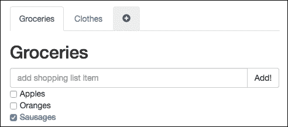
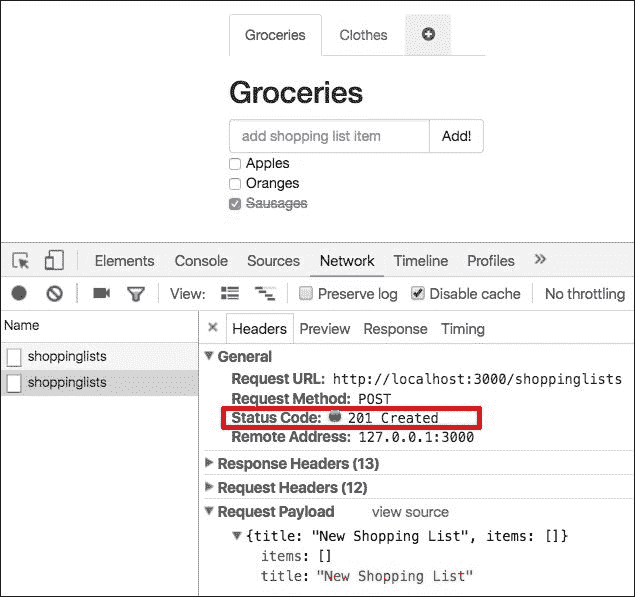
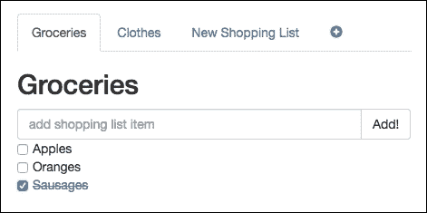

# 第六章插件——用自己的砖头建造房子

在上一章中，您学习了如何使用 Vuex 体系结构管理全局应用程序存储。你学到了很多新概念并加以应用。您还学习了如何创建存储，如何定义其状态和突变，以及如何使用操作和 getter。我们利用在本章中获得的知识，将购物清单和 Pomodoro 应用程序带到生活中。

在本章中，我们将回顾 Vue 插件，了解它们是如何工作的，以及必须如何创建它们。我们将使用一些现有的插件并创建自己的插件。

综上所述，在本章中，我们将做以下工作：

*   了解 Vue 插件的本质
*   在购物清单应用程序中使用资源插件
*   创建一个产生白色、粉色和棕色噪音的插件，并将其应用到我们的 Pomodoro 应用程序中

# Vue 插件的性质

Vue.js 中的插件的用途与它们在任何其他范围中的用途完全相同：添加一些由于其性质而无法通过系统的核心功能实现的功能。为 Vue 编写的插件可以提供各种功能，从一些全局 Vue 方法甚至实例方法的定义开始，逐步提供一些新的指令、过滤器或转换。

为了能够使用现有插件，您必须首先安装它：

```js
npm install some-plugin --save-dev 

```

然后，告诉 Vue 在应用程序中使用它：

```js
var Vue = require('vue') 
var SomePlugin = require('some-plugin') 

Vue.use(SomePlugin) 

```

我们也可以创建自己的插件。这也很容易。您的插件必须提供一个`install`方法，用于定义任何全局或实例方法，或自定义指令：

```js
MyPlugin.install = function (Vue, options) { 
  // 1\. add global method or property 
  Vue.myGlobalMethod = ... 
  // 2\. add a global asset 
  Vue.directive('my-directive', {}) 
  // 3\. add an instance method 
  Vue.prototype.$myMethod = ... 
} 

```

然后，它可以像任何其他现有的插件一样使用。在本章中，我们将使用 Vue 现有的`resource`插件（[https://github.com/vuejs/vue-resource](https://github.com/vuejs/vue-resource) ）并创建我们自己的插件，生成白色、粉色和棕色噪音。

# 在购物清单应用程序中使用 vue 资源插件

打开购物清单应用程序（[第 6 章/购物清单](https://github.com/PacktPublishing/Learning-Vue.js-2/tree/master/chapter6/shopping-list)文件夹），运行`npm install`和`npm run dev`。它既漂亮又干净，但仍然使用硬编码的购物清单。如果我们能够添加新的购物列表，删除它们，并将信息存储在更新的购物列表上，那么当我们重新启动应用程序时，显示的信息将与重新启动之前看到的最后一个信息相对应，这将是非常好的。为了能够做到这一点，我们将使用`resource`插件，它允许我们轻松地创建 REST 资源并在其上调用 REST 方法。在开始之前，让我们总结一下为实现这一目标需要做的一切：

*   首先，我们需要一个简单的服务器，其中包含一些存储，我们可以从中检索和存储我们的购物清单。此服务器必须为所有此功能提供所需的端点。

*   在创建我们的服务器和所有需要的端点之后，我们应该安装并使用`vue-resource`插件来创建一个资源和操作，该资源和操作将调用所提供端点上的方法。
*   为了保证数据的完整性，我们应该在每次购物清单更新时调用更新服务器状态的操作。
*   在应用程序启动时，我们应该从服务器获取购物清单，并将它们分配到商店的状态。
*   我们还应该提供一种机制来创建新的购物清单并删除现有的清单。

听起来不太难，对吧？那我们就开始吧！

## 创建一个简单的服务器

为了简单起见，我们将使用一个非常基本且易于使用的 HTTP 服务器，它将数据存储在常规 JSON 文件中。名为`json-server`，托管于[https://github.com/typicode/json-server](https://github.com/typicode/json-server) 。将其安装在购物列表应用程序的目录中：

```js
cd shopping-list 
npm install --save-dev json-server 

```

创建一个包含`db.json`文件的`server`文件夹，其中包含以下内容：

```js
//shopping-list/server/db.json 
{ 
  "shoppinglists": [ 
  ] 
} 

```

这将是我们的数据库。让我们将脚本条目添加到我们的`package.json`文件中，以便我们可以轻松启动服务器：

```js
  "scripts": { 
    "dev": "node build/dev-server.js ", 
    "server": "node_modules/json-server/bin/index.js --watch  
    server/db.json", 
    <...> 
  }, 

```

现在，要启动服务器，只需运行以下操作：

```js
cd shopping-list 
npm run server 

```

在`http://localhost:3000/shoppinglists`处打开浏览器页面。因此，您将看到一个空数组。这是因为我们的数据库仍然是空的。尝试使用`curl`插入一些数据：

```js
curl -H "Content-Type:application/json" -d '{"title":"new","items":[]}' http://localhost:3000/shoppinglists 

```

如果现在刷新页面，将看到新插入的值。

现在我们已经启动并运行了简单的 REST 服务器，让我们在`vue-resource`插件的帮助下在购物清单应用程序中使用它吧！

## 安装 vue 资源、创建资源及其方法

在深入了解`vue-resource`插件的用法之前，请查看[上的文档 https://github.com/vuejs/vue-resource/blob/master/docs/resource.md](https://github.com/vuejs/vue-resource/blob/master/docs/resource.md) 。基本上，文档提供了一种基于给定 URL 创建资源的简单方法（在我们的例子中，它将是`http://localhost:3000/shoppinglists`。创建资源后，我们可以在其上调用`get`、`delete`、`post`和`update`方法。

将其安装到项目的文件夹中：

```js
cd shopping-list 
npm install vue-resource --save-dev 

```

现在，让我们为 API 创建入口点。在购物清单应用程序的`src`文件夹中，创建一个子文件夹并将其命名为`api`。在其中创建一个`index.js`文件。在这个文件中，我们将导入`vue-resource`插件并告诉`Vue`使用它：

```js
//api/index.js 
import Vue from 'vue' 
import VueResource from 'vue-resource' 

Vue.use(VueResource) 

```

美好的现在我们准备创建`ShoppingListsResource`并附加一些方法。要使用`vue-resource`插件创建资源，我们只需在`Vue`上调用`resource`方法并将 URL 传递给它：

```js
const ShoppingListsResource = Vue.resource('http://localhost:3000/' + 'shoppinglists{/id}') 

```

`ShoppingListsResource`常量现在公开了实现**CRUD**（**创建、读取、更新和删除**操作所需的所有方法。它是如此容易使用，我们基本上可以出口资源本身。但是，让我们为每个 CRUD 操作导出好的方法：

```js
export default { 
  fetchShoppingLists: () => { 
    return ShoppingListsResource.get() 
  }, 
  addNewShoppingList: (data) => { 
    return ShoppingListsResource.save(data) 
  }, 
  updateShoppingList: (data) => { 
    return ShoppingListsResource.update({ id: data.id }, data) 
  }, 
  deleteShoppingList: (id) => { 
    return ShoppingListsResource.remove({ id: id }) 
  } 
} 

```

`api/index.js`文件的完整代码见本要点[https://gist.github.com/chudaol/d5176b88ba2c5799c0b7b0dd33ac0426](https://gist.github.com/chudaol/d5176b88ba2c5799c0b7b0dd33ac0426) 。

就这样！我们的 API 已准备就绪，可用于填充我们的反应式 Vue 数据！

## 获取应用程序启动时的所有购物清单

让我们从创建一个操作开始，该操作将获取并填充存储的`shoppinglists`状态。创建之后，我们可以在主`App.vue`就绪状态下调用它。

在`mutation_types.js`文件中定义一个常数，如下所示：

```js
//mutation_types.js 
export const POPULATE_SHOPPING_LISTS = 'POPULATE_SHOPPING_LISTS' 

```

现在创建一个突变。该突变只会接收一个`shoppinglists`数组并将其分配到`shoppinglists`状态：

```js
//mutations.js 
export default { 
  [types.CHANGE_TITLE] (state, data) { 
    findById(state, data.id).title = data.title 
  }, 
  [types.POPULATE_SHOPPING_LISTS] (state, lists) { 
    state.shoppinglists = lists 
  } 
} 

```

那好吧！现在我们只需要一个操作，它将使用 API 的`get`方法并分派填充变异。导入`actions.js`文件中的 API 并创建相应的动作方法：

```js
import { CHANGE_TITLE, POPULATE_SHOPPING_LISTS } from './mutation_types' 
import api from '../api' 

export default { 
  changeTitle: ({ commit }, data) => { 
    commit(CHANGE_TITLE, data) 
  }, 
  populateShoppingLists: ({ commit }) => { 
    api.fetchShoppingLists().then(response => { 
      commit(POPULATE_SHOPPING_LISTS, response.data) 
    }) 
  } 
} 

```

在前面的代码行中，我们执行了一个非常简单的任务，我们称之为`fetchShoppingLists`API 的方法，该方法反过来调用资源的`get`方法。此方法执行一个`http GET`调用并返回一个承诺，该承诺在数据从服务器返回时得到解决。

然后使用这些数据来调度填充变异。此方法将此数据分配给存储的状态`shoppinglists`属性。这种性质是反应性的；你还记得吗？这意味着所有依赖于`shoppinglists`属性 getter 的视图都将被更新。现在让我们在主`App.vue`组件的`mounted`状态中使用此操作。在官方 Vue 文档页面的[上查看有关`mounted`状态挂钩的更多信息 https://vuejs.org/v2/api/#mounted](https://vuejs.org/v2/api/#mounted) 。

打开`App.vue`组件，导入`mapActions`对象，将`populateShoppingLists`动作映射到组件的`methods`属性中，并在`mounted`处理程序中调用。因此，在更改之后，`App.vue`的`script`标签如下所示：

```js
<script> 
  import ShoppingListComponent from './components/ShoppingListComponent' 
  import ShoppingListTitleComponent from   
  './components/ShoppingListTitleComponent' 
  import store from './vuex/store' 
  import { mapGetters, mapActions } from 'vuex' 

  export default { 
    components: { 
      ShoppingListComponent, 
      ShoppingListTitleComponent 
    }, 
    computed: mapGetters({ 
      shoppinglists: 'getLists' 
    }), 
    methods: mapActions(['populateShoppingLists']), 
    store, 
    mounted () { 
      this.populateShoppingLists() 
    } 
  } 
</script> 

```

如果您现在打开页面，您将看到我们使用`curl`创建的唯一购物列表，如以下屏幕截图所示：


显示的购物清单由我们的简单服务器提供！

尝试使用`curl`插入更多项目，甚至直接修改`db.json`文件。刷新页面，看看它是如何像一个魅力！

## 根据更改更新服务器状态

很好，现在我们的购物清单由 RESTAPI 提供，一切正常，看起来很好。尝试添加一些购物清单项目或更改购物清单的标题，并选中或取消选中项目。在所有这些交互之后，刷新页面。哎呀，名单是空的，什么都没发生。这是绝对正确的，我们有一个 API 方法来更新给定的购物清单，但我们不在任何地方调用它，所以我们的服务器不知道应用的更改。

首先，让我们定义哪些组件对购物列表执行某些操作，以便将这些更改发送到服务器。购物清单及其物品可能会发生以下三种情况：

*   列表的标题可以在`ChangeTitleComponent`中更改
*   新项目可以添加到`AddItemComponent`中的购物清单中
*   在`ItemComponent`中可以勾选或取消勾选购物清单中的项目

我们必须创建一个必须在所有这些更改时触发的操作。在这个动作中，我们应该调用`update`API 的方法。仔细查看`api/index.js`模块内部的更新方法；它必须接收整个购物列表对象作为参数：

```js
//api/index.js 
updateShoppingList: (data) => { 
  return ShoppingListsResource.update({ id: data.id }, data) 
} 

```

让我们创建一个操作，该操作接收一个`id`作为参数，通过其 ID 检索购物列表，并调用 API 的方法。在执行此操作之前，在`getters.js`文件中创建一个`getListById`方法，并将其导入到操作中：

```js
//getters.js 
import _ from 'underscore' 

export default { 
  getLists: state => state.shoppinglists, 
  getListById: (state, id) => { 
    return _.findWhere(state.shoppinglists, { id: id }) 
  } 
} 

//actions.js 
import getters from './getters' 

```

现在，我们已经准备好定义更新购物清单的操作：

```js
//actions.js 
<...> 
export default { 
  <...> 
  updateList: (store, id) => { 
    let shoppingList = getters.getListById(store.state, id) 

    api.updateShoppingList(shoppingList) 
  } 
} 

```

实际上，我们现在可以从`mutations.js`中删除`findById`方法，只需重新使用`getters.js`中的这个方法：

```js
//mutations.js 
import * as types from './mutation_types' 
import getters from './getters' 

export default { 
  [types.CHANGE_TITLE] (state, data) { 
    getters.getListById(state, data.id).title = data.title 
  }, 
  [types.POPULATE_SHOPPING_LISTS] (state, lists) { 
    state.shoppinglists = lists 
  } 
} 

```

现在我们已经定义了调用 API 的`updateList`方法的操作。现在我们只需对组件内部发生的每个更改调用操作！

让我们从`AddItemComponent`开始。我们必须使用带有动作名称的`this.$store.dispatch`方法在`addItem`方法中调度`updateList`动作。但是，有一个小问题，我们必须将列表项 ID 传递给`updateList`方法，并且在这个组件中没有对它的引用。但实际上这是一个很容易解决的问题。只需在组件的`props`中添加 ID，并在`ShoppingListComponent`中调用时将其绑定到组件。所以我们的`AddItemComponent`组件的`script`标签如下所示：

```js
//AddItemComponent.vue 
<script> 
  export default { 
    props: ['id'], 
    data () { 
      return { 
        newItem: '' 
      } 
    }, 
    methods: { 
      addItem () { 
        var text 

        text = this.newItem.trim() 
        if (text) { 
          this.$emit('add', this.newItem) 
          this.newItem = '' 
          this.$store.dispatch('updateList', this.id) 
        } 
      } 
    } 
  } 
</script> 

```

在`ShoppingListComponent`内部，在`add-item-component`调用中，将 ID 绑定到它：

```js
//ShoppingListComponent.vue 
<template> 
  <...> 
    <add-item-component :id="id" @add="addItem"></add-item-component> 
  <...> 
</template> 

```

现在，如果您尝试将项目添加到购物列表并刷新页面，则新添加的项目将显示在列表中！

现在我们应该为`ChangeTitleComponent`做同样的事情。打开`ChangeTitleComponent.vue`文件，检查代码。现在，它对输入调用`changeTitle`操作：

```js
//ChangeTitleComponent.vue 
<template> 
  <div> 
    <em>Change the title of your shopping list here</em> 
    <input :value="title" @input="onInput({ title: 
      $event.target.value, id: id })"/> 
  </div> 
</template> 

<script> 
  import { mapActions } from 'vuex' 

  export default { 
    props: ['title', 'id'], 
    methods: mapActions({ 
      onInput: 'changeTitle' 
    }) 
  } 
</script> 

```

当然，我们可以导入`updateList`操作并在调用`changeTitle`操作后立即调用它。但在动作本身内部进行可能更容易。您可能还记得，为了分派存储区的操作，我们应该调用应用于存储区的`dispatch`方法，并将操作名称作为参数。所以我们可以在`changeTitle`动作中完成。只需打开`action.js`文件，找到我们的`changeTitle`操作，并将调用添加到`updateList`：

```js
//actions.js 
export default { 
  changeTitle: (store, data) => { 
    store.commit(CHANGE_TITLE, data) 
    store.dispatch('updateList', data.id) 
  }, 
  <...> 
} 

```

完成了！打开页面，修改页面标题，然后刷新页面。标题应保持其修改状态！

我们需要保证持久化的最后一个更改是购物清单的 items`checked`属性的更改。让我们看看`ItemComponent`并决定在哪里调用`updateList`操作。

让我们从在`props`属性中添加 ID 开始，就像我们在`AddItemComponent`中所做的那样：

```js
//ItemComponent.vue 
<script> 
  export default { 
    props: ['item', 'id'] 
  } 
</script> 

```

我们还必须将`id`属性绑定到组件的调用，这是在`ItemsComponent`中完成的：

```js
//ItemsComponent.vue 
<template> 
  <ul> 
    <item-component v-for="item in items" :item="item" :id="id">
    </item-component> 
  </ul> 
</template> 

<script> 
  import ItemComponent from './ItemComponent' 

  export default { 
    components: { 
      ItemComponent 
    }, 
    props: ['items', 'id'] 
  } 
</script> 

```

这也意味着我们必须将`id`属性绑定到`ShoppingListComponent`内部的`item-component`：

```js
//ShoppingListComponent.vue 
<template> 
  <...> 
    <items-component :items="items" :id="id"></items-component> 
  <...> 
</template> 

```

我们还应该在`ItemComponent`中导入`mapActions`对象，在`methods`属性中导出`updateList`方法：

```js
//ItemComponent.vue 
<script> 
  import { mapActions } from 'vuex' 

  export default { 
    props: ['item', 'id'], 
    methods: mapActions(['updateList']) 
  } 
</script> 

```

那么,一切都是好的,；现在我们只需要在`ItemComponent`中找到合适的位置来调用`updateList`动作。

事实证明，这并不是一项简单的任务，因为与其他组件不同，在其他组件中，我们有处理更改和调用相应函数的事件处理程序，这里我们只是将类和模型绑定附加到 checkbox 元素。幸运的是，`Vue`提供了一个`watch`选项，允许我们将侦听器附加到组件的任何数据，并将处理程序绑定到它们。在我们的例子中，我们希望观察`item.checked`属性并调用操作。因此，只需将`watch`属性添加到 components 选项中，如下所示：

```js
//ItemComponent.vue 
<script> 
  import { mapActions } from 'vuex' 

  export default { 
    props: ['item', 'id'], 
    methods: mapActions(['updateList']), 
    watch: { 
      'item.checked': function () { 
        this.updateList(this.id) 
      } 
    } 
  } 
</script> 

```

而且…我们完了！尝试将项目添加到购物列表中，选中、取消选中，然后再次选中。刷新页面。一切看起来都像是在提神之前！

## 创建新的购物清单

好的，那么，我们已经从服务器获取购物清单了；我们还存储应用的更改，因此一切正常。但是，如果我们可以使用应用程序的用户界面而不是修改`db.json`文件或使用`curl post`请求来创建购物清单，那不是很好吗？当然，那会很好。当然，我们只需要几行代码就可以做到！

让我们从添加调用相应 API 方法的操作开始，如下所示：

```js
//actions.js 
export default { 
  <...> 
  createShoppingList: ({ commit }, shoppinglist) => { 
    api.addNewShoppingList(shoppinglist) 
  } 
} 

```

现在，我们必须提供调用此操作的可视化机制。为此，我们可以使用加号按钮在选项卡列表中创建一个额外的选项卡，单击该按钮时将调用该操作。我们将在`App.vue`组件中执行此操作。我们已经导入了`mapActions`对象。让我们将`createShoppingList`方法添加到导出的`methods`属性中：

```js
//App.vue 
<script> 
  import ShoppingListComponent from './components/ShoppingListComponent' 
  import ShoppingListTitleComponent from 
  './components/ShoppingListTitleComponent' 
  import store from './vuex/store' 
  import { mapGetters, mapActions } from 'vuex' 

  export default { 
    components: { 
      ShoppingListComponent, 
      ShoppingListTitleComponent 
    }, 
    computed: mapGetters({ 
      shoppinglists: 'getLists' 
    }), 
    methods: mapActions(['populateShoppingLists', 
    'createShoppingList']), 
    store, 
    mounted () { 
      this.populateShoppingLists() 
    } 
  } 
</script> 

```

此时，我们的`App.vue`组件可以访问`createShoppingList`操作，并可以在事件处理程序上调用它。问题是什么数据？`createShoppingList`方法正在等待接收一个对象，然后该对象将被发送到服务器。让我们创建一个方法，该方法将生成一个带有硬编码标题的新列表，并在此方法中使用此新对象调用操作。但这种方法应该放在哪里呢？组件的`methods`属性已被`mapActions`助手的调用占用。嗯，`mapActions`方法返回方法的映射。我们可以用本地方法简单地*扩展*这张地图：

```js
//App.vue 
methods: _.extend({}, 
    mapActions(['populateShoppingLists', 'createShoppingList']), 
    { 
      addShoppingList () { 
        let list = { 
          title: 'New Shopping List', 
          items: [] 
        } 

        this.createShoppingList(list) 
      } 
    }), 

```

现在我们只需要添加一个按钮并将`addShoppingList`方法绑定到它的`click`事件。您可以在页面的任何位置创建自己的按钮。我的按钮代码如下所示：

```js
App.vue 
<template> 
  <div id="app" class="container"> 
    <ul class="nav nav-tabs" role="tablist"> 
      <li :class="index===0 ? 'active' : ''" v-for="(list, index) in 
        shoppinglists" role="presentation"> 
        <shopping-list-title-component :id="list.id" 
          :title="list.title"></shopping-list-title-component> 
      </li> 
      <li> 
        <a href="#" @click="addShoppingList"> 
          <i class="glyphicon glyphicon-plus-sign"></i> 
        </a> 
      </li> 
    </ul> 
    <div class="tab-content"> 
      <div :class="index===0 ? 'active' : ''" v-for="(list, index) in 
      shoppinglists" class="tab-pane" role="tabpanel" :id="list.id"> 
        <shopping-list-component :id="list.id" :title="list.title" 
        :items="list.items"></shopping-list-component> 
      </div> 
    </div> 
  </div> 
</template> 

```

看看这一页；现在，我们在最后一个选项卡上有一个漂亮的加号按钮，它清楚地表明有可能添加新的购物列表，如以下屏幕截图所示：



现在，我们可以使用这个漂亮的加号按钮添加新的购物清单

试着点击按钮。哎呀，什么都没发生！但是，如果我们查看网络面板，我们可以看到请求实际上已执行且已成功：



创建请求已成功执行；但是，页面上没有任何更改

事实上，这很有道理。我们更新了服务器上的信息，但客户端不知道这些更改。如果我们能够在成功创建购物清单后填充购物清单，那将是一件好事，不是吗？我说了“如果我们可以”吗？我们当然可以！只需返回到`actions.js`并使用`store.dispatch`方法对承诺的`then`回调调用`populateShoppingLists`操作：

```js
//actions.js 
createShoppingList: (store, shoppinglist) => { 
  api.addNewShoppingList(shoppinglist).then(() => { 
    store.dispatch('populateShoppingLists') 
  }) 
}  

```

现在，如果单击加号按钮，您将立即在选项卡窗格中看到新创建的列表，如以下屏幕截图所示：



重新填充列表后新添加的购物列表

您现在可以单击新的购物列表，更改其名称，添加其项目，并选中和取消选中它们。刷新页面时，一切都与刷新前一样。了不起的工作！

## 删除现有购物清单

我们已经能够创建和更新我们的购物清单。现在我们只需要能够删除它们。在本章中我们学到了所有东西之后，这将是最简单的部分。我们应该添加将调用 API 的`deleteShoppingList`方法的操作，将 remove 按钮添加到每个购物列表中，并在单击按钮时调用该操作。

让我们从添加操作开始。类似地，正如我们在创建购物清单时所做的那样，我们将在删除购物清单后立即调用`populate`方法，因此我们的操作如下所示：

```js
//action.js 
deleteShoppingList: (store, id) => { 
  api.deleteShoppingList(id).then(() => { 
    store.dispatch('populateShoppingLists') 
  }) 
} 

```

现在让我们考虑一下应该在哪里添加删除按钮。我想在标签标题中的购物清单标题附近看到它。这是名为`ShoppingListTitleComponent`的组件。打开它并导入`mapActions`助手。将其导出到`methods`属性中。因此，该组件的`script`标记内的代码如下所示：

```js
//ShoppingListTitleComponent.vue 
<script> 
  import { mapActions } from 'vuex' 

  export default{ 
    props: ['id', 'title'], 
    computed: { 
      href () { 
        return '#' + this.id 
      } 
    }, 
    methods: mapActions(['deleteShoppingList']) 
  } 
</script> 

```

现在，让我们添加 remove 按钮并将`deleteShoppingList`方法绑定到其`click`事件侦听器。我们应该将 ID 传递给此方法。我们可以直接在模板中执行此操作：

```js
//ShoppingListTitleComponent.vue 
<template> 
  <a :href="href" :aria-controls="id" role="tab" data-toggle="tab">
    {{ title }} 
    <i class="glyphicon glyphicon-remove" 
      @click="deleteShoppingList(id)"></i> 
  </a> 
</template> 

```

我还为“删除”图标添加了一点样式，使其看起来更小、更优雅：

```js
<style scoped> 
  i { 
    font-size: x-small; 
    padding-left: 3px; 
    cursor: pointer; 
  } 
</style> 

```

就这样！打开页面，你会看到每个购物清单标题附近都有一个小小的**`x`**按钮。尝试单击它，您将立即看到更改，如以下屏幕截图所示：


带有“删除 X”按钮的购物清单，允许我们删除未使用的购物清单

祝贺现在我们有了一个功能齐全的应用程序，它允许我们为任何场合创建购物清单，删除它们，并管理每个清单上的项目！干得好！本节的最终代码可在[第 6 章/shopping-list2](https://github.com/PacktPublishing/Learning-Vue.js-2/tree/master/chapter6/shopping-list2)文件夹中找到。

## 运动

我们的购物清单都很相似。我想提出一个小的样式练习，在这个练习中，你应该给你的列表添加颜色，以便使它们彼此不同。这将要求您在创建购物列表时为背景色添加一个字段，并在组件内部使用该字段以给定颜色绘制列表。

# 在 Pomodoro 应用程序中创建和使用插件

既然我们知道如何在 Vue 应用程序中使用现有插件，为什么不创建我们自己的插件呢？我们的 Pomotoro 应用程序中已经有了一些动画，当状态从工作 Pomotoro 间隔更改为休息间隔时，屏幕完全改变。然而，如果我们不看账单，我们就不知道我们应该工作还是休息。这将是很好的添加一些声音到我们的 Pomodoro！

当考虑时间管理应用程序中的声音时，我想考虑一下适合工作的声音。我们每个人都有自己最喜欢的工作播放列表。当然，它根据每个人的音乐喜好而有所不同。这就是为什么我决定在工作期间为我们的应用程序添加一些中性的声音。一些研究证明，不同的噪音（白色、粉色、棕色等）对需要高度集中注意力的工作是有益的。有关这些研究的维基百科条目可在[上找到 https://en.wikipedia.org/wiki/Sound_masking](https://en.wikipedia.org/wiki/Sound_masking) 。一些 Quora 专家在[上谈到了这一点 http://bit.ly/2cmRVW2](http://bit.ly/2cmRVW2) 。

在本节中，我们将使用 Web 音频 API（[https://developer.mozilla.org/en-US/docs/Web/API/Web_Audio_API](https://developer.mozilla.org/en-US/docs/Web/API/Web_Audio_API) ）为 Vue 创建一个产生白色、粉色和棕色噪音的插件。我们将提供一种使用 Vue 指令实例化一种或另一种噪音的机制，我们还将提供全局 Vue 方法来启动和暂停这些声音。在那之后，我们将使用这个插件在休息和看猫时的安静状态和工作时的嘈杂状态之间切换。听起来有挑战性和有趣吗？我真的希望如此！那我们就开始吧！

## 创建 NoiseGenerator 插件

我们的插件将存储在一个 JavaScript 文件中。它将包含三种方法，一种用于产生每种噪声，并提供一种`Vue.install`方法，其中将定义指令和所需的 Vue 方法。使用[第 6 章/pomodoro](https://github.com/PacktPublishing/Learning-Vue.js-2/tree/master/chapter6/pomodoro)文件夹作为起点。首先在`src`文件夹中创建`plugins`子文件夹，并在其中添加`VueNoiseGeneratorPlugin.js`文件。现在，让我们创建以下三种方法：

*   `generateWhiteNoise`
*   `generatePinkNoise`
*   `generateBrownNoise`

我不会重新发明轮子，只会复制和粘贴我在互联网上找到的已经存在的代码。当然，我想对我在[找到的巨大资源给予巨大的赞扬 http://noisehack.com/generate-noise-web-audio-api/](http://noisehack.com/generate-noise-web-audio-api/) 。也就是说，复制代码并将其组织到函数中后，我们的插件应该如下所示：

```js
// plugins/VueNoiseGenerator.js 
import _ from 'underscore' 

// Thanks to this great tutorial: 
//http://noisehack.com/generate-noise-web-audio-api/ 
var audioContext, bufferSize, noise 
audioContext = new (window.AudioContext || window.webkitAudioContext)() 

function generateWhiteNoise () { 
  var noiseBuffer, output 

  bufferSize = 2 * audioContext.sampleRate 
  noiseBuffer = audioContext.createBuffer(1, bufferSize, 
    audioContext.sampleRate) 

  output = noiseBuffer.getChannelData(0) 
  _.times(bufferSize, i => { 
    output[i] = Math.random() * 2 - 1 
  }) 

  noise = audioContext.createBufferSource() 
  noise.buffer = noiseBuffer 
  noise.loop = true 
  noise.start(0) 

  return noise 
} 

function generatePinkNoise () { 
  bufferSize = 4096 
  noise = (function () { 
    var b0, b1, b2, b3, b4, b5, b6, node 
    b0 = b1 = b2 = b3 = b4 = b5 = b6 = 0.0 
    node = audioContext.createScriptProcessor(bufferSize, 1, 1) 
    node.onaudioprocess = function (e) { 
      var output 

      output = e.outputBuffer.getChannelData(0) 
      _.times(bufferSize, i => { 
        var white = Math.random() * 2 - 1 
        b0 = 0.99886 * b0 + white * 0.0555179 
        b1 = 0.99332 * b1 + white * 0.0750759 
        b2 = 0.96900 * b2 + white * 0.1538520 
        b3 = 0.86650 * b3 + white * 0.3104856 
        b4 = 0.55000 * b4 + white * 0.5329522 
        b5 = -0.7616 * b5 - white * 0.0168980 
        output[i] = b0 + b1 + b2 + b3 + b4 + b5 + b6 + white * 0.5362 
        output[i] *= 0.11 // (roughly) compensate for gain 
        b6 = white * 0.115926 
      }) 
    } 
    return node 
  })() 

  return noise 
} 

function generateBrownNoise () { 
  bufferSize = 4096 

  noise = (function () { 
    var lastOut, node 

    lastOut = 0.0 
    node = audioContext.createScriptProcessor(bufferSize, 1, 1) 
    node.onaudioprocess = function (e) { 
      var output = e.outputBuffer.getChannelData(0) 
      _.times(bufferSize, i => { 
        var white = Math.random() * 2 - 1 
        output[i] = (lastOut + (0.02 * white)) / 1.02 
        lastOut = output[i] 
        output[i] *= 3.5 // (roughly) compensate for gain 
      }) 
    } 
    return node 
  })() 

  return noise 
} 

```

您可以在[的 JSFIDLE 中测试所有这些噪音 https://jsfiddle.net/chudaol/7tuewm5z/](https://jsfiddle.net/chudaol/7tuewm5z/) 。

好的，我们已经实现了所有三种噪音。现在我们必须导出将由`Vue`调用的`install`方法。此方法接收`Vue`实例，并可以在其上创建指令和方法。让我们创建一个指令并将其命名为`noise`。此指令可以有三个值中的一个，`white`、`pink`或`brown`，并根据接收到的值通过调用相应的噪声创建方法实例化`noise`变量。因此，我们在`install`方法中创建的指令如下所示：

```js
// plugins/VueNoiseGeneratorPlugin.js 
export default { 
  install: function (Vue) { 
    Vue.directive('noise', (value) => { 
      var noise 

      switch (value) { 
        case 'white': 
          noise = generateWhiteNoise() 
          break 
        case 'pink': 
          noise = generatePinkNoise() 
          break 
        case 'brown': 
          noise = generateBrownNoise() 
          break 
        default: 
          noise = generateWhiteNoise() 
      } 
      noise.connect(audioContext.destination) 
      audioContext.suspend() 
    }) 
  } 
} 

```

实例化之后，我们将`noise`连接到已经实例化的`audioContext`和`suspend`上，因为我们不希望它在指令绑定上开始产生噪音。我们希望它在某些事件（例如，单击开始按钮）上实例化，并在其他事件上暂停（例如，当有人单击暂停按钮时）。为此，让我们提供启动、暂停和停止`audioContext`的方法。我们将把这三种方法放在名为`noise`的全局 Vue 属性上。我们将这些方法称为`start`、`pause`和`stop`。在`start`方法中，我们希望恢复`audioContext`并在`pause`和`stop`方法上暂停它。因此，我们的方法如下所示：

```js
// plugins/VueNoiseGeneratorPlugin.js 
export default { 
  install: function (Vue) { 
    Vue.directive('noise', (value) => { 
      <...> 
    }) 
    Vue.noise = { 
      start () { 
        audioContext.resume() 
      }, 
      pause () { 
        audioContext.suspend() 
      }, 
      stop () { 
        audioContext.suspend() 
      } 
    } 
  } 
} 

```

就这样！我们的插件完全可以使用了。当然，它不是完美的，因为我们只有一个`audioContext`，它被实例化一次，然后被选择的噪声填充，这意味着我们将无法在页面上多次使用`noise`指令，但这只是一个原型，非常欢迎您对其进行增强，使其完美和公开！

## 在 Pomodoro 应用程序中使用插件

好吧，现在我们有了一个很好的噪音产生插件，唯一缺少的就是使用它！你已经知道怎么做了。打开`main.js`文件，导入`VueNoiseGeneratorPlugin`，告知`Vue`使用：

```js
import VueNoiseGeneratorPlugin from 
'./plugins/VueNoiseGeneratorPlugin' 

Vue.use(VueNoiseGeneratorPlugin) 

```

从现在起，我们可以附加`noise`指令，并在 Pomodoro 应用程序的任何部分使用`Vue.noise`方法。让我们将其绑定到`App.vue`组件中的主模板：

```js
//App.vue 
<template> 
  <div id="app" class="container" v-noise="'brown'"> 
    <...> 
  </div> 
</template> 

```

请注意，我们在指令的名称中使用了`v-noise`，而不仅仅是`noise`。我们在学习自定义指令时已经讨论过了。要使用指令，我们应该始终在其名称前面加上`v-`前缀。还要注意，我们在单引号中使用了双引号来包装`brown` 字符串。如果我们不这样做，Vue 将搜索名为`brown`的数据属性，因为 Vue 就是这样工作的。由于我们可以在指令绑定赋值中编写任何 JavaScript 语句，因此必须用双引号传递字符串。您可以更进一步，创建一个名为`noise`的数据属性，并为其分配所需的值（`white`、`brown`或`pink`，并在指令绑定语法中重用它。

完成后，我们调用`start`突变中的`Vue.noise.start`方法：

```js
//mutations.js 
import Vue from 'vue' 
<...> 

export default { 
  [types.START] (state) { 
    <...> 
    if (state.isWorking) { 
      Vue.noise.start() 
    } 
  }, 
<...> 

```

检查页面并单击开始按钮。你会听到一种美妙的棕色噪音。但是，要小心不要吵醒你的同事，也不要吓到你的家人（反之亦然）。尝试更改“噪波”指令的值，然后选择要使用的最喜爱的噪波。

不过，我们还没有完成。我们创造了一种机制，这样噪音就开始了，但它却变成了一种永无止境的噪音。让我们分别调用`pause`和`stop`突变的`Vue.noise.pause`和`Vue.noise.stop`方法：

```js
//mutations.js 
export default { 
  <...> 
  [types.PAUSE] (state) { 
    <...> 
    Vue.noise.pause() 
  }, 
  [types.STOP] (state) { 
    <...> 
    Vue.noise.stop() 
  } 
} 

```

看这一页。现在，如果单击“暂停”或“停止”按钮，噪音将暂停！我们还没有完成。记住，我们的目的是让噪音只在工作时间出现，而不是在休息时间。那么，让我们来看看`mutations.js`中的`tooglePomodoro`方法，并添加一个根据 Pomodoro 的当前状态启动或停止噪音的机制：

```js
//mutations.js 
function togglePomodoro (state, toggle) { 
  if (_.isBoolean(toggle) === false) { 
    toggle = !state.isWorking 
  } 
  state.isWorking = toggle 
  if (state.isWorking) { 
    Vue.noise.start() 
  } else { 
    Vue.noise.pause() 
  } 
  state.counter = state.isWorking ? WORKING_TIME : RESTING_TIME 
} 

```

所有这些修改后的 Pomodoro 应用程序代码可在[第 6 章/pomodoro2](https://github.com/PacktPublishing/Learning-Vue.js-2/tree/master/chapter6/pomodoro2)文件夹中找到。检查启动应用程序时噪声是如何启动的，工作完成后噪声是如何暂停的，以及当我们应该重新开始工作时噪声是如何重新启动的。还要检查启动、暂停和停止按钮如何触发噪音。干得好！

## 创建按钮切换声音

非常好的是，我们将噪声声音绑定到 pomodoo 应用程序的工作状态。当我们暂停应用程序时，声音被暂停也是很好的。但是，能够暂停声音而不必暂停整个应用程序也可能很有用。当你想在完全安静的环境下工作，或者你可能想接到 Skype 电话时，想想这些情况。在这些情况下，背景中有噪音，即使它是漂亮的粉红色，也一点都不好。让我们在应用程序中添加一个按钮来切换声音。首先声明一个名为`soundEnabled`的存储属性，并用`true`初始化它。另外，为该属性创建`getter`。所以`store.js`和`getters.js`开始如下所示：

```js
//store.js 
<...> 
const state = { 
  <...> 
  soundEnabled: true 
} 

//getters.js 
export default { 
  <...> 
  isSoundEnabled: state => state.soundEnabled 
} 

```

现在我们必须提供一种机制来切换声音。让我们为此创建一个变异方法，并添加一个调度此变异的操作。首先声明一个名为`TOGGLE_SOUND`的突变类型：

```js
//mutation_types.js 
<...> 
export const TOGGLE_SOUND = 'TOGGLE_SOUND' 

```

现在让我们打开`mutations.js`并添加切换`soundEnabled`存储属性的突变方法：

```js
//mutations.js 
[types.TOGGLE_SOUND] (state) { 
  state.soundEnabled = !state.soundEnabled 
  if (state.soundEnabled) { 
    Vue.noise.start() 
  } else { 
    Vue.noise.pause() 
  } 
} 

```

现在，让我们添加发送此突变的操作：

```js
//actions.js 
export default { 
  <...> 
  toggleSound: ({ commit }) => { 
    commit(types.TOGGLE_SOUND) 
  } 
} 

```

好吧，现在我们有了创建切换声音按钮所需的一切！让我们一起做吧。首先向方法映射添加必要的 getter 和操作：

```js
//ControlsComponent.vue 
<script> 
  import { mapGetters, mapActions } from 'vuex' 

  export default { 
    computed: mapGetters(['isStarted', 'isPaused', 'isStopped', 
    'isSoundEnabled']), 
    methods: mapActions(['start', 'stop', 'pause', 'toggleSound']) 
  } 
</script> 

```

现在我们可以将按钮添加到模板中。我建议将带有`glyphicon`类的图标向右对齐。

让我们仅在应用程序为`started`和`not paused`时显示此图标，并且仅在 Pomotoro 状态*为*`working`时显示此图标，这样我们就不会在切换声音按钮根本不应该有声音的状态下弄乱它。这意味着我们对该元素的`v-show`指令如下所示：

```js
v-show="isStarted && !isPaused && isWorking" 

```

请注意，我们在这里使用的是尚未导入的`isWorking`属性。将其添加到`methods`的地图中：

```js
//ControlsComponents.vue 
<script> 
  import { mapGetters, mapActions } from 'vuex' 

  export default { 
    computed: mapGetters(['isStarted', 'isPaused', 'isStopped', 
    'isWorking', 'isSoundEnabled']), 
    methods: mapActions(['start', 'stop', 'pause', 'toggleSound']) 
  } 
</script> 

```

让我们也在这个元素上使用`glyphicon-volume-off`和`glyphicon-volume-on`类。它们将指示调用操作以切换声音的状态。这意味着当声音被*启用*时应用`glyphicon-volume-off`类，当声音被*禁用*时应用`glyphicon-volume-on`类。将其放入代码中，我们的 class 指令应该如下所示：

```js
:class="{ 'glyphicon-volume-off': isSoundEnabled, 'glyphicon-volume-up': !isSoundEnabled }" 

```

最后但并非最不重要的一点是，我们应该在单击按钮时调用`toggleSound`操作。这意味着我们还应该将`click`事件侦听器绑定到此元素，如下所示：

```js
@click='toggleSound' 

```

因此，此按钮的整个 jade 标记代码如下所示：

```js
//ControlsComponent.vue 
<template> 
  <span> 
    <...> 
    <i class="toggle-volume glyphicon" v-show="isStarted && 
 !isPaused && isWorking" :class="{ 'glyphicon-volume-off': 
 isSoundEnabled, 'glyphicon-volume-up': !isSoundEnabled }" 
 @click="toggleSound"></i> 
  </span> 
</template> 

```

让我们在此按钮上添加一点样式，使其看起来向右对齐：

```js
<style scoped> 
  <...> 
  .toggle-volume { 
    float: right; 
    cursor: pointer; 
  } 
</style> 

```

打开页面并启动 Pomodoro 应用程序。现在，您可以在右上角看到这个漂亮的按钮，它将允许您关闭声音，如以下屏幕截图所示：


现在我们可以在工作时关闭声音了！

如果单击此按钮，它将转换为另一个按钮，其目的是再次打开声音，如以下屏幕截图所示：


我们可以再次打开它！

现在考虑下面的场景：我们启动应用程序，关闭声音，暂停应用程序，并恢复应用程序。我们当前的逻辑表明，每次启动应用程序时都会启动声音。我们将处于一种不一致的状态，应用程序已启动，声音正在播放，但切换声音按钮建议打开声音。那不对，是吗？但这有一个简单的修复方法，只需在开始突变中添加一个条件，不仅要检查`isWorking`是否为`true`，还要检查声音是否已启用：

```js
//mutations.js 
[types.START](state) { 
  <...> 
  if (state.isWorking && state.soundEnabled) { 
    Vue.noise.start() 
  } 
}, 

```

现在我们没事了。所有这些修改后的代码可以在[第 6 章/pomodoro3](https://github.com/PacktPublishing/Learning-Vue.js-2/tree/master/chapter6/pomodoro3)文件夹中找到。

检查代码，运行应用程序，享受声音，不要忘记休息！

## 运动

如果在波莫多罗间歇期，我们也能一边看猫一边欣赏一些愉快的音乐，那就太好了。创建一个可以播放所选 mp3 文件的插件，并在 Pomodoro 音乐节期间使用它。

# 总结

当我为本章编写最后几行代码并查看页面时，有一次我被这张图片卡住了：


很多猫看着我问：这一章会在某个时候结束吗？

我甚至暂停了应用程序，以便更好地查看这张图片（是的，当您在休息时间暂停 Pomodoro 应用程序时，图片也将暂停，因为 cache-buster 时间戳不再更新）。这些猫是不是想让我们休息一下？而且，它们的数量与我们在本章学到的东西的数量非常接近！

在本章中，您了解了插件系统如何与 Vue.js 一起工作。我们使用一个已有的`resource`插件将服务器端行为附加到我们的购物清单应用程序。现在我们可以创建、删除和更新购物清单。

我们还创建了自己的插件！我们的插件能够产生声音，有助于在工作期间集中注意力。我们不仅创建了它，而且还将它用于我们的 Pomodoro 应用程序中！现在我们可以在 Pomodoro 工作时更好地集中注意力，随时切换声音！

现在我们手中有两个非常好的应用程序。你知道什么比一个好的应用程序更好吗？

*唯一比好的应用程序更好的是经过良好测试的应用程序！*

考虑到这一点，现在是我们测试应用程序的时候了。在下一章中，我们将检查并应用一些测试技术。我们将使用 Karma test runner 和 Jasmine 作为断言库编写单元测试。我们还将使用 Nightwatch 编写端到端测试。我喜欢测试应用程序，我希望你也会喜欢。走吧！