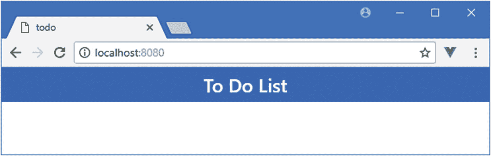
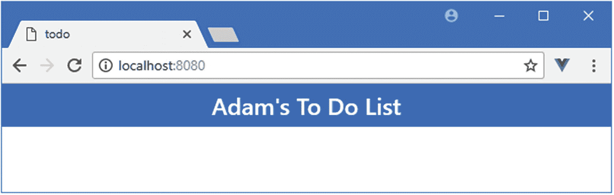
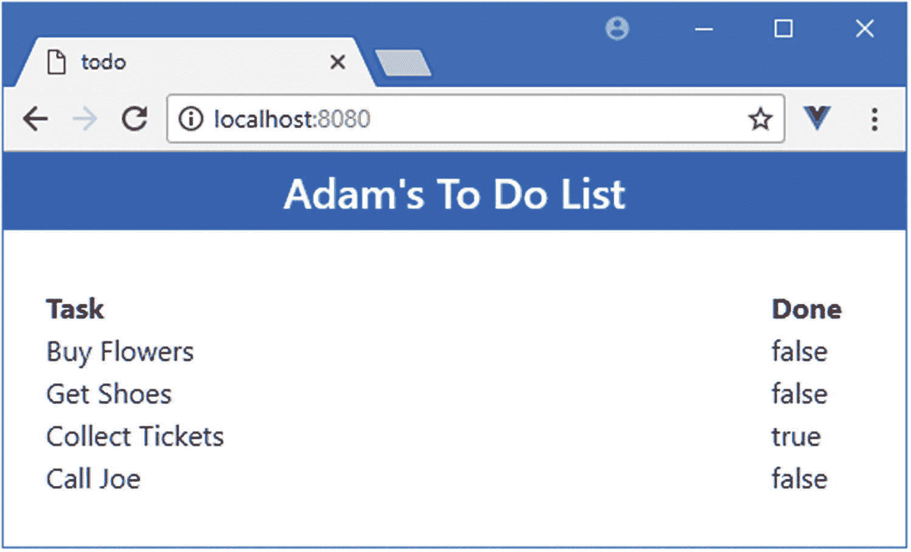
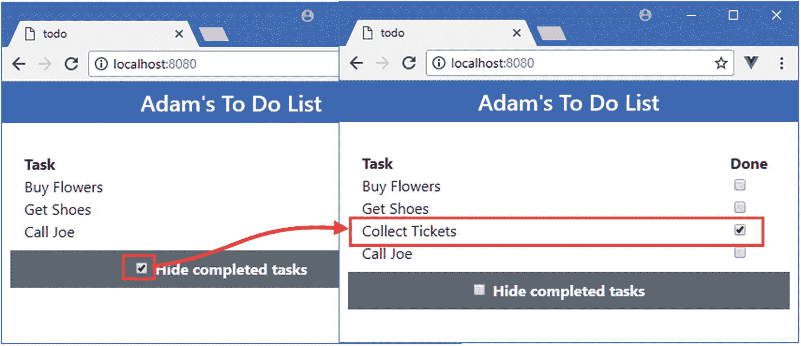
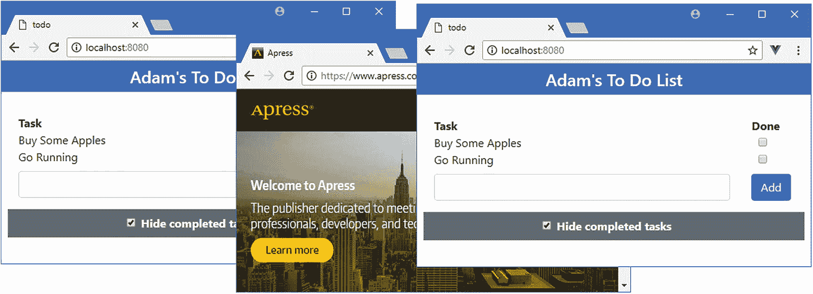

# 一、您的第一个 Vue.js 应用

开始使用 Vue.js 的最佳方式是深入研究。在这一章中，我将带你通过一个简单的开发过程来创建一个跟踪待办事项的应用。在第五章[第五章](05.html)–[第八章](08.html)中，我将向你展示如何创建一个更加复杂和真实的应用，但是现在，一个简单的例子将足以展示 Vue.js 应用是如何创建的，以及基本特性是如何工作的。如果您不理解本章的所有内容，也不要担心——这是为了对 Vue.js 的工作方式有一个总体的了解，我会在后面的章节中详细解释所有内容。

### 注意

如果您想要对 Vue.js 特性的常规描述，那么您可以跳到本书的第 2 部分，在那里我将开始深入描述各个特性的过程。

## 准备开发环境

Vue.js 开发需要做一些准备。在接下来的部分中，我将解释如何设置和准备创建您的第一个项目。

### 安装 Node.js

用于 Vue.js 开发的工具依赖于 Node . js——也称为 Node——它创建于 2009 年，是用 JavaScript 编写的服务器端应用的简单高效的运行时。Node.js 基于 Chrome 浏览器中使用的 JavaScript 引擎，并提供了一个在浏览器环境之外执行 JavaScript 代码的 API。

Node.js 作为应用服务器已经取得了成功，但对于本书来说，它很有趣，因为它为新一代跨平台开发和构建工具提供了基础。Node.js 团队的一些聪明的设计决策和 Chrome JavaScript 运行时提供的跨平台支持创造了一个机会，被热情的工具作者抓住了。简而言之，Node.js 已经成为 web 应用开发的基础。

重要的是，您下载的 Node.js 版本与我在本书中使用的版本相同。尽管 Node.js 相对稳定，但仍不时会有突破性的 API 变化，这可能会使我在本章中包含的示例无法工作。

我使用的版本是 8.11.2，这是我撰写本文时的当前长期支持版本。在您阅读本文时，可能会有更高的版本，但是对于本书中的示例，您应该坚持使用 8.11.2 版本。在 [`https://nodejs.org/dist/v8.11.2`](https://nodejs.org/dist/v8.11.2) 可以获得完整的 8.11.2 版本，包括 Windows 和 macOS 的安装程序以及其他平台的二进制包。

安装 Node.js 时，请确保选择了将 Node.js 可执行文件添加到路径的选项。安装完成后，运行清单 [1-1](#PC1) 中所示的命令。

```js
node -v

Listing 1-1Checking the Node Version

```

如果安装正常进行，您将会看到下面显示的版本号:

```js
v8.11.2

```

Node.js 安装程序包括节点包管理器(NPM)，用于管理项目中的包。运行清单 [1-2](#PC3) 中所示的命令，确保 NPM 正在工作。

```js
npm -v

Listing 1-2Checking That NPM Works

```

如果一切正常，您将看到以下版本号:

```js
5.6.0

```

### 安装@vue/cli 包

`@vue/cli`包是开发期间创建和管理 Vue.js 项目的标准方式。您不必使用这个包，但是它提供了开始使用 Vue.js 所需的一切，我在本书中通篇都在使用它。

### 注意

当我写这篇文章的时候，`@vue/cli`包已经发布了测试版。在最终发布之前可能会有一些小的变化，但是核心特性应该保持不变。有关任何突破性变化的详细信息，请查看本书的勘误表，可在 [`https://github.com/Apress/pro-vue-js-2`](https://github.com/Apress/pro-vue-js-2) 获得。

要安装`@vue/cli`，打开一个新的命令提示符并运行清单 [1-3](#PC5) 中所示的命令。如果使用的是 Linux 或者 macOS，可能需要使用`sudo`。

```js
npm install --global @vue/cli

Listing 1-3Installing the Vue Tools Package

```

### 安装 Git

需要 Git 修订版控制工具来管理 Vue.js 开发所需的一些包。如果您使用的是 Windows 或 macOS，那么从 [`https://git-scm.com/downloads`](https://git-scm.com/downloads) 下载并运行安装程序。(在 macOS 上，您可能需要更改安全设置才能打开安装程序，开发人员尚未对该安装程序进行签名。)

Git 已经包含在大多数 Linux 发行版中。如果您想安装最新版本，请查阅 [`https://git-scm.com/download/linux`](https://git-scm.com/download/linux) 上的安装说明。举个例子，对于我使用的 Linux 发行版 Ubuntu，我使用了清单 [1-4](#PC6) 中所示的命令。

```js
sudo apt-get install git

Listing 1-4Installing Git

```

一旦完成安装，打开一个新的命令提示符并运行清单 [1-5](#PC7) 中所示的命令，检查 Git 是否已安装并可用。

```js
git --version

Listing 1-5Checking Git

```

这个命令打印出已经安装的 Git 包的版本。在撰写本文时，针对 Windows 和 Linux 的 Git 最新版本是 2.17，针对 macOS 的 Git 最新版本是 2.16.3。

### 安装编辑器

Vue.js 开发可以用任何程序员的编辑器来完成，从中有数不尽的选择。一些编辑器增强了对使用 Vue.js 的支持，包括突出显示关键字和表达式。如果您还没有 web 应用开发的首选编辑器，那么表 [1-1](#Tab1) 描述了一些流行的选项供您考虑。对于这本书，我不依赖任何特定的编辑器，你应该使用任何你觉得舒服的编辑器。

表 1-1

支持 Vue.js 的流行编辑器

<colgroup><col class="tcol1 align-left"> <col class="tcol2 align-left"></colgroup> 
| 

名字

 | 

描述

 |
| --- | --- |
| 崇高的文本 | Sublime Text 是一个商业跨平台编辑器，它有支持大多数编程语言、框架和平台的包。详见`www.sublimetext.com`。 |
| 原子 | Atom 是一个免费的、开源的、跨平台的编辑器，特别强调定制和可扩展性。详见`atom.io`。 |
| 括号 | 括号是 Adobe 开发的免费开源编辑器。详见`brackets.io`。 |
| Visual Studio 代码 | Visual Studio Code 是微软的一款免费、开源、跨平台的编辑器，强调可扩展性。详见`code.visualstudio.com`。 |
| 可视化工作室 | Visual Studio 是微软的旗舰开发工具。有免费版和商业版可用，它附带了大量集成到 Microsoft 生态系统中的附加工具。 |

### 安装浏览器

最后要选择的是在开发过程中用来检查工作的浏览器。所有当代浏览器都有良好的开发人员支持，并且与 Vue.js 配合良好，但 Chrome 和 Firefox 有一个名为`vue-devtools`的有用扩展，它提供了对 Vue.js 应用状态的洞察，在复杂项目中特别有用。安装扩展的细节见 [`https://github.com/vuejs/vue-devtools`](https://github.com/vuejs/vue-devtools) ，我在后面章节会用到。在这本书里，我一直使用谷歌浏览器，这是我推荐你使用的浏览器。

## 创建项目

从命令行创建和管理项目。打开一个新的命令提示符，导航到一个方便的位置，运行清单 [1-6](#PC8) 中所示的命令，为本章创建项目。

```js
vue create todo --default

Listing 1-6Creating the Project

```

在清单 [1-3](#PC5) 中，`vue`命令作为`@vue/cli`包的一部分被安装，清单 [1-6](#PC8) 中的命令创建一个名为`todo`的新项目，该项目将被创建在一个同名的文件夹中。将创建项目，并下载和安装 Vue.js 开发所需的所有包，这可能需要一段时间，因为即使是简单的项目也需要大量的包。

### 了解项目结构

使用您喜欢的编辑器打开`todo`文件夹，您将看到如图 [1-1](#Fig1) 所示的项目结构。该图显示了我首选的编辑器(Visual Studio)中的布局，如果您选择了不同的编辑器，您可能会看到项目内容的呈现略有不同。


图 1-1

项目结构

项目的布局可能会令人望而生畏，但在本书结束时，你会知道不同的文件和文件夹是做什么用的，以及它们是如何使用的。在表 [1-2](#Tab2) 中，我简要描述了本章中重要的文件。我在第 [10 章](10.html)中详细描述了 Vue.js 项目的结构。

表 1-2

项目中的重要文件

<colgroup><col class="tcol1 align-left"> <col class="tcol2 align-left"></colgroup> 
| 

名字

 | 

描述

 |
| --- | --- |
| `public/index.html` | 这是浏览器加载的 HTML 文件。它有一个显示应用的元素和一个加载应用文件的`script`元素。 |
| `src/main.js` | 这是负责配置 Vue.js 应用的 JavaScript 文件。它还用于注册应用所依赖的任何第三方包，这将在后面的章节中演示。 |
| `src/App.vue` | 这是 Vue.js 组件，它包含将向用户显示的 HTML 内容、HTML 所需的 JavaScript 代码和样式化元素的 CSS。组件是 Vue.js 应用的主要组成部分，你会在本书中看到它们的使用。 |
| `src/assets/logo.png` | `assets`文件夹用于存储静态内容，如图像。在一个新项目中，它包含一个名为`logo.png`的文件，该文件是 Vue.js 徽标的图像。 |

### 启动开发工具

当您使用`vue`命令创建一个项目时，会安装一套完整的开发工具，以便项目可以被编译、打包并交付给浏览器。使用命令提示符，运行清单 [1-7](#PC9) 中所示的命令，导航到`todo`文件夹并启动开发工具。

```js
cd todo
npm run serve

Listing 1-7Starting the Development Tools

```

开发工具启动时有一个初始准备过程，可能需要一段时间才能完成。不要因为准备所花费的时间而推迟，因为这个过程只有在您开始开发会话时才需要。

启动过程完成后，您将看到如下消息，确认应用正在运行，并告诉您要连接到哪个 HTTP 端口:

```js
  App running at:
  - Local:   http://localhost:8080/
  - Network: http://192.168.0.77:8080/
  Note that the development build is not optimized.
  To create a production build, run npm run build.

```

默认端口是 8080，但是如果 8080 不可用，将选择不同的端口。打开一个新的浏览器窗口并导航到`http://localhost:8080`(或者如果选择了不同的端口，则导航到指定的 URL)，您将看到如图 [1-2](#Fig2) 所示的占位符内容。(占位符内容会随着开发工具新版本的发布而变化，所以如果您没有看到完全相同的内容，也不用担心。)


图 1-2

运行示例应用

## 替换占位符内容

Vue.js 应用中的关键构建块被称为*组件*，它在扩展名为`vue`的文件中定义。下面是`App`组件的内容，您可以在`src`文件夹的`App.vue`文件中找到:

```js
<template>
    <div id="app">
        
        <HelloWorld msg="Welcome to Your Vue.js App" />
    </div>
</template>
<script>
    import HelloWorld from './components/HelloWorld.vue'

    export default {
        name: 'app',
        components: {
            HelloWorld
        }
    }
</script>
<style>

    #app {
        font-family: 'Avenir', Helvetica, Arial, sans-serif;
        -webkit-font-smoothing: antialiased;
        -moz-osx-font-smoothing: grayscale;
        text-align: center;
        color: #2c3e50;
        margin-top: 60px;
    }
</style>

```

该组件由一个包含呈现给用户的 HTML 内容的`template`元素、一个包含支持模板所需的 JavaScript 代码的`script`元素和一个包含 CSS 样式的`style`元素组成。Vue.js 结合了`template`、`script`和`style`元素来创建如图 [1-2](#Fig2) 所示的占位符内容。

在清单 [1-8](#PC12) 中，我替换了`template`元素中的内容，重置了`script`元素，并移除了`style`元素，所有这些将为示例应用提供一个干净的基础。

```js
<template>
  <div id="app">
    <h4>
        To Do List
    </h4>
  </div>
</template>

<script>
  export default {
    name: 'app'
  }
</script>

Listing 1-8Removing the Placeholder Content in the App.vue File in the src Folder

```

当您保存更改时，应用将自动重新编译，浏览器将重新加载，产生如图 [1-3](#Fig3) 所示的结果。


图 1-3

移除占位符内容

### 添加 CSS 框架

新内容不会吸引很多用户。虽然一个组件可以包含 CSS 样式，但我更喜欢使用 CSS 框架，它将允许我在应用中一致地设计 HTML 内容的样式。在本书中，我使用了引导 CSS 框架。使用`Control+C`停止开发工具，运行`todo`文件夹中清单 [1-9](#PC13) 所示的命令，将引导程序添加到项目中。

```js
npm install bootstrap@4.0.0

Listing 1-9Adding Bootstrap to the Project

```

您可能会看到关于未满足对等依赖关系的警告，这些警告可以忽略。为了将引导 CSS 文件添加到项目中，我将清单 [1-10](#PC14) 中所示的语句添加到了`src`文件夹中的`main.js`文件中。

```js
import Vue from 'vue'
import App from './App.vue'

Vue.config.productionTip = false

import "bootstrap/dist/css/bootstrap.min.css";

new Vue({
    render: h => h(App)
}).$mount('#app')

Listing 1-10Adding Bootstrap in the main.js File in the src Folder

```

`import`语句确保来自引导框架的 CSS 样式表将包含在应用中。(我在第四章[中解释了`import`语句是如何工作的。)如果你不熟悉 Bootstrap，不要担心，因为我在第三章](04.html)[中描述了我在本书中使用的特性。](03.html)

### 为 Vue.js 项目选择 CSS 框架

许多最流行的 CSS 框架——包括 Bootstrap——除了常规的 CSS 样式之外，还有对交互式组件的 JavaScript 支持。这些 JavaScript 特性通常依赖 jQuery 这样的包来访问 HTML 文档中的元素，这与 Vue.js 的工作方式相冲突。因此，要么只使用框架提供的 CSS 样式，要么选择专门为 Vue.js 编写的框架，这一点很重要。

第一种方法——仅使用 CSS 样式——是我在本书中一直使用的方法。这不仅允许我使用熟悉的框架，而且有助于将 Vue.js 提供的功能与内容样式分开。这对于特定于 Vue.js 的框架来说是不可能的，它们通过使用我在本书中描述的特性来工作，这将使解释许多例子变得复杂。

如果你想尝试一个特定于 Vue.js 的框架，那么 Veutify 是一个很好的起点。( [`https://vuetifyjs.com/`](https://vuetifyjs.com/) )。还有一个改编 Bootstrap 用于 Vue.js 项目的项目，叫做 Bootstrap-Vue ( [`https://bootstrap-vue.js.org`](https://bootstrap-vue.js.org) )。

### HTML 元素的样式

既然 Bootstrap 是应用的一部分，我可以对组件的`template`元素中的内容进行样式化以改善外观，如清单 [1-11](#PC15) 所示。

```js
<template>
    <div id="app">
        <h4 class="bg-primary text-white text-center p-2">

            To Do List
        </h4>
    </div>
</template>

<script>
    export default {
        name: 'app'
    }
</script>

Listing 1-11Styling Content in the App.vue File in the src Folder

```

运行`todo`文件夹中清单 [1-12](#PC16) 中所示的命令来重启应用。

```js
npm run serve

Listing 1-12Restarting the Application

```

使用浏览器窗口导航至`http://localhost:8080`，您将看到如图 [1-4](#Fig4) 所示的内容。如果您看到文本，但它没有样式，然后手动重新加载浏览器窗口。



图 1-4

HTML 内容的样式

## 添加动态内容

下一步是向应用添加一些数据，并使用它向用户显示动态内容。在清单 [1-13](#PC17) 中，我修改了`App`组件，这样它将显示一个数据值。

```js
<template>
    <div id="app">
        <h4 class="bg-primary text-white text-center p-2">
            {{name}}'s To Do List

        </h4>
    </div>
</template>

<script>
    export default {
        name: 'app',
        data() {

            return {

                name: "Adam"

            }

        }

    }
</script>

Listing 1-13Displaying Data in the App.vue File in the src Folder

```

添加到`template`元素的是一个数据绑定，它告诉 Vue.js 在显示 HTML 内容时插入一个数据值。这种类型的数据绑定被称为*文本插值绑定*，因为它将数据值显示为 HTML 元素的文本内容。它也被称为*小胡子捆绑*，因为表示捆绑的双花括号(`{{`和`}}`字符)看起来像车把小胡子。

数据绑定告诉 Vue.js 在显示 HTML 时将`name`值插入到`h4`元素中。绑定使用的`name`值由我对清单 [1-13](#PC17) 中的`script`元素所做的更改提供。`data`属性为模板提供了`data`值，当数据绑定被处理时，Vue.js 检查`data`属性来寻找`name`值。

### 小费

不要担心清单 [1-13](#PC17) 中数据函数的奇怪语法。当使用 Vue.js 时，这很快成为一种熟悉的模式，我在第 [11](11.html) 章解释了它是如何工作的。

当您保存`App.vue`文件时，Vue.js 开发工具将检测到更改，更新应用，并使浏览器窗口自动重新加载，这将显示如图 [1-5](#Fig5) 所示的内容。



图 1-5

显示数据值

请注意，当您对项目中的文件进行更改时，不必手动重新加载浏览器窗口。Vue.js 开发工具监控项目的变更，并在检测到变更时自动触发浏览器重新加载。我在第 [10](10.html) 章更详细地描述了开发工具。

### 显示任务列表

除了我在前一章中使用的文本插值绑定之外，Vue.js 还支持一系列数据绑定，这些数据绑定可以用来以不同的方式产生动态内容。示例应用的下一步是为用户定义表示待办任务的对象集合并显示它们，如清单 [1-14](#PC18) 所示。

```js
<template>
    <div id="app">
        <h4 class="bg-primary text-white text-center p-2">
            {{name}}'s To Do List
        </h4>
        <div class="container-fluid p-4">

            <div class="row">

                <div class="col font-weight-bold">Task</div>

                <div class="col-2 font-weight-bold">Done</div>

            </div>

            <div class="row" v-for="t in tasks" v-bind:key="t.action">

                <div class="col">{{t.action}}</div>

                <div class="col-2">{{t.done}}</div>

            </div>

        </div>

    </div>
</template>

<script>
    export default {
        name: 'app',
        data() {
            return {
                name: "Adam",
                tasks: [{ action: "Buy Flowers", done: false },

                        { action: "Get Shoes", done: false },

                        { action: "Collect Tickets", done: true },

                        { action: "Call Joe", done: false }]

            }
        }
    }
</script>

Listing 1-14Displaying Tasks in the App.vue File in the src Folder

```

为了显示任务列表，我使用了 Vue.js 特性，该特性为数组中的每个对象重复一组元素。以下是应用了该功能的元素，在创建布局所需的其他元素中很难发现该元素:

```js
...
<div class="row" v-for="t in tasks" v-bind:key="t.action">
    <div class="col">{{t.action}}</div>
    <div class="col-2">{{t.done}}</div>
</div>
...

```

这是一个*指令*的例子，这些指令是特殊的属性，它们的名字以`v-`开头，应用于 HTML 元素以应用 Vue.js 功能。这是`v-for`指令，它为数组中的每个对象复制它所应用到的元素——以及任何包含的元素，将每个对象分配给一个变量，以便可以在数据绑定中访问它。

分配给`v-for`指令的值指定了对象的来源和变量的名称，每个对象在被处理时将被分配给该变量。示例中的表达式是`t in tasks`，它将一个名为`tasks`的属性标识为对象的源，将`t`标识为变量的名称，当枚举对象时，每个对象将被依次分配给该变量。

在`v-for`指令包含的元素中，可以在数据绑定中使用`t`变量来访问当前正在枚举的对象，如下所示:

```js
...
<div class="row" v-for="t in tasks" v-bind:key="t.action">
    <div class="col">{{t.action}}</div>
    <div class="col-2">{{t.done}}</div>
</div>
...

```

有两个文本插值绑定，它们将把`div`元素的内容设置为被处理对象的`action`和`done`属性。`v-bind`元素是指令的另一个例子，它在这个例子中的作用是帮助`v-for`指令跟踪与每个对象相关的元素。

为了给模板提供对象的源，我给数据函数返回的对象添加了一个`tasks`属性，如下所示:

```js
...
data() {
    return {
        name: "Adam",
        tasks: [{ action: "Buy Flowers", done: false },

                { action: "Get Shoes", done: false },

                { action: "Collect Tickets", done: true },

                { action: "Call Joe", done: false }]

      }
...

```

结果是 Vue.js 将枚举包含在`tasks a` rray 中的对象，并为每个对象添加一组`div`元素，数据绑定显示`action`和`done`属性的值。

当您保存对`App.vue`文件的更改时，开发工具将更新应用并重新加载浏览器，以在图 [1-6](#Fig6) 中显示结果。附加的`div`元素和它们被分配到的类为内容创建了一个网格布局，并且不是 Vue.js 特性的一部分。



图 1-6

显示任务列表

### 添加复选框

示例应用已经初具规模，但是使用`true` / `false`值来指示任务是否已经完成并不是用户所期望的。Vue.js 包含一些指令，可以用来配置使用数据值的表单元素，在清单 [1-15](#PC22) 中，我添加了一个`input`元素，显示每个`tasks`对象的`done`属性的值。

```js
<template>
  <div id="app">
    <h4 class="bg-primary text-white text-center p-2">
      {{name}}'s To Do List
    </h4>
    <div class="container-fluid p-4">
      <div class="row">
        <div class="col font-weight-bold">Task</div>
        <div class="col-2 font-weight-bold">Done</div>
      </div>
      <div class="row" v-for="t in tasks" v-bind:key="t.action">
        <div class="col">{{t.action}}</div>
        <div class="col-2">
          <input type="checkbox" v-model="t.done" class="form-check-input" />

          {{t.done}}
        </div>
      </div>
    </div>
  </div>
</template>

<script>
  export default {
    name: 'app',
    data() {
      return {
        name: "Adam",
        tasks: [{ action: "Buy Flowers", done: false },
                { action: "Get Shoes", done: false },
                { action: "Collect Tickets", done: true },
                { action: "Call Joe", done: false }]
      }
    }
  }
</script>

Listing 1-15Adding a Form Element in the App.vue File in the src Folder

```

`v-model`指令配置一个`input`元素，使其显示由表达式指定的值。例如，Vue.js 根据已经应用了`v-model`指令的`input`元素的类型来调整其行为，以便在`text`输入元素中显示值。当输入元素的类型是`checkbox`时，`v-model`指令根据它被配置为显示的值来切换复选框。当您将更改保存到`App.vue`文件时，您将看到复选框如何匹配文本值，如图 [1-7](#Fig7) 所示。


图 1-7

使用指令显示复选框

这种类型的指令会创建一个*双向数据绑定*，这意味着当您更改 input 元素时，Vue.js 会更新相应的数据值。通过选中和取消选中其中一个复选框，您可以看到这是如何工作的。每做一次改变，相邻文本数据绑定显示的文本也会改变，如图 [1-8](#Fig8) 所示。


图 1-8

双向数据绑定的效果

这展示了 Vue.js 应用最重要的一个方面，即应用的数据是“动态的”，当数据发生变化时，所有使用该数据的数据绑定都会更新以反映这种变化。在这种情况下，我添加到`input`元素的双向数据绑定更新了`Collect Tickets`待办事项对象的`done`属性。这种变化反映在显示`done`属性的文本数据绑定中，说明了数据绑定如何与它们所关联的数据保持关系。

### 过滤已完成的任务

动态数据模型意味着您可以轻松地添加元素，允许用户管理应用数据的表示。在示例应用中，用户最关心的是未完成的任务，在清单 [1-16](#PC23) 中，我添加了一个特性，允许用户过滤掉已经完成的任务。

```js
<template>
  <div id="app">
    <h4 class="bg-primary text-white text-center p-2">
      {{name}}'s To Do List
    </h4>
    <div class="container-fluid p-4">
      <div class="row">
        <div class="col font-weight-bold">Task</div>
        <div class="col-2 font-weight-bold">Done</div>
      </div>
      <div class="row" v-for="t in filteredTasks" v-bind:key="t.action">

        <div class="col">{{t.action}}</div>
        <div class="col-2 text-center">

          <input type="checkbox" v-model="t.done" class="form-check-input" />
        </div>
      </div>
      <div class="row bg-secondary py-2 mt-2 text-white">

        <div class="col text-center">

          <input type="checkbox" v-model="hideCompleted" class="form-check-input" />

          <label class="form-check-label font-weight-bold">

            Hide completed tasks

          </label>

        </div>

      </div>

    </div>
  </div>
</template>

<script>
  export default {
    name: 'app',
    data() {
      return {
        name: "Adam",
        tasks: [{ action: "Buy Flowers", done: false },
                { action: "Get Shoes", done: false },
                { action: "Collect Tickets", done: true },
                { action: "Call Joe", done: false }],
        hideCompleted: true

      }
    },
    computed: {

      filteredTasks() {

        return this.hideCompleted ?

          this.tasks.filter(t => !t.done) : this.tasks

      }

    }

  }
</script>

Listing 1-16Filtering Tasks in the App.vue File in the src Folder

```

在`script`元素中，我使用一个名为`filteredTasks`的函数添加了一个`computed`属性。`computed`属性用于定义对应用数据进行操作的属性，这允许 Vue.js 有效地检测应用数据的变化，这在复杂的应用中很重要。`filteredTask`属性使用`data`部分中新定义的`hideCompleted`属性的值来确定用户是想要查看所有的任务还是只查看那些未完成的任务。

为了管理`hideCompleted`属性的值，我给`template`元素添加了一个复选框，并使用了`v-model`指令，如下所示:

```js
...
<input type="checkbox" v-model="hideCompleted" class="form-check-input" />
...

```

为了确保用户看到他们选择的数据，我修改了`v-for`指令的表达式，使其使用`filteredTasks`属性，如下所示:

```js
...
<div class="row" v-for="t in filteredTasks" v-bind:key="t.action">
...

```

当用户切换复选框时，`v-model`绑定会更新`hideCompleted`属性，这会改变由`filteredTasks`属性产生的结果，并向用户呈现他们需要的任务集。保存更改，浏览器将重新加载，产生如图 [1-9](#Fig9) 所示的结果。



图 1-9

过滤任务

### 创建新任务

一个不允许用户创建新任务的待办应用没有多大用处。在清单 [1-17](#PC26) 中，我向`template`元素添加了新内容，允许用户输入新待办事项的细节。

```js
<template>
  <div id="app">
    <h4 class="bg-primary text-white text-center p-2">
      {{name}}'s To Do List
    </h4>
    <div class="container-fluid p-4">
      <div class="row">
        <div class="col font-weight-bold">Task</div>
        <div class="col-2 font-weight-bold">Done</div>
      </div>
      <div class="row" v-for="t in filteredTasks" v-bind:key="t.action">
        <div class="col">{{t.action}}</div>
        <div class="col-2 text-center">
          <input type="checkbox" v-model="t.done" class="form-check-input" />
        </div>
      </div>
      <div class="row py-2">

        <div class="col">

          <input v-model="newItemText" class="form-control" />

        </div>

        <div class="col-2">

          <button class="btn btn-primary" v-on:click="addNewTodo">Add</button>

        </div>

      </div>

      <div class="row bg-secondary py-2 mt-2 text-white">
        <div class="col text-center">
          <input type="checkbox" v-model="hideCompleted" class="form-check-input" />
          <label class="form-check-label font-weight-bold">
            Hide completed tasks
          </label>
        </div>
      </div>
    </div>
  </div>
</template>

<script>
  export default {
    name: 'app',
    data() {
      return {
        name: "Adam",
        tasks: [{ action: "Buy Flowers", done: false },
                { action: "Get Shoes", done: false },
                { action: "Collect Tickets", done: true },
                { action: "Call Joe", done: false }],
        hideCompleted: true,
        newItemText: ""

      }
    },
    computed: {
      filteredTasks() {
        return this.hideCompleted ?
          this.tasks.filter(t => !t.done) : this.tasks
      }
    },
    methods: {

      addNewTodo() {

        this.tasks.push({

          action: this.newItemText,

          done: false

        });

        this.newItemText = "";

      }

    }
  }
</script>

Listing 1-17Creating New Tasks in the App.vue File in the src Folder

```

`input`元素使用`v-model`指令创建与名为`newItemText`的变量的绑定，当用户编辑 contents 元素时，Vue.js 将更新该变量的值。为了触发新数据项的创建，我对`button`元素应用了`v-on`指令，如下所示:

```js
...
<button class="btn btn-primary" v-on:click="addNewTodo">
...

```

`v-on`指令用于响应事件，这些事件通常在用户执行动作时触发。在本例中，我使用了`v-on`指令来告诉 Vue.js 在`button`元素上触发`click`事件时调用一个名为`addNewTodo`的方法，这将在用户单击按钮时发生。

为了支持`template`元素中的更改，我对`script`元素中的 JavaScript 代码做了相应的更改。我添加了一个`methods`属性，Vue.js 在这里寻找被指令表达式调用的方法。在`methods`中，我定义了一个名为`addNewTodo`的方法，使用`newItemText`属性的值作为`action`值向`tasks`数组添加一个新对象。一旦新对象被添加到数组中，我就重置`newItemText`值。当`input`元素的内容改变时，更新`newItemText`值的`v-model`绑定也在另一个方向工作，这意味着将`newItemText`设置为空字符串将清除`input`元素的内容。

保存更改，当浏览器重新加载时，您将看到如图 [1-10](#Fig10) 所示的内容。在`input`元素中输入一个任务描述，然后点击 Add 按钮，您会看到一个新的待办事项出现在列表中。


图 1-10

创建新任务

### 持久存储数据

示例应用中没有持久数据存储，这意味着重新加载浏览器会重置待办事项列表，用户所做的任何更改都会丢失。我将使用现代浏览器中可用的本地存储功能，这样我就可以存储数据，而不必设置服务器，并且还可以演示您可以在 Vue.js 应用中直接使用浏览器提供的功能。我将在后面的章节中向您展示如何使用服务器，但是我将在这个项目中保持简单。在清单 [1-18](#PC28) 中，我在组件的`script`元素中添加了语句来存储和检索待办事项列表数据。(我没有在清单中显示`template`元素，因为它没有改变。我在第二章[中解释了这个惯例。)](02.html)

```js
...
<script>

    export default {
        name: 'app',
        data() {
            return {
                name: "Adam",
                tasks: [],

                hideCompleted: true,
                newItemText: ""
            }
        },
        computed: {
            filteredTasks() {
                return this.hideCompleted ?
                    this.tasks.filter(t => !t.done) : this.tasks
            }
        },
        methods: {
            addNewTodo() {
                this.tasks.push({
                    action: this.newItemText,
                    done: false
                });
                localStorage.setItem("todos", JSON.stringify(this.tasks));

                this.newItemText = "";
            }
        },
        created() {

            let data = localStorage.getItem("todos");

            if (data != null) {

                this.tasks = JSON.parse(data);

            }

        }

    }
</script>
...

Listing 1-18Using Local Storage in the App.vue File in the src Folder

```

本地存储特性是通过名为`localStorage`的全局对象提供的，该对象定义了`getItem`和`setItem`方法，并且由浏览器提供。

### 小费

`localStorage`对象并不特定于 Vue.js 开发。它是一个标准的 JavaScript 对象，适用于所有的 web 应用，不管它们是如何编写的。参见 [`https://developer.mozilla.org/en-US/docs/Web/API/Window/localStorage`](https://developer.mozilla.org/en-US/docs/Web/API/Window/localStorage) 了解本地存储如何工作的详细描述。

添加到组件中的`storeData`方法使用`setItem`方法来存储待办事项，并在用户创建新的待办事项或切换现有复选框时被调用。本地存储特性只能存储字符串值，这意味着我必须先将数据对象序列化为 JSON，然后才能存储它们。

我在清单 [1-18](#PC28) 中添加到组件中的`created`方法在 Vue.js 创建组件时被调用，它为我提供了一个在应用的内容呈现给用户之前从本地存储加载数据的机会。清单 [1-18](#PC28) 中的最后一个变化是删除了占位符待办事项，因为用户的数据已经永久存储，所以不再需要这些事项。

当您保存更改时，浏览器将重新加载，应用将永久存储您创建的任何待办事项，这意味着当您重新加载浏览器窗口或导航到不同的 URL(如 Apress 网站)时，它们仍然可用，然后返回到`http://localhost:8080`，如图 [1-11](#Fig11) 所示。



图 1-11

存储数据

### 添加最后的润色

我将添加两个特性来完成示例应用。第一个特性是能够删除已完成的待办任务，这一点很重要，因为它们会被永久保存。第二个特性是当没有待办事项时显示一条消息。我将这两个特性都添加到了`App`组件中，如清单 [1-19](#PC29) 所示。

```js
<template>
    <div id="app">
        <h4 class="bg-primary text-white text-center p-2">
            {{name}}'s To Do List
        </h4>
        <div class="container-fluid p-4">
            <div class="row" v-if="filteredTasks.length == 0">

                <div class="col text-center">

                    <b>Nothing to do. Hurrah!</b>

                </div>

            </div>

            <template v-else>

                <div class="row">
                    <div class="col font-weight-bold">Task</div>
                    <div class="col-2 font-weight-bold">Done</div>
                </div>
                <div class="row" v-for="t in filteredTasks" v-bind:key="t.action">
                    <div class="col">{{t.action}}</div>
                    <div class="col-2 text-center">
                        <input type="checkbox" v-model="t.done"
                             class="form-check-input" />
                    </div>
                </div>
            </template>

            <div class="row py-2">
                <div class="col">
                    <input v-model="newItemText" class="form-control" />
                </div>
                <div class="col-2">
                    <button class="btn btn-primary"
                        v-on:click="addNewTodo">Add</button>
                </div>
            </div>
            <div class="row bg-secondary py-2 mt-2 text-white">
                <div class="col text-center">
                    <input type="checkbox" v-model="hideCompleted"
                        class="form-check-input" />
                    <label class="form-check-label font-weight-bold">
                        Hide completed tasks
                    </label>
                </div>
                <div class="col text-center">

                    <button class="btn btn-sm btn-warning"

                            v-on:click="deleteCompleted">

                        Delete Completed

                    </button>

                </div>

            </div>
        </div>
    </div>
</template>

<script>

    export default {
        name: 'app',
        data() {
            return {
                name: "Adam",
                tasks: [],
                hideCompleted: true,
                newItemText: ""
            }
        },
        computed: {
            filteredTasks() {
                return this.hideCompleted ?
                    this.tasks.filter(t => !t.done) : this.tasks
            }
        },
        methods: {
            addNewTodo() {
                this.tasks.push({
                    action: this.newItemText,
                    done: false
                });
                this.storeData();

                this.newItemText = "";
            },
            storeData() {

                localStorage.setItem("todos", JSON.stringify(this.tasks));

            },

            deleteCompleted() {

                this.tasks = this.tasks.filter(t => !t.done);

                this.storeData();

            }

        },
        created() {
            let data = localStorage.getItem("todos");
            if (data != null) {
                this.tasks = JSON.parse(data);
            }
        }
    }
</script>

Listing 1-19Adding Finishing Touches in the App.vue File in the src Folder

```

`v-if`和`v-else`指令用于有条件地显示元素，我用它们在`tasks`数组中没有项目时显示一条消息，或者显示任务列表。我还添加了一个`button`元素，并使用`v-on`指令来处理`click`事件，过滤掉已完成的待办事项，然后存储剩余的对象。当您将更改保存到`App.vue`文件时，应用将重新加载。如果选中隐藏已完成任务复选框并点击删除已完成按钮，您将看到如图 [1-12](#Fig12) 所示的结果。


图 1-12

添加最后的润色

## 摘要

在本章中，我创建了一个简单的示例应用，向您介绍 Vue.js 项目和 Vue.js 开发过程。虽然这个例子很简单，但它让我演示了一些重要的 Vue.js 概念。

您已经看到 Vue.js 附带了开发所需的所有工具，当您创建一个项目时，准备和打包应用并将其交付给浏览器进行测试所需的一切都包括在内。

您了解了 Vue.js 应用是围绕组件构建的，这些组件结合了 HTML 和 JavaScript 代码。JavaScript 代码被分成几个部分，比如数据和方法，通过指令和数据绑定进行计算和访问。在所有这些特性的基础上，是反应式数据模型的思想，它允许应用自动反映变化。

Vue.js 还有更多的可用特性，你可以从这本书的篇幅中看出，但是我在本章中创建的基本应用已经向你展示了 Vue.js 开发的最基本的特征，并将为后面的章节提供基础。在下一章，我将 Vue.js 放在上下文中，描述这本书的结构和内容。