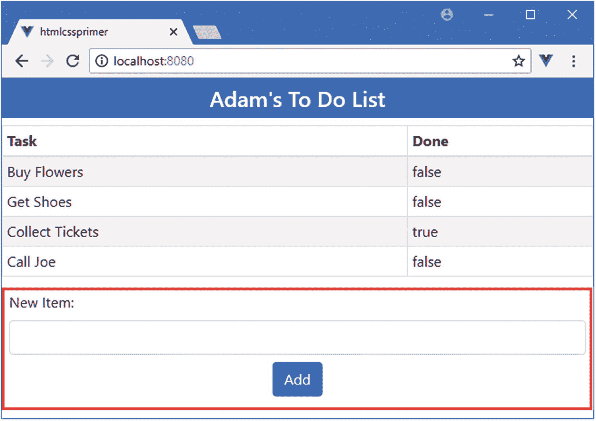

# 三、HTML 和 CSS 入门

开发人员通过许多途径进入 web 应用开发的世界，并不总是基于 web 应用所依赖的基本技术。在这一章中，我提供了一个 HTML 的简单入门，并介绍了引导 CSS 库，我用它来设计本书中的例子。在第 4 章中，我介绍了 JavaScript 的基础知识，并给出了理解本书其余部分中的例子所需的信息。如果你是一个有经验的开发人员，你可以跳过这些初级章节，直接跳到第五章，在那里我使用 Vue.js 创建了一个更复杂和真实的应用。

### 小费

您可以从[https://github . com/a press/pro-vue-js-2](https://github.com/Apress/pro-vue-js-2)下载本章以及本书所有其他章节的示例项目。

## 为本章做准备

对于这一章，我需要一个简单的 Vue.js 项目。我首先运行清单 [3-1](#PC1) 中所示的命令来创建一个名为`htmlcssprimer`的项目。

```js
vue create htmlcssprimer --default

Listing 3-1Creating the Example Project

```

创建项目的过程可能需要一些时间，因为有大量的软件包需要下载和安装。

### 注意

在撰写本文时，`@vue/cli`包已经发布了测试版。在最终发布之前可能会有一些小的变化，但是核心特性应该保持不变。有关任何突破性变化的细节，请查看本书的勘误表，可在[https://github . com/a press/pro-vue-js-2](https://github.com/Apress/pro-vue-js-2)获得。

一旦创建了项目，运行清单 [3-2](#PC2) 中所示的命令，导航到项目文件夹并安装 Bootstrap CSS 框架，我在本章(以及整本书)中使用它来管理 Vue.js 应用中内容的外观。

```js
cd htmlcssprimer
npm install bootstrap@4.0.0

Listing 3-2Installing the Bootstrap Package

```

为了在项目中包含 Bootstrap，我将清单 [3-3](#PC3) 中所示的语句添加到了`src`文件夹中的`main.js`文件中。我在第 4 章[中解释了`import`语句是如何工作的，但是现在，简单地添加清单中所示的语句就足够了。](04.html)

```js
import Vue from 'vue'
import App from './App.vue'

Vue.config.productionTip = false

import "bootstrap/dist/css/bootstrap.min.css";

new Vue({
  render: h => h(App)
}).$mount('#app')

Listing 3-3Adding a Statement in the main.js File in the src Folder

```

接下来，我用清单 [3-4](#PC4) 中的`template`和`script`元素替换了`App.vue`文件中的占位符内容，并完全删除了`style`元素。

```js
<template>
    <div>
        <h4 class="bg-primary text-white text-center p-2">
            Adam's To Do List
        </h4>
        <div class="container-fluid p-4">
            <div class="row">
                <div class="col font-weight-bold">Task</div>
                <div class="col-2 font-weight-bold">Done</div>
            </div>
            <div class="row" v-for="t in tasks" v-bind:key="t.action">
                <div class="col">{{t.action}}</div>
                <div class="col-2">{{t.done}}</div>
            </div>
        </div>
    </div>
</template>

<script>
export default {
    data: function () {
        return {
            tasks: [{ action: "Buy Flowers", done: false },
                    { action: "Get Shoes", done: false },
                    { action: "Collect Tickets", done: true },
                    { action: "Call Joe", done: false }]
        }
    }
}
</script>

Listing 3-4Replacing the Content of the App.vue File in the src Folder

```

这是第 [1 章](01.html)中待办事项应用的简化版本，有一些基本的动态内容，但没有完成或添加新项目等功能。保存所有的修改并运行清单 [3-5](#PC5) 中的命令来启动 Vue.js 开发工具。

```js
npm run serve

Listing 3-5Starting the Vue.js Development Tools

```

项目的初始准备需要一段时间，之后您会看到一条消息，告诉您应用已经准备好了。打开一个新的浏览器窗口并导航至`http://localhost:8080`以查看图 [3-1](#Fig1) 所示的内容。


图 3-1

运行示例应用

## 理解 HTML 元素

HTML 的核心是*元素*，它告诉浏览器 HTML 文档的每个部分代表什么样的内容。以下是示例 HTML 文档中的一个元素:

```js
...
<h4 class="bg-primary text-white text-center p-2">
    Adam's To Do List
</h4>
...

```

如图 [3-2](#Fig2) 所示，这个元素有几个部分:开始标签、结束标签、属性和内容。


图 3-2

HTML 元素的剖析

这个元素的*名称*(也称为*标签名称*或者仅仅是*标签*)是`h4`，它告诉浏览器标签之间的内容应该被当作一个头。有一系列的头元素，从`h1`到`h6`，其中`h1`通常用于最重要的内容，`h2`用于稍微不太重要的内容，等等。

在定义 HTML 元素时，首先将标记名放在尖括号中(`<`和`>`字符)，然后以类似的方式使用标记结束元素，除了在左尖括号(`<`)后添加一个`/`字符，以创建*开始标记*和*结束标记*。

标签表明元素的用途，HTML 规范定义了大量的元素类型。在表 [3-1](#Tab1) 中，我描述了我在清单 [3-4](#PC4) 中使用的元素，以及来自后面章节示例中的一些最常见的元素。要获得标签类型的完整列表，您应该查阅 HTML 规范。

表 3-1

示例中使用的常见 HTML 元素

<colgroup><col class="tcol1 align-left"> <col class="tcol2 align-left"></colgroup> 
| 

元素

 | 

描述

 |
| --- | --- |
| `a` | 表示一个链接(更正式的说法是一个*锚*)，用户单击它可以导航到当前文档中的新 URL 或新位置。 |
| `button` | 表示一个按钮；通常用于向服务器提交表单。 |
| `div` | 通用元素；通常用于为文档添加结构，以用于演示目的。 |
| `h1-h6` | 降级标题。 |
| `input` | 表示用于从用户处收集单个数据项的字段。 |
| `table` | 表示表格，用于将内容组织成行和列。 |
| `tbody` | 表示表格的正文(与页眉或页脚相对)。 |
| `td` | 降级表格行中的内容单元格。 |
| `template` | 表示将使用 JavaScript 处理的内容。Vue.js 组件使用一个`template`元素来包含它们的 HTML 内容，该元素还用于应用 Vue.js 特性以避免创建无效的 HTML 文档。 |
| `th` | 降级表格行中的标题单元格。 |
| `thead` | 降级表格的标题。 |
| `tr` | 降级表格中的行。 |

### 了解元素内容

出现在开始和结束标签之间的就是元素的内容。一个元素可以包含文本(比如本例中的`Adam's To Do List`)或其他 HTML 元素。下面是清单 [3-4](#PC4) 中包含其他 HTML 元素的元素示例:

```js
...
<div class="row">
    <div class="col font-weight-bold">Task</div>
    <div class="col-2 font-weight-bold">Done</div>
</div>
...

```

外部元素被称为*父元素*，而它包含的元素被称为*子元素*。能够创建元素的层次结构是 HTML 的一个基本特性，它允许创建复杂的布局。父子关系在一个大型 HTML 文档中展开，这样一个元素可以是许多其他元素的前身，所有其他元素都是它的后代。

#### 了解元素内容限制

有些元素对可以成为其子元素的元素类型有限制。上一节中显示的`div`元素可以包含任何其他元素，并用于添加结构，通常这样可以很容易地对内容进行样式化。其他元素具有更具体的角色，需要将特定类型的元素用作子元素。例如，一个`tbody`元素，你将在后面的章节中看到，它代表一个表格的主体，可以只包含一个或多个`tr`元素，每个元素代表一个表格行。

### 小费

不要担心学习所有的 HTML 元素和它们之间的关系。当你按照后面章节中的例子学习时，你会学到你需要知道的一切，如果你试图创建无效的 HTML，大多数代码编辑器会显示一个警告。

#### 了解空元素

有些元素根本不允许包含任何内容。这些被称为 *void* 或*自闭*元素，它们没有单独的结束标记，就像这样:

```js
...
<input />
...

```

在单个标记中定义了一个 void 元素，并在最后一个尖括号(`>`字符)前添加了一个`/`字符。这里显示的元素是 void 元素最常见的例子，它用于在 HTML 表单中收集来自用户的数据。在后面的章节中，你会看到很多关于 void 元素的例子。

### 了解属性

通过向元素添加*属性*，可以向浏览器提供额外的信息。下面是应用于图 [3-2](#Fig2) 中所示的`h4`元素的属性:

```js
...
<h4 class="bg-primary text-white text-center p-2">
    Adam's To Do List
</h4>
...

```

属性总是被定义为开始标签的一部分，并且大多数属性都有一个名称和一个值，用等号分隔，如图 [3-3](#Fig3) 所示。


图 3-3

属性的名称和值

这个属性的名称是`class`，用于将相关的元素组合在一起，这样它们的外观就可以得到一致的管理。这就是为什么在这个例子中使用了`class`属性，并且属性值将`h4`元素与许多类相关联，这些类与引导 CSS 包提供的样式相关，我将在本章后面描述。

#### 在属性中引用文字值

Vue.js 依靠 HTML 元素属性来应用它的许多功能。大多数时候，属性的值被作为 JavaScript 表达式来计算，比如这个元素，取自清单 [3-4](#PC4) :

```js
...
<div class="row" v-for="t in tasks" v-bind:key="t.action">
...

```

属性值包含 JavaScript 片段。属性`v-for`的值是一个表达式，它将枚举一个名为`tasks`的数组中的对象，并将每个对象分配给一个名为`t`的临时变量。清单 [3-4](#PC4) 中的`script`元素中提供了`tasks`数组，但是有时您需要提供一个特定的值，而不是让 Vue.js 从`script`元素中读取一个值，这需要额外的引号字符来告诉 JavaScript 它正在处理一个文字值，如下所示:

```js
...
<h3 v-on:click="name = 'Clicked'">{{ name }}</h3>
...

```

这个元素来自第 [14 章](14.html)，属性的值是一个表达式，它将文字字符串`Clicked`分配给一个名为`name`的属性。为了表示文字值，`Clicked`用单引号(`'`字符)括起来，这可以防止 Vue.js 在`script`元素中查找`Clicked`值。

#### 应用不带值的属性

并非所有属性都需要值；仅仅定义它们就向浏览器发送了一个信号，表明您需要与该元素相关联的某种行为。下面是一个具有这种属性的元素的例子，你可以在第 25 章中找到:

```js
...
<transition enter-active-class="animated fadeIn"
    leave-active-class=" animated fadeOut" mode="out-in"
    appear appear-active-class="animated zoomIn">
        <router-view />
</transition>
...

```

这是一个应用了许多属性的元素，但是请注意,`appear`属性没有值。有效果的是属性的存在，不需要值。

## 检查实时 HTML 文档

如果你想看到一个网页所使用的底层 HTML，你可能习惯于在浏览器窗口中右击并从弹出窗口中选择 View Page Source(如果你没有使用 Google Chrome，则选择一个类似名称的菜单项)。但是如果您在浏览器显示示例应用时这样做，您将看不到待办事项列表的 HTML。相反，您将看到以下内容:

```js
<!DOCTYPE html>
<html>
  <head>
    <meta charset="utf-8">
    <meta http-equiv="X-UA-Compatible" content="IE=edge">
    <meta name="viewport" content="width=device-width,initial-scale=1.0">
    <link rel="icon" href="/favicon.ico">
    <title>htmlcssprimer</title>
    <link as="script" href="/app.js" rel="preload">
</head>
  <body>
    <noscript>
      <strong>
          We're sorry but htmlcssprimer doesn't work properly without
          JavaScript enabled. Please enable it to continue.
      </strong>
    </noscript>
    <div id="app"></div>
    <!-- built files will be auto injected -->
  <script type="text/javascript" src="/app.js"></script></body>
</html>

```

您需要使用浏览器的开发人员工具来查看 Vue.js 应用生成的 HTML 元素。当应用运行时，它的 JavaScript 代码被执行，并产生您在浏览器窗口中看到的内容。

大多数浏览器在按下 F12 键时会打开它们的开发工具(这就是为什么它们通常被称为 F12 工具)，但是通常会有一个菜单选项或弹出菜单上的一个项目，当您在浏览器窗口中右键单击时会出现。对于 Google Chrome，这是 Inspect 菜单项，它打开开发者工具并聚焦于你点击的 HTML 元素。

图 [3-4](#Fig4) 显示了我在浏览器窗口中右键单击 Collect Tickets 文本并从弹出菜单中选择 Inspect 后的开发人员工具显示。它显示了应用生成的 HTML 元素，包括它们的内容、属性以及影响它们的 CSS 样式的细节。


图 3-4

检查 HTML 元素

F12 开发人员工具呈现的视图是实时的，这意味着对 Vue.js 应用生成的内容的更改将反映在您看到的元素中。这是了解应用行为的好方法，尤其是当您没有得到预期的结果时。

## 了解引导程序

HTML 元素告诉浏览器它们代表什么样的内容，但是它们不提供任何关于内容应该如何显示的信息。关于如何显示元素的信息是使用*级联样式表* (CSS)提供的。CSS 由一组全面的*属性*和一组*选择器*组成，前者可用于配置元素外观的各个方面，后者允许应用这些属性。

CSS 的一个主要问题是，一些浏览器对属性的解释略有不同，这可能导致 HTML 内容在不同设备上的显示方式有所不同。跟踪和纠正这些问题可能很困难，CSS 框架已经出现，以帮助 web 应用开发人员以简单和一致的方式设计他们的 HTML 内容。

最流行的 CSS 框架是 Bootstrap，它最初是在 Twitter 上开发的，但已经成为一个广泛使用的开源项目。Bootstrap 由一组 CSS 类和一些可选的 JavaScript 代码组成，这些 CSS 类可以应用于元素以保持一致的样式，这些可选的 JavaScript 代码可以执行额外的增强功能(但我不会在本书中使用)。我在自己的项目中使用 Bootstrap 它跨浏览器运行良好，并且使用简单。我在本书中使用了 Bootstrap CSS 样式，因为它们让我不必在每一章中定义和列出我自己的定制 CSS 就可以设计我的例子。Bootstrap 提供了比我在本书中使用的更多的特性；参见 [http:// getbootstrap。有关详细信息，请访问。](http://getbootstrap.com)

关于 Bootstrap，我不想说得太详细，因为这不是本书的主题，但是我想给你足够的信息，这样你就可以知道例子的哪些部分是 Vue.js 特性，哪些与 Bootstrap 相关。

### 应用基本引导类

引导样式是通过`class`属性应用的，该属性用于将相关元素组合在一起。`class`属性不仅用于应用 CSS 样式，而且是最常见的用法，它支持 Bootstrap 和类似框架的操作方式。下面是一个带有`class`属性的 HTML 元素，取自清单 [3-4](#PC4) :

```js
...
<h4 class="bg-primary text-white text-center p-2">
    Adam's To Do List
</h4>
...

```

`class`属性将`h4`元素分配给四个类，它们的名称由空格分隔:`bg-primary`、`text-white`、`text-center`和`p-2`。这些类对应于 Bootstrap 定义的样式集合，如表 [3-2](#Tab2) 所述。

表 3-2

h4 元素类

<colgroup><col class="tcol1 align-left"> <col class="tcol2 align-left"></colgroup> 
| 

名字

 | 

描述

 |
| --- | --- |
| `bg-primary` | 该类应用样式上下文来提供关于元素用途的视觉提示。请参见“使用上下文类”一节。 |
| `text-white` | 这个类应用一种样式，将元素内容的文本颜色设置为白色。 |
| `text-center` | 这个类应用一种水平居中元素内容的样式。 |
| `p-2` | 该类应用一种样式，在元素内容周围增加间距，如“使用边距和填充”一节所述。 |

#### 使用上下文类

使用像 Bootstrap 这样的 CSS 框架的主要优点之一是简化了在整个应用中创建一致主题的过程。Bootstrap 定义了一组*样式上下文*，用于一致地设计相关元素的样式。这些上下文在表 [3-3](#Tab3) 中描述，用于将引导样式应用于元素的类的名称中。

表 3-3

自举风格的上下文

<colgroup><col class="tcol1 align-left"> <col class="tcol2 align-left"></colgroup> 
| 

名字

 | 

描述

 |
| --- | --- |
| `primary` | 该上下文用于指示主要动作或内容区域。 |
| `secondary` | 该上下文用于指示内容的支持区域。 |
| `success` | 此上下文用于指示成功的结果。 |
| `info` | 该上下文用于呈现附加信息。 |
| `warning` | 该上下文用于显示警告。 |
| `danger` | 此上下文用于表示严重警告。 |
| `muted` | 这种语境是用来淡化内容的。 |
| `dark` | 该上下文通过使用深色来增加对比度。 |
| `white` | 该上下文用于通过使用白色来增加对比度。 |

Bootstrap 提供了允许样式上下文应用于不同类型元素的类。我在开始本节时使用的`h4`元素已经被添加到了`bg-primary`类中，该类设置元素的背景颜色，以表明它与应用的主要目的相关。其他类特定于某一组元素，例如`btn-primary`，它用于配置`button`和`a`元素，使它们显示为按钮，其颜色与主上下文中的其他元素一致。其中一些上下文类必须与配置元素基本样式的其他类结合使用，比如与`btn-primary`类结合使用的`btn`类。

#### 使用边距和填充

Bootstrap 包括一组实用程序类，用于添加*填充*，即元素边缘与其内容之间的空间，以及*边距*，即元素边缘与其周围元素之间的空间。使用这些类的好处是它们在整个应用中应用一致的间距。

这些类的名称遵循一种定义良好的模式。下面是清单 [3-4](#PC4) 中的`h4`元素:

```js
...
<h4 class="bg-primary text-white text-center p-2">
    Adam's To Do List
</h4>
...

```

将边距和填充应用于元素的类遵循一个定义良好的命名模式:首先是字母`m`(用于边距)或`p`(用于填充)，接着是一个可选的字母，用于选择特定的边缘(`t`用于顶部、`b`用于底部、`l`用于左侧、或`r`用于右侧)，然后是一个连字符，最后是一个数字，用于指示应该应用多少空间(`0`用于无间距，或`1`、`2`、`3`、`4`或`5`用于增加数量)。如果没有字母来指定边缘，则边距或填充将应用于所有边缘。为了帮助将这个模式放在上下文中，添加了`h4`元素的`p-2`类将填充级别 2 应用于元素的所有边缘。

### 使用引导程序创建网格

Bootstrap 提供了样式类，可用于创建不同种类的网格布局，从 1 列到 12 列不等，并支持响应式布局，其中网格的布局根据屏幕的宽度而变化。我在本书的许多例子中使用了网格布局，包括清单 [3-4](#PC4) 中的组件，它使用这种布局显示其待办事项，如下所示:

```js
...
<div class="container-fluid p-4">
    <div class="row">
        <div class="col font-weight-bold">Task</div>
        <div class="col-2 font-weight-bold">Done</div>
    </div>
<div class="row" v-for="t in tasks" v-bind:key="t.action">
    <div class="col">{{t.action}}</div>
        <div class="col-2">{{t.done}}</div>
    </div>
</div>
...

```

自举网格布局系统易于使用。一个顶级的`div`元素被分配给`container`类(或者是`container-fluid`类，如果你想让它跨越可用空间的话)。通过将`row`类应用到`div`元素来指定列，这具有为`div`元素包含的内容设置网格布局的效果。

每行定义 12 列，您可以通过指定一个名为`col-`后跟列数的类来指定每个子元素将占用多少列。例如，类`col-1`指定一个元素占据一列，`col-2`指定两列，依此类推，直到`col-12`，它指定一个元素填充整个行。如果您省略了列数，而只是将一个元素分配给了`col`类，那么 Bootstrap 将分配等量的剩余列。

### 使用引导程序设计表格

Bootstrap 包括对样式化`table`元素及其内容的支持，这是我在后面章节的一些例子中使用的一个特性。表 [3-4](#Tab4) 列出了使用表的关键引导类。

表 3-4

表格的引导 CSS 类

<colgroup><col class="tcol1 align-left"> <col class="tcol2 align-left"></colgroup> 
| 

**名称**

 | 

**描述**

 |
| --- | --- |
| `table` | 对一个`table`元素及其行应用常规样式 |
| `table-striped` | 对`table`正文中的行应用隔行条带化 |
| `table-bordered` | 将边框应用于所有行和列 |
| `table-sm` | 减少表格中的间距以创建更紧凑的布局 |

所有这些类都直接应用于`table`元素，如清单 [3-6](#PC17) 所示，其中我用表格替换了网格布局。

```js
<template>
    <div>
        <h4 class="bg-primary text-white text-center p-2">
            Adam's To Do List
        </h4>

        <table class="table table-striped table-bordered table-sm">

            <thead>

                <tr><th>Task</th><th>Done</th></tr>

            </thead>

            <tbody>

                <tr v-for="t in tasks" v-bind:key="t.action">

                    <td>{{t.action}}</td>

                    <td>{{t.done}}</td>

                </tr>

            </tbody>

        </table>

    </div>
</template>

<script>
    export default {
        data: function () {
            return {
                tasks: [{ action: "Buy Flowers", done: false },
                { action: "Get Shoes", done: false },
                { action: "Collect Tickets", done: true },
                { action: "Call Joe", done: false }]
            }
        }
    }
</script>

Listing 3-6Using a Table Layout in the App.vue File in the src Folder

```

### 小费

注意，在定义清单 [3-6](#PC17) 中的表格时，我使用了`thead`元素。如果一个`tbody`元素没有被使用，浏览器会自动添加任何`tr`元素，这些元素是`table`元素的直接后代。如果在使用 Bootstrap 时依赖于这种行为，您将会得到奇怪的结果，并且在定义表时使用完整的元素集总是一个好主意。

图 [3-5](#Fig5) 显示用表格代替网格显示待办事项的结果。


图 3-5

样式化 HTML 表格

### 使用引导程序设计表单

Bootstrap 包括表单元素的样式，允许它们与应用中的其他元素保持一致。在清单 [3-7](#PC18) 中，我向示例应用添加了表单元素。

```js
<template>
    <div>
        <h4 class="bg-primary text-white text-center p-2">
            Adam's To Do List
        </h4>

        <table class="table table-striped table-bordered table-sm">
            <thead>
                <tr><th>Task</th><th>Done</th></tr>
            </thead>
            <tbody>
                <tr v-for="t in tasks" v-bind:key="t.action">
                    <td>{{t.action}}</td>
                    <td>{{t.done}}</td>
                </tr>
            </tbody>
        </table>

        <div class="form-group m-2">

            <label>New Item:</label>

            <input v-model="newItemText" class="form-control" />

        </div>

        <div class="text-center">

            <button class="btn btn-primary" v-on:click="addNewTodo">

                Add

            </button>

        </div>

    </div>
</template>

<script>
    export default {
        data: function () {
            return {
                tasks: [{ action: "Buy Flowers", done: false },
                { action: "Get Shoes", done: false },
                { action: "Collect Tickets", done: true },
                { action: "Call Joe", done: false }],
                newItemText: ""

            }
        },
        methods: {

            addNewTodo() {

                this.tasks.push({

                    action: this.newItemText,

                    done: false

                });

                this.newItemText = "";

            }

        }

    }
</script>

Listing 3-7Adding Form Elements in the App.vue File in the src Folder

```

表单的基本样式是通过将`form-group`类应用于包含`label`和`input`元素的`div`元素来实现的，其中`input`元素被分配给`form-control`类。Bootstrap 对元素进行样式化，使`label`显示在`input`元素上方，而`input`元素占据 100%的可用水平空间，如图 [3-6](#Fig6) 所示。



图 3-6

样式表单元素

## 摘要

在这一章中，我提供了 HTML 和引导 CSS 框架的简要概述。您需要很好地掌握 HTML 和 CSS，以便在 web 应用开发中真正有效，但最好的学习方法是通过第一手经验，本章中的描述和示例将足以让您入门，并为前面的示例提供足够的背景信息。在下一章，我将继续初级主题，介绍我在本书中使用的最重要的 JavaScript。