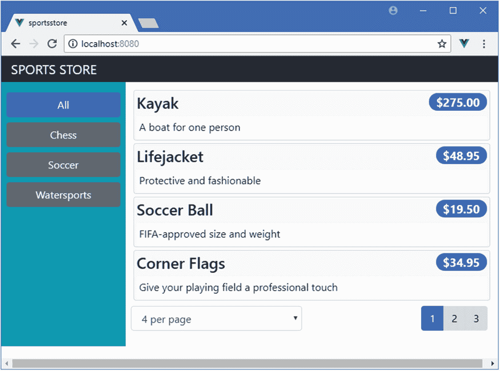
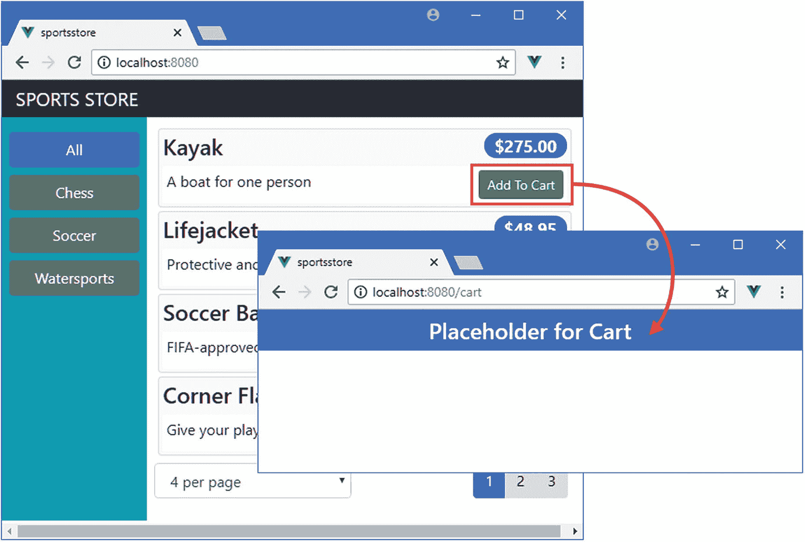
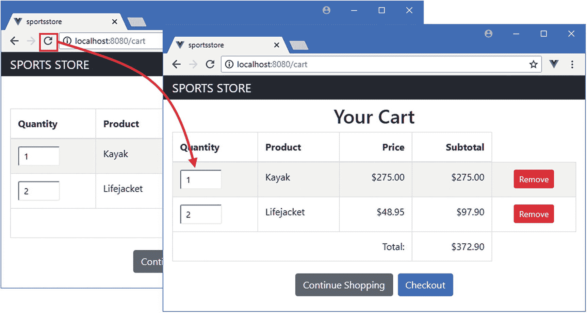
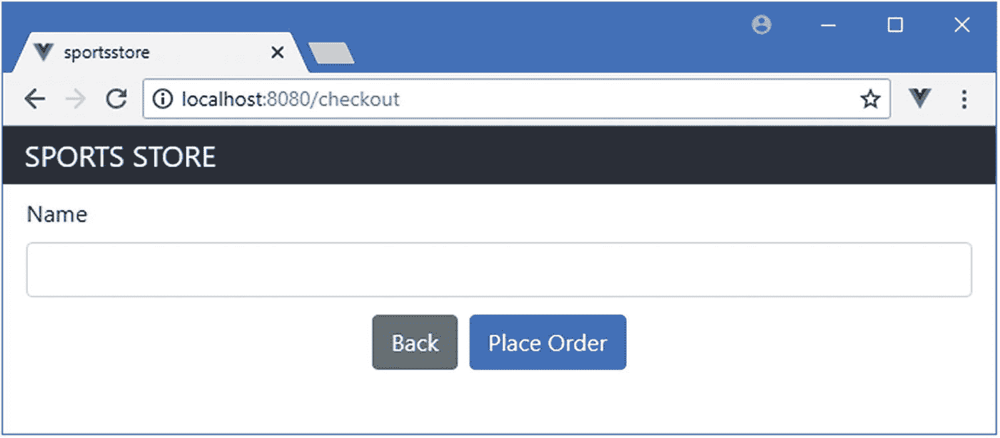

# 六、SportsStore：结帐和订单

在本章中，我继续向我在第 [5](05.html) 章中创建的 SportsStore 应用添加特性。我添加了对购物车和结帐过程的支持，允许用户向 web 服务提交订单。

### 小费

你可以从 [`https://github.com/Apress/pro-vue-js-2`](https://github.com/Apress/pro-vue-js-2) 下载本章以及本书所有其他章节的示例项目。

## 为本章做准备

本章使用第 [5 章](05.html)中的 SportsStore 项目，在准备本章时不需要做任何更改。要启动 RESTful web 服务，请打开命令提示符并在`sportsstore`文件夹中运行以下命令:

```js
npm run json

```

打开第二个命令提示符，在`sportsstore`文件夹中运行以下命令，启动开发工具和 HTTP 服务器:

```js
npm run serve

```

一旦初始构建过程完成，打开一个新的浏览器窗口并导航到`http://localhost:8080`以查看图 [6-1](#Fig1) 中显示的内容。



图 6-1

运行 SportsStore 应用

## 创建购物车占位符

SportsStore 应用的下一个特性是购物车，它将允许用户收集他们想要购买的产品。我将通过向应用添加一个带有一些占位符内容的新组件来创建购物车，然后添加对向用户显示的支持。一旦完成，我将返回并实现购物车。首先，我在`src/components`文件夹中创建了一个名为`ShoppingCart.vue`的文件，其内容如清单 [6-1](#PC3) 所示。

```js
<template>
    <h4 class="bg-primary text-white text-center p-2">
        Placeholder for Cart
    </h4>
</template>

Listing 6-1The Contents of the ShoppingCart.vue File in the src/components Folder

```

这个新组件目前不提供任何功能，但是它清楚地表明了购物车何时显示。

## 配置 URL 路由

简单的应用始终向用户显示相同的内容，但是当您添加更多的功能时，就需要向用户显示不同的组件。在示例应用中，我想让用户能够轻松地在产品列表和购物车之间导航。Vue.js 支持一个叫做*动态组件*的特性，它允许应用改变用户看到的内容。该功能内置在 Vue 路由器包中，以便使用 URL 来确定内容，这被称为 *URL 路由*。为了设置 SportsStore 应用所需的配置，我创建了`src/router`文件夹，并向其中添加了一个名为`index.js`的文件，其内容如清单 [6-2](#PC4) 所示。

### 注意

URL 路由在章节[23](23.html)–[25](25.html)中有详细描述。动态组件特性在第 [21 章](21.html)中描述。

```js
import Vue from "vue";
import VueRouter  from "vue-router";

import Store from "../components/Store";
import ShoppingCart from "../components/ShoppingCart";

Vue.use(VueRouter);

export default new VueRouter({
    mode: "history",
    routes: [
        { path: "/", component: Store },
        { path: "/cart", component: ShoppingCart },
        { path: "*", redirect: "/"}
    ]
})

Listing 6-2The Contents of the index.js File in the src/router Folder

```

Vue 路由器包必须以与第 [5 章](05.html)中 Vuex 包相同的方式用`Vue.use`方法注册。`index.js`文件导出一个新的`VueRouter`对象，该对象被传递一个配置对象，该对象设置 URL 和相关组件之间的映射。

### 注意

在清单 [6-2](#PC4) 中，我将`mode`属性设置为`history`，这告诉 Vue 路由器使用最近的浏览器 API 来处理 URL。这产生了一个更有用的结果，但是老的浏览器不支持，正如我在第 22 章[中解释的。](22.html)

`routes`属性包含一组将 URL 映射到组件的对象，这样应用的默认 URL 将显示`Store`组件，而`/cart` URL 将显示`ShoppingCart`组件。`routes a` rray 中的第三个对象是一个 catchall route，它将任何其他 URL 重定向到`/`，这将`Store`显示为一个有用的后备。

我将清单 [6-3](#PC5) 中所示的语句添加到了`main.js`文件中，这确保了路由特性被初始化，并且将在整个应用中可用。

```js
import Vue from 'vue'
import App from './App.vue'

Vue.config.productionTip = false

import "bootstrap/dist/css/bootstrap.min.css";
import "font-awesome/css/font-awesome.min.css"

import store from "./store";

import router from "./router";

new Vue({
  render: h => h(App),
  store,
  router

}).$mount('#app')

Listing 6-3Enabling URL Routing in the main.js File in the src Folder

```

新语句从清单 [6-3](#PC5) 中导入模块，并将其添加到用于创建`Vue`对象的配置对象中。如果没有这一步，路由功能将无法启用。

### 显示布线元件

既然路由配置已经添加到应用中，我可以让它管理 SportsStore 应用中组件的显示。在清单 [6-4](#PC6) 中，我删除了显示`Store`组件的定制 HTML 元素，并用一个内容由当前 URL 决定的元素来替换它。

```js
<template>
    <router-view />

</template>

<script>

  //import Store from "./components/Store";

  import { mapActions } from "vuex";

  export default {
      name: 'app',
      //components: { Store },

      methods: {
          ...mapActions(["getData"])
      },
      created() {
          this.getData();
      }
  }
</script>

Listing 6-4Adding a Routed View in the App.vue File in the src Folder

```

元素基于清单 [6-4](#PC6) 中定义的配置显示一个组件。我注释掉了添加了`Store`组件的语句，因为路由系统将负责管理由`App`组件显示的内容，所以不再需要这些语句。

如果您导航到`http://localhost:8080`，您将看到由`Store`组件显示的内容，但是如果您导航到`http://localhost:8080/cart`，您将看到购物车的占位符内容，如图 [6-2](#Fig2) 所示。


图 6-2

使用 URL 路由

## 实现购物车功能

现在应用可以显示购物车组件了，我可以添加提供购物车功能的特性了。在接下来的小节中，我将扩展数据存储，向`Cart`组件添加特性以显示用户的选择，并添加导航特性以便用户可以选择产品并在购物车中查看这些选择的摘要。

### 向数据存储中添加模块

我将从扩展数据存储开始，为此我将定义一个特定于购物车的 JavaScript 模块，这样我就可以将这些新增功能与现有的数据存储功能分开。我在`src/store`文件夹中添加了一个名为`cart.js`的文件，内容如清单 [6-5](#PC7) 所示。

```js
export default {
    namespaced: true,
    state: {
        lines: []
    },
    getters: {
        itemCount: state => state.lines.reduce((total, line) =>
            total + line.quantity, 0),
        totalPrice: state => state.lines.reduce((total, line) =>
                total + (line.quantity * line.product.price), 0),

    },
    mutations: {
        addProduct(state, product) {
            let line  = state.lines.find(line => line.product.id == product.id);
            if (line != null) {
                line.quantity++;
            } else {
                state.lines.push({ product: product, quantity:1 });
            }
        },
        changeQuantity(state, update) {
            update.line.quantity = update.quantity;
        },
        removeProduct(state, lineToRemove) {
            let index  = state.lines.findIndex(line => line == lineToRemove);
            if (index > -1) {
                state.lines.splice(index, 1);
            }
        }
    }
}

Listing 6-5The Contents of the cart.js File in the src/store Folder

```

为了用一个模块扩展数据存储，我创建了一个默认导出，它返回一个具有`state`、`getters,`和`mutations`属性的对象，遵循我在第 [5](05.html) 章将数据存储添加到项目中时使用的相同格式。我将`namespaced`属性设置为`true`，以保持这些特性在数据存储中是独立的，这意味着它们将通过前缀进行访问。如果没有这个设置，在`cart.js`文件中定义的特性将会被合并到主数据存储中，这可能会引起混淆，除非您确保用于属性和函数的名称不会混淆。

为了将模块合并到数据存储中，我将清单 [6-6](#PC8) 中所示的语句添加到了`index.js`文件中。

```js
import Vue from "vue";
import Vuex from "vuex";
import Axios from "axios";

import CartModule from "./cart";

Vue.use(Vuex);

const baseUrl = "http://localhost:3500";
const productsUrl = `${baseUrl}/products`;
const categoriesUrl = `${baseUrl}/categories`;

export default new Vuex.Store({
    strict: true,
    modules:  { cart: CartModule },

    state: {
        products: [],
        categoriesData: [],
        productsTotal: 0,
        currentPage: 1,
        pageSize: 4,
        currentCategory: "All"
    },

    // ...other data store features omitted for brevity...

})

Listing 6-6Adding a Module in the index.js File in the src/store Folder

```

我使用了一个`import`语句来声明对 cart 模块的依赖，并将其标识为`CartModule`。为了将模块包含在数据存储中，我添加了`modules`属性，该属性被赋予一个对象，其属性名指定了将用于访问模块中的特性的前缀，其值是模块对象。在这个清单中，将使用前缀`cart`来访问新数据存储模块中的特性。

### 添加产品选择功能

下一步是添加允许用户将产品添加到购物车的功能。在清单 [6-7](#PC9) 中，我在每个产品清单中添加了一个按钮，当它被点击时会更新购物车。

```js
<template>
    <div>
        <div v-for="p in products" v-bind:key="p.id" class="card m-1 p-1 bg-light">
            <h4>
                {{p.name}}
                <span class="badge badge-pill badge-primary float-right">
                    {{ p.price | currency }}
                </span>
            </h4>
            <div class="card-text bg-white p-1">
                {{ p.description }}
                <button class="btn btn-success btn-sm float-right"

                        v-on:click="handleProductAdd(p)">

                    Add To Cart

                </button>

            </div>
        </div>
        <page-controls />
    </div>
</template>

<script>

import { mapGetters, mapMutations } from "vuex";

import PageControls from "./PageControls";

export default {
    components: { PageControls },
    computed: {
        ...mapGetters({ products: "processedProducts" })
    },
    filters: {
        currency(value) {
            return new Intl.NumberFormat("en-US",
                { style: "currency", currency: "USD" }).format(value);
        }
    },
    methods: {
        ...mapMutations({ addProduct: "cart/addProduct" }),

        handleProductAdd(product) {

            this.addProduct(product);

            this.$router.push("/cart");

        }

    }
}
</script>

Listing 6-7Adding Product Selection in the ProductList.vue File in the src/components Folder

```

我在模板中添加了一个`button`元素，并通过调用`handleProductAdd`方法使用`v-on`指令来响应`click`事件，我将该方法添加到了`script`元素中。这个方法调用数据存储上的`cart/addProduct`变异，当`namespaced`属性为`true`时，我在清单 [6-7](#PC9) 中指定的前缀允许我访问模块中的特性。

在调用了`addProduct`突变之后，`handleProductAdd`方法使用路由系统通过以下语句导航到`/cart` URL:

```js
...
this.$router.push("/cart");
...

```

Vue 路由器包提供的功能是通过使用`$router`属性提供给组件的(访问组件中的所有属性和方法需要使用`this`关键字)。`push`方法告诉路由器改变浏览器的 URL，其效果是显示一个不同的组件。结果是，当您单击其中一个添加到购物车按钮时，就会显示购物车组件，如图 [6-3](#Fig3) 所示。



图 6-3

使用 URL 导航

### 显示购物车内容

现在应该显示用户的产品选择，而不是当前显示的占位符内容。为了使内容更容易管理，我将使用一个单独的组件来显示单个产品选择。我在`src/components`文件夹中添加了一个名为`ShoppingCartLine.vue`的文件，内容如清单 [6-8](#PC11) 所示。

```js
<template>
    <tr>
        <td>
        <input type="number" class="form-control-sm"
                style="width:5em"
                v-bind:value="qvalue"
                v-on:input="sendChangeEvent"/>
        </td>
        <td>{{ line.product.name }}</td>
        <td class="text-right">
            {{ line.product.price | currency }}
        </td>
        <td class="text-right">
            {{ (line.quantity * line.product.price) | currency }}
        </td>
        <td class="text-center">
            <button class="btn btn-sm btn-danger"
                    v-on:click="sendRemoveEvent">
                Remove
            </button>
        </td>
    </tr>
</template>
<script>
    export default {
        props: ["line"],
        data: function() {
            return {
                qvalue: this.line.quantity
            }
        },
        methods: {
            sendChangeEvent($event) {
                if ($event.target.value > 0) {
                    this.$emit("quantity", Number($event.target.value));
                    this.qvalue = $event.target.value;
                } else {
                    this.$emit("quantity", 1);
                    this.qvalue = 1;
                    $event.target.value = this.qvalue;
                }
            },
            sendRemoveEvent() {
                this.$emit("remove", this.line);
            }
        }
    }
</script>

Listing 6-8The Contents of the ShoppingCartLine.vue File in the src/components Folder

```

这个组件使用了`props`特性，该特性允许父组件向其子组件提供数据对象。在这种情况下，清单 [6-8](#PC11) 中的组件定义了一个名为`prop`的行，它的父组件将使用它来提供购物车中的行，并显示给用户。该组件还发送自定义事件，用于与其父组件通信。当用户更改显示数量的`input`元素的值或单击 Remove 按钮时，组件调用`this.$emit`方法向其父组件发送一个事件。这些功能是一种连接组件的有用方式，可以创建应用某一部分的本地功能，而无需使用数据存储等全局功能。

为了向用户显示购物车的内容，我替换了`ShoppingCart`组件中的占位符元素，并将其替换为清单 [6-9](#PC12) 中所示的 HTML 和 JavaScript 代码。

```js
<template>
    <div class="container-fluid">
        <div class="row">
            <div class="col bg-dark text-white">
                <a class="navbar-brand">SPORTS STORE</a>
            </div>
        </div>
        <div class="row">
            <div class="col mt-2">
            <h2 class="text-center">Your Cart</h2>
            <table class="table table-bordered table-striped p-2">
                <thead>
                <tr>
                    <th>Quantity</th><th>Product</th>
                    <th class="text-right">Price</th>
                    <th class="text-right">Subtotal</th>
                </tr>
                </thead>
                <tbody>
                    <tr v-if="lines.length == 0">
                        <td colspan="4" class="text-center">
                            Your cart is empty
                        </td>
                    </tr>
                    <cart-line v-for="line in lines" v-bind:key="line.product.id"
                        v-bind:line="line"
                        v-on:quantity="handleQuantityChange(line, $event)"
                        v-on:remove="remove" />
                </tbody>
                <tfoot v-if="lines.length > 0">
                    <tr>
                        <td colspan="3" class="text-right">Total:</td>
                        <td class="text-right">
                            {{ totalPrice | currency }}
                        </td>
                    </tr>
                </tfoot>
            </table>
            </div>
        </div>
        <div class="row">
            <div class="col">
                <div class="text-center">
                    <router-link to="/" class="btn btn-secondary m-1">
                        Continue Shopping
                   </router-link>
                   <router-link to="/checkout" class="btn btn-primary m-1"
                            v-bind:disabled="lines.length == 0">
                        Checkout
                    </router-link>
                </div>
            </div>
        </div>
    </div>
</template>

<script>

import { mapState, mapMutations, mapGetters } from "vuex";
import CartLine from "./ShoppingCartLine";

export default {
    components: { CartLine },
    computed: {
        ...mapState({ lines: state => state.cart.lines }),
        ...mapGetters({  totalPrice : "cart/totalPrice"  })
    },
    methods: {
        ...mapMutations({
            change: "cart/changeQuantity",
            remove: "cart/removeProduct"
        }),
        handleQuantityChange(line, $event) {
            this.change({ line, quantity: $event});
        }
    }
}
</script>

Listing 6-9Displaying Products in the ShoppingCart.vue File in the src/components Folder

```

该组件中的大部分内容和代码都使用了您已经看到的特性，但是有几点需要注意。第一个是这个组件配置其子组件`ShoppingCartLine`的方式，如下所示:

```js
...
<cart-line v-for="line in lines" v-bind:key="line.product.id"
    v-bind:line="line"
    v-on:quantity="handleQuantityChange(line, $event)"
    v-on:remove="remove" />
...

```

`cart-line`元素用于应用`CartLine`指令，您可以从父子关系的另一面看到组件所依赖的本地连接特性。`v-bind`指令用于设置`line`属性的值，`CartLine`指令通过该属性接收其显示的对象，`v-on`指令用于接收`CartLine`指令发出的自定义事件。

清单 [6-9](#PC12) 中模板中的一些内容只有在购物车中有产品时才会显示。使用`v-if`指令，可以基于 JavaScript 表达式在 HTML 文档中添加或删除元素，我在第 [12 章](12.html)中对此进行了描述。

清单 [6-9](#PC12) 中的模板包含了一个以前没有见过的新元素。

```js
...
<router-link to="/" class="btn btn-primary m-1">Continue Shopping</router-link>
...

```

`router-link`元素由 Vue Router 包提供，用于生成导航元素。当组件的模板被处理时，`router-link`元素被替换为锚元素(一个标签为`a`的元素)，它将导航到由`to`属性指定的 URL。`router-link`元素是基于代码的导航的对应物，当它的位置与当前 URL 匹配时，它可以被配置成产生不同的元素并应用类到它的元素，所有这些我在第 [23 章](23.html)中描述。在清单 [6-9](#PC12) 中，我使用了`router-link`元素来允许用户导航回产品列表并前进到`/checkout` URL，我将在本章的后面把它添加到应用中，以增加对结帐过程的支持。

### 小费

引导 CSS 框架可以将`a`元素设计成按钮的样子。我在清单 [6-9](#PC12) 中添加了`router-link`元素的类被带到它们产生的`a`元素中，并作为继续购物和结账按钮呈现给用户，如图 [6-4](#Fig4) 所示。

清单 [6-9](#PC12) 中需要注意的最后一个特性是使用我在清单 [6-5](#PC7) 中定义的数据存储状态属性。我选择将数据存储模块中定义的特性与数据存储的其余部分分开，这意味着必须使用前缀。当映射 getters、mutations 和 actions 时，前缀包含在名称中，但是访问状态属性需要不同的方法。

```js
...
    ...mapState({ lines: state => state.cart.lines }),
...

```

通过定义接收状态对象并选择所需属性的函数来映射状态属性。在这种情况下，选择的属性是`lines`，它是使用前缀`cart`访问的。

### 创建全局过滤器

当我在第 [5 章](05.html)中介绍`currency`过滤器时，我在一个单独的组件中定义了它。现在我已经向项目添加了特性，有更多的值需要格式化为货币值，但我不会复制同一个过滤器，我将全局注册过滤器，以便它可用于所有组件，如清单 [6-10](#PC16) 所示。

```js
import Vue from 'vue'
import App from './App.vue'

Vue.config.productionTip = false

import "bootstrap/dist/css/bootstrap.min.css";
import "font-awesome/css/font-awesome.min.css"

import store from "./store";
import router from "./router";

Vue.filter("currency", (value) =>  new Intl.NumberFormat("en-US",

      { style: "currency", currency: "USD" }).format(value));

new Vue({
  render: h => h(App),
  store,
  router
}).$mount('#app')

Listing 6-10Creating a Global Filter in the main.js File in the src Folder

```

正如您将在后面的章节中了解到的，许多组件特性可以被全局定义以避免代码重复。全局过滤器是使用`Vue.filter`方法定义的，该方法必须在`Vue`对象创建之前调用，如清单 [6-10](#PC16) 所示。参见第 [11 章](11.html)了解更多使用过滤器的细节。

### 测试购物车的基本功能

要测试购物车，导航至`http://localhost:8080`并点击您想要选择的产品的添加至购物车按钮。每次点击该按钮，数据存储将被更新，浏览器将导航到`/cart` URL，它将显示您选择的摘要，如图 [6-4](#Fig4) 所示。您可以增加和减少每个产品的数量，删除产品，然后单击继续购物按钮返回商店。(单击 Checkout 按钮还会让您返回到商店，因为我还没有为`/cart` URL 设置路由，我在清单 [6-10](#PC16) 中定义的 catchall route 会将浏览器重定向到默认的 URL。)


图 6-4

购物车摘要

### 使购物车持久

如果您重新加载浏览器或试图通过在浏览器栏中输入 URL 来导航到`http://localhost:8080/cart`，您将会丢失您所选择的任何产品，并会出现如图 [6-5](#Fig5) 所示的空购物车。


图 6-5

空车

使用路由系统执行的 URL 更改的处理方式不同于用户所做的更改。当应用执行导航时，更改被解释为在该应用中移动的请求，例如从产品列表移动到商店。但是当用户执行导航时，该改变被解释为改变页面的请求。当前应用知道如何处理新的 URL 这一事实是不相关的——更改会终止当前应用，并触发对应用的 HTML 文档 JavaScript 的新 HTTP 请求，从而导致创建应用的新实例。在此期间，任何状态数据都会丢失，这就是您看到空购物车的原因。

没有办法改变浏览器的行为，这意味着处理这个问题的唯一方法是使购物车持久化，以便在导航完成后，新创建的应用实例可以使用它。有许多不同的方式来持久化购物车数据，一种常见的技术是在用户每次进行更改时将数据存储在服务器上。我希望将重点放在 Vue.js 开发上，而不是创建一个后端来存储数据，所以我将使用我在第 [1](01.html) 章中使用的相同方法，并使用本地存储功能在客户端存储数据。在清单 [6-11](#PC17) 中，我已经更新了数据存储，这样当发生更改时，产品选择会被持久存储。

```js
export default {
    namespaced: true,
    state: {
        lines: []
    },
    getters: {
        itemCount: state => state.lines.reduce((total, line) =>
            total + line.quantity, 0),
        totalPrice: state => state.lines.reduce((total, line) =>
                total + (line.quantity * line.product.price), 0),

    },
    mutations: {
        addProduct(state, product) {
            let line  = state.lines.find(line => line.product.id == product.id);
            if (line != null) {
                line.quantity++;
            } else {
                state.lines.push({ product: product, quantity:1 });
            }
        },
        changeQuantity(state, update) {
            update.line.quantity =  update.quantity;
        },
        removeProduct(state, lineToRemove) {
            let index  = state.lines.findIndex(line => line == lineToRemove);
            if (index > -1) {
                state.lines.splice(index, 1);
            }
        },
        setCartData(state, data) {

            state.lines = data;

        }

    },
    actions: {

        loadCartData(context) {

            let data = localStorage.getItem("cart");

            if (data != null) {

                context.commit("setCartData", JSON.parse(data));

            }

        },

        storeCartData(context) {

            localStorage.setItem("cart", JSON.stringify(context.state.lines));

        },

        clearCartData(context) {

            context.commit("setCartData", []);

        },

        initializeCart(context, store) {

            context.dispatch("loadCartData");

            store.watch(state => state.cart.lines,

                () => context.dispatch("storeCartData"), { deep: true});

        }

    }
}

Listing 6-11Storing Data Persistently in the cart.js File in the src/store Folder

```

我添加到数据存储模块的操作使用本地存储 API 加载、存储和清除购物车数据。不允许动作直接在数据存储中修改状态数据，所以我还添加了一个设置`lines`属性的变异。清单 [6-11](#PC17) 中最重要的添加是`initializeCart`动作，它负责在应用启动时处理购物车。当动作被调用时，第一条语句调用`dispatch`方法，这就是以编程方式调用动作的方式。为了观察数据存储对`lines`状态属性的更改，我使用了`watch`方法，如下所示:

```js
...
store.watch(state => state.cart.lines,
   () => context.dispatch("storeCartData"), { deep: true});
...

```

watch 方法的参数是一个选择状态属性的函数和一个在检测到更改时调用的函数。该语句选择了`lines`属性，并使用`dispatch`方法在发生变化时调用`storeCartData`动作。还有一个配置对象将`deep`属性设置为`true`，它告诉 Vuex 当`lines`数组中的任何属性发生变化时，我希望收到通知，默认情况下不会这样做。正如我在第 [13](13.html) 章中解释的，如果没有这个选项，我只会在用户添加或删除购物车中的一行时收到通知，而不会在现有产品选择的数量发生变化时收到通知。

Vuex 没有提供在数据存储首次初始化时调用任何特性的方法，所以我在调用`initializeCart`动作的`App`组件中添加了一条语句，以及从 RESTful web 服务请求初始数据的现有语句，如清单 [6-12](#PC19) 所示。

```js
<template>
    <router-view />
</template>

<script>
  import { mapActions } from "vuex";

  export default {
      name: 'app',
      methods: {
          ...mapActions({
            getData: "getData",
            initializeCart: "cart/initializeCart"

          })
      },
      created() {
          this.getData();
          this.initializeCart(this.$store);

      }
  }
</script>

Listing 6-12Initializing the Cart in the App.vue File in the src Folder

```

这些变化的结果是，用户的购物车存储在本地，当用户直接导航到`/cart` URL 或重新加载浏览器时，产品选择不会丢失，如图 [6-6](#Fig6) 所示。



图 6-6

存储购物车数据

### 添加购物车摘要小部件

完成购物车的最后一步是创建一个摘要，显示在产品列表的顶部，这样用户可以看到他们选择的概述，并直接导航到`/cart` URL，而不必将产品添加到购物车。我在`src/components`文件夹中添加了一个名为`CartSummary.vue`的文件，并添加了清单 [6-13](#PC20) 中所示的内容来创建一个新组件。

```js
<template>
    <div class="float-right">
        <small>
            Your cart:
            <span v-if="itemCount > 0">
                {{ itemCount }} item(s) {{ totalPrice | currency }}
            </span>
            <span v-else>
                (empty)
            </span>
        </small>
        <router-link to="/cart" class="btn btn-sm bg-dark text-white"
                v-bind:disabled="itemCount == 0">
            <i class="fa fa-shopping-cart"></i>
        </router-link>
    </div>
</template>

<script>
    import { mapGetters } from 'vuex';

    export default {
        computed: {
            ...mapGetters({
                itemCount: "cart/itemCount",
                totalPrice: "cart/totalPrice"
            })
        }
    }
</script>

Listing 6-13The Contents of the CartSummary.vue File in the src/components Folder

```

该组件使用了`v-else`指令，它是`v-if`的有用伴侣，如果`v-if`表达式是`false`，则显示一个元素，如第 [12 章](12.html)所述。这允许我显示购物车的摘要，如果它包含商品，如果不包含，则显示占位符消息。

### 小费

清单 [6-13](#PC20) 中的`router-link`元素包含一个`i`元素，它使用由字体 Awesome 定义的类进行样式化，这是我在第 [5 章](05.html)中添加到项目中的。这个开源包为 web 应用中的图标提供了出色的支持，包括我在 SportsStore 应用中需要的购物车。详见 [`http://fontawesome.io`](http://fontawesome.io) 。

为了将新组件合并到应用中，我更新了`Store`组件，如清单 [6-14](#PC21) 所示。

```js
<template>
    <div class="container-fluid">
        <div class="row">
            <div class="col bg-dark text-white">
                <a class="navbar-brand">SPORTS STORE</a>
                <cart-summary />

            </div>
        </div>
        <div class="row">
            <div class="col-3 bg-info p-2">
                <CategoryControls />
            </div>
            <div class="col-9 p-2">
                <ProductList />
            </div>
        </div>
    </div>
</template>

<script>

    import ProductList from "./ProductList";
    import CategoryControls from "./CategoryControls";
    import CartSummary from "./CartSummary";

    export default {
        components: { ProductList, CategoryControls, CartSummary }

    }

</script>

Listing 6-14Enabling the Component in the Store.vue File in the src/components Folder

```

其效果是向用户呈现购物车的简洁摘要，如图 [6-7](#Fig7) 所示，并允许他们通过单击购物车图标直接导航到购物车摘要。


图 6-7

购物车摘要小部件

## 添加结帐和订单功能

组装购物车后的下一步是让用户结账并生成订单。为了扩展数据存储以支持订单，我在`src/store`文件夹中添加了一个名为`orders.js`的文件，代码如清单 [6-15](#PC22) 所示。

```js
import Axios from "axios";

const ORDERS_URL = "http://localhost:3500/orders";

export default {
    actions: {
        async storeOrder(context, order) {
            order.cartLines = context.rootState.cart.lines;
            return (await Axios.post(ORDERS_URL, order)).data.id;
        }
    }
}

Listing 6-15The Contents of the orders.js File in the src/store Folder

```

新的数据存储模块只包含一个存储订单的操作，尽管我将在实现一些管理特性时添加一些特性。`storeOrder`动作使用 Axios 包向 web 服务发送 HTTP POST 请求，web 服务将订单存储在数据库中。

为了从另一个模块中获取数据，我使用了动作的上下文对象的`rootState`属性，这让我可以导航到购物车模块的`lines`属性，以便将客户选择的产品与用户在结账过程中提供的详细信息一起发送到 web 服务。

我用作 SportsStore 应用的 RESTful web 服务的`json-server`包用包含一个`id`属性的对象的 JSON 表示来响应 POST 请求。`id`属性是自动分配的，用于唯一标识数据库中存储的对象。在清单 [6-15](#PC22) 中，我使用`async`和`await`关键字等待 POST 请求完成，然后返回服务器提供的`id`属性的值。

出于多样性，我没有启用名称空间特性，这意味着该模块的 getters、mutations 和 actions 将与那些在`index.js`文件中的合并，并且不会使用前缀来访问(尽管，正如我在第 [20](20.html) 章中解释的那样，`state`属性总是带有前缀，即使没有使用名称空间特性，您也可以在第 [7](07.html) 章中看到这样的例子)。在清单 [6-16](#PC23) 中，我将`orders m`模块导入到主数据存储文件中，并将其添加到`modules p`属性中，就像我在本章前面对`cart m`模块所做的那样。

```js
import Vue from "vue";
import Vuex from "vuex";
import Axios from "axios";
import CartModule from "./cart";

import OrdersModule from "./orders";

Vue.use(Vuex);

const baseUrl = "http://localhost:3500";
const productsUrl = `${baseUrl}/products`;
const categoriesUrl = `${baseUrl}/categories`;

export default new Vuex.Store({
    strict: true,
    modules:  { cart: CartModule, orders: OrdersModule },

    // ...data store features omitted for brevity...

})

Listing 6-16Importing a Module in the index.js File in the src/store Folder

```

### 创建和注册签出组件

为了帮助用户完成结账过程，我在`src/components`文件夹中添加了一个名为`Checkout.vue`的文件，其内容如清单 [6-17](#PC24) 所示。

```js
<template>
    <div>
        <div class="container-fluid">
                <div class="row">
                    <div class="col bg-dark text-white">
                        <a class="navbar-brand">SPORTS STORE</a>
                    </div>
                </div>
        </div>
        <div class="m-2">
            <div class="form-group m-2">
                <label>Name</label>
                <input v-model="name" class="form-control "/>
            </div>
        </div>
        <div class="text-center">
            <router-link to="/cart" class="btn btn-secondary m-1">
                Back
            </router-link>
            <button class="btn btn-primary m-1" v-on:click="submitOrder">
                Place Order
            </button>
        </div>
    </div>
</template>

<script>

export default {
    data: function() {
        return {
            name: null
        }
    },
    methods: {
        submitOrder() {
            // todo: save order
        }
    }
}
</script>

Listing 6-17The Contents of the Checkout.vue File in the src/components folder

```

我从添加一个表单元素开始，它允许用户输入他们的名字。我将很快添加剩余的表单元素，但是我从小的开始，这样我就可以设置好一切，而不必在清单中重复相同的代码。

该组件使用了两个我以前没有使用过的功能，因为 SportsStore 应用是围绕 Vuex 数据存储构建的。第一个特点是清单 [6-17](#PC24) 中的组件有自己的本地数据，不与任何其他组件共享。这是使用`script`元素中的`data`属性定义的，必须以不寻常的方式表达。

```js
...
data: function() {
    return {
        name: null
    }
},
...

```

这段代码定义了一个名为`name`的本地数据属性，它的初始值是`null`。当你在 Vue.js 开发中变得有经验时，你会习惯这种表达，并且它很快成为你的第二天性。正如我在第 [11 章](11.html)中解释的，如果你忘记正确设置`data`属性，你会收到警告。在本书的第 2 部分和第 3 部分中，我依靠数据属性来演示不同的特性，而不需要添加数据存储，您将会看到很多关于它们如何工作的例子。

清单 [6-17](#PC24) 中的第二个特性是对`input`元素使用了`v-model`指令，这创建了一个与`name`属性的双向绑定，保持了`name`属性的值和`input`元素的内容同步。这是一个处理表单元素的便利特性，我将在第 [15](15.html) 章中详细描述。但是，我没有在早期的 SportsStore 组件中使用过它。这是因为它不能与来自数据存储的值一起使用，因为 Vuex 要求使用突变来执行更改，而`v-model`指令不支持，正如我在第 [20](20.html) 章中详细解释的。

我还需要一个组件，将显示一条消息时，订单已提交。我在`src/components`文件夹中添加了一个名为`OrderThanks.vue`的文件，内容如清单 [6-18](#PC26) 所示。

```js
<template>

    <div class="m-2 text-center">
        <h2>Thanks!</h2>
        <p>Thanks for placing your order, which is #{{orderId}}.</p>
        <p>We'll ship your goods as soon as possible.</p>
        <router-link to="/" class="btn btn-primary">Return to Store</router-link>
    </div>

</template>

<script>
    export default {
        computed: {
            orderId() {
                return this.$route.params.id;
            }
        }
    }
</script>

Listing 6-18The Contents of the OrderThanks.vue File in the src/components Folder

```

该组件显示由当前路由的 URL 获得的值，它通过`this.$route`属性访问该值，当启用 Vue 路由器包时，该属性在所有组件中都可用。在这种情况下，我从包含用户订单号的路由中获得一个参数，该参数将是来自清单 [6-15](#PC22) 的 HTTP POST 请求返回的值。

为了将组件合并到应用中，我定义了新的路线，如清单 [6-19](#PC27) 所示。

```js
import Vue from "vue";
import VueRouter  from "vue-router";

import Store from "../components/Store";
import ShoppingCart from "../components/ShoppingCart";

import Checkout from "../components/Checkout";

import OrderThanks from "../components/OrderThanks";

Vue.use(VueRouter);

export default new VueRouter({
    mode: "history",
    routes: [
        { path: "/", component: Store },
        { path: "/cart", component: ShoppingCart },
        { path: "/checkout", component: Checkout},

        { path: "/thanks/:id", component: OrderThanks},

        { path: "*", redirect: "/"}
    ]
})

Listing 6-19Adding Routes in the index.js File in the src/router Folder

```

`/checkout` URL 将显示清单 [6-17](#PC24) 中的组件，该组件对应于我在购物车中显示的`router-link`元素中使用的 URL，该元素作为结帐按钮呈现给用户。

`/thanks/:id` URL 显示感谢消息，由清单 [6-18](#PC26) 中创建的组件呈现。URL 第二段中的冒号告诉路由系统该路由应该匹配任何两段 URL，其中第一段是`thanks`。第二个 URL 段的内容将被分配给一个名为`id`的变量，然后由`OrderThanks`组件显示给用户，我在清单 [6-18](#PC26) 中定义了这个组件。我在第[23](23.html)–[25](25.html)章解释了如何创建复杂的路由并控制它们匹配的 URL。

直接感兴趣的是结帐组件，您可以通过导航到`http://localhost:8080/checkout`或导航到`http://localhost:8080`，选择一个产品，然后单击结帐按钮来看到这一点。无论您选择哪条路径，您都会看到图 [6-8](#Fig8) 中的内容。

### 小费

在线商店允许顾客直接跳转到结账环节是不常见的，我在第 7 章中演示了如何限制导航。



图 6-8

初始结帐组件

### 添加表单验证

验证用户提供的数据以确保应用以它能够处理的格式接收到它需要的所有数据是很重要的。在第 [15 章](15.html)中，我演示了如何创建你自己的表单验证代码，但是在实际项目中，使用一个为你处理验证的包更容易，比如 Veulidate，我在第 [5 章](05.html)中把它添加到了 SportsStore 项目中。在清单 [6-20](#PC28) 中，我向`main.js`文件添加了声明，以声明对 Veulidate 包的依赖，并将其功能添加到应用中。

```js
import Vue from 'vue'
import App from './App.vue'

Vue.config.productionTip = false

import "bootstrap/dist/css/bootstrap.min.css";
import "font-awesome/css/font-awesome.min.css"

import store from "./store";
import router from "./router";

import Vuelidate from "vuelidate";

Vue.filter("currency", (value) =>  new Intl.NumberFormat("en-US",
      { style: "currency", currency: "USD" }).format(value));

Vue.use(Vuelidate);

new Vue({
  render: h => h(App),
  store,
  router
}).$mount('#app')

Listing 6-20Enabling the Veulidate Package in the main.js File in the src Folder

```

Vuelidate 作为一个 Vue.js 插件发布，在创建 Vue 对象之前必须用`Vue.use`方法注册，如清单所示。我会在第 26 章中解释插件如何工作以及如何创建你自己的插件。

数据验证的一个关键部分是当一个值不能被接受或没有被提供时向用户提供一条消息。这需要大量的测试来确保消息是有用的，并且在用户提交数据之前不会显示，这可能导致需要验证的每个`input`元素重复相同的代码和内容。为了避免这种重复，我在`src/components`文件夹中添加了一个名为`ValidationError.vue`的文件，用来创建清单 [6-21](#PC29) 中所示的组件。

```js
<template>
    <div v-if="show" class="text-danger">
        <div v-for="m in messages" v-bind:key="m">{{ m }}</div>
    </div>
</template>

<script>

export default {
    props: ["validation"],
    computed: {
        show() {
            return this.validation.$dirty && this.validation.$invalid
        },
        messages() {
            let messages = [];
            if (this.validation.$dirty) {
                if (this.hasValidationError("required")) {
                    messages.push("Please enter a value")
                } else if (this.hasValidationError("email")) {
                    messages.push("Please enter a valid email address");
                }
            }
            return messages;
        }
    },
    methods: {
        hasValidationError(type) {
            return this.validation.$params.hasOwnProperty(type)
                && !this.validation[type];
        }
    }
}

</script>

Listing 6-21The Contents of the ValidationError.vue File in the src/components Folder

```

Vuelidate 包通过一个对象提供了关于数据验证的细节，该对象将由这个组件的`validation` prop 接收。对于 SportsStore 应用，我需要两个验证器——`required`验证器确保用户提供了一个值，而`email`验证器确保该值是一个格式正确的电子邮件地址。

### 小费

Vuelidate 支持多种验证器。详见 [`https://monterail.github.io/vuelidate`](https://monterail.github.io/vuelidate) 。

为了确定`ValidationError`组件应该显示什么消息，我使用了表 [6-1](#Tab1) 中显示的属性，这些属性是在将通过 prop 接收的对象上定义的。

表 6-1

验证对象属性

<colgroup><col class="tcol1 align-left"> <col class="tcol2 align-left"></colgroup> 
| 

名字

 | 

描述

 |
| --- | --- |
| `$invalid` | 如果该属性为`true`，则元素内容违反了已应用的验证规则之一。 |
| `$dirty` | 如果这个属性是`true`，那么这个元素已经被用户编辑过了。 |
| `required` | 如果这个属性存在，那么`required`验证器已经被应用到元素中。如果属性是`false`，那么元素不包含值。 |
| `email` | 如果这个属性存在，那么`email`验证器已经被应用到元素中。如果属性是`false`，那么元素不包含有效的电子邮件地址。 |

清单 [6-21](#PC29) 中的组件使用表 [6-1](#Tab1) 中的属性来决定它通过 prop 接收到的对象是否报告了验证错误，如果是，应该向用户显示哪些消息。

当您看到如何应用`ValidationError`组件时，这种方法会更有意义。在清单 [6-22](#PC30) 中，我向`Checkout`组件添加了数据验证，并将报告任何问题的任务委托给了`ValidationError`组件。

```js
<template>
    <div>
        <div class="container-fluid">
                <div class="row">
                    <div class="col bg-dark text-white">
                        <a class="navbar-brand">SPORTS STORE</a>
                    </div>
                </div>
        </div>
        <div class="m-2">
            <div class="form-group m-2">
                <label>Name</label>
                <input v-model="$v.name.$model" class="form-control "/>

                <validation-error v-bind:validation="$v.name" />

            </div>
        </div>
        <div class="text-center">
            <router-link to="/cart" class="btn btn-secondary m-1">
                Back
            </router-link>
            <button class="btn btn-primary m-1" v-on:click="submitOrder">
                Place Order
            </button>
        </div>
    </div>
</template>

<script>

import { required } from "vuelidate/lib/validators";

import ValidationError  from "./ValidationError";

export default {
    components: { ValidationError },

    data: function() {
        return {
            name: null
        }
    },
    validations: {

        name: {

            required

        }

    },

    methods: {
        submitOrder() {
            this.$v.$touch();

            // todo: save order
        }
    }
}
</script>

Listing 6-22Validating Data in the Checkout.vue File in the src/components Folder

```

使用`script`元素中的`validations`属性应用 Vuelidate 数据验证，该属性具有与将被验证的`data`值的名称相对应的属性。在清单中，我添加了一个`name`属性并应用了`required`验证器，它必须从`veulidate/lib/validators`位置导入。

要将验证特性连接到`input`元素，必须更改 v-model 指令的目标，如下所示:

```js
...
<input v-model="$v.name.$model" class="form-control "/>
...

```

验证特性是通过一个名为`$v`的属性来访问的，该属性具有与验证配置相对应的属性。在这种情况下，有一个`name`属性，它对应于名称数据值，并且使用`$model`属性来访问它的值。

我传递给`ValidationError`组件的是由`$v.name`属性返回的对象，如下所示:

```js
...
<validation-error v-bind:validation="$v.name" />
...

```

这种方法提供了对表 [6-1](#Tab1) 中描述的属性的访问，这些属性用于显示验证错误消息，而不需要正在处理的数据值的任何具体细节。

`$v`对象定义了一个`$touch`方法，该方法将所有元素标记为脏的，就像用户编辑过它们一样。这是一个有用的特性，可以触发验证作为用户操作的结果，而通常在用户与`input`元素交互之前不会显示验证消息。要查看效果，导航到`http://localhost:8080/checkout`并单击 Place Order 按钮，不要在`input`元素中输入任何内容。您将看到要求您提供一个值的错误消息，当您在字段中输入文本时，该消息将消失，如图 [6-9](#Fig9) 所示。验证是实时执行的，如果从 input 元素中删除所有文本，您将再次看到错误消息。


图 6-9

验证数据

### 添加剩余的字段和验证

在清单 [6-23](#PC33) 中，我向组件添加了订单所需的剩余数据字段，以及每个字段所需的验证设置和当所有数据字段都有效时提交订单所需的代码。

```js
<template>
    <div>
        <div class="container-fluid">
                <div class="row">
                    <div class="col bg-dark text-white">
                        <a class="navbar-brand">SPORTS STORE</a>
                    </div>
                </div>
        </div>
        <div class="m-2">
            <div class="form-group m-2">
                <label>Name</label>
                <input v-model="$v.order.name.$model" class="form-control "/>

                <validation-error v-bind:validation="$v.order.name" />

            </div>
        </div>

        <div class="m-2">

            <div class="form-group m-2">

                <label>Email</label>

                <input v-model="$v.order.email.$model" class="form-control "/>

                <validation-error v-bind:validation="$v.order.email" />

            </div>

        </div>

        <div class="m-2">

            <div class="form-group m-2">

                <label>Address</label>

                <input v-model="$v.order.address.$model" class="form-control "/>

                <validation-error v-bind:validation="$v.order.address" />

            </div>

        </div>

        <div class="m-2">

            <div class="form-group m-2">

                <label>City</label>

                <input v-model="$v.order.city.$model" class="form-control "/>

                <validation-error v-bind:validation="$v.order.city" />

            </div>

        </div>

        <div class="m-2">

            <div class="form-group m-2">

                <label>Zip</label>

                <input v-model="$v.order.zip.$model" class="form-control "/>

                <validation-error v-bind:validation="$v.order.zip" />

            </div>

        </div>

        <div class="text-center">
            <router-link to="/cart" class="btn btn-secondary m-1">
                Back
            </router-link>
            <button class="btn btn-primary m-1" v-on:click="submitOrder">
                Place Order
            </button>
        </div>
    </div>
</template>

<script>

import { required, email } from "vuelidate/lib/validators";

import ValidationError  from "./ValidationError";

import { mapActions } from "vuex";

export default {
    components: { ValidationError },
    data: function() {
        return {
            order: {

                name: null,
                email: null,

                address: null,

                city: null,

                zip: null

            }
        }
    },
    validations: {
        order: {

            name: { required },
            email: { required, email },

            address: { required },

            city: { required },

            zip: { required }

        }
    },
    methods: {
        ...mapActions({

            "storeOrder": "storeOrder",

            "clearCart": "cart/clearCartData"

        }),

        async submitOrder() {
            this.$v.$touch();
            if (!this.$v.$invalid) {

                let order = await this.storeOrder(this.order);

                this.clearCart();

                this.$router.push(`/thanks/${order}`);

            }

        }
    }
}
</script>

Listing 6-23Completing the Form in the Checkout.vue File in the src/components Folder

```

我将数据属性组合在一起，使它们嵌套在一个`order`对象下，并且我添加了`email`、`address`、`city`和`zip`字段。在`submitOrder`方法中，我检查`$v.$isvalid`属性，该属性报告所有验证器的有效性，如果表单有效，我调用`storeOrder`动作将订单发送到 web 服务，清空购物车，并导航到`/thanks` URL，该 URL 显示我在清单 [6-18](#PC26) 中定义的组件。图 [6-10](#Fig10) 显示了检验顺序。


图 6-10

通过结账流程创建订单

完成结帐过程后，您可以单击“返回商店”按钮重新开始。您目前看不到已创建的订单，因为对该数据的访问受到限制，但我将在第 [7](07.html) 章中向 SportsStore 应用添加所需的功能。

## 摘要

在本章中，我向 SportsStore 应用添加了 URL 路由，并使用它来导航到不同的功能区域。我添加了一个购物车，允许用户选择产品，并持久化购物车数据，这样手动导航或重新加载浏览器就不会导致数据丢失。我还创建了 checkout 流程，该流程验证用户提供的数据，并将订单数据发送到 web 服务进行存储。在下一章中，我将增加应用必须处理的数据量，并开始管理功能的工作。