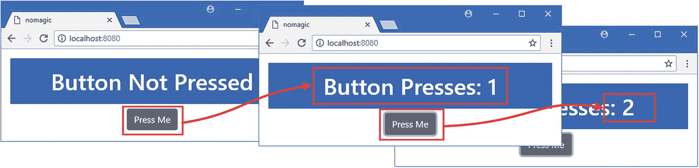
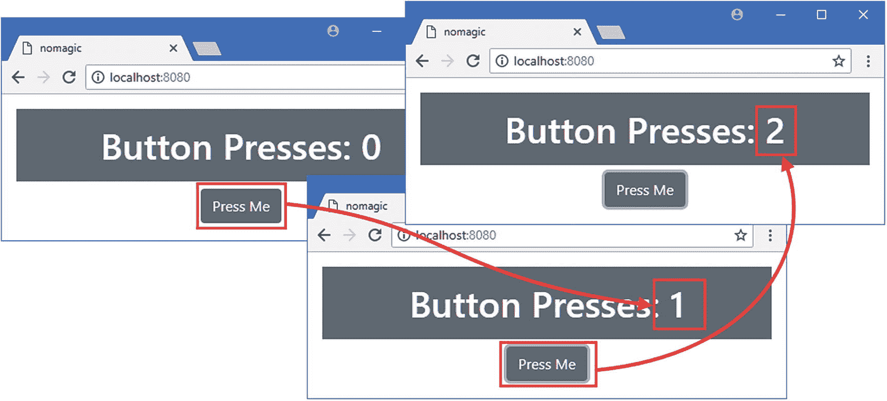
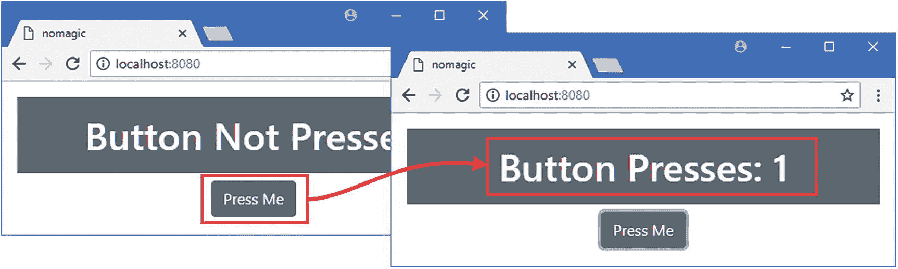
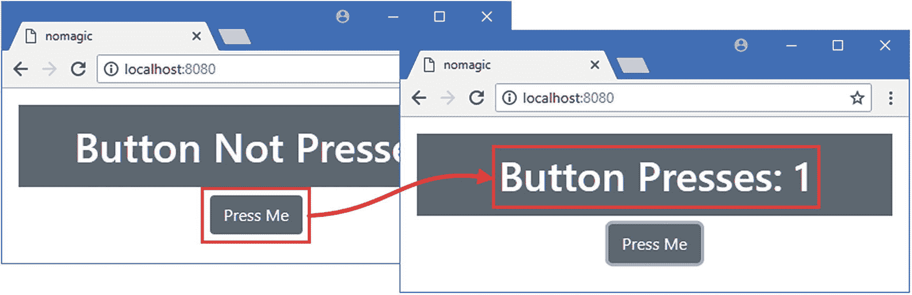

# 九、了解 Vue.js

当你开始使用 Vue.js 时，很容易被淹没，因为有很多事情正在进行，并且不是所有的事情都有直接的意义。这一章解释了 Vue.js 是如何工作的，并演示了其中没有魔法——当我在接下来的章节中深入研究各个 Vue.js 特性的细节时，记住这一点会很有帮助。表 [9-1](#Tab1) 总结了本章内容。

表 9-1

章节总结

<colgroup><col class="tcol1 align-left"> <col class="tcol2 align-left"> <col class="tcol3 align-left"></colgroup> 
| 

问题

 | 

解决办法

 | 

列表

 |
| --- | --- | --- |
| 创建一个没有 Vue.js 的简单 web 应用 | 使用 DOM API | six |
| 使用 Vue.js 创建一个简单的 web 应用 | 创建一个 Vue 对象并用`el`和`template`属性对其进行配置 | seven |
| 向用户呈现数据值 | 定义数据属性并使用数据绑定 | eight |
| 通过事件响应用户交互 | 使用`v-on`指令 | nine |
| 生成需要计算的数据值 | 定义计算属性 | Ten |
| 创建可重用的应用功能单元 | 定义和应用组件 | 11–13 |
| 将组件的模板定义为 HTML | 使用模板元素 | 14–16 |

## 为本章做准备

为了创建本章的示例项目，打开一个新的命令提示符，导航到一个方便的位置，并运行清单 [9-1](#PC1) 中所示的命令。这个命令依赖于我在第 [1](01.html) 章中描述的工具，在你能够创建项目之前，你需要完成那一章中的步骤。

### 小费

你可以从 [`https://github.com/Apress/pro-vue-js-2`](https://github.com/Apress/pro-vue-js-2) 下载本章以及本书其他章节的示例项目。

```js
vue create nomagic

Listing 9-1Creating the Example Project

```

当提示选择预设时，选择`default`。将创建项目，并下载和安装应用和开发工具所需的包，这可能需要一些时间才能完成。

### 注意

在撰写本文时，`@vue/cli`包已经发布了测试版。在最终发布之前可能会有一些小的变化，但是核心特性应该保持不变。有关任何突破性变化的详细信息，请查看本书的勘误表，可在 [`https://github.com/Apress/pro-vue-js-2`](https://github.com/Apress/pro-vue-js-2) 获得。

一旦创建了项目，将名为`vue.config.js`的文件添加到`nomagic`文件夹中，其内容如清单 [9-2](#PC2) 所示。这个文件用于配置 Vue.js 开发工具，我会在第 [10 章](10.html)中描述。

```js
module.exports = {
    runtimeCompiler: true
}

Listing 9-2The Contents of the vue.config.js File in the nomagic Folder

```

### 添加引导 CSS 框架

在`nomagic`文件夹中运行清单 [9-3](#PC3) 中所示的命令，将引导 CSS 包添加到项目中。这是 CSS 框架，我将用它来设计本章中 HTML 内容的样式。

```js
npm install bootstrap@4.0.0

Listing 9-3Adding the Bootstrap Package

```

一次安装完成后，打开`src`文件夹中的`main.js`文件，添加清单 [9-4](#PC4) 所示的语句。

```js
import Vue from 'vue'
import App from './App.vue'

import "bootstrap/dist/css/bootstrap.min.css";

Vue.config.productionTip = false

new Vue({
  render: h => h(App)
}).$mount('#app')

Listing 9-4Adding Bootstrap in the main.js File in the src Folder

```

该语句在发送到浏览器的内容中包含引导 CSS 样式。

### 运行示例应用

清单 [9-1](#PC1) 中的命令创建的项目包括 Vue.js 开发所需的工具。我将在第 [10 章](10.html)中更详细地解释如何使用这些工具，但是要开始开发过程，运行`nomagic`文件夹中清单 [9-5](#PC5) 中所示的命令。

```js
npm run serve

Listing 9-5Starting the Development Tools

```

开发 HTTP 服务器将在初始设置阶段后启动。打开一个新的浏览器窗口并导航到`http://localhost:8080`，您将看到如图 [9-1](#Fig1) 所示的占位符内容。


图 9-1

运行示例应用

## 使用 DOM API 创建应用

我将从根本不使用 Vue.js 创建一个简单的 web 应用开始，然后演示如何使用基本的 Vue.js 特性创建相同的功能。

为此，我将使用`main.js`文件，它通常包含初始化 Vue.js 应用的 JavaScript 代码。`main.js`文件只是一个 JavaScript 文件，这意味着我可以删除配置 Vue.js 的代码，用其他语句替换。

在清单 [9-6](#PC6) 中，我用一系列使用域对象模型(DOM) API 的 JavaScript 语句替换了`main.js`文件的默认内容。浏览器提供的 DOM API 允许 JavaScript 访问 HTML 文档及其内容，它是所有 web 应用的基础。

```js
require('../node_modules/bootstrap/dist/css/bootstrap.min.css')

let counter = 1;

let container = document.createElement("div");

container.classList.add("text-center", "p-3");

let msg = document.createElement("h1");

msg.classList.add("bg-primary", "text-white", "p-3");

msg.textContent = "Button Not Pressed";

let button = document.createElement("button");

button.textContent = "Press Me";

button.classList.add("btn", "btn-secondary");

button.onclick = () => msg.textContent = `Button Presses: ${counter++}`;

container.appendChild(msg);

container.appendChild(button);

let app = document.getElementById("app");

app.parentElement.replaceChild(container, app);

Listing 9-6Replacing the Contents of the main.js File in the src Folder

```

不要担心理解这个代码的细节。在大多数 Vue.js 项目中，您不需要直接使用 DOM API。这个例子的目的是证明`main.js`文件是一个普通的 JavaScript 文件，它包含的代码可以访问浏览器提供的标准特性。

您用清单 [9-6](#PC6) 中的命令启动的开发工具会自动检测项目文件的变更。这些更改被编译、打包成一个包含应用所有功能的文件，并自动发送到浏览器，这意味着只要你将更改保存到`main.js`文件，浏览器就会更新，你会看到如图 [9-2](#Fig2) 所示的内容。向用户显示初始消息，当按钮被按下时，该消息被计数器代替。每按一次按钮，计数器就增加一次。



图 9-2

直接使用域对象模型

### 理解 DOM API 应用如何工作

当执行`main.js`文件中的代码时，我使用 DOM API 创建一个包含一个`h1`元素和一个`button`元素的`div`元素。我将这些元素添加到对应于由引导 CSS 框架定义的样式的类中，引导 CSS 框架设置它们的外观。然后，我设置了一个事件监听器，通过更新计数器并在`h1`元素中显示一条消息来响应对`button`元素的点击。

一旦所有这些都完成了，我在 HTML 文档中找到 ID 为`app`的现有元素，并用我创建的`div`元素替换它。

```js
...
let app = document.getElementById("app");
app.parentElement.replaceChild(container, app);
...

```

这就是我向用户展示示例应用的方式。当浏览器向`http://localhost:8000`发送请求时，开发 HTTP 服务器用项目的`index.html`文件的内容进行响应，该文件包含以下元素:

```js
<!DOCTYPE html>
<html>
  <head>
    <meta charset="utf-8">
    <meta name="viewport" content="width=device-width,initial-scale=1.0">
    <title>nomagic</title>
  </head>
  <body>
    <div id="app"></div>

  </body>
</html>

```

我突出显示了 JavaScript 代码替换的元素，这是内容显示给用户的方式。

当开发服务器对浏览器的 HTTP 请求产生响应时，它会自动插入一个`script`元素，该元素加载包含所有项目 JavaScript 代码的 JavaScript 文件，您可以通过在浏览器窗口中右键单击并从弹出菜单中选择 View Page Source 来查看该文件。

```js
<!DOCTYPE html>
<html>
  <head>
    <meta charset="utf-8">
    <meta name="viewport" content="width=device-width,initial-scale=1.0">
    <title>nomagic</title>
  </head>
  <body>
    <div id="app"></div>
    <script type="text/javascript" src="/app.js"></script>

  </body>
</html>

```

提供的 JavaScript 文件包含`main.js`代码和它所依赖的任何代码。浏览器执行 JavaScript 文件中的语句，这导致我以编程方式生成的内容被插入到 HTML 文档中。

由`index.html`文件中的元素和由`main.js`文件中的代码生成的元素组成的组合 HTML，可以通过在浏览器窗口中右键单击并从弹出窗口中选择 Inspect 来查看，这将显示使用 DOM API 创建的 HTML 文档的实时视图。

```js
<!DOCTYPE html>
<html>
  <head>
    <meta charset="utf-8">
    <meta name="viewport" content="width=device-width,initial-scale=1.0">
    <title>nomagic</title>
  </head>
  <body>
    <div class="text-center p-3">

      <h1 class="bg-primary text-white p-3">Button Not Pressed</h1>

      <button class="btn btn-secondary">Press Me</button>

    </div>

    <script type="text/javascript" src="/app.js"></script>

  </body>
</html>

```

结果并不特别令人印象深刻，但是它证明了 JavaScript 代码可以用来访问 DOM API 来替换 HTML 文档中的元素、创建新内容以及响应用户交互。正如您将看到的，这些是任何 web 应用的基础——包括那些使用 Vue.js 创建的应用。

## 创建 Vue 对象

Vue.js 应用也使用 DOM API 来创建 HTML 内容、响应事件和更新数据值。不同的是，Vue.js 采用的方法更优雅，更容易理解，可伸缩性也更好。

在上一节中，我使用了`main.js`文件作为让浏览器执行 JavaScript 代码的便捷方式，但它在 Vue.js 应用中的常规用途是创建一个`Vue`对象，这是 Vue.js 提供的特性的入口点。在清单 [9-7](#PC11) 中，我用创建`Vue`对象的语句替换了 main.js 文件中的 DOM API 代码，将`main.js`文件返回到其预期用途。

```js
require('../node_modules/bootstrap/dist/css/bootstrap.min.css')

import Vue from "vue"

new Vue({

    el: "#app",

    template: `<div class="text-center p-3">

                   <h1 class="bg-secondary text-white p-3">

                       Vue: Button Not Pressed

                   </h1>

                   <button class="btn btn-secondary">

                        Press Me

                   </button>

               </div>`

});

Listing 9-7Creating a Vue Object in the main.js File in the src Folder

```

从`vue`模块导入`Vue`对象需要使用`import`语句，该模块是在创建项目时下载并安装到`node_modules`文件夹中的。使用`new`关键字创建一个`Vue`对象，构造函数接受一个配置对象，该对象的属性提供控制应用行为的设置，并定义它呈现给用户的内容。

在这个例子中，有两个配置属性:`el`和`template`。`Vue`对象使用`el`属性来标识`index.html`中的元素，该元素将被替换以显示应用内容。`template`属性用于向 Vue.js 提供 HTML 内容，该内容将替换由`el`属性匹配的元素。正如您所记得的，这些是我在上一节中直接使用 DOM API 时必须手动执行的任务。

在清单 [9-7](#PC11) 中，我将`el`属性设置为`#app`，这将选择`id`属性设置为`app`的元素。我设置了`template`属性，这样它就包含了我在清单 [9-6](#PC6) 中以编程方式创建的 HTML 元素的相同结构，优点是我可以直接编写 HTML，而不是使用 JavaScript 语句创建它们。配置对象是使用 JavaScript 定义的，这意味着我必须将 HTML 内容表示为 JavaScript 字符串。我使用了反勾字符(```js 字符)，这样我可以将字符串分割成多行，使其更容易阅读。

### 警告

只有当您覆盖了清单 [9-2](#PC2) 中所示的项目设置时，您才可以使用`template`属性。默认情况下，处理模板字符串的功能在 Vue.js 项目中是禁用的。

当保存对`main.js`文件的更改时，浏览器将重新加载并显示如图 [9-3](#Fig3) 所示的内容。如图所示，我更改了显示在`h1`元素中的消息及其背景颜色，使其明显地显示出已经发生了变化。


图 9-3

使用 Vue 对象

### 向 Vue 对象添加数据

我的`Vue`对象向用户显示 HTML 内容，但这只是我需要的功能的一部分。下一步是添加一些数据，并让 Vue.js 显示给用户。在清单 [9-8](#PC12) 中，我在应用中添加了一个名为`counter`的变量，并修改了`template`字符串，以便显示给用户。

```
require('../node_modules/bootstrap/dist/css/bootstrap.min.css')

import Vue from "vue"

new Vue({
    el: "#app",
    template: `<div class="text-center p-3">
                   <h1 class="bg-secondary text-white p-3">
                       Button Presses: {{ counter }}

                   </h1>
                   <button class="btn btn-secondary">
                        Press Me
                   </button>
               </div>`,
    data: {

        counter: 0

    }

});

Listing 9-8Adding a Variable in the main/js File in the src Folder

```js

我向`Vue`对象的配置对象添加了一个`data`属性。这个对象定义了一个`counter`属性，初始值为零。为了向用户显示计数器值，我在`h1`元素中使用了一个简单的数据绑定。

```
...
<h1 class="bg-secondary text-white p-3">
    Button Presses: {{ counter }}

</h1>
...

```js

数据绑定是 Vue.js 的一个重要特性，它提供了`Vue`对象的`template`内容和它的`data`对象之间的联系。当 Vue.js 显示`template`内容时，它会查找数据绑定，将它们作为 JavaScript 表达式进行评估，并将结果包含在显示给用户的 HTML 中。在这种情况下，数据绑定只是一个`data`对象属性的名称，结果是`counter`属性的值被添加到`h1`元素的内容中。

数据是*活动的*或*反应的*，这意味着`counter`属性的值的变化将自动反映在`h1`元素的内容中。当`Vue`对象被创建时，它处理`data`对象并替换属性，这样它就可以检测到何时有变化。

您可以使用 Vue Devtools 查看数据反应的效果。打开 F12 开发者工具窗口，选择 Vue 选项卡，点击`<Root>`项。在右窗格中，将鼠标移动到`counter`项目上，点击`+`符号以增加数值。Vue.js 检测新的`counter`值并再次评估模板中的代码，产生如图 [9-4](#Fig4) 所示的结果。(如果您尚未安装 Vue Devtools 扩展，请参见 [`https://github.com/vuejs/vue-devtools`](https://github.com/vuejs/vue-devtools) 获取安装说明。)


图 9-4

更改反应数据变量

### 添加事件处理程序

在 Vue.js 中重新创建 DOM API 应用的下一步是在单击`button`时自动增加`counter`的值。当我使用 DOM API 时，我能够使用 JavaScript 语句直接设置事件处理函数，但是对于`Vue`对象需要不同的方法，如清单 [9-9](#PC14) 所示。

```
require('../node_modules/bootstrap/dist/css/bootstrap.min.css')

import Vue from "vue"

new Vue({
    el: "#app",
    template: `<div class="text-center p-3">
                   <h1 class="bg-secondary text-white p-3">
                       Button Presses: {{ counter }}
                   </h1>
                   <button class="btn btn-secondary" v-on:click="handleClick">

                        Press Me
                   </button>
               </div>`,
    data: {
        counter: 0
    },
    methods: {

        handleClick() {

            this.counter++;

        }

    }

});

Listing 9-9Handling an Event in the main.js File in the src Folder

```js

我添加到`button`元素的属性是一个*指令*，它是 Vue.js 特性，将功能应用于 HTML 元素。在本例中，我使用了`v-on`指令为 Vue.js 提供一个 JavaScript 表达式来评估按钮元素的`click`事件何时被触发。在这个例子中，表达式是`handleClick`，它告诉 Vue.js 调用一个叫做`handleClick`的方法，我通过向`Vue`配置对象添加一个`methods`属性来定义这个方法。`methods`对象定义了一个增加`counter`值的`handleClick`函数。

由于 Vue.js 数据是反应性的，改变`counter`值会导致 Vue.js 评估`h1`元素中的数据绑定，从而改变显示给用户的消息，如图 [9-5](#Fig5) 所示。



图 9-5

处理事件

### 正在更正邮件

用 DOM API 示例 1 创建奇偶校验的最后一个变化是，当用户还没有点击`button`时，显示一条不同的消息。为了使用`Vue`对象创建等价对象，我做了清单 [9-10](#PC15) 中所示的修改。

```
require('../node_modules/bootstrap/dist/css/bootstrap.min.css')

import Vue from "vue"

new Vue({
    el: "#app",
    template: `<div class="text-center p-3">
                   <h1 class="bg-secondary text-white p-3">
                       {{ message }}

                   </h1>
                   <button class="btn btn-secondary" v-on:click="handleClick">
                        Press Me
                   </button>
               </div>`,
    data: {
        counter: 0
    },
    methods: {
        handleClick() {
            this.counter++;
        }
    },
    computed: {

        message() {

            return this.counter == 0 ?

                "Button Not Pressed" : `Button Presses: ${this.counter}`;

        }

    }

});

Listing 9-10Displaying a Conditional Message in the main.js File in the src Folder

```js

`computed`配置定义了需要一些计算才能产生结果的数据值。这个示例使用一个表达式来检查`counter`属性的值，并返回应该显示给用户的字符串。新的`computed`属性被称为`message`，我通过将它的名称放入数据绑定中，在`h1`元素中向用户显示它的值，就像我之前对数据属性所做的一样。

当用户点击按钮时，`v-on`指令调用`handleClick`方法，增加`counter`值。Vue.js 检测到变化，重新评估`template`内容中定义的数据绑定表达式，从 message computed 属性产生新的结果，通过`h1`元素中的数据绑定显示给用户，如图 [9-6](#Fig6) 所示。



图 9-6

使用计算的属性

### 了解 Vue 对象结构

`Vue`对象提供了与清单 [9-6](#PC6) 中使用 DOM API 的代码相同的功能，但结果是一个结构更好的应用，比直接使用 DOM 更容易开发和维护。当查看清单 [9-10](#PC15) 中的`Vue`对象时，可能很难看出 Vue.js 方法的优势，但是已经出现了一种将应用中的内容、逻辑和数据分开的结构，如图 [9-7](#Fig7) 所示。


图 9-7

应用的结构

`Vue`对象的模板提供了呈现给用户的 HTML 内容，并包含了提供应用交互性的数据绑定和事件指令。应用的数据由`counter`属性和`msg`计算属性组成，将它们联系在一起的逻辑包含在`handleClick`方法中。

## 介绍一个组件

`Vue`对象有助于分离应用的不同方面，但结果仍然令人尴尬。在大多数项目中，`Vue`对象用于配置应用，但是应用的功能是使用*组件*定义的，这些组件扩展了`Vue`对象的功能，并且可以在包含更有用的内容类型组合的文件中定义。

组件在扩展名为`.vue`的文件中定义。项目是用`App.vue`文件创建的，在清单 [9-11](#PC16) 中，我替换了该文件的默认内容。

```
<script>
export default {
    template: `<div class="text-center p-3">
                   <h1 class="bg-secondary text-white p-3">
                       {{ message }}
                   </h1>
                   <button class="btn btn-secondary" v-on:click="handleClick">
                        Press Me
                   </button>
               </div>`,
    data: function () {
        return {
            counter: 0
        }
    },
    methods: {
        handleClick() {
            this.counter++;
        }
    },
    computed: {
        message() {
            return this.counter == 0 ?
                "Button Not Pressed" : `Button Presses: ${this.counter}`;
        }
    }
}
</script>

Listing 9-11Replacing the Content of the App.vue File in the src Folder

```js

清单 [9-11](#PC16) 中所示的组件包含了我使用`Vue`对象定义的相同功能，除了 JavaScript 属性是在`script`元素中定义的。这看起来不像是多大的改进，但是它确实证明了组件是`Vue`对象，就像我在`main.js`文件中创建的那个一样。组件允许应用由多个组件组成，这些组件组合起来为用户提供复杂的功能。

JavaScript 代码包含在一个`script`元素中，并且包含与`Vue`对象相同的功能。从常规的`Vue`对象转移到组件时，JavaScript 代码有两个重要的变化。第一个是必须导出配置对象，如下所示:

```
...

export default {

    // ...configuration properties omitted for brevity...

}
...

```js

这允许对象从它的模块中导入，我在清单 [9-12](#PC19) 中就是这么做的。另一个变化是对`data`属性的修改，该属性必须表示为一个函数，如下所示:

```
...
data: function () {
    return {
        counter: 0
    }
},
...

```js

data 属性被赋予一个函数，该函数返回一个对象，该对象的属性为组件提供数据值。这是一种笨拙的方法，但是 Vue.js 强制执行这一要求，以确保每个组件都有自己的数据。

### 注册和应用组件

组件在使用前必须向 Vue.js 注册，这是通常在`main.js`文件中执行的主要工作之一。在清单 [9-12](#PC19) 中，我替换并更改了`Vue`对象的配置以使用新的组件。

```
require('../node_modules/bootstrap/dist/css/bootstrap.min.css')

import Vue from "vue";

import MyComponent from "./App";

new Vue({
    el: "#app",
    components: { "custom": MyComponent },

    template: `<div class="text-center">

                    <h1 class="bg-primary text-white p-3">

                        This is the main.js file

                    </h1>

                    <custom />

            </div>`

});

Listing 9-12Configuring a Component in the main.js File in the src Folder

```js

第一条新语句使用了`import`关键字，它从`App.vue`文件中导入模块，并将其命名为`MyComponent`。惯例是使用文件名作为导入的名称，但是您可以使用任何最有意义的名称。

下一个变化是向`Vue`对象的配置中添加一个`components`属性。该属性被赋予一个对象，该对象为 Vue.js 提供一个 HTML 元素列表以及与这些元素相关联的组件。在本例中，我已经配置了`components`属性来告诉 vue . js`custom`元素与`MyComponent`相关联，这是我在`App.vue`文件中分配给组件的名称。

我还更改了分配给`template`配置属性的`string`，使其包含一组更简单的 HTML 元素，其中包括一个`custom`元素。

当`Vue`对象处理它的模板时，它会遇到`custom`元素，并用`App.vue`文件中组件提供的 HTML 内容替换它。呈现给用户的结果是来自组件的`template`属性和来自`Vue`对象的`template`属性的 HTML 组合。当您保存更改时，浏览器将重新加载，您将看到如图 [9-8](#Fig8) 所示的内容。


图 9-8

使用组件

`Vue`对象通常不显示自己的内容，惯例是只将组件的 HTML 元素放在模板中，这就是我在清单 [9-13](#PC20) 中所做的。

```
require('../node_modules/bootstrap/dist/css/bootstrap.min.css')

import Vue from "vue";
import MyComponent from "./App";

new Vue({
    el: "#app",
    components: { "custom": MyComponent },
    template: "<custom />"

});

Listing 9-13Removing Template Content in the main.js File in the src Folder

```js

`Vue`对象用`custom`元素替换了`index.html`文件中的`div`元素，后者被组件的`template`元素的内容所替换。当您将更改保存到`main.js`文件时，您将看到完整的示例应用，如图 [9-9](#Fig9) 所示。



图 9-9

完成示例应用

### 将模板与 JavaScript 代码分离开来

您可以使用`template`属性来定义组件模板，但是有一种不同的方法，大多数开发人员会发现这种方法更容易使用。在清单 [9-14](#PC21) 中，我已经移除了`template`字符串并用一个`template`元素代替了它，这就是组件通常的定义方式。

```
<template>

    <div class="text-center p-3">

      <h1 class="bg-secondary text-white p-3">

        {{ message }}

      </h1>

      <button class="btn btn-secondary" v-on:click="handleClick">

          Press Me

      </button>

    </div>

</template>

<script>
export default {
    data: function () {
        return {
            counter: 0
        }
    },
    methods: {
        handleClick() {
            this.counter++;
        }
    },
    computed: {
        message() {
            return this.counter == 0 ?
                "Button Not Pressed" : `Button Presses: ${this.counter}`;
        }
    }
}
</script>

Listing 9-14Using a Template Element in the App.vue File in the src Folder

```js

`template`元素包含与它所替换的字符串模板相同的内容，但是这种方法意味着大多数程序员的编辑器能够将模板识别为 HTML 内容，并提供开发人员支持，例如自动完成元素和属性名称以及标记错误。示例出现或表现的方式没有任何变化，这种变化纯粹是为了使开发体验更加愉快。

#### 使用单独的 JavaScript 和 HTML 文件

不是每个人都喜欢在同一个文件中混合 JavaScript 和 HTML 内容。如果您不能使用组合格式，那么您可以创建单独的文件。为了演示，我在`src`文件夹中添加了一个名为`App.html`的文件，其内容如清单 [9-15](#PC22) 所示。

```
<div class="text-center p-3">
    <h1 class="bg-secondary text-white p-3">
      {{ message }}
    </h1>
    <button class="btn btn-secondary" v-on:click="handleClick">
        Press Me
    </button>
</div>

Listing 9-15The Contents of the App.html File in the src Folder

```js

在清单 [9-16](#PC23) 中，我删除了`template`元素的内容，并添加了一个`src`属性，告诉 Vue.js 可以在 HTML 文件中找到组件的内容。

```
<template src="./App.html" />

<script>
export default {
    data: function () {
        return {
            counter: 0
        }
    },
    methods: {
        handleClick() {
            this.counter++;
        }
    },
    computed: {
        message() {
            return this.counter == 0 ?
                "Button Not Pressed" : `Button Presses: ${this.counter}`;
        }
    }
}
</script>

Listing 9-16Specifying an HTML File in the App.vue File in the src Folder

```

## 摘要

在这一章中，我解释了 Vue.js 使用相同的 DOM API 来创建 web 应用，任何使用标准 JavaScript 的开发人员都可以访问这些应用，强调了 Vue.js 的工作方式没有任何神秘或神奇之处。正如您将在接下来的章节中看到的，虽然您可以直接使用 DOM API，但 Vue.js 提供了一组引人注目的特性和出色的开发人员体验，从而带来了更优雅、可管理和可伸缩的特性。在下一章，我将解释 Vue.js 项目的结构，并解释开发工具是如何工作的。