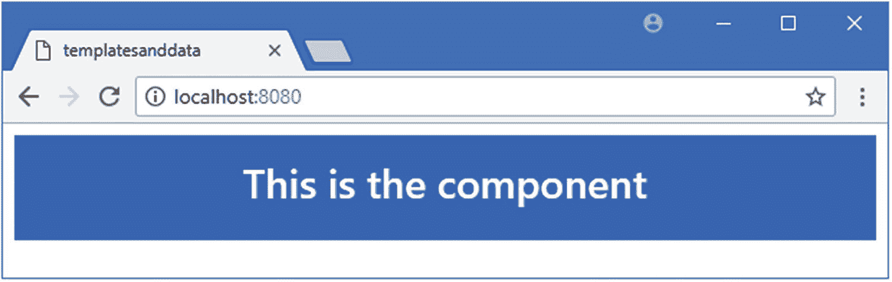
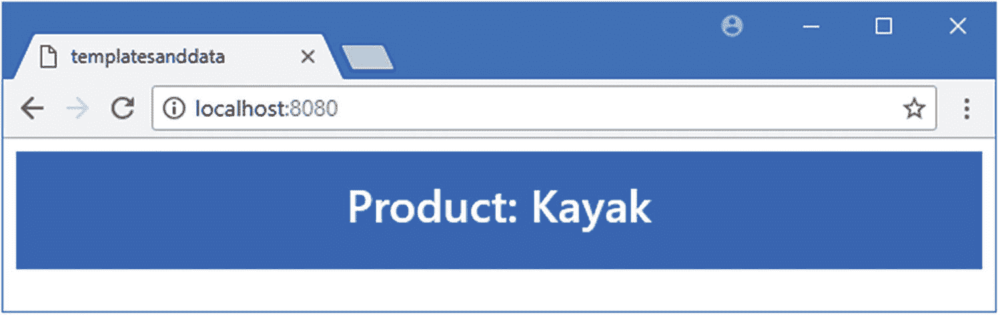
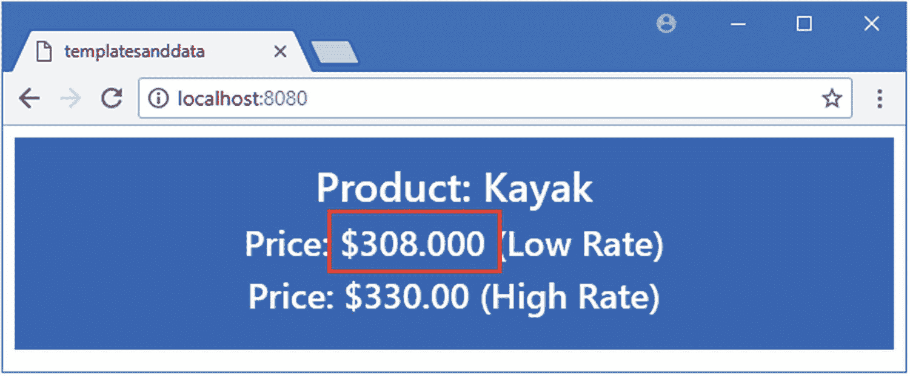
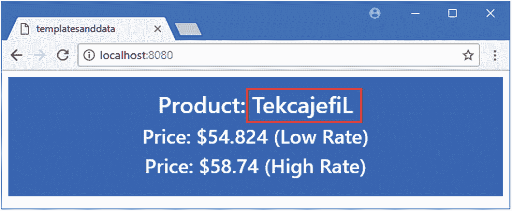

# 十一、了解数据绑定

在这一章中，我将解释如何执行 web 应用开发中最基本的任务之一:使用数据绑定来显示数据值。我将解释如何向组件的模板添加一个基本的数据绑定，称为*文本插值绑定*，以及如何为该绑定创建数据值。我解释了 Vue.js 如何评估数据绑定的表达式，并演示了在向用户显示值之前生成和格式化值的不同方法。表 [11-1](#Tab1) 将文本插值数据绑定放在上下文中。

表 11-1

将文本插值数据绑定放入上下文中

<colgroup><col class="tcol1 align-left"> <col class="tcol2 align-left"></colgroup> 
| 

问题

 | 

回答

 |
| --- | --- |
| 它们是什么？ | 数据绑定将组件的数据与其模板中的 HTML 元素连接起来。文本插值是 Vue.js 支持的最简单的绑定。 |
| 它们为什么有用？ | 数据绑定使 Vue.js 应用具有交互性。用户执行的操作会改变应用的状态，并通过数据绑定反映给用户。 |
| 它们是如何使用的？ | 文本插值绑定是使用双花括号字符`{{`和`}}`创建的，这就是为什么它们通常被称为*小胡子绑定*。 |
| 有什么陷阱或限制吗？ | Vue.js 允许在数据绑定中使用复杂的表达式。这是一个有用的特性，但是很容易失去控制，在数据绑定中嵌入太多的逻辑，这样项目很难测试和维护。 |
| 有其他选择吗？ | 文本插值绑定只是 Vue.js 支持的绑定之一，其他绑定将在后面的章节中介绍。 |

表 [11-2](#Tab2) 总结了本章内容。

表 11-2

章节总结

<colgroup><col class="tcol1 align-left"> <col class="tcol2 align-left"> <col class="tcol3 align-left"></colgroup> 
| 

问题

 | 

解决办法

 | 

列表

 |
| --- | --- | --- |
| 定义新组件 | 创建一个扩展名为`.vue`的文件，并添加`template`、`script`和`style`元素。 | 6, 7 |
| 显示数据值 | 添加数据值和文本插值绑定 | 8, 9 |
| 计算价值 | 使用计算的属性或方法 | 10–14 |
| 格式化数据属性 | 使用一个或多个过滤器 | 15–18 |

## 为本章做准备

对于本章中的例子，在一个方便的位置运行清单 [11-1](#PC1) 中所示的命令来创建一个新的 Vue.js 项目。

```js
vue create templatesanddata --default

Listing 11-1Creating a New Project

```

这个命令创建了一个名为`templatesanddata`的项目。一旦设置过程完成，运行`templatesanddata`文件夹中清单 [11-2](#PC2) 所示的命令，将引导 CSS 包添加到项目中。

### 小费

你可以从 [`https://github.com/Apress/pro-vue-js-2`](https://github.com/Apress/pro-vue-js-2) 下载本章以及本书其他章节的示例项目。

```js
npm install bootstrap@4.0.0

Listing 11-2Adding the Bootstrap CSS Package

```

将清单 [11-3](#PC3) 中所示的语句添加到`src`文件夹中的`main.js`文件中，将引导 CSS 文件合并到应用中。

```js
import Vue from 'vue'
import App from './App.vue'

import "bootstrap/dist/css/bootstrap.min.css";

Vue.config.productionTip = false

new Vue({
  render: h => h(App)
}).$mount('#app')

Listing 11-3Incorporating the Bootstrap Package in the main.js File in the src Folder

```

添加清单 [11-4](#PC4) 中所示的语句来禁用 linter 规则，该规则在浏览器的 JavaScript 控制台被使用时发出警告，我将在本章后面用到它。

```js
...
"eslintConfig": {
  "root": true,
  "env": {
    "node": true
  },
  "extends": [
    "plugin:vue/essential",
    "eslint:recommended"
  ],
  "rules": {
    "no-console": "off"

  },
  "parserOptions": {
    "parser": "babel-eslint"
  }
},
"postcss": {
  "plugins": {
    "autoprefixer": {}
  }
},
...

Listing 11-4Configuring the Linter in the package.json File in the templatesanddata Folder

```

运行`templatesanddata`文件夹中清单 [11-5](#PC5) 所示的命令，启动开发工具。

```js
npm run serve

Listing 11-5Navigating to the Project Folder and Starting the Development Tools

```

将执行初始构建过程，之后您将看到一条消息，告诉您项目已经成功编译，HTTP 服务器正在侦听端口 8080 上的请求。打开一个新的浏览器窗口，导航到`http://localhost:8080`查看项目的占位符内容，如图 [11-1](#Fig1) 所示。


图 11-1

运行示例应用

## 了解组件的元素

组件是 Vue.js 应用中的主要构建块，除了最简单的项目之外，所有项目都包含几个组件。组件在`.vue`文件中定义，这些文件包含显示给用户的 HTML 内容、支持内容的数据和 JavaScript 代码以及 CSS 样式。Vue.js 项目中的约定是定义一个根组件来编排应用的其余部分；这是`App`组件，它被定义在`src`文件夹中的一个名为`App.vue`的文件中。我用来创建示例项目的默认项目选项添加了一个根组件，其内容如清单 [11-6](#PC6) 所示。

```js
<template>
  <div id="app">
    
    <HelloWorld msg="Welcome to Your Vue.js App"/>
  </div>
</template>

<script>
import HelloWorld from './components/HelloWorld.vue'

export default {
  name: 'app',
  components: {
    HelloWorld
  }
}
</script>

<style>
#app {
  font-family: 'Avenir', Helvetica, Arial, sans-serif;
  -webkit-font-smoothing: antialiased;
  -moz-osx-font-smoothing: grayscale;
  text-align: center;
  color: #2c3e50;
  margin-top: 60px;
}
</style>

Listing 11-6The Initial Contents of the App.vue File in the src Folder

```

组件是使用三个元素定义的:`template`元素、`script`元素和`style`元素，我将在接下来的小节中简要描述这些元素。

### 了解模板元素

元素包含组件的 HTML 内容。模板包含一个顶级元素(清单 [11-6](#PC6) 中模板中的一个`div`元素)，它替换了应用组件的元素，如第 [9 章](09.html)所述。组件的模板包含常规 HTML 元素和 Vue.js 增强的混合，它们应用应用功能，如数据绑定、指令和应用其他组件的自定义元素。您已经在前面的章节中看到了所有这些特性的例子，但是我将在本章和本书的其余部分详细描述它们。

### 了解脚本元素

`script`元素包含组件的 JavaScript 模块，其属性配置组件，定义其数据模型，并提供支持其特性的逻辑。`script`元素的不同角色意味着当你开始 Vue.js 开发时可能很难理解，但是你很快就会熟悉最有用的配置属性。

### 了解样式元素

`style`元素定义了 CSS 样式，可以对其进行配置，使其仅适用于`template`元素，或者在应用中具有更广泛的效果。并不是所有的组件都需要自己的 CSS 样式，所以你会经常遇到只有`template`和`script`元素的组件，尤其是在使用像 Bootstrap 这样的 CSS 框架时，就像我在本书中所做的那样。但是`script`元素提供了一些有用的 CSS 特性，即使在使用 CSS 框架时，也有必要了解如何应用它们。

正如您将了解到的，正是组合`template`、`script`和`style`元素的方式使得组件变得有用，并且这些元素是 Vue.js 开发的显著特征。

## 重置示例应用中的组件

文件`App.vue`中的组件并没有做太多事情，但是我仍然打算把它剥离回基础，这样我就可以一个一个地引入特性。在清单 [11-7](#PC7) 中，我简化了`template`和`script`元素，并删除了`style`元素，为本章的剩余部分留下了一张白纸。

```js
<template>
    <div class="bg-primary text-white text-center m-2 p-3">
        <h3>This is the component</h3>
    </div>
</template>

<script>
    export default {
        name: "MyComponent"
    }
</script>

Listing 11-7Resetting the Contents of the App.vue File in the src Folder

```

`template`现在包含了一个顶级的`div`元素，我已经将它分配给了几个应用引导 CSS 样式的类，这让我可以在这个组件中不使用`style`元素的情况下应用样式。`div`元素包含一个带有简单文本消息的`h3`元素。

当您将更改保存到`App.vue`文件时，项目将被编译，浏览器将重新加载，您将看到如图 [11-2](#Fig2) 所示的内容。



图 11-2

简化示例应用中的组件

在`script`元素中定义的唯一属性是`name`。Vue Devtools 浏览器扩展(在第 [10 章](10.html)中描述)使用可选的`name`属性来显示应用的结构，选择一个与众不同且有意义的名称有助于理解检查应用状态时发生的事情。打开浏览器的 F12 开发者工具，切换到 Vue 选项卡；你会看到组件的名称显示在布局中，如图 [11-3](#Fig3) 所示。显示器本身目前不是特别有用，但随着功能的增加，它会提供更多信息。


图 11-3

检查应用的结构

## 显示数据值

组件可以做的最重要的工作之一是向用户显示数据。显示一个数据值需要两个步骤:在`script`元素中定义一个数据属性，并在`template`元素中添加一个数据绑定来将值呈现给用户，如清单 [11-8](#PC8) 所示。

```js
<template>
    <div class="bg-primary text-white text-center m-2 p-3">
        <h3>Product: {{ name }}</h3>

    </div>
</template>

<script>
    export default {
        name: "MyComponent",
        data: function () {

            return {

                name: "Kayak"

            }

        }

    }
</script>

Listing 11-8Displaying a Data Value in the App.vue File in the src Folder

```

使用 JavaScript 模块中的`data`属性定义数据值。必须遵循特定的模式来定义组件的数据值:`data`属性返回一个函数，函数返回一个对象，由对象定义的属性可用于向用户显示数据值。

### 定义数据值的分步指南

添加对数据值的支持需要一个笨拙的模式，而出错是 Vue.js 开发中最常见的错误之一。首先定义一个返回如下函数的`data`属性:

```js
...
<script>
    export default {
        name: "MyComponent",
        data: function() {

        }

    }
</script>
...

```

使用`data`，后跟一个冒号，后跟`function`关键字，后跟一个左括号和一个右括号(`(`和`)`字符)，然后是一个左大括号和一个右大括号(`{`和`}`字符)。下一步是返回一个对象，使用第 [4](04.html) 章中描述的 JavaScript 对象文本形式。

```js
...
<script>
    export default {
        name: "MyComponent",
        data: function() {
            return {

            }

        }
    }
</script>
...

```

使用`return`关键字，后跟左花括号和右花括号。最后一步是定义您需要的数据值。使用名称，后跟冒号(`:`字符)，再后跟值来指定值。

```js
...
<script>
    export default {
        name: "MyComponent",
        data: function() {
            return {
                myValue: 10

            }
        }
    }
</script>
...

```

通过在前一行的末尾放置一个逗号，然后定义一个新值来分隔多个数据值，如下所示:

```js
...
<script>
    export default {
        name: "MyComponent",
        data: function() {
            return {
                myValue: 10, // <-- notice the comma here

                myOtherValue: "Hello, World"

            }
        }
    }
</script>
...

```

这只对`data`值有要求，一旦你获得了一点 Vue.js 开发的经验，你就会开始自动遵循这个模式。如果您忘记定义一个返回对象的函数，那么您将在浏览器的 JavaScript 控制台中看到一条警告，如下所示:

```js
[Vue warn]: The "data" optionz should be a function that returns a per-instance value in component definitions.

```

这个警告不会像我在第 [10](10.html) 章中演示的编译器错误那样显示在主浏览器窗口中，但它通常会导致其他警告并阻止数据绑定正常工作。

使用数据绑定将`script`元素中的数据值链接到`template`元素中的 HTML 元素。有许多不同类型的数据绑定可用，但是为了开始，我使用最简单的，它是*文本插值绑定*，就像这样:

```js
...
<h3>Product: {{ name }}</h3>
...

```

这种类型的绑定将数据值插入到 HTML 元素的文本内容中，并用双花括号(`{{`和`}}`)表示。据说双牙套很像小胡子，这就是为什么它也被称为*小胡子捆绑*。将更改保存到`App.vue`文件，您将会看到如图 [11-4](#Fig4) 所示的内容。



图 11-4

显示数据值

浏览器的 F12 开发人员工具窗口中的 Vue Devtools 选项卡也将被更新，以显示组件的数据值。数据值是实时的，这意味着值的更改会自动反映在整个应用中。对于示例应用，这意味着更改组件的`name`属性的值将自动更新`template`元素中的文本插值数据绑定。应用本身还不能改变`name`的值，但是如果你将鼠标指针移到 Vue Devtools 面板中的值上，你会看到一个铅笔图标，点击它可以激活一个编辑器。将值更改为“Green Kayak”(注意保留引号字符)，然后单击磁盘图标保存更改。Vue.js 会检测到数据属性的变化，并更新显示给用户的 HTML，如图 [11-5](#Fig5) 所示。


图 11-5

使用 Vue Devtools 更改数据属性

### 在数据绑定中使用更复杂的表达式

当 Vue.js 显示一个数据绑定时，它会将其内容作为一个 JavaScript 表达式进行评估。当数据绑定的内容只是一个`data`属性的名称时，那么计算表达式就会产生属性的值，这就是我在示例中使用的`{{ name }}`绑定能够显示名为`name`的`data`属性的值的方式。

将数据绑定视为表达式意味着您可以在数据绑定中使用更复杂的 JavaScript 语句。在清单 [11-9](#PC15) 中，我向`script`元素添加了另外两个`data`属性，并向`template`元素添加了一个更复杂的数据绑定。

```js
<template>
    <div class="bg-primary text-white text-center m-2 p-3">
        <h3>Product: {{ name }}</h3>
        <h3>Price: ${{ (price + (price * (taxRate / 100))).toFixed(2) }}</h3>

    </div>
</template>

<script>
    export default {
        name: "MyComponent",
        data: function () {
            return {
                name: "Kayak",
                price: 275,

                taxRate: 12

            }
        }
    }
</script>

Listing 11-9Using a More Complex Data Binding Expression in the App.vue File in the src Folder

```

我添加了名为`price`和`taxRate`的数据属性，我在新的数据绑定表达式中使用它们来计算总价并对结果进行格式化，使其小数点后有两位数，当项目被编译并且浏览器重新加载时，就会产生如图 [11-6](#Fig6) 所示的结果。


图 11-6

将复杂数据表达式放入数据绑定中

表达式只能包含一条语句，并且必须产生一个结果，这意味着不能在数据绑定中调用函数或执行复杂的任务。表达式的上下文是组件，这意味着您只能访问其模板包含数据绑定的组件定义的数据。这就是我能够引用`name`、`price`和`taxRate`属性而不需要以任何方式限定名称的方式，但是这也阻止了我访问浏览器为 JavaScript 代码提供的任何全局对象(例如`window`和`document`)或由其他组件定义的数据。

表达式还可以访问常用的 JavaScript 全局对象和函数，比如用于访问数学函数和处理 JSON 数据的`Math`和`JSON`对象。表 [11-3](#Tab3) 中描述了可以从模板中访问的最有用的全局对象和函数。

表 11-3

可在绑定表达式中访问的有用的全局对象和函数

<colgroup><col class="tcol1 align-left"> <col class="tcol2 align-left"></colgroup> 
| 

名字

 | 

描述

 |
| --- | --- |
| `parseFloat` | 这个函数解析一个浮点数值。 |
| `parseInt` | 这个函数解析一个整数值。 |
| `Math` | 这个对象提供数学函数。 |
| `Number` | 该对象提供了用于处理数值的方法。 |
| `Date` | 该对象提供了用于处理日期的方法。 |
| `Array` | 该对象提供了用于处理数组的方法。 |
| `Object` | 该对象提供了用于处理对象的方法。 |
| `String` | 该对象提供与字符串相关的方法。 |
| `RegExp` | 该对象用于执行正则表达式搜索。 |
| `Map` | 该对象用于表示键值对的集合。 |
| `Set` | 该对象用于表示唯一值或对象的集合。 |
| `JSON` | 该对象用于序列化和反序列化 JSON 数据。 |
| `Intl` | 该对象提供对特定于地区的格式的访问，如清单 [11-15](#PC29) 所示。该对象提供的特征的细节在 [`https://developer.mozilla.org/en-US/docs/Web/JavaScript/Reference/Global_Objects/Intl`。](https://developer.mozilla.org/en-US/docs/Web/JavaScript/Reference/Global_Objects/Intl) |

表 [11-3](#Tab3) 中的全局对象和函数列表提供了对 JavaScript 开发最常用特性的访问，但不包括对可能用于执行危险操作的对象的访问，例如操作 DOM。

### 了解未定义的数据属性

将数据绑定评估为表达式的一个结果是很难发现错误。JavaScript 有一种宽松的方法来访问不存在的属性，如果您读取一个尚未定义的属性，它将返回特殊的`undefined`值。

Vue.js 对表达式求值，但不将结果插入 HTML 元素，而是在浏览器的 JavaScript 控制台中显示一条警告，如下所示:

```js
...

[Vue warn]: Property or method "category" is not defined on the instance but referenced during render.
...

```

这是打字错误最常见的问题，其中,`data`属性的名称与用于显示其值的数据绑定中使用的名称不匹配，值得在开发过程中观察 JavaScript 控制台，因为这个问题不会产生编译器错误，也不会显示在浏览器错误覆盖中。

### 使用计算的属性计算值

保持数据绑定中的表达式简单是很好的实践，因为它使模板更容易阅读，更容易维护，并最大化代码重用。为了帮助保持模板简单，Vue.js 提供了 computed property 特性，该特性用于基于`data`属性生成值，这样您就不必在数据绑定中包含复杂的表达式。在清单 [11-10](#PC17) 中，我定义了一个计算属性，它使用`price a`和`taxRate`值计算产品的总价。

```js
<template>
    <div class="bg-primary text-white text-center m-2 p-3">
        <h3>Product: {{ name }}</h3>
        <h3>Price: ${{ totalPrice.toFixed(2) }}</h3>

    </div>
</template>

<script>
    export default {
        name: "MyComponent",
        data: function () {
            return {
                name: "Kayak",
                price: 275,
                taxRate: 12
            }
        },
        computed: {

            totalPrice: function() {

                return this.price + (this.price * (this.taxRate / 100));

            }

        }

    }
</script>

Listing 11-10Using a Computed Property in the App.vue File in the src Folder

```

一个`computed`属性被添加到组件的 JavaScript 模块中，并被赋予一个 literal 对象，该对象的属性名是计算属性的名称。有些组件特性很难描述，因为它们非常依赖术语*属性*，你可能需要再读一遍前面的句子才能理解它。

### 注意

注意，我必须在 computed property 的函数中使用`this`关键字来访问`data`属性。在我描述不同的组件特性时，您会反复看到这个需求，如果您在`script`元素的语句中省略了`this`关键字，您会收到一个错误，告诉您没有定义属性。

在清单中，我用一个函数定义了一个名为`totalPrice`的计算属性，该函数执行之前包含在数据绑定中的计算。计算属性的使用就像数据绑定中常规的`data`属性一样，这意味着我可以像这样简化数据绑定:

```js
...
<h3>Price: ${{ totalPrice.toFixed(2) }}</h3>
...

```

#### 了解反应性和计算属性

Vue.js 优化了更新过程，只在它所依赖的一个值发生变化时才重新计算一个计算属性。为了演示，我在 computed 属性的函数中添加了一些语句来指示它何时被调用，如清单 [11-11](#PC19) 所示。

### 小费

在大多数项目中，您不需要担心优化反应性，但是了解可用的不同特性以及它们如何协同工作是很有用的，这就是为什么我包含了这个示例。有关 Vue.js 应用中反应性的更多详细信息，请参见第 [17](17.html) 章。

```js
<template>
    <div class="bg-primary text-white text-center m-2 p-3">
        <h3>Product: {{ name }}</h3>
        <h3>Price: ${{ totalPrice.toFixed(2) }}</h3>
    </div>
</template>

<script>
    export default {
        name: "MyComponent",
        data: function () {
            return {
                name: "Kayak",
                price: 275,
                taxRate: 12
            }
        },
        computed: {
            totalPrice: function () {
                let tp = this.price + (this.price * (this.taxRate / 100));

                console.log(`Calculated: ${tp} (${this.taxRate})`);

                return tp;

            }
        }
    }
</script>

Listing 11-11Monitoring a Computed Property in the App.vue File in the src Folder

```

我使用`console.log`方法在每次调用该函数时向浏览器的 JavaScript 控制台写入一条消息。

应用还不能让用户更改数据值，所以将更改保存到文件中，并使用 Vue Devtools 增加`taxRate`属性的值。每次增加属性时，您都会看到浏览器的 JavaScript 控制台中显示一条消息，反映您所做的更改。

```js
...
Calculated: 310.75 (13)
Calculated: 313.5 (14)
Calculated: 316.25 (15)
...

```

Vue.js 知道`totalPrice`计算的属性依赖于`taxRate`的值，并在`taxRate`改变时调用该函数获取新值，这样它就可以评估数据绑定表达式。

### 计算属性中的副作用

在计算属性的函数中包含进行更改的语句是一种不好的做法，这就是所谓的副作用。副作用使得应用更难理解，并且会降低 Vue.js 更新过程的效率。

因此，我在第 [10](10.html) 章中描述的 Vue.js linter 规则包含了对计算属性的副作用的检查。下面是一个包含副作用的组件:

```js
<template>
    <div class="bg-primary text-white text-center m-2 p-3">
        <h3>Product: {{ name }}</h3>
        <h3>Price: ${{ totalPrice.toFixed(2) }}</h3>
    </div>
</template>

<script>
    export default {
        name: "MyComponent",
        data: function () {
            return {
                name: "Kayak",
                price: 275,
                taxRate: 12,
                counter: 0

            }
        },
        computed: {
            totalPrice: function () {
                let tp = this.price + (this.price * (this.taxRate / 100));
                console.log(`Calculated: (${this.counter++})

                                ${tp}(${this.taxRate})`);

                return tp;
            }
        }
    }
</script>

```

我添加了一个`counter`变量，它的值包含在传递给`console.log`方法的字符串中。这种情况下的副作用是`counter`属性随着`++`值的增加而增加。linter 检测到副作用并报告以下错误:

```js
...
Unexpected side effect in "totalPrice" computed property
    console.log(`Calculated: (${this.counter++})
                                ^
...

```

您可以禁用这个名为`vue/no-side-effects-in-computed-properties`的 linter 规则，但是需要小心，因为副作用会产生意想不到的行为，应该避免。

### 使用方法计算数据值

计算属性的主要限制是不能改变用于产生结果的值。例如，如果我需要使用两个税率计算总成本，我必须使用两个计算属性，每个属性执行类似的计算，如清单 [11-12](#PC23) 所示。

```js
<template>
    <div class="bg-primary text-white text-center m-2 p-3">
        <h3>Product: {{ name }}</h3>
        <h4>Price: ${{ lowTotalPrice.toFixed(2) }} (Low Rate)</h4>

        <h4>Price: ${{ highTotalPrice.toFixed(2) }} (High Rate)</h4>

    </div>
</template>

<script>
    export default {
        name: "MyComponent",
        data: function () {
            return {
                name: "Kayak",
                price: 275,
                lowTaxRate: 12,

                highTaxRate: 20

            }
        },
        computed: {
            lowTotalPrice: function () {

                let tp = this.price + (this.price * (this.lowTaxRate / 100));

                return tp;

            },

            highTotalPrice: function () {

                let tp = this.price + (this.price * (this.highTaxRate / 100));

                return tp;

            }

        }
    }
</script>

Listing 11-12Computing Similar Values in the App.vue File in the src Folder

```

现在有两个税率，对每个税率进行计算，产生如图 [11-7](#Fig7) 所示的结果。


图 11-7

执行多重计算

清单 [11-12](#PC23) 中的方法是可行的，但是它的伸缩性不好。根据经验，我不喜欢任何添加值的自然方式是剪切和粘贴现有代码的方法，因为复制代码但无法更新代码以产生正确的值只是时间问题。

更好的方法是定义一个方法，这将允许我重用相同的代码来计算不同的价格，而不需要任何重复。在清单 [11-13](#PC24) 中，我定义了一个计算产品价格的方法。

```js
<template>
    <div class="bg-primary text-white text-center m-2 p-3">
        <h3>Product: {{ name }}</h3>
        <h4>Price: ${{ lowTotalPrice.toFixed(2) }} (Low Rate)</h4>
        <h4>Price: ${{ highTotalPrice.toFixed(2) }} (High Rate)</h4>
    </div>
</template>

<script>
    export default {
        name: "MyComponent",
        data: function () {
            return {
                name: "Kayak",
                price: 275,
                lowTaxRate: 12,
                highTaxRate: 20
            }
        },
        computed: {
            lowTotalPrice: function () {
                return this.getTotalPrice(this.lowTaxRate);

            },
            highTotalPrice: function () {
                return this.getTotalPrice(this.highTaxRate);

            }
        },
        methods: {

            getTotalPrice(taxRate) {

                return this.price + (this.price * (taxRate / 100));

            }

        }

    }
</script>

Listing 11-13Defining a Method in the App.vue File in the src Folder

```

为了定义一个方法，我向组件的配置对象添加了一个`methods`属性，并使用它来定义一个函数。与计算属性不同，方法能够定义参数。这个例子中的函数叫做`getTotalPrice`，它定义了一个`taxRate`参数，用来提供结果。然后，我可以从计算出的属性的函数中调用该方法，如下所示:

```js
...
lowTotalPrice: function () {
    return this.getTotalPrice(this.lowTaxRate);
},
...

```

注意，我必须用关键字`this`作为方法名称的前缀，就像我使用数据属性一样。`this`关键字不需要访问方法中的参数值，可以直接读取，但是需要访问`data`属性值。

```js
...
getTotalPrice(taxRate) {
    return this.price + (this.price * (taxRate / 100));
}
...

```

#### 直接从数据绑定中调用方法

使用一个方法允许我合并计算总价所需的代码，但是我可以更进一步，通过完全移除计算的属性并直接从数据绑定中调用方法来简化组件，如清单 [11-14](#PC27) 所示。

```js
<template>
    <div class="bg-primary text-white text-center m-2 p-3">
        <h3>Product: {{ name }}</h3>
        <h4>Price: ${{ getTotalPrice(lowTaxRate).toFixed(2) }} (Low Rate)</h4>

        <h4>Price: ${{ getTotalPrice(highTaxRate).toFixed(2) }} (High Rate)</h4>

    </div>
</template>

<script>
    export default {
        name: "MyComponent",
        data: function () {
            return {
                name: "Kayak",
                price: 275,
                lowTaxRate: 12,
                highTaxRate: 20
            }
        },
        methods: {
            getTotalPrice(taxRate) {
                return this.price + (this.price * (taxRate / 100));
            }
        }
    }
</script>

Listing 11-14Calling Methods Directly in the App.vue File in the src Folder

```

这种变化显示了不同组件功能协同工作的灵活性，但也是一种倒退，因为它增加了数据绑定中表达式的复杂性。您会发现，通常需要做出一些选择来平衡不同的 Vue.js 特性。

### 用筛选器格式化数据值

为了向用户显示美元金额，我将一个文本字符(美元符号)与 JavaScript `toFixed`方法结合起来，如下所示:

```js
...
<h4>Price: ${{ getTotalPrice(lowTaxRate).toFixed(2) }} (Low Rate)</h4>
...

```

我可以通过使用过滤器来改进这种方法，过滤器是一种用于格式化表达式结果的函数。在清单 [11-15](#PC29) 中，我添加了一个过滤器，将数字值格式化为货币金额。

```js
<template>
    <div class="bg-primary text-white text-center m-2 p-3">
        <h3>Product: {{ name }}</h3>
        <h4>Price: {{ getTotalPrice(lowTaxRate) | currency }} (Low Rate)</h4>

        <h4>Price: {{ getTotalPrice(highTaxRate) | currency }} (High Rate)</h4>

    </div>
</template>

<script>
    export default {
        name: "MyComponent",
        data: function () {
            return {
                name: "Kayak",
                price: 275,
                lowTaxRate: 12,
                highTaxRate: 20
            }
        },
        methods: {
            getTotalPrice(taxRate) {
                return this.price + (this.price * (taxRate / 100));
            }
        },
        filters: {

            currency(value) {

                return new Intl.NumberFormat("en-US",

                    { style: "currency", currency: "USD" }).format(value);

            }

        }

    }
</script>

Listing 11-15Adding a Filter in the App.vue File in the src Folder

```

过滤器被定义为组件配置对象中一个`filters`属性下的函数。过滤函数通过它们的参数接收值，并返回格式化的结果。在清单中，我定义了一个使用全局`Intl`对象格式化值的`currency`过滤器，它提供了对本地化格式的访问。我使用了`NumberFormat`方法来指定`en-US`地区(代表在美国使用的英语),并提供了一个配置对象，指示我想要格式化一个美元货币金额。

### 应用本地化

我在本书中不描述本地化，因为它不是 Vue.js 特有的功能。但我的建议是仔细考虑本地化，并给予它应有的时间、资源和关注。

本地化是一个复杂的话题，通常处理不好，许多应用只是假设用户会理解并接受在美国常用的惯例。作为一个生活在英国的人，我已经习惯于看到以错误的格式表示的日期和以美元货币符号显示的英镑金额。至少，我可以期望能够阅读和理解大多数书面文本，这对于非英语母语的人来说是不可能的。

但是什么都不做总比本地化应用的工作质量差要好，如果你没有一个能流利地使用每一种目标语言的人，或者如果你不能投入所需的时间和金钱来维护所有目标语言的应用，就会发生这种情况。访问本地化 API(比如我在清单 [11-15](#PC29) 中使用的`Intl`对象提供的 API)只是本地化应用所需的一小部分，还有一些文化和语言问题无法通过 Google Translate 运行应用的内容来处理。

使用条形符号(`|`字符)应用过滤器，如下所示:

```js
...
<h4>Price: {{ getTotalPrice(lowTaxRate) | currency }} (Low Rate)</h4>
...

```

这个表达式告诉 Vue.js 使用`currency`过滤器格式化来自`getTotalPrice`方法的结果。向用户显示的内容没有明显的变化，但是使用筛选器简化了数据绑定表达式，有助于确保值的格式一致，从而使组件更加健壮。过滤器可能看起来像配置对象中的其他特性，但是它们有独特的特征，正如我在下面的部分中解释的那样。

#### 使用参数配置过滤器

用于筛选的函数不能访问组件的其余数据，这意味着格式化结果不能基于另一个值。隔离过滤器可以确保它们不会破坏变化检测过程，这样 Vue.js 就不必像方法调用那样，在调用过滤器函数后检查变化。

但是格式化可能是一项复杂的任务，所以 Vue.js 过滤器被允许接受参数。在清单 [11-16](#PC31) 中，我给`currency`过滤器添加了一个参数，允许指定小数位数。

```js
<template>
    <div class="bg-primary text-white text-center m-2 p-3">
        <h3>Product: {{ name }}</h3>
        <h4>Price: {{ getTotalPrice(lowTaxRate) | currency(3) }} (Low Rate)</h4>

        <h4>Price: {{ getTotalPrice(highTaxRate) | currency }} (High Rate)</h4>
    </div>
</template>

<script>
    export default {
        name: "MyComponent",
        data: function () {
            return {
                name: "Kayak",
                price: 275,
                lowTaxRate: 12,
                highTaxRate: 20
            }
        },
        methods: {
            getTotalPrice(taxRate) {
                return this.price + (this.price * (taxRate / 100));
            }
        },
        filters: {
            currency(value, places) {
                return new Intl.NumberFormat("en-US",
                    {
                        style: "currency", currency: "USD",

                        minimumFractionDigits: places || 2,

                        maximumFractionDigits: places || 2

                    }).format(value);
            }
        }
    }
</script>

Listing 11-16Adding a Filter Argument in the App.vue File in the src Folder

```

我向`currency`函数添加了一个名为`places`的参数，我在格式化表达式中使用该参数来设置传递给`Intl.NumberFormat`方法的配置对象的`minimumFractionDigits`和`maximumFractionDigits`属性，该方法固定了结果中的小数位数。

在为过滤函数定义参数时，使用默认值是一个好主意，在本例中，如果使用不带参数的过滤器，我默认使用值`2`。

参数被传递给数据绑定表达式中的筛选器。我修改了清单中的一个绑定来指定三个小数，产生了如图 [11-8](#Fig8) 所示的结果。



图 11-8

向筛选器添加参数

#### 将过滤器链接在一起

可以组合过滤器，使一个过滤器的输出成为另一个过滤器的输入，形成一个过滤器链。这允许格式化由几个步骤组成，并允许对格式化过程进行细粒度控制。在清单 [11-17](#PC32) 中，我定义了两个新的过滤器，并在模板中将它们链接在一起。我还更改了产品细节，以使过滤器的效果更容易看到(因为`Kayak`是一个回文，其中一个过滤器反转了字符串中的字符)。

```js
<template>
    <div class="bg-primary text-white text-center m-2 p-3">
        <h3>Product: {{ name | reverse | capitalize }}</h3>

        <h4>Price: {{ getTotalPrice(lowTaxRate) | currency(3) }} (Low Rate)</h4>
        <h4>Price: {{ getTotalPrice(highTaxRate) | currency }} (High Rate)</h4>
    </div>
</template>

<script>
    export default {
        name: "MyComponent",
        data: function () {
            return {
                name: "Lifejacket",

                price: 48.95,

                lowTaxRate: 12,
                highTaxRate: 20
            }
        },
        methods: {
            getTotalPrice(taxRate) {
                return this.price + (this.price * (taxRate / 100));
            }
        },
        filters: {
            currency(value, places) {
                return new Intl.NumberFormat("en-US",
                    {
                        style: "currency", currency: "USD",
                        minimumFractionDigits: places || 2,
                        maximumFractionDigits: places || 2
                    }).format(value);
            },
            capitalize(value) {

                return value[0].toUpperCase() + value.slice(1);

            },

            reverse(value) {

                return value.split("").reverse().join("");

            }

        }
    }
</script>

Listing 11-17Chaining Filters in the App.vue File in the src Folder

```

新的过滤器是`capitalize`，它使字符串的第一个字母大写，以及`reverse`，它颠倒字符串字符的顺序。使用管道字符将过滤器链接在一起，如下所示:

```js
...
<h3>Product: {{ name | reverse | capitalize }}</h3>
...

```

这个表达式告诉 Vue.js 使用`reverse`过滤器格式化`name`值，然后将结果通过`capitalize`过滤器，产生如图 [11-9](#Fig9) 所示的结果。



图 11-9

将过滤器链接在一起

过滤器是按照指定的顺序应用的，更改顺序通常会产生不同的结果。为了演示，我改变了清单 [11-18](#PC34) 中链式过滤器的顺序

```js
...
<template>
    <div class="bg-primary text-white text-center m-2 p-3">
        <h3>Product: {{ name | capitalize | reverse }}</h3>

        <h4>Price: {{ getTotalPrice(lowTaxRate) | currency(3) }} (Low Rate)</h4>
        <h4>Price: {{ getTotalPrice(highTaxRate) | currency }} (High Rate)</h4>
    </div>
</template>
...

Listing 11-18Changing Filter Order in the App.vue File in the src Folder

```

`name`值被传递到`capitalize`滤波器，然后传递到`reverse`滤波器，产生如图 [11-10](#Fig10) 所示的结果。当过滤器按此顺序排列时，`capitalize`过滤器没有可辨别的效果，因为`name`值的第一个字母已经是大写字母。


图 11-10

更改过滤器排序的效果

### 定义全局过滤器

当一个过滤器由一个组件定义时，它可以在那个组件的模板及其任何子组件的模板中使用(子组件在第 [16](16.html) 章中有解释)。如果您想定义一个过滤器，使其在整个应用中都可用，那么您可以在创建`Vue`对象之前使用`Vue.filter`方法注册过滤器，如下所示:

```js
...
Vue.filter("currency", (value) =>  new Intl.NumberFormat("en-US",
      { style: "currency", currency: "USD" }).format(value));
...

```

第一个参数指定应用过滤器的名称，第二个参数是格式化数据值的函数。

## 摘要

在本章中，我介绍了文本插值绑定，它用于向用户显示数据值。Vue.js 支持将数据模型连接到模板元素的更高级的方法，但是文本插值绑定是最容易使用的，并且为理解 Vue.js 的工作方式提供了基础。在下一章，我将介绍 Vue.js 指令特性。