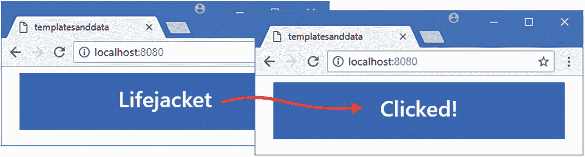
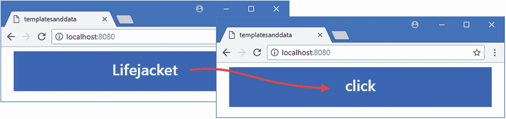
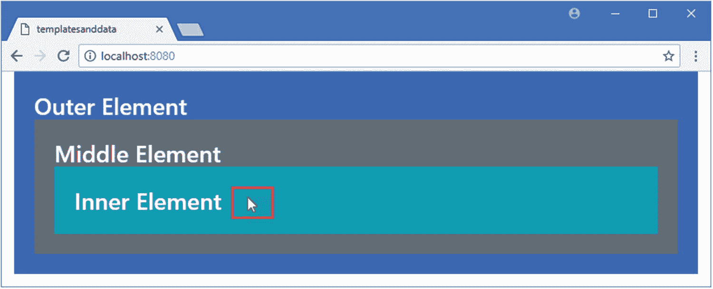
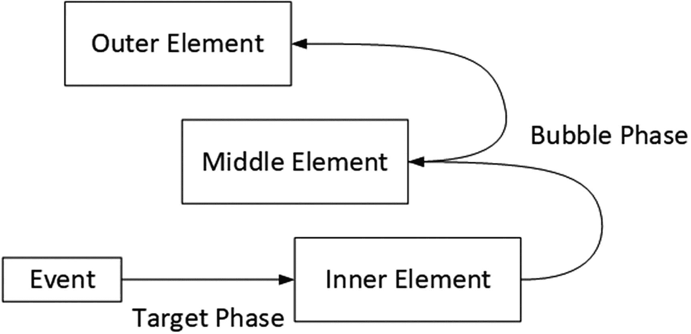
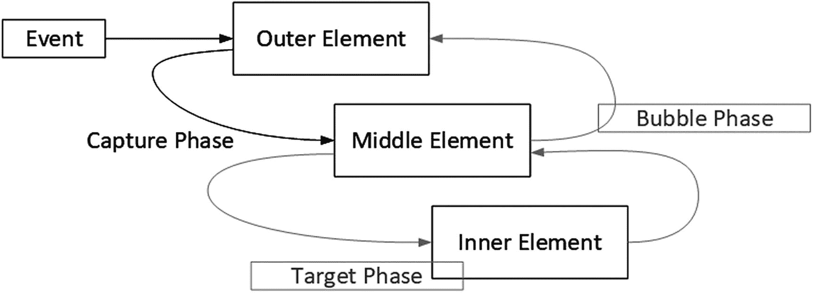

# 十四、处理事件

在这一章中，我继续描述内置的 Vue.js 指令，重点放在用于事件处理的`v-on`指令，以及表 [14-1](#Tab1) 放在上下文中的指令。

表 14-1

将 v-on 指令放在上下文中

<colgroup><col class="tcol1 align-left"> <col class="tcol2 align-left"></colgroup> 
| 

问题

 | 

回答

 |
| --- | --- |
| 这是什么？ | `v-on`指令用于监听和响应事件。 |
| 为什么有用？ | 该指令使访问组件数据或在响应事件时调用方法变得容易，并使事件处理成为 Vue.js 开发的一个集成部分。 |
| 如何使用？ | `v-on`指令应用于您感兴趣的事件的 HTML 元素，当您指定的事件被触发时，它的表达式被求值。 |
| 有什么陷阱或限制吗？ | 正如在“管理事件传播”一节中所描述的，只要您在应用指令时牢记 DOM 事件传播模型,`v-on`指令就能一致地工作，并且通常很容易使用。 |
| 有其他选择吗？ | 如果你对表单元素触发的事件感兴趣，那么在第 [15 章](15.html)中描述的`v-model`指令可能更合适。 |

表 [14-2](#Tab2) 总结了本章内容。

表 14-2

章节总结

<colgroup><col class="tcol1 align-left"> <col class="tcol2 align-left"> <col class="tcol3 align-left"></colgroup> 
| 

问题

 | 

解决办法

 | 

列表

 |
| --- | --- | --- |
| 处理由元素发出的事件 | 使用`v-on`指令 | 3, 7 |
| 获取事件的详细信息 | 使用事件对象 | four |
| 响应指令表达式之外的事件 | 使用方法处理事件，并接收事件对象作为参数 | 5, 6 |
| 处理来自同一元素的多个事件 | 对您想要接收的每个事件应用`v-on`指令，或者使用事件对象检测事件类型 | 8, 9 |
| 管理事件传播 | 使用事件传播修饰符 | 10–14 |
| 基于按键或鼠标活动过滤事件 | 使用鼠标和键盘修饰符 | 15–17 |

## 为本章做准备

在这一章中，我继续使用第 [14 章](14.html)中的`templatesanddata`项目。为了准备本章，我简化了应用的根组件，如清单 [14-1](#PC1) 所示。

### 小费

你可以从 [`https://github.com/Apress/pro-vue-js-2`](https://github.com/Apress/pro-vue-js-2) 下载本章以及本书其他章节的示例项目。

```js
<template>
    <div class="container-fluid">
        <div class="bg-primary text-white m-2 p-3 text-center">
            <h3>{{ name }}</h3>
        </div>
    </div>
</template>

<script>
    export default {
        name: "MyComponent",
        data: function () {
            return {
                name: "Lifejacket"
            }
        }
    }
</script>

Listing 14-1Simplifying the Content of the App.vue File in the src Folder

```

保存对`App.vue`文件的修改，运行`templatesanddata`文件夹中清单 [14-2](#PC2) 所示的命令，启动 Vue.js 开发工具。

```js
npm run serve

Listing 14-2Starting the Development Tools

```

打开一个新的浏览器窗口并导航至`http://localhost:8080`以查看如图 [14-1](#Fig1) 所示的内容。


图 14-1

运行示例应用

## 处理事件

Vue.js 提供了`v-on`指令，用于为事件创建绑定。用户与 HTML 元素交互的结果会触发事件。所有元素都支持一组核心事件，这些事件由特定于特定元素所特有的特性的事件来补充。在清单 [14-3](#PC3) 中，我使用了`v-on`指令来告诉 Vue.js 当用户点击组件模板中的`h3`元素时我希望它如何响应。

```js
<template>
    <div class="container-fluid">
        <div class="bg-primary text-white m-2 p-3 text-center">
            <h3 v-on:click="name = 'Clicked!'">{{ name }}</h3>

        </div>
    </div>
</template>

<script>
    export default {
        name: "MyComponent",
        data: function () {
            return {
                name: "Lifejacket"
            }
        }
    }
</script>

Listing 14-3Handling an Event in the App.vue File in the src Folder

```

`v-on`指令的应用遵循前面章节建立的模式，我在图 [14-2](#Fig2) 中对其进行了分解。


图 14-2

v-on 指令的剖析

指令的名称后跟一个冒号，然后是一个指定事件名称的参数。当事件被触发时，表达式将被调用，本例中的表达式是一段 JavaScript 代码，它更改了`name`属性的值。要查看结果，保存更改并在浏览器窗口中点击`h3`元素的内容，产生如图 [14-3](#Fig3) 所示的效果。



图 14-3

处理事件

单击元素触发`click`事件，Vue.js 通过评估指令的表达式来响应。只有第一次单击时才会有明显的变化，您必须重新加载浏览器才能将应用重置为其原始状态。

## 了解事件和事件对象

有许多不同类型的事件可用，我在本章中使用的事件在表 [14-3](#Tab3) 中描述。

### 注意

参见 [`https://developer.mozilla.org/en-US/docs/Web/Events`](https://developer.mozilla.org/en-US/docs/Web/Events) 了解所有可用事件的详细信息。

表 14-3

本章中使用的事件

<colgroup><col class="tcol1 align-left"> <col class="tcol2 align-left"></colgroup> 
| 

事件

 | 

描述

 |
| --- | --- |
| `click` | 当在元素边界内按下并释放鼠标按钮时，会触发此事件。 |
| `mousedown` | 当在元素边界内按下鼠标按钮时，会触发此事件。 |
| `mousemove` | 当鼠标指针在元素边界内移动时，会触发事件。 |
| `mouseleave` | 当鼠标指针离开元素边界时，会触发此事件。 |
| `keydown` | 按下按键时会触发此事件。 |

当浏览器触发事件时，它们产生一个描述事件的对象，称为*事件对象*。事件对象定义了提供事件信息的属性和方法，可用于控制事件的处理方式。在表 [14-4](#Tab4) 中，我描述了对 Vue.js 开发最有用的事件对象属性。(如果您熟悉 web 开发，您可能想知道由事件对象定义的方法和其他属性。正如您将了解到的，您不需要将它们直接与`v-on`指令一起使用，它会处理大量的事件处理细节。)

表 14-4

有用的事件对象属性

<colgroup><col class="tcol1 align-left"> <col class="tcol2 align-left"></colgroup> 
| 

财产

 | 

描述

 |
| --- | --- |
| `target` | 该属性返回表示触发事件的 HTML 元素的 DOM 对象 |
| `currentTarget` | 该属性返回表示处理事件的 HTML 元素的 DOM 对象。与`target`属性的区别在“管理事件传播”一节中解释。 |
| `type` | 此属性返回事件类型。 |
| `key` | 对于键盘事件，此属性返回与事件相关的键。 |

`v-on`指令通过名为`$event`的变量使事件对象可用。在清单 [14-4](#PC4) 中，我已经更新了指令的表达式，以便在事件被触发时显示`type`属性的值。

```js
<template>
    <div class="container-fluid">
        <div class="bg-primary text-white m-2 p-3 text-center">
            <h3 v-on:click="name = $event.type">{{ name }}</h3>

        </div>
    </div>
</template>

<script>
    export default {
        name: "MyComponent",
        data: function () {
            return {
                name: "Lifejacket"
            }
        }
    }
</script>

Listing 14-4Using an Event Object in the App.vue File in the src Folder

```

`v-on`指令通过点击`h3`元素来处理`click`事件原因，并在表达式求值前将浏览器创建的事件对象赋给`$event`变量，产生如图 [14-4](#Fig4) 所示的结果。



图 14-4

使用事件对象

## 使用方法处理事件

正如前面的例子所展示的，当事件被触发时,`v-on`指令将评估 JavaScript 的片段，但是更常见的方法是调用方法。使用方法可以最大限度地减少模板中的代码量，并允许一致地处理事件。在清单 [14-5](#PC5) 中，我为组件添加了一个方法，并更新了`v-on`指令的绑定，这样当`h3`元素的`click`事件被触发时，该方法将被调用。

```js
<template>
    <div class="container-fluid">
        <div class="bg-primary text-white m-2 p-3 text-center">
            <h3 v-on:click="handleEvent">{{ name }}</h3>

        </div>
    </div>
</template>

<script>
    export default {
        name: "MyComponent",
        data: function () {
            return {
                name: "Lifejacket"
            }
        },
        methods: {
            handleEvent($event) {

                this.name = $event.type;

            }

        }
    }
</script>

Listing 14-5Using a Method in the App.vue File in the src Folder

```

我已经将该指令的表达式设置为`handleEvent`，它告诉`v-on`在`click`事件被触发时调用该方法并向其传递`$event`对象，这产生了如图 [14-5](#Fig5) 所示的结果。(您不必使用`$event`作为方法参数的名称，但我倾向于使用，因为它使参数的目的很明显。)

### 小费

Vue.js 通常对事件触发时调用的方法名称不太严格，但是如果您使用的方法名称也是内置的 JavaScript 关键字，比如`delete`，您将会收到一个错误。

只指定一个方法名是有用的，但是使用方法的真正好处是当您有多个相同事件类型的源产生不同的结果时。在这些情况下，`v-for`指令可以调用一个带有参数的方法来决定事件的处理方式，如清单 [14-6](#PC6) 所示。

```js
<template>
    <div class="container-fluid">
        <div class="bg-primary text-white m-2 p-3 text-center">
            <h3 v-on:click="handleEvent('Soccer Ball', $event)">{{ name }}</h3>

        </div>
        <div class="bg-primary text-white m-2 p-3 text-center">

            <h3 v-on:click="handleEvent('Stadium', $event)">{{ name }}</h3>

        </div>

    </div>
</template>

<script>
    export default {
        name: "MyComponent",
        data: function () {
            return {
                name: "Lifejacket"
            }
        },
        methods: {
            handleEvent(name, $event) {

                this.name = `${name} - ${$event.type}`;

            }
        }
    }
</script>

Listing 14-6Using Method Arguments in the App.vue File in the src Folder

```

我添加了另一个绑定了`v-on`的`h3`元素。两个绑定表达式都调用了`handleEvent`方法，但是它们为第一个参数提供了不同的值。结果是根据点击的元素向用户显示不同的消息，如图 [14-5](#Fig5) 所示。


图 14-5

使用参数调用方法

### 使用指令速记

`v-on`指令有两种形式。如图 [14-2](#Fig2) 所示，手写形式由指令名、冒号和事件名组成。简短形式结合了`@`符号和事件名称，因此`v-on:click`也可以表示为`@click`。这意味着像这样的指令:

```js
...
<h3 v-on:click="handleEvent('Soccer Ball', $event)">{{ name }}</h3>
...

```

也可以这样表达:

```js
...
<h3 @click="handleEvent('Soccer Ball', $event)">{{ name }}</h3>
...

```

在长格式和简写格式之间的选择是个人喜好，不会改变指令的行为方式。

## 组合事件、方法和重复元素

当调用`v-on`指令时提供参数的能力在与`v-for`指令结合使用时变得更加有用。在清单 [14-7](#PC9) 中，我使用了`v-for`指令为数组中的对象重复一组元素，并使用`v-on`指令为每个元素设置事件处理程序。

```js
<template>
    <div class="container-fluid">

        <h3 class="bg-primary text-white text-center mt-2 p-2">{{message}}</h3>

        <table class="table table-sm table-striped table-bordered">

            <tr><th>Index</th><th>Name</th><th>Actions</th></tr>

            <tr v-for="(name, index) in names" v-bind:key="name">

                <td>{{index}}</td>

                <td>{{name}}</td>

                <td>

                    <button class="btn btn-sm bg-primary text-white"

                            v-on:click="handleClick(name)">

                        Select

                    </button>

                </td>

            </tr>

        </table>

    </div>

</template>

<script>
    export default {
        name: "MyComponent",
        data: function () {
            return {

                message: "Ready",

                names: ["Kayak", "Lifejacket", "Soccer Ball", "Stadium"]

            }

        },
        methods: {
            handleClick(name) {

                this.message = `Select: ${name}`;

            }

        }
    }
</script>

Listing 14-7Repeating Elements in the App.vue File in the src Folder

```

`v-for`指令为`names`数组中的每个对象复制表中的行。该副本包括所有的数据绑定和指令，这意味着在每个表行中有一个带有针对`click`事件的`v-on`绑定的`button`元素，如下所示:

```js
...
<button class="btn btn-sm bg-primary text-white" v-on:click="handleClick(name)">
    Select
</button>
...

```

使用`v-for`别名的值设置`v-on`绑定表达式，这意味着每个`button`元素将使用创建时正在处理的对象调用`handleClick`方法。`handleClick`方法使用其参数值来设置`message`属性的值，该值在`h3`元素中显示给用户。其效果是点击表格中的按钮显示 names 数组中的相应值，如图 [14-6](#Fig6) 所示。


图 14-6

重复内容中的事件处理

## 监听来自同一元素的多个事件

有两种方法可以处理同一元素上不同类型的事件。第一种方法是对每个事件分别应用`v-on`指令，如清单 [14-8](#PC11) 所示。

```js
<template>
    <div class="container-fluid">
        <h3 class="bg-primary text-white text-center mt-2 p-2">{{message}}</h3>
        <table class="table table-sm table-striped table-bordered">
            <tr><th>Index</th><th>Name</th><th>Actions</th></tr>
            <tr v-for="(name, index) in names" v-bind:key="name">
                <td>{{index}}</td>
                <td>{{name}}</td>
                <td>
                    <button class="btn btn-sm bg-primary text-white"
                            v-on:click="handleClick(name)"
                            v-on:mousemove="handleMouseEvent(name, $event)"

                            v-on:mouseleave="handleMouseEvent(name, $event)">

                        Select
                    </button>
                </td>
            </tr>
        </table>
    </div>
</template>

<script>
    export default {
        name: "MyComponent",
        data: function () {
            return {
                counter: 0,
                message: "Ready",
                names: ["Kayak", "Lifejacket", "Soccer Ball", "Stadium"]
            }
        },
        methods: {
            handleClick(name) {
                this.message = `Select: ${name}`;
            },
            handleMouseEvent(name, $event) {

                if ($event.type == "mousemove") {

                    this.message = `Move in ${name} ${this.counter++}`;

                } else {

                    this.counter = 0;

                    this.message = "Ready";

                }

            }

        }
    }
</script>

Listing 14-8Handling Multiple Event Types in the App.vue File in the src Folder

```

我添加了`v-on`指令来处理`mousemove`和`mouseleave`事件。当鼠标指针移动到一个元素上时触发`mousemove`事件，当指针离开该元素时触发`mouseleave`事件。这两个事件都由`handleMouseEvent`方法处理，该方法使用`$event`变量来确定事件类型，并更新`message`和`counter`属性。结果是，当指针移动到`button`元素上时，显示一条消息和计数器，然后当指针离开按钮占据的屏幕区域时，这些消息和计数器被重置，如图 [14-7](#Fig7) 所示。


图 14-7

响应几种类型的事件

监听多个事件的第二种方法是应用不带事件参数的`v-on`指令，并将指令的表达式设置为一个对象，该对象的属性名是事件类型，其值指定应该调用的方法，如清单 [14-9](#PC12) 所示。

```js
<template>
    <div class="container-fluid">
        <h3 class="bg-primary text-white text-center mt-2 p-2">{{message}}</h3>
        <table class="table table-sm table-striped table-bordered">
            <tr><th>Index</th><th>Name</th><th>Actions</th></tr>
            <tr v-for="(name, index) in names" v-bind:key="name">
                <td>{{index}}</td>
                <td>{{name}}</td>
                <td>
                    <button class="btn btn-sm bg-primary text-white"
                            v-on="buttonEvents"

                            v-bind:data-name="name">
                        Select
                    </button>
                </td>
            </tr>
        </table>
    </div>
</template>

<script>
    export default {
        name: "MyComponent",
        data: function () {
            return {
                buttonEvents: {

                    click: this.handleClick,

                    mousemove: this.handleMouseEvent,

                    mouseleave: this.handleMouseEvent

                },

                counter: 0,
                message: "Ready",
                names: ["Kayak", "Lifejacket", "Soccer Ball", "Stadium"]
            }
        },
        methods: {
            handleClick($event) {
                let name = $event.target.dataset.name;

                this.message = `Select: ${name}`;
            },
            handleMouseEvent($event) {
                let name = $event.target.dataset.name;

                if ($event.type == "mousemove") {
                    this.message = `Move in ${name} ${this.counter++}`;
                } else {
                    this.counter = 0;
                    this.message = "Ready";
                }
            }
        }
    }
</script>

Listing 14-9Handling Multiple Events in a Single Directive in the App.vue File in the src Folder

```

名为`buttonEvents`的`data`属性返回一个具有`click`、`mousemove,`和`mouseleave`属性的对象，对应我要处理的事件，这些属性的值就是每个事件应该调用的方法。这种方法的局限性是它不支持向方法传递参数，方法只接收`$event`参数。为了解决这个问题，我使用了`v-bind`指令为每个`button`元素添加一个`data-name`属性，如下所示:

```js
...
<button class="btn btn-sm bg-primary text-white" v-on="buttonEvents"
    v-bind:data-name="name">
...

```

`$event`对象提供了对触发事件的 HTML 元素的访问，我使用`dataset`属性来访问定制的`data-`属性，以便在处理这样的事件时获得`data-name`值:

```js
...
let name = $event.target.dataset.name;
...

```

结果与清单 [14-8](#PC11) 相同，但是不需要在`button`元素上定义多个`v-on`指令，这会产生一个难以阅读的模板。

### 小费

如果您愿意，可以在`v-on`指令的表达式中直接将事件映射对象定义为字符串文字，尽管仍然会产生难以理解的模板。

## 使用事件处理修饰符

为了保持事件处理方法简单和集中，`v-on`指令支持一组修饰符，用于执行通常需要 JavaScript 语句的常见任务。表 [14-5](#Tab5) 描述了一组`v-on`事件处理修饰符。

表 14-5

v-on 事件处理修饰符

<colgroup><col class="tcol1 align-left"> <col class="tcol2 align-left"></colgroup> 
| 

修饰语

 | 

描述

 |
| --- | --- |
| `stop` | 这个修饰符相当于在事件对象上调用`stopPropagation`方法，如“停止事件传播”一节所述。 |
| `prevent` | 这个修饰符相当于在事件对象上调用`preventDefault`方法。这个修改器在第 [15 章](15.html)中演示。 |
| `capture` | 该修饰符启用事件传播的捕获模式，如“在捕获阶段接收事件”一节所述。 |
| `self` | 只有当事件来源于指令所应用的元素时，这个修饰符才会调用 handler 方法，如“只处理目标阶段事件”一节中所演示的。 |
| `once` | 这个修饰符将阻止相同类型的后续事件调用 handler 方法，如“防止重复事件”一节中所示。 |
| `passive` | 此修改器将启用被动事件侦听，这将提高触摸事件的性能，在移动设备上尤其有用。参见 [`https://developer.mozilla.org/en-US/docs/Web/API/EventTarget/addEventListener`](https://developer.mozilla.org/en-US/docs/Web/API/EventTarget/addEventListener) 了解何时使用该选项的详细说明。 |

### 管理事件传播

`stop`、`capture`和`self`修饰符用于通过 HTML 元素的层次结构管理事件的传播。当事件被触发时，浏览器通过三个阶段来定位事件的处理程序:捕获、目标和冒泡阶段。为了演示这些阶段如何工作——以及如何使用`v-on`修饰符来控制它们——我已经更新了示例应用中的组件，如清单 [14-10](#PC15) 所示。

```js
<template>
    <div class="container-fluid">
        <div id="outer-element" class="bg-primary p-4 text-white h3"

             v-on:click="handleClick">

            Outer Element

            <div id="middle-element" class="bg-secondary p-4"

                 v-on:click="handleClick">

                Middle Element

                <div id="inner-element" class="bg-info p-4"

                     v-on:click="handleClick">

                    Inner Element

                </div>

            </div>

        </div>

    </div>
</template>

<script>
    export default {
        name: "MyComponent",
        methods: {
            handleClick($event) {
                console.log(`handleClick target: ${$event.target.id}`

                    + ` currentTarget: ${$event.currentTarget.id}`);

            }
        }
    }
</script>

Listing 14-10Handling Events in the App.vue File in the src Folder

```

该模板包含三个嵌套的`div`元素，一个`id`属性和一个`v-on`指令被配置为使用`handleClick`方法处理`click`事件。该方法接收`$event`对象，并使用`target`属性获取触发事件的元素的详细信息，并使用`currentTarget`属性获取其`v-on`指令正在处理事件的元素的详细信息。

为了理解为什么在处理一个事件时会涉及到两个属性，保存对组件的修改，然后点击内部元素所占据的浏览器窗口部分，如图 [14-8](#Fig8) 所示。



图 14-8

触发一组嵌套元素中的事件

默认情况下，`v-on`指令将接收目标和冒泡阶段的事件，这意味着事件将首先由触发事件的元素(目标)上的`v-on`元素接收，然后依次由它的每个前身接收，从直接的父元素一直到`body`元素。您可以在已经写入 JavaScript 控制台的消息中看到这一点。

```js
...
handleClick target: inner-element currentTarget: inner-element
handleClick target: inner-element currentTarget: middle-element
handleClick target: inner-element currentTarget: outer-element
...

```

第一条消息显示了事件的目标阶段，触发事件的元素上的`v-on`指令调用了`handleClick`方法。在目标阶段，`$event`对象的`target`和`currentTarget`属性是相同的。

第二条和第三条消息显示了冒泡阶段，其中事件沿着 HTML 文档向上传播到每个父元素，导致该事件类型的每个元素的`v-on`指令调用其方法。在这个阶段，`$event`对象的`target`属性返回触发事件的元素，`currentTarget`属性返回其`v-on`指令当前正在处理事件的元素。图 [14-9](#Fig9) 显示了目标阶段和气泡阶段的事件流程。

### 小费

并非所有类型的事件都有泡沫阶段。根据经验，特定于单个元素的事件——比如获得和失去焦点——不会冒泡。应用于多个元素的事件(例如单击被多个元素占据的屏幕区域)将冒泡。您可以通过读取`$event`对象的`bubbles`属性来查看特定事件是否将经历冒泡阶段。



图 14-9

目标和气泡阶段

#### 在捕获阶段接收事件

捕获阶段为元素提供了在目标阶段之前处理事件的机会。在捕获阶段，浏览器从`body`元素开始，沿着与冒泡阶段相反的路径，沿着元素的层次结构向目标前进，并给予每个元素处理事件的更改，如图 [14-10](#Fig10) 所示。



图 14-10

捕获阶段

除非应用了`capture`修饰符，否则`v-on`指令不会在捕获阶段接收事件，如清单 [14-11](#PC17) 所示。

```js
<template>
    <div class="container-fluid">
        <div id="outer-element" class="bg-primary p-4 text-white h3"

             v-on:click.capture="handleClick">

            Outer Element
            <div id="middle-element" class="bg-secondary p-4"

                 v-on:click.capture="handleClick">

                Middle Element
                <div id="inner-element" class="bg-info p-4"
                     v-on:click="handleClick">
                    Inner Element
                </div>
            </div>
        </div>
    </div>
</template>

<script>
    export default {
        name: "MyComponent",
        methods: {
            handleClick($event) {
                console.log(`handleClick target: ${$event.target.id}`
                    + ` currentTarget: ${$event.currentTarget.id}`);
            }
        }
    }
</script>

Listing 14-11Using the Capture Phase in the App.vue File in the src Folder

```

应用修饰符时，先使用句点，然后使用修饰符名称，如下所示:

```js
...
v-on:click.capture="handleClick"
...

```

将`capture`修饰符添加到`v-on`指令意味着元素将在捕获阶段而不是冒泡阶段接收事件。您可以通过单击内部元素并检查浏览器的 JavaScript 控制台中显示的消息来查看效果。

```js
...
handleClick target: inner-element currentTarget: outer-element
handleClick target: inner-element currentTarget: middle-element
handleClick target: inner-element currentTarget: inner-element
...

```

消息显示事件已经沿着 HTML 文档向下进行，触发了外层元素和中间元素上的`v-on`指令。

#### 仅处理目标阶段事件

您可以限制`v-on`指令，使其只响应目标阶段的事件。`self`修饰符确保只有被应用了指令的元素触发的事件才会被处理，如清单 [14-12](#PC20) 所示。

```js
<template>
    <div class="container-fluid">
        <div id="outer-element" class="bg-primary p-4 text-white h3"
             v-on:click.capture="handleClick">
            Outer Element
            <div id="middle-element" class="bg-secondary p-4"

                 v-on:click.self="handleClick">

                Middle Element
                <div id="inner-element" class="bg-info p-4"
                     v-on:click="handleClick">
                    Inner Element
                </div>
            </div>
        </div>
    </div>
</template>
<script>
    export default {
        name: "MyComponent",
        methods: {
            handleClick($event) {
                console.log(`handleClick target: ${$event.target.id}`
                    + ` currentTarget: ${$event.currentTarget.id}`);
            }
        }
    }
</script>

Listing 14-12Selecting Target Phase Events in the App.vue File in the src Folder

```

我已经在中间元素的`v-on`指令上应用了`self`修饰符。如果单击内部元素，您将看到浏览器的 JavaScript 控制台中显示以下消息:

```js
...
handleClick target: inner-element currentTarget: outer-element
handleClick target: inner-element currentTarget: inner-element
...

```

第一条消息是从外部元素接收的，它的`v-on`指令使用 capture 修饰符，因此在捕获阶段接收事件。第二条消息来自内部元素，它是目标，在目标阶段接收事件。没有来自中间元素的消息，因为`self`修饰符已经阻止它在冒泡阶段接收事件。如果您单击中间的元素，将会看到这些消息:

```js
...
handleClick target: middle-element currentTarget: outer-element
handleClick target: middle-element currentTarget: middle-element
...

```

这些消息中的第一条同样来自外部元素，它在捕获阶段首先获取事件。第二条消息来自目标阶段的中间元素，这是由`self`修饰符允许的。

#### 停止事件传播

`stop`修饰符中止一个事件的传播，防止它被任何后续元素的`v-on`指令处理。在清单 [14-13](#PC23) 中，我将`stop`指令应用于中间元素的`v-on`指令。

```js
<template>
    <div class="container-fluid">
        <div id="outer-element" class="bg-primary p-4 text-white h3"
             v-on:click.capture="handleClick">
            Outer Element
            <div id="middle-element" class="bg-secondary p-4"

                 v-on:click.stop="handleClick">

                Middle Element
                <div id="inner-element" class="bg-info p-4"
                     v-on:click="handleClick">
                    Inner Element
                </div>
            </div>
        </div>
    </div>
</template>
<script>
    export default {
        name: "MyComponent",
        methods: {
            handleClick($event) {
                console.log(`handleClick target: ${$event.target.id}`
                    + ` currentTarget: ${$event.currentTarget.id}`);
            }
        }
    }
</script>

Listing 14-13Stopping Event Propagation in the App.vue File in the src Folder

```

`stop`修饰符阻止一个事件继续它通常的进程，但是不会停止传播，直到它到达它所应用的元素。在本例中，这意味着由中间元素触发的元素在目标阶段停止之前仍将经历捕获阶段。因为外部元素的`v-on`指令是用`capture`修饰符配置的，所以浏览器的 JavaScript 控制台中会显示以下消息:

```js
...
handleClick target: middle-element currentTarget: outer-element
handleClick target: middle-element currentTarget: middle-element
...

```

### 组合事件处理修饰符

您可以将多个修饰符应用于单个`v-on`指令。修改器按照指定的顺序进行处理，这意味着通过在不同的组合中使用相同的修改器可以获得不同的效果。这种组合将在目标阶段处理事件，然后阻止它们进一步传播。

```js
...
v-on:click.self.stop="handleClick"
...

```

但是如果这些修改器被颠倒，那么事件将在目标和气泡阶段停止(因为停止修改器是第一个)。

```js
...
v-on:click.stop.self="handleClick"
...

```

因此，仔细考虑组合修饰符的后果，彻底测试组合，并一致地应用它们是很重要的。

### 防止重复事件

`once`修饰符阻止一个`v-on`指令多次调用它的方法。这不会停止正常的事件传播过程，但会阻止一个元素在第一个事件被处理后参与其中。在清单 [14-14](#PC27) 中，我将`once`修饰符应用于组件模板的内部元素。

```js
<template>
    <div class="container-fluid">
        <div id="outer-element" class="bg-primary p-4 text-white h3"
             v-on:click.capture="handleClick">
            Outer Element
            <div id="middle-element" class="bg-secondary p-4"
                 v-on:click.stop="handleClick">
                Middle Element
                <div id="inner-element" class="bg-info p-4"

                     v-on:click.once="handleClick">

                    Inner Element
                </div>
            </div>
        </div>
    </div>
</template>

<script>
    export default {
        name: "MyComponent",
        methods: {
            handleClick($event) {
                console.log(`handleClick target: ${$event.target.id}`
                    + ` currentTarget: ${$event.currentTarget.id}`);
            }
        }
    }
</script>

Listing 14-14Stopping Duplicate Events in the App.vue File in the src Folder

```

第一次单击内部元素时，您会看到所有的`v-on`指令都响应，如下所示:

```js
...
handleClick target: inner-element currentTarget: outer-element
handleClick target: inner-element currentTarget: inner-element
handleClick target: inner-element currentTarget: middle-element
...

```

外部元素配置有`capture`修饰符，因此它在捕获阶段获取事件。这是第一次由内部元素处理`click`事件，因此事件的目标阶段就像平常一样。最后，中间的元素在冒泡阶段接收事件，此时`stop`修改器阻止它继续前进。

当您再次单击内部元素时，您将看到一组不同的消息:

```js
...
handleClick target: inner-element currentTarget: outer-element
handleClick target: inner-element currentTarget: middle-element
...

```

`once`修饰符阻止内部元素的`v-on`指令调用`handleClick`方法，但不阻止事件传播到其他元素。

## 使用鼠标事件修改器

当您需要明确触发事件的条件时，`v-on`指令提供了一组修饰符来简化鼠标事件的处理。表 [14-6](#Tab6) 描述了一组`v-on`鼠标事件修改器。

表 14-6

v-on 鼠标事件修饰符

<colgroup><col class="tcol1 align-left"> <col class="tcol2 align-left"></colgroup> 
| 

修饰语

 | 

描述

 |
| --- | --- |
| `left` | 此修改器仅选择由鼠标左键触发的事件。 |
| `middle` | 该修改器仅选择由鼠标中键触发的事件。 |
| `right` | 此修改器仅选择由鼠标右键触发的事件。 |

当应用于`v-on`指令时，这些修饰符将被处理的事件限制为那些由指定的鼠标按钮触发的事件，如清单 [14-15](#PC30) 所示。

```js
<template>
    <div class="container-fluid">
        <div id="outer-element" class="bg-primary p-4 text-white h3"
             v-on:mousedown="handleClick">
            Outer Element
            <div id="middle-element" class="bg-secondary p-4"
                 v-on:mousedown="handleClick">
                Middle Element
                <div id="inner-element" class="bg-info p-4"

                     v-on:mousedown.right="handleClick">

                    Inner Element
                </div>
            </div>
        </div>
    </div>
</template>

<script>
    export default {
        name: "MyComponent",
        methods: {
            handleClick($event) {
                console.log(`handleClick target: ${$event.target.id}`
                    + ` currentTarget: ${$event.currentTarget.id}`);
            }
        }
    }
</script>

Listing 14-15Using a Mouse Modifier in the App.vue File in the src Folder

```

在清单中，我修改了`v-on`指令，以便它们监听`mousedown`事件，当任何鼠标按钮被按在一个元素上时就会触发该事件，并对内部元素上的`v-on`指令应用了`right`修饰符，以便它只接收鼠标右键的事件。

描述的修饰符不会阻止事件的传播。相反，它们阻止应用它们的`v-on`指令处理使用其他鼠标按钮触发的事件。如果您左键单击内部元素，您将在浏览器的 JavaScript 控制台中看到以下消息，这些消息表明应用于中间和外部元素的`v-on`指令接收到该事件，即使它不是由内部元素的指令处理的:

```js
...
handleClick target: inner-element currentTarget: middle-element
handleClick target: inner-element currentTarget: outer-element
...

```

如果右键单击内部元素，那么所有三个`v-on`指令都将处理该事件，产生以下消息:

```js
...

handleClick target: inner-element currentTarget: inner-element

handleClick target: inner-element currentTarget: middle-element
handleClick target: inner-element currentTarget: outer-element
...

```

## 使用键盘事件修饰符

Vue.js 提供了一组键盘事件修饰符，用于限制由一个`v-on`指令处理的键盘事件，其方式类似于上一节描述的鼠标修饰符。在清单 [14-16](#PC33) 中，我修改了组件，使其具有一个我用来接收键盘事件的`input`元素。

```js
<template>
    <div class="container-fluid">
        <div class="bg-primary p-4 text-white h3">

             {{message}}

        </div>

        <input class="form-control bg-light" placeholder="Type here..."

               v-on:keydown.ctrl="handleKey" />

    </div>
</template>

<script>
    export default {
        name: "MyComponent",
        data: function () {

            return {

                message: "Ready"

            }

        },

        methods: {
            handleKey($event) {

                this.message = $event.key;

            }

        }
    }
</script>

Listing 14-16Receiving Keyboard Events in the App.vue File in the src Folder

```

这个例子将`ctrl`修饰符应用于`keydown`事件，这意味着当控制键被按下时，只有`keydown`事件才会调用`handleKey`事件。您可以通过键入`input`元素并观察显示在`div`元素的文本插值绑定中的字符来查看效果。数据绑定显示当控制键单独按下或与另一个键组合按下时调用`handleKey`方法，否则不调用，如图 [14-11](#Fig11) 所示。


图 14-11

使用修改器过滤关键事件

表 [14-7](#Tab7) 显示了 Vue.js 提供的一组按键事件修饰符。其中一些修饰符用于可以与其他修饰符结合使用的按键，如 Shift 和 Control 键，其余的则便于指定通常需要的按键，如 Tab 和空格键。

表 14-7

v-on 键盘事件修饰符

<colgroup><col class="tcol1 align-left"> <col class="tcol2 align-left"></colgroup> 
| 

修饰语

 | 

描述

 |
| --- | --- |
| `enter` | 该修改器选择回车键。 |
| `tab` | 此修饰符选择 Tab 键。 |
| `delete` | 此修改器选择删除键。 |
| `esc` | 该修饰符选择退出键。 |
| `space` | 该修改器选择空格键。 |
| `up` | 此修改器选择向上箭头键。 |
| `down` | 此修改器选择向下箭头键。 |
| `left` | 该修改器选择左箭头键。 |
| `right` | 该修改器选择右箭头键。 |
| `ctrl` | 该修改器选择控制键。 |
| `alt` | 该修改器选择 Alt 键。 |
| `shift` | 该修改器选择 Shift 键。 |
| `meta` | 该修改器选择元键。 |
| `exact` | 该修饰键仅选择指定的修饰键，如表后所述。 |

`exact`修饰符进一步限制了一个事件绑定，这样只有当指定的键被按下时它才会被调用。例如，清单 [14-17](#PC34) 中的修饰符将只在只按下控制键时调用`handleKey`方法，而不是在控制键和 Shift 键一起被按下时。

```js
<template>
    <div class="container-fluid">
        <div class="bg-primary p-4 text-white h3">
            {{message}}
        </div>
        <input class="form-control bg-light" placeholder="Type here..."

               v-on:keydown.ctrl.exact="handleKey" />

    </div>
</template>

<script>
    export default {
        name: "MyComponent",
        data: function () {
            return {
                message: "Ready"
            }
        },
        methods: {
            handleKey($event) {
                this.message = $event.key;
            }
        }
    }
</script>

Listing 14-17Matching Keys Exactly in the App.vue File in the src Folder

```

## 摘要

在这一章中，我演示了使用`v-on`指令响应事件的不同方式。我向您展示了如何在应用指令时指定一个或多个事件，如何在生成重复内容时调用方法和接收参数，以及如何使用修饰符来更改事件行为和选择特定的鼠标按钮或键。在下一章中，我将描述使用表单元素的 Vue.js 特性。