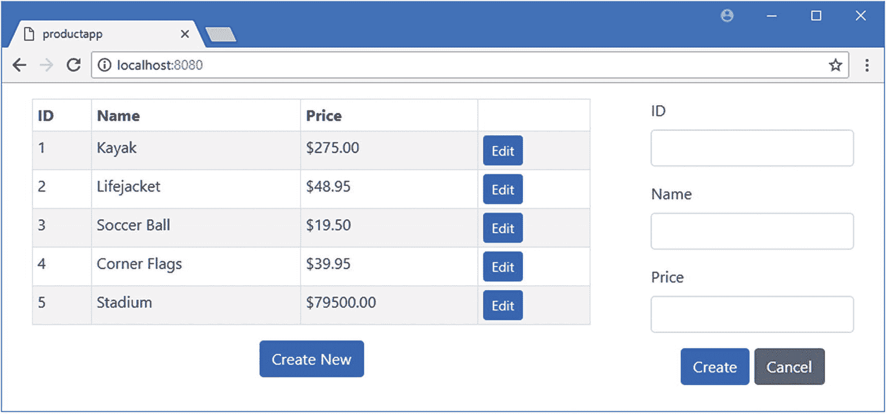
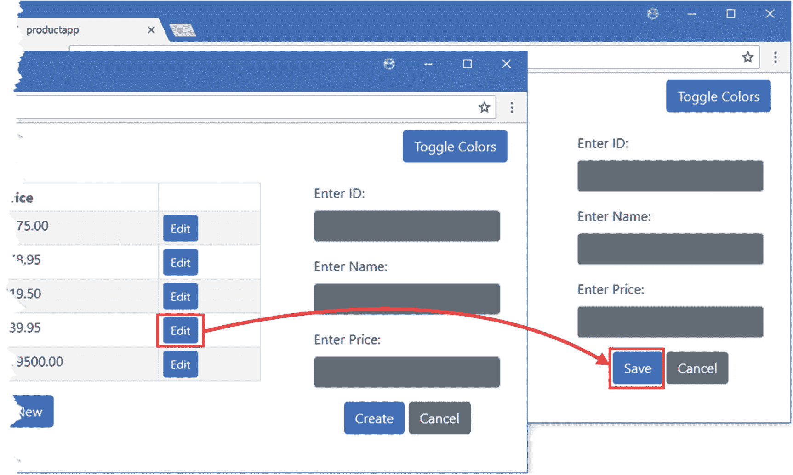

# 十八、松散耦合的组件

随着 Vue.js 应用的增长，在父组件和子组件之间传递数据和事件的需求变得更加难以安排，尤其是当应用不同部分的组件需要通信时。结果可能是组件自身的功能被为它们的后代传递属性和为它们的前身传递事件的需求所超越。在这一章中，我描述了另一种方法，称为*依赖注入*，它允许组件在不紧密耦合的情况下进行通信。我将向您展示依赖注入的不同使用方式，并演示它如何释放应用的结构。我还将向您展示如何使用事件总线，它将依赖注入与以编程方式注册自定义事件的能力相结合，允许组件将自定义事件发送给任何感兴趣的接收者，而不仅仅是其父对象。表 [18-1](#Tab1) 将依赖注入和事件总线放在上下文中。

表 18-1

将依赖注入和事件总线放在上下文中

<colgroup><col class="tcol1 align-left"> <col class="tcol2 align-left"></colgroup> 
| 

问题

 | 

回答

 |
| --- | --- |
| 它们是什么？ | 依赖注入允许任何组件向其任何后代提供服务，其中服务可以是值、对象或函数。事件总线建立在依赖注入特性的基础上，为发送和接收定制事件提供了一种通用机制。 |
| 它们为什么有用？ | 这些功能允许应用的结构变得更加复杂，而不会陷入管理父子关系功能的困境，这些功能仅用于将数据传递给遥远的后代和祖先。 |
| 它们是如何使用的？ | 组件使用 provide 属性定义服务，并使用 inject 属性声明对服务的依赖。事件总线是分发 Vue 对象的服务，该对象用于使用$emit 和$on 方法发送和接收事件。 |
| 有什么陷阱或限制吗？ | 必须注意确保在整个应用中使用一致的服务和事件名称。如果不小心，不同的组件最终会重用一个对应用的另一部分已经有意义的名称。 |
| 有其他选择吗？ | 简单的应用不需要本章描述的特性，可以依赖于道具和标准的自定义事件。复杂的应用可以从共享应用状态中受益，这是一种补充方法，在第 [20](20.html) 章中有描述。 |

表 [18-2](#Tab2) 总结了本章内容。

表 18-2

章节总结

<colgroup><col class="tcol1 align-left"> <col class="tcol2 align-left"> <col class="tcol3 align-left"></colgroup> 
| 

问题

 | 

解决办法

 | 

列表

 |
| --- | --- | --- |
| 定义可由组件后代使用的功能 | 使用依赖注入特性来定义服务 | 10–12 |
| 提供响应变化的功能 | 通过定义数据属性并将其用作数据值的来源来创建反应式服务 | 13–14 |
| 定义不提供服务时将使用的功能 | 使用具有注入属性的对象指定回退 | 15–16 |
| 在父子关系之外分发自定义事件 | 使用事件总线 | Seventeen |
| 使用事件总线发送事件 | 调用事件总线$emit 方法 | Eighteen |
| 从事件总线接收事件 | 调用事件总线$on 方法 | 19, 20 |
| 仅将事件分发到应用的一部分 | 创建本地事件总线 | 21, 22 |

## 为本章做准备

对于本章中的例子，在一个方便的位置运行清单 [18-1](#PC1) 中所示的命令来创建一个新的 Vue.js 项目。

### 小费

你可以从 [`https://github.com/Apress/pro-vue-js-2`](https://github.com/Apress/pro-vue-js-2) 下载本章以及本书其他章节的示例项目。

```js
vue create productapp --default

Listing 18-1Creating a New Project

```

这个命令创建了一个名为 *productapp* 的项目。一旦设置过程完成，将清单 [18-2](#PC2) 中所示的语句添加到`package.json`文件的 linter 部分，以禁用在使用 JavaScript 控制台时以及在定义了变量但未使用时发出警告的规则。本章中的许多例子我都依赖于控制台，并定义了占位符变量，这些变量只在引入后面的特性时使用。

```js
...
"eslintConfig": {
    "root": true,
    "env": {
      "node": true
    },
    "extends": [
        "plugin:vue/essential",
        "eslint:recommended"
     ],
     "rules": {
        "no-console": "off",

        "no-unused-vars": "off"

     },
     "parserOptions": {
        "parser": "babel-eslint"
     }
},
...

Listing 18-2Disabling a Linter Rule in the package.json File in the lifecycles Folder

```

接下来，运行`productapp`文件夹中清单 [18-3](#PC3) 所示的命令，将引导 CSS 包添加到项目中。

```js
npm install bootstrap@4.0.0

Listing 18-3Adding the Bootstrap CSS Package

```

将清单 [18-4](#PC4) 中所示的语句添加到`src`文件夹中的`main.js`文件中，将引导 CSS 文件合并到应用中。

```js
import Vue from 'vue'
import App from './App.vue'

import "../node_modules/bootstrap/dist/css/bootstrap.min.css";

Vue.config.productionTip = false

new Vue({
  render: h => h(App)
}).$mount('#app')

Listing 18-4Incorporating the Bootstrap Package in the main.js File in the src Folder

```

运行`productapp`文件夹中清单 [18-5](#PC5) 所示的命令，启动开发工具。

```js
npm run serve

Listing 18-5Starting the Development Tools

```

将执行初始绑定过程，之后您将看到一条消息，告诉您项目已成功编译，HTTP 服务器正在侦听端口 8080 上的请求。打开一个新的浏览器窗口，导航到`http://localhost:8080`查看项目的占位符内容，如图 [18-1](#Fig1) 所示。


图 18-1

运行示例应用

### 创建产品展示组件

示例应用的核心将是一个组件，它显示一个包含产品对象详细信息的表，并带有用于编辑或删除对象的按钮。我在`src/components`文件夹中添加了一个名为`ProductDisplay.vue`的文件，内容如清单 [18-6](#PC6) 所示。

```js
<template>
    <div>
        <table class="table table-sm table-striped table-bordered">
            <tr>
                <th>ID</th><th>Name</th><th>Price</th><th></th>
            </tr>
            <tbody>
                <tr v-for="p in products" v-bind:key="p.id">
                    <td>{{ p.id }}</td>
                    <td>{{ p.name }}</td>
                    <td>{{ p.price | currency }}</td>
                    <td>
                        <button class="btn btn-sm btn-primary"
                                v-on:click="editProduct(p)">
                            Edit
                        </button>
                    </td>
                </tr>
            </tbody>
        </table>
        <div class="text-center">
            <button class="btn btn-primary" v-on:click="createNew">
                Create New
            </button>
        </div>
    </div>
</template>

<script>
    export default {
        data: function () {
            return {
                products: [
                    { id: 1, name: "Kayak", price: 275 },
                    { id: 2, name: "Lifejacket", price: 48.95 },
                    { id: 3, name: "Soccer Ball", price: 19.50 },
                    { id: 4, name: "Corner Flags", price: 39.95 },
                    { id: 5, name: "Stadium", price: 79500 }]
            }
        },
        filters: {
            currency(value) {
                return `$${value.toFixed(2)}`;
            }
        },
        methods: {
            createNew() {
            },
            editProduct(product) {
            }
        }
    }
</script>

Listing 18-6The Contents of the ProductDisplay.vue File in the src/components Folder

```

该组件定义了一个名为`products`的`data`属性，该属性被分配了一个对象数组，这些对象是使用`v-for`指令在模板中枚举的。每个`products`对象在一个表中生成一行，该表包含用于`id`、`name`和`price`值的列，以及一个用于编辑对象的`button`元素。在表格下面还有另一个按钮，用户将单击它来创建一个新产品，并且已经将`v-on`指令应用到了两个`button`元素，以便在单击按钮时调用`createNew`和`editProduct`方法。这些方法目前都是空的。

### 创建产品编辑器组件

我需要一个编辑器，允许用户编辑现有的对象和创建新的。我首先将一个名为`EditorField.vue`的文件添加到`src/components`文件夹中，并添加清单 [18-7](#PC7) 中所示的内容。

```js
<template>

    <div class="form-group">
        <label>{{label}}</label>
        <input v-model.number="value" class="form-control" />
    </div>

</template>

<script>

export default {
    props: ["label"],
    data: function () {
        return {
            value: ""
        }
    }
}

</script>

Listing 18-7The Contents of the EditorField.vue File in the src/components Folder

```

该组件显示一个`label`元素和一个`input`元素。为了将编辑器组合成一个更大的功能单元，我在`src/components`文件夹中添加了一个名为`ProductEditor.vue`的文件，并添加了清单 [18-8](#PC8) 中所示的内容。

```js
<template>

    <div>
        <editor-field label="ID" />
        <editor-field label="Name" />
        <editor-field label="Price" />

        <div class="text-center">
            <button class="btn btn-primary" v-on:click="save">
                {{ editing ? "Save" : "Create" }}
            </button>
            <button class="btn btn-secondary" v-on:click="cancel">Cancel</button>
        </div>
    </div>

</template>
<script>

    import EditorField from "./EditorField";

    export default {
        data: function () {
            return {
                editing: false,
                product: {
                    id: 0,
                    name: "",
                    price: 0
                }
            }
        },
        components: { EditorField },
        methods: {
            startEdit(product) {
                this.editing = true;
                this.product = {
                    id: product.id,
                    name: product.name,
                    price: product.price
                }
            },
            startCreate() {
                this.editing = false;
                this.product = {
                    id: 0,
                    name: "",
                    price: 0
                };
            },
            save() {
                // TODO - process edited or created product
                console.log(`Edit Complete: ${JSON.stringify(this.product)}`);
                this.startCreate();
            },
            cancel() {
                this.product = {};
                this.editing = false;
            }
         }
    }
</script>

Listing 18-8The Contents of the ProductEditor.vue File in the src/components Folder

```

编辑器提供了可用于编辑或创建对象的编辑器组件集合。有用于`id`、`name`和`price`值的字段，以及使用`v-on`指令完成或取消操作的`button`元素。

### 显示子组件

为了完成本章的准备工作，我编辑了根组件以显示在前面章节中创建的组件，如清单 [18-9](#PC9) 所示。

```js
<template>
    <div class="container-fluid">

        <div class="row">

            <div class="col-8 m-3">

                <product-display></product-display>

            </div>

            <div class="col m-3">

                <product-editor></product-editor>

            </div>

        </div>

    </div>

</template>

<script>
    import ProductDisplay from "./components/ProductDisplay";

    import ProductEditor from "./components/ProductEditor";

    export default {
        name: 'App',
        components: { ProductDisplay, ProductEditor }

    }
</script>

Listing 18-9Displaying Components in the App.vue File in the src Folder

```

该组件并排显示其子组件，如图 [18-2](#Fig2) 所示。单击按钮元素没有实际效果，因为组件还没有连接在一起工作。



图 18-2

向示例应用添加功能和组件

## 理解依赖注入

依赖注入允许组件定义一个服务，它可以是任何值、函数或对象，并使它对它的任何后代可用。通过依赖注入提供的服务不仅限于孩子，并且避免了通过一连串的道具将数据分发到需要它的应用部分的需要。

### 定义服务

在清单 [18-10](#PC10) 中，我向根组件添加了一个服务，它提供了应该用于背景和文本的引导 CSS 类的细节。该服务将对应用中的所有组件可用，因为它们都是根组件的后代。

```js
<template>
    <div class="container-fluid">
        <div class="row">
            <div class="col-8 m-3">
                <product-display></product-display>
            </div>
            <div class="col m-3">
                <product-editor></product-editor>
            </div>
        </div>
    </div>
</template>

<script>
    import ProductDisplay from "./components/ProductDisplay";
    import ProductEditor from "./components/ProductEditor";

    export default {
        name: 'App',
        components: { ProductDisplay, ProductEditor },
        provide:  function() {

            return {

                colors: {

                    bg: "bg-secondary",

                    text: "text-white"

                }

            }

        }

    }
</script>

Listing 18-10Defining a Service in the App.vue File in the src Folder

```

`provide`属性遵循与`data`属性相同的模式，并返回一个函数，该函数产生一个对象，该对象的属性是后代组件可用的服务的名称。在这个例子中，我定义了一个名为`colors`的服务，它的`bg`和`text`属性提供了与引导 CSS 样式相关的类名。

### 通过依赖注入消费服务

当一个组件想要使用其前身提供的服务时，它使用 inject 属性，如清单 [18-11](#PC11) 所示，其中我已经配置了`EditorField`组件，因此它使用清单 [18-10](#PC10) 中定义的`colors`服务。

```js
<template>

    <div class="form-group">
        <label>{{label}}</label>
        <input v-model.number="value" class="form-control"

               v-bind:class="[colors.bg, colors.text]" />

    </div>

</template>

<script>

export default {
    props: ["label"],
    data: function () {
        return {
            value: ""
        }
    },
    inject: ["colors"]

}

</script>

Listing 18-11Consuming a Service in the EditorField.vue File in the src/components Folder

```

属性被赋予一个数组，该数组包含组件所需的每个服务名称的字符串值。当组件被初始化时，Vue.js 通过组件的前件向上工作，直到找到具有指定名称的服务，获取服务值，并将其分配给组件对象上具有服务名称的属性。在这个例子中，Vue.js 沿着组件向上寻找名为`colors`的服务，它在根组件上找到了这个服务，并使用根组件提供的对象作为`EditorField`组件上名为`colors`的组件的值。创建对应于服务的属性允许我在如下指令表达式中使用它的属性:

```js
...
<input v-model.number="value" class="form-control"
    v-bind:class="[colors.bg, colors.text]" />
...

```

结果是根组件能够提供应该用于样式元素的类名，而不必通过组件链传递它们。这些类名被应用于`EditorField`组件的`input`元素，产生如图 [18-3](#Fig3) 所示的结果。(您必须在`input`元素中输入一些文本才能看到文本颜色。)

### 小费

您可能需要重新加载浏览器才能看到本示例的效果。


图 18-3

使用依赖注入

### 覆盖先行服务

当 Vue.js 创建一个带有`inject`属性的组件时，它解析所需服务的依赖关系，沿着组件链向上工作，并检查每个组件以查看是否有带有与所需名称匹配的服务的`provide`属性。这种方法意味着一个组件可以覆盖它的前身提供的一个或多个服务，这对于创建只应用于应用的一部分的更专门化的服务是一种有用的方法。为了演示，我向定义了`colors`服务的`ProductEditor`组件添加了一个`provide`属性，如清单 [18-12](#PC13) 所示。

```js
...
<script>

    import EditorField from "./EditorField";

    export default {
        data: function () {
            return {
                editing: false,
                product: {
                    id: 0,
                    name: "",
                    price: 0
                }
            }
        },
        components: { EditorField },
        methods: {

            // ...methods omitted for brevity...

         },
        provide: function () {

            return {

                colors: {

                    bg: "bg-light",

                    text: "text-danger"

                }

            }

        }

    }
</script>
...

Listing 18-12Defining a Service in the ProductEditor.vue File in the src/components Folder

```

当 Vue.js 创建一个`EditorField`组件并解析其`inject`属性指定的服务时，它将到达`ProductEditor`组件定义的服务并停止，这意味着`colors`服务将使用清单 [18-12](#PC13) 中使用的类名进行解析，如图 [18-4](#Fig4) 所示。

### 小费

每个服务都是独立解析的，这意味着一个组件可以选择只覆盖其前身提供的一些服务。


图 18-4

覆盖服务的效果

### 理解服务的匿名性

依赖注入使得创建松散耦合的应用成为可能，因为服务是匿名提供和消费的。当一个组件定义一个服务时，它不知道它的哪个后代将会使用它，它是否会被另一个组件覆盖，甚至不知道它是否会被使用。

同样，当一个组件使用一个服务时，它不知道它的哪个前身提供了这个服务。这种方法允许需要数据或功能的组件从能够提供数据或功能的组件接收数据或功能，而不需要定义严格的关系或担心通过一系列父子关系传递数据或功能。

### 创建反应式服务

默认情况下，Vue.js 服务不是被动的，这意味着对由`color`服务提供的对象属性的任何更改都不会传播到应用的其余部分。但是，由于 Vue.js 在每次创建组件时都会解析服务的依赖关系，因此在更改后创建的组件将接收新值。

如果您想要创建一个传播变更的服务，那么您必须将一个对象分配给一个`data`属性，并使用它作为服务的值，如清单 [18-13](#PC14) 所示。

```js
<template>
    <div class="container-fluid">
        <div class="text-right m-2">

            <button class="btn btn-primary" v-on:click="toggleColors">

                Toggle Colors

            </button>

        </div>

        <div class="row">
            <div class="col-8 m-3">
                <product-display></product-display>
            </div>
            <div class="col m-3">
                <product-editor></product-editor>
            </div>
        </div>
    </div>
</template>

<script>
    import ProductDisplay from "./components/ProductDisplay";
    import ProductEditor from "./components/ProductEditor";

    export default {
        name: 'App',
        components: { ProductDisplay, ProductEditor },
        data: function () {

            return {

                reactiveColors: {

                    bg: "bg-secondary",

                    text: "text-white"

                }

            }

        },

        provide:  function() {
            return {
                colors: this.reactiveColors

            }
        },
        methods: {

            toggleColors() {

                if (this.reactiveColors.bg == "bg-secondary") {

                    this.reactiveColors.bg = "bg-light";

                    this.reactiveColors.text = "text-danger";

                } else {

                    this.reactiveColors.bg = "bg-secondary";

                    this.reactiveColors.text = "text-white";

                }

            }

        }

    }
</script>

Listing 18-13Creating a Reactive Service in the App.vue File in the src Folder

```

该组件定义了一个名为`reactiveColors`的`data`属性，该属性被分配了一个具有`bg`和`text`属性的对象。在组件的创建阶段，Vue.js 在处理`provide`属性之前处理`data`属性，这意味着`reactiveColors`对象被激活，随后被用作`colors`服务的值。为了帮助演示一个反应式服务，我还添加了一个`button`元素，该元素使用`v-on`指令来调用`toggleColors`方法，从而改变`bg`和`text`的值。

为了让这个例子工作，我需要注释掉`ProductEditor`组件中的`provide`属性，如清单 [18-14](#PC15) 所示；否则，其提供的服务将优先于清单 [18-13](#PC14) 中的服务。

### 小费

您可能需要重新加载浏览器才能看到本例中的更改。

```js
...
<script>

    import EditorField from "./EditorField";

    export default {
        data: function () {
            return {
                editing: false,
                product: {
                    id: 0,
                    name: "",
                    price: 0
                }
            }
        },
        components: { EditorField },
        methods: {

            // ...methods omitted for brevity...

         },

//        provide: function () {

//            return {

//                colors: {

//                    bg: "bg-light",

//                    text: "text-danger"

//                }

//            }

//        }

    }
</script>
...

Listing 18-14Removing a Service in the ProductEditor.vue File in the src Folder

```

结果是，当点击按钮时，服务对象的属性值被改变，并在整个应用中传播，如图 [18-5](#Fig5) 所示。

### 警告

任何组件都可以对反应式服务进行更改，而不仅仅是定义它的组件。这可能是一个有用的特性，但也可能导致意外的行为。


图 18-5

创建反应式服务

### 使用高级依赖注入特性

在使用服务时，有两个有用的高级特性可以使用。第一个特性是提供一个默认值，如果没有前件定义组件需要的服务，将使用这个默认值。第二个特性是能够更改组件识别服务的名称。我已经在清单 [18-15](#PC16) 中应用了这两个特性。

```js
<template>

    <div class="form-group">
        <label>{{ formattedLabel }}</label>

        <input v-model.number="value" class="form-control"
               v-bind:class="[colors.bg, colors.text]" />
    </div>

</template>

<script>

    export default {
        props: ["label"],
        data: function () {
            return {
                value: "",
                formattedLabel: this.format(this.label)

            }
        },
        inject: {

            colors: "colors",

            format: {

                from: "labelFormatter",

                default: () => (value) => `Default ${value}`

            }

        }

    }

</script>

Listing 18-15Using Advanced Features in the EditorField.vue File in the src/components Folder

```

这些特性要求`inject`属性的值是一个对象。每个属性的名称是组件内部使用服务的名称。如果不需要高级功能，则属性的值就是所需服务的名称，如下所示:

```js
...
"colors": "colors",
...

```

这个属性告诉 Vue.js，组件需要一个名为`colors`的服务，并希望将其称为`colors`，这与前面的例子产生了相同的结果。第二个属性使用了这两个高级特性。

```js
...
inject: {
    colors: "colors",
    format: {

        from: "labelFormatter",

        default: () => (value) => `Default ${value}`

    }

}
...

```

`from`属性告诉 Vue.js 它应该寻找由组件的前身提供的名为`labelFormatter`的服务，但是当组件使用该服务时，该服务将被称为`format`。`default`属性提供了一个默认值，如果组件的前身都不提供`labelFormatter`服务，将使用该默认值。

### 注意

当您为服务提供默认值时，需要一个工厂函数，这就是为什么清单 [18-15](#PC16) 中的`default`属性的值被赋予一个函数，该函数返回另一个函数作为其结果。当 Vue.js 创建组件时，它将调用`default`函数来获取将被用作服务的对象。

本例中的`default`值是一个函数，它在收到的值前加上`Default`，这样当使用默认服务时就很明显，产生如图 [18-6](#Fig6) 左侧所示的结果。


图 18-6

使用服务的默认值

已经使用了服务的默认值，因为组件的前身都没有提供名为`labelFormatter`的服务。为了演示一个提供的服务在可用时将被使用，我创建了一个同名的服务，如清单 [18-16](#PC19) 所示。

```js
...
<script>
    import ProductDisplay from "./components/ProductDisplay";
    import ProductEditor from "./components/ProductEditor";

    export default {
        name: 'App',
        components: { ProductDisplay, ProductEditor },
        data: function () {
            return {
                reactiveColors: {
                    bg: "bg-secondary",
                    text: "text-white"
                }
            }
        },
        provide:  function() {
            return {
                colors: this.reactiveColors,
                labelFormatter: (value) => `Enter ${value}:`

            }
        },
        methods: {
            toggleColors() {
                if (this.reactiveColors.bg == "bg-secondary") {
                    this.reactiveColors.bg = "bg-light";
                    this.reactiveColors.text = "text-danger";
                } else {
                    this.reactiveColors.bg = "bg-secondary";
                    this.reactiveColors.text = "text-white";
                }
            }
        }
    }
</script>
...

Listing 18-16Defining a Service in the App.vue File in the src Folder

```

这个新服务是一个函数，它通过在接收到的值前面加上单词 *Enter* 来转换这些值，产生如图 [18-6](#Fig6) 右侧所示的结果。因为这不是服务的默认值，所以我不需要定义工厂函数。

## 使用事件总线

依赖注入可以与另一个高级 Vue.js 特性相结合，允许组件在父子关系之外发送和接收事件，产生一个被称为*事件总线*的结果。创建事件总线的第一步是在`Vue`对象中定义服务，如清单 [18-17](#PC20) 所示。

```js
import Vue from 'vue'
import App from './App.vue'

import "../node_modules/bootstrap/dist/css/bootstrap.min.css";

Vue.config.productionTip = false

new Vue({
  render: h => h(App),
  provide: function () {

      return {

          eventBus: new Vue()

      }

  }

}).$mount('#app')

Listing 18-17Creating an Event Bus Service in the main.js File in the src Folder

```

服务的值是一个新的`Vue`对象。这可能看起来很奇怪，但它产生了一个对象，可用于以编程方式发送和接收自定义 Vue.js 事件，而不依赖于应用的组件层次结构。

### 使用事件总线发送事件

`$emit`方法用于通过事件总线发送事件，遵循我在第 [16](16.html) 章中演示的相同的基本方法，当时我向你展示了如何发送事件给一个组件的父组件。在清单 [18-18](#PC21) 中，我已经更新了`ProductDisplay`组件，这样当用户点击新建或编辑按钮时，它就可以使用事件总线来发送定制事件。

```js
...
<script>
    export default {
        data: function () {
            return {
                products: [
                    { id: 1, name: "Kayak", price: 275 },
                    { id: 2, name: "Lifejacket", price: 48.95 },
                    { id: 3, name: "Soccer Ball", price: 19.50 },
                    { id: 4, name: "Corner Flags", price: 39.95 },
                    { id: 5, name: "Stadium", price: 79500 }]
            }
        },
        filters: {
            currency(value) {
                return `$${value.toFixed(2)}`;
            }
        },
        methods: {
            createNew() {
                this.eventBus.$emit("create");

            },
            editProduct(product) {
                this.eventBus.$emit("edit", product);

            }
        },
        inject: ["eventBus"]

    }
</script>
...

Listing 18-18Using the Event Bus in the ProductDisplay.vue File in the src/components Folder

```

`inject`属性用于声明对`eventBus`服务的依赖，该服务的`$emit`方法用于发送自定义事件`create`和`edit`，当用户单击组件提供的`button`元素时，这些事件将被调用。

### 注意

事件总线模型的一个缺点是，您必须确保事件名称在应用中是唯一的，以便不会混淆事件的含义。如果你的应用变得太大，不允许简单地管理事件名，那么你应该考虑我在第 20 章描述的共享状态方法。

### 从事件总线接收事件

允许事件总线模型工作的特性是 Vue.js 支持使用`$on`方法以编程方式注册事件，一旦组件被初始化并且其对服务的依赖性被解决，就可以执行该方法。在清单 [18-19](#PC22) 中，我使用了`ProductEditor`组件中的事件总线来接收前一部分发送的事件。

```js
...
<script>

    import EditorField from "./EditorField";

    export default {
        data: function () {
            return {
                editing: false,
                product: {
                    id: 0,
                    name: "",
                    price: 0
                }
            }
        },
        components: { EditorField },
        methods: {
            startEdit(product) {
                this.editing = true;
                this.product = {
                    id: product.id,
                    name: product.name,
                    price: product.price
                }
            },
            startCreate() {
                this.editing = false;
                this.product = {
                    id: 0,
                    name: "",
                    price: 0
                };
            },
            save() {
                this.eventBus.$emit("complete", this.product);

                this.startCreate();
                console.log(`Edit Complete: ${JSON.stringify(this.product)}`);
            },
            cancel() {
                this.product = {};
                this.editing = false;
            }
         },
        inject: ["eventBus"],

        created() {

            this.eventBus.$on("create", this.startCreate);

            this.eventBus.$on("edit", this.startEdit);

        }

    }
</script>
...

Listing 18-19Receiving Events in the ProductEditor.vue File in the src/components Folder

```

`inject`属性用于声明对`eventBus`服务的依赖，`created`方法用于注册`create`和`edit`事件的处理程序方法，这些方法用于调用本章开头定义的`startCreate`和`startEdit`方法。

组件可以通过事件总线发送和接收事件，在清单 [18-19](#PC22) 中，我使用了`$emit`方法在调用`save`方法时发送一个名为`complete`的事件。这种双向通信允许我轻松地组合复杂的行为，在清单 [18-20](#PC23) 中，我进一步更新了`ProductDisplay`组件，以更新显示给用户的数据来响应`complete`事件，这表明用户要么已经完成了对现有产品的编辑，要么已经创建了一个新产品。

```js
...
<script>

    import Vue from "vue";

    export default {
        data: function () {
            return {
                products: [
                    { id: 1, name: "Kayak", price: 275 },
                    { id: 2, name: "Lifejacket", price: 48.95 },
                    { id: 3, name: "Soccer Ball", price: 19.50 },
                    { id: 4, name: "Corner Flags", price: 39.95 },
                    { id: 5, name: "Stadium", price: 79500 }]
            }
        },
        filters: {
            currency(value) {
                return `$${value.toFixed(2)}`;
            }
        },
        methods: {
            createNew() {
                this.eventBus.$emit("create");
            },
            editProduct(product) {
                this.eventBus.$emit("edit", product);
            },
            processComplete(product) {

                let index = this.products.findIndex(p => p.id == product.id);

                if (index == -1) {

                    this.products.push(product);

                } else {

                    Vue.set(this.products, index, product);

                }

            }

        },
        inject: ["eventBus"],
        created() {

            this.eventBus.$on("complete", this.processComplete);

        }

    }
</script>
...

Listing 18-20Receiving Events in the ProductDisplay.vue File in the src/components Folder

```

`created`方法用于监听`complete`事件，并在收到事件时调用`processComplete`方法。`processComplete`方法使用`id`属性作为键来更新已编辑的对象或添加新对象。

结果是`ProductDisplay`和`ProductEditor`组件能够发送和接收事件，允许它们在父子关系之外响应彼此的动作。仍然缺少一些关键功能，但是如果你点击“编辑”或“新建”按钮，你会看到编辑器按钮中的文本会相应地进行调整，如图 [18-7](#Fig7) 所示。



图 18-7

使用事件总线

### 创建本地事件总线

您不必为整个应用使用单个事件总线，应用的各个部分可以有自己的总线并使用自定义事件，而不必将它们分发到执行不相关任务的组件。在清单 [18-21](#PC24) 中，我在`ProductEditor`组件中添加了一个独立的事件总线`editingEventBus`，并使用它来发送和接收自定义事件，这些事件将把单个编辑器字段与应用的其余部分连接起来。

```js
<template>

    <div>
        <editor-field label="ID" editorFor="id" />

        <editor-field label="Name" editorFor="name" />

        <editor-field label="Price" editorFor="price" />

        <div class="text-center">
            <button class="btn btn-primary" v-on:click="save">
                {{ editing ? "Save" : "Create" }}
            </button>
            <button class="btn btn-secondary" v-on:click="cancel">Cancel</button>
        </div>
    </div>

</template>
<script>

    import EditorField from "./EditorField";
    import Vue from "vue";

    export default {
        data: function () {
            return {
                editing: false,
                product: {
                    id: 0,
                    name: "",
                    price: 0
                },
                localBus: new Vue()

            }
        },
        components: { EditorField },
        methods: {
            startEdit(product) {
                this.editing = true;
                this.product = {
                    id: product.id,
                    name: product.name,
                    price: product.price
                }
            },
            startCreate() {
                this.editing = false;
                this.product = {
                    id: 0,
                    name: "",
                    price: 0
                };
            },
            save() {
                this.eventBus.$emit("complete", this.product);
                this.startCreate();
                console.log(`Edit Complete: ${JSON.stringify(this.product)}`);
            },
            cancel() {
                this.product = {};
                this.editing = false;
            }
        },
        inject: ["eventBus"],
        provide: function () {

            return {

                editingEventBus: this.localBus

            }

        },

        created() {
            this.eventBus.$on("create", this.startCreate);
            this.eventBus.$on("edit", this.startEdit);
            this.localBus.$on("change",

                (change) => this.product[change.name] = change.value);

        },
        watch: {

            product(newValue, oldValue) {

                this.localBus.$emit("target", newValue);

            }

        }

    }
</script>

Listing 18-21Creating a Local Event Bus in the ProductEditor.vue File in the src/components Folder

```

在这个清单中有许多变化，但是它们都致力于提供一个专用于编辑产品对象的事件的本地事件总线，结合了前面部分和前面章节的特性。当用户开始编辑或创建一个新对象时，一个`target`事件在本地事件总线上被发送，当一个`change`事件在该总线上被接收时，产品对象被更新，反映用户所做的改变。负责显示编辑器字段的组件需要进行补充更改，如清单 [18-22](#PC25) 所示。

```js
<template>

    <div class="form-group">
        <label>{{ formattedLabel }}</label>
        <input v-model.number="value" class="form-control"
               v-bind:class="[colors.bg, colors.text]" />
    </div>

</template>

<script>

    export default {
        props: ["label", "editorFor"],

        data: function () {
            return {
                value: "",
                formattedLabel: this.format(this.label)
            }
        },
        inject: {
            colors: "colors",
            format: {
                from: "labelFormatter",
                default: () => (value) => `Default ${value}`
            },
            editingEventBus: "editingEventBus"

        },
        watch: {

            value(newValue) {

                this.editingEventBus.$emit("change",

                    { name: this.editorFor, value: this.value});

            }

        },

        created() {

            this.editingEventBus.$on("target",

                (p) => this.value = p[this.editorFor]);

        }

    }

</script>

Listing 18-22Using a Local Event Bus in the EditorField.vue File in the src/components Folder

```

结果是点击编辑按钮允许用户编辑现有对象，点击创建新按钮允许用户创建新对象，点击创建/保存按钮应用所做的任何更改，如图 [18-8](#Fig8) 所示。


图 18-8

使用本地事件总线连接编辑器组件

## 摘要

在这一章中，我解释了如何使用 Vue.js 依赖注入和事件总线特性来突破父子关系并创建松散耦合的组件。我演示了如何定义和使用服务，如何使服务具有反应性，以及如何创建事件总线来在整个应用中分发自定义事件。在下一章，我将解释如何在 Vue.js 应用中使用 RESTful web 服务。