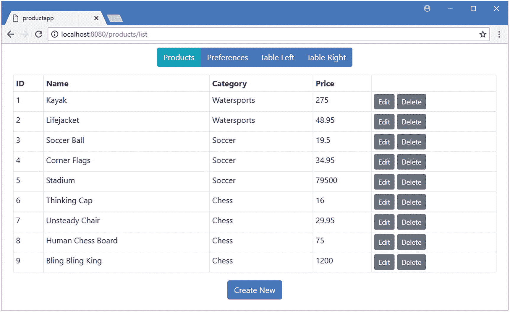
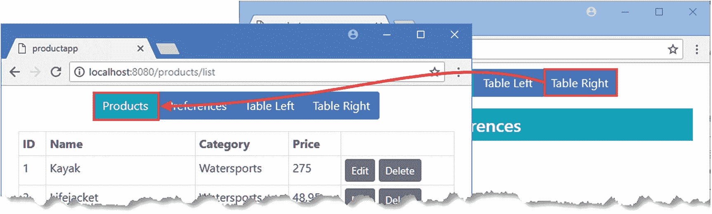
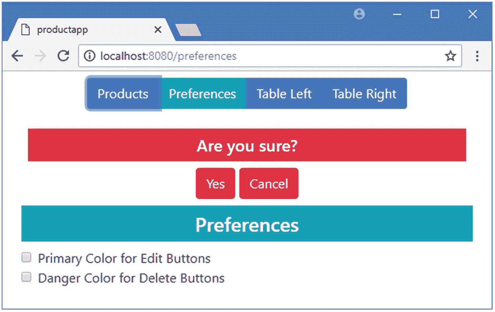
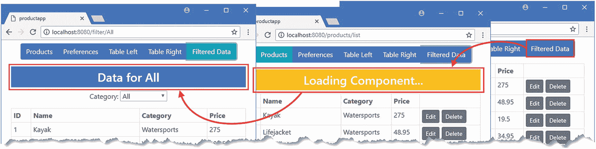

# 二十四、高级 URL 路由

在这一章中，我描述了更高级的 URL 路由功能。首先，我将向您展示如何使用多个文件构建复杂的路由配置，如何使用路由器防护来控制导航，以及如何在路由选择组件时延迟加载组件。在本章的最后，我将向您展示如何使用那些不是为使用 Vue 路由器包而编写的组件。表 [24-1](#Tab1) 总结了本章内容。

表 24-1

章节总结

<colgroup><col class="tcol1 align-left"> <col class="tcol2 align-left"> <col class="tcol3 align-left"></colgroup> 
| 

问题

 | 

解决办法

 | 

列表

 |
| --- | --- | --- |
| 分组相关路线 | 为每组路线定义单独的模块 | 3–5 |
| 检查和拦截导航 | 使用路线守卫 | 6, 9–11 |
| 改变导航的目标 | 在 route guard 的`next`功能中提供一个替换 URL | 7, 8 |
| 在导航完成之前访问组件 | 使用`beforeRouteEnter`保护方法中的回调功能 | 12–15 |
| 延迟加载组件 | 对组件使用动态依赖关系 | 16–21 |
| 使用不了解路由系统的组件 | 定义路线时使用道具功能 | 22–23 |

## 为本章做准备

在本章中，我继续使用第 23 章中的 productapp 项目。本章不需要修改。要启动 RESTful web 服务，打开命令提示符并运行清单 [24-1](#PC1) 中的命令。

```js
npm run json

Listing 24-1Starting the Web Service

```

打开第二个命令提示符，导航到`productapp`目录，运行清单 [24-2](#PC2) 中所示的命令来启动 Vue.js 开发工具。

```js
npm run serve

Listing 24-2Starting the Development Tools

```

一旦初始捆绑过程完成，打开一个新的浏览器窗口并导航到`http://localhost:8080`，在那里你将看到示例应用，如图 [24-1](#Fig1) 所示。

### 小费

你可以从 [`https://github.com/Apress/pro-vue-js-2`](https://github.com/Apress/pro-vue-js-2) 下载本章以及本书其他章节的示例项目。



图 24-1

运行示例应用

## 对相关路线使用单独的文件

随着应用支持的 URL 数量的增加，跟踪路由及其支持的应用部分变得更加困难。可以使用额外的 JavaScript 文件对相关的路由进行分组，然后将这些路由导入到主路由配置中。

对路由进行分组没有固定的方法，我在本章中采用的方法是将处理使用命名的`router-view`元素的组件的并行表示的路由与处理应用其余部分提供的基本功能的路由分开。我在`src/router`文件夹中添加了一个名为`basicRoutes.js`的文件，并添加了清单 [24-3](#PC3) 中所示的代码。

```js
import ProductDisplay from "../components/ProductDisplay";
import ProductEditor from "../components/ProductEditor";
import Preferences from "../components/Preferences";
import Products from "../components/Products";

export default [

    { path: "/preferences", component: Preferences },
    { path: "/products", component: Products,
      children: [ { name: "table", path: "list", component: ProductDisplay },
                  { name: "editor", path: ":op(create|edit)/:id(\\d+)?",
                      component: ProductEditor
                  },
                 { path: "", redirect: "list" }]
    },
    { path: "/edit/:id", redirect: to => `/products/edit/${to.params.id}` },
]

Listing 24-3The Contents of the basicRoutes.js File in the src/router Folder

```

该文件导出一组路由，处理应用支持的基本 URL。接下来，我在`src/router`文件夹中添加了一个名为`sideBySideRoutes.js`的文件，并添加了清单 [24-4](#PC4) 中所示的代码。

```js
import ProductDisplay from "../components/ProductDisplay";
import ProductEditor from "../components/ProductEditor";
import SideBySide from "../components/SideBySide";

export default {

    path: "/named", component: SideBySide,
    children: [
        { path: "tableleft",
          components: { left: ProductDisplay, right: ProductEditor }
        },
        { path: "tableright",
          components: { left: ProductEditor, right: ProductDisplay }
        }
    ]
}

Listing 24-4The Contents of the sideBySideRoutes.js File in the src/router Folder

```

将这些路由组移动到专用文件中允许我简化`index.js`文件，如清单 [24-5](#PC5) 所示，它显示了我如何导入在`basicRoutes.js`和`sideBySideRoutes.js`文件中定义的路由。

```js
import Vue from "vue";
import VueRouter from "vue-router";

//import ProductDisplay from "../components/ProductDisplay";

//import ProductEditor from "../components/ProductEditor";

//import Preferences from "../components/Preferences";

//import Products from "../components/Products";

//import SideBySide from "../components/SideBySide";

import BasicRoutes from "./basicRoutes";

import SideBySideRoutes from "./sideBySideRoutes";

Vue.use(VueRouter);

export default new VueRouter({
    mode: "history",
    routes: [
        ...BasicRoutes,

        SideBySideRoutes,

        { path: "*", redirect: "/products" }
    ]
})

Listing 24-5Importing Routes in the index.js File in the src/router Folder

```

我使用一个`import`语句导入每个文件的内容，并给内容一个我在`routes`属性中使用的名称。文件`basicRoutes.js`导出了一个数组，必须使用 spread 操作符来解包，我在第 4 章[中描述过。`sideBySideRoutes.js`文件导出单个对象，可以在没有展开操作符的情况下使用。应用的运行方式没有明显的变化，但是路由配置已经被分解，这将使相关路由的管理更加简单。](04.html)

## 守卫路线

允许用户使用 URL 在应用中导航的一个缺点是，他们可能会在不希望的情况下尝试访问应用的某些部分，例如在未经身份验证的情况下访问管理功能，或者在从服务器加载数据之前访问编辑功能。导航守卫控制对路线的访问，并且他们可以通过将路线重定向到另一个 URL 或完全取消导航来响应导航尝试。导航保护可以以不同的方式应用，正如我在下面的章节中解释的那样。

### 定义全球导航卫星系统

全局导航守卫是定义为路线配置的一部分的方法，用于控制对应用中所有路线的访问。有三种全局导航保护方法用于注册功能以控制导航，如表 [24-2](#Tab2) 所述。

表 24-2

全球导航卫星系统方法

<colgroup><col class="tcol1 align-left"> <col class="tcol2 align-left"></colgroup> 
| 

名字

 | 

描述

 |
| --- | --- |
| `beforeEach` | 此方法在活动路由更改前调用。 |
| `afterEach` | 此方法在活动路由改变后调用。 |
| `beforeResolve` | 该方法与`beforeEach`相似，但它是在所有特定于路由的和组件的保护(我将在下一节中描述)都被检查后调用的，如“理解保护排序”一节所述。 |

这些方法中的每一个都在`VueRouter`对象上被调用，并接受一个在导航过程中被调用的函数。这用一个例子来解释更容易，在清单 [24-6](#PC6) 中，我使用了`beforeEach`方法来阻止从路径以`/named`开始的路线到`/preferences` URL 的导航。

```js
import Vue from "vue";
import VueRouter from "vue-router";

import BasicRoutes from "./basicRoutes";
import SideBySideRoutes from "./sideBySideRoutes";

Vue.use(VueRouter);

const router = new VueRouter({

    mode: "history",
    routes: [
        ...BasicRoutes,
        SideBySideRoutes,
        { path: "*", redirect: "/products" }
    ]
});

export default router;

router.beforeEach((to, from, next) => {

    if (to.path == "/preferences" && from.path.startsWith("/named")) {

        next(false);

    } else {

        next();

    }

});

Listing 24-6Guarding a Route in the index.js File in the src/router Folder

```

全球路线守卫是最灵活的守卫类型，因为它们可以用来拦截所有导航，但它们很难设置，如清单 [24-6](#PC6) 所示。使用`new`关键字创建`VueRouter`对象，然后将您想要调用的函数从表 [24-2](#Tab2) 中传递给相应的方法。在这个例子中，我将一个函数传递给了`beforeEach`方法，这意味着它将在每次导航尝试之前被调用。

该函数接收三个参数。前两个参数是表示应用正在导航到的路线和应用将要导航离开的路线的对象。这些对象定义了我在第 [22 章](22.html)中描述的属性，我在清单中使用它们的`path`属性来检查应用是否从`/named`导航到`/preferences`。

第三个参数是一个函数，它被调用来接受、重定向或取消导航，并将导航请求传递给下一个路线守卫进行处理，这就是为什么这个参数通常被称为`next`。通过向函数传递不同的参数来指定不同的结果，如表 [24-3](#Tab3) 中所述。

表 24-3

导航保护的下一个功能的使用

<colgroup><col class="tcol1 align-left"> <col class="tcol2 align-left"></colgroup> 
| 

方法使用

 | 

描述

 |
| --- | --- |
| `next()` | 当不带参数调用该函数时，导航将继续进行。 |
| `next(false)` | 当函数将`false`作为参数传递时，导航将被取消。 |
| `next(url)` | 当向该函数传递一个字符串时，它被解释为一个 URL，并成为新的导航目标。 |
| `next(object)` | 当向该函数传递一个对象时，它被解释为新的导航目标，这对于按名称选择路线很有用，如“重定向到命名路线”一节中所示。 |
| `next(callback)` | 这是一个特殊版本的`next`函数，只能在一种情况下使用，如“在 beforeRouteEnter 方法中访问组件”一节中所述，其他情况下不支持。 |

在清单中，如果当前 URL 以`/named`开头，而目标 URL 是`/preferences`，我就传递`next`函数`false`，取消导航请求。对于所有其他导航，我不带参数地调用`next`方法，这允许导航继续进行。

### 警告

你必须记得调用你的卫士中的`next`函数。在一个应用中可以定义多个保护，如果您忘记调用该函数，它们将不会被调用，这可能会导致意外的结果。

#### 将导航请求重定向到另一个 URL

取消导航的另一种方法是将其重定向到另一个 URL。在清单 [24-7](#PC7) 中，我添加了一个额外的守卫函数，拦截对`/named/tableright` URL 的请求，并将它们重定向到`/products`。

### 小费

当有多个全局保护函数时，它们按照传递给`beforeEach`或`beforeAfter`方法的顺序执行。

```js
import Vue from "vue";
import VueRouter from "vue-router";

import BasicRoutes from "./basicRoutes";
import SideBySideRoutes from "./sideBySideRoutes";

Vue.use(VueRouter);

const router = new VueRouter({
    mode: "history",
    routes: [
        ...BasicRoutes,
        SideBySideRoutes,
        { path: "*", redirect: "/products" }
    ]
});

export default router;

router.beforeEach((to, from, next) => {
    if (to.path == "/preferences" && from.path.startsWith("/named")) {
        next(false);
    } else {
        next();
    }
});

router.beforeEach((to, from, next) => {

    if (to.path == "/named/tableright") {

        next("/products");

    } else {

        next();

    }

});

Listing 24-7Defining Another Guard in the index.js File in the src/router Folder

```

我可以在现有的 guard 函数中实现这个检查，但是我想演示对多个 guard 的支持，这是在复杂的应用中对相关检查进行分组的一种有用的方法。要查看重定向的效果，导航至`http://localhost:8080/preferences`，然后点击表格右侧按钮。应用导航到`/products` URL，而不是并排显示组件，如图 [24-2](#Fig2) 所示。


图 24-2

使用路线保护重定向导航

### 小费

当您在路由防护中执行重定向时，会启动一个新的导航请求，并再次调用所有防护功能。因此，重要的是不要创建重定向循环，因为两个保护函数会导致应用在相同的两个 URL 之间来回切换。

#### 重定向到命名路由

如果您想将一个导航请求重定向到一个指定的路线，那么您可以将一个具有`name`属性的对象传递给`next`函数，如清单 [24-8](#PC8) 所示。

```js
import Vue from "vue";
import VueRouter from "vue-router";

import BasicRoutes from "./basicRoutes";
import SideBySideRoutes from "./sideBySideRoutes";

Vue.use(VueRouter);

const router = new VueRouter({
    mode: "history",
    routes: [
        ...BasicRoutes,
        SideBySideRoutes,
        { path: "*", redirect: "/products" }
    ]
});

export default router;

router.beforeEach((to, from, next) => {
    if (to.path == "/preferences" && from.path.startsWith("/named")) {
        next(false);
    } else {
        next();
    }
});

router.beforeEach((to, from, next) => {
    if (to.path == "/named/tableright") {
        next({ name: "editor", params: { op: "edit", id: 1 } });

    } else {
        next();
    }
});

Listing 24-8Redirecting to a Named Route in the index.js File in the src/router Folder

```

在清单中，我使用了`next`函数将导航重定向到名为`editor`的路线，效果如图 [24-3](#Fig3) 所示。


图 24-3

将导航重定向到指定路线

### 定义特定于路线的防护

各个路线可以实现自己的保护，这可以提供一种更自然的方式来管理导航。唯一可以直接在路线中使用的单守卫方法是`beforeEnter`，我已经在清单 [24-9](#PC9) 中使用它来守卫两条路线。

```js
import ProductDisplay from "../components/ProductDisplay";
import ProductEditor from "../components/ProductEditor";
import SideBySide from "../components/SideBySide";

export default {

    path: "/named", component: SideBySide,
    children: [
        {
            path: "tableleft",
            components: { left: ProductDisplay, right: ProductEditor }
        },
        {
            path: "tableright",
            components: { left: ProductEditor, right: ProductDisplay },
            beforeEnter: (to, from, next) => {

                next("/products/list");

            }

        }
    ],
    beforeEnter: (to, from, next) => {

        if (to.path == "/named/tableleft") {

            next("/preferences");

        } else {

            next();

        }

    }

}

Listing 24-9Guarding Individual Routes in the sideBySideRoutes.js File in the src/router Folder

```

使用嵌套路由时，您可以保护父路由和单个子路由。在清单中，我在父路由中添加了一个守卫，将对`/named/tableleft`的请求重定向到`/preferences`，您可以通过单击应用的左侧按钮来测试，如图 [24-4](#Fig4) 所示。


图 24-4

守卫一条路线

#### 了解保护订购

在清单 [24-9](#PC9) 中，我向其中一个子路由添加了一个守卫，将对`/named/tableright`的请求重定向到`/products/list`。但是如果你点击表格右边的按钮，你会看到这个保护没有达到预期的效果。

发生这种情况是因为全局路由守卫在特定路由守卫之前执行，并且其中一个全局守卫已经在重定向对`/named/tableright`的请求。当警卫执行重定向时，当前路由更改的处理被放弃，新的导航开始，这意味着在执行重定向的警卫之后执行的任何警卫将不能检查该请求。

如表 [24-2](#Tab2) 所示，全局`beforeResolve`方法在所有其他类型的保护之后执行，这是一种在检查完特定路线的保护之后将全局保护定义为最终检查的有用方法。在清单 [24-10](#PC10) 中，我已经使用了`beforeResolve`方法来改变清单 [24-9](#PC9) 中定义的阻挡路线守卫的守卫功能。

```js
import Vue from "vue";
import VueRouter from "vue-router";

import BasicRoutes from "./basicRoutes";
import SideBySideRoutes from "./sideBySideRoutes";

Vue.use(VueRouter);

const router = new VueRouter({
    mode: "history",
    routes: [
        ...BasicRoutes,
        SideBySideRoutes,
        { path: "*", redirect: "/products" }
    ]
});

export default router;

router.beforeEach((to, from, next) => {
    if (to.path == "/preferences" && from.path.startsWith("/named")) {
        next(false);
    } else {
        next();
    }
});

router.beforeResolve((to, from, next) => {

    if (to.path == "/named/tableright") {
        next({ name: "editor", params: { op: "edit", id: 1} });
    } else {
        next();
    }
})

Listing 24-10Changing a Guard in the index.js File in the src/router Folder

```

在实际项目中，只有当存在一组特定于路由的防护不会拦截的 URL 时，这才是一个有用的更改，但是您可以通过单击表格右侧的按钮来查看计时更改的效果。应用将开始导航到`/named/tableright`，该应用将被路由特定的警卫拦截，该警卫将应用重定向到`/products/list`，如图 [24-5](#Fig5) 所示。



图 24-5

路由保护排序的效果

### 定义组件路由保护

在第 22 章[的](22.html)中，我使用了`ProductEditor`组件中的`beforeRouteUpdate`方法来响应路线变化，就像这样:

```js
...
beforeRouteUpdate(to, from, next) {
    this.selectProduct(to);
    next();
}
...

```

这是路由保护方法之一，组件可以实现该方法来参与保护选择它们进行显示的路由。使用`beforeRouteUpdate`方法来接收变更通知是一项有用的技术，但该方法是组件保护方法集的一部分，如表 [24-4](#Tab4) 所述。

表 24-4

组件保护方法

<colgroup><col class="tcol1 align-left"> <col class="tcol2 align-left"></colgroup> 
| 

名字

 | 

描述

 |
| --- | --- |
| `beforeRouteEnter` | 此方法在目标路由选择的组件被确认之前被调用，它用于在路由导致组件被创建之前控制对路由的访问。访问该方法中的组件需要一种特定的技术，如“在 beforeRouteEnter 方法中访问组件”一节中所述。 |
| `beforeRouteUpdate` | 当选择了当前组件的路由发生变化，并且新路由也选择了该组件时，将调用此方法。 |
| `beforeRouteLeave` | 当应用将要离开选择了当前组件的路线时，调用此方法。 |

这些方法接收与其他保护相同的三个参数，可用于接受、重定向或取消导航。在清单 [24-11](#PC12) 中，我实现了`beforeRouterLeave`方法，当路线将要改变时，要求用户确认导航。

```js
<template>
    <div>
        <div v-if="displayWarning" class="text-center m-2">

            <h5 class="bg-danger text-white p-2">

                Are you sure?

            </h5>

            <button class="btn btn-danger" v-on:click="doNavigation">

                Yes

            </button>

            <button class="btn btn-danger" v-on:click="cancelNavigation">

                Cancel

            </button>

        </div>

        <h4 class="bg-info text-white text-center p-2">Preferences</h4>
        <div class="form-check">
            <input class="form-check-input" type="checkbox"
                   v-bind:checked="primaryEdit" v-on:input="setPrimaryEdit">
            <label class="form-check-label">Primary Color for Edit Buttons</label>
        </div>
        <div class="form-check">
            <input class="form-check-input" type="checkbox"
                   v-bind:checked="dangerDelete" v-on:input="setDangerDelete">
            <label class="form-check-label">Danger Color for Delete Buttons</label>
        </div>
    </div>
</template>

<script>

    import { mapState } from "vuex";

    export default {
        data: function() {

            return {

                displayWarning: false,

                navigationApproved: false,

                targetRoute: null

            }

        },

        computed: {
            ...mapState({
                primaryEdit: state => state.prefs.primaryEditButton,
                dangerDelete: state => state.prefs.dangerDeleteButton
            })
        },
        methods: {
            setPrimaryEdit() {
                this.$store.commit("prefs/setEditButtonColor", !this.primaryEdit);
            },
            setDangerDelete() {
                this.$store.commit("prefs/setDeleteButtonColor", !this.dangerDelete);
            },
            doNavigation() {

                this.navigationApproved = true;

                this.$router.push(this.targetRoute.path);

            },

            cancelNavigation() {

                this.navigationApproved = false;

                this.displayWarning = false;

            }

        },
        beforeRouteLeave(to, from, next) {

            if (this.navigationApproved) {

                next();

            } else {

                this.targetRoute = to;

                this.displayWarning = true;

                next(false);

            }

        }

    }
</script>

Listing 24-11Route Guarding in the Preferences.vue File in the src/components Folder

```

当应用要导航到显示不同组件的路线时，调用`beforeRouteLeave`方法。在这个例子中，我提示用户确认，并阻止导航，直到它被接收。要查看效果，请单击首选项按钮，然后单击产品按钮。如图 [24-6](#Fig6) 所示，路线守卫将阻止导航，直到您点击“是”按钮。



图 24-6

使用组件路由保护

#### 在 beforeRouteEnter 方法中访问组件

在创建组件之前调用`beforeRouteEnter`方法，这确保了在组件生命周期开始之前可以取消导航。如果要使用此方法执行需要访问组件的属性和方法的任务，例如从 web 服务请求数据，这可能会导致问题。为了解决这个限制，传递给`beforeRouteEnter`方法的`next`函数可以接受一个回调函数，一旦组件被创建，这个回调函数就被调用，这允许`beforeRouteEnter`方法访问组件，但是只有在取消或重定向导航的机会已经过去的时候。为了演示，我创建了一个组件，它使用`beforeRouteEnter`方法来访问组件定义的方法，方法是在`src/component`文件夹中添加一个名为`FilteredData.vue`的文件，其内容如清单 [24-12](#PC13) 所示。

```js
<template>
    <div>
        <h3 class="bg-primary text-center text-white p-2">
            Data for {{ category }}
        </h3>

        <div class="text-center m-2">
            <label>Category:</label>
            <select v-model="category">
                <option>All</option>
                <option>Watersports</option>
                <option>Soccer</option>
                <option>Chess</option>
            </select>
        </div>

        <h3 v-if="loading" class="bg-info text-white text-center p-2">
            Loading Data...
        </h3>

        <table v-else class="table table-sm table-bordered">
            <tr>
                <th>ID</th>
                <th>Name</th>
                <th>Category</th>
                <th>Price</th>
            </tr>
            <tbody>
                <tr v-for="p in data" v-bind:key="p.id">
                    <td>{{ p.id }}</td>
                    <td>{{ p.name }}</td>
                    <td>{{ p.category }}</td>
                    <td>{{ p.price }}</td>
                </tr>
            </tbody>
        </table>
    </div>
</template>

<script>

    import Axios from "axios";

    const baseUrl = "http://localhost:3500/products/";

    export default {
        data: function () {
            return {
                loading: true,
                data: [],
                category: "All"
            }
        },
        methods: {
            async getData(route) {
                if (route.params != null && route.params.category != null) {
                    this.category = route.params.category;
                } else {
                    this.category = "All";
                }
                let url = baseUrl
                    + (this.category == "All" ? "" : `?category=${this.category}`);
                this.data.push(...(await Axios.get(url)).data);
                this.loading = false;
            }
        },
        watch: {
            category() {
                this.$router.push(`/filter/${this.category}`);
            }
        },
        async beforeRouteEnter(to, from, next) {
            next(async component => await component.getData(to));
        },
        async beforeRouteUpdate(to, from, next) {
            this.data.splice(0, this.data.length);
            await this.getData(to);
            next();
        }
    }
</script>

Listing 24-12The Contents of the FilteredData.vue File in the src/components Folder

```

该组件允许用户按类别过滤产品数据，每次都从使用 Axios 请求的 web 服务中重新检索产品数据，这在第 [19](19.html) 章中有所描述。(为了简单起见，我直接使用 Axios 并将数据存储在组件中，而不是修改存储库和数据存储。)

该组件为用户提供了一个`select`元素来选择用于过滤数据的类别。当使用`select`元素时，`category`属性被修改，这导致观察者执行到包含类别名称的 URL 的导航，因此例如选择`Soccer`类别将导航到`/filter/Soccer` URL。

该组件实现了两个组件路由保护方法，这两个方法都用于调用组件的异步`getData`方法，该方法接受一个路由对象并使用它从 web 服务获取适当的数据。我在第 [19 章](19.html)中添加的`json-server`包支持过滤数据，所以例如对`http://localhost:3500/products?category=Soccer`的请求将只返回那些类别属性为`Soccer`的对象。其中一种路由保护方法很容易理解，如下所示:

```js
...
async beforeRouteUpdate(to, from, next) {
    this.data.splice(0, this.data.length);
    await this.getData(to);
    next();
}
...

```

这是我在整本书中使用的组件工作模式，它使用`this`来引用组件对象，所以`this.getData`被用来调用由组件定义的`getData`方法。在`beforeRouteEnter`方法中实现相同的效果需要不同的方法。

```js
...
async beforeRouteEnter(to, from, next) {
    next(component => component.getData(to));

},
...

```

在组件创建和它的常规生命周期开始之前，`beforeRouteEnter`方法被调用，这意味着`this`不能用于访问组件。相反，可以向`next`方法传递一个函数，一旦创建了组件，该函数将被调用，并接收组件对象作为其参数。在清单中，一旦创建了组件，我就使用`next`函数来调用组件上的`getData`方法。

这似乎是一种异常复杂的请求数据的方法，使用作为组件生命周期一部分的`created`方法可以很容易地完成，我在第 [17 章](17.html)中对此进行了描述。`beforeRouteEnter`方法有用的原因是它允许在组件创建之前取消导航，这在`created`方法中是做不到的，后者只有在导航完成并且组件已经创建之后才被调用。为了演示，我在`beforeRouteEnter`方法中添加了一个检查，如果用户在 URL 中指定了除`All`之外的类别值，它将重定向导航，如清单 [24-13](#PC16) 所示。

```js
...
async beforeRouteEnter(to, from, next) {
    if (to.params.category != "All") {

        next("/filter/All");

     } else {

         next(async component => await component.getData(to));
     }

},
...

Listing 24-13Guarding a Component in the FilteredData.vue File in the src/components Folder

```

该方法重定向任何导航到显示组件的 URL 的尝试，除非该 URL 指向从服务器请求所有数据的`All`类别。一旦组件显示出来，就可以导航到其他组件，因为这些更改受到了`beforeRouteUpdate`方法的保护。

当你看到它工作时，这个例子就更容易理解了。为了添加对新组件的支持，我将清单 [24-14](#PC17) 中所示的语句添加到基本路由集中。

```js
import ProductDisplay from "../components/ProductDisplay";
import ProductEditor from "../components/ProductEditor";
import Preferences from "../components/Preferences";
import Products from "../components/Products";

import FilteredData from "../components/FilteredData";

export default [

    { path: "/preferences", component: Preferences },
    {
        path: "/products", component: Products,
        children: [{ name: "table", path: "list", component: ProductDisplay },
        {
            name: "editor", path: ":op(create|edit)/:id(\\d+)?",
            component: ProductEditor
        },
        { path: "", redirect: "list" }]
    },
    { path: "/edit/:id", redirect: to => `/products/edit/${to.params.id}` },
    { path: "/filter/:category", component: FilteredData }

]

Listing 24-14Adding a Route in the basicRoutes.js File in the src/router Folder

```

为了方便导航到新路线，我将清单 [24-15](#PC18) 中所示的导航元素添加到顶级`App`组件的模板中。

```js
<template>
    <div class="container-fluid">
        <div class="row">
            <div class="col text-center m-2">
                <div class="btn-group">
                    <router-link tag="button" to="/products"
                                 active-class="btn-info" class="btn btn-primary">
                        Products
                    </router-link>
                    <router-link tag="button" to="/preferences"
                                 active-class="btn-info" class="btn btn-primary">
                        Preferences
                    </router-link>
                    <router-link to="/named/tableleft" class="btn btn-primary"
                                 active-class="btn-info">
                        Table Left
                    </router-link>
                    <router-link to="/named/tableright" class="btn btn-primary"
                                 active-class="btn-info">
                        Table Right
                    </router-link>
                    <router-link to="/filter/All" class="btn btn-primary"

                                active-class="btn-info">

                        Filtered Data

                    </router-link>

                </div>
            </div>
        </div>
        <div class="row">
            <div class="col m-2">
                <router-view></router-view>
            </div>
        </div>
    </div>
</template>

<script>

    export default {
        name: 'App',
        created() {
            this.$store.dispatch("getProductsAction");
        }
    }
</script>

Listing 24-15Adding a Navigation Element in the App.vue File in the src Folder

```

结果是一个新的按钮元素，它导航到一个选择了`FilteredData`组件的路径。仅当类别动态段为`All`时，路由保护方法才允许导航，并将重定向其他请求。一旦组件显示出来，使用`select`元素选择一个不同的组件将导航到一个由`beforeRouteUpdate`方法保护的 URL，该方法通过获取指定类别中的数据来响应路由的改变，如图 [24-7](#Fig7) 所示。


图 24-7

访问路由保护中的组件对象

### 使用组件路由保护进行开发

使用零部件路线防护装置可能会很困难。Vue.js 开发工具会动态更新应用，但这不会正确触发路由保护方法，您可能需要重新加载浏览器窗口才能看到路由保护的工作。

类似地，当浏览器和 web 服务都在同一个开发工作站上运行时，web 服务的响应可能会非常快，以至于您在等待数据时没有机会看到组件向用户提供的反馈。如果您想减慢数据加载的速度，以便可以看到组件在等待数据时的行为，那么在发出 HTTP 请求之前添加以下语句:

```js
...
await new Promise(resolve => setTimeout(resolve, 3000));
...

```

例如，对于清单 [24-15](#PC18) 中的组件，该语句将被插入到`getData`方法中，紧接在使用 Axios 发送 HTTP 请求的语句之前，并将在发送请求之前引入三秒钟的暂停。

## 按需加载组件

路线所需的组件可以从应用的 JavaScript 包中排除，只在需要时才加载，使用我在第 [21 章](21.html)中描述的基本特性。使用 URL 路由时，只支持基本的延迟加载特性，忽略配置选项，如`loading`或`delay`(不过，我将在下一节演示如何使用 route guards 显示加载消息)。在清单 [24-16](#PC20) 中，我修改了导入`FilteredData`组件的语句，这样它就可以延迟加载了。

```js
import ProductDisplay from "../components/ProductDisplay";
import ProductEditor from "../components/ProductEditor";
import Preferences from "../components/Preferences";
import Products from "../components/Products";

const FilteredData = () => import("../components/FilteredData");

export default [

    { path: "/preferences", component: Preferences },
    {
        path: "/products", component: Products,
        children: [{ name: "table", path: "list", component: ProductDisplay },
        {
            name: "editor", path: ":op(create|edit)/:id(\\d+)?",
            component: ProductEditor
        },
        { path: "", redirect: "list" }]
    },
    { path: "/edit/:id", redirect: to => `/products/edit/${to.params.id}` },
    { path: "/filter/:category", component: FilteredData }
]

Listing 24-16Lazily Loading a Component in the basicRoutes.js File in the src/router Folder

```

这是我在第 [21 章](21.html)中用过的`import`函数，也有同样的效果。`FilteredData`组件被排除在主应用 JavaScript 包之外，放在它自己的包中，在第一次需要时加载。

为确保`FilteredData`仅在需要时加载，导航至`http://localhost:8080`并打开浏览器的 F12 开发者工具至网络选项卡。在主浏览器窗口中，点击过滤数据按钮，你会看到一个名为`0.js`的文件的 HTTP 请求被发送到服务器，如图 [24-8](#Fig8) 所示。(您可能会在请求中看到不同的文件名，但这并不重要。)


图 24-8

延迟加载组件

在构建过程中，创建了两个独立的 JavaScript 代码包。`app.js`文件包含应用的主要部分，而`0.js`文件只包含`FilteredData`组件。(F12 工具显示的其他请求是初始 HTTP 请求、来自 web 服务的数据请求，以及连接回开发工具用来更新浏览器的服务器。)

### 小费

默认情况下，URL 路由的延迟加载功能将提供预取提示。有关禁用该功能的详细信息和配置说明，请参见第 [21](21.html) 章。

### 显示组件加载消息

在撰写本文时，Vue 路由器包不支持第 [21](21.html) 章中描述的显示加载或错误组件的功能。为了创建一个类似的特性，我将把一个数据存储属性与路由器防护结合起来，在延迟加载一个组件时向用户显示一条消息。首先，我在数据存储中添加了一个属性，该属性将指示组件何时被加载，以及一个改变其值的突变，如清单 [24-17](#PC21) 所示。

```js
import Vue from "vue";
import Vuex from "vuex";
import Axios from "axios";

import PrefsModule from "./preferences";
import NavModule from "./navigation";

Vue.use(Vuex);

const baseUrl = "http://localhost:3500/products/";

export default new Vuex.Store({
    modules: {
        prefs: PrefsModule,
        nav: NavModule
    },
    state: {
        products: [],
        selectedProduct: null,
        componentLoading: false

    },
    mutations: {
        setComponentLoading(currentState, value) {

            currentState.componentLoading = value;

        },

        saveProduct(currentState, product) {
            let index = currentState.products.findIndex(p => p.id == product.id);
            if (index == -1) {
                currentState.products.push(product);
            } else {
                Vue.set(currentState.products, index, product);
            }
        },

        // ...other data store features omitted for brevity...

    }
})

Listing 24-17Adding a Data Property and Mutation in the index.js File in the src/store Folder

```

为了指示组件何时被加载，我将清单 [24-18](#PC22) 中所示的元素添加到了`App`组件的模板中，同时添加了到清单 [24-17](#PC21) 中创建的数据存储属性的映射。

```js
<template>
    <div class="container-fluid">
        <div class="row">
            <div class="col text-center m-2">
                <div class="btn-group">
                    <router-link tag="button" to="/products"
                                 active-class="btn-info" class="btn btn-primary">
                        Products
                    </router-link>
                    <router-link tag="button" to="/preferences"
                                 active-class="btn-info" class="btn btn-primary">
                        Preferences
                    </router-link>
                    <router-link to="/named/tableleft" class="btn btn-primary"
                                 active-class="btn-info">
                        Table Left
                    </router-link>
                    <router-link to="/named/tableright" class="btn btn-primary"
                                 active-class="btn-info">
                        Table Right
                    </router-link>
                    <router-link to="/filter/All" class="btn btn-primary"
                                active-class="btn-info">
                        Filtered Data
                    </router-link>
                </div>
            </div>
        </div>
        <div class="row">
            <div class="col m-2">
                <h3 class="bg-warning text-white text-center p-2"

                        v-if="componentLoading">

                    Loading Component...

                </h3>

                <router-view></router-view>
            </div>
        </div>
    </div>
</template>

<script>
    import { mapState } from "vuex";

    export default {
        name: 'App',
        computed: {

            ...mapState(["componentLoading"]),

        },

        created() {
            this.$store.dispatch("getProductsAction");
        }
    }
</script>

Listing 24-18Displaying a Loading Message in the App.vue File in the src Folder

```

为了设置数据存储属性的值并向用户显示消息，我在路由中添加了一个针对延迟加载组件的防护，如清单 [24-19](#PC23) 所示。

```js
import ProductDisplay from "../components/ProductDisplay";
import ProductEditor from "../components/ProductEditor";
import Preferences from "../components/Preferences";
import Products from "../components/Products";

const FilteredData = () => import("../components/FilteredData");

import dataStore from "../store";

export default [

    { path: "/preferences", component: Preferences },
    {
        path: "/products", component: Products,
        children: [{ name: "table", path: "list", component: ProductDisplay },
        {
            name: "editor", path: ":op(create|edit)/:id(\\d+)?",
            component: ProductEditor
        },
        { path: "", redirect: "list" }]
    },
    { path: "/edit/:id", redirect: to => `/products/edit/${to.params.id}` },
    { path: "/filter/:category", component: FilteredData,

        beforeEnter: (to, from, next) => {

            dataStore.commit("setComponentLoading", true);

            next();

        }

    }
]

Listing 24-19Adding a Route Guard in the basicRoutes.js File in the src/router Folder

```

本例中的`import`语句提供了对数据存储的访问。我在第 [20](20.html) 章的例子中使用的`$store`只在组件中可用，在应用的其余部分，通过`import`语句可以访问数据存储。清单 [24-19](#PC23) 中的 guard 方法使用`setComponentLoading`突变来更新数据存储，然后调用`next`函数。

### 处理加载错误

URL 路由的延迟加载功能不支持错误组件。为了处理加载组件或调用 route guards 时的错误，可以使用由`VueRouter`对象定义的`onError`方法来注册一个回调函数，当出现问题时将调用该函数。

清单 [24-19](#PC23) 中定义的 guard 方法指示加载过程何时开始，但是我还需要指示加载过程何时完成，这样用户就不会再看到加载消息。在清单 [24-20](#PC24) 中，我已经更新了将被延迟加载的组件中的路由保护。

### 警告

您可能想把两个突变语句都放在组件的`beforeRouteEnter` guard 方法中。这将不起作用，因为组件的代码是应用正在加载的代码，并且在加载过程完成之前不能调用 route guard 方法。

```js
...
async beforeRouteEnter(to, from, next) {
    if (to.params.category != "All") {
        next("/filter/All");
    } else {
        next(async component => {

            component.$store.commit("setComponentLoading", false);

            await component.getData(to)
        });

    }
},
...

Listing 24-20Updating a Route Guard in the FilteredData.vue File in the src/components Folder

```

我在回调函数中添加了一个语句，一旦导航被确认并且组件被创建，这个函数就会被调用。使用`component`参数，我更新了数据存储并应用了表示加载过程完成的突变，产生了如图 [24-9](#Fig9) 所示的效果。



图 24-9

延迟加载组件时显示消息

#### 加载期间隐藏传出组件

如果你检查图 [24-9](#Fig9) ，你会看到在整个装载过程中，将要被移除的组件会显示给用户。虽然这对于许多项目来说是可以接受的，但是如果你想在等待新组件被加载的时候隐藏旧组件，就必须小心使用`v-show`指令，如清单 [24-21](#PC25) 所示。

```js
...
<div class="row">
    <div class="col m-2">
        <h3 class="bg-warning text-white text-center p-2"
                v-if="componentLoading">
            Loading Component...
        </h3>
        <router-view v-show="!componentLoading"></router-view>

    </div>
</div>
...

Listing 24-21Hiding an Element in the App.vue File in the src Folder

```

正如我在第 [12](12.html) 章中解释的那样，`v-show`隐藏了一个元素而没有移除它。这很重要，因为如果您使用`v-if`或`v-else`指令，那么`router-view`元素将从文档对象模型中删除，并且加载的组件将永远不会被初始化并显示给用户。使用`v-show`指令将`router-view`元素留在文档中，并作为显示延迟加载组件的目标，如图 [24-10](#Fig10) 所示。


图 24-10

在组件加载期间隐藏路由器视图

## 创建无布线组件

并非所有的组件都被编写为利用 Vue 路由器包及其提供的`$router`和`$route`属性。例如，如果你想使用第三方编写的组件，你会发现大多数组件都是使用 Vue.js props 特性配置的，我在第 16 章[中描述过。Vue 路由器支持为组件提供适当值作为其路由配置的一部分，这使得将组件集成到使用 URL 路由的应用中成为可能，而不必修改它们或编写笨拙的包装器来适应它们。为了演示这个特性，我在`src/components`文件夹中添加了一个名为`MessageDisplay.vue`的文件，其内容如清单](16.html) [24-22](#PC26) 所示。

```js
<template>
    <h3 class="bg-success text-white text-center p-2">
        Message: {{ message }}
    </h3>
</template>

<script>
    export default {
        props: ["message"]
    }
</script>

Listing 24-22The Contents of the MessageDisplay.vue File in the src/components Folder

```

这个组件使用一个道具显示一条消息，这就是我演示这个特性所需要的全部内容。在清单 [24-23](#PC27) 中，我在应用的配置中添加了两条路由，它们指向新组件，并使用不同的属性值对其进行配置。

```js
import ProductDisplay from "../components/ProductDisplay";
import ProductEditor from "../components/ProductEditor";
import Preferences from "../components/Preferences";
import Products from "../components/Products";

import MessageDisplay from "../components/MessageDisplay";

const FilteredData = () => import("../components/FilteredData");

import dataStore from "../store";

export default [

    { path: "/preferences", component: Preferences },
    {
        path: "/products", component: Products,
        children: [{ name: "table", path: "list", component: ProductDisplay },
        {
            name: "editor", path: ":op(create|edit)/:id(\\d+)?",
            component: ProductEditor
        },
        { path: "", redirect: "list" }]
    },
    { path: "/edit/:id", redirect: to => `/products/edit/${to.params.id}` },
    { path: "/filter/:category", component: FilteredData,
        beforeEnter: (to, from, next) => {
            dataStore.commit("setComponentLoading", true);
            next();
        }
    },
    { path: "/hello", component: MessageDisplay, props: { message: "Hello, Adam"}},

    { path: "/hello/:text", component: MessageDisplay,

        props: (route) => ({ message: `Hello, ${route.params.text}`})},

    { path: "/message/:message", component: MessageDisplay, props: true},

]

Listing 24-23Adding Routes in the basicRoutes.js File in the src/router Folder

```

定义路线时，使用`props`属性将属性传递给组件。清单 [24-23](#PC27) 中添加的路线展示了使用`props`属性向组件传递道具的三种不同方式。在第一条路线中，prop 值完全独立于路线，并且将总是被设置为相同的值，你可以通过导航到`http://localhost:8080/hello`看到，在那里你将看到如图 [24-11](#Fig11) 所示的结果。


图 24-11

传递固定属性值

另外两条路径使用路径的动态线段值来设置属性值。可以为 props 值分配一个函数，该函数接收当前路径作为其参数，并返回一个包含 props 值的对象，如下所示:

```js
...
{ path: "/hello/:text", component: MessageDisplay,
  props: (route) => ({ message: `Hello, ${route.params.text}`})},

...

```

这个例子从`text`段获取值，并使用它来设置`message`属性的值，如果需要处理来自 URL 的值，这是一个有用的技术。如果您不需要处理动态段，那么您可以使用最后一种技术，即将`props`值设置为 true `,`，如下所示:

```js
...
{ path: "/message/:message", component: MessageDisplay, props: true},
...

```

这具有使用来自当前路线的`params`值作为属性值的效果，这避免了为每个动态段和属性显式定义映射的需要(尽管段的名称必须与组件期望的属性名称相匹配)。要查看效果，导航到`http://localhost:8080/hello/adam`和`http://localhost:8080/message/Hello%20Adam`，这将产生如图 [24-12](#Fig12) 所示的结果。


图 24-12

将动态段值映射到组件属性

## 摘要

在本章中，我解释了如何使用多个 JavaScript 文件对相关路由进行分组，以使路由配置更易于管理。我还向您展示了如何保护路由以控制它们的激活，并演示了如何在路由需要组件时延迟加载组件。在本章的最后，我向您展示了如何配置一个组件的 props，当您想要使用尚未编写的组件从路由系统中获取它们的配置信息时，这是一项非常有用的技术。在下一章中，我将向您展示如何使用过渡功能。