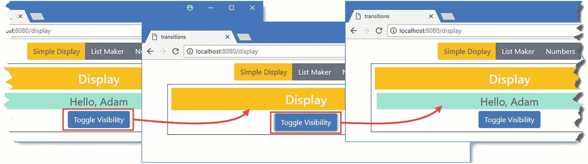
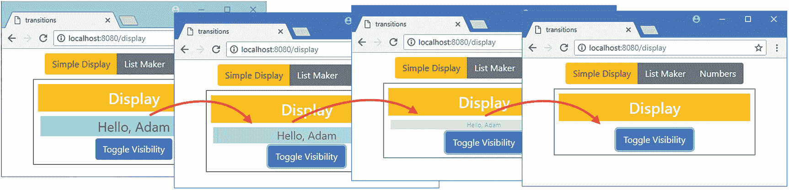
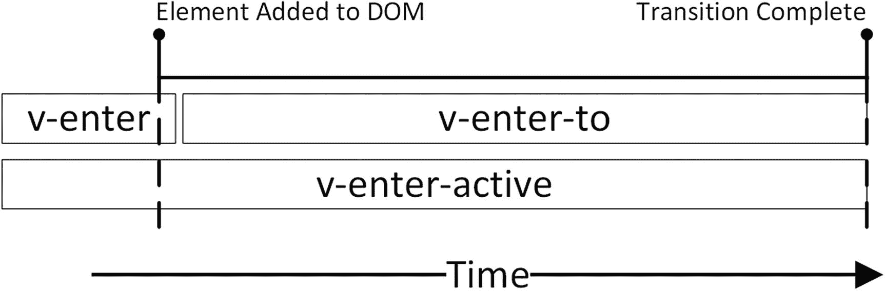
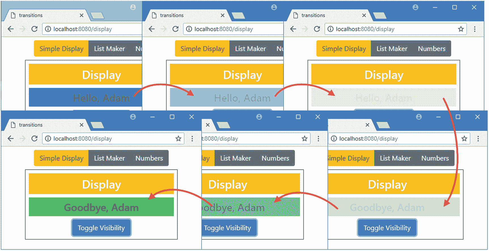
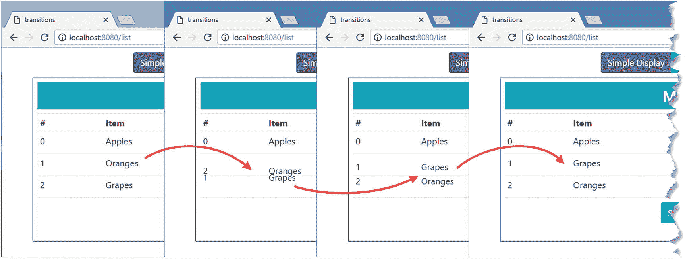

# 二十五、过渡

Vue.js 转换特性允许您在添加或删除 HTML 元素或改变位置时做出响应。当结合现代浏览器提供的特性时，过渡可以用来将用户的注意力吸引到应用中受其行为影响的部分。在本章中，我将向您展示使用过渡的不同方式，演示如何使用第三方 CSS 和 JavaScript 动画包，并向您展示如何将用户的注意力吸引到其他类型的更改上，例如当数据值被修改时。表 [25-1](#Tab1) 将本章放在上下文中。

表 25-1

将过渡置于上下文中

<colgroup><col class="tcol1 align-left"> <col class="tcol2 align-left"></colgroup> 
| 

问题

 | 

回答

 |
| --- | --- |
| 它们是什么？ | 转换是在关键时刻从类中添加和删除元素的指令，比如在 DOM 中添加和删除元素。这些类用于逐渐应用元素样式的变化来创建动画效果。 |
| 它们为什么有用？ | 过渡是一种有用的方式，可以将用户的注意力吸引到重要的变化上，或者使变化不那么刺耳。 |
| 它们是如何使用的？ | 使用`transition`和`transition-group`元素应用过渡。 |
| 有什么陷阱或限制吗？ | 人们很容易忘乎所以，创建一个应用，其中包含的效果会让用户感到沮丧，并扰乱有效的工作流程。 |
| 还有其他选择吗？ | 转场是可选功能，您不必在项目中使用它们。 |

表 [25-2](#Tab2) 总结了本章内容。

表 25-2

章节总结

<colgroup><col class="tcol1 align-left"> <col class="tcol2 align-left"> <col class="tcol3 align-left"></colgroup> 
| 

问题

 | 

解决办法

 | 

列表

 |
| --- | --- | --- |
| 应用过渡 | 使用`transition`元素并定义与过渡类匹配的样式 | 13, 15, 16, 20–22 |
| 使用动画库 | 使用`transition`元素属性指定将应用动画的类 | 14, 17 |
| 确定元素之间的过渡是如何呈现的 | 使用`mode`属性 | Fifteen |
| 将过渡应用于一组重复的元素 | 使用`transition-group`元素 | Eighteen |
| 接收转换通知 | 处理过渡事件 | Nineteen |

## 为本章做准备

为了创建本章示例所需的项目，在一个方便的位置运行清单 [25-1](#PC1) 中所示的命令来创建一个新的 Vue.js 项目。

```js
vue create transitions --default

Listing 25-1Creating the Example Project

```

这个命令创建了一个名为`transitions`的项目。一旦设置过程完成，运行`transitions`文件夹中清单 [25-2](#PC2) 所示的命令，将引导 CSS 和 Vue 路由器包添加到项目中。

```js
npm install bootstrap@4.0.0
npm install vue-router@3.0.1

Listing 25-2Adding Packages

```

为了给本章中的例子提供效果，我使用了`animate.css`和`popmotion`包。运行`transitions`文件夹中清单 [25-3](#PC3) 所示的命令，下载并安装软件包。

```js
npm install animate.css@3.6.1
npm install popmotion@8.1.24

Listing 25-3Adding the Animation Packages

```

将清单 [25-4](#PC4) 中显示的语句添加到`src`文件夹中的`main.js`文件中，将`Bootstrap`和动画包合并到应用中。

```js
import Vue from 'vue'
import App from './App.vue'

import "bootstrap/dist/css/bootstrap.min.css";

import "animate.css/animate.min.css";

import "popmotion/dist/popmotion.global.min.js";

Vue.config.productionTip = false

new Vue({
  render: h => h(App)
}).$mount('#app')

Listing 25-4Incorporating the Packages in the main.js File in the src Folder

```

### 创建组件

我需要这一章的一些基本组件。我首先将一个名为`SimpleDisplay.vue`的文件添加到`src/components`文件夹中，其内容如清单 [25-5](#PC5) 所示。

```js
<template>
    <div class="mx-5 border border-dark p-2">
        <h3 class="bg-warning text-white text-center p-2">Display</h3>

        <div v-if="show" class="h4 bg-info text-center p-2">Hello, Adam</div>

        <div class="text-center">
            <button class="btn btn-primary" v-on:click="toggle">
                Toggle Visibility
            </button>
        </div>
    </div>
</template>

<script>

    export default {
        data: function () {
            return {
                show: true
            }
        },
        methods: {
            toggle() {
                this.show = !this.show;
            }
        }
    }

</script>

Listing 25-5The Contents of the SimpleDisplay.vue File in the src/components Folder

```

该组件显示一条消息，使用`v-if`指令管理该消息的可见性。接下来，我在`src/components`文件夹中添加了一个名为`Numbers.vue`的文件，其内容如清单 [25-6](#PC6) 所示。

```js
<template>
    <div class="mx-5 p-2 border border-dark">
        <h3 class="bg-success text-white text-center p-2">Numbers</h3>

        <div class="container-fluid">
            <div class="row">
                <div class="col">
                    <input class="form-control" v-model.number="first" />
                </div>
                <div class="col-1 h3">+</div>
                <div class="col">
                    <input class="form-control" v-model.number="second" />
                </div>
                <div class="col h3">= {{ total }} </div>
            </div>
        </div>
    </div>
</template>

<script>
    export default {
        data: function () {
            return {
                first: 10,
                second: 20
            }
        },
        computed: {
            total() {
                return this.first + this.second;
            }
        }
    }
</script>

Listing 25-6The Contents of the Numbers.vue File in the src/components Folder

```

该组件显示两个使用`v-model`指令更新数据属性的`input`元素，这些数据属性通过一个计算属性相加，该属性也显示在模板中。接下来，我在`src/components`文件夹中添加了一个名为`ListMaker.vue`的文件，其内容如清单 [25-7](#PC7) 所示。

```js
<template>
    <div class="mx-5 p-2 border border-dark">
        <h3 class="bg-info text-white text-center p-2">My List</h3>
        <table class="table table-sm">
            <tr><th>#</th><th>Item</th><th width="20%" colspan="2"></th></tr>
            <tr v-for="(item, i) in items" v-bind:key=item>
                <td>{{i}}</td>
                <td>{{item}}</td>
                <td>
                    <button class="btn btn-sm btn-info" v-on:click="moveItem(i)">
                        Move
                    </button>
                    <button class="btn btn-sm btn-danger" v-on:click="removeItem(i)">
                        Delete
                    </button>
                </td>
            </tr>
           <controls v-on:add="addItem" />
        </table>
    </div>
</template>

<script>

    import Controls from "./ListMakerControls";

    export default {
        components: { Controls },
        data: function () {
            return {
                items: ["Apples", "Oranges", "Grapes"]
            }
        },
        methods: {
            addItem(item) {
                this.items.push(item);
            },
            removeItem(index) {
                this.items.splice(index, 1);
            },
            moveItem(index) {
                this.items.push(...this.items.splice(index, 1));
            }
        }
    }
</script>

Listing 25-7The Contents of the ListMaker.vue File in the src/components Folder

```

该组件显示一组项目。新的项目可以添加到数组中，现有的项目可以移动到数组的末尾或从数组中删除。我将在本章的后面对组件的模板进行修改，为了避免列出与示例不直接相关的 HTML 元素，我通过在`src/components`文件夹中添加一个名为`ListMakerControls.vue`的文件来创建一个支持组件，其内容如清单 [25-8](#PC8) 所示。

```js
<template>
    <tfoot>
        <tr v-if="showAdd">
            <td></td>
            <td><input class="form-control" v-model="currentItem" /></td>
            <td>
                <button id="add" class="btn btn-sm btn-info" v-on:click="handleAdd">
                    Add
                </button>
                <button id="cancel" class="btn btn-sm btn-secondary"
                        v-on:click="showAdd = false">
                    Cancel
                </button>
            </td>
        </tr>
        <tr v-else>
            <td colspan="4" class="text-center p-2">
                <button class="btn btn-info" v-on:click="showAdd = true">
                    Show Add
                </button>
            </td>
        </tr>
    </tfoot>
</template>

<script>
    export default {
        data: function () {
            return {
                showAdd: false,
                currentItem: ""
            }
        },
        methods: {
            handleAdd() {
                this.$emit("add", this.currentItem);
                this.showAdd = false;
            }
        }
    }
</script>

Listing 25-8The Contents of the ListMakerControls.vue in the src/components Folder

```

该组件允许向列表中添加新项目，并且是我在清单 [25-7](#PC7) 中创建的组件的一个依赖项。

### 配置 URL 路由

为了设置 URL 路由系统，我创建了`src/router`文件夹，并在其中添加了一个名为`index.js`的文件，其内容如清单 [25-9](#PC9) 所示。

```js
import Vue from "vue"
import Router from "vue-router"

import SimpleDisplay from "../components/SimpleDisplay";

import ListMaker from "../components/ListMaker";

import Numbers from "../components/Numbers";

Vue.use(Router)

export default new Router({
    mode: "history",

    routes: [
        { path: "/display", component: SimpleDisplay },

        { path: "/list", component: ListMaker },

        { path: "/numbers", component: Numbers },

        { path: "*", redirect: "/display" }

    ]
})

Listing 25-9The Contents of the index.js File in the src/router Folder

```

该配置启用历史 API 模式，并定义针对前一部分创建的组件的`/display`、`/numbers`和`/list`路线。还有一个包罗万象的路由，将浏览器重定向到`/display` URL。在清单 [25-10](#PC10) 中，我将路由器导入到`main.js`文件中，并添加了使路由特性可用的属性。

```js
import Vue from 'vue'
import App from './App.vue'

import "bootstrap/dist/css/bootstrap.min.css";
import "animate.css/animate.min.css";
import "popmotion/dist/popmotion.global.min.js";

import router from "./router";

Vue.config.productionTip = false

new Vue({
  router,

  render: h => h(App)
}).$mount('#app')

Listing 25-10Enabling Routing in the main.js File in the src Folder

```

### 创建导航元素

最后的准备步骤是将导航元素添加到根组件的模板中，这些元素将指向路由配置中定义的 URL，如清单 [25-11](#PC11) 所示。

```js
<template>
    <div class="m-2">
        <div class="text-center m-2">

            <div class="btn-group">

                <router-link tag="button" to="/display"

                        exact-active-class="btn-warning" class="btn btn-secondary">

                    Simple Display

                </router-link>

                <router-link tag="button" to="/list"

                        exact-active-class="btn-info" class="btn btn-secondary">

                    List Maker

                </router-link>

                <router-link tag="button" to="/numbers"

                        exact-active-class="btn-success" class="btn btn-secondary">

                    Numbers

                </router-link>

            </div>

        </div>

        <router-view />
    </div>

</template>

<script>
    export default {
        name: 'App'
    }
</script>

Listing 25-11Adding Navigation Elements in the App.vue File in the src Folder

```

运行`transitions`文件夹中清单 [25-12](#PC12) 所示的命令，启动开发工具。

```js
npm run serve

Listing 25-12Starting the Development Tools

```

将执行初始绑定过程，之后您将看到一条消息，告诉您项目已成功编译，HTTP 服务器正在侦听端口 8080 上的请求。打开一个新的浏览器窗口并导航到`http://localhost:8080`以查看如图 [25-1](#Fig1) 所示的内容。


图 25-1

运行示例应用

### 应用过渡的指南

开发人员在应用过渡时经常会忘乎所以，结果是用户感到沮丧的应用。这些特性应该尽量少用，应该简单，应该快速。使用过渡来帮助用户理解你的应用，而不是作为展示你艺术技巧的工具。用户，尤其是公司业务线应用，必须重复执行相同的任务，过多和过长的动画只会碍事。

我深受这种倾向的困扰，如果不加检查，我的应用的行为就像拉斯维加斯的老虎机。我遵循两条规则来控制问题。首先，我连续 20 次执行应用中的主要任务或工作流。在示例应用中，这可能意味着向列表中添加 20 个条目，移动它们，然后删除它们。在进入下一步之前，我会消除或缩短我发现自己必须等待完成的任何效果。

第二条规则是，我不会在开发过程中禁用特效。当我在开发一个特性的时候，注释掉一个过渡或者动画是很有诱惑力的，因为我在写代码的时候会执行一系列的快速测试。但是任何妨碍我的动画也会妨碍用户，所以我保留过渡并调整它们——通常减少它们的持续时间——直到它们变得不那么突兀和烦人。

当然，你不必遵循我的规则，但重要的是要确保过渡对用户有帮助，而不是快速工作的障碍或令人分心的烦恼。

## 过渡入门

默认情况下，对组件模板中 HTML 元素所做的更改会立即生效，您可以通过单击由`SimpleDisplay`组件显示的切换可见性按钮来查看。每次点击按钮，`show`数据属性都会被修改，这使得`v-if`指令立即显示和隐藏它所应用的元素，如图 [25-2](#Fig2) 所示。

### 注意

静态截图不太适合显示应用中的变化。本章中的示例是最好的第一手体验，有助于理解 Vue.js 过渡功能是如何工作的。



图 25-2

状态更改的默认行为

Vue.js 转换特性可用于管理从一种状态到另一种状态的变化，这是使用`transition`组件完成的。过渡组件的基本用途是应用 CSS 过渡，我已经在清单 [25-13](#PC13) 中完成了。

### Vue。Js 过渡与 CSS 过渡和动画

我在本章中描述的特性有术语冲突。Vue.js 转换特性用于响应应用状态的变化。这通常与在 DOM 中添加和删除 HTML 元素有关，但也可能是对数据值变化的响应。

响应 HTML 元素变化的最常见方式是使用 Vue.js 转换特性来应用 *CSS 转换*。CSS 过渡是在一组 CSS 属性值和另一组之间的逐渐变化，它具有动画元素变化的效果。你可以在清单 [25-13](#PC13) 中看到一个 CSS 转换的例子。CSS 动画类似于 CSS 过渡，但提供了更多关于如何更改 CSS 属性值的选项。你可能遇到的另一个术语是 *CSS 转换*，它允许你移动、旋转、缩放和倾斜 HTML 元素。变换通常与 CSS 过渡或动画相结合，以创建更复杂的效果。

如果您发现自己陷入了这些术语的困境，请记住，Vue.js 转换特性对于 Vue.js 应用开发来说是最重要的。在最初的例子让我演示了 Vue.js 特性是如何工作的之后，我没有直接使用 CSS 特性，而是依赖第三方包来提供向用户显示的效果。我建议您在自己的项目中也这样做，因为与尝试直接使用 CSS 过渡、动画和变换功能创建自己的复杂效果相比，结果更可预测，也更少令人沮丧。

```js
<template>
    <div class="mx-5 border border-dark p-2">
        <h3 class="bg-warning text-white text-center p-2">Display</h3>

        <transition>

            <div v-if="show" class="h4 bg-info text-center p-2">Hello, Adam</div>
        </transition>

        <div class="text-center">
            <button class="btn btn-primary" v-on:click="toggle">
                Toggle Visibility
            </button>
        </div>
    </div>
</template>

<script>

    export default {
        data: function () {
            return {
                show: true
            }
        },
        methods: {
            toggle() {
                this.show = !this.show;
            }
        }
    }

</script>

<style>
    .v-leave-active {

        opacity: 0;

        font-size: 0em;

        transition: all 250ms;

    }

    .v-enter {

        opacity: 0;

        font-size: 0em;

    }

    .v-enter-to {

        opacity: 1;

        font-size: x-large;

        transition: all 250ms;

    }

</style>

Listing 25-13Applying a Transition in the SimpleDisplay.vue File in the src/components Folder

```

一旦你看到它的工作，这个例子就更容易理解了。一旦保存了列表中显示的更改，重新加载浏览器并单击切换可见性按钮。元素的可见性不是瞬间变化的，而是逐渐变化的，如图 [25-3](#Fig3) 所示。(从图中可能很难看出，但是 HTML 元素变得越来越小，逐渐从视图中消失。)

### 小费

您可能会发现您必须重新加载浏览器才能看到本章示例的预期结果。这是 webpack 捆绑过程处理变化的结果。



图 25-3

过渡的效果

通过将您想要处理的元素包装在一个`transition`元素中来应用过渡，如下所示:

```js
...

<transition>

    <div v-if="show" class="h4 bg-info text-center p-2">Hello, Adam</div>

</transition>

...

```

Vue.js 并不为元素本身制作动画，而是将元素添加到许多类中，并让浏览器应用与这些类相关联的任何效果。一旦您理解了所涉及的步骤，这并不像看起来那么复杂，我将在下面的部分中描述这些步骤。

### 理解转换类和 CSS 转换

`transition`元素的作用是在其转换期间将它包含的元素添加到一系列类中，对于本例来说，这是在元素被添加到 DOM 或从 DOM 中移除时。表 [25-3](#Tab3) 描述了这些类别。

表 25-3

过渡班

<colgroup><col class="tcol1 align-left"> <col class="tcol2 align-left"></colgroup> 
| 

名字

 | 

描述

 |
| --- | --- |
| `v-enter` | 元素在添加到 DOM 之前被添加到这个类中，之后立即被删除。 |
| `v-enter-active` | 该元素在添加到 DOM 之前被添加到该类中，并在转换完成时被移除。 |
| `v-enter-to` | 元素在被添加到 DOM 后立即被添加到这个类中，并在转换完成时被移除。 |
| `v-leave` | 该元素在过渡开始时被添加到该类中，并在一帧后被移除。 |
| `v-leave-active` | 元素在过渡开始时被添加到该类中，在过渡结束时被移除。 |
| `v-leave-to` | 该元素被添加到该类的过渡中的第一帧，并在完成时被移除。 |

当转换开始和停止时，被转换的元素被添加到表中显示的类中，并从表中显示的类中移除，并且总是以相同的顺序。图 [25-4](#Fig4) 显示了当元素被添加到 DOM 时，类成员的顺序，显示了转换和类之间的关系。



图 25-4

进入过渡阶段

`v-enter`类用于定义 HTML 元素在添加到 DOM 之前的初始状态。在清单 [25-13](#PC13) 中，我定义了一个 CSS 样式，带有一个匹配`v-enter`类中元素的选择器，如下所示:

```js
...
.v-enter {
    opacity: 0;
    font-size: 0em;
}
...

```

当一个元素是`v-enter`类的成员时，它的不透明度将为零(使元素透明)，它的文本将具有零高度(这将为这个例子设置元素的高度)。这表示元素在添加到 DOM 之前的起始状态，因此它是透明的，高度为零。

在清单 [25-13](#PC13) 中，我使用了带有选择器的 CSS 样式，该选择器匹配`v-enter-to`类中的元素，如下所示:

```js
...
.v-enter-to {
    opacity: 1;
    font-size: x-large;
    transition: all 250ms;
}
...

```

属性的值使元素完全不透明，属性的值指定大文本。由`v-enter-to`风格定义的属性代表了转换的结束状态，这是许多开发人员感到困惑的部分。关键是`transition`属性，它告诉浏览器将应用于该元素的所有 CSS 属性的值从当前值逐渐更改为该样式定义的值，并在 250 毫秒内完成此操作。浏览器可以逐渐改变 CSS 属性的值，这些属性可以用数值来表示，包括字体大小、填充和边距，甚至颜色。

### 理解过渡序列

将类和 CSS 样式放在一起会产生显示元素的 Vue.js 转换。当您单击切换可见性按钮时，`v-if`指令确定它应该将`div`元素添加到 DOM 中。`div`元素已经是几个 Bootstrap 类的成员，这些类设置文本大小、背景、填充和其他显示特性。为了准备转换，Vue.js 将元素添加到`v-enter`类中，该类设置了`opacity`和`font-size`属性；这些属性将元素的初始外观设置为透明，并且不赋予它高度。

在添加到 DOM 之后，元素立即从`v-enter`类中移除，并添加到`v-enter-to`类中。样式的改变在 250 毫秒的时间段内增加了不透明度和字体大小，结果是元素的大小和不透明度快速增长。在 250 毫秒结束时，元素从`v-enter-to`类中被移除，并且只通过它在引导类中的成员来设置样式，效果如图 [25-5](#Fig5) 所示。


图 25-5

进入过渡的效果

## 使用动画库

您可以直接使用 CSS 过渡、动画和翻译功能，但它们很难使用，并且除了最基本的效果之外，还需要经验和仔细的测试才能获得良好的效果。更好的方法是使用一个动画库，比如我在本章开始时添加到项目中的`animate.css`包。有很多高质量的动画库可以使用，它们包含了随时可用且易于应用的效果。

在清单 [25-14](#PC17) 中，我已经用`animate.css`库提供的效果替换了我为`SimpleDisplay`组件中的`div`元素定制的效果。

### 小费

您不一定要使用`animate.css`，但是如果您不熟悉过渡，我推荐您从它开始。您可以在 [`https://github.com/daneden/animate.css`](https://github.com/daneden/animate.css) 看到套装包含的全部效果。

```js
<template>
    <div class="mx-5 border border-dark p-2">
        <h3 class="bg-warning text-white text-center p-2">Display</h3>

        <transition enter-to-class="fadeIn" leave-to-class="fadeOut">

            <div v-if="show" class="animated h4 bg-info text-center p-2">

               Hello, Adam
            </div>
        </transition>

        <div class="text-center">
            <button class="btn btn-primary" v-on:click="toggle">
                Toggle Visibility
            </button>
        </div>
    </div>
</template>

<script>

    export default {
        data: function () {
            return {
                show: true
            }
        },
        methods: {
            toggle() {
                this.show = !this.show;
            }
        }
    }

</script>

Listing 25-14Using Library Animations in the SimpleDisplay.vue File in the src/components Folder

```

`animate.css`包要求它所应用的元素是`animated`类的成员，我已经将它直接应用于清单 [25-14](#PC17) 中的`div`元素。为了应用单独的效果，我使用了`enter-to-class`和`leave-to-class`属性，它们允许元素在转换过程中被添加到的类的名称被改变。表 [25-4](#Tab4) 列出了允许选择类别的属性。

表 25-4

过渡类选择属性

<colgroup><col class="tcol1 align-left"> <col class="tcol2 align-left"></colgroup> 
| 

名字

 | 

描述

 |
| --- | --- |
| `enter-class` | 该属性用于指定将代替`v-enter`使用的类的名称。 |
| `enter-active-class` | 该属性用于指定将代替`v-enter-active`使用的类的名称。 |
| `enter-to-class` | 该属性用于指定将代替`v-enter-to`使用的类的名称。 |
| `leave-class` | 该属性用于指定将代替`v-leave`使用的类的名称。 |
| `leave-active-class` | 该属性用于指定将代替`v-leave-active`使用的类的名称。 |
| `leave-to-class` | 该属性用于指定将代替`v-leave-to`使用的类的名称。 |

在清单中，我使用了`enter-to-class`和`leave-to-class`属性来指定由`animate.css`包提供的动画类。正如类名所示，`fadeIn`类应用了一种元素淡入视图的效果，而`fadeOut`类应用了一种元素淡出的效果。

## 在多个元素之间切换

过渡的效果可以应用于由`v-if`、`v-else-if`和`v-else`指令组合显示的多个元素。需要一个单独的`transition`元素，当这些元素被添加到 DOM 或者从 DOM 中移除时，Vue.js 会自动将它们添加到正确的类中。在清单 [25-15](#PC18) 中，我添加了一个元素，它的可见性由`v-else`指令管理，并且包含在与应用了`v-if`指令的元素相同的`transition`元素中。

```js
<template>
    <div class="mx-5 border border-dark p-2">
        <h3 class="bg-warning text-white text-center p-2">Display</h3>

        <transition enter-active-class="fadeIn"

                    leave-active-class="fadeOut" mode="out-in">

                <div v-if="show" class="animated h4 bg-info text-center p-2"

                        key="hello">
                    Hello, Adam
                </div>
                <div v-else class="animated h4 bg-success text-center p-2"

                        key="goodbye">

                    Goodbye, Adam

                </div>

        </transition>

        <div class="text-center">
            <button class="btn btn-primary" v-on:click="toggle">
                Toggle Visibility
            </button>
        </div>
    </div>
</template>

<script>

    export default {
        data: function () {
            return {
                show: true
            }
        },
        methods: {
            toggle() {
                this.show = !this.show;
            }
        }
    }

</script>

Listing 25-15Adding an Element in the SimpleDisplay.vue File in the src/components Folder

```

当想要将过渡应用到相同类型的多个元素时，如本例中的两个`div`元素，那么必须应用`key`属性，以便 Vue.js 可以区分元素:

```js
...
<div v-if="show" class="animated h4 bg-info text-center p-2" key="hello">
    Hello, Adam
</div>
...

```

### 小费

请注意，我已经使用`enter-active-class`和`leave-active-class`属性应用了效果。当使用动画库在元素之间进行过渡时，在整个过渡过程中应用动画是很重要的；否则，会有一个不幸的小故障，即将离开的元素会在被移除前的几分之一秒内突然回到视图中。

默认情况下，Vue.js 同时过渡两个元素，这意味着一个元素淡入，另一个元素淡出。这并没有为这个例子创造出想要的效果，因为一个元素是用来替换另一个元素的。我已经告诉 Vue.js 使用`transition`元素上的`mode`属性错开元素的过渡，可以给定表 [25-5](#Tab5) 中描述的值。

表 25-5

模式属性值

<colgroup><col class="tcol1 align-left"> <col class="tcol2 align-left"></colgroup> 
| 

名字

 | 

描述

 |
| --- | --- |
| `in-out` | 首先转换传入元素，然后转换传出元素。 |
| `out-in` | 首先转换这个传出元素，然后转换传入元素。 |

我选择了清单 [25-15](#PC18) 中的`out-in`模式，这意味着 Vue.js 将等待直到传出元素完成其转换，然后开始传入元素的转换，结果如图 [25-6](#Fig6) 所示。



图 25-6

过渡多个元素

### 调整动画库效果的速度

使用动画库是应用过渡的好方法，但它们并不总是完全符合您的需要。我遇到的一个常见问题是，它们可能需要很长时间才能完成，当您在多个元素之间切换，并且必须等待几个效果执行时，这就会成为一个问题。

一些动画库允许你为一个效果指定一个速度，但是对于其他包——包括`animate.css`——你可以通过创建一个设置`animation-duration`属性的类来改变时间量，就像这样:

```js
...
<style>
    .quick { animation-duration: 250ms }
</style>
...

```

然后，您可以在转换过程中向该类添加元素，如下所示:

```js
...
<transition enter-active-class="fadeIn quick"
    leave-active-class="fadeOut quick" mode="out-in">
...

```

每个转换将在您指定的时间范围内执行，在本例中为 250 毫秒。

### 将过渡应用到 URL 路由元素

当一个`router-view`元素显示的元素改变时，可以使用相同的方法来应用效果，如清单 [25-16](#PC22) 所示。

```js
<template>
    <div class="m-2">
        <div class="text-center m-2">
            <div class="btn-group">
                <router-link tag="button" to="/display"
                        exact-active-class="btn-warning" class="btn btn-secondary">
                    Simple Display
                </router-link>
                <router-link tag="button" to="/list"
                        exact-active-class="btn-info" class="btn btn-secondary">
                    List Maker
                </router-link>
                <router-link tag="button" to="/numbers"
                        exact-active-class="btn-success" class="btn btn-secondary">
                    Numbers
                </router-link>
            </div>
        </div>
        <transition enter-active-class="animated fadeIn"

                    leave-active-class=" animated fadeOut" mode="out-in">

            <router-view />
        </transition>

    </div>
</template>

<script>
    export default {
        name: 'App'
    }
</script>

Listing 25-16Applying a Transition in the App.vue File in the src Folder

```

使用`router-view`元素时不需要提供`key`属性，因为 URL 路由系统能够区分组件。使用导航按钮可以看到清单 [25-16](#PC22) 中的过渡效果，如图 [25-7](#Fig7) 所示。


图 25-7

将过渡应用到 URL 路由元素

### 为元素的外观应用过渡

默认情况下，Vue.js 不会将过渡应用到元素的初始显示。您可以通过向`transition`元素添加`appear`属性来覆盖它。默认情况下，Vue.js 将使用`enter c`类，但是你也可以使用专门用于初始外观的类或者使用属性指定类，如表 [25-6](#Tab6) 所述。

表 25-6

元素外观的 VueTransition 类

<colgroup><col class="tcol1 align-left"> <col class="tcol2 align-left"></colgroup> 
| 

名字

 | 

描述

 |
| --- | --- |
| `v-appear` | 元素在最初出现之前被添加到这个类中，在被添加到 DOM 中之后立即被移除。可以使用`appear-class`属性指定一个自定义类。 |
| `v-appear-active` | 该元素在初始出现之前被添加到该类中，并在过渡完成时被移除。可以使用`appear-active-class`属性指定一个自定义类。 |
| `v-appear-to` | 元素在被添加到 DOM 后立即被添加到这个类中，并在转换完成时被移除。可以使用`appear-to-class`属性指定一个自定义类。 |

在清单 [25-17](#PC23) 中，我应用了一个只有在元素第一次出现时才会应用的过渡。

```js
<template>

    <div class="m-2">
        <div class="text-center m-2">
            <div class="btn-group">
                <router-link tag="button" to="/display"
                    exact-active-class="btn-warning" class="btn btn-secondary">
                    Simple Display
                </router-link>
                <router-link tag="button" to="/list"
                    exact-active-class="btn-info" class="btn btn-secondary">
                    List Maker
                </router-link>
                <router-link tag="button" to="/numbers"
                    exact-active-class="btn-success" class="btn btn-secondary">
                    Numbers
                </router-link>
            </div>
        </div>
        <transition enter-active-class="animated fadeIn"

                    leave-active-class=" animated fadeOut" mode="out-in"

                    appear appear-active-class="animated zoomIn">

            <router-view />

        </transition>

    </div>

</template>

<script>
    export default {
        name: 'App'
    }
</script>

Listing 25-17Adding a Transition in the App.vue File in the src Folder

```

我添加了不需要值的`appear`属性，并使用`appear-active-class`属性告诉 Vue.js 在整个转换过程中应该将元素分配给`animated`和`zoomIn`类。结果是当应用第一次启动时，`router-view`元素显示的组件被放大到视图中，如图 [25-8](#Fig8) 所示。

### 小费

您必须重新加载浏览器才能看到这种转换。


图 25-8

为元素的初始外观应用过渡

## 为集合更改应用过渡

Vue.js 支持将过渡应用到使用`v-for`指令生成的元素，允许在添加、删除或移动元素时指定效果。在清单 [25-18](#PC24) 中，我已经将过渡应用到了`ListMaker`组件。

```js
<template>
    <div class="mx-5 p-2 border border-dark">
        <h3 class="bg-info text-white text-center p-2">My List</h3>
        <table class="table table-sm">
            <tr><th>#</th><th>Item</th><th width="20%" colspan="2"></th></tr>
            <transition-group enter-active-class="animated fadeIn"

                              leave-active-class="animated fadeOut"

                              move-class="time"

                              tag="tbody">

                <tr v-for="(item, i) in items" v-bind:key=item>
                    <td>{{i}}</td>
                    <td>{{item}}</td>
                    <td>
                        <button class="btn btn-sm btn-info" v-on:click="moveItem(i)">
                            Move
                        </button>
                        <button class="btn btn-sm btn-danger"
                                v-on:click="removeItem(i)">
                            Delete
                        </button>
                    </td>
                </tr>
           </transition-group>

           <controls v-on:add="addItem" />
        </table>
    </div>
</template>

<script>
    import Controls from "./ListMakerControls";

    export default {
        components: { Controls },
        data: function () {
            return {
                items: ["Apples", "Oranges", "Grapes"]
            }
        },
        methods: {
            addItem(item) {
                this.items.push(item);
            },
            removeItem(index) {
                this.items.splice(index, 1);
            },
            moveItem(index) {
                this.items.push(...this.items.splice(index, 1));
            }
        }
    }
</script>

<style>

    .time {

        transition: all 250ms;

    }

</style>

Listing 25-18Applying a Transition in the ListMaker.vue File in the src/components Folder

```

与`transition`元素不同，`transition-group`元素在应用时需要小心，因为它向 DOM 添加了一个元素。为了确保组件生成有效的 HTML，使用了`tag`属性来指定将要生成的 HTML 元素的类型。由于示例组件使用`v-for`指令来生成一组表行，所以我指定了代表表体的`tbody`元素。

```js
...
<transition-group enter-active-class="animated fadeIn"
    leave-active-class="animated fadeOut" move-class="time" tag="tbody">
...

```

进入和离开转换的应用方式与前面的例子相同，我使用了`enter-active-class`和`leave-active-class`属性将由`v-for`指令生成的元素放入`animated`、`fadeIn`和`fadeOut`类，因为它们被添加和删除。剩下的属性是`move-class`，用于在元素从一个位置移动到另一个位置时应用一个类。Vue.js 会自动将元素从现有位置转换到新位置，如果这是您需要的唯一效果，那么可以使用`move-class`属性将元素与指定移动所需时间的样式相关联。在清单中，我指定了一个名为`time`的类，并定义了一个相应的 CSS 样式，该样式使用`transition`属性来指定元素的所有属性都应该在 250 毫秒内进行更改。

### 注意

由`transition-group`属性管理的元素必须有一个键，如第 [13 章](13.html)所述。

我对`transition-group`元素使用的属性导致新的元素淡入到位，被删除的元素淡出，当点击移动按钮时元素移动到位，最后一个如图 [25-9](#Fig9) 所示。



图 25-9

动画收藏项目移动

## 使用转换事件

`transition`和`transition-group`元素发出事件，这些事件可以被处理以提供对转换的细粒度控制，包括根据应用的状态调整它们。表 [25-7](#Tab7) 描述了这些事件。

表 25-7

过渡事件

<colgroup><col class="tcol1 align-left"> <col class="tcol2 align-left"></colgroup> 
| 

名字

 | 

描述

 |
| --- | --- |
| `before-enter` | 在 enter 转换开始并接收受影响的 HTML 元素之前调用此方法。 |
| `enter` | 该方法在进入转换开始之前被调用，并接收受影响的 HTML 元素和一个回调，该回调必须被调用以告知 Vue.js 转换已经完成。 |
| `after-enter` | 在 enter 转换完成并接收受影响的 HTML 元素之前，调用此方法。 |
| `before-leave` | 此方法在 leave 转换开始并接收受影响的 HTML 元素之前被调用。 |
| `leave` | 该方法在 leave 转换开始之前被调用，并接收受影响的 HTML 元素和一个回调，该回调必须被调用以告知 Vue.js 转换已经完成。 |
| `after-leave` | 此方法在 leave 转换完成并接收受影响的 HTML 元素之前被调用。 |

在清单 [25-19](#PC26) 中，我使用`v-on`指令定义了转换事件的处理程序，并使用它们以编程方式应用效果。

```js
<template>
    <tfoot>
        <transition v-on:beforeEnter="beforeEnter"

            v-on:after-enter="afterEnter" mode="out-in">

            <tr v-if="showAdd" key="addcancel">

                <td></td>
                <td><input class="form-control" v-model="currentItem" /></td>
                <td>
                    <button id="add" class="btn btn-sm btn-info"
                            v-on:click="handleAdd">
                        Add
                    </button>
                    <button id="cancel" class="btn btn-sm btn-secondary"
                            v-on:click="showAdd = false">
                        Cancel
                    </button>
                </td>
            </tr>
            <tr v-else key="show">

                <td colspan="4" class="text-center p-2">
                    <button class="btn btn-info" v-on:click="showAdd = true">
                        Show Add
                    </button>
                </td>
            </tr>
        </transition>

    </tfoot>
</template>

<script>
    export default {
        data: function () {
            return {
                showAdd: false,
                currentItem: ""
            }
        },
        methods: {
            handleAdd() {
                this.$emit("add", this.currentItem);
                this.showAdd = false;
            },
            beforeEnter(el) {

                if (this.showAdd) {

                    el.classList.add("animated", "fadeIn");

                }

            },

            afterEnter(el) {

                el.classList.remove("animated", "fadeIn");

            }

        }
    }
</script>

Listing 25-19Handling Transition Events in the ListMakerControls.vue File in the src/components Folder

```

在`before-enter`事件的处理程序中，我检查了`showAdd`数据属性的值，以查看是否应该对更改进行动画处理。结果是当用户单击“显示添加”按钮时应用过渡效果，而当用户单击“添加”或“取消”按钮时没有效果。

### 使用进入和离开事件

当您想要执行从开始到结束的自定义转换时,`enter`和`leave`事件非常有用，通常您想要以编程方式为元素属性生成一系列值，或者使用 JavaScript 库来完成这项工作。在清单 [25-20](#PC27) 中，我处理了`event`方法，将 HTML 元素添加到`animate.css`类中，然后监听指示动画何时完成的 DOM 事件。

```js
<template>
    <tfoot>
        <transition v-on:enter="enter" mode="out-in">

            <tr v-if="showAdd" key="addcancel">
                <td></td>
                <td><input class="form-control" v-model="currentItem" /></td>
                <td>
                    <button id="add" class="btn btn-sm btn-info"
                            v-on:click="handleAdd">
                        Add
                    </button>
                    <button id="cancel" class="btn btn-sm btn-secondary"
                            v-on:click="showAdd = false">
                        Cancel
                    </button>
                </td>
            </tr>
            <tr v-else key="show">
                <td colspan="4" class="text-center p-2">
                    <button class="btn btn-info" v-on:click="showAdd = true">
                        Show Add
                    </button>
                </td>
            </tr>
        </transition>
    </tfoot>
</template>

<script>
    import { styler, tween } from "popmotion";

    export default {
        data: function () {
            return {
                showAdd: false,
                currentItem: ""
            }
        },
        methods: {
            handleAdd() {
                this.$emit("add", this.currentItem);
                this.showAdd = false;
            },
            enter(el, done) {

                if (this.showAdd) {

                    let t = tween({

                        from: { opacity: 0 },

                        to: { opacity: 1 },

                        duration: 250

                    });

                    t.start({

                        update: styler(el).set,

                        complete: done

                    })

                }

            }

        }
    }
</script>

Listing 25-20Using the Enter Event in the ListMakeControls.vue File in the src/components Folder

```

这个例子使用了`popmotion`包，这是一个使用 JavaScript 而不是 CSS 的动画库。popmotion 如何工作的细节对于本章并不重要——详见[`http://popmotion.io`](http://popmotion.io)——这个清单只是为了演示您可以使用`enter`和`leave`事件通过 JavaScript 执行转换。

### 注意

注意清单 [25-20](#PC27) 中的`enter`方法定义了一个`done`参数。这是一个回调函数，用来告诉 Vue.js 过渡已经完成。在调用`done`函数之前，Vue.js 不会触发`after-enter`事件，因此确保直接调用该方法或者将它用作 JavaScript 库的完成回调非常重要，就像我在清单中所做的那样。

## 引起对其他变化的注意

如果您想在应用的数据发生变化时引起用户的注意，那么您可以使用一个观察器来响应新的值。在清单 [25-21](#PC28) 中，我使用了`popmotion`包来创建一个当用户向由`Numbers`组件呈现的输入元素输入新值时的过渡效果。

```js
<template>
    <div class="mx-5 p-2 border border-dark">
        <h3 class="bg-success text-white text-center p-2">Numbers</h3>

        <div class="container-fluid">
            <div class="row">
                <div class="col">
                    <input class="form-control" v-model.number="first" />
                </div>
                <div class="col-1 h3">+</div>
                <div class="col">
                    <input class="form-control" v-model.number="second" />
                </div>
                <div class="col h3">= {{ displayTotal }} </div>

            </div>
        </div>
    </div>
</template>

<script>

    import { tween } from "popmotion";

    export default {
        data: function () {
            return {
                first: 10,
                second: 20,
                displayTotal: 30

            }
        },
        computed: {
            total() {
                return this.first + this.second;
            }
        },
        watch: {

            total(newVal, oldVal) {

                let t = tween({

                    from: Number(oldVal),

                    to: Number(newVal),

                    duration: 250

                });

                t.start((val) => this.displayTotal = val.toFixed(0));

            }

        }

    }
</script>

Listing 25-21Responding to Changes in the Numbers.vue File in the src/components Folder

```

当`total`计算属性的值改变时，观察器通过使用`popmotion`包生成一系列新旧值之间的值来响应，每个值用于更新显示在组件模板中的`displayTotal`属性。

这种类型的更新可以通过使用`$el`属性来获取组件的 DOM 元素，使用它来定位要制作动画的元素，并将其添加到适当的类中，从而与 CSS 动画相结合，如清单 [25-22](#PC29) 所示。

```js
<template>
    <div class="mx-5 p-2 border border-dark">
        <h3 class="bg-success text-white text-center p-2">Numbers</h3>

        <div class="container-fluid">
            <div class="row">
                <div class="col">
                    <input class="form-control" v-model.number="first" />
                </div>
                <div class="col-1 h3">+</div>
                <div class="col">
                    <input class="form-control" v-model.number="second" />
                </div>
                <div id="total" class="col h3">= {{ displayTotal }} </div>

            </div>
        </div>
    </div>
</template>

<script>

    import { tween } from "popmotion";

    export default {
        data: function () {
            return {
                first: 10,
                second: 20,
                displayTotal: 30
            }
        },
        computed: {
            total() {
                return this.first + this.second;
            }
        },
        watch: {
            total(newVal, oldVal) {
                let classes = ["animated", "fadeIn"]

                let totalElem = this.$el.querySelector("#total");

                totalElem.classList.add(...classes);

                let t = tween({
                    from: Number(oldVal),
                    to: Number(newVal),
                    duration: 250
                });
                t.start({

                    update: (val) => this.displayTotal = val.toFixed(0),

                    complete: () => totalElem.classList.remove(...classes)

                });

            }
        }
    }
</script>

Listing 25-22Adding an Animation in the Numbers.vue File in the src/components Folder

```

为了确保动画可以再次应用，当更改完成时，我从动画类中删除了该元素。结果是新结果显示为平滑过渡，如图 [25-10](#Fig10) 所示，尽管这是一个很难在截图中捕捉到的效果。


图 25-10

使用观察器来响应值的变化

## 摘要

在这一章中，我解释了 Vue.js 转场的不同使用方式。我演示了如何使用`transition`和`transition-group`元素，如何将元素分配给类，如何使用第三方包，以及如何响应转换事件。我还向您展示了如何将用户的注意力吸引到其他类型的变化上，比如当数据值发生变化时。在下一章，我将描述扩展 Vue.js 的不同方法。