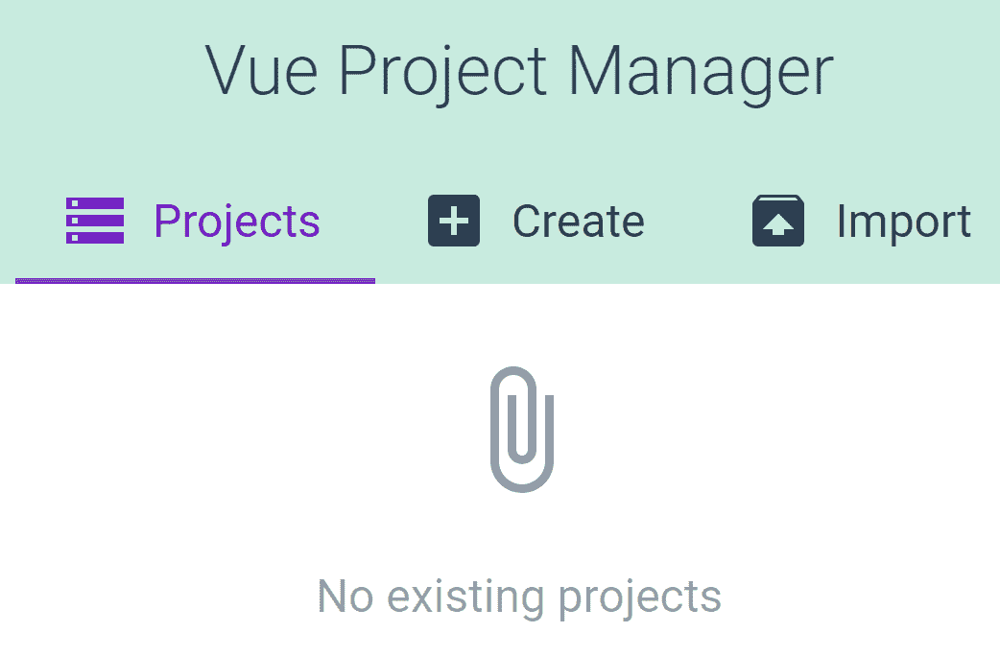

# 介绍 Vue CLI 3

本书向您介绍了**Vue CLI 3**，并回答了一些问题，如如何使用它、为什么使用它、最佳实践以及您将从中获得什么。

在本章中，我们将了解如何在系统上设置 Vue CLI 3。我们将首先检查 Vue CLI 3 是否已经可用，如果需要新安装或以前版本的更新，我们将看到要采取的确切步骤。

然后，我们将了解如何安装**节点版本管理器**（**NVM**），以及为什么这是比简单安装节点更好的选择。我们将看到在 VS 代码中使用 Vue CLI 3 有多么容易，以及如何使用命令行集成所有这些工具。

我们还将讨论为什么 Vue CLI 3 非常适合使用和使用，我们将在实践中看到这一点，通过从命令行和使用内置的 Vue CLI 3 UI 功能运行默认的 Vue CLI 3 应用程序。

本章将介绍的主题包括：

*   在系统上设置 Vue CLI 3
*   安装 Vue CLI 3
*   安装 VS 代码
*   在没有配置的情况下使用 Vue CLI
*   使用 Vue CLI 3 的好处
*   使用默认工具链避免 JavaScript 疲劳

我们将从设置 Vue CLI 3 开始本章。

# 技术要求

我们只需要一些技术要求；详情如下:

*   Windows 安装（Windows 7 或更高版本）
*   安装 NVM for Windows（安装的具体步骤在本章中介绍）
*   VS 代码的安装（代码编辑器）

让我们开始在系统上设置 Vue CLI 3。

# 在我们的系统上设置 Vue CLI 3

使用 Vue CLI 3 的一种常见方法是通过名为**命令行界面**（**CLI**的命令行应用程序），在这里我们运行 Vue CLI 3 命令。另一个先决条件是在我们的机器上安装 Node.js。

如果你正在一台共享计算机上工作，比如说，在你的开发团队中，很可能你已经具备了所有的先决条件。在这种情况下，您可以通过运行两个检查来验证是否可以立即开始使用 Vue CLI 3。

# Vue CLI 3 是否已可用？

要快速检查是否可以立即运行 Vue CLI 3 并跳过所有安装步骤，请在命令行应用程序中运行以下命令：

```js
node --version
```

另外，使用以下命令检查 Vue CLI 3：

```js
vue -V
```

如果您获得了高于 8.9（理想情况下，高于 8.11.0）的 Node 的任何版本，那么就可以开始了。显然，对于 Vue CLI，您需要 3.0.0 以上的任何版本。

此外，如果您的 Vue CLI 版本低于 V3，或者希望更新到最新的 Vue CLI，如 3.3.0，只需运行以下命令：

```js
npm install @vue/cli
```

如果没有安装 Node.js 或 Vue CLI，该怎么办

我们将对节点使用`nvm`或`nvm-windows`，然后安装 Vue CLI 3。

# 使用节点版本管理器安装 Node.js

我们应该使用的 Node.js 的推荐版本是什么？此信息可通过以下链接获得：[https://cli.vuejs.org/guide/installation.html](https://cli.vuejs.org/guide/installation.html) 。

目前，从 2019 年初开始，要使用 Vue CLI 获得最佳效果，所需的 Node 最低版本为 8.11.0+，但如果确实需要，您可以使用 8.9。

这给我们带来了另一个重要的决定：安装 NVM

# 为什么要安装 NVM？

虽然在您的系统上运行 Vue CLI 3 并非绝对需要安装 NVM，但出于以下几个原因，安装 NVM 是可取的

首先，您永远不知道 Node 何时会获得建议的安全修复更新，这通常意味着您最好在计算机上安装更新。

其次，如果需要运行 Vue 以外的其他技术，则此其他技术可能还需要不同版本的 Node。要在系统上的这些必需节点安装之间轻松切换，只需安装 NVM 即可。

# 在 Windows 上安装 NVM

您可以从以下地址下载 NVM for Windows：

```js
https://github.com/coreybutler/nvm-windows/releases
```

找到`nvm-setup.zip`文件，从中下载并提取`nvm-setup.exe`，然后按照以下安装步骤进行安装：

1.  按 Windows+*R*打开运行提示。在提示符中键入`cmd`。
2.  在提示内按*Ctrl*+*Shift*+*Enter*。这将以管理员权限运行命令提示符，这是下一步所必需的。
3.  访问[https://nodejs.org](https://nodejs.org) ，并查看当前**长期支持**（**LTS**版本号。例如，目前在 64 位 Windows 上，LTS 版本为 10.15.1。
4.  要安装它，请以管理员权限在命令提示符下运行以下命令：

```js
nvm install 10.15.1
```

5.  命令提示符将注销以下消息：

```js
Downloading node.js version 10.15.1 (64-bit) ...
```

6.  下载完成后，我们可以使用 Node 的下载版本。我们使用以下命令执行此操作：

```js
nvm use 10.15.1
```

7.  最后，您可以通过运行以下命令来验证安装是否成功：

```js
node --version
```

8.  如果您对节点安装附带的`npm`版本感到好奇，只需运行以下命令：

```js
npm --version
```

接下来，我们将安装 Vue CLI 3。

# 安装 Vue CLI 3

我们可以使用`npm`或`yarn`安装 Vue CLI 3。由于`npm`与 Node.js 安装捆绑在一起，我们将使用`npm`：

```js
npm install -g @vue/cli --loglevel verbose
```

前面的命令全局安装 Vue CLI 3。这就是`-g`旗的作用。我们在 Vue CLI 3 中使用了`@vue/cli`语法，`--loglevel verbose`将注销安装的详细信息，这非常有用，尤其是在连接速度较慢和机器速度较慢的情况下，有时我们可能会开始怀疑控制台是否冻结。有了`--loglevel verbose`，就更清晰了，这总是好的。

完成后，让我们通过运行以下命令仔细检查安装的 Vue CLI 版本：

```js
vue --version
```

以下是您应该在控制台中尝试的一些其他有用命令：

```js
vue -h
```

注意，`vue -h`是`vue --help`的别名。我使用前者，因为它更容易打字。

另外，请注意，您可以在每个单独的`vue`命令上运行`-h`标志，例如：

```js
vue create -h
vue add -h
vue invoke -h
vue inspect -h
vue serve -h
vue build -h
vue ui -h
vue init -h
vue config -h
vue upgrade -h
vue info -h
```

运行前面的任何一行都将返回特定命令的使用说明、它的功能描述以及附加到每个命令的选项（标志）。显然，`-h`标志是一种探索 Vue CLI 功能的好方法，如果需要，还可以动态刷新内存。

接下来，我们将安装我们选择的代码编辑器 VS code。

# 安装 VS 代码

要安装 VS 代码，只需导航到[https://code.visualstudio.com](https://code.visualstudio.com) ，然后下载适合您的操作系统的相应版本。

If you're not sure whether you're using a 32-bit or a 64-bit computer, you can quickly check that on Windows by running the following command in Command Prompt (with admin rights):

`wmic os get osarchitecture`

The output will be `OSArchitecture`, and on the next line, either `32-bit` or `64-bit`.

下载 VS 代码后，只需运行下载的安装文件并按照安装说明进行安装

安装 VS 代码后，您将通过命令行`code`获得一个附加命令。

`code`命令非常有用，我们将在下一节中看到。

# 在没有配置的情况下使用 Vue CLI

在本节中，我们将看到开始使用 Vue CLI 的最快和最简单的方法。它不包括任何配置！在不进行配置的情况下使用 Vue CLI 的原因是，在运行包含配置步骤的项目时（这是使用 Vue CLI 构建应用程序的默认方法），无需回答 Vue CLI 通常会询问的有关项目配置的提示即可运行一些快速实验。

首先，按住*Shift*键，右键单击桌面上的空白区域。从弹出的上下文菜单中，单击此处的“打开命令窗口”命令

打开后，键入以下命令：

```js
mkdir noConfig
```

这将创建一个名为`noConfig`的新目录。接下来，让我们使用`cd`命令切换到该目录：

```js
cd noConfig
```

最后，使用以下命令从命令提示符启动 VS 代码：

```js
code .
```

前面命令中的点表示在当前文件夹中打开 VS 代码。请随时关闭“欢迎”选项卡。

接下来，使用*Alt*+*F*键盘快捷键打开文件菜单，按*N*键打开全新文件。

在新文件（该文件在显示为`Untitled-1`的选项卡中打开）中，键入以下代码：

```js
<template>
  <h1>What's up, Vue CLI 3?</h1>
  <hr>
</template>
```

接下来，按*Ctrl*+*S*键盘快捷键，将文件保存为`App.vue`。

VS 代码将保存该文件。它将提供一个新图标，Vue 徽标图标，一个视觉提示，表明您刚才保存的文件确实是一个 Vue 文件。

VS 代码还可能提示您安装扩展名`Vetur`，并显示以下提示：

```js
The 'Vetur' extension is recommended for this file type.
```

单击弹出窗口底部的 install 按钮，继续安装扩展。

Note that installing the `Vetur` extension has nothing to do with using the Vue CLI 3 with no configuration, but it has to do with us being more productive in VS Code when working with Vue.

现在我们可以通过运行`vue serve`为我们的 Vue 应用程序提供服务。但是，在我们实际运行命令之前，让我们使用`-h`标志来查看可用的内容：

```js
vue serve -h
```

这就是我们将得到的回报：

```js
Usage: serve [options] [entry]

serve a .js or .vue file in development mode with zero config

Options:
 -o, --open Open browser
 -c, --copy Copy local url to clipboard
 -h, --help Output usage information
```

现在，我们知道了预期结果，让我们使用以下命令为我们的 Vue 应用程序提供服务：

```js
vue serve -o -c
```

因此，正如我们前面提到的，此命令将服务于我们的 Vue 应用程序，并在浏览器中打开它。它还会将提供的 URL 复制到剪贴板。例如，这允许我们打开一个不同的非默认浏览器，并轻松粘贴到浏览器地址栏中的 URL 中，这样我们也可以在那里预览我们的应用程序。

然而，我们会遇到一个小绊脚石

我们将在命令中获得此通知，而不是提供 Vue 应用程序：

```js
Command vue serve requires a global addon to be installed.
Please run npm install -g @vue/cli-service-global and try again.
```

这是一个容易解决的问题。更好的是，我们将使用`--loglevel verbose`扩展前面的命令：

```js
npm install -g @vue/cli-service-global --loglevel verbose
```

一段时间后，根据您的下载速度，您将收到`npm info ok`消息

这意味着您现在可以再次运行`vue serve`命令：

```js
vue serve -o -c
```

这次成功了！有点

现在我们得到一个错误，读作`Failed to compile with 1 errors`。然后，再往下看，我们看到了根本原因：

```js
Component template should contain exactly one root element.
```

有几种方法可以解决这个问题，但它基本上说的是，我们可以将`h1`和`hr`标记包装在一个`div`标记中，我们就可以开始了。那么，让我们将 VS 代码中的`App.vue`文件更新为：

```js
<template>
  <div>
    <h1>What's up, Vue CLI 3?</h1>
    <hr>
  </div>
</template>
```

确保保存更改，现在，最后，让我们再次提供：

```js
vue serve -o -c
```

你可能会有点惊讶，因为在默认浏览器中，会打开一个新选项卡，自动加载应用程序

假设您的默认浏览器是 Chrome。让我们打开另一个浏览器（例如 Firefox），在管理栏内单击，然后按*Ctrl*+*V*快捷键粘贴到剪贴板的内容中。当然，它将是`http://localhost:8080/`。

我们在浏览器中打开应用程序并借助`-o`和`-c`标志复制其 URL 的这些重复任务的轻松程度只是冰山一角。Vue CLI 3 还有很多功能，可以帮助我们更快、更轻松地编写应用程序。

例如，让我们回到代码，用`hr`标记删除行，然后保存文件。查看您的浏览器选项卡，即打开 Vue 应用程序的选项卡。它将自动刷新，反映代码中的更改。这就是正在运行的 webpack，它在 Vue CLI 3 的保护下运行，监视 Vue 文件的更改，并相应地在浏览器中重新加载应用程序。

如果您已经编写了几年以上的代码，您将欣赏此工作流的轻松性。在过去，我们要么设置工具，让它们在保存文件时自动刷新浏览器中的应用程序，要么设置 IDE 或代码编辑器，或者两者兼而有之。甚至直到最近，我们仍然需要修改 webpack 来自动化这种工作流，而这就像任何与编码相关的工作一样，有时并不像我们希望的那样顺利。

使用 Vue CLI 3，这一切都是自动化的，而且非常简单。

让我们看看 Vue CLI 3 帮助我们更好地编写代码和提高工作效率的其他一些方法。

# 使用 Vue CLI 3 的好处

Vue CLI 3 发布时，Vue 制造商 Evan You 列出了以下目标：

*   通过简化设置，避免前端开发的工具链疲劳
*   遵循工具中的最佳实践
*   使这些最佳做法成为 Vue 应用程序中的默认做法

除了这些伟大的目标之外，Vue CLI 还附带了许多更新，例如：

*   预设网页包配置
*   ES2017 和巴别塔 7 支持开箱即用
*   优秀的 CSS 支持，包括**Sassy CSS**（**SCSS**）和**PostCSS**支持
*   许多集成选项（TypeScript、PWA、web 组件、端到端测试、Jest 等）

这是很多功能。这本书的目的是通过所有的选项，让你熟悉他们的内部运作。

现在，为了结束本章，让我们看看使用默认选项设置默认应用程序有多容易。

# 默认工具链，疲劳等级为零

在本节中，我们将创建一个默认的 Vue 样板应用程序。与上一节相反，在本节中，我们将正确地构建整个应用程序。我们将使用两种方法：命令行上的 Vue CLI 3 和带有 GUI 的 Vue CLI 3。

您可能会问，为什么我们在没有配置的情况下运行 Vue CLI 3？答案是，它对于快速实验和开始使用一些基本命令可能很有用。

# 通过命令行执行 Vue CLI 3 默认应用程序

我们使用`vue create`命令创建 Vue CLI 3 应用程序。让我们看看我们有哪些选择：

```js
vue create -h
```

这是将返回的内容：

```js
Usage: create [options] <app-name>

create a new project powered by vue-cli-service

Options:
-p, --preset <presetName> Skip prompts and use saved or remote preset
-d, --default Skip prompts and use default preset
-i, --inlinePreset <json> Skip prompts and use inline JSON string as preset
-m, --packageManager <command> Use specified npm client when installing dependencies
-r, --registry <rul> Use specified npm registry when installing dependencies (only for npm)
-g, --git [message] Force git initialization with initial commit message
-n, --no-git Skip git initialization
-f, --force Overwrite target directory if it exists
-c, --clone Use git clone when fetching remote preset
-x, --proxy Use specified proxy when creating project
-b, --bare Scaffold project without beginner instructions
-h, --help output usage information
```

让我们首先跳过所有提示并使用默认选项：

```js
vue create -d first-default-app
```

您的控制台将显示以下输出：

```js
Vue CLI v3.3.0
? Creating project in C:\...
? Initializing git repository...
? Installing CLI plugins. This might take a while...
```

事实上，这确实需要一段时间。幸运的是，有一个视觉提示，一个进度条，让我们知道我们在设置项目方面走了多远。

准备好后，我们只需运行以下操作：

```js
cd first-default-app
```

一旦我们的控制台指向正确的目录，我们就可以通过以下方式运行应用程序：

```js
npm run serve
```

现在我们可以在浏览器中查看默认应用程序：


正如我们所看到的，我们有一条欢迎消息，然后页面列出了已安装的 CLI 插件。显然，babel 和 eslint 插件是默认的。每个链接都指向 GitHub 上`vue-cli`存储库中各自的部分。

接下来，我们看到一些基本链接和一些了解`Vue.js`更大生态系统的链接（即指向`vue-router`、`vuex`、`vue-devtools`、`vue-loader`和`awesome-vue`的链接）。

# 通过 UI 的 Vue CLI 3 默认应用程序

要开始使用 Vue CLI GUI，首先让我们使用*Ctrl*+*C*快捷键停止上一节中运行的服务器。控制台将响应以下消息：

```js
Terminate batch job (Y/N)?
```

键入`Y`（大写不相关）并按*回车*键。

这将使我们恢复对当前控制台窗口的控制，并允许我们键入新命令。

让我们首先从控制台中的当前目录升级一级：

```js
cd ..
```

接下来，让我们运行以下命令：

```js
vue ui -h
```

我们将得到以下输出：

```js
Usage: ui [options]

start and open the vue-cli ui

Options:
-H, --host <host> Host used for the UI server (default: localhost)
-p, --port <port> Port used for the UI server (by default search for available port)
-D, --dev Run in dev mode
--quiet Don't output starting messages
--headless Don't open browser on start and output port
-h, --help output usage information
```

这一次，我们将在不带任何标志的情况下运行命令：

```js
vue ui
```

我们将在控制台中看到以下输出：

```js
? Starting GUI...
? Ready on http://localhost:8000
```

这一次，我们可以可视化地创建一个项目。最初，我们看到当前文件夹中没有 Vue 项目：



让我们通过单击“创建”选项卡来创建一个。

将打开一个新窗口，其中有一个大按钮，上面写着“在此处创建新项目”：


正如我们在前面的屏幕截图中所看到的，我们还可以使用许多其他按钮和选项。我们将在接下来的章节中研究这些问题；此时，我们正在熟悉我们正在使用的工具：


正如我们从上一个屏幕截图中看到的，页面底部的“下一步”按钮当前处于禁用状态。要启用它，只需在最上面的输入中键入项目文件夹名称。我们将调用我们的文件夹`second-vue-project`。现在点击下一步。

在下一个窗口中，可以选择预设。让我们将其设置为默认预设：


选择预设将使“创建项目”按钮可单击。您将在屏幕中央看到加载器图标，并显示以下消息：

```js
Installing Vue CLI plugins. This might take a while...
```

随着安装的进行，您将看到一些其他消息。最后，完成后，您将看到以下窗口：


我们的项目现在已经准备就绪，我们将在下一章中进行。

# 总结

在本章中，我们介绍了如何通过使用命令行和 Vue CLI UI 开始使用 Vue CLI 3。

我们已经了解了如何安装所有先决条件，并了解了建议的工作流和一些简单入门的基本指针。了解了如何在命令行和 UI 中使用 Vue CLI 后，我们现在可以毫不费力地初始化 Vue 应用程序。我们知道在开始一个新项目时我们可以选择什么。但是，我们还需要了解 Vue CLI 的内部工作原理。

在下一章中，我们将着眼于 webpack（Vue CLI 3 的核心模块绑定器），进一步改进我们的工作流程。