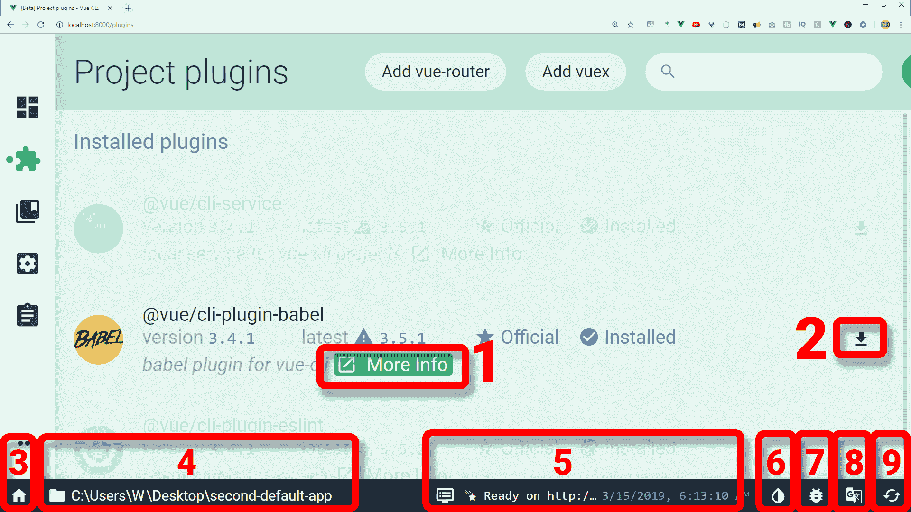
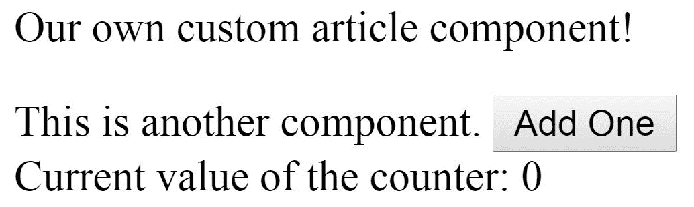

# 三、Vue CLI 3 中的 Babel

在本章中，我们将与 Babel 合作，将**JavaScript**（**JS**）的新功能引入浏览器，然后通过将其转换到较旧版本的 JS 来理解它们。我们将讨论以下内容：

*   理解巴别塔
*   使用 ES5 和 ES6 运行 Web 包
*   更新我们的网页配置以使用 Babel
*   Vue、Babel 和 JSX
*   手动添加 Babel 插件

让我们先看看 Babel 解决了什么问题。

# 理解巴别塔

正如我们在前几章中已经看到的，一旦使用 Vue CLI 构建了默认的 Vue 应用，就可以使用`npm run serve`为其提供服务

您的应用通常在`localhost:8080`提供。查看带有默认内容的服务页面，您会注意到在已安装的 CLI 插件标题下列出了两个插件：`babel`和`eslint`。

为什么这两个插件会预装在默认应用中？显然，Vue 框架的团队正在努力遵循最佳实践并跟上构建 web 应用的现代方法。使用巴别塔是这些最佳实践之一。

如果您访问 Babel 网站，您将看到以下定义：

"Babel is a toolchain that is mainly used to convert ECMAScript 2015+ code into a backwards compatible version of JS in current and older browsers or environments."

那么，我们如何使用 Vue CLI Babel 插件呢？要获得更多信息，最简单的方法是什么？

由于我们已经使用 Vue CLI 创建了默认的 Vue 应用，而且我们还了解了 Vue CLI 的 UI，因此我们只需打开 Git Bash 并启动 Vue CLI UI，就可以轻松访问官方文档：

```js
vue ui
```

正如我们在[第 1 章](1.html)*中介绍的 Vue CLI 3*中所看到的，此命令将使 webpack 在浏览器中为我们最新项目的仪表板提供服务。在那里，我们可以单击插件图标，如以下屏幕截图所示：


单击“已安装插件”链接后，您将看到以下屏幕：



此应用列出了三个已安装的默认插件：*@vue/cli 服务*、*@vue/cli 插件 babel*和*@vue/cli 插件 eslint*。为了便于理解，其他插件已灰显，并在屏幕截图中添加了编号框：

1.  更多信息链接到`cli-plugin-babel`的 GitHub 存储库
2.  更新`@vue/cli-plugin-babel`
3.  带有主页图标的按钮是指向 Vue UI 项目管理器的链接，其中列出了所有可用项目
4.  UI 的此部分显示当前 Vue 项目在操作系统中的位置
5.  单击此处可以打开和关闭 Vue UI 的日志
6.  如前所述，这允许您在 Vue UI 的两种颜色变体之间切换
7.  报告错误图标将带您进入 Vue CLI 错误报告网页
8.  如果您对翻译 UI 感兴趣，此按钮将链接到 UI 本地化页面
9.  此图标仅刷新插件的 API

如果您需要使用流行的**vuex**或**vue 路由**插件，只需点击插件页面顶部的相应按钮即可安装。

The search input to the right of the Add vuex and Add vue-router buttons lets you filter the installed plugins, and the Add plugin button takes you to the `localhost:8000/plugins/add` screen, where you can choose from a number of plugins, such as `@vue/cli-plugin-unit-jest`, `@vue/cli-plugin-typescript`, `@vue/cli-plugin-pwa`, and so on. There is a huge selection of plugins here, and we'll look into it in more detail in later chapters.

在下一节中，我们将讨论`cli-plugin-babel`的所有特性。

# @vue/cli 插件 babel 的构建块

`@vue/cli-plugin-babel`有几个部件是开箱即用的。这些是巴别塔 7、巴别塔装载机和`@vue/cli-plugin-babel`。

# @vue/cli 插件 Babel 中的 Babel 7

这是 Babel 解决的问题。

假设您正在开发 web 应用的前端，并且正在使用 JS 语言中更现代的 ES6+语法。一旦你的应用完成并发布到野外，你的一些用户就会在 Internet Explorer 上运行你的 web 应用。与您的 web 应用的其他用户在运行您的应用时获得流畅的体验不同，Internet Explorer 用户将获得语法错误。

Babel 是解决这类问题的答案。它***为游戏场地*铺平了道路：它允许开发者将他们的 JS 浏览器兼容性问题外包给 Babel。他们不必担心，也不必迎合较旧的浏览器，只需使用该语言的最新功能编写 JS 代码，甚至在任何浏览器中完全可用之前。然后，Babel 负责将此代码转换为较旧的 JS 方言，即较旧的浏览器可以使用的方言。**

 **`@vue/cli-plugin-babel`在巴别塔 7 上运行，巴别塔 7 于 2018 年 8 月 27 日发布。巴别塔 6 和巴别塔 7 之间有三年的差异，这次迭代带来了大量的改进。支持这种最新更新的 Vue CLI 是其团队致力于尽可能跟上时代的另一个证明。

# babel loader 在@vue/cli 插件 babel 中的作用

正如我们在上一章中所看到的，Vue CLI 在 webpack 4 上运行

为了能够使用巴别塔 7，`@vue/cli-plugin-babel`使用巴别塔加载器，可在此处获得：[https://github.com/babel/babel-loader](https://github.com/babel/babel-loader) 。

如前一章所述，使用 webpack Loader，我们可以预处理和绑定一堆不同的资源，不仅仅是普通的 JS，实际上还可以绑定任何其他静态资源。

具体来说，babel loader 接受 ES6+JS，并将其转换为 ES5JS。此过程通常称为**传输**。因此，巴别塔加载器在`@vue/cli-plugin-babel`中的作用是**将**我们的 ES6+代码传输到 ES5。

# @vue/babel 预设应用的角色

`@vue/cli-plugin-babel`还有更多。它包括`@vue/babel-preset-app`，其唯一用途是用于通过 Vue CLI 生成的项目。不必详细介绍`@vue/babel-preset-app`的工作原理，我们可以列出其主要功能：

*   它使用`browserslist`查看您的浏览器目标
*   自动应用所需的变换和多边形填充（借助`@babel/preset-env`实现）
*   它增加了对 Vue JSX 的支持
*   它防止在生成期间在所有文件中使用内联帮助程序

除了前面列出的特性外，`@vue/cli-plugin-babel`还有其他功能，我们将在下一节讨论它们。

# @vue/cli 插件 babel 的其他功能

除了上一节列出的默认设置外，`@vue/cli-plugin-babel`还可以扩展。我们可以使用`babel.config.js`添加其他 Babel 预设和插件。

它使用两个 Web 包加载器来执行另外两个主要任务：缓存（借助于缓存加载器）和利用多核处理器（借助于线程加载器）。这被称为**并行化**。

在下一节中，类似于我们在 Vue CLI 3 中的[第 2 章](2.html)中的*网页中所做的，我们将在 Vue 中完成在不使用 CLI 的情况下设置 Babel 的过程。之后，我们将了解 CLI 如何使事情变得更简单，以及如何进一步扩展它。*

# 在 Vue 2 中使用 Babel 和 webpack 而不使用 Vue CLI

让我们把我们的新项目称为`npm-vue-babel-webpack`。我们将打开 Git Bash，为该项目添加文件夹，并将`cd`放入其中：

```js
mkdir npm-vue-babel-webpack && cd $_
```

我们将初始化 NPM 并接受所有默认值：

```js
npm init -y
```

在 Vue CLI 3 中的[第 2 章](2.html)中的*Webpack 中，我们逐一安装了 NPM 包，解释了每个包的功能，并修复了所有错误。这让我们彻底了解了 webpack 的构建块，以及 Vue 和 webpack 是如何结合在一起的。为了避免不必要的重复，这次我们将立即安装所有内容。*

# 安装必要的 NPM 包

安装必要的 NPM 软件包：

```js
npm install vue webpack webpack-cli html-webpack-plugin vue-loader vue-template-compiler --save-dev --verbose
```

现在将`src`和`dist`文件夹添加到我们的项目中，并在 VS 代码中打开我们的项目：

```js
mkdir dist src && code .
```

请随意检查 VS 代码中的`package.json`内容，以确认所有 NPM 软件包确实已安装。

让我们在`src`文件夹中创建三个新文件，具体为`main.js`、`App.vue`和`index.html`，与我们在 Vue CLI 3 中的[第 2 章](2.html)、*Webpack 中所做的几乎相同。*

以下是要添加到`index.html`的代码：

```js
<!DOCTYPE html>
<html lang="en">
<head>
   <meta charset="utf-8">
    <title>Compiled HTML file</title>
</head>
<body>
    <div id="entryPoint"></div>
</body>
</html>
```

以下是`main.js`的内容：

```js
import Vue from 'vue';
import App from './App.vue';

new Vue({
    el: '#entryPoint',
    render: h => h(App),
})
```

最后，这里是`App.vue`的内容：

```js
<template>
  <div id="entryPoint">
      <article>
        Our own custom article component!
      </article>
      <AnotherComponent />
  </div>
</template>

<script>
import AnotherComponent from './components/AnotherComponent.vue';

export default {
    name: 'entryPoint',
    components: {
        AnotherComponent
    }
}
</script>
```

请注意，在前面的`script`标记中，我们正在从`components`文件夹导入`AnotherComponent`。

那么，让我们在项目的`src`文件夹中添加一个`components`文件夹。在`components`文件夹中，我们将添加一个新文件并将其命名为`AnotherComponent.vue`。

接下来，将此代码添加到`AnotherComponent.vue`：

```js
<template>
  <p>
    This is another component.
    <button v-on:click="alertTime">What's the time?</button>
  </p>
</template>

<script>
export default {
  name: "AnotherComponent",
  data() {
    return {
    }
  },
  methods: {
    alertTime: function() {
      alert(new Date());
    }
  }
};
</script>

<!-- Add "scoped" attribute to limit CSS to this component only -->
<style scoped>
</style>
```

在前面的代码中，我们终于看到了一个示例，其中我们的组件具有一些基本的 JS 支持的 Vue 功能。我们正在使用 Vue 的内置`data`和`methods`选项。在`methods`选项中，我们定义了`alertTime`函数，无论何时调用它，它都会在警报框中显示当前时间。

Discussing the details of how all these moving parts work is outside of the scope of this book. The focus of this chapter is understanding Babel. If you need more information on the basic concepts of Vue such as the ones mentioned in the previous paragraphs, refer to one of many useful resources in the Packt library. A great companion to this book would be a quick introduction to the Vue 2 framework: *Vue.js Quick Start Guide* by *Ajdin Imsirovic* ([https://prod.packtpub.com/in/application-development/vuejs-quick-start-guide](https://prod.packtpub.com/in/application-development/vuejs-quick-start-guide)).

此时我们需要重点关注的是在`methods`选项中使用 ES6+功能。目前，`methods`选项的代码是用 ES5JS 编写的，因此，在这段代码上运行 webpack 将很容易，我们很快就会看到。

# 使用 ES5 代码运行 webpack

要运行 webpack，请执行以下操作：

1.  将另一个文件添加到我们项目的根目录`webpack.config.js`，以便我们可以按如下方式设置我们的网页配置：

```js
let HtmlWebpackPlugin = require('html-webpack-plugin');
let VueLoaderPlugin = require('vue-loader/lib/plugin');

module.exports = {
    entry: './src/main.js',
    output: {
        filename: 'main.js',
    },
    module: {
        rules: [
            { test: /\.vue$/, use: 'vue-loader' }
        ]
    },
    plugins: [
        new HtmlWebpackPlugin({
            template: './src/index.html',
        }),
        new VueLoaderPlugin(), 
    ]
};
```

请注意，输入和输出文件都是`main.js`，因此我们不必指定它们，但我们在前面的代码中仍在这样做，以使事情更加明显。

2.  接下来，在`package.json`中更新`scripts`键：

```js
"scripts": {
    "webpack": "webpack"
 },
```

3.  现在，使用以下命令从 Git Bash 运行我们的项目：

```js
npm run webpack
```

4.  现在，在 VS 代码中，导航到我们项目中的`dist`文件夹。
5.  右键点击`index.html`，点击默认浏览器打开命令。

我们的浏览器现在将显示以下输出（放大以便于查看）：


如果一个用户点击了网页，现在是几点？按钮，网页上将出现一个警报框，显示当前时间。现在让我们将`methods`选项更新为 ES6 语法，看看会发生什么。

# 添加 Webpack 开发服务器

在我们开始将代码更新为 ES6 语法之前，我们还可以做一件事，使事情变得更快、更方便：

1.  添加`webpack-dev-server`。在这个 NPM 包的帮助下，我们的代码将被不断地提供服务，并被监视更改。让我们使用以下内容安装它：

```js
npm install webpack-dev-server --save-dev --verbose
```

2.  为了让 webpack dev server 运行并提供我们的代码，我们还需要将`package.json`条目的`scripts`更新为：

```js
"scripts": {
  "webpack": "webpack",
  "webpack-dev": "webpack-dev-server --mode development"
},
```

现在，我们可以在组件中添加各种功能，并在 VS 代码中保存代码时在浏览器中看到它们被热重新加载

3.  现在让我们通过运行以下命令来测试它：

```js
npm run webpack-dev
```

您可以测试`http://localhost:8080/`提供的 web 页面，您会注意到它仍然有效，就像以前一样。

接下来，我们将在`methods`选项中添加一些 ES6 语法。

# 将方法选项更新为 ES6 语法

让我们更新`AnotherComponent.vue`文件中的`methods`选项。以下是更新的代码：

```js
methods: {
    alertTime: () => {
      alert(new Date());
      alert('something else');
    }
}
```

单击代码中的更改可以节省时间吗？按钮，预期的警报将出现，然后是另一个读取其他内容的警报。通过这种方式，我们可以确保我们正在查看更新的应用。

现在让我们在`dist`文件夹中编译的`main.js`文件中找到 ES6 代码。

如果我们检查 dev 工具中的`/dist/index.html`文件，我们可以看到对`main.js`的引用，这是网页编译的 JS 代码。如果您右键单击`main.js`并单击上下文右键单击菜单上的“在新选项卡中打开”命令，您将在新选项卡中显示完整代码。要查找我们的 ES6 代码，让我们按*Ctrl*+*F*快捷键，以便输入我们的搜索词：`alertTime`。

在文件的最底部，我们可以看到 ES6 箭头函数：

```js
alertTime: () => {\r\n      alert('something else');
```

在下一节中，我们将使用 babel loader 更新我们的 webpack 配置，并查看 webpack 如何将前面的代码传输到 ES5。

# 将 babel loader 添加到我们的 Webpack 配置中

在开始之前，我们需要使用 Git Bash 中的*Ctrl*+*C*键盘组合停止我们的 webpack 开发服务器。

接下来，为了能够在我们的项目中传输 ES6+语法，我们需要用 Babel 更新我们的网页配置。让我们首先用 NPM 安装 babel loader 包：

```js
npm install babel-loader --save-dev --verbose
```

接下来，让我们再次对我们的项目运行 webpack：

```js
npm run webpack
```

不幸的是，这仍然不起作用。如果我们检查传输的`main.js`，我们仍然会看到`alertTime`键，它是 ES6 匿名函数的附带项。这意味着我们还需要另一个包：`babel core`。

```js
npm install @babel/core --save-dev --verbose
```

如果我们在此时运行 webpack，我们会发现我们的问题仍然没有得到解决。

这意味着我们仍然需要添加`babel-preset-env`：

```js
npm install @babel/preset-env --save-dev --verbose
```

在这一点上，验证我们的`package.json`是否在`devDependencies`中有所有预期的更新是没有坏处的：

```js
"devDependencies": {
  "@babel/core": "^7.3.4",
  "@babel/preset-env": "^7.3.4",
  "babel-loader": "^8.0.5",
  "html-webpack-plugin": "^3.2.0",
  "vue": "^2.6.9",
  "vue-loader": "^15.7.0",
  "vue-template-compiler": "^2.6.9",
  "webpack": "^4.29.6",
  "webpack-cli": "^3.2.3",
  "webpack-dev-server": "^3.2.1"
}
```

最后，在重新运行 webpack 之前，我们需要设置一个`babel.config.js`文件，即 Babel 自己的配置文件（类似于 webpack 的`webpack.config.js`。

让我们在项目的根目录中创建一个新文件`babel.config.js`，并添加以下代码：

```js
module.exports = {
  presets: ['@babel/preset-env']
}
```

我们现在需要做的就是更新我们的网页配置，以便它可以与 Babel 一起工作。

# 更新我们的网页配置以使用 babel

为了使我们的网页与 Babel 工作，我们需要向它解释何时使用 Babel 加载器。为此，我们在`webpack.config.js`的`module`选项中添加了一个要测试的规则，如下所示：

```js
module: {
    rules: [
        { test: /\.js$/, use: 'babel-loader' }, 
        { test: /\.vue$/, use: 'vue-loader' }
    ]
},
```

现在我们已经设置好了一切，我们可以再次在 Git Bash 中运行`npm run webpack-dev`命令。

这里有一个快速的方法来查看 webpack 是否与以前不同地捆绑了我们的 JS 文件：只需查看 Git Bash 中的 webpack 日志信息。在我们之前尝试将 Babel 连接到 webpack 时，包大小正好是 70.2kb。然而，在最后一次运行`webpack`NPM 脚本之后，`main.js`的包大小是 70.6KB。我们可以再次在开发工具中检查`./dist/main.js`文件。或者，您可以在 VS 代码的`./dist/main.js`中搜索`alertTime`字符串。

无论我们如何定位它，我们捆绑的`main.js`文件的`methods`条目如下所示：

```js
methods:{alertTime:function(){alert(new Date),alert("something else")}}}...
```

只要看一眼前面的代码，看到`function`关键字，就应该很明显这个代码是 ES5，这意味着 Babel 是通过 webpack 成功运行的，并且我们在`src`文件夹中的输入文件中的 ES6`alertTime`Vue 方法被成功传输到`dist`文件夹中的输出文件中。

为了验证我们的设置是否有效，我们可以再次运行我们的`webpack-dev-server`，当它运行时，对`AnotherComponent.vue`中的`methods`选项进行另一个小更改：

```js
methods: {
    alertTime: () => {
      alert(new Date());
      alert('whatever');
    }
}
```

如果您查看`localhost:8080`上提供的项目，您将看到它按预期工作，如果您从开发工具中打开`main.js`，您也将看到传输的语法。

在下一节中，我们将简要介绍一个常见的混淆源，以及在 Vue 中如何处理它。它与箭头函数语法和`this`关键字有关。

# Vue 中箭头函数中的此关键字存在问题

不幸的是，当 Babel 在 arrow 函数中传输`this`关键字时，它会将其传输到`_this`。这意味着我们的任何方法都将被破坏，我们的应用将无法工作。造成这种情况的根本原因是，箭头函数的作用域与 ES5 函数的作用域不同。

在下一节中，我们将介绍在 Vue 实例的 methods 选项中定义函数的推荐方法。

# 关键字问题的推荐解决方案

Vue 组件内部的`this`关键字的建议解决方案是不要使用箭头函数语法，因为由于范围问题，它不会产生预期的结果。具体来说，箭头函数的作用域是父上下文。

让我们看一个简单的应用作为问题的示例。

# 添加一个计数器应用

在我们开始之前，请确保您回到`VUE-CLI-3-QSG/Chapter03`文件夹中，这是本章中所有项目的根文件夹。

在我们开始构建应用之前，我们需要提醒自己使用`vue create`时的一些选项，所以让我们运行以下程序：

```js
vue create --help
```

在选项列表中，我们可以看到，`-d`代表`--default`标志，它跳过提示并使用默认预设，`-b`选项是`--bare`标志的简写，它在没有初学者指导的情况下构建了我们的项目。

有趣的是，我们可以将这些单独的标志组合起来，我们现在就要这样做。让我们通过运行以下命令开始我们的应用：

```js
vue create add-one-counter -db
```

正如我们所看到的，我们可以为`vue create`命令附加的标志链接字母别名，这是一个很好的生产力提升。

在生成的应用中，我们将更改`src`文件夹中`main.js`的内容。此文件将与上一个示例应用（上一节中的`npm-vue-b-w-es6-syntax`应用）中的文件完全相同，因此您可以将此文件从上一个 Vue 应用复制并粘贴到我们的新示例`add-one-counter`应用中。

如果你在 VS 代码中打开我们新的`add-one-counter`应用，你还会注意到另一个文件夹：`public`文件夹，里面有`index.html`。我们将保留此文件的原样。

回到`src`文件夹中，我们需要将`App.vue`的内容更改为：

```js
<template>
  <div id="app">
      <article>
        Our own custom article component!
      </article>
      <AnotherComponent />
  </div>
</template>

<script>
import AnotherComponent from './components/AnotherComponent.vue';

export default {
    name: 'app',
    components: {
        AnotherComponent
    }
}
</script>
```

最后，我们需要在项目的根目录中添加一个`components`文件夹，并在其中添加`AnotherComponent.vue`文件。以下是`AnotherComponent.vue`的内容：

```js
<template>
  <p>
    This is another component.
    <button v-on:click="incrementUp">Add One</button>
    <br>
    <span>Current value of the counter: {{ counter }}</span>
  </p>
</template>

<script>
export default {
  name: "AnotherComponent",
  data() {
    return {
      counter: 0
    }
  },
  methods: {
    incrementUp: function() {
      this.counter++;
    }
  }
};
</script>

<!-- Add "scoped" attribute to limit CSS to this component only -->
<style scoped>
</style>
```

在`methods`选项中，我们可以看到使用 ES6 语法定义的`incrementUp`函数。

如果您尝试运行此应用，它将无法运行。这种情况是这样的，因为 arrow 函数的作用域和 Babel 设置使得在`arrow`函数中使用`methods`正确设置 Vue 应用变得困难

唯一的改进，也是在方法选项中编写函数的常用方法，是避免使用箭头函数语法和`function`关键字，如下所示：

```js
methods: {
    incrementUp() {
        this.counter++;
    }
}
```

`incrementUp`函数称为**速记**函数。您可以通过以下 URL 了解更多信息：[https://developer.mozilla.org/en-US/docs/Web/JavaScript/Reference/Operators/Object_initializer#Method_definitions](https://developer.mozilla.org/en-US/docs/Web/JavaScript/Reference/Operators/Object_initializer#Method_definitions) 。

让我们通过从 UI 提供服务来试驾应用：

```js
vue ui
```

一旦 Vue UI 在浏览器中提供服务，让我们将浏览器的地址栏指向`http://localhost:8000/project/select`。接下来，点击`add-one-counter`文件夹，点击导入此文件夹按钮。

接下来，单击主菜单上的“任务”按钮。最后，单击服务图标。单击“输出”按钮查看应用构建和服务。

最后，在`http://localhost:8080/`打开网站。您将看到一个正在运行的应用：



前面的示例向我们展示了如何在 Vue 实例中命名和组织方法的最佳实践。此外，我们还了解了如何使用 Vue UI 在几次点击中自动构建 Webpack 并为我们的应用提供服务，这比我们在本章大部分时间所做的要好得多！这让我们得出一个结论：许多管道和功能都被抽象掉了，因此，在 VUEUI（包括 Babel 设置）的帮助下，这使得使用和访问变得更加容易。

# 总结

在本章中，我们简要概述了什么是 Babel，它做了什么，以及如何使它与 Vue 一起工作。所有这些都是在`vue-cli-service`的帮助下抽象出来的，它由引擎盖下的 webpack 提供动力。现在我们已经了解了所有这些不同部分是如何协同工作的，我们将开始仅使用 Vue CLI 及其 UI，并在下面的章节中学习如何更好地使用它。

我们将在 Jest 的帮助下了解 Vue CLI 中的测试。我们还将学习**测试驱动开发****TDD****以及借助 Vue CLI UI 运行测试。****